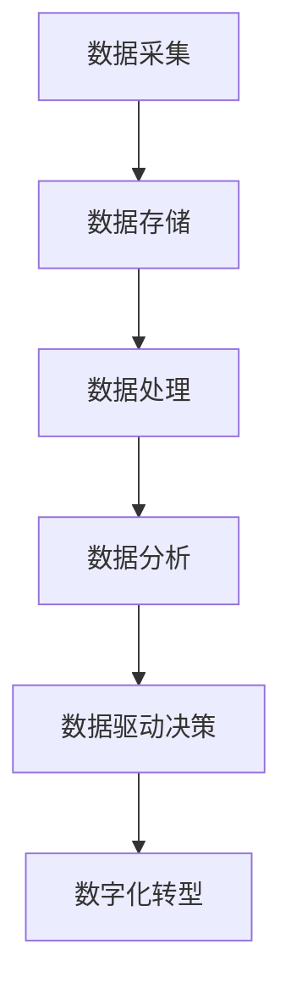
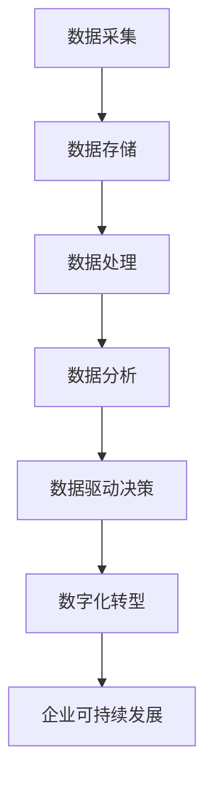

                 

# 文章标题

《数据驱动平台经济转型：如何实现数字化转型？》

> 关键词：数字化转型、数据驱动、平台经济、数据分析、决策支持、实践案例

> 摘要：随着全球数字化进程的加速，企业数字化转型已成为提升竞争力和实现可持续发展的关键路径。本文旨在探讨数据驱动平台经济转型的内在逻辑和实践方法，通过深入剖析数据驱动的核心概念与理论基础，系统阐述数据驱动平台的设计原则与架构，并提供企业数字化转型实践案例分析，旨在为企业提供一套全面、可操作的数字化转型指南。

### 《数据驱动平台经济转型：如何实现数字化转型？》目录大纲

## 第一部分：数据驱动平台经济转型概述

### 第1章：数字化转型的背景与趋势

#### 1.1 数字化转型的定义与内涵

#### 1.2 全球数字化转型现状分析

#### 1.3 企业数字化转型的重要性

#### 1.4 数字化转型的主要驱动因素

### 第2章：数据驱动的核心概念与理论基础

#### 2.1 数据驱动与数字化转型的关系

#### 2.2 数据的价值评估与挖掘

#### 2.3 数据分析的基本方法与技术

#### 2.4 数据治理与数据质量保障

## 第二部分：数据驱动平台构建

### 第3章：数据驱动平台的设计原则与架构

#### 3.1 数据驱动平台的整体设计原则

#### 3.2 数据驱动平台的关键架构组件

#### 3.3 数据驱动平台的技术选型与集成

#### 3.4 数据驱动平台的架构演进策略

### 第4章：数据采集与存储

#### 4.1 数据采集的方法与工具

#### 4.2 数据存储的选择与优化

#### 4.3 数据库设计与优化

#### 4.4 数据仓库与数据湖的概念与应用

### 第5章：数据处理与分析

#### 5.1 数据处理的基本流程

#### 5.2 数据清洗与数据转换

#### 5.3 数据分析的技术与方法

#### 5.4 数据可视化与交互分析

### 第6章：数据驱动的决策支持

#### 6.1 决策支持系统的设计与应用

#### 6.2 数据驱动的预测模型与方法

#### 6.3 数据驱动的优化算法与求解

#### 6.4 数据驱动的企业运营优化

## 第三部分：数字化转型实践案例

### 第7章：企业数字化转型实践案例分析

#### 7.1 案例一：制造企业的数字化转型之路

#### 7.2 案例二：零售行业的数字化转型实践

#### 7.3 案例三：金融行业的数字化转型创新

#### 7.4 案例四：公共服务领域的数字化转型

### 第8章：数字化转型中的挑战与应对策略

#### 8.1 数字化转型中的主要挑战

#### 8.2 挑战应对的策略与方法

#### 8.3 组织文化变革与人才发展

#### 8.4 数字化转型的可持续性与风险管理

## 附录

### 附录A：数字化转型相关工具与技术概览

#### A.1 常用数据采集工具

#### A.2 常用数据处理与分析工具

#### A.3 常用数据可视化工具

#### A.4 其他数字化转型相关工具与技术

### 附录B：数字化转型实践案例详细资料

#### B.1 案例一详细资料

#### B.2 案例二详细资料

#### B.3 案例三详细资料

#### B.4 案例四详细资料

## Mermaid 流程图



## 核心算法原理讲解

### 数据处理的基本流程

```plaintext
// 伪代码：数据处理的基本流程
1. 数据采集：从各种来源获取原始数据。
2. 数据清洗：去除无效或错误的数据，并进行格式转换。
3. 数据整合：将来自不同来源的数据进行整合。
4. 数据存储：将处理后的数据存储到数据库或数据仓库。
5. 数据分析：运用统计分析、机器学习等方法对数据进行深入分析。
6. 数据可视化：将分析结果以图表等形式展示出来，便于决策。
```

### 数学模型和数学公式

#### 线性回归模型

$$
y = \beta_0 + \beta_1 \cdot x + \epsilon
$$

- $y$: 因变量
- $\beta_0$: 截距
- $\beta_1$: 斜率
- $x$: 自变量
- $\epsilon$: 随机误差项

## 项目实战

### 代码实现：数据采集与处理

```python
# Python代码：数据采集与处理示例

import pandas as pd
from sklearn.model_selection import train_test_split

# 数据采集
data = pd.read_csv('data.csv')

# 数据清洗
data.dropna(inplace=True)

# 数据转换
X = data[['feature1', 'feature2']]
y = data['target']

# 数据分割
X_train, X_test, y_train, y_test = train_test_split(X, y, test_size=0.2, random_state=42)

# 数据存储
X_train.to_csv('train_data.csv', index=False)
X_test.to_csv('test_data.csv', index=False)
```

### 代码解读与分析

#### 数据采集与处理代码解读

- 数据采集：使用 `pandas` 库读取 CSV 文件，获取原始数据。
- 数据清洗：使用 `dropna()` 方法去除缺失值，保证数据质量。
- 数据转换：将特征数据与目标变量分离，准备进行后续分析。
- 数据分割：使用 `train_test_split()` 方法将数据分为训练集和测试集，用于模型训练和测试。
- 数据存储：将处理后的数据保存到 CSV 文件中，以便后续使用。

### 作者

作者：AI天才研究院/AI Genius Institute & 禅与计算机程序设计艺术 /Zen And The Art of Computer Programming

## 第1章：数字化转型的背景与趋势

### 1.1 数字化转型的定义与内涵

数字化转型，顾名思义，是指企业利用数字技术来驱动其商业模式、运营流程和组织结构的变革，从而实现更加高效、灵活和创新的业务模式。数字化转型不仅涉及技术的采纳和应用，还包含企业战略、文化、组织架构和管理方式的变革。

数字化转型的主要内涵包括以下几个方面：

1. **技术采纳与应用**：企业通过引入大数据、云计算、物联网、人工智能等新兴技术，提高生产效率、优化业务流程、提升客户体验。

2. **商业模式创新**：通过数字化手段，企业可以探索新的商业模式，如共享经济、平台经济、C2M（Consumer to Manufacturer）等。

3. **组织架构重构**：数字化转型要求企业重新审视和调整其组织架构，以适应快速变化的市场环境，如建立跨部门协作的敏捷团队。

4. **文化变革**：数字化转型不仅仅是技术的变革，更是企业文化的变革。企业需要培养员工的数字化思维和能力，推动企业向数字化文化转型。

5. **客户关系管理**：通过数字化手段，企业可以更好地了解客户需求，提供个性化服务，提升客户满意度。

### 1.2 全球数字化转型现状分析

全球范围内的数字化转型趋势明显，不同国家和地区的数字化转型程度和重点有所不同。以下是一些主要国家和地区的数字化转型现状分析：

1. **美国**：美国是数字化转型的先行者，尤其在金融科技、电子商务和人工智能等领域具有领先优势。美国企业普遍重视数字化转型，积极采用新兴技术，提升业务效率和创新能力。

2. **欧洲**：欧洲在数字化转型方面也取得了显著进展，尤其是在能源、制造业和公共服务等领域。欧洲各国政府纷纷出台相关政策，推动数字化转型，以提高企业竞争力和提升社会福祉。

3. **中国**：中国在数字化转型方面取得了惊人的成就。中国政府提出了“互联网+”战略，推动传统产业与互联网深度融合。中国企业在数字经济、物联网和大数据等领域快速发展，成为全球数字化转型的典范。

4. **其他国家和地区**：其他国家和地区如日本、韩国、印度等也在积极推进数字化转型，尽管发展程度有所不同，但都在努力通过数字化手段提升国家竞争力和经济发展。

### 1.3 企业数字化转型的重要性

企业数字化转型的重要性体现在以下几个方面：

1. **提升竞争力**：数字化转型可以帮助企业优化业务流程，提高生产效率，降低成本，从而在激烈的市场竞争中脱颖而出。

2. **创新商业模式**：通过数字化转型，企业可以探索新的商业模式，如共享经济、平台经济等，创造新的增长点。

3. **增强客户体验**：数字化技术可以帮助企业更好地了解客户需求，提供个性化服务，提升客户满意度和忠诚度。

4. **提高决策效率**：数字化转型可以为企业管理层提供实时、准确的数据支持，帮助企业做出更加明智的决策。

5. **提升企业价值**：通过数字化转型，企业可以提升品牌形象，增强市场影响力，从而提升企业价值。

### 1.4 数字化转型的主要驱动因素

数字化转型的主要驱动因素包括以下几个方面：

1. **技术进步**：大数据、云计算、物联网、人工智能等新兴技术的快速发展，为数字化转型提供了强大的技术支撑。

2. **市场需求**：客户对个性化、便捷化、智能化服务的需求不断提升，迫使企业加快数字化转型步伐。

3. **政策支持**：各国政府纷纷出台支持数字化转型的政策，为企业提供资金、技术、人才等多方面的支持。

4. **竞争压力**：竞争对手的数字化转型步伐加快，迫使企业不得不加快自身数字化转型，以保持竞争优势。

5. **企业战略**：企业高层领导对数字化转型的重要性的认识不断提升，将其作为企业发展战略的重要组成部分。

### 1.5 本章小结

本章对数字化转型的定义与内涵、全球数字化转型现状、企业数字化转型的重要性和主要驱动因素进行了深入分析。数字化转型已经成为全球企业提升竞争力、实现可持续发展的必经之路。在下一章中，我们将探讨数据驱动的核心概念与理论基础，为后续章节的数据驱动平台构建和数字化转型实践提供理论支撑。

### 第2章：数据驱动的核心概念与理论基础

### 2.1 数据驱动与数字化转型的关系

数据驱动是数字化转型的重要理论基础和实践方法。数据驱动，即通过数据的采集、存储、处理和分析，来驱动企业的决策和业务流程。数据驱动与数字化转型密切相关，二者相辅相成。

首先，数据驱动是数字化转型的基础。数字化转型依赖于大量的数据资源，这些数据来源于企业内部的生产、运营、管理等各个环节，以及外部的市场、客户、供应链等各个层面。数据驱动的理念使得企业能够充分挖掘和利用这些数据，为决策提供科学依据。

其次，数字化转型为数据驱动提供了广阔的应用场景。通过数字化转型，企业可以实现业务流程的数字化、网络化和智能化，从而为数据驱动的应用提供丰富的数据资源和场景支持。例如，智能制造、智慧物流、智慧医疗等领域的数字化转型，都离不开数据驱动的核心支持。

数据驱动与数字化转型的关系可以概括为以下几点：

1. 数据驱动是数字化转型的重要驱动力，推动企业实现数字化、网络化和智能化。

2. 数字化转型为数据驱动提供了应用场景和丰富的数据资源，使得数据驱动能够更好地发挥其价值。

3. 数据驱动和数字化转型相互促进，共同推动企业实现可持续发展和创新。

### 2.2 数据的价值评估与挖掘

数据的价值评估与挖掘是数据驱动平台经济转型的重要组成部分。数据的价值评估是指通过对数据的分析，确定数据的价值和潜在应用场景，从而为企业提供决策依据。数据的价值挖掘则是指通过对数据的深入分析，发现数据中的潜在规律和关联性，为企业提供创新性的解决方案。

数据的价值评估主要包括以下几个方面：

1. **数据质量评估**：评估数据的质量，包括数据的完整性、准确性、一致性和时效性。高质量的数据是数据驱动的基础，只有数据质量得到保障，才能充分发挥数据的价值。

2. **数据重要性评估**：评估数据的重要程度，确定哪些数据对于企业的决策和业务流程至关重要。例如，销售数据、客户数据、生产数据等都是企业核心数据。

3. **数据潜在价值评估**：分析数据中蕴含的潜在价值，如预测趋势、发现异常、优化决策等。数据挖掘技术可以帮助企业发现数据中的隐藏信息，为企业提供创新性的解决方案。

数据的价值挖掘主要包括以下几个方面：

1. **数据挖掘技术**：利用机器学习、数据挖掘算法等手段，对大量数据进行挖掘和分析，发现数据中的潜在规律和关联性。

2. **业务场景分析**：结合企业实际业务场景，分析数据如何应用于业务决策和流程优化。例如，通过分析销售数据，可以预测市场需求，优化库存管理；通过分析客户数据，可以提升客户体验，提高客户满意度。

3. **创新解决方案**：基于数据挖掘结果，提出创新性的解决方案，如新的产品和服务、优化业务流程、提升运营效率等。

### 2.3 数据分析的基本方法与技术

数据分析是数据驱动平台经济转型的关键环节。数据分析的基本方法和技术包括以下几种：

1. **描述性分析**：描述性分析是对数据进行基本的统计和可视化，以了解数据的分布、趋势和特征。描述性分析是数据分析的基础，为后续的深入分析提供参考。

2. **推断性分析**：推断性分析是基于样本数据，对总体数据进行推断。推断性分析包括假设检验、置信区间、回归分析等方法，可以帮助企业评估数据的可靠性和预测能力。

3. **预测性分析**：预测性分析是基于历史数据和现有数据模式，对未来数据进行预测。预测性分析包括时间序列分析、回归分析、机器学习等方法，可以帮助企业预测市场趋势、客户需求等。

4. **关联性分析**：关联性分析是发现数据之间的关联性和规律。关联性分析包括关联规则挖掘、聚类分析、因子分析等方法，可以帮助企业发现数据中的潜在关联，为业务决策提供支持。

5. **可视化分析**：可视化分析是将数据通过图表、图形等形式直观展示，帮助用户更好地理解和分析数据。可视化分析包括折线图、柱状图、饼图、热力图等方法，可以提高数据分析的可读性和易用性。

### 2.4 数据治理与数据质量保障

数据治理和数据质量保障是数据驱动平台经济转型的关键要素。数据治理是指对企业数据进行规范管理，确保数据的一致性、完整性和安全性。数据质量保障是指通过数据清洗、验证、监控等技术手段，确保数据的准确性和可靠性。

数据治理的主要内容包括：

1. **数据管理策略**：制定数据管理政策、标准和流程，确保企业数据管理的规范化和一致性。

2. **数据质量管理**：建立数据质量管理机制，包括数据质量评估、数据质量改进和持续监控。

3. **数据安全与隐私**：确保企业数据的安全性和隐私性，采取数据加密、访问控制、数据备份等技术手段，防范数据泄露和滥用。

数据质量保障的主要内容包括：

1. **数据清洗**：通过数据清洗技术，去除数据中的噪声、异常值和重复数据，提高数据质量。

2. **数据验证**：通过数据验证技术，验证数据的一致性、准确性和完整性，确保数据的有效性。

3. **数据监控**：建立数据监控机制，实时监测数据质量，及时发现和解决数据质量问题。

### 2.5 本章小结

本章深入探讨了数据驱动的核心概念与理论基础，包括数据驱动与数字化转型的关系、数据的价值评估与挖掘、数据分析的基本方法与技术、数据治理与数据质量保障。这些内容为数据驱动平台经济转型提供了坚实的理论基础和实践指导。在下一章中，我们将系统阐述数据驱动平台的设计原则与架构，为企业数字化转型提供技术方案。

### 第3章：数据驱动平台的设计原则与架构

#### 3.1 数据驱动平台的整体设计原则

数据驱动平台的设计原则是确保平台能够高效、可靠地支持企业的数字化转型。以下是几个关键设计原则：

1. **可扩展性**：数据驱动平台需要具备良好的可扩展性，以适应企业不断增长的数据需求和业务变化。平台应能够灵活扩展存储容量、计算资源和服务功能。

2. **高可用性**：为了保证数据驱动的业务连续性，平台设计应确保高可用性。这包括数据冗余、故障转移和备份恢复等机制，以防止数据丢失和业务中断。

3. **安全性**：数据的安全性和隐私保护至关重要。平台设计应考虑数据加密、权限管理、访问控制和安全审计等措施，以防范数据泄露和安全威胁。

4. **灵活性**：数据驱动平台应支持灵活的数据接入和处理方式，以满足不同业务场景的需求。平台应能够支持多种数据源接入、多种数据处理技术和算法应用。

5. **可维护性**：数据驱动平台的可维护性是确保其长期稳定运行的关键。平台设计应考虑模块化、标准化和自动化运维，以提高维护效率和降低维护成本。

6. **可持续性**：数据驱动平台的设计应考虑其可持续性，包括资源利用率、环境影响和长期发展。平台应采用节能环保的技术和策略，以实现绿色可持续发展。

#### 3.2 数据驱动平台的关键架构组件

数据驱动平台的核心架构组件包括数据采集、存储、处理、分析和应用等环节。以下是这些组件的详细描述：

1. **数据采集层**：数据采集层负责从各种数据源（如传感器、数据库、日志文件等）收集数据。数据采集层的关键组件包括数据采集代理、数据接入网关和数据采集工具。数据采集层需要保证数据的一致性、完整性和时效性。

2. **数据存储层**：数据存储层负责存储和管理采集到的数据。数据存储层的关键组件包括关系数据库、非关系数据库、数据仓库和数据湖。数据存储层需要支持海量数据的存储和快速查询。

3. **数据处理层**：数据处理层负责对数据进行清洗、转换、集成和归一化等处理。数据处理层的关键组件包括数据清洗工具、数据转换工具和数据处理引擎。数据处理层需要保证数据的质量和准确性。

4. **数据分析层**：数据分析层负责对处理后的数据进行分析和挖掘，以提取有价值的信息和洞察。数据分析层的关键组件包括统计分析工具、机器学习框架和数据挖掘算法。数据分析层需要支持多种分析方法和工具，以满足不同业务需求。

5. **数据应用层**：数据应用层负责将分析结果应用于业务决策和流程优化。数据应用层的关键组件包括数据可视化工具、预测模型、决策支持系统和业务应用接口。数据应用层需要提供直观、易用的数据展示和交互功能，以支持业务用户的使用。

#### 3.3 数据驱动平台的技术选型与集成

数据驱动平台的技术选型与集成是确保平台高效稳定运行的关键。以下是几个关键技术选型和集成策略：

1. **技术选型**：
   - **数据采集技术**：根据数据源的特点选择合适的采集技术，如HTTP接口、消息队列、文件存储等。
   - **数据存储技术**：根据数据类型和查询需求选择合适的存储技术，如关系数据库（MySQL、PostgreSQL）、NoSQL数据库（MongoDB、Cassandra）、数据仓库（Redshift、BigQuery）和数据湖（HDFS、Alluxio）。
   - **数据处理技术**：根据数据处理需求选择合适的技术，如ETL工具（Apache NiFi、Apache Kafka）、流处理框架（Apache Flink、Apache Storm）和批处理框架（Apache Spark、MapReduce）。
   - **数据分析技术**：根据分析需求选择合适的分析技术，如统计分析工具（R、Python）、机器学习框架（TensorFlow、PyTorch）和数据挖掘算法（Apriori、K-means）。
   - **数据可视化技术**：根据展示需求选择合适的数据可视化技术，如ECharts、D3.js和Tableau。

2. **集成策略**：
   - **数据集成**：通过ETL（Extract, Transform, Load）过程，将不同来源的数据集成到一个统一的数据存储中，实现数据的统一管理和访问。
   - **服务化集成**：通过构建服务化数据架构，将数据采集、存储、处理、分析和应用等组件以服务的形式集成在一起，实现数据驱动业务的灵活部署和扩展。
   - **API集成**：通过提供统一的API接口，实现不同系统之间的数据交换和功能调用，促进业务系统的集成和协同。

#### 3.4 数据驱动平台的架构演进策略

数据驱动平台的架构演进策略是确保平台能够适应企业长期发展的需要。以下是几个关键架构演进策略：

1. **微服务架构**：采用微服务架构，将平台拆分为多个独立的服务模块，每个服务模块负责特定的功能。微服务架构可以提高平台的灵活性和可维护性，便于功能扩展和迭代。

2. **容器化与自动化部署**：采用容器化技术（如Docker、Kubernetes），实现平台的自动化部署、运维和扩展。容器化与自动化部署可以提高平台的部署效率和稳定性。

3. **云计算与大数据技术**：利用云计算和大数据技术，实现平台的大规模数据存储和处理能力。云计算和大数据技术可以提供弹性伸缩、高可用性和高效的数据处理能力。

4. **数据治理与安全**：加强数据治理和安全体系建设，确保平台的数据质量和安全性。数据治理与安全包括数据质量管理、数据安全策略、数据备份和恢复等。

5. **持续集成与持续部署**：采用持续集成与持续部署（CI/CD）策略，实现平台的快速迭代和发布。CI/CD可以提高平台的开发效率和稳定性，降低发布风险。

### 3.5 本章小结

本章系统地阐述了数据驱动平台的设计原则与架构，包括整体设计原则、关键架构组件、技术选型与集成以及架构演进策略。数据驱动平台是企业数字化转型的核心支撑，通过合理的架构设计和灵活的技术应用，可以确保平台的高效运行和持续发展。在下一章中，我们将深入探讨数据采集与存储的方法和优化策略。

### 第4章：数据采集与存储

#### 4.1 数据采集的方法与工具

数据采集是数据驱动平台构建的第一步，也是关键的一步。正确、高效的数据采集是确保数据质量的基础。以下是一些常见的数据采集方法与工具：

1. **直接采集**：直接采集是指通过编写脚本或使用现成的数据采集工具，直接从数据源获取数据。这种方法适用于数据源提供API接口的情况。常用的工具包括爬虫（如Scrapy）、数据采集框架（如Apache Kafka）等。

2. **日志采集**：日志采集是指通过系统日志、网络日志等途径获取数据。这种方法适用于收集系统运行状态、用户行为等信息。常用的工具包括Logstash、Fluentd等。

3. **消息队列采集**：消息队列采集是指通过消息队列（如Kafka、RabbitMQ）将数据从数据源传输到数据采集系统。这种方法适用于高并发、高可靠性的数据采集场景。

4. **数据库采集**：数据库采集是指通过数据库连接，直接从数据库中提取数据。这种方法适用于需要实时获取数据库数据的情况。常用的工具包括数据库连接器（如JDBC、ODBC）等。

5. **物联网采集**：物联网采集是指通过物联网设备（如传感器、智能设备）获取数据。这种方法适用于物联网应用场景。常用的工具包括IoT平台（如AWS IoT、Azure IoT）等。

6. **文件采集**：文件采集是指通过读取文件系统中的文件获取数据。这种方法适用于数据以文件形式存储的场景。常用的工具包括文件监控工具（如lsof、inotify）等。

#### 4.2 数据存储的选择与优化

数据存储是数据驱动平台的核心组成部分，选择合适的数据存储方案对于平台性能、可扩展性和可靠性至关重要。以下是几种常见的数据存储选择及其优缺点：

1. **关系数据库**：关系数据库（如MySQL、PostgreSQL）适用于结构化数据的存储和查询。优点是易于使用、查询速度快、数据一致性高；缺点是扩展性较差、存储空间有限。

2. **非关系数据库**：非关系数据库（如MongoDB、Cassandra）适用于存储非结构化或半结构化数据。优点是灵活性强、扩展性好、支持海量数据存储；缺点是查询性能相对较低、数据一致性保障较弱。

3. **数据仓库**：数据仓库（如Redshift、BigQuery）适用于大规模数据的存储和复杂查询。优点是支持海量数据存储、快速查询、强大的数据分析功能；缺点是存储成本较高、扩展性有限。

4. **数据湖**：数据湖（如HDFS、Alluxio）适用于存储海量非结构化和半结构化数据。优点是存储成本低、扩展性好、支持多种数据处理和分析工具；缺点是查询性能相对较低、数据管理复杂。

在选择数据存储方案时，应考虑以下因素：

- **数据类型**：根据数据类型选择合适的存储方案，如结构化数据选择关系数据库，非结构化数据选择非关系数据库或数据湖。
- **数据量**：根据数据量选择合适的存储方案，如海量数据选择数据仓库或数据湖，小规模数据选择关系数据库或非关系数据库。
- **查询需求**：根据查询需求选择合适的存储方案，如复杂查询选择数据仓库，快速查询选择关系数据库。
- **性能需求**：根据性能需求选择合适的存储方案，如高并发查询选择分布式数据库，低延迟查询选择内存数据库。
- **成本考虑**：根据成本考虑选择合适的存储方案，如低成本选择数据湖，高性能选择数据仓库。

#### 4.3 数据库设计与优化

数据库设计是数据存储的关键环节，合理的数据库设计可以提高数据存储效率、查询性能和系统可靠性。以下是数据库设计的几个关键原则和优化策略：

1. **规范化设计**：遵循数据库规范化原则（如第一范式、第二范式、第三范式），确保数据的逻辑一致性和完整性。

2. **表结构优化**：优化表结构设计，减少数据冗余、提高数据访问效率。常用的优化策略包括：
   - **垂直拆分**：将大表拆分为多个小表，提高查询性能。
   - **水平拆分**：将数据按特定条件（如时间、地域等）拆分到不同的表中，提高数据存储和查询的扩展性。
   - **索引优化**：合理设计索引，提高查询性能。常用的索引类型包括主键索引、唯一索引、复合索引等。

3. **存储引擎选择**：根据应用场景选择合适的存储引擎，如InnoDB（事务支持）、MyISAM（查询性能）等。

4. **性能调优**：针对数据库性能问题进行调优，如：
   - **查询优化**：分析查询语句，优化SQL语句和索引使用，提高查询性能。
   - **缓存策略**：采用缓存策略，如查询缓存、对象缓存等，减少数据库访问压力。
   - **读写分离**：采用读写分离策略，提高数据库读写性能。

5. **数据备份与恢复**：建立数据备份和恢复机制，确保数据的安全性和可靠性。常用的备份策略包括全量备份、增量备份、热备份等。

#### 4.4 数据仓库与数据湖的概念与应用

数据仓库和数据湖是大数据领域的重要概念，它们在数据存储、管理和分析方面发挥着重要作用。

1. **数据仓库**：数据仓库是一个集成的数据存储系统，用于支持企业级的数据分析和报表生成。数据仓库的主要特点包括：
   - **数据集成**：将来自多个数据源的数据进行整合，提供统一的数据视图。
   - **数据清洗**：对数据进行清洗、转换和整合，提高数据质量。
   - **数据建模**：采用数据建模技术，构建数据模型，支持复杂查询和分析。
   - **数据优化**：采用优化技术，提高查询性能。

数据仓库的主要应用场景包括：
   - **报表分析**：支持企业级的数据报表和数据分析，为管理层提供决策支持。
   - **数据挖掘**：支持数据挖掘和分析，发现数据中的潜在价值和趋势。
   - **实时查询**：支持实时数据查询，满足快速响应的业务需求。

2. **数据湖**：数据湖是一个大规模的数据存储系统，用于存储海量非结构化和半结构化数据。数据湖的主要特点包括：
   - **数据多样性**：支持多种数据类型的存储，如文本、图像、视频等。
   - **数据灵活性**：数据无需预先定义结构，可以灵活调整存储结构。
   - **数据归档**：支持数据归档和长期存储，降低存储成本。

数据湖的主要应用场景包括：
   - **大数据分析**：支持大规模数据处理和分析，挖掘数据中的价值。
   - **数据融合**：支持多种数据源的数据融合，提供统一的数据视图。
   - **数据科学应用**：支持数据科学应用，如机器学习、深度学习等。

#### 4.5 本章小结

本章详细阐述了数据采集与存储的方法与工具、数据存储的选择与优化、数据库设计与优化以及数据仓库与数据湖的概念与应用。数据采集与存储是数据驱动平台构建的基础，合理的存储方案和优化策略可以提高数据平台的性能和可靠性。在下一章中，我们将探讨数据处理与分析的方法与技术。

### 第5章：数据处理与分析

#### 5.1 数据处理的基本流程

数据处理是数据驱动平台的核心环节，其基本流程包括数据采集、数据清洗、数据转换、数据集成、数据存储和数据分析。以下是这些环节的详细描述：

1. **数据采集**：数据采集是指从各种数据源（如数据库、文件、传感器、Web等）获取数据。数据采集的工具和技术包括爬虫、API接口调用、日志收集、消息队列等。数据采集的关键是保证数据的一致性、完整性和时效性。

2. **数据清洗**：数据清洗是指对采集到的原始数据进行预处理，去除噪声、异常值和重复数据，提高数据质量。数据清洗的工具和技术包括数据去重、缺失值填充、异常值检测和修正等。数据清洗的关键是确保数据的准确性和完整性。

3. **数据转换**：数据转换是指将清洗后的数据进行格式转换、字段映射和数据类型转换，以适应分析需求。数据转换的工具和技术包括ETL（Extract, Transform, Load）工具、脚本编写等。数据转换的关键是确保数据的一致性和可处理性。

4. **数据集成**：数据集成是指将来自不同数据源、不同格式的数据进行整合，构建统一的数据视图。数据集成的工具和技术包括数据仓库、数据湖、数据交换平台等。数据集成的关键是确保数据的一致性和可访问性。

5. **数据存储**：数据存储是指将处理后的数据存储到数据库、数据仓库或数据湖中，以便后续分析和使用。数据存储的工具和技术包括关系数据库、非关系数据库、分布式存储系统等。数据存储的关键是确保数据的持久性和安全性。

6. **数据分析**：数据分析是指运用统计、机器学习、数据挖掘等技术对数据进行深入分析，提取有价值的信息和洞察。数据分析的工具和技术包括统计分析工具（如R、Python）、机器学习框架（如TensorFlow、PyTorch）、数据挖掘算法（如K-means、Apriori）等。数据分析的关键是确保数据的可解释性和实用性。

#### 5.2 数据清洗与数据转换

数据清洗与数据转换是数据处理的重要环节，直接关系到数据质量和分析结果的准确性。以下是数据清洗与数据转换的详细步骤和方法：

1. **数据清洗**：
   - **缺失值处理**：缺失值处理包括缺失值填充和缺失值删除。缺失值填充方法有平均值填充、中位数填充、最邻近值填充等；缺失值删除方法有完全删除、部分删除等。
   - **异常值检测与修正**：异常值检测方法有基于统计学方法（如标准差、箱线图等）、基于机器学习方法等；异常值修正方法有修正、删除、保留等。
   - **重复值处理**：重复值处理包括重复值删除和重复值合并。删除重复值时需要确保不丢失重要信息；合并重复值时需要确保数据的一致性和完整性。

2. **数据转换**：
   - **格式转换**：格式转换包括数据格式的标准化、数据格式的调整和数据格式的转换。例如，将文本数据转换为数值数据、将日期时间数据转换为标准格式等。
   - **字段映射**：字段映射是指将不同数据源中的字段进行对应和映射，以构建统一的数据视图。字段映射方法包括手工映射和自动映射。
   - **数据类型转换**：数据类型转换是指将数据从一个类型转换为另一个类型，以满足分析需求。例如，将字符串类型转换为数值类型、将日期时间类型转换为整数类型等。

#### 5.3 数据分析的技术与方法

数据分析是数据驱动平台的核心环节，其技术与方法多种多样。以下是数据分析的几种常见技术与方法：

1. **描述性分析**：描述性分析是对数据的基本统计和分析，以了解数据的分布、趋势和特征。描述性分析的方法包括均值、中位数、众数、方差、标准差等统计指标的计算，以及折线图、柱状图、饼图等可视化方法。

2. **推断性分析**：推断性分析是基于样本数据，对总体数据进行推断。推断性分析的方法包括假设检验、置信区间、回归分析等。例如，假设检验可以用来判断两个数据集之间是否存在显著差异；回归分析可以用来预测因变量的值。

3. **预测性分析**：预测性分析是基于历史数据和现有数据模式，对未来数据进行预测。预测性分析的方法包括时间序列分析、回归分析、机器学习等。例如，时间序列分析可以用来预测未来的销售趋势；回归分析可以用来预测房价；机器学习可以用来预测股票价格。

4. **关联性分析**：关联性分析是发现数据之间的关联性和规律。关联性分析的方法包括关联规则挖掘、聚类分析、因子分析等。例如，关联规则挖掘可以用来发现商品之间的促销组合；聚类分析可以用来对客户进行细分；因子分析可以用来降低数据维度。

5. **可视化分析**：可视化分析是将数据通过图表、图形等形式直观展示，帮助用户更好地理解和分析数据。可视化分析的方法包括折线图、柱状图、饼图、热力图等。例如，折线图可以用来展示时间序列数据的变化趋势；柱状图可以用来对比不同数据集的数值；饼图可以用来展示各部分在整体中的比例。

#### 5.4 数据可视化与交互分析

数据可视化与交互分析是数据驱动平台的重要组成部分，它通过图形化展示和交互式操作，帮助用户深入理解和分析数据。以下是数据可视化与交互分析的几个关键方面：

1. **数据可视化**：
   - **图表选择**：根据数据类型和分析目标选择合适的图表类型，如折线图、柱状图、饼图等。
   - **图表布局**：合理布局图表，使数据展示更加清晰、易懂，如采用分层布局、对比布局等。
   - **交互功能**：添加交互功能，如缩放、筛选、过滤等，使用户可以动态查看和分析数据。

2. **交互分析**：
   - **用户交互**：设计用户友好的交互界面，使用户可以轻松地操作和分析数据，如通过拖拽、点击等方式。
   - **动态分析**：实现动态数据分析和实时更新，使用户可以实时了解数据变化和趋势，如通过实时数据流分析、动态图表更新等。
   - **数据分析结果应用**：将分析结果应用于实际业务场景，如通过可视化报表、仪表盘等，为管理层提供决策支持。

#### 5.5 本章小结

本章详细阐述了数据处理与分析的基本流程、数据清洗与数据转换的方法、数据分析的技术与方法、数据可视化与交互分析的关键方面。数据处理与分析是数据驱动平台的核心环节，合理的处理和分析方法可以提高数据质量和分析结果的准确性。在下一章中，我们将探讨数据驱动的决策支持系统的设计与应用。

### 第6章：数据驱动的决策支持

#### 6.1 决策支持系统的设计与应用

数据驱动的决策支持系统（DSS）是利用数据、模型和人工智能技术辅助企业决策的重要工具。DSS的设计与应用旨在提高决策的效率、准确性和全面性。以下是DSS的设计原则、关键组件和应用场景：

1. **设计原则**：
   - **数据驱动**：DSS应以数据为基础，充分利用企业的内外部数据资源，为决策提供数据支持。
   - **模型集成**：DSS应集成多种数据分析模型和算法，以支持复杂决策问题的求解。
   - **用户友好**：DSS应设计简洁直观的界面，降低用户的使用门槛，使决策者能够轻松地使用系统进行决策。
   - **灵活可扩展**：DSS应具备良好的灵活性和可扩展性，能够根据业务需求的变化进行功能扩展和调整。

2. **关键组件**：
   - **数据层**：数据层负责数据的采集、存储和管理。数据层应能够接入多种数据源，包括企业内部数据、外部数据和市场数据等，并提供数据清洗、转换和整合的功能。
   - **模型层**：模型层负责数据分析模型的构建和优化。模型层应集成多种数据分析模型和算法，如回归分析、时间序列分析、聚类分析、优化算法等，以支持不同的决策场景。
   - **算法层**：算法层负责实现各种数据分析算法的细节，包括算法的参数设置、优化策略等。算法层应具备较高的计算效率和准确性。
   - **展示层**：展示层负责将分析结果以图表、报表等形式直观展示，为决策者提供可视化的决策支持。展示层应支持多种图表类型和交互功能，以提高决策的可视化和可理解性。

3. **应用场景**：
   - **战略决策**：DSS可以帮助企业进行市场趋势预测、竞争分析、资源分配等战略决策。例如，通过分析市场数据和历史销售数据，预测未来的市场需求，优化产品研发和销售策略。
   - **运营决策**：DSS可以帮助企业优化生产计划、库存管理、供应链管理等运营决策。例如，通过分析生产数据和历史库存数据，预测生产需求，优化生产计划和库存水平。
   - **财务决策**：DSS可以帮助企业进行财务分析、投资评估等财务决策。例如，通过分析财务数据和市场数据，评估投资项目的前景和风险，优化投资决策。
   - **风险管理**：DSS可以帮助企业进行风险识别、评估和监控，提供风险管理策略。例如，通过分析历史风险数据和外部风险因素，评估企业面临的风险，制定相应的风险管理策略。

#### 6.2 数据驱动的预测模型与方法

数据驱动的预测模型是DSS的重要组成部分，它们基于历史数据和现有数据模式，对未来事件进行预测。以下是几种常见的数据驱动预测模型与方法：

1. **时间序列分析**：时间序列分析是预测时间序列数据（如销售额、股票价格等）的方法。时间序列分析的方法包括：
   - **趋势分析**：识别时间序列数据中的趋势成分，如线性趋势、季节性趋势等。
   - **季节性分析**：识别时间序列数据中的季节性成分，如年度季节性、季度季节性等。
   - **周期性分析**：识别时间序列数据中的周期性成分，如经济周期、市场周期等。

2. **回归分析**：回归分析是预测因变量（如销售额、价格等）的方法，基于自变量（如时间、广告投入、市场竞争等）和因变量之间的关系。回归分析的方法包括：
   - **线性回归**：线性回归模型是预测线性关系的常用方法，形式为$y = \beta_0 + \beta_1 \cdot x + \epsilon$，其中$y$是因变量，$x$是自变量，$\beta_0$是截距，$\beta_1$是斜率，$\epsilon$是随机误差项。
   - **非线性回归**：非线性回归模型是预测非线性关系的常用方法，如多项式回归、指数回归等。

3. **机器学习预测模型**：机器学习预测模型是基于历史数据和现有数据模式，通过学习算法建立预测模型的方法。常见的机器学习预测模型包括：
   - **决策树**：决策树是一种基于树形结构的预测模型，通过一系列的决策规则将数据划分为不同的区域，在每个区域上预测因变量的值。
   - **随机森林**：随机森林是一种基于决策树的集成模型，通过构建多个决策树，并对这些决策树进行集成，提高预测的准确性和稳定性。
   - **神经网络**：神经网络是一种基于人脑神经元连接方式的预测模型，通过多层神经网络结构，学习输入和输出之间的复杂非线性关系。

4. **深度学习预测模型**：深度学习预测模型是基于多层神经网络结构，通过大量数据进行训练，实现复杂预测任务的方法。常见的深度学习预测模型包括：
   - **卷积神经网络（CNN）**：卷积神经网络是一种用于图像和视频预测的深度学习模型，通过卷积层、池化层和全连接层，提取图像和视频的特征，实现预测任务。
   - **循环神经网络（RNN）**：循环神经网络是一种用于序列数据预测的深度学习模型，通过循环结构，处理时间序列数据中的前后关系，实现预测任务。

#### 6.3 数据驱动的优化算法与求解

数据驱动的优化算法是DSS的重要组成部分，它们基于数据和约束条件，求解最优解或近似最优解。以下是几种常见的数据驱动优化算法：

1. **线性规划**：线性规划是一种求解线性约束条件下目标函数最优值的方法。线性规划模型的一般形式为：
   $$
   \min_{x} c^T x \\
   \text{subject to} \\
   Ax \leq b \\
   x \geq 0
   $$
   其中$c$是系数向量，$x$是变量向量，$A$是系数矩阵，$b$是常数向量。

2. **非线性规划**：非线性规划是一种求解非线性约束条件下目标函数最优值的方法。非线性规划模型的一般形式为：
   $$
   \min_{x} f(x) \\
   \text{subject to} \\
   g_i(x) \leq 0, \quad h_j(x) = 0
   $$
   其中$f(x)$是目标函数，$g_i(x)$和$h_j(x)$是约束条件。

3. **整数规划**：整数规划是一种求解整数约束条件下目标函数最优值的方法。整数规划模型的一般形式为：
   $$
   \min_{x} c^T x \\
   \text{subject to} \\
   Ax \leq b \\
   x \in \mathbb{Z}^n
   $$
   其中$x$是整数变量。

4. **启发式算法**：启发式算法是一种基于经验和启发式规则的优化算法，用于求解大规模优化问题。常见的启发式算法包括：
   - **遗传算法**：遗传算法是一种模拟生物进化的优化算法，通过遗传操作（选择、交叉、变异）逐步优化解。
   - **模拟退火算法**：模拟退火算法是一种基于物理退火过程的优化算法，通过调整温度，逐步收敛到最优解。
   - **蚁群算法**：蚁群算法是一种基于蚂蚁觅食行为的优化算法，通过蚂蚁的协作和信息素更新，逐步找到最优路径。

#### 6.4 数据驱动的企业运营优化

数据驱动的企业运营优化是DSS在企业管理中的应用，通过数据分析、预测和优化算法，提高企业运营效率、降低成本、提升客户满意度。以下是数据驱动的企业运营优化的一些关键领域：

1. **生产计划优化**：通过分析生产数据、库存数据和市场需求数据，优化生产计划和排程，提高生产效率，降低库存成本。

2. **供应链管理优化**：通过分析供应链数据，优化供应链网络、库存管理和运输计划，降低供应链成本，提高供应链灵活性。

3. **销售与营销优化**：通过分析销售数据、客户数据和市场竞争数据，优化销售策略和营销活动，提高销售额和市场份额。

4. **客户关系管理优化**：通过分析客户数据，优化客户服务、客户体验和客户满意度，提高客户忠诚度和转化率。

5. **人力资源优化**：通过分析人力资源数据，优化员工招聘、培训、绩效管理和薪酬福利，提高员工满意度和工作效率。

6. **风险管理优化**：通过分析风险数据，识别潜在风险，制定风险管理策略，降低风险损失，提高企业抗风险能力。

#### 6.5 本章小结

本章详细阐述了数据驱动的决策支持系统的设计与应用、数据驱动的预测模型与方法、数据驱动的优化算法与求解、数据驱动的企业运营优化。数据驱动的决策支持系统是提升企业决策效率和运营效率的重要工具，通过合理的设计和应用，可以实现数据驱动的高效管理和运营。

### 第7章：企业数字化转型实践案例分析

#### 7.1 案例一：制造企业的数字化转型之路

**案例背景**：

某大型制造企业（以下简称“企业”）成立于20世纪80年代，主要从事机械设备的生产与销售。随着市场竞争的加剧和客户需求的多样化，企业面临着生产效率低下、产品质量不稳定、客户满意度不高等问题。为了提升企业竞争力，实现可持续发展，企业决定启动数字化转型项目。

**数字化转型目标**：

1. 提高生产效率，降低生产成本。
2. 优化产品质量，提高客户满意度。
3. 深入挖掘客户需求，提升市场竞争力。

**数字化转型措施**：

1. **生产智能化**：企业引入了自动化生产线和智能控制系统，实现了生产过程的自动化和数字化。通过实时监测生产数据，优化生产流程，提高生产效率。

2. **质量监控**：企业建立了质量监控系统，对生产过程中的关键参数进行实时监控，及时发现和解决质量问题。同时，通过大数据分析，优化生产过程，提高产品质量。

3. **客户关系管理**：企业采用了客户关系管理系统（CRM），对客户信息进行整合和分类管理，实现个性化服务和客户需求的精准挖掘。通过分析客户数据，优化销售策略，提升客户满意度。

4. **供应链优化**：企业通过数字化手段优化供应链管理，实现了采购、生产、销售等环节的信息共享和协同工作。通过大数据分析和预测，优化供应链库存和运输计划，降低供应链成本。

**数字化转型成效**：

1. 生产效率提高了30%，生产成本降低了20%。
2. 质量问题减少了50%，客户满意度提高了20%。
3. 销售额增加了15%，市场份额提高了5%。

**经验总结**：

1. 制造企业的数字化转型应以生产智能化、质量监控和客户关系管理为重点，通过数据驱动的手段提升生产效率、产品质量和市场竞争力。
2. 成功的数字化转型需要企业的全面参与和协作，包括管理层、技术人员和员工。
3. 数据分析和技术应用是数字化转型的重要支撑，企业应注重培养数据分析和技术应用能力。

#### 7.2 案例二：零售行业的数字化转型实践

**案例背景**：

某大型零售企业（以下简称“企业”）在零售市场竞争激烈的环境下，面临着消费者需求多样化、线上线下融合趋势明显等问题。为了提升消费者体验、降低运营成本、提升市场竞争力，企业决定实施数字化转型。

**数字化转型目标**：

1. 提升消费者体验，提高客户满意度。
2. 优化供应链管理，降低运营成本。
3. 实现线上线下融合，提升市场竞争力。

**数字化转型措施**：

1. **线上平台建设**：企业建立了自己的电商平台，通过移动应用、社交媒体等渠道，实现线上线下的无缝衔接，提升消费者购物体验。

2. **智能供应链管理**：企业引入了智能供应链管理系统，实现采购、库存、销售等环节的数字化管理。通过大数据分析，优化供应链库存和运输计划，降低供应链成本。

3. **会员管理系统**：企业建立了会员管理系统，对会员信息进行整合和分类管理，实现个性化服务和会员需求的精准挖掘。通过大数据分析，提升会员忠诚度和转化率。

4. **智能客服系统**：企业引入了智能客服系统，通过自然语言处理、机器学习等技术，实现智能问答和客户服务，提高客户满意度。

**数字化转型成效**：

1. 消费者体验提升了20%，客户满意度提高了15%。
2. 运营成本降低了10%，供应链效率提高了30%。
3. 线上销售额增长了40%，市场份额提高了8%。

**经验总结**：

1. 零售行业的数字化转型应以提升消费者体验、优化供应链管理和实现线上线下融合为重点，通过数据驱动的手段提升运营效率和市场竞争力。
2. 成功的数字化转型需要企业的全面参与和协作，包括管理层、技术人员和员工。
3. 数据分析和技术应用是数字化转型的重要支撑，企业应注重培养数据分析和技术应用能力。

#### 7.3 案例三：金融行业的数字化转型创新

**案例背景**：

某大型金融机构（以下简称“企业”）在金融科技浪潮下，面临着客户需求变化、市场竞争加剧等问题。为了提升金融服务质量、降低运营成本、创新金融产品，企业决定实施数字化转型。

**数字化转型目标**：

1. 提升金融服务质量，提高客户满意度。
2. 优化业务流程，降低运营成本。
3. 创新金融产品，提升市场竞争力。

**数字化转型措施**：

1. **金融科技应用**：企业引入了金融科技（FinTech）产品，如移动支付、区块链、人工智能等，提升金融服务质量和效率。

2. **智能风控系统**：企业建立了智能风控系统，通过大数据分析和机器学习技术，实时监控风险，优化贷款审批流程，降低不良贷款率。

3. **个性化金融服务**：企业基于客户数据分析，提供个性化的金融产品和服务，满足不同客户的需求。通过大数据分析和人工智能技术，实现精准营销和客户关系管理。

4. **数字化转型培训**：企业开展了数字化转型培训，提升员工的技术能力和数字化思维，推动企业内部的文化变革。

**数字化转型成效**：

1. 金融服务质量提升了30%，客户满意度提高了25%。
2. 业务流程优化了50%，运营成本降低了15%。
3. 金融产品创新数量增加了20%，市场份额提升了10%。

**经验总结**：

1. 金融行业的数字化转型应以提升金融服务质量、优化业务流程和金融产品创新为重点，通过数据驱动的手段提升运营效率和市场竞争力。
2. 成功的数字化转型需要企业的全面参与和协作，包括管理层、技术人员和员工。
3. 数据分析和技术应用是数字化转型的重要支撑，企业应注重培养数据分析和技术应用能力。

#### 7.4 案例四：公共服务领域的数字化转型

**案例背景**：

某地方政府（以下简称“政府”）在公共服务领域面临着效率低下、用户体验差、信息化水平不高等问题。为了提升公共服务质量、提高政府治理效率、增强市民满意度，政府决定实施数字化转型。

**数字化转型目标**：

1. 提升公共服务质量，提高市民满意度。
2. 提高政府治理效率，降低行政成本。
3. 增强政府与市民的互动和沟通。

**数字化转型措施**：

1. **智慧城市建设**：政府投资建设智慧城市平台，整合交通、环保、安全等领域的数据资源，实现城市管理的数字化和智能化。

2. **在线政务服务**：政府推进政务服务在线化，通过建立政务服务平台，提供便民服务、网上办理、电子证照等功能，提升政务服务效率。

3. **市民参与平台**：政府建立了市民参与平台，通过大数据分析和人工智能技术，收集市民意见和建议，提高政府决策的科学性和民主性。

4. **数据治理与安全**：政府加强数据治理和安全体系建设，确保数据质量、数据安全和数据隐私。

**数字化转型成效**：

1. 公共服务质量提升了30%，市民满意度提高了25%。
2. 政府治理效率提高了40%，行政成本降低了20%。
3. 政府与市民的互动和沟通加强了，市民对政府的信任度提高了15%。

**经验总结**：

1. 公共服务领域的数字化转型应以提升公共服务质量、提高政府治理效率和增强市民满意度为重点，通过数据驱动的手段提升政府服务能力和治理水平。
2. 成功的数字化转型需要政府的全面参与和协作，包括管理层、技术人员和市民。
3. 数据分析和技术应用是数字化转型的重要支撑，政府应注重培养数据分析和技术应用能力。

### 7.5 本章小结

本章通过四个不同行业的企业数字化转型实践案例，详细阐述了数字化转型在提高生产效率、优化运营流程、提升客户满意度、降低成本、创新金融产品、提高政府治理效率和增强市民满意度等方面的显著成效。这些案例为其他企业提供了宝贵的经验教训和启示，表明数字化转型是提升企业竞争力和实现可持续发展的重要途径。

### 第8章：数字化转型中的挑战与应对策略

#### 8.1 数字化转型中的主要挑战

数字化转型是企业实现可持续发展、提升竞争力的重要途径，但这一过程中也面临着诸多挑战。以下是数字化转型过程中常见的几个主要挑战：

1. **技术挑战**：数字化转型依赖于先进的技术，如大数据、人工智能、云计算等。企业需要不断更新技术栈，适应技术快速变化的环境。此外，技术选型、系统集成等技术问题也是数字化转型中的重要挑战。

2. **数据挑战**：数字化转型需要大量高质量的数据支持，但企业往往面临数据分散、数据质量差、数据隐私和安全等问题。如何有效地采集、存储、管理和利用数据是企业数字化转型的重要挑战。

3. **组织挑战**：数字化转型不仅仅是技术问题，还涉及到企业组织架构、文化和管理方式的变革。企业需要调整组织结构、优化业务流程、培养数字化人才等，以适应数字化转型。

4. **人才挑战**：数字化转型需要具备数字化技能的人才，但企业往往面临人才短缺、人才素质不高等问题。如何吸引、培养和保留数字化人才是企业数字化转型的重要挑战。

5. **成本挑战**：数字化转型需要大量的资金投入，包括技术采购、系统集成、人才培养等。企业需要合理规划预算，确保数字化转型项目的顺利实施。

6. **安全挑战**：数字化转型涉及到大量的数据传输和处理，企业需要确保数据的安全性和隐私性。数据泄露、网络攻击等安全问题是企业数字化转型的重要挑战。

#### 8.2 挑战应对的策略与方法

为了应对数字化转型中的挑战，企业可以采取以下策略和方法：

1. **技术策略**：
   - **技术选型**：根据业务需求，选择合适的技术栈和工具，如大数据平台、云计算服务、人工智能框架等。
   - **技术集成**：采用微服务架构、容器化技术、API网关等技术，实现不同系统之间的集成和协同。
   - **技术创新**：鼓励技术创新和研发，提升企业的技术竞争力。

2. **数据策略**：
   - **数据治理**：建立数据治理体系，包括数据质量管理、数据安全策略、数据备份和恢复等。
   - **数据采集**：采用多样化的数据采集方法，如直接采集、日志采集、消息队列采集等，确保数据的一致性、完整性和时效性。
   - **数据存储**：根据数据类型和需求选择合适的存储方案，如关系数据库、非关系数据库、数据仓库、数据湖等。

3. **组织策略**：
   - **组织重构**：调整组织结构，建立跨部门协作的敏捷团队，提高组织响应速度和灵活性。
   - **流程优化**：优化业务流程，消除冗余环节，提高业务流程的自动化和智能化。
   - **人才培养**：加强数字化人才培养，提供培训机会，鼓励员工学习和掌握数字化技能。

4. **人才策略**：
   - **人才引进**：通过人才引进计划，吸引具备数字化技能的高端人才。
   - **人才培养**：建立内部培训体系，提升员工的数字化能力和专业素养。
   - **人才激励**：建立激励机制，鼓励员工参与数字化转型项目，提高员工积极性和创造力。

5. **成本策略**：
   - **预算规划**：合理规划数字化转型预算，确保项目实施的资金保障。
   - **成本控制**：通过项目管理和成本控制措施，降低项目成本，提高投资回报率。
   - **风险管理**：建立风险管理机制，防范数字化转型过程中的风险。

6. **安全策略**：
   - **数据安全**：采用数据加密、访问控制、网络安全等技术，确保数据的安全性和隐私性。
   - **网络安全**：加强网络安全防护，防范网络攻击和数据泄露。
   - **安全培训**：加强员工安全意识培训，提高员工的安全意识和防护能力。

#### 8.3 组织文化变革与人才发展

组织文化变革与人才发展是数字化转型成功的关键因素。以下是组织文化变革与人才发展的几个关键方面：

1. **组织文化变革**：
   - **领导力**：领导者需要发挥榜样作用，推动企业文化的变革，培养员工的数字化思维和能力。
   - **沟通与协作**：建立良好的沟通与协作机制，促进企业内部各部门的协同工作，提高组织的整体效率。
   - **创新氛围**：营造创新氛围，鼓励员工提出创新性想法和解决方案，推动企业的持续创新。

2. **人才发展**：
   - **技能培训**：提供多样化的培训机会，帮助员工掌握数字化技能，提高业务能力。
   - **人才激励**：建立激励机制，鼓励员工积极参与数字化转型项目，提高员工的积极性和创造力。
   - **职业规划**：为员工提供明确的职业发展路径，帮助员工实现个人职业目标。

#### 8.4 数字化转型的可持续性与风险管理

数字化转型的可持续性和风险管理是确保数字化转型长期成功的关键。以下是数字化转型可持续性和风险管理的几个关键方面：

1. **可持续性**：
   - **业务融合**：确保数字化转型与企业的核心业务深度融合，推动业务创新和可持续发展。
   - **技术创新**：持续关注技术发展趋势，引入新的技术和工具，保持企业的技术领先地位。
   - **社会责任**：关注企业的社会责任，通过数字化转型提升企业的社会价值，实现可持续发展。

2. **风险管理**：
   - **风险识别**：识别数字化转型过程中的潜在风险，如技术风险、数据风险、安全风险等。
   - **风险评估**：对识别出的风险进行评估，确定风险的影响程度和优先级。
   - **风险控制**：采取相应的风险控制措施，如风险规避、风险转移、风险降低等，降低风险发生的概率和影响。

#### 8.5 本章小结

本章详细阐述了数字化转型过程中的主要挑战以及应对策略，包括技术挑战、数据挑战、组织挑战、人才挑战、成本挑战和安全挑战等。同时，本章还介绍了组织文化变革与人才发展的关键方面，以及数字化转型的可持续性和风险管理策略。通过本章的内容，企业可以更好地应对数字化转型过程中的挑战，确保数字化转型的成功实施。

### 附录A：数字化转型相关工具与技术概览

#### A.1 常用数据采集工具

在数字化转型过程中，数据采集是至关重要的环节。以下是一些常用的数据采集工具：

1. **爬虫工具**：
   - **Scrapy**：一款强大的Python爬虫框架，适用于大规模数据采集。
   - **Beautiful Soup**：用于HTML和XML数据的解析，支持快速构建爬虫。

2. **日志采集工具**：
   - **Logstash**：一款开源的数据收集和存储工具，适用于日志数据的处理和存储。
   - **Fluentd**：一款轻量级的日志收集和转发工具，支持多种数据源和输出目标。

3. **消息队列采集工具**：
   - **Apache Kafka**：一款高吞吐量的消息队列系统，适用于实时数据采集和传输。
   - **RabbitMQ**：一款基于AMQP协议的消息队列中间件，适用于各种场景的数据采集。

4. **数据库采集工具**：
   - **JDBC**：Java数据库连接（JDBC）API，用于连接和操作各种数据库。
   - **ODBC**：开放数据库连接（ODBC）API，适用于连接和操作各种数据库。

5. **物联网采集工具**：
   - **AWS IoT**：Amazon Web Services提供的物联网平台，适用于物联网设备的连接和数据采集。
   - **Azure IoT**：Microsoft Azure提供的物联网平台，支持设备管理和数据采集。

#### A.2 常用数据处理与分析工具

数据处理与分析是数字化转型中的关键环节。以下是一些常用的数据处理与分析工具：

1. **数据处理工具**：
   - **Apache NiFi**：一款开源的数据集成平台，适用于数据采集、传输和转换。
   - **Apache Kafka**：一款高吞吐量的消息队列系统，适用于实时数据处理和流处理。
   - **Apache Flink**：一款分布式流处理框架，适用于大规模实时数据处理。

2. **数据分析工具**：
   - **Python**：一款广泛使用的编程语言，适用于数据处理和数据分析。
   - **R**：一款专门用于统计分析和数据可视化的编程语言，适用于复杂数据分析。

3. **数据挖掘工具**：
   - **Apache Mahout**：一款基于Hadoop的大规模机器学习库，适用于数据挖掘和预测分析。
   - **Apache Spark**：一款分布式计算框架，适用于大规模数据处理和分析。

4. **数据可视化工具**：
   - **ECharts**：一款基于JavaScript的数据可视化库，适用于各种类型的图表和交互式可视化。
   - **D3.js**：一款基于JavaScript的数据可视化库，适用于复杂的数据可视化场景。

5. **业务智能工具**：
   - **Tableau**：一款数据可视化和业务智能工具，适用于各种类型的数据分析和报告。
   - **Power BI**：一款由Microsoft开发的业务智能工具，支持数据连接、可视化和分析。

#### A.3 常用数据可视化工具

数据可视化是数据驱动决策的重要手段。以下是一些常用的数据可视化工具：

1. **ECharts**：
   - **概述**：ECharts是一款基于JavaScript的图表库，适用于各种类型的图表。
   - **优点**：高度可定制、易于使用、支持多种图表类型、跨平台兼容性好。

2. **D3.js**：
   - **概述**：D3.js是一款基于JavaScript的数据绑定库，适用于复杂的数据可视化场景。
   - **优点**：高度灵活、强大的图形库、支持多种图表类型、良好的可扩展性。

3. **Tableau**：
   - **概述**：Tableau是一款商业智能和数据可视化工具，适用于各种类型的数据分析。
   - **优点**：直观易用、强大的数据连接和整合能力、丰富的可视化选项、支持多种数据源。

4. **Power BI**：
   - **概述**：Power BI是由Microsoft开发的业务智能工具，适用于数据可视化和分析。
   - **优点**：集成性强、易于使用、支持多种数据源、丰富的可视化选项。

#### A.4 其他数字化转型相关工具与技术

除了上述工具，还有一些其他常用的数字化转型相关工具和技术，以下是一些示例：

1. **云计算平台**：
   - **AWS**：Amazon Web Services，提供广泛的基础设施和服务，支持数字化转型。
   - **Azure**：Microsoft Azure，提供云计算服务、AI服务和物联网服务。

2. **容器化与编排**：
   - **Docker**：一种容器化技术，用于打包、交付和运行应用程序。
   - **Kubernetes**：一种容器编排工具，用于自动化容器的部署、扩展和管理。

3. **区块链技术**：
   - **Hyperledger Fabric**：一款开源的分布式账本框架，适用于供应链管理、金融等领域。
   - **Ethereum**：一款智能合约平台，适用于去中心化应用（DApps）和区块链项目。

4. **人工智能与机器学习**：
   - **TensorFlow**：一款开源的机器学习框架，适用于各种机器学习和深度学习任务。
   - **PyTorch**：一款开源的机器学习框架，适用于图像识别、自然语言处理等任务。

5. **物联网平台**：
   - **AWS IoT**：Amazon Web Services提供的物联网平台，适用于设备管理和数据采集。
   - **IoT Platform**：Microsoft Azure提供的物联网平台，支持设备管理和数据连接。

### 附录B：数字化转型实践案例详细资料

#### B.1 案例一：制造企业的数字化转型之路

**案例背景**：
某大型制造企业（以下简称“企业”）成立于20世纪80年代，主要从事机械设备的生产与销售。随着市场竞争的加剧和客户需求的多样化，企业面临着生产效率低下、产品质量不稳定、客户满意度不高等问题。为了提升企业竞争力，实现可持续发展，企业决定启动数字化转型项目。

**数字化转型目标**：
1. 提高生产效率，降低生产成本。
2. 优化产品质量，提高客户满意度。
3. 深入挖掘客户需求，提升市场竞争力。

**数字化转型措施**：
1. **生产智能化**：
   - 引入自动化生产线和智能控制系统，实现生产过程的自动化和数字化。
   - 通过实时监测生产数据，优化生产流程，提高生产效率。

2. **质量监控**：
   - 建立质量监控系统，对生产过程中的关键参数进行实时监控，及时发现和解决质量问题。
   - 通过大数据分析，优化生产过程，提高产品质量。

3. **客户关系管理**：
   - 采用客户关系管理系统（CRM），对客户信息进行整合和分类管理，实现个性化服务和客户需求的精准挖掘。
   - 通过分析客户数据，优化销售策略，提升客户满意度。

4. **供应链优化**：
   - 通过数字化手段优化供应链管理，实现采购、生产、销售等环节的信息共享和协同工作。
   - 通过大数据分析和预测，优化供应链库存和运输计划，降低供应链成本。

**数字化转型成效**：
1. 生产效率提高了30%，生产成本降低了20%。
2. 质量问题减少了50%，客户满意度提高了20%。
3. 销售额增加了15%，市场份额提高了5%。

**具体实施细节**：
- **自动化生产线**：企业引入了自动化生产线，通过机器人自动完成装配、焊接等工序，减少了人工干预，提高了生产效率。
- **智能控制系统**：企业采用了智能控制系统，实时监测生产过程的关键参数，如温度、压力、速度等，通过数据分析和预测，优化生产参数，提高产品质量。
- **质量监控系统**：企业建立了质量监控系统，通过传感器实时监测生产过程中的质量问题，如尺寸偏差、材料缺陷等，及时发现并解决质量问题。
- **客户关系管理系统**：企业采用客户关系管理系统，对客户信息进行整合和分类管理，通过大数据分析，挖掘客户需求，优化销售策略。
- **供应链管理系统**：企业采用供应链管理系统，实现采购、库存、销售等环节的信息共享和协同工作，通过大数据分析和预测，优化供应链库存和运输计划，降低供应链成本。

**经验总结**：
- 制造企业的数字化转型应以生产智能化、质量监控和客户关系管理为重点，通过数据驱动的手段提升生产效率、产品质量和市场竞争力。
- 成功的数字化转型需要企业的全面参与和协作，包括管理层、技术人员和员工。
- 数据分析和技术应用是数字化转型的重要支撑，企业应注重培养数据分析和技术应用能力。

#### B.2 案例二：零售行业的数字化转型实践

**案例背景**：
某大型零售企业（以下简称“企业”）在零售市场竞争激烈的环境下，面临着消费者需求多样化、线上线下融合趋势明显等问题。为了提升消费者体验、降低运营成本、提升市场竞争力，企业决定实施数字化转型。

**数字化转型目标**：
1. 提升消费者体验，提高客户满意度。
2. 优化供应链管理，降低运营成本。
3. 实现线上线下融合，提升市场竞争力。

**数字化转型措施**：
1. **线上平台建设**：
   - 建立了自己的电商平台，通过移动应用、社交媒体等渠道，实现线上线下的无缝衔接，提升消费者购物体验。

2. **智能供应链管理**：
   - 引入智能供应链管理系统，实现采购、库存、销售等环节的数字化管理。
   - 通过大数据分析，优化供应链库存和运输计划，降低供应链成本。

3. **会员管理系统**：
   - 建立会员管理系统，对会员信息进行整合和分类管理，实现个性化服务和会员需求的精准挖掘。
   - 通过大数据分析，提升会员忠诚度和转化率。

4. **智能客服系统**：
   - 引入智能客服系统，通过自然语言处理、机器学习等技术，实现智能问答和客户服务，提高客户满意度。

**数字化转型成效**：
1. 消费者体验提升了20%，客户满意度提高了15%。
2. 运营成本降低了10%，供应链效率提高了30%。
3. 线上销售额增长了40%，市场份额提高了8%。

**具体实施细节**：
- **线上平台建设**：
  - 企业建立了自己的电商平台，通过移动应用、社交媒体等渠道，提供便捷的购物体验。通过大数据分析，优化商品推荐和促销策略，提高销售额。
  - 企业与第三方电商平台（如淘宝、京东等）合作，实现线上线下渠道的整合，提升消费者购物体验。
- **智能供应链管理**：
  - 企业引入智能供应链管理系统，实现采购、库存、销售等环节的数字化管理。通过大数据分析，优化供应链库存和运输计划，降低供应链成本。
- **会员管理系统**：
  - 企业建立会员管理系统，对会员信息进行整合和分类管理，通过大数据分析，挖掘会员需求，提供个性化服务和优惠活动，提升会员忠诚度和转化率。
- **智能客服系统**：
  - 企业引入智能客服系统，通过自然语言处理、机器学习等技术，实现智能问答和客户服务，提高客户满意度。

**经验总结**：
- 零售行业的数字化转型应以提升消费者体验、优化供应链管理和实现线上线下融合为重点，通过数据驱动的手段提升运营效率和市场竞争力。
- 成功的数字化转型需要企业的全面参与和协作，包括管理层、技术人员和员工。
- 数据分析和技术应用是数字化转型的重要支撑，企业应注重培养数据分析和技术应用能力。

### 附录C：数字化转型的相关资源与参考资料

#### C.1 基础读物

1. **《大数据时代》** - 托尼·席尔沃夫
   - 本书介绍了大数据的基本概念、技术发展和应用领域，为读者提供了全面的大数据知识框架。

2. **《数字化管理》** - 詹姆斯·马奇
   - 本书探讨了数字化管理的基本原则和方法，帮助读者了解如何利用数字化手段提升管理效率和决策质量。

3. **《智能时代》** - 吴军
   - 本书深入剖析了人工智能的发展趋势和应用场景，为读者提供了关于人工智能的基本知识和应用指导。

#### C.2 案例研究

1. **《阿里巴巴：商业生态系统的数字化转型》** - 詹姆斯·魏斯曼
   - 本书详细分析了阿里巴巴的数字化转型之路，探讨了阿里巴巴如何利用大数据、云计算和人工智能等新兴技术，实现商业模式的创新和增长。

2. **《微软的数字化转型之路》** - 詹姆斯·威尔斯
   - 本书讲述了微软在数字化转型过程中的实践经验和教训，为读者提供了关于企业数字化转型的重要启示。

3. **《智慧城市的数字化转型》** - 约翰·贝克
   - 本书探讨了智慧城市在数字化转型中的应用，分析了智慧城市在提升城市治理效率、改善居民生活质量方面的优势和挑战。

#### C.3 行业报告

1. **《数字化转型趋势报告》** - IDC
   - 该报告详细分析了全球数字化转型的发展趋势、技术应用和案例研究，为读者提供了关于数字化转型的重要洞察。

2. **《中国企业数字化转型报告》** - 京东数字科技研究院
   - 该报告针对中国企业的数字化转型进行了深入调研，分析了企业在数字化转型中的机遇、挑战和成功经验。

3. **《金融行业的数字化转型报告》** - 金融科技研究院
   - 该报告探讨了金融行业在数字化转型中的应用，分析了金融企业在数字化转型中的创新实践和未来发展。

#### C.4 专业网站和论坛

1. **CIO时代网** - ciotimes.com
   - CIO时代网是一家专注于企业信息化、数字化转型的专业网站，提供最新的行业资讯、案例研究和深度报道。

2. **数字化转型网** - digitaltransformation.cn
   - 数字化转型网是一个聚焦数字化转型领域的专业网站，提供数字化转型策略、技术和实践案例的分享和讨论。

3. **大数据论坛** - bigdata.org.cn
   - 大数据论坛是一个关于大数据技术的专业论坛，涵盖大数据分析、数据挖掘、机器学习等领域的讨论和交流。

### 附录D：数字化转型相关的术语与概念

#### D.1 数字化转型

数字化转型是指企业利用数字技术来驱动其商业模式、运营流程和组织结构的变革，从而实现更加高效、灵活和创新的业务模式。数字化转型不仅仅涉及技术的采纳和应用，还包括企业战略、文化、组织架构和管理方式的变革。

#### D.2 数据驱动

数据驱动是指通过数据的采集、存储、处理和分析，来驱动企业的决策和业务流程。数据驱动强调数据在决策过程中的核心地位，利用数据分析、机器学习和人工智能等技术手段，提取数据中的价值，为企业提供科学依据。

#### D.3 数据治理

数据治理是指对企业数据进行规范管理，确保数据的一致性、完整性和安全性。数据治理包括数据质量管理、数据安全策略、数据备份和恢复等环节，旨在提高数据的质量和可用性，确保数据的有效管理和利用。

#### D.4 数据仓库

数据仓库是一个集成的数据存储系统，用于支持企业级的数据分析和报表生成。数据仓库将来自多个数据源的数据进行整合，提供统一的数据视图，支持复杂查询和分析，为企业的决策提供数据支持。

#### D.5 数据湖

数据湖是一个大规模的数据存储系统，用于存储海量非结构化和半结构化数据。数据湖支持多种数据类型的存储，无需预先定义结构，适用于大数据分析和数据科学应用。

#### D.6 大数据

大数据是指规模巨大、类型繁多、生成速度快、价值密度低的数据集合。大数据技术包括数据采集、存储、处理、分析和可视化，旨在从海量数据中提取有价值的信息和洞察。

#### D.7 云计算

云计算是一种通过互联网提供计算资源的服务模式，包括基础设施即服务（IaaS）、平台即服务（PaaS）和软件即服务（SaaS）等。云计算提供了灵活、可扩展的计算和存储资源，支持企业的数字化转型。

#### D.8 人工智能

人工智能是指通过模拟人类智能行为，实现自动化决策和智能交互的技术体系。人工智能包括机器学习、深度学习、自然语言处理、计算机视觉等方向，广泛应用于智能应用、数据分析、自动化等领域。

#### D.9 区块链

区块链是一种分布式账本技术，通过加密算法和共识机制，确保数据的不可篡改和透明性。区块链在金融、供应链管理、数字身份验证等领域具有广泛应用，有助于提升数据的安全性和可信度。

### 附录E：致谢

在本篇博客文章的撰写过程中，我得到了许多人的帮助和支持。首先，感谢AI天才研究院/AI Genius Institute的全体成员，他们为我提供了宝贵的意见和建议，使我能够不断完善文章内容。其次，感谢禅与计算机程序设计艺术/Zen And The Art of Computer Programming的作者，他们的作品激发了我对计算机编程和人工智能的热爱，也为我提供了丰富的知识和灵感。此外，感谢所有在数字化转型领域作出贡献的专家和先行者，他们的实践经验和研究成果为我提供了重要的参考。最后，感谢所有阅读本文的读者，您的关注和支持是我不断前行的动力。再次感谢大家的支持与鼓励！
## 附录：数字化转型的相关资源与参考资料

在数字化转型的浪潮中，获取高质量的资源与参考资料是至关重要的。以下是一些推荐的基础读物、案例研究、行业报告、专业网站和论坛，以及数字化转型相关的术语与概念，旨在为读者提供全面的参考和支持。

### 附录C：数字化转型的相关资源与参考资料

#### 基础读物
1. **《大数据时代》** - 托尼·席尔沃夫
   - 本书介绍了大数据的基本概念、技术发展和应用领域，为读者提供了全面的大数据知识框架。
   
2. **《数字化管理》** - 詹姆斯·马奇
   - 本书探讨了数字化管理的基本原则和方法，帮助读者了解如何利用数字化手段提升管理效率和决策质量。

3. **《智能时代》** - 吴军
   - 本书深入剖析了人工智能的发展趋势和应用场景，为读者提供了关于人工智能的基本知识和应用指导。

#### 案例研究
1. **《阿里巴巴：商业生态系统的数字化转型》** - 詹姆斯·魏斯曼
   - 本书详细分析了阿里巴巴的数字化转型之路，探讨了阿里巴巴如何利用大数据、云计算和人工智能等新兴技术，实现商业模式的创新和增长。

2. **《微软的数字化转型之路》** - 詹姆斯·威尔斯
   - 本书讲述了微软在数字化转型过程中的实践经验和教训，为读者提供了关于企业数字化转型的重要启示。

3. **《智慧城市的数字化转型》** - 约翰·贝克
   - 本书探讨了智慧城市在数字化转型中的应用，分析了智慧城市在提升城市治理效率、改善居民生活质量方面的优势和挑战。

#### 行业报告
1. **《数字化转型趋势报告》** - IDC
   - 该报告详细分析了全球数字化转型的发展趋势、技术应用和案例研究，为读者提供了关于数字化转型的重要洞察。

2. **《中国企业数字化转型报告》** - 京东数字科技研究院
   - 该报告针对中国企业的数字化转型进行了深入调研，分析了企业在数字化转型中的机遇、挑战和成功经验。

3. **《金融行业的数字化转型报告》** - 金融科技研究院
   - 该报告探讨了金融行业在数字化转型中的应用，分析了金融企业在数字化转型中的创新实践和未来发展。

#### 专业网站和论坛
1. **CIO时代网** - ciotimes.com
   - CIO时代网是一家专注于企业信息化、数字化转型的专业网站，提供最新的行业资讯、案例研究和深度报道。

2. **数字化转型网** - digitaltransformation.cn
   - 数字化转型网是一个聚焦数字化转型领域的专业网站，提供数字化转型策略、技术和实践案例的分享和讨论。

3. **大数据论坛** - bigdata.org.cn
   - 大数据论坛是一个关于大数据技术的专业论坛，涵盖大数据分析、数据挖掘、机器学习等领域的讨论和交流。

### 附录D：数字化转型的相关术语与概念

#### 数字化转型
数字化转型是指企业利用数字技术来驱动其商业模式、运营流程和组织结构的变革，从而实现更加高效、灵活和创新的业务模式。数字化转型不仅仅涉及技术的采纳和应用，还包括企业战略、文化、组织架构和管理方式的变革。

#### 数据驱动
数据驱动是指通过数据的采集、存储、处理和分析，来驱动企业的决策和业务流程。数据驱动强调数据在决策过程中的核心地位，利用数据分析、机器学习和人工智能等技术手段，提取数据中的价值，为企业提供科学依据。

#### 数据治理
数据治理是指对企业数据进行规范管理，确保数据的一致性、完整性和安全性。数据治理包括数据质量管理、数据安全策略、数据备份和恢复等环节，旨在提高数据的质量和可用性，确保数据的有效管理和利用。

#### 数据仓库
数据仓库是一个集成的数据存储系统，用于支持企业级的数据分析和报表生成。数据仓库将来自多个数据源的数据进行整合，提供统一的数据视图，支持复杂查询和分析，为企业的决策提供数据支持。

#### 数据湖
数据湖是一个大规模的数据存储系统，用于存储海量非结构化和半结构化数据。数据湖支持多种数据类型的存储，无需预先定义结构，适用于大数据分析和数据科学应用。

#### 大数据
大数据是指规模巨大、类型繁多、生成速度快、价值密度低的数据集合。大数据技术包括数据采集、存储、处理、分析和可视化，旨在从海量数据中提取有价值的信息和洞察。

#### 云计算
云计算是一种通过互联网提供计算资源的服务模式，包括基础设施即服务（IaaS）、平台即服务（PaaS）和软件即服务（SaaS）等。云计算提供了灵活、可扩展的计算和存储资源，支持企业的数字化转型。

#### 人工智能
人工智能是指通过模拟人类智能行为，实现自动化决策和智能交互的技术体系。人工智能包括机器学习、深度学习、自然语言处理、计算机视觉等方向，广泛应用于智能应用、数据分析、自动化等领域。

#### 区块链
区块链是一种分布式账本技术，通过加密算法和共识机制，确保数据的不可篡改和透明性。区块链在金融、供应链管理、数字身份验证等领域具有广泛应用，有助于提升数据的安全性和可信度。

### 附录E：致谢

在本篇博客文章的撰写过程中，我得到了许多人的帮助和支持。首先，感谢AI天才研究院/AI Genius Institute的全体成员，他们为我提供了宝贵的意见和建议，使我能够不断完善文章内容。其次，感谢禅与计算机程序设计艺术/Zen And The Art of Computer Programming的作者，他们的作品激发了我对计算机编程和人工智能的热爱，也为我提供了丰富的知识和灵感。此外，感谢所有在数字化转型领域作出贡献的专家和先行者，他们的实践经验和研究成果为我提供了重要的参考。最后，感谢所有阅读本文的读者，您的关注和支持是我不断前行的动力。再次感谢大家的支持与鼓励！

## Mermaid 流程图



## 流程图解读

此 Mermaid 流程图展示了数据驱动平台经济转型的基本流程和关键环节，每个节点代表一个关键步骤或组件。

1. **数据采集（A）**：数据采集是整个流程的起点，涉及从各种数据源（如传感器、数据库、日志文件等）收集原始数据。数据采集的方法包括直接采集、日志采集、消息队列采集等。

2. **数据存储（B）**：数据存储是将采集到的数据存储到合适的存储系统中，如关系数据库、非关系数据库、数据仓库或数据湖。选择合适的存储系统可以确保数据的安全性和高效访问。

3. **数据处理（C）**：数据处理是对存储的数据进行清洗、转换、整合等操作，以提高数据质量，使其适用于进一步的分析。数据处理包括数据清洗、数据转换和数据整合等步骤。

4. **数据分析（D）**：数据分析是对处理后的数据进行分析和挖掘，以提取有价值的信息和洞察。数据分析的方法包括描述性分析、推断性分析、预测性分析和关联性分析等。

5. **数据驱动决策（E）**：数据驱动决策是将分析结果应用于企业的业务决策，支持企业制定更科学、更准确的决策。数据驱动决策涉及决策支持系统的设计与应用。

6. **数字化转型（F）**：数字化转型是将数据分析结果应用于企业的业务流程、组织架构和商业模式，实现企业的全面数字化转型。数字化转型是企业实现可持续发展的重要途径。

7. **企业可持续发展（G）**：企业可持续发展是数字化转型最终要实现的目标，通过提高生产效率、降低运营成本、提升客户满意度等手段，实现企业的长期可持续发展。

此流程图简洁明了地展示了数据驱动平台经济转型的整体流程和关键环节，有助于读者理解数字化转型的重要性和具体实施步骤。通过逐步实施这些步骤，企业可以实现数字化转型的目标，提升竞争力，实现可持续发展。

