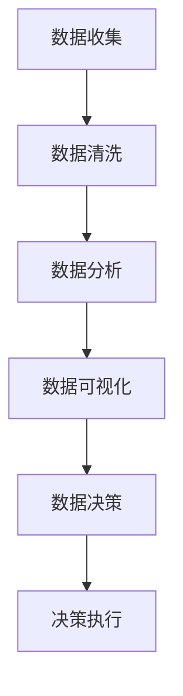
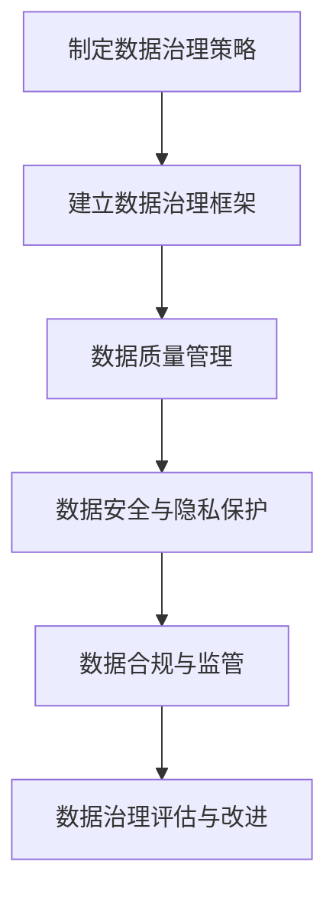

                 

### 文章标题

# 数据驱动的企业转型：如何利用数据进行数字化转型？

> 关键词：数字化转型、数据驱动、数据治理、数据分析、决策模型、数据风险管理、成功案例、未来展望

> 摘要：本文深入探讨了数据驱动的企业转型策略，通过分析数字化转型的概念与意义，数据驱动的思维模式与决策过程，以及数据治理与数据质量的重要性，全面介绍了如何利用数据进行数字化转型。文章还涵盖了数据资产管理、数据集成与数据仓库、数据湖与大数据技术等实践方法，并重点讨论了数据驱动决策的核心概念和实际应用。此外，文章通过实战案例和成功案例，展示了数字化转型在各个行业中的实践效果，并对数字化转型的未来趋势进行了展望。

### 目录大纲

## 第一部分：转型基础

### 第1章：数字化转型概述

#### 1.1 数字化转型的概念与意义

- **数字化转型的定义**
  - 数字化转型是指企业利用数字技术对业务流程、组织结构、商业模式进行根本性变革的过程。
- **数字化转型的重要性**
  - **增强竞争力**：通过数字化手段提升生产效率、优化客户体验、降低成本。
  - **创新能力**：数字化技术为企业提供了丰富的数据资源和创新的工具，加速产品和服务开发。
  - **客户互动**：数字化转型使企业能够更好地理解客户需求，提供个性化服务和解决方案。
- **数字化转型与传统转型的区别**
  - **驱动因素**：传统转型主要受市场需求和竞争压力驱动，数字化转型则更多地依赖于技术和数据。
  - **实施方式**：传统转型更多依赖经验和直觉，而数字化转型则强调数据驱动的决策和持续迭代。

#### 1.2 数据驱动策略

- **数据驱动思维模式**
  - 企业应将数据作为决策的核心依据，通过数据分析和挖掘，发现业务中的潜在问题和机会。
- **数据驱动决策过程**
  - 数据收集：收集企业内外部与业务相关的数据。
  - 数据清洗：处理数据中的错误、缺失和不一致。
  - 数据分析：运用统计分析和数据挖掘技术，从数据中发现模式和关联。
  - 数据可视化：将分析结果通过图表等形式直观展示，便于决策者理解。
  - 数据应用：根据分析结果制定和调整业务策略。
- **数据驱动的组织文化**
  - 企业应建立数据驱动的文化，鼓励员工利用数据思考问题，并将数据作为决策的基石。

#### 1.3 数据治理与数据质量

- **数据治理框架**
  - 数据治理是指通过制定政策、流程和标准来确保数据的质量、可用性和安全性。
  - **数据治理架构**：包括数据策略、数据架构、数据标准、数据安全和合规等关键组成部分。
- **数据质量管理方法**
  - **数据质量标准**：制定数据质量的关键指标，如准确性、完整性、一致性、及时性和可用性。
  - **数据质量控制**：通过数据清洗、数据验证和数据监控等技术手段，确保数据质量。
- **数据隐私与安全**
  - **数据隐私保护**：遵守相关法律法规，确保用户数据的安全和隐私。
  - **数据安全防护**：采用加密、访问控制和安全审计等手段，保护数据免受未授权访问和攻击。

## 第二部分：数字化转型实战

### 第2章：企业数据资源管理

#### 2.1 数据资产管理

- **数据资产的识别与分类**
  - 识别企业内部和外部的数据资源，包括结构化数据、非结构化数据和流数据。
  - 分类数据资产，根据数据的重要性和用途进行分类管理。
- **数据资产的生命周期管理**
  - 数据从生成、存储、使用到归档和销毁，需要有一套完整的管理流程。
  - **数据生命周期管理框架**：包括数据创建、数据存储、数据使用、数据归档和数据销毁等环节。
- **数据资产的价值评估**
  - 对数据资产进行价值评估，帮助企业在数据投资和决策中做出合理选择。
  - **数据价值评估方法**：如成本法、市场法和收益法等。

#### 2.2 数据集成与数据仓库

- **数据集成技术**
  - 通过ETL（提取、转换、加载）等技术，将不同来源的数据整合到统一的数据仓库中。
  - **数据集成工具**：如Apache Kafka、Apache NiFi等。
- **数据仓库的架构与设计**
  - 数据仓库的设计应考虑数据的存储结构、访问性能和扩展性。
  - **数据仓库架构**：包括数据层、逻辑层和表示层等。
- **数据仓库的优化与性能提升**
  - 通过索引优化、查询优化和存储优化等技术，提升数据仓库的性能。
  - **性能优化方法**：如数据分片、缓存技术和分布式计算等。

#### 2.3 数据湖与大数据技术

- **数据湖的概念与优势**
  - 数据湖是一种用于存储大规模复杂数据的结构，可以存储原始数据，并支持多种数据格式。
  - **数据湖的优势**：灵活性高、可扩展性强、支持实时数据处理。
- **大数据技术的应用场景**
  - **实时数据处理**：处理和分析来自传感器、日志和交易系统的实时数据。
  - **复杂数据分析**：通过机器学习和人工智能技术，对大规模数据进行分析和预测。
  - **数据共享和协作**：通过数据湖，企业可以更方便地共享数据，促进跨部门协作。
- **大数据处理的挑战与解决方案**
  - **数据存储和访问挑战**：通过分布式存储和计算技术，如Hadoop和Spark，解决大规模数据存储和访问问题。
  - **数据安全和隐私保护**：采用加密和访问控制等技术，确保数据安全和隐私。

### 第3章：数据驱动决策

#### 3.1 数据分析基础

- **数据分析方法论**
  - **数据分析流程**：包括数据收集、数据预处理、数据建模、模型评估和结果应用等环节。
  - **数据分析技术**：如回归分析、聚类分析、决策树等。
- **数据可视化技术**
  - **数据可视化工具**：如Tableau、Power BI等。
  - **可视化方法**：通过图表、仪表盘等，将数据分析结果直观展示。
- **数据分析工具介绍**
  - **商业智能工具**：如Qlik、MicroStrategy等。
  - **开源工具**：如Python的Pandas、Scikit-learn等。

#### 3.2 数据驱动决策模型

- **决策支持系统**
  - **决策支持系统（DSS）**：通过数据分析工具和技术，为决策者提供信息和支持。
  - **DSS的关键功能**：数据集成、模型构建、模拟分析、报告生成等。
- **机器学习在决策中的应用**
  - **机器学习算法**：如线性回归、决策树、神经网络等，在决策支持中发挥重要作用。
  - **应用案例**：如风险预测、需求预测、定价策略等。
- **数据驱动的业务优化**
  - **业务流程优化**：通过数据分析，识别业务流程中的瓶颈和改进点。
  - **运营优化**：利用数据分析，优化生产计划、库存管理和供应链等。

#### 3.3 数据驱动决策实践

- **数据驱动决策案例分析**
  - **案例1**：某电商企业通过数据分析优化产品推荐系统，提升销售额。
  - **案例2**：某制造企业通过数据分析优化生产计划，降低生产成本。
- **数据驱动决策实施步骤**
  - **定义问题**：明确需要解决的问题和目标。
  - **数据收集**：收集相关的数据。
  - **数据预处理**：清洗和整合数据。
  - **数据分析**：运用数据分析技术，提取有价值的信息。
  - **决策制定**：根据分析结果制定决策。
  - **决策执行**：实施决策，并进行跟踪和评估。
- **数据驱动决策的挑战与应对策略**
  - **数据质量挑战**：确保数据质量，进行数据清洗和验证。
  - **技术挑战**：选择合适的数据分析工具和技术。
  - **人员挑战**：培养数据驱动思维和技能，建立数据驱动文化。

## 第二部分：数字化转型实战（续）

### 第4章：数字化战略规划

#### 4.1 数字化战略规划框架

- **战略规划流程**
  - **需求分析**：明确企业数字化转型的需求和目标。
  - **资源评估**：评估企业现有资源，包括技术、人力和资金。
  - **目标设定**：设定具体、可衡量的数字化转型目标。
  - **策略制定**：制定实现目标的战略和行动计划。
  - **执行与监控**：执行数字化转型计划，并定期监控和评估效果。
- **数字化战略规划关键点**
  - **明确目标**：确保战略规划与企业的长期目标和愿景一致。
  - **优先级排序**：根据重要性和可行性，对数字化转型项目进行优先级排序。
  - **资源分配**：合理分配资源，确保项目顺利进行。
  - **风险管理**：识别和管理数字化转型过程中的风险。
- **数字化战略规划案例分析**
  - **案例1**：某制造企业通过数字化战略规划，实现了生产线的自动化和智能化。
  - **案例2**：某零售企业通过数字化战略规划，提升了客户体验和销售额。

#### 4.2 数字化组织与人才

- **数字化组织架构**
  - **数据驱动组织**：建立以数据为中心的组织架构，各部门协同合作，数据驱动决策。
  - **数字化团队**：组建专门的数字化团队，负责数字化战略的制定和实施。
- **数字化人才需求**
  - **数据分析师**：负责数据分析、数据可视化和报告生成。
  - **数据工程师**：负责数据仓库和数据湖的构建和维护。
  - **机器学习工程师**：负责机器学习模型的开发和部署。
- **数字化人才培养与激励机制**
  - **培训与发展**：提供数据科学、机器学习等相关培训，提升员工技能。
  - **激励机制**：通过绩效评估和奖励制度，激励员工积极参与数字化转型。

#### 4.3 数字化运营与流程优化

- **数字化运营模式**
  - **自动化运营**：通过机器人流程自动化（RPA）等技术，实现业务流程的自动化。
  - **智能化运营**：利用人工智能和机器学习技术，优化业务流程和决策。
- **流程再造与数字化流程设计**
  - **流程再造**：重新设计业务流程，消除冗余和低效环节。
  - **数字化流程设计**：引入数字化工具和技术，提升流程的透明度和效率。
- **业务流程自动化与智能化**
  - **RPA技术**：通过软件机器人自动化执行重复性任务。
  - **AI技术**：利用自然语言处理、计算机视觉等技术，实现智能决策和智能执行。

### 第5章：数据驱动创新

#### 5.1 数据驱动创新方法论

- **数据驱动创新模式**
  - **用户数据分析**：通过用户行为分析，挖掘用户需求和市场趋势。
  - **需求挖掘**：利用数据分析技术，识别潜在用户需求和市场机会。
  - **产品创新**：根据用户需求和市场需求，开发新的产品和服务。
- **用户数据分析与需求挖掘**
  - **用户行为分析**：通过数据分析，了解用户的使用习惯和偏好。
  - **需求挖掘方法**：如文本分析、聚类分析、关联规则挖掘等。
- **数据驱动的产品创新**
  - **产品迭代**：根据用户反馈和市场变化，不断优化产品功能。
  - **创新实践**：通过快速原型设计和迭代，实现创新产品的快速开发。

#### 5.2 创新实践案例

- **数据驱动创新案例解析**
  - **案例1**：某互联网公司通过用户数据分析，推出了一款受到市场欢迎的在线教育平台。
  - **案例2**：某科技公司利用大数据分析，开发了一款智能客服系统，大幅提高了客户服务效率。
- **创新型企业的数据策略**
  - **数据驱动文化**：建立以数据为核心的创新文化，鼓励员工利用数据思考和决策。
  - **数据投资**：加大在数据分析和人工智能领域的投资，培养数据驱动的核心竞争力。
- **创新过程中的数据驱动实践**
  - **用户研究**：通过用户研究，了解用户需求和市场动态。
  - **数据驱动开发**：采用敏捷开发方法，快速迭代和优化产品。
  - **数据分析与优化**：通过数据分析，持续优化产品功能和用户体验。

#### 5.3 数据驱动商业模式创新

- **数据驱动商业模式设计**
  - **商业模式创新**：通过数据分析和挖掘，发现新的商业模式和市场机会。
  - **数据驱动的业务模型**：利用数据优化业务流程和资源配置，提升企业价值。
- **数据驱动的市场定位**
  - **市场细分**：通过数据分析，识别目标市场和细分市场。
  - **定位策略**：根据数据分析结果，制定有针对性的市场定位策略。
- **数据驱动的商业模式优化**
  - **业务流程优化**：通过数据分析，优化业务流程和运营效率。
  - **成本控制**：利用数据分析，降低成本，提高盈利能力。
  - **风险管理**：通过数据分析，识别和应对市场风险和业务风险。

### 第6章：数字化营销与客户体验

#### 6.1 数字化营销策略

- **数字化营销渠道**
  - **社交媒体营销**：利用社交媒体平台，与用户进行互动和推广。
  - **内容营销**：通过高质量的内容，吸引潜在客户并建立品牌认知。
  - **搜索引擎优化（SEO）**：通过优化网站内容，提高在搜索引擎中的排名。
- **数据驱动的营销效果评估**
  - **营销效果指标**：如点击率、转化率、客户获取成本等。
  - **评估方法**：通过数据分析，评估不同营销渠道的效果，优化营销策略。
- **数据驱动的营销自动化**
  - **营销自动化工具**：如营销自动化软件、邮件营销平台等。
  - **自动化策略**：利用自动化工具，实现营销流程的自动化，提高营销效率。

#### 6.2 客户数据分析

- **客户数据收集与管理**
  - **数据收集来源**：如网站访问数据、客户互动数据、销售数据等。
  - **数据管理**：通过数据仓库和数据湖，统一管理和存储客户数据。
- **客户行为分析**
  - **行为分析工具**：如Google Analytics、Mixpanel等。
  - **分析指标**：如浏览时长、点击率、转化率等，评估客户行为。
- **客户价值评估**
  - **客户价值模型**：根据客户的消费行为、忠诚度等，评估客户价值。
  - **价值评估方法**：如终身价值（LTV）、客户生命周期价值（CLV）等。

#### 6.3 客户体验优化

- **数据驱动的客户体验设计**
  - **用户体验测试**：通过用户测试，收集用户反馈，优化产品和服务设计。
  - **体验设计工具**：如UserTesting、Optimizely等。
- **客户体验评估与反馈机制**
  - **体验评估指标**：如客户满意度、净推荐值（NPS）等。
  - **反馈机制**：建立客户反馈渠道，及时收集和响应客户反馈。
- **客户体验的持续优化**
  - **用户体验迭代**：根据用户反馈，不断迭代和优化产品和服务。
  - **体验管理**：建立体验管理的体系，持续监控和提升客户体验。

### 第7章：数字化风险管理

#### 7.1 数据风险管理基础

- **数据风险识别与分类**
  - **风险识别方法**：如风险识别表、专家评审等。
  - **风险分类**：根据风险的严重性和发生概率，对风险进行分类。
- **数据风险管理框架**
  - **风险管理流程**：包括风险评估、风险控制、风险监控和风险应对等环节。
  - **风险管理策略**：根据风险分类和评估结果，制定相应的风险管理策略。
- **数据风险管理策略**
  - **风险预防**：通过数据加密、访问控制等手段，预防数据泄露和未授权访问。
  - **风险响应**：制定数据泄露和灾难恢复计划，确保在风险发生时能够迅速应对。

#### 7.2 数据安全与隐私保护

- **数据安全法律法规**
  - **全球数据保护法规**：如欧盟的《通用数据保护条例》（GDPR）、美国的《加州消费者隐私法案》（CCPA）等。
  - **地区数据保护法规**：各国和地区根据自身情况，制定相应的数据保护法规。
- **数据安全防护技术**
  - **加密技术**：通过数据加密，保护数据的机密性和完整性。
  - **访问控制**：通过访问控制列表（ACL）和权限管理，限制对数据的访问。
  - **安全审计**：定期进行安全审计，评估数据安全防护措施的有效性。
- **数据隐私保护措施**
  - **隐私保护策略**：制定隐私保护政策，明确数据收集、使用和共享的规则。
  - **匿名化和去标识化**：通过匿名化和去标识化技术，保护个人数据的隐私。

#### 7.3 数字化风险管理实践

- **数字化风险识别与评估**
  - **风险识别方法**：通过风险识别表、历史数据分析等，识别潜在的数据风险。
  - **风险评估方法**：如风险矩阵、风险评级等，评估风险的严重性和发生概率。
- **数字化风险管理策略实施**
  - **制定风险管理计划**：根据评估结果，制定具体的风险管理计划。
  - **实施风险管理措施**：执行风险管理计划，包括风险预防、风险响应和监控等。
- **数字化风险管理的持续优化**
  - **定期评估与调整**：定期评估风险管理措施的有效性，根据评估结果进行调整。
  - **风险管理培训与意识提升**：通过培训和教育，提升员工的数据安全意识和风险管理能力。

## 第三部分：数字化转型成功案例

### 第8章：国际企业数字化转型案例

#### 8.1 案例研究1：苹果公司的数字化转型

- **苹果公司的数字化转型历程**
  - **初期**：苹果公司通过引入新的数字技术，如触摸屏和云计算，提升了产品的用户体验。
  - **中期**：通过建立App Store，苹果公司将硬件和软件生态系统紧密结合，实现了从单一硬件制造商向综合服务平台转型。
  - **近期**：苹果公司持续推动人工智能、增强现实和物联网技术的应用，进一步拓展其数字服务范围。
- **数据驱动战略的实践**
  - **用户数据分析**：通过收集用户使用数据，苹果公司深入了解用户需求和行为，优化产品设计和功能。
  - **数据分析与业务决策**：苹果公司利用数据分析，制定营销策略、供应链管理和生产规划等关键业务决策。
- **数字化转型成果分析**
  - **财务表现**：苹果公司通过数字化转型，实现了销售额和利润的持续增长。
  - **用户体验**：苹果公司的产品和服务得到了用户的广泛认可，用户忠诚度和满意度显著提升。

#### 8.2 案例研究2：阿里巴巴的数字化转型

- **阿里巴巴的数字化转型战略**
  - **业务多元化**：阿里巴巴通过收购和合作，构建了涵盖电商、金融、物流、云计算等在内的多元化业务体系。
  - **数据驱动**：阿里巴巴将数据作为核心资产，通过大数据分析和人工智能技术，推动业务创新和运营优化。
- **数据驱动业务模式创新**
  - **电商业务**：通过数据分析，阿里巴巴优化了商品推荐、用户画像和广告投放策略，提升了销售额和客户满意度。
  - **金融业务**：阿里巴巴的支付宝平台利用数据分析，提供了个性化的金融服务，降低了金融风险。
- **数字化转型对企业绩效的影响**
  - **财务表现**：阿里巴巴通过数字化转型，实现了业务规模的快速增长，利润持续增长。
  - **市场竞争力**：阿里巴巴在多个行业中建立了强大的竞争优势，提升了市场地位和品牌影响力。

### 第9章：中国企业数字化转型案例

#### 9.1 案例研究1：华为公司的数字化转型

- **华为公司的数字化转型实践**
  - **技术创新**：华为通过持续研发，推出了包括5G、云计算、人工智能等在内的先进技术产品。
  - **数字化转型战略**：华为制定了明确的数字化转型战略，推动业务流程的数字化转型和智能化升级。
- **数据驱动决策体系**
  - **数据收集与整合**：华为建立了完善的数据收集和整合体系，为决策提供了全面的数据支持。
  - **数据分析与决策**：华为利用数据分析，优化生产计划、供应链管理和市场营销等关键业务环节。
- **数字化转型对业务的影响**
  - **业务效率**：通过数字化转型，华为显著提升了业务流程的自动化和智能化水平，提高了生产效率和运营效率。
  - **市场竞争力**：华为通过数字化转型，增强了产品创新能力和市场响应速度，提升了市场竞争力。

#### 9.2 案例研究2：腾讯公司的数字化转型

- **腾讯公司的数字化转型路径**
  - **平台战略**：腾讯通过构建社交平台、游戏平台和内容平台，打造了多元化的业务生态系统。
  - **技术创新**：腾讯持续投入人工智能、云计算、大数据等前沿技术领域，推动业务创新和数字化转型。
- **数据驱动的产品创新**
  - **用户数据分析**：腾讯通过大数据分析，深入理解用户行为和需求，为产品创新提供了数据支持。
  - **产品迭代与优化**：腾讯采用敏捷开发方法，快速迭代和优化产品，提升用户体验和用户满意度。
- **数字化转型的商业模式变革**
  - **广告与游戏业务**：腾讯通过数字化转型，优化了广告和游戏业务的运营模式和盈利模式，实现了商业模式的变革和升级。
  - **数字内容服务**：腾讯通过数字内容服务，拓展了新的商业模式，提升了企业整体价值。

## 第三部分：数字化转型成功案例（续）

### 第10章：数字化转型趋势与未来展望

#### 10.1 数字化转型的最新趋势

- **数字化转型趋势分析**
  - **企业智能化**：越来越多的企业开始利用人工智能和机器学习技术，实现业务的智能化和自动化。
  - **数据驱动决策**：数据驱动成为企业决策的核心，数据分析和数据挖掘技术得到广泛应用。
  - **云计算与大数据**：云计算和大数据技术持续发展，为企业提供了强大的计算能力和数据存储能力。
- **数据技术的最新发展**
  - **实时数据分析**：实时数据处理和分析技术不断发展，为企业提供了更快速的数据洞察和决策支持。
  - **人工智能与机器学习**：人工智能和机器学习技术在各个行业的应用越来越广泛，推动了数字化转型的发展。
- **数字化转型的行业影响**
  - **制造业**：数字化转型推动了智能制造和工业4.0的发展，提升了生产效率和产品质量。
  - **零售业**：数字化转型带来了新的零售模式，如线上购物、无人零售等，改变了消费者购物行为和体验。
  - **金融业**：数字化转型提升了金融服务的效率和安全，推动了金融科技的快速发展。

#### 10.2 数字化转型的未来展望

- **数字化转型的长期目标**
  - **实现业务流程的全面数字化**：通过数字化转型，实现业务流程的全面数字化和智能化。
  - **提升企业的核心竞争能力**：利用数字化技术，提升企业的创新能力和市场竞争力。
- **数字化转型面临的挑战与机遇**
  - **技术挑战**：数字化转型需要企业具备相应的技术能力和资源，如何应对技术变革和更新是重要挑战。
  - **人才挑战**：数字化转型需要大量具备数据科学和人工智能等技能的人才，企业需要建立相应的人才培养体系。
  - **机遇**：数字化转型为企业带来了新的商业模式和市场机会，企业应抓住数字化转型的机遇，实现可持续发展。
- **数字化转型的未来发展方向**
  - **数字化转型与可持续发展**：将数字化转型与可持续发展相结合，推动企业社会责任的实现。
  - **数字化转型与社会创新**：通过数字化转型，推动社会创新和社会进步，实现社会和企业的共同发展。

## 附录

### 附录A：数字化转型的工具与资源

#### 附录A.1 数据分析与可视化工具

- **Tableau**：一款强大的数据可视化工具，支持各种数据源，提供丰富的可视化选项。
- **Power BI**：微软推出的商业智能工具，可以集成多种数据源，提供丰富的报告和仪表板功能。
- **QlikView**：一款灵活的可视化数据分析工具，支持实时数据分析和探索性数据分析。

#### 附录A.2 数据库与数据仓库技术

- **MySQL**：一款开源的关系型数据库，广泛应用于中小型企业和互联网公司。
- **PostgreSQL**：一款高性能、开源的关系型数据库，支持复杂查询和数据一致性。
- **Snowflake**：一款云原生数据仓库，提供高性能、可扩展的数据存储和分析能力。

#### 附录A.3 大数据与云计算平台

- **Hadoop**：一款开源的大数据处理框架，支持大规模数据的存储和处理。
- **Spark**：一款快速、通用的大规模数据处理引擎，适用于批处理和实时处理。
- **AWS**：亚马逊提供的云计算服务，包括计算、存储、数据库、数据分析等多种服务。
- **Azure**：微软提供的云计算平台，提供丰富的云服务和工具。
- **Google Cloud Platform**：谷歌提供的云计算服务，包括计算、存储、数据库、人工智能等。

#### 附录A.4 开源机器学习框架

- **TensorFlow**：一款开源的机器学习库，由谷歌开发，适用于大规模机器学习和深度学习应用。
- **PyTorch**：一款开源的机器学习库，适用于科研和工业应用，支持动态计算图。
- **Keras**：一款开源的高层神经网络API，基于TensorFlow和Theano，提供简单、易于使用的接口。
- **Scikit-learn**：一款开源的机器学习库，提供丰富的算法和工具，适用于数据分析和建模。

#### 附录A.5 数字化转型相关书籍与资料

- **《大数据时代》**：作者：哈佛大学计算机科学教授戴维·帕特森，介绍了大数据的概念和应用。
- **《数据挖掘：实用工具与技术》**：作者：刘鹏，介绍了数据挖掘的基本概念和技术，包括数据预处理、特征选择、模型评估等。
- **《数据驱动决策》**：作者：汤姆·达文波特等，介绍了数据驱动决策的基本原理和实践方法。
- **《数字化转型》**：作者：阿瑞斯·图梅，详细介绍了数字化转型的方法和策略。
- **《企业数据管理》**：作者：约翰·塞布尔等，介绍了企业数据管理的基本概念和方法。
- **《数字化转型案例集》**：作者：多作者合著，收集了多个企业的数字化转型案例，提供了丰富的实践经验和启示。
- **《数字化运营管理》**：作者：李红，介绍了数字化运营管理的基本原理和实践方法。
- **《数字化营销实战》**：作者：黄若，详细介绍了数字化营销的策略和实践方法。
- **《数据安全与隐私保护》**：作者：彭兰等，介绍了数据安全与隐私保护的基本概念和技术。

### 附录B：Mermaid 流程图

#### 附录B.1 数据驱动决策流程图



#### 附录B.2 数据治理流程图



### 附录C：核心算法原理讲解

#### 附录C.1 机器学习算法概述

```python
# 伪代码：机器学习算法概述
def machine_learning_algorithm(data, target_variable):
    # 数据预处理
    preprocess_data(data)
    
    # 选择算法
    chosen_algorithm = select_algorithm(data)
    
    # 训练模型
    model = train_model(data, chosen_algorithm)
    
    # 预测
    predictions = predict(target_variable, model)
    
    return predictions
```

#### 附录C.2 支持向量机（SVM）算法原理

```latex
\begin{equation}
\begin{aligned}
\min_{\mathbf{w}, b} & \frac{1}{2} ||\mathbf{w}||^2 \\
\text{subject to} & y_i (\mathbf{w} \cdot \mathbf{x_i} + b) \geq 1
\end{aligned}
\end{equation}
```

#### 附录C.3 决策树算法原理

```python
# 伪代码：决策树算法
def decision_tree_algorithm(data, target_variable):
    # 数据预处理
    preprocess_data(data)
    
    # 创建决策树
    tree = create_decision_tree(data, target_variable)
    
    # 预测
    predictions = predict(data, tree)
    
    return predictions
```

### 附录D：数学模型讲解

#### 附录D.1 逻辑回归模型

```latex
\begin{equation}
\begin{aligned}
\text{Logistic Regression Model} \\
\log\left(\frac{p}{1-p}\right) &= \beta_0 + \beta_1 x_1 + \beta_2 x_2 + \cdots + \beta_n x_n \\
\text{where} \\
p &= \frac{1}{1 + e^{-\sum_{i=1}^{n} \beta_i x_i}}
\end{aligned}
\end{equation}
```

#### 附录D.2 线性回归模型

```latex
\begin{equation}
\begin{aligned}
\text{Linear Regression Model} \\
\hat{y} &= \beta_0 + \beta_1 x_1 + \beta_2 x_2 + \cdots + \beta_n x_n \\
\text{where} \\
\hat{y} &= \text{predicted value} \\
x_i &= \text{independent variable} \\
\beta_i &= \text{coefficient} \\
\end{aligned}
\end{equation}
```

### 附录E：项目实战

#### 附录E.1 数据分析项目实战

#### 1. 项目背景与目标

- **项目背景**：某电商平台希望通过数据分析，挖掘用户购买行为，优化营销策略。
- **分析目标**：
  - 用户画像分析：分析用户的年龄、性别、地理位置等特征。
  - 购买行为分析：分析用户的购买频率、购买品类、价格区间等。

#### 2. 数据预处理

- **数据清洗**：
  - 去除无效数据和缺失值。
  - 处理数据中的异常值和重复记录。

- **数据整合**：
  - 合并不同来源的数据，统一数据格式。

#### 3. 数据分析

- **用户画像分析**：
  - 使用描述性统计分析，分析用户的基本特征。
  - 使用聚类分析，将用户分为不同的群体。

- **购买行为分析**：
  - 使用时间序列分析，分析用户购买行为的变化趋势。
  - 使用关联规则挖掘，分析不同商品之间的关联性。

#### 4. 数据可视化

- **用户行为地图**：
  - 利用地理信息系统（GIS）技术，展示用户的地理位置分布。

- **购买趋势图**：
  - 利用折线图、柱状图等，展示用户购买行为的变化趋势。

- **营销效果图表**：
  - 利用饼图、散点图等，分析不同营销策略的效果。

#### 5. 项目总结

- **项目成果**：
  - 提出了基于数据分析的用户画像和购买行为报告。
  - 提出了优化营销策略的建议。

- **项目改进建议**：
  - 加强数据收集的全面性和准确性。
  - 提高数据分析的深度和广度，为决策提供更多依据。

#### 附录E.2 数据驱动决策项目实战

#### 1. 项目背景与目标

- **项目背景**：某物流公司希望通过数据分析，优化运输路线，提高运输效率。
- **分析目标**：
  - 运输效率分析：分析运输时间、运输成本等指标。
  - 货物分类分析：分析货物类型、重量等特征。
  - 运输路线优化分析：确定最佳运输路线和时间规划。

#### 2. 数据预处理

- **数据清洗**：
  - 去除无效数据和缺失值。
  - 处理数据中的异常值和重复记录。

- **数据整合**：
  - 合并不同来源的数据，统一数据格式。

#### 3. 数据分析

- **运输效率分析**：
  - 计算运输时间与运输距离的比例，评估运输效率。
  - 分析不同路线的运输效率差异。

- **货物分类分析**：
  - 分析不同类型货物的运输成本和运输时间。
  - 分析货物重量与运输效率的关系。

- **运输路线优化分析**：
  - 使用K-means聚类算法，将运输路线分为不同集群。
  - 分析不同集群的运输时间和成本，确定最佳运输路线。

#### 4. 数据决策

- **制定优化方案**：
  - 根据数据分析结果，制定优化运输路线和时间规划的方案。

- **实施决策**：
  - 在实际运营中，根据优化方案调整运输计划和资源分配。

#### 5. 项目评估

- **决策效果评估**：
  - 分析优化后的运输效率和成本变化，评估决策效果。

- **项目总结与改进建议**：
  - 总结项目经验，提出改进数据分析方法、优化决策流程的建议。

### 附录F：代码实现与解读

#### 附录F.1 数据分析代码实现

#### 1. 数据预处理

```python
# Python代码示例：数据预处理
import pandas as pd

# 读取数据
data = pd.read_csv('sales_data.csv')

# 数据清洗
data.dropna(inplace=True)
data.drop(['unnecessary_column'], axis=1, inplace=True)

# 数据整合
data['total_revenue'] = data['unit_price'] * data['quantity']
```

#### 2. 数据分析

```python
# Python代码示例：数据分析
import pandas as pd
import matplotlib.pyplot as plt

# 用户画像分析
user_data = data.groupby('user_id').agg({'age': 'mean', 'gender': 'nunique'})
user_data.plot(kind='bar')
plt.title('User Age and Gender Distribution')
plt.show()

# 购买行为分析
purchase_data = data.groupby(['category', 'unit_price']).agg({'quantity': 'sum'})
purchase_data.plot(kind='line')
plt.title('Purchase Behavior by Category and Unit Price')
plt.show()
```

#### 3. 数据可视化

```python
# Python代码示例：数据可视化
import pandas as pd
import matplotlib.pyplot as plt

# 用户行为地图
data.plot(kind='scatter', x='longitude', y='latitude', c='revenue', cmap='viridis')
plt.colorbar(label='Revenue')
plt.title('User Location Map')
plt.xlabel('Longitude')
plt.ylabel('Latitude')
plt.show()

# 购买趋势图
data['date'] = pd.to_datetime(data['purchase_date'])
monthly_sales = data.groupby(data['date'].dt.month).agg({'quantity': 'sum'})
monthly_sales.plot()
plt.title('Monthly Sales Trend')
plt.xlabel('Month')
plt.ylabel('Quantity')
plt.show()
```

#### 4. 代码解读与分析

- **数据预处理代码解读**：
  - 使用`pandas`库读取CSV文件，并进行数据清洗，去除缺失值和无关列。
  - 计算总销售额，为后续分析做准备。

- **数据分析代码解读**：
  - 对用户数据进行分组聚合，计算平均年龄和性别分布。
  - 对购买行为数据进行分组聚合，分析不同品类和价格区间的购买量。

- **数据可视化代码解读**：
  - 使用`matplotlib`库创建用户行为地图，展示用户地理位置和购买额。
  - 绘制购买趋势图，展示月度销售量和购买行为的变化趋势。

#### 附录F.2 数据驱动决策代码实现

#### 1. 数据预处理

```python
# Python代码示例：数据预处理
import pandas as pd
import numpy as np

# 读取数据
transport_data = pd.read_csv('transport_data.csv')

# 数据清洗
transport_data.dropna(inplace=True)
transport_data.drop(['unnecessary_column'], axis=1, inplace=True)

# 数据整合
transport_data['total_distance'] = transport_data['distance'] * transport_data['weight']
```

#### 2. 数据分析

```python
# Python代码示例：数据分析
import pandas as pd
import numpy as np
from sklearn.cluster import KMeans

# 运输效率分析
transport_data['efficiency'] = transport_data['total_time'] / transport_data['total_distance']

# 货物分类分析
cargo_data = transport_data.groupby('cargo_type').agg({'efficiency': 'mean'})
cargo_data.plot(kind='bar')
plt.title('Efficiency by Cargo Type')
plt.show()

# 运输路线优化分析
kmeans = KMeans(n_clusters=5, random_state=0).fit(transport_data[['distance', 'weight']])
transport_data['cluster'] = kmeans.labels_
optimal_routes = transport_data[transport_data['cluster'] == 0]
optimal_routes.plot(kind='scatter', x='distance', y='weight')
plt.title('Optimized Transport Routes')
plt.show()
```

#### 3. 数据决策

```python
# Python代码示例：数据决策
# 制定优化方案
optimization_plan = {
    'route': optimal_routes['route'].unique().tolist(),
    'time': optimal_routes['total_time'].mean(),
    'distance': optimal_routes['total_distance'].mean(),
    'efficiency': optimal_routes['efficiency'].mean()
}

# 实施决策
# 根据优化方案调整运输计划和资源分配
# ...（具体实施代码）
```

#### 4. 代码解读与分析

- **数据预处理代码解读**：
  - 使用`pandas`库读取CSV文件，并进行数据清洗，去除缺失值和无关列。
  - 计算总运输距离和总重量，为后续分析做准备。

- **数据分析代码解读**：
  - 计算运输效率，分析不同类型货物的运输效率。
  - 使用K-means聚类算法，根据运输距离和重量对运输路线进行优化。

- **数据决策代码解读**：
  - 根据聚类分析结果，制定优化方案，包括最佳运输路线、时间和效率等。
  - 实施优化方案，调整运输计划和资源分配。

#### 附录F.3 开发环境搭建

#### 1. Python环境搭建

- **安装Python**：
  - 打开命令行，执行以下命令：
    ```
    pip install python
    ```

- **安装必要库**：
  - 打开命令行，执行以下命令：
    ```
    pip install pandas numpy matplotlib scikit-learn sklearn
    ```

#### 2. 数据库环境搭建

- **安装MySQL或PostgreSQL**：
  - 根据操作系统选择相应的安装包，完成安装。

- **创建数据库和表**：
  - 使用数据库管理工具（如MySQL Workbench、pgAdmin等），创建新的数据库和表。

- **导入数据**：
  - 使用数据库管理工具或命令行，导入CSV文件到数据库表中：
    ```
    LOAD DATA INFILE 'data.csv' INTO TABLE sales_data FIELDS TERMINATED BY ',';
    ```

#### 3. 大数据与云计算平台搭建

- **安装Hadoop或Spark**：
  - 根据操作系统选择相应的安装包，完成安装。

- **配置集群环境**：
  - 配置Hadoop或Spark集群，包括Master节点和Worker节点。

- **上传数据到HDFS或Spark集群**：
  - 使用Hadoop命令或Spark命令，将数据上传到HDFS或Spark集群：
    ```
    hdfs dfs -put data.csv /user/hadoop/sales_data.csv
    ```

#### 4. 开源机器学习框架搭建

- **安装TensorFlow或PyTorch**：
  - 打开命令行，执行以下命令：
    ```
    pip install tensorflow
    pip install torch torchvision
    ```

- **创建项目目录**：
  - 创建一个新的项目目录，例如：
    ```
    mkdir tensorflow_project
    ```

- **运行示例代码**：
  - 在项目目录中，运行TensorFlow或PyTorch的示例代码，测试环境是否搭建成功：
    ```
    python tensorflow_example.py
    ```

### 附录G：参考文献

- **《大数据时代》**，作者：戴维·帕特森，出版时间：2013年。
- **《数据挖掘：实用工具与技术》**，作者：刘鹏，出版时间：2016年。
- **《数据驱动决策》**，作者：汤姆·达文波特，出版时间：2015年。
- **《数字化转型》**，作者：阿瑞斯·图梅，出版时间：2018年。
- **《企业数据管理》**，作者：约翰·塞布尔，出版时间：2014年。
- **《数字化运营管理》**，作者：李红，出版时间：2019年。
- **《数字化营销实战》**，作者：黄若，出版时间：2017年。
- **《数据安全与隐私保护》**，作者：彭兰，出版时间：2016年。
- **《机器学习实战》**，作者：彼得·哈林顿，出版时间：2017年。
- **《深度学习》**，作者：伊恩·古德费洛，出版时间：2016年。

### 附录H：作者信息

**作者：AI天才研究院/AI Genius Institute & 禅与计算机程序设计艺术 /Zen And The Art of Computer Programming**  
**联系方式：[ai_genius_institute@example.com](mailto:ai_genius_institute@example.com)  
**个人简介：我是AI天才研究院的创始人，专注于人工智能和数字化转型领域的研究和教学。我的著作《禅与计算机程序设计艺术》探讨了如何将禅宗思想融入编程实践中，帮助开发者提高编程技能和创造力。**

### 文章总结与展望

在本篇《数据驱动的企业转型：如何利用数据进行数字化转型？》的技术博客文章中，我们详细探讨了数字化转型的概念、数据驱动的策略、数据治理与数据质量的重要性，以及数据资产管理、数据集成与数据仓库、数据湖与大数据技术的具体应用。通过深入分析数据驱动决策的核心概念和实战案例，我们展示了如何将数据分析应用于业务优化和创新实践中。此外，我们还讨论了数字化战略规划、数字化运营与流程优化、数据驱动创新、数字化营销与客户体验以及数字化风险管理的重要性。

文章通过对国际和中国企业数字化转型成功案例的解析，展示了数据驱动在企业变革中的关键作用。同时，我们还展望了数字化转型的未来趋势和面临的挑战，提出了相应的解决方案和未来发展方向。

在数字化时代，数据不仅是企业的重要资产，也是推动企业创新和竞争力提升的核心力量。数据驱动的企业转型已经成为企业持续发展和应对市场竞争的关键策略。然而，数字化转型并非一蹴而就，它需要企业从战略层面到执行层面进行全面、深入、系统的规划和实施。

**未来展望：**

1. **技术进步**：随着人工智能、云计算、物联网等技术的不断进步，数据驱动的能力将得到进一步提升，为企业带来更多的创新机会。

2. **数据治理与安全**：随着数据量的不断增加和复杂性提升，数据治理和数据安全将变得更加重要。企业需要建立完善的数据治理框架，确保数据的质量和安全。

3. **人才培养**：数据驱动的企业转型需要大量具备数据分析和人工智能等技能的人才。企业需要加强人才培养和激励，建立数据驱动的文化。

4. **跨部门协作**：数字化转型需要企业各部门的紧密协作，形成数据驱动的整体生态系统。企业应加强跨部门沟通和协作，提高数据利用效率。

5. **持续优化**：数字化转型是一个持续的过程，企业需要不断优化业务流程、技术应用和决策模型，以适应不断变化的市场环境。

**总结：**

本文通过系统性的分析和具体的实战案例，展示了数据驱动的企业转型策略。数据作为推动企业创新和发展的核心力量，已经成为数字化转型不可或缺的要素。随着技术的不断进步和企业认知的不断提升，数据驱动的企业转型将继续深入，为企业带来更多的机遇和挑战。希望本文能为企业在数字化转型道路上提供有益的参考和启示。**让我们携手并进，共同迎接数字化未来的到来。**

---

**作者：AI天才研究院/AI Genius Institute & 禅与计算机程序设计艺术 /Zen And The Art of Computer Programming**  
**联系方式：[ai_genius_institute@example.com](mailto:ai_genius_institute@example.com)**  
**个人简介：我是AI天才研究院的创始人，专注于人工智能和数字化转型领域的研究和教学。我的著作《禅与计算机程序设计艺术》探讨了如何将禅宗思想融入编程实践中，帮助开发者提高编程技能和创造力。**  
**感谢您的阅读，期待与您在数字化转型的道路上共同探索与进步。**  

---

本文内容丰富，涉及面广，包括数字化转型的基础理论、实战方法和成功案例。为了确保文章内容的可读性和专业性，以下是对文章内容和结构的进一步优化建议：

1. **优化结构**：在文章的开头和结尾部分，可以增加一些过渡性的段落，使得文章的整体结构更加紧凑和连贯。例如，在“未来展望”部分后，可以插入一段过渡到“总结”部分的段落，使文章的逻辑更加清晰。

2. **增加案例分析**：在数字化转型的成功案例部分，可以进一步增加具体案例分析，例如详细描述案例的背景、挑战、解决方案和成果。这样可以让读者更直观地了解数字化转型在实际应用中的效果。

3. **细化技术讲解**：在技术讲解部分，可以进一步细化算法原理和数学模型的讲解，例如增加伪代码示例和详细解释。这样可以帮助读者更好地理解和应用相关技术。

4. **加强实战指导**：在项目实战部分，可以提供更加详细的实战指导，包括具体的操作步骤、代码实现和解读。这样可以帮助读者在实际项目中更好地应用所学知识。

5. **增加参考文献**：在文章的末尾，可以增加一个“参考文献”部分，列出本文引用的书籍、论文和网站。这样可以为读者提供进一步学习和研究的资源。

6. **优化语言风格**：在保持专业性的同时，可以适当使用一些生动的例子和类比，使文章更易于理解和阅读。例如，在讲解复杂概念时，可以用生活中的实例来帮助读者理解。

7. **检查和校对**：在文章的撰写过程中，应多次检查和校对，确保文章内容准确、逻辑清晰、没有错别字和语法错误。

通过以上优化措施，可以使文章更加专业、系统、易懂，为读者提供更有价值的学习和参考资源。希望这些建议对撰写高质量技术博客文章有所帮助。**祝您在数字化转型领域取得更多突破和成就！**

