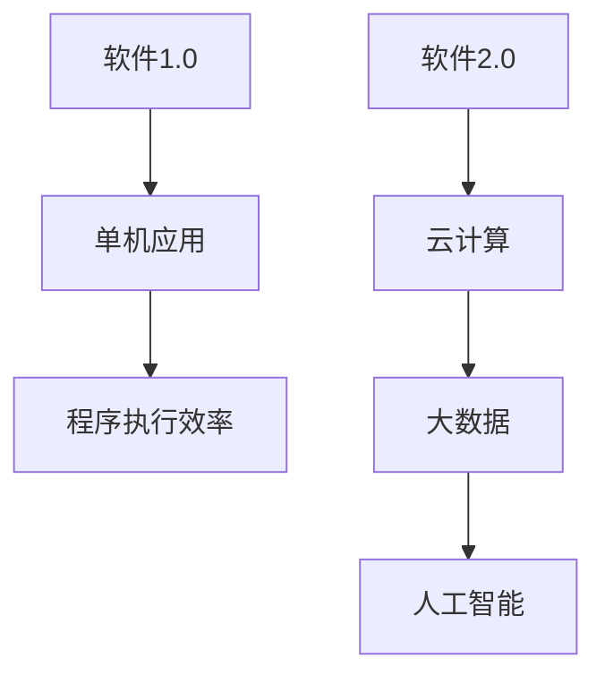
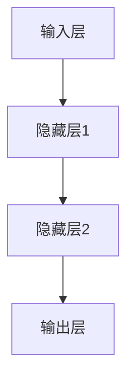
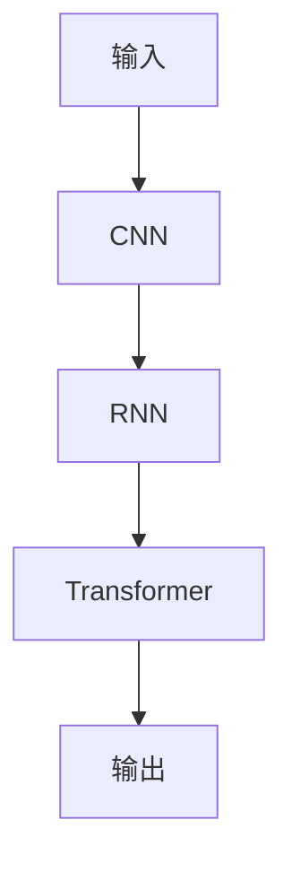
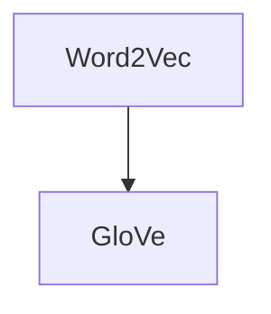
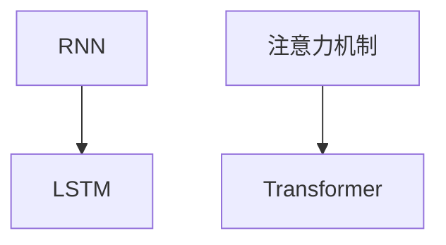
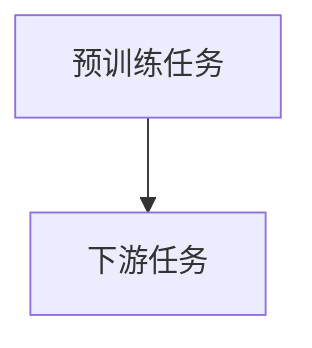
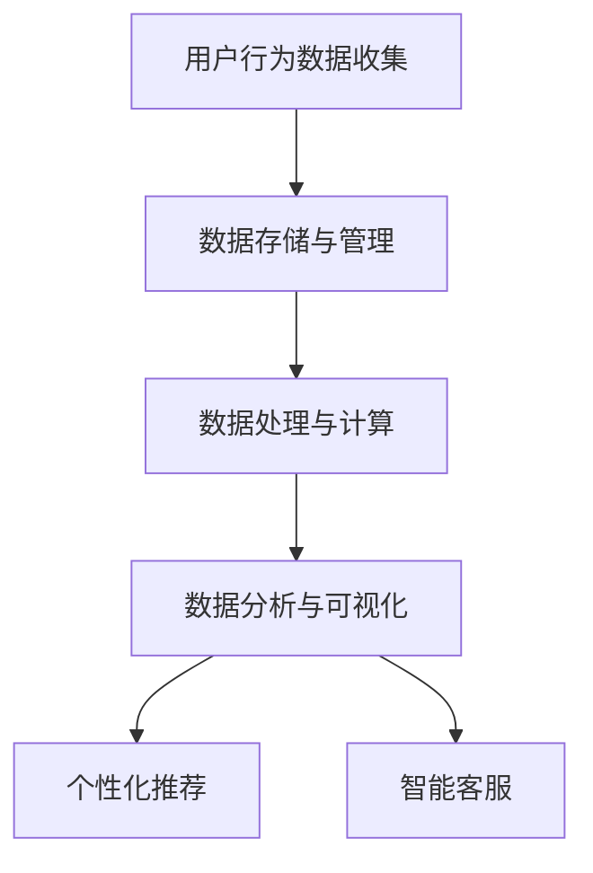

                 

# 文章标题: 《数据驱动的软件2.0需要怎样的架构师?》

## 关键词
- 数据驱动
- 软件2.0
- AI大模型
- 架构设计
- 数据科学
- 架构师技能

## 摘要
本文深入探讨了在软件2.0时代，数据驱动的软件架构对架构师的要求。从AI大模型的技术基础、深度学习原理，到数据驱动的软件架构设计原则，再到架构师需具备的数据科学技能和AI大模型部署与运维技能，本文通过一步一步的分析与推理，揭示了数据驱动软件架构的核心理念和架构师在其中的重要作用。同时，通过一个实际项目案例，展示了如何将数据驱动的理念应用到软件架构中，并对数据驱动软件架构的未来趋势进行了展望。

### 第一部分: 软件2.0时代的AI大模型基础

## 第1章: 软件2.0与AI大模型概述

### 1.1 软件2.0时代的到来

#### 1.1.1 从软件1.0到软件2.0的演进

软件1.0时代以单机应用为主，注重的是程序的执行效率。随着互联网和分布式计算技术的发展，软件进入2.0时代，以云计算、大数据和人工智能为核心，强调的是数据的处理和智能化。

**流程图：**  


#### 1.1.2 大模型在软件2.0中的核心地位

AI大模型在软件2.0中具有至关重要的地位。它们不仅能够处理复杂的业务逻辑，还能够通过自我学习和优化，不断提高系统的智能水平。

**核心地位：**  
- **业务逻辑处理：** AI大模型能够自动处理复杂的业务逻辑，减少人工干预。
- **智能水平提升：** 通过自我学习和优化，AI大模型能够不断提高系统的智能水平，实现智能化升级。

#### 1.1.3 企业级应用开发的新范式

在软件2.0时代，企业级应用开发的新范式是基于AI大模型的，即通过数据驱动的软件架构来实现。这种架构能够更好地适应业务变化，提高系统的灵活性和可扩展性。

**新范式：**  
- **数据驱动：** 通过数据来驱动软件架构的构建和优化。
- **灵活可扩展：** 能够根据业务需求的变化，灵活调整系统架构。

### 1.2 AI大模型的定义与特点

#### 1.2.1 AI大模型的定义

AI大模型是指使用海量数据进行预训练，并能够处理复杂任务的深度神经网络模型。这些模型通常具有数十亿甚至千亿级的参数。

**定义：**  
AI大模型 = 海量数据预训练 + 深度神经网络 + 复杂任务处理

#### 1.2.2 AI大模型的核心特点

- **参数规模大：** AI大模型通常具有数十亿甚至千亿级的参数。
- **训练数据量大：** AI大模型需要使用海量的训练数据来进行预训练。
- **任务处理能力强：** AI大模型能够处理复杂的任务，包括文本生成、图像识别等。

#### 1.2.3 AI大模型与传统AI的区别

- **数据规模：** AI大模型需要更大的数据规模来进行训练。
- **模型结构：** AI大模型通常采用更深的神经网络结构。
- **任务处理能力：** AI大模型具有更强的任务处理能力，能够处理更复杂的任务。

### 1.3 主流AI大模型简介

#### 1.3.1 GPT系列模型

GPT系列模型是自然语言处理领域的代表，具有极强的文本生成能力。GPT-3更是达到了前所未有的规模，拥有1750亿个参数。

**GPT系列模型：**  
- **GPT：** 首个生成式预训练模型，基于Transformer架构。
- **GPT-2：** 扩大了模型规模，提高了文本生成的质量。
- **GPT-3：** 拥有1750亿个参数，具有极强的文本生成能力。

#### 1.3.2 BERT及其变体

BERT是自然语言处理领域的另一个重要模型，通过预先训练的语言表示模型，提高了文本分类、问答等任务的性能。

**BERT及其变体：**  
- **BERT：** 预训练语言表示模型，采用双向Transformer架构。
- **RoBERTa：** 对BERT进行了优化，提高了模型的性能。
- **ALBERT：** 通过参数共享和动态掩码策略，进一步提高了模型的性能。

#### 1.3.3 其他知名大模型介绍

除了GPT系列模型和BERT系列模型，还有许多其他知名的大模型，如ViT（Vision Transformer）、BERTo（BERT的文本生成模型）、T5（Text-to-Text Transfer Transformer）等。

**其他知名大模型：**  
- **ViT：** 图像处理领域的大模型，采用Transformer架构进行图像分类。
- **BERTo：** 文本生成领域的大模型，基于BERT进行文本生成。
- **T5：** 通用的文本到文本的转换模型，可以应用于各种文本生成任务。

### 1.4 AI大模型在企业中的应用前景

#### 1.4.1 AI大模型的潜在应用领域

AI大模型在企业的潜在应用领域非常广泛，包括但不限于自然语言处理、图像处理、语音识别、推荐系统等。

**潜在应用领域：**  
- **自然语言处理：** 文本生成、文本分类、问答系统等。
- **图像处理：** 图像识别、图像生成等。
- **语音识别：** 语音识别、语音合成等。
- **推荐系统：** 用户行为分析、商品推荐等。

#### 1.4.2 企业采用AI大模型的优势

企业采用AI大模型具有许多优势，包括提高生产效率、降低运营成本、提升用户体验等。

**优势：**  
- **提高生产效率：** AI大模型能够自动处理复杂任务，提高生产效率。
- **降低运营成本：** AI大模型能够减少人工干预，降低运营成本。
- **提升用户体验：** AI大模型能够提供更智能、更个性化的服务，提升用户体验。

#### 1.4.3 AI大模型应用的挑战与机遇

虽然AI大模型在企业的应用前景广阔，但也面临一些挑战和机遇。

**挑战：**  
- **数据规模：** 需要大量的高质量数据来训练大模型。
- **计算资源：** 需要足够的计算资源来训练和部署大模型。
- **隐私保护：** 在数据收集和使用过程中需要确保用户隐私。

**机遇：**  
- **技术创新：** AI大模型的技术创新为产业升级提供了新动力。
- **市场拓展：** AI大模型的应用可以拓展企业的市场领域。

## 第2章: AI大模型技术基础

### 2.1 深度学习与神经网络基础

#### 2.1.1 神经网络的基本结构

神经网络是由大量神经元组成的计算模型，通过多层非线性变换来学习数据中的特征和规律。

**基本结构：**  
- **输入层：** 接收外部输入数据。
- **隐藏层：** 通过非线性变换来提取数据特征。
- **输出层：** 输出预测结果或决策。

**流程图：**  


#### 2.1.2 常见的深度学习架构

深度学习架构包括卷积神经网络（CNN）、循环神经网络（RNN）和Transformer等。

**常见架构：**  
- **卷积神经网络（CNN）：** 适用于图像处理任务，通过卷积操作提取图像特征。
- **循环神经网络（RNN）：** 适用于序列数据，通过循环结构来处理时间序列数据。
- **Transformer：** 用于自然语言处理任务，通过自注意力机制来捕捉数据中的长距离依赖关系。

**流程图：**  


#### 2.1.3 深度学习优化算法

深度学习优化算法主要包括梯度下降、Adam等。

**优化算法：**  
- **梯度下降：** 通过计算损失函数的梯度来更新模型参数。
- **Adam：** 结合了梯度下降和动量法的优点，能够更快地收敛。

**伪代码：**  
```python  
# 梯度下降  
for each parameter in model:  
    gradient = compute_gradient(loss_function, parameter)  
    parameter -= learning_rate * gradient

# Adam  
beta1 = 0.9  
beta2 = 0.999  
epsilon = 1e-8

m = 0  
v = 0

for each parameter in model:  
    gradient = compute_gradient(loss_function, parameter)  
    m = beta1 * m + (1 - beta1) * gradient  
    v = beta2 * v + (1 - beta2) * gradient**2

    m_hat = m / (1 - beta1**t)  
    v_hat = v / (1 - beta2**t)

    parameter -= learning_rate * m_hat / (sqrt(v_hat) + epsilon)  
```

### 2.2 自然语言处理技术概览

#### 2.2.1 词嵌入技术

词嵌入技术是将单词转换为向量表示，使得相似的单词在向量空间中更接近。

**词嵌入技术：**  
- **Word2Vec：** 通过预测相邻词来训练词向量。
- **GloVe：** 通过矩阵分解来学习词向量。

**流程图：**  


#### 2.2.2 序列模型与注意力机制

序列模型和注意力机制是自然语言处理中的重要技术。

**序列模型与注意力机制：**  
- **序列模型：** 如RNN和LSTM，能够处理序列数据。
- **注意力机制：** 如Transformer中的自注意力机制，能够捕捉数据中的长距离依赖关系。

**流程图：**  


#### 2.2.3 转换器架构详解

转换器架构（Transformer）是自然语言处理领域的革命性创新，通过自注意力机制实现了高效的处理能力。

**转换器架构详解：**  
- **自注意力机制：** 通过计算数据中的每个元素与其他元素的相关性，实现了对数据中长距离依赖关系的捕捉。
- **多头注意力：** 通过多个注意力头来捕捉不同类型的依赖关系。
- **编码器-解码器结构：** 编码器将输入序列编码为固定长度的向量，解码器根据编码器的输出生成输出序列。

**伪代码：**  
```python  
# 自注意力机制  
for each position in input_sequence:  
    query = encode_position(position)  
    key = encode_position(position)  
    value = encode_position(position)  
    attention_weights = softmax(similarity_scores)  
    attention_output = sum(attention_weights * value)

# 编码器-解码器结构  
encoder_output = encode(input_sequence)  
decoder_output = decode(encoder_output)  
```

### 2.3 大规模预训练模型原理

#### 2.3.1 预训练的概念与意义

预训练是指在大规模数据集上对神经网络模型进行训练，以便在特定任务上获得更好的性能。

**概念与意义：**  
- **概念：** 预训练 = 大规模数据集 + 模型训练
- **意义：** 预训练能够提高模型的泛化能力，减少对特定数据的依赖。

#### 2.3.2 自监督学习方法

自监督学习方法是指在没有标注数据的情况下，利用数据本身的分布进行训练。

**自监督学习方法：**  
- **预训练任务：** 如 masked language model（MLM），通过遮盖部分单词，训练模型预测遮盖的单词。
- **下游任务：** 如文本分类、问答系统，利用预训练的模型进行微调。

**流程图：**  


#### 2.3.3 迁移学习与微调技术

迁移学习是指将预训练模型在不同任务上微调，以适应新任务。

**迁移学习与微调技术：**  
- **迁移学习：** 通过预训练模型迁移知识到新任务。
- **微调：** 在预训练模型的基础上，利用少量新任务数据进行微调。

**伪代码：**  
```python  
# 迁移学习与微调技术  
pretrained_model = load_pretrained_model()  
for each task in new_tasks:  
    fine_tune(pretrained_model, new_task_data)  
```

## 第3章: 数据驱动的软件架构设计原则

### 3.1 数据驱动的软件架构概述

#### 3.1.1 数据驱动的软件架构定义

数据驱动的软件架构是指通过数据来驱动软件的构建、部署和维护，实现软件的智能化和自适应能力。

**定义：**  
数据驱动的软件架构 = 数据收集 + 数据处理 + 数据分析 + 数据应用

#### 3.1.2 数据驱动的软件架构优势

数据驱动的软件架构具有以下优势：

**优势：**  
- **提高开发效率：** 通过数据驱动的方式，可以快速迭代和优化软件。
- **提升系统智能化：** 通过数据分析，可以提高系统的智能化水平。
- **增强系统适应性：** 通过数据驱动，可以更好地适应业务需求的变化。

#### 3.1.3 数据驱动的软件架构挑战

数据驱动的软件架构也面临一些挑战：

**挑战：**  
- **数据质量：** 数据的质量直接影响系统的性能和准确性。
- **数据处理效率：** 随着数据规模的增大，数据处理效率成为一个重要问题。
- **数据安全性：** 在数据收集和使用过程中，需要确保数据的安全和隐私。

### 3.2 数据驱动架构的核心原则

数据驱动架构的核心原则包括以下几方面：

#### 3.2.1 可扩展性原则

可扩展性原则是指软件架构能够随着数据规模的增长而扩展。

**可扩展性原则：**  
- **水平扩展：** 通过增加服务器节点来扩展系统。
- **垂直扩展：** 通过增加服务器性能来扩展系统。

#### 3.2.2 可维护性原则

可维护性原则是指软件架构在长时间运行过程中能够保持稳定性和可靠性。

**可维护性原则：**  
- **模块化设计：** 通过模块化设计，便于系统的维护和升级。
- **自动化测试：** 通过自动化测试，确保系统的稳定性和可靠性。

#### 3.2.3 可适应性原则

可适应性原则是指软件架构能够适应业务需求的变化。

**可适应性原则：**  
- **灵活配置：** 通过灵活配置，可以快速适应业务需求的变化。
- **动态调整：** 通过动态调整，可以实时响应业务需求的变化。

#### 3.2.4 可观测性原则

可观测性原则是指软件架构能够实时监控系统的运行状态。

**可观测性原则：**  
- **日志记录：** 通过日志记录，可以监控系统的运行状态。
- **监控告警：** 通过监控告警，可以及时发现系统问题。

### 3.3 数据驱动架构的核心组件

数据驱动架构的核心组件包括以下几方面：

#### 3.3.1 数据存储与管理

数据存储与管理是数据驱动架构的基础。

**数据存储与管理：**  
- **数据存储：** 包括关系型数据库、NoSQL数据库、分布式文件系统等。
- **数据管理：** 包括数据备份、数据恢复、数据权限管理等。

#### 3.3.2 数据处理与计算

数据处理与计算是数据驱动架构的核心。

**数据处理与计算：**  
- **数据处理：** 包括数据清洗、数据整合、数据转换等。
- **计算：** 包括批量计算、实时计算等。

#### 3.3.3 数据分析与可视化

数据分析与可视化是数据驱动架构的重要部分。

**数据分析与可视化：**  
- **数据分析：** 包括统计分析、机器学习等。
- **可视化：** 包括图表、仪表盘等。

#### 3.3.4 数据安全与隐私保护

数据安全与隐私保护是数据驱动架构的重要保障。

**数据安全与隐私保护：**  
- **数据加密：** 通过数据加密，保护数据的安全。
- **隐私保护：** 通过隐私保护技术，保护用户隐私。

## 第4章: 架构师需具备的数据科学技能

### 4.1 数据分析技能

#### 4.1.1 数据分析的基本方法

数据分析的基本方法包括以下几方面：

**基本方法：**  
- **数据收集：** 通过各种手段收集数据。
- **数据清洗：** 清洗数据中的噪声和错误。
- **数据预处理：** 对数据进行标准化、归一化等处理。
- **统计分析：** 对数据进行描述性统计分析、推断性统计分析等。

#### 4.1.2 数据分析工具与应用

数据分析工具包括以下几种：

**工具与应用：**  
- **Python：** Python是数据分析的重要工具，拥有丰富的数据分析库，如Pandas、NumPy、SciPy等。
- **R语言：** R语言是统计计算的重要工具，拥有强大的统计分析库。
- **SQL：** SQL是关系型数据库的操作语言，用于数据的查询和操作。

#### 4.1.3 数据分析案例解析

以下是一个数据分析案例：

**案例：** 一家电商平台希望通过数据分析提高用户转化率。

**步骤：**  
1. 数据收集：收集用户浏览、购买等行为数据。
2. 数据清洗：清洗数据中的噪声和错误。
3. 数据预处理：对数据进行标准化、归一化等处理。
4. 描述性统计分析：分析用户的浏览、购买行为，找出潜在的用户群体。
5. 推断性统计分析：通过假设检验，验证用户转化率与购买行为的关系。
6. 数据可视化：通过图表，展示数据分析结果。

### 4.2 机器学习技能

#### 4.2.1 机器学习的基本概念

机器学习是人工智能的一个重要分支，通过训练模型，使计算机能够从数据中学习并做出预测或决策。

**基本概念：**  
- **监督学习：** 通过已知的输入输出数据训练模型，预测未知数据。
- **无监督学习：** 通过未标记的数据训练模型，发现数据中的模式。
- **强化学习：** 通过与环境互动，不断调整策略，实现最优决策。

#### 4.2.2 常见机器学习算法

常见的机器学习算法包括以下几种：

**算法：**  
- **线性回归：** 用于预测连续值输出。
- **逻辑回归：** 用于预测二分类输出。
- **决策树：** 用于分类和回归任务。
- **随机森林：** 是决策树的集成方法。
- **支持向量机：** 用于分类任务。
- **神经网络：** 用于分类和回归任务。

#### 4.2.3 机器学习项目实战

以下是一个机器学习项目案例：

**案例：** 一家金融公司希望通过机器学习预测股票价格。

**步骤：**  
1. 数据收集：收集历史股票数据。
2. 数据预处理：清洗数据中的噪声和错误，进行特征工程。
3. 模型选择：选择合适的模型，如线性回归、神经网络等。
4. 模型训练：使用历史数据训练模型。
5. 模型评估：使用验证集评估模型性能。
6. 模型优化：通过调整参数，优化模型性能。
7. 预测：使用训练好的模型进行股票价格预测。

### 4.3 数据可视化技能

#### 4.3.1 数据可视化的基本方法

数据可视化的基本方法包括以下几种：

**基本方法：**  
- **散点图：** 用于显示两个变量之间的关系。
- **柱状图：** 用于显示各个类别的数量或比例。
- **折线图：** 用于显示数据的变化趋势。
- **饼图：** 用于显示各个类别的比例。

#### 4.3.2 常见数据可视化工具

常见的数据可视化工具有以下几种：

**工具：**  
- **Matplotlib：** Python的数据可视化库，能够生成各种类型的图表。
- **Seaborn：** Python的数据可视化库，基于Matplotlib，提供更丰富的可视化效果。
- **D3.js：** JavaScript的数据可视化库，适用于网页端的数据可视化。

#### 4.3.3 数据可视化案例解析

以下是一个数据可视化案例：

**案例：** 一家零售公司希望通过数据可视化分析销售数据。

**步骤：**  
1. 数据收集：收集销售数据。
2. 数据预处理：清洗数据中的噪声和错误。
3. 数据可视化：使用数据可视化工具生成各种类型的图表，如柱状图、折线图、饼图等。
4. 分析：通过可视化结果，分析销售数据的趋势、变化和异常。

## 第5章: 架构师需具备的AI大模型部署与运维技能

### 5.1 AI大模型部署概述

#### 5.1.1 AI大模型部署挑战

AI大模型部署面临以下挑战：

**挑战：**  
- **计算资源：** 大模型训练和部署需要大量的计算资源。
- **数据存储：** 大模型需要存储海量的数据，对数据存储系统提出了高要求。
- **网络通信：** 大模型部署涉及大量的数据传输，对网络通信提出了高要求。
- **运维管理：** 大模型部署后的运维管理是一个复杂的过程，需要确保系统的稳定性和可靠性。

#### 5.1.2 AI大模型部署流程

AI大模型部署流程包括以下步骤：

**流程：**  
1. **模型设计：** 根据业务需求设计模型架构。
2. **数据准备：** 收集和准备训练数据。
3. **模型训练：** 使用训练数据训练模型。
4. **模型评估：** 使用验证数据评估模型性能。
5. **模型优化：** 根据评估结果调整模型参数。
6. **模型部署：** 将训练好的模型部署到生产环境。
7. **模型监控：** 监控模型在生产环境中的性能和稳定性。

#### 5.1.3 AI大模型部署工具与平台

AI大模型部署工具与平台包括以下几种：

**工具与平台：**  
- **TensorFlow Serving：** TensorFlow的模型部署工具，支持模型的在线和离线部署。
- **TensorFlow Extended（TFX）：** TensorFlow的自动化机器学习平台，提供从数据收集到模型部署的完整流程。
- **Kubeflow：** 基于Kubernetes的机器学习平台，提供模型部署和管理功能。
- **Azure ML：** Azure的机器学习服务，提供模型部署和管理功能。
- **AWS SageMaker：** AWS的机器学习服务，提供模型部署和管理功能。

### 5.2 AI大模型运维管理

#### 5.2.1 AI大模型运维挑战

AI大模型运维面临以下挑战：

**挑战：**  
- **计算资源管理：** 需要合理分配和调度计算资源，以应对模型训练和部署的需求。
- **数据管理：** 需要确保数据的完整性和一致性，并进行数据备份和恢复。
- **监控告警：** 需要实时监控模型的性能和稳定性，并设置告警机制。
- **故障处理：** 需要快速识别和处理模型部署过程中的故障和问题。

#### 5.2.2 AI大模型运维策略

AI大模型运维策略包括以下几方面：

**策略：**  
- **自动化运维：** 通过自动化工具和脚本，实现模型的自动化部署、监控和运维。
- **弹性伸缩：** 根据模型训练和部署的需求，自动调整计算资源的规模。
- **数据备份：** 定期备份模型和数据，确保在发生故障时能够快速恢复。
- **故障演练：** 定期进行故障演练，提高运维团队对故障的应对能力。

#### 5.2.3 AI大模型监控与告警

AI大模型监控与告警包括以下方面：

**监控与告警：**  
- **性能监控：** 监控模型在生产环境中的性能指标，如响应时间、准确率等。
- **资源监控：** 监控模型的计算资源使用情况，如CPU利用率、内存使用率等。
- **告警机制：** 设置告警阈值，当监控指标超过阈值时，自动发送告警通知。

### 5.3 AI大模型性能优化

#### 5.3.1 AI大模型性能优化方法

AI大模型性能优化方法包括以下几种：

**方法：**  
- **模型调优：** 调整模型参数，优化模型性能。
- **数据预处理：** 优化数据预处理流程，提高模型训练效率。
- **模型压缩：** 对模型进行压缩，减少模型参数数量，提高模型运行速度。
- **量化：** 对模型参数进行量化，降低模型计算复杂度。
- **并行计算：** 利用多GPU或分布式计算，提高模型训练速度。

#### 5.3.2 AI大模型调优实战

以下是一个AI大模型调优实战案例：

**案例：** 一家金融公司希望通过调优模型，提高股票价格预测的准确性。

**步骤：**  
1. **数据收集：** 收集历史股票数据。
2. **数据预处理：** 对数据进行标准化、归一化等处理。
3. **模型训练：** 使用训练数据训练模型。
4. **模型评估：** 使用验证数据评估模型性能。
5. **参数调优：** 调整模型参数，优化模型性能。
6. **模型测试：** 使用测试数据测试模型性能。

**调优方法：**  
- **调整学习率：** 通过调整学习率，优化模型收敛速度。
- **增加训练数据：** 通过增加训练数据，提高模型泛化能力。
- **使用正则化：** 通过使用正则化，防止模型过拟合。

## 第6章: 数据驱动软件架构项目实战

### 6.1 项目背景与目标

#### 6.1.1 项目背景

随着电商行业的快速发展，如何提高用户购物体验、提升销售额成为电商平台关注的焦点。为此，一家电商平台决定引入数据驱动软件架构，通过大数据分析和人工智能技术，实现个性化推荐和智能客服。

#### 6.1.2 项目目标

项目目标包括：

- **提高用户购物体验：** 通过个性化推荐，提高用户的购物满意度。
- **提升销售额：** 通过智能客服，提高用户转化率。
- **降低运营成本：** 通过自动化和智能化，降低运营成本。

### 6.2 需求分析

#### 6.2.1 功能需求

项目功能需求包括：

- **用户行为分析：** 分析用户在平台上的浏览、购买等行为。
- **个性化推荐：** 根据用户行为和偏好，推荐商品。
- **智能客服：** 自动回复用户咨询，提高客服效率。
- **数据分析与可视化：** 提供数据分析报表和可视化图表。

#### 6.2.2 非功能需求

项目非功能需求包括：

- **可扩展性：** 能够随着业务规模的增长，灵活调整系统架构。
- **可靠性：** 系统需要具有高可用性和稳定性。
- **安全性：** 保护用户隐私和数据安全。
- **兼容性：** 能够兼容不同的浏览器和设备。

### 6.3 系统设计

#### 6.3.1 架构设计原则

系统架构设计原则包括：

- **模块化：** 将系统划分为多个模块，实现高内聚低耦合。
- **分布式：** 采用分布式架构，提高系统的可扩展性和可靠性。
- **数据驱动：** 通过数据驱动，实现个性化推荐和智能客服。
- **安全性：** 采用安全隔离和加密技术，保护用户隐私和数据安全。

#### 6.3.2 系统架构图

系统架构图如下：



#### 6.3.3 数据流设计

数据流设计如下：

1. **用户行为数据收集：** 收集用户在平台上的浏览、购买等行为数据。
2. **数据存储与管理：** 将数据存储在分布式数据库中，进行数据管理和备份。
3. **数据处理与计算：** 对数据进行清洗、预处理和特征工程，进行数据分析和建模。
4. **数据分析与可视化：** 生成数据分析报表和可视化图表，用于业务决策。
5. **个性化推荐：** 根据用户行为和偏好，推荐商品。
6. **智能客服：** 自动回复用户咨询，提高客服效率。

### 6.4 实现与部署

#### 6.4.1 开发环境搭建

开发环境搭建包括以下步骤：

1. **Python环境：** 安装Python和相关依赖库。
2. **数据库环境：** 安装MySQL或MongoDB，配置数据库集群。
3. **计算环境：** 安装Docker和Kubernetes，配置计算集群。
4. **数据分析工具：** 安装Pandas、NumPy、Matplotlib等数据分析工具。

#### 6.4.2 源代码实现

源代码实现包括以下模块：

1. **用户行为数据收集模块：** 收集用户在平台上的行为数据。
2. **数据存储与管理模块：** 处理数据存储和备份。
3. **数据处理与计算模块：** 进行数据预处理、特征工程和模型训练。
4. **数据分析与可视化模块：** 生成数据分析报表和可视化图表。
5. **个性化推荐模块：** 实现个性化推荐算法。
6. **智能客服模块：** 实现智能客服功能。

#### 6.4.3 部署与上线

部署与上线包括以下步骤：

1. **容器化：** 将应用程序和依赖库打包为Docker容器。
2. **部署：** 使用Kubernetes进行容器部署，配置负载均衡和自动伸缩。
3. **监控：** 使用Prometheus和Grafana进行系统监控和告警。
4. **上线：** 在生产环境上线系统，并进行用户测试和优化。

### 6.5 运维与优化

#### 6.5.1 监控与告警

监控与告警包括以下方面：

1. **性能监控：** 监控系统的CPU、内存、磁盘等资源使用情况。
2. **日志监控：** 监控系统的日志，识别潜在问题。
3. **告警机制：** 设置告警阈值，当监控指标超过阈值时，自动发送告警通知。

#### 6.5.2 性能优化与调优

性能优化与调优包括以下方面：

1. **模型调优：** 调整模型参数，优化模型性能。
2. **数据预处理：** 优化数据预处理流程，提高模型训练效率。
3. **代码优化：** 优化代码，提高系统运行速度。
4. **缓存策略：** 使用缓存技术，减少数据库查询次数。
5. **负载均衡：** 使用负载均衡器，提高系统处理能力。

#### 6.5.3 持续迭代与优化

持续迭代与优化包括以下方面：

1. **用户反馈：** 收集用户反馈，优化系统功能。
2. **数据分析：** 定期进行数据分析，识别系统问题和优化点。
3. **版本控制：** 使用版本控制系统，确保代码的版本管理和协作开发。
4. **自动化测试：** 实现自动化测试，提高系统质量和稳定性。

## 第7章: 数据驱动软件架构的未来趋势

### 7.1 AI大模型的发展趋势

#### 7.1.1 AI大模型技术演进

随着计算能力的提升和数据规模的增大，AI大模型技术将不断演进：

1. **模型规模增大：** 模型参数数量将不断增大，达到万亿级甚至更高。
2. **训练效率提高：** 通过分布式训练、并行计算等技术，提高训练效率。
3. **模型压缩：** 通过模型压缩技术，降低模型计算复杂度，提高模型运行速度。
4. **多模态处理：** 通过多模态处理技术，实现文本、图像、语音等多种数据类型的融合。

#### 7.1.2 AI大模型在企业中的应用趋势

AI大模型在企业中的应用将越来越广泛，趋势如下：

1. **业务深度融合：** AI大模型将深入到企业的各个业务领域，实现业务智能化。
2. **个性化服务：** 通过AI大模型，提供个性化推荐、智能客服等服务，提升用户体验。
3. **自动化决策：** 通过AI大模型，实现自动化决策，提高运营效率。
4. **数据驱动创新：** 通过数据分析和挖掘，推动企业创新和发展。

#### 7.1.3 AI大模型面临的挑战与机遇

AI大模型面临的挑战与机遇包括：

**挑战：**  
- **数据质量：** 需要高质量的数据来训练大模型。
- **计算资源：** 需要大量的计算资源来训练和部署大模型。
- **隐私保护：** 需要在数据收集和使用过程中确保用户隐私。

**机遇：**  
- **技术创新：** AI大模型的技术创新为产业升级提供了新动力。
- **市场拓展：** AI大模型的应用可以拓展企业的市场领域。

### 7.2 数据驱动软件架构的未来方向

#### 7.2.1 数据驱动软件架构的发展方向

数据驱动软件架构的发展方向包括：

1. **自动化：** 通过自动化工具和平台，实现数据收集、处理、分析和应用的自动化。
2. **智能化：** 通过人工智能技术，实现数据的智能化分析和决策。
3. **分布式：** 通过分布式架构，实现数据的高效存储和处理。
4. **安全性：** 通过安全隔离和加密技术，确保数据的安全和隐私。

#### 7.2.2 数据驱动软件架构与云计算的结合

数据驱动软件架构与云计算的结合将带来以下优势：

1. **弹性伸缩：** 通过云计算，实现数据驱动软件架构的弹性伸缩。
2. **成本优化：** 通过云计算，降低数据驱动软件架构的运营成本。
3. **数据共享：** 通过云计算，实现数据的跨部门、跨区域共享。
4. **生态整合：** 通过云计算，整合数据驱动软件架构的生态资源，提高整体效能。

#### 7.2.3 数据驱动软件架构的安全与隐私保护

数据驱动软件架构的安全与隐私保护包括：

1. **数据加密：** 通过数据加密，保护数据在传输和存储过程中的安全。
2. **隐私保护：** 通过隐私保护技术，确保用户隐私不被泄露。
3. **访问控制：** 通过访问控制，限制对数据的非法访问。
4. **审计追踪：** 通过审计追踪，记录数据的访问和操作行为，确保数据的可追溯性。

### 7.3 架构师的角色转型

#### 7.3.1 架构师需具备的新技能

随着数据驱动软件架构的发展，架构师需具备以下新技能：

1. **数据科学：** 熟悉数据分析和机器学习技术，能够进行数据驱动的设计和优化。
2. **云计算：** 熟悉云计算平台和分布式架构，能够进行云原生架构的设计和部署。
3. **人工智能：** 熟悉人工智能技术，能够进行AI大模型的设计和应用。
4. **安全与隐私保护：** 熟悉安全与隐私保护技术，能够确保数据的安全和隐私。

#### 7.3.2 架构师的职业发展路径

架构师的职业发展路径包括：

1. **技术专家：** 深入研究数据驱动软件架构的技术细节，成为技术领域的专家。
2. **项目经理：** 负责数据驱动软件架构项目的规划和管理，推动项目的成功实施。
3. **战略规划：** 参与企业战略规划，制定数据驱动软件架构的发展方向和规划。
4. **技术咨询：** 提供数据驱动软件架构的技术咨询和解决方案，帮助企业实现数字化转型。

#### 7.3.3 架构师在数据驱动软件架构中的作用与价值

架构师在数据驱动软件架构中的作用与价值包括：

1. **技术引领：** 引领数据驱动软件架构的技术发展方向，推动技术进步。
2. **架构设计：** 设计高效、可扩展、可靠的数据驱动软件架构，确保系统的稳定性和性能。
3. **团队协作：** 负责团队协作和沟通，确保项目的顺利进行。
4. **价值创造：** 通过数据驱动软件架构，为企业创造价值，提升企业的竞争力和市场地位。

### 结语

数据驱动的软件2.0时代已经来临，AI大模型将成为软件架构的核心。作为架构师，我们需要不断学习新技能，适应新的技术环境，为企业创造更大的价值。本文从AI大模型的技术基础、数据驱动架构设计原则、架构师需具备的数据科学技能，到AI大模型部署与运维技能，以及数据驱动软件架构项目实战和未来趋势，全面探讨了数据驱动的软件2.0时代对架构师的要求。希望本文能对您在架构师职业道路上有所启发和帮助。

## 作者信息

作者：AI天才研究院/AI Genius Institute & 禅与计算机程序设计艺术 /Zen And The Art of Computer Programming

在《数据驱动的软件2.0需要怎样的架构师?》一文中，作者深入探讨了数据驱动的软件2.0时代对架构师的要求。通过详细阐述AI大模型的技术基础、深度学习原理，数据驱动的软件架构设计原则，以及架构师需具备的数据科学技能和AI大模型部署与运维技能，作者揭示了数据驱动软件架构的核心理念和架构师在其中的重要作用。同时，通过一个实际项目案例，展示了如何将数据驱动的理念应用到软件架构中，并对数据驱动软件架构的未来趋势进行了展望。这篇文章不仅对从事架构工作的专业人士具有很高的参考价值，也对希望了解数据驱动软件架构的读者提供了深入的洞见。作者丰富的经验和深厚的知识底蕴，使得这篇文章在技术深度和逻辑严谨性上均达到了较高水平。如果您对数据驱动软件架构或AI大模型有浓厚兴趣，这篇技术博客是您不容错过的精彩之作。

