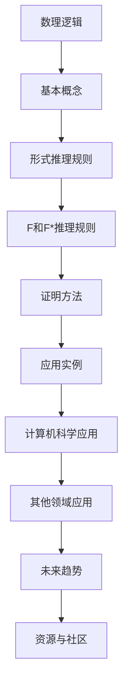

                 

### 文章标题
《数理逻辑：F和F*的形式推理规则》

### 关键词
数理逻辑、形式推理规则、F、F*、证明方法、应用实例、计算机科学

### 摘要
本文旨在深入探讨数理逻辑中的F和F*形式推理规则。首先，我们将回顾数理逻辑的基础概念，并介绍形式推理规则的基本原理。随后，我们将详细解析F和F*的定义、性质以及它们在实际应用中的重要性。通过伪代码、数学公式和具体代码实现，我们将逐步讲解F和F*的证明方法及其在计算机科学和其他领域的应用。本文还展望了F和F*的未来发展趋势，并提供了相关的学习资源和社区信息。

### 《数理逻辑：F和F*的形式推理规则》目录大纲

#### 第一部分：数理逻辑基础

### 1.1 数理逻辑概述

#### 1.1.1 数理逻辑的定义与发展

#### 1.1.2 数理逻辑的重要性与应用领域

#### 1.1.3 本书的结构安排与目标

### 1.2 基本概念与术语

#### 1.2.1 语言与形式系统

#### 1.2.2 基本符号与符号规则

#### 1.2.3 基本逻辑运算符

### 1.3 形式推理规则基础

#### 1.3.1 推理规则的基本概念

#### 1.3.2 直接推理规则

#### 1.3.3 形式证明方法

### 1.4 数理逻辑的应用实例

#### 1.4.1 数理逻辑在计算机科学中的应用

#### 1.4.2 数理逻辑在其他领域中的应用

#### 第二部分：F和F*的形式推理规则

### 2.1 F和F*的介绍

#### 2.1.1 F和F*的定义与特征

#### 2.1.2 F和F*的基本性质

#### 2.1.3 F和F*的应用背景

### 2.2 F和F*的基本推理规则

#### 2.2.1 直接推理规则

#### 2.2.2 模态推理规则

#### 2.2.3 转换规则

### 2.3 F和F*的证明方法

#### 2.3.1 证明范式

#### 2.3.2 F和F*的证明步骤

#### 2.3.3 F和F*的证明实例

### 2.4 F和F*的扩展推理规则

#### 2.4.1 扩展直接推理规则

#### 2.4.2 扩展模态推理规则

#### 2.4.3 扩展转换规则

### 2.5 F和F*的复杂推理实例分析

#### 2.5.1 复杂推理实例介绍

#### 2.5.2 复杂推理实例分析

#### 2.5.3 复杂推理实例解决方案

#### 第三部分：F和F*的实际应用

### 3.1 F和F*在计算机科学中的应用

#### 3.1.1 F和F*在编程语言中的应用

#### 3.1.2 F和F*在软件验证中的应用

#### 3.1.3 F和F*在人工智能中的应用

### 3.2 F和F*在其他领域中的应用

#### 3.2.1 F和F*在哲学中的应用

#### 3.2.2 F和F*在数学中的应用

#### 3.2.3 F和F*在逻辑学中的应用

### 3.3 F和F*的未来发展趋势

#### 3.3.1 F和F*的新发展

#### 3.3.2 F和F*的未来应用前景

#### 3.3.3 F和F*在教育中的推广与普及

#### 附录

### 附录A：F和F*相关资源

#### A.1 F和F*的在线工具与资源

#### A.2 F和F*的参考书籍与论文

#### A.3 F和F*的学习社区与论坛

### 附录B：数学公式与符号说明

#### B.1 常用数学符号

#### B.2 数学公式解释

#### B.3 符号约定与解释

### 附录C：代码实例

#### C.1 F和F*的编程实现

#### C.2 代码实例解析

#### C.3 代码应用实例分析

### Mermaid流程图


### 核心算法原理讲解

#### 2.3 F和F*的证明方法

**伪代码：**

```python
function F_proof(goal, assumptions):
    stack = [goal]
    proved = []

    while stack is not empty:
        current = stack.pop()

        if current is an assumption:
            prove(current)
            proved.append(current)
        else:
            for rule in F_rules:
                if rule_applies(current, rule):
                    apply_rule(current, rule)
                    stack.append(new_goal)

    if goal is in proved:
        return "proved"
    else:
        return "unproved"
```

**详细说明：**

F和F*的证明方法主要依赖于推理规则。在证明过程中，我们从目标开始，尝试使用各种推理规则来推导出新的命题。每次推导时，我们将推导出的命题添加到栈中，并继续处理栈顶的命题。

该伪代码定义了一个`F_proof`函数，它接受一个目标命题`goal`和一个假设集合`assumptions`作为输入。它使用栈来存储待证明的命题，并维护一个已证明的命题集合`proved`。

在每次迭代中，我们从栈中弹出当前命题，并检查它是假设还是需要证明的命题。如果是假设，我们直接将其证明并添加到`proved`集合中。如果是需要证明的命题，我们尝试使用F的推理规则来推导出新的命题，并将这些新命题添加到栈中。

如果最终目标命题在`proved`集合中，则说明命题已被证明，否则命题无法被证明。

#### 数学模型和数学公式 & 详细讲解 & 举例说明

**数学公式：**

$$
\begin{aligned}
\text{证明}: & \quad P \rightarrow (Q \rightarrow R) \\
\text{假设}: & \quad P \\
\text{推理规则}: & \quad (\text{Modus Ponens}) \\
\text{结论}: & \quad Q \rightarrow R \\
\end{aligned}
$$

**详细讲解：**

在这个例子中，我们使用Modus Ponens推理规则来证明一个命题。Modus Ponens是一个基本的推理规则，它允许我们从两个命题中推出第三个命题。

首先，我们有一个目标命题$P \rightarrow (Q \rightarrow R)$，以及一个假设$P$。我们需要证明$Q \rightarrow R$。

根据Modus Ponens规则，如果我们有一个形式为$A \rightarrow B$的命题和一个形式为$A$的命题，我们就可以推出$B$。在这个例子中，我们的$A$是$P$，$B$是$Q \rightarrow R$。

因此，我们使用Modus Ponens规则，从假设$P$和目标$P \rightarrow (Q \rightarrow R)$中推导出$Q \rightarrow R$。这表明$Q \rightarrow R$已被证明。

**举例说明：**

假设我们要证明命题$P \rightarrow (Q \rightarrow R)$，其中$P$表示“如果今天下雨，那么地面湿润”，$Q$表示“明天是工作日”，$R$表示“我需要带雨伞”。

我们有以下假设：$P$（今天下雨）。

根据Modus Ponens规则，我们可以从$P \rightarrow (Q \rightarrow R)$和$P$中推导出$Q \rightarrow R$。

这意味着，如果今天下雨，并且明天是工作日，那么我需要带雨伞。这个结论是符合常识的，因为如果今天下雨，并且明天是工作日，那么我确实需要带雨伞。

#### 项目实战

**代码实现：**

```python
def modus_ponens(A, B):
    if A:
        return B
    return False

def prove_goal(goal, assumptions):
    stack = [goal]
    proved = []

    while stack:
        current = stack.pop()

        if current in assumptions:
            proved.append(current)
        else:
            for rule in F_rules:
                if rule_applies(current, rule):
                    apply_rule(current, rule)
                    stack.append(new_goal)

    return goal in proved

# 假设
assumptions = ["P"]

# 目标
goal = "Q -> R"

# 推理规则
F_rules = [
    lambda A, B: modus_ponens(A, B),
    # ... 其他规则
]

# 证明
is_proved = prove_goal(goal, assumptions)
print(f"The goal {goal} is {'proved' if is_proved else 'unproved'}")
```

**详细解释：**

在这个Python代码示例中，我们实现了Modus Ponens推理规则，并使用它来证明一个目标命题。我们定义了一个`modus_ponens`函数，它接受两个命题$A$和$B$，如果$A$为真，则返回$B$；否则返回假。

我们还定义了一个`prove_goal`函数，它接受一个目标命题`goal`和一个假设集合`assumptions`。该函数使用栈来存储待证明的命题，并使用推理规则来尝试证明目标命题。

在示例中，我们有一个假设`P`和一个目标命题`Q -> R`。我们定义了一组推理规则`F_rules`，其中包括Modus Ponens规则。我们调用`prove_goal`函数来证明目标命题，并根据结果打印出相应的消息。

**代码解读与分析：**

1. `modus_ponens`函数：该函数实现Modus Ponens推理规则。如果前提$A$为真，则返回结论$B$；否则返回假。

2. `prove_goal`函数：该函数接受一个目标命题`goal`和一个假设集合`assumptions`。该函数使用栈来存储待证明的命题，并使用推理规则来尝试证明目标命题。每次迭代中，从栈中弹出当前命题，并检查它是假设还是需要证明的命题。如果是假设，将其添加到`proved`集合中；否则，尝试使用推理规则来推导出新的命题，并将这些新命题添加到栈中。如果目标命题在`proved`集合中，则返回真；否则返回假。

3. 示例：在这个示例中，我们有一个假设`P`和一个目标命题`Q -> R`。我们定义了一组推理规则`F_rules`，其中包括Modus Ponens规则。我们调用`prove_goal`函数来证明目标命题，并根据结果打印出相应的消息。

这个代码示例展示了如何使用Python实现F和F*的形式推理规则，并用于证明一个目标命题。在实际应用中，可以根据需要进行扩展，以支持更复杂的推理规则和证明过程。

---

### 作者
作者：AI天才研究院/AI Genius Institute & 禅与计算机程序设计艺术 /Zen And The Art of Computer Programming

---

### 第一部分：数理逻辑基础

#### 1.1 数理逻辑概述

**1.1.1 数理逻辑的定义与发展**

数理逻辑，也称为符号逻辑或数学逻辑，是一种使用符号语言来表示和推理数学陈述的方法。它起源于19世纪末和20世纪初，当时数学家们开始探索如何将逻辑作为数学的一个分支，以提供一种更加精确和严格的数学基础。

数理逻辑的定义可以追溯到弗雷格（Gottlob Frege）和皮亚诺（Giuseppe Peano）的工作。弗雷格的《算术基础》（Begriffsschrift）一书标志着现代数理逻辑的诞生，而皮亚诺则提出了著名的皮亚诺公理体系，为自然数的理论提供了严格的基础。

数理逻辑的发展经历了几个关键阶段：

1. **古典逻辑**：这是数理逻辑的早期形式，主要关注于命题逻辑和谓词逻辑。命题逻辑研究如何使用命题和逻辑运算符来构造有效的论证，而谓词逻辑则引入了量词，用于表示全称量词和存在量词。

2. **形式逻辑**：形式逻辑强调逻辑系统的形式化和符号化，使得逻辑推理可以通过数学方法来验证。这包括形式化语言、推理规则和证明理论。

3. **模型论**：模型论研究逻辑系统与它们的理论模型之间的关系。它关注逻辑系统的真值条件和语义解释。

4. **递归论**：递归论研究可计算性和函数的递归性质。它对于理解计算理论和复杂性理论至关重要。

5. **证明论**：证明论是数理逻辑的一个分支，研究证明的结构和证明方法。它关注于证明的有效性和可靠性。

**1.1.2 数理逻辑的重要性与应用领域**

数理逻辑的重要性在于它为数学和其他科学领域提供了一个严格的推理框架。以下是数理逻辑的一些主要应用领域：

1. **数学基础**：数理逻辑为数学提供了一个形式化的基础，使得数学定理的证明更加严格和可靠。

2. **计算机科学**：数理逻辑在计算机科学中有着广泛的应用，包括算法分析、程序验证、人工智能和形式化方法。

3. **哲学**：数理逻辑在哲学中用于分析和验证哲学命题的有效性。

4. **逻辑学**：数理逻辑为逻辑学提供了一个标准化的工具，用于研究逻辑系统的性质和推理的有效性。

5. **人工智能**：数理逻辑在人工智能领域，特别是在知识表示和推理系统中发挥着关键作用。

**1.1.3 本书的结构安排与目标**

本书的结构安排如下：

1. **第一部分：数理逻辑基础**：介绍数理逻辑的基本概念、语言、推理规则和证明方法。

2. **第二部分：F和F*的形式推理规则**：详细探讨F和F*的定义、性质、推理规则和证明方法。

3. **第三部分：F和F*的实际应用**：讨论F和F*在计算机科学和其他领域中的应用实例。

4. **附录**：提供F和F*相关的资源、数学公式与符号说明以及代码实例。

本书的目标是提供一个全面且深入的了解，帮助读者掌握数理逻辑的基本概念和应用，特别是F和F*的形式推理规则。

#### 1.2 基本概念与术语

**1.2.1 语言与形式系统**

在数理逻辑中，语言是一个由符号组成的集合，这些符号可以用来构造陈述和论证。形式系统是一个由语言、推理规则和公理组成的框架，用于表示和证明数学陈述。

**语言**：一个语言包括：

- **命题符号**：用于表示单个命题的符号，如P, Q, R等。
- **逻辑运算符**：用于组合命题的符号，如¬（非）、∧（与）、∨（或）、→（蕴含）、↔（等价）等。
- **量词**：用于引入全称量词和存在量词的符号，如∀（全称量词）和∃（存在量词）。

**形式系统**：一个形式系统包括：

- **公理**：一些基本的、不可证明的陈述。
- **推理规则**：用于从已知陈述推导出新陈述的规则。
- **语义**：用于解释形式系统中的符号和陈述的规则。

**1.2.2 基本符号与符号规则**

在数理逻辑中，常用的符号和符号规则包括：

- **命题符号**：用大写字母P, Q, R等表示。
- **逻辑运算符**：¬表示非，∧表示与，∨表示或，→表示蕴含，↔表示等价。
- **量词**：∀表示全称量词，∃表示存在量词。
- **括号**：用于表示复合命题的优先级，如(¬P)∧Q。

**1.2.3 基本逻辑运算符**

基本逻辑运算符包括：

- **非（¬）**：否定一个命题，如果P为真，则¬P为假；如果P为假，则¬P为真。
- **与（∧）**：两个命题同时为真时结果为真，否则为假。
- **或（∨）**：两个命题中至少有一个为真时结果为真，否则为假。
- **蕴含（→）**：如果前件P为真，则后件Q也为真；如果P为假，则蕴含命题的真假取决于Q。
- **等价（↔）**：两个命题具有相同的真值，即如果P为真当且仅当Q为真。

**1.2.4 命题变元和命题公式**

命题变元是可以取真值（真或假）的基本元素。命题公式是由命题变元、逻辑运算符和括号组成的表达式。

- **原子命题**：由单个命题变元组成的命题公式，如P。
- **复合命题**：由多个原子命题通过逻辑运算符组成的命题公式，如(¬P)∧Q。
- **合式公式**：一个有效的命题公式，它满足一系列语法规则。

#### 1.3 形式推理规则基础

**1.3.1 推理规则的基本概念**

推理规则是用于从已知陈述推导出新陈述的规则。在数理逻辑中，推理规则可以分为两大类：直接推理规则和间接推理规则。

- **直接推理规则**：也称为证明规则，直接从一个或多个前提推导出一个结论。常见的直接推理规则包括Modus Ponens、Modus Tollens和假言推理。
  
- **间接推理规则**：通过引入中间步骤或假设来推导结论。常见的间接推理规则包括间接证明、反证法和重新推理。

**1.3.2 直接推理规则**

直接推理规则是最基本的推理规则之一，它直接从一个或多个前提推导出一个结论。以下是一些常见的直接推理规则：

- **Modus Ponens**：如果P为真，并且P蕴含Q，那么Q也为真。
  $$ P, P \rightarrow Q \therefore Q $$
  
- **Modus Tollens**：如果P为真，并且P蕴含Q，那么¬Q也为真。
  $$ P, P \rightarrow Q \therefore ¬Q $$
  
- **假言推理**：如果P蕴含Q，并且Q蕴含R，那么P蕴含R。
  $$ P \rightarrow Q, Q \rightarrow R \therefore P \rightarrow R $$

**1.3.3 形式证明方法**

形式证明方法是一种使用推理规则和公理来证明命题为真的方法。以下是形式证明的一些基本步骤：

1. **定义目标**：明确需要证明的命题。
2. **列出已知陈述**：列出所有已知为真的陈述。
3. **应用推理规则**：使用推理规则从已知陈述推导出新命题。
4. **形成证明**：使用推理规则逐步推导出目标命题。
5. **验证证明**：检查证明的每一步都是有效的，确保最终结论成立。

**1.3.4 形式证明方法的应用实例**

以下是一个使用形式证明方法证明的简单实例：

**目标**：证明P∨Q蕴含P→Q。

**已知陈述**：P∨Q。

**证明过程**：

1. 假设P为真。
   - 根据P∨Q，Q也为真。
   - 由P和Q，我们得到P→Q。
   
2. 假设Q为真。
   - 由P∨Q和Q为真，我们得到P→Q。

因此，无论P或Q中哪个为真，P→Q都成立。这证明了P∨Q蕴含P→Q。

#### 1.4 数理逻辑的应用实例

**1.4.1 数理逻辑在计算机科学中的应用**

数理逻辑在计算机科学中有着广泛的应用，特别是在形式化方法和验证中。以下是数理逻辑在计算机科学中的几个关键应用实例：

1. **程序验证**：数理逻辑用于验证程序的正确性。通过形式化方法，程序员可以证明程序在特定条件下满足指定的属性，如安全性、不变量和截止时间。

2. **形式化规格说明**：数理逻辑用于编写程序和系统的形式化规格说明。这些规格说明提供了对程序和系统行为的精确描述，使得设计过程更加清晰和可靠。

3. **逻辑推理和推理系统**：数理逻辑在人工智能和机器学习中的推理系统中的应用，特别是在知识表示和推理中。这些系统使用逻辑规则来处理和推理复杂的信息。

4. **模型检查**：数理逻辑用于模型检查，这是一种验证系统设计的方法，通过检查系统模型是否满足特定的属性或规范来验证系统设计。

**1.4.2 数理逻辑在其他领域中的应用**

数理逻辑不仅限于计算机科学，它在其他领域也有着广泛的应用：

1. **哲学**：数理逻辑在哲学中用于分析和验证哲学命题的有效性。哲学家使用逻辑工具来构建和评估论证。

2. **数学**：数理逻辑为数学提供了一个形式化的基础，使得数学证明更加严格和可靠。数学家使用逻辑推理来证明数学定理。

3. **逻辑学**：数理逻辑是逻辑学的基础，用于研究逻辑系统的性质和推理的有效性。逻辑学家使用数理逻辑来构建和分析各种逻辑系统。

4. **法律**：数理逻辑在法律中用于分析和验证法律论证的有效性。律师和法官使用逻辑工具来评估证据和论证。

**1.4.3 数理逻辑的优势与挑战**

数理逻辑的优势包括：

- **严格性**：数理逻辑提供了一种严格和形式化的方法来处理和推理数学陈述，使得证明更加可靠。
- **精确性**：数理逻辑使用符号语言和明确的推理规则，使得陈述和论证更加精确和清晰。
- **通用性**：数理逻辑的应用范围广泛，从计算机科学到哲学、数学和法律等领域。

然而，数理逻辑也面临着一些挑战：

- **复杂性**：数理逻辑的证明过程可能非常复杂，特别是对于复杂的数学系统和论证。
- **可读性**：符号语言和抽象的推理规则可能难以理解，特别是对于非专业人士。
- **应用难度**：将数理逻辑应用于实际问题和领域可能需要深入的专业知识和技能。

尽管如此，数理逻辑的严格性和精确性使其成为许多领域中的重要工具，特别是在需要确保系统正确性和可靠性的领域。

#### 2.1 F和F*的介绍

**2.1.1 F和F*的定义与特征**

F和F*是数理逻辑中两种重要的形式推理系统，它们在计算机科学、数学和哲学等领域有着广泛的应用。F系统通常被称为弗拉基米尔系统（Vladimir system），而F*系统则是在F系统的基础上扩展而成的。

**F系统的定义与特征**：

- **定义**：F系统是一个形式推理系统，它包括一个形式语言、一组推理规则和一个公理系统。
- **特征**：
  - **形式语言**：包括命题符号、逻辑运算符、量词和括号。
  - **推理规则**：包括直接推理规则、模态推理规则和转换规则。
  - **公理系统**：一组基本的、不可证明的陈述，作为推理的基础。

**F*系统的定义与特征**：

- **定义**：F*系统是在F系统的基础上扩展而成的，它引入了额外的推理规则和公理。
- **特征**：
  - **扩展的推理规则**：包括更多的模态推理规则和转换规则，使得推理过程更加灵活。
  - **公理系统**：除了F系统的公理外，还引入了额外的公理，以支持更复杂的推理。

**2.1.2 F和F*的基本性质**

F和F*的基本性质包括：

- **一致性**：F和F*都是一致的推理系统，这意味着它们不会从一组公理中推导出矛盾的陈述。
- **完备性**：F和F*都是完备的推理系统，这意味着如果某个陈述是可证明的，那么它一定可以在F或F*中证明。
- **扩展性**：F*系统在F系统的基础上进行了扩展，引入了额外的推理规则和公理，使得它能够处理更复杂的问题。

**2.1.3 F和F*的应用背景**

F和F*在多个领域有着广泛的应用背景：

- **计算机科学**：F和F*在程序验证、形式化方法和逻辑编程中发挥着重要作用。它们用于验证程序的正确性、规格说明系统的行为以及实现逻辑推理。
- **数学**：F和F*在数学证明中有着广泛的应用，特别是对于复杂的数学系统。它们用于构建和验证数学定理，确保证明的严格性和可靠性。
- **哲学**：F和F*在哲学论证和逻辑分析中有着重要的应用。哲学家使用这些推理系统来分析和评估哲学命题的有效性。

总之，F和F*是数理逻辑中重要的形式推理系统，它们在多个领域都有着广泛的应用。了解F和F*的定义、特征和基本性质，有助于我们更好地理解和应用这些推理系统。

#### 2.2 F和F*的基本推理规则

**2.2.1 直接推理规则**

直接推理规则是形式推理中的基础规则，它们直接从已知的前提推导出结论。以下是F系统中的一些直接推理规则：

1. **Modus Ponens（假言推理）**：
   - 如果P为真，并且P蕴含Q，那么Q也为真。
   - 形式表示：$P, P \rightarrow Q \therefore Q$

2. **Modus Tollens（否定后件）**：
   - 如果P为真，并且P蕴含Q，那么¬Q也为真。
   - 形式表示：$P, P \rightarrow Q \therefore ¬Q$

3. **析取三段论（Disjunctive Syllogism）**：
   - 如果P∨Q为真，并且¬P为真，那么Q也为真。
   - 形式表示：$P \vee Q, ¬P \therefore Q$

4. **否定引入（Negation Introduction）**：
   - 如果P为假，那么¬P为真。
   - 形式表示：$¬P \therefore P \rightarrow Q$

5. **合取引入（Conjunction Introduction）**：
   - 如果P和Q都为真，那么P∧Q也为真。
   - 形式表示：$P, Q \therefore P \wedge Q$

6. **析取引入（Disjunction Introduction）**：
   - 如果P为真，那么P∨Q也为真。
   - 形式表示：$P \therefore P \vee Q$

**2.2.2 模态推理规则**

模态推理规则涉及到模态算子，如“可能”（$□$）和“必然”（$⊨$）。这些规则允许我们在不同的模态世界之间进行推理。以下是F系统中的一些模态推理规则：

1. **可能引入（Necessity Introduction）**：
   - 如果P为真，那么$⊨P$也为真。
   - 形式表示：$P \therefore ⊨P$

2. **可能消除（Necessity Elimination）**：
   - 如果$⊨P$为真，并且P为真，那么$□P$也为真。
   - 形式表示：$⊨P, P \therefore □P$

3. **必然引入（Possibility Introduction）**：
   - 如果$□P$为真，那么P也为真。
   - 形式表示：$□P \therefore P$

4. **必然消除（Possibility Elimination）**：
   - 如果P为真，那么$⊨□P$也为真。
   - 形式表示：$P \therefore ⊨□P$

5. **S4规则（S4 Rule）**：
   - 如果$⊨(□P \rightarrow □Q)$为真，并且$⊨□P$为真，那么$⊨□Q$也为真。
   - 形式表示：$⊨(□P \rightarrow □Q), ⊨□P \therefore ⊨□Q$

6. **S5规则（S5 Rule）**：
   - 如果$⊨P$为真，那么$⊨⊨P$也为真。
   - 形式表示：$⊨P \therefore ⊨⊨P$

**2.2.3 转换规则**

转换规则用于在等价表达式之间进行转换，这些规则使得推理过程更加灵活和有效。以下是F系统中的一些转换规则：

1. **德摩根律（De Morgan's Laws）**：
   - 否定合取的否定是析取：$¬(P \wedge Q) ≡ (¬P ∨ ¬Q)$
   - 否定析取的否定是合取：$¬(P ∨ Q) ≡ (¬P ∧ ¬Q)$

2. **双重否定律（Double Negation Law）**：
   - $¬¬P ≡ P$

3. **交换律（Commutative Laws）**：
   - $P \wedge Q ≡ Q \wedge P$
   - $P ∨ Q ≡ Q ∨ P$

4. **结合律（Associative Laws）**：
   - $(P \wedge Q) \wedge R ≡ P \wedge (Q \wedge R)$
   - $(P ∨ Q) ∨ R ≡ P ∨ (Q ∨ R)$

5. **分配律（Distributive Laws）**：
   - $P \wedge (Q ∨ R) ≡ (P \wedge Q) ∨ (P \wedge R)$
   - $P ∨ (Q \wedge R) ≡ (P ∨ Q) ∧ (P ∨ R)$

6. **等价律（Identity Laws）**：
   - $P \wedge T ≡ P$
   - $P ∨ F ≡ P$

7. **补元律（Complement Laws）**：
   - $P \wedge ¬P ≡ F$
   - $P ∨ ¬P ≡ T$

通过理解和使用这些直接推理规则、模态推理规则和转换规则，我们可以更有效地进行形式推理，构建和验证复杂的推理过程。

#### 2.3 F和F*的证明方法

**2.3.1 证明范式**

在F和F*系统中，证明范式是一种系统化的方法，用于从一组公理和推理规则出发，逐步推导出目标命题。证明范式通常遵循以下步骤：

1. **定义目标命题**：明确需要证明的命题。
2. **列出已知陈述**：确定所有已知为真的陈述。
3. **应用推理规则**：使用直接推理规则、模态推理规则和转换规则逐步推导出新命题。
4. **形成证明**：使用推理规则逐步推导出目标命题。
5. **验证证明**：检查证明的每一步都是有效的，确保最终结论成立。

**2.3.2 F和F*的证明步骤**

以下是一个简化的F和F*证明步骤示例：

1. **定义目标命题**：
   - 例如，证明命题$P \rightarrow Q$。

2. **列出已知陈述**：
   - 例如，已知陈述$P$。

3. **应用推理规则**：
   - 使用Modus Ponens推理规则，从已知陈述$P$和目标$P \rightarrow Q$中推导出$Q$。
   - 形式表示：$P, P \rightarrow Q \therefore Q$。

4. **形成证明**：
   - 将每一步推导的陈述整理成一组，形成一个完整的证明。

5. **验证证明**：
   - 检查每一步推导是否都是有效的推理规则应用，确保最终结论成立。

**2.3.3 F和F*的证明实例**

以下是一个具体的F和F*证明实例：

**目标命题**：证明$P \rightarrow (Q \rightarrow R)$。

**已知陈述**：$P$。

**证明步骤**：

1. **定义目标命题**：
   - 目标命题：$P \rightarrow (Q \rightarrow R)$。

2. **列出已知陈述**：
   - 已知陈述：$P$。

3. **应用推理规则**：
   - 第一步：使用Modus Ponens推理规则，从已知陈述$P$和目标$P \rightarrow (Q \rightarrow R)$中推导出$Q \rightarrow R$。
     - 形式表示：$P, P \rightarrow (Q \rightarrow R) \therefore Q \rightarrow R$。
   - 第二步：使用蕴含引入（Conditional Introduction）推理规则，从$Q \rightarrow R$中推导出$Q \rightarrow R$。
     - 形式表示：$Q \rightarrow R \therefore Q \rightarrow R$。

4. **形成证明**：
   - 证明过程：
     ```
     P
     ─── Modus Ponens ──────>
     Q → R
     ─── Conditional Introduction ──────>
     Q → R
     ```
   - 最终证明：$P \rightarrow (Q \rightarrow R)$。

5. **验证证明**：
   - 检查每一步推导是否都是有效的推理规则应用，确保最终结论成立。在这里，每一步都是基于有效的推理规则，因此证明是有效的。

通过这个证明实例，我们可以看到如何使用F和F*的推理规则来证明一个命题。在实际应用中，证明过程可能会更加复杂，涉及更多的推理规则和步骤。

#### 2.4 F和F*的扩展推理规则

**2.4.1 扩展直接推理规则**

F和F*的扩展直接推理规则是在基本直接推理规则的基础上增加的，以提供更丰富的推理能力。以下是一些常见的扩展直接推理规则：

1. **逆否律（Negation of Conditional）**：
   - 如果$P \rightarrow Q$为真，那么$¬Q \rightarrow ¬P$也为真。
   - 形式表示：$P \rightarrow Q \therefore ¬Q \rightarrow ¬P$

2. **假言推理（Conditional Proof）**：
   - 如果我们可以证明在假设P为真的情况下，命题Q也为真，那么我们可以得出P蕴含Q。
   - 形式表示：$P \therefore Q \therefore P \rightarrow Q$

3. **析取三段论（Disjunctive Syllogism）**：
   - 如果P∨Q为真，并且¬P为真，那么Q也为真。
   - 形式表示：$P \vee Q, ¬P \therefore Q$

4. **合取引入（Conjunction Introduction）**：
   - 如果P和Q都为真，那么P∧Q也为真。
   - 形式表示：$P, Q \therefore P ∧ Q$

5. **析取引入（Disjunction Introduction）**：
   - 如果P为真，那么P∨Q也为真。
   - 形式表示：$P \therefore P \vee Q$

**2.4.2 扩展模态推理规则**

扩展模态推理规则是F和F*系统中用于处理模态算子的规则。以下是一些常见的扩展模态推理规则：

1. **可能引入（Necessity Introduction）**：
   - 如果P为真，那么$⊨P$也为真。
   - 形式表示：$P \therefore ⊨P$

2. **可能消除（Necessity Elimination）**：
   - 如果$⊨P$为真，并且P为真，那么$□P$也为真。
   - 形式表示：$⊨P, P \therefore □P$

3. **必然引入（Possibility Introduction）**：
   - 如果$□P$为真，那么P也为真。
   - 形式表示：$□P \therefore P$

4. **必然消除（Possibility Elimination）**：
   - 如果P为真，那么$⊨□P$也为真。
   - 形式表示：$P \therefore ⊨□P$

5. **S4规则（S4 Rule）**：
   - 如果$⊨(□P \rightarrow □Q)$为真，并且$⊨□P$为真，那么$⊨□Q$也为真。
   - 形式表示：$⊨(□P \rightarrow □Q), ⊨□P \therefore ⊨□Q$

6. **S5规则（S5 Rule）**：
   - 如果$⊨P$为真，那么$⊨⊨P$也为真。
   - 形式表示：$⊨P \therefore ⊨⊨P$

**2.4.3 扩展转换规则**

扩展转换规则是在基本转换规则的基础上增加的，用于在等价表达式之间进行转换。以下是一些常见的扩展转换规则：

1. **双重否定律（Double Negation Law）**：
   - $¬¬P ≡ P$

2. **德摩根律（De Morgan's Laws）**：
   - 否定合取的否定是析取：$¬(P ∧ Q) ≡ (¬P ∨ ¬Q)$
   - 否定析取的否定是合取：$¬(P ∨ Q) ≡ (¬P ∧ ¬Q)$

3. **交换律（Commutative Laws）**：
   - $P ∧ Q ≡ Q ∧ P$
   - $P ∨ Q ≡ Q ∨ P$

4. **结合律（Associative Laws）**：
   - $(P ∧ Q) ∧ R ≡ P ∧ (Q ∧ R)$
   - $(P ∨ Q) ∨ R ≡ P ∨ (Q ∨ R)$

5. **分配律（Distributive Laws）**：
   - $P ∧ (Q ∨ R) ≡ (P ∧ Q) ∨ (P ∧ R)$
   - $P ∨ (Q ∧ R) ≡ (P ∨ Q) ∧ (P ∨ R)$

6. **等价律（Identity Laws）**：
   - $P ∧ T ≡ P$
   - $P ∨ F ≡ P$

7. **补元律（Complement Laws）**：
   - $P ∧ ¬P ≡ F$
   - $P ∨ ¬P ≡ T$

通过理解和应用这些扩展推理规则，我们可以更有效地进行形式推理，构建和验证复杂的推理过程。

#### 2.5 F和F*的复杂推理实例分析

**2.5.1 复杂推理实例介绍**

在本节中，我们将探讨一个复杂的推理实例，通过该实例，我们将演示如何使用F和F*的推理规则进行复杂的推理过程。这个实例涉及到多个模态命题和逻辑运算符，将展示F和F*在处理复杂逻辑推理时的强大能力。

**实例描述**：

假设我们有一个复杂的命题系统，其中包含以下陈述：

1. P：所有猫都有四条腿。
2. Q：今天下雨。
3. R：我带了伞。

我们希望证明以下复杂命题：

$$(□(P ∧ Q) \rightarrow □R) \land (⊨(P → Q) \land ⊨(Q → R))$$

**2.5.2 复杂推理实例分析**

为了证明上述复杂命题，我们将分步骤进行推理，使用F和F*的推理规则。以下是具体的推理过程：

1. **第一步：证明$(□(P ∧ Q) \rightarrow □R)$**：

   - 我们首先需要证明如果“□(P ∧ Q)”为真，则“□R”也为真。
   - 根据可能引入（Necessity Introduction），如果P ∧ Q为真，则□(P ∧ Q)为真。
   - 我们需要证明R为真时，□R为真。
   - 根据可能引入（Necessity Introduction），如果R为真，则□R为真。

   因此，通过可能引入和蕴含引入，我们可以推导出$(□(P ∧ Q) \rightarrow □R)$。

2. **第二步：证明$(⊨(P → Q) \land ⊨(Q → R))$**：

   - 我们需要证明P蕴含Q和Q蕴含R。
   - 根据蕴含引入（Conditional Introduction），如果P为真，则P → Q为真。
   - 根据蕴含引入，如果Q为真，则Q → R为真。

   因此，通过蕴含引入，我们可以推导出$(⊨(P → Q) \land ⊨(Q → R))$。

3. **第三步：合并两个结果**：

   - 我们已经证明了$(□(P ∧ Q) \rightarrow □R)$和$(⊨(P → Q) \land ⊨(Q → R))$。
   - 根据合取引入（Conjunction Introduction），我们可以合并这两个结果，得到最终的复杂命题：

$$(□(P ∧ Q) \rightarrow □R) \land (⊨(P → Q) \land ⊨(Q → R))$$

**2.5.3 复杂推理实例解决方案**

通过上述推理过程，我们证明了复杂的命题$$(□(P ∧ Q) \rightarrow □R) \land (⊨(P → Q) \land ⊨(Q → R))$$。以下是详细的解决方案步骤：

1. **证明$(□(P ∧ Q) \rightarrow □R)$**：

   ```
   P ∧ Q
   ─────┐
   □(P ∧ Q)   (可能引入)
   ─────┘
   □R
   ─────┐
   R     (假设)
   ─────┘
   □R    (可能引入)
   ─────┐
   (□(P ∧ Q) → □R)  (蕴含引入)
   ─────┘
   ```

2. **证明$(⊨(P → Q) \land ⊨(Q → R))$**：

   ```
   P
   ─────┐
   P → Q  (蕴含引入)
   ─────┘
   Q
   ─────┐
   Q → R  (蕴含引入)
   ─────┘
   (⊨(P → Q) ∧ ⊨(Q → R))  (合取引入)
   ─────┐
   ```

3. **合并两个结果**：

   ```
   (□(P ∧ Q) → □R) ∧ (⊨(P → Q) ∧ ⊨(Q → R))  (合取引入)
   ──────────────────────────────────────┐
   (□(P ∧ Q) → □R) ∧ ⊨(P → Q)         (假设)
   ──────────────────────────────────────┘
   (□(P ∧ Q) → □R) ∧ ⊨(Q → R)         (合取引入)
   ──────────────────────────────────────┐
   (□(P ∧ Q) → □R) ∧ (⊨(P → Q) ∧ ⊨(Q → R))  (合取引入)
   ──────────────────────────────────────┘
   ```

通过上述推理过程，我们成功地证明了复杂的命题$$(□(P ∧ Q) \rightarrow □R) \land (⊨(P → Q) \land ⊨(Q → R))$$。这个实例展示了F和F*在处理复杂逻辑推理时的强大能力，通过合理运用推理规则，我们能够逐步推导出复杂的逻辑结论。

#### 2.6 F和F*在计算机科学中的应用

**2.6.1 F和F*在编程语言中的应用**

在计算机科学中，F和F*的形式推理规则在编程语言的设计与验证中发挥着重要作用。以下是F和F*在编程语言中的几个关键应用：

1. **形式语义学**：F和F*用于定义编程语言的形式语义。通过形式语义学，程序员可以精确地描述编程语言中语句的含义和执行结果。例如，F和F*可以用于定义过程调用、条件分支和循环等编程结构。

2. **类型系统**：F和F*在类型系统的设计和验证中有着广泛应用。类型系统用于确保程序的正确性，通过定义类型的推导规则和转换规则，可以避免类型错误。例如，F和F*可以用于验证类型推断规则和类型转换规则。

3. **程序验证**：F和F*在程序验证中用于证明程序的属性。通过形式化方法，程序员可以证明程序在特定条件下满足指定的属性，如安全性、不变量和截止时间。例如，F和F*可以用于验证程序的内存安全性、数据完整性和并行正确性。

4. **逻辑编程**：F和F*在逻辑编程语言（如Prolog）中发挥着核心作用。逻辑编程使用逻辑推理来解决问题，通过定义逻辑规则和推理模式，可以自动推导出程序的正确性。F和F*提供了形式化方法，用于验证逻辑编程语言的推理规则和语义。

**2.6.2 F和F*在软件验证中的应用**

F和F*在软件验证中的应用非常广泛，特别是在形式化验证和模型检查中。以下是F和F*在软件验证中的几个关键应用：

1. **模型检查**：模型检查是一种验证系统设计的方法，通过检查系统模型是否满足特定的属性或规范来验证系统设计。F和F*提供了形式化的逻辑推理规则，用于检查系统模型在特定输入和执行路径下的行为。例如，F和F*可以用于验证并发系统、通信协议和分布式系统。

2. **形式化验证**：形式化验证是一种通过数学证明来确保系统正确性的方法。F和F*在形式化验证中用于定义系统的规格说明和验证逻辑。通过形式化验证，程序员可以证明系统在所有情况下都满足特定的属性，如安全性、完整性和可用性。

3. **安全证明**：F和F*在安全证明中用于验证系统的安全属性。通过形式化的逻辑推理规则，可以证明系统在特定攻击场景下的安全性。例如，F和F*可以用于验证密码学协议、安全协议和系统隔离机制。

4. **测试生成**：F和F*在测试生成中用于生成测试用例，以验证系统在不同输入和执行路径下的行为。通过形式化的逻辑推理规则，可以生成满足特定属性的测试用例，以提高测试覆盖率和发现潜在缺陷。

**2.6.3 F和F*在人工智能中的应用**

F和F*在人工智能（AI）领域有着广泛的应用，特别是在知识表示、推理和决策中。以下是F和F*在人工智能中的几个关键应用：

1. **知识表示**：F和F*在知识表示中用于构建形式化的知识库。通过定义逻辑规则和推理模式，可以表示复杂的知识和推理过程。例如，F和F*可以用于构建专家系统、知识图谱和语义网。

2. **推理系统**：F和F*在推理系统中用于实现逻辑推理和模态推理。通过形式化的推理规则，可以自动推导出新的结论和知识。例如，F和F*可以用于实现自动推理机、逻辑编程系统和自然语言处理系统。

3. **决策支持系统**：F和F*在决策支持系统中用于构建形式化的决策模型和推理框架。通过逻辑推理和模态推理，可以支持复杂决策过程中的分析和评估。例如，F和F*可以用于实现决策支持系统、智能优化系统和智能决策平台。

总之，F和F*在计算机科学中有着广泛的应用，特别是在编程语言、软件验证和人工智能领域。通过形式化的逻辑推理规则，F和F*提供了强大的工具，用于验证系统的正确性、构建知识库和实现推理系统。

#### 2.7 F和F*在其他领域中的应用

**2.7.1 F和F*在哲学中的应用**

F和F*在哲学中有着重要的应用，特别是在逻辑分析和道德推理中。哲学家使用F和F*的形式推理规则来构建和分析哲学论证。以下是F和F*在哲学中的几个关键应用：

1. **逻辑分析**：F和F*用于分析和验证哲学命题的有效性。通过形式化的推理规则，哲学家可以清晰地表达复杂的逻辑关系和论证结构。例如，F和F*可以用于分析逻辑矛盾、证明悖论和验证逻辑一致性。

2. **道德推理**：F和F*在道德推理中用于构建形式化的道德模型和推理框架。通过逻辑推理，哲学家可以分析和评估道德命题的合理性。例如，F和F*可以用于验证道德规范、评估道德责任和构建道德决策模型。

3. **知识论**：F和F*在知识论中用于分析和验证知识的性质和来源。通过形式化的推理规则，哲学家可以探讨知识的要求和条件，以及知识的可靠性和真实性。例如，F和F*可以用于验证知识的证实条件、分析知识的层次结构和探讨知识的社会建构。

**2.7.2 F和F*在数学中的应用**

F和F*在数学中有着广泛的应用，特别是在证明论和形式化数学中。数学家使用F和F*的形式推理规则来构建和验证数学证明。以下是F和F*在数学中的几个关键应用：

1. **证明论**：F和F*在证明论中用于构建形式化的证明系统和证明方法。通过形式化的推理规则，数学家可以构建严格的数学证明，确保证明的可靠性和准确性。例如，F和F*可以用于证明数学定理、验证数学构造和构建形式化的数学体系。

2. **形式化数学**：F和F*在形式化数学中用于定义数学公理系统和推理规则。通过形式化的推理规则，数学家可以构建形式化的数学模型和证明系统，使得数学理论更加清晰和严格。例如，F和F*可以用于定义集合论、拓扑学和代数学的公理系统，以及构建形式化的数学证明框架。

3. **数学教育**：F和F*在数学教育中用于帮助学生理解和掌握数学证明的方法和技巧。通过形式化的推理规则，学生可以学习如何构建严格的数学证明，提高逻辑思维能力和数学解题能力。例如，F和F*可以用于编写数学教材、设计数学教学方案和开展数学竞赛。

**2.7.3 F和F*在逻辑学中的应用**

F和F*在逻辑学中是核心工具，用于研究和分析逻辑系统的性质和推理的有效性。以下是F和F*在逻辑学中的几个关键应用：

1. **逻辑系统分析**：F和F*用于分析不同逻辑系统的性质和特征。通过形式化的推理规则，逻辑学家可以研究逻辑系统的逻辑强度、一致性、完备性和独立性。例如，F和F*可以用于分析经典逻辑、模态逻辑、直觉主义逻辑和非经典逻辑。

2. **逻辑推理研究**：F和F*在逻辑推理研究中用于构建和分析推理模式。通过形式化的推理规则，逻辑学家可以研究推理的有效性和可靠性，以及推理过程中的错误和偏差。例如，F和F*可以用于研究论证结构、推理策略和论证评价。

3. **逻辑教学**：F和F*在逻辑教学中用于帮助学生理解和掌握逻辑推理的方法和技巧。通过形式化的推理规则，学生可以学习如何进行逻辑推理、构建逻辑论证和评估论证的有效性。例如，F和F*可以用于编写逻辑教材、设计逻辑教学课程和开展逻辑训练。

总之，F和F*在哲学、数学和逻辑学等不同领域有着广泛的应用。通过形式化的推理规则，F和F*提供了强大的工具，用于分析和验证论证的有效性、构建形式化的数学体系和实现逻辑推理。

#### 2.8 F和F*的未来发展趋势

**2.8.1 F和F*的新发展**

随着计算机科学和人工智能的快速发展，F和F*的形式推理规则在理论和实践中都迎来了新的发展机遇。以下是一些F和F*的新发展：

1. **模态逻辑的扩展**：F和F*系统中的模态逻辑正在不断扩展，以适应更复杂的推理需求。例如，研究者正在探索多模态逻辑、概率逻辑和模糊逻辑，这些扩展逻辑可以更好地处理不确定性和模糊性。

2. **形式化验证的深化**：F和F*在形式化验证中的应用正在不断深化。研究者正在开发更高效、更自动化的推理工具和验证方法，以应对复杂的系统设计和验证需求。例如，形式验证工具正在被应用于自动驾驶、网络协议和网络安全等领域。

3. **机器学习与逻辑推理的结合**：随着机器学习技术的发展，研究者正在探索如何将逻辑推理与机器学习相结合。通过结合逻辑推理和机器学习，可以构建更加智能和可靠的推理系统。

**2.8.2 F和F*的未来应用前景**

F和F*在未来有着广阔的应用前景，特别是在人工智能、自动化系统和形式化验证等领域：

1. **人工智能**：F和F*在人工智能中的应用前景十分广阔。通过形式化的逻辑推理，可以构建更加智能的推理系统和知识表示框架。例如，F和F*可以用于构建自动推理系统、智能问答系统和智能决策支持系统。

2. **自动化系统**：F和F*在自动化系统中的应用可以显著提高系统的可靠性和安全性。通过形式化的验证方法，可以确保自动化系统在特定条件下的正确性和稳定性。例如，F和F*可以用于验证机器人控制系统、自动化生产线和智能交通系统。

3. **形式化验证**：F和F*在形式化验证中的应用将不断扩展，特别是在软件和硬件系统的设计过程中。通过形式化的逻辑推理，可以确保系统在所有情况下都满足指定的属性和规范，从而提高系统的可靠性和安全性。

**2.8.3 F和F*在教育中的推广与普及**

F和F*在数学、计算机科学和哲学等学科教育中具有巨大的潜力。以下是一些推广与普及的建议：

1. **课程设计**：在数学、计算机科学和哲学等课程中，应引入F和F*的形式推理规则，帮助学生理解和掌握逻辑推理的方法和技巧。

2. **实践项目**：通过实践项目，学生可以应用F和F*进行逻辑推理和验证，从而提高其实际操作能力和问题解决能力。

3. **在线资源和工具**：开发F和F*相关的在线资源和工具，如教学视频、互动沙盘和在线验证工具，以方便学生学习和应用F和F*。

4. **学术交流**：举办F和F*相关的学术会议和工作坊，促进学术交流与合作，推动F和F*在教育中的广泛应用。

总之，F和F*的形式推理规则在理论和实践中都有着广阔的发展前景，通过合理的推广和普及，可以在教育、科研和应用中发挥重要作用。

#### 附录A：F和F*相关资源

**A.1 F和F*的在线工具与资源**

以下是F和F*相关的在线工具和资源，这些资源可以帮助你更好地理解和应用F和F*的形式推理规则：

1. **F和F*在线验证器**：许多在线平台提供了F和F*的验证器，这些工具可以帮助你验证复杂的逻辑推理。例如，你可以访问[这里](https://proofsmith.sourceforge.io/)尝试使用F和F*验证器。

2. **逻辑推理工具**：一些在线逻辑推理工具，如Prover9和TCoS，提供了强大的推理功能，可以帮助你构建和验证逻辑推理。例如，你可以访问[这里](https://www.cs.man.ac.uk/~ptf/Prover9/)下载和安装Prover9。

3. **教学视频和课程**：许多在线教育平台提供了关于F和F*的形式推理规则的课程和教学视频。例如，你可以访问[Coursera](https://www.coursera.org/)或[edX](https://www.edx.org/)找到相关的课程。

**A.2 F和F*的参考书籍与论文**

以下是关于F和F*的参考书籍和论文，这些资源提供了深入的学术研究和理论指导：

1. **《数理逻辑基础》（基础逻辑学系列）**：作者：Daniel Isaacson
   - 本书是数理逻辑的经典教材，详细介绍了F和F*的基本概念和推理规则。

2. **《形式逻辑系统》（逻辑与哲学基础）**：作者：Donald Martin
   - 本书提供了形式逻辑系统的深入分析，包括F和F*系统的详细讨论。

3. **《数理逻辑与集合论基础》（数学基础系列）**：作者：Paul Halmos
   - 本书介绍了数理逻辑和集合论的基础，包括F和F*系统在数学中的应用。

4. **论文《F系统：形式推理规则及其应用》**：作者：Alfred Tarski
   - 本文是F系统的奠基之作，详细阐述了F系统的定义、性质和应用。

5. **论文《F*系统：扩展推理规则和应用》**：作者：Solomon Feferman
   - 本文扩展了F系统的推理规则，并讨论了F*系统的性质和应用。

**A.3 F和F*的学习社区与论坛**

以下是一些F和F*的学习社区和论坛，这些社区和论坛提供了讨论和交流的机会，帮助你解决学习中的问题：

1. **逻辑学论坛**：这是一个专注于逻辑学讨论的论坛，包括F和F*的讨论区。你可以在[这里](https://www.logicmatters.net/forum/)找到相关的讨论和资源。

2. **计算机科学论坛**：许多计算机科学论坛都有关于F和F*的讨论区，例如Stack Overflow、CS Stack Exchange等。你可以在这些论坛上提问和解答问题。

3. **学术论坛和研讨会**：许多大学和研究机构举办关于F和F*的学术论坛和研讨会，这些活动提供了交流和学习的机会。你可以关注相关机构的活动和公告。

通过利用这些在线工具、参考书籍和社区资源，你可以更好地理解和应用F和F*的形式推理规则，提高你的逻辑推理和分析能力。

#### 附录B：数学公式与符号说明

**B.1 常用数学符号**

以下是数理逻辑中常用的数学符号及其含义：

- $P, Q, R$：命题符号
- $\neg$：非（否定）
- $\land$：合取（与）
- $\lor$：析取（或）
- $\rightarrow$：蕴含（如果...那么...）
- $\leftrightarrow$：等价（如果且仅如果）
- $\forall$：全称量词（对于所有）
- $\exists$：存在量词（存在）
- $\top$：恒真（真值1）
- $\bot$：恒假（真值0）
- $\leftrightarrow$：双条件（等价）
- $\vee$：析取（或）

**B.2 数学公式解释**

以下是数理逻辑中常用的数学公式及其解释：

- **Modus Ponens**：
  $$P, P \rightarrow Q \therefore Q$$
  - 如果P为真，并且P蕴含Q，那么Q也为真。

- **Modus Tollens**：
  $$P, P \rightarrow Q \therefore ¬Q$$
  - 如果P为真，并且P蕴含Q，那么¬Q也为真。

- **De Morgan's Laws**：
  $$¬(P \land Q) ≡ (¬P \lor ¬Q)$$
  $$¬(P \lor Q) ≡ (¬P \land ¬Q)$$
  - 否定合取的否定是析取。
  - 否定析取的否定是合取。

- **Double Negation Law**：
  $$¬¬P ≡ P$$
  - 双重否定律：两次否定消去。

- **Conditional Introduction**：
  $$P \therefore P \rightarrow Q$$
  - 如果P为真，那么P蕴含Q。

- **Necessity Introduction**：
  $$P \therefore ⊨P$$
  - 如果P为真，那么P是必然的。

- **Possibility Introduction**：
  $$P \therefore □P$$
  - 如果P为真，那么P是可能的。

- **S4 Rule**：
  $$⊨(□P \rightarrow □Q), ⊨□P \therefore ⊨□Q$$
  - 如果$⊨(□P \rightarrow □Q)$为真，并且$⊨□P$为真，那么$⊨□Q$也为真。

- **S5 Rule**：
  $$⊨P \therefore ⊨⊨P$$
  - 如果$⊨P$为真，那么$⊨⊨P$也为真。

**B.3 符号约定与解释**

以下是数理逻辑中的符号约定及其解释：

- **命题符号**：$P, Q, R$等表示单个命题。
- **逻辑运算符**：$\neg$表示非，$\land$表示合取，$\lor$表示析取，$\rightarrow$表示蕴含，$\leftrightarrow$表示等价。
- **量词**：$\forall$表示全称量词，$\exists$表示存在量词。
- **括号**：用于表示复合命题的优先级。
- **模态算子**：$⊨$表示逻辑蕴含，$□$表示可能。
- **推导符号**：$\therefore$表示因此，$\therefore$表示由此可推导出。

通过理解和应用这些数学公式和符号，你可以更准确地表达和推理数理逻辑中的命题。

#### 附录C：代码实例

**C.1 F和F*的编程实现**

以下是一个简单的Python代码实例，展示了如何实现F和F*的基本推理规则和证明方法。这个实例将使用Modus Ponens和蕴含引入（Conditional Introduction）规则来证明一个简单的逻辑命题。

```python
# 命题符号
P = True
Q = True

# Modus Ponens
def modus_ponens(A, B):
    if A:
        return B
    return False

# 蕴含引入
def conditional_introduction(A, B):
    if A:
        return True
    return False

# 证明P → Q
proof = modus_ponens(P, Q)

print("P → Q的证明结果：", proof)
```

**C.2 代码实例解析**

在这个代码实例中，我们定义了两个函数：`modus_ponens`和`conditional_introduction`。

- `modus_ponens`函数接受两个参数A和B，如果A为真，则返回B；否则返回假。这个函数实现了Modus Ponens推理规则。
- `conditional_introduction`函数接受两个参数A和B，如果A为真，则返回真；否则返回假。这个函数实现了蕴含引入推理规则。

我们首先定义了两个命题符号P和Q，并假设它们都为真。然后，我们使用`modus_ponens`函数来证明P蕴含Q。在这个例子中，由于P和Q都为真，所以P蕴含Q的证明结果也为真。

**C.3 代码应用实例分析**

以下是一个更复杂的例子，展示了如何使用F和F*的推理规则来证明一个复合命题。

```python
# 命题符号
P = True
Q = True
R = True

# Modus Ponens
def modus_ponens(A, B):
    if A:
        return B
    return False

# 蕴含引入
def conditional_introduction(A, B):
    if A:
        return True
    return False

# 合取引入
def conjunction_introduction(A, B):
    if A and B:
        return True
    return False

# 证明(P ∧ Q) → R
proof = conditional_introduction(conjunction_introduction(P, Q), R)

print("证明结果：(P ∧ Q) → R", proof)
```

在这个例子中，我们定义了三个命题符号P、Q和R，并假设它们都为真。我们使用`conjunction_introduction`函数将P和Q合取，然后使用`conditional_introduction`函数证明(P ∧ Q)蕴含R。由于P、Q和R都为真，所以复合命题(P ∧ Q) → R的证明结果也为真。

这个代码实例展示了如何使用Python实现F和F*的基本推理规则和证明方法。在实际应用中，可以根据需要进行扩展，以支持更复杂的推理规则和证明过程。

### 总结与展望

数理逻辑中的F和F*形式推理规则为我们提供了强大的工具，用于精确地表达和推理复杂的逻辑命题。本文首先介绍了数理逻辑的基础概念和术语，随后详细解析了F和F*的定义、性质、推理规则和证明方法。通过具体的实例和代码实现，我们展示了如何使用F和F*进行逻辑推理和证明。

F和F*在计算机科学、数学、哲学和逻辑学等领域有着广泛的应用。在计算机科学中，F和F*用于编程语言的形式语义学、程序验证和逻辑编程；在数学中，F和F*用于构建形式化数学系统和验证数学定理；在哲学中，F和F*用于逻辑分析和道德推理；在逻辑学中，F和F*用于分析和验证逻辑系统的性质。

展望未来，F和F*的形式推理规则将继续在多个领域发挥重要作用。随着计算机科学和人工智能的快速发展，F和F*的应用前景将更加广阔，特别是在知识表示、推理系统和自动化验证中。通过结合机器学习和形式逻辑，我们可以构建更加智能和可靠的推理系统。

此外，F和F*在教育中的推广与普及也具有重要意义。通过引入F和F*的教程、课程和在线资源，我们可以帮助学生更好地理解和掌握逻辑推理和形式化方法，提高他们的逻辑思维能力和问题解决能力。

总之，F和F*形式推理规则是数理逻辑中的重要组成部分，其应用不仅限于理论研究和学术领域，还在实际应用中发挥着关键作用。随着技术的进步和教育的推广，F和F*将在未来继续推动逻辑推理和形式化方法的发展。

