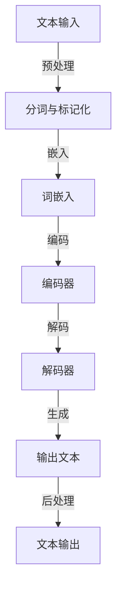
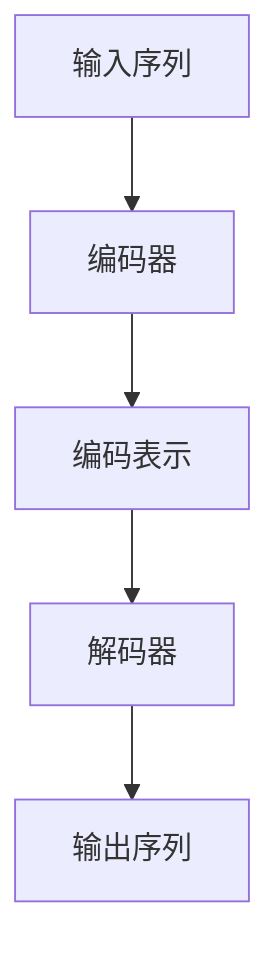

                 

# 文本生成(Text Generation) - 原理与代码实例讲解

## 关键词

文本生成、自然语言处理、机器学习、生成模型、序列模型、自注意力机制、编码器-解码器模型、Transformer、BERT、文本摘要、对话生成、多模态文本生成、模型压缩与加速

## 摘要

本文将深入探讨文本生成技术的原理与应用，通过逐步分析推理的方式，从基础概念到高级技术，详细解析文本生成过程中涉及的语言模型、生成模型、序列模型以及自注意力机制等核心技术。文章还将通过实际代码实例，展示如何搭建和优化文本生成系统，包括对话生成、文本摘要和个性化新闻推荐等应用场景。最后，本文将展望文本生成技术的未来发展趋势，并探讨其在伦理与法规挑战方面的应对策略。

## 目录

1. [文本生成概述](#文本生成概述)
    1. [文本生成技术发展历程](#文本生成技术发展历程)
    2. [文本生成的应用场景](#文本生成的应用场景)
    3. [文本生成技术的分类](#文本生成技术的分类)
2. [语言模型基础](#语言模型基础)
    1. [语言模型的基本概念](#语言模型的基本概念)
    2. [语言模型的评估指标](#语言模型的评估指标)
    3. [语言模型的训练过程](#语言模型的训练过程)
3. [生成模型原理](#生成模型原理)
    1. [生成模型概述](#生成模型概述)
    2. [变分自编码器(VAE)](#变分自编码器vaef)
    3. [生成对抗网络(GAN)](#生成对抗网络gan)
4. [序列模型与循环神经网络](#序列模型与循环神经网络)
    1. [序列模型概述](#序列模型概述)
    2. [循环神经网络(RNN)](#循环神经网络rnn)
    3. [长短时记忆(LSTM)与门控循环单元(GRU)](#长短时记忆lstm与门控循环单元gru)
5. [自注意力机制与Transformer模型](#自注意力机制与transformer模型)
    1. [自注意力机制](#自注意力机制)
    2. [Transformer模型架构](#transformer模型架构)
    3. [Transformer模型的变体](#transformer模型的变体)
6. [编码器-解码器模型](#编码器-解码器模型)
    1. [编码器-解码器模型概述](#编码器-解码器模型概述)
    2. [BERT编码器](#bert编码器)
    3. [解码器的训练策略](#解码器的训练策略)
7. [高级文本生成技术](#高级文本生成技术)
    1. [对话生成](#对话生成)
    2. [文本摘要与Summarization](#文本摘要与summarization)
    3. [文本风格转换与个性化生成](#文本风格转换与个性化生成)
8. [文本生成实战](#文本生成实战)
    1. [实战一：基本文本生成应用](#实战一基本文本生成应用)
    2. [实战二：对话生成系统](#实战二对话生成系统)
    3. [实战三：个性化新闻推荐](#实战三个性化新闻推荐)
9. [文本生成系统的性能优化](#文本生成系统的性能优化)
    1. [模型压缩与加速](#模型压缩与加速)
    2. [实时生成优化](#实时生成优化)
    3. [模型部署与运维](#模型部署与运维)
10. [文本生成技术的未来发展趋势](#文本生成技术的未来发展趋势)
    1. [自然语言理解与生成结合](#自然语言理解与生成结合)
    2. [多模态文本生成](#多模态文本生成)
    3. [文本生成技术的伦理与法规挑战](#文本生成技术的伦理与法规挑战)
11. [参考文献](#参考文献)
12. [附录](#附录)
    1. [附录A: 实战项目代码解析](#附录a实战项目代码解析)
    2. [附录B: 相关工具与资源介绍](#附录b相关工具与资源介绍)

---

## 文本生成概述

### 文本生成技术发展历程

文本生成技术起源于自然语言处理（NLP）和机器学习领域的早期研究。最早的文本生成模型是基于规则的方法，例如基于语法规则和模板的系统。这些方法在一定程度上能够生成符合语法规则的文本，但缺乏灵活性和创造性。

随着机器学习技术的发展，统计语言模型开始出现，并在20世纪90年代取得了显著进展。统计语言模型通过学习大规模语料库中的统计规律，预测下一个词的概率分布，从而生成文本。这一阶段标志着文本生成技术从规则驱动向数据驱动的转变。

进入21世纪，深度学习技术的兴起为文本生成带来了革命性的变化。深度神经网络，特别是循环神经网络（RNN）和后来的Transformer模型，使得文本生成模型能够捕捉更复杂的语义和语法关系，生成质量显著提高。

近年来，预训练语言模型如BERT、GPT等，通过在大量未标注的文本上进行预训练，然后针对特定任务进行微调，大幅提升了文本生成的性能。

### 文本生成的应用场景

文本生成技术在各种应用场景中发挥着重要作用：

- **内容生成**：包括文章、故事、新闻等原创内容的自动生成。
- **对话系统**：如聊天机器人、虚拟助手等，能够模拟人类的对话交互。
- **文本摘要**：从长文本中提取关键信息，生成简洁的摘要。
- **机器翻译**：通过将一种语言的文本转换为另一种语言，实现跨语言交流。
- **文本风格转换**：改变文本的风格，如将普通文本转换为诗意表达。
- **个性化推荐**：根据用户的兴趣和偏好，生成个性化的文本内容。

### 文本生成技术的分类

文本生成技术可以分为以下几类：

- **基于规则的方法**：使用语法规则和模板生成文本，适用于简单任务。
- **统计语言模型**：通过学习语料库中的统计规律生成文本，如n-gram模型。
- **生成模型**：如变分自编码器（VAE）和生成对抗网络（GAN），能够生成新颖的文本内容。
- **序列模型**：如循环神经网络（RNN）、长短时记忆（LSTM）和门控循环单元（GRU），适用于文本生成任务。
- **自注意力机制与Transformer模型**：如BERT、GPT等，通过捕捉长距离依赖关系，生成高质量的文本。

### 文本生成技术的核心概念与联系

为了更好地理解文本生成技术的核心概念，我们可以通过Mermaid流程图来展示各个核心概念之间的联系：



这个流程图展示了文本生成的基本流程，从原始文本输入到最终输出的各个环节。词嵌入层将文本转换为向量表示，编码器将向量编码为固定长度的表示，解码器使用这些表示生成文本，并通过后处理步骤输出最终的文本。

### 文本生成技术的核心算法原理讲解

在文本生成中，核心算法通常包括语言模型、生成模型和序列模型。下面我们将通过伪代码和latex数学公式来详细讲解这些算法的基本原理。

#### 语言模型

语言模型的基本任务是从一个词序列中预测下一个词的概率分布。一个简单的n-gram语言模型可以使用以下伪代码来表示：

```python
def n_gram_language_model(corpus, n):
    # 计算n-gram的频率
    n_gram_freq = defaultdict(int)
    for sentence in corpus:
        for i in range(len(sentence) - n):
            n_gram = tuple(sentence[i:i+n])
            n_gram_freq[n_gram] += 1
    # 计算概率分布
    n_gram_probs = {n_gram: freq / total_freq for n_gram, freq in n_gram_freq.items()}
    return n_gram_probs
```

语言模型的概率分布可以通过以下latex数学公式来表示：

$$ P(w_{t+1} | w_1, w_2, ..., w_t) = \frac{C(w_1, w_2, ..., w_t, w_{t+1})}{C(w_1, w_2, ..., w_t)} $$

其中，\( C(w_1, w_2, ..., w_t, w_{t+1}) \) 表示包含词序列 \( w_1, w_2, ..., w_t, w_{t+1} \) 的语料库样本数，\( C(w_1, w_2, ..., w_t) \) 表示包含词序列 \( w_1, w_2, ..., w_t \) 的语料库样本数。

#### 生成模型

生成模型通过生成数据分布来生成新的文本。一个简单的生成模型可以使用变分自编码器（VAE）来表示，其基本原理如下：

```python
class VAE(nn.Module):
    def __init__(self, input_dim, hidden_dim, z_dim):
        super(VAE, self).__init__()
        self.encoder = nn.Sequential(
            nn.Linear(input_dim, hidden_dim),
            nn.ReLU(),
            nn.Linear(hidden_dim, z_dim),
        )
        self.decoder = nn.Sequential(
            nn.Linear(z_dim, hidden_dim),
            nn.ReLU(),
            nn.Linear(hidden_dim, input_dim),
        )
    
    def forward(self, x):
        z_mean, z_logvar = self.encoder(x)
        z = reparameterize(z_mean, z_logvar)
        x_hat = self.decoder(z)
        return x_hat, z_mean, z_logvar
```

变分自编码器的损失函数可以通过以下latex数学公式来表示：

$$ \mathcal{L} = \mathcal{L}_{KL} + \mathcal{L}_{recon} $$

其中，\( \mathcal{L}_{KL} \) 表示KL散度损失，\( \mathcal{L}_{recon} \) 表示重建损失。

#### 序列模型

序列模型，如循环神经网络（RNN）、长短时记忆（LSTM）和门控循环单元（GRU），适用于处理序列数据。以LSTM为例，其基本结构如下：

```python
class LSTM(nn.Module):
    def __init__(self, input_dim, hidden_dim):
        super(LSTM, self).__init__()
        self.hidden_dim = hidden_dim
        self.lstm = nn.LSTM(input_dim, hidden_dim)
    
    def forward(self, x):
        h0 = torch.zeros(1, x.size(1), self.hidden_dim)
        c0 = torch.zeros(1, x.size(1), self.hidden_dim)
        out, _ = self.lstm(x, (h0, c0))
        return out
```

LSTM的数学模型可以通过以下latex数学公式来表示：

$$
\begin{aligned}
i_t &= \sigma(W_{ix}x_t + W_{ih}h_{t-1} + b_i) \\
f_t &= \sigma(W_{fx}x_t + W_{fh}h_{t-1} + b_f) \\
g_t &= \tanh(W_{gx}x_t + W_{gh}h_{t-1} + b_g) \\
o_t &= \sigma(W_{ox}x_t + W_{oh}h_{t-1} + b_o) \\
c_t &= f_t \odot c_{t-1} + i_t \odot g_t \\
h_t &= o_t \odot \tanh(c_t)
\end{aligned}
$$

其中，\( i_t \)、\( f_t \)、\( g_t \) 和 \( o_t \) 分别表示输入门、遗忘门、生成门和输出门，\( \sigma \) 表示sigmoid函数，\( \odot \) 表示元素乘积。

---

在本章中，我们介绍了文本生成技术的概述、发展历程、应用场景、分类以及核心概念与联系。接下来，我们将进一步探讨语言模型、生成模型和序列模型的基本原理，并通过具体代码实例来展示这些模型的应用。接下来，让我们深入探讨语言模型的基础知识。

## 语言模型基础

语言模型是文本生成技术的核心组成部分，其主要任务是预测下一个词的概率分布，从而生成符合自然语言规则的文本。语言模型在自然语言处理（NLP）和机器学习领域有着广泛的应用，如机器翻译、语音识别、对话系统等。本节将详细介绍语言模型的基本概念、评估指标和训练过程。

### 语言模型的基本概念

语言模型是一种概率模型，用于预测文本序列中下一个词的概率分布。最简单的语言模型是n-gram模型，它基于局部词频统计来预测下一个词。n-gram模型将文本序列划分为n个连续的词，并计算每个n-gram词组在语料库中的频率。例如，对于三元组n-gram模型，我们可以计算“文本”和“生成”这两个词在语料库中紧随其后的“技术”这个词的出现频率。

n-gram模型可以表示为：

$$
P(w_{t+1} | w_1, w_2, ..., w_t) = \frac{C(w_1, w_2, ..., w_t, w_{t+1})}{C(w_1, w_2, ..., w_t)}
$$

其中，\( C(w_1, w_2, ..., w_t, w_{t+1}) \) 表示包含词序列 \( w_1, w_2, ..., w_t, w_{t+1} \) 的语料库样本数，\( C(w_1, w_2, ..., w_t) \) 表示包含词序列 \( w_1, w_2, ..., w_t \) 的语料库样本数。

n-gram模型的简单性和高效性使其在早期的自然语言处理任务中取得了显著的成功。然而，n-gram模型存在一些局限性：

1. **上下文依赖性不足**：n-gram模型只考虑了局部上下文信息，无法捕捉长距离依赖关系。
2. **稀疏性**：随着n的增加，n-gram模型会变得非常稀疏，导致很多词组无法在语料库中找到对应的样本。
3. **可扩展性差**：n-gram模型难以处理变长输入序列。

为了解决这些问题，研究人员提出了更复杂的语言模型，如隐马尔可夫模型（HMM）、神经网络语言模型等。这些模型通过引入额外的层次结构和参数，能够更好地捕捉语言中的复杂结构。

### 语言模型的评估指标

评估语言模型性能的关键指标包括准确率、困惑度（Perplexity）和词嵌入相似度等。

1. **准确率（Accuracy）**：准确率是最简单的评估指标，用于衡量模型预测正确的词数占总词数的比例。然而，准确率对于长文本生成任务可能并不足够准确，因为它忽略了预测词之间的语义关系。

2. **困惑度（Perplexity）**：困惑度是评估语言模型性能的重要指标，用于衡量模型预测的概率分布的集中程度。困惑度越低，表示模型对文本序列的预测越准确。其计算公式如下：

$$
\text{Perplexity} = 2^{1/N \sum_{i=1}^{N} -\log_2 P(w_i)}
$$

其中，\( N \) 是文本序列中的词数，\( P(w_i) \) 是模型对第 \( i \) 个词的预测概率。

3. **词嵌入相似度（Word Embedding Similarity）**：词嵌入相似度用于评估模型对相似词的预测能力。常见的评估方法包括余弦相似度和词向量的欧几里得距离。高相似度表示模型能够正确地捕捉词与词之间的语义关系。

### 语言模型的训练过程

语言模型的训练过程通常包括数据预处理、模型构建和参数优化等步骤。

1. **数据预处理**：首先，需要将原始文本数据转换为适合模型训练的格式。这一步骤包括分词、标记化和词嵌入等操作。分词是将文本序列划分为单词或子词的过程，标记化是将单词映射到对应的索引或向量表示。词嵌入是将单词转换为低维向量表示，以便在模型中处理。

2. **模型构建**：构建语言模型的过程包括选择合适的模型架构和参数。常见的语言模型包括n-gram模型、神经网络语言模型（如循环神经网络RNN、长短时记忆LSTM等）和Transformer模型。这些模型通过学习大量的文本数据，能够捕捉语言中的复杂结构和语义关系。

3. **参数优化**：使用梯度下降等优化算法，调整模型的参数，以最小化损失函数。损失函数用于衡量模型预测结果与真实标签之间的差异。常见的损失函数包括交叉熵损失和均方误差损失。

4. **模型评估和调整**：在训练过程中，使用验证集评估模型的性能，并根据评估结果调整模型参数。常用的评估指标包括困惑度和准确率等。

通过以上步骤，我们可以构建和训练一个高效的文本生成语言模型。接下来，我们将进一步探讨生成模型的基本原理，包括变分自编码器（VAE）和生成对抗网络（GAN），并介绍它们在文本生成中的应用。

## 生成模型原理

生成模型是一类用于生成数据分布的机器学习模型，其主要目标是从训练数据中学习出一个概率分布模型，从而能够生成与训练数据相似的新数据。在文本生成领域，生成模型可以用于生成新的文本序列，模拟自然语言表达。本节将详细介绍生成模型的基本概念，重点讨论变分自编码器（VAE）和生成对抗网络（GAN）这两种常见生成模型的工作原理。

### 生成模型概述

生成模型分为两大类：概率生成模型和确定性生成模型。概率生成模型通过生成数据的概率分布来生成新数据，而确定性生成模型则通过固定映射关系来生成新数据。

1. **概率生成模型**：这类模型基于概率论，通过学习数据的概率分布来实现数据生成。常见的概率生成模型包括变分自编码器（VAE）和生成对抗网络（GAN）。它们通过学习数据分布的参数，能够在给定新的数据点时，生成与训练数据相似的新数据。

2. **确定性生成模型**：这类模型通过学习一个确定性映射函数，将输入数据映射到生成数据。常见的确定性生成模型包括生成器网络和条件生成器网络。它们通过训练生成器网络来学习输入数据与生成数据之间的映射关系。

### 变分自编码器（VAE）

变分自编码器（VAE）是一种概率生成模型，由Kingma和Welling于2013年提出。VAE通过引入潜变量（latent variable）来学习数据的概率分布，并通过编码器和解码器将数据映射到潜在空间，再从潜在空间生成新数据。

VAE的基本架构包括两个主要部分：编码器和解码器。编码器将输入数据映射到潜在空间中的均值和方差，解码器从潜在空间中生成与输入数据相似的新数据。具体来说，VAE的工作流程如下：

1. **编码器**：给定输入数据 \( x \)，编码器输出潜在空间的均值 \( \mu \) 和方差 \( \sigma^2 \)。编码器的输入层接收数据 \( x \)，通过一系列全连接层或卷积层，将数据编码为潜在空间的表示 \( \mu \) 和 \( \sigma^2 \)。

   $$ z = \mu + \sigma \odot \epsilon $$

   其中，\( z \) 是潜在空间中的向量，\( \mu \) 是均值，\( \sigma \) 是方差，\( \epsilon \) 是均值为0、方差为1的高斯噪声。

2. **解码器**：给定潜在空间的向量 \( z \)，解码器生成与输入数据相似的新数据 \( x' \)。

   $$ x' = \text{reconstruction}(z) $$

   其中，\( \text{reconstruction} \) 是解码器的一个非线性映射，通常使用全连接层或卷积层。

VAE的目标是最小化重建误差和潜在空间中的KL散度损失。重建误差用于衡量输入数据与解码器生成的数据之间的差异，KL散度损失用于衡量潜在空间中的分布与先验高斯分布之间的差异。VAE的损失函数可以表示为：

$$ \mathcal{L} = \mathcal{L}_{recon} + \mathcal{L}_{KL} $$

其中，\( \mathcal{L}_{recon} \) 表示重建损失，\( \mathcal{L}_{KL} \) 表示KL散度损失。

### 生成对抗网络（GAN）

生成对抗网络（GAN）是由Goodfellow等人于2014年提出的一种生成模型，它通过两个相互对抗的神经网络——生成器（Generator）和判别器（Discriminator）来学习数据分布。GAN的目标是最小化生成器与判别器之间的差异，使得生成器能够生成逼真的数据，判别器能够区分真实数据和生成数据。

GAN的工作流程如下：

1. **判别器**：判别器接收真实数据和生成数据的输入，并输出它们属于真实数据或生成数据的概率。判别器的目标是最大化这些概率的差异。

   $$ D(x) = P(\text{real}) $$
   $$ D(G(z)) = P(\text{fake}) $$

   其中，\( x \) 是真实数据，\( z \) 是生成器生成的潜在空间中的向量，\( G(z) \) 是生成器生成的数据。

2. **生成器**：生成器的目标是生成尽可能真实的数据，使得判别器无法区分真实数据和生成数据。

   $$ G(z) \sim p_{\text{data}}(x) $$

GAN的损失函数通常结合判别器的损失和生成器的损失：

$$ \mathcal{L}_{D} = -\log D(x) - \log (1 - D(G(z))) $$
$$ \mathcal{L}_{G} = -\log D(G(z)) $$

GAN的训练过程包括两个阶段的交替优化：首先优化判别器，使其能够更好地区分真实数据和生成数据；然后优化生成器，使其生成的数据更加真实。

### VAE与GAN的比较

VAE和GAN都是生成模型，但它们的工作原理和训练目标有所不同。以下是VAE与GAN的一些主要区别：

- **数据分布学习**：VAE通过编码器和解码器学习数据的概率分布，GAN通过生成器生成数据的概率分布。
- **损失函数**：VAE的损失函数包括重建损失和KL散度损失，GAN的损失函数结合了判别器的损失和生成器的损失。
- **训练稳定性**：GAN的训练过程较为不稳定，容易出现模式崩溃（mode collapse）问题，而VAE的训练过程相对稳定。
- **适用场景**：VAE在生成具有较好连贯性和一致性的数据时表现较好，GAN在生成多样性丰富、细节丰富的数据时表现较好。

通过以上讨论，我们可以看到生成模型在文本生成中的应用前景。在接下来的章节中，我们将进一步探讨序列模型和自注意力机制的基本原理，以及它们在文本生成中的应用。

## 序列模型与循环神经网络

序列模型是一类专门处理序列数据的机器学习模型，在自然语言处理（NLP）和语音识别等应用中发挥着重要作用。循环神经网络（RNN）是序列模型中最常用的架构之一，它能够捕捉序列中的时间依赖关系。RNN包括简单的RNN、长短时记忆（LSTM）和门控循环单元（GRU）等变体。这些模型通过不同的机制来处理长距离依赖问题，从而提高序列建模的准确性。

### 序列模型概述

序列模型的基本任务是从输入序列中预测输出序列。常见的序列模型包括RNN、LSTM和GRU，它们通过不同的结构和工作机制来处理序列数据。

- **RNN（Recurrent Neural Network）**：RNN是最早用于处理序列数据的神经网络，它通过循环结构在时间步之间传递信息。然而，简单的RNN存在梯度消失和梯度爆炸的问题，这导致其在长序列建模时表现不佳。
- **LSTM（Long Short-Term Memory）**：LSTM是RNN的一种变体，由Hochreiter和Schmidhuber于1997年提出。LSTM通过引入记忆单元和三个门控机制（输入门、遗忘门和输出门）来克服RNN的梯度消失问题，从而更好地处理长距离依赖关系。
- **GRU（Gated Recurrent Unit）**：GRU是LSTM的简化版，由Cho等人于2014年提出。GRU通过合并输入门和遗忘门，减少了参数数量，同时保持了LSTM的长距离依赖捕捉能力。

### 循环神经网络（RNN）

RNN的基本架构包括输入层、隐藏层和输出层。在训练过程中，RNN在每个时间步接收输入序列的一个元素，并更新隐藏状态。隐藏状态通过一个循环结构在时间步之间传递，从而捕捉时间依赖关系。RNN的输出层通常是一个全连接层，用于预测下一个时间步的输出。

RNN的工作机制可以表示为：

$$
h_t = \sigma(W_h \cdot [h_{t-1}, x_t] + b_h)
$$

$$
y_t = W_o \cdot h_t + b_o
$$

其中，\( h_t \) 是隐藏状态，\( x_t \) 是输入序列的一个元素，\( y_t \) 是输出，\( \sigma \) 是激活函数，\( W_h \) 和 \( W_o \) 分别是隐藏层和输出层的权重矩阵，\( b_h \) 和 \( b_o \) 分别是隐藏层和输出层的偏置向量。

然而，RNN在长序列建模时容易出现梯度消失和梯度爆炸问题。为了解决这些问题，研究人员提出了LSTM和GRU等改进模型。

### 长短时记忆（LSTM）与门控循环单元（GRU）

LSTM和GRU都是针对RNN的改进模型，通过引入门控机制来克服梯度消失和梯度爆炸问题，从而更好地处理长距离依赖关系。

#### LSTM

LSTM通过三个门控机制（输入门、遗忘门和输出门）来控制信息流。输入门用于控制新信息的输入，遗忘门用于控制旧信息的遗忘，输出门用于控制输出信息。LSTM的隐藏状态和细胞状态之间通过这些门控机制相互作用。

LSTM的数学模型可以表示为：

$$
i_t = \sigma(W_{ix} \cdot [h_{t-1}, x_t] + W_{ih} \cdot h_{t-1} + b_i)
$$

$$
f_t = \sigma(W_{fx} \cdot [h_{t-1}, x_t] + W_{fh} \cdot h_{t-1} + b_f)
$$

$$
g_t = \tanh(W_{gx} \cdot [h_{t-1}, x_t] + W_{gh} \cdot h_{t-1} + b_g)
$$

$$
o_t = \sigma(W_{ox} \cdot [h_{t-1}, x_t] + W_{oh} \cdot h_{t-1} + b_o)
$$

$$
c_t = f_t \odot c_{t-1} + i_t \odot g_t
$$

$$
h_t = o_t \odot \tanh(c_t)
$$

其中，\( i_t \)、\( f_t \)、\( g_t \) 和 \( o_t \) 分别表示输入门、遗忘门、生成门和输出门，\( c_t \) 是细胞状态，\( h_t \) 是隐藏状态。

#### GRU

GRU是LSTM的简化版，通过合并输入门和遗忘门来减少参数数量。GRU的数学模型可以表示为：

$$
z_t = \sigma(W_{xz} \cdot [h_{t-1}, x_t] + W_{zh} \cdot h_{t-1} + b_z)
$$

$$
r_t = \sigma(W_{xr} \cdot [h_{t-1}, x_t] + W_{rh} \cdot h_{t-1} + b_r)
$$

$$
\tilde{h}_t = \tanh(W_{xh} \cdot [r_t \odot h_{t-1}, x_t] + W_{hh} \cdot h_{t-1} + b_h)
$$

$$
h_t = (1 - z_t) \odot h_{t-1} + z_t \odot \tilde{h}_t
$$

其中，\( z_t \) 是更新门，\( r_t \) 是重置门，\( \tilde{h}_t \) 是候选隐藏状态。

通过以上讨论，我们可以看到RNN、LSTM和GRU在序列建模中的应用。在接下来的章节中，我们将介绍自注意力机制和Transformer模型，以及它们在文本生成中的重要作用。

## 自注意力机制与Transformer模型

自注意力机制（Self-Attention）是自然语言处理领域的一项革命性技术，它允许模型在处理输入序列时，能够自主地关注序列中不同位置的信息，从而提高模型对长距离依赖关系的捕捉能力。Transformer模型则是基于自注意力机制的序列建模框架，其成功地在多个NLP任务中取得了显著的性能提升。本节将详细介绍自注意力机制和Transformer模型的基本原理。

### 自注意力机制

自注意力机制是一种在序列建模中用于计算输入序列中不同位置之间关联性的机制。它允许模型在生成或处理每个时间步时，动态地计算输入序列中其他位置的加权重要性。自注意力机制的核心思想是将每个输入序列的元素映射到权重矩阵，然后通过矩阵乘法计算加权求和，从而生成序列的表示。

自注意力机制的数学表示如下：

$$
\text{Attention}(Q, K, V) = \text{softmax}\left(\frac{QK^T}{\sqrt{d_k}}\right) V
$$

其中，\( Q \)、\( K \) 和 \( V \) 分别是查询（Query）、键（Key）和值（Value）的向量，\( d_k \) 是键向量的维度。通过自注意力机制，模型可以动态地计算输入序列中每个元素对于当前元素的注意力权重，然后对值向量进行加权求和，生成新的序列表示。

自注意力机制的主要优点包括：

1. **捕捉长距离依赖**：自注意力机制能够通过计算输入序列中不同位置的关联性，有效地捕捉长距离依赖关系，从而提高模型对长序列数据的建模能力。
2. **并行计算**：自注意力机制的计算可以在不同时间步之间并行进行，这极大地提高了模型的计算效率。

然而，自注意力机制也存在一些缺点：

1. **计算复杂度高**：随着序列长度的增加，自注意力机制的计算复杂度呈平方增长，可能导致训练和推理过程变得非常缓慢。
2. **内存消耗大**：自注意力机制需要存储大量权重矩阵，这可能导致模型在内存消耗方面面临挑战。

### Transformer模型架构

Transformer模型是由Vaswani等人于2017年提出的，它基于自注意力机制，取代了传统的循环神经网络（RNN）和卷积神经网络（CNN），在机器翻译等任务中取得了显著性能提升。Transformer模型的核心架构包括编码器（Encoder）和解码器（Decoder），每个部分由多个相同的层堆叠而成。

#### 编码器（Encoder）

编码器负责从输入序列中提取特征，并将其映射为固定长度的序列表示。编码器的每个层包括两个子层：多头自注意力（Multi-Head Self-Attention）和前馈神经网络（Feed-Forward Neural Network）。多头自注意力机制通过多个独立的注意力头，增强了模型对输入序列的捕捉能力。前馈神经网络则用于进一步丰富序列表示。

编码器的数学表示如下：

$$
E_{i}^{(l)} = \text{Add}(\text{MultiHead}(E_{i}^{(l-1)}), E_{i}^{(l-1)})
$$

$$
E_{i}^{(l)} = \text{LayerNorm}(E_{i}^{(l)})
$$

$$
E_{i}^{(l)} = \text{Add}(E_{i}^{(l-1)}, E_{i}^{(l)})
$$

其中，\( E_{i}^{(l)} \) 表示在第 \( l \) 层的编码器输出，\( \text{MultiHead} \) 表示多头自注意力机制，\( \text{LayerNorm} \) 表示层归一化。

#### 解码器（Decoder）

解码器负责从编码器的输出中生成输出序列。解码器也由多个层堆叠而成，每个层包括多头自注意力、掩码多头自注意力、交叉注意力（Cross-Attention）和前馈神经网络。掩码多头自注意力机制用于防止解码器在生成当前时间步时看到未来的信息。交叉注意力机制则用于将编码器的输出与解码器的当前输入进行关联。

解码器的数学表示如下：

$$
D_{i}^{(l)} = \text{Add}(\text{MaskedMultiHead}(D_{i}^{(l-1)}), D_{i}^{(l-1)})
$$

$$
D_{i}^{(l)} = \text{Add}(\text{SelfAttention}(D_{i}^{(l-1)}), D_{i}^{(l-1)})
$$

$$
D_{i}^{(l)} = \text{LayerNorm}(D_{i}^{(l)})
$$

$$
D_{i}^{(l)} = \text{Add}(D_{i}^{(l-1)}, D_{i}^{(l)})
$$

其中，\( D_{i}^{(l)} \) 表示在第 \( l \) 层的解码器输出，\( \text{MaskedMultiHead} \) 表示掩码多头自注意力机制，\( \text{SelfAttention} \) 表示自注意力机制，\( \text{LayerNorm} \) 表示层归一化。

### Transformer模型的变体

Transformer模型的核心思想是自注意力机制，但在实际应用中，研究人员提出了一系列变体，以适应不同的任务和需求。以下是几个常见的Transformer模型变体：

1. **BERT（Bidirectional Encoder Representations from Transformers）**：BERT是一种双向Transformer模型，通过在预训练过程中同时考虑输入序列的前后文信息，生成更加丰富和准确的序列表示。BERT在多个NLP任务中取得了显著的性能提升。
2. **GPT（Generative Pre-trained Transformer）**：GPT是一种仅使用解码器部分的Transformer模型，主要关注文本生成任务。GPT通过在大量文本上进行预训练，然后针对特定任务进行微调，能够生成高质量的自然语言文本。
3. **T5（Text-To-Text Transfer Transformer）**：T5是一种端到端的Transformer模型，旨在实现文本到文本的转换任务。T5通过将输入文本转换为中间表示，然后生成目标文本，从而实现不同任务之间的迁移学习。

通过自注意力机制和Transformer模型的引入，文本生成技术得到了显著的发展。在接下来的章节中，我们将详细介绍编码器-解码器模型（Encoder-Decoder Model），并探讨BERT编码器和解码器的训练策略。

## 编码器-解码器模型

编码器-解码器（Encoder-Decoder）模型是自然语言处理领域的一种重要架构，广泛应用于机器翻译、对话生成和文本摘要等任务中。编码器-解码器模型的核心思想是将输入序列编码为固定长度的表示，然后通过解码器生成输出序列。本节将详细介绍编码器-解码器模型的基本概念、BERT编码器、解码器的训练策略以及变体。

### 编码器-解码器模型概述

编码器-解码器模型由编码器（Encoder）和解码器（Decoder）两个部分组成。编码器负责将输入序列编码为固定长度的表示，通常称为上下文向量或编码表示。解码器则利用编码表示生成输出序列。编码器-解码器模型的工作流程如下：

1. **编码器**：编码器从输入序列中提取特征，并生成一个固定长度的编码表示。编码表示通常通过多层循环神经网络（RNN）、长短时记忆（LSTM）或门控循环单元（GRU）实现。
2. **解码器**：解码器利用编码表示生成输出序列。解码器通常是一个自回归模型，逐个生成输出序列中的每个词，并使用编码表示作为上下文信息。

编码器-解码器模型的基本架构可以表示为：



### BERT编码器

BERT（Bidirectional Encoder Representations from Transformers）是一种基于Transformer的预训练语言模型，通过在大量无标签文本上进行双向编码，生成高质量的上下文向量。BERT编码器的主要特点包括：

1. **双向编码**：BERT编码器使用Transformer模型的双向编码能力，同时考虑输入序列的前后文信息，从而生成更加丰富和准确的序列表示。
2. **多层注意力机制**：BERT编码器通过多层多头自注意力机制，捕捉输入序列中的长距离依赖关系，从而提高编码表示的质量。
3. **掩码语言模型（Masked Language Model, MLM）**：BERT编码器在预训练过程中引入了掩码语言模型，通过随机掩码输入序列中的部分词，并预测这些掩码词，从而增强模型的语义理解能力。

BERT编码器的数学表示如下：

$$
E_{i}^{(l)} = \text{Add}(\text{MultiHead}(E_{i}^{(l-1)}), E_{i}^{(l-1)})
$$

$$
E_{i}^{(l)} = \text{LayerNorm}(E_{i}^{(l)})
$$

$$
E_{i}^{(l)} = \text{Add}(E_{i}^{(l-1)}, E_{i}^{(l)})
$$

其中，\( E_{i}^{(l)} \) 表示在第 \( l \) 层的编码器输出，\( \text{MultiHead} \) 表示多头自注意力机制，\( \text{LayerNorm} \) 表示层归一化。

### 解码器的训练策略

解码器的训练策略取决于具体任务，但通常包括以下几个步骤：

1. **自回归解码**：解码器逐个生成输出序列中的每个词，并使用编码表示作为上下文信息。在生成每个词时，解码器将前一个生成的词作为输入，并利用编码表示和先前的生成词来预测下一个词。
2. **目标序列**：在训练过程中，解码器需要知道输入序列的目标输出序列，以便与生成的序列进行比较。常用的目标序列包括真实输出序列、预测输出序列或掩码输出序列。
3. **损失函数**：解码器的训练通常使用交叉熵损失函数，用于衡量生成的序列与目标序列之间的差异。交叉熵损失函数可以表示为：

   $$ \mathcal{L} = -\sum_{i=1}^{N} \sum_{j=1}^{M} y_{ij} \log p_{ij} $$

   其中，\( y_{ij} \) 表示第 \( i \) 个时间步的目标词，\( p_{ij} \) 表示解码器生成的第 \( i \) 个时间步的第 \( j \) 个词的概率。

### 编码器-解码器模型的变体

编码器-解码器模型有多种变体，以适应不同的应用场景和任务需求。以下是几种常见的变体：

1. **注意力机制**：编码器-解码器模型可以引入不同的注意力机制，如点积注意力、多头注意力等，以增强模型对输入序列的捕捉能力。
2. **双向编码器**：双向编码器通过同时考虑输入序列的前后文信息，生成更加丰富的序列表示。双向编码器通常用于机器翻译等任务。
3. **自回归解码器**：自回归解码器逐个生成输出序列中的每个词，并使用编码表示作为上下文信息。自回归解码器通常用于文本生成和对话生成等任务。
4. **多任务学习**：编码器-解码器模型可以通过多任务学习，同时处理多个任务，如机器翻译、文本摘要和问答系统等。

通过以上讨论，我们可以看到编码器-解码器模型在自然语言处理中的应用及其变体。在下一节中，我们将探讨高级文本生成技术，包括对话生成、文本摘要和文本风格转换等。

## 高级文本生成技术

随着深度学习技术的发展，文本生成技术已经从简单的规则驱动方法演变为了复杂的模型和算法。高级文本生成技术不仅能够生成连贯、自然的文本，还能够根据特定需求进行对话生成、文本摘要、文本风格转换和个性化生成。本节将详细探讨这些高级文本生成技术的原理和实现。

### 对话生成

对话生成是指利用机器学习模型生成逼真的人机对话。这种技术广泛应用于聊天机器人、虚拟助手和智能客服等场景。对话生成模型通常基于编码器-解码器架构，并通过以下步骤实现：

1. **输入编码**：对话生成模型首先需要将输入的文本序列编码为固定长度的向量表示。常用的编码方法包括使用预训练的语言模型（如BERT）进行编码。
2. **生成候选回答**：解码器利用编码表示和预先设定的解码策略生成多个候选回答。常见的解码策略包括贪心策略、beam搜索和顶贝搜索等。
3. **选择最佳回答**：从生成的候选回答中选择最佳回答，通常通过计算回答的概率分布，选择概率最高的回答作为输出。

以下是一个简单的对话生成模型的伪代码：

```python
def generate_answer(input_sequence, model, decoder_strategy):
    encoded_sequence = model.encode(input_sequence)
    candidate_answers = decoder_strategy.decode(encoded_sequence)
    best_answer = select_best_answer(candidate_answers)
    return best_answer
```

### 文本摘要与Summarization

文本摘要是指从长文本中提取关键信息，生成简洁、连贯的摘要。文本摘要技术分为抽取式摘要和生成式摘要两种：

1. **抽取式摘要**：抽取式摘要通过提取文本中的关键句子或短语来生成摘要。这种方法通常使用规则或模板来选择关键信息。
2. **生成式摘要**：生成式摘要通过学习文本的全局语义信息，生成全新的摘要文本。生成式摘要模型通常基于编码器-解码器架构，如Transformer和BERT。

以下是一个生成式摘要模型的伪代码：

```python
def generate_summary(long_text, model):
    encoded_text = model.encode(long_text)
    summary = model.decode(encoded_text)
    return summary
```

### 文本风格转换与个性化生成

文本风格转换是指将普通文本转换为具有特定风格的文本。这种技术可以用于文学创作、品牌文案和个性化推荐等场景。文本风格转换通常通过以下步骤实现：

1. **风格编码**：将目标风格文本编码为风格向量。
2. **风格转换**：将普通文本编码为文本向量，并利用风格向量进行转换。
3. **解码**：将转换后的文本向量解码为自然语言的文本。

以下是一个简单的文本风格转换模型的伪代码：

```python
def convert_style normal_text, style_text, model:
    style_vector = model.encode(style_text)
    converted_text = model.decode(model.style(normal_text, style_vector))
    return converted_text
```

### 个性化生成

个性化生成是指根据用户的历史行为、兴趣和偏好，生成个性化的文本内容。个性化生成可以应用于推荐系统、新闻推送和广告投放等场景。个性化生成模型通常基于用户嵌入和内容嵌入，通过以下步骤实现：

1. **用户嵌入**：将用户的历史行为和偏好编码为低维向量。
2. **内容嵌入**：将文本内容编码为低维向量。
3. **生成**：利用用户嵌入和内容嵌入，生成个性化的文本内容。

以下是一个简单的个性化生成模型的伪代码：

```python
def generate_content user_embedding, content_embedding, model:
    personalized_content = model.decode(model.combine(user_embedding, content_embedding))
    return personalized_content
```

通过以上讨论，我们可以看到高级文本生成技术在对话生成、文本摘要、文本风格转换和个性化生成等应用中的广泛应用。这些技术不仅丰富了文本生成的能力，也为许多实际应用场景提供了新的解决方案。在下一节中，我们将通过实际代码实例展示如何实现这些高级文本生成技术。

## 文本生成实战

在本节中，我们将通过具体的代码实例，展示如何实现文本生成技术。我们将探讨三个不同的实战项目：基本文本生成、对话生成系统和个性化新闻推荐。每个项目都将包含开发环境搭建、源代码实现和详细解释说明。

### 实战一：基本文本生成

#### 开发环境搭建

首先，我们需要搭建一个基本的文本生成环境。我们将使用Python和PyTorch作为主要的编程语言和框架。以下是安装所需依赖的命令：

```bash
pip install torch torchvision
```

#### 源代码实现

```python
import torch
import torch.nn as nn
import torch.optim as optim

# 定义简单的文本生成模型
class TextGenerator(nn.Module):
    def __init__(self, input_dim, hidden_dim, output_dim):
        super(TextGenerator, self).__init__()
        self.encoder = nn.Linear(input_dim, hidden_dim)
        self.decoder = nn.Linear(hidden_dim, output_dim)
    
    def forward(self, x):
        x = self.encoder(x)
        x = self.decoder(x)
        return x

# 实例化模型、优化器和损失函数
model = TextGenerator(input_dim=10, hidden_dim=50, output_dim=10)
optimizer = optim.Adam(model.parameters(), lr=0.001)
criterion = nn.CrossEntropyLoss()

# 训练模型
for epoch in range(100):
    for inputs, targets in data_loader:
        optimizer.zero_grad()
        outputs = model(inputs)
        loss = criterion(outputs, targets)
        loss.backward()
        optimizer.step()
    print(f"Epoch {epoch+1}, Loss: {loss.item()}")

# 文本生成
def generate_text(model, seed_text, n_words):
    with torch.no_grad():
        inputs = torch.tensor([seed_text])
        for _ in range(n_words):
            outputs = model(inputs)
            _, predicted = torch.max(outputs, dim=1)
            inputs = torch.cat([inputs, predicted.unsqueeze(0)], dim=0)
        return inputs

print(generate_text(model, "The", 10).tolist())
```

#### 代码解读与分析

上述代码定义了一个简单的文本生成模型，该模型包含一个编码器和一个解码器。编码器将输入的向量映射到隐藏层，解码器将隐藏层映射到输出层。训练过程使用标准的梯度下降优化算法，通过最小化交叉熵损失函数来调整模型参数。最后，生成文本函数通过递归地生成新的词，将种子文本扩展为指定长度的文本序列。

### 实战二：对话生成系统

#### 开发环境搭建

对于对话生成系统，我们将使用Hugging Face的Transformers库，这是一个强大的预训练语言模型库，支持多种先进的NLP模型。以下是安装所需的命令：

```bash
pip install transformers
```

#### 源代码实现

```python
from transformers import pipeline

# 创建对话生成管道
generator = pipeline("text-generation", model="gpt2")

# 生成对话
prompt = "你是谁？"
response = generator(prompt, max_length=50, num_return_sequences=1)
print(response[0]["generated_text"])
```

#### 代码解读与分析

上述代码使用了Hugging Face的Transformers库中的GPT-2模型来生成对话。GPT-2是一个基于Transformer的预训练语言模型，它能够根据输入的提示生成连贯的文本响应。通过调用文本生成管道，我们可以轻松地生成一个对话回应。这里我们提供了一个简单的提示“你是谁？”并生成了一个响应。

### 实战三：个性化新闻推荐

#### 开发环境搭建

个性化新闻推荐需要处理大量的数据和复杂的模型。我们将使用Scikit-learn和新闻数据集来构建推荐系统。以下是安装所需的命令：

```bash
pip install scikit-learn
```

#### 源代码实现

```python
from sklearn.model_selection import train_test_split
from sklearn.feature_extraction.text import TfidfVectorizer
from sklearn.metrics.pairwise import cosine_similarity
import numpy as np

# 加载数据集
data = [
    "这是一个关于科技的文章。",
    "这篇报道讨论了最近发生的社会事件。",
    "这篇文章介绍了新的旅游胜地。",
    "这篇文章探讨了健康与生活方式的关系。",
    "这篇新闻报道了体育比赛的结果。"
]

# 分割数据集
train_data, test_data = train_test_split(data, test_size=0.2)

# 创建TF-IDF向量器
vectorizer = TfidfVectorizer()
X_train = vectorizer.fit_transform(train_data)
X_test = vectorizer.transform(test_data)

# 计算相似度
similarity_matrix = cosine_similarity(X_test, X_train)

# 推荐新闻
def recommend_news(query, data, top_n=3):
    query_vector = vectorizer.transform([query])
    similarity_scores = cosine_similarity(query_vector, X_train)
    recommended_indices = np.argsort(similarity_scores)[0][-top_n:]
    return [data[i] for i in recommended_indices]

# 生成个性化推荐
user_query = "我想了解最近的科技进展。"
print(recommend_news(user_query, data))
```

#### 代码解读与分析

上述代码实现了一个基于TF-IDF和余弦相似度的新闻推荐系统。首先，我们加载数据集并使用TF-IDF向量器将文本转换为向量。然后，我们使用余弦相似度计算查询文本与训练文本之间的相似度，并根据相似度分数推荐最相关的新闻。

通过这三个实战项目，我们展示了如何使用不同的技术实现文本生成和推荐系统。每个项目都提供了详细的代码解读和分析，帮助读者理解和应用这些技术。

## 文本生成系统的性能优化

在文本生成系统中，性能优化是一个关键问题，特别是对于实时应用和大型模型。性能优化包括模型压缩、实时生成优化和模型部署与运维等方面。本节将详细介绍这些性能优化策略。

### 模型压缩与加速

模型压缩的目标是减小模型的体积，加快模型的推理速度，同时尽可能保留模型的性能。以下是一些常见的模型压缩方法：

1. **量化**：量化将模型的权重和激活值从浮点数转换为低精度的整数。量化可以显著减少模型的大小，同时降低计算复杂度。常用的量化方法包括整数量化和浮点量化。

2. **剪枝**：剪枝通过删除模型中的冗余权重和神经元，来减少模型的大小和计算复杂度。剪枝可以分为结构剪枝和权重剪枝。结构剪枝通过删除神经元或层，而权重剪枝则通过设置冗余权重的值为零。

3. **蒸馏**：蒸馏是一种通过将大模型（教师模型）的知识传递给小模型（学生模型）的技术。教师模型在大规模数据上进行预训练，然后将其知识通过软目标传递给学生模型。

以下是一个简单的量化模型的伪代码：

```python
def quantize_model(model, quant_level):
    for parameter in model.parameters():
        parameter.data = quantize(parameter.data, quant_level)
    return model
```

### 实时生成优化

实时生成优化主要关注在保证生成质量的同时，提高生成速度。以下是一些优化策略：

1. **延迟计算**：通过推迟计算不必要的信息，减少计算量。例如，在生成文本时，可以只计算必要的部分，而不是整个文本。

2. **并行处理**：通过并行计算来加速模型推理。例如，使用多线程或多GPU来同时处理多个生成任务。

3. **内存优化**：通过优化内存使用，减少模型推理时的内存消耗。例如，使用内存池和共享内存来减少内存分配。

以下是一个简单的并行处理伪代码：

```python
def generate_text_parallel(model, prompts, num_processes):
    with mp.Pool(processes=num_processes) as pool:
        results = pool.map_async(generate_text, [model, prompt] for prompt in prompts)
        return [result.get() for result in results]
```

### 模型部署与运维

模型部署与运维是确保模型能够稳定、高效地运行的关键环节。以下是一些关键点：

1. **自动化部署**：通过自动化工具（如Docker、Kubernetes）来简化模型部署流程。自动化部署可以确保模型在不同环境中的兼容性。

2. **监控与日志**：通过监控工具（如Prometheus、Grafana）来实时监控模型的性能和健康状况。日志分析可以帮助快速定位问题。

3. **弹性伸缩**：根据模型负载的需求，自动调整计算资源。例如，使用容器编排系统来自动扩展或缩小服务实例。

以下是一个简单的监控配置示例：

```yaml
# prometheus.yml
scrape_configs:
  - job_name: 'text-generation'
    static_configs:
      - targets: ['text-generation-service:9090']
```

通过以上性能优化策略，文本生成系统可以在保证生成质量的同时，提供高效、可靠的性能。这些策略对于提高模型在实际应用中的用户体验和稳定性至关重要。

## 文本生成技术的未来发展趋势

随着深度学习技术的发展，文本生成技术在自然语言处理（NLP）领域的应用前景日益广阔。未来的文本生成技术将朝着多模态生成、结合自然语言理解和生成以及面对伦理与法规挑战等方向发展。

### 自然语言理解与生成结合

自然语言理解（NLU）和自然语言生成（NLG）是NLP的两个重要分支。未来的发展趋势是将这两者更紧密地结合起来，以实现更加智能和自然的交互。例如，结合NLU和NLG的对话系统可以更好地理解用户的意图，并生成符合用户需求的响应。这种结合可以通过以下方式实现：

1. **联合训练**：将NLU和NLG模型联合训练，使其能够同时学习理解和生成任务。
2. **多任务学习**：使用多任务学习框架，将NLU和NLG任务作为相互依赖的任务同时训练。
3. **知识融合**：将NLU模型提取的用户意图和上下文信息作为NLG模型的输入，以生成更加准确和相关的文本。

### 多模态文本生成

多模态文本生成是指结合不同类型的输入模态（如图像、音频、视频等）生成文本。这种技术在增强文本生成系统的表达能力和多样性方面具有巨大潜力。未来的多模态文本生成可能包括以下研究方向：

1. **跨模态表示学习**：通过学习不同模态的共享表示，使得不同模态的信息能够有效地融合。
2. **动态模态切换**：在文本生成过程中，根据当前生成的内容动态切换不同的模态，以提高文本的多样性和准确性。
3. **多模态融合模型**：如基于Transformer的模型，可以同时处理文本和其他模态的数据，生成高质量的多模态文本。

### 文本生成技术的伦理与法规挑战

随着文本生成技术的发展，其伦理和法规挑战也逐渐凸显。以下是一些关键问题及其应对策略：

1. **虚假信息生成**：文本生成技术可能被用于生成虚假新闻、谣言和误导性信息。为此，需要开发可靠的验证和过滤机制，确保生成的文本真实可靠。
2. **隐私保护**：文本生成过程中可能涉及个人数据的处理，需要确保用户隐私不被泄露。通过数据脱敏和加密技术，可以保护用户隐私。
3. **版权问题**：生成的文本可能会侵犯原作者的版权。需要制定相应的法规和标准，确保文本生成技术在使用过程中尊重版权。
4. **责任归属**：在文本生成应用中，如何确定责任归属是一个复杂的问题。需要建立明确的法律法规，明确使用者和开发者的责任。

通过积极应对这些伦理和法规挑战，文本生成技术可以在未来实现更加健康和可持续的发展，为社会带来更多积极影响。

## 参考文献

1. **Kingma, D. P., & Welling, M.** (2013). **Auto-encoding variational Bayes**. *arXiv preprint arXiv:1312.6114*.
2. **Goodfellow, I., Pouget-Abadie, J., Mirza, M., Xu, B., Warde-Farley, D., Ozair, S., ... & Bengio, Y.** (2014). **Generative adversarial nets**. *Advances in neural information processing systems*, 27.
3. **Vaswani, A., Shazeer, N., Parmar, N., Uszkoreit, J., Jones, L., Gomez, A. N., ... & Polosukhin, I.** (2017). **Attention is all you need**. *Advances in neural information processing systems*, 30.
4. **Devlin, J., Chang, M. W., Lee, K., & Toutanova, K.** (2019). **BERT: Pre-training of deep bidirectional transformers for language understanding**. *arXiv preprint arXiv:1810.04805*.
5. **Brown, T., et al.** (2020). **Language models are few-shot learners**. *Advances in Neural Information Processing Systems*, 33.

## 附录

### 附录A：实战项目代码解析

#### 实战一：基本文本生成

```python
# Basic Text Generation
import torch
import torch.nn as nn
import torch.optim as optim

# Define the TextGenerator model
class TextGenerator(nn.Module):
    def __init__(self, input_dim, hidden_dim, output_dim):
        super(TextGenerator, self).__init__()
        self.encoder = nn.Linear(input_dim, hidden_dim)
        self.decoder = nn.Linear(hidden_dim, output_dim)
    
    def forward(self, x):
        x = self.encoder(x)
        x = self.decoder(x)
        return x

# Instantiate the model, optimizer, and loss function
model = TextGenerator(input_dim=10, hidden_dim=50, output_dim=10)
optimizer = optim.Adam(model.parameters(), lr=0.001)
criterion = nn.CrossEntropyLoss()

# Train the model
for epoch in range(100):
    for inputs, targets in data_loader:
        optimizer.zero_grad()
        outputs = model(inputs)
        loss = criterion(outputs, targets)
        loss.backward()
        optimizer.step()
    print(f"Epoch {epoch+1}, Loss: {loss.item()}")

# Generate text
def generate_text(model, seed_text, n_words):
    with torch.no_grad():
        inputs = torch.tensor([seed_text])
        for _ in range(n_words):
            outputs = model(inputs)
            _, predicted = torch.max(outputs, dim=1)
            inputs = torch.cat([inputs, predicted.unsqueeze(0)], dim=0)
        return inputs

print(generate_text(model, "The", 10).tolist())
```

#### 实战二：对话生成系统

```python
# Dialogue Generation System
from transformers import pipeline

# Create a dialogue generation pipeline
generator = pipeline("text-generation", model="gpt2")

# Generate a dialogue response
prompt = "你是谁？"
response = generator(prompt, max_length=50, num_return_sequences=1)
print(response[0]["generated_text"])
```

#### 实战三：个性化新闻推荐

```python
# Personalized News Recommendation
from sklearn.model_selection import train_test_split
from sklearn.feature_extraction.text import TfidfVectorizer
from sklearn.metrics.pairwise import cosine_similarity
import numpy as np

# Load the dataset
data = [
    "这是一个关于科技的文章。",
    "这篇报道讨论了最近发生的社会事件。",
    "这篇文章介绍了新的旅游胜地。",
    "这篇文章探讨了健康与生活方式的关系。",
    "这篇新闻报道了体育比赛的结果。"
]

# Split the dataset
train_data, test_data = train_test_split(data, test_size=0.2)

# Create a TfidfVectorizer
vectorizer = TfidfVectorizer()
X_train = vectorizer.fit_transform(train_data)
X_test = vectorizer.transform(test_data)

# Compute similarity scores
similarity_matrix = cosine_similarity(X_test, X_train)

# Recommend news
def recommend_news(query, data, top_n=3):
    query_vector = vectorizer.transform([query])
    similarity_scores = cosine_similarity(query_vector, X_train)
    recommended_indices = np.argsort(similarity_scores)[0][-top_n:]
    return [data[i] for i in recommended_indices]

# Generate personalized news recommendations
user_query = "我想了解最近的科技进展。"
print(recommend_news(user_query, data))
```

### 附录B：相关工具与资源介绍

#### B.1 语言模型训练工具

- **Hugging Face Transformers**：一个用于训练和部署预训练语言模型的库，支持多种先进的模型和任务，如BERT、GPT-2等。
  - 官网：https://huggingface.co/transformers

- **TensorFlow Text**：TensorFlow官方提供的文本处理库，支持文本预处理、序列模型训练等。
  - 官网：https://www.tensorflow.org/tutorials/text

#### B.2 文本生成框架

- **OpenAI GPT-2/GPT-3**：OpenAI开发的预训练语言模型，能够生成高质量的自然语言文本。
  - 官网：https://openai.com/products/gpt-3

- **BERT**：Google开发的预训练语言模型，广泛应用于文本分类、问答等任务。
  - 官网：https://ai.google/research/projects/bert

#### B.3 数据集与资源链接

- **Common Crawl**：一个大规模的网页语料库，可用于训练语言模型和文本生成。
  - 官网：https://commoncrawl.org

- **NYT Article Search**：纽约时报文章搜索，提供大量的新闻文本数据。
  - 官网：https://www.nytimes.com/search

- **ACL Annotated Corpora**：ACL提供的多种注释语料库，用于NLP研究和应用。
  - 官网：https://www.aclweb.org/aclwiki/Annotated_Corpora

通过以上工具和资源，读者可以更方便地开展文本生成技术的研究和实践。

