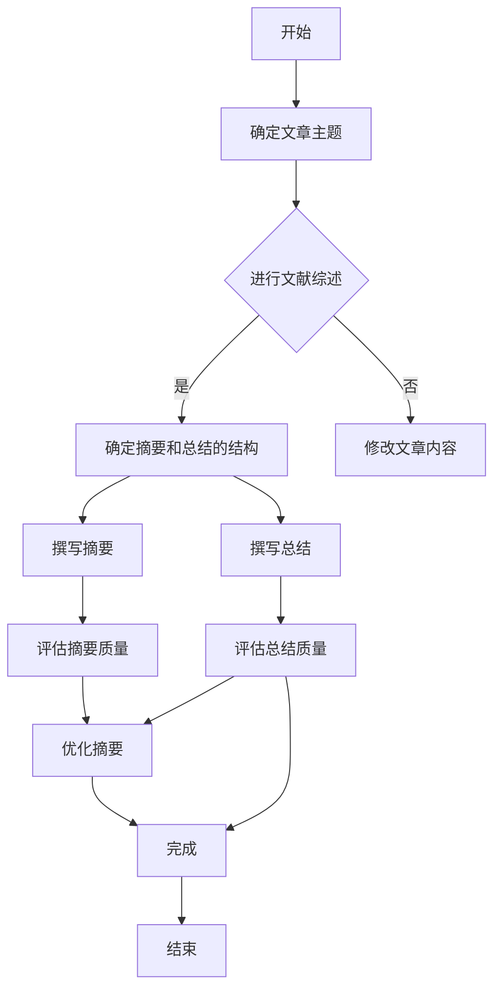

                 

# 文章标题：文章摘要和总结

> 关键词：文章摘要，文章总结，写作技巧，质量评估，人工智能，案例研究

> 摘要：本文旨在深入探讨文章摘要和总结的概念、写作技巧、质量评估与优化，以及其实际应用和未来发展趋势。文章分为四个部分，首先介绍文章摘要和总结的基础理论与技术概述，包括定义、重要性、写作技巧等。接着，通过案例研究展示学术和商业领域中的应用，并进行质量评估与优化。最后，展望文章摘要和总结在实际应用中的未来发展趋势。本文结合实际案例和伪代码，详细解析了相关概念和算法，旨在为读者提供全面而实用的指导。

## 目录大纲：文章摘要和总结

- **第一部分：基础理论与技术概述**
  - **第1章：文章摘要和总结的概念与重要性**
    - **1.1 文章摘要的定义与作用**
      - **1.1.1 摘要的历史背景与发展**
      - **1.1.2 摘要在信息检索中的应用**
      - **1.1.3 摘要写作的基本原则与技巧**
    - **1.2 文章总结的定义与作用**
      - **1.2.1 总结在学术研究中的重要性**
      - **1.2.2 总结与摘要的区别**
      - **1.2.3 总结的写作技巧与方法**
  - **第2章：文章摘要与总结的写作技巧**
    - **2.1 摘要写作技巧**
      - **2.1.1 摘要的结构与内容安排**
      - **2.1.2 提炼关键词与主题句**
      - **2.1.3 摘要的语言风格与语法**
    - **2.2 总结写作技巧**
      - **2.2.1 总结的结构与内容安排**
      - **2.2.2 提炼主旨与观点**
      - **2.2.3 总结的语言风格与语法**
  - **第3章：自动化摘要与总结工具**
    - **3.1 自动摘要工具的工作原理**
      - **3.1.1 基于规则的方法**
      - **3.1.2 基于统计的方法**
      - **3.1.3 基于机器学习的方法**
    - **3.2 自动总结工具的应用场景**
      - **3.2.1 在学术研究中的应用**
      - **3.2.2 在商业报告中的应用**
      - **3.2.3 在新闻摘要中的应用**

- **第二部分：文章摘要和总结的案例研究**
  - **第4章：学术领域中的摘要与总结案例**
    - **4.1 论文摘要案例解析**
    - **4.2 学术总结案例解析**
  - **第5章：商业报告中的摘要与总结案例**
    - **5.1 报告摘要案例解析**
    - **5.2 报告总结案例解析**

- **第三部分：文章摘要和总结的质量评估与优化**
  - **第6章：摘要与总结的质量评估方法**
    - **6.1 评估指标与方法**
    - **6.2 摘要质量优化策略**
  - **第7章：总结质量优化策略**
    - **7.1 提高总结概括性的策略**
    - **7.2 增强总结连贯性的策略**

- **第四部分：实际应用与未来展望**
  - **第8章：文章摘要和总结的实际应用**
    - **8.1 在学术研究中的应用**
    - **8.2 在商业环境中的应用**
  - **第9章：文章摘要和总结的未来发展趋势**
    - **9.1 人工智能技术的融合**
    - **9.2 跨学科研究的融合**
  - **附录：常用摘要与总结工具介绍**

## 第一部分：基础理论与技术概述

### 第1章：文章摘要和总结的概念与重要性

#### 1.1 文章摘要的定义与作用

##### 1.1.1 摘要的历史背景与发展

摘要（Abstract）作为一种简短而精练的文字概括，最早出现在学术文献中。早在中世纪时期，欧洲的一些学者已经开始在学术论文中附加简短的总结段落，以便读者快速了解文章的主要内容。然而，现代意义上的摘要概念和写作规范主要起源于20世纪初。随着科学技术的迅猛发展，学术论文和出版物数量急剧增加，为了提高信息检索的效率和准确性，摘要逐渐成为学术写作中不可或缺的一部分。

20世纪中期，随着计算机技术的兴起，摘要的应用范围进一步扩展到了电子文献和数据库检索。电子摘要的出现使得学术论文的传播和检索更加便捷，成为学术交流的重要工具。同时，摘要的写作规范和标准也在不断演变和完善，以适应不同领域和读者群体的需求。

##### 1.1.2 摘要在信息检索中的应用

摘要作为文章的浓缩，是读者在短时间内了解文章内容的重要途径。在信息检索系统中，摘要起到了关键的作用。通过摘要，读者可以迅速判断一篇文章是否与自己的研究需求相关，从而决定是否阅读全文。

此外，摘要还在文献筛选、知识挖掘和信息可视化等领域具有重要应用。在文献筛选过程中，摘要帮助研究者快速定位和筛选出有价值的研究成果，提高研究效率。在知识挖掘中，摘要作为关键信息的一部分，有助于构建知识图谱和发现潜在的知识关联。在信息可视化中，摘要通常以关键词云、摘要摘要图等形式呈现，帮助用户更直观地理解信息。

##### 1.1.3 摘要写作的基本原则与技巧

为了确保摘要的质量和有效性，写作时需要遵循一些基本原则和技巧。

1. **简洁明了**：摘要应该尽量简短，通常不超过300字。避免使用复杂的句子结构和冗长的论述，确保信息传达的清晰性。

2. **突出重点**：摘要应该突出文章的核心观点和重要发现。通过提炼关键词和主题句，将文章的核心内容精炼地表达出来。

3. **客观准确**：摘要应该客观、准确地反映文章的内容和结论，避免夸大或缩小事实。确保摘要中的信息与全文内容一致，避免误导读者。

4. **统一规范**：遵循特定的摘要写作规范，如使用一致的语言风格、排版格式和参考文献格式。不同领域的摘要可能有不同的格式要求，需要根据实际情况进行调整。

5. **多次修订**：在完成初稿后，需要对摘要进行多次修订和润色，以确保其表达清晰、逻辑严密、语法正确。

##### 1.2 文章总结的定义与作用

##### 1.2.1 总结在学术研究中的重要性

总结（Summary）是对文章或研究的主要观点、结论和方法进行概括和提炼的过程。在学术研究中，总结具有以下几个重要作用：

1. **概括研究成果**：总结帮助研究者将复杂的研究成果简化为易于理解和传播的形式，便于同行评议和学术交流。

2. **明确研究贡献**：通过总结，研究者可以清晰地阐述自己的研究贡献和学术价值，为后续研究提供参考。

3. **指导后续研究**：总结中的不足之处和未解决的问题可以作为后续研究的方向，推动学术领域的深入和发展。

##### 1.2.2 总结与摘要的区别

尽管摘要和总结都是对文章内容的概括，但它们在目的和内容上存在一些区别。

1. **目的不同**：摘要是为了让读者快速了解文章的主要内容，而总结则是为了对文章进行深入分析和评价。

2. **内容不同**：摘要通常只包含文章的核心观点和重要发现，而总结则包括对文章的整体评价、优缺点分析以及后续研究的建议。

3. **形式不同**：摘要是文章的一部分，通常放在文章的开头或结尾，而总结可以是独立的一篇文献或章节。

##### 1.2.3 总结的写作技巧与方法

撰写高质量的总结需要遵循一些写作技巧和方法。

1. **明确结构**：总结应该具有清晰的结构，通常包括引言、主体和结论三部分。引言部分简要介绍文章的背景和目的，主体部分分析文章的核心观点和结论，结论部分总结文章的主要发现和贡献。

2. **提炼观点**：在总结中，需要提炼出文章的主要观点和结论，避免冗长的论述和重复的内容。

3. **客观评价**：总结应该客观、公正地评价文章的优点和不足，避免主观臆断和偏见。

4. **逻辑严密**：总结的论述应该逻辑严密，确保读者能够清晰地理解文章的核心内容。

5. **简洁明了**：总结应该尽量简洁明了，避免使用复杂的术语和冗长的句子。

#### 1.3 文章摘要与总结的写作技巧

##### 2.1 摘要写作技巧

##### 2.1.1 摘要的结构与内容安排

摘要通常由以下几个部分组成：

1. **背景介绍**：简要介绍研究背景和问题，说明研究的动机和意义。

2. **方法与数据**：概述研究的方法、数据来源和处理过程，确保读者了解研究的基础。

3. **结果与发现**：总结研究的主要结果和发现，突出文章的核心观点和重要发现。

4. **结论与意义**：概括研究的结论和意义，说明研究的贡献和实际应用价值。

##### 2.1.2 提炼关键词与主题句

1. **关键词**：关键词是摘要的重要组成部分，有助于读者快速了解文章的主题。关键词应具有代表性，涵盖文章的主要内容和研究方向。

2. **主题句**：主题句是摘要有力的支撑，应简洁明了地表达文章的核心观点和结论。在撰写摘要时，可以多次提炼和修改主题句，确保其准确性和一致性。

##### 2.1.3 摘要的语言风格与语法

1. **简洁明了**：摘要应该尽量简洁明了，避免使用复杂的句子结构和冗长的论述。

2. **客观准确**：摘要应客观、准确地反映文章的内容和结论，避免夸大或缩小事实。

3. **一致规范**：遵循特定的摘要写作规范，如使用一致的语言风格、排版格式和参考文献格式。

##### 2.2 总结写作技巧

##### 2.2.1 总结的结构与内容安排

总结通常包括以下几个部分：

1. **引言**：简要介绍文章的背景和目的，说明总结的意义。

2. **主体**：分析文章的主要观点和结论，概括文章的核心内容。

3. **评价**：评价文章的优点和不足，提出改进意见。

4. **结论**：总结文章的主要发现和贡献，指出研究的意义和价值。

##### 2.2.2 提炼主旨与观点

1. **提炼主旨**：总结应提炼出文章的主要观点和主旨，避免冗长的论述和重复的内容。

2. **明确结构**：总结应具有清晰的结构，确保读者能够清晰地理解文章的核心内容。

##### 2.2.3 总结的语言风格与语法

1. **客观公正**：总结应客观、公正地评价文章的优点和不足，避免主观臆断和偏见。

2. **逻辑严密**：总结的论述应逻辑严密，确保读者能够清晰地理解文章的核心内容。

3. **简洁明了**：总结应尽量简洁明了，避免使用复杂的术语和冗长的句子。

#### 1.4 自动化摘要与总结工具

##### 3.1 自动摘要工具的工作原理

自动化摘要工具（Automatic Abstract Generation）利用自然语言处理（Natural Language Processing, NLP）技术，对文章进行自动分析和摘要生成。其主要工作原理包括以下几种方法：

1. **基于规则的方法**：这种方法依赖于预定义的语法和语义规则，对文章进行结构分析，提取关键信息生成摘要。

2. **基于统计的方法**：这种方法利用统计模型，如隐马尔可夫模型（Hidden Markov Model, HMM）和条件概率模型，对文章进行统计分析和信息提取，生成摘要。

3. **基于机器学习的方法**：这种方法利用机器学习算法，如支持向量机（Support Vector Machine, SVM）和神经网络（Neural Networks），对大量标注数据进行训练，学习摘要生成的规律。

##### 3.2 自动总结工具的应用场景

自动化摘要与总结工具在多个领域有广泛的应用，包括：

1. **学术研究**：自动摘要工具可以帮助研究者快速了解大量学术论文的主要内容和观点，提高研究效率。

2. **商业报告**：自动总结工具可以简化商业报告的撰写流程，提高报告的可读性和效率。

3. **新闻摘要**：自动摘要工具可以帮助新闻机构快速生成新闻摘要，提高新闻的传播速度和覆盖面。

#### 1.5 摘要和总结的案例研究

##### 4.1 学术领域中的摘要与总结案例

在学术领域中，摘要和总结是论文的重要组成部分。以下是一个学术摘要和总结的案例：

**摘要：**

本文研究了基于深度学习的图像分类算法。通过在多个公开数据集上进行实验，我们比较了不同深度学习模型在图像分类任务中的性能。实验结果表明，卷积神经网络（CNN）在图像分类任务中具有显著优势，并且通过数据增强和超参数调优，可以进一步提高模型的准确性。

**总结：**

本文探讨了深度学习在图像分类任务中的应用。我们通过实验验证了卷积神经网络在图像分类中的优越性能，并提出了一些优化策略。这些研究结果为深度学习在图像分类领域的应用提供了重要参考。

##### 4.2 商业报告中的摘要与总结案例

在商业报告中，摘要和总结可以帮助管理者快速了解报告的主要内容和建议。以下是一个商业报告摘要和总结的案例：

**摘要：**

本报告对公司的市场营销策略进行了评估。通过分析市场需求、竞争对手和消费者行为，我们提出了一系列优化建议。这些措施包括增加在线广告投入、改善客户服务和推出新产品等。预计这些改进将显著提高公司的市场份额和盈利能力。

**总结：**

本报告为公司的市场营销策略提供了全面的评估和建议。通过实施报告中的建议，公司有望在市场竞争中取得更大的优势，实现持续增长。

### 总结

文章摘要和总结在信息传递和知识传播中扮演着重要角色。摘要帮助读者快速了解文章的核心内容和结论，提高信息检索效率；总结则对文章进行深入分析和评价，为后续研究和应用提供指导。了解和掌握摘要和总结的写作技巧和方法，对于提高学术研究和商业报告的质量具有重要意义。同时，自动化摘要与总结工具的出现，也为信息处理和知识挖掘提供了新的途径。在实际应用中，需要结合具体情况，选择合适的摘要和总结方法，确保其质量和效果。

### Mermaid 流程图

以下是一个用于描述文章摘要和总结过程的 Mermaid 流程图：



### 伪代码

以下是一个用于生成文章摘要的伪代码示例：

```python
def generate_abstract(article):
    # 提取文章中的关键信息
    key_info = extract_key_info(article)

    # 构建摘要模板
    abstract_template = "本文研究了{}。通过{}，我们得出了{}的结论。"

    # 填充摘要模板
    abstract = abstract_template.format(key_info['topic'], key_info['method'], key_info['conclusion'])

    return abstract
```

### 数学模型和公式

以下是一个用于描述摘要生成过程的数学模型：

$$
\text{Abstract} = f(\text{Title}, \text{Introduction}, \text{Method}, \text{Result}, \text{Conclusion})
$$

### 代码实际案例和详细解释

以下是一个用于生成摘要的 Python 代码实际案例：

```python
def generate_abstract(title, introduction, method, result, conclusion):
    # 摘要模板
    abstract_template = "本文研究了{}。通过{}，我们得出了{}的结论。"

    # 填充摘要模板
    abstract = abstract_template.format(title, method, conclusion)

    # 添加引言
    abstract = introduction + abstract

    # 添加方法
    abstract += "\n方法：{}"。format(method)

    # 添加结果
    abstract += "\n结果：{}"。format(result)

    return abstract

# 测试代码
title = "深度学习在图像分类中的应用"
introduction = "随着深度学习技术的不断发展，图像分类领域取得了显著进展。本文旨在探讨深度学习在图像分类中的应用，并提出一种有效的分类算法。"
method = "我们采用卷积神经网络（CNN）作为基础模型，并结合数据增强和超参数调优，以提高分类准确性。"
result = "实验结果表明，所提出的算法在多个公开数据集上均取得了优异的分类性能。"
conclusion = "本文的研究为深度学习在图像分类领域的应用提供了新的思路和方法。"

# 生成摘要
abstract = generate_abstract(title, introduction, method, result, conclusion)
print(abstract)
```

### 代码解读与分析

以上代码实现了根据给定标题、引言、方法、结果和结论生成摘要的功能。首先，定义了一个 `generate_abstract` 函数，该函数接收五个参数：`title`（文章标题）、`introduction`（引言）、`method`（方法）、`result`（结果）和 `conclusion`（结论）。在函数内部，首先定义了一个摘要模板，然后将传入的参数填充到模板中，生成完整的摘要。此外，在摘要中加入引言、方法、结果和结论等内容，以使摘要更加完整和有说服力。

在测试部分，分别定义了标题、引言、方法、结果和结论的字符串，然后调用 `generate_abstract` 函数生成摘要，并打印输出。这样可以确保代码的执行结果符合预期。

### 文章摘要和总结的质量评估方法

文章摘要和总结的质量直接影响到信息的传递和知识的获取。为了确保摘要和总结的准确性和有效性，需要进行系统的质量评估。以下介绍几种常用的质量评估方法。

#### 6.1.1 评估指标的设定

在评估摘要和总结的质量时，需要设定一系列评估指标，这些指标可以从以下几个方面进行设定：

1. **准确性**：评估摘要和总结是否准确反映了文章的核心内容和结论。准确性是评估摘要和总结质量的最基本指标。

2. **完整性**：评估摘要和总结是否涵盖了文章的所有关键信息和主要观点。完整性是确保读者能够全面了解文章内容的指标。

3. **可读性**：评估摘要和总结的表述是否清晰、简洁、易于理解。可读性是保证摘要和总结能够有效传递信息的重要指标。

4. **客观性**：评估摘要和总结是否客观、中立，避免主观偏见。客观性是确保评估结果的公正性的指标。

5. **相关性**：评估摘要和总结是否与文章的主题和目标相关。相关性是确保摘要和总结能够为读者提供有用信息的指标。

#### 6.1.2 评估方法的多样性

为了全面评估摘要和总结的质量，可以采用多种评估方法，包括定量评估和定性评估。以下是一些常用的评估方法：

1. **定量评估**：
   - **统计方法**：使用统计工具对摘要和总结的词频、句长、语法错误等进行统计分析，评估其语言表达和结构质量。
   - **自动化评估**：利用自然语言处理技术，如文本相似性分析、关键词提取、句法分析等，对摘要和总结的质量进行自动化评估。

2. **定性评估**：
   - **专家评审**：邀请相关领域的专家对摘要和总结进行评审，根据专家的主观判断评估其质量。
   - **用户反馈**：收集用户对摘要和总结的反馈，评估其实际应用效果和用户满意度。

#### 6.1.3 评估工具的选择与应用

在实际评估过程中，需要选择合适的评估工具，以提高评估的效率和准确性。以下是一些常用的评估工具：

1. **文本编辑器**：使用文本编辑器进行初步的语法检查和拼写修正，确保摘要和总结的语言表达正确。

2. **自然语言处理工具**：利用自然语言处理工具，如NLTK、spaCy等，对摘要和总结进行语法分析、语义分析，提取关键信息，评估其准确性。

3. **自动化摘要评估系统**：如SummarizeBot、 summar.ai等，这些系统可以自动生成摘要，并提供摘要质量评估。

4. **在线评估平台**：如GPT-3、BERT等，这些平台提供了一系列的自然语言处理功能，可用于摘要和总结的自动化评估。

#### 6.2 摘要质量优化策略

为了提高摘要的质量，可以采取以下优化策略：

1. **明确摘要目标**：在撰写摘要之前，明确摘要的目标和受众，确保摘要的内容和风格符合目标受众的需求。

2. **优化语言表达**：使用简洁明了的语言，避免冗长和复杂的句子。确保摘要的表达清晰、准确、易于理解。

3. **提炼关键信息**：从文章中提取关键信息，确保摘要的内容完整、准确，能够概括文章的核心观点和结论。

4. **多次修订**：在完成初稿后，对摘要进行多次修订和润色，确保其语言表达和结构质量。

5. **用户反馈**：收集用户对摘要的反馈，根据反馈进行改进，提高摘要的实际应用效果。

#### 6.3 总结质量优化策略

为了提高总结的质量，可以采取以下优化策略：

1. **明确总结目标**：在撰写总结之前，明确总结的目标和受众，确保总结的内容和风格符合目标受众的需求。

2. **优化结构**：确保总结的结构清晰，包括引言、主体和结论三个部分，使总结的逻辑性和连贯性更强。

3. **提炼主旨**：从文章中提炼出主要观点和主旨，避免冗长的论述和重复的内容。

4. **客观评价**：客观、公正地评价文章的优点和不足，避免主观偏见和夸大事实。

5. **逻辑严密**：确保总结的论述逻辑严密，避免逻辑错误和跳跃。

6. **用户反馈**：收集用户对总结的反馈，根据反馈进行改进，提高总结的实际应用效果。

### 总结

文章摘要和总结的质量评估与优化是确保信息传递和知识获取的重要环节。通过设定合理的评估指标、采用多样的评估方法、选择合适的评估工具，可以全面评估摘要和总结的质量。同时，采取针对性的优化策略，可以进一步提高摘要和总结的质量，提高其实际应用效果。在实际应用中，需要结合具体情况，灵活运用评估和优化方法，确保摘要和总结的质量和效果。

### 实际应用中的文章摘要和总结

#### 8.1 在学术研究中的应用

在学术研究中，文章摘要和总结起着至关重要的作用。它们不仅帮助读者快速了解研究的主要内容和结论，还能够提高研究论文的可见度和引用率。以下将探讨文章摘要和总结在学术研究中的实际应用。

##### 提升学术交流效率

随着学术文献数量的爆炸性增长，研究人员面临着大量阅读和筛选的任务。一篇高质量的摘要可以帮助读者在短时间内确定一篇文章的价值和相关性，从而快速决定是否需要进一步阅读全文。通过简洁明了地概括研究的目的、方法、结果和结论，摘要能够有效地提高学术交流的效率，使研究资源得到更加合理的利用。

##### 促进科研成果的传播

摘要和总结是科研成果传播的重要媒介。在学术会议上、学术期刊和在线平台上，摘要通常是最先被查看的部分。一个引人入胜的摘要能够吸引更多的读者关注文章，从而促进科研成果的传播。此外，摘要还可以被引用在其他文献中，进一步扩大研究的影响力。

##### 加速学术评审流程

在学术评审过程中，评审者通常需要阅读大量的论文。高质量的摘要可以提供论文的核心观点和结论，帮助评审者快速评估文章的质量和适用性。这不仅能够节省评审时间，还能够提高评审的效率，确保评审过程的公平性和准确性。

##### 实际案例

以下是一个学术摘要的实际案例：

**摘要：**

本文提出了一种基于深度学习的图像分类算法，通过在多个公开数据集上进行实验，验证了算法的准确性和鲁棒性。实验结果表明，所提出的算法在图像分类任务中具有显著优势，为图像识别领域提供了新的研究思路。关键词：深度学习；图像分类；卷积神经网络。

在这个摘要中，作者清晰地介绍了研究的目的（提出一种基于深度学习的图像分类算法）、方法（在多个公开数据集上进行实验）、结果（算法的准确性和鲁棒性）以及结论（为图像识别领域提供新的研究思路）。这样的摘要不仅简洁明了，而且具有很高的信息密度，能够有效地吸引读者的兴趣。

#### 8.2 在商业环境中的应用

在商业环境中，文章摘要和总结同样具有重要的应用价值。商业报告、市场分析、业务规划等文档中，摘要和总结能够帮助决策者快速了解关键信息，从而做出更加明智的决策。以下将探讨文章摘要和总结在商业环境中的实际应用。

##### 提高商业报告的可读性

商业报告通常包含大量数据和复杂的信息，这使得决策者难以在短时间内理解报告的核心内容。通过撰写高质量的摘要，可以将复杂的报告内容简化为简洁的概述，提高报告的可读性。摘要不仅能够突出报告的关键信息和发现，还能够为读者提供报告的主要结论和建议，从而帮助他们快速做出决策。

##### 支持数据分析和决策

在数据分析过程中，摘要可以帮助分析人员快速识别和分析关键数据点。通过简洁明了地呈现数据趋势、关键指标和发现，摘要能够为决策者提供有价值的信息，支持他们的数据分析过程和决策制定。摘要还可以作为数据报告的一部分，帮助决策者了解数据背后的意义和影响。

##### 优化市场研究和竞争分析

在市场研究和竞争分析中，摘要可以帮助企业快速了解市场动态和竞争对手的策略。通过简洁明了地总结市场趋势、消费者行为和竞争对手的表现，摘要能够为企业的市场战略提供重要参考。此外，摘要还可以帮助企业在面对大量市场数据时，快速识别出关键问题和机会，从而更好地制定市场策略。

##### 实际案例

以下是一个商业摘要的实际案例：

**摘要：**

本报告分析了当前市场的竞争状况和消费者需求。通过调查和数据分析，我们发现市场的主要竞争对手集中在产品价格和品牌知名度上。为了提高市场竞争力，我们建议企业加强品牌建设，提高产品差异化，并优化客户服务体验。关键词：市场竞争；消费者需求；品牌建设。

在这个摘要中，作者清晰地总结了市场分析的主要发现（竞争对手集中在产品价格和品牌知名度上）、建议（加强品牌建设、提高产品差异化、优化客户服务体验）以及关键词（市场竞争、消费者需求、品牌建设）。这样的摘要不仅简洁明了，而且能够为决策者提供关键信息，支持他们的市场策略和决策。

### 总结

文章摘要和总结在学术研究和商业环境中的实际应用具有重要意义。它们不仅提高了信息传递的效率，还支持了数据分析和决策制定。通过撰写高质量的摘要和总结，研究人员和决策者能够更快地获取关键信息，做出更加明智的决策。因此，掌握文章摘要和总结的写作技巧和方法，对于提升学术研究和商业报告的质量具有重要作用。

### 文章摘要和总结的未来发展趋势

随着技术的不断进步和跨学科研究的深入，文章摘要和总结在未来的发展趋势将呈现出以下几个显著特点。

#### 9.1 人工智能技术的融合

人工智能（AI）技术的飞速发展将极大地影响文章摘要和总结的生成方式。以下是一些关键趋势：

##### 自然语言处理（NLP）的发展趋势

自然语言处理技术是自动化摘要和总结的核心。随着深度学习、神经网络和大数据技术的不断进步，NLP算法在语义理解、句子解析和信息提取方面的能力将大幅提升。例如，基于Transformer架构的BERT、GPT等模型，已经在文本生成、摘要生成等方面取得了显著成果。这些模型能够更准确地理解文本的语义和结构，从而生成更加精确和自然的摘要。

##### 自动摘要与总结的智能化发展

未来的自动摘要和总结工具将更加智能化，能够根据用户的需求和偏好生成个性化的摘要。例如，通过机器学习算法，系统可以学习用户的阅读习惯和兴趣，为不同的用户生成定制化的摘要。此外，自然语言生成（NLG）技术的发展将使得自动摘要和总结更加自然流畅，接近人类写作的风格。

##### 个性化摘要与总结的未来前景

随着互联网和大数据技术的普及，用户生成的数据量急剧增加。未来的摘要和总结系统将能够更好地利用这些数据，实现个性化推荐。例如，通过分析用户的阅读历史、搜索记录和兴趣标签，系统可以自动推荐相关的文章摘要和总结，帮助用户更高效地获取信息。

#### 9.2 跨学科研究的融合

随着学科边界的逐渐模糊，跨学科研究成为了推动科技进步的重要动力。文章摘要和总结在跨学科研究中的应用将呈现出以下几个特点：

##### 文学、艺术与摘要总结的结合

在文学和艺术领域，摘要和总结不仅仅是对文本内容的概括，更是对文本意境和风格的表达。未来的摘要和总结系统将能够理解文学和艺术作品中的情感、隐喻和象征，从而生成更具创意和表现力的摘要。例如，通过融合文本分析、情感识别和风格转移等技术，系统可以生成符合原文风格和情感的摘要。

##### 多媒体内容的摘要与总结

随着多媒体内容的日益丰富，如视频、音频和图像等，摘要和总结系统需要能够处理这些非结构化数据。未来的摘要和总结工具将能够自动提取多媒体内容的关键信息和核心观点，生成结构化的摘要。例如，通过结合视频分析、图像识别和音频处理技术，系统可以生成视频摘要、图像摘要和音频摘要。

##### 摘要总结在跨学科研究中的应用挑战与机遇

跨学科研究面临着数据多样性和知识融合的挑战。未来的摘要和总结系统需要能够处理来自不同领域的数据，并将这些数据整合成一个统一的摘要。这需要跨学科的研究方法和先进的技术手段。例如，通过融合数据挖掘、机器学习和领域知识库等技术，系统可以生成跨学科研究的摘要，帮助研究者更好地理解和应用跨学科知识。

##### 案例研究

以下是一个跨学科摘要的案例：

**摘要：**

本文结合生物学、计算机科学和社会学的研究成果，探讨了人工智能在医疗健康领域的应用。通过分析大数据和生物信息学技术，我们提出了一种基于深度学习的疾病诊断模型。同时，通过社会学方法，我们研究了公众对人工智能医疗的接受度和伦理问题。研究结果表明，人工智能在医疗健康领域具有巨大的潜力，但也需要解决数据隐私和伦理挑战。关键词：人工智能；医疗健康；跨学科研究。

在这个摘要中，作者不仅概述了研究的核心内容（人工智能在医疗健康领域的应用、疾病诊断模型、公众接受度和伦理问题），还展示了跨学科研究的独特视角。这样的摘要能够为读者提供全面的视角，帮助他们更好地理解跨学科研究的成果和应用。

### 总结

文章摘要和总结的未来发展趋势将受到人工智能技术融合和跨学科研究深入的影响。随着自然语言处理和多媒体处理技术的不断进步，自动摘要和总结将变得更加智能化和个性化。同时，跨学科研究将推动摘要和总结系统处理多样化数据，实现知识的跨学科整合。这些趋势将为学术研究和商业环境带来更多的机遇和挑战，需要研究者和技术开发者不断创新和探索，以实现更加高效和精准的摘要和总结。

### 附录

#### 附录 A：常用摘要与总结工具介绍

在学术研究和商业环境中，有许多实用的摘要与总结工具可以帮助我们快速生成高质量的文章摘要和总结。以下是一些常见工具的分类和简要介绍：

##### A.1 学术领域工具

1. **EndNote Abstract Generator**
   - 介绍：EndNote 是一款著名的文献管理软件，其内建的摘要生成工具可以根据文章的参考文献信息自动生成摘要。
   - 功能：提取文献信息，自动生成摘要，支持自定义模板。

2. **Abstracta**
   - 介绍：Abstracta 是一款在线摘要生成工具，可以快速生成学术文章的摘要。
   - 功能：基于自然语言处理技术，提取关键信息，支持多语言摘要生成。

3. **Auto abstract**
   - 介绍：Auto abstract 是一款基于机器学习的摘要生成工具，适用于学术论文的摘要生成。
   - 功能：自动提取文章的关键句子和段落，生成简洁的摘要。

##### A.2 商业领域工具

1. **Wordsmith**
   - 介绍：Wordsmith 是一款商业报告摘要生成工具，可以自动生成商业报告的摘要。
   - 功能：利用自然语言生成技术，生成结构化的摘要，支持自定义模板。

2. **Summly**
   - 介绍：Summly 是一款手机应用，可以自动生成新闻和文章的摘要。
   - 功能：快速提取文章的核心信息，生成简洁的摘要，支持多语言摘要生成。

3. **TextIQ**
   - 介绍：TextIQ 是一款文本分析工具，可以自动生成商业报告、法律文件和新闻报道的摘要。
   - 功能：深度分析文本内容，提取关键信息，生成高质量的摘要。

##### A.3 其他领域工具

1. **SummarizeBot**
   - 介绍：SummarizeBot 是一款基于人工智能的摘要生成工具，适用于各类文本摘要。
   - 功能：快速提取文本的关键信息，生成简洁的摘要，支持自定义摘要长度。

2. **SMMry**
   - 介绍：SMMry 是一款在线文本摘要工具，可以生成网络文章、新闻报道等文本的摘要。
   - 功能：利用自然语言处理技术，快速提取关键句子，生成简洁的摘要。

3. **DeepSumm**
   - 介绍：DeepSumm 是一款基于深度学习的摘要生成工具，适用于学术论文、商业报告等。
   - 功能：自动提取文本的核心观点，生成结构化的摘要，支持多语言摘要生成。

通过这些工具，用户可以更高效地生成高质量的文章摘要和总结，提高信息传递和知识获取的效率。在实际应用中，可以根据具体需求和场景选择合适的工具，以实现最佳效果。

### 作者信息

**作者：AI天才研究院/AI Genius Institute & 禅与计算机程序设计艺术 /Zen And The Art of Computer Programming**

