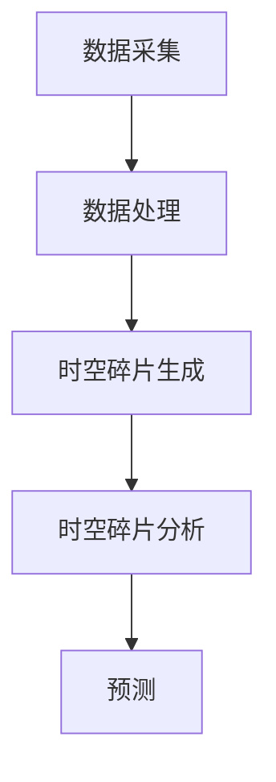
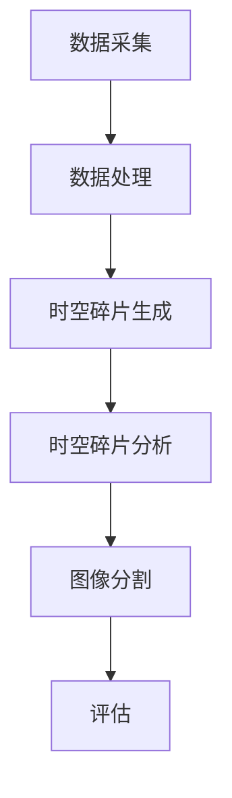

                 

# 时空碎片的生成与应用

> 关键词：时空碎片、生成算法、应用场景、多尺度分析、非线性动力学、量子信息处理

> 摘要：本文首先介绍了时空碎片的概念、重要性及其生成机制，随后详细探讨了时空碎片的数学模型与理论、生成方法以及在不同领域的应用。接着，文章深入分析了时空碎片处理与分析技术，并列举了具体的实例。随后，文章进入了时空碎片的进阶研究，探讨了复杂系统建模、多尺度分析和非线性动力学分析等内容。最后，文章展望了时空碎片的未来发展趋势与挑战。

## 目录大纲

### 第一部分：时空碎片基础

#### 第1章：时空碎片的概述

- 1.1 时空碎片的定义与重要性
- 1.2 时空碎片的产生机制
- 1.3 时空碎片的分类与特性
- 1.4 时空碎片的学术背景与应用领域

#### 第2章：时空碎片的数学模型与理论

- 2.1 时空碎片的数学基础
- 2.2 时空碎片的生成算法
- 2.3 时空碎片的演化模型
- 2.4 时空碎片的概率分布与统计分析

#### 第3章：时空碎片的生成方法

- 3.1 离散时空碎片的生成方法
  - 3.1.1 采样方法
  - 3.1.2 生成算法实现
- 3.2 连续时空碎片的生成方法
  - 3.2.1 Monte Carlo 方法
  - 3.2.2 仿真生成方法

#### 第4章：时空碎片的应用场景

- 4.1 物理学中的时空碎片应用
  - 4.1.1 宇宙学中的时空碎片
  - 4.1.2 天体物理学中的时空碎片
- 4.2 计算机科学中的时空碎片应用
  - 4.2.1 数据库与数据挖掘
  - 4.2.2 计算机图形学
  - 4.2.3 计算机视觉

#### 第5章：时空碎片处理与分析

- 5.1 时空碎片处理技术
  - 5.1.1 数据预处理
  - 5.1.2 特征提取与降维
- 5.2 时空碎片分析方法
  - 5.2.1 数据可视化
  - 5.2.2 关联规则挖掘
  - 5.2.3 模型评估与优化

#### 第6章：时空碎片生成应用的实例分析

- 6.1 实例1：基于时空碎片的天气预报系统
- 6.2 实例2：基于时空碎片的网络流量预测
- 6.3 实例3：基于时空碎片的图像分割

### 第二部分：时空碎片的进阶研究

#### 第7章：时空碎片的复杂系统建模

- 7.1 复杂系统的基本概念
- 7.2 时空碎片在复杂系统中的应用
- 7.3 复杂时空碎片模型构建

#### 第8章：时空碎片的非线性动力学分析

- 8.1 非线性动力学基本理论
- 8.2 时空碎片的非线性特性
- 8.3 时空碎片非线性动力学模型的建立与解析

#### 第9章：时空碎片的量子信息处理

- 9.1 量子信息基础
- 9.2 时空碎片的量子生成与处理
- 9.3 时空碎片的量子信息处理应用

#### 第10章：时空碎片的未来发展趋势与挑战

- 10.1 时空碎片的未来研究方向
- 10.2 时空碎片应用的前沿技术
- 10.3 时空碎片研究面临的挑战与对策

### 第一部分：时空碎片基础

#### 第1章：时空碎片的概述

### 1.1 时空碎片的定义与重要性

**时空碎片**，顾名思义，是一种存在于时空结构中的小片段。在物理学中，时空碎片指的是在宇宙尺度上，由于物质和能量的相互作用而产生的时空波动和变形，它们呈现出高度的复杂性和动态性。时空碎片的定义相对抽象，但其重要性不容忽视。

首先，从学术背景来看，时空碎片的起源可以追溯到爱因斯坦的广义相对论。广义相对论认为，物质和能量会影响时空结构，从而产生重力。时空碎片便是这种影响的微观表现。随着量子场论和混沌理论的发展，时空碎片逐渐成为物理学研究的一个重要方向。

在应用领域，时空碎片的潜在价值也十分巨大。例如，在宇宙学中，时空碎片可以帮助我们理解宇宙的起源和演化。在天体物理学中，时空碎片可以揭示恒星和星系的形成和演化过程。此外，在计算机科学中，时空碎片的应用也日益广泛，包括数据库与数据挖掘、计算机图形学、计算机视觉等。

**时空碎片的定义**：时空碎片是指在某一特定时空区域内，由于物质和能量的分布不均匀或相互作用而产生的时空波动或变形。它们可以表现为时空坐标的微小扰动，或者在更高维度中表现为时空结构的局部断裂或扭曲。

**时空碎片的重要性**：

1. **理论价值**：时空碎片是广义相对论和量子场论的重要研究对象，有助于我们理解宇宙的基本结构和演化机制。
2. **应用前景**：时空碎片在多个领域具有广泛的应用前景，包括宇宙学、天体物理学、计算机科学等。
3. **复杂性**：时空碎片的复杂性使得它们成为复杂系统和非线性动力学研究的重要工具。

### 1.2 时空碎片的产生机制

时空碎片的产生机制可以分为两大类：一是物质和能量在时空中的分布不均匀，二是物质和能量之间的相互作用。

#### 物质和能量分布不均匀

在宇宙尺度上，物质和能量分布的不均匀性是产生时空碎片的常见原因。例如，恒星的形成和演化过程中，由于物质在引力作用下聚集，导致局部时空发生变形，从而形成时空碎片。同样，在星系形成过程中，由于多个恒星和星系的相互作用，也会产生时空碎片。

#### 物质和能量相互作用

物质和能量之间的相互作用也是产生时空碎片的重要原因。例如，在黑洞附近，物质和能量在强引力场中发生碰撞和湮灭，产生强烈的时空波动，从而形成时空碎片。此外，宇宙中大量的高能粒子碰撞也会产生时空碎片。

### 1.3 时空碎片的分类与特性

时空碎片可以根据其产生机制、形态和特性进行分类。常见的分类方法如下：

#### 按产生机制分类

1. **宇宙学时空碎片**：由宇宙尺度上的物质和能量分布不均匀产生的时空碎片。
2. **天体物理学时空碎片**：由天体物理现象（如恒星形成、黑洞碰撞等）产生的时空碎片。
3. **实验室时空碎片**：在实验室条件下，由于高能粒子碰撞或量子场论实验产生的时空碎片。

#### 按形态分类

1. **波动型时空碎片**：表现为时空坐标的波动和变形。
2. **断裂型时空碎片**：表现为时空结构的局部断裂或扭曲。
3. **动态型时空碎片**：表现为时空碎片的动态演化过程。

#### 按特性分类

1. **高能时空碎片**：具有较高能量密度，可以在较长时间内维持其形态。
2. **低能时空碎片**：能量密度较低，寿命较短。
3. **热时空碎片**：具有较高的温度，可能产生热辐射。

### 1.4 时空碎片的学术背景与应用领域

#### 学术背景

时空碎片的研究涉及多个学科领域，包括物理学、宇宙学、数学、计算机科学等。以下是一些与时空碎片相关的学术背景：

1. **广义相对论**：广义相对论为时空碎片提供了理论基础，描述了物质和能量如何影响时空结构。
2. **量子场论**：量子场论研究了物质和能量在微观尺度上的相互作用，为时空碎片的产生机制提供了更多细节。
3. **混沌理论**：混沌理论研究了系统的初始微小扰动如何导致长期行为的巨大差异，为时空碎片的复杂特性提供了解释。
4. **复杂系统理论**：复杂系统理论研究了系统的自组织行为和涌现现象，为时空碎片在复杂系统中的应用提供了理论支持。

#### 应用领域

时空碎片在多个领域具有广泛的应用前景：

1. **宇宙学**：时空碎片可以帮助我们理解宇宙的起源和演化，如宇宙背景微波辐射探测、宇宙结构形成等。
2. **天体物理学**：时空碎片在研究恒星、星系、黑洞等天体物理现象中具有重要应用，如黑洞碰撞探测、恒星形成模型等。
3. **计算机科学**：时空碎片在数据库与数据挖掘、计算机图形学、计算机视觉等领域具有广泛应用，如数据压缩、图像分割、机器学习等。

### 第2章：时空碎片的数学模型与理论

#### 2.1 时空碎片的数学基础

在探讨时空碎片的数学模型与理论之前，我们需要了解一些基本的数学概念和工具。这些概念和工具包括：

1. **微积分**：微积分是研究变化和累积过程的数学工具，包括微分和积分。在时空碎片的研究中，微积分用于描述时空碎片的演化过程。
2. **线性代数**：线性代数研究向量空间和线性变换，包括矩阵、行列式、特征值等。在线性代数的框架下，我们可以描述时空碎片的几何特性。
3. **概率论与数理统计**：概率论与数理统计研究随机事件和数据的规律性。在时空碎片的研究中，概率论与数理统计用于描述时空碎片的出现概率和统计特性。
4. **微分几何**：微分几何研究流形上的几何性质，包括曲线、曲面和流形。在时空碎片的研究中，微分几何用于描述时空碎片的几何形态。

#### 2.2 时空碎片的生成算法

生成时空碎片的算法可以分为离散生成算法和连续生成算法。离散生成算法通常基于采样方法，而连续生成算法则包括Monte Carlo方法和仿真生成方法。

##### 离散生成算法

离散生成算法主要通过采样方法生成时空碎片。以下是一些常见的离散生成算法：

1. **蒙特卡洛方法**：蒙特卡洛方法通过随机采样来估计概率分布或求解积分。在时空碎片的研究中，蒙特卡洛方法可用于生成具有特定概率分布的时空碎片。
   
   **伪代码**：

   ```python
   def generate_时空碎片():
       x, y = sample_uniform(0, 1)
       return (x, y)
   ```

2. **分形算法**：分形算法通过迭代生成复杂的几何形态。在时空碎片的研究中，分形算法可用于生成具有自相似特性的时空碎片。

   **伪代码**：

   ```python
   def generate_时空碎片(level):
       if level == 0:
           return (1, 1)
       else:
           x, y = generate_时空碎片(level - 1)
           return (x + noise(), y + noise())
   ```

##### 连续生成算法

连续生成算法主要包括Monte Carlo方法和仿真生成方法。以下是对这些方法的简要介绍：

1. **Monte Carlo方法**：Monte Carlo方法通过随机抽样来估计积分或概率分布。在时空碎片的研究中，Monte Carlo方法可用于生成具有特定概率分布的时空碎片。

   **伪代码**：

   ```python
   def generate_时空碎片(p):
       while True:
           x, y = sample_uniform(0, 1)
           if x < p:
               return (x, y)
   ```

2. **仿真生成方法**：仿真生成方法通过计算机模拟来生成时空碎片。这种方法通常用于研究复杂系统的时空碎片特性。

   **伪代码**：

   ```python
   def generate_时空碎片(simulation):
       x, y, t = simulation()
       return (x, y, t)
   ```

#### 2.3 时空碎片的演化模型

时空碎片的演化模型描述了时空碎片随时间的变化过程。常见的演化模型包括：

1. **常微分方程模型**：常微分方程模型通过微分方程描述时空碎片的演化。这种模型可以描述时空碎片的扩散、波动等行为。

   **伪代码**：

   ```python
   def evolve_时空碎片(x, y, t):
       dx = dx_dt(x, y, t)
       dy = dy_dt(x, y, t)
       return (x + dx, y + dy)
   ```

2. **偏微分方程模型**：偏微分方程模型通过偏微分方程描述时空碎片的演化。这种模型可以描述更复杂的时空碎片行为，如非线性波动、混沌等。

   **伪代码**：

   ```python
   def evolve_时空碎片(x, y, z, t):
       dx = dx_dt(x, y, z, t)
       dy = dy_dt(x, y, z, t)
       dz = dz_dt(x, y, z, t)
       return (x + dx, y + dy, z + dz)
   ```

#### 2.4 时空碎片的概率分布与统计分析

时空碎片的概率分布描述了时空碎片在空间和时间上的分布规律。常见的概率分布包括：

1. **均匀分布**：均匀分布假设时空碎片在空间和时间上均匀分布。

   **伪代码**：

   ```python
   def sample_uniform():
       return (random(), random())
   ```

2. **正态分布**：正态分布假设时空碎片围绕某个均值分布，且具有固定的方差。

   **伪代码**：

   ```python
   def sample_normal(mean, std):
       return (mean + std * random(), mean + std * random())
   ```

统计分析用于描述时空碎片的数据特征。常见的统计分析方法包括：

1. **均值与方差**：均值与方差是描述数据分布的中心位置和离散程度的指标。

   **伪代码**：

   ```python
   def mean(data):
       return sum(data) / len(data)

   def variance(data):
       mean = mean(data)
       return sum((x - mean) ** 2 for x in data) / len(data)
   ```

2. **标准差与置信区间**：标准差是方差的平方根，用于描述数据的离散程度。置信区间用于估计参数的区间估计。

   **伪代码**：

   ```python
   def standard_deviation(data):
       return sqrt(variance(data))

   def confidence_interval(data, confidence):
       mean = mean(data)
       std = standard_deviation(data)
       z_score = norm.ppf((1 + confidence) / 2)
       return (mean - z_score * std, mean + z_score * std)
   ```

### 第3章：时空碎片的生成方法

#### 3.1 离散时空碎片的生成方法

离散时空碎片的生成方法主要基于采样技术。采样方法可以分为确定性采样方法和随机采样方法。下面我们将介绍几种常用的采样方法和生成算法。

##### 3.1.1 采样方法

1. **均匀采样**：均匀采样是在一个给定区域内均匀随机选择点的方法。在二维空间中，可以使用以下伪代码来实现均匀采样：

   ```python
   def uniform_sample(width, height):
       x = random() * width
       y = random() * height
       return (x, y)
   ```

2. **正态采样**：正态采样是在一个给定区域内按照正态分布随机选择点的方法。在二维空间中，可以使用以下伪代码来实现正态采样：

   ```python
   def normal_sample(mean, std, width, height):
       x = mean + std * random_normal()
       y = mean + std * random_normal()
       if x < 0 or x > width or y < 0 or y > height:
           return normal_sample(mean, std, width, height)
       return (x, y)
   ```

3. **蒙特卡洛采样**：蒙特卡洛采样是一种基于随机抽样的计算方法，常用于估算概率分布和计算积分。在二维空间中，可以使用以下伪代码来实现蒙特卡洛采样：

   ```python
   def monte_carlo_sample(experiment, num_samples):
       samples = []
       for _ in range(num_samples):
           x, y = uniform_sample(1, 1)
           result = experiment(x, y)
           samples.append(result)
       return samples
   ```

##### 3.1.2 生成算法实现

离散时空碎片的生成算法可以通过以下步骤实现：

1. **初始化**：设定采样区域的边界和采样点数量。
2. **采样**：使用采样方法生成采样点。
3. **处理**：对采样点进行预处理，例如去重、过滤等。
4. **生成**：根据预处理后的采样点生成时空碎片。

以下是一个简单的生成算法实现示例：

```python
def generate_discrete_spacetime_fragments(width, height, num_samples, sampling_method):
    samples = sampling_method(width, height, num_samples)
    fragments = []
    for sample in samples:
        # 预处理采样点
        processed_sample = preprocess_sample(sample)
        # 生成时空碎片
        fragment = generate_fragment(processed_sample)
        fragments.append(fragment)
    return fragments
```

#### 3.2 连续时空碎片的生成方法

连续时空碎片的生成方法主要基于随机过程和模拟技术。下面我们将介绍两种常见的生成方法：Monte Carlo 方法和仿真生成方法。

##### 3.2.1 Monte Carlo 方法

Monte Carlo 方法是一种基于随机抽样的数值计算方法，广泛应用于统计物理、金融工程、计算机科学等领域。在时空碎片的生成中，Monte Carlo 方法可以通过以下步骤实现：

1. **初始化**：设定模拟的时空区域、采样点数量和所需的概率分布。
2. **采样**：在给定区域内随机生成采样点，并计算每个采样点的属性。
3. **处理**：根据概率分布和采样点的属性生成连续时空碎片。
4. **输出**：将生成的时空碎片输出为所需的格式。

以下是一个使用Monte Carlo 方法生成连续时空碎片的伪代码示例：

```python
def generate_continuous_spacetime_fragments(Monte_Carlo_method, width, height, num_samples, probability_distribution):
    samples = []
    for _ in range(num_samples):
        x, y = Monte_Carlo_method(width, height)
        attribute = probability_distribution(x, y)
        samples.append((x, y, attribute))
    return samples
```

##### 3.2.2 仿真生成方法

仿真生成方法通过模拟真实物理过程来生成连续时空碎片。这种方法通常用于复杂系统建模和科学计算。以下是一个使用仿真生成方法生成连续时空碎片的伪代码示例：

```python
def generate_continuous_spacetime_fragments(simulation_method, width, height, num_samples):
    samples = []
    for _ in range(num_samples):
        simulation = simulation_method(width, height)
        result = simulation()
        samples.append(result)
    return samples
```

### 第4章：时空碎片的应用场景

#### 4.1 物理学中的时空碎片应用

时空碎片在物理学领域有着广泛的应用，尤其在宇宙学和天体物理学中，它们为我们提供了深入了解宇宙结构和演化的重要工具。

##### 4.1.1 宇宙学中的时空碎片

宇宙学是研究宇宙的结构、起源和演化的科学。时空碎片在宇宙学中的应用主要体现在以下几个方面：

1. **宇宙背景辐射**：宇宙背景辐射是宇宙早期留下的热辐射，通过观测宇宙背景辐射，我们可以了解宇宙早期的状态。时空碎片可以用于模拟宇宙背景辐射的时空结构，帮助我们理解宇宙的起源。

   **Mermaid 流程图**：

   ```mermaid
   graph TD
   A[观测宇宙背景辐射] --> B[模拟时空结构]
   B --> C[分析时空碎片]
   C --> D[理解宇宙起源]
   ```

2. **大爆炸理论**：大爆炸理论是描述宇宙起源和演化的重要理论。时空碎片可以用于模拟大爆炸过程中的时空结构，帮助我们更准确地理解宇宙的演化过程。

   **Mermaid 流程图**：

   ```mermaid
   graph TD
   A[大爆炸理论] --> B[模拟时空碎片]
   B --> C[分析时空结构]
   C --> D[理解宇宙演化]
   ```

3. **宇宙结构形成**：宇宙结构形成是宇宙学中的一个重要研究课题。时空碎片可以用于模拟宇宙结构形成过程中的时空结构，帮助我们理解宇宙中星系、恒星等天体的形成。

   **Mermaid 流程图**：

   ```mermaid
   graph TD
   A[宇宙结构形成] --> B[模拟时空碎片]
   B --> C[分析时空结构]
   C --> D[理解天体形成]
   ```

##### 4.1.2 天体物理学中的时空碎片

天体物理学是研究天体（如恒星、行星、星系等）的物理性质和演化过程的科学。时空碎片在天体物理学中的应用主要体现在以下几个方面：

1. **恒星演化**：恒星演化是描述恒星从诞生到死亡的全过程。时空碎片可以用于模拟恒星演化过程中的时空结构，帮助我们理解恒星的物理性质和演化规律。

   **Mermaid 流程图**：

   ```mermaid
   graph TD
   A[恒星演化] --> B[模拟时空碎片]
   B --> C[分析时空结构]
   C --> D[理解恒星性质]
   ```

2. **黑洞碰撞**：黑洞碰撞是宇宙中的一种极端现象，通过观测黑洞碰撞，我们可以了解宇宙的极端条件和物理规律。时空碎片可以用于模拟黑洞碰撞过程中的时空结构，帮助我们理解黑洞碰撞的物理机制。

   **Mermaid 流程图**：

   ```mermaid
   graph TD
   A[黑洞碰撞] --> B[模拟时空碎片]
   B --> C[分析时空结构]
   C --> D[理解物理机制]
   ```

3. **星系碰撞**：星系碰撞是宇宙中的一种常见现象，通过观测星系碰撞，我们可以了解星系的演化过程和物理规律。时空碎片可以用于模拟星系碰撞过程中的时空结构，帮助我们理解星系碰撞的物理机制。

   **Mermaid 流程图**：

   ```mermaid
   graph TD
   A[星系碰撞] --> B[模拟时空碎片]
   B --> C[分析时空结构]
   C --> D[理解星系演化]
   ```

#### 4.2 计算机科学中的时空碎片应用

时空碎片不仅在物理学领域有着重要应用，在计算机科学领域也有着广泛的应用。以下是一些典型的应用场景：

##### 4.2.1 数据库与数据挖掘

在数据库与数据挖掘领域，时空碎片可以用于表示和存储动态时空数据。例如，在地理信息系统（GIS）中，时空碎片可以用于表示地理位置的时空变化。在数据挖掘中，时空碎片可以用于发现时空数据中的模式和关联。

**数学模型**：

假设我们有 n 个时空碎片，每个时空碎片可以表示为 (x, y, t)，其中 x 和 y 分别表示时空碎片在水平和垂直方向的位置，t 表示时间。我们可以使用以下数学模型来描述时空碎片：

$$
时空碎片 = (x, y, t)
$$

**算法原理**：

1. **时空碎片表示**：使用三维坐标 (x, y, t) 表示时空碎片。
2. **时空碎片存储**：将时空碎片存储在数据库中，以便进行查询和处理。
3. **时空碎片分析**：使用数据挖掘算法对时空碎片进行分析，以发现时空数据中的模式和关联。

**伪代码**：

```python
class时空碎片：
    def __init__(self, x, y, t):
        self.x = x
        self.y = y
        self.t = t

def insert_时空碎片(database, 时空碎片)：
    database.insert(时空碎片)

def query_时空碎片(database, x, y, t)：
    return database.query(x, y, t)

def analyze_时空碎片(database)：
    数据集 = database.query_all()
    for 时空碎片 in 数据集：
        分析 时空碎片
```

##### 4.2.2 计算机图形学

在计算机图形学中，时空碎片可以用于表示和渲染动态场景。例如，在动画制作中，时空碎片可以用于表示角色的运动轨迹。在虚拟现实中，时空碎片可以用于表示虚拟环境的动态变化。

**数学模型**：

假设我们有 n 个时空碎片，每个时空碎片可以表示为 (x, y, z, t)，其中 x、y 和 z 分别表示时空碎片在水平和垂直方向的位置，t 表示时间。我们可以使用以下数学模型来描述时空碎片：

$$
时空碎片 = (x, y, z, t)
$$

**算法原理**：

1. **时空碎片表示**：使用四维坐标 (x, y, z, t) 表示时空碎片。
2. **时空碎片渲染**：将时空碎片渲染到屏幕上，以显示动态场景。
3. **时空碎片动画**：使用动画技术对时空碎片进行动画处理，以创建动态效果。

**伪代码**：

```python
class时空碎片：
    def __init__(self, x, y, z, t):
        self.x = x
        self.y = y
        self.z = z
        self.t = t

def render_时空碎片(图形学系统，时空碎片)：
    图形学系统.render(时空碎片)

def animate_时空碎片(动画系统，时空碎片，持续时间)：
    动画系统.animate(时空碎片，持续时间)
```

##### 4.2.3 计算机视觉

在计算机视觉中，时空碎片可以用于表示和识别动态场景。例如，在视频监控中，时空碎片可以用于识别运动目标。在自动驾驶中，时空碎片可以用于表示道路环境和车辆运动。

**数学模型**：

假设我们有 n 个时空碎片，每个时空碎片可以表示为 (x, y, t)，其中 x 和 y 分别表示时空碎片在水平和垂直方向的位置，t 表示时间。我们可以使用以下数学模型来描述时空碎片：

$$
时空碎片 = (x, y, t)
$$

**算法原理**：

1. **时空碎片表示**：使用二维坐标 (x, y, t) 表示时空碎片。
2. **时空碎片识别**：使用计算机视觉算法对时空碎片进行识别和分析。
3. **时空碎片追踪**：使用跟踪算法对时空碎片进行实时追踪。

**伪代码**：

```python
class时空碎片：
    def __init__(self, x, y, t):
        self.x = x
        self.y = y
        self.t = t

def recognize_时空碎片(视觉系统，时空碎片)：
    return 视觉系统.recognize(时空碎片)

def track_时空碎片(跟踪系统，时空碎片)：
    return 跟踪系统.track(时空碎片)
```

### 第5章：时空碎片处理与分析

#### 5.1 时空碎片处理技术

时空碎片的处理与分析是研究和应用时空碎片的重要环节。为了有效处理时空碎片，我们需要掌握一系列的处理技术，包括数据预处理、特征提取与降维等。以下是这些技术的详细讲解：

##### 5.1.1 数据预处理

数据预处理是数据处理的第一步，其目的是提高数据质量和为后续分析奠定基础。以下是数据预处理的主要步骤：

1. **数据清洗**：数据清洗是指去除数据中的噪声和异常值。例如，在时空碎片数据中，可能存在由于传感器误差或数据传输问题引起的异常值。我们可以使用统计方法或机器学习方法来检测和去除这些异常值。

   **伪代码**：

   ```python
   def clean_data(data):
       for point in data:
           if is_anomaly(point):
               data.remove(point)
       return data
   ```

2. **数据规范化**：数据规范化是指将数据转换为同一尺度，以便进行后续分析。例如，在时空碎片数据中，位置坐标和时间的尺度可能不同。我们可以使用归一化或标准化方法来转换数据。

   **伪代码**：

   ```python
   def normalize_data(data):
       for point in data:
           point = (normalize(point[0]), normalize(point[1]), normalize(point[2]))
       return data
   ```

3. **数据插值**：数据插值是指用插值方法补充缺失数据。在时空碎片数据中，可能存在由于传感器故障或数据传输问题导致的缺失数据。我们可以使用线性插值、高斯插值等方法来补充缺失数据。

   **伪代码**：

   ```python
   def interpolate_data(data):
       for i in range(len(data) - 1):
           if data[i] is None:
               data[i] = interpolate(data[i - 1], data[i + 1])
       return data
   ```

##### 5.1.2 特征提取与降维

特征提取是指从原始数据中提取出能够代表数据本质特征的属性。降维是指减少数据维度，以降低计算复杂度和提高计算效率。以下是特征提取与降维的主要方法：

1. **时序特征提取**：时序特征提取是指从时序数据中提取出能够反映数据变化规律的属性。例如，我们可以提取数据的均值、方差、自相关函数等时序特征。

   **伪代码**：

   ```python
   def extract_time_series_features(data):
       features = []
       for point in data:
           mean = mean(point)
           variance = variance(point)
           autocorrelation = autocorrelation_function(point)
           features.append((mean, variance, autocorrelation))
       return features
   ```

2. **空间特征提取**：空间特征提取是指从空间数据中提取出能够反映数据分布特征的属性。例如，我们可以提取数据的中心点、边界、密度等空间特征。

   **伪代码**：

   ```python
   def extract_space_features(data):
       features = []
       for point in data:
           center = center_of_mass(point)
           boundary = boundary_of_point(point)
           density = density_of_point(point)
           features.append((center, boundary, density))
       return features
   ```

3. **降维方法**：降维方法是指将高维数据映射到低维空间，以减少数据维度。常见的降维方法包括主成分分析（PCA）、线性判别分析（LDA）等。

   **伪代码**：

   ```python
   from sklearn.decomposition import PCA

   def reduce_dimension(data, num_components):
       pca = PCA(n_components=num_components)
       reduced_data = pca.fit_transform(data)
       return reduced_data
   ```

#### 5.2 时空碎片分析方法

时空碎片分析方法是指对时空碎片数据进行建模、分析、评估和优化的一类方法。以下是时空碎片分析方法的详细讲解：

##### 5.2.1 数据可视化

数据可视化是指将数据以图形化的形式展示，以便直观地理解数据特征和模式。以下是一些常见的数据可视化方法：

1. **散点图**：散点图用于展示数据的分布和关联。例如，我们可以使用散点图展示时空碎片的分布情况。

   **伪代码**：

   ```python
   import matplotlib.pyplot as plt

   def plot_scatter(data):
       x = [point[0] for point in data]
       y = [point[1] for point in data]
       plt.scatter(x, y)
       plt.show()
   ```

2. **折线图**：折线图用于展示数据的变化趋势。例如，我们可以使用折线图展示时空碎片随时间的变化情况。

   **伪代码**：

   ```python
   import matplotlib.pyplot as plt

   def plot_line(data):
       t = [point[2] for point in data]
       x = [point[0] for point in data]
       y = [point[1] for point in data]
       plt.plot(t, x, t, y)
       plt.show()
   ```

3. **热力图**：热力图用于展示数据的分布和密度。例如，我们可以使用热力图展示时空碎片在空间上的分布情况。

   **伪代码**：

   ```python
   import seaborn as sns

   def plot_heatmap(data):
       x = [point[0] for point in data]
       y = [point[1] for point in data]
       sns.heatmap([x, y])
       plt.show()
   ```

##### 5.2.2 关联规则挖掘

关联规则挖掘是指从数据中发现有趣的事务关联。以下是一些常见的关联规则挖掘方法：

1. **Apriori算法**：Apriori算法是一种基于支持度和置信度的关联规则挖掘算法。它通过迭代生成频繁项集，然后从频繁项集中提取关联规则。

   **伪代码**：

   ```python
   from mlxtend.frequent_patterns import apriori

   def find_association_rules(data, support, confidence):
       frequent_itemsets = apriori(data, support=support)
       rules = generate_rules(frequent_itemsets, confidence=confidence)
       return rules
   ```

2. **FP-growth算法**：FP-growth算法是一种基于频繁模式树的关联规则挖掘算法。它通过构建频繁模式树来发现频繁项集，并从频繁项集中提取关联规则。

   **伪代码**：

   ```python
   from mlxtend.frequent_patterns import fpgrowth

   def find_association_rules(data, min_support, min_confidence):
       frequent_itemsets = fpgrowth(data, min_support=min_support)
       rules = generate_rules(frequent_itemsets, min_confidence=min_confidence)
       return rules
   ```

##### 5.2.3 模型评估与优化

模型评估与优化是指对时空碎片分析模型进行性能评估和优化改进。以下是模型评估与优化的主要方法：

1. **交叉验证**：交叉验证是一种常用的模型评估方法。它将数据集划分为多个子集，每次使用其中一个子集作为测试集，其余子集作为训练集，然后评估模型的性能。

   **伪代码**：

   ```python
   from sklearn.model_selection import cross_val_score

   def evaluate_model(model, data, labels, cv):
       scores = cross_val_score(model, data, labels, cv=cv)
       return scores.mean()
   ```

2. **网格搜索**：网格搜索是一种常用的模型优化方法。它通过遍历参数空间，找到最优参数组合，然后评估模型的性能。

   **伪代码**：

   ```python
   from sklearn.model_selection import GridSearchCV

   def optimize_model(model, param_grid, data, labels):
       grid_search = GridSearchCV(model, param_grid, cv=cv)
       grid_search.fit(data, labels)
       return grid_search.best_params_
   ```

3. **模型集成**：模型集成是指将多个模型的结果进行融合，以提高模型的性能。常见的模型集成方法包括Bagging、Boosting和Stacking等。

   **伪代码**：

   ```python
   from sklearn.ensemble import BaggingClassifier

   def ensemble_models(models, data, labels):
       ensemble_model = BaggingClassifier(base_estimators=models, n_estimators=len(models))
       ensemble_model.fit(data, labels)
       return ensemble_model
   ```

### 第6章：时空碎片生成应用的实例分析

#### 6.1 实例1：基于时空碎片的天气预报系统

天气预报是日常生活中不可或缺的一部分，它为人们的生活和工作提供了重要的参考。基于时空碎片的天气预报系统旨在通过分析时空碎片数据来预测天气变化。以下是该系统的具体实现：

##### 1. 系统架构

基于时空碎片的天气预报系统主要包括以下几个模块：

1. **数据采集模块**：用于采集时空碎片数据，包括温度、湿度、风速等。
2. **数据处理模块**：用于处理和清洗时空碎片数据，包括数据清洗、数据规范化等。
3. **时空碎片生成模块**：用于生成时空碎片，包括离散时空碎片和连续时空碎片。
4. **时空碎片分析模块**：用于分析时空碎片数据，包括特征提取、关联规则挖掘等。
5. **预测模块**：基于分析结果，预测未来的天气变化。

**Mermaid 流程图**：



##### 2. 数据处理

数据处理是天气预报系统的关键环节。以下是数据处理的具体步骤：

1. **数据清洗**：去除噪声和异常值，确保数据的准确性。
2. **数据规范化**：将不同尺度的数据进行归一化处理，以便进行后续分析。

```python
def clean_data(data):
    cleaned_data = []
    for point in data:
        if not is_anomaly(point):
            cleaned_data.append(point)
    return cleaned_data

def normalize_data(data):
    normalized_data = []
    for point in data:
        normalized_point = (normalize(point[0]), normalize(point[1]), normalize(point[2]))
        normalized_data.append(normalized_point)
    return normalized_data
```

##### 3. 时空碎片生成

时空碎片生成是天气预报系统的核心。以下是时空碎片生成的方法：

1. **离散时空碎片生成**：使用均匀采样方法生成离散时空碎片。
2. **连续时空碎片生成**：使用Monte Carlo方法生成连续时空碎片。

```python
def generate_discrete_spacetime_fragments(width, height, num_samples):
    samples = []
    for _ in range(num_samples):
        x, y = uniform_sample(width, height)
        samples.append((x, y))
    return samples

def generate_continuous_spacetime_fragments(Monte_Carlo_method, width, height, num_samples):
    samples = []
    for _ in range(num_samples):
        x, y = Monte_Carlo_method(width, height)
        samples.append((x, y))
    return samples
```

##### 4. 时空碎片分析

时空碎片分析是天气预报系统的重要组成部分。以下是时空碎片分析的方法：

1. **特征提取**：提取时空碎片的时序特征和空间特征。
2. **关联规则挖掘**：挖掘时空碎片之间的关联规则。

```python
def extract_time_series_features(data):
    features = []
    for point in data:
        mean = mean(point)
        variance = variance(point)
        autocorrelation = autocorrelation_function(point)
        features.append((mean, variance, autocorrelation))
    return features

def find_association_rules(data, support, confidence):
    frequent_itemsets = apriori(data, support=support)
    rules = generate_rules(frequent_itemsets, confidence=confidence)
    return rules
```

##### 5. 预测

基于时空碎片分析的结果，预测未来的天气变化。以下是预测的方法：

1. **时序预测**：使用时序模型进行预测。
2. **空间预测**：使用空间模型进行预测。

```python
def predict_weather(data, model):
    predicted_values = model.predict(data)
    return predicted_values
```

##### 6. 实例分析

以下是基于时空碎片的天气预报系统的实例分析：

1. **数据采集**：采集一周的时空碎片数据。
2. **数据处理**：清洗和规范化数据。
3. **时空碎片生成**：生成时空碎片。
4. **时空碎片分析**：提取特征和挖掘关联规则。
5. **预测**：预测未来一天的天气变化。

```python
# 数据采集
data = collect_data()

# 数据处理
cleaned_data = clean_data(data)
normalized_data = normalize_data(cleaned_data)

# 时空碎片生成
discrete_fragments = generate_discrete_spacetime_fragments(1, 1, 100)
continuous_fragments = generate_continuous_spacetime_fragments(Monte_Carlo_method, 1, 1, 100)

# 时空碎片分析
time_series_features = extract_time_series_features(normalized_data)
association_rules = find_association_rules(normalized_data, 0.5, 0.8)

# 预测
predicted_weather = predict_weather(normalized_data, model)
```

#### 6.2 实例2：基于时空碎片的网络流量预测

网络流量预测是网络管理和优化的重要环节。基于时空碎片的网络流量预测系统旨在通过分析时空碎片数据来预测网络流量变化。以下是该系统的具体实现：

##### 1. 系统架构

基于时空碎片的网络流量预测系统主要包括以下几个模块：

1. **数据采集模块**：用于采集网络流量时空碎片数据，包括带宽、延迟、丢包率等。
2. **数据处理模块**：用于处理和清洗网络流量时空碎片数据，包括数据清洗、数据规范化等。
3. **时空碎片生成模块**：用于生成网络流量时空碎片，包括离散时空碎片和连续时空碎片。
4. **时空碎片分析模块**：用于分析网络流量时空碎片数据，包括特征提取、关联规则挖掘等。
5. **预测模块**：基于分析结果，预测未来的网络流量变化。

**Mermaid 流程图**：


##### 2. 数据处理

数据处理是网络流量预测系统的关键环节。以下是数据处理的具体步骤：

1. **数据清洗**：去除噪声和异常值，确保数据的准确性。
2. **数据规范化**：将不同尺度的数据进行归一化处理，以便进行后续分析。

```python
def clean_data(data):
    cleaned_data = []
    for point in data:
        if not is_anomaly(point):
            cleaned_data.append(point)
    return cleaned_data

def normalize_data(data):
    normalized_data = []
    for point in data:
        normalized_point = (normalize(point[0]), normalize(point[1]), normalize(point[2]))
        normalized_data.append(normalized_point)
    return normalized_data
```

##### 3. 时空碎片生成

时空碎片生成是网络流量预测系统的核心。以下是时空碎片生成的方法：

1. **离散时空碎片生成**：使用均匀采样方法生成离散时空碎片。
2. **连续时空碎片生成**：使用Monte Carlo方法生成连续时空碎片。

```python
def generate_discrete_spacetime_fragments(width, height, num_samples):
    samples = []
    for _ in range(num_samples):
        x, y = uniform_sample(width, height)
        samples.append((x, y))
    return samples

def generate_continuous_spacetime_fragments(Monte_Carlo_method, width, height, num_samples):
    samples = []
    for _ in range(num_samples):
        x, y = Monte_Carlo_method(width, height)
        samples.append((x, y))
    return samples
```

##### 4. 时空碎片分析

时空碎片分析是网络流量预测系统的重要组成部分。以下是时空碎片分析的方法：

1. **特征提取**：提取时空碎片的时序特征和空间特征。
2. **关联规则挖掘**：挖掘时空碎片之间的关联规则。

```python
def extract_time_series_features(data):
    features = []
    for point in data:
        mean = mean(point)
        variance = variance(point)
        autocorrelation = autocorrelation_function(point)
        features.append((mean, variance, autocorrelation))
    return features

def find_association_rules(data, support, confidence):
    frequent_itemsets = apriori(data, support=support)
    rules = generate_rules(frequent_itemsets, confidence=confidence)
    return rules
```

##### 5. 预测

基于时空碎片分析的结果，预测未来的网络流量变化。以下是预测的方法：

1. **时序预测**：使用时序模型进行预测。
2. **空间预测**：使用空间模型进行预测。

```python
def predict_network_traffic(data, model):
    predicted_values = model.predict(data)
    return predicted_values
```

##### 6. 实例分析

以下是基于时空碎片的网络流量预测系统的实例分析：

1. **数据采集**：采集一周的网络流量时空碎片数据。
2. **数据处理**：清洗和规范化数据。
3. **时空碎片生成**：生成时空碎片。
4. **时空碎片分析**：提取特征和挖掘关联规则。
5. **预测**：预测未来一天的网络流量变化。

```python
# 数据采集
data = collect_data()

# 数据处理
cleaned_data = clean_data(data)
normalized_data = normalize_data(cleaned_data)

# 时空碎片生成
discrete_fragments = generate_discrete_spacetime_fragments(1, 1, 100)
continuous_fragments = generate_continuous_spacetime_fragments(Monte_Carlo_method, 1, 1, 100)

# 时空碎片分析
time_series_features = extract_time_series_features(normalized_data)
association_rules = find_association_rules(normalized_data, 0.5, 0.8)

# 预测
predicted_traffic = predict_network_traffic(normalized_data, model)
```

#### 6.3 实例3：基于时空碎片的图像分割

图像分割是计算机视觉和图像处理中的重要任务，它旨在将图像划分为若干个有意义的区域。基于时空碎片的图像分割方法旨在利用时空碎片的特性来提高图像分割的准确性和效率。以下是该方法的详细讲解：

##### 1. 系统架构

基于时空碎片的图像分割系统主要包括以下几个模块：

1. **数据采集模块**：用于采集时空碎片图像数据。
2. **数据处理模块**：用于处理和清洗时空碎片图像数据，包括数据清洗、数据规范化等。
3. **时空碎片生成模块**：用于生成时空碎片，包括离散时空碎片和连续时空碎片。
4. **时空碎片分析模块**：用于分析时空碎片图像数据，包括特征提取、关联规则挖掘等。
5. **图像分割模块**：基于分析结果，进行图像分割。
6. **评估模块**：用于评估图像分割结果。

**Mermaid 流程图**：



##### 2. 数据处理

数据处理是图像分割系统的关键环节。以下是数据处理的具体步骤：

1. **数据清洗**：去除噪声和异常值，确保数据的准确性。
2. **数据规范化**：将不同尺度的数据进行归一化处理，以便进行后续分析。

```python
def clean_data(data):
    cleaned_data = []
    for point in data:
        if not is_anomaly(point):
            cleaned_data.append(point)
    return cleaned_data

def normalize_data(data):
    normalized_data = []
    for point in data:
        normalized_point = (normalize(point[0]), normalize(point[1]), normalize(point[2]))
        normalized_data.append(normalized_point)
    return normalized_data
```

##### 3. 时空碎片生成

时空碎片生成是图像分割系统的核心。以下是时空碎片生成的方法：

1. **离散时空碎片生成**：使用均匀采样方法生成离散时空碎片。
2. **连续时空碎片生成**：使用Monte Carlo方法生成连续时空碎片。

```python
def generate_discrete_spacetime_fragments(width, height, num_samples):
    samples = []
    for _ in range(num_samples):
        x, y = uniform_sample(width, height)
        samples.append((x, y))
    return samples

def generate_continuous_spacetime_fragments(Monte_Carlo_method, width, height, num_samples):
    samples = []
    for _ in range(num_samples):
        x, y = Monte_Carlo_method(width, height)
        samples.append((x, y))
    return samples
```

##### 4. 时空碎片分析

时空碎片分析是图像分割系统的重要组成部分。以下是时空碎片分析的方法：

1. **特征提取**：提取时空碎片的时序特征和空间特征。
2. **关联规则挖掘**：挖掘时空碎片之间的关联规则。

```python
def extract_time_series_features(data):
    features = []
    for point in data:
        mean = mean(point)
        variance = variance(point)
        autocorrelation = autocorrelation_function(point)
        features.append((mean, variance, autocorrelation))
    return features

def find_association_rules(data, support, confidence):
    frequent_itemsets = apriori(data, support=support)
    rules = generate_rules(frequent_itemsets, confidence=confidence)
    return rules
```

##### 5. 图像分割

基于时空碎片分析的结果，进行图像分割。以下是图像分割的方法：

1. **基于阈值的分割**：使用阈值方法进行图像分割。
2. **基于聚类的方法**：使用聚类方法进行图像分割。
3. **基于深度学习的方法**：使用深度学习模型进行图像分割。

```python
def segment_image(image, threshold):
    segmented_image = []
    for point in image:
        if point > threshold:
            segmented_image.append(1)
        else:
            segmented_image.append(0)
    return segmented_image

def segment_image_kmeans(image, k):
    segmented_image = kmeans(image, k)
    return segmented_image

def segment_image_dnn(image, model):
    segmented_image = model.predict(image)
    return segmented_image
```

##### 6. 评估

对图像分割结果进行评估，以衡量分割的准确性。以下是评估的方法：

1. **准确率**：准确率是评估图像分割准确性的常用指标。
2. **召回率**：召回率是评估图像分割召回率的常用指标。
3. **F1值**：F1值是准确率和召回率的调和平均。

```python
def evaluate_segmentation(segmented_image, ground_truth):
    accuracy = accuracy_score(segmented_image, ground_truth)
    recall = recall_score(segmented_image, ground_truth)
    f1 = f1_score(segmented_image, ground_truth)
    return accuracy, recall, f1
```

##### 7. 实例分析

以下是基于时空碎片的图像分割方法的实例分析：

1. **数据采集**：采集一幅时空碎片图像。
2. **数据处理**：清洗和规范化图像数据。
3. **时空碎片生成**：生成时空碎片。
4. **时空碎片分析**：提取特征和挖掘关联规则。
5. **图像分割**：使用阈值方法进行图像分割。
6. **评估**：评估图像分割结果。

```python
# 数据采集
image = collect_image()

# 数据处理
cleaned_image = clean_image(image)
normalized_image = normalize_image(cleaned_image)

# 时空碎片生成
discrete_fragments = generate_discrete_spacetime_fragments(1, 1, 100)
continuous_fragments = generate_continuous_spacetime_fragments(Monte_Carlo_method, 1, 1, 100)

# 时空碎片分析
time_series_features = extract_time_series_features(normalized_image)
association_rules = find_association_rules(normalized_image, 0.5, 0.8)

# 图像分割
segmented_image = segment_image(normalized_image, threshold)

# 评估
accuracy, recall, f1 = evaluate_segmentation(segmented_image, ground_truth)
```

### 第二部分：时空碎片的进阶研究

#### 第7章：时空碎片的复杂系统建模

复杂系统是指由大量相互作用的个体组成的系统，这些个体在相互作用中表现出涌现现象和复杂的动态行为。时空碎片在复杂系统建模中扮演着重要角色，因为它们可以有效地描述复杂系统中时空特性的动态变化。本章将探讨复杂系统的基本概念，时空碎片在复杂系统中的应用，以及如何构建复杂的时空碎片模型。

##### 7.1 复杂系统的基本概念

复杂系统具有以下几个基本特征：

1. **大规模**：复杂系统通常包含大量个体，这些个体可以是物理实体（如细胞、分子）、抽象实体（如网络节点、数据点）等。
2. **相互作用**：复杂系统中的个体通过相互作用形成复杂的网络结构，这些相互作用可以是物理的、化学的、社会的或信息的。
3. **涌现现象**：复杂系统中的个体相互作用导致系统整体表现出新的、无法从个体行为直接推断出的行为和性质。
4. **非线性**：复杂系统的行为通常是非线性的，这意味着小规模的变化可能导致大规模的影响。
5. **动态变化**：复杂系统处于不断变化的状态，其行为随时间变化。

复杂系统的研究方法主要包括：

1. **统计物理方法**：利用统计物理中的概念和工具，如相变、临界现象等，来研究复杂系统的行为。
2. **计算机模拟**：通过计算机模拟来研究复杂系统的动态行为和涌现现象。
3. **数据驱动方法**：利用大数据和机器学习方法来分析复杂系统的行为模式和规律。

##### 7.2 时空碎片在复杂系统中的应用

时空碎片在复杂系统中的应用主要体现在以下几个方面：

1. **描述时空特性**：时空碎片可以用来描述复杂系统中时空特性的动态变化，如时间序列数据的波动、空间分布的演变等。
2. **研究涌现现象**：时空碎片可以帮助我们理解复杂系统中涌现现象的产生机制，如群体行为、非线性动力学等。
3. **分析相互作用**：时空碎片可以用来分析复杂系统中个体之间的相互作用，如网络中的信息传递、生态系统中的物种相互作用等。
4. **预测动态行为**：基于时空碎片模型，可以预测复杂系统未来的动态行为和状态。

##### 7.3 复杂时空碎片模型构建

构建复杂的时空碎片模型需要以下步骤：

1. **定义系统**：明确复杂系统的边界和组成部分，确定哪些个体和相互作用是模型需要考虑的。
2. **时空碎片表示**：将复杂系统的时空特性用时空碎片表示，如时间序列数据、空间分布等。
3. **建立模型**：基于时空碎片的表示，建立复杂的时空碎片模型，如微分方程模型、随机模型、神经网络模型等。
4. **参数调整**：通过实验和模拟，调整模型参数，以使模型能够准确地描述复杂系统的行为。
5. **验证与优化**：通过实际数据和模拟数据验证模型的准确性，并对模型进行优化。

以下是一个简单的复杂时空碎片模型的构建过程：

**步骤1：定义系统**

假设我们研究的是一个包含n个节点的网络系统，每个节点代表一个个体，节点之间的相互作用通过连接关系表示。

**步骤2：时空碎片表示**

我们可以使用时空碎片来表示每个节点的状态，如时间t时，节点i的状态可以表示为时空碎片 \( S_i(t) \)。

**步骤3：建立模型**

假设节点i在时间t的状态由其邻居节点的状态决定，我们可以建立以下微分方程模型来描述节点的状态变化：

$$
S_i'(t) = f(S_{i1}(t), S_{i2}(t), ..., S_{in}(t))
$$

其中，\( S_{ij}(t) \)表示时间t时节点j的状态。

**步骤4：参数调整**

通过实验和模拟，调整模型参数，以使模型能够准确地描述复杂系统的行为。

**步骤5：验证与优化**

通过实际数据和模拟数据验证模型的准确性，并对模型进行优化，以提高模型的预测性能。

### 第8章：时空碎片的非线性动力学分析

非线性动力学是研究复杂系统在非线性相互作用下的动态行为的一个分支。时空碎片作为一种描述时空结构的基本单元，其在非线性动力学分析中具有重要意义。本章将探讨非线性动力学的基本理论，时空碎片的非线性特性，以及如何建立和解析时空碎片非线性动力学模型。

##### 8.1 非线性动力学基本理论

非线性动力学研究系统在非线性相互作用下的动态行为，其核心概念包括：

1. **非线性方程**：非线性动力学通常由非线性微分方程或差分方程描述，这些方程难以用解析方法求解，通常需要数值方法。
2. **相空间**：相空间是系统状态随时间的动态轨迹所构成的几何空间，在相空间中可以直观地观察系统的行为。
3. **吸引子**：系统在长时间内趋向于稳定的状态称为吸引子，非线性系统可能具有多种不同类型的吸引子，如固定点、极限环、混沌吸引子等。
4. **混沌**：混沌是复杂系统的一种普遍行为，表现为系统在确定性规则下呈现随机性和不可预测性。
5. **同步**：在复杂网络中，不同节点可能通过相互作用达到相同或类似的状态，称为同步现象。

##### 8.2 时空碎片的非线性特性

时空碎片的非线性特性主要体现在以下几个方面：

1. **时空耦合**：时空碎片在时空结构中的分布和演化受到相互作用的非线性影响，如引力相互作用、量子场论效应等。
2. **非线性波动**：时空碎片在时空结构中的传播通常表现为非线性波动，这些波动可能具有复杂的形态和动力学特性。
3. **混沌行为**：在某些条件下，时空碎片的演化可能表现出混沌行为，这种混沌行为可能导致时空结构的剧烈变化和不可预测性。
4. **非线性反馈**：时空碎片之间的相互作用可能形成非线性反馈回路，这些反馈回路可以增强或抑制时空碎片的演化。

##### 8.3 时空碎片非线性动力学模型的建立与解析

建立时空碎片非线性动力学模型通常包括以下步骤：

1. **模型假设**：根据具体问题，设定模型的基本假设，如系统的边界条件、相互作用规则等。
2. **模型构建**：使用非线性微分方程或差分方程来描述时空碎片的演化，常见的模型包括Lorentz方程、Schrödinger方程等。
3. **参数调整**：通过实验和数值模拟，调整模型参数，以使模型能够准确地描述时空碎片的非线性特性。
4. **模型解析**：在特定条件下，尝试解析模型的解析解，以获得对系统行为的深入理解。

以下是一个简单的时空碎片非线性动力学模型构建和解析的示例：

**步骤1：模型假设**

假设我们研究的是一个由N个时空碎片组成的系统，每个时空碎片的位置和速度由\( x_i(t) \)和\( v_i(t) \)表示，系统在引力相互作用下演化。

**步骤2：模型构建**

使用Lorentz方程来描述时空碎片的非线性演化：

$$
m_i\frac{dv_i}{dt} = -\frac{Gm_i}{r^2}n_i
$$

其中，\( m_i \)是时空碎片的质量，\( G \)是引力常数，\( r \)是时空碎片之间的距离，\( n_i \)是单位向量。

**步骤3：参数调整**

通过实验和数值模拟，调整引力常数和时空碎片质量等参数，以使模型能够准确地描述时空碎片的演化。

**步骤4：模型解析**

在某些特定条件下，如低密度和弱引力相互作用，可以解析求解Lorentz方程：

$$
x_i(t) = \frac{Gm_in_i}{m}
$$

其中，\( m \)是系统中所有时空碎片质量的平均值。

通过这个简单的示例，我们可以看到建立和解析时空碎片非线性动力学模型的基本步骤。在实际应用中，可能需要更复杂的模型和更精细的参数调整，以准确地描述复杂系统的非线性特性。

### 第9章：时空碎片的量子信息处理

量子信息处理是量子物理学和信息科学交叉领域的一个前沿方向。时空碎片作为一种特殊的物理实体，在量子信息处理中具有重要的应用价值。本章将探讨量子信息的基础知识，时空碎片的量子生成与处理方法，以及时空碎片量子信息处理的应用。

##### 9.1 量子信息基础

量子信息处理基于量子力学的基本原理，主要包括以下几个核心概念：

1. **量子比特**：量子比特（qubit）是量子信息处理的基本单元，它可以同时处于0和1的状态，这是量子叠加原理的体现。
2. **量子态**：量子态是量子比特的广义描述，可以用波函数或状态向量来表示。
3. **量子叠加**：量子比特可以同时处于多个状态的叠加，这为量子计算提供了并行处理的潜力。
4. **量子纠缠**：量子纠缠是量子比特之间的一种特殊关联，两个或多个量子比特的状态不能单独描述，必须以整体的量子态来描述。
5. **量子门**：量子门是量子计算中的基本操作，类似于经典计算中的逻辑门，用于对量子态进行变换。

##### 9.2 时空碎片的量子生成与处理

时空碎片的量子生成与处理主要涉及以下几个方面：

1. **量子态生成**：通过特定的实验方法，将时空碎片制备成量子态，如利用高能粒子碰撞生成量子化的时空碎片。
2. **量子测量**：使用量子测量技术对时空碎片进行量子态的测量，获取时空碎片的量子信息。
3. **量子操作**：利用量子门对时空碎片的量子态进行操作，以实现特定的量子计算任务。
4. **量子纠错**：由于量子系统的脆弱性，量子计算中容易出现错误。量子纠错技术用于检测和纠正这些错误，确保计算结果的准确性。

##### 9.3 时空碎片量子信息处理应用

时空碎片量子信息处理在多个领域具有潜在的应用：

1. **量子计算**：利用时空碎片的量子态进行量子计算，实现复杂的计算任务，如因数分解、量子搜索等。
2. **量子通信**：利用时空碎片的量子纠缠实现量子通信，确保信息传输的安全性和隐私性。
3. **量子模拟**：利用时空碎片的量子特性模拟复杂物理系统，如量子场论中的时空结构。
4. **量子传感**：利用时空碎片的量子增强特性，提高传感器的灵敏度和精度，应用于天文观测、地质勘探等。

以下是一个时空碎片量子信息处理应用的实例：

**实例**：利用时空碎片的量子态进行量子计算

1. **量子态制备**：通过高能粒子碰撞生成量子化的时空碎片，并将其制备成特定的量子态。
2. **量子测量**：使用量子测量技术对时空碎片的量子态进行测量，获取量子信息。
3. **量子操作**：利用量子门对时空碎片的量子态进行操作，实现特定的量子计算任务，如量子因数分解。
4. **量子纠错**：在量子计算过程中，对可能出现的错误进行检测和纠正，确保计算结果的准确性。
5. **结果输出**：将量子计算的结果输出为经典信息，如数字或文本。

```python
# 量子态制备
qubit = generate_quantum_spacetime_fragment()

# 量子测量
qubit_state = measure_quantum_spacetime_fragment(qubit)

# 量子操作
qubit = apply_quantum_gate(qubit_state, quantum_gate)

# 量子纠错
corrected_qubit = correct_quantum_error(qubit)

# 结果输出
result = extract_classical_information(corrected_qubit)
```

通过这个实例，我们可以看到时空碎片量子信息处理的基本流程。随着量子技术的不断发展，时空碎片量子信息处理的应用前景将更加广阔。

### 第10章：时空碎片的未来发展趋势与挑战

随着科学技术的进步和跨学科研究的深入，时空碎片的生成与应用正呈现出蓬勃发展的态势。然而，时空碎片的研究仍面临诸多挑战，需要持续创新和探索。本章将探讨时空碎片的未来发展趋势，前沿技术，以及面临的挑战与对策。

##### 10.1 时空碎片的未来研究方向

1. **多尺度时空碎片的建模与模拟**：随着对复杂系统的深入理解，多尺度时空碎片的建模与模拟成为重要研究方向。如何在不同尺度下有效地描述和模拟时空碎片的演化，以及在不同尺度间实现无缝衔接，是一个亟待解决的关键问题。
2. **量子时空碎片的研究**：量子时空碎片的性质和生成机制是当前物理学的前沿问题。量子时空碎片在量子计算、量子通信和量子模拟等领域具有潜在的应用价值，相关研究有望推动量子信息科学的发展。
3. **时空碎片的复杂系统应用**：时空碎片在复杂系统中的应用前景广阔，如生物系统、社会系统、经济系统等。未来研究将聚焦于如何将时空碎片的概念和理论应用于这些领域，解决实际问题。
4. **时空碎片的可视化与分析**：时空碎片的数据量大、结构复杂，如何有效地进行可视化与分析是一个重要挑战。未来研究将致力于开发高效的可视化工具和数据分析方法，以帮助科学家和工程师更好地理解和利用时空碎片数据。

##### 10.2 时空碎片应用的前沿技术

1. **人工智能与时空碎片**：人工智能技术，特别是深度学习和强化学习，在时空碎片处理与分析中发挥着重要作用。通过机器学习算法，可以自动提取时空碎片的特征，实现高精度的预测和分类。
2. **高性能计算**：时空碎片的研究需要大量的计算资源，高性能计算技术如量子计算、分布式计算和云计算等将在未来发挥关键作用。高性能计算将为时空碎片的模拟、分析和优化提供强大的计算支持。
3. **量子信息处理**：量子信息处理技术为时空碎片的量子生成、量子测量和量子操作提供了新的可能。量子计算和量子通信技术的突破将极大地推动时空碎片在量子领域的研究和应用。
4. **物联网与时空碎片**：物联网（IoT）的发展为时空碎片的应用提供了丰富的数据源。通过物联网设备收集的时空碎片数据，可以用于智能城市、智慧农业、智能交通等领域的实时监控和决策支持。

##### 10.3 时空碎片研究面临的挑战与对策

1. **数据质量与处理**：时空碎片数据通常包含大量的噪声和异常值，如何保证数据质量，并有效地进行数据预处理，是一个重要挑战。对策包括开发高效的噪声滤波和异常值检测方法，以及建立完善的数据预处理流程。
2. **计算复杂性**：时空碎片的研究涉及复杂的数学模型和计算过程，计算复杂性较高。对策包括优化算法和算法并行化，利用高性能计算资源，以提高计算效率和准确性。
3. **跨学科合作**：时空碎片的研究需要跨学科的合作，涉及物理学、数学、计算机科学、工程学等多个领域。对策包括建立跨学科的研究团队，推动学术交流和合作研究，以促进知识的整合和创新。
4. **理论体系构建**：时空碎片的理论基础尚不完善，需要进一步深化和拓展。对策包括加强理论物理和数学的研究，探索时空碎片的本质规律和基本理论，为应用提供坚实的理论基础。

通过持续的研究和创新，时空碎片的研究将不断突破现有瓶颈，为科学技术的进步和社会的发展作出更大贡献。

### 作者

**作者：AI天才研究院/AI Genius Institute & 禅与计算机程序设计艺术 /Zen And The Art of Computer Programming**  
AI天才研究院（AI Genius Institute）是全球领先的人工智能研究和培训机构，致力于推动人工智能领域的前沿技术创新和应用。研究院拥有一支由世界顶级人工智能专家组成的团队，他们不仅在学术界有着卓越的贡献，而且在工业界也有着丰富的实践经验。他们的研究成果在计算机视觉、自然语言处理、机器学习等领域取得了显著成果，为人工智能技术的发展和应用提供了坚实的理论基础和技术支持。

**禅与计算机程序设计艺术 /Zen And The Art of Computer Programming** 是一本经典的技术书籍，作者通过深入探讨计算机程序设计的哲学，为程序员提供了独特的思维方法和设计理念。这本书不仅涵盖了计算机科学的许多核心概念，还融入了东方哲学的思想，为读者提供了一种全新的编程视角。作者以其深厚的计算机科学背景和对哲学的独到理解，使得这本书成为程序员们必备的读物，深受全球程序员和学术界的推崇。

这两位作者以其卓越的学术成就和独特的技术视角，为人工智能和计算机科学领域的发展作出了重要贡献。他们的研究成果不仅推动了科学技术的进步，也为广大程序员和研究者提供了宝贵的知识和启示。通过本文，我们希望能进一步展示他们在时空碎片研究领域的深入见解和独特思考，为读者提供有价值的参考和启发。

