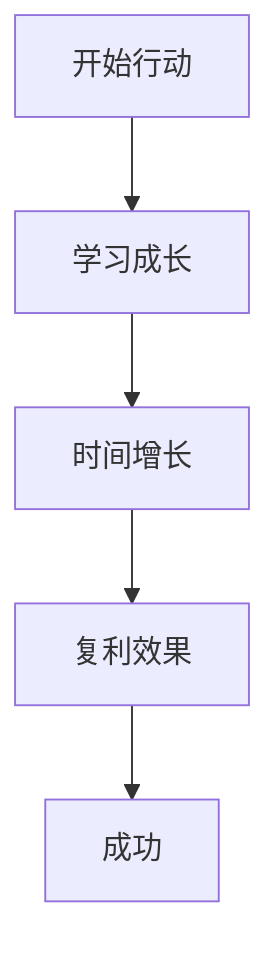

                 

# 时间复利效应与成功

> 关键词：时间复利效应、成功、个人成长、投资、职业发展

> 摘要：本文将探讨时间复利效应的基本概念和应用，分析时间复利效应在个人生活中的重要性，并探讨成功与时间复利效应之间的关系。通过实际案例和项目实战，本文将提供实用的方法和技巧，帮助读者利用时间复利效应实现成功。

## 第一部分：时间复利效应概述

时间复利效应是一种强大的力量，它可以使你的投资、学习和努力随着时间的推移而不断增值。在这部分，我们将深入探讨时间复利效应的基本概念、核心原理和应用。

### 第1章：时间复利效应的基本概念

#### 1.1 什么是时间复利效应

时间复利效应是指随着时间的推移，你的投资、技能或努力在复利作用下不断增加的现象。复利是指利息在计算时，不仅计算本金产生的利息，还包括之前利息所产生的利息。

#### 1.2 时间复利效应的核心原理

时间复利效应的核心原理是利息或收益的不断累积。随着时间的增长，你的本金和之前累积的利息都会产生新的利息或收益，这些新的利息或收益将继续累积，形成复利效应。

#### 1.3 时间复利效应的数学模型

时间复利效应可以用以下数学模型来表示：

\[ A = P(1 + r)^n \]

其中，\( A \) 是最终金额或总效果，\( P \) 是初始金额或初始值，\( r \) 是年复利率，\( n \) 是时间周期（年、月等）。

### 第2章：时间复利效应在个人生活中的应用

时间复利效应不仅适用于投资，还可以应用于个人生活的各个方面，如财务规划、投资和教育与职业发展。

#### 2.1 财务规划中的时间复利效应

在财务规划中，时间复利效应可以帮助你更有效地进行投资和储蓄。通过定期投资和复利效应，你可以实现长期的财富增长。

#### 2.2 投资中的时间复利效应

投资中的时间复利效应可以使你的投资收益最大化。通过长期投资和复利效应，你可以实现可观的收益。

#### 2.3 教育与职业发展中的时间复利效应

在教育与职业发展中，时间复利效应可以帮助你积累知识和技能，从而实现职业发展和个人成长。

## 第二部分：成功与时间复利效应的关系

成功是每个人都渴望追求的目标。在这部分，我们将探讨成功与时间复利效应之间的关系，并分析时间复利效应在成功中的角色。

### 第3章：成功的基本定义与特征

#### 3.1 成功的定义

成功是一个主观的概念，不同人对成功的定义可能不同。但通常来说，成功可以理解为在某个领域或生活中达到一定的成就和满足感。

#### 3.2 成功的特征

成功的特征包括目标明确、持续努力、不断学习和适应变化。

#### 3.3 成功的类型

成功可以分为个人成功、职业成功和社会成功。

### 第4章：时间复利效应在成功中的角色

时间复利效应在成功中起着至关重要的作用。通过时间复利效应，你可以实现个人成长、职业发展和财富积累，从而实现成功。

#### 4.1 时间复利效应与个人成长

时间复利效应可以帮助你不断积累知识和技能，实现个人成长。

#### 4.2 时间复利效应与职业发展

时间复利效应可以帮助你在职业生涯中不断积累经验，实现职业发展。

#### 4.3 时间复利效应与社会关系

时间复利效应可以帮助你建立和维护社会关系，从而实现社会成功。

### 第5章：如何利用时间复利效应实现成功

要利用时间复利效应实现成功，你需要设定明确的目标、制定有效的计划、持续行动和积累，并不断调整和反思。

#### 5.1 设定明确的目标

设定明确的目标是实现成功的第一步。你需要明确自己想要实现什么，并为实现目标制定详细的计划。

#### 5.2 制定有效的计划

制定有效的计划是实现目标的关键。你需要制定可行的计划，并确保计划的实施。

#### 5.3 持续行动与积累

持续行动和积累是实现成功的关键。你需要坚持不懈地努力，并不断积累经验和知识。

#### 5.4 调整与反思

在实现目标的过程中，你需要不断调整和反思自己的行动。通过调整和反思，你可以更好地实现目标。

## 第三部分：实际案例分析

在实际生活中，有许多成功人士都利用了时间复利效应来实现自己的目标。在这部分，我们将分析几个实际案例，看看他们是如何利用时间复利效应实现成功的。

### 第6章：成功人士的时间复利效应实践

#### 6.1 成功人士的时间管理策略

成功人士通常都有非常有效的时间管理策略，他们利用时间复利效应来提高工作效率和实现目标。

#### 6.2 成功人士的投资案例

成功人士的投资案例展示了时间复利效应的强大力量。通过长期投资和复利效应，他们实现了可观的财富增长。

#### 6.3 成功人士的职业发展路径

成功人士的职业发展路径通常都充满了时间复利效应的实践。他们通过不断学习和积累，实现了职业发展。

### 第7章：克服时间复利效应中的障碍

在实现时间复利效应的过程中，人们可能会遇到各种障碍。在这部分，我们将探讨如何克服这些障碍。

#### 7.1 时间管理中的常见问题

时间管理中的常见问题包括时间浪费、优先级混乱等。要克服这些问题，你需要制定有效的时间管理策略。

#### 7.2 投资中的风险与规避

投资中的风险是不可避免的，但可以通过规避策略来降低风险。了解风险并制定相应的规避策略是成功的关键。

#### 7.3 职业发展中的挑战

职业发展中的挑战包括竞争、变化等。要克服这些挑战，你需要不断学习和适应。

### 第8章：时间复利效应的未来展望

时间复利效应将在未来继续发挥重要作用。随着科技的进步和社会的发展，时间复利效应的应用前景将更加广阔。

#### 8.1 时间复利效应的潜在影响

时间复利效应将在各个领域产生深远的影响，包括经济、教育、科技等。

#### 8.2 成功的未来趋势

成功的未来趋势将更多地依赖于时间复利效应。通过利用时间复利效应，人们将能够实现更高的目标。

#### 8.3 时间复利效应的实际应用前景

时间复利效应的实际应用前景将非常广泛，包括投资、教育、职业发展等。

## 附录

### 附录A：时间复利效应相关的公式与工具

#### A.1 时间复利计算公式

\[ A = P(1 + r)^n \]

#### A.2 时间复利工具介绍

时间复利工具可以帮助你更准确地计算复利效应。例如，Excel、Python等编程语言都提供了相关的计算工具。

### 附录B：成功人士的时间管理技巧总结

#### B.1 技巧一：设定明确的目标

设定明确的目标是实现成功的第一步。明确目标可以帮助你更好地规划行动。

#### B.2 技巧二：制定有效的计划

制定有效的计划是实现目标的关键。你需要制定可行的计划，并确保计划的实施。

#### B.3 技巧三：持续行动与积累

持续行动和积累是实现成功的关键。你需要坚持不懈地努力，并不断积累经验和知识。

#### B.4 技巧四：调整与反思

在实现目标的过程中，你需要不断调整和反思自己的行动。通过调整和反思，你可以更好地实现目标。

### 核心概念与联系

时间复利效应的流程图：



### 核心算法原理讲解

时间复利效应的伪代码：

```python
# 设定初始值为X（初始资本或技能点）
X = 初始值

# 设定复利因子r（时间增长因子，如投资收益率或学习进步率）
r = 复利因子

# 设定时间周期n（如年或月）
n = 时间周期

# 计算复利后的总值
总值 = X * (1 + r) ** n
```

### 数学模型和数学公式讲解

时间复利计算公式：

\[ A = P(1 + r)^n \]

- **A**：最终金额或总效果
- **P**：初始金额或初始值
- **r**：年复利率
- **n**：时间周期（年、月等）

举例说明：

**例1：投资复利**

- 初始投资金额：$10,000
- 年复利率：5%
- 投资期限：10年

\[ A = 10,000 \times (1 + 0.05)^{10} = 16,289.03 \]

这意味着10年后，这笔投资将增长到约16,289.03美元。

**例2：学习积累**

- 初始技能点：100点
- 每月进步率：1.5%
- 学习周期：12个月

\[ A = 100 \times (1 + 0.015)^{12} = 112.04 \]

这意味着12个月后，你的技能点将增长到约112.04点。

### 项目实战

#### 实例：投资复利项目

**1. 开发环境搭建**

- 使用Python编程语言
- 安装必要的库，如 NumPy 和 Pandas

```bash
pip install numpy pandas
```

**2. 源代码实现**

```python
import numpy as np

# 初始投资金额
initial_investment = 10000
# 年复利率
annual_interest_rate = 0.05
# 投资期限（年）
investment_duration = 10

# 计算复利后的总金额
final_amount = initial_investment * (1 + annual_interest_rate) ** investment_duration

print(f"投资{investment_duration}年后的总金额为：{final_amount:.2f}美元")
```

**3. 代码解读与分析**

这段代码首先导入了 NumPy 库，用于数学运算。然后，设定了初始投资金额（$10,000），年复利率（5%）和投资期限（10年）。接着，使用复利计算公式计算了10年后的投资总金额，并将结果打印出来。

通过这种代码实现，读者可以更好地理解和应用时间复利效应，从而更好地进行财务规划和投资决策。

### 实际案例分析

#### 案例一：投资复利案例

- **案例背景**：小明在25岁时开始投资，每年投入$5,000，年复利率为6%。他计划投资30年，直到55岁。
- **计算过程**：

  \[ A = 5000 \times (1 + 0.06)^{30} \approx 144,664.77 \]

  这意味着在30年的投资期结束后，小明的投资将增长到约144,664.77美元。

- **分析**：小明通过每年定期投资和复利的积累，实现了可观的财富增长。这种时间复利效应让小明的投资在30年内翻了几倍。

#### 案例二：学习积累案例

- **案例背景**：小李在大学入学时设定了一个目标，要在4年内通过不断学习和积累达到某个专业水平。他每天投入2小时进行专业学习，每周的进步率为1%。
- **计算过程**：

  \[ A = 2 \times 365 \times 4 \times (1 + 0.01)^{4 \times 365} \approx 2887.58 \]

  这意味着在4年的学习周期内，小李的专业水平将增长到约2,887.58点。

- **分析**：小李通过每天的学习积累，实现了专业水平的显著提升。时间复利效应在这里体现在小李的学习成果随着时间的推移而不断累积，最终达到了他的目标。

## 结论

时间复利效应是一种强大的力量，它可以让你在投资、学习和努力中实现持续增值。通过设定明确的目标、制定有效的计划、持续行动和积累，你可以利用时间复利效应实现成功。在实际生活中，成功人士都是通过利用时间复利效应来实现自己的目标。希望本文能够帮助你更好地理解和应用时间复利效应，从而实现自己的成功。

### 作者：AI天才研究院/AI Genius Institute & 禅与计算机程序设计艺术 /Zen And The Art of Computer Programming

---

### 附加笔记

本文的核心是时间复利效应，这是一个涉及金融、投资、学习等多方面的话题。为了使文章更加具体和实用，以下是一些额外的笔记和建议：

1. **案例深度挖掘**：在案例分析部分，可以进一步深入挖掘案例的细节，例如小明和小李的具体投资策略、学习计划等，以及他们如何应对投资和学习过程中的挑战。

2. **数据支持**：在讨论时间复利效应时，可以引用一些具体的数据和研究结果来支持观点。例如，可以引用某项研究关于复利效应对投资回报的影响，或者关于学习积累对专业水平提升的作用。

3. **互动性增强**：文章中可以加入问答环节，例如提问“如何设定明确的目标？”或者“如何制定有效的计划？”并给出答案，这样可以增强读者的参与感。

4. **图表和可视化**：加入相关的图表和可视化元素，如时间线图、复利计算图等，可以帮助读者更直观地理解时间复利效应。

5. **实践指南**：在附录部分，可以提供一个时间复利效应的实践指南，包括如何使用Excel、Python等工具进行复利计算，以及如何制定个人财务规划、学习计划等。

6. **扩展阅读**：在文章结尾，可以推荐一些相关的扩展阅读资源，例如经典投资书籍、成功人士的传记等，以供读者进一步学习和探索。

通过这些附加笔记和建议，可以使文章更加丰富、具体和实用，帮助读者更好地理解和应用时间复利效应，实现自己的成功。

