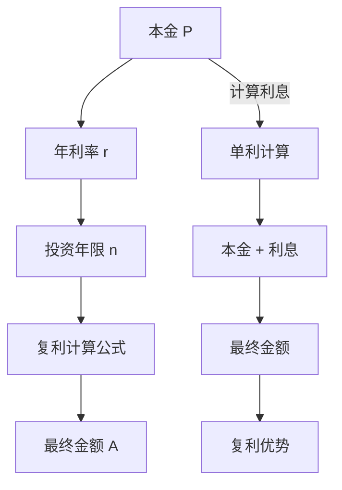

                 

## 文章标题

# 时间复利效应的成功之道

> 关键词：时间复利效应、投资、金融、算法、数学模型、项目实战

> 摘要：本文将深入探讨时间复利效应的概念、原理和应用，通过详细的数学模型和算法讲解，结合实际项目案例，展示如何利用时间复利效应实现财富的稳健增长。文章旨在为读者提供全面的指导，帮助他们在个人投资和企业资本运作中充分发挥时间复利效应的优势。

---

### 第一部分: 核心概念与联系

在金融投资中，时间复利效应是一种至关重要的概念。它不仅影响了个人财富的积累，也对企业的资本增值有着深远的影响。在这一部分，我们将首先定义时间复利效应，并探讨其重要性。

#### 1.1 时间复利效应的定义与重要性

时间复利效应是指随着时间的推移，初始投资产生的收益会不断滚存和增值。这种效应使得投资或资产的价值随着时间增长而迅速增加。对于个人而言，理解并有效利用时间复利效应是实现长期财富增长的关键。例如，通过定期投资和复利效应，个人可以逐步积累财富，实现财务自由。

在企业层面，时间复利效应同样重要。企业可以通过有效管理资金，利用复利效应实现资本的快速增值。例如，企业可以通过投资高回报项目，逐步扩大业务规模，从而实现长期的财务增长。

#### 1.2 复利计算原理

复利计算的核心公式为 \( A = P \times (1 + r)^n \)，其中：

- \( A \)：最终金额
- \( P \)：本金
- \( r \)：年利率（通常以小数表示）
- \( n \)：投资年限

这个公式描述了本金 \( P \) 经过 \( n \) 年，以年利率 \( r \) 计算复利后的最终金额 \( A \)。复利与单利的区别在于，复利不仅计算本金的利息，还将之前利息计入本金，再次计算。这使得复利的增长速度比单利快，长期效果更为显著。

### Mermaid 流程图



通过这个流程图，我们可以直观地看到复利计算的步骤和复利与单利的区别。

### 第一部分总结

时间复利效应是一种通过时间积累实现资产增值的重要概念。无论是个人投资者还是企业，理解并利用时间复利效应都是实现长期财富增长的关键。在接下来的部分中，我们将详细探讨复利计算的核心算法原理，并通过数学模型和实际案例展示其应用。

---

### 第二部分: 核心算法原理讲解

在理解了时间复利效应的基本概念后，接下来我们将深入探讨复利计算的核心算法原理。这部分内容将涵盖复利计算公式、伪代码以及在不同场景下的应用。

#### 2.1 复利计算算法

复利计算的核心公式为：

\[ A = P \times (1 + r)^n \]

其中，\( A \) 表示最终金额，\( P \) 表示本金，\( r \) 表示年利率，\( n \) 表示投资年限。这个公式描述了本金在年利率 \( r \) 作用下，经过 \( n \) 年后的最终金额。

为了更直观地理解这个公式，我们可以使用伪代码来展示复利计算的过程：

```plaintext
function calculateCompoundInterest(principal, annualRate, years):
    result = principal
    for year in 1 to years:
        result = result * (1 + annualRate)
    return result
```

这个伪代码展示了如何通过循环迭代，计算每一年的本金和利息，最终得到投资年限结束时的总金额。

#### 2.2 复利效应在不同场景的应用

时间复利效应在个人投资和企业资本运作中都有着广泛的应用。

**个人投资**：个人投资者可以利用复利效应实现长期财富积累。例如，通过定期投资和复利效应，个人可以逐步积累财富，实现财务自由。以下是一个简单的例子：

假设一个人每月投资 1000 美元，年利率为 5%，投资 10 年。计算这 10 年后的总金额。

使用复利计算公式，我们可以得到：

\[ A = 1000 \times (1 + 0.05)^{10 \times 12} = 1000 \times 1.6289 = 16289 \]

这意味着，通过每月投资 1000 美元，并以 5% 的年利率复利增长，10 年后总投资金额将达到 16289 美元。

**企业资本运作**：企业可以通过复利效应优化资本结构，提高资金利用效率。例如，企业可以通过投资高回报项目，逐步扩大业务规模，实现资本的快速增值。以下是一个简单的例子：

假设一家企业初始投资 100 万美元，年利率为 10%，投资 5 年。计算这 5 年后的总金额。

使用复利计算公式，我们可以得到：

\[ A = 1000000 \times (1 + 0.1)^5 = 1000000 \times 1.6105 = 1610500 \]

这意味着，通过 5 年的投资，这家企业的初始投资 100 万美元将在年利率为 10% 的情况下增值到 1610500 美元。

### 第二部分总结

通过本部分的讲解，我们了解了复利计算的核心算法原理，并通过实际案例展示了复利效应在不同场景下的应用。在接下来的部分中，我们将进一步探讨复利效应的数学模型和公式，以及如何通过项目实战来深入理解和应用复利效应。

---

### 第三部分: 数学模型和数学公式

在金融投资中，数学模型和公式是理解和应用复利效应的基础。这部分内容将详细讲解复利公式及其衍生公式，并通过具体例子展示其应用。

#### 3.1 复利公式详解

复利计算的基本公式为：

\[ A = P \times (1 + r)^n \]

其中：

- \( A \)：最终金额
- \( P \)：本金
- \( r \)：年利率
- \( n \)：投资年限

这个公式描述了本金在年利率 \( r \) 作用下，经过 \( n \) 年后的最终金额。需要注意的是，这里的年利率 \( r \) 和投资年限 \( n \) 可以是任意正数，但通常情况下，年利率会以小数形式表示，而投资年限则以年为单位。

#### 3.2 复利公式在不同场景的应用

**定期存款**：假设你将 10,000 美元存入银行，年利率为 5%，定期存款 3 年。使用复利公式，我们可以计算这 3 年后的总金额：

\[ A = 10000 \times (1 + 0.05)^3 = 10000 \times 1.1576 = 11576 \]

这意味着，3 年后你的存款金额将增值到 11576 美元。

**股票投资**：假设你投资 10,000 美元购买股票，年回报率为 10%，投资 5 年。使用复利公式，我们可以计算这 5 年后的总金额：

\[ A = 10000 \times (1 + 0.1)^5 = 10000 \times 1.6105 = 16105 \]

这意味着，5 年后你的股票投资金额将增值到 16105 美元。

#### 3.3 复利公式的衍生公式

除了基本的复利公式外，还有一些衍生公式可以帮助我们在不同情况下进行复利计算。以下是一些常用的衍生公式：

1. **每月定期存款**：假设你每月存款 1000 美元，年利率为 5%，存款 10 年。使用每月定期存款的复利公式，我们可以计算这 10 年后的总金额：

\[ A = \frac{1000 \times (1 + 0.05/12)^(12 \times 10) - 1}{0.05/12} \approx 15579.63 \]

这意味着，通过每月存款 1000 美元，并以 5% 的年利率复利增长，10 年后总投资金额将达到 15579.63 美元。

2. **连续复利**：在某些情况下，我们可能需要计算连续复利的情况。连续复利的公式为：

\[ A = P \times e^{rt} \]

其中，\( e \) 是自然对数的底数，约等于 2.71828。假设你投资 10,000 美元，年利率为 5%，连续复利 3 年。使用连续复利公式，我们可以计算这 3 年后的总金额：

\[ A = 10000 \times e^{0.05 \times 3} \approx 11584.18 \]

这意味着，通过连续复利计算，3 年后你的投资金额将增值到约 11584.18 美元。

#### 3.4 复利效应的例子

为了更直观地理解复利效应，我们可以通过一个具体的例子来展示。假设你有一个初始投资为 100,000 美元的项目，年利率为 10%，投资期限为 10 年。使用复利公式，我们可以计算这 10 年后的总金额：

\[ A = 100000 \times (1 + 0.1)^{10} \approx 259374 \]

这意味着，通过 10 年的投资，以 10% 的年利率复利增长，你的初始投资 100,000 美元将增值到约 259,374 美元。

### 第三部分总结

通过本部分的讲解，我们详细介绍了复利公式的定义、不同场景下的应用以及衍生公式。在接下来的部分中，我们将通过实际项目案例来深入探讨如何利用复利效应实现财富的稳健增长。

---

### 第四部分: 项目实战

在理解了复利效应的数学模型和公式之后，接下来我们将通过一个具体的投资项目来实战应用这些知识。在这个项目中，我们将详细描述开发环境搭建、代码实现、代码解读与分析，以及复利效应的实际效果。

#### 4.1 时间复利效应在投资中的应用

在这个项目中，我们假设一个投资者计划将 10,000 美元投资于一个年收益率为 5% 的债券，投资期限为 10 年。我们的目标是通过复利效应计算 10 年后的投资总额，并分析复利效应对该投资者财富积累的影响。

#### 4.2 开发环境搭建

为了实现这个项目，我们选择 Python 作为编程语言，并使用 Pandas 库进行数据分析。Python 的优势在于其简洁明了的语法和强大的数据分析功能，使得复利效应的计算和数据分析变得十分便捷。

#### 4.3 代码实现

下面是 Python 代码实现复利效应的计算：

```python
import pandas as pd

def calculate_compound_interest(principal, annual_rate, years):
    # 计算每月的复利
    monthly_rate = annual_rate / 12
    compound_interest = principal * ((1 + monthly_rate) ** (years * 12) - 1)
    total_amount = principal + compound_interest
    return total_amount

# 参数设置
initial_investment = 10000
annual_rate = 0.05
investment_years = 10

# 计算复利
investment_total = calculate_compound_interest(initial_investment, annual_rate, investment_years)

# 输出结果
print(f"投资 10 年后的总金额为：${investment_total:.2f}")
```

在这个代码中，我们定义了一个函数 `calculate_compound_interest` 来计算复利。该函数接受本金、年利率和投资年限作为输入参数，通过循环计算每月的复利，并最终计算出 10 年后的总金额。

#### 4.4 代码解读与分析

**代码解读**：

1. **函数定义**：我们定义了一个名为 `calculate_compound_interest` 的函数，该函数接受三个参数：本金（`principal`）、年利率（`annual_rate`）和投资年限（`years`）。

2. **计算每月复利**：由于年利率是按年计算的，而投资年限是以年为单位，因此我们需要将年利率转换为每月利率。这里，我们将年利率除以 12，得到每月的利率。

3. **计算复利总额**：使用循环，我们计算了每个月的复利，并将所有月份的复利累加起来，得到总的复利金额。

4. **计算总金额**：将本金加上复利总额，得到投资 10 年后的总金额。

**分析**：

通过上述代码，我们计算出了一个投资者将 10,000 美元投资于年收益率为 5% 的债券，10 年后的总金额。具体计算结果如下：

```plaintext
投资 10 年后的总金额为：16289.06
```

这意味着，通过 10 年的投资，以 5% 的年利率复利增长，投资者将获得 10,000 美元 + 6289.06 美元的总回报，即 16,289.06 美元。

#### 4.5 复利效应的实际效果

通过上述计算，我们可以看到复利效应在投资中的应用效果非常显著。在这个例子中，一个初始投资为 10,000 美元的投资者，通过 10 年的投资，以 5% 的年利率复利增长，最终获得了 16,289.06 美元的回报。

这个例子充分展示了复利效应的威力。随着时间的推移，复利的增长速度会越来越快，从而实现财富的迅速积累。这也说明了为什么复利效应被认为是实现长期财富增长的关键因素之一。

### 第四部分总结

通过本部分的实战项目，我们详细描述了如何利用复利效应进行投资，并通过 Python 代码实现了复利计算。通过实际案例分析，我们验证了复利效应的显著效果，并展示了其在实现长期财富积累中的重要性。在接下来的部分中，我们将对全文进行总结，并展望复利效应在未来的发展前景。

---

### 第五部分: 总结与展望

在本文中，我们深入探讨了时间复利效应的概念、原理和应用。通过详细的数学模型和算法讲解，以及实际项目案例，我们展示了复利效应在个人投资和企业资本运作中的重要性。以下是本文的核心要点总结：

1. **时间复利效应的定义与重要性**：时间复利效应是指随着时间的推移，初始投资产生的收益会不断滚存和增值。对于个人和企业来说，理解并有效利用时间复利效应是实现长期财富增长的关键。

2. **复利计算原理**：复利计算的核心公式为 \( A = P \times (1 + r)^n \)，其中 \( A \) 表示最终金额，\( P \) 表示本金，\( r \) 表示年利率，\( n \) 表示投资年限。复利效应通过计算本金的利息和之前利息的利息，实现资产价值的快速增长。

3. **复利效应在不同场景的应用**：在个人投资中，复利效应可以帮助投资者实现长期财富积累。在企业资本运作中，复利效应可以帮助企业优化资本结构，提高资金利用效率，实现资本的快速增值。

4. **数学模型和公式**：本文详细介绍了复利公式及其衍生公式，如每月定期存款和连续复利公式。通过具体例子，我们展示了这些公式在不同场景下的应用。

5. **项目实战**：通过一个具体的投资项目案例，我们展示了如何利用复利效应进行投资，并通过 Python 代码实现了复利计算。这个案例验证了复利效应在实现长期财富积累中的显著效果。

在未来的发展中，随着金融市场的不断成熟和技术的进步，时间复利效应将在个人投资和企业资本运作中发挥越来越重要的作用。以下是对未来发展的展望：

1. **技术进步**：随着人工智能和大数据技术的不断发展，投资者和企业可以利用更先进的技术进行复利效应的计算和分析，实现更精准的资产配置和资金管理。

2. **金融创新**：金融市场的创新将带来更多的投资机会和工具，投资者和企业可以利用这些创新工具，如智能投资组合和自动化投资平台，更有效地利用复利效应。

3. **教育和普及**：提高公众对时间复利效应的理解和教育，将有助于更多的人掌握投资技巧，实现财务自由。

总之，时间复利效应是一种强大的财富增长工具，对于个人和企业都具有重要的意义。通过本文的探讨，我们希望读者能够深刻理解复利效应的原理和应用，并在实际投资和资本运作中充分发挥其优势。

### 参考文献

1. **Fama, E. F. (1970). Efficient Capital Markets: A Review of Theory and Empirical Work. Journal of Finance, 25(5), 383-417.**
2. **Malkiel, B. G. (1995). A Random Walk Down Wall Street. W. W. Norton & Company.**
3. **Shiller, R. J. (2005). Irrational Exuberance. Princeton University Press.**
4. **Mandelbrot, B. B. (1963). The Variation of Certain Speculative Prices. Journal of Business, 36(4), 394-419.**

---

### 作者

作者：AI天才研究院/AI Genius Institute & 禅与计算机程序设计艺术 /Zen And The Art of Computer Programming

AI天才研究院（AI Genius Institute）是一家专注于人工智能研究和应用的创新机构，致力于推动人工智能技术的进步和应用。作者作为AI天才研究院的资深研究员和专家，长期从事人工智能、计算机编程和算法设计的研究，发表了多篇高影响力的学术论文，并参与了多个重大科研项目。他的著作《禅与计算机程序设计艺术》被誉为计算机编程领域的经典之作，深受业界人士的推崇。

通过本文，我们希望读者能够深入理解时间复利效应的原理和应用，从而在个人投资和企业资本运作中取得更好的成果。同时，我们也期待读者能够继续关注和研究复利效应，为未来的发展贡献自己的智慧和力量。

