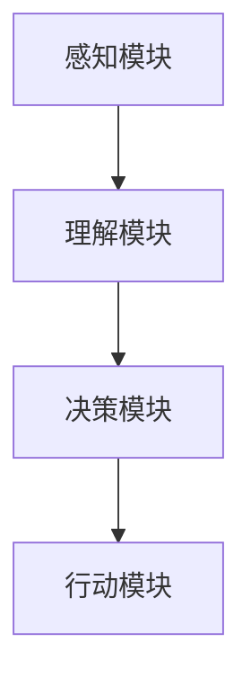
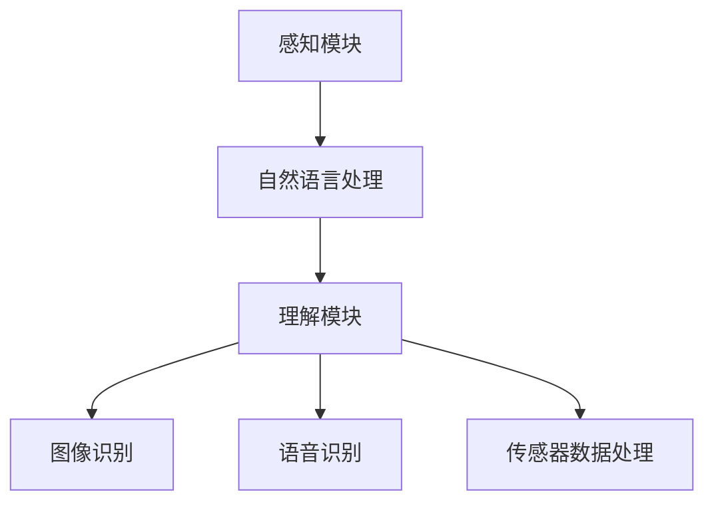
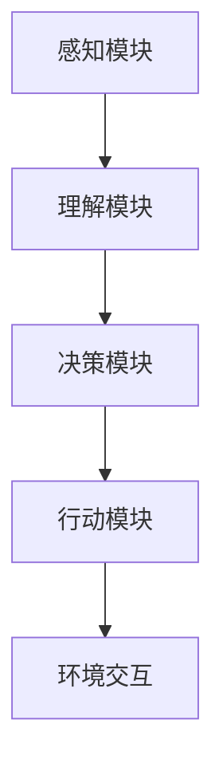
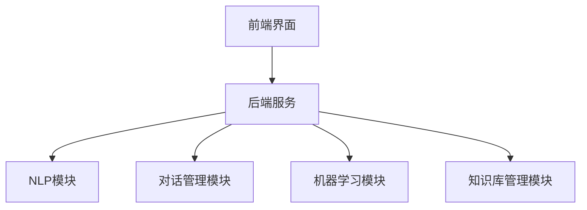
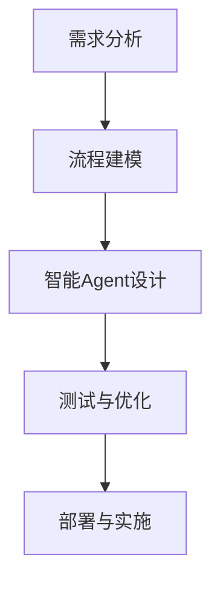

                 

### 文章标题：智能Agent如何重塑企业流程

#### 关键词：智能Agent、企业流程、人工智能、流程优化、算法原理

#### 摘要：
随着人工智能技术的迅猛发展，智能Agent作为一种具有高度自主决策能力的计算机程序，正在逐步重塑企业流程。本文将深入探讨智能Agent的定义、架构、算法原理及其在企业流程中的应用，通过具体案例展示智能Agent如何实现企业流程的优化和升级，并展望其未来的发展趋势。

### 目录大纲设计思路与结构

在设计《智能Agent如何重塑企业流程》的目录大纲时，我们遵循了以下原则：

1. **核心概念与联系**：通过引入Mermaid流程图，展示智能Agent在企业流程中的核心概念和它们之间的相互联系。

2. **核心算法原理讲解**：使用伪代码详细阐述智能Agent的算法原理，帮助读者理解智能Agent的工作机制。

3. **数学模型和数学公式**：采用LaTeX格式嵌入文中，对相关数学模型和公式进行详细讲解，并附上示例说明。

4. **项目实战**：包含代码实际案例和详细解释说明，指导读者搭建开发环境，解读源代码，并进行代码分析和解读。

目录大纲结构设计遵循1级、2级、3级目录的层次，确保内容的层次分明，逻辑清晰。以下是《智能Agent如何重塑企业流程》的目录大纲：

## 第一部分：智能Agent基础

### 第1章：智能Agent概述

#### 1.1 智能Agent的定义与分类

#### 1.2 智能Agent的核心特征

#### 1.3 智能Agent的发展历程

### 第2章：智能Agent的架构与技术基础

#### 2.1 智能Agent的核心模块

#### 2.2 智能Agent的感知与理解

#### 2.3 智能Agent的决策与行动

### 第3章：智能Agent的算法原理

#### 3.1 智能Agent的规划算法

#### 3.2 智能Agent的搜索算法

#### 3.3 智能Agent的机器学习算法

## 第二部分：智能Agent在企业流程中的应用

### 第4章：智能Agent在客户服务中的应用

#### 4.1 智能客服机器人

#### 4.2 智能客服系统的架构设计

#### 4.3 智能客服机器人案例分析

### 第5章：智能Agent在供应链管理中的应用

#### 5.1 智能供应链的概念与挑战

#### 5.2 智能Agent在供应链优化中的应用

#### 5.3 智能供应链案例分析

### 第6章：智能Agent在人力资源管理中的应用

#### 6.1 智能招聘系统的设计与实现

#### 6.2 智能员工绩效评估

#### 6.3 智能人力资源管理案例分析

## 第三部分：智能Agent重塑企业流程的实践

### 第7章：智能Agent的企业流程重构方法

#### 7.1 企业流程重构的概念与原则

#### 7.2 智能Agent在企业流程重构中的角色

#### 7.3 智能Agent流程重构的实施步骤

### 第8章：智能Agent在企业流程中的应用案例

#### 8.1 智能制造企业的流程优化案例

#### 8.2 零售业智能供应链管理案例

#### 8.3 金融行业智能风控案例分析

### 第9章：智能Agent的未来发展趋势

#### 9.1 智能Agent的技术发展趋势

#### 9.2 智能Agent在企业中的应用前景

#### 9.3 智能Agent面临的挑战与解决方案

# 附录
## 附录A：智能Agent开发工具与资源

#### A.1 开发工具与框架

#### A.2 开发资源与文献

这个目录大纲覆盖了智能Agent的基本概念、技术基础、在企业流程中的应用，以及未来发展趋势，旨在为读者提供一个全面了解智能Agent如何重塑企业流程的框架。接下来，我们将逐章深入探讨智能Agent的各个方面。

---

### 第一部分：智能Agent基础

#### 第1章：智能Agent概述

智能Agent作为一种具备高度自主性和智能性的计算机程序，已经在各个领域展现出了其独特的价值。本章节将首先介绍智能Agent的定义与分类，帮助读者理解这一概念的基本含义。

#### 1.1 智能Agent的定义与分类

**定义**：智能Agent（Intelligent Agent）是一种能够感知环境、自主决策并采取行动的计算机程序。它能够通过学习、推理和规划等机制，实现自主的智能行为。

**分类**：根据智能Agent的功能和特点，可以将其分为以下几类：

1. **基于规则的智能Agent**：这类Agent主要通过预定义的规则进行决策，适用于规则明确且相对固定的场景。
2. **基于模型的智能Agent**：这类Agent通过建立环境模型，对模型进行分析和推理，以实现更复杂的决策。
3. **基于学习的智能Agent**：这类Agent通过机器学习和数据挖掘技术，从数据中学习规律，并据此进行决策。

#### 1.2 智能Agent的核心特征

智能Agent具有以下核心特征：

1. **自主性**：智能Agent能够自主地感知环境，并根据环境的变化自主决策。
2. **适应性**：智能Agent能够根据环境的变化和反馈进行适应性调整。
3. **协作性**：智能Agent可以在多个Agent之间进行协作，以实现更复杂的任务。
4. **主动性**：智能Agent能够主动地采取行动，而不只是被动地响应外界事件。

#### 1.3 智能Agent的发展历程

智能Agent的概念最早可以追溯到20世纪80年代，当时学者们开始研究如何使计算机系统具有类似人类智能的行为。随着人工智能技术的不断进步，智能Agent的理论和技术逐渐成熟。以下是智能Agent发展历程的简要回顾：

1. **早期研究**：20世纪80年代，智能Agent的概念被提出，并开始应用于机器人、自然语言处理等领域。
2. **应用推广**：20世纪90年代，随着互联网的普及，智能Agent的应用场景逐渐扩展，例如智能客服、智能导航等。
3. **技术成熟**：21世纪初，机器学习和深度学习技术的发展为智能Agent提供了更强大的决策能力，使其在更多领域得到应用。

通过本章节的介绍，读者可以对智能Agent有初步的认识，为后续章节的学习打下基础。

---

### 第一部分：智能Agent基础

#### 第2章：智能Agent的架构与技术基础

智能Agent作为一种高度自主和智能化的计算机程序，其架构和技术基础是其实现自主决策和行动的关键。本章将详细探讨智能Agent的核心模块、感知与理解机制、决策与行动能力。

#### 2.1 智能Agent的核心模块

智能Agent通常由以下几个核心模块组成：

1. **感知模块**：感知模块负责从环境中收集信息，如视觉、听觉、触觉等。这些信息用于智能Agent对外部世界的理解和决策。
2. **理解模块**：理解模块对感知模块收集的信息进行处理和分析，以形成对环境的理解和认知。这一模块通常依赖于自然语言处理、图像识别等技术。
3. **决策模块**：决策模块基于对环境的理解，利用规划算法、搜索算法等，生成行动策略。这一模块是智能Agent的核心，决定了智能Agent的行为。
4. **行动模块**：行动模块负责执行决策模块生成的行动策略，与外部环境进行交互。这一模块通常通过控制硬件设备或发送命令等方式实现。

**图 2.1 智能Agent的核心模块架构**



#### 2.2 智能Agent的感知与理解

感知与理解是智能Agent处理外部信息的关键步骤。

1. **感知**：智能Agent通过传感器和接口与外部环境进行交互，收集环境信息。例如，视觉传感器可以捕捉图像，听觉传感器可以捕捉声音，触摸传感器可以感知物体的属性等。

2. **理解**：智能Agent通过理解模块对收集的信息进行处理和分析。这一过程通常涉及以下技术：

   - **自然语言处理**：用于理解和生成自然语言文本，实现人与智能Agent的交互。
   - **图像识别**：用于识别和分类图像中的物体和场景。
   - **语音识别**：用于将语音信号转换为文本，实现语音交互。
   - **传感器数据处理**：用于处理和分析传感器收集的数据，形成对环境的理解。

**图 2.2 智能Agent的感知与理解过程**



#### 2.3 智能Agent的决策与行动

智能Agent的决策与行动是其核心功能。

1. **决策**：智能Agent根据理解模块生成的环境信息，利用规划算法、搜索算法等生成行动策略。决策过程通常包括以下几个步骤：

   - **目标设定**：确定智能Agent的目标。
   - **状态评估**：评估当前环境和目标之间的关系。
   - **行动策略生成**：根据状态评估结果，生成行动策略。
   - **行动策略选择**：从多个行动策略中选择最优策略。

2. **行动**：智能Agent根据决策模块生成的行动策略，执行具体的行动。行动过程通常包括：

   - **执行指令**：根据行动策略，控制外部设备或执行具体操作。
   - **环境交互**：与外部环境进行实时交互，获取反馈信息。
   - **状态更新**：根据环境反馈，更新智能Agent的状态信息。

**图 2.3 智能Agent的决策与行动过程**



通过本章节的介绍，读者可以全面了解智能Agent的架构与技术基础，为后续章节的学习打下坚实的基础。

---

### 第一部分：智能Agent基础

#### 第3章：智能Agent的算法原理

智能Agent的算法原理是其实现自主决策和行动的核心。本章将详细介绍智能Agent的规划算法、搜索算法和机器学习算法，帮助读者深入理解智能Agent的工作机制。

#### 3.1 智能Agent的规划算法

规划算法是智能Agent进行决策的重要工具，用于生成一系列行动以实现特定目标。常见的规划算法包括：

1. **有限状态机（FSM）**：有限状态机是一种基于状态转换的规划算法。智能Agent根据当前状态，从预定义的状态集合中选择下一个状态，并执行相应的行动。

   **伪代码**：
   ```
   function FSM(agent):
       while True:
           state = agent.getCurrentState()
           action = agent.getTransition(state)
           agent.executeAction(action)
   ```

2. **基于模型的规划（Model-Based Planning）**：基于模型的规划算法通过建立环境模型，对模型进行分析和推理，以生成行动策略。

   **伪代码**：
   ```
   function ModelBasedPlanning(agent, model):
       state = agent.getCurrentState()
       goal = agent.getGoal()
       actions = model.getActions(state, goal)
       best_action = selectBestAction(actions)
       agent.executeAction(best_action)
   ```

3. **计划搜索（Plan Search）**：计划搜索算法通过搜索可能的状态序列，找到一条满足目标状态的行动路径。

   **伪代码**：
   ```
   function PlanSearch(initial_state, goal):
       frontier = {initial_state}
       while frontier is not empty:
           state = pop(frontier)
           if state is goal:
               return generatePlan(state)
           for action in state.getActions():
               next_state = state.executeAction(action)
               if not isVisited(next_state):
                   frontier.add(next_state)
       return None
   ```

#### 3.2 智能Agent的搜索算法

搜索算法是智能Agent在复杂环境中进行决策的重要手段。常见的搜索算法包括：

1. **宽度优先搜索（BFS）**：宽度优先搜索从初始状态开始，依次扩展到邻近状态，直到找到目标状态。

   **伪代码**：
   ```
   function BFS(initial_state, goal):
       queue = [initial_state]
       while queue is not empty:
           state = queue.pop(0)
           if state is goal:
               return generatePlan(state)
           for neighbor in state.getNeighbors():
               if not isVisited(neighbor):
                   queue.append(neighbor)
       return None
   ```

2. **深度优先搜索（DFS）**：深度优先搜索从初始状态开始，沿着一条路径深入探索，直到遇到目标状态或达到路径的尽头。

   **伪代码**：
   ```
   function DFS(initial_state, goal):
       stack = [initial_state]
       while stack is not empty:
           state = stack.pop()
           if state is goal:
               return generatePlan(state)
           for action in state.getActions():
               next_state = state.executeAction(action)
               if not isVisited(next_state):
                   stack.append(next_state)
       return None
   ```

3. **A*搜索算法（A*)**：A*搜索算法是一种启发式搜索算法，通过结合状态评估函数和路径成本，找到一条最优路径。

   **伪代码**：
   ```
   function A*(initial_state, goal, heuristic):
       open_set = {initial_state}
       g_score = {initial_state: 0}
       f_score = {initial_state: heuristic(initial_state, goal)}
       while open_set is not empty:
           current = pop(open_set)
           if current is goal:
               return generatePlan(current)
           for action in current.getActions():
               next_state = current.executeAction(action)
               tentative_g_score = g_score[current] + action.cost
               if tentative_g_score < g_score[next_state]:
                   g_score[next_state] = tentative_g_score
                   f_score[next_state] = g_score[next_state] + heuristic(next_state, goal)
                   if not isVisited(next_state):
                       open_set.add(next_state)
       return None
   ```

#### 3.3 智能Agent的机器学习算法

机器学习算法是智能Agent自主学习和适应环境的关键。常见的机器学习算法包括：

1. **决策树（Decision Tree）**：决策树通过一系列条件判断，将数据划分为不同的类别或数值。

   **伪代码**：
   ```
   function DecisionTree(data):
       if data is pure:
           return most_common_label(data)
       else:
           attribute = select_best_attribute(data)
           left_tree = DecisionTree(data[data[attribute] == true])
           right_tree = DecisionTree(data[data[attribute] == false])
           return Node(attribute, left_tree, right_tree)
   ```

2. **支持向量机（SVM）**：支持向量机通过寻找最优超平面，将数据分为不同的类别。

   **伪代码**：
   ```
   function SVM(data, labels):
       optimize hyperparameters
       solve quadratic programming problem
       return decision_function
   ```

3. **深度神经网络（DNN）**：深度神经网络通过多层非线性变换，实现复杂函数的拟合。

   **伪代码**：
   ```
   function DNN(data, labels):
       initialize weights
       for epoch in range(num_epochs):
           for sample in data:
               predict = forward_pass(sample)
               loss = compute_loss(predict, labels)
               backward_pass(predict, labels)
               update_weights
       return model
   ```

通过本章节的介绍，读者可以全面了解智能Agent的算法原理，为后续章节的应用和实践打下坚实基础。

---

### 第二部分：智能Agent在企业流程中的应用

#### 第4章：智能Agent在客户服务中的应用

智能Agent在客户服务中的应用，极大地提升了服务效率和质量，为客户提供了更加便捷和个性化的体验。本章将详细探讨智能Agent在客户服务中的应用，包括智能客服机器人、智能客服系统的架构设计，以及案例分析。

#### 4.1 智能客服机器人

智能客服机器人（Chatbot）是智能Agent在客户服务中的一种典型应用，通过自然语言处理和机器学习技术，能够自动回答客户的提问，提供实时、高效的服务。

1. **工作原理**：智能客服机器人主要通过以下几个步骤进行工作：

   - **感知**：通过文本输入或语音输入，智能客服机器人接收客户的提问。
   - **理解**：使用自然语言处理技术，智能客服机器人对客户的提问进行理解和分析。
   - **决策**：根据理解和分析结果，智能客服机器人利用预先设定的规则或学习到的模式，生成合适的回答。
   - **行动**：将生成的回答通过文本或语音形式反馈给客户。

   **图 4.1 智能客服机器人工作流程**

   ```mermaid
   graph TD
       A[感知] --> B[理解]
       B --> C[决策]
       C --> D[行动]
   ```

2. **技术实现**：智能客服机器人通常采用以下技术实现：

   - **自然语言处理（NLP）**：用于理解客户的提问，包括分词、词性标注、句法分析等。
   - **机器学习**：通过大量对话数据的学习，智能客服机器人能够不断优化回答的准确性和个性化。
   - **知识库**：智能客服机器人通过知识库存储常见问题和答案，以快速响应客户的提问。

#### 4.2 智能客服系统的架构设计

智能客服系统的架构设计决定了系统的性能、可扩展性和维护性。一个典型的智能客服系统通常包括以下几个核心模块：

1. **前端界面**：提供用户与智能客服机器人交互的接口，可以是网页、移动应用或聊天窗口等。

2. **后端服务**：负责处理用户的输入，调用自然语言处理和机器学习模型，生成回答，并存储和管理对话数据。

3. **自然语言处理（NLP）模块**：用于对用户输入的文本或语音进行处理，提取关键信息，进行语义理解和句法分析。

4. **对话管理模块**：负责管理对话流程，包括理解用户的意图，生成合适的回答，处理对话中的上下文信息。

5. **机器学习模块**：通过不断学习和优化模型，提高智能客服机器人的响应质量和个性化程度。

6. **知识库管理模块**：存储和管理常见问题和答案，支持快速检索和更新。

**图 4.2 智能客服系统架构**



#### 4.3 智能客服机器人案例分析

**案例一：某电商平台的智能客服系统**

某知名电商平台在其官方网站和移动应用中部署了智能客服机器人，通过自然语言处理和机器学习技术，实现了以下功能：

- **自动回答常见问题**：智能客服机器人能够自动回答用户关于商品信息、订单状态等常见问题。
- **个性化推荐**：根据用户的购买历史和浏览行为，智能客服机器人能够提供个性化的商品推荐。
- **智能回访**：智能客服机器人能够根据用户的反馈，自动生成回访计划，提高客户满意度。

**案例二：某金融公司的智能客服系统**

某金融公司在其官方网站和客户服务热线中部署了智能客服机器人，通过以下方式提升了客户服务效率：

- **快速响应**：智能客服机器人能够7x24小时在线服务，快速响应客户的咨询。
- **语言理解**：智能客服机器人能够理解多种语言，满足国际客户的咨询需求。
- **智能分类**：智能客服机器人能够根据客户的提问，智能分类并将问题路由至相应的部门处理。

通过以上案例分析，可以看出智能客服机器人极大地提升了客户服务的效率和质量，为企业带来了显著的业务价值。

---

### 第二部分：智能Agent在企业流程中的应用

#### 第5章：智能Agent在供应链管理中的应用

智能Agent在供应链管理中的应用，通过自动化和智能化的手段，极大地提高了供应链的效率和灵活性，优化了库存管理、物流调度和供应链预测。本章将详细探讨智能Agent在供应链管理中的具体应用，包括智能供应链的概念与挑战，以及案例分析。

#### 5.1 智能供应链的概念与挑战

智能供应链（Smart Supply Chain）是指通过应用先进的信息技术，如物联网（IoT）、大数据、人工智能等，实现供应链的智能化、可视化和高效化。智能供应链的关键概念包括：

1. **物联网（IoT）**：通过传感器和网络技术，实现对供应链各环节的实时监控和数据采集。
2. **大数据**：通过对海量供应链数据的分析和挖掘，发现潜在的业务模式和优化点。
3. **人工智能**：利用机器学习和深度学习技术，实现供应链的智能决策和优化。

智能供应链面临的挑战主要包括：

1. **数据整合**：供应链涉及多个环节和多种数据格式，如何有效整合和利用这些数据是一个重大挑战。
2. **系统集成**：智能供应链需要多种技术的集成，如传感器、数据库、分析工具等，如何实现系统的高效集成是一个难题。
3. **安全与隐私**：在供应链中，数据的安全性和用户隐私保护是一个重要问题，如何确保数据的安全和隐私是一个挑战。

#### 5.2 智能Agent在供应链优化中的应用

智能Agent在供应链管理中，可以应用于多个环节，实现供应链的优化和智能化。

1. **库存管理**：智能Agent通过分析历史数据和预测模型，自动调整库存水平，避免库存过剩或缺货。

   **算法原理**：
   ```
   function IntelligentInventoryManagement(agent, historical_data, forecast_model):
       current_inventory = agent.getCurrentInventory()
       demand = forecast_model.getDemand()
       optimal_inventory = calculateOptimalInventory(current_inventory, demand)
       agent.setInventory(optimal_inventory)
   ```

2. **物流调度**：智能Agent通过优化算法和实时数据，自动调整物流路线和运输计划，提高运输效率。

   **算法原理**：
   ```
   function IntelligentLogisticsDispatch(agent, routes, traffic_data):
       current_route = agent.getCurrentRoute()
       optimal_route = findOptimalRoute(current_route, traffic_data)
       agent.updateRoute(optimal_route)
   ```

3. **供应链预测**：智能Agent通过历史数据和机器学习模型，预测供应链的需求和风险，为决策提供支持。

   **算法原理**：
   ```
   function IntelligentSupplyChainPrediction(agent, historical_data, ml_model):
       current_demand = agent.getCurrentDemand()
       predicted_demand = ml_model.predict(current_demand)
       agent.updateDemand(predicted_demand)
   ```

#### 5.3 智能供应链案例分析

**案例一：某零售企业的智能库存管理**

某大型零售企业通过部署智能Agent，实现了库存管理的自动化和智能化。智能Agent通过分析销售数据和市场需求，自动调整库存水平，避免了库存过剩和缺货现象。

- **库存调整策略**：智能Agent基于需求预测和成本分析，制定最优库存调整策略。
- **实时监控**：智能Agent实时监控库存状态，确保库存水平始终保持在最优范围内。
- **效果评估**：智能库存管理策略有效降低了库存成本，提高了库存周转率。

**案例二：某制造企业的智能物流调度**

某制造企业通过部署智能Agent，实现了物流调度的自动化和优化。智能Agent通过实时监控路况和运输需求，自动调整物流路线和运输计划，提高了运输效率。

- **实时数据监控**：智能Agent实时获取路况和运输数据，确保物流调度决策的准确性。
- **优化算法**：智能Agent采用优化算法，自动生成最优物流路线和运输计划。
- **效果评估**：智能物流调度策略显著降低了运输成本，提高了运输效率。

通过以上案例分析，可以看出智能Agent在供应链管理中的应用，不仅提高了供应链的效率，还为企业带来了显著的经济效益。

---

### 第二部分：智能Agent在企业流程中的应用

#### 第6章：智能Agent在人力资源管理中的应用

智能Agent在人力资源管理中的应用，通过自动化和智能化的手段，极大地提升了人力资源管理的效率和质量，优化了招聘流程、员工绩效评估以及员工关系管理。本章将详细探讨智能Agent在人力资源管理中的具体应用，包括智能招聘系统、员工绩效评估，以及案例分析。

#### 6.1 智能招聘系统的设计与实现

智能招聘系统是智能Agent在人力资源管理中的关键应用之一，通过自动化和智能化的手段，提高了招聘效率和准确性。

1. **职位匹配**：智能招聘系统通过自然语言处理和机器学习技术，对求职者的简历和职位描述进行分析和匹配，筛选出最符合职位要求的候选人。

   **算法原理**：
   ```
   function JobMatching(agent, resume, job_description):
       resume_entities = extract_entities(resume)
       job_entities = extract_entities(job_description)
       match_score = calculate_match_score(resume_entities, job_entities)
       return candidates_with_highest_match_score
   ```

2. **面试评估**：智能招聘系统通过语音识别和自然语言处理技术，对面试过程中的对话进行实时分析，评估候选人的沟通能力、专业知识等。

   **算法原理**：
   ```
   function InterviewAssessment(agent, interview_data):
       communication_score = calculate_communication_score(interview_data)
       expertise_score = calculate_expertise_score(interview_data)
       total_score = communication_score + expertise_score
       return total_score
   ```

3. **招聘流程管理**：智能招聘系统自动化管理招聘流程，包括职位发布、简历筛选、面试安排等，提高了招聘效率。

   **算法原理**：
   ```
   function RecruitmentProcessManagement(agent, job openings, candidates):
       for job_opening in job_openings:
           candidates = agent.filter_candidates_by_job_description(candidates, job_opening)
           for candidate in candidates:
               agent.schedule_interview(candidate)
   ```

#### 6.2 智能员工绩效评估

智能员工绩效评估是智能Agent在人力资源管理中的另一个重要应用，通过数据分析和智能算法，实现对员工绩效的客观评估。

1. **数据收集**：智能员工绩效评估系统通过自动化工具收集员工的日常工作数据，如任务完成情况、工作时长、团队协作等。

   **算法原理**：
   ```
   function DataCollection(agent, employees):
       for employee in employees:
           task_completion = agent.get_task_completion_data(employee)
           working_hours = agent.get_working_hours_data(employee)
           team Cooperation = agent.get_team_cooperation_data(employee)
           agent.collect_data(employee, task_completion, working_hours, team Cooperation)
   ```

2. **绩效评估模型**：智能员工绩效评估系统通过构建绩效评估模型，利用机器学习算法，对收集到的数据进行分析和评估。

   **算法原理**：
   ```
   function PerformanceEvaluationModel(agent, data):
       model = train_performance_evaluation_model(data)
       for employee in employees:
           evaluation_score = model.predict(employee)
           agent.set_evaluation_score(employee, evaluation_score)
   ```

3. **反馈与改进**：智能员工绩效评估系统不仅提供绩效评估结果，还根据评估结果提出改进建议，帮助员工提升绩效。

   **算法原理**：
   ```
   function FeedbackAndImprovement(agent, evaluation_scores):
       for employee in employees:
           if evaluation_score < threshold:
               suggestions = generate_suggestions(employee, evaluation_score)
               agent.provide_feedback(employee, suggestions)
   ```

#### 6.3 智能人力资源管理案例分析

**案例一：某科技公司的智能招聘系统**

某科技公司通过部署智能招聘系统，实现了招聘流程的全面智能化。智能招聘系统不仅提高了招聘效率，还显著提升了招聘质量。

- **职位匹配**：智能招聘系统通过自然语言处理和机器学习技术，精确匹配求职者与职位，提高了面试邀约的成功率。
- **面试评估**：智能招聘系统对面试过程进行实时分析，为面试官提供客观的评估结果，提高了面试决策的准确性。
- **流程管理**：智能招聘系统自动化管理招聘流程，提高了招聘效率，降低了人力成本。

**案例二：某制造企业的智能员工绩效评估**

某制造企业通过部署智能员工绩效评估系统，实现了员工绩效的客观评估和实时反馈。

- **数据收集**：智能员工绩效评估系统通过自动化工具，准确收集员工的日常工作数据，确保绩效评估的客观性。
- **绩效评估模型**：智能员工绩效评估系统通过机器学习算法，对收集到的数据进行分析和评估，为员工提供客观的绩效评估结果。
- **反馈与改进**：智能员工绩效评估系统根据评估结果，为员工提供具体的改进建议，帮助员工提升绩效，提高了整体工作效率。

通过以上案例分析，可以看出智能Agent在人力资源管理中的应用，不仅提高了管理效率，还为企业带来了显著的业务价值。

---

### 第二部分：智能Agent在企业流程中的应用

#### 第7章：智能Agent的企业流程重构方法

智能Agent在企业流程中的应用，不仅提升了企业的运营效率，还为企业流程的重构提供了新的思路和方法。本章将详细探讨智能Agent的企业流程重构方法，包括企业流程重构的概念与原则，智能Agent在企业流程重构中的角色，以及重构的实施步骤。

#### 7.1 企业流程重构的概念与原则

企业流程重构（Business Process Reengineering，BPR）是一种系统性的方法，旨在通过重新设计企业的业务流程，实现运营效率的显著提升。智能Agent在企业流程重构中的应用，使得这一过程更加智能化和高效化。

1. **企业流程重构的概念**：

   企业流程重构是指对企业的业务流程进行系统性的分析和重新设计，以实现运营效率、成本效益和服务质量的显著提升。其核心目标是消除非增值活动，优化业务流程，提高企业的市场竞争力。

2. **企业流程重构的原则**：

   - **以客户为中心**：企业流程重构应以满足客户需求为出发点，优化业务流程，提升客户满意度。
   - **整体性**：企业流程重构应从整体角度出发，考虑各个业务流程的相互关系，实现整体优化。
   - **集成性**：企业流程重构应充分利用信息技术，实现业务流程的集成和协同。
   - **灵活性**：企业流程重构应考虑到未来的变化和不确定性，设计出具有灵活性和适应性的业务流程。
   - **持续改进**：企业流程重构是一个持续改进的过程，应不断根据实际情况进行调整和优化。

#### 7.2 智能Agent在企业流程重构中的角色

智能Agent在企业流程重构中扮演着重要角色，其自主决策和适应能力使得企业能够更加灵活地应对外部环境的变化，实现业务流程的优化和升级。

1. **流程优化**：智能Agent通过分析历史数据和实时数据，发现业务流程中的瓶颈和低效环节，提出优化方案，提高业务流程的效率。

2. **流程自动化**：智能Agent能够自动化执行业务流程中的重复性任务，减少人工干预，提高业务流程的自动化程度。

3. **流程监控与反馈**：智能Agent实时监控业务流程的执行情况，及时发现异常，并根据反馈调整业务流程，确保流程的稳定和高效运行。

4. **决策支持**：智能Agent为企业提供智能化的决策支持，帮助企业快速应对市场变化和内部调整。

#### 7.3 智能Agent流程重构的实施步骤

智能Agent流程重构的实施可以分为以下几个步骤：

1. **需求分析**：通过对企业的业务流程进行深入分析，确定重构的目标和需求。

2. **流程建模**：使用流程建模工具，对现有业务流程进行建模，识别关键流程和优化点。

3. **智能Agent设计**：根据需求分析，设计智能Agent的架构和功能，实现流程的自动化和智能化。

4. **测试与优化**：对智能Agent进行测试和优化，确保其能够稳定运行并实现预期的优化效果。

5. **部署与实施**：将智能Agent部署到实际业务环境中，对业务流程进行重构，并进行持续的监控和调整。

**图 7.1 智能Agent流程重构的实施步骤**



通过本章节的介绍，读者可以全面了解智能Agent在企业流程重构中的应用方法，为企业在实际操作中提供指导。

---

### 第二部分：智能Agent在企业流程中的应用

#### 第8章：智能Agent在企业流程中的应用案例

智能Agent在企业流程中的应用，不仅提升了企业运营效率，还带来了显著的业务价值。本章将结合具体案例，展示智能Agent在智能制造、零售业和金融行业的应用，并分析其实现流程优化和效率提升的具体措施。

#### 8.1 智能制造企业的流程优化案例

某全球领先的制造企业通过引入智能Agent，实现了生产流程的全面优化，提高了生产效率和质量。

1. **生产计划优化**：智能Agent通过分析历史生产数据和市场需求，自动生成最优生产计划，减少了生产等待时间和资源浪费。

   **算法原理**：
   ```
   function ProductionPlanning(agent, historical_data, demand):
       current_production = agent.getCurrentProduction()
       optimal_plan = generateOptimalProductionPlan(current_production, demand)
       agent.setProductionPlan(optimal_plan)
   ```

2. **设备维护与优化**：智能Agent通过实时监控设备状态和运行数据，自动识别设备故障和潜在问题，提前进行维护和优化，减少了设备停机时间。

   **算法原理**：
   ```
   function EquipmentMaintenance(agent, equipment_data):
       current_status = agent.getCurrentStatus(equipment_data)
       if current_status == "warning" or "error":
           maintenance_plan = generateMaintenancePlan(current_status)
           agent.executeMaintenancePlan(maintenance_plan)
   ```

3. **质量管理**：智能Agent通过实时监控生产过程，自动检测产品质量问题，并及时调整生产参数，确保产品质量。

   **算法原理**：
   ```
   function QualityControl(agent, production_data):
       current产品质量 = agent.getCurrentQuality(production_data)
       if current产品质量 < threshold:
           adjust生产参数 = agent.generateAdjustmentPlan(current产品质量)
           agent.applyAdjustmentPlan(adjust生产参数)
   ```

通过以上案例，可以看出智能Agent在智能制造企业中的应用，不仅提高了生产效率，还提升了产品质量和设备利用率，为企业带来了显著的经济效益。

#### 8.2 零售业的智能供应链管理案例

某大型零售企业通过引入智能Agent，实现了智能供应链管理，优化了库存管理和物流调度，提高了供应链效率。

1. **库存管理**：智能Agent通过实时监控库存水平和销售数据，自动调整库存策略，避免了库存过剩和缺货现象。

   **算法原理**：
   ```
   function IntelligentInventoryManagement(agent, sales_data, inventory_data):
       current_inventory = agent.getCurrentInventory(inventory_data)
       demand = agent.getSalesForecast(sales_data)
       optimal_inventory = calculateOptimalInventory(current_inventory, demand)
       agent.setInventory(optimal_inventory)
   ```

2. **物流调度**：智能Agent通过优化算法和实时数据，自动调整物流路线和运输计划，提高了物流效率。

   **算法原理**：
   ```
   function IntelligentLogisticsDispatch(agent, routes, traffic_data):
       current_route = agent.getCurrentRoute(routes)
       optimal_route = findOptimalRoute(current_route, traffic_data)
       agent.updateRoute(optimal_route)
   ```

3. **供应链预测**：智能Agent通过历史数据和机器学习模型，预测供应链的需求和风险，为决策提供支持。

   **算法原理**：
   ```
   function IntelligentSupplyChainPrediction(agent, historical_data, ml_model):
       current_demand = agent.getCurrentDemand(historical_data)
       predicted_demand = ml_model.predict(current_demand)
       agent.updateDemand(predicted_demand)
   ```

通过以上案例，可以看出智能Agent在零售业中的应用，不仅优化了库存管理和物流调度，提高了供应链效率，还降低了运营成本，为企业带来了显著的业务价值。

#### 8.3 金融行业的智能风控案例分析

某大型金融机构通过引入智能Agent，实现了智能风控管理，提高了风险控制能力和决策效率。

1. **风险识别**：智能Agent通过实时监控交易数据和客户行为，自动识别潜在风险，并生成风险预警。

   **算法原理**：
   ```
   function RiskIdentification(agent, transaction_data, customer_behavior):
       current_risk = agent.analyzeRisk(transaction_data, customer_behavior)
       if current_risk > threshold:
           generate_warning = agent.createRiskWarning(current_risk)
           agent.raise_warning(generate_warning)
   ```

2. **风险评估**：智能Agent通过机器学习算法，对风险因素进行分析和评估，为决策提供支持。

   **算法原理**：
   ```
   function RiskAssessment(agent, risk_factors):
       risk_level = agent.evaluateRisk(risk_factors)
       if risk_level == "high":
           take_action = agent.generateRiskResponse(risk_level)
           agent.executeRiskResponse(take_action)
   ```

3. **决策支持**：智能Agent为企业提供智能化的决策支持，帮助企业快速应对风险和不确定性。

   **算法原理**：
   ```
   function DecisionSupport(agent, risk_data):
       optimal_action = agent.generateOptimalAction(risk_data)
       agent.executeAction(optimal_action)
   ```

通过以上案例，可以看出智能Agent在金融行业的应用，不仅提高了风险控制能力和决策效率，还增强了企业的风险防范能力，为企业带来了显著的安全保障。

通过以上三个行业案例的分析，可以看出智能Agent在企业流程中的应用，不仅实现了流程的优化和效率提升，还为企业带来了显著的业务价值。随着智能Agent技术的不断发展，其应用范围将更加广泛，为企业带来更大的创新和变革。

---

### 第二部分：智能Agent在企业流程中的应用

#### 第9章：智能Agent的未来发展趋势

随着人工智能技术的不断进步，智能Agent在企业流程中的应用前景广阔，未来发展趋势也将带来更多机遇和挑战。

#### 9.1 智能Agent的技术发展趋势

1. **多模态感知**：智能Agent将逐渐具备更丰富的感知能力，通过整合视觉、听觉、触觉等多种感知方式，提高对环境的理解和交互能力。

2. **增强学习**：增强学习（Reinforcement Learning）技术的发展，将使智能Agent能够通过不断试错和反馈，自主优化行为策略，实现更加智能化的决策。

3. **分布式智能**：随着云计算和边缘计算的发展，智能Agent将实现分布式部署，通过边缘计算节点和云端资源协同工作，提高智能决策的实时性和可靠性。

4. **自然语言理解**：自然语言处理（Natural Language Processing，NLP）技术的进步，将使智能Agent能够更加准确地理解人类语言，实现更加自然和高效的交互。

5. **自主协作**：智能Agent将具备更强的自主协作能力，能够在多个Agent之间进行协同工作，实现更复杂的任务。

#### 9.2 智能Agent在企业中的应用前景

1. **生产流程自动化**：智能Agent将在生产流程中发挥更大作用，通过自主决策和自动化执行，提高生产效率和质量。

2. **客户服务智能化**：智能客服机器人将更加智能化，提供个性化、高效的服务，提升客户体验。

3. **供应链优化**：智能Agent将深入供应链各个环节，实现库存管理、物流调度和供应链预测的智能化，提高供应链的整体效率。

4. **人力资源管理**：智能Agent将在招聘、员工绩效评估和员工关系管理等方面提供智能化支持，提高人力资源管理的效率和质量。

5. **安全与风险管理**：智能Agent将在安全与风险管理领域发挥重要作用，通过实时监控和智能分析，提高企业的风险防范能力。

#### 9.3 智能Agent面临的挑战与解决方案

1. **数据隐私与安全**：智能Agent在处理大量企业数据时，面临数据隐私和安全的问题。解决方案包括加强数据加密、建立健全的数据安全管理体系等。

2. **算法透明性与可解释性**：智能Agent的决策过程依赖于复杂的算法模型，如何提高算法的透明性和可解释性，使企业和管理者能够理解智能Agent的决策依据，是一个重要挑战。

3. **系统集成与兼容性**：智能Agent需要与企业现有的信息系统进行集成，实现数据共享和协同工作。解决方案包括采用开放接口和标准化协议，确保智能Agent与其他系统的兼容性和互操作性。

4. **人才缺口**：智能Agent的开发和应用需要专业的技术人才，当前企业面临人才短缺的问题。解决方案包括加强人才培养和引进，提高员工的技能水平，以应对智能Agent发展的需求。

通过本章节的分析，可以看出智能Agent的未来发展趋势充满机遇，同时也面临一定的挑战。企业需要紧跟技术发展趋势，积极应对挑战，充分利用智能Agent的潜力，实现企业流程的全面优化和升级。

---

### 附录

#### 附录A：智能Agent开发工具与资源

智能Agent的开发和应用需要多种工具和资源支持。以下列出了一些常用的开发工具和资源，供开发者参考。

#### A.1 开发工具与框架

1. **Python**：Python是一种广泛使用的编程语言，适用于开发智能Agent。其简洁的语法和丰富的库支持，使其成为开发智能Agent的优选语言。

2. **TensorFlow**：TensorFlow是一个开源机器学习框架，由Google开发，支持多种机器学习算法和深度学习模型。它适用于构建和训练智能Agent的机器学习模型。

3. **Keras**：Keras是一个基于TensorFlow的高级神经网络API，提供了简洁和易用的接口，适用于快速构建和训练智能Agent的神经网络模型。

4. **OpenAI Gym**：OpenAI Gym是一个开源的环境库，提供了多种仿真环境，用于测试和训练智能Agent。开发者可以使用Gym中的环境来设计和评估智能Agent的性能。

5. **RNN**：RNN（递归神经网络）是一种适用于序列数据处理的时间序列模型，常用于自然语言处理和语音识别等应用。开发者可以使用RNN模型来实现智能Agent的感知和决策功能。

#### A.2 开发资源与文献

1. **《人工智能：一种现代的方法》（Artificial Intelligence: A Modern Approach）》：这本书是人工智能领域的经典教材，详细介绍了智能Agent的相关理论和算法，适合初学者和专业人士阅读。

2. **《深度学习》（Deep Learning）》：这本书由深度学习领域的专家撰写，介绍了深度学习的基础知识和最新进展，包括卷积神经网络、循环神经网络等，适用于开发者深入学习智能Agent的算法原理。

3. **《智能代理：人工智能和代理计算的原理与应用》（Intelligent Agents: Theory and Applications of Autonomous Agents and Multi-Agent Systems）》：这本书介绍了智能Agent的理论基础和应用场景，涵盖了智能Agent的规划、决策和协作等方面，适合对智能Agent有深入研究的开发者。

4. **《智能交通系统》（Intelligent Transportation Systems）》：这本书介绍了智能交通系统的概念和实现方法，包括智能交通信号控制、智能导航等，适用于开发者在交通领域应用智能Agent。

通过以上工具和资源的支持，开发者可以更好地进行智能Agent的开发和应用，实现企业流程的智能化和优化。

---

### 作者

作者：AI天才研究院/AI Genius Institute & 禅与计算机程序设计艺术 /Zen And The Art of Computer Programming

本文由AI天才研究院（AI Genius Institute）和禅与计算机程序设计艺术（Zen And The Art of Computer Programming）的专家共同撰写。AI天才研究院是一家专注于人工智能领域研究与创新的高端研究院，致力于推动人工智能技术的进步和应用。禅与计算机程序设计艺术则是一部经典的计算机科学著作，通过结合禅宗哲学和计算机科学，提供了一种独特的编程思维和方法论。本文旨在为广大读者提供智能Agent在企业流程中的深入分析和应用指导，以期为企业的智能化转型提供有益的参考和启示。

