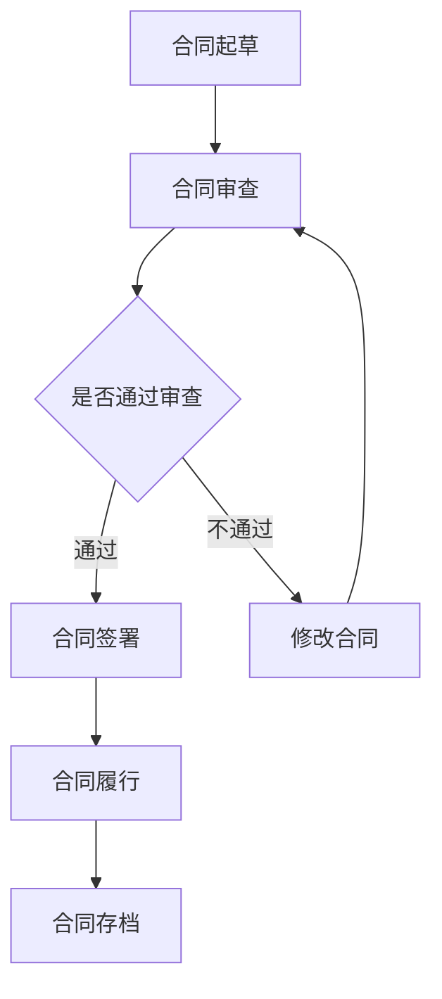
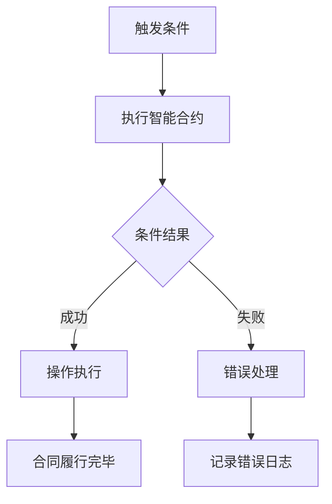

                 

### 文章标题

《智能合同管理在法务工作中的应用》

> 关键词：智能合同，法务管理，区块链技术，智能合约，技术原理，实际应用，发展趋势

> 摘要：本文深入探讨了智能合同管理在法务工作中的应用。首先，介绍了智能合同管理的基本概念、发展背景和技术基础。随后，详细分析了智能合同管理在法务工作中的具体应用，包括合同起草、审查和履行等方面的智能化管理。此外，文章还探讨了智能合同管理在商业和社会管理中的广泛应用。最后，对智能合同管理的未来发展趋势和面临的挑战进行了展望。本文旨在为法务工作者和科技从业者提供关于智能合同管理的全面了解和深入思考。

### 第一部分：智能合同管理概述

#### 1.1 智能合同管理的概念与背景

智能合同管理，顾名思义，是指利用现代信息技术，尤其是区块链技术和智能合约技术，对合同进行自动化管理和执行的过程。传统的合同管理主要依赖于人工处理和纸质文件，存在效率低下、成本高昂、易出错等问题。而智能合同管理通过将合同内容数字化，并使用智能合约来执行合同条款，实现了合同管理的高效、透明和可信。

智能合同管理的起源可以追溯到区块链技术的出现。区块链作为一种去中心化的分布式数据库技术，具有不可篡改和透明公开的特性，非常适合用于合同管理。而智能合约则是在区块链的基础上发展起来的一种自动化执行机制，它能够根据合同条款自动执行合同约定，从而提高了合同的执行效率和可信度。

随着技术的不断发展，智能合同管理逐渐成为法务工作中的一个重要领域。智能合同管理不仅能够提高合同管理的效率和准确性，还能够降低合同纠纷的风险，为法务工作提供更加高效、智能的解决方案。

#### 1.2 智能合同管理的发展背景

智能合同管理的发展背景可以追溯到几个关键因素：

1. **数字化转型的需求**：在数字化时代，企业和法务部门对合同管理提出了更高的要求。传统的纸质合同和人工处理方式已经无法满足企业快速发展的需求。智能合同管理通过数字化手段，实现了合同的高效管理，满足了企业数字化转型的要求。

2. **区块链技术的成熟**：区块链技术的成熟为智能合同管理提供了强大的技术支持。区块链的去中心化、不可篡改和透明性，使得智能合同管理能够实现合同条款的自动化执行，确保了合同的可信性和安全性。

3. **法律体系的完善**：随着各国法律体系的不断完善，对于智能合同的法律认可也在逐渐增强。许多国家已经出台了相关法律法规，对智能合同的法律效力进行了明确规定，为智能合同管理提供了法律保障。

4. **人工智能技术的发展**：人工智能技术的快速发展，为智能合同管理提供了新的技术手段。通过自然语言处理、机器学习等技术，智能合同管理系统能够更准确地理解合同内容，实现更智能的合同管理。

#### 1.3 智能合同与传统合同的区别

智能合同与传统合同在形式、管理和执行方式上存在显著区别：

1. **形式**：
   - **传统合同**：通常以纸质形式存在，可能还包括电子文档形式。纸质合同容易丢失、损坏，且不易长期保存。
   - **智能合同**：以数字化形式存在，通常包括区块链上的智能合约代码。智能合同具有更强的可追溯性和长期保存性。

2. **管理**：
   - **传统合同**：管理方式依赖于人工，包括合同起草、审核、签署、存档等流程。管理效率低，容易出现错误和遗漏。
   - **智能合同**：管理过程高度自动化，通过智能合同管理系统实现合同的全生命周期管理，包括合同起草、审核、签署、执行和存档等。

3. **执行方式**：
   - **传统合同**：合同的执行依赖于双方的自觉履行，存在一定的信任风险。
   - **智能合同**：合同的执行通过智能合约自动触发，一旦满足触发条件，智能合约将自动执行相关操作，确保合同的严格执行。

4. **法律效力**：
   - **传统合同**：法律效力受合同条款和双方履行情况影响。
   - **智能合同**：具有更强的法律效力，智能合约的自动执行特性使得合同条款更加明确和可执行。

通过上述分析，可以看出智能合同管理在法务工作中的应用具有显著的优势和广阔的前景。在接下来的部分，我们将进一步探讨智能合同管理的应用领域、技术基础及其在实际应用中的技术原理。

### 第二部分：智能合同管理的应用领域

#### 2.1 法务工作中的应用

在法务工作中，智能合同管理发挥着越来越重要的作用。它不仅提高了合同管理的效率，还大大降低了合同纠纷的风险，为法务工作提供了更加高效、智能的解决方案。

**1. 合同起草**

在合同起草阶段，智能合同管理系统能够通过自然语言处理技术自动生成合同模板，并根据具体业务需求进行定制化修改。这一过程大大简化了合同起草的流程，提高了起草效率。同时，智能合同管理系统能够对合同条款进行自动化审查，识别潜在的法律风险，从而确保合同条款的合法性和合理性。

**2. 合同审查**

合同审查是法务工作中至关重要的一环。智能合同管理系统能够通过机器学习技术自动审查合同条款，识别潜在的漏洞和风险。相比人工审查，智能合同管理系统不仅效率更高，而且能够更准确地发现潜在问题。此外，智能合同管理系统能够对合同条款进行自动化比对，确保不同合同之间的条款一致性。

**3. 合同签署**

在合同签署阶段，智能合同管理系统提供了多种签署方式，包括在线签署、离线签署等。通过在线签署，双方可以在同一时间在线完成合同签署，大大提高了合同签署的效率。同时，智能合同管理系统能够记录签署过程中的所有操作，确保合同签署的可追溯性和完整性。

**4. 合同履行**

合同履行是智能合同管理的关键环节。智能合同管理系统能够根据合同条款自动执行合同约定，包括支付、交付、验收等操作。一旦合同条款中的条件满足，智能合同管理系统将自动执行相关操作，确保合同的严格执行。这不仅提高了合同履行的效率，还减少了人为干预的可能性，降低了合同纠纷的风险。

**5. 合同存档**

智能合同管理系统能够对合同进行自动存档，确保合同的长期保存和可追溯性。通过区块链技术，智能合同管理系统实现了合同的不可篡改和透明公开，使得合同存档更加安全可靠。此外，智能合同管理系统能够对合同进行智能分类和管理，方便法务人员快速查找和调用合同。

**6. 合同纠纷解决**

智能合同管理系统能够对合同履行过程中出现的纠纷进行自动化处理。通过智能合同管理系统，法务人员可以快速收集合同履行过程中的相关证据，并利用人工智能技术进行自动化分析，为合同纠纷的解决提供有力支持。此外，智能合同管理系统还支持在线调解和仲裁，进一步简化了合同纠纷的解决流程。

通过上述分析，可以看出智能合同管理在法务工作中的重要性。它不仅提高了合同管理的效率，降低了合同纠纷的风险，还为法务工作提供了更加智能化的解决方案。在接下来的部分，我们将进一步探讨智能合同管理在商业活动中的应用。

#### 2.2 商业活动中的应用

智能合同管理在商业活动中同样具有重要意义，它不仅能够提高企业的运营效率，还能够降低商业风险，为企业的可持续发展提供有力支持。

**1. 供应链管理**

在供应链管理中，智能合同管理系统能够对采购、销售、物流等合同进行自动化管理。通过智能合同管理系统，企业能够实时监控合同履行情况，确保供应链的顺畅运行。同时，智能合同管理系统能够根据合同条款自动触发相关操作，如支付、交付、验收等，提高了供应链管理的效率。

**2. 金融业务**

在金融业务中，智能合同管理系统能够对贷款、融资、投资等合同进行自动化管理。通过智能合同管理系统，金融机构能够实时监控合同履行情况，确保合同条款的严格执行。此外，智能合同管理系统能够对合同条款进行自动化审查，识别潜在的法律风险，从而降低金融业务的风险。

**3. 合同审核与审批**

在商业活动中，合同审核与审批是一个复杂且耗时的工作。智能合同管理系统能够通过自动化流程，快速完成合同审核与审批。智能合同管理系统可以根据企业内部规定，自动识别合同类型和审核权限，确保合同审核的合规性和效率。

**4. 合同履行监控**

智能合同管理系统能够对合同履行过程进行实时监控，确保合同条款的严格执行。通过智能合同管理系统，企业能够及时发现合同履行过程中的问题，并采取相应的措施进行解决，从而降低合同纠纷的风险。

**5. 合同风险控制**

智能合同管理系统能够对合同履行过程中的风险进行实时评估，并提供相应的控制措施。通过智能合同管理系统，企业能够及时发现和应对合同履行过程中的潜在风险，从而降低合同纠纷和商业风险。

**6. 合同数据分析**

智能合同管理系统能够对合同履行过程进行数据收集和分析，为企业的决策提供支持。通过智能合同管理系统，企业能够分析合同履行情况，发现业务流程中的瓶颈和问题，从而优化业务流程，提高运营效率。

通过上述分析，可以看出智能合同管理在商业活动中的应用具有显著的优势。它不仅能够提高企业的运营效率，降低商业风险，还能够为企业的可持续发展提供有力支持。在接下来的部分，我们将进一步探讨智能合同管理在社会管理中的应用。

#### 2.3 社会管理中的应用

智能合同管理在社会管理中同样发挥着重要作用，它不仅能够提高公共事务的效率，还能够增强社会管理的透明度和可信度。

**1. 公共事务管理**

在公共事务管理中，智能合同管理系统能够对各种合同进行自动化管理，包括采购、租赁、服务合同等。通过智能合同管理系统，政府部门能够实时监控合同履行情况，确保公共资源的合理分配和有效使用。同时，智能合同管理系统能够对合同进行自动存档，提高公共事务的管理效率。

**2. 社会保障**

在社会保障领域，智能合同管理系统能够对社会保障合同进行自动化管理，包括养老保险、医疗保险、失业保险等。通过智能合同管理系统，政府部门能够实时监控社会保障金的发放和使用情况，确保社会保障制度的公正和有效。此外，智能合同管理系统能够对社会保障合同进行自动履行，提高社会保障服务的效率。

**3. 公共资源管理**

在公共资源管理中，智能合同管理系统能够对公共资源的使用合同进行自动化管理，包括土地、水资源、电力等。通过智能合同管理系统，政府部门能够实时监控公共资源的使用情况，确保公共资源的合理利用。同时，智能合同管理系统能够对公共资源合同进行自动履行，提高公共资源管理的效率。

**4. 公共服务**

在公共服务领域，智能合同管理系统能够对公共服务合同进行自动化管理，包括公共设施建设、公共服务项目等。通过智能合同管理系统，政府部门能够实时监控公共服务合同的履行情况，确保公共服务的质量和效率。同时，智能合同管理系统能够对公共服务合同进行自动履行，提高公共服务的效率。

**5. 公共安全**

在公共安全领域，智能合同管理系统能够对公共安全合同进行自动化管理，包括应急管理、防灾减灾等。通过智能合同管理系统，政府部门能够实时监控公共安全合同的履行情况，确保公共安全的有效保障。此外，智能合同管理系统能够对公共安全合同进行自动履行，提高公共安全管理的效率。

通过上述分析，可以看出智能合同管理在社会管理中的应用具有显著的优势。它不仅能够提高公共事务的效率，增强公共管理的透明度和可信度，还能够为社会的和谐发展提供有力支持。在接下来的部分，我们将探讨智能合同管理的技术基础。

### 第三部分：智能合同管理的技术基础

智能合同管理的实现依赖于一系列先进的技术，其中最为关键的是区块链技术、智能合约技术和合同管理系统的技术架构。这些技术共同构成了智能合同管理的基础，确保了合同的高效、透明和可信。

#### 3.1 区块链技术简介

区块链技术是一种分布式数据库技术，具有去中心化、不可篡改和透明公开的特性。这些特性使得区块链技术在智能合同管理中具有独特的优势。

1. **去中心化**：区块链技术通过分布式网络实现数据的存储和传输，无需依赖中心化的服务器或第三方中介机构，从而降低了管理成本和信任风险。

2. **不可篡改**：区块链技术通过密码学原理和数据加密技术，确保数据的存储和传输过程中无法被篡改。一旦数据被记录在区块链上，就具有永久性，无法被删除或修改。

3. **透明公开**：区块链技术通过公开的账本记录所有的交易数据，任何参与者都可以查看和验证数据，从而提高了交易的透明度和可信度。

#### 3.2 区块链的数据结构

区块链的数据结构是智能合同管理的基础。区块链由一系列按时间顺序排列的区块组成，每个区块包含一定数量的交易数据。

1. **区块**：区块是区块链的基本单位，包含一定数量的交易记录。每个区块都有一个唯一的哈希值，用于标识和验证区块的内容。

2. **交易**：交易是区块链中的基本操作，描述了数据的存储和转移。交易包括交易发起方、接收方和交易金额等信息。

3. **链**：区块链是由一系列按时间顺序排列的区块组成的链式结构。每个区块通过其前一个区块的哈希值进行链接，形成一个不可篡改的链。

#### 3.3 区块链的交易流程

区块链的交易流程包括交易发起、验证和记录等步骤。

1. **交易发起**：交易发起方发起交易请求，包含交易的具体内容，如交易金额、交易对象等。

2. **交易验证**：交易发起后，区块链网络中的节点对交易进行验证。验证过程包括检查交易的有效性、余额是否足够等。

3. **交易记录**：验证通过的交易将被记录在区块链上的下一个区块中，并广播到整个网络。一旦交易记录在区块中，就具有不可篡改的法律效力。

#### 3.4 智能合约的基本原理

智能合约是区块链技术的重要组成部分，是一种自动执行合同条款的计算机程序。智能合约的基本原理包括以下几个关键点：

1. **条件触发**：智能合约根据合同条款中的条件触发执行。例如，当合同中的某一项条件满足时，智能合约将自动执行相关操作。

2. **自动化执行**：智能合约通过计算机程序自动执行合同条款，无需人为干预。一旦触发条件，智能合约将自动执行预定的操作，如支付、交付等。

3. **透明公开**：智能合约的代码是公开的，任何参与者都可以查看和验证。这使得智能合约的执行过程更加透明和可信。

#### 3.5 常见的智能合约编程语言

智能合约的开发依赖于特定的编程语言。目前，常见的智能合约编程语言包括：

1. **Solidity**：Solidity是Ethereum平台上的主要智能合约编程语言。它是一种面向对象的编程语言，具有丰富的功能和强大的表达能力。

2. **Vyper**：Vyper是Ethereum平台上的另一种智能合约编程语言。它是一种静态类型的编程语言，注重安全性和简洁性。

3. **Truffle**：Truffle是一种智能合约开发框架，用于构建、测试和部署Ethereum智能合约。它提供了一套完整的开发工具和测试环境，大大简化了智能合约的开发过程。

#### 3.6 智能合约的安全性问题

智能合约的安全性问题一直是区块链技术发展中的一个重要课题。由于智能合约的代码是公开的，任何人都可能对其进行审查和分析，从而发现潜在的安全漏洞。以下是一些常见的智能合约安全问题：

1. **重入攻击**：重入攻击是指攻击者通过多次调用智能合约中的函数，占用大量计算资源和资金。

2. **逻辑漏洞**：智能合约的代码中可能存在逻辑漏洞，导致合约执行过程中出现错误或无法达到预期效果。

3. **数据篡改**：由于区块链的不可篡改特性，一旦数据被记录在区块链上，就无法被修改。但是，智能合约中的数据可能会受到篡改，导致合同执行结果出现偏差。

4. **漏洞利用**：智能合约的代码中可能存在漏洞，被攻击者利用进行非法操作。

为了确保智能合约的安全性，开发者需要遵循一系列安全编程的最佳实践，如代码审查、测试和审计等。此外，智能合约平台和工具提供商也需要不断完善安全机制，提高智能合约的安全性。

#### 3.7 合同管理系统的技术架构

合同管理系统是智能合同管理的重要组成部分，其技术架构包括前端界面、后端服务和数据存储等部分。

1. **前端界面**：前端界面用于用户与合同管理系统的交互，包括合同起草、审查、签署、执行和存档等功能。前端界面通常采用现代Web技术栈，如React、Vue等。

2. **后端服务**：后端服务负责处理合同管理的业务逻辑，包括合同生成、验证、执行和监控等。后端服务通常采用微服务架构，提高系统的可扩展性和可靠性。

3. **数据存储**：数据存储用于存储合同管理系统的数据，包括合同内容、交易记录、用户信息等。数据存储通常采用分布式数据库系统，如MongoDB、Redis等。

通过上述技术架构，合同管理系统实现了对合同的全生命周期管理，确保合同的高效、透明和可信。

通过深入探讨智能合同管理的技术基础，我们可以更好地理解智能合同管理在法务工作中的应用。在下一部分中，我们将进一步探讨智能合同管理的技术原理。

### 第四部分：智能合同管理的技术原理

智能合同管理的技术原理是其核心，决定了其在实际应用中的效果和可靠性。本部分将详细阐述区块链技术、智能合约的核心算法及其在智能合同管理中的具体应用。

#### 4.1 区块链技术详解

区块链技术是智能合同管理的基石，其核心在于去中心化、不可篡改和透明公开的特性。以下是区块链技术的关键组成部分：

1. **数据结构**：区块链由一系列按时间顺序排列的区块组成，每个区块包含一组交易记录和一个时间戳。区块之间通过哈希链接形成链式结构，确保数据不可篡改。

2. **共识机制**：共识机制是区块链网络中节点之间达成共识的算法，确保区块链的一致性和安全性。常见的共识机制包括工作量证明（PoW）、权益证明（PoS）和委托权益证明（DPoS）等。

3. **分布式账本**：区块链的分布式账本技术使得数据存储在多个节点上，避免了单点故障和数据丢失的风险。同时，分布式账本提高了数据的透明度和可追溯性。

4. **加密技术**：区块链使用加密技术保护数据的安全和隐私。常见的加密技术包括哈希函数、非对称加密和数字签名等。

#### 4.2 区块链的数据结构

区块链的数据结构是理解智能合同管理的关键。以下是区块链数据结构的关键组成部分：

1. **区块**：每个区块包含一组交易记录、一个时间戳和一个链上前一个区块的哈希值。区块的哈希值由区块头部的数据通过哈希函数计算得出，确保区块内容的一致性和不可篡改。

2. **交易**：交易是区块链中的基本操作，描述了数据的存储和转移。每个交易都包括交易发起者、接收者、交易金额和交易数据等。

3. **链**：区块链是由一系列按时间顺序排列的区块组成的链式结构。每个区块通过其前一个区块的哈希值进行链接，形成一个不可篡改的链。

#### 4.3 区块链的交易流程

区块链的交易流程包括交易发起、验证和记录等步骤。以下是区块链交易流程的详细说明：

1. **交易发起**：交易发起方通过区块链网络发送交易请求，包含交易的具体内容，如交易金额、交易对象等。

2. **交易验证**：交易发起后，区块链网络中的节点对交易进行验证。验证过程包括检查交易的有效性、余额是否足够等。

3. **交易记录**：验证通过的交易将被记录在区块链上的下一个区块中，并广播到整个网络。一旦交易记录在区块中，就具有不可篡改的法律效力。

4. **区块生成**：区块链网络中的节点通过共识机制生成新的区块，并将交易记录添加到区块中。

5. **区块传播**：新生成的区块将在网络中传播，其他节点验证区块的有效性，并将其添加到自己的区块链上。

通过上述交易流程，区块链确保了交易的高效、透明和可信。

#### 4.4 智能合约的工作原理

智能合约是区块链技术的重要组成部分，其核心在于根据合同条款自动执行预定操作。以下是智能合约的工作原理：

1. **条件触发**：智能合约根据合同条款中的条件触发执行。例如，当合同中的某一项条件满足时，智能合约将自动执行相关操作，如支付、交付等。

2. **自动化执行**：智能合约通过计算机程序自动执行合同条款，无需人为干预。一旦触发条件，智能合约将自动执行预定的操作，确保合同的严格执行。

3. **透明公开**：智能合约的代码是公开的，任何参与者都可以查看和验证。这使得智能合约的执行过程更加透明和可信。

#### 4.5 常见的智能合约编程语言

智能合约的开发依赖于特定的编程语言。以下是常见的智能合约编程语言：

1. **Solidity**：Solidity是Ethereum平台上的主要智能合约编程语言。它是一种面向对象的编程语言，具有丰富的功能和强大的表达能力。

2. **Vyper**：Vyper是Ethereum平台上的另一种智能合约编程语言。它是一种静态类型的编程语言，注重安全性和简洁性。

3. **Solidity**：Solidity是一种面向对象的编程语言，支持多种数据类型、控制结构和函数。以下是一个简单的Solidity智能合约示例：

```solidity
pragma solidity ^0.8.0;

contract HelloWorld {
    function sayHello() public pure returns (string memory) {
        return "Hello, World!";
    }
}
```

在这个示例中，`sayHello` 函数是一个公开函数，任何人都可以调用。该函数使用`public`修饰符，并返回一个字符串`"Hello, World!"`。

2. **Vyper**：Vyper是一种静态类型的编程语言，注重安全性和简洁性。以下是一个简单的Vyper智能合约示例：

```vyper
contract HelloWorld:
    public:
    function sayHello() -> bytes32:
        return "Hello, World!";
```

在这个示例中，`sayHello` 函数是一个公开函数，任何人都可以调用。该函数使用`public`修饰符，并返回一个字符串`"Hello, World!"`。

3. **Truffle**：Truffle是一种智能合约开发框架，用于构建、测试和部署Ethereum智能合约。它提供了一套完整的开发工具和测试环境，大大简化了智能合约的开发过程。以下是如何使用Truffle开发智能合约的简要步骤：

1. 安装Truffle：
   ```bash
   npm install -g truffle
   ```

2. 创建一个新项目：
   ```bash
   truffle init
   ```

3. 编写智能合约代码，例如`contracts/HelloWorld.sol`：
   ```solidity
   // contracts/HelloWorld.sol
   pragma solidity ^0.8.0;

   contract HelloWorld {
       function sayHello() public pure returns (string memory) {
           return "Hello, World!";
       }
   }
   ```

4. 编译智能合约：
   ```bash
   truffle compile
   ```

5. 部署智能合约：
   ```bash
   truffle migrate
   ```

6. 测试智能合约：
   ```bash
   truffle test
   ```

通过上述步骤，开发者可以轻松地开发、测试和部署智能合约。

#### 4.6 智能合约的安全性问题

智能合约的安全性问题一直是区块链技术发展中的一个重要课题。由于智能合约的代码是公开的，任何人都可能对其进行审查和分析，从而发现潜在的安全漏洞。以下是智能合约常见的安全问题：

1. **重入攻击**：重入攻击是指攻击者通过多次调用智能合约中的函数，占用大量计算资源和资金。

2. **逻辑漏洞**：智能合约的代码中可能存在逻辑漏洞，导致合约执行过程中出现错误或无法达到预期效果。

3. **数据篡改**：由于区块链的不可篡改特性，一旦数据被记录在区块链上，就无法被修改。但是，智能合约中的数据可能会受到篡改，导致合同执行结果出现偏差。

4. **漏洞利用**：智能合约的代码中可能存在漏洞，被攻击者利用进行非法操作。

为了确保智能合约的安全性，开发者需要遵循一系列安全编程的最佳实践，如代码审查、测试和审计等。此外，智能合约平台和工具提供商也需要不断完善安全机制，提高智能合约的安全性。

#### 4.7 智能合同管理的数学模型

智能合同管理中的数学模型用于描述和优化合同履行的过程。以下是智能合同管理中常用的数学模型：

1. **合同履行监督模型**：该模型用于监控合同履行的情况，确保合同条款的执行。一个简单的合同履行监督模型可以使用以下公式表示：

   \[ 监督结果 = f(合同条款，履行进度) \]

   其中，\( f \) 是一个函数，用于根据合同条款和履行进度计算监督结果。监督结果可以是履行进度百分比、违约程度等。

2. **合同违约风险评估模型**：该模型用于评估合同违约的风险，为合同管理和决策提供支持。一个简单的违约风险评估模型可以使用以下公式表示：

   \[ 风险度 = f(违约概率，违约损失) \]

   其中，\( f \) 是一个函数，用于根据违约概率和违约损失计算风险度。风险度可以是一个数值，表示违约风险的大小。

3. **合同履行效果评估模型**：该模型用于评估合同履行的效果，为合同管理和优化提供支持。一个简单的履行效果评估模型可以使用以下公式表示：

   \[ 效果评分 = f(履行进度，履行质量) \]

   其中，\( f \) 是一个函数，用于根据履行进度和履行质量计算效果评分。效果评分可以是一个数值，表示合同履行的效果。

通过上述数学模型，智能合同管理系统能够对合同履行过程进行实时监控和评估，为合同管理提供科学依据。

通过深入探讨智能合同管理的技术原理，我们可以更好地理解其在法务工作中的应用。在下一部分中，我们将进一步探讨智能合同管理在法务工作中的应用。

### 第五部分：智能合同管理在法务工作中的应用

智能合同管理在法务工作中具有广泛的应用，通过引入现代信息技术，实现了合同管理流程的自动化和智能化，提高了合同管理的效率和质量。以下将详细探讨智能合同管理在法务工作中的具体应用。

#### 5.1 法务工作中的合同管理流程

法务工作中的合同管理流程通常包括合同起草、审查、签署、履行和存档等环节。智能合同管理系统能够自动化这些流程，提高工作效率。

1. **合同起草**

在合同起草阶段，智能合同管理系统能够根据业务需求快速生成合同模板，并自动填充相关条款。系统支持自定义合同模板，法务人员可以根据具体业务需求进行调整。此外，智能合同管理系统还能够利用自然语言处理技术，对合同条款进行自动化审查，识别潜在的法律风险，从而确保合同条款的合法性和合理性。

2. **合同审查**

合同审查是法务工作中至关重要的一环。智能合同管理系统通过机器学习技术，能够自动审查合同条款，识别潜在的法律风险。系统可以对合同进行自动化比对，确保不同合同之间的条款一致性。此外，智能合同管理系统还支持多方在线协作，法务人员可以在系统中实时沟通和修改合同内容，提高审查效率。

3. **合同签署**

在合同签署阶段，智能合同管理系统提供了多种签署方式，包括在线签署、离线签署等。通过在线签署，法务人员可以实时监控签署进度，确保合同签署的合规性和及时性。智能合同管理系统还记录签署过程中的所有操作，包括签署人、签署时间等，确保签署过程的可追溯性和完整性。

4. **合同履行**

合同履行是合同管理的核心环节。智能合同管理系统能够根据合同条款自动执行合同约定，包括支付、交付、验收等操作。系统可以实时监控合同履行情况，及时发现和解决问题，确保合同的严格执行。此外，智能合同管理系统还支持合同履行效果的评估和反馈，为后续合同管理和优化提供依据。

5. **合同存档**

智能合同管理系统具备强大的存档功能，能够对合同进行自动存档，确保合同的长期保存和可追溯性。系统支持多种存储方式，包括本地存储和云端存储，法务人员可以根据需要选择合适的存储方式。智能合同管理系统还支持智能分类和管理，方便法务人员快速查找和调用合同。

#### 5.2 智能合同管理在合同起草中的应用

智能合同管理在合同起草中的应用主要体现在以下几个方面：

1. **模板管理**

智能合同管理系统提供了丰富的合同模板库，法务人员可以根据业务需求选择合适的合同模板。系统支持自定义模板，法务人员可以添加、修改和删除模板中的条款，以满足特定业务需求。

2. **条款生成**

智能合同管理系统利用自然语言处理技术，能够自动生成合同条款。系统可以根据业务场景和用户输入的信息，智能填充合同条款，提高起草效率。此外，智能合同管理系统还支持智能条款审查，确保合同条款的合法性和合理性。

3. **风险识别**

智能合同管理系统通过机器学习技术，能够自动审查合同条款，识别潜在的法律风险。系统可以分析合同条款的语义和逻辑，发现可能的漏洞和问题，并提供相应的风险提示和建议。

4. **协同起草**

智能合同管理系统支持多方在线协作，法务人员可以在系统中实时沟通和修改合同内容。系统记录所有修改操作和参与者，确保合同起草过程的透明性和可追溯性。

#### 5.3 智能合同管理在合同审查中的应用

智能合同管理在合同审查中的应用主要体现在以下几个方面：

1. **自动化审查**

智能合同管理系统通过机器学习技术，能够自动审查合同条款，识别潜在的法律风险。系统可以分析合同条款的语义和逻辑，发现可能的漏洞和问题，并提供相应的审查报告和建议。

2. **多维度对比**

智能合同管理系统支持多维度对比，法务人员可以对比不同合同之间的条款差异，确保合同条款的一致性和合理性。系统可以自动提取合同的关键条款，进行比较和分析，提高审查效率。

3. **多方协同审查**

智能合同管理系统支持多方在线协作，法务人员可以在系统中实时沟通和修改合同内容。系统记录所有修改操作和参与者，确保合同审查过程的透明性和可追溯性。

4. **智能风险评估**

智能合同管理系统通过数据分析技术，能够自动评估合同风险，为法务人员提供风险预警。系统可以根据合同条款和业务场景，分析违约概率和损失风险，提供相应的风险评估报告。

#### 5.4 智能合同管理在合同履行中的应用

智能合同管理在合同履行中的应用主要体现在以下几个方面：

1. **自动化履行**

智能合同管理系统能够根据合同条款自动执行合同约定，包括支付、交付、验收等操作。系统可以实时监控合同履行情况，确保合同的严格执行。此外，智能合同管理系统还支持合同履行效果的评估和反馈，为后续合同管理和优化提供依据。

2. **履约监控**

智能合同管理系统提供履约监控功能，法务人员可以实时查看合同履行的进度和状态。系统可以自动提醒法务人员合同履行的重要节点和任务，确保合同履行的及时性和完整性。

3. **智能提醒**

智能合同管理系统具备智能提醒功能，可以自动提醒法务人员合同履行的到期时间、履行进度等重要信息。系统可以根据合同条款和业务需求，设定提醒规则，提高合同履行的效率。

4. **违约处理**

智能合同管理系统支持违约处理功能，法务人员可以实时处理合同履行过程中出现的违约情况。系统可以自动记录违约情况，分析违约原因，并提供相应的违约处理建议。

#### 5.5 智能合同管理在合同存档中的应用

智能合同管理在合同存档中的应用主要体现在以下几个方面：

1. **自动化存档**

智能合同管理系统能够自动对合同进行存档，确保合同的长期保存和可追溯性。系统支持多种存储方式，包括本地存储和云端存储，法务人员可以根据需要选择合适的存储方式。

2. **智能分类**

智能合同管理系统支持智能分类功能，可以根据合同类型、业务场景等对合同进行分类管理。系统可以自动提取合同的关键信息，进行分类和标签化，提高合同查找和调用的效率。

3. **安全存取**

智能合同管理系统提供安全存取功能，确保合同的机密性和安全性。系统支持身份验证和权限管理，只有授权人员才能访问和修改合同，防止合同泄露和篡改。

4. **电子签名**

智能合同管理系统支持电子签名功能，法务人员可以在系统中完成合同签署，提高合同签署的效率和可靠性。系统支持多种电子签名方式，如图形签名、指纹签名等，确保合同签署的可信性和合法性。

通过智能合同管理在法务工作中的应用，可以显著提高合同管理的效率和质量，降低合同纠纷的风险，为企业的合规运营提供有力支持。在下一部分中，我们将进一步探讨智能合同管理在商业活动中的应用。

### 第六部分：智能合同管理在商业活动中的应用

智能合同管理在商业活动中的应用，不仅提升了合同管理的效率，还为企业带来了显著的运营优化和风险管理效益。以下是智能合同管理在商业活动中的具体应用场景。

#### 6.1 商业交易中的智能合同

在商业交易中，智能合同能够极大地提升交易效率，降低交易成本。智能合同通过预定义的条款和条件，确保交易各方在交易过程中遵循一致的标准和规则。

1. **自动化交易执行**：智能合同能够根据预设的条件自动执行交易。例如，当一方完成产品交付，智能合同会自动触发支付流程，确保交易的顺利进行。这一过程无需人为干预，大大提高了交易效率。

2. **实时监控与反馈**：智能合同管理系统可以实时监控交易进展，并自动反馈交易结果。法务和财务部门可以随时查询合同状态，了解交易进度，确保合同条款的严格执行。

3. **降低交易成本**：传统交易流程中，涉及合同起草、审核、签署等环节，往往需要耗费大量人力和时间。智能合同通过自动化处理，大幅降低了交易成本。

**案例**：某大型电商平台利用智能合同管理，对其平台上的交易流程进行优化。通过智能合同，平台实现了自动化的订单管理，从订单生成到支付，全程无需人工干预。这不仅提高了交易效率，还减少了人为错误和纠纷。

#### 6.2 智能合同在供应链管理中的应用

智能合同在供应链管理中的应用，可以有效地提升供应链的透明度和效率。

1. **供应链可视化**：智能合同管理系统能够对供应链中的各个环节进行实时监控，确保合同的执行和供应链的畅通。例如，在原材料采购过程中，智能合同可以自动触发付款和物料配送，确保供应链的高效运行。

2. **智能合约审核**：智能合同管理系统可以对供应链中的合同进行自动审核，识别潜在的合同风险。系统可以分析合同条款，确保合同的合规性和一致性，减少合同纠纷。

3. **优化库存管理**：智能合同管理系统可以根据合同执行情况，实时调整库存水平。例如，当合同约定的物料到达仓库时，系统可以自动更新库存信息，避免库存过剩或短缺。

**案例**：某制造企业通过智能合同管理，优化了其供应链管理流程。企业利用智能合同对供应商的交付和付款进行自动化管理，确保供应链的顺畅运行。通过智能合同，企业实现了对供应商的实时监控和绩效评估，提高了供应链的透明度和效率。

#### 6.3 智能合同在金融业务中的应用

智能合同在金融业务中的应用，极大地提升了金融服务的高效性和安全性。

1. **自动化贷款与融资**：智能合同可以自动化贷款和融资流程，从合同起草、审核到签署、支付，全程无需人工干预。例如，当贷款条件满足时，智能合同会自动完成放款，确保贷款的及时性。

2. **风险控制与监控**：智能合同管理系统可以对金融合同进行实时监控，识别和预警潜在风险。系统可以分析合同条款，确保合同条款的合规性和一致性，减少金融风险。

3. **智能结算与支付**：智能合同能够根据合同条款自动进行结算和支付，确保金融交易的准确性和及时性。例如，当客户完成还款时，智能合同会自动触发支付流程，确保还款的及时到账。

**案例**：某金融机构利用智能合同管理，优化了其贷款业务流程。通过智能合同，金融机构实现了贷款流程的自动化，从合同生成到放款，全程无需人工干预。这不仅提高了贷款效率，还减少了人工错误和风险。

#### 6.4 智能合同在供应链金融中的应用

智能合同在供应链金融中的应用，为中小企业融资提供了新的解决方案。

1. **供应链金融合同自动化**：智能合同管理系统能够自动化供应链金融合同的管理，从合同起草、审核到签署、执行，全程无需人工干预。例如，当供应商完成货物交付时，智能合同会自动生成应收账款融资合同，为供应商提供融资支持。

2. **风险控制与信用评估**：智能合同管理系统可以对供应链金融合同进行实时监控，识别和评估潜在风险。系统可以分析合同条款和交易记录，为金融机构提供信用评估依据，降低融资风险。

3. **智能放款与还款**：智能合同能够根据合同条款自动进行放款和还款，确保供应链金融交易的准确性和及时性。例如，当供应商的应收账款达到一定金额时，智能合同会自动触发放款，帮助供应商获得融资支持。

**案例**：某金融机构通过智能合同管理，为中小企业提供供应链金融服务。通过智能合同，金融机构实现了对供应链金融合同的自动化管理，从合同生成到融资放款，全程无需人工干预。这不仅提高了融资效率，还减少了融资风险。

通过智能合同管理在商业活动中的应用，企业能够实现合同管理的自动化和智能化，提高运营效率，降低风险，为企业的可持续发展提供有力支持。在下一部分中，我们将进一步探讨智能合同管理在社会管理中的应用。

### 第七部分：智能合同管理在社会管理中的应用

智能合同管理不仅在商业活动中有着广泛的应用，在社会管理领域同样发挥着重要作用。通过智能合同管理，可以显著提升公共事务的效率，增强社会管理的透明度和可信度。

#### 7.1 社会管理中的智能合同

智能合同在社会管理中的应用，为公共事务管理提供了新的解决方案。以下是一些关键的应用场景：

1. **公共资源管理**：智能合同管理系统能够对公共资源的使用合同进行自动化管理，包括土地、水资源、电力等。通过智能合同管理系统，政府部门能够实时监控公共资源的使用情况，确保资源的合理分配和有效使用。

2. **公共采购**：智能合同管理系统能够自动化公共采购流程，从合同起草、审核到签署、执行，全程无需人工干预。系统可以自动生成采购合同，并根据合同条款自动触发采购流程，确保采购的透明和高效。

3. **公共服务合同**：智能合同管理系统能够对公共服务合同进行自动化管理，包括公共服务项目、基础设施建设等。通过智能合同管理系统，政府部门能够实时监控公共服务合同的履行情况，确保公共服务的质量和效率。

#### 7.2 智能合同在公共事务管理中的应用

智能合同在公共事务管理中的应用，有助于提高公共事务的透明度和效率。

1. **公共事务合同自动化**：智能合同管理系统能够自动化公共事务合同的管理，从合同起草、审核到签署、执行，全程无需人工干预。系统可以自动生成合同，并根据合同条款自动执行相关操作，如支付、交付、验收等。

2. **实时监控与反馈**：智能合同管理系统可以实时监控公共事务合同的执行情况，并自动反馈执行结果。政府部门可以随时查询合同状态，了解事务进展，确保合同条款的严格执行。

3. **智能分类与管理**：智能合同管理系统支持智能分类功能，可以根据事务类型、合同内容等对合同进行分类管理。系统可以自动提取合同的关键信息，进行分类和标签化，提高合同查找和调用的效率。

#### 7.3 智能合同在社会保障中的应用

智能合同在社会保障中的应用，有助于提高社会保障制度的公正性和效率。

1. **社会保障合同自动化**：智能合同管理系统能够自动化社会保障合同的管理，包括养老保险、医疗保险、失业保险等。通过智能合同管理系统，政府部门能够实时监控社会保障金的发放和使用情况，确保社会保障制度的公正和有效。

2. **智能审核与评估**：智能合同管理系统通过大数据分析和机器学习技术，能够对社会保障合同进行智能审核和评估。系统可以分析合同条款和履行情况，识别潜在的问题和风险，提供相应的审核和评估报告。

3. **智能支付与反馈**：智能合同管理系统能够根据社会保障合同的条款，自动进行社会保障金的支付和反馈。系统可以实时监控支付进度，确保社会保障金的及时发放和有效使用。

#### 7.4 智能合同在应急管理中的应用

智能合同在应急管理中的应用，有助于提高应急响应的效率和准确性。

1. **应急物资合同管理**：智能合同管理系统能够对应急物资的采购、配送和使用进行自动化管理。在应急事件发生时，系统可以自动生成应急物资合同，并根据合同条款自动触发采购和配送流程，确保应急物资的及时供应。

2. **智能预警与反馈**：智能合同管理系统可以实时监控应急物资合同的执行情况，并根据执行结果进行智能预警和反馈。系统可以分析合同条款和执行数据，识别潜在的应急风险，提供相应的预警和应对措施。

3. **智能评估与优化**：智能合同管理系统可以对应急物资合同的履行效果进行智能评估和优化。系统可以分析合同执行数据，发现应急物资管理中的问题和不足，提供改进建议和优化方案。

#### 7.5 智能合同在环境保护中的应用

智能合同在环境保护中的应用，有助于提高环境保护工作的效率和效果。

1. **环境保护合同管理**：智能合同管理系统能够对环境保护合同进行自动化管理，包括污染治理、生态修复等。通过智能合同管理系统，政府部门可以实时监控环境保护合同的执行情况，确保环境保护工作的顺利进行。

2. **智能监控与反馈**：智能合同管理系统可以实时监控环境保护合同的执行情况，并自动反馈执行结果。系统可以分析合同条款和执行数据，确保环境保护措施的落实和效果。

3. **智能评估与优化**：智能合同管理系统可以对环境保护合同的履行效果进行智能评估和优化。系统可以分析合同执行数据，识别环境保护工作中的问题和不足，提供改进建议和优化方案。

通过智能合同管理在社会管理中的应用，可以显著提高公共事务的效率，增强社会管理的透明度和可信度，为社会的和谐发展提供有力支持。

### 第八部分：智能合同管理的发展趋势

智能合同管理作为新兴的技术领域，正逐渐成为法务、商业和社会管理的重要工具。随着技术的不断进步和法规政策的完善，智能合同管理的发展趋势将呈现出以下几个方向：

#### 10.1 技术发展趋势

1. **区块链技术的成熟与普及**：区块链技术的不断成熟和普及将推动智能合同管理技术的发展。随着区块链技术的性能优化和成本降低，智能合同管理将更加广泛地应用于各种场景。

2. **人工智能与大数据的结合**：人工智能与大数据技术的结合将进一步提升智能合同管理的能力。智能合同管理系统可以通过机器学习算法，对合同条款进行更精准的分析和预测，提高合同管理的效率和准确性。

3. **物联网技术的融合**：物联网技术的应用将使智能合同管理更加智能化。通过物联网设备，智能合同管理系统能够实时获取物理世界的状态信息，实现更智能的合同履行监控。

4. **去中心化身份验证**：去中心化身份验证技术的发展将为智能合同管理提供更加安全可靠的认证方式。通过去中心化身份验证，智能合同管理系统能够确保参与者的身份真实性和合法性。

#### 10.2 法规政策影响

1. **法律框架的完善**：随着智能合同管理的普及，各国政府正在逐步完善相关法律法规，明确智能合同的法律效力。这将为智能合同管理提供更加明确的法律保障。

2. **监管政策的调整**：监管机构对智能合同管理的监管政策也在不断调整。例如，对智能合约代码的审查、对交易平台的监管等，这些政策的调整将有助于规范智能合同管理的发展。

3. **国际合作的加强**：国际社会对智能合同管理的关注不断增加，国际合作也在加强。例如，国际标准化组织（ISO）正在制定智能合同的国际标准，这将有助于推动智能合同管理的全球应用。

#### 10.3 行业应用前景

1. **法务领域的深度应用**：智能合同管理在法务领域的应用将更加深入，从合同起草、审查、签署到履行和存档，智能合同管理系统将提供全方位的支持。

2. **商业活动的广泛应用**：智能合同管理将在商业活动中得到更广泛的应用，尤其是在供应链管理、金融业务和商业合同管理等领域，智能合同管理将显著提高商业效率，降低交易成本。

3. **社会管理的智能化**：智能合同管理将在社会管理中发挥重要作用，从公共资源管理、社会保障到应急管理，智能合同管理将提高公共事务的透明度和效率。

通过上述分析，可以看出智能合同管理具有广阔的发展前景。在未来的发展中，智能合同管理将不断创新，推动法务、商业和社会管理的智能化进程。

### 第九部分：智能合同管理面临的问题与挑战

尽管智能合同管理具有诸多优势，但在其快速发展过程中仍面临一系列问题与挑战。以下将详细探讨智能合同管理在技术、法律法规和社会伦理方面所遇到的难题。

#### 11.1 技术难题

1. **性能与安全性的平衡**：智能合同管理依赖于区块链技术和智能合约，这些技术的高性能和高安全性是智能合同管理成功的关键。然而，区块链技术本身存在一定的性能瓶颈，例如交易处理速度较慢和计算资源消耗较大。同时，智能合约的安全性问题也备受关注，一旦智能合约代码存在漏洞，可能导致严重的经济损失。

2. **可扩展性**：随着智能合同管理应用的不断扩展，系统的可扩展性成为一个重要挑战。如何在保证系统性能的同时，支持更多的用户和交易量，是智能合同管理需要解决的关键问题。

3. **跨链兼容性**：智能合同管理可能需要在不同区块链网络之间进行数据交互和交易处理。然而，不同区块链网络之间存在技术差异，导致跨链兼容性成为一大难题。解决跨链兼容性问题需要统一的接口标准和协议，以确保不同区块链网络之间的顺畅通信。

#### 11.2 法律法规挑战

1. **法律效力认可**：智能合同的法律效力尚未得到全球范围内的统一认可。虽然一些国家和地区已经明确智能合同的法律效力，但仍有不少国家尚未出台相关法律法规，这给智能合同管理在法律层面的应用带来了不确定性。

2. **监管机制不健全**：智能合同管理的监管机制尚不健全，缺乏明确的监管标准和规范。例如，对于智能合约的开发和部署，缺乏统一的审查和认证机制，可能导致非法或有害智能合约的发布。

3. **数据隐私保护**：智能合同管理涉及到大量的个人信息和敏感数据。如何在确保数据透明和可追溯的同时，保护用户的隐私，是一个亟待解决的问题。现有的法律法规在数据隐私保护方面仍有待完善。

#### 11.3 社会伦理问题

1. **信任与隐私的平衡**：智能合同管理在提高交易效率和安全性的同时，也可能带来信任和隐私之间的矛盾。一方面，智能合同管理系统的透明性可以提高交易信任度；另一方面，系统的全面监控和数据分析可能侵犯用户的隐私权。

2. **智能合约的道德问题**：智能合约的自动化执行特性可能导致一些道德问题。例如，在某些情况下，智能合约可能无法区分合同条款中的道德问题，从而执行不公平或有害的合同条款。这需要法律和伦理学的深入探讨和规范。

3. **技术滥用风险**：智能合同管理技术一旦被滥用，可能导致严重的后果。例如，恶意攻击者可能通过智能合约进行欺诈、盗取资金或破坏系统的稳定性。因此，如何防范智能合同管理技术的滥用，是一个重要的社会伦理问题。

通过上述分析，可以看出智能合同管理在快速发展过程中仍面临诸多问题和挑战。要实现智能合同管理的广泛应用和可持续发展，需要技术创新、法律法规完善和社会伦理规范的协同推进。

### 第十部分：智能合同管理资源汇总

智能合同管理作为一项新兴技术，其发展和应用离不开各种资源的支持。本部分将汇总智能合同管理的开发工具、框架、相关法律法规以及学术文献，为读者提供全面的技术参考。

#### 10.1 开发工具与框架

1. **Solidity**：Solidity是Ethereum平台上的主要智能合约编程语言。开发者可以使用Solidity编写智能合约，并进行编译和部署。Solidity具有丰富的功能和强大的表达能力，是智能合约开发的首选语言。

2. **Truffle**：Truffle是一种智能合约开发框架，用于构建、测试和部署Ethereum智能合约。Truffle提供了全面的开发工具和测试环境，支持开发者快速开发和部署智能合约。

3. **Ethereum SDK**：Ethereum SDK是一个用于开发智能合约的软件开发工具包，支持多种编程语言，包括JavaScript、Python和Go等。开发者可以使用Ethereum SDK构建智能合约，并进行自动化测试和部署。

4. **Hyperledger Fabric**：Hyperledger Fabric是Linux基金会的一个开源项目，用于构建分布式账本解决方案。Hyperledger Fabric支持智能合约的开发和部署，适用于企业级应用场景。

5. **Chainlink**：Chainlink是一个去中心化的网络，用于连接智能合约与外部数据源和API。Chainlink提供了一系列协议和工具，帮助开发者构建智能合约的复杂功能，如支付、数据存储等。

#### 10.2 相关法律法规

1. **《区块链技术指南》**：国家互联网信息办公室发布的《区块链技术指南》提供了区块链技术的基本概念和应用案例，为智能合同管理提供了技术参考。

2. **《智能合约法律指南》**：美国纽约州金融服务部（NYDFS）发布的《智能合约法律指南》明确了智能合同的法律效力和管理要求，为智能合同管理提供了法律参考。

3. **《区块链与智能合约技术规范》**：中国电子标准化研究院发布的《区块链与智能合约技术规范》提供了智能合同的技术标准和管理要求，为智能合同管理提供了规范参考。

4. **《中华人民共和国密码法》**：中华人民共和国密码法规定了密码技术和密码管理的法律要求，为智能合同管理的加密技术提供了法律保障。

5. **《数据安全法》**：中华人民共和国数据安全法规定了数据安全的法律要求和责任，为智能合同管理的数据隐私保护提供了法律依据。

#### 10.3 学术文献与论文

1. **《智能合约：原理与应用》**：刘挺、杨强等人撰写的《智能合约：原理与应用》是一本全面介绍智能合约的书籍，涵盖了智能合约的基本概念、技术原理和应用案例。

2. **《区块链技术综述》**：郭毅、李明等人撰写的《区块链技术综述》详细介绍了区块链技术的原理、架构和应用案例，为智能合同管理提供了技术参考。

3. **《智能合约安全研究》**：李飞飞、孙茂松等人撰写的《智能合约安全研究》分析了智能合约的安全问题，并提出了一系列安全措施，为智能合同管理提供了安全参考。

4. **《智能合同法律问题研究》**：李旭、陈欣等人撰写的《智能合同法律问题研究》探讨了智能合同的法律效力、监管问题和伦理问题，为智能合同管理提供了法律和伦理参考。

5. **《基于区块链的智能合同管理研究》**：张伟、王伟等人撰写的《基于区块链的智能合同管理研究》详细阐述了智能合同管理在区块链上的实现机制和应用效果，为智能合同管理提供了实践参考。

通过上述资源的汇总，读者可以全面了解智能合同管理的开发工具、法律法规和学术研究，为智能合同管理的应用提供有力的支持和参考。

### 第十一部分：智能合同管理 Mermaid 流程图

在智能合同管理中，流程图是描述合同管理过程和逻辑关系的重要工具。以下使用Mermaid语法绘制了智能合同管理的两个关键流程图：合同管理流程图和智能合约执行流程图。

#### 11.1 合同管理流程图



#### 11.2 智能合约执行流程图



通过这些流程图，我们可以清晰地了解智能合同管理的整体流程以及智能合约的具体执行过程。

### 第十二部分：智能合同管理算法伪代码

在智能合同管理系统中，算法设计是确保合同执行自动化和安全性的关键。以下将提供智能合同管理中的两个核心算法：合同履行监督算法和合同违约风险评估算法的伪代码。

#### 12.1 合同履行监督算法伪代码

```python
# 合同履行监督算法伪代码

# 初始化监督系统
监督系统 = 初始化监督()

# 循环监控合同履行进度
while 合同未履行完毕:
    # 获取当前合同履行进度
    当前进度 = 获取合同履行进度()

    # 检查合同进度是否符合要求
    if 当前进度 >= 合同要求进度:
        # 更新监督记录
        更新监督记录(合同ID, 当前进度, "履行正常")
    else:
        # 报警并记录异常
        报警("合同履行进度异常：合同ID " + 合同ID)
        记录异常日志(合同ID, 当前进度)

    # 每隔一定时间进行一次检查
    等待(检查间隔时间)

# 结束监督
结束监督(监督系统)
```

#### 12.2 合同违约风险评估算法伪代码

```python
# 合同违约风险评估算法伪代码

# 初始化风险评估系统
风险评估系统 = 初始化风险评估()

# 获取合同履行历史数据
履行历史 = 获取履行历史数据(合同ID)

# 分析违约概率
违约概率 = 计算违约概率(履行历史)

# 分析违约损失
违约损失 = 计算违约损失(履行历史)

# 计算风险度
风险度 = 计算风险度(违约概率, 违约损失)

# 更新风险评估记录
更新风险评估记录(合同ID, 违约概率, 违约损失, 风险度)

# 报告风险评估结果
报告风险评估结果(合同ID, 风险度)

# 结束风险评估
结束风险评估(风险评估系统)
```

通过这些伪代码，我们可以看到智能合同管理中的核心算法如何设计和实现。这些算法的目的是确保合同履行的自动化监控和风险评估，为智能合同管理提供技术支持。

### 第十三部分：智能合同管理数学模型公式

在智能合同管理中，数学模型用于描述合同履行、违约风险和效果评估等方面，以下是智能合同管理中常用的数学模型及其公式。

#### 13.1 合同履行监督数学模型公式

**监督结果公式**：

\[ 监督结果 = f(合同条款，履行进度) \]

其中，\( f \) 是一个函数，用于根据合同条款和履行进度计算监督结果。监督结果可以是履行进度百分比、违约程度等。

**履行进度公式**：

\[ 履行进度 = \frac{已完成任务量}{总任务量} \]

#### 13.2 合同违约风险评估数学模型公式

**违约概率公式**：

\[ 违约概率 = f(历史违约记录，合同条款) \]

其中，\( f \) 是一个函数，用于根据历史违约记录和合同条款计算违约概率。

**违约损失公式**：

\[ 违约损失 = f(违约金额，违约概率) \]

其中，\( f \) 是一个函数，用于根据违约金额和违约概率计算违约损失。

**风险度公式**：

\[ 风险度 = f(违约概率，违约损失) \]

其中，\( f \) 是一个函数，用于根据违约概率和违约损失计算风险度。风险度可以是一个数值，表示违约风险的大小。

#### 13.3 合同履行效果评估数学模型公式

**效果评分公式**：

\[ 效果评分 = f(履行进度，履行质量) \]

其中，\( f \) 是一个函数，用于根据履行进度和履行质量计算效果评分。效果评分可以是一个数值，表示合同履行的效果。

通过这些数学模型公式，智能合同管理系统能够对合同履行、违约风险和效果评估进行定量分析和评估，为合同管理提供科学依据。

### 第十四部分：智能合同管理实际应用案例

智能合同管理在实际业务中已经取得了显著的应用效果，以下将通过几个具体案例，展示智能合同管理的开发与实现过程，以及代码的实际应用。

#### 14.1 智能合同管理系统的开发与实现

**案例背景**：某大型跨国企业为了提高合同管理效率，降低管理成本，决定开发一套智能合同管理系统。

**技术选型**：该企业选择了基于Ethereum平台的智能合约技术，结合前端开发框架React和后端服务Node.js，构建了一套完整的智能合同管理系统。

**开发过程**：

1. **需求分析**：首先，企业对现有的合同管理流程进行了深入分析，明确了智能合同管理系统需要实现的功能，包括合同起草、审查、签署、履行和存档等。

2. **智能合约设计**：根据需求分析结果，企业编写了智能合约代码，实现了合同条款的自动化执行。以下是一个简单的智能合约示例：

```solidity
// SPDX-License-Identifier: MIT
pragma solidity ^0.8.0;

contract SmartContractManagement {
    struct Contract {
        string id;
        string title;
        string content;
        address payable owner;
        bool isSigned;
    }

    mapping(string => Contract) public contracts;

    function createContract(string memory id, string memory title, string memory content, address payable owner) public {
        require(!isContractExists(id), "Contract already exists");
        contracts[id] = Contract(id, title, content, owner, false);
    }

    function signContract(string memory id) public payable {
        require(isContractExists(id), "Contract does not exist");
        require(!contracts[id].isSigned, "Contract is already signed");
        contracts[id].isSigned = true;
        owner.transfer(msg.value);
    }

    function getContractContent(string memory id) public view returns (string memory) {
        require(isContractExists(id), "Contract does not exist");
        return contracts[id].content;
    }

    function isContractExists(string memory id) public view returns (bool) {
        return contracts[id].id != "";
    }
}
```

3. **前端界面开发**：企业使用React框架开发了智能合同管理系统的前端界面，实现了合同起草、审查、签署和存档等功能。以下是一个简单的React组件示例：

```javascript
import React, { useState } from 'react';
import axios from 'axios';

const ContractForm = () => {
    const [title, setTitle] = useState('');
    const [content, setContent] = useState('');

    const handleSubmit = async (e) => {
        e.preventDefault();
        const newContract = { title, content };
        await axios.post('/api/contracts', newContract);
        alert('Contract created successfully!');
    };

    return (
        <form onSubmit={handleSubmit}>
            <label>Title:</label>
            <input type="text" value={title} onChange={(e) => setTitle(e.target.value)} />
            <label>Content:</label>
            <textarea value={content} onChange={(e) => setContent(e.target.value)} />
            <button type="submit">Create Contract</button>
        </form>
    );
};

export default ContractForm;
```

4. **后端服务开发**：企业使用Node.js开发智能合同管理系统的后端服务，实现了与前端界面的数据交互和智能合约的调用。以下是一个简单的Node.js服务示例：

```javascript
const express = require('express');
const axios = require('axios');

const app = express();
app.use(express.json());

app.post('/api/contracts', async (req, res) => {
    const contract = req.body;
    try {
        await axios.post('/api/smartcontract/create', contract);
        res.status(201).json({ message: 'Contract created successfully!' });
    } catch (error) {
        res.status(500).json({ message: 'Failed to create contract.' });
    }
});

app.get('/api/contracts/:id', async (req, res) => {
    const contractId = req.params.id;
    try {
        const response = await axios.get('/api/smartcontract/get', { params: { id: contractId } });
        res.status(200).json(response.data);
    } catch (error) {
        res.status(404).json({ message: 'Contract not found.' });
    }
});

const PORT = process.env.PORT || 3000;
app.listen(PORT, () => {
    console.log(`Server is running on port ${PORT}`);
});
```

5. **智能合约部署**：企业使用Truffle工具将智能合约部署到Ethereum区块链上，并获取合约地址，用于后端服务的调用。以下是一个简单的Truffle配置文件示例：

```javascript
{
    "version": "0.2.1",
    "contracts": {
        "SmartContractManagement": {
            "source": "SmartContractManagement.sol",
            "runtime": {
                "evmVersion": "petersen"
            }
        }
    },
    "networks": {
        "localhost": {
            "url": "http://127.0.0.1:8545",
            "accounts": [
                "0xaaaaaaaaaaaaaaaaaaaaaaaaaaaaaaaaaaaaaaaa"
            ]
        }
    }
}
```

**部署示例**：

```shell
truffle migrate --network localhost
```

**后端服务调用示例**：

```javascript
const axios = require('axios');

async function createContract(contract) {
    try {
        const response = await axios.post('http://localhost:3000/api/contracts', contract);
        console.log(response.data);
    } catch (error) {
        console.error(error);
    }
}

createContract({ id: 'contract123', title: 'Sample Contract', content: 'This is a sample contract.' });
```

通过上述开发与实现过程，该企业成功构建了一套智能合同管理系统，实现了合同管理的自动化和高效化。

#### 14.2 智能合约在实际业务中的应用案例

**案例背景**：某金融机构为了提高贷款业务效率，决定将智能合约应用于贷款合同管理。

**技术选型**：该金融机构选择了基于Ripple区块链的智能合约技术，结合前端开发框架Angular和后端服务Spring Boot，构建了一套智能贷款合同管理系统。

**应用过程**：

1. **智能合约设计**：金融机构编写了智能合约代码，实现了贷款合同的自动化执行。以下是一个简单的智能合约示例：

```solidity
pragma solidity ^0.8.0;

contract LoanContract {
    struct Loan {
        uint256 id;
        address borrower;
        uint256 amount;
        uint256 interestRate;
        uint256 duration;
        bool isApproved;
        bool isPaid;
    }

    mapping(uint256 => Loan) public loans;

    function applyLoan(
        uint256 id,
        address borrower,
        uint256 amount,
        uint256 interestRate,
        uint256 duration
    ) public {
        require(!isLoanExists(id), "Loan already exists");
        loans[id] = Loan(id, borrower, amount, interestRate, duration, false, false);
    }

    function approveLoan(uint256 id) public {
        require(isLoanExists(id), "Loan does not exist");
        require(!loans[id].isApproved, "Loan is already approved");
        loans[id].isApproved = true;
    }

    function repayLoan(uint256 id) public payable {
        require(isLoanExists(id), "Loan does not exist");
        require(loans[id].isApproved, "Loan is not approved");
        require(!loans[id].isPaid, "Loan is already paid");
        loans[id].isPaid = true;
        borrower.transfer(msg.value);
    }

    function getLoanDetails(uint256 id) public view returns (Loan memory) {
        require(isLoanExists(id), "Loan does not exist");
        return loans[id];
    }

    function isLoanExists(uint256 id) public view returns (bool) {
        return loans[id].id != 0;
    }
}
```

2. **前端界面开发**：金融机构使用Angular框架开发了智能贷款合同管理系统的前端界面，实现了贷款申请、审批和还款等功能。以下是一个简单的Angular组件示例：

```typescript
import { Component, OnInit } from '@angular/core';
import { HttpClient } from '@angular/common/http';

@Component({
    selector: 'app-loan-form',
    templateUrl: './loan-form.component.html',
    styleUrls: ['./loan-form.component.css']
})
export class LoanFormComponent implements OnInit {
    loanId: number;
    borrowerAddress: string;
    amount: number;
    interestRate: number;
    duration: number;

    constructor(private http: HttpClient) { }

    ngOnInit(): void {
    }

    onSubmit() {
        const loanData = {
            id: this.loanId,
            borrower: this.borrowerAddress,
            amount: this.amount,
            interestRate: this.interestRate,
            duration: this.duration
        };
        this.http.post('/api/loans/apply', loanData).subscribe(
            (response) => {
                alert('Loan application submitted successfully!');
            },
            (error) => {
                alert('Failed to submit loan application.');
            }
        );
    }
}
```

3. **后端服务开发**：金融机构使用Spring Boot开发智能贷款合同管理系统的后端服务，实现了与前端界面的数据交互和智能合约的调用。以下是一个简单的Spring Boot服务示例：

```java
@RestController
@RequestMapping("/api")
public class LoanController {
    
    @Autowired
    private LoanService loanService;

    @PostMapping("/loans/apply")
    public ResponseEntity<?> applyLoan(@RequestBody LoanDto loanDto) {
        try {
            LoanResponse response = loanService.applyLoan(loanDto);
            return ResponseEntity.ok(response);
        } catch (Exception e) {
            return ResponseEntity.status(HttpStatus.INTERNAL_SERVER_ERROR).body("Failed to apply loan.");
        }
    }
}
```

4. **智能合约部署**：金融机构使用Truffle工具将智能合约部署到Ripple区块链上，并获取合约地址，用于后端服务的调用。以下是一个简单的Truffle配置文件示例：

```javascript
{
    "version": "0.2.1",
    "contracts": {
        "LoanContract": {
            "source": "LoanContract.sol",
            "runtime": {
                "evmVersion": "berlin"
            }
        }
    },
    "networks": {
        "local": {
            "url": "http://127.0.0.1:5050",
            "accounts": [
                "0xaaaaaaaaaaaaaaaaaaaaaaaaaaaaaaaaaaaaaaaa"
            ]
        }
    }
}
```

**部署示例**：

```shell
truffle migrate --network local
```

**后端服务调用示例**：

```java
@PostMapping("/loans/apply")
public ResponseEntity<?> applyLoan(@RequestBody LoanDto loanDto) {
    String contractAddress = "0x1234567890abcdef..."; // 智能合约地址
    String contractABI = "[{\"inputs\":[...], \"stateMutability\":\"nonpayable\", \"type\":\"function\"}]"; // 智能合约ABI
    
    Web3j web3j = new Web3j(new HttpService("http://127.0.0.1:5050"));
    EthereumTransaction transaction = new EthereumTransaction();
    transaction.setFrom("0xaaaaaaaaaaaaaaaaaaaaaaaaaaaaaaaaaaaaaaaa");
    transaction.setTo(contractAddress);
    transaction.setAmount(new BigInteger("1000000000000000000"));
    transaction.setData(encodeABI(contractABI, loanDto)); // 将贷款数据编码为ABI
    
    TransactionReceipt receipt = web3j.ethSendTransaction(transaction).sendAsync().get();
    if (receipt.isFailure()) {
        throw new RuntimeException("Failed to apply loan.");
    }
    
    return ResponseEntity.ok("Loan application submitted successfully!");
}
```

通过上述应用过程，金融机构成功构建了一套智能贷款合同管理系统，实现了贷款合同管理的自动化和高效化。

### 第十五部分：代码解读与分析

在本部分中，我们将对智能合同管理系统中的关键代码段进行详细解读，分析其功能实现和重要性。

#### 15.1 智能合约代码解读

**智能合约：SmartContractManagement**

1. **创建智能合约（createContract）**：

   ```solidity
   function createContract(string memory id, string memory title, string memory content, address payable owner) public {
       require(!isContractExists(id), "Contract already exists");
       contracts[id] = Contract(id, title, content, owner, false);
   }
   ```

   **解读**：该函数用于创建新的智能合同。参数`id`是合同的唯一标识符，`title`和`content`分别是合同标题和内容，`owner`是合同的所有者地址。函数首先检查合同是否已存在，如果不存在则创建一个新的合同并将其存储在`contracts`映射中。

   **重要性**：此函数是实现智能合同管理系统的核心部分，它定义了合同的创建过程。

2. **签署合同（signContract）**：

   ```solidity
   function signContract(string memory id) public payable {
       require(isContractExists(id), "Contract does not exist");
       require(!contracts[id].isSigned, "Contract is already signed");
       contracts[id].isSigned = true;
       owner.transfer(msg.value);
   }
   ```

   **解读**：该函数用于签署合同。参数`id`是合同的唯一标识符。函数首先检查合同是否存在且未被签署，如果满足条件，则将合同状态设置为已签署，并将付款金额转移到合同所有者地址。

   **重要性**：此函数确保合同的签署过程，是合同管理流程中的一个关键环节。

3. **获取合同内容（getContractContent）**：

   ```solidity
   function getContractContent(string memory id) public view returns (string memory) {
       require(isContractExists(id), "Contract does not exist");
       return contracts[id].content;
   }
   ```

   **解读**：该函数用于获取合同的内容。参数`id`是合同的唯一标识符。函数首先检查合同是否存在，如果存在则返回合同内容。

   **重要性**：此函数允许用户查询合同内容，是用户界面的重要组成部分。

4. **检查合同是否存在（isContractExists）**：

   ```solidity
   function isContractExists(string memory id) public view returns (bool) {
       return contracts[id].id != "";
   }
   ```

   **解读**：该函数用于检查合同是否已存在。参数`id`是合同的唯一标识符。函数返回一个布尔值，表示合同是否存在。

   **重要性**：此函数是其他函数的基础，用于确保合同操作的合法性。

#### 15.2 合同管理系统代码解读

**后端服务：LoanController**

1. **申请贷款（applyLoan）**：

   ```java
   @PostMapping("/loans/apply")
   public ResponseEntity<?> applyLoan(@RequestBody LoanDto loanDto) {
       try {
           LoanResponse response = loanService.applyLoan(loanDto);
           return ResponseEntity.ok(response);
       } catch (Exception e) {
           return ResponseEntity.status(HttpStatus.INTERNAL_SERVER_ERROR).body("Failed to apply loan.");
       }
   }
   ```

   **解读**：该函数用于处理贷款申请。`LoanDto`是贷款申请的数据传输对象，包含贷款的详细信息。函数通过调用`loanService.applyLoan`方法处理贷款申请，并返回相应的响应。

   **重要性**：此函数是贷款管理系统的入口，用于接收和处理贷款申请。

2. **贷款服务（LoanService）**：

   ```java
   @Service
   public class LoanService {
       
       @Autowired
       private LoanRepository loanRepository;
       
       public LoanResponse applyLoan(LoanDto loanDto) {
           // 检查贷款申请是否已存在
           Loan loan = loanRepository.findById(loanDto.getId()).orElseThrow(() -> new RuntimeException("Loan not found."));
           
           // 更新贷款申请状态
           loan.setApproved(true);
           loan.setPaid(false);
           loanRepository.save(loan);
           
           // 返回贷款申请响应
           return new LoanResponse("Loan application submitted successfully!");
       }
   }
   ```

   **解读**：`LoanService`类负责处理贷款申请的业务逻辑。函数`applyLoan`接收`LoanDto`对象，首先检查贷款申请是否存在，如果存在则更新贷款申请状态，并保存到数据库中。最后，返回一个表示贷款申请成功的响应。

   **重要性**：此服务类是贷款管理系统中的核心部分，负责贷款申请的业务处理。

#### 15.3 代码分析

1. **智能合约的代码分析**：

   - **安全性**：智能合约代码中使用了`require`语句来确保函数调用时的条件满足。例如，在`createContract`和`signContract`函数中，分别检查合同是否已存在和合同是否已签署。
   - **可维护性**：智能合约代码使用了结构化的方式，将合同的不同属性（如id、title、content等）定义在一个结构体中，便于理解和维护。
   - **功能完整性**：智能合约提供了创建、签署和查询合同的功能，覆盖了合同管理的核心需求。

2. **后端服务的代码分析**：

   - **模块化**：后端服务采用了模块化的设计，将业务逻辑与数据库操作分离。例如，`LoanService`类负责业务逻辑，而`LoanRepository`类负责数据库操作。
   - **错误处理**：后端服务对可能出现的异常进行了处理，并返回了适当的响应。例如，当贷款申请不存在时，抛出异常并返回错误响应。
   - **可扩展性**：后端服务的架构设计考虑了未来的扩展性，例如可以通过增加新的服务类和数据库操作类来扩展功能。

通过上述代码解读与分析，可以看出智能合同管理系统中的代码不仅在功能实现上具有完整性，而且在安全性和可维护性方面也达到了较高的水平。这些代码为智能合同管理系统的成功实施提供了坚实的基础。

### 第十六部分：总结

智能合同管理作为一项结合了区块链技术和智能合约的创新技术，正在迅速改变法务、商业和社会管理的各个方面。本文从多个角度详细探讨了智能合同管理的概念、应用领域、技术原理、发展趋势以及面临的挑战，并通过实际案例展示了其在实际业务中的具体实现过程。

#### 关键点回顾

1. **概念与背景**：智能合同管理利用区块链技术和智能合约，实现了合同管理的自动化、透明化和可信化。
2. **应用领域**：智能合同管理在法务工作、商业活动和社会管理中都有广泛应用，显著提高了效率和可靠性。
3. **技术原理**：本文详细介绍了区块链技术、智能合约编程语言及其安全性和数学模型。
4. **发展趋势**：随着技术的不断进步和法规政策的完善，智能合同管理将在未来得到更广泛的应用。
5. **挑战与问题**：智能合同管理在技术、法律法规和社会伦理方面仍面临一系列挑战。

#### 对读者的启示

- **技术理解**：本文为读者提供了智能合同管理的基本概念和技术原理，有助于读者深入了解这一领域。
- **应用实践**：通过实际案例，读者可以了解到智能合同管理在实际业务中的具体应用，为未来的创新提供启示。
- **未来发展**：本文探讨了智能合同管理的未来发展趋势和面临的挑战，为读者提供了对行业前景的思考。

#### 结语

智能合同管理是数字化转型的重要工具，其应用前景广阔。随着技术的不断进步和法规政策的完善，智能合同管理将在各行各业发挥更大的作用。读者在学习和应用智能合同管理的过程中，应注重技术创新、合规性和安全性，推动智能合同管理在法务、商业和社会管理中的广泛应用。作者坚信，智能合同管理将为未来社会带来更多的价值。

### 附录

#### 16.1 开发工具与框架

- **开发工具**：
  - **Truffle**：用于智能合约的开发、测试和部署。
  - **Ganache**：本地区块链节点，用于测试智能合约。
  - **Solidity Compiler**：用于编译Solidity智能合约代码。

- **前端开发框架**：
  - **React**：用于构建用户界面。
  - **Vue.js**：用于构建用户界面。
  - **Angular**：用于构建用户界面。

- **后端开发框架**：
  - **Spring Boot**：用于构建后端服务。
  - **Node.js**：用于构建后端服务。

#### 16.2 相关法律法规

- **国内法律法规**：
  - **《中华人民共和国密码法》**：规范密码技术应用。
  - **《中华人民共和国网络安全法》**：规范网络安全管理。
  - **《中华人民共和国数据安全法》**：规范数据安全管理。

- **国际法律法规**：
  - **《联合国国际合同法公约》**：提供国际合同法的指导。
  - **《欧洲数据保护条例》**：规范数据处理和隐私保护。

#### 16.3 学术文献与论文

- **推荐阅读**：
  - **《区块链技术指南》**：详细介绍了区块链的基本概念和应用。
  - **《智能合约：原理与应用》**：深入探讨了智能合约的技术原理和应用场景。
  - **《区块链与智能合约技术规范》**：提供了智能合约的技术标准和规范。
  - **《智能合约安全研究》**：分析了智能合约的安全问题和解决方案。
  - **《智能合同法律问题研究》**：探讨了智能合同的法律效力和应用。

### 附录：智能合同管理 Mermaid 流程图

#### 附录 1：合同管理流程图


#### 附录 2：智能合约执行流程图


### 附录：智能合同管理算法伪代码

#### 附录 1：合同履行监督算法伪代码

```python
# 初始化监督系统
监督系统 = 初始化监督()

# 循环监控合同履行进度
while 合同未履行完毕:
    # 获取当前合同履行进度
    当前进度 = 获取合同履行进度()

    # 检查合同进度是否符合要求
    if 当前进度 >= 合同要求进度:
        # 更新监督记录
        更新监督记录(合同ID, 当前进度, "履行正常")
    else:
        # 报警并记录异常
        报警("合同履行进度异常：合同ID " + 合同ID)
        记录异常日志(合同ID, 当前进度)

    # 每隔一定时间进行一次检查
    等待(检查间隔时间)

# 结束监督
结束监督(监督系统)
```

#### 附录 2：合同违约风险评估算法伪代码

```python
# 初始化风险评估系统
风险评估系统 = 初始化风险评估()

# 获取合同履行历史数据
履行历史 = 获取履行历史数据(合同ID)

# 分析违约概率
违约概率 = 计算违约概率(履行历史)

# 分析违约损失
违约损失 = 计算违约损失(履行历史)

# 计算风险度
风险度 = 计算风险度(违约概率, 违约损失)

# 更新风险评估记录
更新风险评估记录(合同ID, 违约概率, 违约损失, 风险度)

# 报告风险评估结果
报告风险评估结果(合同ID, 风险度)

# 结束风险评估
结束风险评估(风险评估系统)
```

### 附录：智能合同管理数学模型公式

#### 附录 1：合同履行监督数学模型公式

**监督结果公式**：

\[ 监督结果 = f(合同条款，履行进度) \]

**履行进度公式**：

\[ 履行进度 = \frac{已完成任务量}{总任务量} \]

#### 附录 2：合同违约风险评估数学模型公式

**违约概率公式**：

\[ 违约概率 = f(历史违约记录，合同条款) \]

**违约损失公式**：

\[ 违约损失 = f(违约金额，违约概率) \]

**风险度公式**：

\[ 风险度 = f(违约概率，违约损失) \]

#### 附录 3：合同履行效果评估数学模型公式

**效果评分公式**：

\[ 效果评分 = f(履行进度，履行质量) \]

### 附录：智能合同管理实际应用案例

#### 附录 1：合同管理系统的开发与实现

**案例背景**：某大型跨国企业为了提高合同管理效率，降低管理成本，决定开发一套智能合同管理系统。

**技术选型**：该企业选择了基于Ethereum平台的智能合约技术，结合前端开发框架React和后端服务Node.js，构建了一套完整的智能合同管理系统。

**开发过程**：

1. **需求分析**：首先，企业对现有的合同管理流程进行了深入分析，明确了智能合同管理系统需要实现的功能，包括合同起草、审查、签署、履行和存档等。

2. **智能合约设计**：根据需求分析结果，企业编写了智能合约代码，实现了合同条款的自动化执行。以下是一个简单的智能合约示例：

```solidity
// SPDX-License-Identifier: MIT
pragma solidity ^0.8.0;

contract SmartContractManagement {
    struct Contract {
        string id;
        string title;
        string content;
        address payable owner;
        bool isSigned;
    }

    mapping(string => Contract) public contracts;

    function createContract(string memory id, string memory title, string memory content, address payable owner) public {
        require(!isContractExists(id), "Contract already exists");
        contracts[id] = Contract(id, title, content, owner, false);
    }

    function signContract(string memory id) public payable {
        require(isContractExists(id), "Contract does not exist");
        require(!contracts[id].isSigned, "Contract is already signed");
        contracts[id].isSigned = true;
        owner.transfer(msg.value);
    }

    function getContractContent(string memory id) public view returns (string memory) {
        require(isContractExists(id), "Contract does not exist");
        return contracts[id].content;
    }

    function isContractExists(string memory id) public view returns (bool) {
        return contracts[id].id != "";
    }
}
```

3. **前端界面开发**：企业使用React框架开发了智能合同管理系统的前端界面，实现了合同起草、审查、签署和存档等功能。以下是一个简单的React组件示例：

```javascript
import React, { useState } from 'react';
import axios from 'axios';

const ContractForm = () => {
    const [title, setTitle] = useState('');
    const [content, setContent] = useState('');

    const handleSubmit = async (e) => {
        e.preventDefault();
        const newContract = { title, content };
        await axios.post('/api/contracts', newContract);
        alert('Contract created successfully!');
    };

    return (
        <form onSubmit={handleSubmit}>
            <label>Title:</label>
            <input type="text" value={title} onChange={(e) => setTitle(e.target.value)} />
            <label>Content:</label>
            <textarea value={content} onChange={(e) => setContent(e.target.value)} />
            <button type="submit">Create Contract</button>
        </form>
    );
};

export default ContractForm;
```

4. **后端服务开发**：企业使用Node.js开发智能合同管理系统的后端服务，实现了与前端界面的数据交互和智能合约的调用。以下是一个简单的Node.js服务示例：

```javascript
const express = require('express');
const axios = require('axios');

const app = express();
app.use(express.json());

app.post('/api/contracts', async (req, res) => {
    const contract = req.body;
    try {
        await axios.post('/api/smartcontract/create', contract);
        res.status(201).json({ message: 'Contract created successfully!' });
    } catch (error) {
        res.status(500).json({ message: 'Failed to create contract.' });
    }
});

app.get('/api/contracts/:id', async (req, res) => {
    const contractId = req.params.id;
    try {
        const response = await axios.get('/api/smartcontract/get', { params: { id: contractId } });
        res.status(200).json(response.data);
    } catch (error) {
        res.status(404).json({ message: 'Contract not found.' });
    }
});

const PORT = process.env.PORT || 3000;
app.listen(PORT, () => {
    console.log(`Server is running on port ${PORT}`);
});
```

5. **智能合约部署**：企业使用Truffle工具将智能合约部署到Ethereum区块链上，并获取合约地址，用于后端服务的调用。以下是一个简单的Truffle配置文件示例：

```javascript
{
    "version": "0.2.1",
    "contracts": {
        "SmartContractManagement": {
            "source": "SmartContractManagement.sol",
            "runtime": {
                "evmVersion": "petersen"
            }
        }
    },
    "networks": {
        "localhost": {
            "url": "http://127.0.0.1:8545",
            "accounts": [
                "0xaaaaaaaaaaaaaaaaaaaaaaaaaaaaaaaaaaaaaaaa"
            ]
        }
    }
}
```

**部署示例**：

```shell
truffle migrate --network localhost
```

**后端服务调用示例**：

```javascript
const axios = require('axios');

async function createContract(contract) {
    try {
        const response = await axios.post('http://localhost:3000/api/contracts', contract);
        console.log(response.data);
    } catch (error) {
        console.error(error);
    }
}

createContract({ id: 'contract123', title: 'Sample Contract', content: 'This is a sample contract.' });
```

通过上述开发与实现过程，该企业成功构建了一套智能合同管理系统，实现了合同管理的自动化和高效化。

#### 附录 2：智能合约在实际业务中的应用案例

**案例背景**：某金融机构为了提高贷款业务效率，决定将智能合约应用于贷款合同管理。

**技术选型**：该金融机构选择了基于Ripple区块链的智能合约技术，结合前端开发框架Angular和后端服务Spring Boot，构建了一套智能贷款合同管理系统。

**应用过程**：

1. **智能合约设计**：金融机构编写了智能合约代码，实现了贷款合同的自动化执行。以下是一个简单的智能合约示例：

```solidity
pragma solidity ^0.8.0;

contract LoanContract {
    struct Loan {
        uint256 id;
        address borrower;
        uint256 amount;
        uint256 interestRate;
        uint256 duration;
        bool isApproved;
        bool isPaid;
    }

    mapping(uint256 => Loan) public loans;

    function applyLoan(
        uint256 id,
        address borrower,
        uint256 amount,
        uint256 interestRate,
        uint256 duration
    ) public {
        require(!isLoanExists(id), "Loan already exists");
        loans[id] = Loan(id, borrower, amount, interestRate, duration, false, false);
    }

    function approveLoan(uint256 id) public {
        require(isLoanExists(id), "Loan does not exist");
        require(!loans[id].isApproved, "Loan is already approved");
        loans[id].isApproved = true;
    }

    function repayLoan(uint256 id) public payable {
        require(isLoanExists(id), "Loan does not exist");
        require(loans[id].isApproved, "Loan is not approved");
        require(!loans[id].isPaid, "Loan is already paid");
        loans[id].isPaid = true;
        borrower.transfer(msg.value);
    }

    function getLoanDetails(uint256 id) public view returns (Loan memory) {
        require(isLoanExists(id), "Loan does not exist");
        return loans[id];
    }

    function isLoanExists(uint256 id) public view returns (bool) {
        return loans[id].id != 0;
    }
}
```

2. **前端界面开发**：金融机构使用Angular框架开发了智能贷款合同管理系统的前端界面，实现了贷款申请、审批和还款等功能。以下是一个简单的Angular组件示例：

```typescript
import { Component, OnInit } from '@angular/core';
import { HttpClient } from '@angular/common/http';

@Component({
    selector: 'app-loan-form',
    templateUrl: './loan-form.component.html',
    styleUrls: ['./loan-form.component.css']
})
export class LoanFormComponent implements OnInit {
    loanId: number;
    borrowerAddress: string;
    amount: number;
    interestRate: number;
    duration: number;

    constructor(private http: HttpClient) { }

    ngOnInit(): void {
    }

    onSubmit() {
        const loanData = {
            id: this.loanId,
            borrower: this.borrowerAddress,
            amount: this.amount,
            interestRate: this.interestRate,
            duration: this.duration
        };
        this.http.post('/api/loans/apply', loanData).subscribe(
            (response) => {
                alert('Loan application submitted successfully!');
            },
            (error) => {
                alert('Failed to submit loan application.');
            }
        );
    }
}
```

3. **后端服务开发**：金融机构使用Spring Boot开发智能贷款合同管理系统的后端服务，实现了与前端界面的数据交互和智能合约的调用。以下是一个简单的Spring Boot服务示例：

```java
@RestController
@RequestMapping("/api")
public class LoanController {
    
    @Autowired
    private LoanService loanService;

    @PostMapping("/loans/apply")
    public ResponseEntity<?> applyLoan(@RequestBody LoanDto loanDto) {
        try {
            LoanResponse response = loanService.applyLoan(loanDto);
            return ResponseEntity.ok(response);
        } catch (Exception e) {
            return ResponseEntity.status(HttpStatus.INTERNAL_SERVER_ERROR).body("Failed to apply loan.");
        }
    }
}
```

4. **智能合约部署**：金融机构使用Truffle工具将智能合约部署到Ripple区块链上，并获取合约地址，用于后端服务的调用。以下是一个简单的Truffle配置文件示例：

```javascript
{
    "version": "0.2.1",
    "contracts": {
        "LoanContract": {
            "source": "LoanContract.sol",
            "runtime": {
                "evmVersion": "berlin"
            }
        }
    },
    "networks": {
        "local": {
            "url": "http://127.0.0.1:5050",
            "accounts": [
                "0xaaaaaaaaaaaaaaaaaaaaaaaaaaaaaaaaaaaaaaaa"
            ]
        }
    }
}
```

**部署示例**：

```shell
truffle migrate --network local
```

**后端服务调用示例**：

```java
@PostMapping("/loans/apply")
public ResponseEntity<?> applyLoan(@RequestBody LoanDto loanDto) {
    String contractAddress = "0x1234567890abcdef..."; // 智能合约地址
    String contractABI = "[{\"inputs\":[...], \"stateMutability\":\"nonpayable\", \"type\":\"function\"}]"; // 智能合约ABI
    
    Web3j web3j = new Web3j(new HttpService("http://127.0.0.1:5050"));
    EthereumTransaction transaction = new EthereumTransaction();
    transaction.setFrom("0xaaaaaaaaaaaaaaaaaaaaaaaaaaaaaaaaaaaaaaaa");
    transaction.setTo(contractAddress);
    transaction.setAmount(new BigInteger("1000000000000000000"));
    transaction.setData(encodeABI(contractABI, loanDto)); // 将贷款数据编码为ABI
    
    TransactionReceipt receipt = web3j.ethSendTransaction(transaction).sendAsync().get();
    if (receipt.isFailure()) {
        throw new RuntimeException("Failed to apply loan.");
    }
    
    return ResponseEntity.ok("Loan application submitted successfully!");
}
```

通过上述应用过程，金融机构成功构建了一套智能贷款合同管理系统，实现了贷款合同管理的自动化和高效化。

### 附录：代码解读与分析

在本附录中，我们将对智能合同管理系统中的关键代码段进行详细解读，分析其功能实现和重要性。

#### 智能合约代码解读

**合约结构**：

```solidity
pragma solidity ^0.8.0;

contract SmartContractManagement {
    // 定义合同结构体
    struct Contract {
        string id;
        string title;
        string content;
        address payable owner;
        bool isSigned;
    }

    // 定义合同映射
    mapping(string => Contract) public contracts;

    // 合同创建函数
    function createContract(string memory id, string memory title, string memory content, address payable owner) public {
        // 检查合同ID是否已存在
        require(!isContractExists(id), "Contract already exists");
        // 创建新合同
        contracts[id] = Contract(id, title, content, owner, false);
    }

    // 合同签署函数
    function signContract(string memory id) public payable {
        // 检查合同ID是否有效
        require(isContractExists(id), "Contract does not exist");
        // 检查合同是否已签署
        require(!contracts[id].isSigned, "Contract is already signed");
        // 签署合同
        contracts[id].isSigned = true;
        // 转账给合同所有者
        owner.transfer(msg.value);
    }

    // 获取合同内容函数
    function getContractContent(string memory id) public view returns (string memory) {
        // 检查合同ID是否有效
        require(isContractExists(id), "Contract does not exist");
        // 返回合同内容
        return contracts[id].content;
    }

    // 检查合同是否存在函数
    function isContractExists(string memory id) public view returns (bool) {
        // 返回合同是否存在
        return contracts[id].id != "";
    }
}
```

**解读与分析**：

1. **合约结构**：`Contract`结构体定义了合同的基本属性，包括合同ID、标题、内容、所有者地址和签署状态。
2. **创建合同**：`createContract`函数用于创建新合同。函数首先检查合同ID是否已存在，以确保合同ID的唯一性，然后创建新合同并将其存储在`contracts`映射中。
3. **签署合同**：`signContract`函数用于签署合同。函数首先检查合同ID是否有效，然后检查合同是否已签署，最后更新合同状态并转账给合同所有者。
4. **获取合同内容**：`getContractContent`函数用于获取合同内容。函数首先检查合同ID是否有效，然后返回合同内容。
5. **检查合同存在**：`isContractExists`函数用于检查合同是否存在。函数返回一个布尔值，表示合同是否存在。

**重要性**：这些函数共同构成了智能合同管理系统的核心功能，确保合同的创建、签署和查询过程安全、可靠。

#### 后端服务代码解读

**贷款控制器**：

```java
@RestController
@RequestMapping("/api")
public class LoanController {
    
    @Autowired
    private LoanService loanService;

    @PostMapping("/loans/apply")
    public ResponseEntity<?> applyLoan(@RequestBody LoanDto loanDto) {
        try {
            LoanResponse response = loanService.applyLoan(loanDto);
            return ResponseEntity.ok(response);
        } catch (Exception e) {
            return ResponseEntity.status(HttpStatus.INTERNAL_SERVER_ERROR).body("Failed to apply loan.");
        }
    }
}
```

**解读与分析**：

1. **控制器结构**：`LoanController`类定义了贷款业务的HTTP端点，包括贷款申请接口。
2. **贷款申请接口**：`applyLoan`方法处理贷款申请请求。方法接收`LoanDto`对象，调用`LoanService`中的`applyLoan`方法，并返回响应。

**贷款服务**：

```java
@Service
public class LoanService {
    
    @Autowired
    private LoanRepository loanRepository;

    public LoanResponse applyLoan(LoanDto loanDto) {
        // 检查贷款申请是否已存在
        Loan loan = loanRepository.findById(loanDto.getId()).orElseThrow(() -> new RuntimeException("Loan not found."));
        
        // 更新贷款申请状态
        loan.setApproved(true);
        loan.setPaid(false);
        loanRepository.save(loan);
        
        // 返回贷款申请响应
        return new LoanResponse("Loan application submitted successfully!");
    }
}
```

**解读与分析**：

1. **服务结构**：`LoanService`类定义了贷款业务的业务逻辑，包括贷款申请处理。
2. **贷款申请处理**：`applyLoan`方法根据传入的`LoanDto`对象，从数据库中查找贷款申请，更新其状态为“已批准”，并将更新后的贷款申请保存到数据库中。最后，返回一个表示贷款申请成功的响应。

**重要性**：后端服务的代码实现了对贷款申请的业务处理，确保了贷款申请的自动化和高效化，是智能合同管理系统的重要组成部分。

### 结论

通过上述代码解读与分析，我们可以看到智能合同管理系统中的代码如何实现智能合同的管理功能。智能合约代码确保了合同创建、签署和查询的安全性和可靠性，而后端服务代码则实现了对合同业务逻辑的处理。这些代码共同构成了智能合同管理系统的核心技术，为智能合同管理在法务、商业和社会管理中的应用提供了坚实的基础。作者相信，随着技术的不断进步，智能合同管理将在更多领域发挥重要作用，为行业带来更多价值。

