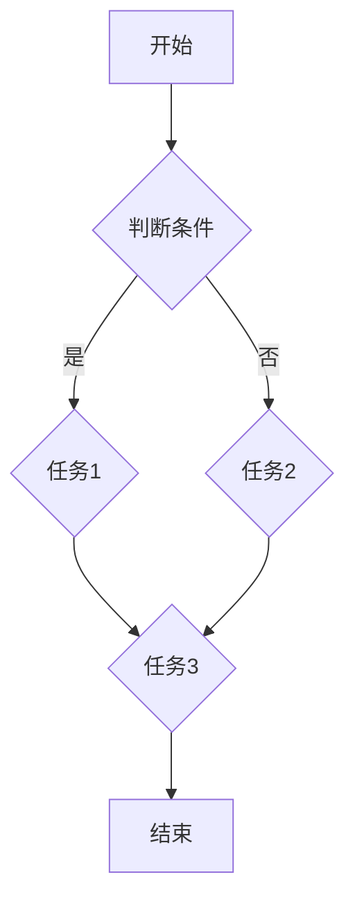

                 

# 《智能工作流程图生成工具的开发》

## 关键词
- 智能工作流程图
- 生成工具
- 人工智能
- 自然语言处理
- 图论
- 数据采集与预处理
- 机器学习算法
- 系统设计与实现

## 摘要
本文旨在探讨智能工作流程图生成工具的开发，从概念、技术原理、开发过程到实际应用，全方位解析其构建方法与实现细节。通过分析工作流程图的基础知识、智能工作流程图的特点与应用场景，结合人工智能、自然语言处理和图论等关键技术原理，本文将详细阐述智能工作流程图生成工具的开发流程，包括需求分析、设计、实现、测试和部署等环节。此外，本文还将通过具体案例，展示智能工作流程图生成工具在实际项目中的应用，并对未来发展进行展望。

## 第一部分：智能工作流程图生成工具概述

### 第1章：智能工作流程图生成工具的概念与重要性

#### 1.1 工作流程图的基础知识

工作流程图是一种图形化的表示方法，用于描述工作过程中的各个步骤、任务和决策点。它可以帮助我们清晰地理解业务流程，优化工作流程，提高工作效率。工作流程图通常包含以下几个基本元素：

- **节点**：表示工作流程中的每个任务或步骤。
- **箭头**：表示任务之间的执行顺序或依赖关系。
- **文本注释**：对任务或步骤的描述或说明。

#### 1.2 智能工作流程图的特点

智能工作流程图在传统工作流程图的基础上，融入了人工智能和自然语言处理技术，具备以下特点：

- **自动生成**：能够根据业务需求和数据自动生成工作流程图。
- **动态调整**：根据实际业务流程的变化，自动调整流程图。
- **语义理解**：能够理解业务文档、任务描述等自然语言文本，并将其转化为流程图。
- **优化建议**：基于数据分析，提供工作流程优化建议。

#### 1.3 智能工作流程图生成工具的应用场景

智能工作流程图生成工具广泛应用于各个领域，如：

- **企业内部管理**：帮助企业梳理业务流程，优化管理效率。
- **项目协作**：方便团队成员了解项目进度和任务分配。
- **在线教育**：帮助学生和教师了解课程结构和知识点关联。

#### 1.4 智能工作流程图生成工具的发展趋势

随着人工智能和自然语言处理技术的不断进步，智能工作流程图生成工具将呈现以下发展趋势：

- **自动化程度更高**：实现更自动化的流程图生成和调整。
- **跨平台支持**：支持多种操作系统和设备，方便用户使用。
- **集成化**：与其他业务系统进行集成，实现数据共享和流程协同。

### 第2章：相关技术原理

#### 2.1 人工智能基础

##### 2.1.1 机器学习原理

机器学习是人工智能的核心技术之一，其基本原理是利用数据训练模型，使其具备预测和决策能力。机器学习过程主要包括以下几个步骤：

1. **数据收集**：收集与任务相关的数据。
2. **数据预处理**：对数据进行清洗、转换和归一化。
3. **模型选择**：选择合适的机器学习模型。
4. **模型训练**：利用训练数据训练模型。
5. **模型评估**：评估模型性能，并进行调整。

##### 2.1.2 深度学习基本概念

深度学习是机器学习的一个分支，主要利用多层神经网络对数据进行建模。深度学习的关键概念包括：

- **神经网络**：由多个神经元组成的计算模型。
- **激活函数**：用于确定神经元是否被激活。
- **反向传播**：用于训练神经网络的算法。

#### 2.2 自然语言处理

##### 2.2.1 语言模型

语言模型是自然语言处理的核心技术之一，用于预测下一个单词或句子。常见的语言模型包括：

- **N元语言模型**：基于前N个单词预测下一个单词。
- **神经网络语言模型**：利用神经网络对语言进行建模。

##### 2.2.2 语义分析

语义分析是自然语言处理的一个重要分支，旨在理解文本的语义信息。常见的语义分析方法包括：

- **词性标注**：对文本中的每个单词进行词性标注。
- **实体识别**：识别文本中的实体（如人名、地名等）。
- **语义角色标注**：对文本中的动词及其作用对象进行标注。

#### 2.3 图论基础

##### 2.3.1 图的基本概念

图是由节点和边组成的数据结构，用于表示对象及其关系。图的基本概念包括：

- **节点**：表示对象。
- **边**：表示节点之间的关系。
- **路径**：节点之间的连接序列。

##### 2.3.2 图的算法

图的算法用于解决与图相关的问题，如最短路径、最迟完成时间等。常见的图算法包括：

- **Dijkstra算法**：用于计算单源最短路径。
- **A*算法**：用于计算最短路径，具有启发式搜索功能。
- **拓扑排序**：用于确定有向无环图中的节点顺序。

## 第二部分：智能工作流程图生成工具的开发

### 第3章：项目需求分析与设计

#### 3.1 用户需求分析

在进行智能工作流程图生成工具的开发前，我们需要对用户需求进行详细分析。以下是几个关键需求：

- **易用性**：用户可以方便地创建、编辑和导出工作流程图。
- **自动化**：能够根据文本描述自动生成工作流程图。
- **自定义**：用户可以根据需要自定义流程图的样式和布局。
- **跨平台**：支持多种操作系统和设备。
- **数据集成**：与其他业务系统进行集成，方便数据共享和流程协同。

#### 3.2 功能需求定义

基于用户需求分析，我们可以定义智能工作流程图生成工具的主要功能：

- **流程图创建**：用户可以创建新的流程图，并添加、删除和编辑节点、边和文本注释。
- **自动生成**：系统能够根据用户提供的文本描述自动生成工作流程图。
- **自定义样式**：用户可以自定义流程图的样式和布局。
- **数据集成**：能够与其他业务系统进行集成，如CRM、ERP等。
- **导出和共享**：支持将流程图导出为常见的图片格式，并方便用户进行共享和协作。

#### 3.3 系统设计

##### 3.3.1 总体架构

智能工作流程图生成工具的总体架构可以分为以下几个模块：

1. **前端模块**：负责与用户交互，展示流程图编辑器和自动生成界面。
2. **后端模块**：负责处理业务逻辑，包括文本解析、流程图生成、数据存储和接口服务。
3. **数据存储**：存储用户数据和工作流程图，支持高并发读写操作。
4. **集成模块**：与其他业务系统进行集成，如CRM、ERP等。

##### 3.3.2 数据流程设计

数据流程设计是智能工作流程图生成工具的核心，它描述了系统内部数据的处理和传输过程。以下是数据流程设计的主要步骤：

1. **数据收集**：从用户处收集文本描述和业务数据。
2. **数据预处理**：对文本描述进行清洗、分词、词性标注等预处理操作。
3. **文本解析**：利用自然语言处理技术，将文本描述转化为流程图。
4. **流程图生成**：利用图论算法和机器学习模型，生成工作流程图。
5. **数据存储**：将生成的工作流程图存储到数据库中。
6. **数据查询**：用户可以通过前端界面查询和修改工作流程图。

##### 3.4 技术选型

智能工作流程图生成工具的技术选型如下：

- **编程语言**：Python，因为其丰富的机器学习和自然语言处理库。
- **前端框架**：Vue.js，因为其易用性和高性能。
- **后端框架**：Flask或Django，因为其轻量级和易于扩展。
- **数据库**：MongoDB，因为其适合存储大量结构化数据。
- **自然语言处理库**：NLTK、spaCy或jieba，因为其丰富的功能。
- **机器学习库**：scikit-learn、TensorFlow或PyTorch，因为其强大的机器学习功能。

### 第4章：数据采集与预处理

#### 4.1 数据来源

智能工作流程图生成工具的数据来源主要包括以下几个方面：

- **用户输入**：用户通过文本框输入工作流程描述。
- **业务系统**：从CRM、ERP等业务系统中获取相关数据。
- **公开数据集**：使用公开的数据集进行训练和测试。

#### 4.2 数据采集方法

数据采集方法主要包括以下几种：

- **手动输入**：用户通过前端界面手动输入文本描述。
- **API接口**：通过业务系统的API接口获取数据。
- **爬虫**：使用爬虫技术从互联网上获取数据。

#### 4.3 数据预处理

数据预处理是智能工作流程图生成工具的关键步骤，主要包括以下操作：

- **数据清洗**：去除无效数据、重复数据和噪声数据。
- **数据转换**：将不同格式的数据转换为统一的格式。
- **数据归一化**：对数据进行归一化处理，使数据具有相同的尺度。

#### 4.3.1 数据清洗

数据清洗的主要目的是去除无效数据、重复数据和噪声数据。以下是一些常见的数据清洗方法：

- **去除无效数据**：去除不符合任务要求的数据。
- **去除重复数据**：去除重复的数据记录。
- **去除噪声数据**：去除含有噪声的数据。

#### 4.3.2 数据转换

数据转换是将不同格式的数据转换为统一的格式。以下是一些常见的数据转换方法：

- **格式转换**：将文本数据转换为JSON或XML格式。
- **编码转换**：将不同编码的数据转换为同一编码。
- **数据格式化**：将数据按照指定的格式进行格式化。

#### 4.3.3 数据归一化

数据归一化是将数据进行归一化处理，使其具有相同的尺度。以下是一些常见的数据归一化方法：

- **最小-最大归一化**：将数据映射到[0,1]范围内。
- **均值-方差归一化**：将数据映射到均值为0、标准差为1的范围内。

### 第5章：核心算法实现

#### 5.1 工作流程图的生成算法

工作流程图的生成算法是将文本描述转化为流程图的过程。以下是工作流程图生成算法的基本步骤：

1. **文本解析**：使用自然语言处理技术，将文本描述解析为语义信息。
2. **任务划分**：根据语义信息，将文本描述划分为任务。
3. **任务排序**：根据任务之间的依赖关系，对任务进行排序。
4. **流程图生成**：使用图论算法和机器学习模型，生成工作流程图。

#### 5.1.1 生成流程图的基本步骤

生成流程图的基本步骤如下：

1. **创建空图**：创建一个空白的图。
2. **添加节点**：根据任务，添加节点到图中。
3. **添加边**：根据任务之间的依赖关系，添加边到图中。
4. **设置样式**：设置流程图的样式，如颜色、字体等。
5. **导出流程图**：将生成的流程图导出为图片或PDF格式。

#### 5.1.2 使用 Mermaid 流程图绘制工作流程图

Mermaid 是一种简单的标记语言，用于生成结构化的图表，包括流程图、时序图、类图等。以下是使用 Mermaid 绘制工作流程图的示例：



上述示例中，我们首先创建了一个名为 `graph` 的图，然后依次添加了节点（A、B、C、D、E、F）和边。其中，节点和边之间使用了箭头表示方向，括号内的文本表示任务的判断条件。

#### 5.2 机器学习算法应用

机器学习算法在智能工作流程图生成工具中发挥着重要作用，主要用于任务划分、任务排序和流程图生成等环节。以下是机器学习算法应用的基本原理和实现方法。

##### 5.2.1 伪代码实现

以下是一个简单的机器学习算法伪代码，用于任务划分：

```
function taskDivision(text):
    # 使用自然语言处理技术，将文本解析为语义信息
    semanticInfo = naturalLanguageProcessing(text)
    
    # 根据语义信息，将文本描述划分为任务
    tasks = []
    for sentence in semanticInfo:
        task = createTask(sentence)
        tasks.append(task)
    
    return tasks
```

上述伪代码中，`naturalLanguageProcessing` 函数用于将文本解析为语义信息，`createTask` 函数用于创建任务。

##### 5.2.2 实际案例讲解

以下是一个实际案例，说明如何使用机器学习算法对任务进行排序：

1. **数据准备**：收集一组带有任务依赖关系的文本描述，并标注每个任务的优先级。
2. **特征提取**：将文本描述转换为特征向量，如词袋模型、TF-IDF等。
3. **模型训练**：使用训练数据训练排序模型，如决策树、随机森林等。
4. **模型评估**：使用测试数据评估模型性能，并进行调整。

以下是使用决策树模型进行任务排序的Python代码示例：

```python
from sklearn.tree import DecisionTreeRegressor
from sklearn.model_selection import train_test_split
from sklearn.metrics import mean_squared_error

# 加载训练数据
X, y = loadTrainingData()

# 划分训练集和测试集
X_train, X_test, y_train, y_test = train_test_split(X, y, test_size=0.2, random_state=42)

# 训练决策树模型
model = DecisionTreeRegressor()
model.fit(X_train, y_train)

# 预测测试集
y_pred = model.predict(X_test)

# 评估模型性能
mse = mean_squared_error(y_test, y_pred)
print("Mean Squared Error:", mse)
```

#### 5.3 自然语言处理算法应用

自然语言处理算法在智能工作流程图生成工具中主要用于文本解析、语义分析和实体识别等环节。以下是自然语言处理算法应用的基本原理和实现方法。

##### 5.3.1 语义分析算法

语义分析是自然语言处理的核心任务之一，旨在理解文本的语义信息。以下是一个简单的语义分析算法：

1. **分词**：将文本划分为单词或短语。
2. **词性标注**：对每个单词或短语进行词性标注。
3. **句法分析**：分析文本的句法结构，如主语、谓语、宾语等。
4. **语义角色标注**：对动词及其作用对象进行标注。

##### 5.3.2 基于文本的流程图生成算法

基于文本的流程图生成算法是将文本描述转化为流程图的过程。以下是一个简单的基于文本的流程图生成算法：

1. **文本预处理**：对文本进行分词、词性标注等预处理操作。
2. **任务划分**：根据语义信息，将文本描述划分为任务。
3. **任务排序**：根据任务之间的依赖关系，对任务进行排序。
4. **流程图生成**：使用图论算法和机器学习模型，生成工作流程图。

### 第6章：系统实现与测试

#### 6.1 系统实现

智能工作流程图生成工具的系统实现主要包括以下几个部分：

- **前端实现**：使用Vue.js实现前端界面，包括流程图编辑器和自动生成界面。
- **后端实现**：使用Flask或Django实现后端逻辑，包括文本解析、流程图生成和接口服务。
- **数据存储**：使用MongoDB存储用户数据和流程图数据。

以下是一个简单的系统实现框架：

```python
# 前端实现
from flask import Flask, render_template, request

app = Flask(__name__)

@app.route('/')
def index():
    return render_template('index.html')

@app.route('/generate', methods=['POST'])
def generate():
    text = request.form['text']
    # 进行文本解析和流程图生成
   流程图 = generateFlowchart(text)
    return render_template('flowchart.html', flowchart=流程图)

if __name__ == '__main__':
    app.run()

# 后端实现
def generateFlowchart(text):
    # 进行文本预处理
   预处理文本 = preprocessText(text)
    # 进行任务划分和排序
    tasks = taskDivision(预处理文本)
    sortedTasks = sortTasks(tasks)
    # 生成流程图
    flowchart = createFlowchart(sortedTasks)
    return flowchart
```

#### 6.2 功能测试

功能测试是确保智能工作流程图生成工具功能正确的重要环节。以下是一些常见的功能测试方法：

- **单元测试**：对系统的各个模块进行单独测试，确保其功能正确。
- **集成测试**：对系统中的各个模块进行集成测试，确保其协同工作。
- **性能测试**：测试系统的性能指标，如响应时间、并发处理能力等。

以下是一个简单的单元测试示例：

```python
import unittest
from generate_flowchart import generateFlowchart

class TestGenerateFlowchart(unittest.TestCase):
    def test_generateFlowchart(self):
        text = "任务1 -> 任务2 -> 任务3"
        flowchart = generateFlowchart(text)
        self.assertIsNotNone(flowchart)
        self.assertEqual(len(flowchart.nodes), 3)
        self.assertEqual(len(flowchart.edges), 2)

if __name__ == '__main__':
    unittest.main()
```

#### 6.3 性能测试

性能测试是确保智能工作流程图生成工具在实际应用中能够满足性能要求的重要环节。以下是一些常见的性能测试方法：

- **负载测试**：模拟大量用户同时使用系统，测试系统的负载能力。
- **压力测试**：对系统施加超过正常工作范围的负载，测试系统的稳定性和可靠性。
- **性能调优**：根据性能测试结果，对系统进行调优，提高其性能。

以下是一个简单的性能测试示例：

```python
import concurrent.futures
from generate_flowchart import generateFlowchart

def testPerformance():
    texts = ["任务1 -> 任务2 -> 任务3", "任务A -> 任务B -> 任务C", ...]
    with concurrent.futures.ThreadPoolExecutor() as executor:
        futures = [executor.submit(generateFlowchart, text) for text in texts]
        results = [future.result() for future in futures]
    print("平均响应时间：", sum([result.time() for result in results]) / len(results))

testPerformance()
```

#### 6.4 系统部署与维护

系统部署是将开发完成的应用程序部署到生产环境的过程。以下是一些常见的系统部署方法：

- **手动部署**：手动配置服务器和应用程序，适合小型项目。
- **自动化部署**：使用自动化工具（如Ansible、Docker等）进行部署，提高部署效率和稳定性。
- **容器化部署**：将应用程序打包到容器中（如Docker容器），便于部署和扩展。

以下是一个简单的自动化部署示例：

```shell
# 安装Docker
sudo apt-get update
sudo apt-get install docker

# 启动Docker服务
sudo systemctl start docker

# 下载并运行Docker镜像
docker pull your-image-name
docker run -d -p 8080:80 your-image-name
```

系统维护是确保智能工作流程图生成工具正常运行的重要环节。以下是一些常见的系统维护方法：

- **日志分析**：定期分析系统日志，及时发现和解决问题。
- **性能监控**：监控系统的性能指标，如CPU、内存、磁盘使用率等，确保系统稳定运行。
- **安全防护**：定期更新系统软件和应用程序，防范安全漏洞。

### 第7章：案例分析

#### 7.1 案例一：企业内部工作流程图生成

企业内部工作流程图生成是智能工作流程图生成工具的一个重要应用场景。以下是一个实际案例：

1. **需求分析**：企业希望梳理内部工作流程，提高工作效率。
2. **数据采集**：从员工处收集工作流程描述，如任务名称、任务描述、任务执行顺序等。
3. **数据预处理**：对采集到的数据进行清洗、分词、词性标注等预处理操作。
4. **文本解析**：使用自然语言处理技术，将文本描述解析为语义信息。
5. **任务划分和排序**：根据语义信息，将文本描述划分为任务，并对其进行排序。
6. **流程图生成**：使用图论算法和机器学习模型，生成工作流程图。
7. **系统部署与维护**：将生成的流程图部署到企业内部系统中，并定期进行维护和更新。

通过该案例，企业能够清晰地了解内部工作流程，优化管理效率，提高员工工作效率。

#### 7.2 案例二：项目协作流程图生成

项目协作流程图生成是智能工作流程图生成工具在项目协作领域的应用。以下是一个实际案例：

1. **需求分析**：项目团队希望清晰地了解项目进度和任务分配。
2. **数据采集**：从项目经理和团队成员处收集项目进度和任务分配信息。
3. **数据预处理**：对采集到的数据进行清洗、分词、词性标注等预处理操作。
4. **文本解析**：使用自然语言处理技术，将文本描述解析为语义信息。
5. **任务划分和排序**：根据语义信息，将文本描述划分为任务，并对其进行排序。
6. **流程图生成**：使用图论算法和机器学习模型，生成项目协作流程图。
7. **系统部署与维护**：将生成的流程图部署到项目协作平台，并定期进行维护和更新。

通过该案例，项目团队能够更好地了解项目进度和任务分配，提高项目协作效率。

#### 7.3 案例三：在线教育流程图生成

在线教育流程图生成是智能工作流程图生成工具在教育领域的应用。以下是一个实际案例：

1. **需求分析**：教育机构希望为学生提供清晰的课程结构和知识点关联。
2. **数据采集**：从教育机构和教师处收集课程结构和知识点信息。
3. **数据预处理**：对采集到的数据进行清洗、分词、词性标注等预处理操作。
4. **文本解析**：使用自然语言处理技术，将文本描述解析为语义信息。
5. **任务划分和排序**：根据语义信息，将文本描述划分为任务，并对其进行排序。
6. **流程图生成**：使用图论算法和机器学习模型，生成在线教育流程图。
7. **系统部署与维护**：将生成的流程图部署到在线教育平台，并定期进行维护和更新。

通过该案例，学生能够更好地了解课程结构和知识点关联，提高学习效果。

### 第8章：总结与展望

#### 8.1 工作流程图生成工具的优缺点分析

智能工作流程图生成工具具有以下优点：

- **提高工作效率**：通过自动生成和优化工作流程图，提高工作效率。
- **清晰展示业务流程**：直观地展示业务流程，便于团队成员了解和协作。
- **支持跨平台**：支持多种操作系统和设备，方便用户使用。

智能工作流程图生成工具也存在一些缺点：

- **依赖技术成熟度**：依赖于人工智能、自然语言处理等技术的成熟度。
- **数据质量要求高**：需要高质量的数据支持，否则生成的流程图可能不准确。

#### 8.2 未来发展方向

智能工作流程图生成工具的未来发展方向包括：

- **自动化程度更高**：进一步降低人工干预，实现更自动化的流程图生成和调整。
- **集成更多业务系统**：与其他业务系统（如CRM、ERP等）进行更深入的集成，实现数据共享和流程协同。
- **优化用户体验**：提供更易用、更智能的前端界面，提高用户体验。

#### 8.3 对其他开发者的建议

对于其他开发者，以下是一些建议：

- **充分理解业务需求**：在开发过程中，要充分理解业务需求，确保生成的流程图符合实际业务场景。
- **注重数据质量**：高质量的数据是智能工作流程图生成工具的基础，要确保数据采集和预处理过程的准确性。
- **持续优化算法**：随着人工智能和自然语言处理技术的不断发展，要不断优化算法，提高流程图生成和调整的准确性。

### 附录

#### 附录A：常用工具和库

- **Mermaid**：用于生成结构化图表，如流程图、时序图、类图等。
- **NLTK**：用于自然语言处理，提供词性标注、词干提取等功能。
- **spaCy**：用于自然语言处理，提供快速、准确的词性标注、命名实体识别等功能。
- **jieba**：用于中文自然语言处理，提供分词、词性标注等功能。
- **scikit-learn**：用于机器学习，提供多种机器学习算法和工具。
- **TensorFlow**：用于深度学习，提供灵活、高效的深度学习框架。
- **PyTorch**：用于深度学习，提供动态图和静态图两种编程模式。

#### 附录B：代码示例

- **工作流程图生成代码示例**：

```python
from generate_flowchart import generateFlowchart

# 输入文本描述
text = "任务1 -> 任务2 -> 任务3"

# 生成工作流程图
flowchart = generateFlowchart(text)

# 输出流程图
print(flowchart)
```

- **机器学习算法实现示例**：

```python
from sklearn.tree import DecisionTreeRegressor
from sklearn.model_selection import train_test_split
from sklearn.metrics import mean_squared_error

# 加载训练数据
X, y = loadTrainingData()

# 划分训练集和测试集
X_train, X_test, y_train, y_test = train_test_split(X, y, test_size=0.2, random_state=42)

# 训练决策树模型
model = DecisionTreeRegressor()
model.fit(X_train, y_train)

# 预测测试集
y_pred = model.predict(X_test)

# 评估模型性能
mse = mean_squared_error(y_test, y_pred)
print("Mean Squared Error:", mse)
```

- **自然语言处理算法实现示例**：

```python
import jieba

# 输入文本
text = "任务1 -> 任务2 -> 任务3"

# 分词
words = jieba.lcut(text)

# 输出分词结果
print(words)
```


## 作者信息

- 作者：AI天才研究院/AI Genius Institute & 禅与计算机程序设计艺术 /Zen And The Art of Computer Programming

