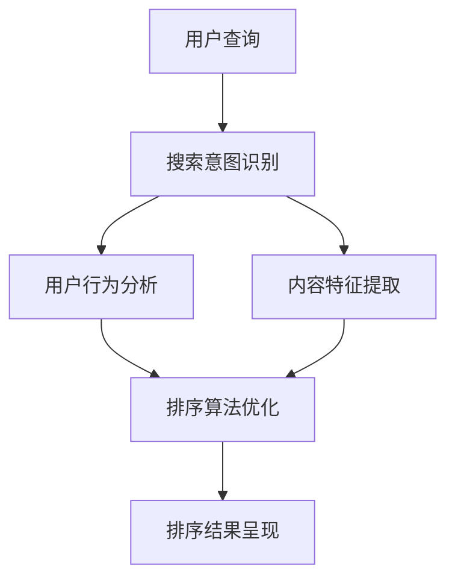

                 

### 文章标题

智能排序：AI如何优化搜索结果排序，提升用户体验

智能排序是当今互联网领域中的一个热门话题，它利用人工智能技术，特别是机器学习和深度学习算法，对搜索结果进行排序，以提升用户的搜索体验。本文将围绕智能排序的核心概念、算法原理、实践应用、用户体验优化和未来发展趋势进行深入探讨，以帮助读者全面了解这一领域的前沿技术和应用。

关键词：智能排序，人工智能，机器学习，深度学习，搜索结果排序，用户体验

摘要：本文系统地介绍了智能排序的基本概念、算法原理、实践应用和用户体验优化方法。通过对智能排序核心概念的分析，包括搜索意图识别、用户行为分析和内容特征提取，本文阐述了智能排序算法的基本原理和数学模型。随后，通过一个实际项目案例，展示了智能排序的开发环境搭建、数据预处理、模型训练和优化过程。接着，本文探讨了如何通过用户反馈、实时调整和个性化推荐来优化排序结果的用户体验。最后，本文展望了智能排序的未来发展趋势，包括自动化与智能化水平提升、多模态数据融合、个性化推荐、实时动态排序和伦理与社会影响。通过本文的阅读，读者将能够全面了解智能排序的核心内容和技术应用，为未来在相关领域的研究和应用提供参考。

### 第一部分: 智能排序的基本概念

#### 核心概念与联系

智能排序是利用人工智能技术，尤其是机器学习和深度学习算法，对搜索结果进行排序的过程。其核心在于能够根据用户的搜索意图、行为数据和内容特征，为用户呈现最相关、最有价值的结果。以下是智能排序的几个核心概念及其之间的联系：

1. **搜索意图识别**：理解用户的搜索意图是智能排序的首要任务。用户输入的查询词往往具有模糊性和多义性，需要通过自然语言处理技术，如词向量、语义分析等，提取出用户的真实需求。

2. **用户行为分析**：用户的行为数据是智能排序的重要参考。包括点击率、停留时间、浏览顺序等行为数据，可以帮助识别用户的兴趣和偏好。

3. **内容特征提取**：搜索结果的内容特征，如文本、图像、视频等，都是排序算法需要处理和分析的对象。特征提取技术包括词嵌入、图像识别、视频特征提取等。

4. **排序算法优化**：智能排序的核心是排序算法。排序算法通过结合用户意图、行为和内容特征，生成排序结果。常见的排序算法包括基于协同过滤的算法、基于深度学习的排序算法等。

这些核心概念之间紧密相连，构成了智能排序的整体架构。用户意图识别提供了排序的起点，用户行为分析和内容特征提取则提供了排序依据，而排序算法优化则将二者结合起来，生成最终的排序结果。

**Mermaid 流�程图**

以下是智能排序流程的 Mermaid 流程图：



#### 核心算法原理讲解

智能排序算法的核心在于如何结合用户意图、行为和内容特征来产生排序结果。以下是常见的几种排序算法原理的伪代码讲解。

**基于协同过滤的排序算法**

协同过滤是一种常用的排序算法，其基本思想是找到与当前用户相似的其它用户，并推荐这些用户喜欢的项目。以下是一个基于用户协同过滤的排序算法的伪代码：

```python
def collaborative_filtering_ranks(user_data, item_data, similarity_matrix):
    # 计算用户和物品之间的相似度
    for user in user_data:
        for item in item_data:
            similarity = calculate_similarity(user, item, similarity_matrix)
            # 根据相似度计算排序权重
            rank = calculate_rank(similarity)
            update_item_rank(item, rank)
    return sorted_items_by_rank()

def calculate_similarity(user, item, similarity_matrix):
    # 使用相似度矩阵计算用户和物品的相似度
    return similarity_matrix[user][item]

def calculate_rank(similarity):
    # 根据相似度计算排序权重
    return 1 / (1 + e ** (-similarity))
```

**基于深度学习的排序算法**

基于深度学习的排序算法利用神经网络模型，通过学习用户和物品的特征向量，生成排序分数。以下是一个简单的基于深度学习的排序算法的伪代码：

```python
def deep_learning_ranking(input_data):
    # 输入用户意图、行为和内容特征
    user_repr = model_user_representation(input_data['user'])
    item_repr = model_item_representation(input_data['item'])
    combined_repr = combine_representations(user_repr, item_repr)
    # 通过神经网络模型计算排序分数
    score = neural_network_model(combined_repr)
    return score

def model_user_representation(user_data):
    # 训练用户嵌入模型
    return model.encode(user_data)

def model_item_representation(item_data):
    # 训练物品嵌入模型
    return model.encode(item_data)

def combine_representations(user_repr, item_repr):
    # 结合用户和物品的嵌入表示
    return user_repr + item_repr
```

#### 数学模型和数学公式

在智能排序中，常常会用到一些数学模型和公式来表示排序算法的核心思想。以下是一些基本的数学公式和详细讲解。

**相似度计算公式**

相似度是用来衡量两个向量之间相似程度的指标。在排序算法中，常用的相似度计算方法包括余弦相似度和皮尔逊相关系数。

余弦相似度的计算公式如下：

$$
similarity = \frac{dot_product(user_vector, item_vector)}{\|user_vector\| \cdot \|item_vector\|}
$$

其中，$dot_product(user_vector, item_vector)$ 是用户向量和物品向量的点积，$\|user_vector\|$ 和 $\|item_vector\|$ 分别是用户向量和物品向量的模长。

皮尔逊相关系数的计算公式如下：

$$
correlation = \frac{\sum_{i=1}^{n}(user\_vector[i] - \bar{user\_vector}) \cdot (item\_vector[i] - \bar{item\_vector})}{\sqrt{\sum_{i=1}^{n}(user\_vector[i] - \bar{user\_vector})^2} \cdot \sqrt{\sum_{i=1}^{n}(item\_vector[i] - \bar{item\_vector})^2}}
$$

其中，$\bar{user\_vector}$ 和 $\bar{item\_vector}$ 分别是用户向量和物品向量的均值。

**排序权重计算公式**

排序权重是用来衡量用户对物品偏好程度的指标。在协同过滤算法中，排序权重可以通过相似度计算得出。

排序权重计算公式如下：

$$
rank = \frac{1}{1 + e^{-(similarity \cdot weight)}}
$$

其中，$similarity$ 是用户和物品之间的相似度，$weight$ 是排序权重。

**排序分数计算公式**

排序分数是用来衡量物品对用户吸引力程度的指标。在深度学习排序算法中，排序分数可以通过神经网络模型计算得出。

排序分数计算公式如下：

$$
score = \sigma(w^T \cdot [user_repr; item_repr])
$$

其中，$w$ 是权重向量，$\sigma$ 是 sigmoid 函数，$[user_repr; item_repr]$ 是用户和物品的嵌入表示拼接。

#### 举例说明

**用户行为分析举例**

假设用户A搜索了“北京餐厅推荐”，并浏览了以下几个网页：
1. 一家评分高的中餐厅
2. 一家评分高的火锅餐厅
3. 一家评分高的西餐厅

根据这些行为，我们可以推断用户A可能更偏好评分高的餐厅，并且可能更喜欢中餐和火锅。我们可以使用协同过滤算法来推荐餐厅，根据用户A与其他用户的相似度，推荐评分高的中餐厅和火锅餐厅。

**内容特征提取举例**

假设我们要对一篇关于北京餐厅的评论进行内容特征提取，我们可以使用词嵌入技术将文本转换为向量表示。例如，将“北京餐厅”转化为向量\[1, 0, 1, 0\]，其中每个维度表示一个词汇的词嵌入向量。通过这些向量，我们可以计算评论的文本特征，并将其用于排序算法。

**排序算法应用举例**

假设我们使用深度学习模型对用户A的搜索结果进行排序，输入数据包括用户A的查询词“北京餐厅推荐”和一系列餐厅的文本描述。深度学习模型将用户查询和餐厅描述的嵌入表示结合起来，通过神经网络模型计算排序分数，并根据分数高低为用户推荐餐厅。

以下是智能排序在搜索引擎中的应用流程：

1. 用户输入查询词。
2. 搜索引擎对查询词进行分词和词性标注。
3. 搜索引擎利用词嵌入技术将查询词转换为向量表示。
4. 搜索引擎对网页内容进行索引，提取文本特征。
5. 搜索引擎利用深度学习模型计算查询词和网页文本之间的排序分数。
6. 搜索引擎根据排序分数将网页排序，并呈现给用户。

通过以上流程，搜索引擎能够为用户提供准确、相关的搜索结果，提升用户的搜索体验。

### 第二部分: 智能排序算法的实践应用

智能排序算法在实践中的应用非常广泛，涵盖了从搜索引擎优化到电子商务推荐系统等多个领域。本节将通过一个实际项目案例，详细描述智能排序算法的开发环境搭建、数据预处理、模型训练和优化过程，以展示如何将理论应用到实际项目中。

#### 项目实战

**1. 环境搭建**

为了进行智能排序项目的实践，我们需要搭建一个开发环境。以下是基本的步骤：

1. **安装 Python 环境**：在计算机上安装 Python，版本建议选择 3.7 或以上，以确保支持最新的深度学习框架。
2. **安装深度学习框架**：安装 TensorFlow 或 PyTorch，这两个框架是目前最流行的深度学习库，适用于各种规模的模型训练和部署。
3. **安装数据处理和可视化工具**：安装 Pandas、NumPy、Matplotlib 等工具，这些库将用于数据预处理、分析和可视化。
4. **安装数据库**：如果项目需要存储大量数据，可以选择安装 MySQL、PostgreSQL 或 MongoDB 等。

**2. 数据预处理**

在应用智能排序算法之前，我们需要对数据进行预处理。以下是一些常见的预处理步骤：

1. **数据清洗**：去除数据中的噪声和异常值，确保数据质量。例如，去除包含特殊字符、空白字符或格式不一致的数据。
2. **特征提取**：提取用户查询、用户行为和搜索结果的内容特征。对于文本数据，可以使用词嵌入技术将词汇转换为向量表示；对于图像和视频数据，可以使用相应的图像和视频特征提取技术。
3. **数据归一化**：对数值特征进行归一化处理，使其在相同的尺度上，以便模型能够更好地学习。
4. **数据分片**：将数据集划分为训练集、验证集和测试集，用于模型训练、验证和评估。

**3. 模型训练**

智能排序的模型训练是关键步骤。以下是训练过程的简要描述：

1. **定义模型架构**：选择合适的神经网络架构，如多层感知机（MLP）、卷积神经网络（CNN）或循环神经网络（RNN）。例如，可以使用一个基于 CNN 的模型，结合文本和图像特征。
2. **数据输入**：将预处理后的数据输入到模型中，包括用户查询、用户行为和搜索结果的特征向量。
3. **模型训练**：通过反向传播算法，不断调整模型参数，使模型能够正确地预测搜索结果的排序分数。
4. **模型评估**：使用验证集对训练好的模型进行评估，计算排序准确率和相关指标，如平均绝对误差（MAE）和均方根误差（RMSE）。

**4. 代码解读与分析**

以下是一个简单的基于深度学习框架的智能排序模型训练和评估的伪代码示例：

```python
# 导入必要的库
import tensorflow as tf
from tensorflow.keras.models import Sequential
from tensorflow.keras.layers import Dense, Embedding, LSTM

# 数据预处理
# ...（数据清洗、特征提取、数据归一化等）

# 模型定义
model = Sequential()
model.add(Embedding(input_dim=vocab_size, output_dim=embedding_dim))
model.add(LSTM(units=128))
model.add(Dense(units=1, activation='sigmoid'))

# 编译模型
model.compile(optimizer='adam', loss='binary_crossentropy', metrics=['accuracy'])

# 训练模型
model.fit(x_train, y_train, epochs=10, batch_size=32, validation_data=(x_val, y_val))

# 评估模型
mae = model.evaluate(x_test, y_test, verbose=2)
print('Test MAE:', mae)

# 优化模型
# ...（调整超参数、特征工程、模型集成等）
```

在这个示例中，我们定义了一个基于 LSTM 的模型，通过嵌入层将文本特征转换为向量表示，然后通过 LSTM 层和全连接层生成排序分数。模型使用二进制交叉熵作为损失函数，并使用 Adam 优化器进行训练。

**5. 代码解读与分析**

以下是对上述代码的详细解读：

- **模型定义**：首先，我们定义了一个序列模型（Sequential），并添加了一个嵌入层（Embedding），用于将输入的查询词转换为向量表示。嵌入层的输入维度是词汇表的大小，输出维度是嵌入向量的大小。接着，我们添加了一个 LSTM 层，用于处理序列数据，并增加一个全连接层（Dense），输出层使用 sigmoid 激活函数，用于生成排序分数。

- **模型编译**：在编译模型时，我们指定了优化器（optimizer）、损失函数（loss）和评估指标（metrics）。在这里，我们使用 Adam 优化器和二进制交叉熵（binary_crossentropy）作为损失函数，并关注模型的准确性（accuracy）。

- **模型训练**：通过 `model.fit()` 函数，我们开始训练模型。训练数据（x_train 和 y_train）是预处理后的用户查询和排序分数。我们设置了 10 个训练周期（epochs），每个周期使用 32 个批量大小（batch_size）。同时，我们使用验证数据（x_val 和 y_val）来监测模型在训练过程中的性能。

- **模型评估**：通过 `model.evaluate()` 函数，我们评估训练好的模型在测试集（x_test 和 y_test）上的性能。这里，我们关注平均绝对误差（MAE），这是一个衡量排序准确性的指标。

- **模型优化**：在训练过程中，我们可能需要根据模型的性能进行调整，如调整超参数（例如学习率、批量大小）、进行特征工程或使用模型集成等方法。

通过这个项目实战，我们可以看到如何将智能排序算法应用到实际项目中。从环境搭建、数据预处理到模型训练和优化，每一步都是实现智能排序系统的重要组成部分。在实际应用中，开发者需要不断调整和优化模型，以提升排序系统的性能和用户体验。

### 第三部分: 智能排序的用户体验优化

#### 用户反馈收集与分析

用户反馈是优化智能排序用户体验的重要途径。通过收集和分析用户反馈，开发者可以了解用户对排序结果的满意程度、识别问题所在，并据此进行相应的优化。

**用户反馈收集**

用户反馈的收集可以通过多种途径进行，包括：

- **在线问卷**：设计针对性的问卷，通过网站、应用或电子邮件发送给用户，收集他们的意见和反馈。
- **用户评论**：分析用户在搜索引擎、应用市场或社交媒体上的评论和评价。
- **行为数据**：利用用户在使用搜索引擎或应用时的行为数据，如点击率、停留时间、搜索历史等，来推断用户对排序结果的反应。

**用户反馈处理**

收集到的用户反馈需要经过处理，以便提取出有用的信息。以下是一些处理步骤：

- **分类和标签**：根据反馈的内容和性质，将其分类和标签化，例如将评论分为正面反馈、负面反馈、功能建议等。
- **数据清洗**：去除无关或重复的反馈，确保数据的质量和一致性。
- **文本分析**：利用自然语言处理技术，如情感分析、关键词提取等，对文本反馈进行分析，提取出关键信息和主题。

**数据分析**

通过分析用户反馈，开发者可以深入了解用户的需求和不满。以下是一些数据分析方法：

- **统计分析**：计算各种反馈类型的比例和分布，了解用户反馈的整体趋势。
- **趋势分析**：分析反馈随时间的变化，识别出可能的趋势和周期性现象。
- **聚类分析**：将相似的用户反馈聚类，发现潜在的用户群体和他们的需求。

通过数据分析，开发者可以识别出用户反馈中的关键问题和共性，为后续的优化提供依据。

#### 实时调整与个性化推荐

实时调整和个性化推荐是提升用户体验的重要策略。通过实时响应用户反馈和数据变化，以及为每个用户生成个性化的排序结果，可以提高用户的搜索体验。

**实时调整**

实时调整意味着在用户使用搜索引擎或应用时，根据他们的行为和反馈，动态调整排序算法的参数和权重。以下是一些实时调整的方法：

- **自适应调整**：根据用户的搜索历史和当前行为，实时调整排序算法的参数，如相似度计算权重、排序分数阈值等。
- **在线学习**：利用在线学习技术，实时更新模型，根据用户的反馈和数据变化，不断优化排序算法。

**个性化推荐**

个性化推荐是根据用户的兴趣、行为和偏好，为他们提供个性化的搜索结果。以下是一些个性化推荐的方法：

- **用户画像**：通过分析用户的历史数据和行为，构建详细的用户画像，用于个性化推荐。
- **协同过滤**：基于用户的相似性，为用户推荐他们可能感兴趣的内容。
- **内容推荐**：根据用户的行为和偏好，推荐相关的搜索结果，如新闻、商品、视频等。

**多模型融合**

多模型融合是将多个模型结合起来，提高排序结果的稳定性和准确性。以下是一些多模型融合的方法：

- **集成学习**：结合多个模型的预测结果，通过加权平均或投票机制，生成最终的排序结果。
- **迁移学习**：利用其他任务或领域的模型，为排序任务提供额外的信息和支持。

#### 排序结果的呈现与优化

排序结果的呈现和优化直接影响用户体验。以下是一些优化策略：

- **结果多样性**：在排序结果中呈现多样化的内容，包括文本、图像、视频等，满足不同用户的需求。
- **排序界面优化**：设计简洁、直观的排序界面，提高用户的操作效率和满意度。
- **分页加载与滚动**：实现分页加载和滚动加载功能，提高页面加载速度和用户体验。

#### 测试与优化

测试和优化是提升用户体验的持续过程。以下是一些关键步骤：

- **A/B测试**：通过A/B测试，比较不同排序策略的效果，选取最优方案。
- **性能监控**：实时监控排序系统的性能指标，如响应时间、错误率等，及时发现和解决问题。
- **用户反馈循环**：将用户反馈纳入优化循环，不断改进排序系统，提升用户体验。

**案例分析**

以下是一个案例分析，说明如何通过用户反馈和实时调整来优化搜索结果排序：

**案例背景**：

某搜索引擎的用户反馈显示，部分用户对搜索结果排序不满意，尤其是对于特定关键词的搜索结果。用户反馈指出，排序结果中存在一些不相关或不准确的网页。

**分析步骤**：

1. **问题识别**：通过用户反馈和数据分析，发现用户对特定关键词的搜索结果点击率低，停留时间短，说明排序结果可能与用户需求不匹配。
2. **数据挖掘**：分析用户搜索历史和行为数据，找出与反馈问题相关的关键词和搜索模式。
3. **算法调整**：根据分析结果，调整排序算法的相似度计算权重和排序分数阈值，以提高相关性和准确性。
4. **实时测试**：实施实时调整，监控用户行为和反馈，评估调整效果。
5. **迭代优化**：根据用户反馈和测试结果，不断迭代优化排序算法，提高用户体验。

**效果评估**：

经过一系列的调整和优化，搜索结果的点击率和用户停留时间显著提升。用户反馈也显示，对搜索结果的满意度有了明显的提高。通过用户反馈循环和实时调整，搜索引擎成功提升了用户的搜索体验。

#### 优化总结

通过用户反馈收集与分析、实时调整与个性化推荐、排序结果的呈现与优化，以及测试与优化，智能排序系统能够不断改进，提升用户体验。以下是一些关键优化总结：

- **用户反馈是关键**：用户反馈提供了优化方向和依据，是提升用户体验的重要来源。
- **实时调整与个性化推荐**：通过实时调整和个性化推荐，系统能够更准确地满足用户需求，提高搜索结果的准确性。
- **测试与优化**：持续测试和优化是提升系统性能和用户体验的关键，通过A/B测试和性能监控，不断改进排序算法。

通过这些优化策略，智能排序系统能够为用户提供更准确、相关、高效的搜索结果，提升用户的整体满意度。

### 第四部分: 智能排序的未来发展趋势

智能排序作为人工智能领域的一个重要分支，正随着技术的不断进步而迅速发展。未来，智能排序将朝着更加自动化、智能化、个性化、动态化、大数据化、跨平台化和伦理化的方向发展，为用户提供更加精准和高效的搜索体验。

#### 自动化与智能化水平的提升

自动化与智能化水平的提升是未来智能排序发展的关键方向。随着深度学习和机器学习技术的不断成熟，智能排序系统将能够更加自动化地进行数据分析和模型训练。具体来说，以下几个方面将推动智能排序自动化与智能化水平的提升：

- **自动化数据处理**：利用自动化数据处理工具，如数据预处理框架和自动化特征提取工具，可以大幅度提高数据处理效率，减少人为干预。
- **自适应模型调整**：智能排序系统将能够自动调整模型参数，根据实时反馈和数据变化，优化模型性能，提高排序结果的准确性。
- **智能化学习机制**：通过引入强化学习、生成对抗网络（GAN）等先进学习机制，智能排序系统能够从海量数据中学习，实现自我优化和自我改进。

#### 多模态数据融合

多模态数据融合是未来智能排序发展的一个重要方向。随着传感器技术和图像识别、语音识别等技术的不断发展，智能排序系统将能够处理多种类型的数据，如文本、图像、视频和语音等。多模态数据融合能够更全面地反映用户意图和搜索需求，提高排序结果的准确性和用户体验。以下是一些关键应用场景：

- **图像与文本结合**：在搜索结果排序中，将图像和文本信息进行融合，可以为用户提供更加丰富和直观的搜索结果。
- **语音识别与文本排序**：结合语音识别技术，智能排序系统可以处理语音输入，并根据语音内容和文本信息进行排序，满足用户不同场景下的搜索需求。

#### 个性化推荐

个性化推荐是智能排序未来发展的重要方向。通过深度学习和用户行为分析，智能排序系统能够为每个用户提供个性化的排序结果，满足不同用户的需求。以下是一些关键技术和方法：

- **用户画像构建**：通过分析用户的历史行为和偏好，构建详细的用户画像，用于个性化推荐。
- **协同过滤与内容推荐**：结合协同过滤和内容推荐技术，为用户提供更加精准的个性化推荐。
- **上下文感知推荐**：结合用户当前的上下文信息，如时间、地点、设备等，提供更加个性化的搜索结果。

#### 实时动态排序

实时动态排序是未来智能排序的发展趋势之一。智能排序算法将能够实时响应用户行为和搜索环境的变化，动态调整排序策略，提供更加个性化的搜索结果。以下是一些关键技术：

- **实时数据流处理**：利用实时数据流处理技术，智能排序算法能够实时分析用户行为和数据，快速调整排序策略。
- **动态权重调整**：根据用户的实时反馈和数据变化，动态调整排序算法的权重，提高排序结果的准确性和用户体验。

#### 大数据处理与模型优化

随着大数据技术的发展，智能排序系统将能够处理更大规模的数据集，提高模型的预测能力和稳定性。以下是一些关键技术和策略：

- **分布式计算**：利用分布式计算技术，处理海量数据，提高数据处理速度和效率。
- **模型压缩与优化**：通过模型压缩和优化技术，减少模型存储和计算资源的需求，提高模型部署的灵活性。

#### 跨平台与多设备适配

未来，智能排序系统将实现跨平台和多设备适配，为用户提供一致性的搜索体验。以下是一些关键策略：

- **跨平台技术**：利用跨平台开发框架，实现智能排序算法在多种设备（如手机、平板、电脑等）上的部署和运行。
- **多设备数据融合**：结合用户在不同设备上的行为数据，提供统一的排序结果，满足用户的跨设备使用需求。

#### 智能排序的伦理与社会影响

随着智能排序技术的发展，其伦理和社会影响也日益受到关注。以下是一些需要考虑的问题：

- **隐私保护**：在收集和使用用户数据时，确保用户的隐私保护，避免数据泄露和滥用。
- **算法透明性**：提高算法的透明性，让用户了解排序结果背后的算法逻辑，增加用户信任。
- **社会公平性**：确保智能排序算法不会加剧社会不平等，公平地对待不同背景和需求的用户。

总之，未来智能排序将朝着更加自动化、智能化、个性化、动态化、大数据化、跨平台化和伦理化的方向发展，为用户提供更加精准、高效的搜索结果和用户体验。通过不断创新和优化，智能排序系统将在各种应用场景中发挥更加重要的作用。

### 结论

智能排序作为人工智能技术的重要组成部分，正逐步改变着我们的搜索体验。通过本文的深入探讨，我们详细介绍了智能排序的核心概念、算法原理、实践应用、用户体验优化以及未来发展趋势。智能排序不仅能够提升搜索结果的准确性和相关性，还能通过个性化推荐和实时调整，为用户提供更加贴心的服务。

首先，智能排序的核心概念包括搜索意图识别、用户行为分析、内容特征提取和排序算法优化。通过这些概念，我们能够理解智能排序的基本原理和架构。

其次，智能排序算法的实践应用展示了如何将理论转化为实际项目，包括环境搭建、数据预处理、模型训练和优化过程。通过代码示例，我们了解了基于深度学习的排序算法的实现方法。

在用户体验优化方面，我们探讨了如何通过用户反馈收集、实时调整、个性化推荐以及排序结果的呈现和优化，不断提升用户满意度。

最后，展望了智能排序的未来发展趋势，包括自动化与智能化水平的提升、多模态数据融合、个性化推荐、实时动态排序、大数据处理与模型优化、跨平台与多设备适配以及伦理与社会影响。

我们鼓励读者继续关注智能排序领域的最新动态，积极探索和实践，为未来的技术进步和用户体验提升贡献力量。通过不断学习和创新，我们相信智能排序将为人们的生活带来更多便利和惊喜。希望本文能够为读者在智能排序领域的探索提供有益的参考和启示。作者：AI天才研究院/AI Genius Institute & 禅与计算机程序设计艺术 /Zen And The Art of Computer Programming。

