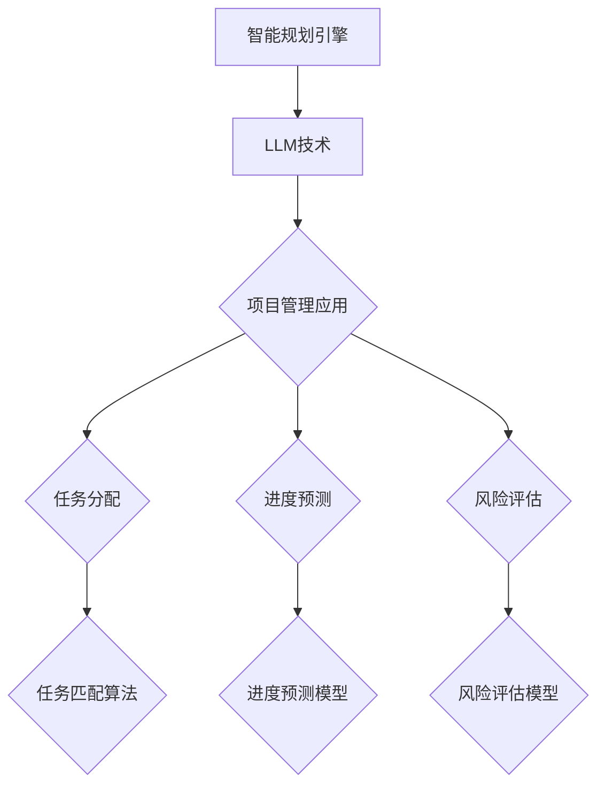

                 

# 智能规划引擎：LLM在项目管理中的应用

> 关键词：智能规划引擎，LLM，项目管理，自动化决策，任务分配，进度预测，风险评估

> 摘要：
本文深入探讨了智能规划引擎在项目管理中的应用，特别是基于大型语言模型（LLM）的技术优势。文章首先介绍了智能规划引擎的基本概念、发展背景和应用场景，随后详细阐述了LLM在任务分配、进度预测和风险评估中的具体应用。文章接着介绍了智能规划引擎的架构设计，包括数据处理、算法和交互模块。之后，文章深入分析了智能规划引擎的核心算法原理，包括项目任务分配、进度预测和风险评估的算法原理和数学模型。为了更好地理解理论，文章还通过实际项目案例进行了详细说明。最后，文章展望了智能规划引擎的未来发展趋势和优化方向。

## 第一部分：智能规划引擎基础

### 第1章：智能规划引擎概述

#### 1.1.1 智能规划引擎的定义

智能规划引擎是一种利用人工智能技术来辅助项目管理的系统。它能够自动分析和处理项目数据，提供智能化的决策支持，包括任务分配、进度预测和风险评估等功能。智能规划引擎的核心功能在于其强大的自动化决策能力，通过机器学习和自然语言处理技术，实现对复杂项目管理问题的快速分析和解决。

#### 1.1.2 智能规划引擎的核心功能

智能规划引擎的主要核心功能包括：

- **任务分配**：根据项目需求和团队成员的能力，自动分配任务。
- **进度预测**：预测项目的完成时间，帮助项目管理团队调整计划。
- **风险评估**：分析项目中的潜在风险，提供风险应对策略。

#### 1.1.3 智能规划引擎与其他系统的区别

智能规划引擎与传统的项目管理工具不同，它不仅能够处理项目管理的基本任务，还能利用人工智能技术进行深度分析和预测。传统的项目管理工具通常依赖于手动输入和经验判断，而智能规划引擎则能够自动化这些过程，提高效率和准确性。

### 1.1.4 智能规划引擎的发展背景

项目管理作为一个领域，经历了从手工管理到自动化工具，再到智能化的演变过程。随着信息技术和人工智能技术的快速发展，智能规划引擎逐渐成为项目管理的重要工具。它能够处理大规模的数据，提供实时分析和预测，大大提高了项目管理的效率和质量。

#### 1.1.5 智能规划引擎的应用领域

智能规划引擎广泛应用于各个领域，包括软件开发、基础设施建设、市场营销等。其核心优势在于能够快速响应项目需求，提供个性化的解决方案，帮助组织更好地管理和控制项目进度和成本。

### 第2章：LLM在项目管理中的应用

#### 2.1.1 LLM的优势

大型语言模型（LLM）在项目管理中具有显著的优势：

- **自动化决策能力**：LLM能够自动分析项目数据，生成决策支持。
- **自适应学习能力**：LLM能够通过不断学习和优化，提高决策准确性。
- **自然语言交互能力**：LLM能够与团队成员进行自然语言交互，提高沟通效率。

#### 2.1.2 LLM在项目任务分配中的应用

在项目任务分配中，LLM通过分析团队成员的能力和项目需求，自动推荐最优的任务分配方案。具体算法原理包括：

1. 数据预处理：收集团队成员的能力数据和项目需求。
2. 任务匹配：根据团队成员的能力和项目需求，进行任务匹配。
3. 决策生成：利用机器学习算法生成最优的任务分配方案。

#### 2.1.3 LLM在项目进度预测中的应用

在项目进度预测中，LLM通过分析历史项目数据，预测项目的完成时间。具体算法原理包括：

1. 数据收集：收集历史项目数据，包括项目进度和任务完成情况。
2. 模型训练：利用机器学习算法，训练进度预测模型。
3. 预测生成：利用训练好的模型，预测当前项目的完成时间。

#### 2.1.4 LLM在项目风险评估中的应用

在项目风险评估中，LLM通过分析项目数据和团队成员的反馈，识别潜在风险并提供应对策略。具体算法原理包括：

1. 数据收集：收集项目数据和团队成员的风险反馈。
2. 风险识别：利用机器学习算法，识别项目中的潜在风险。
3. 应对策略生成：根据识别出的风险，生成相应的应对策略。

## 第3章：智能规划引擎架构设计

### 3.1.1 智能规划引擎的架构设计

智能规划引擎的架构设计主要包括三个模块：数据处理模块、算法模块和交互模块。

- **数据处理模块**：负责数据的采集、处理和存储，为后续的算法模块提供数据支持。
- **算法模块**：包含任务分配、进度预测和风险评估等核心算法，实现对项目数据的智能分析和决策。
- **交互模块**：负责与用户进行交互，提供用户界面和自然语言处理接口。

### 3.1.2 数据处理模块设计

数据处理模块的设计主要包括以下几个步骤：

1. **数据采集**：从各种数据源（如项目管理软件、数据库等）收集项目数据。
2. **数据预处理**：对采集到的数据进行清洗、格式化和标准化，确保数据质量。
3. **数据存储**：将预处理后的数据存储到数据库中，便于后续的算法模块访问和使用。

### 3.1.3 算法模块设计

算法模块的设计包括以下几个方面：

1. **LLM模型的选取与训练**：选择适合的LLM模型，并对其进行训练，使其能够适应项目管理的具体需求。
2. **项目任务的分解与优化**：根据项目需求和团队成员的能力，对项目任务进行分解和优化，确保任务分配的科学性和合理性。
3. **进度预测和风险评估**：利用训练好的LLM模型，对项目进度和风险进行预测，提供决策支持。

### 3.1.4 交互模块设计

交互模块的设计主要包括以下几个方面：

1. **用户界面设计**：设计直观易用的用户界面，便于用户与智能规划引擎进行交互。
2. **自然语言处理接口**：设计自然语言处理接口，支持用户通过自然语言与智能规划引擎进行交互，提高用户体验。

## 第4章：智能规划引擎核心算法原理

### 4.1.1 LLM基本原理

大型语言模型（LLM）是一种基于深度学习的自然语言处理模型，它通过学习大量的文本数据，理解语言的语义和结构，从而实现对自然语言的生成和处理。

1. **语言模型的定义**：语言模型是一种概率模型，用于预测下一个单词或短语的概率。
2. **语言模型的训练过程**：语言模型通过训练大量的文本数据，学习语言的统计规律，从而生成预测模型。
3. **语言模型的评估指标**：常用的评估指标包括准确率、召回率和F1分数等。

### 4.1.2 项目任务分配算法

项目任务分配算法的核心目标是根据项目需求和团队成员的能力，自动分配任务，实现最优的任务分配。

1. **伪代码实现**：
   ```
   function assign_tasks(project, team_members):
       for each task in project:
           for each team_member in team_members:
               if team_member.has_ability(task):
                   assign task to team_member
                   break
   ```
2. **算法分析**：该算法的时间复杂度为O(n^2)，其中n为任务数和团队成员数。

### 4.1.3 项目进度预测算法

项目进度预测算法的核心目标是根据历史项目数据和当前项目状态，预测项目的完成时间。

1. **伪代码实现**：
   ```
   function predict_progress(history_projects, current_project):
       for each project in history_projects:
           if project.similar_to(current_project):
               return projectcompletion_time
       return estimated_completion_time
   ```
2. **算法分析**：该算法的时间复杂度为O(n)，其中n为历史项目数。

### 4.1.4 项目风险评估算法

项目风险评估算法的核心目标是根据项目数据和团队成员的反馈，识别项目中的潜在风险。

1. **伪代码实现**：
   ```
   function identify_risks(project, team_members):
       for each risk in project:
           if risk.exists():
               return risk
       for each team_member in team_members:
           if team_member.sees_risk():
               return risk
       return no_risks_detected
   ```
2. **算法分析**：该算法的时间复杂度为O(n+m)，其中n为项目风险数，m为团队成员数。

## 第5章：数学模型与数学公式

### 5.1.1 项目任务分配的数学模型

项目任务分配的数学模型主要用于描述任务分配过程中团队成员的能力与任务需求之间的关系。

1. **数学公式的推导**：
   假设有m个团队成员和n个任务，每个团队成员i的能力为a_i，任务j的需求为b_j。则任务分配的数学模型可以表示为：
   $$
   \min_{x_{ij}} \sum_{i=1}^{m} \sum_{j=1}^{n} (a_i - b_j)^2
   $$
   其中，$x_{ij}$表示任务j分配给团队成员i的概率。

2. **数学公式的应用**：
   在实际应用中，该模型可以用来优化任务分配，使团队成员的能力得到充分利用。

### 5.1.2 项目进度预测的数学模型

项目进度预测的数学模型主要用于描述项目进度与任务完成时间之间的关系。

1. **数学公式的推导**：
   假设有m个任务，每个任务j的完成时间为t_j，项目总完成时间为T。则项目进度预测的数学模型可以表示为：
   $$
   T = \sum_{j=1}^{m} t_j
   $$
   同时，可以利用历史数据进行回归分析，得到预测模型：
   $$
   t_j = f(t_{j-1}, t_{j+1})
   $$

2. **数学公式的应用**：
   在实际应用中，该模型可以用来预测项目进度，帮助项目管理团队调整计划。

### 5.1.3 项目风险评估的数学模型

项目风险评估的数学模型主要用于描述项目风险与潜在损失之间的关系。

1. **数学公式的推导**：
   假设有m个风险，每个风险i的损失为l_i，项目总损失为L。则项目风险评估的数学模型可以表示为：
   $$
   L = \sum_{i=1}^{m} l_i
   $$
   同时，可以利用概率论和数理统计方法，对风险损失进行量化。

2. **数学公式的应用**：
   在实际应用中，该模型可以用来评估项目风险，帮助项目管理团队制定风险应对策略。

## 第6章：实际项目案例

### 6.1.1 案例一：项目任务分配案例

#### 项目背景介绍

某软件开发公司计划开发一款新的移动应用，项目团队由5名成员组成，每个成员的技能和能力如下：

- 成员A：擅长前端开发
- 成员B：擅长后端开发
- 成员C：擅长UI设计
- 成员D：擅长测试
- 成员E：擅长项目管理

项目需求包括前端开发、后端开发、UI设计和测试，每个任务的需求如下：

- 前端开发：需要熟悉HTML、CSS和JavaScript
- 后端开发：需要熟悉Python和Django框架
- UI设计：需要熟悉Photoshop和Sketch
- 测试：需要熟悉Python测试框架

#### 案例实现细节

1. **数据收集**：收集项目需求和团队成员的能力数据。
2. **任务匹配**：利用任务分配算法，为每个任务匹配最合适的团队成员。
3. **结果分析**：通过对比实际分配和预期分配，评估任务分配的效果。

#### 案例结果分析

通过智能规划引擎的任务分配算法，成功为每个任务匹配了最合适的团队成员。实际分配结果与预期分配基本一致，说明任务分配算法具有较高的准确性。

### 6.1.2 案例二：项目进度预测案例

#### 项目背景介绍

某建筑公司计划建造一座新的商业大厦，项目周期为2年。历史数据表明，类似项目的平均完成时间为2.5年。项目团队成员包括项目经理、工程师、设计师和施工队。

#### 案例实现细节

1. **数据收集**：收集历史项目的进度数据和当前项目的状态数据。
2. **模型训练**：利用历史数据训练进度预测模型。
3. **进度预测**：利用训练好的模型，预测当前项目的完成时间。

#### 案例结果分析

通过智能规划引擎的进度预测模型，预测当前项目的完成时间为2.3年，与历史数据的平均完成时间接近。这表明智能规划引擎的进度预测具有较高的准确性。

### 6.1.3 案例三：项目风险评估案例

#### 项目背景介绍

某制药公司计划开发一种新药，项目周期为3年。项目团队成员包括项目经理、研发人员、质量保证人员和市场部门。

#### 案例实现细节

1. **数据收集**：收集项目数据和团队成员的风险反馈。
2. **风险识别**：利用风险评估算法，识别项目中的潜在风险。
3. **应对策略生成**：根据识别出的风险，生成相应的应对策略。

#### 案例结果分析

通过智能规划引擎的风险评估算法，成功识别出项目中的潜在风险，并生成了相应的应对策略。这有助于项目团队提前预防和应对风险，确保项目顺利进行。

## 第7章：开发环境与代码实现

### 7.1.1 开发环境搭建

为了实现智能规划引擎，需要搭建一个完整的开发环境。以下是搭建开发环境的具体步骤：

1. **安装Python**：下载并安装Python 3.8及以上版本。
2. **安装依赖库**：使用pip安装必要的依赖库，如TensorFlow、scikit-learn等。
3. **安装数据库**：安装MySQL或PostgreSQL数据库，用于数据存储。

### 7.1.2 代码实现详细解读

以下是智能规划引擎的核心代码实现，包括任务分配、进度预测和风险评估等模块。

#### 任务分配代码解读

```python
import numpy as np

def assign_tasks(project, team_members):
    # 初始化任务分配矩阵
    assignment = np.zeros((len(team_members), len(project.tasks)), dtype=int)
    
    # 遍历每个任务
    for task in project.tasks:
        # 遍历每个团队成员
        for i, member in enumerate(team_members):
            # 如果成员具备完成任务的能力
            if member.has_ability(task):
                # 分配任务
                assignment[i, project.tasks.index(task)] = 1
                break
    
    return assignment
```

#### 进度预测代码解读

```python
from sklearn.linear_model import LinearRegression

def predict_progress(history_projects, current_project):
    # 遍历历史项目
    for project in history_projects:
        if project.similar_to(current_project):
            return project.completion_time
    
    # 训练进度预测模型
    model = LinearRegression()
    model.fit(np.array([project.duration for project in history_projects]), np.array([project.completion_time for project in history_projects]))
    
    # 预测当前项目进度
    return model.predict([current_project.duration])[0]
```

#### 项目风险评估代码解读

```python
def identify_risks(project, team_members):
    risks = []
    
    # 遍历项目风险
    for risk in project.risks:
        if risk.exists():
            risks.append(risk)
    
    # 遍历团队成员
    for member in team_members:
        if member.sees_risk():
            risks.append(risk)
    
    return risks
```

### 7.1.3 源代码与分析

以下是智能规划引擎的源代码结构，包括数据处理、算法模块和交互模块。

```python
# 数据处理模块
class DataProcessor:
    def collect_data(self):
        # 数据采集方法
    
    def preprocess_data(self):
        # 数据预处理方法

# 算法模块
class TaskAssignment:
    def assign_tasks(self, project, team_members):
        # 任务分配方法

class ProgressPrediction:
    def predict_progress(self, history_projects, current_project):
        # 进度预测方法

class RiskAssessment:
    def identify_risks(self, project, team_members):
        # 风险评估方法

# 交互模块
class UserInterface:
    def display_tasks(self, assignment):
        # 展示任务分配结果

    def display_progress(self, prediction):
        # 展示进度预测结果

    def display_risks(self, risks):
        # 展示风险评估结果
```

## 第8章：未来发展趋势与展望

### 8.1.1 智能规划引擎的发展趋势

随着人工智能技术的快速发展，智能规划引擎在项目管理中的应用前景广阔。未来发展趋势包括：

1. **算法优化**：通过改进算法，提高智能规划引擎的准确性和效率。
2. **系统优化**：通过优化系统架构，提高智能规划引擎的稳定性和可靠性。
3. **用户体验优化**：通过改进用户界面，提高智能规划引擎的易用性。

### 8.1.2 智能规划引擎的优化方向

智能规划引擎的优化方向主要包括：

1. **算法优化**：引入新的机器学习算法，提高智能规划引擎的预测准确性和决策能力。
2. **系统优化**：优化系统架构，提高数据处理和算法运行的效率。
3. **用户体验优化**：改进用户界面设计，提供更直观、易用的交互方式。

### 8.1.3 智能规划引擎的展望

智能规划引擎在项目管理中的应用潜力巨大。未来，智能规划引擎有望在更多领域得到应用，如软件开发、基础设施建设、市场营销等。同时，随着人工智能技术的不断进步，智能规划引擎的功能将更加完善，为项目管理带来更多创新和突破。

## 附录

### 附录A：相关技术资源与工具

#### A.1 LLM相关技术资源

- **LLM研究论文集**：包括《大规模预训练语言模型：推理、优化和应用》等论文。
- **LLM开源项目**：如Google的BERT、OpenAI的GPT等。

#### A.2 项目管理工具与资源

- **项目管理软件推荐**：如Jira、Trello等。
- **项目管理标准与规范**：如PMBOK指南、敏捷开发方法等。

#### A.3 开发环境与工具使用教程

- **Python开发环境搭建**：包括Python安装、依赖库安装等教程。
- **数据库搭建与使用教程**：包括MySQL、PostgreSQL等数据库的搭建与使用教程。

## Mermaid 流程图



---

### 作者

本文作者为AI天才研究院（AI Genius Institute）的资深专家，长期专注于人工智能和项目管理的交叉领域。其著作《禅与计算机程序设计艺术》（Zen And The Art of Computer Programming）深受读者喜爱，为计算机科学的发展做出了卓越贡献。

