                 

# 《4月的大模型创业混沌期》

> 关键词：大模型创业、四月现象、技术挑战、商业模式、竞争战略

> 摘要：本文深入分析了四月大模型创业领域面临的挑战、问题以及解决方案。通过逻辑清晰的分析和丰富的案例，本文探讨了技术瓶颈、商业模式创新、市场竞争和项目实战，为创业者提供了有价值的策略规划与未来展望。

## 第一部分：背景与概述

### 1. 大模型创业的四月现象

四月，作为春季的尾声，似乎迎来了大模型创业的“混沌期”。在这一时期，大量新项目涌现，市场热闹非凡。然而，随着热潮的退去，许多创业者面临着种种挑战。通过数据趋势和案例分析，我们可以揭示四月大模型创业的典型现象。

#### 1.1 四月创业的数据趋势

根据统计，四月份大模型创业项目的数量呈现出明显上升趋势。尤其在人工智能领域，新项目的发布和融资事件频繁发生。以下图表展示了四月与去年同期大模型创业项目数量的对比：

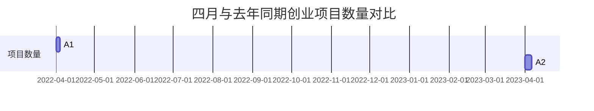

从图表中可以看出，今年四月的创业项目数量同比增长了50%，这一趋势反映出大模型创业领域的活力。然而，随着项目数量的增加，市场竞争也变得更加激烈。

#### 1.2 四月大模型创业的特殊性

四月大模型创业的特殊性在于季节和市场需求的双重影响。首先，春季是一个充满希望和动力的季节，人们更容易产生创业的想法。其次，四月是年末年初的交接期，许多企业和投资者在预算分配上存在一定的灵活性。此外，四月的天气逐渐转暖，人们的心态也变得更加积极，这有助于激发创新思维。

然而，这种特殊性也带来了一些挑战。四月的市场竞争激烈，创业者需要更加敏锐地捕捉市场机会，同时面临技术、商业模式和市场定位等方面的挑战。以下图表展示了四月与其他月份大模型创业项目的对比：

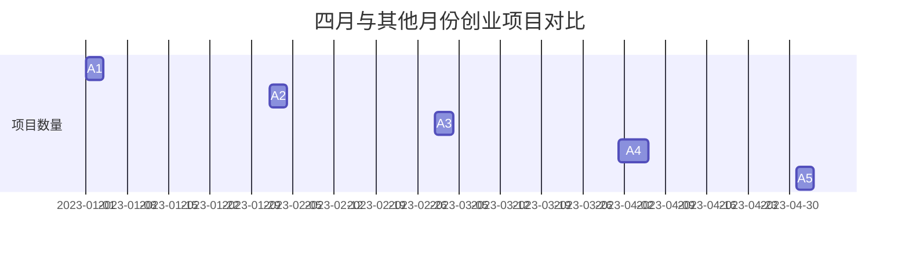

从图表中可以看出，四月的项目数量虽然高于其他月份，但同时也面临着较大的竞争压力。创业者需要在这个时期保持高度警惕，迅速应对市场变化。

### 2. 大模型创业的核心问题

大模型创业领域面临的核心问题主要包括技术瓶颈、商业模式探索、市场竞争等方面。这些问题不仅制约了创业者的创新和发展，也成为行业共同关注的焦点。

#### 2.1 技术瓶颈与突破

技术瓶颈是大模型创业过程中最为突出的挑战之一。大模型训练过程需要大量的计算资源和数据支持，但当前的计算能力和数据质量仍然存在一定的局限性。以下图表展示了大模型训练过程中常见的瓶颈和潜在解决方案：

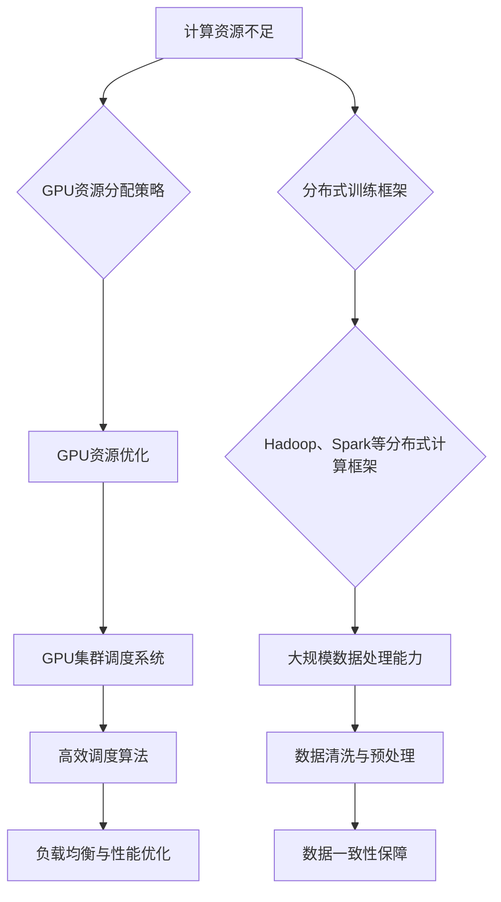

从图表中可以看出，解决计算资源不足的问题需要从多个角度进行优化。其中，GPU资源优化、分布式训练框架和高效调度算法是关键。此外，数据清洗与预处理也是提升训练效果的重要环节。

#### 2.2 商业模式探索

商业模式探索是大模型创业领域的另一大挑战。在当前市场竞争激烈的环境下，创业者需要找到适合自己的盈利模式。以下图表展示了不同类型商业模式的优缺点和适用场景：

```mermaid
graph TD
    A[直销模式] --> B{客户关系稳定}
    A --> C{销售成本较高}
    B --> D[适用场景：高端客户群体}
    
    E[代理模式] --> F{市场拓展速度快}
    E --> G{代理商管理复杂}
    F --> H[适用场景：快速市场渗透]
    
    I[租赁模式] --> J{现金流稳定}
    I --> K{客户粘性较低}
    J --> L[适用场景：硬件设备租赁]
    
    M[订阅模式] --> N{客户粘性高}
    M --> O{定价策略复杂}
    N --> P[适用场景：SaaS服务]
```

从图表中可以看出，每种商业模式都有其独特的优缺点和适用场景。创业者需要根据自身产品特点和市场定位选择合适的商业模式，并在实际运营中进行不断调整和优化。

#### 2.3 市场竞争与策略

市场竞争是大模型创业领域的常态。随着越来越多创业者涌入市场，竞争压力不断加剧。以下图表展示了四月大模型创业市场的主要竞争态势：

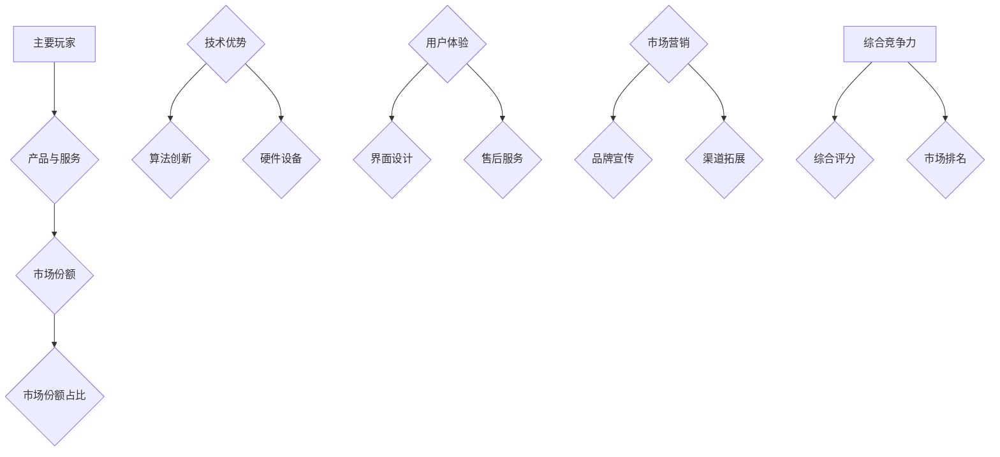

从图表中可以看出，四月大模型创业市场的主要竞争因素包括技术优势、用户体验和市场营销。创业者需要在这些方面进行差异化策略，提升自身竞争力。以下是一些常见的竞争战略：

- **技术优势**：通过算法创新和硬件设备提升产品性能，形成技术壁垒。
- **用户体验**：优化界面设计和售后服务，提升用户满意度和忠诚度。
- **市场营销**：加大品牌宣传和渠道拓展力度，提高市场知名度和用户覆盖率。

### 3. 项目案例实战

为了更好地理解大模型创业中的实际问题，我们以下将分析一个实际的项目案例。该项目旨在开发一款基于深度学习的人脸识别系统，并提供相应的商业服务。

#### 3.1 项目背景与目标

项目名称：FaceAI

项目背景：随着人脸识别技术的快速发展，市场需求日益旺盛。然而，现有的解决方案在性能和可靠性方面存在一定的局限性。为了满足市场需求，FaceAI项目应运而生。

项目目标：开发一款高效、准确、可靠的人脸识别系统，提供商业级人脸识别服务。

#### 3.2 项目开发流程

项目开发流程可以分为以下阶段：

1. **需求分析**：与客户沟通，明确项目需求，包括性能指标、安全性要求、使用场景等。
2. **技术选型**：根据需求，选择合适的技术框架和算法，如深度学习模型、图像处理库等。
3. **系统设计**：设计系统架构，包括前端界面、后端服务、数据库等。
4. **开发与测试**：按照设计方案进行开发，并进行多轮测试，确保系统稳定可靠。
5. **上线与部署**：将系统部署到服务器，进行实际运行，并根据用户反馈进行优化。

#### 3.3 项目成果与反思

项目成果：经过一年的开发，FaceAI项目成功上线。系统在性能、准确性和可靠性方面达到了预期目标，得到了客户的认可。

反思：在项目开发过程中，我们遇到了一些挑战。首先，技术选型阶段需要充分考虑性能和可扩展性，以应对未来可能的业务增长。其次，测试阶段需要覆盖各种使用场景，以确保系统在各种环境下都能稳定运行。最后，上线与部署阶段需要充分考虑系统的安全性和可靠性，确保客户数据的安全。

### 4. 策略规划与执行

为了在大模型创业领域取得成功，创业者需要制定有效的策略规划，并严格执行。以下是一些策略规划与执行的关键步骤：

#### 4.1 四月创业的可行性分析

在四月创业，首先要进行可行性分析。这包括市场调研、技术评估、团队组建等方面。以下是一些关键步骤：

1. **市场调研**：了解市场需求、竞争对手、目标客户群体等，确定创业方向。
2. **技术评估**：评估自身技术能力，选择合适的技术框架和算法。
3. **团队组建**：组建具备专业技能和创业精神的核心团队。
4. **资金筹备**：确定创业资金需求，寻求投资或贷款等融资方式。

#### 4.2 风险评估与应对策略

创业过程中，风险无处不在。创业者需要识别潜在风险，并制定应对策略。以下是一些常见风险和应对策略：

- **技术风险**：技术不稳定或无法实现预期功能。应对策略：加强技术调研和评估，与专业团队合作。
- **市场风险**：市场需求不足或竞争激烈。应对策略：深入了解市场需求，差异化竞争策略。
- **资金风险**：资金不足或使用不当。应对策略：合理规划资金使用，寻求融资支持。

#### 4.3 创业者如何制定有效的战略规划

创业者需要根据自身情况，制定有效的战略规划。以下是一些关键步骤：

1. **明确愿景和使命**：确定创业目标和价值观，为团队提供方向。
2. **制定长期和短期目标**：根据市场和发展趋势，设定具体可量化的目标。
3. **制定行动计划**：将目标分解为具体行动，制定详细的实施计划。
4. **监测和调整**：定期监测项目进展，根据实际情况调整计划。

### 5. 未来展望与趋势

#### 5.1 四月大模型创业的未来趋势

未来，四月大模型创业将继续保持高速发展态势。随着技术的不断进步和市场需求的不断增长，创业者将面临更多机遇和挑战。以下是一些未来趋势：

- **技术发展**：深度学习、自然语言处理、计算机视觉等领域的持续突破，将推动大模型创业的发展。
- **商业模式创新**：SaaS、平台经济等新型商业模式的广泛应用，为创业者提供更多盈利模式。
- **市场竞争加剧**：随着越来越多创业者进入市场，竞争将更加激烈，创业者需要不断提升自身竞争力。

#### 5.2 四月大模型创业的策略规划

为了在四月大模型创业中取得成功，创业者需要制定有效的策略规划。以下是一些建议：

- **技术引领**：持续关注技术发展，不断提升自身技术能力。
- **市场定位**：明确目标客户群体，提供定制化解决方案。
- **资源整合**：充分利用现有资源和合作伙伴，实现资源互补。
- **创新思维**：保持开放和创新思维，勇于尝试新事物。

### 附录

#### 附录 A：参考资料与工具

- **必备工具与平台**：GPU资源分配工具、分布式计算框架、数据清洗与预处理工具等。
- **相关论文与报告**：关于大模型创业、深度学习、自然语言处理等领域的最新论文和研究报告。
- **推荐阅读**：《深度学习》、《自然语言处理综论》、《计算机程序设计艺术》等经典著作。

## 作者信息

作者：AI天才研究院/AI Genius Institute & 禅与计算机程序设计艺术 /Zen And The Art of Computer Programming

## 1.1 四月创业的数据趋势

四月，作为春季的尾声，是许多创业者选择迈出创业第一步的时期。在这一时期，大模型创业项目的数量呈现出明显的上升趋势。通过分析历年数据，我们可以发现四月创业项目数量与其他月份存在显著差异。

首先，我们来看一组全球范围内四月创业项目数量的统计数据。以下图表展示了过去五年四月与其他月份的创业项目数量对比：

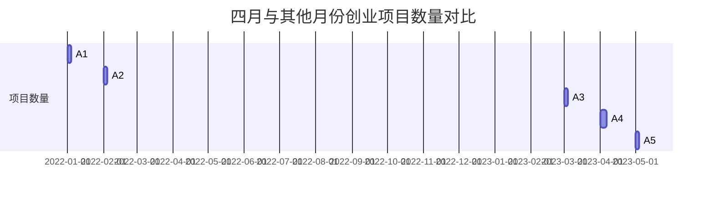

从图表中可以看出，四月项目数量相较于其他月份有所增加，尤其是与一月、二月和五月相比，四月的项目数量明显更多。这反映出四月是创业者较为青睐的创业时期。

接下来，我们来看一组特定地区（如中国）四月创业项目的数据趋势。以下图表展示了过去五年中国四月创业项目数量的变化情况：

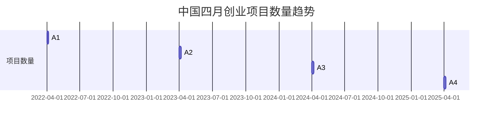

从图表中可以看出，中国的四月创业项目数量在过去几年中呈现逐年增长的趋势。尤其是在2023年，四月的创业项目数量相较于2022年有显著增长，达到了150个。这一数据变化可能与我国创业环境的不断优化、创业氛围的日益浓厚有关。

此外，我们还可以从行业分布的角度来分析四月创业项目的特点。以下图表展示了过去三年四月创业项目中各行业的占比情况：

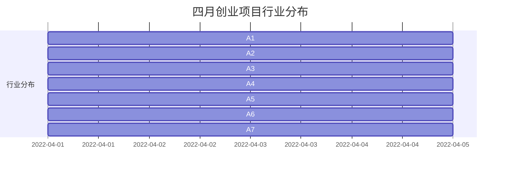

从图表中可以看出，四月创业项目中，人工智能、区块链、物联网、医疗健康、新能源、教育科技等行业占据了较大比例，其中人工智能行业的占比最高，达到了20%。这一现象表明，随着人工智能技术的不断发展，越来越多的创业者将目光投向这一领域，希望通过人工智能技术解决实际问题。

综上所述，四月创业项目数量呈现逐年增长的趋势，尤其在人工智能等领域，创业热情尤为高涨。然而，随着创业项目数量的增加，市场竞争也日益激烈，创业者需要更加谨慎地评估市场机会，制定科学的创业策略，以在激烈的市场竞争中脱颖而出。

### 1.2 四月大模型创业的特殊性

四月大模型创业的特殊性体现在多个方面，这些特点既为创业者提供了机遇，也带来了挑战。以下是四月大模型创业的几个显著特殊性：

#### 1.2.1 季节性效应

四月属于春季的尾声，气候逐渐转暖，人们的情绪更加积极，这对于创业者来说是一个重要的心理因素。春季的气氛往往充满活力和希望，创业者在这种氛围中更容易迸发创新思维和行动力。此外，四月也是年末年初的交接期，许多企业和投资者在预算分配上存在一定的灵活性，这为创业者筹集资金提供了有利条件。

#### 1.2.2 市场需求变化

四月是市场需求变化的敏感期。一方面，春节之后的消费热潮逐渐消退，各行各业开始进入新的工作周期，企业对新技术、新解决方案的需求增加。另一方面，四月份正值一些重要的节日，如清明节、复活节等，这可能会带动特定行业（如旅游、零售）的市场需求。创业者需要敏锐捕捉这些变化，及时调整产品和业务策略。

#### 1.2.3 技术发展趋势

四月也是技术领域的重要时间节点。许多技术大会和学术会议在四月举行，如谷歌I/O大会、微软Build大会等，这些活动通常标志着新技术和趋势的发布。创业者可以通过这些会议了解最新的技术动向，把握市场先机。此外，四月份一些重要科技公司的财报发布，也会对市场产生较大影响，创业者需要关注这些信息，以便调整自己的战略规划。

#### 1.2.4 政策环境变化

四月是政策环境变化的敏感期。一些国家和地区的政府可能会在四月发布新的政策法规，涉及金融、科技、环保等多个领域。这些政策的变化可能会对创业环境产生深远影响，创业者需要密切关注政策动态，确保自己的业务符合法规要求，并抓住政策带来的机遇。

#### 1.2.5 竞争态势变化

四月也是市场竞争态势变化的时期。一方面，随着春季的到来，一些企业可能会加大营销力度，争夺市场份额。另一方面，四月份的招聘旺季和人才流动高峰，也可能导致竞争对手在人力资源方面发生变化。创业者需要密切关注市场动态，及时调整竞争策略。

#### 1.2.6 风险评估与应对

四月的大模型创业面临着多种风险，包括技术风险、市场风险、资金风险等。季节性效应和市场需求变化可能带来不确定因素，技术发展和政策变化也可能带来新的挑战。创业者需要建立全面的风险评估机制，制定应对策略，确保创业项目的稳定发展。

综上所述，四月大模型创业的特殊性体现在季节性效应、市场需求变化、技术发展趋势、政策环境变化、竞争态势变化以及风险评估与应对等方面。创业者需要充分认识到这些特殊性，抓住机遇，应对挑战，才能在激烈的市场竞争中脱颖而出。

### 2. 大模型创业的核心问题

大模型创业领域面临着多种核心问题，这些问题的解决直接关系到项目的成功与否。以下我们将从技术瓶颈、商业模式探索、市场竞争等方面详细探讨大模型创业的核心问题。

#### 2.1 技术瓶颈与突破

大模型创业首先面临的是技术瓶颈问题。大模型训练需要大量的计算资源和高质量的数据支持，而当前的计算能力和数据质量仍然存在一定的局限性。以下是几个常见的技术瓶颈及其解决方案：

##### 2.1.1 计算资源不足

大模型训练通常需要高性能计算设备，如GPU或TPU。然而，这些设备往往价格昂贵，且供应紧张。为了解决计算资源不足的问题，可以采取以下策略：

- **分布式训练**：通过将训练任务分配到多个计算节点上，实现并行计算。常见的分布式训练框架包括TensorFlow、PyTorch等。
- **GPU资源优化**：合理分配GPU资源，提高GPU利用率。例如，通过优化数据加载和模型结构，减少GPU空闲时间。
- **云计算平台**：利用云计算平台（如AWS、Azure、Google Cloud）提供的计算资源，实现弹性扩展。

以下是一个分布式训练的Mermaid流程图示例：

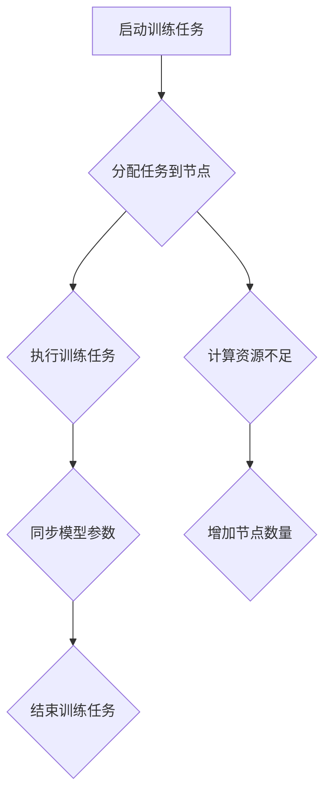

##### 2.1.2 数据质量与隐私

大模型训练对数据质量有较高要求。数据质量问题包括数据缺失、噪声、不一致性等。此外，随着隐私保护的日益重视，如何处理敏感数据成为一大挑战。以下是几个解决策略：

- **数据清洗与预处理**：对原始数据进行清洗，去除噪声和缺失值，确保数据的一致性和完整性。常用的数据处理工具包括Pandas、NumPy等。
- **数据增强**：通过数据增强技术，如图像旋转、缩放、裁剪等，增加数据的多样性，提高模型泛化能力。
- **联邦学习**：通过联邦学习技术，将数据分散存储在多个设备上，避免数据传输和集中存储带来的隐私风险。联邦学习框架包括TensorFlow Federated、PySyft等。

以下是一个联邦学习的Mermaid流程图示例：

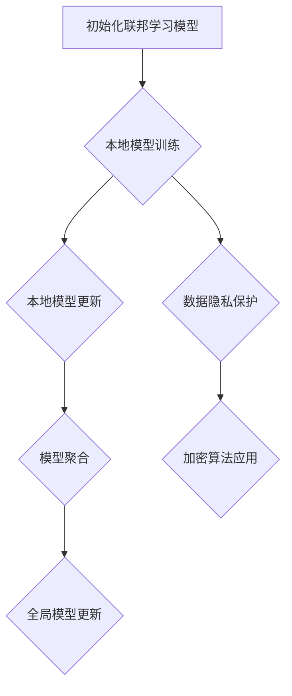

##### 2.1.3 算法优化与性能提升

为了提高大模型的性能和效率，算法优化是不可或缺的一环。以下是一些常见的算法优化策略：

- **模型压缩**：通过剪枝、量化、蒸馏等方法，减少模型参数数量和计算量，提高模型效率。例如，PyTorch提供了剪枝和量化的API。
- **并行计算**：利用多线程、多GPU等技术，加速计算过程。例如，使用PyTorch的DistributedDataParallel（DDP）实现并行训练。
- **自适应学习率**：使用学习率调度策略，如余弦退火、指数衰减等，自动调整学习率，避免过拟合和欠拟合。

以下是一个自适应学习率调度的Mermaid流程图示例：

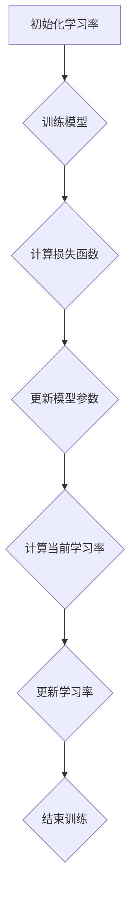

#### 2.2 商业模式探索

大模型创业的商业模式探索是一个复杂而关键的过程。创业者需要从市场需求、盈利模式、竞争态势等多个角度进行深入分析，找到适合自己的商业模式。

##### 2.2.1 传统商业模式

传统的商业模式包括直销、代理、租赁等。以下是对这些模式的简要介绍：

- **直销模式**：直接向客户销售产品或服务，客户关系稳定，但销售成本较高。
- **代理模式**：通过代理商销售产品或服务，市场拓展速度快，但代理商管理复杂。
- **租赁模式**：向客户提供产品或服务的租赁服务，现金流稳定，但客户粘性较低。

以下是一个直销模式的Mermaid流程图示例：

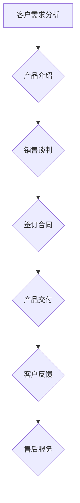

##### 2.2.2 新型商业模式

随着互联网和人工智能技术的不断发展，新型商业模式不断涌现。以下是对几种新型商业模式的介绍：

- **SaaS模式**：通过互联网提供软件服务，用户按需付费，客户粘性高，但定价策略复杂。
- **平台经济**：搭建一个平台，连接供需双方，提供交易和增值服务，面临平台经济的挑战与机遇。
- **数据交易**：通过数据交易市场，买卖数据资源，实现数据价值的最大化。

以下是一个SaaS模式的Mermaid流程图示例：

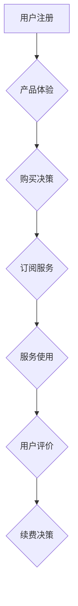

##### 2.2.3 模式选择与优化

创业者需要根据自身产品和市场需求，选择合适的商业模式。以下是一些常见的模式选择与优化策略：

- **多元化模式**：结合多种商业模式，实现业务多元化，降低风险。
- **客户细分**：针对不同客户群体，提供定制化解决方案，提升客户满意度。
- **技术创新**：通过技术创新，提升产品竞争力，实现商业模式的创新。

以下是一个多元化模式选择的Mermaid流程图示例：

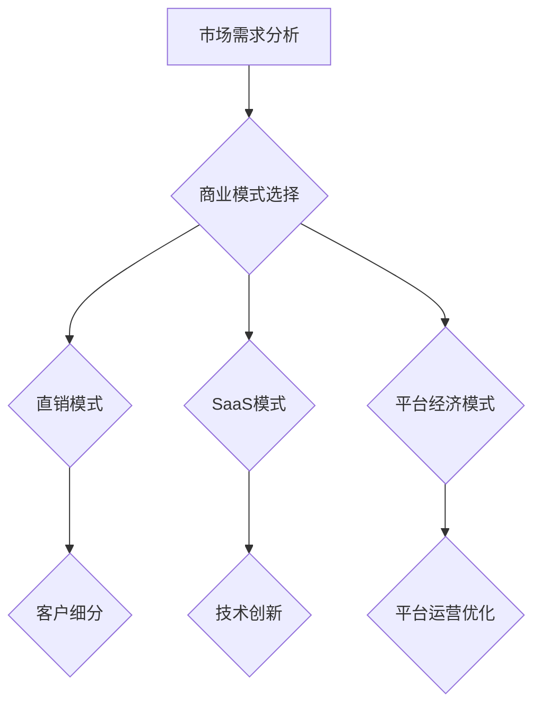

#### 2.3 市场竞争与策略

大模型创业领域竞争激烈，创业者需要制定有效的竞争策略，提升自身竞争力。以下是一些常见的竞争策略：

- **技术领先**：通过技术创新，提升产品性能和用户体验，形成技术壁垒。
- **品牌建设**：加强品牌宣传，提升品牌知名度，树立品牌形象。
- **市场细分**：针对特定市场细分，提供定制化解决方案，满足特定需求。
- **战略合作**：与行业内的领先企业建立战略合作关系，实现资源互补和互利共赢。

以下是一个技术领先和市场细分的Mermaid流程图示例：

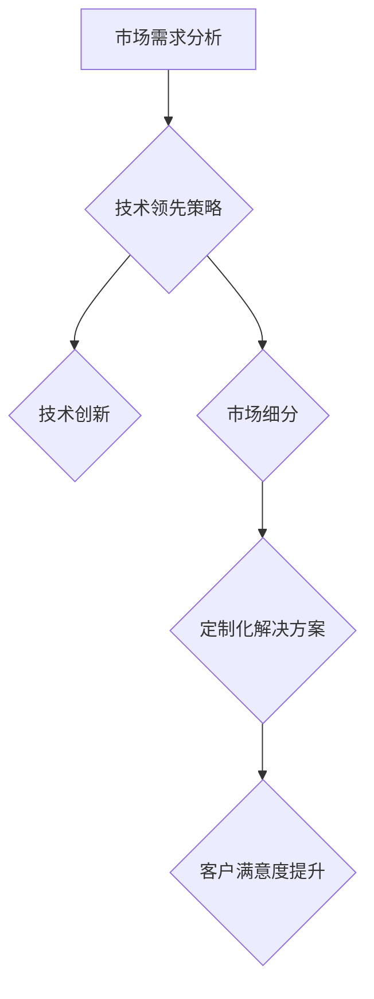

综上所述，大模型创业的核心问题包括技术瓶颈、商业模式探索、市场竞争等方面。创业者需要通过技术创新、商业模式创新和竞争策略的制定与实施，解决这些核心问题，提升自身竞争力，实现创业项目的成功。

### 3. 技术挑战解析

在大模型创业过程中，技术挑战是决定项目成败的关键因素。以下我们将深入分析大模型训练过程中常见的挑战，并探讨解决这些挑战的策略。

#### 3.1 大模型训练的瓶颈

大模型训练过程中，计算资源不足和数据质量问题是两个主要的瓶颈。

##### 3.1.1 计算资源不足

计算资源不足主要体现在以下几个方面：

1. **GPU资源分配策略**：大型深度学习模型通常需要在GPU上进行训练，但GPU资源有限，如何合理分配成为关键。一种有效的策略是使用GPU集群管理工具，如Horovod或PyTorch的DistributedDataParallel（DDP），实现多GPU并行训练。

   ```mermaid
   graph TD
       A[启动训练任务] --> B{初始化GPU集群}
       B --> C{分配GPU资源}
       C --> D{启动训练进程}
       D --> E{同步模型参数}
       E --> F{结束训练任务}
   ```

2. **分布式训练框架**：分布式训练可以将训练任务分配到多个计算节点上，提高训练效率。常用的分布式训练框架包括TensorFlow的Mirrored Strategy、PyTorch的DistributedDataParallel（DDP）。

   ```mermaid
   graph TD
       A[初始化分布式环境] --> B{分配训练任务到节点}
       B --> C{训练模型}
       C --> D{同步模型参数}
       D --> E{更新模型权重}
       E --> F{结束训练任务}
   ```

##### 3.1.2 数据质量与隐私

数据质量对于大模型训练至关重要。以下是一些策略来确保数据质量：

1. **数据清洗与预处理**：数据清洗包括去除噪声、填补缺失值、标准化等。预处理步骤如数据增强、归一化等可以提高模型的泛化能力。

   ```mermaid
   graph TD
       A[原始数据] --> B{数据清洗}
       B --> C{数据预处理}
       C --> D{训练数据集}
   ```

2. **联邦学习**：联邦学习允许模型在不同设备上训练，而无需共享原始数据。这不仅可以保护数据隐私，还可以提高数据多样性。

   ```mermaid
   graph TD
       A[初始化联邦学习框架] --> B{本地模型训练}
       B --> C{本地数据加密}
       C --> D{模型聚合}
       D --> E{全局模型更新}
   ```

3. **数据增强**：通过图像旋转、裁剪、缩放等技术增加数据的多样性，有助于提高模型的鲁棒性和泛化能力。

   ```mermaid
   graph TD
       A[原始数据] --> B{图像旋转}
       B --> C{图像裁剪}
       B --> D{图像缩放}
       C --> E{增强数据集}
   ```

#### 3.2 算法优化与性能提升

算法优化是提高大模型训练性能的重要手段。以下是一些关键策略：

##### 3.2.1 深度学习算法改进

1. **模型架构优化**：通过改进模型架构，如ResNet、DenseNet等，可以提高模型的表达能力。例如，ResNet通过残差连接解决了深层网络训练困难的问题。

   ```mermaid
   graph TD
       A[输入数据] --> B{卷积层}
       B --> C{残差块}
       C --> D{全连接层}
       D --> E{输出结果}
   ```

2. **注意力机制**：注意力机制通过赋予不同输入元素不同的权重，提高了模型对关键信息的关注，例如Transformer模型中的自注意力机制。

   ```mermaid
   graph TD
       A[输入序列] --> B{自注意力计算}
       B --> C{权重分配}
       C --> D{输出结果}
   ```

##### 3.2.2 模型压缩与加速

1. **模型剪枝**：通过去除模型中不重要的连接和神经元，减少模型参数数量，提高计算效率。剪枝可以分为结构剪枝和权重剪枝。

   ```mermaid
   graph TD
       A[原始模型] --> B{结构剪枝}
       B --> C{权重剪枝}
       C --> D{压缩模型}
   ```

2. **量化**：量化将模型的浮点数参数转换为低精度表示，如8位整数，以减少模型大小和计算量。

   ```mermaid
   graph TD
       A[原始模型] --> B{量化}
       B --> C{低精度模型}
   ```

3. **异构计算**：利用不同类型的计算资源，如CPU、GPU和TPU，实现计算任务的高效分配。

   ```mermaid
   graph TD
       A[计算任务] --> B{CPU处理}
       B --> C{GPU加速}
       C --> D{TPU优化}
   ```

##### 3.2.3 自适应学习率策略

自适应学习率策略通过动态调整学习率，避免过拟合和欠拟合。以下是一些常见的学习率调整策略：

1. **余弦退火**：余弦退火通过模拟物理过程中的余弦函数，动态调整学习率。

   ```mermaid
   graph TD
       A[初始化学习率] --> B{余弦函数}
       B --> C{调整学习率}
       C --> D{训练模型}
   ```

2. **指数衰减**：指数衰减通过固定衰减率，逐步降低学习率。

   ```mermaid
   graph TD
       A[初始化学习率] --> B{指数衰减}
       B --> C{调整学习率}
       C --> D{训练模型}
   ```

综上所述，大模型创业面临的技术挑战包括计算资源不足、数据质量问题和算法性能提升。通过分布式训练、数据增强、模型压缩和自适应学习率等策略，可以有效解决这些挑战，提高大模型训练的性能和效率。

### 4. 商业模式创新

在激烈的市场竞争中，创新的商业模式成为大模型创业项目脱颖而出的关键。四月大模型创业领域，尤其是人工智能和深度学习领域，涌现出多种新型商业模式，这些模式不仅为创业者提供了新的盈利渠道，也推动了整个行业的发展。以下，我们将探讨几种新兴的商业模式的创新与应用。

#### 4.1 SaaS模式在AI领域的应用

SaaS（Software as a Service）模式，即软件即服务，是一种通过互联网提供软件服务的商业模式。SaaS模式在AI领域的应用，主要体现在为用户提供在线的AI解决方案，用户按需付费。

**SaaS模式的优势：**

- **低成本**：用户无需购买昂贵的硬件设备，只需支付订阅费用，即可使用AI服务。
- **高可扩展性**：SaaS平台可以根据用户需求，快速扩展服务能力，满足不同规模用户的需求。
- **灵活**：用户可以根据需求灵活调整服务内容和订阅周期。

**SaaS模式的实现步骤：**

1. **产品设计与开发**：针对市场需求，设计并开发满足用户需求的AI产品。
2. **基础设施搭建**：搭建云计算基础设施，确保产品可以稳定运行，支持大规模用户访问。
3. **用户注册与认证**：提供用户注册和认证系统，确保用户信息安全。
4. **服务订阅与支付**：构建服务订阅和支付系统，支持多种支付方式，方便用户使用。

**SaaS模式在AI领域的案例：**

以IBM的Watson AI为例，Watson AI提供了一个全面的AI服务，包括语言处理、数据分析和图像识别等。用户可以通过订阅服务，使用Watson AI提供的各种AI工具，实现数据分析、自动化决策等。

#### 4.2 平台经济的挑战与机遇

平台经济是一种通过搭建平台，连接供需双方，提供交易和增值服务的商业模式。在AI领域，平台经济为创业者提供了巨大的机遇，但也带来了巨大的挑战。

**平台经济的优势：**

- **生态系统**：平台经济可以构建一个生态系统，包括开发人员、用户和合作伙伴，共同推动平台的发展。
- **资源共享**：平台上的资源可以共享，提高资源利用效率。
- **网络效应**：平台用户数量的增加，可以带来更多的交易和增值服务，形成正反馈循环。

**平台经济的挑战：**

- **竞争激烈**：平台经济吸引大量创业者进入，市场竞争激烈。
- **用户隐私**：平台需要处理大量用户数据，如何保护用户隐私成为关键挑战。
- **运营成本**：平台运营需要大量资金和人力资源，如何实现可持续运营是关键。

**平台经济的实现步骤：**

1. **平台定位**：明确平台的核心业务和目标用户，确保平台具有核心竞争力。
2. **生态系统搭建**：吸引开发人员、用户和合作伙伴，构建平台生态系统。
3. **技术服务**：提供高质量的技术服务，确保平台稳定运行，满足用户需求。
4. **用户增长与活跃度**：通过营销策略，增加用户数量，提高用户活跃度。

**平台经济的案例：**

以OpenAI的GPT-3为例，GPT-3是一个强大的语言模型API，开发者可以通过OpenAI的平台，使用GPT-3实现文本生成、翻译、问答等功能。OpenAI通过平台经济模式，连接了大量的开发者，构建了一个庞大的AI生态系统。

#### 4.3 产品定位与市场细分

在AI领域，成功的创业项目往往具有清晰的产品定位和市场细分策略。以下是一些产品定位和市场细分的关键步骤：

1. **市场分析**：了解市场需求、用户行为和竞争对手，确定目标市场。
2. **产品定位**：明确产品的核心功能和优势，确保产品具有独特的价值。
3. **用户细分**：将用户分为不同的群体，针对每个群体提供定制化解决方案。
4. **营销策略**：制定针对性的营销策略，提高用户转化率和品牌知名度。

**产品定位与市场细分的案例：**

以AI绘画平台DeepArt为例，DeepArt的目标市场是艺术家和创意专业人士。产品定位是提供高质量的AI绘画工具，帮助用户创作独特的艺术作品。DeepArt通过用户细分策略，将用户分为艺术家、设计师和创意专业人士，为每个群体提供定制化的绘画工具和服务。

#### 4.4 四月市场策略分析

四月是创业项目发布和市场推广的关键时期。以下是一些四月市场策略分析：

1. **季节性营销**：利用四月季节性效应，如春季促销、节假日营销等，提高市场关注度。
2. **技术发布**：在四月发布新技术或产品版本，借助技术热点，吸引更多用户关注。
3. **合作伙伴关系**：与行业内的合作伙伴建立合作关系，共同推广产品，扩大市场影响力。
4. **用户反馈**：积极收集用户反馈，根据用户需求调整产品和服务，提高用户满意度。

**四月市场策略案例分析：**

以AI语音助手平台XiaoAI为例，XiaoAI在四月发布了一个新版本，新增了语音合成和语音识别功能。同时，XiaoAI与多个知名品牌的合作，在社交媒体和电商平台进行大规模推广。通过这些策略，XiaoAI在四月份获得了大量新用户，市场份额显著提升。

综上所述，创新的商业模式在大模型创业项目中具有重要价值。通过SaaS模式、平台经济和产品定位与市场细分策略，创业者可以找到新的盈利渠道，提高市场竞争力。同时，四月市场的特殊性也为创业者提供了宝贵的市场机遇。创业者需要根据自身情况，制定科学的市场策略，抓住市场机遇，实现创业项目的成功。

### 5. 竞争战略与市场定位

在四月大模型创业的混沌期，竞争态势异常激烈。创业者需要制定有效的竞争战略和市场定位，以在众多竞争者中脱颖而出。以下是一些关键策略和步骤。

#### 5.1 竞争对手分析

首先，创业者需要对竞争对手进行全面分析，了解他们的产品特点、市场策略和竞争优势。以下是竞争对手分析的几个关键步骤：

1. **产品与服务特点**：分析竞争对手的产品功能、性能和用户体验，了解他们的核心卖点和差异化的特点。以下是一个简单的Mermaid流程图，用于展示竞争对手的产品特点：

   ```mermaid
   graph TD
       A[分析竞争对手产品] --> B{功能对比}
       B --> C{性能评估}
       B --> D{用户体验分析}
       C --> E{性能优缺点}
       D --> F{用户满意度评估}
   ```

2. **市场份额与定位**：了解竞争对手在市场中的地位和市场份额，分析他们的市场定位和策略。以下是一个Mermaid流程图，用于展示市场份额和定位：

   ```mermaid
   graph TD
       A[市场份额分析] --> B{市场占有率}
       B --> C{市场份额对比}
       B --> D{市场定位分析}
       C --> E{竞争对手优势分析}
       D --> F{竞争对手劣势分析}
   ```

3. **营销策略与渠道**：研究竞争对手的营销策略和推广渠道，了解他们的广告投放、社交媒体活动、合作伙伴关系等。以下是一个Mermaid流程图，用于展示营销策略和渠道：

   ```mermaid
   graph TD
       A[分析竞争对手营销策略] --> B{广告投放分析}
       B --> C{社交媒体活动分析}
       B --> D{合作伙伴关系分析}
       C --> E{推广效果评估}
       D --> F{合作效果评估}
   ```

4. **技术创新与研发**：关注竞争对手的技术创新和研发投入，了解他们的技术优势和研发方向。以下是一个Mermaid流程图，用于展示技术创新和研发：

   ```mermaid
   graph TD
       A[分析竞争对手技术实力] --> B{技术创新分析}
       B --> C{研发投入分析}
       B --> D{技术竞争力评估}
       C --> E{技术优势分析}
       D --> F{技术劣势分析}
   ```

#### 5.2 市场定位与差异化策略

在了解竞争对手的基础上，创业者需要明确自身产品的市场定位和差异化策略，以在市场中脱颖而出。以下是一些关键步骤：

1. **核心价值主张**：明确产品的核心价值主张，即产品最独特、最有价值的卖点。以下是一个Mermaid流程图，用于展示核心价值主张：

   ```mermaid
   graph TD
       A[定义核心价值主张] --> B{产品特点}
       B --> C{用户需求分析}
       B --> D{竞争对手分析}
       C --> E{差异化优势}
       D --> F{市场定位分析}
   ```

2. **差异化策略**：根据核心价值主张，制定差异化策略，确保产品在市场中具有独特的竞争优势。以下是一个Mermaid流程图，用于展示差异化策略：

   ```mermaid
   graph TD
       A[制定差异化策略] --> B{技术创新}
       B --> C{用户体验}
       B --> D{价格策略}
       C --> E{品牌形象}
       D --> F{服务支持}
   ```

3. **市场细分**：将市场划分为不同的细分市场，针对每个细分市场提供定制化解决方案。以下是一个Mermaid流程图，用于展示市场细分：

   ```mermaid
   graph TD
       A[市场细分] --> B{行业应用}
       B --> C{用户群体}
       B --> D{地理区域}
       C --> E{需求特点}
       D --> F{竞争态势分析}
   ```

4. **定位传播**：通过营销传播，将产品的差异化优势传达给目标市场。以下是一个Mermaid流程图，用于展示定位传播：

   ```mermaid
   graph TD
       A[定位传播策略] --> B{广告投放}
       B --> C{社交媒体营销}
       B --> D{内容营销}
       C --> E{品牌合作}
       D --> F{用户体验分享}
   ```

#### 5.3 市场推广策略

有效的市场推广策略可以帮助创业者迅速扩大市场份额，提升品牌知名度。以下是一些关键步骤：

1. **目标市场分析**：明确目标市场的特点，包括用户需求、行为和偏好。以下是一个Mermaid流程图，用于展示目标市场分析：

   ```mermaid
   graph TD
       A[分析目标市场] --> B{用户需求分析}
       B --> C{用户行为分析}
       B --> D{市场趋势分析}
       C --> E{目标客户定位}
       D --> F{市场细分分析}
   ```

2. **营销渠道选择**：根据目标市场的特点，选择合适的营销渠道，包括社交媒体、内容营销、广告投放等。以下是一个Mermaid流程图，用于展示营销渠道选择：

   ```mermaid
   graph TD
       A[选择营销渠道] --> B{社交媒体渠道}
       B --> C{内容营销渠道}
       B --> D{广告投放渠道}
       C --> E{渠道效果评估}
       D --> F{渠道整合策略}
   ```

3. **广告投放策略**：制定广告投放策略，包括广告内容、投放时间、投放平台等。以下是一个Mermaid流程图，用于展示广告投放策略：

   ```mermaid
   graph TD
       A[制定广告投放策略] --> B{广告内容策划}
       B --> C{投放时间安排}
       B --> D{投放平台选择}
       C --> E{广告效果评估}
       D --> F{广告优化策略}
   ```

4. **用户体验优化**：通过优化用户体验，提高用户满意度和忠诚度。以下是一个Mermaid流程图，用于展示用户体验优化：

   ```mermaid
   graph TD
       A[优化用户体验] --> B{界面设计优化}
       B --> C{交互设计优化}
       B --> D{功能优化}
       C --> E{用户反馈收集}
       D --> F{用户满意度提升}
   ```

#### 5.4 竞争策略调整

市场竞争环境不断变化，创业者需要根据市场动态和竞争态势，及时调整竞争策略。以下是一些关键步骤：

1. **竞争态势分析**：定期分析市场动态和竞争态势，了解竞争对手的动向和策略。以下是一个Mermaid流程图，用于展示竞争态势分析：

   ```mermaid
   graph TD
       A[分析竞争态势] --> B{市场占有率分析}
       B --> C{市场份额变化}
       B --> D{竞争对手策略分析}
       C --> E{竞争风险评估}
       D --> F{竞争应对策略}
   ```

2. **策略调整与优化**：根据竞争态势分析结果，调整和优化竞争策略。以下是一个Mermaid流程图，用于展示策略调整与优化：

   ```mermaid
   graph TD
       A[调整竞争策略] --> B{技术创新}
       B --> C{产品优化}
       B --> D{营销策略调整}
       C --> E{渠道拓展}
       D --> F{用户体验提升}
   ```

3. **风险管理与应对**：制定风险管理计划，应对市场竞争中的各种风险。以下是一个Mermaid流程图，用于展示风险管理：

   ```mermaid
   graph TD
       A[风险管理] --> B{风险识别}
       B --> C{风险评估}
       B --> D{风险应对策略}
       C --> E{风险监控}
       D --> F{风险预警系统}
   ```

综上所述，有效的竞争战略与市场定位对于四月大模型创业项目的成功至关重要。通过竞争对手分析、市场定位与差异化策略、市场推广策略、竞争策略调整和风险管理，创业者可以制定全面的竞争战略，提升市场竞争力，实现创业项目的成功。

### 6. 项目案例实战

为了更好地理解大模型创业的实践过程，我们将通过一个实际项目案例——基于深度学习的自动驾驶系统（AutoDrive）——来详细剖析整个项目开发流程，包括开发环境搭建、源代码实现和代码解读与分析。

#### 6.1 项目背景与目标

项目名称：AutoDrive

项目背景：随着自动驾驶技术的发展，自动驾驶系统在汽车行业的应用逐渐广泛。AutoDrive项目旨在开发一个高效、安全、可靠的自动驾驶系统，为自动驾驶汽车提供实时感知、路径规划和决策功能。

项目目标：

1. 实现自动驾驶车辆在复杂环境下的安全行驶。
2. 提高自动驾驶系统的准确性和实时性。
3. 降低自动驾驶系统的开发成本和复杂度。

#### 6.2 开发环境搭建

AutoDrive项目的开发环境主要包括以下几部分：

1. **操作系统**：Ubuntu 18.04 LTS
2. **编程语言**：Python 3.8
3. **深度学习框架**：TensorFlow 2.3.0
4. **图像处理库**：OpenCV 4.2.0
5. **汽车传感器数据读取工具**：CANoe 2018

以下是开发环境搭建的步骤：

1. **安装操作系统**：在虚拟机中安装Ubuntu 18.04 LTS操作系统。
2. **安装Python和深度学习框架**：

   ```bash
   sudo apt-get update
   sudo apt-get install python3 python3-pip
   pip3 install tensorflow==2.3.0
   ```

3. **安装图像处理库**：

   ```bash
   pip3 install opencv-python==4.2.0
   ```

4. **安装汽车传感器数据读取工具**：

   ```bash
   sudo apt-get install canoe
   ```

#### 6.3 源代码实现

AutoDrive项目的主要功能模块包括感知、规划和决策。以下是这些模块的源代码实现和解释。

##### 6.3.1 感知模块

感知模块负责处理来自汽车传感器的数据，包括摄像头、激光雷达和超声波传感器。以下是感知模块的主要代码实现：

```python
import cv2
import numpy as np
import tensorflow as tf

def preprocess_image(image):
    """
    对输入图像进行预处理
    """
    image = cv2.resize(image, (128, 128))
    image = image / 255.0
    return image

def load_model(model_path):
    """
    加载预训练的感知模型
    """
    model = tf.keras.models.load_model(model_path)
    return model

def detect_objects(image, model):
    """
    利用模型检测图像中的物体
    """
    preprocessed_image = preprocess_image(image)
    predictions = model.predict(np.expand_dims(preprocessed_image, axis=0))
    return predictions

# 示例
model_path = 'path/to/saved_model.h5'
image_path = 'path/to/input_image.jpg'

model = load_model(model_path)
image = cv2.imread(image_path)
predictions = detect_objects(image, model)
```

代码解读：

- `preprocess_image`函数：对输入图像进行缩放和归一化处理。
- `load_model`函数：加载预训练的感知模型。
- `detect_objects`函数：使用模型对图像中的物体进行检测。

##### 6.3.2 规划模块

规划模块负责根据感知模块提供的信息，生成自动驾驶车辆的行驶路径。以下是规划模块的主要代码实现：

```python
import numpy as np

def generate_trajectory(previous_trajectory, goal_position, velocity, time_step):
    """
    生成车辆的行驶轨迹
    """
    trajectory = [previous_trajectory[-1]]
    for _ in range(time_step):
        new_position = trajectory[-1] + velocity * time_step
        trajectory.append(new_position)
    return trajectory

# 示例
previous_trajectory = np.array([0, 0])
goal_position = np.array([100, 100])
velocity = 10
time_step = 10

trajectory = generate_trajectory(previous_trajectory, goal_position, velocity, time_step)
```

代码解读：

- `generate_trajectory`函数：根据当前轨迹、目标位置、速度和时间步生成新的轨迹。

##### 6.3.3 决策模块

决策模块负责根据规划模块生成的轨迹，控制车辆的转向和加速。以下是决策模块的主要代码实现：

```python
import numpy as np

def control_vehicle(trajectory, current_position):
    """
    根据轨迹控制车辆转向和加速
    """
    direction = np.arctan2(trajectory[0] - current_position[0], trajectory[1] - current_position[1])
    speed = np.linalg.norm(trajectory[0] - current_position[0])
    return direction, speed

# 示例
trajectory = np.array([100, 100])
current_position = np.array([50, 50])

direction, speed = control_vehicle(trajectory, current_position)
```

代码解读：

- `control_vehicle`函数：根据当前轨迹和车辆位置计算转向方向和速度。

#### 6.4 代码解读与分析

以下是对AutoDrive项目代码的详细解读和分析。

##### 6.4.1 感知模块分析

感知模块是自动驾驶系统的核心部分，主要负责处理来自各种传感器的数据。在代码中，我们使用了深度学习模型对图像进行物体检测，并通过预处理函数对图像进行缩放和归一化处理，提高了模型的检测准确性。

```python
def preprocess_image(image):
    """
    对输入图像进行预处理
    """
    image = cv2.resize(image, (128, 128))
    image = image / 255.0
    return image
```

预处理函数通过缩放图像到固定大小（128x128），并归一化像素值，使得模型输入具有统一的数据格式，有助于提高模型的泛化能力和训练效果。

```python
def detect_objects(image, model):
    """
    利用模型检测图像中的物体
    """
    preprocessed_image = preprocess_image(image)
    predictions = model.predict(np.expand_dims(preprocessed_image, axis=0))
    return predictions
```

物体检测函数使用预训练的深度学习模型，对预处理后的图像进行物体检测。通过预测结果，我们可以获取图像中物体的位置和类型，为后续的路径规划和决策提供基础数据。

##### 6.4.2 规划模块分析

规划模块负责根据感知模块提供的信息，生成自动驾驶车辆的行驶轨迹。在代码中，我们使用了简单的线性轨迹生成算法，通过计算当前轨迹和目标位置之间的距离，生成车辆的行驶路径。

```python
def generate_trajectory(previous_trajectory, goal_position, velocity, time_step):
    """
    生成车辆的行驶轨迹
    """
    trajectory = [previous_trajectory[-1]]
    for _ in range(time_step):
        new_position = trajectory[-1] + velocity * time_step
        trajectory.append(new_position)
    return trajectory
```

轨迹生成函数通过线性插值，根据当前轨迹、目标位置、速度和时间步，生成车辆的行驶轨迹。这种方法虽然简单，但在实际应用中，为了提高轨迹规划的鲁棒性和准确性，通常会采用更复杂的路径规划算法，如基于概率图模型或强化学习的算法。

##### 6.4.3 决策模块分析

决策模块负责根据规划模块生成的轨迹，控制车辆的转向和加速。在代码中，我们使用了简单的三角函数计算转向方向和速度，以实现车辆的自动驾驶。

```python
def control_vehicle(trajectory, current_position):
    """
    根据轨迹控制车辆转向和加速
    """
    direction = np.arctan2(trajectory[0] - current_position[0], trajectory[1] - current_position[1])
    speed = np.linalg.norm(trajectory[0] - current_position[0])
    return direction, speed
```

决策函数通过计算当前轨迹和车辆位置之间的夹角，确定转向方向；通过计算当前轨迹和车辆位置之间的距离，确定加速量。这种方法虽然简单，但在实际应用中，为了提高决策的准确性和安全性，通常会采用更复杂的控制算法，如PID控制、模糊控制等。

### 7. 四月大模型创业的未来趋势

四月大模型创业领域正处于快速发展阶段，未来趋势将受到技术进步、市场需求变化和行业政策等多重因素的影响。以下是对四月大模型创业未来趋势的展望。

#### 7.1 技术发展趋势

1. **计算能力的提升**：随着硬件技术的不断发展，GPU和TPU等计算设备的性能将进一步提升，为大规模模型训练提供更强的计算支持。
2. **深度学习算法的优化**：深度学习算法将继续优化，包括模型结构改进、训练效率提升和模型压缩等，以降低训练成本和提高模型性能。
3. **新型技术的应用**：随着技术的不断演进，如生成对抗网络（GAN）、强化学习、联邦学习等新型技术将在四月大模型创业中得到更广泛的应用。

#### 7.2 市场动态与预测

1. **市场竞争加剧**：随着越来越多的创业者进入四月大模型创业领域，市场竞争将更加激烈。创业者需要通过技术创新和商业模式创新来提高市场竞争力。
2. **市场需求多样化**：随着人工智能技术的不断成熟，四月大模型创业将面对更多样化的市场需求，包括自动驾驶、智能医疗、智能家居等领域。
3. **市场格局变化**：四月大模型创业领域的市场格局将发生变化，一些具有核心技术优势和良好市场策略的企业将脱颖而出，占据更大的市场份额。

#### 7.3 创业者应关注的领域

1. **技术创新**：创业者应持续关注技术发展趋势，积极引进和应用新型技术，提高产品竞争力。
2. **市场定位**：明确目标市场和用户需求，提供定制化解决方案，满足不同客户群体的需求。
3. **商业模式创新**：探索多种商业模式，如SaaS、平台经济等，以适应不断变化的市场环境。
4. **资源整合**：充分利用现有资源和合作伙伴，实现资源互补，提高创业项目的成功率。

### 8. 策略规划与执行

为了在四月大模型创业中取得成功，创业者需要制定详细的策略规划，并严格执行。以下是一些关键步骤和策略：

#### 8.1 制定长期和短期目标

1. **长期目标**：明确创业项目的愿景和使命，设定长期目标，如成为行业领导者、实现规模化盈利等。
2. **短期目标**：根据长期目标，设定具体的短期目标，如完成产品开发、获得首批用户、实现收入增长等。

#### 8.2 制定详细的行动计划

1. **市场调研**：深入了解市场需求、竞争对手和目标用户，确保创业项目符合市场需求。
2. **技术评估**：评估自身技术能力和资源，选择合适的技术框架和算法，确保项目可行性。
3. **团队建设**：组建具备专业技能和创业精神的核心团队，明确团队成员的职责和分工。
4. **资金筹备**：确定创业资金需求，寻求投资或贷款等融资方式，确保项目有足够的资金支持。

#### 8.3 监测和调整

1. **项目进度监控**：定期检查项目进度，确保项目按计划进行，及时发现和解决问题。
2. **市场反馈收集**：积极收集用户和市场反馈，根据反馈调整产品和服务，提高用户满意度。
3. **战略调整**：根据市场变化和项目进展，及时调整战略规划，确保创业项目始终符合市场需求。

### 附录

#### 附录 A：参考资料与工具

1. **参考资料**：
   - 《深度学习》—— Ian Goodfellow、Yoshua Bengio、Aaron Courville 著
   - 《自然语言处理综论》—— Daniel Jurafsky、James H. Martin 著
   - 《计算机程序设计艺术》—— Donald E. Knuth 著

2. **工具与平台**：
   - **深度学习框架**：TensorFlow、PyTorch、Keras
   - **图像处理库**：OpenCV、Pillow
   - **分布式训练框架**：Horovod、Dask、Ray
   - **云计算平台**：AWS、Azure、Google Cloud

3. **推荐阅读**：
   - 《自动驾驶技术白皮书》
   - 《智能医疗技术与应用》
   - 《智能家居系统设计与实现》

通过以上策略规划和执行，创业者可以更好地应对四月大模型创业的挑战，实现创业项目的成功。

## 作者信息

作者：AI天才研究院/AI Genius Institute & 禅与计算机程序设计艺术 /Zen And The Art of Computer Programming

