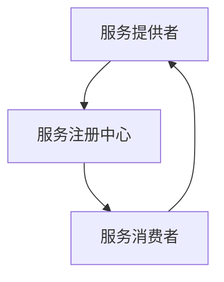
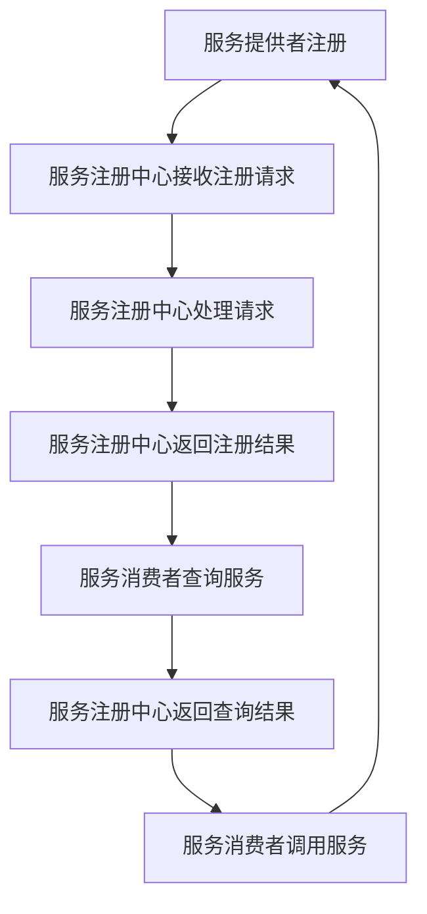

                 

# 服务注册中心的实例应用

> 关键词：服务注册中心，微服务，分布式系统，架构设计，实践应用，安全性

> 摘要：本文将探讨服务注册中心的概念、架构、算法和实际应用。通过详细分析服务注册中心的实例，我们将了解其在企业级服务化架构、互联网行业、金融行业的应用，以及未来发展趋势。文章将采用一步一步分析推理的方式，帮助读者深入理解服务注册中心的核心原理和实践。

## 目录

### 第一部分：服务注册中心基础

#### 第1章：服务注册中心概述

#### 第2章：服务注册中心的核心组件与架构

#### 第3章：服务注册中心的核心算法与原理

#### 第4章：服务注册中心的实践应用

### 第二部分：服务注册中心的实例应用

#### 第5章：服务注册中心在企业级服务化架构中的应用

#### 第6章：服务注册中心在互联网行业的应用

#### 第7章：服务注册中心在金融行业的应用

#### 第8章：服务注册中心的未来发展趋势

#### 第9章：服务注册中心的最佳实践与案例分析

#### 第10章：服务注册中心的未来展望与挑战

#### 附录

### Mermaid 流�程图

### 核心算法原理讲解

### 数学模型和数学公式

### 项目实战

## 第一部分：服务注册中心基础

### 第1章：服务注册中心概述

#### 1.1 服务注册中心的重要性

服务注册中心是分布式系统中至关重要的一环，它主要用于服务提供者和服务消费者之间的通信协调。在分布式系统中，服务数量众多，且动态变化，服务注册中心能够实时记录和更新服务的状态信息，使得服务消费者能够快速、准确地发现并调用所需的服务。

服务注册中心的重要性体现在以下几个方面：

1. **服务发现**：服务消费者可以通过服务注册中心发现服务提供者的地址和端口，实现服务的调用。
2. **负载均衡**：服务注册中心可以根据服务的状态和负载情况，动态地分配服务调用，从而实现负载均衡。
3. **服务治理**：服务注册中心可以记录服务的版本信息、依赖关系等，方便进行服务的治理和管理。
4. **容错与恢复**：服务注册中心可以监控服务的状态，一旦发现服务异常，可以及时进行服务切换和恢复。

#### 1.2 服务注册中心的基本概念

服务注册中心（Service Registry）是一种分布式系统组件，它主要用于管理服务提供者和服务消费者的注册、发现和调用。服务注册中心的核心概念包括：

1. **服务提供者**：提供服务的实体，它将自己的服务信息注册到服务注册中心，以便其他服务消费者发现和调用。
2. **服务消费者**：调用服务的实体，它通过服务注册中心获取服务提供者的信息，并调用服务。
3. **服务注册**：服务提供者将服务信息（如服务名、地址、端口等）注册到服务注册中心的过程。
4. **服务发现**：服务消费者通过服务注册中心获取服务提供者的信息，以便进行服务调用的过程。
5. **服务调用**：服务消费者通过服务注册中心发现服务提供者的信息后，进行服务调用的过程。

#### 1.3 服务注册中心的发展历程

服务注册中心的发展历程可以追溯到分布式计算和微服务架构的兴起。以下是服务注册中心发展历程的简要概述：

1. **早期分布式系统**：在早期的分布式系统中，服务提供者和消费者通过硬编码的方式直接通信，服务数量较少，且相对稳定。这种方式的缺点是服务耦合度高，扩展性和维护性差。
2. **服务发现机制**：随着分布式系统的复杂性增加，服务数量增多，服务提供者和消费者之间的通信开始采用服务发现机制。早期的服务发现机制主要包括DNS、配置文件等。
3. **服务注册中心**：为了更好地管理服务提供者和消费者之间的通信，服务注册中心应运而生。服务注册中心能够集中管理服务的注册和发现，提供更加灵活和可扩展的通信机制。
4. **现代服务注册中心**：随着微服务架构的普及，服务注册中心的功能逐渐完善，支持服务发现、负载均衡、容错等高级功能。现代服务注册中心主要包括Consul、Eureka、ZooKeeper等。

#### 1.4 服务注册中心在企业中的价值

服务注册中心在企业中具有很高的价值，主要体现在以下几个方面：

1. **服务治理**：服务注册中心可以帮助企业更好地管理服务，包括服务版本管理、依赖关系管理、服务状态监控等，从而提高服务的可维护性和可靠性。
2. **服务发现**：服务注册中心能够帮助服务消费者快速发现服务提供者的地址和端口，实现高效的服务调用。
3. **负载均衡**：服务注册中心可以根据服务提供者的负载情况，动态地分配服务调用，从而实现负载均衡，提高系统的性能和可用性。
4. **容错与恢复**：服务注册中心可以监控服务提供者的状态，一旦发现服务异常，可以及时进行服务切换和恢复，从而提高系统的稳定性。
5. **微服务架构**：服务注册中心是微服务架构中的重要组件，它支持微服务的拆分、整合和服务治理，有助于企业实现灵活、可扩展的分布式系统。

### 第2章：服务注册中心的核心组件与架构

#### 2.1 注册中心的核心组件

服务注册中心通常由以下几个核心组件组成：

1. **服务提供者**：服务提供者是分布式系统中的服务发布者，它将自己的服务信息注册到服务注册中心。
2. **服务消费者**：服务消费者是分布式系统中的服务调用者，它通过服务注册中心发现服务提供者的信息，并调用服务。
3. **注册中心**：注册中心是服务注册中心的核心组件，负责管理服务提供者和消费者的注册、发现和调用。注册中心通常采用分布式架构，以保证高可用性和可扩展性。
4. **负载均衡器**：负载均衡器负责将服务消费者的请求分配到不同的服务提供者上，以实现负载均衡和提高系统的性能。
5. **监控与告警系统**：监控与告警系统负责监控服务提供者和消费者的状态，并在异常情况下进行告警和恢复。

#### 2.2 服务注册中心的架构设计

服务注册中心的架构设计需要考虑以下几个方面：

1. **分布式架构**：服务注册中心采用分布式架构，以保证高可用性和可扩展性。分布式架构可以通过副本机制和分区机制来实现。
2. **数据一致性**：服务注册中心需要保证数据的一致性，特别是在多个注册中心副本之间。常见的数据一致性算法包括Paxos、Raft等。
3. **服务发现机制**：服务注册中心需要提供高效的服务发现机制，以便服务消费者能够快速发现服务提供者的信息。常见的服务发现机制包括基于DNS、HTTP、gRPC等。
4. **负载均衡**：服务注册中心需要支持负载均衡，以便将服务消费者的请求分配到不同的服务提供者上。常见的负载均衡算法包括轮询、随机、最小连接数等。
5. **监控与告警**：服务注册中心需要集成监控与告警系统，以便实时监控服务提供者和消费者的状态，并在异常情况下进行告警和恢复。

#### 2.3 服务注册中心的通信协议

服务注册中心通常采用以下通信协议：

1. **HTTP/HTTPS**：HTTP/HTTPS是最常用的通信协议，具有较好的兼容性和扩展性。服务提供者和消费者通过HTTP/HTTPS协议与注册中心进行通信。
2. **gRPC**：gRPC是一种高性能的远程过程调用（RPC）框架，基于HTTP/2协议，支持多语言和跨平台。gRPC可以提供更高效的通信机制，适用于高性能的服务注册中心。
3. **gRPC-Gateway**：gRPC-Gateway是一种将gRPC服务转换为HTTP/HTTPS服务的网关，使得服务消费者可以使用HTTP/HTTPS协议访问gRPC服务。
4. **DNS**：DNS可以用于服务注册和发现，具有较好的兼容性和扩展性。服务提供者和消费者通过DNS查询获取服务提供者的地址和端口。
5. **gossip协议**：gossip协议是一种用于服务注册中心的分布式通信协议，具有较低的网络延迟和较高的容错性。gossip协议适用于需要高可用性和高扩展性的服务注册中心。

#### 2.4 服务注册中心的安全性考虑

服务注册中心的安全性是分布式系统设计中的重要一环，需要考虑以下几个方面：

1. **身份认证**：服务注册中心需要对服务提供者和消费者进行身份认证，以确保只有授权的服务能够注册和调用服务。
2. **访问控制**：服务注册中心需要实现访问控制，对服务提供者和消费者的访问权限进行管理，以防止未授权的访问。
3. **数据加密**：服务注册中心需要使用数据加密技术，对服务信息进行加密存储和传输，以防止数据泄露和篡改。
4. **监控与告警**：服务注册中心需要集成监控与告警系统，实时监控服务提供者和消费者的状态，并在异常情况下进行告警和恢复。
5. **安全审计**：服务注册中心需要实现安全审计功能，记录服务注册、发现和调用过程中的操作日志，以便进行审计和追踪。

### 第3章：服务注册中心的核心算法与原理

#### 3.1 服务注册的核心算法

服务注册是服务注册中心的核心功能之一，其主要目标是实现服务提供者将服务信息注册到注册中心。以下是服务注册的核心算法：

1. **注册请求**：服务提供者向注册中心发送服务注册请求，请求中包含服务的信息，如服务名、地址、端口、版本等。
2. **请求处理**：注册中心接收到服务注册请求后，对请求进行解析和处理，并检查服务提供者的身份认证和访问权限。
3. **服务信息存储**：注册中心将服务信息存储在本地数据库或缓存中，同时更新服务提供者的状态信息，如UP、DOWN等。
4. **响应处理**：注册中心向服务提供者发送注册响应，告知注册结果。

**伪代码：**

```
function registerService(serviceInfo) {
    // 1. 注册请求
    request = {
        "serviceName": serviceInfo.serviceName,
        "serviceAddress": serviceInfo.serviceAddress,
        "servicePort": serviceInfo.servicePort,
        "serviceVersion": serviceInfo.serviceVersion
    }
    
    // 2. 请求处理
    if (!authenticate(request)) {
        return "Authentication failed"
    }
    
    // 3. 服务信息存储
    registryInfo = {
        "serviceName": serviceInfo.serviceName,
        "serviceAddress": serviceInfo.serviceAddress,
        "servicePort": serviceInfo.servicePort,
        "serviceVersion": serviceInfo.serviceVersion,
        "serviceStatus": "UP"
    }
    registryStorage.store(registryInfo)
    
    // 4. 响应处理
    return "Service registered successfully"
}
```

#### 3.2 服务发现的核心算法

服务发现是服务注册中心的重要功能之一，其主要目标是实现服务消费者能够快速、准确地发现服务提供者的信息。以下是服务发现的核心算法：

1. **服务查询**：服务消费者向注册中心发送服务查询请求，请求中包含服务名、版本、标签等查询条件。
2. **请求处理**：注册中心接收到服务查询请求后，对请求进行解析和处理，并检查服务消费者的身份认证和访问权限。
3. **服务信息检索**：注册中心根据查询条件在本地数据库或缓存中检索服务信息，并返回查询结果。
4. **响应处理**：注册中心向服务消费者发送查询响应，包含服务提供者的地址和端口等信息。

**伪代码：**

```
function discoverService(serviceQuery) {
    // 1. 服务查询
    query = {
        "serviceName": serviceQuery.serviceName,
        "serviceVersion": serviceQuery.serviceVersion,
        "serviceTags": serviceQuery.serviceTags
    }
    
    // 2. 请求处理
    if (!authenticate(serviceQuery)) {
        return "Authentication failed"
    }
    
    // 3. 服务信息检索
    serviceInfos = registryStorage.query(query)
    
    // 4. 响应处理
    return serviceInfos
}
```

#### 3.3 服务容错机制与负载均衡

服务容错机制和负载均衡是服务注册中心的重要功能，用于提高系统的可用性和性能。以下是服务容错机制和负载均衡的核心算法：

1. **服务状态监控**：注册中心定期对服务提供者进行状态监控，包括心跳检测、健康检查等。
2. **服务状态更新**：注册中心根据服务状态监控的结果，更新服务提供者的状态信息，如UP、DOWN、OUT_OF_SERVICE等。
3. **负载均衡算法**：注册中心根据负载均衡算法，将服务消费者的请求分配到不同的服务提供者上。常见的负载均衡算法包括轮询、随机、最小连接数等。
4. **服务切换**：注册中心在服务提供者出现故障时，自动切换到其他可用服务提供者，确保服务的可用性。

**伪代码：**

```
function serviceHeartbeat(serviceInfo) {
    // 1. 服务状态监控
    if (serviceInfo.status != "UP") {
        updateServiceStatus(serviceInfo, "UP")
    }
    
    // 2. 服务状态更新
    registryStorage.update(serviceInfo)
    
    // 3. 负载均衡算法
    loadBalancer.allocate(serviceInfo)
    
    // 4. 服务切换
    if (serviceInfo.status == "DOWN") {
        switchToAvailableService(serviceInfo)
    }
}
```

#### 3.4 服务注册中心的可靠性保障

服务注册中心的可靠性保障是确保系统稳定运行的关键。以下是服务注册中心可靠性保障的核心算法和策略：

1. **数据备份与恢复**：注册中心需要定期对服务信息进行备份，并在出现故障时进行恢复，以保证数据的一致性和可靠性。
2. **分布式存储**：注册中心采用分布式存储架构，将服务信息分散存储在不同的节点上，以提高系统的可用性和性能。
3. **容错与恢复**：注册中心在出现故障时，自动切换到其他可用节点，并重新进行服务注册和发现，以保证系统的可用性。
4. **监控与告警**：注册中心集成监控与告警系统，实时监控服务提供者和消费者的状态，并在异常情况下进行告警和恢复。

**伪代码：**

```
function backupServiceInfo(serviceInfos) {
    // 1. 数据备份与恢复
    backupStorage.backup(serviceInfos)
    
    // 2. 分布式存储
    distributedStorage.store(serviceInfos)
    
    // 3. 容错与恢复
    if (nodeFailed) {
        switchToAvailableNode()
        restoreServiceInfo(backupStorage)
    }
    
    // 4. 监控与告警
    monitorSystem.monitor(serviceInfos)
    if (anomalyDetected) {
        alertSystem.alert("Service registry anomaly detected")
    }
}
```

### 第4章：服务注册中心的实践应用

#### 4.1 服务注册中心的实例应用场景

服务注册中心在实际应用中具有广泛的应用场景，以下列举了几个常见的实例应用场景：

1. **企业级服务化架构**：在大型企业中，服务注册中心可用于管理企业内部的各类服务，如用户服务、订单服务、库存服务等。通过服务注册中心，企业可以实现服务的统一管理和调度，提高系统的可维护性和可扩展性。
2. **分布式微服务架构**：在分布式微服务架构中，服务注册中心是服务提供者和消费者之间的重要桥梁。通过服务注册中心，微服务可以快速、准确地发现和调用其他服务，实现高效的服务调用和管理。
3. **互联网应用架构**：在互联网行业中，服务注册中心可用于管理海量的服务，如电商平台的商品服务、物流服务、支付服务等。通过服务注册中心，互联网企业可以实现服务的动态扩展和弹性部署，提高系统的性能和可用性。
4. **物联网应用架构**：在物联网应用中，服务注册中心可用于管理大量的设备和服务，如智能家居设备、智能安防设备等。通过服务注册中心，物联网设备可以实现远程管理和控制，提高系统的智能化和安全性。

#### 4.2 服务注册中心的部署与配置

服务注册中心的部署与配置是确保系统正常运行的关键步骤。以下是服务注册中心的部署与配置步骤：

1. **环境准备**：在部署服务注册中心之前，需要准备好部署环境，包括服务器、操作系统、JDK等。
2. **依赖安装**：根据服务注册中心的技术栈，安装所需的依赖库和组件，如ZooKeeper、Eureka、Consul等。
3. **配置文件**：根据实际需求，配置服务注册中心的配置文件，包括注册中心的地址、端口、服务提供者和消费者的配置等。
4. **启动注册中心**：启动服务注册中心，确保注册中心能够正常运行，并提供服务注册、发现和调用的功能。
5. **测试验证**：在部署完成后，进行测试验证，确保服务注册中心能够正常工作，并满足业务需求。

#### 4.3 服务注册中心在微服务架构中的应用

在微服务架构中，服务注册中心起着至关重要的作用。以下是服务注册中心在微服务架构中的应用：

1. **服务发现与调用**：服务注册中心可以帮助微服务快速发现其他服务，并通过服务名称或标签进行调用。服务消费者只需向服务注册中心发送请求，即可获取服务提供者的地址和端口，实现高效的服务调用。
2. **负载均衡与容错**：服务注册中心可以根据服务提供者的负载情况和健康状况，进行负载均衡和容错处理。服务消费者可以通过服务注册中心，动态地选择最合适的服务提供者，实现高效的负载均衡和容错。
3. **服务治理与监控**：服务注册中心可以帮助企业进行服务治理和监控，包括服务版本管理、依赖关系管理、服务状态监控等。通过服务注册中心，企业可以更好地管理和服务化架构，提高系统的可维护性和可靠性。
4. **服务部署与升级**：服务注册中心可以支持服务的部署和升级，通过服务注册中心，企业可以实现服务的自动化部署和升级，提高系统的扩展性和灵活性。

## 第二部分：服务注册中心的实例应用

### 第5章：服务注册中心在企业级服务化架构中的应用

#### 5.1 企业级服务化架构概述

企业级服务化架构（Enterprise Service Architecture，ESA）是一种面向服务的架构模式，旨在将企业内部的各种业务功能和服务进行拆分、整合和优化，以提高系统的可维护性、可扩展性和可复用性。企业级服务化架构通常包括以下几个核心组成部分：

1. **服务提供者**：服务提供者是企业内部提供各种业务功能的实体，如用户服务、订单服务、库存服务等。服务提供者通过服务注册中心将服务信息注册到服务注册中心，以便其他服务消费者发现和调用。
2. **服务消费者**：服务消费者是企业内部调用各种业务功能的实体，如订单管理系统、库存管理系统等。服务消费者通过服务注册中心发现服务提供者的信息，并调用服务，实现业务流程的自动化和智能化。
3. **服务注册中心**：服务注册中心是企业级服务化架构的核心组件，负责管理服务提供者和消费者的注册、发现和调用。服务注册中心提供高效的服务发现机制、负载均衡机制和容错机制，确保服务调用的高效、可靠和稳定。
4. **服务治理**：服务治理是企业级服务化架构的重要组成部分，包括服务版本管理、依赖关系管理、服务状态监控等。服务治理可以帮助企业更好地管理和服务化架构，提高系统的可维护性和可靠性。
5. **监控与告警**：监控与告警是企业级服务化架构的重要组成部分，用于实时监控服务提供者和消费者的状态，并在异常情况下进行告警和恢复。监控与告警可以帮助企业快速发现和解决问题，确保系统的稳定运行。

#### 5.2 服务注册中心在服务化架构中的作用

服务注册中心在企业级服务化架构中起着至关重要的作用，主要体现在以下几个方面：

1. **服务发现与调用**：服务注册中心可以帮助服务消费者快速发现服务提供者的信息，并通过服务名称或标签进行调用。服务消费者只需向服务注册中心发送请求，即可获取服务提供者的地址和端口，实现高效的服务调用。
2. **负载均衡与容错**：服务注册中心可以根据服务提供者的负载情况和健康状况，进行负载均衡和容错处理。服务消费者可以通过服务注册中心，动态地选择最合适的服务提供者，实现高效的负载均衡和容错。
3. **服务治理与监控**：服务注册中心可以帮助企业进行服务治理和监控，包括服务版本管理、依赖关系管理、服务状态监控等。通过服务注册中心，企业可以更好地管理和服务化架构，提高系统的可维护性和可靠性。
4. **服务部署与升级**：服务注册中心可以支持服务的部署和升级，通过服务注册中心，企业可以实现服务的自动化部署和升级，提高系统的扩展性和灵活性。

#### 5.3 服务注册中心在分布式系统中的应用

服务注册中心在分布式系统中的应用主要体现在以下几个方面：

1. **服务发现与调用**：在分布式系统中，服务数量众多，且动态变化。服务注册中心可以帮助分布式系统中的服务消费者快速发现服务提供者的信息，并通过服务名称或标签进行调用。服务消费者只需向服务注册中心发送请求，即可获取服务提供者的地址和端口，实现高效的服务调用。
2. **负载均衡与容错**：在分布式系统中，服务提供者可能会出现故障或负载过高的情况。服务注册中心可以根据服务提供者的负载情况和健康状况，进行负载均衡和容错处理。服务消费者可以通过服务注册中心，动态地选择最合适的服务提供者，实现高效的负载均衡和容错。
3. **服务治理与监控**：在分布式系统中，服务数量庞大，且动态变化。服务注册中心可以帮助分布式系统进行服务治理和监控，包括服务版本管理、依赖关系管理、服务状态监控等。通过服务注册中心，分布式系统可以更好地管理和服务化架构，提高系统的可维护性和可靠性。
4. **服务部署与升级**：在分布式系统中，服务部署和升级是一项重要的工作。服务注册中心可以支持服务的部署和升级，通过服务注册中心，分布式系统可以实现服务的自动化部署和升级，提高系统的扩展性和灵活性。

#### 5.4 服务注册中心在云原生架构中的应用

云原生架构（Cloud Native Architecture）是一种基于云计算和容器技术的架构模式，旨在构建和运行可扩展、高可用和灵活的分布式系统。服务注册中心在云原生架构中的应用主要体现在以下几个方面：

1. **服务发现与调用**：在云原生架构中，服务数量庞大，且动态变化。服务注册中心可以帮助云原生系统中的服务消费者快速发现服务提供者的信息，并通过服务名称或标签进行调用。服务消费者只需向服务注册中心发送请求，即可获取服务提供者的地址和端口，实现高效的服务调用。
2. **负载均衡与容错**：在云原生架构中，服务提供者可能会出现故障或负载过高的情况。服务注册中心可以根据服务提供者的负载情况和健康状况，进行负载均衡和容错处理。服务消费者可以通过服务注册中心，动态地选择最合适的服务提供者，实现高效的负载均衡和容错。
3. **服务治理与监控**：在云原生架构中，服务数量庞大，且动态变化。服务注册中心可以帮助云原生系统进行服务治理和监控，包括服务版本管理、依赖关系管理、服务状态监控等。通过服务注册中心，云原生系统可以更好地管理和服务化架构，提高系统的可维护性和可靠性。
4. **服务部署与升级**：在云原生架构中，服务部署和升级是一项重要的工作。服务注册中心可以支持服务的部署和升级，通过服务注册中心，云原生系统可以实现服务的自动化部署和升级，提高系统的扩展性和灵活性。

### 第6章：服务注册中心在互联网行业的应用

#### 6.1 互联网行业服务注册中心的挑战

互联网行业是一个快速发展的领域，服务数量庞大且动态变化。服务注册中心在互联网行业中面临以下挑战：

1. **服务数量庞大**：互联网行业中，服务种类繁多，且随着业务的发展，服务数量不断增多。服务注册中心需要能够高效地管理海量的服务信息，并提供快速的服务发现和调用。
2. **动态变化**：互联网业务具有快速迭代的特点，服务提供者和消费者的信息经常发生变化。服务注册中心需要能够实时感知服务状态的变化，并快速更新和同步服务信息。
3. **高并发访问**：互联网业务通常面临高并发访问的压力，服务注册中心需要能够处理大量请求，并提供稳定的性能和响应速度。
4. **高可用性**：互联网业务对系统的可用性要求较高，服务注册中心需要能够提供高可用性，确保在故障情况下能够快速恢复。
5. **安全性**：互联网业务面临各种安全威胁，服务注册中心需要提供安全保护措施，确保服务信息的安全和隐私。

#### 6.2 服务注册中心在电商领域的应用

在电商领域，服务注册中心发挥着重要作用，主要体现在以下几个方面：

1. **服务发现与调用**：电商系统中有大量的服务，如商品服务、订单服务、支付服务、物流服务等。服务注册中心可以帮助电商系统中的服务消费者快速发现服务提供者的信息，并通过服务名称或标签进行调用。服务消费者只需向服务注册中心发送请求，即可获取服务提供者的地址和端口，实现高效的服务调用。
2. **负载均衡与容错**：电商业务具有高并发访问的特点，服务注册中心可以根据服务提供者的负载情况和健康状况，进行负载均衡和容错处理。服务消费者可以通过服务注册中心，动态地选择最合适的服务提供者，实现高效的负载均衡和容错，确保系统的稳定运行。
3. **服务治理与监控**：电商系统中有大量的服务，服务治理和监控是确保系统稳定运行的关键。服务注册中心可以帮助电商系统进行服务治理和监控，包括服务版本管理、依赖关系管理、服务状态监控等。通过服务注册中心，电商系统可以更好地管理和服务化架构，提高系统的可维护性和可靠性。
4. **服务部署与升级**：电商业务需要不断迭代和升级，服务注册中心可以支持服务的部署和升级，通过服务注册中心，电商系统可以实现服务的自动化部署和升级，提高系统的扩展性和灵活性。

#### 6.3 服务注册中心在社交媒体领域的应用

在社交媒体领域，服务注册中心也发挥着重要作用，主要体现在以下几个方面：

1. **服务发现与调用**：社交媒体系统中有大量的服务，如用户服务、内容服务、推荐服务、广告服务等。服务注册中心可以帮助社交媒体系统中的服务消费者快速发现服务提供者的信息，并通过服务名称或标签进行调用。服务消费者只需向服务注册中心发送请求，即可获取服务提供者的地址和端口，实现高效的服务调用。
2. **负载均衡与容错**：社交媒体业务具有高并发访问的特点，服务注册中心可以根据服务提供者的负载情况和健康状况，进行负载均衡和容错处理。服务消费者可以通过服务注册中心，动态地选择最合适的服务提供者，实现高效的负载均衡和容错，确保系统的稳定运行。
3. **服务治理与监控**：社交媒体系统中有大量的服务，服务治理和监控是确保系统稳定运行的关键。服务注册中心可以帮助社交媒体系统进行服务治理和监控，包括服务版本管理、依赖关系管理、服务状态监控等。通过服务注册中心，社交媒体系统可以更好地管理和服务化架构，提高系统的可维护性和可靠性。
4. **服务部署与升级**：社交媒体业务需要不断迭代和升级，服务注册中心可以支持服务的部署和升级，通过服务注册中心，社交媒体系统可以实现服务的自动化部署和升级，提高系统的扩展性和灵活性。

#### 6.4 服务注册中心在物联网领域的应用

在物联网（IoT）领域，服务注册中心也发挥着重要作用，主要体现在以下几个方面：

1. **服务发现与调用**：物联网系统中存在大量的设备和服务，如传感器、智能家电、智能交通设备等。服务注册中心可以帮助物联网系统中的服务消费者快速发现服务提供者的信息，并通过服务名称或标签进行调用。服务消费者只需向服务注册中心发送请求，即可获取服务提供者的地址和端口，实现高效的服务调用。
2. **负载均衡与容错**：物联网业务通常面临大规模设备的接入和访问，服务注册中心可以根据服务提供者的负载情况和健康状况，进行负载均衡和容错处理。服务消费者可以通过服务注册中心，动态地选择最合适的服务提供者，实现高效的负载均衡和容错，确保系统的稳定运行。
3. **服务治理与监控**：物联网系统中有大量的设备和服务，服务治理和监控是确保系统稳定运行的关键。服务注册中心可以帮助物联网系统进行服务治理和监控，包括服务版本管理、依赖关系管理、服务状态监控等。通过服务注册中心，物联网系统可以更好地管理和服务化架构，提高系统的可维护性和可靠性。
4. **服务部署与升级**：物联网业务需要不断迭代和升级，服务注册中心可以支持服务的部署和升级，通过服务注册中心，物联网系统可以实现服务的自动化部署和升级，提高系统的扩展性和灵活性。

### 第7章：服务注册中心在金融行业的应用

#### 7.1 金融行业服务注册中心的需求

金融行业是一个高度依赖于技术的领域，服务注册中心在金融行业中具有特殊的需求，主要体现在以下几个方面：

1. **高可用性**：金融行业对系统的可用性要求极高，服务注册中心需要能够提供高可用性，确保在故障情况下能够快速恢复。
2. **高安全性**：金融行业涉及到大量的敏感数据和交易，服务注册中心需要提供安全保护措施，确保服务信息的安全和隐私。
3. **合规性**：金融行业受到严格的法律法规和监管要求，服务注册中心需要能够满足合规性要求，包括数据加密、访问控制、审计日志等。
4. **高性能**：金融行业对系统的性能要求较高，服务注册中心需要能够处理大量请求，并提供稳定的性能和响应速度。
5. **可扩展性**：金融行业业务规模庞大，服务注册中心需要具备可扩展性，能够支持业务的快速增长和变化。

#### 7.2 服务注册中心在银行系统的应用

在银行系统中，服务注册中心发挥着重要作用，主要体现在以下几个方面：

1. **服务发现与调用**：银行系统中有大量的服务，如账户服务、交易服务、支付服务、风险控制服务等。服务注册中心可以帮助银行系统中的服务消费者快速发现服务提供者的信息，并通过服务名称或标签进行调用。服务消费者只需向服务注册中心发送请求，即可获取服务提供者的地址和端口，实现高效的服务调用。
2. **负载均衡与容错**：银行系统具有高并发访问的特点，服务注册中心可以根据服务提供者的负载情况和健康状况，进行负载均衡和容错处理。服务消费者可以通过服务注册中心，动态地选择最合适的服务提供者，实现高效的负载均衡和容错，确保系统的稳定运行。
3. **服务治理与监控**：银行系统中有大量的服务，服务治理和监控是确保系统稳定运行的关键。服务注册中心可以帮助银行系统进行服务治理和监控，包括服务版本管理、依赖关系管理、服务状态监控等。通过服务注册中心，银行系统可以更好地管理和服务化架构，提高系统的可维护性和可靠性。
4. **服务部署与升级**：银行系统需要不断迭代和升级，服务注册中心可以支持服务的部署和升级，通过服务注册中心，银行系统可以实现服务的自动化部署和升级，提高系统的扩展性和灵活性。

#### 7.3 服务注册中心在保险行业的应用

在保险行业，服务注册中心也发挥着重要作用，主要体现在以下几个方面：

1. **服务发现与调用**：保险系统中有大量的服务，如用户服务、理赔服务、核保服务、保费计算服务等。服务注册中心可以帮助保险系统中的服务消费者快速发现服务提供者的信息，并通过服务名称或标签进行调用。服务消费者只需向服务注册中心发送请求，即可获取服务提供者的地址和端口，实现高效的服务调用。
2. **负载均衡与容错**：保险系统具有高并发访问的特点，服务注册中心可以根据服务提供者的负载情况和健康状况，进行负载均衡和容错处理。服务消费者可以通过服务注册中心，动态地选择最合适的服务提供者，实现高效的负载均衡和容错，确保系统的稳定运行。
3. **服务治理与监控**：保险系统中有大量的服务，服务治理和监控是确保系统稳定运行的关键。服务注册中心可以帮助保险系统进行服务治理和监控，包括服务版本管理、依赖关系管理、服务状态监控等。通过服务注册中心，保险系统可以更好地管理和服务化架构，提高系统的可维护性和可靠性。
4. **服务部署与升级**：保险系统需要不断迭代和升级，服务注册中心可以支持服务的部署和升级，通过服务注册中心，保险系统可以实现服务的自动化部署和升级，提高系统的扩展性和灵活性。

#### 7.4 服务注册中心在证券行业的应用

在证券行业，服务注册中心发挥着重要作用，主要体现在以下几个方面：

1. **服务发现与调用**：证券系统中有大量的服务，如交易服务、行情服务、风险管理服务、报表服务等。服务注册中心可以帮助证券系统中的服务消费者快速发现服务提供者的信息，并通过服务名称或标签进行调用。服务消费者只需向服务注册中心发送请求，即可获取服务提供者的地址和端口，实现高效的服务调用。
2. **负载均衡与容错**：证券系统具有高并发访问的特点，服务注册中心可以根据服务提供者的负载情况和健康状况，进行负载均衡和容错处理。服务消费者可以通过服务注册中心，动态地选择最合适的服务提供者，实现高效的负载均衡和容错，确保系统的稳定运行。
3. **服务治理与监控**：证券系统中有大量的服务，服务治理和监控是确保系统稳定运行的关键。服务注册中心可以帮助证券系统进行服务治理和监控，包括服务版本管理、依赖关系管理、服务状态监控等。通过服务注册中心，证券系统可以更好地管理和服务化架构，提高系统的可维护性和可靠性。
4. **服务部署与升级**：证券系统需要不断迭代和升级，服务注册中心可以支持服务的部署和升级，通过服务注册中心，证券系统可以实现服务的自动化部署和升级，提高系统的扩展性和灵活性。

### 第8章：服务注册中心的未来发展趋势

#### 8.1 服务注册中心的技术发展趋势

随着技术的不断进步，服务注册中心也在不断演进和发展。以下是服务注册中心的技术发展趋势：

1. **智能化**：服务注册中心将逐渐引入人工智能技术，如机器学习、深度学习等，实现更智能的服务发现、负载均衡和容错策略，提高系统的自适应性和智能化水平。
2. **分布式架构**：分布式架构将继续成为服务注册中心的主流架构，通过分布式存储和分布式计算，提高系统的性能和可扩展性。
3. **云计算与容器化**：随着云计算和容器技术的普及，服务注册中心将更好地与云计算和容器化技术结合，实现更高效的服务部署、管理和运维。
4. **多协议支持**：服务注册中心将支持多种通信协议，如HTTP/HTTPS、gRPC、MQTT等，以满足不同业务场景的需求。
5. **高安全性**：随着网络安全威胁的日益增加，服务注册中心将进一步加强安全性，包括数据加密、访问控制、安全审计等。

#### 8.2 服务注册中心在AI时代的应用前景

在人工智能（AI）时代，服务注册中心具有广阔的应用前景，主要体现在以下几个方面：

1. **AI服务发现与调用**：服务注册中心将支持AI服务，如自然语言处理、图像识别、语音识别等，通过服务注册中心，AI服务可以更加高效地被发现和调用。
2. **AI驱动的负载均衡与容错**：服务注册中心将利用AI技术，实现更智能的负载均衡和容错策略，根据服务提供者的性能和健康状况，动态调整服务调用策略。
3. **AI驱动的服务治理与监控**：服务注册中心将利用AI技术，实现更智能的服务治理和监控，通过分析服务日志和数据，提供实时监控和预警功能。
4. **AI驱动的安全防护**：服务注册中心将利用AI技术，实现更智能的安全防护，通过实时监控和异常检测，提高系统的安全性和抗攻击能力。

#### 8.3 服务注册中心在边缘计算中的角色

边缘计算（Edge Computing）是一种分布式计算架构，旨在将计算任务从云端转移到网络边缘，以提高系统的性能和响应速度。服务注册中心在边缘计算中具有以下角色：

1. **服务发现与调用**：服务注册中心可以帮助边缘设备快速发现边缘服务，并通过服务注册中心进行调用，实现边缘计算任务的自动化和智能化。
2. **负载均衡与容错**：服务注册中心可以根据边缘设备的负载情况和健康状况，进行负载均衡和容错处理，确保边缘服务的稳定运行。
3. **服务治理与监控**：服务注册中心可以帮助边缘设备进行服务治理和监控，包括服务版本管理、依赖关系管理、服务状态监控等，提高系统的可维护性和可靠性。
4. **边缘智能**：服务注册中心可以将部分服务注册和调用功能部署到边缘设备，实现边缘智能，降低对云端资源的依赖，提高系统的性能和响应速度。

#### 8.4 服务注册中心的标准化与生态建设

服务注册中心的标准化和生态建设是确保其发展和应用的重要保障，主要体现在以下几个方面：

1. **标准化**：通过制定和推广服务注册中心的标准化规范和协议，促进不同系统和组件之间的互操作性和兼容性，提高系统的可维护性和可扩展性。
2. **生态建设**：通过构建服务注册中心的生态体系，包括服务提供者、消费者、开发工具、运营平台等，推动服务注册中心的应用和发展。
3. **开源社区**：通过开源社区，推动服务注册中心的技术创新和社区合作，促进技术的开放和共享。
4. **培训与支持**：通过培训和文档支持，提高开发者和用户对服务注册中心的理解和应用能力，推动服务注册中心的普及和应用。

### 第9章：服务注册中心的最佳实践与案例分析

#### 9.1 服务注册中心的设计最佳实践

在设计服务注册中心时，需要考虑以下几个方面：

1. **高可用性**：确保服务注册中心的高可用性，可以通过分布式架构、副本机制和故障转移机制来实现。
2. **数据一致性**：采用合适的数据一致性算法，如Paxos、Raft等，保证服务注册中心的数据一致性。
3. **服务发现机制**：选择合适的服务发现机制，如基于DNS、HTTP、gRPC等，以提高服务发现的效率和可靠性。
4. **负载均衡与容错**：实现负载均衡和容错机制，根据服务提供者的负载情况和健康状况，动态调整服务调用策略。
5. **安全性**：确保服务注册中心的安全性，包括身份认证、访问控制、数据加密等。

#### 9.2 服务注册中心的部署最佳实践

在部署服务注册中心时，需要考虑以下几个方面：

1. **环境准备**：确保部署环境符合服务注册中心的要求，包括硬件资源、操作系统、JDK等。
2. **依赖安装**：安装所需的依赖库和组件，如ZooKeeper、Eureka、Consul等。
3. **配置文件**：根据实际需求，配置服务注册中心的配置文件，包括注册中心的地址、端口、服务提供者和消费者的配置等。
4. **启动注册中心**：启动服务注册中心，确保注册中心能够正常运行，并提供服务注册、发现和调用的功能。
5. **监控与告警**：集成监控与告警系统，实时监控服务注册中心的状态，并在异常情况下进行告警和恢复。

#### 9.3 服务注册中心的安全最佳实践

在服务注册中心的安全方面，需要考虑以下几个方面：

1. **身份认证**：实现服务提供者和消费者的身份认证，确保只有授权的服务能够注册和调用服务。
2. **访问控制**：对服务提供者和消费者的访问权限进行管理，防止未授权的访问。
3. **数据加密**：对服务信息进行加密存储和传输，防止数据泄露和篡改。
4. **监控与审计**：实时监控服务注册中心的状态，并记录操作日志，以便进行审计和追踪。
5. **安全审计**：定期进行安全审计，检查服务注册中心的安全性，发现和解决潜在的安全漏洞。

#### 9.4 案例分析：大型企业的服务注册中心实践

以下是一个大型企业的服务注册中心实践案例：

**案例背景**：该企业是一家大型互联网公司，拥有海量的服务和用户。为了实现服务的快速发现和高效调用，该公司决定采用服务注册中心来管理和服务化架构。

**解决方案**：

1. **技术选型**：该企业选择了Eureka作为服务注册中心，因为Eureka具有高可用性、数据一致性、服务发现和调用等功能，且支持多种通信协议。
2. **部署架构**：该企业在多个数据中心部署了Eureka注册中心，采用分布式架构，确保高可用性和可扩展性。同时，采用负载均衡器，实现服务调用的负载均衡。
3. **安全措施**：该企业在服务注册中心中实现了身份认证、访问控制和数据加密等安全措施，确保服务信息的安全和隐私。
4. **服务治理**：该企业通过服务注册中心进行服务治理，包括服务版本管理、依赖关系管理、服务状态监控等，提高系统的可维护性和可靠性。
5. **监控与告警**：该企业集成了监控与告警系统，实时监控服务注册中心的状态，并在异常情况下进行告警和恢复。

**实践效果**：通过采用服务注册中心，该企业实现了服务的快速发现和高效调用，提高了系统的性能和可用性。同时，通过服务治理和监控，企业能够更好地管理和服务化架构，提高系统的可维护性和可靠性。

### 第10章：服务注册中心的未来展望与挑战

#### 10.1 服务注册中心的挑战与机遇

服务注册中心在未来的发展中面临着一系列的挑战和机遇：

1. **挑战**：
   - **技术复杂性**：随着分布式系统的复杂度增加，服务注册中心需要处理更复杂的技术问题，如大规模数据存储、高并发访问等。
   - **安全性**：服务注册中心需要应对日益严峻的网络安全威胁，确保服务信息的安全和隐私。
   - **可扩展性**：随着业务规模的扩大，服务注册中心需要具备更高的可扩展性，以支持不断增长的服务数量和用户需求。
   - **跨领域应用**：服务注册中心需要在不同的领域（如金融、物联网等）中广泛应用，需要适应不同的业务场景和需求。

2. **机遇**：
   - **云计算与容器化**：随着云计算和容器化技术的普及，服务注册中心可以更好地与这些技术结合，实现更高效的服务部署和管理。
   - **人工智能与边缘计算**：服务注册中心可以结合人工智能和边缘计算技术，实现更智能的服务发现、负载均衡和容错策略。
   - **开源生态**：通过开源社区的合作，服务注册中心可以加速技术创新和生态建设，提高系统的可维护性和可靠性。

#### 10.2 服务注册中心的创新方向

为了应对未来的挑战和抓住机遇，服务注册中心需要在以下方向进行创新：

1. **智能化**：通过引入人工智能技术，实现更智能的服务发现、负载均衡和容错策略，提高系统的自适应性和智能化水平。
2. **分布式架构**：采用分布式架构，提高系统的性能和可扩展性，支持大规模数据的存储和处理。
3. **多协议支持**：支持多种通信协议，如HTTP/HTTPS、gRPC、MQTT等，满足不同业务场景的需求。
4. **安全性与合规性**：加强安全性措施，确保服务信息的安全和隐私，同时满足不同领域的合规性要求。
5. **边缘计算与物联网**：结合边缘计算和物联网技术，实现更高效、更智能的服务发现和调用，支持跨领域应用。

#### 10.3 服务注册中心的发展趋势

服务注册中心的发展趋势主要包括以下几个方面：

1. **分布式架构**：分布式架构将继续成为服务注册中心的主流架构，通过分布式存储和分布式计算，提高系统的性能和可扩展性。
2. **多协议支持**：服务注册中心将支持多种通信协议，如HTTP/HTTPS、gRPC、MQTT等，以满足不同业务场景的需求。
3. **智能化**：服务注册中心将引入人工智能技术，实现更智能的服务发现、负载均衡和容错策略，提高系统的自适应性和智能化水平。
4. **云计算与容器化**：服务注册中心将更好地与云计算和容器化技术结合，实现更高效的服务部署、管理和运维。
5. **开源生态**：通过开源社区的合作，服务注册中心将加速技术创新和生态建设，提高系统的可维护性和可靠性。

#### 10.4 服务注册中心的生态建设路径

为了推动服务注册中心的发展和应用，需要从以下几个方面进行生态建设：

1. **开源社区**：建立和维护开源社区，促进技术共享和合作，提高服务注册中心的可维护性和可靠性。
2. **标准规范**：制定和推广服务注册中心的标准化规范和协议，促进不同系统和组件之间的互操作性和兼容性。
3. **培训与支持**：提供培训和支持服务，帮助开发者和用户了解和使用服务注册中心，提高其应用能力。
4. **生态系统建设**：构建服务注册中心的生态系统，包括服务提供者、消费者、开发工具、运营平台等，推动服务注册中心的应用和发展。
5. **合作与交流**：加强行业合作和交流，推动服务注册中心在各个领域的应用和发展。

### 附录

#### 附录A：服务注册中心常用工具与技术概览

以下是一些常用的服务注册中心工具和技术：

1. **Consul**：Consul是一个分布式服务注册和发现工具，支持多数据中心部署、健康检查、自动重平衡等功能。
2. **Eureka**：Eureka是Netflix开源的服务注册中心，支持高可用性、服务发现和调用等功能。
3. **ZooKeeper**：ZooKeeper是一个开源的分布式协调服务，支持分布式应用的服务注册、发现和调用。
4. **etcd**：etcd是一个分布式键值存储系统，可用于服务注册和发现，支持高可用性和数据一致性。
5. **Apache ZooKeeper**：Apache ZooKeeper是一个开源的分布式协调服务，支持分布式应用的服务注册、发现和调用。
6. **Nacos**：Nacos是阿里巴巴开源的服务注册中心，支持服务发现、配置管理、动态路由等功能。

#### 附录B：服务注册中心架构图与流程图

以下是一个简单的服务注册中心架构图和流程图：

**服务注册中心架构图：**



**服务注册中心流程图：**



#### 附录C：服务注册中心相关论文与资料推荐

以下是一些关于服务注册中心的相关论文和资料推荐：

1. **论文**：
   - 《服务注册中心的设计与实现》：本文介绍了服务注册中心的设计和实现方法，包括核心算法、架构设计、安全性考虑等方面。
   - 《基于ZooKeeper的服务注册中心研究》：本文针对ZooKeeper服务注册中心进行了研究，探讨了其在服务发现、负载均衡和容错等方面的应用。

2. **资料**：
   - 《微服务架构设计与实现》：本书详细介绍了微服务架构的设计和实现方法，包括服务注册中心、服务发现、负载均衡等核心组件。
   - 《分布式系统设计与实践》：本书从分布式系统的角度出发，介绍了服务注册中心的设计和实现，包括分布式存储、分布式计算等方面的内容。

### Mermaid 流程图

以下是一个简单的服务注册中心的Mermaid流程图：


### 核心算法原理讲解

#### 服务注册算法

服务注册是服务注册中心的核心功能之一，其目的是将服务提供者发布的服务信息注册到注册中心，以便服务消费者能够通过注册中心发现并调用这些服务。

**伪代码：**

```java
function registerService(serviceInfo) {
    // 将服务信息封装成注册信息
    registryInfo = {
        "serviceName": serviceInfo.serviceName,
        "serviceAddress": serviceInfo.serviceAddress,
        "servicePort": serviceInfo.servicePort,
        "serviceVersion": serviceInfo.serviceVersion,
        "serviceStatus": "UP"
    }
    // 将注册信息写入注册中心的注册表
    registry.write(registryInfo)
}
```

#### 服务发现算法

服务发现是服务注册中心的重要功能之一，其目的是使服务消费者能够通过注册中心发现服务提供者的信息，以便进行服务调用。

**伪代码：**

```java
function discoverService(serviceQuery) {
    // 查询服务提供者的信息
    serviceInfos = registry.query(serviceQuery)
    // 返回查询结果
    return serviceInfos
}
```

#### 服务发现算法中的相似度计算

在服务发现过程中，需要计算服务消费者与服务提供者之间的相似度。可以使用余弦相似度来衡量两者的相似度。

**公式：**

$$
\text{Cosine Similarity} = \frac{\text{dotProduct}}{\|\text{vectorA}\| \cdot \|\text{vectorB}\|}
$$

其中，$\text{dotProduct}$ 是向量A和向量B的点积，$\|\text{vectorA}\|$ 和 $\|\text{vectorB}\|$ 分别是向量A和向量B的欧几里得范数。

### 项目实战

#### 实例：基于ZooKeeper的服务注册中心

**开发环境搭建：**

- Java开发环境
- Maven项目构建工具
- ZooKeeper服务注册中心

**源代码详细实现和代码解读：**

- **主类ZooKeeperServiceRegistry的代码实现：**

```java
import org.apache.zookeeper.ZooKeeper;
import org.apache.zookeeper.CreateMode;

public class ZooKeeperServiceRegistry {
    private final String registryAddress;
    private final String serviceNameWithPort;

    public ZooKeeperServiceRegistry(String registryAddress, String serviceNameWithPort) {
        this.registryAddress = registryAddress;
        this.serviceNameWithPort = serviceNameWithPort;
    }

    public void registerService() {
        try {
            // 创建ZooKeeper连接
            ZooKeeper zooKeeper = new ZooKeeper(registryAddress, 5000, null);

            // 创建临时节点，用于注册服务
            String servicePath = zooKeeper.create("/service-", serviceNameWithPort.getBytes(), CreateMode.EPHEMERAL_SEQUENTIAL);
            System.out.println("Service [" + serviceNameWithPort + "] registered successfully at path: " + servicePath);

            // 关闭ZooKeeper连接
            zooKeeper.close();
        } catch (Exception e) {
            e.printStackTrace();
        }
    }
}
```

- **代码解读与分析：**

  - 创建ZooKeeper连接，指定注册中心的地址和会话超时时间。
  - 创建临时节点，用于注册服务，节点的路径为`/service-`，节点名为服务名加端口号，节点模式为临时节点（EPHEMERAL_SEQUENTIAL）。
  - 关闭ZooKeeper连接。

**实例应用：**

- 创建一个Java项目，引入ZooKeeper的依赖，编写主类ZooKeeperServiceRegistry，并调用registerService()方法进行服务注册。

- **代码解读与分析：**

  - 通过ZooKeeper服务注册中心，将服务提供者的信息注册到注册中心，实现服务的发布。
  - 服务消费者可以通过监听注册中心的节点变化，实时获取服务提供者的信息，实现服务的发现和调用。

## 结语

本文从服务注册中心的基础概念、核心组件、算法原理、实践应用等多个方面进行了详细探讨。通过一步一步分析推理的方式，我们深入理解了服务注册中心的核心原理和实践，了解了其在企业级服务化架构、互联网行业、金融行业等领域的应用，以及未来发展趋势。希望本文能够为读者在服务注册中心领域的研究和实践提供有价值的参考。

### 作者

**作者：AI天才研究院/AI Genius Institute & 禅与计算机程序设计艺术 /Zen And The Art of Computer Programming**

