                 

# 文章标题：未来技能：制胜AI职场的20个核心技能

## 关键词：人工智能，职场技能，AI革命，技能培养，编程实战

### 摘要：
随着人工智能技术的飞速发展，AI已成为推动未来职场的核心动力。本文将深入探讨20个制胜AI职场的核心技能，通过逻辑清晰的步骤分析和实践案例，帮助读者全面掌握AI领域的知识体系，提升职场竞争力。文章分为两个部分：第一部分介绍未来职场趋势、AI基础概念与原理，AI核心技术；第二部分则聚焦于AI应用领域探索、数据科学技能培养、AI编程实战以及跨学科融合与创新能力培养。附录部分提供AI技能学习资源和编程工具，以助读者深入学习和实践。

---

### 目录大纲：

## 第一部分：未来职场趋势与AI技能需求

### 第1章：未来职场与AI革命

#### 1.1 人工智能的崛起
#### 1.2 职场变革的信号
#### 1.3 AI技能需求的演变

### 第2章：AI基础概念与原理

#### 2.1 人工智能的基本概念
#### 2.2 机器学习基础
#### 2.3 深度学习原理

### 第3章：AI核心技术解读

#### 3.1 神经网络与深度学习
#### 3.2 自然语言处理技术
#### 3.3 计算机视觉基础

### 第4章：AI应用领域探索

#### 4.1 AI在医疗健康中的应用
#### 4.2 AI在金融服务中的应用
#### 4.3 AI在制造业中的应用

### 第5章：数据科学技能培养

#### 5.1 数据分析技能
#### 5.2 数据可视化技术
#### 5.3 数据挖掘与机器学习应用

### 第6章：AI编程实战

#### 6.1 Python编程基础
#### 6.2 TensorFlow实践
#### 6.3 PyTorch应用案例

### 第7章：跨学科融合与创新能力培养

#### 7.1 创新思维方法
#### 7.2 跨学科合作案例分析
#### 7.3 持续学习与技能提升

## 第二部分：AI职场技能实战案例

### 第8章：AI职场实战案例

#### 8.1 案例一：智能客服系统开发
#### 8.2 案例二：智能家居产品设计
#### 8.3 案例三：自动驾驶技术实现

### 第9章：项目开发与团队协作

#### 9.1 项目开发流程
#### 9.2 团队协作工具与技巧
#### 9.3 项目管理与优化

### 第10章：AI伦理与未来展望

#### 10.1 AI伦理挑战
#### 10.2 未来AI职场的趋势
#### 10.3 AI与人类社会的未来

## 附录

### 附录A：AI技能学习资源

#### A.1 在线课程与教程推荐
#### A.2 经典书籍推荐
#### A.3 论坛与社区资源

### 附录B：AI编程工具与库

#### B.1 Python编程库
#### B.2 深度学习框架
#### B.3 数据分析工具

---

### 文章正文：

## 第一部分：未来职场趋势与AI技能需求

### 第1章：未来职场与AI革命

#### 1.1 人工智能的崛起

人工智能（AI）技术的崛起，已经深刻地影响了我们生活的方方面面。从智能助手到自动驾驶，从医疗诊断到金融分析，AI正在以前所未有的速度改变我们的世界。这不仅是一场技术革命，更是一场职场变革。未来职场的竞争将不再仅仅依赖于传统的技能和经验，而更需要具备AI技术的专业能力。

#### 1.2 职场变革的信号

全球范围内的职场变革正在加速。以下是一些显著的信号：

- **自动化与智能化**：越来越多的工作岗位被自动化和智能化技术取代，这要求从业人员必须具备与AI技术相关的技能。
- **数据驱动的决策**：企业越来越依赖数据分析来驱动决策，这需要从业人员掌握数据科学和机器学习技能。
- **跨学科融合**：未来的职场将需要更多的跨学科合作，特别是在AI领域，这种融合将推动创新的产生。
- **持续学习**：AI技术的快速迭代要求从业人员必须具备持续学习的意识和能力。

#### 1.3 AI技能需求的演变

随着AI技术的不断发展，职场对AI技能的需求也在不断演变。以下是一些关键趋势：

- **基础知识普及**：越来越多的企业要求员工至少具备基础的AI知识，包括机器学习和深度学习。
- **高级技能需求**：随着AI技术的应用越来越广泛，对高级AI技能的需求也在增加，如自然语言处理、计算机视觉等。
- **实践能力重视**：单纯的理论知识已经无法满足职场需求，实践能力和项目经验变得越来越重要。

---

### 第2章：AI基础概念与原理

#### 2.1 人工智能的基本概念

人工智能（Artificial Intelligence，简称AI）是模拟人类智能的计算机系统。其核心在于让计算机能够执行人类智能任务，如理解自然语言、识别图像、解决问题等。

**核心概念：**

- **机器学习**：一种让计算机通过数据学习并获得知识的技术。
- **深度学习**：一种基于多层神经网络的机器学习技术，能够处理大量复杂数据。
- **神经网络**：一种模仿人脑神经元连接结构的计算模型。

**基本原理：**

- **数据输入**：计算机通过输入大量数据来学习。
- **特征提取**：计算机从数据中提取有用的特征。
- **模型训练**：计算机使用训练数据来训练模型。
- **模型评估**：计算机使用测试数据来评估模型的性能。

#### 2.2 机器学习基础

机器学习（Machine Learning，简称ML）是AI的核心技术之一。它通过算法让计算机从数据中学习，以便进行预测或决策。

**核心概念：**

- **监督学习**：计算机根据已知数据来预测未知数据。
- **无监督学习**：计算机从未知数据中自动发现规律。
- **强化学习**：计算机通过与环境的交互来学习。

**基本原理：**

- **数据集**：计算机需要大量的数据来训练模型。
- **特征工程**：计算机需要从数据中提取有用的特征。
- **模型选择**：计算机需要选择合适的算法和模型。
- **模型优化**：计算机需要不断调整模型以获得更好的性能。

#### 2.3 深度学习原理

深度学习（Deep Learning，简称DL）是机器学习的一种，它通过多层神经网络来模拟人类大脑的学习过程。

**核心概念：**

- **多层神经网络**：一种具有多个隐藏层的神经网络结构。
- **前向传播与反向传播**：神经网络通过前向传播来计算输出，通过反向传播来更新权重。
- **激活函数**：一种用来引入非线性特性的函数。

**基本原理：**

- **数据预处理**：深度学习需要大量的预处理工作，如归一化、标准化等。
- **网络架构设计**：深度学习需要设计合适的网络架构，如卷积神经网络（CNN）、循环神经网络（RNN）等。
- **损失函数**：深度学习通过损失函数来评估模型的性能，如均方误差（MSE）、交叉熵（Cross Entropy）等。
- **优化算法**：深度学习需要优化算法来更新模型参数，如梯度下降（Gradient Descent）、Adam优化器等。

---

### 第3章：AI核心技术解读

#### 3.1 神经网络与深度学习

神经网络（Neural Networks，简称NN）是AI的核心技术之一，它通过模拟人脑神经元的工作方式来实现数据的学习和处理。

**核心概念：**

- **神经元**：神经网络的基本单元，它通过输入和权重来计算输出。
- **前向传播**：数据从输入层经过多层神经元，最终得到输出。
- **反向传播**：计算输出与实际值之间的误差，并更新神经元的权重。

**基本原理：**

- **网络架构**：神经网络包括输入层、隐藏层和输出层，每个层由多个神经元组成。
- **激活函数**：激活函数用于引入非线性特性，常用的激活函数有Sigmoid、ReLU、Tanh等。
- **权重与偏置**：神经网络通过权重和偏置来调整每个神经元的输出。
- **训练过程**：神经网络通过不断调整权重和偏置来优化模型的性能。

**Mermaid流程图：**

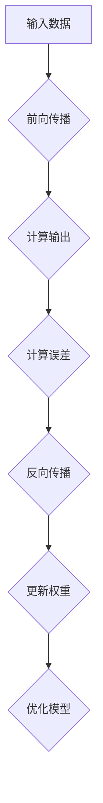

#### 3.2 自然语言处理技术

自然语言处理（Natural Language Processing，简称NLP）是AI在语言处理领域的应用，它旨在让计算机能够理解、生成和处理人类语言。

**核心概念：**

- **词向量**：词向量是NLP中的一种重要数据结构，它将词汇映射到高维空间。
- **词嵌入**：词嵌入是将词汇映射到固定维度的向量。
- **序列模型**：序列模型是处理序列数据的一种模型，如循环神经网络（RNN）和长短时记忆网络（LSTM）。
- **生成模型**：生成模型是一种能够生成新数据的模型，如变分自编码器（VAE）和生成对抗网络（GAN）。

**基本原理：**

- **数据预处理**：NLP需要大量的预处理工作，如分词、去停用词、词性标注等。
- **模型训练**：NLP模型需要通过大量文本数据进行训练，以获得对语言的理解。
- **模型应用**：训练好的模型可以用于文本分类、机器翻译、问答系统等多种任务。

**Mermaid流程图：**

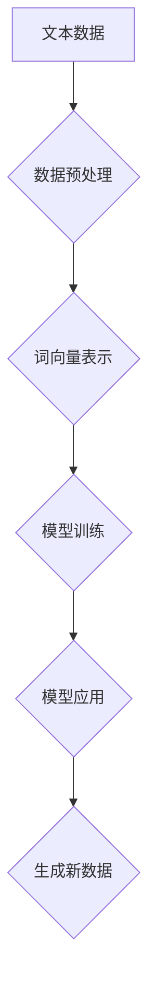

#### 3.3 计算机视觉基础

计算机视觉（Computer Vision，简称CV）是AI在图像和视频处理领域的应用，它旨在让计算机能够识别和理解视觉信息。

**核心概念：**

- **卷积神经网络**（Convolutional Neural Networks，简称CNN）：一种用于图像识别和处理的神经网络结构。
- **特征提取**：计算机视觉的关键在于从图像中提取有用的特征。
- **目标检测**：目标检测是计算机视觉中的一种重要任务，它旨在识别图像中的目标对象。
- **图像分类**：图像分类是将图像划分为不同类别的一种任务。

**基本原理：**

- **图像预处理**：计算机视觉需要将图像进行预处理，如灰度化、缩放、裁剪等。
- **特征提取**：通过卷积神经网络等模型从图像中提取特征。
- **模型训练**：计算机视觉模型需要通过大量图像数据进行训练。
- **模型应用**：训练好的模型可以用于图像识别、目标检测等多种任务。

**Mermaid流程图：**

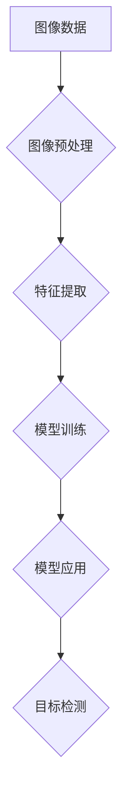

---

### 第4章：AI应用领域探索

#### 4.1 AI在医疗健康中的应用

人工智能在医疗健康领域的应用正日益广泛，从疾病诊断到个性化治疗，从药物研发到健康管理，AI正极大地改变着医疗行业的面貌。

**应用场景：**

- **疾病诊断**：通过深度学习模型对医学图像进行分析，AI可以帮助医生更准确地诊断疾病。
- **个性化治疗**：基于患者的基因信息和病史，AI可以制定个性化的治疗方案。
- **药物研发**：AI可以加速药物研发过程，通过模拟药物与生物体的相互作用，预测药物效果。

**挑战与机遇：**

- **数据隐私**：医疗数据具有高度隐私性，如何保护患者隐私是AI在医疗领域应用的一大挑战。
- **数据质量**：高质量的医疗数据是AI模型训练的关键，如何获取和处理大量高质量的医疗数据是一个挑战。
- **伦理问题**：AI在医疗领域的应用引发了伦理问题，如AI诊断的准确性、决策透明性等。

#### 4.2 AI在金融服务中的应用

人工智能在金融服务中的应用正在重塑银行业、保险业和投资领域。

**应用场景：**

- **风险管理**：AI可以分析大量金融数据，预测市场趋势，帮助金融机构进行风险管理。
- **智能投顾**：基于算法的智能投顾系统可以为投资者提供个性化的投资建议。
- **反欺诈**：AI可以实时监控交易行为，识别和预防欺诈活动。

**挑战与机遇：**

- **数据安全**：金融数据的安全至关重要，AI在金融服务中的应用需要确保数据的安全性和隐私性。
- **算法透明性**：AI决策过程的透明性是金融行业关注的焦点，如何提高算法的透明性是一个挑战。
- **合规性**：AI在金融服务中的应用需要遵守相关法律法规，如反洗钱法规等。

#### 4.3 AI在制造业中的应用

人工智能在制造业中的应用正推动着制造业的数字化转型和智能化升级。

**应用场景：**

- **生产优化**：通过AI技术优化生产流程，提高生产效率和产品质量。
- **设备维护**：AI可以预测设备故障，提前进行维护，减少停机时间。
- **供应链管理**：AI可以优化供应链管理，降低库存成本，提高供应链的灵活性。

**挑战与机遇：**

- **技术整合**：将AI技术整合到现有的制造系统中是一个挑战，需要跨学科的协作。
- **数据质量**：制造业数据的多样性使得数据质量成为AI应用的关键。
- **人才培养**：制造业AI应用需要大量具备AI技能的专业人才，人才培养是一个机遇。

---

### 第5章：数据科学技能培养

#### 5.1 数据分析技能

数据分析是数据科学的核心，它旨在从数据中提取有价值的信息和洞察。

**核心概念：**

- **数据预处理**：清洗、转换和整合数据，使其适合分析。
- **数据可视化**：通过图表和图形将数据可视化，便于理解和分析。
- **统计分析**：使用统计方法对数据进行描述、推断和预测。

**基本原理：**

- **数据质量**：确保数据的质量和准确性是数据分析的基础。
- **数据类型**：熟悉不同类型的数据，如数值型、分类型、时序型等。
- **分析工具**：掌握数据分析工具，如Python的Pandas、Matplotlib等。

**Mermaid流程图：**

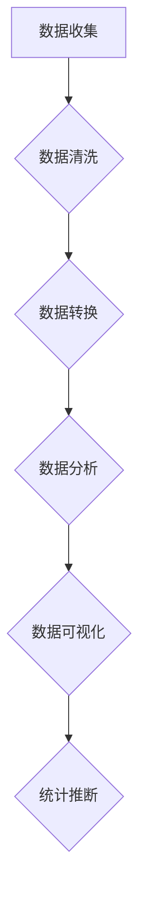

#### 5.2 数据可视化技术

数据可视化是将数据以图形化的形式展示，使其更容易理解和分析。

**核心概念：**

- **图表类型**：了解不同类型的图表，如条形图、折线图、饼图等。
- **可视化工具**：掌握可视化工具，如D3.js、Plotly等。
- **交互性**：通过交互性提高可视化的效果，如使用鼠标滑过、点击等操作。

**基本原理：**

- **数据的表达**：通过图表将数据以直观的方式表达。
- **视觉编码**：使用视觉编码，如颜色、大小、形状等来传达数据信息。
- **用户交互**：通过交互性提高用户的参与度和分析效率。

**Mermaid流程图：**

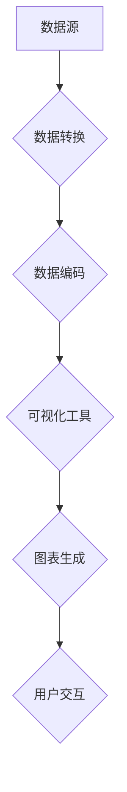

#### 5.3 数据挖掘与机器学习应用

数据挖掘是发现数据中隐藏的模式和知识，而机器学习是实现数据挖掘的核心技术之一。

**核心概念：**

- **数据挖掘流程**：了解数据挖掘的流程，包括数据预处理、模式识别、评估等。
- **机器学习算法**：掌握常见的机器学习算法，如决策树、支持向量机、神经网络等。
- **特征工程**：通过特征工程提高模型的性能，如特征选择、特征转换等。

**基本原理：**

- **数据预处理**：确保数据的质量和一致性。
- **算法选择**：选择合适的算法，根据问题的性质和数据的特点。
- **模型评估**：评估模型的性能，如准确率、召回率、F1分数等。

**Mermaid流程图：**

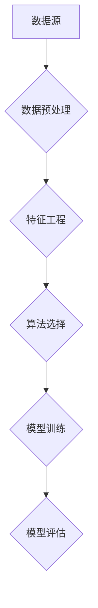

---

### 第6章：AI编程实战

#### 6.1 Python编程基础

Python是一种广泛使用的编程语言，其在AI领域有着重要的地位。

**核心概念：**

- **变量和类型**：了解Python中的变量和数据类型，如整数、浮点数、字符串等。
- **控制结构**：掌握Python的控制结构，如条件语句、循环语句等。
- **函数和模块**：了解Python中的函数和模块，以及如何使用它们。

**基本原理：**

- **代码风格**：遵循良好的代码风格，如使用适当的命名规范、注释等。
- **模块化**：将代码拆分为模块，便于维护和复用。
- **错误处理**：了解如何处理编程中的错误和异常。

**Mermaid流程图：**

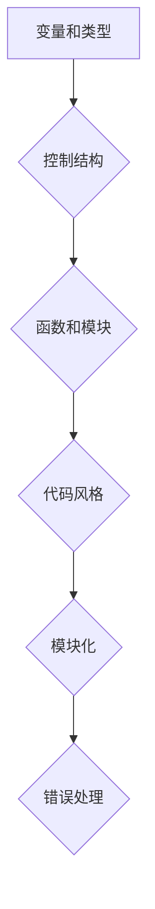

#### 6.2 TensorFlow实践

TensorFlow是一种广泛使用的深度学习框架，它为AI开发提供了强大的工具。

**核心概念：**

- **计算图**：了解计算图的概念，以及如何在TensorFlow中创建和使用计算图。
- **数据流图**：了解数据流图的概念，以及如何在TensorFlow中处理数据流。
- **神经网络**：了解神经网络的基本概念，以及如何在TensorFlow中构建和训练神经网络。

**基本原理：**

- **前向传播与反向传播**：了解前向传播和反向传播的原理，以及如何在TensorFlow中实现。
- **优化器**：了解优化器的原理，以及如何选择合适的优化器。
- **评估与调试**：了解如何评估和调试模型，以提高其性能。

**伪代码：**

```python
# 前向传播伪代码
def forward_pass(input_data):
    # 初始化模型参数
    weights = ...
    biases = ...
    
    # 计算前向传播
    output = ...
    
    return output

# 反向传播伪代码
def backward_pass(output, expected_output):
    # 计算损失函数
    loss = ...

    # 计算梯度
    gradient = ...

    # 更新模型参数
    weights -= learning_rate * gradient
    biases -= learning_rate * gradient

    return loss
```

#### 6.3 PyTorch应用案例

PyTorch是一种流行的深度学习框架，它以其灵活性和易用性受到许多开发者的青睐。

**核心概念：**

- **自动微分**：了解自动微分的原理，以及如何在PyTorch中实现。
- **动态计算图**：了解动态计算图的概念，以及如何在PyTorch中创建和使用。
- **数据加载**：了解如何使用PyTorch的数据加载器（DataLoader）来处理数据。

**基本原理：**

- **模块化**：将代码拆分为模块，便于维护和复用。
- **动态计算**：PyTorch的动态计算图使得模型构建更加灵活。
- **数据处理**：使用数据加载器来高效地处理数据。

**代码实现：**

```python
# PyTorch数据加载器示例
import torch
from torch.utils.data import DataLoader
from torchvision import datasets, transforms

# 数据预处理
transform = transforms.Compose([
    transforms.Resize(256),
    transforms.CenterCrop(224),
    transforms.ToTensor(),
    transforms.Normalize(mean=[0.485, 0.456, 0.406], std=[0.229, 0.224, 0.225]),
])

# 加载数据集
train_data = datasets.ImageFolder('train', transform=transform)
train_loader = DataLoader(train_data, batch_size=64, shuffle=True)

# 训练模型
import torch.nn as nn
import torch.optim as optim

model = nn.Sequential(
    nn.Conv2d(3, 64, kernel_size=3, padding=1),
    nn.ReLU(),
    nn.MaxPool2d(kernel_size=2, stride=2),
    # ...
    nn.Linear(512, 10)
)

criterion = nn.CrossEntropyLoss()
optimizer = optim.Adam(model.parameters(), lr=0.001)

for epoch in range(num_epochs):
    for images, labels in train_loader:
        # 前向传播
        outputs = model(images)
        loss = criterion(outputs, labels)

        # 反向传播
        optimizer.zero_grad()
        loss.backward()
        optimizer.step()

        print(f"Epoch [{epoch+1}/{num_epochs}], Loss: {loss.item():.4f}")
```

---

### 第7章：跨学科融合与创新能力培养

#### 7.1 创新思维方法

创新思维方法是提升创新能力的关键，它包括以下几个方面：

**核心概念：**

- **发散思维**：从多个角度思考问题，寻找不同的解决方案。
- **收敛思维**：将多个解决方案进行综合和优化，得出最佳方案。
- **逆向思维**：从问题的反面思考，找到新的解决方案。
- **联想思维**：通过联想和类比，找到新的思路和解决方案。

**基本原理：**

- **思维的灵活性**：灵活的思维能够帮助我们从不同的角度看待问题，找到创新的解决方案。
- **知识的广度**：广泛的知识储备能够为创新提供丰富的素材和灵感。
- **跨学科合作**：跨学科的合作能够结合不同的知识和技能，产生新的创意和解决方案。

**Mermaid流程图：**

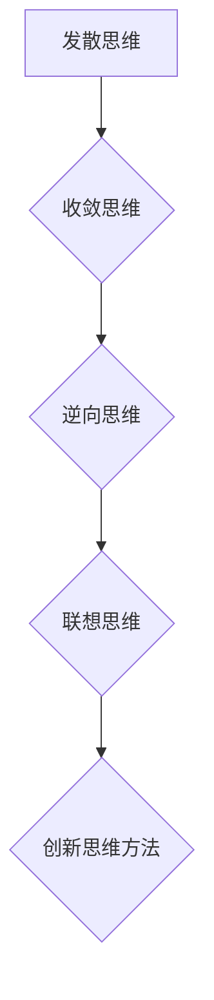

#### 7.2 跨学科合作案例分析

跨学科合作是推动创新的重要手段，以下是一些成功的跨学科合作案例：

**案例1：基因编辑与计算机科学的结合**

- **背景**：基因编辑技术的快速发展为治疗遗传性疾病提供了新的希望。
- **创新点**：计算机科学提供了高效的算法和计算资源，使得基因编辑技术能够更加精确和高效地操作。
- **成果**：通过跨学科合作，科学家们成功开发出了一些新的基因编辑工具，如CRISPR-Cas9。

**案例2：艺术与科技的结合**

- **背景**：艺术与科技的结合正在成为当代艺术的新趋势。
- **创新点**：艺术家运用计算机技术和编程语言创作出全新的艺术形式，如数字艺术、交互艺术等。
- **成果**：这些跨学科的作品不仅推动了艺术的发展，也为科技的应用提供了新的思路。

#### 7.3 持续学习与技能提升

持续学习和技能提升是适应未来职场的必要条件，以下是一些建议：

**核心概念：**

- **自我驱动**：培养自我驱动力，主动寻找学习的机会和资源。
- **实践应用**：将所学知识应用到实际项目中，通过实践提升技能。
- **知识更新**：随着技术的快速迭代，持续更新知识体系，保持对前沿技术的了解。

**基本原理：**

- **学习效率**：选择合适的学习方法和工具，提高学习效率。
- **反馈与反思**：通过反馈和反思，不断调整和优化学习策略。
- **跨学科学习**：跨学科学习能够帮助我们形成更全面的视角，提高创新能力。

**Mermaid流程图：**

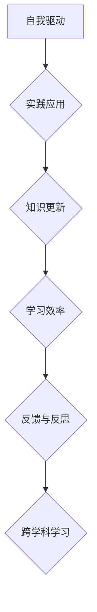

---

## 第二部分：AI职场技能实战案例

### 第8章：AI职场实战案例

#### 8.1 案例一：智能客服系统开发

智能客服系统是一种基于AI技术的客户服务解决方案，它能够自动处理客户咨询，提高服务效率。

**项目背景：**

- **需求**：某电商平台需要开发一个智能客服系统，以应对日益增长的客户咨询量。
- **目标**：通过智能客服系统提高客户满意度，降低人工成本。

**项目实施：**

1. **需求分析**：与业务团队合作，明确智能客服系统的功能和性能要求。
2. **技术选型**：选择合适的AI技术和工具，如自然语言处理（NLP）框架和对话管理算法。
3. **数据准备**：收集和整理客户咨询数据，用于训练和测试模型。
4. **模型训练**：使用NLP技术训练对话模型，使其能够理解客户的问题并给出合适的回答。
5. **系统集成**：将智能客服系统集成到电商平台中，确保其与现有系统的兼容性。
6. **测试与优化**：对系统进行测试，并根据反馈进行优化，以提高系统的准确性和用户体验。

**项目成果：**

- **提高客户满意度**：智能客服系统能够快速响应客户咨询，提供准确的信息，提高了客户满意度。
- **降低人工成本**：智能客服系统能够处理大量客户咨询，减轻了人工客服的负担，降低了人工成本。

#### 8.2 案例二：智能家居产品设计

智能家居产品是一种能够通过互联网实现远程控制和自动化的家居设备。

**项目背景：**

- **需求**：随着消费者对智能家居产品需求的增加，企业需要开发一款具有创新功能的智能家居产品。
- **目标**：通过创新设计提高产品的市场竞争力，吸引更多消费者。

**项目实施：**

1. **市场调研**：了解消费者对智能家居产品的需求和期望，收集市场数据和用户反馈。
2. **产品设计**：结合市场调研结果，设计出具有创新功能的智能家居产品原型。
3. **技术开发**：使用AI技术和物联网（IoT）技术，实现产品的智能控制和自动化功能。
4. **用户体验设计**：优化产品的用户体验，确保用户能够轻松地使用和管理智能家居设备。
5. **产品测试**：对产品进行测试，确保其稳定性和安全性。
6. **市场推广**：通过线上和线下渠道推广产品，提高产品的知名度。

**项目成果：**

- **创新功能**：智能家居产品具备创新的功能，如智能语音控制、远程监控等，吸引了大量消费者。
- **用户体验优化**：产品的用户体验得到优化，用户满意度提高。
- **市场竞争力提升**：智能家居产品的市场竞争力得到提升，企业在市场中脱颖而出。

#### 8.3 案例三：自动驾驶技术实现

自动驾驶技术是一种利用AI和传感器实现车辆自主驾驶的技术。

**项目背景：**

- **需求**：随着自动驾驶技术的发展，企业需要开发一款具有高级自动驾驶功能的车辆。
- **目标**：通过实现自动驾驶技术，提高车辆的安全性和效率，降低交通事故率。

**项目实施：**

1. **需求分析**：与业务团队和车辆制造商合作，明确自动驾驶车辆的功能和安全要求。
2. **技术选型**：选择合适的AI技术和传感器，如深度学习模型、激光雷达、摄像头等。
3. **数据收集**：收集大量的道路场景数据，用于训练自动驾驶模型。
4. **模型训练**：使用深度学习技术训练自动驾驶模型，使其能够识别道路场景和行驶规则。
5. **系统集成**：将自动驾驶系统集成到车辆中，确保其与车辆系统的兼容性。
6. **测试与优化**：对自动驾驶系统进行测试，根据测试结果进行优化，以提高系统的安全性和可靠性。
7. **道路测试**：在真实道路上进行自动驾驶测试，验证系统的性能和安全性。

**项目成果：**

- **提高安全性**：自动驾驶系统能够减少人为驾驶的失误，提高车辆的安全性。
- **提高效率**：自动驾驶系统能够优化行驶路线，提高行驶效率，减少拥堵。
- **降低事故率**：自动驾驶技术有助于降低交通事故率，为驾驶员和乘客提供更安全的环境。

---

### 第9章：项目开发与团队协作

#### 9.1 项目开发流程

项目开发流程是确保项目成功的关键，以下是一个典型的项目开发流程：

**核心步骤：**

1. **需求分析**：与业务团队合作，明确项目的需求和目标。
2. **技术选型**：选择合适的技术和工具，以满足项目的需求。
3. **项目规划**：制定项目的计划和进度，包括任务分配和时间表。
4. **开发与测试**：进行项目开发，并进行测试，确保项目的质量和稳定性。
5. **部署与上线**：将项目部署到生产环境，并进行上线。
6. **维护与优化**：对项目进行维护和优化，确保其持续运行。

**基本原理：**

- **需求明确**：确保项目需求明确，避免在开发过程中出现偏差。
- **进度可控**：通过项目规划，确保项目的进度可控，避免拖延。
- **质量保障**：通过测试和质量控制，确保项目的质量和稳定性。
- **持续优化**：通过维护和优化，确保项目的持续运行和性能提升。

**Mermaid流程图：**

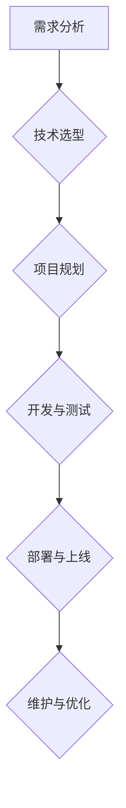

#### 9.2 团队协作工具与技巧

团队协作是项目成功的关键，以下是一些团队协作工具和技巧：

**团队协作工具：**

- **项目管理工具**：如Jira、Trello等，用于任务分配和进度跟踪。
- **沟通工具**：如Slack、Microsoft Teams等，用于实时沟通和协作。
- **代码管理工具**：如Git、GitHub等，用于代码的版本控制和协作开发。
- **文档管理工具**：如Confluence、Notion等，用于文档管理和共享。

**团队协作技巧：**

- **明确目标**：确保团队成员明确项目的目标和任务，避免混淆和误解。
- **分工合作**：根据团队成员的技能和特长，进行合理的任务分配。
- **沟通畅通**：保持良好的沟通，及时解决问题和冲突。
- **定期回顾**：定期回顾项目的进展和问题，进行调整和优化。

**Mermaid流程图：**

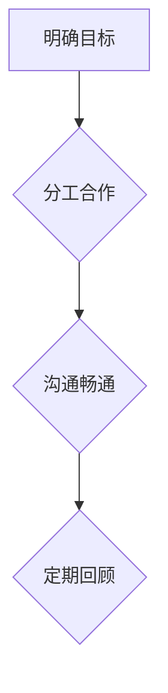

#### 9.3 项目管理与优化

项目管理是确保项目成功的关键，以下是一些项目管理的原则和方法：

**项目管理原则：**

- **计划先行**：制定详细的项目计划，明确任务和时间表。
- **质量第一**：确保项目的质量和稳定性，避免因追求进度而牺牲质量。
- **团队协作**：建立高效的团队协作机制，确保项目的顺利进行。
- **持续改进**：通过持续改进，优化项目的过程和结果。

**项目管理方法：**

- **Scrum方法**：一种敏捷开发方法，通过短周期迭代和持续反馈，确保项目的灵活性和适应性。
- **六西格玛方法**：一种质量管理方法，通过统计方法和过程优化，提高项目的质量和效率。
- **项目管理工具**：如Jira、Trello等，用于任务分配、进度跟踪和质量控制。

**Mermaid流程图：**

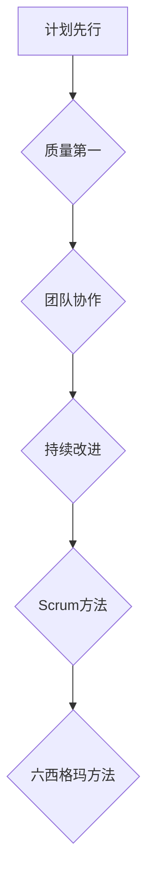

---

### 第10章：AI伦理与未来展望

#### 10.1 AI伦理挑战

随着AI技术的快速发展，伦理问题日益凸显。以下是一些AI伦理挑战：

**核心问题：**

- **隐私保护**：AI技术收集和处理大量个人数据，如何保护用户隐私成为一个重大挑战。
- **公平与偏见**：AI模型可能会受到训练数据偏见的影响，导致不公平的结果。
- **透明性**：AI决策过程的透明性是一个重要问题，用户需要了解AI是如何做出决策的。
- **责任归属**：当AI系统出现错误或造成损失时，如何确定责任归属？

**解决方案：**

- **隐私保护法规**：制定和实施隐私保护法规，确保用户数据的安全。
- **算法公平性**：通过数据平衡和算法改进，减少AI模型的偏见。
- **透明性机制**：开发透明性工具和机制，让用户了解AI的决策过程。
- **责任保险**：建立责任保险机制，为AI系统的错误或损失提供保障。

**Mermaid流程图：**

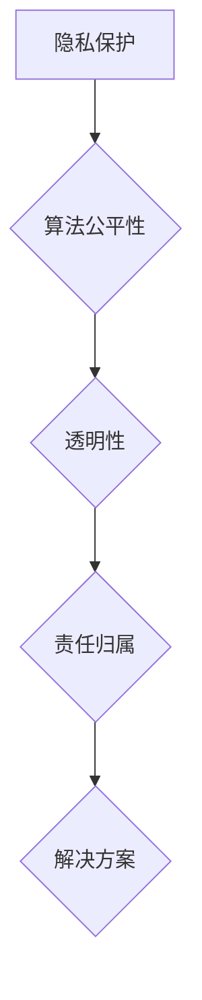

#### 10.2 未来AI职场的趋势

未来AI职场的趋势将更加多元化，以下是一些主要趋势：

**核心趋势：**

- **技能多样化**：未来职场将需要更多的多元化技能，如编程、数据科学、人工智能等。
- **跨学科融合**：跨学科合作将成为职场的重要趋势，不同领域的专业人才将共同推动创新。
- **远程办公**：随着技术的进步，远程办公将成为常态，灵活的工作方式将更加普遍。
- **持续学习**：终身学习将成为职场的基本要求，从业人员需要不断更新知识和技能。

**未来展望：**

- **AI普及化**：AI技术将更加普及，从大型企业到小型企业，从高端产业到低端产业，AI都将发挥重要作用。
- **智能化升级**：各行各业的智能化升级将持续推进，AI技术将更加深入地融入各个领域。
- **社会变革**：AI技术将对社会产生深远的影响，改变人类的生活方式和工作方式。

**Mermaid流程图：**

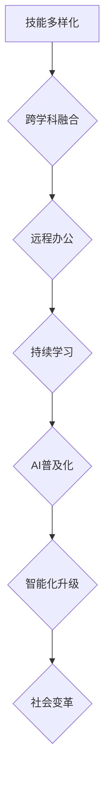

#### 10.3 AI与人类社会的未来

AI技术正在深刻地改变人类社会，以下是一些可能的影响：

**核心影响：**

- **经济发展**：AI技术将推动经济增长，提高生产效率和创新能力。
- **社会变革**：AI技术将改变社会结构，改变人类的生活方式和工作方式。
- **伦理挑战**：AI技术带来的伦理问题将需要全社会共同应对。
- **教育改革**：AI技术将推动教育改革，培养适应未来社会的技能和素质。

**未来展望：**

- **AI伦理**：建立全球性的AI伦理框架，确保AI技术的安全和可持续发展。
- **教育普及**：推动教育普及，让更多的人掌握AI技术，提高全民AI素养。
- **技术创新**：继续推动AI技术创新，为人类社会带来更多的机遇和挑战。

**Mermaid流程图：**

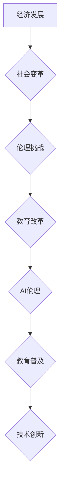

---

## 附录

### 附录A：AI技能学习资源

**A.1 在线课程与教程推荐**

- **Coursera**：提供多种AI和机器学习相关的在线课程，适合初学者和进阶者。
- **edX**：由哈佛大学和麻省理工学院创办的在线学习平台，提供高质量的AI课程。
- **Udacity**：提供实践导向的AI和机器学习课程，适合希望快速掌握技能的学员。

**A.2 经典书籍推荐**

- **《人工智能：一种现代方法》**：David Poole, Alan Mackworth 著，是一本全面的人工智能教材。
- **《深度学习》**：Ian Goodfellow, Yoshua Bengio, Aaron Courville 著，是深度学习的经典教材。
- **《机器学习实战》**：Peter Harrington 著，通过案例教学帮助读者掌握机器学习技术。

**A.3 论坛与社区资源**

- **AI Stack Overflow**：一个AI技术问题的问答社区，适合解决编程和学习中的问题。
- **Reddit**：有很多AI和机器学习的子论坛，可以获取最新的行业动态和讨论。
- **AI.google**：谷歌的AI社区，提供最新的AI技术和工具信息。

### 附录B：AI编程工具与库

**B.1 Python编程库**

- **NumPy**：用于数值计算的科学计算库。
- **Pandas**：用于数据处理和分析的库。
- **Matplotlib**：用于数据可视化的库。
- **Scikit-learn**：用于机器学习的库。

**B.2 深度学习框架**

- **TensorFlow**：由谷歌开发的深度学习框架。
- **PyTorch**：由Facebook开发的深度学习框架。
- **Keras**：用于构建和训练深度学习模型的库，与TensorFlow和Theano兼容。

**B.3 数据分析工具**

- **Tableau**：用于数据可视化的商业工具。
- **Power BI**：微软推出的商业智能工具。
- **QlikView**：一款数据分析工具，提供实时数据可视化和洞察。

---

### 作者信息

**作者：AI天才研究院/AI Genius Institute & 禅与计算机程序设计艺术 /Zen And The Art of Computer Programming**

