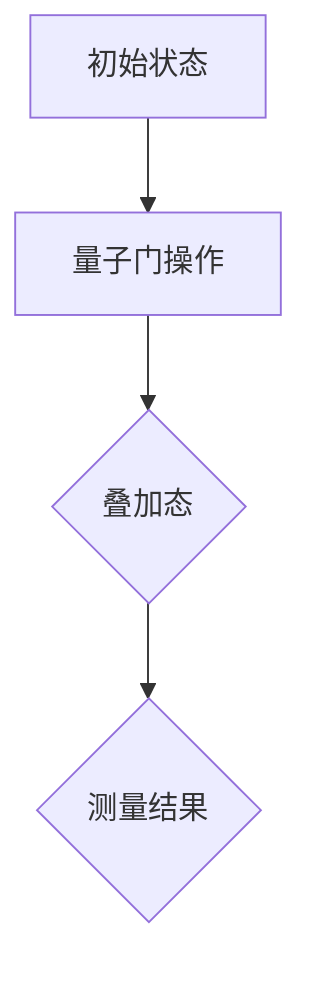
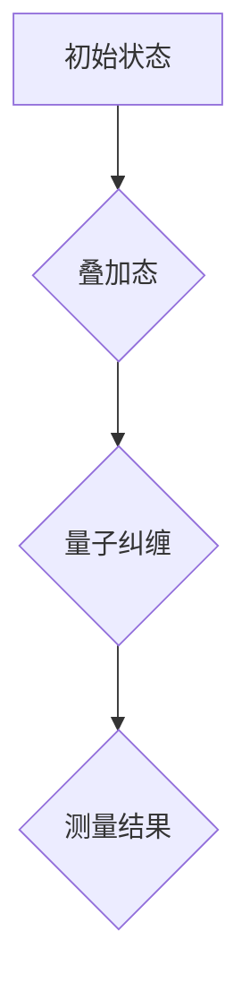
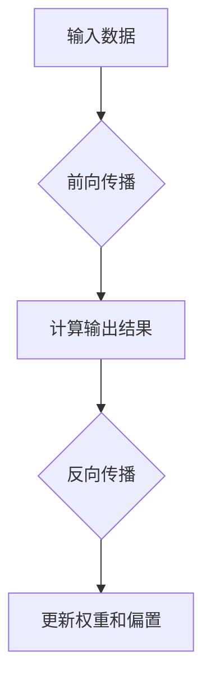
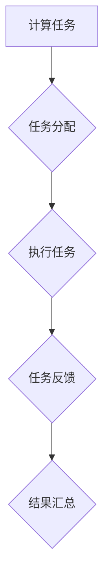
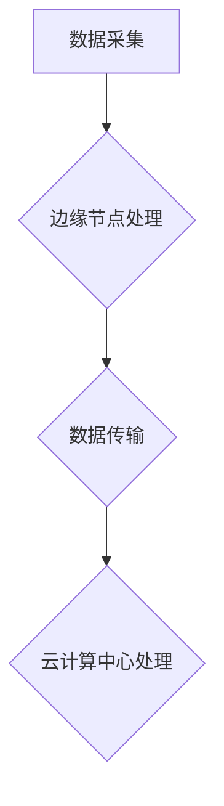

                 

# 未来计算范式的主导地位

> 关键词：未来计算、计算范式、量子计算、类脑计算、高性能计算、分布式计算、边缘计算、数据科学

> 摘要：本文将深入探讨未来计算范式的主导地位，分析量子计算、类脑计算、高性能计算、分布式计算和边缘计算等核心技术，以及它们在数据科学领域的应用。我们将通过一步步的推理，揭示这些技术如何塑造未来计算格局，推动技术进步和产业变革。

### 第一部分：未来计算范式的主导地位

#### 第1章：未来计算范式概述

##### 1.1 未来计算范式定义与背景

**1.1.1 计算范式的演变**

计算范式是指计算方法和技术的总体框架，它决定了计算系统的设计原则、结构特性以及实现方式。从计算机发展的历程来看，计算范式经历了多个阶段的变化：

- **机械计算范式**：以算盘为代表的机械计算，是最早的计算方式，主要用于简单的数值计算。
- **电子计算范式**：随着电子技术的发展，电子计算机逐渐取代机械计算，实现了复杂运算能力的飞跃。
- **并行计算范式**：计算机技术的发展，特别是多核处理器和大规模并行处理的普及，推动了并行计算范式的兴起。
- **分布式计算范式**：网络技术的飞速发展，使得分布式计算成为可能，通过多个计算机节点协同工作，解决复杂计算问题。

**1.1.2 未来计算范式的基本概念**

未来计算范式是指在未来一段时间内，计算技术将可能面临的重要变革和创新。它包括以下几个方面：

- **量子计算**：利用量子力学原理，通过量子比特（qubit）实现超并行计算，具有极高的计算速度和效率。
- **类脑计算**：模拟人脑的神经网络结构和工作原理，实现高效的数据处理和自主学习能力。
- **高性能计算**：通过大规模计算能力和算法优化，解决复杂科学计算和工程问题。
- **分布式计算**：通过网络连接的多个计算节点协同工作，实现大规模数据处理和任务分发。
- **边缘计算**：将计算任务从云端迁移到网络边缘，实现实时处理和智能决策。

**1.1.3 未来计算范式的发展趋势**

未来计算范式的发展趋势主要体现在以下几个方面：

- **计算能力持续提升**：量子计算、类脑计算等新技术将显著提升计算能力，推动科学研究和产业应用。
- **计算模式多元化**：分布式计算、边缘计算等新模式的兴起，将使计算资源更加灵活和高效。
- **数据科学的重要性增加**：数据成为新的生产要素，数据科学将成为未来计算范式的重要组成部分。
- **跨领域融合**：未来计算范式将与其他领域（如生物学、物理学、材料科学等）深度融合，推动技术创新和产业变革。

##### 1.2 未来计算范式中的核心技术

**1.2.1 量子计算**

量子计算是未来计算范式中最为引人瞩目的核心技术之一。它利用量子力学原理，通过量子比特实现超并行计算，具有以下几个特点：

- **量子比特与量子门**：量子比特是量子计算的基本单元，量子门是实现量子比特操作的基本电路。通过量子门，可以实现量子叠加和量子纠缠，这是量子计算的核心机制。
- **量子叠加与量子纠缠**：量子叠加允许一个量子比特同时处于多种状态的叠加，而量子纠缠则使得两个或多个量子比特之间产生特殊的关联。这些特性使量子计算在处理复杂问题时具有巨大的优势。
- **量子算法与量子优化**：量子算法利用量子叠加和量子纠缠，实现高效的计算和优化。例如，Shor算法能够快速因数分解大整数，Grover算法能够加速搜索算法。量子优化算法也在组合优化和调度问题中表现出色。

**1.2.2 类脑计算**

类脑计算是一种模仿人脑结构和功能的计算方法，旨在实现高效的数据处理和自主学习能力。它主要包括以下几个方面：

- **神经科学基础**：类脑计算依赖于神经科学的研究成果，包括神经元的工作原理、神经网络的结构和功能等。
- **神经网络的模拟**：通过模拟人脑的神经网络结构，类脑计算能够实现高效的数据处理和模式识别。神经网络包括多层神经元，通过前向传播和反向传播算法，实现训练和优化。
- **大规模神经网络的设计与优化**：类脑计算要求设计大规模神经网络，并对其进行优化。这涉及到神经网络的结构设计、参数调整和训练算法等方面。

**1.2.3 高性能计算**

高性能计算是未来计算范式中的重要组成部分，它通过大规模计算能力和算法优化，解决复杂科学计算和工程问题。高性能计算主要包括以下几个方面：

- **高性能计算机的架构**：高性能计算机采用多核处理器、并行计算架构和分布式存储技术，实现高性能计算。例如，GPU和TPU等专用计算设备，能够显著提升计算速度和效率。
- **高性能计算的算法优化**：针对高性能计算机的架构特点，优化算法以实现最佳性能。这包括算法的并行化、数据局部性优化和通信优化等方面。
- **高性能计算的应用领域**：高性能计算在科学研究和工程领域具有广泛的应用，例如天气预测、生物信息学、金融分析和工程仿真等。

**1.2.4 分布式计算**

分布式计算是未来计算范式中的一种重要模式，通过网络连接的多个计算节点协同工作，实现大规模数据处理和任务分发。分布式计算主要包括以下几个方面：

- **分布式系统的基本概念**：分布式系统包括多个计算节点，通过通信网络连接，共同完成计算任务。分布式系统需要解决数据一致性、容错性和负载均衡等问题。
- **分布式计算模型与算法**：分布式计算模型包括客户-服务器模型、对等网络模型和分布式共享内存模型等。分布式算法包括分布式搜索、分布式排序和分布式优化算法等。
- **分布式系统的挑战与解决方案**：分布式系统面临数据一致性、容错性和负载均衡等挑战。分布式系统需要通过分布式协议、分布式存储和分布式计算框架等技术手段，实现高效可靠的分布式计算。

**1.2.5 边缘计算**

边缘计算是将计算任务从云端迁移到网络边缘的一种计算模式，实现实时处理和智能决策。边缘计算主要包括以下几个方面：

- **边缘计算的概念与架构**：边缘计算是指在靠近数据源的网络边缘部署计算资源，实现数据的本地处理和实时分析。边缘计算架构包括边缘节点、边缘网络和边缘平台等组成部分。
- **边缘计算的优势与挑战**：边缘计算的优势包括降低网络延迟、提高数据安全和减少带宽消耗等。边缘计算面临的挑战包括资源有限、安全性问题和数据隐私等。
- **边缘计算在实际场景中的应用案例**：边缘计算在物联网、智能城市、智能制造和自动驾驶等领域具有广泛的应用。例如，物联网设备可以通过边缘计算实现实时数据分析和智能决策，智能城市可以通过边缘计算实现城市交通管理和环境监控。

#### 第2章：量子计算技术解析

##### 2.1 量子计算原理与架构

量子计算是未来计算范式中的关键技术之一，它利用量子力学原理，通过量子比特实现超并行计算。量子计算的基本原理包括量子比特、量子门和量子叠加与量子纠缠。

**2.1.1 量子比特与量子门**

量子比特是量子计算的基本单元，它与传统计算机中的比特不同，能够同时处于0和1的状态，即叠加态。量子比特的操作通过量子门实现。量子门是类似于传统逻辑门的操作，但它作用于量子比特的叠加态，实现量子态的变换。

**量子比特与量子门的 Mermaid 流程图：**



**2.1.2 量子叠加与量子纠缠**

量子叠加是量子计算的核心机制之一，它允许一个量子比特同时处于多种状态的叠加。例如，一个量子比特可以同时处于0和1的状态。量子叠加使量子计算能够实现并行计算，显著提升计算速度。

量子纠缠是另一个重要的量子现象，它使得两个或多个量子比特之间产生特殊的关联。量子纠缠状态无法分离，即使量子比特相隔很远，它们之间仍然存在纠缠关系。量子纠缠使量子计算能够实现高效的量子通信和量子密码学。

**量子叠加与量子纠缠的 Mermaid 流程图：**



**2.1.3 量子算法与量子优化**

量子算法是利用量子比特和量子门实现高效计算的方法。量子算法在组合优化、线性方程组求解、随机 walks 和量子密码学等领域表现出巨大的优势。以下是一个简单的量子算法示例：

**量子算法伪代码：**

```plaintext
输入：初始状态 |0>
输出：量子状态 |x>

初始化量子寄存器 |0>
执行量子门操作 G1
执行量子门操作 G2
...
执行量子门操作 Gn
进行量子测量，得到结果 x
```

量子优化是量子计算在优化问题中的应用，通过量子算法求解优化问题。以下是一个简单的量子优化问题示例：

**量子优化伪代码：**

```plaintext
输入：目标函数 f(x)
输出：最优解 x*

初始化量子寄存器 |0>
执行量子门操作 G1，使量子状态表示目标函数 f(x)
执行量子门操作 G2，使量子状态表示约束条件
...
执行量子门操作 Gn，使量子状态表示优化目标
进行量子测量，得到最优解 x*
```

##### 2.2 量子计算的挑战与机遇

尽管量子计算具有巨大的潜力，但实现量子计算仍面临一系列挑战和机遇。

**2.2.1 量子计算的实用化难题**

量子计算的实用化面临以下难题：

- **量子比特的稳定性**：量子比特容易受到外部环境干扰，导致量子态的破坏。实现高稳定性的量子比特是量子计算实用化的关键。
- **量子门的精度**：量子门的操作精度直接影响量子计算的准确性。提高量子门的精度是量子计算实用化的关键。
- **量子纠错**：量子计算中的错误不可避免，量子纠错技术是实现可靠量子计算的关键。

**2.2.2 量子计算的应用前景**

量子计算在多个领域具有广泛的应用前景：

- **密码学**：量子计算在量子密码学和量子密钥分发中具有优势，可以提供更安全的通信方式。
- **优化问题**：量子计算可以高效地求解组合优化问题和线性方程组，对工程设计和科学计算具有重要意义。
- **量子模拟**：量子计算可以在量子系统模拟中发挥重要作用，为科学研究提供新的手段。

**2.2.3 量子计算在教育与研究中的作用**

量子计算在教育和研究中的作用不可忽视：

- **教育**：量子计算作为一门新兴学科，对人才培养具有重要意义。通过量子计算课程和教材，可以培养学生的创新能力。
- **研究**：量子计算为科学研究提供新的方法和技术，推动物理学、材料科学和计算机科学等领域的发展。

### 第二部分：未来计算范式应用与实践

#### 第3章：类脑计算与人工智能

类脑计算是一种模仿人脑结构和功能的计算方法，它旨在实现高效的数据处理和自主学习能力。类脑计算在人工智能领域具有广泛的应用前景，可以推动人工智能的发展。

##### 3.1 类脑计算原理与架构

类脑计算的基本原理包括神经科学基础、神经网络的模拟和大规模神经网络的设计与优化。

**3.1.1 神经科学基础**

类脑计算依赖于神经科学的研究成果，包括神经元的工作原理、神经网络的结构和功能等。神经元是大脑的基本单元，它通过电信号传递信息。神经网络由大量神经元组成，通过相互连接和相互作用，实现复杂的信息处理和模式识别。

**3.1.2 神经网络的模拟**

类脑计算通过模拟人脑的神经网络结构，实现高效的数据处理和模式识别。神经网络包括多层神经元，通过前向传播和反向传播算法，实现训练和优化。前向传播算法将输入数据通过神经网络传递，得到输出结果。反向传播算法通过计算输出结果与真实结果的差异，更新神经网络的权重和偏置。

**3.1.3 大规模神经网络的设计与优化**

类脑计算要求设计大规模神经网络，并对其进行优化。这涉及到神经网络的结构设计、参数调整和训练算法等方面。大规模神经网络的设计与优化旨在提高计算效率、降低计算资源和提高准确度。

**3.1.4 Mermaid 流程图：**



##### 3.2 类脑计算与人工智能的关系

类脑计算与人工智能密切相关，它们之间存在相互促进的关系。

**3.2.1 类脑计算对人工智能的启示**

类脑计算为人工智能提供了一种新的计算范式，它启示了以下方面：

- **自适应学习**：类脑计算可以实现自适应学习，通过不断调整神经网络结构和参数，适应不同任务和场景。
- **并行计算**：类脑计算通过神经网络实现并行计算，可以显著提高计算速度和效率。
- **鲁棒性**：类脑计算可以模拟人脑的鲁棒性，通过噪声和扰动，提高算法的稳健性。

**3.2.2 类脑计算在人工智能中的应用**

类脑计算在人工智能领域具有广泛的应用，包括：

- **图像识别**：类脑计算可以通过神经网络实现高效的图像识别，应用于安防监控、医学诊断等领域。
- **自然语言处理**：类脑计算可以模拟人脑的语言处理机制，实现自然语言理解、机器翻译和情感分析等任务。
- **智能决策**：类脑计算可以模拟人脑的决策过程，应用于金融投资、智能交通和智能制造等领域。

**3.2.3 类脑计算在智能系统中的优势与挑战**

类脑计算在智能系统中的优势包括：

- **高效的数据处理**：类脑计算可以通过神经网络实现并行计算，提高数据处理速度和效率。
- **自适应学习**：类脑计算可以实现自适应学习，根据环境变化调整模型和行为。
- **鲁棒性**：类脑计算可以模拟人脑的鲁棒性，提高算法的稳健性。

类脑计算在智能系统中也面临一些挑战：

- **计算资源消耗**：类脑计算需要大量的计算资源和存储空间，对硬件设备要求较高。
- **数据隐私和安全**：类脑计算涉及到大量数据，需要确保数据的安全和隐私。
- **模型可解释性**：类脑计算的神经网络模型具有一定的黑盒特性，难以解释和理解，影响模型的可靠性和可解释性。

#### 第4章：高性能计算与云计算

高性能计算（High-Performance Computing，HPC）是一种通过利用大规模计算资源来解决复杂计算问题的技术。云计算（Cloud Computing）则是一种通过互联网提供计算资源的服务模式。高性能计算与云计算的结合，可以充分发挥两者优势，实现高效的计算资源利用和任务调度。

##### 4.1 高性能计算的基本概念

**4.1.1 高性能计算机的架构**

高性能计算机通常采用并行计算架构，包括以下几个关键部分：

- **计算节点**：高性能计算机由多个计算节点组成，每个节点具有独立的计算资源和存储设备。计算节点可以通过高速网络连接，实现协同工作。
- **通信网络**：高性能计算机的通信网络是实现计算节点间数据传输和任务调度的重要基础设施。常见的通信网络包括以太网、Infiniband和Myrinet等。
- **存储系统**：高性能计算机配备大规模存储系统，用于存储数据和计算结果。存储系统可以采用分布式文件系统、并行文件系统或数据库等方式。

**4.1.2 高性能计算的算法优化**

高性能计算的关键在于优化算法，以提高计算效率和性能。以下是一些常用的算法优化方法：

- **并行化**：将算法划分为多个子任务，分配到不同的计算节点上，实现并行计算。并行化可以提高计算速度和效率，减少计算时间。
- **数据局部性优化**：优化数据访问模式，提高数据访问的局部性，减少数据传输和网络通信开销。数据局部性优化包括数据缓存、数据预取和数据压缩等技术。
- **负载均衡**：在计算节点间分配计算任务，确保每个节点的工作负载均衡，避免部分节点过载而其他节点空闲。负载均衡可以充分利用计算资源，提高整体计算效率。

**4.1.3 高性能计算的应用领域**

高性能计算在科学研究和工程领域具有广泛的应用，以下是一些典型的应用领域：

- **气象预测**：高性能计算可以用于大气动力学模型的模拟和天气预报，提高预测精度和时效性。
- **生物信息学**：高性能计算可以用于基因组序列分析、蛋白质结构预测和药物设计等领域，加速科学研究进程。
- **流体力学**：高性能计算可以用于流体力学模拟，解决复杂流场问题，应用于航空、航天、汽车等工程领域。
- **金融分析**：高性能计算可以用于金融市场的数据分析和风险管理，提高投资决策的准确性和效率。

##### 4.2 云计算与高性能计算的结合

云计算与高性能计算的结合，可以充分发挥两者优势，实现高效的计算资源利用和任务调度。以下是一些结合的典型应用场景：

**4.2.1 云计算在高效计算中的应用**

- **弹性计算**：云计算平台可以根据计算需求动态调整计算资源，实现弹性伸缩。在高峰期，可以快速扩展计算资源，提高计算能力；在低谷期，可以缩减计算资源，降低成本。
- **分布式任务调度**：云计算平台可以提供分布式任务调度服务，实现大规模任务的分配和调度。通过分布式调度，可以充分利用计算资源，提高任务完成速度。
- **数据存储和共享**：云计算平台提供大规模数据存储和共享服务，支持高性能计算任务的输入输出需求。分布式文件系统和对象存储技术，可以实现高效的数据访问和传输。

**4.2.2 云平台的高性能计算服务**

- **高性能云计算平台**：云平台提供商提供专门的高性能计算服务，如阿里云的弹性计算服务、腾讯云的GPU云服务器等。这些服务可以提供高性能计算节点，支持大规模并行计算和科学计算任务。
- **高性能计算框架**：云平台提供高性能计算框架，如OpenFOAM、CP2K、VASP等，用于流体力学、量子力学和材料科学等领域的计算。这些框架可以简化计算任务的开发和部署，提高计算效率。

**4.2.3 高性能计算云服务的优势与挑战**

高性能计算云服务的优势包括：

- **灵活性和可扩展性**：高性能计算云服务可以根据需求动态调整计算资源，实现灵活的资源配置和任务调度。
- **成本效益**：通过云计算，用户可以按需使用计算资源，降低计算成本和设备投入。
- **便捷性和易用性**：高性能计算云服务提供简单易用的界面和工具，用户可以快速部署和运行计算任务。

高性能计算云服务也面临一些挑战：

- **数据传输和带宽**：大规模数据传输和带宽需求，可能会影响计算效率和服务质量。
- **可靠性**：云服务提供商需要确保计算资源的稳定性和可靠性，避免计算任务的失败和数据丢失。
- **安全性和隐私**：高性能计算涉及大量敏感数据和关键任务，需要确保数据的安全和隐私，防止数据泄露和恶意攻击。

#### 第5章：分布式计算与边缘计算

分布式计算和边缘计算是未来计算范式中的重要组成部分，它们通过在网络边缘部署计算资源，实现实时处理和智能决策。本章将讨论分布式计算和边缘计算的基本概念、原理、优势以及在实际场景中的应用。

##### 5.1 分布式计算原理与架构

分布式计算是指通过多个计算节点协同工作，共同完成计算任务的一种计算模式。分布式计算的关键在于如何实现计算节点之间的通信、任务分配和负载均衡。

**5.1.1 分布式系统的基本概念**

分布式系统由多个计算节点组成，每个节点拥有独立的计算资源和存储设备。分布式系统通过通信网络连接，实现节点间的数据传输和任务协调。分布式系统的主要目标是提高计算性能、可靠性、可扩展性和容错性。

- **计算节点**：分布式系统中的计算节点可以是服务器、桌面电脑或嵌入式设备等。每个节点具有独立的计算能力和存储空间。
- **通信网络**：分布式系统通过通信网络实现节点间的数据传输和任务协调。常见的通信网络包括局域网、广域网和互联网等。
- **分布式算法**：分布式算法是分布式系统中的核心组成部分，用于实现任务分配、负载均衡和容错机制。常见的分布式算法包括一致性算法、分布式排序和分布式搜索等。

**5.1.2 分布式计算模型与算法**

分布式计算模型分为集中式模型和分布式模型。集中式模型将任务集中到一个计算节点上执行，而分布式模型将任务分配到多个计算节点上并行执行。

- **集中式模型**：集中式模型将任务集中到一个计算节点上执行，适用于计算任务较小且计算资源有限的情况。集中式模型的主要优点是简单易实现，但缺点是计算能力和容错性较差。
- **分布式模型**：分布式模型将任务分配到多个计算节点上并行执行，适用于大规模计算任务和复杂计算场景。分布式模型的主要优点是提高计算性能、可靠性和可扩展性，但缺点是任务调度和负载均衡较为复杂。

分布式计算算法是实现分布式模型的关键。以下是一些常见的分布式计算算法：

- **一致性算法**：一致性算法用于保证分布式系统中的数据一致性。常见的算法包括Paxos算法和Raft算法。
- **分布式排序**：分布式排序算法用于对分布式系统中的大量数据进行排序。常见的算法包括MapReduce算法和Spark算法。
- **分布式搜索**：分布式搜索算法用于在分布式系统中进行数据搜索。常见的算法包括分布式索引和分布式查询算法。

**5.1.3 分布式系统的挑战与解决方案**

分布式计算面临一系列挑战，包括数据一致性、负载均衡、容错性和安全性等。以下是一些常见的挑战和相应的解决方案：

- **数据一致性**：分布式系统中的数据一致性是一个重要挑战。解决方法包括分布式事务、分布式锁和版本控制等。
- **负载均衡**：分布式系统需要实现负载均衡，确保计算任务合理分配到各个计算节点。解决方法包括负载均衡算法、动态负载均衡和分布式缓存等。
- **容错性**：分布式系统需要具备容错性，确保在计算节点失败时系统能够继续运行。解决方法包括冗余设计、故障检测和故障恢复等。
- **安全性**：分布式系统需要确保数据的安全和隐私，防止恶意攻击和数据泄露。解决方法包括数据加密、访问控制和安全认证等。

**5.1.4 Mermaid 流程图：**



##### 5.2 边缘计算的发展与应用

边缘计算是一种将计算任务从云端迁移到网络边缘的计算模式。在网络边缘部署计算资源，可以实现实时处理和智能决策，提高系统的响应速度和效率。

**5.2.1 边缘计算的概念与架构**

边缘计算是指在靠近数据源的网络边缘部署计算资源，实现数据的本地处理和实时分析。边缘计算架构包括以下几个关键组成部分：

- **边缘节点**：边缘节点是指在网络边缘部署的计算设备，包括路由器、交换机、智能终端和物联网设备等。边缘节点可以实时处理和存储数据，减少数据传输延迟。
- **边缘网络**：边缘网络是指连接边缘节点的通信网络，包括局域网、广域网和物联网等。边缘网络可以实现边缘节点之间的数据传输和协同工作。
- **边缘平台**：边缘平台是指用于管理和调度边缘节点的软件平台，包括边缘计算框架、边缘数据库和边缘操作系统等。边缘平台可以提供分布式计算、存储和数据处理等功能。

**5.2.2 边缘计算的优势与挑战**

边缘计算具有以下优势：

- **低延迟**：边缘计算可以在网络边缘实时处理数据，降低数据传输延迟，提高系统的响应速度。
- **高带宽**：边缘计算可以充分利用网络边缘的带宽资源，避免数据拥塞和网络瓶颈。
- **高可靠性**：边缘计算可以通过分布式计算和冗余设计提高系统的可靠性，确保数据的安全和稳定。
- **数据隐私**：边缘计算可以降低数据传输量，减少数据泄露的风险，提高数据隐私性。

边缘计算也面临一些挑战：

- **计算资源限制**：边缘节点计算资源有限，可能无法满足大规模计算任务的需求。
- **数据安全**：边缘计算涉及大量敏感数据，需要确保数据的安全和隐私，防止数据泄露和恶意攻击。
- **网络可靠性**：边缘计算依赖于网络连接，网络故障可能导致数据传输失败和任务中断。
- **运维管理**：边缘计算涉及大量设备和节点，需要高效的运维管理和维护，以确保系统的稳定运行。

**5.2.3 边缘计算在实际场景中的应用案例**

边缘计算在多个领域具有广泛的应用，以下是一些典型的应用案例：

- **物联网**：边缘计算可以用于物联网设备的实时数据处理和智能分析，例如智能家庭、智能城市和智能工厂等。
- **智能交通**：边缘计算可以用于智能交通系统的实时数据处理和智能决策，例如路况监测、交通信号控制和自动驾驶等。
- **远程医疗**：边缘计算可以用于远程医疗系统的实时数据处理和诊断，例如医疗影像分析、智能诊断和远程会诊等。
- **智能制造**：边缘计算可以用于智能制造系统的实时数据处理和智能控制，例如设备监控、质量检测和预测维护等。

**5.2.4 Mermaid 流程图：**



#### 第6章：未来计算范式下的数据科学

数据科学是未来计算范式中的重要组成部分，它利用先进的计算技术和算法，对大量数据进行处理、分析和建模，从而提取有价值的信息和知识。未来计算范式为数据科学提供了强大的计算能力和多样化的计算模式，推动了数据科学的发展和应用。

##### 6.1 数据科学在未来的作用

数据科学在未来的作用主要体现在以下几个方面：

- **大数据处理**：未来计算范式提供了强大的计算能力，可以处理和分析海量数据，帮助企业和组织从数据中发现有价值的信息和趋势。
- **机器学习和人工智能**：未来计算范式中的量子计算、类脑计算和分布式计算等技术，为机器学习和人工智能提供了高效的计算支持和新的算法框架，推动了人工智能的发展。
- **实时数据处理**：边缘计算和分布式计算可以实现实时数据处理和分析，满足实时决策和智能应用的需求。
- **数据隐私和安全**：未来计算范式提供了新的数据隐私保护技术和安全机制，确保数据的安全和隐私。

##### 6.2 未来计算范式下的数据科学应用

未来计算范式在数据科学领域具有广泛的应用，以下是一些典型的应用场景：

- **量子数据科学**：量子计算可以用于大数据处理和复杂计算问题，如优化问题、概率计算和机器学习等。量子数据科学为数据科学提供了新的计算范式和算法框架。
- **类脑数据科学**：类脑计算可以模拟人脑的神经网络结构和工作原理，实现高效的数据处理和自主学习能力。类脑数据科学在图像识别、自然语言处理和智能决策等领域具有广泛的应用前景。
- **边缘数据科学**：边缘计算可以在网络边缘实时处理和存储数据，实现实时数据处理和智能决策。边缘数据科学在物联网、智能城市和智能制造等领域具有广泛的应用。
- **分布式数据科学**：分布式计算可以充分利用云计算和边缘计算资源，实现大规模数据处理和分布式计算任务。分布式数据科学在科学计算、金融分析和智能交通等领域具有广泛的应用。

##### 6.3 未来计算范式下的数据科学发展趋势

未来计算范式下的数据科学发展趋势主要体现在以下几个方面：

- **计算能力提升**：随着量子计算、类脑计算和分布式计算等新技术的不断发展，计算能力将持续提升，为数据科学提供更强大的计算支持。
- **计算模式多元化**：边缘计算、分布式计算和云计算等不同计算模式的结合，将实现计算资源的灵活调度和高效利用，满足多样化的数据处理需求。
- **数据科学与领域融合**：数据科学将与其他领域（如生物学、物理学、材料科学等）深度融合，推动技术创新和产业变革。
- **数据隐私和安全**：随着数据量的增长和数据隐私的关注，数据科学将在数据隐私保护和安全方面取得重要突破，确保数据的安全和隐私。

#### 第7章：未来计算范式的挑战与机遇

未来计算范式在推动技术进步和产业变革的同时，也面临着一系列挑战和机遇。本章将探讨未来计算范式面临的挑战，以及这些挑战背后的机遇。

##### 7.1 未来计算范式面临的挑战

未来计算范式面临的挑战主要包括以下几个方面：

- **技术与安全的平衡**：未来计算范式中的新技术，如量子计算、类脑计算和分布式计算等，在提高计算能力的同时，也带来了数据隐私和安全方面的挑战。如何在技术进步和信息安全之间找到平衡，是未来计算范式面临的重要问题。
- **人才缺口与培养**：未来计算范式的发展需要大量具备专业知识的人才，包括计算机科学家、数据科学家、量子计算工程师等。然而，目前人才缺口较大，如何培养和吸引高素质人才，是未来计算范式面临的挑战。
- **环境与可持续性**：未来计算范式的发展对环境的影响不容忽视，如能源消耗、电子废弃物等。如何在提高计算能力的同时，实现环境可持续性，是未来计算范式面临的重要问题。

##### 7.2 未来计算范式的机遇

未来计算范式面临的挑战也孕育着一系列机遇：

- **新兴产业发展**：未来计算范式为新兴产业发展提供了强大的计算支持，如量子计算、人工智能和区块链等。这些产业有望成为未来经济的增长点，推动产业升级和转型。
- **传统产业升级转型**：未来计算范式可以帮助传统产业实现智能化升级，提高生产效率和产品质量。例如，智能制造、智慧医疗和智慧交通等领域，通过引入未来计算技术，可以实现更高的生产效率和更好的用户体验。
- **国际合作与竞争**：未来计算范式的发展需要国际合作，各国在技术创新、标准制定和产业发展等方面进行合作，共同推动未来计算范式的发展。同时，未来计算范式也带来了国际竞争，各国争夺技术制高点和市场份额。

### 总结

未来计算范式的主导地位体现在量子计算、类脑计算、高性能计算、分布式计算和边缘计算等核心技术的快速发展。这些技术为数据科学提供了强大的计算支持和多样化的计算模式，推动了人工智能、大数据处理和实时决策等领域的发展。未来计算范式也面临着一系列挑战和机遇，如何在技术进步和信息安全之间找到平衡，如何培养和吸引高素质人才，以及如何实现环境可持续性，是未来计算范式需要解决的重要问题。通过不断探索和创新，未来计算范式有望为人类社会带来更多创新和变革。

### 作者信息

作者：AI天才研究院/AI Genius Institute & 禅与计算机程序设计艺术 /Zen And The Art of Computer Programming

