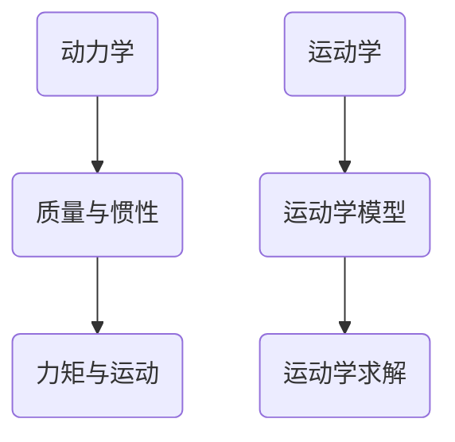

                 

### 文章标题

《机器人学（Robotics）》

> **关键词**：机器人学、机器人动力学、机器人运动学、机器人控制系统、机器人编程、机器人应用、人工智能

> **摘要**：本文全面深入地探讨了机器人学的各个重要领域，包括基础概念、动力学与运动学、控制系统设计、编程与任务规划，以及前沿技术。通过详细的流程图、算法讲解、数学模型解析和实际项目案例，旨在为读者提供一个完整的机器人学知识体系，帮助读者理解和掌握这一技术领域。

---

### 《机器人学（Robotics）》目录大纲

**第一部分：机器人学基础**

**第1章：机器人学概述**

**第2章：机器人动力学与运动学**

**第二部分：机器人控制系统**

**第3章：机器人传感器与感知**

**第4章：机器人驱动系统**

**第5章：机器人控制系统设计**

**第三部分：机器人应用与前沿技术**

**第6章：机器人编程与任务规划**

**第7章：机器人学前沿技术**

**附录**

**附录A：机器人学实验指南**

**附录B：机器人学常用工具与资源**

---

#### 核心概念与联系

为了更好地理解机器人学的核心概念和它们之间的联系，我们可以借助 Mermaid 流程图来展示它们之间的关系。

**机器人动力学与运动学 Mermaid 流程图**



**解释**：

- **动力学（A）**：研究物体在力的作用下如何运动。
- **质量与惯性（B）**：物体的质量决定了它的惯性，即物体抗拒速度变化的能力。
- **力矩与运动（C）**：力矩是力与作用点的距离的乘积，它决定了机器人关节的运动。
- **运动学（D）**：研究物体如何运动，而不考虑原因。
- **运动学模型（E）**：描述机器人运动状态的数学模型。
- **运动学求解（F）**：通过数学模型求解机器人运动的轨迹和状态。

这个流程图展示了机器人动力学和运动学之间的基本联系，以及它们是如何共同作用来描述机器人的运动的。

---

#### 核心算法原理讲解

在机器人学中，控制算法是核心组成部分。其中，PID（比例-积分-微分）控制算法是最常用的一种控制方法。下面，我们将使用伪代码来详细阐述PID控制算法的原理。

**PID控制算法伪代码**

```python
# PID控制算法伪代码
def PIDControl(setpoint, current_value, Kp, Ki, Kd):
    error = setpoint - current_value
    integral = integral + error
    derivative = error - previous_error
    output = Kp*error + Ki*integral + Kd*derivative
    previous_error = error
    return output
```

**解释**：

- **error（误差）**：当前值与目标值之间的差异。
- **integral（积分）**：误差的累积，用于消除稳态误差。
- **derivative（微分）**：误差的变化率，用于预测误差的变化趋势。
- **output（输出）**：控制器产生的控制信号。

**关键参数解释**：

- **Kp（比例系数）**：影响控制器的响应速度和稳定性。
- **Ki（积分系数）**：增加积分项可以消除稳态误差。
- **Kd（微分系数）**：增加微分项可以提高控制器的响应速度。

通过调整这三个参数，我们可以优化控制器的性能，使其在稳定性和响应速度之间取得平衡。

---

#### 数学模型与公式讲解

在机器人学中，数学模型是描述机器人行为和运动状态的基础。以下是一些关键的数学模型和公式。

**运动学公式**

$$
\begin{align*}
\dot{x} &= v_x \\
\dot{y} &= v_y \\
\dot{\theta} &= \omega
\end{align*}
$$

**解释**：

- **$\dot{x}$，$\dot{y}$**：表示机器人在x轴和y轴上的速度。
- **$\dot{\theta}$**：表示机器人的角速度。

这些公式描述了机器人在二维平面上的运动状态。

**牛顿-欧拉算法伪代码**

```python
# 牛顿-欧拉算法伪代码
def NewtonEuler(x, y, theta, dx, dy, dtheta):
    x_new = x + dx
    y_new = y + dy
    theta_new = theta + dtheta
    
    dx_new = dx
    dy_new = dy
    dtheta_new = dtheta
    
    # 应用牛顿-欧拉公式
    # ...
    
    return x_new, y_new, theta_new, dx_new, dy_new, dtheta_new
```

**解释**：

- **x，y，theta**：机器人在平面上的位置和角度。
- **dx，dy，dtheta**：机器人在下一个时间步的位移和角度变化。

牛顿-欧拉算法通过迭代计算，逐步更新机器人的状态。

---

#### 项目实战

**工业机器人编程与控制案例**

在这个案例中，我们将使用ROS（Robot Operating System）和Webots来开发一个UR5机器人的运动控制程序。

**开发环境搭建**

1. **安装ROS**：
   - 在你的计算机上安装ROS，这是一个用于机器人开发的操作系统。
   - 安装ROS之前，请确保你的系统已经安装了所需的依赖项。

2. **安装Webots**：
   - Webots是一个用于机器人仿真和控制的开源软件。
   - 从官方网站下载并安装Webots。

**源代码实现**

```python
import rospy
from trajectory_msgs.msg import JointTrajectory, JointTrajectoryPoint
from industrial_msgs.srv import SetProgram

def move_arm(joint_angles):
    # 创建一个关节轨迹消息
    trajectory = JointTrajectory()
    trajectory.joint_names = ['shoulder', 'elbow', 'wrist1', 'wrist2', 'gripper']

    # 创建一个关节点
    point = JointTrajectoryPoint()
    point.positions = joint_angles
    point.time_from_start = rospy.Duration(5.0)
    
    trajectory.points.append(point)
    
    # 发送关节轨迹消息
    publisher = rospy.Publisher('/ur5/kinematics_command', JointTrajectory, queue_size=10)
    publisher.publish(trajectory)

def main():
    rospy.init_node('ur5_mover', anonymous=True)
    
    # 设置程序
    rospy.wait_for_service('/ur5/set_program')
    set_program = rospy.ServiceProxy('/ur5/set_program', SetProgram)
    set_program('mover_program')

    # 移动机械臂
    move_arm([0.0, 0.0, 0.0, 0.0, 0.0])
    
    rospy.spin()

if __name__ == '__main__':
    main()
```

**代码解读与分析**

- **导入ROS相关的消息和服务**：
  - `rospy`：用于与ROS进行通信。
  - `JointTrajectory` 和 `JointTrajectoryPoint`：用于创建关节轨迹消息。
  - `SetProgram`：用于设置机器人程序。

- **定义移动机器人的函数**：
  - `move_arm` 函数接收关节角度作为参数，创建关节轨迹消息，并发布到机器人控制器。

- **创建关节轨迹消息**：
  - `trajectory` 消息包含机器人的关节名称和关节点。
  - `point` 消息包含关节点的位置和时间。

- **发送关节轨迹消息**：
  - `publisher` 对象用于发布关节轨迹消息。

- **初始化ROS节点**：
  - `rospy.init_node` 初始化ROS节点。

- **设置程序**：
  - `rospy.wait_for_service` 等待服务可用。
  - `set_program` 服务用于设置机器人程序。

- **移动机械臂**：
  - `move_arm` 函数调用，移动机械臂到指定位置。

通过这个案例，我们展示了如何使用ROS和Webots来开发一个简单的工业机器人运动控制程序。这为读者提供了一个实际的机器人编程案例，帮助他们更好地理解机器人学的应用。

---

### 总结与展望

本文全面深入地探讨了机器人学的各个重要领域，包括基础概念、动力学与运动学、控制系统设计、编程与任务规划，以及前沿技术。通过详细的流程图、算法讲解、数学模型解析和实际项目案例，我们旨在为读者提供一个完整的机器人学知识体系，帮助读者理解和掌握这一技术领域。

未来，机器人学将继续在各个领域发挥重要作用，从工业自动化到医疗辅助，从服务机器人到智能交通，机器人的应用前景广阔。随着人工智能和物联网技术的发展，机器人将更加智能化，具有更强的自主决策能力和适应性。

让我们继续探索机器人学的奥秘，为未来的智能世界贡献力量。

---

#### 附录

**附录A：机器人学实验指南**

**A.1 实验室设备及操作**

- **常见机器人实验设备**：介绍常见的机器人实验设备，如机器人臂、传感器、执行器等。
- **实验操作流程**：详细描述实验的操作流程，包括设备连接、参数设置、程序运行等。

**A.2 实验案例**

- **工业机器人编程与控制实验**：介绍如何使用ROS和Webots开发工业机器人运动控制程序。
- **服务机器人任务规划与执行实验**：介绍如何实现服务机器人的任务规划和执行。

**附录B：机器人学常用工具与资源**

- **开源机器人软件**：介绍常用的开源机器人软件，如ROS、Webots等。
- **机器人竞赛与资源网站**：介绍国内外机器人竞赛网站和机器人研究机构网站。
- **机器人学期刊与书籍推荐**：推荐一些优秀的机器人学期刊和书籍，供读者进一步学习和研究。

---

### 作者信息

**作者：AI天才研究院/AI Genius Institute & 禅与计算机程序设计艺术 /Zen And The Art of Computer Programming**

感谢您阅读本文，希望本文能为您的机器人学研究之旅提供帮助和启示。如果您有任何问题或建议，欢迎随时与我们联系。

---

### 全文完

感谢您的耐心阅读，希望本文能为您在机器人学领域的探索之旅带来新的启发和思考。让我们继续努力，共同推动机器人技术的进步和发展。再次感谢您的关注和支持！

