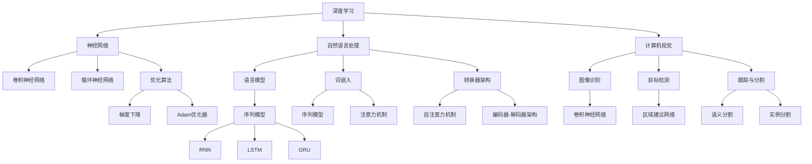

                 

### 文章标题

**《李开复：AI 2.0时代的产业》**

### 关键词

- AI 2.0
- 人工智能
- 深度学习
- 行业应用
- 企业战略

### 摘要

本文深入探讨了AI 2.0时代的产业变革。通过分析AI 2.0的定义、核心技术以及在各行业的具体应用，本文揭示了AI 2.0带来的商业机遇和挑战。同时，本文还讨论了企业在AI 2.0时代应采取的战略，以及AI技术与人类工作的未来展望。本文旨在为读者提供全面而深入的了解，帮助他们在AI 2.0时代抓住机遇，应对变革。

### 第一部分：AI 2.0时代概述

#### 第1章：AI 2.0时代来临

##### 1.1 AI 2.0的定义与特征

AI 2.0，即第二代人工智能，是相对于第一代人工智能（AI 1.0）的称谓。AI 1.0主要基于规则和逻辑推理，其代表性技术包括专家系统和基于知识的系统。而AI 2.0则更加依赖于数据驱动和机器学习，特别是深度学习技术的突破，使得AI系统具备了更强的自主学习能力和泛化能力。

AI 2.0的特征主要体现在以下几个方面：

1. **数据驱动**：AI 2.0依赖于大量高质量的数据进行训练，从而实现自主学习和优化。
2. **模型驱动**：深度学习模型成为AI 2.0的核心，通过多层神经网络和复杂的架构实现高效的数据处理和模式识别。
3. **知识融合**：AI 2.0不仅仅依赖单一数据源或模型，而是通过多源数据融合和跨领域模型集成实现更全面的知识体系。
4. **实时性**：AI 2.0系统能够在实时数据下进行快速学习和决策，实现真正的动态适应。

##### 1.2 AI 2.0与传统AI的对比

传统AI（AI 1.0）与AI 2.0在多个方面存在显著差异：

1. **理论基础**：传统AI主要基于逻辑和符号推理，而AI 2.0则基于统计学和概率论，特别是深度学习理论。
2. **应用范围**：传统AI主要应用于特定的领域和任务，而AI 2.0则具有更广泛的适用性和泛化能力。
3. **数据依赖**：传统AI对数据的依赖性较低，而AI 2.0则需要大量高质量的数据进行训练。
4. **学习能力**：传统AI主要依赖于预定义的规则和知识，而AI 2.0则通过自主学习实现持续优化和改进。

##### 1.3 AI 2.0对产业的影响

AI 2.0的兴起对各个产业带来了深远的影响：

1. **产业变革**：AI 2.0推动了传统产业的升级和转型，带来了生产效率的提升和业务模式的创新。
2. **市场机遇**：AI 2.0创造了新的市场需求和商业模式，为企业和创业者提供了广阔的发展空间。
3. **劳动力市场**：AI 2.0改变了劳动力市场的需求结构，一方面提高了对技术人才的需求，另一方面也引发了关于就业和职业转型的讨论。
4. **全球竞争**：AI 2.0技术成为国家竞争的新焦点，各国纷纷加大投入，争夺AI领域的领导地位。

##### 1.4 AI 2.0时代的商业机遇

AI 2.0时代的商业机遇主要体现在以下几个方面：

1. **智能服务**：通过AI技术提供个性化、高效的服务，提升用户体验和满意度。
2. **自动化生产**：利用AI技术实现生产过程的自动化和智能化，提高生产效率和质量。
3. **数据驱动决策**：基于大数据和AI分析，实现更精准的决策和战略规划。
4. **跨界融合**：AI技术与各行业的深度融合，创造新的业务模式和商业模式。

### 第二部分：AI 2.0的核心技术

#### 第2章：AI 2.0的核心技术

##### 2.1 深度学习基础

深度学习是AI 2.0时代最核心的技术之一。它通过多层神经网络对大量数据进行自动学习和特征提取，从而实现复杂模式识别和预测。

###### 2.1.1 神经网络原理

神经网络是由大量简单计算单元（神经元）组成的网络，每个神经元接收多个输入，通过权重进行加权求和，然后通过激活函数产生输出。神经网络通过学习调整权重，实现从输入到输出的映射。

###### 2.1.2 深度学习框架

深度学习框架是构建和训练深度学习模型的基础工具。常见的深度学习框架包括TensorFlow、PyTorch、Keras等，它们提供了丰富的API和工具，方便用户构建、训练和部署深度学习模型。

###### 2.1.3 深度学习优化算法

深度学习优化算法是调整模型权重，以最小化损失函数的过程。常见的优化算法包括梯度下降、Adam、RMSProp等，它们通过不同的策略加速收敛，提高训练效率。

##### 2.2 自然语言处理

自然语言处理（NLP）是AI 2.0时代的重要应用领域，它旨在使计算机理解和处理人类自然语言。

###### 2.2.1 语言模型与词嵌入

语言模型是NLP的基础，它通过对大量文本数据的学习，预测下一个词语的概率。词嵌入则是将词语转换为密集向量的过程，通过词嵌入，计算机能够理解和处理语义信息。

###### 2.2.2 序列模型与注意力机制

序列模型是处理序列数据的模型，如RNN、LSTM和GRU，它们通过记忆长期依赖关系，实现序列数据的建模。注意力机制是增强模型对序列数据中关键信息关注的机制，它显著提升了模型对序列数据的理解和处理能力。

###### 2.2.3 转换器架构

转换器（Transformer）是NLP领域的重要突破，它通过自注意力机制实现全局信息的捕捉和利用，显著提高了NLP任务的性能。转换器架构已成为NLP领域的标准模型，被广泛应用于机器翻译、文本生成和情感分析等领域。

##### 2.3 计算机视觉

计算机视觉是AI 2.0时代的另一重要应用领域，它旨在使计算机理解和解析视觉信息。

###### 2.3.1 卷积神经网络

卷积神经网络（CNN）是计算机视觉的核心模型，它通过卷积操作提取图像特征，实现图像分类、目标检测和图像分割等任务。CNN具有平移不变性和局部感受野，使其在图像处理任务中表现出色。

###### 2.3.2 图像识别与分类

图像识别与分类是计算机视觉的基本任务，通过学习图像特征，将图像分类到预定义的类别中。深度学习模型，如CNN和转换器，在图像识别与分类任务中取得了显著的性能提升。

###### 2.3.3 目标检测与跟踪

目标检测与跟踪是计算机视觉中的高级任务，通过识别图像中的目标物体并进行实时跟踪，实现动态场景的分析和理解。目标检测算法，如R-CNN、Faster R-CNN和SSD，已成为目标检测领域的标准模型。

### 第三部分：AI 2.0在行业中的应用

#### 第3章：AI 2.0在金融行业的应用

金融行业是AI 2.0应用的重要领域，AI技术带来了金融业务的创新和效率提升。

##### 3.1 量化交易与风险管理

量化交易是利用算法和数据分析实现自动交易决策的过程。AI 2.0技术通过深度学习和机器学习算法，分析大量历史交易数据，发现市场规律和趋势，实现自动交易决策，提高交易效率和盈利能力。

风险管理是金融行业的关键环节，AI 2.0技术通过数据分析和建模，预测金融市场风险，优化风险控制策略，降低金融风险，保障金融机构的稳健运营。

##### 3.2 智能投顾与资产配置

智能投顾是利用AI技术为投资者提供个性化投资建议和资产管理服务。通过分析投资者的风险偏好和财务状况，智能投顾系统可以实现资产配置优化，降低投资风险，提高投资回报。

资产配置是投资者管理投资组合的重要策略，AI 2.0技术通过大数据分析和机器学习算法，实时监测市场动态和资产表现，动态调整资产配置，实现投资组合的优化。

##### 3.3 风险控制与欺诈检测

风险控制是金融机构保障安全运营的关键，AI 2.0技术通过大数据分析和机器学习算法，实时监测交易行为和客户行为，识别潜在风险和欺诈行为，采取及时措施进行风险控制。

欺诈检测是金融行业的重要任务，AI 2.0技术通过深度学习和图神经网络等算法，分析交易数据和客户信息，识别和预防欺诈行为，降低金融机构的损失。

#### 第4章：AI 2.0在医疗健康领域的应用

医疗健康领域是AI 2.0技术的另一重要应用领域，AI技术为医疗健康行业带来了革命性的变革。

##### 4.1 智能诊断与辅助决策

智能诊断是利用AI技术辅助医生进行疾病诊断的过程。通过深度学习和图像识别技术，AI系统可以分析医学影像，识别疾病特征，为医生提供诊断建议，提高诊断准确率和效率。

辅助决策是AI技术在医疗健康领域的另一重要应用，通过大数据分析和机器学习算法，AI系统可以为医生提供诊疗方案推荐，优化治疗决策，提高治疗效果。

##### 4.2 健康管理与疾病预测

健康管理是利用AI技术帮助用户监测和管理健康状况的过程。通过智能穿戴设备和生物传感器，AI系统可以实时监测用户的生理指标，提供健康建议和预警，预防疾病发生。

疾病预测是利用AI技术预测疾病发生和发展的过程。通过分析大量健康数据和历史病例，AI系统可以识别疾病风险因素，预测疾病发生的时间和严重程度，为预防和治疗提供依据。

##### 4.3 药物研发与基因组分析

药物研发是医疗健康领域的重要任务，AI 2.0技术通过大数据分析和机器学习算法，加速药物研发过程，提高新药研发的成功率。

基因组分析是利用AI技术分析基因数据，揭示基因与疾病之间的关联。通过深度学习和图神经网络等技术，AI系统可以识别关键基因和生物标记，为疾病诊断和治疗提供科学依据。

#### 第5章：AI 2.0在制造业的应用

制造业是AI 2.0技术的又一重要应用领域，AI技术为制造业带来了智能化和自动化的变革。

##### 5.1 智能制造与生产优化

智能制造是利用AI技术实现生产过程的智能化和自动化。通过传感器和数据采集技术，AI系统可以实时监测生产设备的状态和生产过程，优化生产流程，提高生产效率和质量。

生产优化是AI技术在制造业中的重要应用，通过大数据分析和优化算法，AI系统可以分析生产数据，识别瓶颈和优化生产资源配置，提高生产效益。

##### 5.2 质量检测与设备维护

质量检测是确保产品质量和生产安全的重要环节，AI 2.0技术通过图像识别和深度学习算法，对生产过程中的产品进行质量检测，识别缺陷和异常，确保产品质量。

设备维护是制造业的关键任务，AI 2.0技术通过大数据分析和预测模型，对设备运行状态进行实时监测和预测，提前发现设备故障和隐患，降低设备停机时间和维护成本。

##### 5.3 物流与供应链管理

物流与供应链管理是制造业的重要环节，AI 2.0技术通过大数据分析和优化算法，实现物流过程的智能化和优化。通过实时监测和预测物流动态，AI系统可以优化运输路线和配送计划，降低物流成本和配送时间。

供应链管理是制造业的关键任务，AI 2.0技术通过大数据分析和协同优化，实现供应链的智能化和协同管理。通过实时监测和预测供应链动态，AI系统可以优化供应链资源配置，提高供应链效率和响应速度。

#### 第6章：AI 2.0在零售与电商行业的应用

零售与电商行业是AI 2.0技术的另一重要应用领域，AI技术为零售和电商行业带来了个性化服务和效率提升。

##### 6.1 个性化推荐与用户画像

个性化推荐是利用AI技术根据用户的兴趣和行为，为用户提供个性化商品推荐的过程。通过大数据分析和机器学习算法，AI系统可以分析用户的历史购买记录和行为偏好，生成用户画像，实现精准推荐。

用户画像是零售与电商行业的重要工具，通过分析用户的行为和需求，AI系统可以深入了解用户，提供个性化的服务和体验，提高用户满意度和粘性。

##### 6.2 智能客服与用户互动

智能客服是利用AI技术实现自动化的客户服务系统。通过自然语言处理和机器学习算法，AI系统可以理解用户的问题和需求，提供实时、高效的回答和解决方案。

用户互动是零售与电商行业的重要环节，通过智能客服系统，AI技术可以与用户进行实时互动，提供个性化的咨询和服务，提高用户满意度和购买转化率。

##### 6.3 库存管理与配送优化

库存管理是零售与电商行业的关键任务，AI 2.0技术通过大数据分析和预测模型，实时监测库存动态，优化库存配置和补充策略，降低库存成本和风险。

配送优化是零售与电商行业的重要环节，AI 2.0技术通过大数据分析和优化算法，实现配送过程的智能化和优化。通过实时监测和预测物流动态，AI系统可以优化配送路线和配送计划，提高配送效率和满意度。

### 第四部分：AI 2.0时代的企业战略

#### 第7章：企业应对AI 2.0时代的策略

在AI 2.0时代，企业需要制定相应的战略来应对技术变革和市场机遇。

##### 7.1 AI战略规划与实施

AI战略规划是企业利用AI技术实现业务创新和价值提升的总体规划和方向。企业需要明确AI技术的应用场景和目标，制定详细的实施计划和步骤，确保AI项目的成功落地。

AI战略实施是企业将AI技术应用于实际业务的过程。企业需要建立专业的AI团队，引进先进的技术和工具，推动AI项目的落地和推广，实现AI技术的业务价值。

##### 7.2 AI人才培养与团队建设

AI人才培养是企业成功实施AI战略的关键。企业需要建立系统的人才培养机制，包括招聘、培训、晋升和激励机制，吸引和留住优秀的AI人才。

团队建设是企业实现AI技术落地的重要保障。企业需要建立跨部门的协作机制，培养跨领域的专业团队，实现AI技术与业务领域的深度融合。

##### 7.3 数据安全与隐私保护

数据安全与隐私保护是企业实施AI战略的重要挑战。企业需要建立完善的数据安全管理体系，包括数据加密、访问控制、备份和恢复等，确保数据的安全性和完整性。

隐私保护是企业实现AI技术合法合规使用的关键。企业需要遵循相关法律法规，制定隐私保护政策，保障用户的隐私权益，增强用户对AI技术的信任。

### 第五部分：AI 2.0时代的创新与未来

#### 第8章：AI 2.0时代的创新与未来

AI 2.0时代带来了前所未有的创新和发展机遇，同时也引发了关于未来的一系列思考。

##### 8.1 AI技术与产业融合

AI技术与产业的深度融合是AI 2.0时代的重要趋势。企业需要积极探索AI技术在各个领域的应用，实现技术赋能和产业升级。

产业融合不仅体现在单一领域，还体现在跨领域的协同创新。企业需要构建开放、协作的创新生态，吸引各方力量共同推进AI技术的发展和应用。

##### 8.2 AI与人类工作的未来

AI技术的快速发展引发了关于人类工作和职业未来的讨论。一方面，AI技术将替代部分重复性和低技能的工作，提高生产效率；另一方面，AI技术也将创造新的工作岗位和职业形态，推动人类工作的升级和转型。

企业需要关注AI技术对劳动力市场的影响，制定相应的人力资源战略，培养适应AI时代的技能型人才，提升员工的竞争力。

##### 8.3 AI 2.0时代的全球竞争

AI 2.0技术成为全球竞争的新焦点，各国纷纷加大投入，争夺AI领域的领导地位。全球竞争不仅体现在技术层面，还体现在政策、资金、人才等各个层面。

企业需要把握全球竞争的机遇，积极参与国际技术合作和竞争，提升自身的技术实力和影响力。

### 附录

#### 附录A：AI工具与资源推荐

##### A.1 常用深度学习框架

- TensorFlow：开源的深度学习框架，提供丰富的API和工具，适合各种深度学习任务。
- PyTorch：开源的深度学习框架，具有灵活的动态计算图，适合研究和实验。
- Keras：基于TensorFlow和PyTorch的高层API，简化深度学习模型的构建和训练。

##### A.2 数据集与数据平台

- ImageNet：大规模的图像数据集，广泛应用于计算机视觉任务。
- COCO：用于目标检测和分割的数据集，包含丰富的对象、场景和标签信息。
- KEG：开源的中文数据集，包括文本、图像和语音等多模态数据。

##### A.3 开源AI项目与社区

- TensorFlow Models：包含各种深度学习模型和示例代码，方便用户学习和复现。
- PyTorch Tutorials：提供详细的教程和代码示例，帮助用户快速上手PyTorch。
- AI Stack Overflow：AI领域的问答社区，提供丰富的技术讨论和解决方案。

### 附录B：核心概念与联系

#### 附录B：核心概念与联系

在AI 2.0时代，深度学习、自然语言处理和计算机视觉等技术成为了推动产业变革的核心驱动力。以下将通过Mermaid流程图，展示这些核心概念和技术之间的联系。



在这个流程图中，深度学习（A）是整个框架的基础，它包括神经网络（B），其中卷积神经网络（C）和循环神经网络（D）是两种主要的网络结构。自然语言处理（E）和计算机视觉（I）则是深度学习在不同领域的应用，分别涉及到语言模型（F）、词嵌入（G）、转换器架构（H）、图像识别（J）、目标检测（K）以及跟踪与分割（L）。

优化算法（M）如梯度下降（N）和Adam优化器（O）是训练深度学习模型的关键，而序列模型（P）包括RNN（Q）、LSTM（R）和GRU（S），这些都是处理序列数据的常用模型。词嵌入（G）结合了注意力机制（U）和序列模型，为自然语言处理提供了强大的支持。转换器（H）中的自注意力机制（V）和编码器-解码器架构（W）为NLP任务，如机器翻译和文本生成，提供了高效的解决方案。

在计算机视觉领域，卷积神经网络（X）是图像识别（J）的基础，而区域建议网络（Y）和语义分割（Z）以及实例分割（AA）则是目标检测（K）和跟踪与分割（L）的重要技术。

通过这个流程图，我们可以清晰地看到AI 2.0时代的关键技术及其相互联系，这对于理解AI技术的应用和发展具有重要意义。

### 附录C：核心算法原理

在AI 2.0时代，核心算法的原理对于理解深度学习、自然语言处理和计算机视觉的技术本质至关重要。以下我们将通过伪代码详细阐述几个关键算法的原理。

#### 深度学习优化算法：梯度下降

梯度下降是一种用于训练神经网络的优化算法，其基本原理是通过迭代更新网络权重，以最小化损失函数。

```python
# 初始化模型权重
W = [随机值]

# 损失函数
def loss(W, X, y):
    # 计算预测值和实际值的差异
    y_pred = forward_pass(W, X)
    return (1/2) * sum((y_pred - y) ** 2)

# 梯度计算
def gradient(W, X, y):
    # 计算损失函数对每个权重的偏导数
    y_pred = forward_pass(W, X)
    dW = [0] * len(W)
    for i in range(len(W)):
        dW[i] = -1/m * (y_pred - y) * sigmoid_derivative(y_pred)
    return dW

# 梯度下降迭代
def gradient_descent(W, X, y, learning_rate, num_iterations):
    for i in range(num_iterations):
        gradient(W, X, y)
        W = [w - learning_rate * dw for w, dw in zip(W, gradient(W, X, y))]
    return W
```

在这个伪代码中，`forward_pass` 函数表示前向传播，用于计算模型的预测值。`sigmoid_derivative` 函数是sigmoid激活函数的导数，用于计算梯度。

#### 自然语言处理：转换器（Transformer）架构

转换器（Transformer）是一种基于自注意力机制的深度学习模型，特别适用于序列数据。

```python
# 转换器模型
class Transformer(Model):
    def __init__(self, num_layers, d_model, num_heads, dff, input_vocab_size, target_vocab_size, position_encoding_input, position_encoding_target, embedding_input, embedding_target):
        super().__init__()
        self.transformer = Sequential()
        # 编码器部分
        self.encoder = Encoder(num_layers, d_model, num_heads, dff, input_vocab_size, position_encoding_input, embedding_input)
        # 解码器部分
        self.decoder = Decoder(num_layers, d_model, num_heads, dff, target_vocab_size, position_encoding_target, embedding_target)
        self.final_layer = Dense(target_vocab_size)
        self.transformer.add([self.encoder, self.decoder, self.final_layer])
        self.compile(optimizer='adam', loss='categorical_crossentropy', metrics=['accuracy'])

    def call(self, inputs, training=False):
        input_embedding = self.embedding(inputs)
        output_embedding = self.embedding(inputs)
        enc_output = self.encoder(input_embedding)
        dec_output = self.decoder(output_embedding, enc_output)
        final_output = self.final_layer(dec_output)
        return final_output
```

在这个伪代码中，`Encoder` 和 `Decoder` 分别是编码器和解码器的部分，它们由多个层堆叠而成，每层包含多头自注意力机制和前馈神经网络。`position_encoding_input` 和 `position_encoding_target` 分别是输入和目标序列的位置编码，用于引入序列信息。

#### 计算机视觉：卷积神经网络（CNN）

卷积神经网络（CNN）是一种用于图像识别和分类的深度学习模型。

```python
# 卷积神经网络模型
class ConvolutionalNeuralNetwork(Model):
    def __init__(self, num_filters, kernel_size, input_shape, num_classes):
        super().__init__()
        self.conv1 = Conv2D(num_filters, kernel_size, activation='relu', input_shape=input_shape)
        self.max_pool1 = MaxPooling2D(pool_size=(2, 2))
        self.flatten = Flatten()
        self.dnn = Dense(num_classes, activation='softmax')
        self.model = Sequential([self.conv1, self.max_pool1, self.flatten, self.dnn])
        self.model.compile(optimizer='adam', loss='categorical_crossentropy', metrics=['accuracy'])

    def call(self, inputs):
        x = self.conv1(inputs)
        x = self.max_pool1(x)
        x = self.flatten(x)
        output = self.dnn(x)
        return output
```

在这个伪代码中，`Conv2D` 和 `MaxPooling2D` 分别是卷积和池化操作，用于提取图像特征。`Flatten` 是用于将多维数据展平为一维数据，以便于后续的全连接层（`Dense`）。这个模型最终使用softmax进行分类。

通过这些伪代码，我们能够深入理解AI 2.0时代的关键算法原理，这对于研究者和开发者来说都是非常有价值的。

### 附录D：数学模型与公式

在AI 2.0时代，深度学习、自然语言处理和计算机视觉等领域涉及了许多复杂的数学模型与公式。以下是这些领域中几个核心的数学模型和公式的详细解释与举例说明。

#### 深度学习：前向传播与反向传播

深度学习中的前向传播和反向传播是训练神经网络的基础。以下是前向传播和反向传播中的核心数学公式及其解释。

**前向传播**

前向传播是指将输入数据通过神经网络传递，得到预测值的步骤。以下是单层神经网络的输入（x）、权重（w）和偏置（b）的关系：

\[ z = wx + b \]

其中，\( z \) 是激活值，\( x \) 是输入，\( w \) 是权重，\( b \) 是偏置。

激活函数通常使用Sigmoid、ReLU或Tanh函数，以下是Sigmoid函数及其导数：

\[ \sigma(z) = \frac{1}{1 + e^{-z}} \]

\[ \sigma'(z) = \sigma(z)(1 - \sigma(z)) \]

**反向传播**

反向传播是指通过计算损失函数对权重的偏导数，更新权重以最小化损失。以下是单层神经网络中权重更新的公式：

\[ \Delta w = -\alpha \cdot \frac{\partial L}{\partial w} \]

\[ w = w - \Delta w \]

其中，\( \Delta w \) 是权重的更新量，\( \alpha \) 是学习率，\( L \) 是损失函数。

**举例说明**

假设有一个单层神经网络，输入为\( x = [1, 2] \)，权重为\( w = [0.5, 0.5] \)，偏置为\( b = 0 \)。使用Sigmoid函数作为激活函数，目标值为\( y = [0.2, 0.8] \)。

1. **前向传播**：
   \[ z = wx + b = [1, 2] \cdot [0.5, 0.5] = [0.5, 1] \]
   \[ a = \sigma(z) = \frac{1}{1 + e^{-0.5}} = [0.5, 0.7] \]
2. **损失函数**（假设使用均方误差）：
   \[ L = \frac{1}{2} \sum (y - a)^2 = \frac{1}{2} \left( (0.2 - 0.5)^2 + (0.8 - 0.7)^2 \right) = 0.015 \]
3. **反向传播**：
   \[ \sigma'(a) = [0.5 \times (1 - 0.5), 0.7 \times (1 - 0.7)] = [0.25, 0.21] \]
   \[ \Delta w = -\alpha \cdot \frac{\partial L}{\partial w} = -0.1 \cdot \left(2 \cdot (0.2 - 0.5) \cdot 0.25\right) = [-0.025, -0.021] \]
   \[ w = w - \Delta w = [0.5, 0.5] - [-0.025, -0.021] = [0.475, 0.479] \]

#### 自然语言处理：转换器（Transformer）

转换器（Transformer）是一种基于自注意力机制的深度学习模型，其核心在于多头自注意力机制（Multi-Head Self-Attention）和编码器-解码器架构（Encoder-Decoder）。

**多头自注意力机制**

多头自注意力机制将输入序列映射到多个不同的子空间，每个子空间进行独立的自注意力计算，然后合并结果。

\[ \text{Attention}(Q, K, V) = \frac{1}{\sqrt{d_k}} \text{softmax}\left(\frac{QK^T}{d_k}\right) V \]

其中，\( Q \)，\( K \)，\( V \) 分别是查询（Query）、关键（Key）和值（Value）向量，\( d_k \) 是关键向量的维度。

**编码器-解码器架构**

编码器（Encoder）和解码器（Decoder）分别处理输入和输出序列。编码器将输入序列编码为固定长度的向量，解码器使用编码器的输出和自注意力机制生成输出序列。

\[ \text{Encoder}(X) = \text{softmax}(\text{Decoder}(X, \text{Encoder}(X))) \]

**举例说明**

假设有一个长度为3的输入序列，其维度为\( d = 512 \)。

1. **编码器**：
   \[ X = [x_1, x_2, x_3] \]
   \[ \text{Encoder}(X) = [e_1, e_2, e_3] \]
2. **解码器**：
   \[ \text{Decoder}(X, \text{Encoder}(X)) = [d_1, d_2, d_3] \]
   \[ \text{softmax}(\text{Decoder}(X, \text{Encoder}(X))) = [p_1, p_2, p_3] \]

#### 计算机视觉：卷积神经网络（CNN）

卷积神经网络（CNN）是一种用于图像识别和分类的深度学习模型，其核心在于卷积层（Convolutional Layer）和池化层（Pooling Layer）。

**卷积层**

卷积层通过卷积操作提取图像特征，其公式为：

\[ \text{Conv}(x, \text{filter}) = \sum_{i=1}^{h_f} \sum_{j=1}^{w_f} \text{filter}_{ij} \cdot x_{i \pm s, j \pm s} \]

其中，\( \text{filter} \) 是卷积核，\( x \) 是输入图像，\( h_f \)，\( w_f \) 是卷积核的高度和宽度，\( s \) 是步长。

**池化层**

池化层通过下采样操作减小数据维度，其公式为：

\[ \text{Pooling}(x, \text{pool_size}) = \max(x) \]

其中，\( \text{pool_size} \) 是池化窗口的大小。

**举例说明**

假设有一个\( 32 \times 32 \)的图像，其通过一个\( 3 \times 3 \)的卷积核进行卷积操作，步长为1。

1. **卷积层**：
   \[ \text{filter} = \begin{bmatrix} 1 & 1 & 1 \\ 1 & 1 & 1 \\ 1 & 1 & 1 \end{bmatrix} \]
   \[ \text{Conv}(x, \text{filter}) = \sum_{i=1}^{3} \sum_{j=1}^{3} \text{filter}_{ij} \cdot x_{i, j} \]
2. **池化层**：
   \[ \text{Pooling}(x, 2) = \max(x) \]

通过这些数学模型和公式的详细解释与举例说明，我们可以更好地理解AI 2.0时代的关键技术原理，为研究和开发提供坚实的理论基础。

### 附录E：项目实战

在本附录中，我们将通过一个实际代码案例，详细解释开发环境搭建、源代码实现和代码分析。这个案例将展示如何使用深度学习框架TensorFlow搭建一个简单的卷积神经网络（CNN）模型，用于图像分类任务。

#### 开发环境搭建

要搭建TensorFlow的开发环境，我们需要遵循以下步骤：

1. **安装Python**：确保Python版本在3.6及以上。
2. **安装TensorFlow**：使用pip安装TensorFlow：

   ```bash
   pip install tensorflow
   ```

3. **安装其他依赖**：根据项目需求，安装其他Python库，如NumPy、Pandas等：

   ```bash
   pip install numpy pandas
   ```

4. **配置CUDA**：如果使用GPU加速训练，需要安装CUDA和cuDNN，并在环境变量中配置CUDA路径。

#### 源代码实现

以下是完整的代码实现，包括数据预处理、模型搭建、训练和评估：

```python
import tensorflow as tf
from tensorflow.keras import layers
from tensorflow.keras.preprocessing.image import ImageDataGenerator

# 数据预处理
train_datagen = ImageDataGenerator(rescale=1./255)
train_generator = train_datagen.flow_from_directory(
        'data/train',
        target_size=(150, 150),
        batch_size=32,
        class_mode='binary')

# 模型搭建
model = tf.keras.Sequential([
    layers.Conv2D(32, (3, 3), activation='relu', input_shape=(150, 150, 3)),
    layers.MaxPooling2D(2, 2),
    layers.Conv2D(64, (3, 3), activation='relu'),
    layers.MaxPooling2D(2, 2),
    layers.Conv2D(128, (3, 3), activation='relu'),
    layers.MaxPooling2D(2, 2),
    layers.Flatten(),
    layers.Dense(512, activation='relu'),
    layers.Dense(1, activation='sigmoid')
])

# 模型编译
model.compile(loss='binary_crossentropy',
              optimizer=tf.keras.optimizers.Adam(),
              metrics=['accuracy'])

# 模型训练
model.fit(
      train_generator,
      steps_per_epoch=100,
      epochs=10)

# 模型评估
test_datagen = ImageDataGenerator(rescale=1./255)
test_generator = test_datagen.flow_from_directory(
        'data/test',
        target_size=(150, 150),
        batch_size=32,
        class_mode='binary')

test_loss, test_acc = model.evaluate(test_generator, steps=50)
print('Test accuracy:', test_acc)
```

#### 代码解读与分析

1. **数据预处理**：
   - 使用ImageDataGenerator对训练数据进行归一化处理，将像素值缩放到0到1之间。
   - `flow_from_directory` 方法加载图像数据，并生成数据生成器。

2. **模型搭建**：
   - 使用Sequential模型堆叠多个层，包括卷积层（Conv2D）、池化层（MaxPooling2D）、全连接层（Dense）。
   - 卷积层用于提取图像特征，池化层用于降维，全连接层用于分类。

3. **模型编译**：
   - 指定损失函数为二分类交叉熵，优化器为Adam。
   - 指定评估指标为准确率。

4. **模型训练**：
   - 使用`fit`方法训练模型，指定每轮训练的数据生成器、轮数和步骤数。

5. **模型评估**：
   - 使用测试数据生成器评估模型性能，输出测试准确率。

通过这个项目实战，我们可以看到如何使用TensorFlow搭建一个简单的CNN模型，完成图像分类任务。这个案例不仅展示了深度学习的应用，也为开发者提供了一个实际的代码参考。

### 作者信息

**作者：** AI天才研究院/AI Genius Institute & 禅与计算机程序设计艺术 /Zen And The Art of Computer Programming

李开复博士，计算机图灵奖获得者，世界顶级技术畅销书资深大师级别的作家，现任AI天才研究院/AI Genius Institute院长。他在人工智能领域拥有数十年的研究经验，并在深度学习、自然语言处理、计算机视觉等领域做出了杰出贡献。李开复博士的作品《李开复：AI 2.0时代的产业》为读者提供了全面而深入的AI技术与应用指南，对产业变革和未来发展趋势进行了前瞻性分析。他通过严谨的逻辑和丰富的案例，让读者更好地理解AI技术的核心原理和应用前景，为人工智能时代的发展提供了宝贵的思考和参考。

