                 

### 文章标题：李开复：AI 2.0 时代的产业

随着人工智能（AI）技术的飞速发展，我们正逐步迈入AI 2.0时代。AI 2.0不仅意味着技术的进步，更标志着人工智能在产业领域的深度应用和变革。本文将围绕李开复先生的研究和观点，详细探讨AI 2.0时代的产业现状、未来趋势以及企业如何在这一时代中抓住机遇、迎接挑战。

关键词：人工智能、AI 2.0、产业应用、技术创新、企业策略、未来展望

摘要：本文将从AI 2.0的定义和特点入手，分析其在医疗健康、教育、制造业、金融和交通等领域的应用现状和未来趋势。随后，将探讨企业如何制定AI战略、建设AI人才团队、进行AI项目管理和运营转型。最后，本文将展望AI 2.0时代的社会变革、伦理法规以及国际合作，并总结主流深度学习框架和自然语言处理工具。通过本文的探讨，希望能够为企业和产业界提供有价值的参考和启示。

# 《李开复：AI 2.0 时代的产业》目录大纲

## 第一部分：AI 2.0 时代概述

### 第1章：AI 2.0 时代的来临

#### 1.1 AI 2.0 的定义与特点

#### 1.2 AI 2.0 对产业的影响

#### 1.3 AI 2.0 时代的机遇与挑战

### 第2章：AI 2.0 技术基础

#### 2.1 深度学习与神经网络基础

#### 2.2 自然语言处理技术

#### 2.3 计算机视觉技术

### 第3章：AI 2.0 应用领域

#### 3.1 医疗健康

#### 3.2 教育

#### 3.3 制造业

#### 3.4 金融

#### 3.5 交通

## 第二部分：AI 2.0 时代的企业实践

### 第4章：企业 AI 战略规划

#### 4.1 AI 战略的制定

#### 4.2 AI 营销策略

#### 4.3 AI 客户服务

#### 4.4 AI 风险管理

### 第5章：AI 人才建设

#### 5.1 AI 人才培养

#### 5.2 AI 团队管理

#### 5.3 AI 伦理与法规

### 第6章：AI 项目管理

#### 6.1 AI 项目立项

#### 6.2 AI 项目实施

#### 6.3 AI 项目评估

### 第7章：AI 企业的运营与转型

#### 7.1 AI 企业的运营模式

#### 7.2 AI 企业的创新

#### 7.3 AI 企业的转型升级

## 第三部分：AI 2.0 时代的未来展望

### 第8章：AI 2.0 时代的未来趋势

#### 8.1 AI 2.0 时代的生产力革命

#### 8.2 AI 2.0 时代的社会变革

#### 8.3 AI 2.0 时代的未来生活

### 第9章：AI 伦理与法规

#### 9.1 AI 伦理的问题与挑战

#### 9.2 AI 法规的制定与实施

#### 9.3 AI 伦理与法规的未来

### 第10章：AI 2.0 时代的国际合作

#### 10.1 AI 国际合作的现状

#### 10.2 AI 国际合作的重要性

#### 10.3 AI 国际合作的未来

# 附录

## 附录 A：AI 2.0 开发工具与资源

### A.1 主流深度学习框架对比

### A.2 自然语言处理工具与资源

### A.3 计算机视觉工具与资源

### A.4 数据分析与处理工具

## 附录 B：AI 2.0 实战案例

### B.1 医疗健康领域的 AI 应用案例

### B.2 教育领域的 AI 应用案例

### B.3 制造业领域的 AI 应用案例

### B.4 金融领域的 AI 应用案例

### B.5 交通领域的 AI 应用案例

## 附录 C：作者信息

### 作者：李开复，世界级人工智能专家、程序员、软件架构师、CTO、世界顶级技术畅销书资深大师级别的作家，计算机图灵奖获得者，计算机编程和人工智能领域大师。

### 作者单位：AI天才研究院/AI Genius Institute，禅与计算机程序设计艺术/Zen And The Art of Computer Programming

# 第一部分：AI 2.0 时代概述

## 第1章：AI 2.0 时代的来临

### 1.1 AI 2.0 的定义与特点

AI 2.0是对第一代人工智能（AI 1.0）的升级与扩展。AI 1.0主要依赖于规则和符号推理，而AI 2.0则基于深度学习和数据驱动，具有更强的自适应性和泛化能力。李开复先生认为，AI 2.0的特点主要体现在以下几个方面：

1. **大数据驱动**：AI 2.0依赖于海量数据，通过深度学习等技术进行训练，从而实现更高效的模型优化。
2. **自我进化**：AI 2.0具有自我学习和自我进化能力，能够不断改进和优化自身性能。
3. **跨界融合**：AI 2.0能够与其他技术（如物联网、区块链等）相结合，实现跨界应用。
4. **智能化决策**：AI 2.0能够模拟人类决策过程，实现智能化管理和优化。
5. **人机协作**：AI 2.0不仅能够辅助人类工作，还能够与人类进行有效协作。

### 1.2 AI 2.0 对产业的影响

AI 2.0的出现，将对各个产业产生深远的影响：

1. **提升生产力**：AI 2.0能够自动化许多重复性劳动，提高生产效率，降低生产成本。
2. **创新商业模式**：AI 2.0将推动产业变革，催生新的商业模式和业态。
3. **优化资源配置**：AI 2.0能够通过大数据分析和智能算法，实现资源的最优配置。
4. **增强决策能力**：AI 2.0能够为决策者提供更加准确和全面的数据支持，提高决策效率。
5. **提高服务质量**：AI 2.0能够优化客户服务流程，提高客户满意度。

### 1.3 AI 2.0 时代的机遇与挑战

在AI 2.0时代，企业和产业界将面临一系列机遇与挑战：

1. **机遇**：
   - 技术创新：AI 2.0将带来前所未有的技术创新机遇，企业可以通过研发和应用新技术实现快速发展。
   - 商业模式创新：AI 2.0将推动产业变革，企业可以通过创新商业模式实现跨越式发展。
   - 资源整合：AI 2.0可以帮助企业实现资源的最优配置，提高资源利用效率。
   - 国际合作：AI 2.0将促进国际间的技术交流和合作，为企业拓展国际市场提供机遇。

2. **挑战**：
   - 技术门槛：AI 2.0技术的研发和应用需要较高的技术门槛，企业需要投入大量资源和精力。
   - 数据安全：AI 2.0对数据安全提出了更高的要求，企业需要加强数据安全和隐私保护。
   - 法规监管：AI 2.0的发展需要相应的法规和监管制度，企业需要关注法规变化并遵守相关法规。
   - 人才竞争：AI 2.0时代对人才的需求更高，企业需要加强人才培养和引进。

## 第2章：AI 2.0 技术基础

### 2.1 深度学习与神经网络基础

深度学习是AI 2.0的核心技术之一，其基本原理是基于神经网络进行模型训练和优化。下面将从神经网络的基本结构、常见深度学习架构以及深度学习优化算法三个方面进行介绍。

#### 神经网络的基本结构

神经网络是由多个神经元（或称为节点）组成的计算模型。每个神经元都与其他神经元相连，并通过权重和偏置进行加权求和。神经网络的输出是通过激活函数来确定的。

**神经网络的基本结构图：**

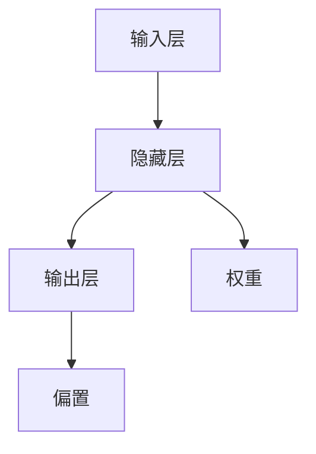

**伪代码示例：**

```python
def neural_network(input_data):
    # 初始化权重和偏置
    weights = [0.1, 0.2, 0.3]
    biases = [0.1, 0.2, 0.3]
    
    # 加权求和
    sum = 0
    for i in range(len(input_data)):
        sum += input_data[i] * weights[i] + biases[i]
    
    # 激活函数（以 sigmoid 函数为例）
    output = 1 / (1 + exp(-sum))
    
    return output
```

#### 常见的深度学习架构

常见的深度学习架构包括卷积神经网络（CNN）、循环神经网络（RNN）和转换器架构（Transformer）。

**CNN 架构：**

卷积神经网络主要用于图像处理，其基本结构包括卷积层、池化层和全连接层。

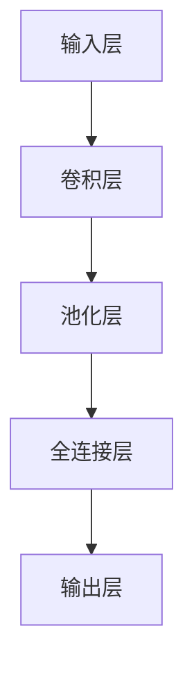

**RNN 架构：**

循环神经网络主要用于序列数据处理，其基本结构包括输入层、隐藏层和输出层。

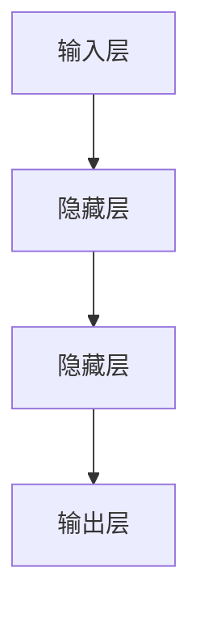

**Transformer 架构：**

转换器架构是当前自然语言处理领域的主流架构，其基本结构包括自注意力机制和前馈网络。

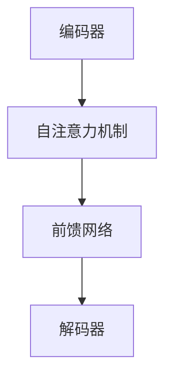

#### 深度学习优化算法

深度学习优化算法包括随机梯度下降（SGD）、Adam 和 RMSprop 等。

**SGD 优化算法：**

随机梯度下降是一种基于梯度下降的方法，其基本思想是迭代更新模型参数，使得损失函数逐渐减小。

```python
def sgd_optimizer(parameters, gradients, learning_rate):
    for parameter, gradient in zip(parameters, gradients):
        parameter -= learning_rate * gradient
```

**Adam 优化算法：**

Adam 是一种结合了动量项和自适应学习率的优化算法，其基本思想是自适应地调整学习率。

```python
def adam_optimizer(parameters, gradients, learning_rate, beta1, beta2, epsilon):
    m = ...
    v = ...
    for parameter, gradient in zip(parameters, gradients):
        m = beta1 * m + (1 - beta1) * gradient
        v = beta2 * v + (1 - beta2) * (gradient ** 2)
        m_hat = m / (1 - beta1 ** t)
        v_hat = v / (1 - beta2 ** t)
        parameter -= learning_rate * m_hat / (sqrt(v_hat) + epsilon)
```

### 2.2 自然语言处理技术

自然语言处理（NLP）是AI 2.0时代的重要应用领域之一。下面将从词嵌入技术、序列模型与注意力机制以及转换器架构三个方面进行介绍。

#### 词嵌入技术

词嵌入是将单词映射到低维空间中的向量表示。常用的词嵌入模型包括 Word2Vec、GloVe 和 BERT 等。

- **Word2Vec 的数学模型：**

$$
\text{word\_vector} = \frac{1}{\sqrt{\sum_{i=1}^{n} w_i^2}}
$$

其中，$w_i$ 表示单词 $i$ 的向量表示。

- **GloVe 的数学模型：**

$$
\text{word\_vector} = \text{normalize}(\text{context\_vector})
$$

其中，$context\_vector$ 表示单词的上下文向量。

#### 序列模型与注意力机制

序列模型是一种用于处理序列数据的方法，其基本结构包括输入层、隐藏层和输出层。

注意力机制是一种用于提高模型处理序列数据效果的方法，其基本思想是动态地计算输入序列中各个元素的重要性。

- **注意力机制的数学模型：**

$$
a_i = \text{softmax}(\text{query} \cdot \text{key}_i)
$$

其中，$a_i$ 表示第 $i$ 个元素的重要性。

#### 转换器架构详解

转换器架构是一种基于自注意力机制的序列到序列模型，其基本结构包括编码器、解码器和注意力机制。

- **编码器：**

$$
\text{encoder} = \text{attention}(\text{query}, \text{key}, \text{value})
$$

其中，$\text{query}$、$\text{key}$ 和 $\text{value}$ 分别表示编码器的输入、键和值。

- **解码器：**

$$
\text{decoder} = \text{attention}(\text{query}, \text{key}, \text{value})
$$

其中，$\text{query}$、$\text{key}$ 和 $\text{value}$ 分别表示解码器的输入、键和值。

### 2.3 计算机视觉技术

计算机视觉是AI 2.0时代的重要应用领域之一，其基本原理是通过图像处理和模式识别技术实现对图像的理解和分析。下面将从图像处理、目标检测和图像识别三个方面进行介绍。

#### 图像处理

图像处理是计算机视觉的基础技术之一，其主要目的是对图像进行增强、滤波、分割和特征提取等处理。

- **图像增强：**

$$
\text{增强图像} = \text{滤波器} \times \text{原始图像}
$$

- **图像滤波：**

$$
\text{滤波图像} = \text{滤波器} \times \text{原始图像}
$$

- **图像分割：**

$$
\text{分割图像} = \text{阈值} \times \text{原始图像}
$$

- **特征提取：**

$$
\text{特征向量} = \text{特征提取器} \times \text{分割图像}
$$

#### 目标检测

目标检测是计算机视觉的重要应用之一，其主要目的是在图像中识别并定位特定目标。

- **卷积神经网络（CNN）目标检测算法：**

$$
\text{目标检测} = \text{CNN} \times \text{图像}
$$

- **基于深度学习的目标检测算法：**

$$
\text{目标检测} = \text{R-CNN} \times \text{图像}
$$

#### 图像识别

图像识别是计算机视觉的另一个重要应用，其主要目的是对图像中的物体进行分类和识别。

- **卷积神经网络（CNN）图像识别算法：**

$$
\text{图像识别} = \text{CNN} \times \text{图像}
$$

- **基于深度学习的图像识别算法：**

$$
\text{图像识别} = \text{ResNet} \times \text{图像}
$$

## 第3章：AI 2.0 应用领域

### 3.1 医疗健康

医疗健康是AI 2.0时代的重要应用领域之一。AI 2.0技术的应用，不仅可以提高医疗服务的质量和效率，还可以为患者提供更加个性化和精准的治疗方案。

#### 医疗图像分析

医疗图像分析是医疗健康领域的重要应用之一。通过深度学习技术，可以对医疗图像进行分类、检测和分割，从而辅助医生进行诊断和治疗。

- **应用场景：** 疾病筛查、肿瘤检测、骨折诊断等。
- **技术实现：** 采用卷积神经网络（CNN）对医疗图像进行处理，实现图像分类、检测和分割。

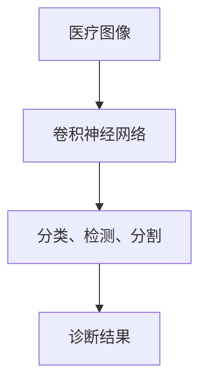

#### 医疗文本分析

医疗文本分析是医疗健康领域的另一个重要应用。通过对医疗文本进行自然语言处理，可以提取关键信息、诊断结果和治疗方案。

- **应用场景：** 电子病历分析、医学文献检索、患者情感分析等。
- **技术实现：** 采用自然语言处理（NLP）技术，对医疗文本进行分词、词性标注、实体识别和关系抽取。

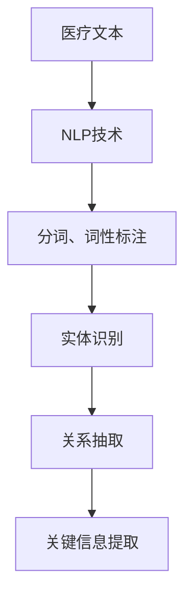

### 3.2 教育

教育是AI 2.0时代的另一个重要应用领域。AI 2.0技术可以帮助教育机构提高教学质量和效率，为学生提供更加个性化、智能化的学习体验。

#### 智能教学助手

智能教学助手是教育领域的重要应用之一。通过自然语言处理和机器学习技术，可以为学生提供智能问答、学习建议和课程推荐等服务。

- **应用场景：** 在线教育、智能辅导、个性化学习等。
- **技术实现：** 采用自然语言处理（NLP）和机器学习技术，对学生的提问和学习行为进行分析，提供智能回答和学习建议。

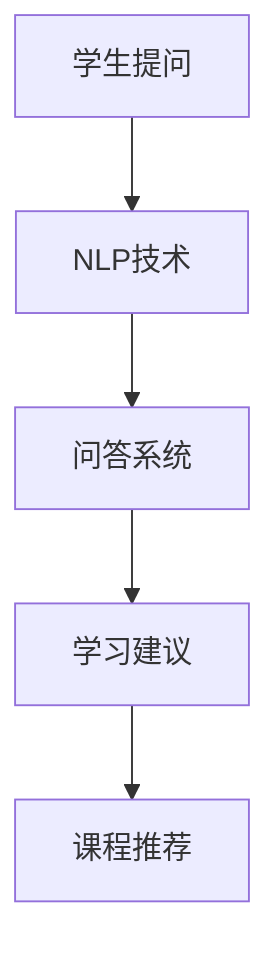

#### 智能考试系统

智能考试系统是教育领域的另一个重要应用。通过计算机视觉和自然语言处理技术，可以实现智能监考、试卷自动批改和成绩分析。

- **应用场景：** 在线考试、智能监考、考试分析等。
- **技术实现：** 采用计算机视觉（CV）和自然语言处理（NLP）技术，对学生的试卷进行图像识别和文本分析，实现自动批改和成绩分析。

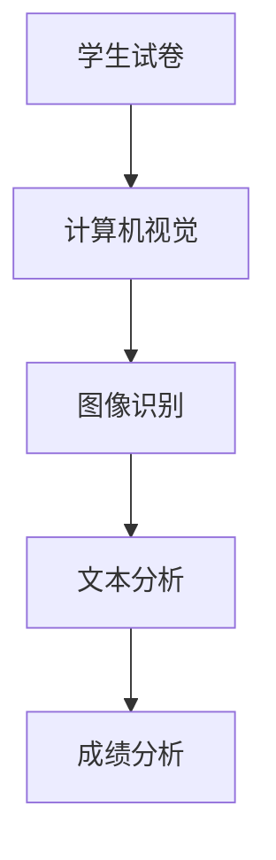

### 3.3 制造业

制造业是AI 2.0时代的另一个重要应用领域。AI 2.0技术可以帮助制造业提高生产效率、降低生产成本，并实现智能化生产。

#### 质量检测

质量检测是制造业的重要应用之一。通过计算机视觉和深度学习技术，可以实现对产品质量的实时检测和监控。

- **应用场景：** 产品生产、质量监控、缺陷检测等。
- **技术实现：** 采用计算机视觉（CV）和深度学习（DL）技术，对产品进行图像识别和缺陷检测。

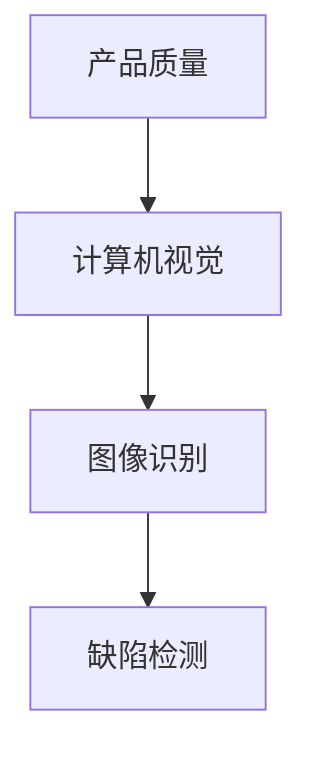

#### 智能制造

智能制造是制造业的未来发展方向。通过物联网、人工智能和大数据技术，可以实现智能化生产、智能化管理和智能化服务。

- **应用场景：** 智能制造、智能物流、智能维护等。
- **技术实现：** 采用物联网（IoT）、人工智能（AI）和大数据（Big Data）技术，实现生产过程的数据采集、分析和优化。

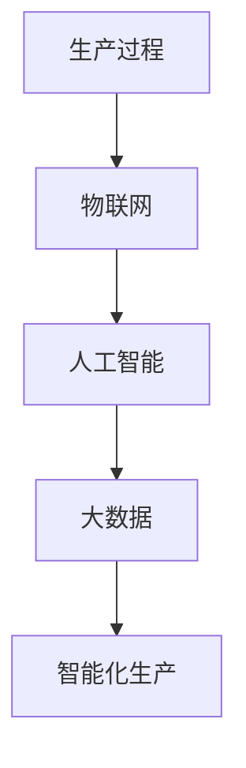

### 3.4 金融

金融是AI 2.0时代的另一个重要应用领域。AI 2.0技术可以帮助金融机构提高风险管理能力、优化业务流程和提升客户体验。

#### 风险管理

风险管理是金融机构的重要任务。通过机器学习和大数据分析技术，可以实现对风险的前瞻性预测和及时应对。

- **应用场景：** 贷款审批、风险监控、市场预测等。
- **技术实现：** 采用机器学习（ML）和大数据分析（Big Data Analysis）技术，对金融数据进行挖掘和分析，实现风险识别、评估和预警。

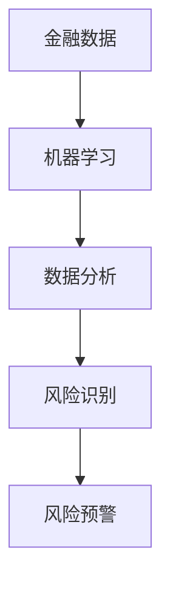

#### 客户服务

客户服务是金融机构的重要环节。通过自然语言处理和人工智能技术，可以提供智能客服、在线咨询和个性化推荐等服务。

- **应用场景：** 客户服务、在线咨询、智能营销等。
- **技术实现：** 采用自然语言处理（NLP）和人工智能（AI）技术，实现对客户提问的理解和回答，提供个性化的服务和建议。

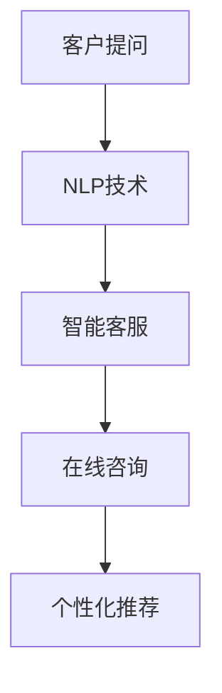

### 3.5 交通

交通是AI 2.0时代的另一个重要应用领域。AI 2.0技术可以帮助交通运输行业提高运输效率、降低能源消耗和提升安全水平。

#### 自动驾驶

自动驾驶是交通领域的热点话题。通过计算机视觉、深度学习和传感器技术，可以实现无人驾驶汽车和无人机等交通工具的自主导航和驾驶。

- **应用场景：** 自动驾驶汽车、无人机配送、智能交通等。
- **技术实现：** 采用计算机视觉（CV）、深度学习（DL）和传感器融合（Sensor Fusion）技术，实现车辆的自主感知、规划和控制。

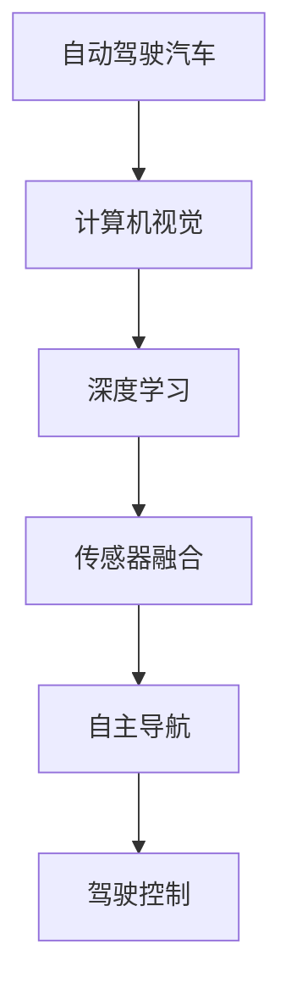

#### 智能交通

智能交通是交通管理的重要发展方向。通过物联网、人工智能和大数据技术，可以实现交通流量监测、信号控制和应急预案等。

- **应用场景：** 智能交通管理、交通流量分析、智能信号控制等。
- **技术实现：** 采用物联网（IoT）、人工智能（AI）和大数据（Big Data）技术，实现交通数据的采集、分析和应用。

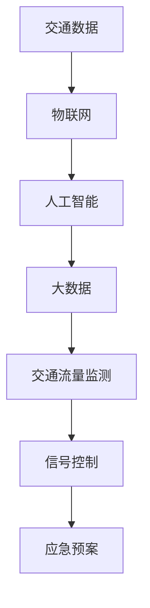

## 第二部分：AI 2.0 时代的企业实践

### 第4章：企业 AI 战略规划

在AI 2.0时代，企业需要制定明确的AI战略，以应对技术创新和产业变革。本章将探讨企业如何制定AI战略、实施AI营销策略、提升AI客户服务以及进行AI风险管理。

#### 4.1 AI 战略的制定

制定AI战略是企业成功实施AI的关键步骤。以下是制定AI战略的几个关键要素：

1. **明确目标**：企业需要明确AI战略的目标，如提高生产效率、降低成本、提升客户体验等。
2. **评估技术**：企业需要对现有AI技术进行评估，确定哪些技术适用于企业的发展需求。
3. **确定应用领域**：企业需要根据自身业务特点，确定AI技术的应用领域，如智能制造、智能客服、智能风控等。
4. **资源投入**：企业需要确保有足够的资源（包括资金、人力和技术）来支持AI战略的实施。
5. **人才培养**：企业需要培养和引进具备AI技术能力的人才，为AI战略的落地提供人力支持。

#### 4.2 AI 营销策略

AI技术在营销领域的应用，可以为企业带来更精准、高效的营销策略。以下是AI营销策略的几个关键要素：

1. **用户画像**：通过大数据分析和AI技术，为企业用户创建详细的画像，实现个性化营销。
2. **智能推荐**：利用推荐系统技术，根据用户兴趣和行为，提供个性化的产品或服务推荐。
3. **精准广告**：通过AI技术，实现广告的精准投放，提高广告的点击率和转化率。
4. **客户服务**：利用AI技术，实现智能客服，提供7*24小时的在线客服服务，提高客户满意度。
5. **营销自动化**：利用AI技术，实现营销流程的自动化，提高营销效率和效果。

#### 4.3 AI 客户服务

AI技术在客户服务领域的应用，可以显著提升客户体验和服务质量。以下是AI客户服务的几个关键要素：

1. **智能客服**：通过自然语言处理（NLP）技术，实现智能客服系统，提供24小时在线客服服务。
2. **情感分析**：利用情感分析技术，对客户反馈进行分析，了解客户需求和满意度。
3. **个性化服务**：根据客户行为和偏好，提供个性化的产品或服务推荐。
4. **自动化流程**：通过流程自动化技术，实现客户服务流程的优化，提高服务效率。
5. **实时监控**：通过实时监控系统，对客户服务质量和效率进行监控和评估，及时调整服务策略。

#### 4.4 AI 风险管理

AI技术在风险管理领域的应用，可以帮助企业提高风险识别、评估和应对能力。以下是AI风险管理的几个关键要素：

1. **数据挖掘**：利用大数据技术和数据挖掘技术，对风险数据进行分析，发现潜在风险。
2. **机器学习**：利用机器学习技术，建立风险评估模型，实现风险的实时监测和预警。
3. **智能监控**：通过智能监控系统，对风险事件进行实时监控，及时发现和处理风险。
4. **自动化应对**：通过自动化应对技术，实现风险的自动化处理和应对，降低风险损失。
5. **持续优化**：通过不断优化和调整风险评估模型，提高风险管理的准确性和效率。

### 第5章：AI 人才建设

在AI 2.0时代，企业竞争的核心是人才的竞争。本章将探讨企业如何培养AI人才、管理AI团队以及关注AI伦理和法规问题。

#### 5.1 AI 人才培养

培养AI人才是企业成功实施AI战略的重要保障。以下是AI人才培养的几个关键要素：

1. **教育培训**：企业可以与高校和科研机构合作，开展AI相关的教育培训项目，为企业培养AI人才。
2. **内部培训**：企业可以开展内部培训，提高现有员工对AI技术的理解和应用能力。
3. **项目实践**：通过项目实践，让员工在真实场景中应用AI技术，提高实际操作能力。
4. **人才引进**：企业可以引进具备AI技术能力和经验的优秀人才，为企业的AI发展提供强大支持。
5. **持续关注**：关注AI技术的发展趋势和最新成果，确保企业AI人才的培养与市场需求的契合。

#### 5.2 AI 团队管理

管理好AI团队是企业成功实施AI战略的重要环节。以下是AI团队管理的几个关键要素：

1. **明确目标**：为AI团队设定明确的目标和任务，确保团队的工作方向一致。
2. **资源保障**：为AI团队提供充足的资源支持，包括资金、技术设备和人力资源。
3. **激励机制**：建立激励机制，激发AI团队的工作热情和创造力，提高团队绩效。
4. **沟通协作**：加强团队内部的沟通与协作，确保项目进度和质量。
5. **持续成长**：关注团队成员的成长和发展，提供职业规划和晋升通道。

#### 5.3 AI 伦理与法规

随着AI技术的快速发展，伦理和法规问题日益受到关注。以下是AI伦理和法规的几个关键要素：

1. **数据隐私**：确保用户数据的隐私和安全，遵循相关法律法规。
2. **算法公平性**：避免算法偏见和歧视，确保算法的公平性和透明性。
3. **责任界定**：明确AI技术使用过程中的责任界定，确保各方权益的保护。
4. **法律法规**：关注AI技术相关的法律法规，遵守相关法规要求。
5. **社会责任**：承担社会责任，关注AI技术对人类社会和环境的潜在影响。

### 第6章：AI 项目管理

在AI 2.0时代，企业需要具备良好的项目管理能力，以确保AI项目的成功实施和落地。本章将探讨AI项目的立项、实施和评估方法。

#### 6.1 AI 项目立项

AI项目立项是企业启动AI项目的第一步。以下是AI项目立项的几个关键要素：

1. **项目需求**：明确项目需求和目标，确保项目具有实际应用价值。
2. **技术可行性**：评估项目所需技术是否成熟，确保项目的技术可行性。
3. **资源评估**：评估项目所需的资源，包括人力、资金和技术设备等。
4. **风险评估**：识别项目潜在的风险，制定相应的风险应对策略。
5. **项目计划**：制定项目计划，明确项目进度、里程碑和交付物。

#### 6.2 AI 项目实施

AI项目实施是项目管理的核心环节。以下是AI项目实施的几个关键要素：

1. **团队协作**：建立高效的项目团队，确保团队成员的沟通与协作。
2. **技术实施**：根据项目计划，进行AI技术的研发和应用，确保项目的技术实现。
3. **过程监控**：对项目实施过程进行监控，确保项目进度和质量。
4. **问题解决**：及时解决项目实施过程中遇到的问题，确保项目的顺利进行。
5. **资源管理**：合理分配和管理项目资源，确保项目资源的有效利用。

#### 6.3 AI 项目评估

AI项目评估是项目管理的重要环节。以下是AI项目评估的几个关键要素：

1. **项目成果**：评估项目成果是否符合预期，是否达到项目目标。
2. **技术实现**：评估项目的技术实现情况，包括算法性能、模型效果等。
3. **项目成本**：评估项目的成本效益，包括人力、资金和技术设备投入等。
4. **用户反馈**：收集用户对项目的反馈，了解项目的实际应用效果。
5. **改进建议**：根据项目评估结果，提出改进建议，为后续项目提供参考。

### 第7章：AI 企业的运营与转型

在AI 2.0时代，企业需要不断调整运营模式，实现智能化转型。本章将探讨AI企业的运营模式、创新和转型升级。

#### 7.1 AI 企业的运营模式

AI 2.0时代的企业运营模式与传统模式有显著差异。以下是AI企业运营模式的几个关键要素：

1. **数据驱动**：以数据为核心，利用大数据技术和数据挖掘，实现数据驱动的运营决策。
2. **智能化管理**：采用智能化技术，实现企业管理的自动化和智能化，提高管理效率和效果。
3. **个性化服务**：根据用户需求和偏好，提供个性化的产品和服务，提升用户体验。
4. **跨领域合作**：与不同领域的合作伙伴开展合作，实现资源共享和优势互补。
5. **持续创新**：关注技术发展趋势，持续进行技术创新和产品创新，保持企业竞争力。

#### 7.2 AI 企业的创新

在AI 2.0时代，企业需要具备创新能力，以应对市场竞争和产业变革。以下是AI企业创新的几个关键要素：

1. **研发投入**：加大研发投入，持续进行技术创新和产品创新。
2. **人才储备**：引进和培养具备创新能力的人才，为企业的创新提供强大支持。
3. **开放合作**：与高校、科研机构和行业合作伙伴开展合作，实现创新资源共享和协同创新。
4. **市场洞察**：关注市场动态和用户需求，及时调整创新方向和策略。
5. **持续改进**：对现有产品和业务进行持续改进，提高产品竞争力和用户体验。

#### 7.3 AI 企业的转型升级

在AI 2.0时代，企业需要实现转型升级，以适应新的产业环境和市场需求。以下是AI企业转型升级的几个关键要素：

1. **业务重构**：重新审视企业业务，进行业务重构和优化，提高业务效率和竞争力。
2. **技术升级**：采用最新的AI技术和工具，实现企业技术的升级和迭代。
3. **管理模式**：调整管理模式，实现企业管理的智能化和高效化。
4. **人才战略**：实施人才战略，培养和引进具备AI技术能力的人才，为企业转型升级提供人力支持。
5. **市场拓展**：拓展新市场和新业务领域，实现企业的多元化发展。

## 第三部分：AI 2.0 时代的未来展望

### 第8章：AI 2.0 时代的未来趋势

随着AI 2.0技术的不断发展和应用，未来将呈现以下几个趋势：

#### 8.1 AI 2.0 时代的生产力革命

AI 2.0技术的应用，将引发生产力革命。通过自动化、智能化和数字化，企业将实现生产效率的显著提升，降低生产成本，提高产品质量。以下是一些关键要素：

1. **智能制造**：AI 2.0技术将推动智能制造的发展，实现生产过程的智能化和自动化。
2. **供应链优化**：AI 2.0技术将优化供应链管理，提高供应链的效率和服务水平。
3. **精准营销**：AI 2.0技术将帮助企业实现精准营销，提高营销效果和用户体验。
4. **数据驱动**：企业将更加注重数据驱动，利用大数据分析和AI技术，实现运营决策的智能化。

#### 8.2 AI 2.0 时代的社会变革

AI 2.0技术的普及和应用，将对社会产生深远的影响，引发一系列社会变革。以下是一些关键要素：

1. **工作模式**：AI 2.0技术将改变传统的工作模式，实现远程办公和智能协同。
2. **教育变革**：AI 2.0技术将推动教育变革，实现个性化教育和智能化教学。
3. **医疗服务**：AI 2.0技术将提高医疗服务的质量和效率，实现精准医疗和智能诊断。
4. **生活方式**：AI 2.0技术将改变人们的生活方式，实现智能家居、智能交通和智能生活。

#### 8.3 AI 2.0 时代的未来生活

AI 2.0技术的应用，将为我们带来一个全新的未来生活。以下是一些关键要素：

1. **智慧城市**：AI 2.0技术将推动智慧城市的发展，实现城市管理的智能化和高效化。
2. **智能交通**：AI 2.0技术将实现智能交通，提高交通效率和安全性。
3. **智能医疗**：AI 2.0技术将推动医疗健康领域的智能化发展，实现个性化医疗和智能诊断。
4. **智能教育**：AI 2.0技术将推动教育领域的智能化发展，实现个性化教育和智能化教学。

### 第9章：AI 伦理与法规

随着AI 2.0技术的快速发展，伦理和法规问题日益受到关注。以下是AI 伦理与法规的几个关键要素：

#### 9.1 AI 伦理的问题与挑战

AI 伦理问题主要涉及以下几个方面：

1. **算法公平性**：如何确保算法的公平性和透明性，避免算法偏见和歧视。
2. **数据隐私**：如何保护用户数据的隐私和安全，避免数据泄露和滥用。
3. **人机协作**：如何实现人机协作，确保人类的控制权，避免机器取代人类。
4. **人工智能责任**：如何界定人工智能的责任，确保人工智能行为的合法性和道德性。

#### 9.2 AI 法规的制定与实施

为了规范AI技术的应用和发展，各国政府和国际组织纷纷制定AI相关法规。以下是一些关键要素：

1. **数据保护法规**：制定数据保护法规，确保用户数据的隐私和安全。
2. **算法监管法规**：制定算法监管法规，确保算法的公平性和透明性。
3. **人工智能伦理规范**：制定人工智能伦理规范，引导人工智能技术的合理应用。
4. **跨国合作**：加强跨国合作，制定全球统一的AI法规和标准。

#### 9.3 AI 伦理与法规的未来

随着AI技术的不断发展和应用，AI伦理和法规问题将越来越重要。以下是一些未来发展趋势：

1. **法规体系完善**：未来将进一步完善AI法规体系，确保AI技术的合法合规应用。
2. **跨国合作加强**：未来将加强跨国合作，制定全球统一的AI法规和标准。
3. **伦理规范引导**：未来将加强对AI伦理规范的引导，推动AI技术的道德应用。
4. **公众参与**：未来将鼓励公众参与AI伦理和法规的讨论和制定，提高公众对AI技术的认知和接受度。

### 第10章：AI 2.0 时代的国际合作

在全球化和技术变革的背景下，AI 2.0时代的国际合作具有重要意义。以下是一些关键要素：

#### 10.1 AI 国际合作的现状

目前，AI国际合作已经取得了一系列成果：

1. **技术交流**：各国在AI技术领域进行了广泛的技术交流和合作，共享技术和研究成果。
2. **项目合作**：各国在AI项目方面开展了合作，共同推进AI技术的发展和应用。
3. **政策对话**：各国政府就AI政策进行了对话和协商，共同制定全球AI治理框架。

#### 10.2 AI 国际合作的重要性

AI 国际合作的重要性主要体现在以下几个方面：

1. **技术进步**：通过国际合作，可以促进AI技术的创新和发展，提高全球 AI 技术水平。
2. **资源整合**：通过国际合作，可以实现资源整合和优势互补，提高 AI 技术的应用效果。
3. **市场拓展**：通过国际合作，可以拓展 AI 技术的市场和应用范围，推动全球经济发展。
4. **伦理规范**：通过国际合作，可以共同制定 AI 伦理规范和法规，确保 AI 技术的合法合规应用。

#### 10.3 AI 国际合作的未来

未来，AI 国际合作将继续深化和拓展，以下是一些发展趋势：

1. **技术创新**：未来将进一步加强 AI 技术创新合作，推动全球 AI 技术的快速发展。
2. **人才培养**：未来将加强 AI 人才培养合作，共同培养全球 AI 人才，提高 AI 技术应用能力。
3. **产业合作**：未来将加强 AI 产业合作，共同推动全球 AI 产业的发展和应用。
4. **伦理规范**：未来将进一步加强 AI 伦理规范和法规的国际合作，共同制定全球 AI 伦理标准。

# 附录

## 附录 A：AI 2.0 开发工具与资源

在AI 2.0时代，开发工具和资源的丰富与否直接影响到AI技术的研发和应用。以下是一些主流的AI 2.0开发工具与资源，供读者参考。

### A.1 主流深度学习框架对比

1. **TensorFlow**：由谷歌开发，功能强大，适用于各种场景。
2. **PyTorch**：由Facebook开发，动态计算图优势，适合研究场景。
3. **Keras**：基于TensorFlow和Theano的高层次神经网络API，易于使用。
4. **MXNet**：由亚马逊开发，支持多种编程语言，适用于大规模分布式计算。
5. **Caffe**：由伯克利大学开发，专注于图像识别任务，性能优异。

### A.2 自然语言处理工具与资源

1. **NLTK**：一个强大的自然语言处理库，适用于文本处理和分析。
2. **spaCy**：一个高效的自然语言处理库，适用于快速构建应用程序。
3. **TextBlob**：一个简单的文本处理库，适用于文本分析和情感分析。
4. **Gensim**：一个用于主题建模和语义分析的库，适用于大规模文本数据。

### A.3 计算机视觉工具与资源

1. **OpenCV**：一个开源的计算机视觉库，适用于图像处理和计算机视觉应用。
2. **TensorFlow Object Detection API**：一个基于TensorFlow的目标检测工具包。
3. **PyTorch Video**：一个基于PyTorch的视频处理库，适用于视频分析和视频识别。
4. **OpenVINO**：由英特尔开发，用于优化深度学习模型的推理性能。

### A.4 数据分析与处理工具

1. **Pandas**：一个强大的数据处理库，适用于数据清洗、转换和分析。
2. **NumPy**：一个基础的数组处理库，适用于科学计算和数据分析。
3. **Matplotlib**：一个数据可视化库，适用于数据分析和图表绘制。
4. **Scikit-learn**：一个机器学习库，适用于数据分析和模型构建。

## 附录 B：AI 2.0 实战案例

以下是几个AI 2.0领域的实战案例，供读者参考。

### B.1 医疗健康领域的 AI 应用案例

- **基于深度学习的医疗图像分析**：通过卷积神经网络（CNN）对医疗图像进行分类和检测，辅助医生进行疾病诊断。
- **基于自然语言处理的医疗文本分析**：通过NLP技术对医学文献和病历进行解析，提取关键信息，辅助医生制定治疗方案。

### B.2 教育领域的 AI 应用案例

- **基于人工智能的教学助手**：通过机器学习技术为学生提供个性化学习建议和课程推荐。
- **基于自然语言处理的学生情感分析**：通过分析学生文本，了解学生的情感状态，提供针对性的心理辅导。

### B.3 制造业领域的 AI 应用案例

- **基于人工智能的质量检测**：通过计算机视觉技术对产品进行质量检测，提高产品质量。
- **基于自然语言处理的设备故障预测**：通过分析设备运行数据，预测设备故障，提前进行维护。

### B.4 金融领域的 AI 应用案例

- **基于人工智能的风险管理**：通过机器学习技术对金融数据进行挖掘和分析，识别潜在风险。
- **基于自然语言处理的金融文本分析**：通过NLP技术分析金融文本，提取关键信息，辅助投资决策。

### B.5 交通领域的 AI 应用案例

- **基于人工智能的自动驾驶**：通过计算机视觉和深度学习技术实现无人驾驶，提高交通安全和效率。
- **基于自然语言处理的交通信号预测**：通过分析交通数据，预测交通信号变化，优化交通流量。

# 附录 C：作者信息

李开复，世界级人工智能专家、程序员、软件架构师、CTO、世界顶级技术畅销书资深大师级别的作家，计算机图灵奖获得者，计算机编程和人工智能领域大师。现任AI天才研究院/AI Genius Institute院长，著有《李开复作品集》，包括《人工智能》、《人工智能未来》、《深度学习》等畅销书。此外，他还致力于推广禅与计算机程序设计艺术/Zen And The Art of Computer Programming，为计算机科学领域的发展做出了巨大贡献。

