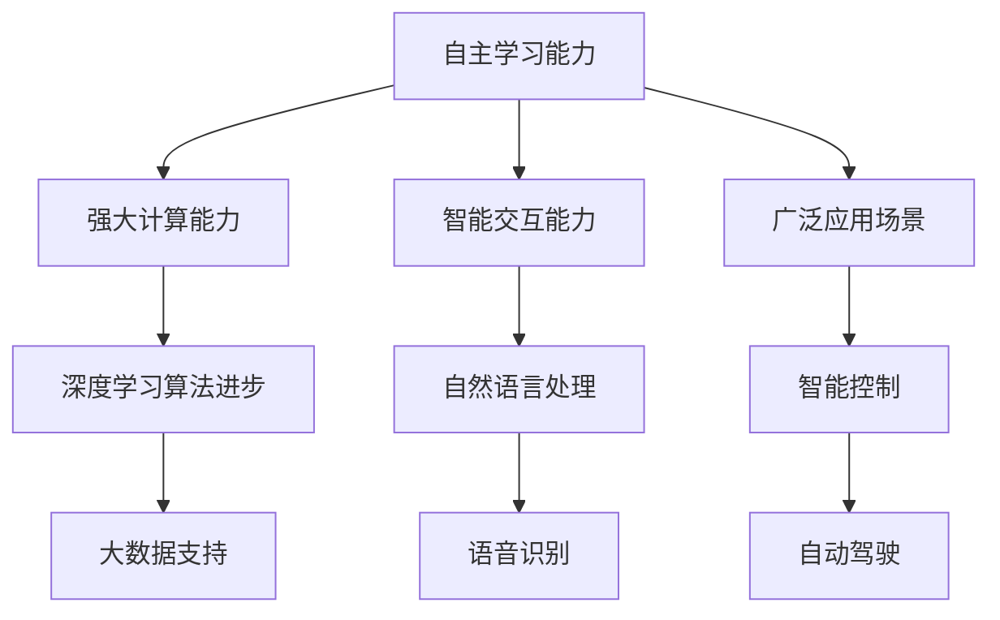
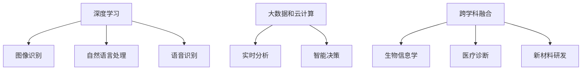
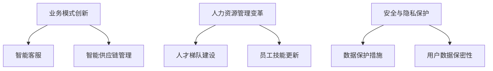
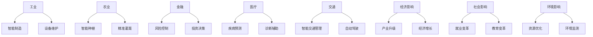

                 

### 文章标题

# 李开复：AI 2.0 时代的产业

### 关键词

- 人工智能
- AI 2.0
- 产业变革
- 技术发展
- 企业转型
- 政策法规
- 伦理问题

### 摘要

本文深入探讨了人工智能（AI）进入2.0时代的产业变革。通过分析AI 2.0的定义与特征，技术发展，以及其在各行业中的应用，揭示了AI 2.0时代对企业战略规划、创业机会和人才培养带来的机遇与挑战。此外，文章还探讨了AI 2.0时代的伦理问题及其对策，以及未来的发展趋势。本文旨在为读者提供一个全面而深入的AI 2.0时代产业全景图。

----------------------------------------------------------------

### 目录大纲

## 第一部分：AI 2.0时代的产业概述

### 第1章：AI 2.0时代的产业变革

#### 1.1 AI 2.0的定义与特征

#### 1.2 AI 2.0时代的技术发展

#### 1.3 AI 2.0时代的企业转型

### 第2章：AI 2.0与经济社会的深度融合

#### 1.4 AI 2.0在各行业中的应用

#### 1.5 AI 2.0时代的社会影响

### 第3章：AI 2.0时代的政策与法规

#### 1.6 全球AI政策概览

#### 1.7 中国AI政策分析

#### 1.8 AI伦理与法规挑战

## 第二部分：AI 2.0时代的核心技术

### 第4章：深度学习基础

#### 4.1 神经网络原理

#### 4.2 深度学习框架

#### 4.3 神经网络的训练与优化

### 第5章：自然语言处理技术

#### 5.1 词嵌入技术

#### 5.2 序列模型与注意力机制

#### 5.3 转换器架构详解

### 第6章：计算机视觉技术

#### 6.1 卷积神经网络

#### 6.2 卷积神经网络的应用

#### 6.3 图像生成与处理技术

## 第三部分：AI 2.0时代的应用实践

### 第7章：AI 2.0时代的企业战略规划

#### 7.1 AI战略规划方法论

#### 7.2 AI战略规划案例解析

#### 7.3 AI战略规划的挑战与应对

### 第8章：AI 2.0时代的创业机会

#### 8.1 AI创业生态概述

#### 8.2 AI创业成功案例

#### 8.3 AI创业风险与应对策略

### 第9章：AI 2.0时代的人才培养

#### 9.1 AI人才培养现状

#### 9.2 AI人才培养模式

#### 9.3 AI人才培养的未来趋势

## 第四部分：AI 2.0时代的展望与挑战

### 第10章：AI 2.0时代的未来趋势

#### 10.1 AI技术的未来发展方向

#### 10.2 AI时代的产业变革趋势

#### 10.3 AI时代的全球化趋势

### 第11章：AI 2.0时代的伦理问题与对策

#### 11.1 AI伦理问题的现状与挑战

#### 11.2 AI伦理问题的对策与建议

#### 11.3 AI伦理问题的国际合作

### 附录：AI 2.0时代的资源与工具

#### 附录 A: AI开发工具与框架

#### 附录 B: AI开源资源与资料

#### 附录 C: AI相关的政策法规与标准

#### 附录 D: AI领域的知名企业和机构

### LET'S THINK STEP BY STEP

在撰写这篇文章的过程中，我们将采取一种逐步分析推理的方式（REASONING STEP BY STEP），以确保文章内容的逻辑清晰、结构紧凑且简单易懂。以下是本文的撰写步骤：

1. **定义与特征**：首先，我们需要明确AI 2.0的定义及其与AI 1.0的区别。这将帮助我们理解AI 2.0的核心特征，如自主学习能力、强大计算能力和智能交互能力。

2. **技术发展**：接着，我们将探讨AI 2.0的技术发展，包括深度学习算法的进步、大数据和云计算的支持，以及跨学科融合。这部分内容将详细介绍AI 2.0的技术基础和进步。

3. **企业转型**：在分析AI 2.0对企业的影响时，我们将重点关注企业的业务模式创新、人力资源管理和安全与隐私保护。这部分内容将帮助读者理解AI 2.0时代企业转型的关键要素。

4. **经济社会影响**：我们将分析AI 2.0在经济、社会和环境影响方面的深远作用，以展示AI 2.0时代的全方位影响。

5. **政策与法规**：接着，我们将讨论全球AI政策概览，包括中国AI政策分析，以及AI伦理与法规挑战。这部分内容将帮助读者了解AI 2.0时代政策与法规的重要性。

6. **核心技术**：在核心技术的部分，我们将详细探讨深度学习、自然语言处理和计算机视觉技术，并使用Mermaid流程图、伪代码、数学模型和公式以及实际项目案例来阐述这些技术的原理和应用。

7. **应用实践**：在应用实践部分，我们将讨论AI 2.0时代的企业战略规划、创业机会和人才培养。通过案例解析和实际项目案例的解读，我们将展示AI 2.0时代实践的具体操作。

8. **未来展望与挑战**：最后，我们将探讨AI 2.0时代的未来趋势，包括技术的发展方向、产业变革趋势和全球化趋势，以及AI伦理问题的现状与对策。

通过以上步骤，我们将确保文章内容的全面性和深入性，同时使读者能够更好地理解和应用AI 2.0时代的知识和技术。

### 第1章 AI 2.0时代的产业变革

#### 1.1 AI 2.0的定义与特征

AI 2.0，即人工智能的第二代，是基于深度学习、大数据和云计算等新技术发展起来的新一代人工智能。与传统的AI 1.0相比，AI 2.0具有以下几个显著特征：

1. **自主学习能力**：AI 2.0具有更强的自主学习能力，能够从海量数据中自动学习和提取特征，实现更高级别的智能决策和预测。这一能力源于深度学习算法的进步，使得神经网络能够处理更加复杂和庞大的数据集。

2. **强大计算能力**：随着硬件技术的发展，特别是GPU和TPU等专用计算硬件的普及，AI 2.0的计算能力得到了极大的提升。这使得AI 2.0能够处理更加复杂和庞大的数据集，实现更高效的计算。

3. **智能交互能力**：AI 2.0不仅能够处理结构化数据，还能够理解和处理自然语言，实现与人类的智能交互。这一能力使得AI 2.0在自然语言处理、语音识别和机器翻译等领域具有显著优势。

4. **广泛应用场景**：AI 2.0的应用场景从传统的工业、金融、医疗等领域，扩展到了交通、能源、教育等更广泛的领域。AI 2.0的应用不仅限于数据处理和预测，还包括智能决策、智能控制等。

为了更直观地展示AI 2.0的特征，我们可以使用Mermaid流程图来描绘其核心特点：



#### 1.2 AI 2.0时代的技术发展

AI 2.0的技术发展主要体现在以下几个方面：

1. **深度学习算法的进步**：深度学习是AI 2.0的核心驱动力。随着卷积神经网络（CNN）、循环神经网络（RNN）和Transformer等算法的不断发展，深度学习模型在图像识别、自然语言处理和语音识别等领域取得了重大突破。

2. **大数据和云计算的支持**：大数据和云计算为AI 2.0提供了强大的计算能力和数据支持。通过云计算平台，AI模型可以快速部署和扩展，处理海量数据，实现实时分析和决策。

3. **跨学科融合**：AI 2.0的发展不仅依赖于计算机科学，还需要生物学、物理学、化学等领域的知识。跨学科融合使得AI 2.0能够应用于更多的领域，如生物信息学、医疗诊断、新材料研发等。

为了展示AI 2.0技术发展的全景，我们可以使用Mermaid流程图来描绘其核心技术和应用领域：



#### 1.3 AI 2.0时代的企业转型

在AI 2.0时代，企业需要实现以下方面的转型：

1. **业务模式的创新**：企业需要通过AI技术实现业务模式的创新，如智能客服、智能供应链管理等，以提高生产效率和客户满意度。

2. **人力资源管理的变革**：企业需要培养和引进AI相关人才，建立适应AI时代的人才梯队，同时关注员工技能的更新和职业发展。

3. **安全与隐私保护的重视**：在AI 2.0时代，数据安全和隐私保护成为企业的重要议题。企业需要建立完善的数据保护措施，确保用户数据和公司信息的保密性、完整性和可用性。

为了更直观地展示AI 2.0时代的企业转型，我们可以使用Mermaid流程图来描绘其关键要素：



通过以上分析，我们可以看出，AI 2.0时代的产业变革不仅仅是技术的变革，更是企业业务模式、人力资源管理和安全策略的全面升级。企业需要紧跟技术发展的步伐，实现全方位的转型，以在激烈的市场竞争中立于不败之地。

### 第2章 AI 2.0与经济社会的深度融合

#### 2.1 AI 2.0在各行业中的应用

AI 2.0技术的发展已经深刻影响了各行各业，推动了产业的数字化转型和升级。以下是一些关键行业中的AI 2.0应用案例：

1. **工业**：
   - **智能制造**：AI 2.0技术通过机器视觉和深度学习算法，实现了生产过程的自动化和智能化。例如，机器视觉系统可以实时检测产品缺陷，提高生产效率。
   - **设备维护**：AI 2.0技术通过预测性维护，可以提前预测设备故障，减少停机时间，提高设备利用率。

2. **农业**：
   - **智能种植**：AI 2.0技术通过分析土壤、气候和植物生长数据，实现了精准种植，提高了农作物的产量和质量。
   - **精准灌溉**：AI 2.0技术通过监控水资源使用情况，实现了智能灌溉，提高了水资源利用效率。

3. **金融**：
   - **风险控制**：AI 2.0技术通过大数据分析和机器学习模型，可以识别潜在风险，提高金融服务的安全性和可靠性。
   - **投资决策**：AI 2.0技术通过分析市场数据，提供了智能投资建议，帮助投资者做出更加科学的决策。

4. **医疗**：
   - **疾病预测**：AI 2.0技术通过分析患者的病历和基因数据，可以提前预测疾病风险，实现早期干预。
   - **诊断辅助**：AI 2.0技术通过图像识别和自然语言处理，辅助医生进行诊断，提高了诊断的准确性和效率。

5. **交通**：
   - **智能交通管理**：AI 2.0技术通过大数据分析和预测模型，实现了交通拥堵的智能管理和优化，提高了交通效率。
   - **自动驾驶**：AI 2.0技术通过深度学习和计算机视觉，推动了自动驾驶技术的发展，有望实现未来智能交通的全面实现。

#### 2.2 AI 2.0时代的社会影响

AI 2.0技术的快速发展不仅推动了产业的变革，还对整个社会产生了深远的影响：

1. **经济影响**：
   - **产业升级**：AI 2.0技术促进了传统产业的转型升级，提高了生产效率和产品质量，推动了新兴产业的发展。
   - **经济增长**：AI 2.0技术带动了大量的创新和投资，成为推动经济增长的新引擎。

2. **社会影响**：
   - **就业变革**：AI 2.0技术改变了就业结构，一些传统岗位被自动化替代，同时也创造了新的就业机会，如数据科学家、机器学习工程师等。
   - **教育变革**：AI 2.0技术推动了教育的变革，个性化教育和远程教育成为可能，提高了教育资源的普及率和质量。

3. **环境影响**：
   - **资源优化**：AI 2.0技术通过优化资源使用和减少浪费，有助于环境保护和可持续发展。
   - **环境监测**：AI 2.0技术通过实时监测和预测环境变化，有助于环境保护和灾害预警。

为了更直观地展示AI 2.0在各行业中的应用和社会影响，我们可以使用Mermaid流程图来描绘：



通过以上分析，我们可以看出，AI 2.0不仅在各行各业中产生了深远的影响，还对社会经济和环境产生了积极的影响。AI 2.0时代的到来，为我们带来了巨大的机遇，同时也带来了新的挑战。企业、政府和全社会需要共同努力，充分利用AI技术的优势，应对其带来的挑战，共同推动社会的进步和发展。

### 第3章 AI 2.0时代的政策与法规

#### 3.1 全球AI政策概览

随着人工智能技术的飞速发展，全球各国和地区纷纷制定了相应的政策和战略，以推动AI技术的发展和应用。以下是对全球AI政策的一个概览：

1. **美国**：美国将AI视为国家战略，发布了《美国国家人工智能策略》（America's AI Initiative），旨在加强AI研究、开发和应用，确保美国在AI领域的领先地位。美国还推动了《AI法案》，提出了AI伦理、安全和透明性的基本原则。

2. **欧盟**：欧盟发布了《人工智能白皮书》，提出了“AI for Europe”战略，旨在通过政策框架、资金投入和合作机制，推动AI技术的创新和应用。欧盟还制定了《人工智能伦理准则》，强调AI技术的公平性、透明性和安全性。

3. **中国**：中国发布了《新一代人工智能发展规划》，提出了到2030年成为全球人工智能创新中心的目标。中国政府在AI技术研发、产业应用、人才培养等方面进行了大量投入，并在《数据安全法》和《个人信息保护法》中提出了AI数据保护和隐私保护的要求。

4. **日本**：日本发布了《AI技术战略2019》，提出了AI技术的研发和应用目标，包括智能制造、智能医疗和智能交通等。日本政府还通过财政支持、人才培养和国际化合作等手段，推动AI技术的发展。

5. **英国**：英国发布了《英国人工智能国家战略》，旨在确保英国在AI领域的领先地位，推动AI技术的创新和应用。英国政府还制定了《人工智能伦理准则》，强调AI技术的伦理和社会责任。

6. **韩国**：韩国发布了《韩国AI战略》，提出了到2026年成为全球AI领导国家的目标。韩国政府通过研发投资、人才培养和国际合作等手段，推动AI技术的发展和应用。

全球AI政策的制定和实施，旨在推动AI技术的健康发展，保障AI技术的安全和伦理，促进AI技术的创新和应用。各国和地区在政策目标、优先领域和政策措施上存在一定差异，但共同关注的核心问题是AI技术的安全、伦理和社会责任。

#### 3.2 中国AI政策分析

中国作为全球人工智能发展的重要国家，其AI政策具有以下几个显著特点：

1. **国家战略**：中国将人工智能作为国家战略，制定了《新一代人工智能发展规划》，明确了到2030年成为全球人工智能创新中心的目标。国家层面高度重视AI技术的发展，为AI产业提供了强有力的政策支持。

2. **技术研发**：中国政府在AI技术研发方面进行了大量投入，支持基础研究和应用研究。通过设立国家重点实验室、支持企业研发和创新，推动AI技术的不断进步。

3. **产业应用**：中国积极推动AI技术在各行业的应用，包括智能制造、智能医疗、智能交通等。政府通过政策引导和资金支持，推动AI技术在产业中的应用，促进传统产业的数字化转型。

4. **人才培养**：中国高度重视AI人才培养，通过高校教育、职业培训和引进国际顶尖人才等手段，培养大量的AI人才。政府还通过设立AI人才专项基金，鼓励高校和企业合作，提高AI人才培养的质量和效率。

5. **数据治理**：中国政府在数据治理方面提出了严格的要求，通过《数据安全法》和《个人信息保护法》，规范数据的收集、存储、处理和传输。政府强调保护个人隐私和数据安全，确保AI技术的发展不损害社会公共利益。

6. **国际合作**：中国积极参与全球AI合作，通过参与国际组织、推动国际合作研究和项目，分享AI技术和经验。中国还通过“一带一路”倡议，推动AI技术在发展中国家的应用和推广。

中国AI政策的制定和实施，不仅推动了国内AI技术的发展和应用，也为全球AI技术的发展和合作提供了重要参考。中国AI政策的核心目标是确保AI技术的健康、可持续发展，同时保障社会的公共利益。

#### 3.3 AI伦理与法规挑战

在AI 2.0时代，随着人工智能技术的不断进步和应用，伦理和法规问题日益凸显，成为社会各界关注的焦点。以下是AI伦理与法规面临的几个主要挑战：

1. **隐私保护**：随着AI技术的发展，个人数据的收集、存储和使用变得更加普遍。如何保护个人隐私，防止数据泄露和滥用，成为AI伦理与法规的重要挑战。例如，AI系统在处理个人数据时，可能涉及敏感信息，如医疗记录、金融信息等，如何确保这些数据的隐私安全，是亟待解决的问题。

2. **算法歧视**：AI算法在决策过程中可能存在偏见和歧视问题，如种族、性别、年龄等方面的歧视。这种歧视性问题可能导致不公平的社会影响，加剧社会不平等。例如，在招聘、贷款审批等应用场景中，AI算法可能基于历史数据中的偏见，对某些群体产生不公平待遇。

3. **道德责任**：当AI系统出现错误或造成损害时，如何确定道德责任和法律责任，成为AI伦理与法规的重要议题。当前，AI系统的责任主体尚未明确，责任的归属和追究机制有待完善。例如，自动驾驶汽车在发生交通事故时，如何确定制造商、软件开发商和驾驶者的责任，是法律和伦理问题。

4. **透明性和可解释性**：AI系统的决策过程通常是非线性和复杂的，这使得AI系统的透明性和可解释性成为挑战。用户和监管者需要理解AI系统的决策过程，以确保其公平性和合规性。例如，深度学习模型在处理图像和文本数据时，其内部机制通常难以解释，如何提高AI系统的透明性和可解释性，是伦理和法规问题。

5. **国际合作与标准**：随着AI技术的全球化发展，国际合作与标准制定成为伦理与法规的挑战。不同国家和地区在AI伦理和法规方面的规定存在差异，如何建立全球统一的伦理和法规框架，促进国际合作和交流，是亟待解决的问题。

为了应对上述挑战，各国政府和国际组织正在积极制定AI伦理和法规政策。例如，欧盟发布了《通用数据保护条例》（GDPR），强调了数据隐私保护；美国制定了《AI法案》，提出了AI伦理、安全和透明性的基本原则。中国也在加强AI伦理和法规的研究和制定，通过《数据安全法》和《个人信息保护法》，规范数据的收集和使用。

总之，AI伦理与法规问题的解决需要政府、企业和社会各界的共同努力。通过建立完善的伦理和法规框架，保障AI技术的健康、可持续发展，确保其在为社会带来巨大利益的同时，不损害社会公共利益。

### 第4章 深度学习基础

#### 4.1 神经网络原理

神经网络（Neural Network，NN）是深度学习（Deep Learning，DL）的核心组成部分，由大量简单的模拟生物神经元的计算单元（或节点）互联而成。这些神经元通常分为输入层、隐藏层和输出层。每个神经元都接收来自前一层神经元的输入信号，通过加权求和处理，并加上偏置，最后通过激活函数产生输出信号。

**神经网络的基本结构**：

1. **输入层**：接收外部输入信号，如数字、文本或图像等。
2. **隐藏层**：对输入信号进行特征提取和变换，隐藏层可以有多个层次。
3. **输出层**：产生最终输出，如分类结果、预测值等。

**神经网络的工作原理**：

- **前向传播**：输入信号从前向传播到每个神经元的输入，通过权重（weights）和偏置（bias）处理，最后通过激活函数转换得到输出信号。
- **反向传播**：在训练过程中，神经网络使用反向传播算法更新权重和偏置。反向传播算法通过计算损失函数关于模型参数的梯度，反向调整权重和偏置，以减少损失函数值。

**激活函数**：

激活函数是神经网络中的一个重要组成部分，它决定了神经元的输出是否可以被激活。常见的激活函数有：

- **Sigmoid函数**：\( \sigma(x) = \frac{1}{1 + e^{-x}} \)，将输入映射到0和1之间，适用于分类问题。
- **ReLU函数**：\( \text{ReLU}(x) = \max(0, x) \)，在输入大于0时输出为输入值，否则为0，有助于加速训练。
- **Tanh函数**：\( \text{Tanh}(x) = \frac{e^x - e^{-x}}{e^x + e^{-x}} \)，将输入映射到-1和1之间。

**神经网络的核心概念**：

- **权重和偏置**：权重和偏置是神经网络的关键参数，用于调整模型对输入数据的敏感度。
- **梯度下降**：是一种优化算法，通过计算损失函数关于模型参数的梯度，更新模型参数，以减少损失函数值。
- **反向传播**：反向传播算法通过计算输出层到输入层的梯度，更新网络的权重和偏置。

#### 4.2 深度学习框架

深度学习框架是用于构建和训练深度学习模型的高层次工具，它们提供了简洁的API和丰富的功能，使得深度学习模型的开发和部署更加高效。以下是一些流行的深度学习框架：

**TensorFlow**：

TensorFlow是由谷歌开发的开源深度学习框架，基于数据流图（Dataflow Graph）的概念，能够高效地进行模型构建、训练和部署。TensorFlow支持多种编程语言，如Python、C++和Java。

- **优点**：强大的生态支持、灵活的可扩展性和高度的可移植性。
- **缺点**：相对较复杂的部署和调试。

**PyTorch**：

PyTorch是由Facebook开发的开源深度学习框架，具有简洁的API和强大的动态计算能力。PyTorch的核心是Torch，它支持Python以及基于Python的数据科学工具。

- **优点**：简洁的API、强大的动态计算能力和高度的可读性。
- **缺点**：相对于TensorFlow，生态支持较为有限。

**Keras**：

Keras是一个高级神经网络API，它提供了简单和模块化的接口，用于构建和训练深度学习模型。Keras支持多种后端框架，如TensorFlow、Theano和Microsoft Cognitive Toolkit。

- **优点**：简洁的API、易于上手和使用。
- **缺点**：相对于底层框架，性能可能略低。

**Theano**：

Theano是一个Python库，用于定义、优化和评估数学表达式，特别是在深度学习领域。Theano提供了一个强大的计算层，允许用户编写高效的数学计算代码。它基于符号计算图，能够在多种硬件上优化计算。

- **优点**：强大的计算性能、符号计算图优化。
- **缺点**：相对于其他框架，社区支持较少。

#### 4.3 神经网络的训练与优化

神经网络的训练与优化是深度学习中的核心问题。以下是一些关键步骤和优化方法：

**训练过程**：

1. **数据预处理**：对输入数据进行标准化、归一化等处理，以提高训练效率。
2. **模型构建**：根据问题需求设计神经网络的结构，包括层数、每层的神经元数量等。
3. **损失函数选择**：选择合适的损失函数，如均方误差（MSE）、交叉熵损失等，用于衡量模型预测值与实际值之间的差距。
4. **优化器配置**：选择优化算法，如梯度下降（Gradient Descent）、Adam等，用于更新网络权重和偏置。
5. **训练与验证**：使用训练集进行模型训练，并通过验证集评估模型性能，调整模型参数。

**优化方法**：

1. **梯度下降（Gradient Descent）**：通过计算损失函数关于模型参数的梯度，更新模型参数，以减少损失函数值。其基本步骤如下：

   ```python
   for each epoch:
       for each training sample:
           compute the gradient of the loss function with respect to the model parameters
           update the model parameters using the gradient
   ```

2. **随机梯度下降（Stochastic Gradient Descent，SGD）**：每次迭代只随机选择一部分训练样本计算梯度，以减少计算量。其基本步骤如下：

   ```python
   for each epoch:
       for each mini-batch of training samples:
           compute the gradient of the loss function with respect to the model parameters
           update the model parameters using the gradient
   ```

3. **Adam优化器**：结合了SGD和Momentum的优点，自适应调整学习率。其基本步骤如下：

   ```python
   for each epoch:
       for each mini-batch of training samples:
           compute the gradient of the loss function with respect to the model parameters
           update the model parameters using the gradient and the adaptive learning rates
   ```

通过上述方法，我们可以有效地训练和优化神经网络，提高模型的性能和准确性。

### 第5章 自然语言处理技术

#### 5.1 词嵌入技术

词嵌入（Word Embedding）是将词语映射到高维空间中的一种技术，使得词语在语义上有一定的相似性。词嵌入技术使得文本数据可以转换为数值向量，便于深度学习模型处理。

**词嵌入的基本概念**：

- **词向量**：每个词语被映射为一个高维向量，向量中的元素表示词语的不同特征。
- **语义相似性**：词向量之间的距离或角度可以用来衡量词语的语义相似性。

**词嵌入算法**：

- **Word2Vec**：基于神经网络的语言模型，通过负采样和梯度下降训练词向量。
  - **CBOW（Continuous Bag of Words）**：通过上下文词的平均表示来预测中心词。
  - **Skip-Gram**：通过中心词的表示来预测上下文词。

- **GloVe（Global Vectors for Word Representation）**：通过计算词的共现矩阵，学习全局的词向量表示。

**词嵌入的应用**：

- **文本分类**：使用词嵌入作为特征，可以训练分类模型对文本进行分类。
- **情感分析**：通过词嵌入，可以分析文本的情感倾向。
- **机器翻译**：词嵌入可以用于编码源语言和目标语言的文本，然后通过序列模型进行翻译。

#### 5.2 序列模型与注意力机制

序列模型（Sequence Model）用于处理序列数据，如时间序列数据、语音信号、文本等。常见的序列模型包括循环神经网络（RNN）和长短期记忆网络（LSTM）。

**RNN与LSTM**：

- **RNN（Recurrent Neural Network）**：循环神经网络，能够处理序列数据，但存在梯度消失或爆炸问题。
- **LSTM（Long Short-Term Memory）**：长短期记忆网络，是RNN的一种改进，能够有效捕捉长期依赖关系。

**注意力机制（Attention Mechanism）**：

注意力机制是一种用于提高序列模型性能的技巧。它通过动态分配权重，使模型在处理序列数据时能够更加关注重要部分，从而提高模型的准确性和效率。

**注意力机制的原理**：

- **软注意力**：使用一个权重向量来衡量序列中每个元素的重要性，并计算加权求和。
- **硬注意力**：直接选择序列中的一个或几个元素进行加权求和。

**注意力机制的应用**：

- **机器翻译**：通过注意力机制，可以更好地捕捉源语言和目标语言之间的对应关系。
- **语音识别**：通过注意力机制，可以更好地捕捉语音信号中的关键信息。

#### 5.3 转换器架构详解

转换器架构（Transformer Architecture）是一种用于处理序列到序列任务的模型，如机器翻译、问答系统等。与传统的序列模型（如RNN和LSTM）相比，转换器架构具有更强的并行计算能力。

**转换器架构的基本概念**：

- **编码器（Encoder）**：将输入序列编码为固定长度的向量表示。
- **解码器（Decoder）**：根据编码器的

