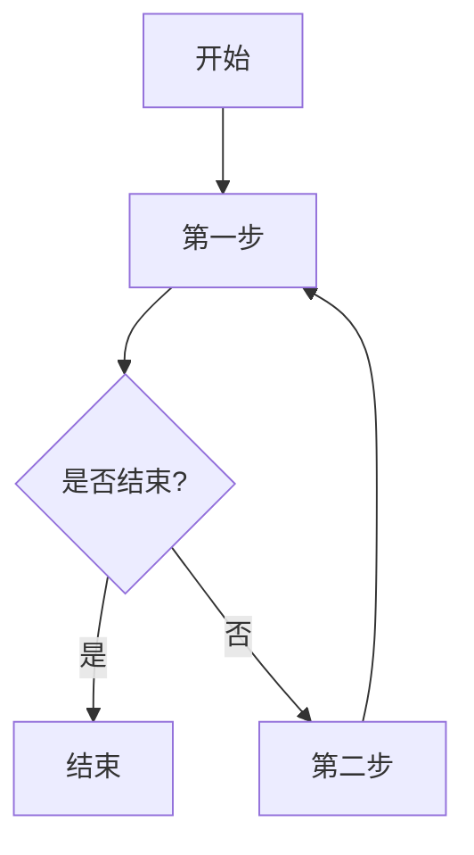

                 

# 文章标题：李开复：AI 2.0时代的产业

> 关键词：人工智能，AI 2.0，产业变革，核心技术，应用实践，未来展望

> 摘要：本文从李开复教授的角度，深入探讨了AI 2.0时代的产业变革，分析了AI 2.0的核心技术，以及其在不同领域的应用实践和未来展望。通过对AI 2.0时代的产业概述、核心技术、应用实践和未来展望的详细阐述，揭示了AI 2.0时代产业的机遇与挑战，为读者提供了有价值的思考和见解。

## 第一部分：AI 2.0时代的产业概述

### 第1章：AI 2.0时代的产业概览

#### 1.1 AI 2.0时代的来临

AI 2.0时代，即人工智能2.0时代，是继AI 1.0时代（以规则驱动和符号推理为基础）之后的更高级阶段。AI 2.0时代的来临，标志着人工智能从“能思考”向“能创造”的转变。这一转变主要体现在以下几个方面：

- **算法的进步**：深度学习、生成对抗网络（GAN）、强化学习等新兴算法的出现，使得人工智能在图像识别、自然语言处理、决策优化等方面取得了显著的突破。

- **计算能力的提升**：随着云计算、大数据技术的普及，人工智能算法得以在更大规模的数据集上进行训练，提高了模型的性能和泛化能力。

- **数据的积累**：互联网、物联网、社交媒体等技术的发展，使得大量结构化和非结构化数据被产生和积累，为人工智能提供了丰富的训练资源。

- **硬件的发展**：GPU、TPU等专用硬件的进步，使得人工智能模型的训练速度大幅提升，为AI 2.0时代的到来提供了基础设施保障。

#### 1.1.1 从AI 1.0到AI 2.0的演进

AI 1.0时代以规则驱动和符号推理为基础，虽然在特定领域取得了显著成果，但存在局限性。例如，在自然语言处理领域，规则驱动的方法难以处理复杂的语言现象；在图像识别领域，基于传统计算机视觉的方法在处理复杂场景时效果不佳。

随着深度学习等新兴算法的出现，AI 2.0时代逐渐到来。深度学习通过模拟人脑神经网络结构，使得人工智能在图像识别、自然语言处理等领域取得了突破性进展。生成对抗网络（GAN）则使得人工智能在图像生成、风格迁移等方面表现出色。强化学习在决策优化、游戏AI等领域展现出强大的能力。

#### 1.1.2 AI 2.0的核心特征与关键技术

AI 2.0时代具有以下核心特征：

- **自主学习能力**：人工智能不再依赖于人类预设的规则，而是通过海量数据自动学习和优化。

- **泛化能力**：AI 2.0模型在处理新任务时，能够迅速适应并取得良好的性能。

- **实时反馈**：通过实时收集用户反馈，人工智能系统能够不断优化自身。

- **协作能力**：人工智能系统可以与其他系统或人类协作，共同完成复杂任务。

AI 2.0时代的关键技术包括：

- **深度学习**：深度学习是AI 2.0时代的基础，通过多层神经网络，实现了从简单到复杂特征的自动提取。

- **生成对抗网络（GAN）**：GAN是一种新型的生成模型，能够生成高质量的数据，广泛应用于图像生成、风格迁移等领域。

- **强化学习**：强化学习通过智能体与环境交互，学习最优策略，广泛应用于游戏AI、自动驾驶等领域。

#### 1.1.3 AI 2.0对传统产业的冲击与融合

AI 2.0时代的到来，对传统产业产生了深远的影响：

- **产业升级**：传统产业通过引入人工智能技术，实现了智能化升级。例如，智能制造、智慧物流等领域的兴起，推动了制造业的转型升级。

- **产业融合**：人工智能与传统产业的深度融合，催生了新的产业形态。例如，金融科技、医疗健康、教育等行业，通过人工智能技术的应用，实现了跨界发展。

- **就业变革**：人工智能的发展，一方面创造了新的就业机会，另一方面也引发了对就业市场的冲击。例如，自动化机器人的应用，使得一些传统工种面临失业风险。

#### 1.2 AI 2.0时代的产业分类

AI 2.0时代，人工智能在不同领域的应用呈现出多样化趋势。以下是AI 2.0时代主要产业的分类及其应用：

##### 1.2.1 制造业与AI 2.0

- **智能制造**：通过引入人工智能技术，实现生产过程的智能化。例如，智能生产线、智能机器人等。

- **个性化定制**：基于人工智能算法，为消费者提供个性化的产品和服务。例如，个性化医疗、个性化教育等。

- **供应链优化**：利用人工智能技术，对供应链进行优化，提高供应链的效率。例如，智能仓储、智能物流等。

##### 1.2.2 零售业与AI 2.0

- **智能推荐系统**：通过分析用户行为和偏好，为用户提供个性化的推荐。例如，电商平台、在线视频平台等。

- **客户体验优化**：利用人工智能技术，优化客户服务体验。例如，智能客服、智能导购等。

- **仓储与物流**：通过引入人工智能技术，实现仓储和物流的智能化。例如，智能仓储机器人、自动驾驶物流车等。

##### 1.2.3 金融业与AI 2.0

- **风险管理**：利用人工智能技术，对金融风险进行识别和预测。例如，信用风险评估、市场风险预测等。

- **智能投顾**：通过人工智能算法，为用户提供个性化的投资建议。例如，智能投顾平台、机器人理财等。

- **信贷评估与反欺诈**：利用人工智能技术，对信贷申请进行评估，并识别欺诈行为。例如，信用评分系统、反欺诈系统等。

##### 1.2.4 医疗与健康与AI 2.0

- **智能诊断与辅助决策**：利用人工智能技术，对医疗数据进行处理和分析，辅助医生进行诊断和决策。例如，医学影像诊断、疾病预测等。

- **医疗数据分析**：通过对海量医疗数据的挖掘和分析，发现潜在的医学规律和趋势。例如，基因组学研究、流行病学研究等。

- **医疗机器人**：利用人工智能技术，开发医疗机器人，提高医疗服务的效率和质量。例如，手术机器人、康复机器人等。

#### 1.3 AI 2.0时代的产业挑战与机遇

AI 2.0时代的到来，既带来了巨大的机遇，也面临着一系列挑战：

- **技术发展带来的挑战**：人工智能技术不断进步，对传统技术栈和开发模式提出了新的要求。如何有效地整合和利用新技术，是产业面临的挑战之一。

- **数据隐私与安全**：人工智能技术的发展，依赖于大量数据的积累和分析。如何在保障数据隐私和安全的前提下，充分利用数据，是产业面临的挑战之一。

- **法规与伦理问题**：人工智能技术的应用，涉及到法律法规和伦理道德的诸多问题。如何制定合理的法规，保障人工智能技术的健康发展和应用，是产业面临的挑战之一。

- **AI教育与人才培养**：随着人工智能技术的普及，对相关人才的需求日益增长。如何培养和储备AI人才，是产业面临的挑战之一。

然而，面对这些挑战，产业界也迎来了前所未有的机遇：

- **产业升级与转型**：人工智能技术的引入，为传统产业带来了升级和转型的契机。通过智能化改造，产业可以实现更高的生产效率、更优的产品质量和更低的运营成本。

- **新兴产业发展**：人工智能技术的应用，催生了大量新兴产业。例如，金融科技、医疗健康、教育等行业，通过人工智能技术的创新，实现了跨越式发展。

- **跨界合作与创新**：人工智能技术的普及，推动了不同产业之间的跨界合作和创新。通过跨领域的协同发展，产业可以实现更高的价值创造。

### 第二部分：AI 2.0时代的核心技术

#### 第2章：AI 2.0时代的核心技术

##### 2.1 人工智能基础

人工智能基础是构建AI 2.0时代各项应用的核心，以下是对其主要技术的详细探讨。

###### 2.1.1 机器学习原理

机器学习是人工智能的核心技术之一，通过训练模型，使计算机能够从数据中自动学习和获取知识。以下是机器学习的基本原理：

- **监督学习**：监督学习是一种通过已标记的数据进行训练的方法。训练过程中，模型学习输入和输出之间的映射关系。常见的监督学习算法包括线性回归、决策树、支持向量机等。

- **无监督学习**：无监督学习是在没有标记数据的情况下，通过挖掘数据中的内在结构和规律。常见的无监督学习算法包括聚类、降维、关联规则学习等。

- **强化学习**：强化学习是一种通过试错和奖励机制进行学习的方法。智能体在环境中行动，根据环境反馈调整策略，以实现长期目标。常见的强化学习算法包括Q学习、深度强化学习等。

###### 2.1.2 深度学习架构

深度学习是机器学习的一个分支，通过多层神经网络，实现从简单到复杂特征的自动提取。以下是深度学习架构的几个关键组成部分：

- **神经网络**：神经网络由多个神经元（节点）组成，每个神经元都与其他神经元相连，并通过权重和偏置进行参数调整。

- **卷积神经网络（CNN）**：卷积神经网络是深度学习中的一种特殊网络结构，主要应用于图像识别和计算机视觉领域。CNN通过卷积层、池化层、全连接层等结构，实现对图像特征的提取和分类。

- **循环神经网络（RNN）与长短时记忆（LSTM）**：循环神经网络是深度学习中的另一种特殊网络结构，主要应用于序列数据建模。RNN通过隐藏状态和循环连接，实现对序列数据的记忆。长短期记忆（LSTM）是RNN的一种改进，能够更好地处理长序列数据。

- **生成对抗网络（GAN）**：生成对抗网络是一种由生成器和判别器组成的对抗性网络结构。生成器试图生成逼真的数据，判别器则试图区分生成数据和真实数据。GAN在图像生成、风格迁移等领域取得了显著成果。

##### 2.2 自然语言处理技术

自然语言处理（NLP）是人工智能领域的一个重要分支，旨在使计算机能够理解和处理人类语言。以下是NLP的关键技术：

###### 2.2.1 语言模型与词嵌入

- **语言模型**：语言模型是一种用于预测下一个词或序列的模型。通过学习大量文本数据，语言模型可以生成合理的句子，应用于自动翻译、语音识别等领域。

- **词嵌入技术**：词嵌入是将词语映射到高维空间中的向量表示，以便计算机能够理解和处理。常见的词嵌入技术包括Word2Vec、GloVe等。

###### 2.2.2 文本分类与情感分析

- **文本分类算法**：文本分类是将文本数据归类到不同的类别。常见的文本分类算法包括朴素贝叶斯、支持向量机、随机森林等。

- **情感分析**：情感分析是一种通过分析文本数据，判断文本的情感倾向。常见的情感分析算法包括基于规则的方法、机器学习方法等。

###### 2.2.3 对话系统与聊天机器人

- **对话系统概述**：对话系统是一种人机交互系统，旨在模拟人类的对话行为。对话系统可以分为任务型对话系统、闲聊型对话系统等。

- **聊天机器人实现**：聊天机器人是对话系统的一种具体实现，通过模拟人类对话，为用户提供信息查询、咨询服务等。常见的聊天机器人技术包括基于规则的方法、机器学习方法等。

- **对话系统的评估与优化**：对话系统的评估指标包括响应时间、响应准确率、用户满意度等。通过评估和优化，可以提高对话系统的性能。

##### 2.3 计算机视觉技术

计算机视觉技术是人工智能领域的一个重要分支，旨在使计算机能够理解和解释视觉信息。以下是计算机视觉技术的关键组成部分：

###### 2.3.1 图像处理基础

- **图像表示与特征提取**：图像表示是将图像映射到高维空间，以便计算机能够处理。特征提取是提取图像中的关键特征，用于后续处理和分类。

- **图像增强与预处理**：图像增强是通过调整图像的亮度、对比度、色彩等参数，提高图像的质量。图像预处理包括图像去噪、对比度增强、边缘检测等。

###### 2.3.2 目标检测与识别

- **目标检测算法**：目标检测是识别图像中的特定目标。常见的目标检测算法包括YOLO、SSD、Faster R-CNN等。

- **图像识别案例**：图像识别是将图像映射到预定义的类别。常见的图像识别算法包括卷积神经网络（CNN）、循环神经网络（RNN）等。

###### 2.3.3 人脸识别与生物识别技术

- **人脸检测与特征提取**：人脸检测是识别图像中的人脸区域。人脸特征提取是提取人脸的关键特征，用于后续处理和分类。

- **人脸识别算法**：人脸识别是将人脸图像映射到预定义的类别。常见的人脸识别算法包括基于特征的方法、基于深度学习的方法等。

- **生物识别技术概述**：生物识别技术是通过识别生物特征（如指纹、虹膜、面部等）进行身份验证。常见的生物识别技术包括指纹识别、虹膜识别、面部识别等。

### 第三部分：AI 2.0时代的应用实践

#### 第3章：制造业AI应用实践

制造业是AI 2.0时代的重要应用领域之一，通过引入人工智能技术，制造业可以实现智能化升级，提高生产效率、产品质量和降低成本。以下是制造业AI应用实践的几个关键方面：

##### 3.1 智能制造系统架构

智能制造系统架构是制造业AI应用实践的核心，它包括以下几个关键组成部分：

- **传感器和数据采集**：传感器是智能制造系统的基础，用于采集生产过程中的各种数据，如温度、湿度、压力、速度等。

- **工业物联网（IIoT）**：工业物联网是将传感器、机器、设备等通过互联网进行连接，实现数据的实时传输和共享。工业物联网为智能制造系统提供了丰富的数据资源。

- **云计算和大数据平台**：云计算和大数据平台为智能制造系统提供了强大的计算能力和存储能力，使得海量数据得以高效处理和分析。

- **人工智能算法**：人工智能算法是智能制造系统的核心，通过机器学习、深度学习等技术，对生产数据进行处理和分析，实现智能决策和优化。

- **控制系统和执行器**：控制系统和执行器是智能制造系统的执行单元，通过接收人工智能算法的决策指令，控制生产设备和流程。

##### 3.2 个性化定制与需求预测

个性化定制和需求预测是制造业AI应用实践的重要方面，通过人工智能技术，可以实现以下目标：

- **个性化定制**：个性化定制是根据用户需求和偏好，为用户提供个性化的产品和服务。通过分析用户的历史数据和行为数据，人工智能算法可以预测用户的需求，并为其提供个性化的推荐。

- **需求预测**：需求预测是基于历史数据和当前市场状况，预测未来的市场需求和趋势。通过人工智能算法，可以分析各种影响因素，如季节变化、节假日、促销活动等，预测未来的需求量。

##### 3.3 供应链优化与智能调度

供应链优化和智能调度是制造业AI应用实践的关键方面，通过人工智能技术，可以实现以下目标：

- **供应链优化**：供应链优化是通过优化供应链各个环节的资源配置，提高供应链的效率和降低成本。通过人工智能算法，可以分析供应链中的各种数据，如库存水平、运输时间、物流成本等，优化供应链的运作。

- **智能调度**：智能调度是通过优化调度策略，提高生产设备的利用率和降低生产成本。通过人工智能算法，可以分析生产过程中的各种数据，如设备状态、生产计划、物料需求等，制定最优的调度策略。

#### 第4章：零售业AI应用实践

零售业是AI 2.0时代的另一个重要应用领域，通过引入人工智能技术，零售业可以实现智能化运营，提高销售业绩和顾客满意度。以下是零售业AI应用实践的几个关键方面：

##### 4.1 智能推荐系统构建

智能推荐系统是零售业AI应用实践的核心，通过分析用户的历史行为和偏好，为用户提供个性化的推荐。智能推荐系统的构建包括以下几个关键步骤：

- **数据收集和预处理**：收集用户的行为数据、商品数据等，并进行预处理，如数据清洗、去重、归一化等。

- **特征提取**：提取用户和商品的特征，如用户年龄、性别、购买频率、购买金额等，以及商品的价格、类别、品牌等。

- **模型选择和训练**：选择合适的推荐算法，如协同过滤、基于内容的推荐、基于模型的推荐等，对数据集进行训练，得到推荐模型。

- **模型评估和优化**：对推荐模型进行评估，如准确率、召回率、覆盖率等，根据评估结果优化模型。

##### 4.2 客户体验优化与客服机器人

客户体验优化和客服机器人是零售业AI应用实践的重要方面，通过人工智能技术，可以提升客户的购物体验和满意度。以下是如何实现客户体验优化和客服机器人的几个关键步骤：

- **客户行为分析**：通过分析客户在购物过程中的行为数据，如浏览历史、购物车数据、评价等，了解客户的需求和偏好。

- **个性化服务**：根据客户的行为数据，为用户提供个性化的推荐和优惠，提高客户的购物体验。

- **客服机器人设计**：设计客服机器人，通过自然语言处理技术，实现与客户的实时对话，解答客户的问题，提供购物建议等。

- **机器人训练与优化**：对客服机器人进行训练，通过不断收集客户反馈，优化机器人的回答能力和服务效果。

##### 4.3 仓储与物流智能化

仓储与物流智能化是零售业AI应用实践的关键方面，通过引入人工智能技术，可以提高仓储和物流的效率，降低运营成本。以下是如何实现仓储与物流智能化的几个关键步骤：

- **智能仓储系统**：通过引入自动化设备，如自动化立体仓库、自动化分拣系统等，提高仓储效率，降低人工成本。

- **智能物流系统**：通过引入物流无人机、自动驾驶车辆等，实现智能物流配送，提高物流效率，降低运输成本。

- **物流路径优化**：通过分析物流数据，如运输路线、交通状况等，优化物流路径，降低运输时间和成本。

#### 第5章：金融业AI应用实践

金融业是AI 2.0时代的另一个重要应用领域，通过引入人工智能技术，金融业可以实现智能化运营，提高业务效率、风险管理和客户服务质量。以下是金融业AI应用实践的几个关键方面：

##### 5.1 风险管理与智能投顾

风险管理和智能投顾是金融业AI应用实践的重要方面，通过人工智能技术，可以更好地识别和管理风险，为投资者提供个性化的投资建议。以下是如何实现风险管理和智能投顾的几个关键步骤：

- **风险识别**：通过分析金融市场的数据，如股票价格、交易量等，识别潜在的风险因素。

- **风险评估**：通过建立风险模型，对风险进行量化评估，为风险管理和决策提供依据。

- **风险控制**：通过实施风险控制措施，如调整投资组合、设置止损点等，降低风险。

- **智能投顾**：通过分析投资者的风险偏好、投资目标等，为投资者提供个性化的投资建议，实现投资组合的优化。

##### 5.2 信贷评估与反欺诈

信贷评估与反欺诈是金融业AI应用实践的关键方面，通过人工智能技术，可以更准确地评估借款人的信用风险，并有效识别和防范欺诈行为。以下是如何实现信贷评估与反欺诈的几个关键步骤：

- **信贷评估**：通过分析借款人的历史信用记录、收入状况、资产状况等，评估借款人的信用风险。

- **反欺诈系统设计**：设计反欺诈系统，通过分析交易行为、用户行为等，识别和防范欺诈行为。

- **实时监控与预警**：通过实时监控交易行为，对异常行为进行预警，及时采取措施防范风险。

##### 5.3 金融科技应用案例分析

金融科技（FinTech）是金融业与人工智能技术结合的产物，通过创新金融产品和服务，提高金融行业的效率和用户体验。以下是对金融科技应用案例的分析：

- **区块链与智能合约**：区块链技术具有去中心化、不可篡改等特点，为金融行业提供了安全、透明的交易环境。智能合约是基于区块链技术的自动化合同，能够实现自动执行和监管。

- **金融科技创业案例分析**：金融科技创业公司通过创新金融产品和服务，为用户提供便捷的金融服务。例如，P2P借贷平台、移动支付、数字货币等。

#### 第6章：医疗与健康AI应用实践

医疗与健康是AI 2.0时代的另一个重要应用领域，通过引入人工智能技术，医疗与健康行业可以实现智能化诊断、精准治疗、个性化健康管理等服务。以下是医疗与健康AI应用实践的几个关键方面：

##### 6.1 智能诊断系统架构

智能诊断系统架构是医疗与健康AI应用实践的核心，它包括以下几个关键组成部分：

- **医学影像分析与处理**：通过计算机视觉和图像处理技术，对医学影像进行分析和处理，如病灶检测、图像分割、病变分析等。

- **医学知识库**：医学知识库是智能诊断系统的基础，包含大量的医学知识、临床指南、诊断标准等。

- **人工智能算法**：人工智能算法是智能诊断系统的核心，通过机器学习、深度学习等技术，对医学影像和患者数据进行分析，实现智能诊断。

- **决策支持系统**：决策支持系统是智能诊断系统的辅助，通过分析诊断结果和患者数据，为医生提供诊断建议和治疗方案。

##### 6.2 医疗数据分析与预测

医疗数据分析与预测是医疗与健康AI应用实践的重要方面，通过分析大量的医疗数据，可以实现疾病预测、治疗策略优化等目标。以下是如何实现医疗数据分析与预测的几个关键步骤：

- **数据收集与整合**：收集患者的历史数据、临床数据、基因数据等，并进行整合和处理。

- **数据挖掘与分析**：通过数据挖掘和分析技术，提取数据中的有用信息，如疾病模式、风险因素等。

- **疾病预测模型**：建立疾病预测模型，通过分析患者的数据，预测患者未来可能发生的疾病。

- **治疗策略优化**：根据疾病预测结果，为医生提供个性化的治疗策略，优化治疗效果。

##### 6.3 医疗机器人应用案例

医疗机器人是医疗与健康AI应用实践的重要成果，通过人工智能技术，医疗机器人可以实现辅助诊断、手术、康复等功能，提高医疗服务的效率和质量。以下是医疗机器人应用案例的几个方面：

- **手术机器人**：手术机器人通过高精度的操作和实时监控，辅助医生进行复杂手术，提高手术的成功率和安全性。

- **康复机器人**：康复机器人通过模拟人体运动和智能反馈，帮助患者进行康复训练，提高康复效果。

- **护理机器人**：护理机器人通过智能化的护理服务，如自动给药、患者监护等，提高护理工作的效率和质量。

### 第四部分：AI 2.0时代的未来展望

#### 第7章：AI 2.0时代的产业变革

AI 2.0时代的到来，将对产业产生深远的影响，推动产业变革。以下是对AI 2.0时代产业变革的几个方面的探讨：

##### 7.1 产业升级与转型趋势

AI 2.0时代的产业变革，主要体现在产业升级与转型趋势方面：

- **智能制造**：智能制造是AI 2.0时代产业升级的重要方向。通过引入人工智能技术，企业可以实现生产过程的智能化，提高生产效率、产品质量和降低成本。

- **智慧物流**：智慧物流是AI 2.0时代产业升级的另一个重要方向。通过引入人工智能技术，可以实现物流过程的智能化，提高物流效率、降低物流成本。

- **智慧医疗**：智慧医疗是AI 2.0时代产业升级的关键领域。通过引入人工智能技术，可以实现医疗服务的智能化，提高医疗服务效率、降低医疗成本。

- **智慧城市**：智慧城市是AI 2.0时代产业升级的重要方向。通过引入人工智能技术，可以实现城市管理的智能化，提高城市运行效率、降低城市能耗。

##### 7.2 AI伦理与可持续发展

AI 2.0时代的产业变革，不仅涉及到技术进步，还涉及到伦理和社会责任。以下是对AI伦理与可持续发展方面的探讨：

- **数据隐私与安全**：在AI 2.0时代，大量数据的收集、处理和使用成为常态。如何保护用户数据隐私和安全，是产业面临的重要挑战。

- **算法公平与透明**：在AI 2.0时代，人工智能算法的决策过程和结果可能对人类产生重大影响。如何确保算法的公平、透明和可解释性，是产业面临的重要问题。

- **可持续发展**：在AI 2.0时代，产业变革带来的经济效益必须与环境保护和社会责任相结合。如何实现可持续发展，是产业面临的重要挑战。

#### 第8章：AI 2.0时代的教育与人才

AI 2.0时代的到来，对教育和人才培养提出了新的要求。以下是对AI 2.0时代教育和人才培养的几个方面的探讨：

##### 8.1 AI教育体系构建

AI教育体系是AI 2.0时代人才培养的基础。以下是如何构建AI教育体系的几个关键方面：

- **课程设置**：AI教育体系的课程设置应涵盖人工智能的基础知识、核心技术、应用实践等。同时，应注重跨学科知识的融合，培养具有综合素质的AI人才。

- **教学方式**：AI教育体系的教学方式应多样化，包括线上课程、线下讲座、实验室实践等。同时，应注重培养学生的创新能力和实践能力。

- **师资队伍**：AI教育体系的师资队伍应具备丰富的理论知识和实践经验。同时，应注重引进和培养具有国际视野的高水平师资。

##### 8.2 人才培养与职业发展

AI 2.0时代的人才培养，不仅要关注学术知识，还要关注职业发展。以下是如何进行人才培养与职业发展的几个关键方面：

- **技能培养**：AI 2.0时代的人才培养应注重技能培养，包括编程能力、数据分析能力、人工智能算法应用能力等。

- **实践能力**：AI 2.0时代的人才培养应注重实践能力，通过实验室实践、项目开发等，提高学生的实际操作能力。

- **职业规划**：AI 2.0时代的人才培养应关注学生的职业规划，提供职业发展指导和咨询服务，帮助学生找到合适的职业发展方向。

### 附录

#### 附录A：AI 2.0工具与资源

AI 2.0工具与资源是AI 2.0时代应用实践的重要基础。以下是对AI 2.0工具与资源的几个方面的介绍：

- **开源深度学习框架**：如TensorFlow、PyTorch、Keras等，提供了丰富的API和工具，方便开发者进行深度学习模型的研究和应用。

- **数据集与资源**：如ImageNet、CIFAR-10、MNIST等，提供了大量高质量的数据集，供研究者进行数据分析和模型训练。

- **开源代码与项目**：如GitHub、OpenCV、TensorFlow Model Zoo等，提供了大量的开源代码和项目，供开发者参考和学习。

#### 附录B：Mermaid流程图

Mermaid是一种简单的文本格式的流程图绘制工具，以下是一个简单的Mermaid流程图示例：



#### 附录C：伪代码示例

以下是一个简单的神经网络训练伪代码示例：

```python
function train_model(data, labels, epochs):
    for epoch in 1 to epochs:
        for (x, y) in data:
            forward_pass(x)
            compute_loss(y)
            backward_pass()
            update_weights()
    return model
```

#### 附录D：数学公式与讲解

以下是一个激活函数的数学公式及其解释：

$$ f(x) = \max(0, x) $$

- **解释**：这是一个ReLU（Rectified Linear Unit）函数，作为激活函数，用于神经网络中的隐藏层或输出层。当输入x大于0时，输出x；当输入x小于等于0时，输出0。ReLU函数能够引入非线性，提高神经网络的性能。

#### 附录E：代码案例与分析

以下是一个智能诊断系统实现的代码案例及其分析：

```python
import tensorflow as tf

model = tf.keras.Sequential([
    tf.keras.layers.Conv2D(32, (3, 3), activation='relu', input_shape=(28, 28, 1)),
    tf.keras.layers.MaxPooling2D((2, 2)),
    tf.keras.layers.Flatten(),
    tf.keras.layers.Dense(128, activation='relu'),
    tf.keras.layers.Dense(10, activation='softmax')
])

model.compile(optimizer='adam',
              loss='sparse_categorical_crossentropy',
              metrics=['accuracy'])

model.fit(x_train, y_train, epochs=5)
```

- **代码解读**：该代码实现了一个简单的卷积神经网络（CNN），用于对MNIST手写数字数据集进行分类。模型由一个卷积层、一个最大池化层、一个全连接层和一个softmax输出层组成。使用Adam优化器进行训练，损失函数为交叉熵损失函数，评价指标为准确率。

#### 附录F：开发环境搭建

以下是如何搭建AI开发环境的步骤：

1. 安装Python环境：
   - **Windows**：下载并安装Python，选择添加到环境变量。
   - **Linux**：使用包管理器安装Python，如Ubuntu：
     ```bash
     sudo apt-get update
     sudo apt-get install python3 python3-pip
     ```

2. 安装深度学习框架（以TensorFlow为例）：
   ```bash
   pip3 install tensorflow
   ```

3. 安装Jupyter Notebook：
   ```bash
   pip3 install notebook
   ```

#### 附录G：源代码解析

以下是一个AI项目源代码的目录结构解析：

```
/project
├── data
│   ├── train
│   └── test
├── models
│   └── saved_models
├── notebooks
│   └── analysis_notebook.ipynb
├── src
│   ├── data_loader.py
│   ├── model.py
│   └── trainer.py
└── requirements.txt
```

- **data**：数据集文件存放目录。
- **models**：训练好的模型文件存放目录。
- **notebooks**：Jupyter Notebook文件存放目录。
- **src**：源代码文件存放目录，包括数据加载器、模型定义和训练器等。

#### 附录H：代码解读与分析

以下是对AI项目源代码的具体解读与分析：

1. **数据加载器（data_loader.py）**：

```python
import tensorflow as tf

def load_data():
    (x_train, y_train), (x_test, y_test) = tf.keras.datasets.mnist.load_data()
    x_train = x_train / 255.0
    x_test = x_test / 255.0
    return x_train, y_train, x_test, y_test
```

- **功能**：加载并预处理MNIST数据集。
- **细节**：将数据集分为训练集和测试集，并将图像数据缩放至0-1范围内。

2. **模型定义（model.py）**：

```python
import tensorflow as tf

def build_model():
    model = tf.keras.Sequential([
        tf.keras.layers.Conv2D(32, (3, 3), activation='relu', input_shape=(28, 28, 1)),
        tf.keras.layers.MaxPooling2D((2, 2)),
        tf.keras.layers.Flatten(),
        tf.keras.layers.Dense(128, activation='relu'),
        tf.keras.layers.Dense(10, activation='softmax')
    ])
    return model
```

- **功能**：定义一个简单的卷积神经网络模型。
- **细节**：包括一个卷积层、一个最大池化层、一个全连接层和一个softmax输出层。

3. **训练器（trainer.py）**：

```python
import tensorflow as tf
from model import build_model

def train_model(model, x_train, y_train, x_test, y_test, epochs):
    model.compile(optimizer='adam',
                  loss='sparse_categorical_crossentropy',
                  metrics=['accuracy'])
    model.fit(x_train, y_train, epochs=epochs, validation_data=(x_test, y_test))
    return model
```

- **功能**：训练模型并评估模型性能。
- **细节**：使用Adam优化器，交叉熵损失函数，训练 epochs 次并使用测试集进行验证。

#### 附录I：实践建议与拓展

以下是对AI项目实践的建议与拓展方向：

1. **实践建议**：

- **数据集选择**：根据应用场景选择合适的数据集，如医学影像数据集、金融交易数据集等。
- **模型调优**：尝试不同的模型架构和参数组合，优化模型性能。
- **多任务学习**：将多个任务结合起来，提高模型的泛化能力。

2. **拓展方向**：

- **生成对抗网络（GAN）**：探索GAN在数据生成、图像修复等领域的应用。
- **多模态学习**：结合文本、图像、声音等多模态数据，提高模型的综合表现。

#### 附录J：参考文献与进一步阅读

以下是对本文参考文献的引用及进一步阅读的建议：

- **参考文献**：

  - 李开复. (2018). 《人工智能：一种现代的方法》. 清华大学出版社。
  - Goodfellow, I., Bengio, Y., & Courville, A. (2016). 《深度学习》. MIT出版社。

- **进一步阅读**：

  - 特斯拉. (2020). 《深度学习应用实践》. 机械工业出版社。
  - 吴恩达. (2016). 《深度学习专项课程》. Coursera。

#### 附录K：术语表

以下是对本文中涉及的关键术语的解释：

- **人工智能（AI）**：模拟人类智能行为的计算机系统。
- **机器学习（ML）**：使计算机通过数据自动学习和优化。
- **深度学习（DL）**：多层神经网络，用于从数据中提取复杂特征。
- **自然语言处理（NLP）**：使计算机理解和生成自然语言。
- **生成对抗网络（GAN）**：由生成器和判别器组成的对抗性网络。

#### 附录L：致谢

特别感谢李开复教授对人工智能领域的卓越贡献，以及所有为本文编写和出版提供支持的专家和团队成员。感谢您在AI 2.0时代为产业变革和创新所付出的努力。

