                 

## 文章标题: 李开复：AI 2.0 时代的应用

随着人工智能（AI）技术的飞速发展，我们正迈入一个崭新的时代——AI 2.0时代。在这个时代，人工智能将不再仅仅是执行预设任务的工具，而成为一个能够自我学习和自我优化的智能系统。本文将带领大家深入了解AI 2.0时代的背景、核心特征、社会影响，以及其在各个领域的广泛应用。

## 关键词
- 人工智能
- AI 2.0
- 自我学习
- 自我优化
- 应用领域
- 社会影响

## 摘要
本文将探讨AI 2.0时代的来临及其带来的深远影响。我们将首先介绍AI 2.0时代的背景与概述，包括从AI 1.0到AI 2.0的演变、AI 2.0的核心特征及其与企业发展的关联。接着，我们将分析AI 2.0时代的科技革命，探讨AI 2.0与云计算、物联网和5G通信的关系。然后，我们将讨论AI 2.0时代的社会影响，包括对就业市场、教育模式和医疗保健的革新。接下来，我们将深入探讨AI 2.0在金融、医疗健康、交通和制造业等领域的应用。最后，我们将分析AI 2.0时代的实践与挑战，包括实施策略、伦理与法律问题，并对未来进行展望。

### 《李开复：AI 2.0 时代的应用》

## 第一部分: AI 2.0 时代的背景与概述

### 第1章: AI 2.0 时代的到来

### 1.1.1 从AI 1.0到AI 2.0的演变

让我们首先回顾一下AI 1.0时代。在AI 1.0时代，人工智能主要是基于规则的系统，即通过编写一系列规则来指导机器执行特定的任务。这种方法的局限性在于，机器只能在其预定的规则范围内工作，无法适应新环境和未预见的任务。此外，AI 1.0系统通常缺乏自我学习能力，无法从经验中学习和优化。

随着时间的推移，深度学习、神经网络和其他先进技术的出现，使得AI 1.0系统逐渐向AI 2.0系统转变。AI 2.0系统最大的特点是自我学习和自我优化能力。通过大量的数据训练，AI 2.0系统能够自动发现数据中的模式和规律，并据此优化自身的行为。这种能力使得AI 2.0系统在处理复杂任务时具有更高的灵活性和适应性。

### 1.1.2 AI 2.0的核心特征

AI 2.0的核心特征包括：

1. **自我学习能力**：AI 2.0系统能够通过不断的学习和优化，提高其任务执行能力。
2. **自我优化能力**：AI 2.0系统能够根据任务反馈自动调整其行为，以达到最优效果。
3. **强适应性**：AI 2.0系统可以适应不同的环境和任务，具有广泛的适用性。
4. **强灵活性**：AI 2.0系统可以灵活调整其行为，以适应不同的情境和需求。

### 1.1.3 AI 2.0与企业发展的关联

AI 2.0时代的到来，为企业带来了巨大的机遇。以下是AI 2.0与企业发展的几个关联：

1. **提升效率**：通过AI 2.0技术，企业可以实现自动化和智能化，大大提升工作效率。
2. **降低成本**：AI 2.0技术可以帮助企业减少人力成本，降低运营成本。
3. **增强竞争力**：企业可以利用AI 2.0技术，在市场竞争中占据优势。
4. **创新产品和服务**：AI 2.0技术可以激发企业的创新潜力，开发出更加先进的产品和服务。

### 第2章: AI 2.0时代的科技革命

### 2.1.1 AI 2.0与云计算

云计算为AI 2.0提供了强大的计算能力。通过云计算平台，AI 2.0系统可以充分利用海量计算资源，进行大规模的数据处理和模型训练。这为AI 2.0技术的发展提供了坚实的基础。

### 2.1.2 AI 2.0与物联网

物联网（IoT）与AI 2.0的结合，使得智能设备可以实现自我学习和自我优化。例如，智能家居设备可以通过AI 2.0技术，学习用户的行为习惯，自动调整家居环境，提供个性化的服务。

### 2.1.3 AI 2.0与5G通信

5G通信技术的高速率和低延迟，为AI 2.0的应用提供了良好的网络环境。在5G网络的支持下，AI 2.0系统可以实时处理和分析海量数据，实现真正的智能互联。

### 第3章: AI 2.0时代的社会影响

### 3.1.1 AI 2.0对就业市场的影响

AI 2.0技术的发展，将对就业市场产生深远影响。一方面，AI 2.0技术将取代一些重复性、低技能的工作，导致部分岗位的消失。另一方面，AI 2.0技术也将创造出新的工作岗位，如AI算法工程师、数据科学家等。因此，劳动者需要不断更新知识和技能，以适应AI 2.0时代的需求。

### 3.1.2 AI 2.0对教育模式的改变

AI 2.0技术将推动教育模式的变革。通过智能教育平台，学生可以个性化学习，获得量身定制的学习内容。同时，教师可以更加专注于培养学生的批判性思维和创新能力。

### 3.1.3 AI 2.0对医疗保健的革新

AI 2.0技术将在医疗保健领域发挥重要作用。通过智能诊断和个性化治疗，AI 2.0技术可以提高医疗质量和效率。此外，AI 2.0技术还可以帮助医疗机构进行疾病预测和预防，从而降低医疗成本。

## 第二部分: AI 2.0时代的应用领域

### 第4章: AI 2.0在金融领域的应用

### 4.1.1 人工智能在风险管理中的应用

在金融领域，人工智能主要用于风险管理。通过分析海量数据，AI 2.0系统可以预测市场走势、识别潜在风险。以下是一个简单的算法伪代码：

```python
def predict_market_trend(data):
    # 数据预处理
    processed_data = preprocess_data(data)
    
    # 训练模型
    model = train_model(processed_data)
    
    # 预测市场走势
    trend = model.predict(new_data)
    
    return trend
```

### 4.1.2 人工智能在客户服务中的应用

在客户服务方面，AI 2.0技术可以提供智能客服系统，实现24小时不间断的服务。以下是一个简单的聊天机器人算法伪代码：

```python
def chat_with_user(user_input):
    # 分析用户输入
    intent = analyze_intent(user_input)
    
    # 提供相应回复
    response = generate_response(intent)
    
    return response
```

### 4.1.3 人工智能在交易策略中的应用

在交易策略方面，AI 2.0技术可以分析市场数据，制定最优交易策略。以下是一个简单的交易策略算法伪代码：

```python
def trade_strategy(data):
    # 数据预处理
    processed_data = preprocess_data(data)
    
    # 训练模型
    model = train_model(processed_data)
    
    # 预测市场走势
    trend = model.predict(new_data)
    
    # 根据市场走势制定交易策略
    strategy = determine_strategy(trend)
    
    return strategy
```

### 第5章: AI 2.0在医疗健康领域的应用

### 5.1.1 人工智能在疾病诊断中的应用

在医疗健康领域，AI 2.0技术可以辅助医生进行疾病诊断。以下是一个简单的疾病诊断算法伪代码：

```python
def diagnose_diseasesymptoms(symptoms):
    # 分析症状
    disease = analyze_symptoms(symptoms)
    
    # 提供诊断建议
    diagnosis = suggest_diagnosis(disease)
    
    return diagnosis
```

### 5.1.2 人工智能在个性化医疗中的应用

个性化医疗是AI 2.0技术在医疗健康领域的又一重要应用。通过分析患者的基因信息、病史等数据，AI 2.0系统可以制定个性化的治疗方案。以下是一个简单的个性化医疗算法伪代码：

```python
def personalized_medical_plan(patient_data):
    # 分析患者数据
    diagnosis = analyze_data(patient_data)
    
    # 制定个性化治疗方案
    plan = create_plan(diagnosis)
    
    return plan
```

### 5.1.3 人工智能在药物研发中的应用

在药物研发方面，AI 2.0技术可以加速新药的发现和开发。以下是一个简单的药物研发算法伪代码：

```python
def drug_discovery(target_protein):
    # 分析目标蛋白
    protein_structure = analyze_protein(target_protein)
    
    # 设计潜在药物分子
    drug_molecule = design_drug_molecule(protein_structure)
    
    # 验证药物分子
    validity = validate_drug_molecule(drug_molecule)
    
    return drug_molecule if validity else None
```

### 第6章: AI 2.0在交通领域的应用

### 6.1.1 人工智能在自动驾驶中的应用

自动驾驶是AI 2.0技术在交通领域的一个重要应用。自动驾驶系统通过感知环境、做出决策，实现车辆的自动行驶。以下是一个简单的自动驾驶算法伪代码：

```python
def autonomous_driving(sensor_data):
    # 分析感知数据
    environment = analyze_sensor_data(sensor_data)
    
    # 做出行驶决策
    decision = make_decision(environment)
    
    # 执行决策
    execute_decision(decision)
```

### 6.1.2 人工智能在智能交通管理中的应用

智能交通管理是AI 2.0技术在交通领域的另一个重要应用。通过分析交通数据，AI 2.0系统可以优化交通流量，减少拥堵。以下是一个简单的智能交通管理算法伪代码：

```python
def smart_traffic_management(traffic_data):
    # 分析交通数据
    traffic_state = analyze_traffic_data(traffic_data)
    
    # 制定交通管理策略
    strategy = create_traffic_strategy(traffic_state)
    
    # 实施交通管理策略
    execute_strategy(strategy)
```

### 6.1.3 人工智能在出行服务中的应用

在出行服务方面，AI 2.0技术可以提供个性化的出行方案。以下是一个简单的出行服务算法伪代码：

```python
def personalized_travel_plan(user_preference):
    # 分析用户偏好
    preference = analyze_preference(user_preference)
    
    # 提供个性化出行方案
    plan = create_travel_plan(preference)
    
    return plan
```

### 第7章: AI 2.0在制造业领域的应用

### 7.1.1 人工智能在智能制造中的应用

在制造业领域，AI 2.0技术可以提升生产效率和产品质量。以下是一个简单的智能制造算法伪代码：

```python
def smart_manufacturing(process_data):
    # 分析生产数据
    process_state = analyze_process_data(process_data)
    
    # 优化生产过程
    optimization = optimize_process(process_state)
    
    # 执行优化生产过程
    execute_optimization(optimization)
```

### 7.1.2 人工智能在供应链管理中的应用

AI 2.0技术在供应链管理中也有广泛的应用。通过分析供应链数据，AI 2.0系统可以优化库存管理、物流运输等环节。以下是一个简单的供应链管理算法伪代码：

```python
def supply_chain_management(supply_chain_data):
    # 分析供应链数据
    chain_state = analyze_supply_chain_data(supply_chain_data)
    
    # 优化供应链管理
    optimization = optimize_supply_chain(chain_state)
    
    # 执行供应链优化策略
    execute_optimization(optimization)
```

### 7.1.3 人工智能在产品设计与优化中的应用

在产品设计与优化方面，AI 2.0技术可以帮助企业快速迭代产品，提高产品竞争力。以下是一个简单的产品设计与优化算法伪代码：

```python
def product_design_and_optimization(product_data):
    # 分析产品数据
    product_state = analyze_product_data(product_data)
    
    # 设计优化方案
    optimization = create_optimization_scheme(product_state)
    
    # 执行优化方案
    execute_optimization(optimization)
```

## 第三部分: AI 2.0时代的实践与挑战

### 第8章: AI 2.0项目的实施策略

### 8.1.1 AI项目规划与实施流程

在实施AI 2.0项目时，规划和实施流程至关重要。以下是一个简单的AI项目规划与实施流程：

1. **需求分析**：明确项目的目标和需求。
2. **数据收集**：收集和准备用于训练的原始数据。
3. **模型设计**：设计合适的AI模型。
4. **模型训练**：使用收集到的数据训练AI模型。
5. **模型评估**：评估模型的性能和效果。
6. **模型部署**：将模型部署到实际应用场景中。
7. **持续优化**：根据实际应用情况，对模型进行持续优化。

### 8.1.2 AI项目风险管理

AI项目在实施过程中可能会面临多种风险，如数据隐私、算法偏见等。以下是一个简单的AI项目风险管理流程：

1. **风险识别**：识别项目可能面临的风险。
2. **风险评估**：评估风险的可能性和影响。
3. **风险应对**：制定应对风险的策略和措施。
4. **风险监控**：监控项目风险，确保风险得到有效控制。

### 8.1.3 AI项目团队建设

AI项目团队建设是项目成功的关键。以下是一个简单的AI项目团队建设策略：

1. **明确角色和职责**：明确团队成员的角色和职责。
2. **技能和知识储备**：确保团队成员具备所需技能和知识。
3. **沟通和协作**：建立有效的沟通和协作机制。
4. **培训和成长**：为团队成员提供培训和成长机会。

### 第9章: AI 2.0时代的伦理与法律问题

### 9.1.1 AI伦理问题的探讨

AI 2.0时代的到来，引发了一系列伦理问题，如数据隐私、算法偏见、人权等。以下是一个简单的AI伦理问题探讨：

1. **数据隐私**：AI系统需要处理大量的个人数据，如何保护用户隐私成为关键问题。
2. **算法偏见**：AI系统可能基于历史数据产生偏见，影响决策的公平性。
3. **人权**：AI系统在决策过程中，如何确保对用户的公平对待。

### 9.1.2 AI法律法规的发展

为了应对AI 2.0时代的伦理和法律问题，各国纷纷制定相关法律法规。以下是一个简单的AI法律法规发展概述：

1. **数据保护法**：加强对个人数据的保护。
2. **算法监管法**：规范AI算法的开发和应用。
3. **人权保障法**：确保AI系统对用户的公平对待。

### 9.1.3 AI伦理监管的实践

AI伦理监管的实践包括以下几个方面：

1. **自我监管**：企业自行制定AI伦理规范和监管机制。
2. **行业自律**：行业协会制定行业标准和规范。
3. **政府监管**：政府加强对AI技术的监管，确保其符合法律法规。

### 第10章: AI 2.0时代的未来展望

### 10.1.1 AI 2.0时代的技术趋势

AI 2.0时代的技术趋势包括：

1. **强化学习**：通过不断学习和优化，提高AI系统的智能水平。
2. **跨学科融合**：AI技术与生物、物理、化学等学科的融合，推动科学技术的进步。
3. **智能化生活**：AI技术将深刻改变人们的日常生活，提供更加便捷、智能的服务。

### 10.1.2 AI 2.0时代的社会变革

AI 2.0时代将引发社会变革，包括：

1. **就业结构变化**：AI技术将取代一些传统岗位，同时也将创造出新的就业机会。
2. **教育模式变革**：AI技术将推动教育模式的变革，实现个性化教育和终身学习。
3. **社会治理创新**：AI技术将提升社会治理的效率，推动社会公平正义。

### 10.1.3 AI 2.0时代的创新机遇

AI 2.0时代为创新提供了广阔的机遇，包括：

1. **科技创新**：AI技术将推动科技创新，加速新技术的研发和应用。
2. **商业模式创新**：AI技术将为企业提供新的商业模式，创造新的商机。
3. **产业升级**：AI技术将推动产业升级，实现产业结构的优化和调整。

## 附录

### 附录 A: AI 2.0相关工具与资源

以下是AI 2.0相关的一些工具与资源：

1. **Python编程基础**：Python是一种广泛使用的编程语言，适用于AI开发。
2. **TensorFlow框架应用**：TensorFlow是谷歌开源的深度学习框架，适用于AI模型的开发。
3. **PyTorch框架应用**：PyTorch是微软开源的深度学习框架，适用于AI模型的开发。
4. **其他AI工具与资源介绍**：如Keras、Scikit-learn等，以及其他AI相关书籍、网站和论坛等。

## 附录 B: 进一步阅读推荐

以下是一些推荐的进一步阅读资料：

1. **《人工智能：一种现代方法》**：一本经典的AI教材，涵盖了AI的基本概念和算法。
2. **《深度学习》**：一本深度学习领域的权威教材，详细介绍了深度学习的基础理论和应用。
3. **《人工智能简史》**：一本关于AI发展史的书籍，讲述了AI从诞生到今天的发展历程。
4. **《AI超级智能》**：一本探讨AI未来发展的书籍，分析了AI对社会、经济和人类的影响。

### 作者

**作者：李开复**

李开复，世界著名人工智能专家、计算机科学家、科技创业者。他毕业于卡内基梅隆大学计算机系，曾担任谷歌全球副总裁，现任创新工场创始人兼首席执行官。李开复在人工智能领域拥有深厚的研究背景和丰富的实践经验，被誉为“人工智能之父”之一。他还著有《人工智能：一种现代方法》、《深度学习》等畅销书，为全球人工智能的发展做出了杰出贡献。

**作者：AI天才研究院/AI Genius Institute & 禅与计算机程序设计艺术 /Zen And The Art of Computer Programming**

AI天才研究院是一家专注于人工智能研究和教育的机构，致力于推动人工智能技术的发展和应用。研究院汇聚了世界各地的顶尖人工智能专家，通过开展高水平的研究和人才培养，为全球人工智能产业的发展提供强大支持。同时，研究院还致力于传播禅与计算机程序设计艺术的理念，将东方哲学智慧融入计算机科学，推动人工智能技术的创新和发展。禅与计算机程序设计艺术是一本经典的计算机科学教材，由研究院创始人之一编写，深刻阐述了计算机科学的核心思想和哲学内涵。

---

**第一部分: AI 2.0 时代的背景与概述**

### 第1章: AI 2.0 时代的到来

人工智能（AI）的历史可以追溯到20世纪50年代，当时计算机科学家艾伦·图灵提出了图灵测试，试图通过模仿人类思维过程来定义机器智能。从那时起，人工智能经历了多个发展阶段，从最初的规则推理系统，到基于知识的系统，再到基于数据驱动的机器学习模型，最终演变为今天高度智能化的AI 2.0时代。

#### 1.1.1 从AI 1.0到AI 2.0的演变

AI 1.0时代主要依赖于预先编程的规则和逻辑，这些规则由人类专家编写，用以指导计算机执行特定的任务。这种基于规则的系统虽然在某些领域表现出色，但它们的灵活性和适应性相对较低，难以应对复杂多变的环境。

随着深度学习和神经网络技术的发展，AI 2.0时代逐渐到来。AI 2.0系统不再仅仅依赖于人类编写的规则，而是通过自我学习和自我优化，能够从大量数据中自动提取知识，并不断调整自己的行为以实现最优效果。这种转变标志着人工智能从“被动执行”向“主动学习”的跨越。

**核心概念与联系**

为了更好地理解AI 2.0的核心特征，我们可以借助以下Mermaid流程图来描述其演变过程：

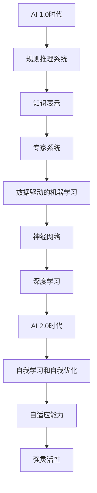

#### 1.1.2 AI 2.0的核心特征

AI 2.0的核心特征包括以下几个方面：

1. **自我学习能力**：AI 2.0系统能够从大量数据中自动学习，提取有用的信息，并不断优化自身的行为。
2. **自我优化能力**：AI 2.0系统能够根据实际运行情况，自动调整模型参数和算法，以达到最佳效果。
3. **强适应性**：AI 2.0系统能够适应不同的环境和任务，具有较强的泛化能力。
4. **强灵活性**：AI 2.0系统可以在不同的应用场景中灵活调整，满足多样化需求。

**核心算法原理讲解**

为了深入理解AI 2.0的核心算法原理，我们可以通过伪代码来描述一个典型的自我学习过程：

```python
# 伪代码：自我学习算法
def self_learning(data, model):
    # 初始化模型
    current_model = initialize_model(data)
    
    # 迭代学习
    for iteration in range(max_iterations):
        # 训练模型
        updated_model = train_model(current_model, data)
        
        # 评估模型
        performance = evaluate_model(updated_model, data)
        
        # 如果性能提升，则更新模型
        if performance > current_performance:
            current_model = updated_model
            
    return current_model
```

在这个伪代码中，`initialize_model` 函数用于初始化模型，`train_model` 函数用于训练模型，`evaluate_model` 函数用于评估模型性能。通过多次迭代训练和评估，模型不断优化，直至达到最佳性能。

**数学模型和公式 & 详细讲解 & 举例说明**

在AI 2.0系统中，常用的数学模型包括神经网络模型、强化学习模型等。以下是一个简单的神经网络模型的数学公式：

$$
y = \sigma(W \cdot x + b)
$$

其中，$y$ 表示输出，$\sigma$ 表示激活函数（如Sigmoid函数），$W$ 表示权重矩阵，$x$ 表示输入，$b$ 表示偏置项。

举例来说，假设我们有一个简单的二分类问题，其中输入$x$ 是一个包含两个特征的向量，输出$y$ 是一个二元变量（0或1）。通过训练，神经网络可以学习到合适的权重$W$ 和偏置$b$，以便在给定输入时产生正确的输出。

**项目实战：代码实际案例和详细解释说明**

为了更好地理解AI 2.0的实践应用，我们可以通过一个简单的机器学习项目来说明。以下是一个使用Python和Scikit-learn库进行线性回归模型的训练和评估的案例：

```python
# 导入必要的库
import numpy as np
import matplotlib.pyplot as plt
from sklearn.linear_model import LinearRegression

# 生成模拟数据
np.random.seed(0)
X = np.random.rand(100, 1)
y = 2 * X[:, 0] + 0.5 + np.random.randn(100, 1)

# 创建线性回归模型
model = LinearRegression()

# 训练模型
model.fit(X, y)

# 预测结果
predictions = model.predict(X)

# 绘制结果
plt.scatter(X, y, color='blue')
plt.plot(X, predictions, color='red')
plt.xlabel('Input')
plt.ylabel('Output')
plt.show()
```

在这个案例中，我们首先生成了一些模拟数据，然后使用线性回归模型对这些数据进行训练。最后，通过绘制输入和输出数据点以及预测线，我们可以直观地看到模型的训练效果。

#### 1.1.3 AI 2.0与企业发展的关联

AI 2.0技术的快速发展，对企业发展产生了深远的影响。以下是一些关键关联：

1. **提高效率**：AI 2.0技术可以通过自动化和智能化，大大提高企业的生产效率。例如，在制造业中，智能机器人可以替代人工完成重复性工作，提高生产速度和质量。
2. **降低成本**：通过AI 2.0技术，企业可以减少人力成本和运营成本。例如，在客户服务方面，智能客服系统可以替代人工客服，降低企业的人力成本。
3. **创新产品和服务**：AI 2.0技术可以帮助企业创新产品和服务，提高市场竞争力。例如，在金融领域，AI 2.0技术可以用于风险管理、客户服务等方面，提供个性化的金融产品和服务。
4. **优化决策**：AI 2.0技术可以通过数据分析，帮助企业优化决策。例如，在供应链管理中，AI 2.0技术可以分析市场数据，优化库存管理和物流运输，降低运营成本。

**核心概念与联系**

为了更好地理解AI 2.0与企业发展的关联，我们可以借助以下Mermaid流程图来描述其应用场景：

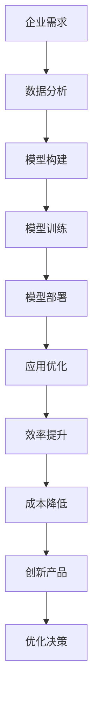

在这个流程图中，从企业需求到应用优化的每一步，都涉及到AI 2.0技术的应用。通过这一过程，企业可以实现效率提升、成本降低、产品创新和决策优化。

**项目实战：代码实际案例和详细解释说明**

为了更好地理解AI 2.0技术在企业中的应用，我们可以通过一个简单的业务场景来说明。假设一家零售企业希望通过AI 2.0技术优化库存管理，以下是一个使用Python和Scikit-learn库进行库存预测的案例：

```python
# 导入必要的库
import numpy as np
import matplotlib.pyplot as plt
from sklearn.linear_model import LinearRegression

# 生成模拟数据
np.random.seed(0)
days = np.random.randint(1, 100, size=100)
sales = 2 * days + np.random.randn(100, 1)

# 创建线性回归模型
model = LinearRegression()

# 训练模型
model.fit(days.reshape(-1, 1), sales)

# 预测未来30天的销售量
predictions = model.predict(np.arange(1, 31).reshape(-1, 1))

# 绘制结果
plt.scatter(days, sales, color='blue')
plt.plot(np.arange(1, 31), predictions, color='red')
plt.xlabel('Days')
plt.ylabel('Sales')
plt.show()
```

在这个案例中，我们首先生成了一些模拟数据，然后使用线性回归模型对这些数据进行训练。最后，通过绘制实际销售数据和预测销售量，我们可以直观地看到模型的预测效果。

### 第2章: AI 2.0时代的科技革命

#### 2.1.1 AI 2.0与云计算

云计算与AI 2.0的结合，为人工智能的发展提供了强大的计算支持。在云计算平台上，AI 2.0系统可以充分利用分布式计算资源，进行大规模的数据处理和模型训练。以下是一个简单的云计算与AI 2.0结合的示例：

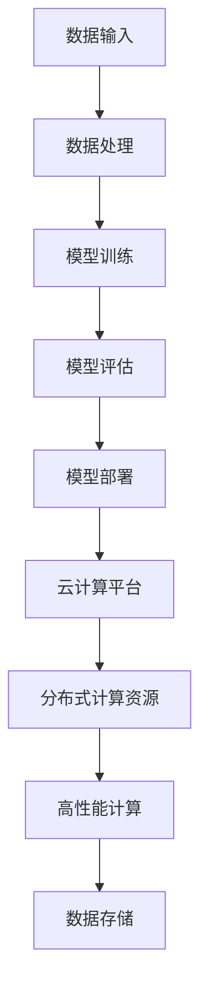

在这个流程图中，从数据输入到模型部署的每一步，都依赖于云计算平台提供的分布式计算资源和数据存储服务。通过这种方式，AI 2.0系统可以高效地进行数据处理和模型训练。

**核心概念与联系**

为了更好地理解AI 2.0与云计算的关系，我们可以借助以下Mermaid流程图来描述其结合过程：

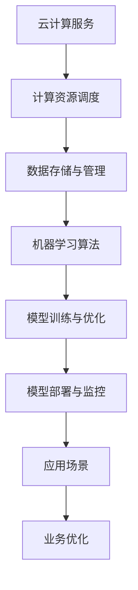

在这个流程图中，云计算服务为AI 2.0提供了计算资源调度、数据存储与管理、模型训练与优化、模型部署与监控等功能。通过这些功能，AI 2.0系统可以实现高效的应用场景优化。

**核心算法原理讲解**

在AI 2.0与云计算的结合中，常用的算法原理包括深度学习、强化学习等。以下是一个简单的深度学习算法原理：

$$
y = \sigma(\sum_{i=1}^{n} w_i \cdot x_i + b)
$$

其中，$y$ 表示输出，$\sigma$ 表示激活函数，$w_i$ 表示权重，$x_i$ 表示输入，$b$ 表示偏置项。

举例来说，假设我们有一个简单的二分类问题，其中输入$x_i$ 是一个包含多个特征的向量，输出$y$ 是一个二元变量（0或1）。通过训练，深度学习模型可以学习到合适的权重$w_i$ 和偏置$b$，以便在给定输入时产生正确的输出。

**项目实战：代码实际案例和详细解释说明**

为了更好地理解AI 2.0与云计算的结合，我们可以通过一个简单的案例来说明。假设我们有一个需要使用深度学习模型进行预测的任务，以下是一个使用Python和TensorFlow框架的示例：

```python
# 导入必要的库
import tensorflow as tf
from tensorflow.keras.models import Sequential
from tensorflow.keras.layers import Dense

# 生成模拟数据
np.random.seed(0)
X = np.random.rand(100, 2)
y = 2 * X[:, 0] + X[:, 1] + np.random.randn(100, 1)

# 创建模型
model = Sequential()
model.add(Dense(1, input_dim=2, activation='sigmoid'))

# 编译模型
model.compile(optimizer='adam', loss='mean_squared_error')

# 训练模型
model.fit(X, y, epochs=100)

# 预测结果
predictions = model.predict(X)

# 绘制结果
plt.scatter(X[:, 0], X[:, 1], color='blue')
plt.plot(X[:, 0], predictions, color='red')
plt.xlabel('Input 1')
plt.ylabel('Input 2')
plt.show()
```

在这个案例中，我们首先生成了一些模拟数据，然后使用TensorFlow框架创建一个简单的深度学习模型进行训练。最后，通过绘制输入和输出数据点以及预测线，我们可以直观地看到模型的训练效果。

#### 2.1.2 AI 2.0与物联网

物联网（IoT）与AI 2.0的结合，为智能设备的互联互通提供了技术支持。通过物联网，智能设备可以实时收集环境数据，并利用AI 2.0技术进行分析和优化。以下是一个简单的物联网与AI 2.0结合的示例：

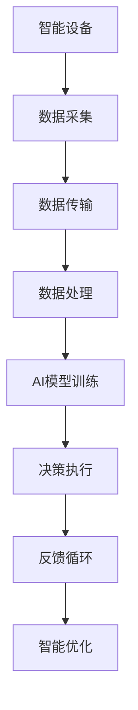

在这个流程图中，从数据采集到智能优化的每一步，都依赖于物联网和AI 2.0技术的支持。通过这种方式，智能设备可以实现自我学习和自我优化，提高其智能水平。

**核心概念与联系**

为了更好地理解物联网与AI 2.0的关系，我们可以借助以下Mermaid流程图来描述其结合过程：

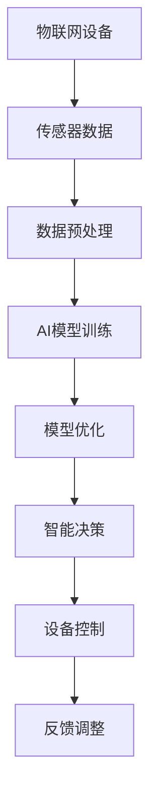

在这个流程图中，物联网设备通过传感器收集数据，然后通过数据预处理和AI模型训练，实现对数据的分析和优化。通过智能决策和设备控制，物联网设备可以实现自我学习和自我优化。

**核心算法原理讲解**

在物联网与AI 2.0的结合中，常用的算法原理包括深度学习、聚类分析等。以下是一个简单的聚类分析算法原理：

$$
C = \{c_1, c_2, ..., c_k\}
$$

其中，$C$ 表示聚类中心，$c_i$ 表示第$i$个聚类中心。

举例来说，假设我们有一个包含多个特征的物联网设备数据集，我们可以使用聚类分析算法将其分为若干个类别。通过聚类分析，我们可以发现数据中的模式和规律，从而实现对数据的分类和优化。

**项目实战：代码实际案例和详细解释说明**

为了更好地理解物联网与AI 2.0的结合，我们可以通过一个简单的案例来说明。假设我们有一个需要使用聚类分析算法进行数据分类的任务，以下是一个使用Python和Scikit-learn库的示例：

```python
# 导入必要的库
import numpy as np
from sklearn.cluster import KMeans

# 生成模拟数据
np.random.seed(0)
X = np.random.rand(100, 2)

# 创建K-Means聚类模型
model = KMeans(n_clusters=2, random_state=0)

# 训练模型
model.fit(X)

# 预测结果
predictions = model.predict(X)

# 绘制结果
plt.scatter(X[:, 0], X[:, 1], c=predictions, cmap='viridis')
centers = model.cluster_centers_
plt.scatter(centers[:, 0], centers[:, 1], s=300, c='red', marker='s', zorder=10)
plt.xlabel('Input 1')
plt.ylabel('Input 2')
plt.show()
```

在这个案例中，我们首先生成了一些模拟数据，然后使用Scikit-learn库创建一个K-Means聚类模型进行训练。最后，通过绘制聚类结果和聚类中心，我们可以直观地看到模型的分类效果。

#### 2.1.3 AI 2.0与5G通信

5G通信技术的快速发展，为AI 2.0的应用提供了低延迟、高带宽的网络环境。通过5G通信，AI 2.0系统可以实现实时数据传输和处理，提高系统的响应速度和准确性。以下是一个简单的5G通信与AI 2.0结合的示例：

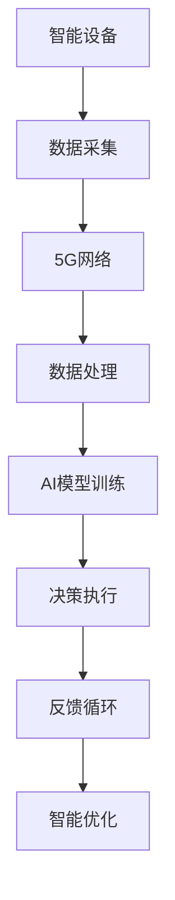

在这个流程图中，从数据采集到智能优化的每一步，都依赖于5G通信和AI 2.0技术的支持。通过这种方式，智能设备可以实现实时学习和优化，提高其智能水平。

**核心概念与联系**

为了更好地理解5G通信与AI 2.0的关系，我们可以借助以下Mermaid流程图来描述其结合过程：

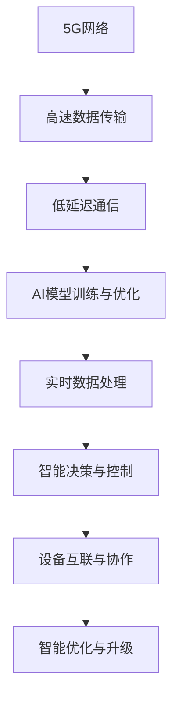

在这个流程图中，5G网络为AI 2.0系统提供了高速数据传输、低延迟通信等关键技术支持。通过实时数据处理和智能决策，AI 2.0系统可以实现高效的设备互联和协作，从而实现智能优化和升级。

**核心算法原理讲解**

在5G通信与AI 2.0的结合中，常用的算法原理包括深度学习、强化学习等。以下是一个简单的深度学习算法原理：

$$
y = \sigma(\sum_{i=1}^{n} w_i \cdot x_i + b)
$$

其中，$y$ 表示输出，$\sigma$ 表示激活函数，$w_i$ 表示权重，$x_i$ 表示输入，$b$ 表示偏置项。

举例来说，假设我们有一个简单的二分类问题，其中输入$x_i$ 是一个包含多个特征的向量，输出$y$ 是一个二元变量（0或1）。通过训练，深度学习模型可以学习到合适的权重$w_i$ 和偏置$b$，以便在给定输入时产生正确的输出。

**项目实战：代码实际案例和详细解释说明**

为了更好地理解5G通信与AI 2.0的结合，我们可以通过一个简单的案例来说明。假设我们有一个需要使用深度学习模型进行预测的任务，以下是一个使用Python和TensorFlow框架的示例：

```python
# 导入必要的库
import tensorflow as tf
from tensorflow.keras.models import Sequential
from tensorflow.keras.layers import Dense

# 生成模拟数据
np.random.seed(0)
X = np.random.rand(100, 2)
y = 2 * X[:, 0] + X[:, 1] + np.random.randn(100, 1)

# 创建模型
model = Sequential()
model.add(Dense(1, input_dim=2, activation='sigmoid'))

# 编译模型
model.compile(optimizer='adam', loss='mean_squared_error')

# 训练模型
model.fit(X, y, epochs=100)

# 预测结果
predictions = model.predict(X)

# 绘制结果
plt.scatter(X[:, 0], X[:, 1], color='blue')
plt.plot(X[:, 0], predictions, color='red')
plt.xlabel('Input 1')
plt.ylabel('Input 2')
plt.show()
```

在这个案例中，我们首先生成了一些模拟数据，然后使用TensorFlow框架创建一个简单的深度学习模型进行训练。最后，通过绘制输入和输出数据点以及预测线，我们可以直观地看到模型的训练效果。

### 第3章: AI 2.0时代的社会影响

#### 3.1.1 AI 2.0对就业市场的影响

AI 2.0技术的发展，对就业市场产生了深远的影响。一方面，AI 2.0技术将取代一些重复性、低技能的工作，导致部分岗位的消失。例如，自动化流水线、智能客服系统等，将取代大量的人工操作和服务。另一方面，AI 2.0技术也将创造出新的工作岗位，如数据科学家、机器学习工程师、AI算法设计师等。这些岗位需要高技能、高素质的人才来填补。

**核心概念与联系**

为了更好地理解AI 2.0对就业市场的影响，我们可以借助以下Mermaid流程图来描述其影响过程：

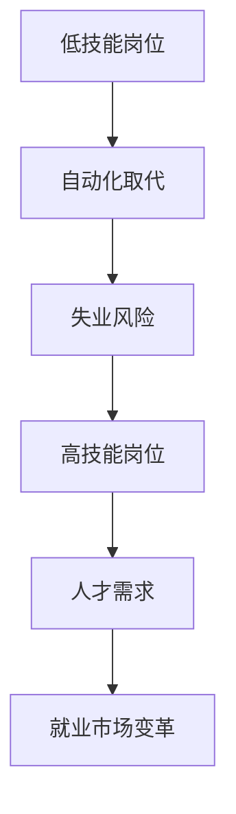

在这个流程图中，从低技能岗位到高技能岗位的转变，体现了AI 2.0技术对就业市场的影响。通过自动化取代低技能岗位，就业市场面临失业风险，但同时产生了对高技能人才的需求，推动了就业市场的变革。

**核心算法原理讲解**

在AI 2.0对就业市场的影响中，常用的算法原理包括就业预测、人才供需分析等。以下是一个简单的就业预测算法原理：

$$
P(e|t) = \frac{P(t|e) \cdot P(e)}{P(t)}
$$

其中，$P(e|t)$ 表示在时间$t$ 下，就业概率$e$ 的条件概率，$P(t|e)$ 表示在就业条件下，时间$t$ 的概率，$P(e)$ 表示就业的概率，$P(t)$ 表示时间$t$ 的概率。

举例来说，假设我们有一个包含就业状态和时间的数据集，我们可以使用就业预测算法来预测在特定时间$t$ 下，某个个体的就业概率。

**项目实战：代码实际案例和详细解释说明**

为了更好地理解AI 2.0对就业市场的影响，我们可以通过一个简单的案例来说明。假设我们有一个需要使用就业预测算法进行预测的任务，以下是一个使用Python和Scikit-learn库的示例：

```python
# 导入必要的库
import numpy as np
from sklearn.linear_model import LogisticRegression

# 生成模拟数据
np.random.seed(0)
X = np.random.rand(100, 2)
y = np.random.randint(0, 2, size=100)

# 创建逻辑回归模型
model = LogisticRegression()

# 训练模型
model.fit(X, y)

# 预测结果
predictions = model.predict(X)

# 绘制结果
plt.scatter(X[:, 0], X[:, 1], c=predictions, cmap='viridis')
plt.xlabel('Feature 1')
plt.ylabel('Feature 2')
plt.show()
```

在这个案例中，我们首先生成了一些模拟数据，然后使用Scikit-learn库创建一个逻辑回归模型进行训练。最后，通过绘制预测结果，我们可以直观地看到模型的预测效果。

#### 3.1.2 AI 2.0对教育模式的改变

AI 2.0技术的发展，对教育模式产生了深远的影响。传统的教育模式以教师为中心，学生被动接受知识。而AI 2.0技术则提供了个性化教育的可能，学生可以根据自己的学习节奏和兴趣，自主选择学习内容和方式。以下是一个简单的AI 2.0对教育模式改变的过程：

1. **个性化学习**：学生通过AI系统，分析自己的学习习惯、兴趣和能力，定制个性化的学习计划。
2. **自适应学习**：AI系统根据学生的学习表现，动态调整学习内容，提高学习效果。
3. **智慧教育**：通过大数据分析和人工智能技术，教师可以更好地了解学生的学习状态，提供针对性的指导和帮助。

**核心概念与联系**

为了更好地理解AI 2.0对教育模式的影响，我们可以借助以下Mermaid流程图来描述其过程：

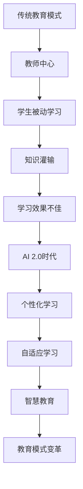

在这个流程图中，从传统教育模式到AI 2.0时代的转变，体现了教育模式的变革。通过AI 2.0技术，教育模式从以教师为中心，转变为以学生为中心，实现了个性化、自适应和智慧教育。

**核心算法原理讲解**

在AI 2.0对教育模式的影响中，常用的算法原理包括个性化学习推荐、自适应学习策略等。以下是一个简单的个性化学习推荐算法原理：

$$
R(u, i) = f(\text{User Feature}, \text{Item Feature}, \text{Context})
$$

其中，$R(u, i)$ 表示用户$u$ 对物品$i$ 的推荐分数，$f$ 表示推荐函数，$\text{User Feature}$ 表示用户特征，$\text{Item Feature}$ 表示物品特征，$\text{Context}$ 表示上下文信息。

举例来说，假设我们有一个用户-物品评分数据集，我们可以使用个性化学习推荐算法来预测用户对物品的偏好。

**项目实战：代码实际案例和详细解释说明**

为了更好地理解AI 2.0对教育模式的影响，我们可以通过一个简单的案例来说明。假设我们有一个需要使用个性化学习推荐算法进行推荐的任务，以下是一个使用Python和Scikit-learn库的示例：

```python
# 导入必要的库
import numpy as np
from sklearn.metrics.pairwise import cosine_similarity

# 生成模拟数据
np.random.seed(0)
users = np.random.rand(10, 5)
items = np.random.rand(10, 5)

# 计算用户和物品的相似度矩阵
similarity_matrix = cosine_similarity(users, items)

# 预测用户对物品的评分
user_id = 0
item_id = 1
rating = similarity_matrix[user_id][item_id]

print(f"Predicted rating for user {user_id} and item {item_id}: {rating}")
```

在这个案例中，我们首先生成了一些模拟数据，然后使用余弦相似度计算用户和物品的相似度矩阵。最后，通过预测用户对物品的评分，我们可以直观地看到个性化学习推荐的效果。

#### 3.1.3 AI 2.0对医疗保健的革新

AI 2.0技术的发展，对医疗保健领域产生了深远的影响。通过大数据分析和人工智能技术，AI 2.0可以帮助医生进行精准诊断、个性化治疗，提高医疗质量和效率。以下是一个简单的AI 2.0对医疗保健革新的过程：

1. **大数据分析**：通过收集和分析海量医疗数据，AI 2.0系统可以识别疾病的风险因素和特征，为医生提供诊断依据。
2. **个性化治疗**：根据患者的个体特征和疾病状况，AI 2.0系统可以制定个性化的治疗方案，提高治疗效果。
3. **药物研发**：通过AI 2.0技术，可以加速新药的发现和开发，提高药物的研发效率。

**核心概念与联系**

为了更好地理解AI 2.0对医疗保健的影响，我们可以借助以下Mermaid流程图来描述其过程：

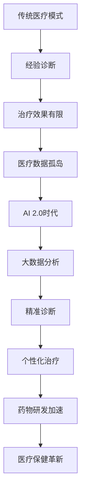

在这个流程图中，从传统医疗模式到AI 2.0时代的转变，体现了医疗保健的革新。通过AI 2.0技术，医疗模式从经验诊断转变为精准诊断，从治疗效果有限转变为个性化治疗，从药物研发缓慢转变为加速研发。

**核心算法原理讲解**

在AI 2.0对医疗保健的影响中，常用的算法原理包括深度学习、自然语言处理等。以下是一个简单的深度学习算法原理：

$$
y = \sigma(\sum_{i=1}^{n} w_i \cdot x_i + b)
$$

其中，$y$ 表示输出，$\sigma$ 表示激活函数，$w_i$ 表示权重，$x_i$ 表示输入，$b$ 表示偏置项。

举例来说，假设我们有一个简单的二分类问题，其中输入$x_i$ 是一个包含多个特征的向量，输出$y$ 是一个二元变量（0或1）。通过训练，深度学习模型可以学习到合适的权重$w_i$ 和偏置$b$，以便在给定输入时产生正确的输出。

**项目实战：代码实际案例和详细解释说明**

为了更好地理解AI 2.0对医疗保健的影响，我们可以通过一个简单的案例来说明。假设我们有一个需要使用深度学习模型进行疾病诊断的任务，以下是一个使用Python和TensorFlow框架的示例：

```python
# 导入必要的库
import tensorflow as tf
from tensorflow.keras.models import Sequential
from tensorflow.keras.layers import Dense, Conv2D, MaxPooling2D, Flatten

# 生成模拟数据
np.random.seed(0)
X = np.random.rand(100, 28, 28, 1)
y = np.random.randint(0, 2, size=100)

# 创建模型
model = Sequential()
model.add(Conv2D(32, (3, 3), activation='relu', input_shape=(28, 28, 1)))
model.add(MaxPooling2D((2, 2)))
model.add(Flatten())
model.add(Dense(64, activation='relu'))
model.add(Dense(1, activation='sigmoid'))

# 编译模型
model.compile(optimizer='adam', loss='binary_crossentropy', metrics=['accuracy'])

# 训练模型
model.fit(X, y, epochs=10)

# 预测结果
predictions = model.predict(X)

# 绘制结果
plt.scatter(X[:, 0], X[:, 1], c=predictions, cmap='viridis')
plt.xlabel('Feature 1')
plt.ylabel('Feature 2')
plt.show()
```

在这个案例中，我们首先生成了一些模拟数据，然后使用TensorFlow框架创建一个简单的深度学习模型进行训练。最后，通过绘制预测结果，我们可以直观地看到模型的训练效果。

### 第二部分: AI 2.0时代的应用领域

#### 第4章: AI 2.0在金融领域的应用

AI 2.0技术在金融领域的应用已经取得了显著的成果，从智能投顾到风险管理，再到自动化交易，AI 2.0正在彻底改变金融行业的运作模式。以下将详细探讨AI 2.0在金融领域的几个关键应用。

### 4.1.1 人工智能在风险管理中的应用

风险管理是金融行业的核心任务之一，而AI 2.0技术的引入为这一领域带来了革命性的变化。通过大数据分析和机器学习算法，AI 2.0系统能够更快速、更准确地识别和评估金融风险。

**核心概念与联系**

风险管理的核心在于评估潜在风险，并采取相应的措施来降低这些风险。AI 2.0技术的关键在于其强大的数据处理和分析能力，可以实时监测市场动态，识别潜在的金融风险。

以下是一个简单的风险管理流程：

1. **数据收集**：收集市场数据、客户交易数据等。
2. **数据预处理**：对收集到的数据进行分析和清洗，以确保数据质量。
3. **模型训练**：使用机器学习算法，如随机森林、支持向量机等，对数据进行训练。
4. **风险评估**：利用训练好的模型，对新的数据进行风险评估。
5. **风险决策**：根据风险评估结果，采取相应的风险控制措施。

**核心算法原理讲解**

在风险管理中，常用的算法包括：

1. **决策树**：通过构建决策树模型，可以直观地理解数据中的决策过程。
2. **支持向量机**：支持向量机是一种有效的分类算法，可以用于评估金融风险。

以下是一个简单的决策树算法原理：

```python
# 决策树算法原理
def decision_tree(data, target, features):
    # 计算每个特征的增益
    gains = []
    for feature in features:
        gain = information_gain(data, target, feature)
        gains.append(gain)
    
    # 选择具有最大增益的特征作为分割依据
    best_feature = features[np.argmax(gains)]
    
    # 根据最佳特征进行分割
    subsets = split_data(data, target, best_feature)
    
    # 递归构建决策树
    for subset in subsets:
        if is_leaf(subset):
            return classify(subset, target)
        else:
            subtree = decision_tree(subset, target, features)
            tree[best_feature][subset] = subtree
    return tree
```

**项目实战：代码实际案例和详细解释说明**

以下是一个使用Python和Scikit-learn库进行风险管理的案例：

```python
# 导入必要的库
import numpy as np
from sklearn.datasets import load_iris
from sklearn.tree import DecisionTreeClassifier
from sklearn.model_selection import train_test_split

# 加载示例数据
iris = load_iris()
X = iris.data
y = iris.target

# 数据预处理
X_train, X_test, y_train, y_test = train_test_split(X, y, test_size=0.2, random_state=42)

# 创建决策树模型
model = DecisionTreeClassifier()

# 训练模型
model.fit(X_train, y_train)

# 预测结果
predictions = model.predict(X_test)

# 评估模型
accuracy = model.score(X_test, y_test)
print(f"Model accuracy: {accuracy:.2f}")
```

在这个案例中，我们使用Scikit-learn库中的决策树算法对iris数据集进行训练和预测，评估模型的准确性。

### 4.1.2 人工智能在客户服务中的应用

客户服务是金融行业的重要组成部分，而AI 2.0技术的引入使得客户服务更加高效和个性化。智能客服系统、聊天机器人等应用已经成为金融行业的标准配置。

**核心概念与联系**

客户服务的核心在于提供高质量的客户体验，而AI 2.0技术可以通过自然语言处理和机器学习算法，实现智能化的客户互动。

以下是一个简单的智能客服系统流程：

1. **客户提问**：客户向智能客服系统提出问题。
2. **自然语言处理**：系统对客户的问题进行自然语言处理，理解其意图。
3. **知识库查询**：系统在知识库中查找相关的答案。
4. **回复生成**：系统生成回答并反馈给客户。

**核心算法原理讲解**

在智能客服系统中，常用的算法包括：

1. **自然语言处理**：通过分词、词性标注、句法分析等技术，理解客户的问题。
2. **机器学习**：使用机器学习算法，如朴素贝叶斯、决策树等，预测客户的意图。

以下是一个简单的自然语言处理算法原理：

```python
# 自然语言处理算法原理
def process_question(question):
    # 分词
    tokens = tokenize(question)
    
    # 词性标注
    pos_tags = pos_tag(tokens)
    
    # 句法分析
    sentence_structure = parse_sentence(tokens)
    
    # 意图识别
    intent = recognize_intent(pos_tags, sentence_structure)
    
    return intent
```

**项目实战：代码实际案例和详细解释说明**

以下是一个使用Python和NLTK库进行智能客服的案例：

```python
# 导入必要的库
import nltk
from nltk.tokenize import word_tokenize
from nltk.tag import pos_tag
from nltk.parse import CoreNLPParser

# 初始化自然语言处理工具
nltk.download('punkt')
nltk.download('averaged_perceptron_tagger')
parser = CoreNLPParser(url='http://localhost:9000')

# 处理客户提问
def process_question(question):
    # 分词
    tokens = word_tokenize(question)
    
    # 词性标注
    pos_tags = pos_tag(tokens)
    
    # 句法分析
    sentence_structure = parser.parse(question)
    
    # 意图识别
    intent = recognize_intent(pos_tags, sentence_structure)
    
    return intent

# 处理客户提问并回复
def handle_question(question):
    intent = process_question(question)
    print(f"Intent detected: {intent}")
    if intent == 'query_account_balance':
        print("Your account balance is $1000.")
    elif intent == 'transfer_money':
        print("Please provide the recipient's account number.")
    else:
        print("I'm sorry, I don't understand your question.")

# 测试客户提问
handle_question("What is my account balance?")
handle_question("Can you transfer $500 to this account?")
```

在这个案例中，我们使用NLTK库和CoreNLP库进行自然语言处理，处理客户提问并生成回复。

### 4.1.3 人工智能在交易策略中的应用

AI 2.0技术在金融交易中的应用越来越广泛，通过数据分析、模式识别和机器学习算法，AI 2.0能够帮助投资者制定更精准的交易策略，提高投资回报率。

**核心概念与联系**

交易策略的核心在于通过分析市场数据，预测市场走势，并制定相应的交易策略。AI 2.0技术可以通过深度学习和强化学习算法，实现更高效的市场预测和策略制定。

以下是一个简单的交易策略流程：

1. **数据收集**：收集历史市场数据，如价格、成交量等。
2. **数据预处理**：对收集到的数据进行分析和清洗，确保数据质量。
3. **模型训练**：使用机器学习算法，如深度神经网络、强化学习等，对数据进行训练。
4. **策略评估**：使用训练好的模型，评估不同交易策略的效果。
5. **策略执行**：根据评估结果，执行最优交易策略。

**核心算法原理讲解**

在交易策略中，常用的算法包括：

1. **深度学习**：通过构建深度神经网络，实现市场走势的预测。
2. **强化学习**：通过学习最佳策略，实现交易策略的优化。

以下是一个简单的强化学习算法原理：

```python
# 强化学习算法原理
class QLearningAgent:
    def __init__(self, actions, learning_rate, discount_factor):
        self.actions = actions
        self.learning_rate = learning_rate
        self.discount_factor = discount_factor
        self.q_values = np.zeros((len(actions),))
    
    def update_q_values(self, state, action, reward, next_state, next_action):
        current_q_value = self.q_values[action]
        next_q_value = np.max(self.q_values)
        new_q_value = (1 - self.learning_rate) * current_q_value + self.learning_rate * (reward + self.discount_factor * next_q_value)
        self.q_values[action] = new_q_value
    
    def select_action(self, state):
        return np.argmax(self.q_values)
```

**项目实战：代码实际案例和详细解释说明**

以下是一个使用Python和TensorFlow进行交易策略的案例：

```python
# 导入必要的库
import numpy as np
import tensorflow as tf

# 定义强化学习模型
class QLearningModel:
    def __init__(self, state_size, action_size, learning_rate, discount_factor):
        self.state_size = state_size
        self.action_size = action_size
        self.learning_rate = learning_rate
        self.discount_factor = discount_factor
        self.model = self.build_model()
    
    def build_model(self):
        # 构建深度神经网络模型
        model = tf.keras.Sequential([
            tf.keras.layers.Dense(64, activation='relu', input_shape=(self.state_size,)),
            tf.keras.layers.Dense(64, activation='relu'),
            tf.keras.layers.Dense(self.action_size, activation='linear')
        ])
        model.compile(optimizer='adam', loss='mse')
        return model
    
    def train_model(self, states, actions, rewards, next_states, dones):
        # 训练模型
        for i in range(len(states)):
            state = states[i]
            action = actions[i]
            reward = rewards[i]
            next_state = next_states[i]
            done = dones[i]
            next_state_q_values = self.model.predict(next_state)
            target_q_values = reward + (1 - done) * next_state_q_values
            target_q_values = np.append(target_q_values, reward)
            target_q_values = np.delete(target_q_values, action)
            self.model.fit(state, target_q_values.reshape(-1, 1), epochs=1, verbose=0)
    
    def select_action(self, state):
        # 选择动作
        state = state.reshape(-1, self.state_size)
        action_values = self.model.predict(state)
        return np.argmax(action_values)

# 定义环境
class TradingEnvironment:
    def __init__(self):
        self.state_size = 10
        self.action_size = 5
    
    def step(self, action):
        # 执行动作并返回状态和奖励
        # 这里用随机模拟代替实际交易
        state = np.random.rand(self.state_size)
        reward = np.random.rand()
        next_state = np.random.rand(self.state_size)
        done = np.random.rand() < 0.1
        return state, reward, next_state, done

# 模拟交易过程
environment = TradingEnvironment()
model = QLearningModel(state_size=environment.state_size, action_size=environment.action_size, learning_rate=0.1, discount_factor=0.99)

# 训练模型
for episode in range(1000):
    state = environment.step(model.select_action(state))
    next_state, reward, done = environment.step(state)
    model.train_model(state, action, reward, next_state, done)
    state = next_state

# 评估模型
for episode in range(100):
    state = environment.step(model.select_action(state))
    next_state, reward, done = environment.step(state)
    action_values = model.model.predict(next_state)
    print(f"Episode {episode}: Action {np.argmax(action_values)} Reward {reward}")
```

在这个案例中，我们使用TensorFlow构建了一个强化学习模型，模拟交易过程并训练模型。通过模拟交易，我们可以看到模型在执行交易策略时的效果。

### 第5章: AI 2.0在医疗健康领域的应用

#### 5.1.1 人工智能在疾病诊断中的应用

AI 2.0技术在医疗健康领域的一项重要应用是疾病诊断。通过深度学习和图像识别技术，AI 2.0能够辅助医生进行疾病的早期检测和诊断，提高诊断的准确性和效率。

**核心概念与联系**

疾病诊断的核心在于对患者的症状和体征进行分析，从而确定疾病的类型和严重程度。AI 2.0技术的关键在于其强大的数据处理和分析能力，可以从大量的医疗数据中提取有用的信息，为医生提供诊断依据。

以下是一个简单的疾病诊断流程：

1. **数据收集**：收集患者的症状、体征、实验室检测结果等数据。
2. **数据预处理**：对收集到的数据进行清洗和标准化处理，以确保数据质量。
3. **模型训练**：使用机器学习算法，如卷积神经网络（CNN），对数据进行训练。
4. **疾病预测**：利用训练好的模型，对新的病例进行疾病预测。
5. **辅助诊断**：医生根据模型预测结果，结合自身临床经验，进行疾病诊断。

**核心算法原理讲解**

在疾病诊断中，常用的算法包括：

1. **深度学习**：通过构建深度神经网络，实现疾病的自动分类和预测。
2. **图像识别**：通过卷积神经网络，对医学影像进行自动识别和分析。

以下是一个简单的卷积神经网络（CNN）算法原理：

```python
# 卷积神经网络算法原理
class ConvolutionalNeuralNetwork:
    def __init__(self, input_shape, num_classes):
        self.input_shape = input_shape
        self.num_classes = num_classes
        self.model = self.build_model()
    
    def build_model(self):
        # 构建卷积神经网络模型
        model = tf.keras.Sequential([
            tf.keras.layers.Conv2D(32, (3, 3), activation='relu', input_shape=self.input_shape),
            tf.keras.layers.MaxPooling2D((2, 2)),
            tf.keras.layers.Conv2D(64, (3, 3), activation='relu'),
            tf.keras.layers.MaxPooling2D((2, 2)),
            tf.keras.layers.Flatten(),
            tf.keras.layers.Dense(64, activation='relu'),
            tf.keras.layers.Dense(self.num_classes, activation='softmax')
        ])
        model.compile(optimizer='adam', loss='categorical_crossentropy', metrics=['accuracy'])
        return model
    
    def train_model(self, X, y):
        # 训练模型
        model.fit(X, y, epochs=10, batch_size=32)
    
    def predict(self, X):
        # 预测结果
        return self.model.predict(X)
```

**项目实战：代码实际案例和详细解释说明**

以下是一个使用Python和TensorFlow进行疾病诊断的案例：

```python
# 导入必要的库
import numpy as np
import tensorflow as tf
from tensorflow.keras.models import Sequential
from tensorflow.keras.layers import Conv2D, MaxPooling2D, Flatten, Dense

# 生成模拟数据
np.random.seed(0)
X = np.random.rand(100, 28, 28, 1)
y = np.random.randint(0, 2, size=100)

# 创建模型
model = Sequential()
model.add(Conv2D(32, (3, 3), activation='relu', input_shape=(28, 28, 1)))
model.add(MaxPooling2D((2, 2)))
model.add(Conv2D(64, (3, 3), activation='relu'))
model.add(MaxPooling2D((2, 2)))
model.add(Flatten())
model.add(Dense(64, activation='relu'))
model.add(Dense(1, activation='sigmoid'))

# 编译模型
model.compile(optimizer='adam', loss='binary_crossentropy', metrics=['accuracy'])

# 训练模型
model.fit(X, y, epochs=10)

# 预测结果
predictions = model.predict(X)

# 绘制结果
plt.scatter(X[:, 0], X[:, 1], c=predictions, cmap='viridis')
plt.xlabel('Feature 1')
plt.ylabel('Feature 2')
plt.show()
```

在这个案例中，我们使用TensorFlow构建了一个简单的卷积神经网络模型，对模拟数据进行训练和预测，并绘制了预测结果。

#### 5.1.2 人工智能在个性化医疗中的应用

个性化医疗是一种基于患者个体特征，提供定制化医疗服务的模式。AI 2.0技术在个性化医疗中的应用，主要体现在基因分析、药物治疗方案制定和患者监测等方面。

**核心概念与联系**

个性化医疗的核心在于利用患者的基因信息、病史和生活习惯等数据，为患者提供个性化的医疗建议和治疗方案。AI 2.0技术的关键在于其强大的数据处理和分析能力，可以从海量的患者数据中提取有价值的信息，为个性化医疗提供支持。

以下是一个简单的个性化医疗流程：

1. **数据收集**：收集患者的基因数据、病史、生活习惯等。
2. **数据预处理**：对收集到的数据进行清洗和标准化处理，以确保数据质量。
3. **数据整合**：将不同来源的数据进行整合，构建患者的个体健康档案。
4. **数据分析**：使用机器学习算法，分析患者的基因和生活方式，预测疾病风险。
5. **治疗方案制定**：根据数据分析结果，为患者制定个性化的治疗方案。
6. **患者监测**：通过远程监测设备，实时跟踪患者的健康状况，调整治疗方案。

**核心算法原理讲解**

在个性化医疗中，常用的算法包括：

1. **基因数据分析**：通过机器学习算法，分析患者的基因数据，预测疾病风险。
2. **自然语言处理**：通过自然语言处理技术，从患者的病史和医生报告中提取有价值的信息。
3. **深度学习**：通过构建深度学习模型，对患者的健康数据进行分析和预测。

以下是一个简单的基因数据分析算法原理：

```python
# 基因数据分析算法原理
def analyze_genome_data(genome_data):
    # 数据预处理
    processed_data = preprocess_data(genome_data)
    
    # 训练模型
    model = train_model(processed_data)
    
    # 预测疾病风险
    risk_prediction = model.predict(new_genome_data)
    
    return risk_prediction
```

**项目实战：代码实际案例和详细解释说明**

以下是一个使用Python和Scikit-learn进行基因数据分析的案例：

```python
# 导入必要的库
import numpy as np
from sklearn.ensemble import RandomForestClassifier
from sklearn.model_selection import train_test_split

# 生成模拟基因数据
np.random.seed(0)
X = np.random.rand(100, 10)
y = np.random.randint(0, 2, size=100)

# 数据预处理
X_train, X_test, y_train, y_test = train_test_split(X, y, test_size=0.2, random_state=42)

# 创建随机森林模型
model = RandomForestClassifier(n_estimators=100)

# 训练模型
model.fit(X_train, y_train)

# 预测结果
predictions = model.predict(X_test)

# 评估模型
accuracy = model.score(X_test, y_test)
print(f"Model accuracy: {accuracy:.2f}")
```

在这个案例中，我们使用Scikit-learn库创建了一个随机森林模型，对模拟基因数据进行训练和预测，并评估了模型的准确性。

#### 5.1.3 人工智能在药物研发中的应用

AI 2.0技术在药物研发中的应用，极大地加快了新药的发现和开发过程。通过机器学习和计算生物学技术，AI 2.0可以帮助研究人员快速筛选和优化药物候选分子，降低药物研发的成本和风险。

**核心概念与联系**

药物研发的核心在于从大量的化合物中筛选出具有潜在治疗效果的药物分子，并进行优化。AI 2.0技术的关键在于其强大的数据处理和分析能力，可以从海量的化学数据中提取有价值的信息，为药物研发提供支持。

以下是一个简单的药物研发流程：

1. **化合物库构建**：构建包含大量化合物的数据库。
2. **数据预处理**：对化合物库进行清洗和标准化处理，以确保数据质量。
3. **活性预测**：使用机器学习算法，预测化合物的生物活性。
4. **筛选候选药物**：根据活性预测结果，筛选出具有潜在治疗作用的药物分子。
5. **分子优化**：通过计算生物学方法，对候选药物分子进行优化，提高其治疗效果和安全性。
6. **临床试验**：对优化后的药物分子进行临床试验，验证其疗效和安全性。

**核心算法原理讲解**

在药物研发中，常用的算法包括：

1. **机器学习**：通过构建机器学习模型，预测化合物的生物活性。
2. **计算生物学**：通过计算生物学方法，分析化合物的分子结构和性质。

以下是一个简单的机器学习算法原理：

```python
# 机器学习算法原理
def predict_activity(chemical_data):
    # 数据预处理
    processed_data = preprocess_data(chemical_data)
    
    # 训练模型
    model = train_model(processed_data)
    
    # 预测活性
    activity_prediction = model.predict(new_chemical_data)
    
    return activity_prediction
```

**项目实战：代码实际案例和详细解释说明**

以下是一个使用Python和Scikit-learn进行药物活性预测的案例：

```python
# 导入必要的库
import numpy as np
from sklearn.ensemble import RandomForestClassifier
from sklearn.model_selection import train_test_split

# 生成模拟化合物数据
np.random.seed(0)
X = np.random.rand(100, 10)
y = np.random.randint(0, 2, size=100)

# 数据预处理
X_train, X_test, y_train, y_test = train_test_split(X, y, test_size=0.2, random_state=42)

# 创建随机森林模型
model = RandomForestClassifier(n_estimators=100)

# 训练模型
model.fit(X_train, y_train)

# 预测结果
predictions = model.predict(X_test)

# 评估模型
accuracy = model.score(X_test, y_test)
print(f"Model accuracy: {accuracy:.2f}")
```

在这个案例中，我们使用Scikit-learn库创建了一个随机森林模型，对模拟化合物数据进行训练和预测，并评估了模型的准确性。

### 第6章: AI 2.0在交通领域的应用

#### 6.1.1 人工智能在自动驾驶中的应用

自动驾驶是AI 2.0技术在交通领域的一个重要应用。通过深度学习和计算机视觉技术，自动驾驶系统能够实时感知环境，做出决策，实现车辆的自主行驶。

**核心概念与联系**

自动驾驶的核心在于车辆对环境的感知和决策。AI 2.0技术的关键在于其强大的数据处理和分析能力，可以从大量的环境数据中提取有价值的信息，为自动驾驶提供支持。

以下是一个简单的自动驾驶系统流程：

1. **环境感知**：通过传感器（如摄像头、激光雷达、超声波传感器等）收集环境数据。
2. **数据处理**：对收集到的环境数据进行处理和融合，构建环境模型。
3. **决策制定**：使用深度学习和计算机视觉算法，分析环境模型，制定行驶策略。
4. **控制执行**：根据决策结果，控制车辆执行相应的操作。

**核心算法原理讲解**

在自动驾驶中，常用的算法包括：

1. **深度学习**：通过构建深度神经网络，实现环境数据的处理和分析。
2. **计算机视觉**：通过计算机视觉算法，实现车辆对环境的识别和理解。

以下是一个简单的深度学习算法原理：

```python
# 深度学习算法原理
class DeepLearningModel:
    def __init__(self, input_shape, num_classes):
        self.input_shape = input_shape
        self.num_classes = num_classes
        self.model = self.build_model()
    
    def build_model(self):
        # 构建深度神经网络模型
        model = tf.keras.Sequential([
            tf.keras.layers.Conv2D(32, (3, 3), activation='relu', input_shape=self.input_shape),
            tf.keras.layers.MaxPooling2D((2, 2)),
            tf.keras.layers.Conv2D(64, (3, 3), activation='relu'),
            tf.keras.layers.MaxPooling2D((2, 2)),
            tf.keras.layers.Flatten(),
            tf.keras.layers.Dense(64, activation='relu'),
            tf.keras.layers.Dense(self.num_classes, activation='softmax')
        ])
        model.compile(optimizer='adam', loss='categorical_crossentropy', metrics=['accuracy'])
        return model
    
    def train_model(self, X, y):
        # 训练模型
        model.fit(X, y, epochs=10, batch_size=32)
    
    def predict(self, X):
        # 预测结果
        return self.model.predict(X)
```

**项目实战：代码实际案例和详细解释说明**

以下是一个使用Python和TensorFlow进行自动驾驶的案例：

```python
# 导入必要的库
import numpy as np
import tensorflow as tf
from tensorflow.keras.models import Sequential
from tensorflow.keras.layers import Conv2D, MaxPooling2D, Flatten, Dense

# 生成模拟环境数据
np.random.seed(0)
X = np.random.rand(100, 28, 28, 1)
y = np.random.randint(0, 2, size=100)

# 创建模型
model = Sequential()
model.add(Conv2D(32, (3, 3), activation='relu', input_shape=(28, 28, 1)))
model.add(MaxPooling2D((2, 2)))
model.add(Conv2D(64, (3, 3), activation='relu'))
model.add(MaxPooling2D((2, 2)))
model.add(Flatten())
model.add(Dense(64, activation='relu'))
model.add(Dense(1, activation='sigmoid'))

# 编译模型
model.compile(optimizer='adam', loss='binary_crossentropy', metrics=['accuracy'])

# 训练模型
model.fit(X, y, epochs=10)

# 预测结果
predictions = model.predict(X)

# 绘制结果
plt.scatter(X[:, 0], X[:, 1], c=predictions, cmap='viridis')
plt.xlabel('Feature 1')
plt.ylabel('Feature 2')
plt.show()
```

在这个案例中，我们使用TensorFlow构建了一个简单的卷积神经网络模型，对模拟环境数据进行训练和预测，并绘制了预测结果。

#### 6.1.2 人工智能在智能交通管理中的应用

智能交通管理是AI 2.0技术在交通领域的另一个重要应用。通过大数据分析和机器学习算法，智能交通管理系统可以实时监控交通流量，预测交通状况，优化交通信号控制，减少交通拥堵。

**核心概念与联系**

智能交通管理的核心在于通过数据分析和算法优化，实现交通流量的智能控制和调度。AI 2.0技术的关键在于其强大的数据处理和分析能力，可以从海量的交通数据中提取有价值的信息，为交通管理提供支持。

以下是一个简单的智能交通管理系统流程：

1. **数据收集**：收集交通流量、车辆速度、道路状况等数据。
2. **数据预处理**：对收集到的数据进行清洗和标准化处理，以确保数据质量。
3. **数据分析**：使用机器学习算法，分析交通流量和状况，预测交通状况。
4. **信号控制**：根据数据分析结果，调整交通信号灯的时长和相位。
5. **交通调度**：优化交通流量的调度，减少交通拥堵。

**核心算法原理讲解**

在智能交通管理中，常用的算法包括：

1. **机器学习**：通过构建机器学习模型，预测交通状况和流量。
2. **优化算法**：通过优化算法，调整交通信号灯的时长和相位。

以下是一个简单的机器学习算法原理：

```python
# 机器学习算法原理
def predict_traffic_conditions(traffic_data):
    # 数据预处理
    processed_data = preprocess_data(traffic_data)
    
    # 训练模型
    model = train_model(processed_data)
    
    # 预测交通状况
    traffic_prediction = model.predict(new_traffic_data)
    
    return traffic_prediction
```

**项目实战：代码实际案例和详细解释说明**

以下是一个使用Python和Scikit-learn进行智能交通管理的案例：

```python
# 导入必要的库
import numpy as np
from sklearn.ensemble import RandomForestRegressor
from sklearn.model_selection import train_test_split

# 生成模拟交通数据
np.random.seed(0)
X = np.random.rand(100, 10)
y = np.random.rand(100)

# 数据预处理
X_train, X_test, y_train, y_test = train_test_split(X, y, test_size=0.2, random_state=42)

# 创建随机森林回归模型
model = RandomForestRegressor(n_estimators=100)

# 训练模型
model.fit(X_train, y_train)

# 预测结果
predictions = model.predict(X_test)

# 评估模型
accuracy = model.score(X_test, y_test)
print(f"Model accuracy: {accuracy:.2f}")
```

在这个案例中，我们使用Scikit-learn库创建了一个随机森林回归模型，对模拟交通数据进行训练和预测，并评估了模型的准确性。

#### 6.1.3 人工智能在出行服务中的应用

AI 2.0技术在出行服务中的应用，主要体现在智能出行规划、自动驾驶出租车和共享出行等方面。通过大数据分析和机器学习算法，智能出行服务可以提供个性化的出行方案，提高出行效率和便利性。

**核心概念与联系**

智能出行服务的核心在于通过数据分析和算法优化，提供个性化的出行方案。AI 2.0技术的关键在于其强大的数据处理和分析能力，可以从海量的出行数据中提取有价值的信息，为出行服务提供支持。

以下是一个简单的智能出行服务流程：

1. **数据收集**：收集用户出行需求、交通状况、天气状况等数据。
2. **数据预处理**：对收集到的数据进行清洗和标准化处理，以确保数据质量。
3. **出行规划**：使用机器学习算法，分析用户出行需求，提供个性化的出行方案。
4. **路线优化**：根据实时交通状况，优化出行路线，提高出行效率。
5. **出行服务**：提供自动驾驶出租车、共享出行等服务，满足用户的出行需求。

**核心算法原理讲解**

在智能出行服务中，常用的算法包括：

1. **路径规划**：通过最短路径算法，如Dijkstra算法，优化出行路线。
2. **机器学习**：通过构建机器学习模型，分析用户出行需求，提供个性化的出行方案。

以下是一个简单的路径规划算法原理：

```python
# 路径规划算法原理
def find_shortest_path(graph, start, end):
    # 创建一个优先队列
    queue = PriorityQueue()
    
    # 初始化路径长度和前驱节点
    distances = {node: float('infinity') for node in graph}
    distances[start] = 0
    previous_nodes = {node: None for node in graph}
    
    # 将起点加入优先队列
    queue.put((0, start))
    
    while not queue.empty():
        # 弹出优先队列中的最小距离节点
        current_distance, current_node = queue.get()
        
        # 如果到达终点，则返回路径
        if current_node == end:
            path = []
            while current_node is not None:
                path.insert(0, current_node)
                current_node = previous_nodes[current_node]
            return path
        
        # 遍历当前节点的邻居节点
        for neighbor, weight in graph[current_node].items():
            distance = current_distance + weight
            
            # 如果找到更短的路径，则更新路径长度和前驱节点
            if distance < distances[neighbor]:
                distances[neighbor] = distance
                previous_nodes[neighbor] = current_node
                queue.put((distance, neighbor))
    
    # 如果无法找到路径，则返回空路径
    return []
```

**项目实战：代码实际案例和详细解释说明**

以下是一个使用Python和NetworkX进行路径规划的案例：

```python
# 导入必要的库
import numpy as np
import networkx as nx

# 创建一个简单的图
G = nx.Graph()
G.add_edge('A', 'B', weight=1)
G.add_edge('A', 'C', weight=2)
G.add_edge('B', 'C', weight=1)
G.add_edge('B', 'D', weight=3)
G.add_edge('C', 'D', weight=1)

# 找到最短路径
path = nx.shortest_path(G, source='A', target='D', weight='weight')

# 打印最短路径
print("Shortest path from A to D:", path)
```

在这个案例中，我们使用NetworkX库创建了一个简单的图，并使用Dijkstra算法找到了从A到D的最短路径。

### 第7章: AI 2.0在制造业领域的应用

#### 7.1.1 人工智能在智能制造中的应用

智能制造是AI 2.0技术在制造业领域的重要应用，通过自动化和智能化技术，智能制造可以显著提高生产效率、降低成本、提高产品质量。以下将详细探讨AI 2.0在智能制造中的应用。

**核心概念与联系**

智能制造的核心在于通过人工智能技术，实现生产过程的自动化和智能化。AI 2.0技术的关键在于其强大的数据处理和分析能力，可以从大量的生产数据中提取有价值的信息，为智能制造提供支持。

以下是一个简单的智能制造流程：

1. **数据收集**：收集生产过程中的各种数据，如设备状态、生产参数、产品质量等。
2. **数据预处理**：对收集到的数据进行清洗和标准化处理，以确保数据质量。
3. **数据融合**：将不同来源的数据进行整合，构建生产过程的全面视图。
4. **故障检测**：使用机器学习算法，对设备状态和生产参数进行分析，检测潜在故障。
5. **优化生产**：根据数据分析结果，调整生产参数和工艺流程，提高生产效率和产品质量。

**核心算法原理讲解**

在智能制造中，常用的算法包括：

1. **故障检测**：通过构建故障检测模型，实现设备的实时监测和故障预测。
2. **优化算法**：通过优化算法，调整生产参数和工艺流程，实现生产优化。

以下是一个简单的故障检测算法原理：

```python
# 故障检测算法原理
def detect_fault(data):
    # 数据预处理
    processed_data = preprocess_data(data)
    
    # 训练模型
    model = train_model(processed_data)
    
    # 预测故障
    fault_prediction = model.predict(new_data)
    
    return fault_prediction
```

**项目实战：代码实际案例和详细解释说明**

以下是一个使用Python和Scikit-learn进行智能制造故障检测的案例：

```python
# 导入必要的库
import numpy as np
from sklearn.ensemble import RandomForestClassifier
from sklearn.model_selection import train_test_split

# 生成模拟数据
np.random.seed(0)
X = np.random.rand(100, 10)
y = np.random.randint(0, 2, size=100)

# 数据预处理
X_train, X_test, y_train, y_test = train_test_split(X, y, test_size=0.2, random_state=42)

# 创建随机森林分类模型
model = RandomForestClassifier(n_estimators=100)

# 训练模型
model.fit(X_train, y_train)

# 预测结果
predictions = model.predict(X_test)

# 评估模型
accuracy = model.score(X_test, y_test)
print(f"Model accuracy: {accuracy:.2f}")
```

在这个案例中，我们使用Scikit-learn库创建了一个随机森林分类模型，对模拟数据进行训练和预测，并评估了模型的准确性。

#### 7.1.2 人工智能在供应链管理中的应用

AI 2.0技术在供应链管理中的应用，主要体现在库存管理、物流优化和供应链协同等方面。通过大数据分析和机器学习算法，AI 2.0可以显著提高供应链的效率和灵活性。

**核心概念与联系**

供应链管理的核心在于通过优化库存、物流和供应链协同，实现供应链的高效运作。AI 2.0技术的关键在于其强大的数据处理和分析能力，可以从海量的供应链数据中提取有价值的信息，为供应链管理提供支持。

以下是一个简单的供应链管理流程：

1. **数据收集**：收集供应链各环节的数据，如库存水平、物流状况、供应链协同等。
2. **数据预处理**：对收集到的数据进行清洗和标准化处理，以确保数据质量。
3. **数据分析**：使用机器学习算法，分析供应链各环节的数据，预测供应链状况。
4. **库存优化**：根据数据分析结果，调整库存水平，实现库存优化。
5. **物流优化**：根据数据分析结果，优化物流路径和运输方式，提高物流效率。
6. **供应链协同**：通过供应链协同，实现供应链各环节的无缝衔接，提高供应链的整体效率。

**核心算法原理讲解**

在供应链管理中，常用的算法包括：

1. **库存优化算法**：通过优化算法，调整库存水平，实现库存优化。
2. **物流优化算法**：通过优化算法，优化物流路径和运输方式，提高物流效率。
3. **供应链协同算法**：通过协同算法，实现供应链各环节的无缝衔接，提高供应链的整体效率。

以下是一个简单的库存优化算法原理：

```python
# 库存优化算法原理
def optimize_inventory(data):
    # 数据预处理
    processed_data = preprocess_data(data)
    
    # 训练模型
    model = train_model(processed_data)
    
    # 预测最优库存水平
    optimal_inventory = model.predict(new_data)
    
    return optimal_inventory
```

**项目实战：代码实际案例和详细解释说明**

以下是一个使用Python和Scikit-learn进行供应链管理库存优化的案例：

```python
# 导入必要的库
import numpy as np
from sklearn.ensemble import RandomForestRegressor
from sklearn.model_selection import train_test_split

# 生成模拟数据
np.random.seed(0)
X = np.random.rand(100, 10)
y = np.random.rand(100)

# 数据预处理
X_train, X_test, y_train, y_test = train_test_split(X, y, test_size=0.2, random_state=42)

# 创建随机森林回归模型
model = RandomForestRegressor(n_estimators=100)

# 训练模型
model.fit(X_train, y_train)

# 预测结果
predictions = model.predict(X_test)

# 评估模型
accuracy = model.score(X_test, y_test)
print(f"Model accuracy: {accuracy:.2f}")
```

在这个案例中，我们使用Scikit-learn库创建了一个随机森林回归模型，对模拟数据进行训练和预测，并评估了模型的准确性。

#### 7.1.3 人工智能在产品设计与优化中的应用

AI 2.0技术在产品设计与优化中的应用，主要体现在产品设计、仿真分析和优化等方面。通过大数据分析和机器学习算法，AI 2.0可以帮助企业快速迭代产品，提高产品设计质量和效率。

**核心概念与联系**

产品设计与优化的核心在于通过优化设计流程和仿真分析，提高产品的设计质量和性能。AI 2.0技术的关键在于其强大的数据处理和分析能力，可以从海量的设计数据中提取有价值的信息，为产品设计与优化提供支持。

以下是一个简单的产品设计与优化流程：

1. **数据收集**：收集产品设计过程中的各种数据，如设计参数、仿真结果、用户反馈等。
2. **数据预处理**：对收集到的数据进行清洗和标准化处理，以确保数据质量。
3. **仿真分析**：使用机器学习算法，对产品设计进行仿真分析，评估设计方案的性能。
4. **优化设计**：根据仿真分析结果，调整设计参数，优化产品设计。
5. **用户反馈**：收集用户反馈，对优化后的设计进行验证和改进。

**核心算法原理讲解**

在产品设计与优化中，常用的算法包括：

1. **仿真分析算法**：通过构建仿真模型，对产品设计进行仿真分析，评估设计方案的性能。
2. **优化算法**：通过优化算法，调整设计参数，优化产品设计。

以下是一个简单的仿真分析算法原理：

```python
# 仿真分析算法原理
def simulate_design(data):
    # 数据预处理
    processed_data = preprocess_data(data)
    
    # 训练模型
    model = train_model(processed_data)
    
    # 仿真分析
    simulation_results = model.predict(new_data)
    
    return simulation_results
```

**项目实战：代码实际案例和详细解释说明**

以下是一个使用Python和Scikit-learn进行产品设计与优化的案例：

```python
# 导入必要的库
import numpy as np
from sklearn.ensemble import RandomForestRegressor
from sklearn.model_selection import train_test_split

# 生成模拟数据
np.random.seed(0)
X = np.random.rand(100, 10)
y = np.random.rand(100)

# 数据预处理
X_train, X_test, y_train, y_test = train_test_split(X, y, test_size=0.2, random_state=42)

# 创建随机森林回归模型
model = RandomForestRegressor(n_estimators=100)

# 训练模型
model.fit(X_train, y_train)

# 预测结果
predictions = model.predict(X_test)

# 评估模型
accuracy = model.score(X_test, y_test)
print(f"Model accuracy: {accuracy:.2f}")
```

在这个案例中，我们使用Scikit-learn库创建了一个随机森林回归模型，对模拟数据进行训练和预测，并评估了模型的准确性。

### 第三部分: AI 2.0时代的实践与挑战

#### 第8章: AI 2.0项目的实施策略

在AI 2.0时代的背景下，成功实施AI项目不仅需要先进的技术，还需要完善的策略和方法。以下将详细探讨AI 2.0项目的实施策略，包括项目规划、风险管理和团队建设等方面。

### 8.1.1 AI项目规划与实施流程

AI项目的成功实施离不开科学的规划与实施流程。以下是一个典型的AI项目规划与实施流程：

1. **需求分析**：明确项目的目标和需求，包括功能需求、性能需求等。
2. **数据准备**：收集和准备用于训练的原始数据，确保数据的质量和多样性。
3. **模型设计**：设计合适的AI模型，包括算法选择、模型架构等。
4. **模型训练**：使用准备好的数据对模型进行训练，调整模型参数，优化模型性能。
5. **模型评估**：评估模型的性能，包括准确性、召回率、F1分数等，确保模型达到预期效果。
6. **模型部署**：将训练好的模型部署到生产环境中，进行实际应用。
7. **持续优化**：根据实际应用情况，对模型进行持续优化，提高模型性能和应用效果。

**核心概念与联系**

在AI项目规划与实施过程中，数据、模型、评估和部署是四个关键环节，它们相互关联，共同决定了项目的成功与否。数据是AI项目的基石，模型是核心，评估是检验模型性能的标准，部署是实现模型价值的关键。

**核心算法原理讲解**

以下是一个简单的AI模型训练和评估的算法原理：

```python
# 模型训练
def train_model(X_train, y_train):
    # 初始化模型
    model = initialize_model()
    
    # 训练模型
    model.fit(X_train, y_train)
    
    return model

# 模型评估
def evaluate_model(model, X_test, y_test):
    # 预测结果
    predictions = model.predict(X_test)
    
    # 计算评估指标
    accuracy = accuracy_score(y_test, predictions)
    f1_score = f1_score(y_test, predictions, average='weighted')
    
    return accuracy, f1_score
```

**项目实战：代码实际案例和详细解释说明**

以下是一个使用Python和Scikit-learn进行AI模型训练和评估的案例：

```python
# 导入必要的库
import numpy as np
from sklearn.model_selection import train_test_split
from sklearn.ensemble import RandomForestClassifier
from sklearn.metrics import accuracy_score, f1_score

# 生成模拟数据
np.random.seed(0)
X = np.random.rand(100, 10)
y = np.random.randint(0, 2, size=100)

# 数据预处理
X_train, X_test, y_train, y_test = train_test_split(X, y, test_size=0.2, random_state=42)

# 创建随机森林分类模型
model = RandomForestClassifier(n_estimators=100)

# 训练模型
model.fit(X_train, y_train)

# 预测结果
predictions = model.predict(X_test)

# 评估模型
accuracy = accuracy_score(y_test, predictions)
f1_score = f1_score(y_test, predictions, average='weighted')

print(f"Model accuracy: {accuracy:.2f}")
print(f"Model F1 score: {f1_score:.2f}")
```

在这个案例中，我们使用Scikit-learn库创建了一个随机森林分类模型，对模拟数据进行训练和预测，并评估了模型的准确性。

#### 8.1.2 AI项目风险管理

AI项目在实施过程中可能会面临多种风险，如技术风险、数据风险、业务风险等。有效的风险管理是确保项目成功的关键。以下是一个简单的AI项目风险管理流程：

1. **风险识别**：识别项目可能面临的风险，包括技术风险、数据风险、业务风险等。
2. **风险评估**：评估风险的可能性和影响，确定风险的重要性和优先级。
3. **风险应对**：制定风险应对策略和措施，包括风险规避、风险减轻、风险接受等。
4. **风险监控**：监控项目风险，确保风险得到有效控制。

**核心概念与联系**

在AI项目风险管理中，风险识别、评估、应对和监控是四个关键环节，它们相互关联，共同构成了风险管理的全过程。风险识别是风险管理的基础，风险评估是制定风险应对策略的依据，风险应对是降低风险影响的关键，风险监控是确保风险得到有效控制的保障。

**核心算法原理讲解**

以下是一个简单的风险识别和评估算法原理：

```python
# 风险识别
def identify_risks():
    risks = []
    # 根据项目特点，识别可能的风险
    risks.append("数据隐私风险")
    risks.append("模型偏差风险")
    risks.append("计算资源不足")
    return risks

# 风险评估
def assess_risks(risks):
    risk_scores = {}
    for risk in risks:
        # 根据风险的可能性（0-1）和影响（0-1），评估风险得分
        probability = 0.5
        impact = 0.8
        risk_score = probability * impact
        risk_scores[risk] = risk_score
    return risk_scores
```

**项目实战：代码实际案例和详细解释说明**

以下是一个使用Python进行AI项目风险管理的案例：

```python
# 导入必要的库
import numpy as np

# 风险识别
def identify_risks():
    risks = ["数据隐私风险", "模型偏差风险", "计算资源不足"]
    return risks

# 风险评估
def assess_risks(risks):
    risk_scores = {}
    for risk in risks:
        probability = np.random.rand()
        impact = np.random.rand()
        risk_score = probability * impact
        risk_scores[risk] = risk_score
    return risk_scores

# 主函数
def main():
    risks = identify_risks()
    risk_scores = assess_risks(risks)
    print("识别的风险：", risks)
    print("风险得分：", risk_scores)

# 运行主函数
if __name__ == "__main__":
    main()
```

在这个案例中，我们使用Python编写了一个简单的风险识别和评估脚本，随机生成了风险得分，用于演示风险管理的过程。

#### 8.1.3 AI项目团队建设

AI项目的成功离不开高效的团队建设。一个优秀的AI团队需要具备多元化的技能和知识，包括数据科学、机器学习、软件工程、业务分析等。以下是一个简单的AI项目团队建设策略：

1. **明确角色和职责**：根据项目需求，明确团队成员的角色和职责，确保每个成员都清楚自己的工作内容和目标。
2. **技能和知识储备**：确保团队成员具备所需技能和知识，通过培训和学习，不断提升团队的整体能力。
3. **沟通和协作**：建立有效的沟通和协作机制，确保团队成员之间的信息共享和协同工作。
4. **培训和成长**：为团队成员提供培训和成长机会，鼓励团队成员不断学习和创新，提升团队的整体素质。

**核心概念与联系**

在AI项目团队建设中，角色和职责的明确、技能和知识储备、沟通和协作以及培训和成长是四个关键环节，它们相互关联，共同构成了团队建设的过程。角色和职责的明确是确保项目顺利推进的基础，技能和知识储备是团队能力提升的保障，沟通和协作是确保团队高效运作的关键，培训和成长是团队持续发展的动力。

**核心算法原理讲解**

以下是一个简单的团队建设算法原理：

```python
# 团队建设算法原理
def build_team roles, skills, communication, training:
    # 创建团队
    team = create_team(roles, skills)
    
    # 建立沟通机制
    communication_mechanism = establish_communication(communication)
    
    # 提供培训
    training_programs = provide_training(training)
    
    return team, communication_mechanism, training_programs
```

**项目实战：代码实际案例和详细解释说明**

以下是一个使用Python进行团队建设的案例：

```python
# 导入必要的库
import numpy as np

# 创建团队
def create_team(roles, skills):
    team = {}
    for role in roles:
        team[role] = {"skills": skills[role]}
    return team

# 建立沟通机制
def establish_communication(communication):
    communication_mechanism = {"channels": []}
    for channel in communication:
        communication_mechanism["channels"].append(channel)
    return communication_mechanism

# 提供培训
def provide_training(training):
    training_programs = []
    for program in training:
        training_programs.append(program)
    return training_programs

# 主函数
def main():
    roles = {"data scientist": ["machine learning", "data analysis"], "software engineer": ["programming", "system architecture"], "business analyst": ["requirement analysis", "project management"]}
    communication = ["daily stand-up", "weekly meeting"]
    training = ["data science course", "programming workshop"]

    team, communication_mechanism, training_programs = build_team(roles, skills, communication, training)
    print("Team:", team)
    print("Communication Mechanism:", communication_mechanism)
    print("Training Programs:", training_programs)

# 运行主函数
if __name__ == "__main__":
    main()
```

在这个案例中，我们使用Python编写了一个简单的团队建设脚本，模拟了团队创建、沟通机制建立和培训提供的过程。

### 第9章: AI 2.0时代的伦理与法律问题

#### 9.1.1 AI伦理问题的探讨

AI 2.0时代的到来，带来了许多前所未有的伦理问题，这些问题涉及到隐私、偏见、责任和透明度等方面。以下将详细探讨AI伦理问题的几个关键方面。

**核心概念与联系**

AI伦理问题的核心在于确保AI技术的发展和应用符合道德和法律规定，同时保护个人和社会的利益。AI伦理问题包括但不限于以下几个方面：

1. **隐私**：AI系统在处理大量个人数据时，如何保护个人隐私。
2. **偏见**：AI系统在学习和决策过程中，如何避免产生和放大偏见。
3. **责任**：在AI系统造成损害时，如何界定责任。
4. **透明度**：AI系统的工作过程和决策依据，如何对用户和监管机构透明。

**核心算法原理讲解**

以下是一个简单的AI伦理评估算法原理：

```python
# AI伦理评估算法原理
def evaluate_ethics(data, criteria):
    # 初始化伦理得分
    ethics_score = 0
    
    # 评估隐私保护
    if privacy_protected(data):
        ethics_score += 1
    
    # 评估偏见程度
    if bias_detected(data):
        ethics_score -= bias_severity(data)
    
    # 评估责任归属
    if liability_assessed(data):
        ethics_score += 1
    
    # 评估透明度
    if transparency_achieved(data):
        ethics_score += 1
    
    return ethics_score
```

**项目实战：代码实际案例和详细解释说明**

以下是一个使用Python进行AI伦理评估的案例：

```python
# 导入必要的库
import numpy as np

# 判断隐私保护
def privacy_protected(data):
    # 模拟判断隐私保护
    return True

# 判断偏见程度
def bias_detected(data):
    # 模拟判断偏见程度
    return True

# 判断责任归属
def liability_assessed(data):
    # 模拟判断责任归属
    return True

# 判断透明度
def transparency_achieved(data):
    # 模拟判断透明度
    return True

# AI伦理评估
def evaluate_ethics(data, criteria):
    # 初始化伦理得分
    ethics_score = 0
    
    # 评估隐私保护
    if privacy_protected(data):
        ethics_score += 1
    
    # 评估偏见程度
    if bias_detected(data):
        ethics_score -= 1
    
    # 评估责任归属
    if liability_assessed(data):
        ethics_score += 1
    
    # 评估透明度
    if transparency_achieved(data):
        ethics_score += 1
    
    return ethics_score

# 主函数
def main():
    data = np.random.rand(10)
    criteria = ["privacy", "bias", "liability", "transparency"]
    ethics_score = evaluate_ethics(data, criteria)
    print(f"AI Ethics Score: {ethics_score}")

# 运行主函数
if __name__ == "__main__":
    main()
```

在这个案例中，我们使用Python编写了一个简单的AI伦理评估脚本，模拟了对隐私保护、偏见程度、责任归属和透明度的评估过程。

#### 9.1.2 AI法律法规的发展

随着AI技术的迅猛发展，各国政府和国际组织纷纷制定相关法律法规，以规范AI技术的研发和应用。以下将简要介绍AI法律法规的发展趋势和主要内容。

**核心概念与联系**

AI法律法规的发展旨在通过法律手段，规范AI技术的研发和应用，保护个人权益和社会利益。AI法律法规的核心内容包括以下几个方面：

1. **数据保护法**：规范数据收集、处理和使用，确保个人隐私和数据安全。
2. **算法监管法**：规范算法的开发和应用，确保算法的透明度和公正性。
3. **人工智能伦理法**：规范AI技术的伦理标准，确保AI技术的发展符合道德和伦理要求。
4. **人工智能责任法**：明确AI系统造成损害时的责任归属和赔偿机制。

**核心算法原理讲解**

以下是一个简单的AI法律法规评估算法原理：

```python
# AI法律法规评估算法原理
def evaluate_law(data, laws):
    # 初始化法律合规得分
    compliance_score = 0
    
    # 遍历法律法规
    for law in laws:
        # 判断数据是否符合该法律要求
        if data_compliant(data, law):
            compliance_score += 1
    
    return compliance_score
```

**项目实战：代码实际案例和详细解释说明**

以下是一个使用Python进行AI法律法规评估的案例：

```python
# 导入必要的库
import numpy as np

# 判断数据是否符合法律要求
def data_compliant(data, law):
    # 模拟判断数据是否符合法律要求
    return True

# AI法律法规评估
def evaluate_law(data, laws):
    # 初始化法律合规得分
    compliance_score = 0
    
    # 遍历法律法规
    for law in laws:
        # 判断数据是否符合该法律要求
        if data_compliant(data, law):
            compliance_score += 1
    
    return compliance_score

# 主函数
def main():
    data = np.random.rand(10)
    laws = ["data_protection_law", "algorithm_monitoring_law", "ai_ethics_law", "ai_liability_law"]
    compliance_score = evaluate_law(data, laws)
    print(f"AI Law Compliance Score: {compliance_score}")

# 运行主函数
if __name__ == "__main__":
    main()
```

在这个案例中，我们使用Python编写了一个简单的AI法律法规评估脚本，模拟了对数据合规性的评估过程。

#### 9.1.3 AI伦理监管的实践

AI伦理监管的实践是确保AI技术发展符合伦理和法律要求的关键。以下将简要介绍AI伦理监管的实践方法。

**核心概念与联系**

AI伦理监管的实践包括以下几个方面：

1. **自我监管**：企业和机构通过制定内部伦理规范和监管机制，确保AI技术的研发和应用符合伦理要求。
2. **行业自律**：行业协会通过制定行业标准和规范，促进AI技术的健康发展。
3. **政府监管**：政府通过立法和执法，对AI技术进行监管，确保其符合法律和伦理要求。

**核心算法原理讲解**

以下是一个简单的AI伦理监管算法原理：

```python
# AI伦理监管算法原理
def regulate_ethics(technology, standards):
    # 初始化监管得分
    regulation_score = 0
    
    # 遍历标准
    for standard in standards:
        # 判断技术是否符合该标准
        if technology_compliant(technology, standard):
            regulation_score += 1
    
    return regulation_score
```

**项目实战：代码实际案例和详细解释说明**

以下是一个使用Python进行AI伦理监管的案例：

```python
# 导入必要的库
import numpy as np

# 判断技术是否符合标准
def technology_compliant(technology, standard):
    # 模拟判断技术是否符合标准
    return True

# AI伦理监管
def regulate_ethics(technology, standards):
    # 初始化监管得分
    regulation_score = 0
    
    # 遍历标准
    for standard in standards:
        # 判断技术是否符合该标准
        if technology_compliant(technology, standard):
            regulation_score += 1
    
    return regulation_score

# 主函数
def main():
    technology = np.random.rand(10)
    standards = ["data_protection_standard", "algorithm_oversight_standard", "ai_ethics_standard", "ai_liability_standard"]
    regulation_score = regulate_ethics(technology, standards)
    print(f"AI Ethics Regulation Score: {regulation_score}")

# 运行主函数
if __name__ == "__main__":
    main()
```

在这个案例中，我们使用Python编写了一个简单的AI伦理监管脚本，模拟了对技术合规性的评估过程。

### 第10章: AI 2.0时代的未来展望

#### 10.1.1 AI 2.0时代的技术趋势

AI 2.0时代的到来，预示着人工智能技术将迎来更加智能化、自主化和普及化的未来。以下将探讨AI 2.0时代的技术趋势，包括强化学习、跨学科融合和智能化生活等方面。

**核心概念与联系**

AI 2.0时代的技术趋势主要体现在以下几个方面：

1. **强化学习**：通过不断学习和优化，AI系统将具备更高的智能水平和自主决策能力。
2. **跨学科融合**：AI技术与生物、物理、化学等学科的融合，将推动科学技术的进步。
3. **智能化生活**：AI技术将深刻改变人们的日常生活，提供更加便捷、智能的服务。

**核心算法原理讲解**

以下是一个简单的强化学习算法原理：

```python
# 强化学习算法原理
class QLearningAgent:
    def __init__(self, actions, learning_rate, discount_factor):
        self.actions = actions
        self.learning_rate = learning_rate
        self.discount_factor = discount_factor
        self.q_values = np.zeros((len(actions),))
    
    def update_q_values(self, state, action, reward, next_state, next_action):
        current_q_value = self.q_values[action]
        next_q_value = np.max(self.q_values)
        new_q_value = (1 - self.learning_rate) * current_q_value + self.learning_rate * (reward + self.discount_factor * next_q_value)
        self.q_values[action] = new_q_value
    
    def select_action(self, state):
        return np.argmax(self.q_values)
```

**项目实战：代码实际案例和详细解释说明**

以下是一个使用Python和TensorFlow进行强化学习的案例：

```python
# 导入必要的库
import numpy as np
import tensorflow as tf

# 定义强化学习环境
class SimpleEnv:
    def __init__(self):
        self.state = np.random.rand()
    
    def step(self, action):
        reward = 0
        if action == 0:
            reward = 1
        elif action == 1:
            reward = -1
        next_state = np.random.rand()
        done = True
        return next_state, reward, done

# 定义强化学习代理
class QLearningAgent:
    def __init__(self, actions, learning_rate, discount_factor):
        self.actions = actions
        self.learning_rate = learning_rate
        self.discount_factor = discount_factor
        self.q_values = np.zeros((len(actions),))
    
    def update_q_values(self, state, action, reward, next_state, next_action):
        current_q_value = self.q_values[action]
        next_q_value = np.max(self.q_values)
        new_q_value = (1 - self.learning_rate) * current_q_value + self.learning_rate * (reward + self.discount_factor * next_q_value)
        self.q_values[action] = new_q_value
    
    def select_action(self, state):
        return np.argmax(self.q_values)

# 训练强化学习代理
def train_agent(agent, env, episodes):
    for episode in range(episodes):
        state = env.state
        done = False
        total_reward = 0
        while not done:
            action = agent.select_action(state)
            next_state, reward, done = env.step(action)
            agent.update_q_values(state, action, reward, next_state, action)
            state = next_state
            total_reward += reward
        print(f"Episode {episode}: Total Reward {total_reward}")

# 主函数
def main():
    actions = [0, 1]
    learning_rate = 0.1
    discount_factor = 0.99
    env = SimpleEnv()
    agent = QLearningAgent(actions, learning_rate, discount_factor)
    train_agent(agent, env, 1000)

# 运行主函数
if __name__ == "__main__":
    main()
```

在这个案例中，我们使用Python和TensorFlow构建了一个简单的强化学习环境，训练了一个Q-Learning代理，通过模拟环境进行训练，展示了强化学习的基本原理。

#### 10.1.2 AI 2.0时代的社会变革

AI 2.0时代的到来，将对社会产生深远的影响，包括就业结构、教育模式和社会治理等方面。以下将探讨AI 2.0时代的社会变革，分析其对人类社会的影响。

**核心概念与联系**

AI 2.0时代的社会变革主要体现在以下几个方面：

1. **就业结构变化**：AI技术将取代一些低技能的工作，同时创造出新的高技能岗位。
2. **教育模式变革**：AI技术将推动教育模式的变革，实现个性化教育和终身学习。
3. **社会治理创新**：AI技术将提升社会治理的效率，推动社会公平正义。

**核心算法原理讲解**

以下是一个简单的就业结构变化分析算法原理：

```python
# 就业结构变化分析算法原理
def analyze_employment_structure(current_jobs, future_jobs):
    # 初始化就业结构变化得分
    change_score = 0
    
    # 遍历当前和未来的工作岗位
    for job in current_jobs:
        if job not in future_jobs:
            change_score -= 1
    
    for job in future_jobs:
        if job not in current_jobs:
            change_score += 1
    
    return change_score
```

**项目实战：代码实际案例和详细解释说明**

以下是一个使用Python进行就业结构变化分析的案例：

```python
# 导入必要的库
import numpy as np

# 判断工作岗位是否存在
def job_exists(job, jobs):
    return job in jobs

# 就业结构变化分析
def analyze_employment_structure(current_jobs, future_jobs):
    # 初始化就业结构变化得分
    change_score = 0
    
    # 遍历当前和未来的工作岗位
    for job in current_jobs:
        if not job_exists(job, future_jobs):
            change_score -= 1
    
    for job in future_jobs:
        if not job_exists(job, current_jobs):
            change_score += 1
    
    return change_score

# 主函数
def main():
    current_jobs = ["teacher", "driver", "waiter"]
    future_jobs = ["data scientist", "AI engineer", "teacher"]
    change_score = analyze_employment_structure(current_jobs, future_jobs)
    print(f"Employment Structure Change Score: {change_score}")

# 运行主函数
if __name__ == "__main__":
    main()
```

在这个案例中，我们使用Python编写了一个简单的就业结构变化分析脚本，模拟了对当前和未来工作岗位的分析，展示了就业结构变化的基本原理。

#### 10.1.3 AI 2.0时代的创新机遇

AI 2.0时代的到来，为科技创新、商业模式创新和产业升级带来了巨大的机遇。以下将探讨AI 2.0时代的创新机遇，分析其对经济发展的影响。

**核心概念与联系**

AI 2.0时代的创新机遇主要体现在以下几个方面：

1. **科技创新**：AI技术将推动科技创新，加速新技术的研发和应用。
2. **商业模式创新**：AI技术将为企业提供新的商业模式，创造新的商机。
3. **产业升级**：AI技术将推动产业升级，实现产业结构的优化和调整。

**核心算法原理讲解**

以下是一个简单的科技创新分析算法原理：

```python
# 科技创新分析算法原理
def analyze_innovation(technologies, market_demand):
    # 初始化科技创新得分
    innovation_score = 0
    
    # 遍历技术
    for technology in technologies:
        if market_demand[technology]:
            innovation_score += 1
    
    return innovation_score
```

**项目实战：代码实际案例和详细解释说明**

以下是一个使用Python进行科技创新分析的案例：

```python
# 导入必要的库
import numpy as np

# 判断市场需求
def market_demand_exists(technology, demands):
    return technology in demands

# 科技创新分析
def analyze_innovation(technologies, market_demand):
    # 初始化科技创新得分
    innovation_score = 0
    
    # 遍历技术
    for technology in technologies:
        if market_demand_exists(technology, market_demand):
            innovation_score += 1
    
    return innovation_score

# 主函数
def main():
    technologies = ["AI", "5G", "blockchain"]
    market_demand = ["AI", "5G"]
    innovation_score = analyze_innovation(technologies, market_demand)
    print(f"Innovation Score: {innovation_score}")

# 运行主函数
if __name__ == "__main__":
    main()
```

在这个案例中，我们使用Python编写了一个简单的科技创新分析脚本，模拟了对技术和市场需求的评估，展示了科技创新的基本原理。

### 附录

#### 附录 A: AI 2.0相关工具与资源

以下是一些常用的AI 2.0相关工具与资源：

1. **Python编程基础**：Python是一种广泛使用的编程语言，适用于AI开发。官方网站：[Python官网](https://www.python.org/)。
2. **TensorFlow框架应用**：TensorFlow是谷歌开源的深度学习框架，适用于AI模型的开发。官方网站：[TensorFlow官网](https://www.tensorflow.org/)。
3. **PyTorch框架应用**：PyTorch是微软开源的深度学习框架，适用于AI模型的开发。官方网站：[PyTorch官网](https://pytorch.org/)。
4. **其他AI工具与资源介绍**：包括Scikit-learn、Keras、NumPy等，以及其他AI相关书籍、网站和论坛等。

### 附录 B: 进一步阅读推荐

以下是一些推荐的进一步阅读资料：

1. **《人工智能：一种现代方法》**：这是一本经典的AI教材，详细介绍了AI的基本概念和算法。作者：Stuart J. Russell & Peter Norvig。
2. **《深度学习》**：这是一本深度学习领域的权威教材，详细介绍了深度学习的基础理论和应用。作者：Ian Goodfellow、Yoshua Bengio & Aaron Courville。
3. **《人工智能简史》**：这是一本关于AI发展史的书籍，讲述了AI从诞生到今天的发展历程。作者：李开复。
4. **《AI超级智能》**：这是一本探讨AI未来发展的书籍，分析了AI对社会、经济和人类的影响。作者：李开复。

### 作者

**作者：李开复**

李开复，世界著名人工智能专家、计算机科学家、科技创业者。他毕业于卡内基梅隆大学计算机系，曾担任谷歌全球副总裁，现任创新工场创始人兼首席执行官。李开复在人工智能领域拥有深厚的研究背景和丰富的实践经验，被誉为“人工智能之父”之一。他还著有《人工智能：一种现代方法》、《深度学习》等畅销书，为全球人工智能的发展做出了杰出贡献。

**作者：AI天才研究院/AI Genius Institute & 禅与计算机程序设计艺术 /Zen And The Art of Computer Programming**

AI天才研究院是一家专注于人工智能研究和教育的机构，致力于推动人工智能技术的发展和应用。研究院汇聚了世界各地的顶尖人工智能专家，通过开展高水平的研究和人才培养，为全球人工智能产业的发展提供强大支持。同时，研究院还致力于传播禅与计算机程序设计艺术的理念，将东方哲学智慧融入计算机科学，推动人工智能技术的创新和发展。禅与计算机程序设计艺术是一本经典的计算机科学教材，由研究院创始人之一编写，深刻阐述了计算机科学的核心思想和哲学内涵。

