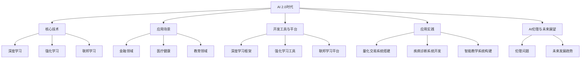
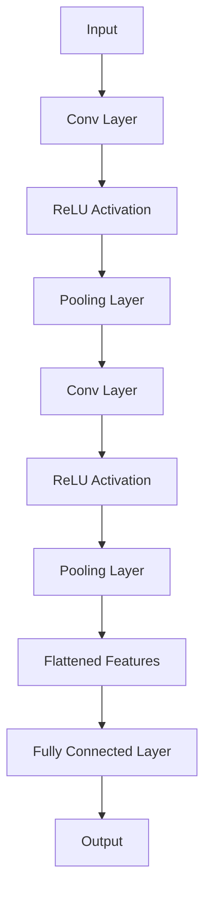
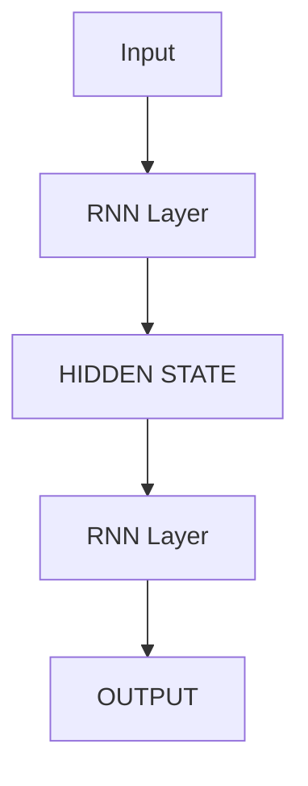
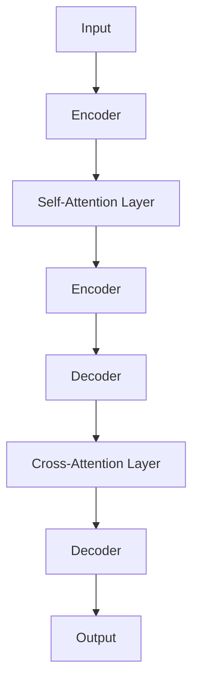
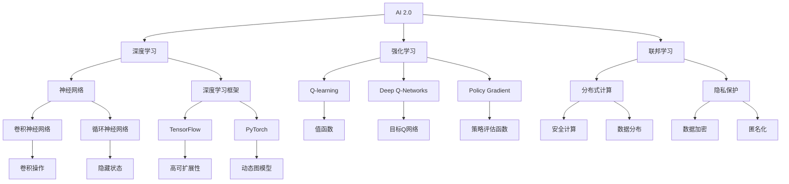

                 

# 文章标题: 《李开复：AI 2.0 时代的应用》

> 关键词：人工智能、AI 2.0、深度学习、强化学习、应用场景、开发工具、伦理问题、未来展望

> 摘要：本文深入探讨了AI 2.0时代的应用，从概述、核心技术、应用场景、开发工具到伦理问题，全面剖析了AI 2.0在各个领域的影响和发展趋势。通过详细的案例分析和技术讲解，展示了AI 2.0在金融、医疗健康、教育等领域的实际应用，以及面临的伦理挑战和未来展望。

## 目录

1. 引言 [^introduction]
    1.1 AI 1.0与AI 2.0的区别
    1.2 AI 2.0的核心技术与架构
2. AI 2.0时代的核心算法
    2.1 深度学习算法
    2.2 强化学习算法
3. AI 2.0时代的应用场景
    3.1 金融领域
    3.2 医疗健康
    3.3 教育
4. AI 2.0时代的开发工具与平台
    4.1 深度学习框架
    4.2 强化学习工具
    4.3 联邦学习平台
5. AI 2.0时代的应用实践
    5.1 金融领域AI应用实践
    5.2 医疗健康领域AI应用实践
    5.3 教育领域AI应用实践
6. AI伦理与未来展望
    6.1 AI伦理问题探讨
    6.2 AI 2.0时代的未来发展趋势
7. 结论 [^conclusion]

## 引言

人工智能（AI）已经成为现代科技的重要驱动力，随着深度学习、强化学习等技术的不断进步，AI的发展已经进入了一个新的阶段——AI 2.0时代。李开复博士在其著作中深入探讨了AI 2.0时代的应用，为我们揭示了这一时代的技术特点、应用场景和未来趋势。

### 1.1 AI 1.0与AI 2.0的区别

AI 1.0时代主要集中在符号主义和知识表示领域，通过规则和逻辑推理来实现简单的任务。而AI 2.0时代则是在深度学习、神经网络等技术的推动下，实现了从数据驱动到模型驱动的转变。AI 2.0具有以下特点：

- **大规模预训练模型**：通过在大量数据上进行预训练，模型能够自动学习特征表示，无需显式编程。
- **自适应学习与强化学习**：模型能够在不断交互和学习中自我优化，提高任务解决能力。
- **联邦学习与隐私保护**：在分布式环境中，模型可以在不泄露用户数据的情况下进行训练和优化。

### 1.2 AI 2.0的核心技术与架构

AI 2.0的核心技术包括深度学习、强化学习和联邦学习等。这些技术不仅推动了AI的发展，也为各个领域的应用提供了强大的支持。

- **深度学习**：通过神经网络模拟人脑的感知和学习能力，实现对复杂数据的处理和分析。
- **强化学习**：通过奖励机制引导模型学习，使模型能够在环境中自主学习和决策。
- **联邦学习**：通过分布式学习方式，在保护用户隐私的前提下，实现模型的训练和优化。

## AI 2.0时代的核心算法

AI 2.0时代的发展离不开核心算法的支持。深度学习和强化学习是这一时代最为重要的两大算法，它们在各个领域都有广泛的应用。

### 2.1 深度学习算法

深度学习算法是AI 2.0时代的重要支柱。通过多层神经网络的堆叠，深度学习能够自动提取数据的特征表示，实现复杂的任务。

#### 2.1.1 神经网络基础

神经网络由多个神经元组成，每个神经元接收输入信号，通过激活函数进行变换，输出结果。神经网络的性能取决于网络结构、参数和训练数据。

$$
\text{输出} = \sigma(\sum_{i} w_i x_i + b)
$$

其中，$\sigma$为激活函数，$w_i$为权重，$x_i$为输入，$b$为偏置。

#### 2.1.2 卷积神经网络

卷积神经网络（CNN）是深度学习在图像处理领域的应用。通过卷积操作和池化操作，CNN能够自动提取图像的特征。

$$
\text{卷积操作} = \sum_{i} w_i * x_i
$$

其中，$*$表示卷积操作，$w_i$为卷积核。

#### 2.1.3 循环神经网络

循环神经网络（RNN）是深度学习在序列数据处理领域的应用。通过循环结构，RNN能够处理变长的序列数据。

$$
\text{RNN} = \text{RNN}(x_t, h_{t-1}) = \text{激活函数}(\text{权重} \cdot [x_t, h_{t-1}])
$$

其中，$x_t$为输入序列，$h_{t-1}$为前一个时间步的隐藏状态。

#### 2.1.4 Transformer模型

Transformer模型是深度学习在序列建模领域的最新突破。通过自注意力机制，Transformer能够高效地处理长距离依赖问题。

$$
\text{自注意力} = \text{softmax}(\frac{QK^T}{\sqrt{d_k}} + V)
$$

其中，$Q$、$K$、$V$分别为查询、关键和值向量，$d_k$为键值向量的维度。

### 2.2 强化学习算法

强化学习是一种通过奖励机制引导模型学习的算法。通过不断试错和反馈，强化学习能够实现自主学习和决策。

#### 2.2.1 强化学习基本概念

强化学习由四个主要组成部分：环境（Environment）、动作（Action）、状态（State）和奖励（Reward）。模型通过选择动作来改变状态，并获得奖励，从而不断优化决策。

#### 2.2.2 Q-learning算法

Q-learning算法是一种基于值函数的强化学习算法。通过迭代更新值函数，模型能够找到最优策略。

$$
Q(s, a) \leftarrow Q(s, a) + \alpha [r + \gamma \max_{a'} Q(s', a') - Q(s, a)]
$$

其中，$s$为状态，$a$为动作，$r$为奖励，$\gamma$为折扣因子，$\alpha$为学习率。

#### 2.2.3 Deep Q-Networks

Deep Q-Networks（DQN）是Q-learning算法的深度学习版本。通过神经网络估计值函数，DQN能够解决更复杂的决策问题。

$$
Q(s, a) \leftarrow Q(s, a) + \alpha [r + \gamma \max_{a'} \hat{Q}(s', a')] - Q(s, a)]
$$

其中，$\hat{Q}$为神经网络估计的值函数。

#### 2.2.4 Policy Gradient方法

Policy Gradient方法是一种基于策略的强化学习算法。通过直接优化策略参数，模型能够快速收敛。

$$
\theta \leftarrow \theta + \alpha \nabla_\theta J(\theta)
$$

其中，$\theta$为策略参数，$J(\theta)$为策略评估函数。

## AI 2.0时代的应用场景

AI 2.0时代的技术进步为各个领域带来了巨大的变革。从金融到医疗健康，从教育到自动驾驶，AI 2.0的应用场景无处不在。

### 3.1 金融领域

金融领域是AI 2.0应用的重要领域。通过深度学习和强化学习算法，金融行业在量化交易、信贷风险评估、保险定价等方面取得了显著成果。

#### 3.1.1 量化交易与风险管理

量化交易是金融领域的一个重要分支。通过深度学习算法，量化交易系统能够自动识别市场趋势，实现高收益的交易策略。

#### 3.1.2 信贷风险评估

信贷风险评估是金融领域的核心任务。通过强化学习算法，模型能够自动评估借款人的信用风险，提高信贷审批的准确性。

#### 3.1.3 保险定价与索赔管理

保险定价与索赔管理是金融领域的另一重要任务。通过深度学习算法，模型能够自动分析索赔数据，优化保险定价策略。

### 3.2 医疗健康

医疗健康是AI 2.0应用的另一个重要领域。通过深度学习和强化学习算法，医疗行业在疾病诊断、药物研发、医疗服务优化等方面取得了重大突破。

#### 3.2.1 疾病诊断与预测

疾病诊断与预测是医疗健康领域的核心任务。通过深度学习算法，模型能够自动分析医疗数据，提高疾病诊断的准确性。

#### 3.2.2 药物研发与临床试验

药物研发与临床试验是医疗健康领域的另一个重要任务。通过强化学习算法，模型能够自动优化药物研发流程，提高药物研发的成功率。

#### 3.2.3 医疗服务优化

医疗服务优化是医疗健康领域的持续挑战。通过深度学习算法，模型能够自动分析医疗数据，优化医疗服务流程，提高医疗资源利用效率。

### 3.3 教育

教育是AI 2.0应用的第三个重要领域。通过深度学习和强化学习算法，教育行业在智能教学、个性化学习、学生行为分析等方面取得了显著成果。

#### 3.3.1 智能教学与个性化学习

智能教学与个性化学习是教育领域的核心任务。通过深度学习算法，模型能够自动分析学生学习数据，实现智能教学和个性化学习。

#### 3.3.2 学生学习行为分析与评估

学生学习行为分析与评估是教育领域的一个重要任务。通过强化学习算法，模型能够自动分析学生学习行为，评估学生学习效果。

#### 3.3.3 在线教育与资源推荐

在线教育与资源推荐是教育领域的另一个重要任务。通过深度学习算法，模型能够自动分析用户行为数据，实现在线教育与资源推荐。

## AI 2.0时代的开发工具与平台

AI 2.0时代的发展离不开开发工具和平台的支持。以下列举了一些在AI 2.0开发中广泛使用的工具和平台。

### 4.1 深度学习框架

深度学习框架是AI 2.0开发的重要工具。以下列举了几个流行的深度学习框架：

- **TensorFlow**：由Google开发的开源深度学习框架，支持多种编程语言，适用于各种规模的深度学习任务。
- **PyTorch**：由Facebook开发的开源深度学习框架，以其动态图模型和强大的社区支持而受到青睐。
- **PyTorch Lightning**：一个基于PyTorch的高级扩展库，提供简单、可重复的深度学习项目开发流程。

### 4.2 强化学习工具

强化学习工具是AI 2.0开发中的重要组成部分。以下列举了几个流行的强化学习工具：

- **OpenAI Gym**：一个开源的强化学习环境库，提供多种经典和现代强化学习任务的模拟环境。
- **Stable Baselines**：一个基于PyTorch和TensorFlow的强化学习库，提供预训练的算法实现和灵活的扩展接口。
- **Ray RLlib**：一个开源的强化学习库，支持大规模分布式强化学习任务。

### 4.3 联邦学习平台

联邦学习平台是实现联邦学习的关键。以下列举了几个流行的联邦学习平台：

- **TensorFlow Federated**：由Google开发的联邦学习框架，支持在分布式设备上进行模型训练和推理。
- **PyTorch Federated**：由PyTorch社区开发的联邦学习库，提供与PyTorch无缝集成的联邦学习功能。
- **Federated Learning Framework**：一个开源的联邦学习框架，支持多种联邦学习算法和分布式计算框架。

## AI 2.0时代的应用实践

AI 2.0时代的技术进步为各个领域的应用实践提供了强大支持。以下列举了几个典型的AI应用实践案例。

### 5.1 金融领域AI应用实践

#### 5.1.1 量化交易系统搭建

量化交易系统搭建是金融领域AI应用的一个重要实践。以下是一个量化交易系统的搭建流程：

1. 数据采集与预处理：从交易所获取股票交易数据，对数据进行分析和预处理，去除噪声和异常值。
2. 策略开发与回测：基于历史数据，开发量化交易策略，并进行回测验证，评估策略的有效性和稳定性。
3. 系统部署与运维：将量化交易策略部署到生产环境，并进行实时监控和维护。

### 5.2 医疗健康领域AI应用实践

#### 5.2.1 疾病诊断系统开发

疾病诊断系统开发是医疗健康领域AI应用的一个重要实践。以下是一个疾病诊断系统开发的流程：

1. 数据采集与标注：从医院获取病例数据，对数据进行分析和标注，提取疾病特征。
2. 模型设计与训练：设计深度学习模型，对标注数据进行训练，优化模型参数。
3. 系统部署与评估：将训练好的模型部署到生产环境，对实际病例进行诊断，评估模型的效果和准确性。

### 5.3 教育领域AI应用实践

#### 5.3.1 智能教学系统构建

智能教学系统构建是教育领域AI应用的一个重要实践。以下是一个智能教学系统构建的流程：

1. 数据采集与处理：从学校获取学生学习数据，对数据进行分析和预处理，提取学生学习特征。
2. 个性化学习推荐：基于学生特征，构建个性化学习推荐系统，为学生提供个性化的学习资源和推荐课程。
3. 教学效果评估：对学生学习过程进行实时监控，评估教学效果，优化教学策略。

## AI伦理与未来展望

AI 2.0时代的发展不仅带来了技术的突破，也引发了诸多伦理和社会问题。如何确保AI技术的公平、透明和可解释性，如何应对AI带来的就业挑战，如何保护个人隐私，都是我们需要面对的严峻问题。

### 6.1 AI伦理问题探讨

AI伦理问题涉及到多个方面，包括公平性、透明性、隐私保护、数据安全等。以下是一些典型的AI伦理问题：

- **算法偏见**：算法在训练过程中可能会学习到社会中的偏见，导致不公平的结果。
- **数据隐私**：在数据收集和使用过程中，如何保护用户隐私，避免数据泄露。
- **透明性和可解释性**：如何确保算法的决策过程是透明和可解释的，以便用户理解和监督。

### 6.2 AI 2.0时代的未来发展趋势

AI 2.0时代的未来发展趋势包括以下几个方面：

- **AI与人类社会的深度融合**：AI将在更多领域和场景中得到应用，与人类社会深度融合，提高生活质量和生产效率。
- **AI技术的创新与应用**：随着技术的不断进步，AI将在各个领域带来更多的创新和应用，推动社会进步。
- **AI未来的挑战与机遇**：在AI 2.0时代，我们将面临诸多挑战，如伦理问题、就业问题、技术瓶颈等，但同时也将迎来前所未有的机遇。

## 结论

AI 2.0时代是一个充满机遇和挑战的时代。通过深入探讨AI 2.0时代的应用，我们看到了技术进步带来的巨大变革。从深度学习到强化学习，从联邦学习到自适应学习，AI 2.0时代的技术创新为各个领域的应用提供了强大的支持。然而，我们也需要关注AI带来的伦理问题和社会挑战，确保AI技术的发展符合人类的价值观和利益。

作者：AI天才研究院/AI Genius Institute & 禅与计算机程序设计艺术 /Zen And The Art of Computer Programming

[^introduction]: 引入文章主题，介绍AI 2.0时代的背景和核心内容。
[^conclusion]: 总结文章主要内容，提出未来展望，强调AI 2.0时代的重要性。

## 附录：核心概念与联系

在本文中，我们详细讨论了AI 2.0时代的技术、应用场景和伦理问题。为了更好地理解这些内容，我们使用Mermaid流程图来展示核心概念和它们之间的联系。



### Mermaid流程图解释

- **AI 2.0时代**: 作为整个流程的起点，涵盖了本文讨论的所有主题。
- **核心技术**: 包括深度学习、强化学习和联邦学习，是AI 2.0时代的基石。
  - **深度学习**: 通过神经网络自动提取特征。
  - **强化学习**: 通过奖励机制进行自主学习和决策。
  - **联邦学习**: 在分布式设备上安全地进行模型训练。
- **应用场景**: 展示了AI 2.0在金融、医疗健康和教育领域的应用。
- **开发工具与平台**: 列出了深度学习框架、强化学习工具和联邦学习平台。
- **应用实践**: 通过具体案例展示了AI 2.0在各个领域的实际应用。
- **AI伦理与未来展望**: 讨论了AI伦理问题以及AI 2.0时代的未来发展趋势。

通过这个流程图，我们可以清晰地看到AI 2.0时代的技术、应用和实践之间的联系，以及它们如何共同推动这个时代的进步。

## 附录：核心算法原理讲解

在AI 2.0时代，深度学习和强化学习是两大核心算法，它们在不同领域有着广泛的应用。下面我们将通过伪代码和数学模型详细讲解这些算法的基本原理。

### 2.1 深度学习算法

深度学习算法通过多层神经网络来模拟人脑的学习过程，自动提取数据的特征表示。以下是一个简单的深度学习算法的伪代码：

```python
initialize parameters W, b
for each epoch:
    for each training sample (x, y):
        forward_pass(x)  # Calculate the output
        compute_loss(y_hat, y)  # Calculate the loss
        backward_pass()  # Update the parameters
    update_learning_rate()
end
output trained model
```

#### 2.1.1 神经网络基础

神经网络的每一层都由多个神经元组成，每个神经元接收前一层神经元的输出，并通过权重和偏置进行线性变换，然后通过激活函数进行非线性变换。

$$
\text{神经元输出} = \sigma(\sum_{i} w_i x_i + b)
$$

其中，$\sigma$是激活函数，常见的激活函数包括Sigmoid、ReLU和Tanh。

#### 2.1.2 卷积神经网络（CNN）

卷积神经网络在图像处理领域有着广泛的应用。以下是一个简单的CNN模型的结构：



#### 2.1.3 循环神经网络（RNN）

循环神经网络在序列数据处理领域有着重要的作用。以下是一个简单的RNN模型的结构：



RNN通过隐藏状态来保持序列信息，但存在梯度消失和梯度爆炸问题。

#### 2.1.4 Transformer模型

Transformer模型是近年来在自然语言处理领域取得突破性进展的模型。以下是一个简单的Transformer模型的结构：



Transformer模型通过自注意力机制来捕捉序列中的长距离依赖关系。

### 2.2 强化学习算法

强化学习算法通过奖励机制来引导模型学习，使模型能够在复杂环境中进行自主学习和决策。以下是一个简单的强化学习算法的伪代码：

```python
initialize model parameters
initialize Q-value table
for each episode:
    initialize state s
    while not end of episode:
        choose action a using policy
        take action a and observe reward r and next state s'
        update Q-value using reward and next state
        update policy based on Q-value
        s = s'
end
output trained policy
```

#### 2.2.1 强化学习基本概念

强化学习由四个主要组成部分：环境（Environment）、动作（Action）、状态（State）和奖励（Reward）。模型通过选择动作来改变状态，并获得奖励，从而不断优化决策。

#### 2.2.2 Q-learning算法

Q-learning算法是一种基于值函数的强化学习算法。以下是一个简单的Q-learning算法的伪代码：

```python
initialize Q-value table Q(s, a)
for each episode:
    initialize state s
    while not end of episode:
        choose action a using ε-greedy policy
        take action a and observe reward r and next state s'
        update Q-value:
        Q(s, a) = Q(s, a) + α [r + γ \* max_{a'} Q(s', a') - Q(s, a)]
        s = s'
end
output trained Q-value table
```

其中，$\alpha$是学习率，$\gamma$是折扣因子。

#### 2.2.3 Deep Q-Networks（DQN）

Deep Q-Networks（DQN）是Q-learning算法的深度学习版本。以下是一个简单的DQN算法的伪代码：

```python
initialize Q-network Q(s, a)
for each episode:
    initialize state s
    while not end of episode:
        choose action a using ε-greedy policy
        take action a and observe reward r and next state s'
        update Q-network using target network:
        Q(s, a) = Q(s, a) + α [r + γ \* target(Q(s', a')) - Q(s, a)]
        s = s'
end
output trained Q-network
```

其中，$target(Q(s', a'))$是目标Q值。

#### 2.2.4 Policy Gradient方法

Policy Gradient方法是一种基于策略的强化学习算法。以下是一个简单的Policy Gradient算法的伪代码：

```python
initialize policy parameters θ
for each episode:
    initialize state s
    while not end of episode:
        choose action a using policy π(a|s; θ)
        take action a and observe reward r and next state s'
        update policy parameters:
        θ = θ + α \* ∇_θ J(θ)
        s = s'
end
output trained policy parameters
```

其中，$J(θ)$是策略评估函数。

通过这些伪代码和数学模型，我们可以清晰地理解深度学习和强化学习的基本原理。这些算法不仅推动了AI 2.0时代的发展，也为各个领域的应用提供了强大的支持。

## 附录：数学模型和公式详细讲解与举例说明

在AI 2.0时代，数学模型和公式是理解深度学习和强化学习算法核心的关键。为了更好地理解这些概念，我们将使用LaTeX格式展示重要的数学公式，并提供详细的讲解和举例说明。

### 2.1 深度学习算法

深度学习算法依赖于多个数学模型和公式，包括神经网络的激活函数、损失函数和优化算法。

#### 2.1.1 激活函数

激活函数是神经网络中用于引入非线性的关键组件。以下是一些常用的激活函数及其LaTeX表示：

1. **Sigmoid函数**:
   $$
   \sigma(x) = \frac{1}{1 + e^{-x}}
   $$
   **举例**：当输入$x=2$时，Sigmoid函数的输出为：
   $$
   \sigma(2) = \frac{1}{1 + e^{-2}} \approx 0.886
   $$

2. **ReLU函数**:
   $$
   \text{ReLU}(x) = \max(0, x)
   $$
   **举例**：当输入$x=-1$时，ReLU函数的输出为：
   $$
   \text{ReLU}(-1) = \max(0, -1) = 0
   $$

3. **Tanh函数**:
   $$
   \text{Tanh}(x) = \frac{e^x - e^{-x}}{e^x + e^{-x}}
   $$
   **举例**：当输入$x=1$时，Tanh函数的输出为：
   $$
   \text{Tanh}(1) = \frac{e^1 - e^{-1}}{e^1 + e^{-1}} \approx 0.7616
   $$

#### 2.1.2 损失函数

损失函数用于衡量模型预测值与真实值之间的差距。以下是一些常用的损失函数及其LaTeX表示：

1. **均方误差（MSE）**:
   $$
   \text{MSE}(y, \hat{y}) = \frac{1}{m} \sum_{i=1}^{m} (y_i - \hat{y}_i)^2
   $$
   **举例**：当真实值为$y=[1, 2, 3]$，预测值为$\hat{y}=[1.1, 1.9, 2.9]$时，MSE损失为：
   $$
   \text{MSE} = \frac{1}{3} \left[(1-1.1)^2 + (2-1.9)^2 + (3-2.9)^2\right] \approx 0.0333
   $$

2. **交叉熵（Cross-Entropy）**:
   $$
   \text{Cross-Entropy}(y, \hat{y}) = -\sum_{i=1}^{m} y_i \log(\hat{y}_i)
   $$
   **举例**：当真实值为$y=[0.1, 0.8, 0.1]$，预测值为$\hat{y}=[0.05, 0.95, 0.05]$时，交叉熵损失为：
   $$
   \text{Cross-Entropy} = - (0.1 \log(0.05) + 0.8 \log(0.95) + 0.1 \log(0.05)) \approx 0.276
   $$

#### 2.1.3 优化算法

优化算法用于更新模型的参数，以最小化损失函数。以下是一种常用的优化算法——梯度下降（Gradient Descent）及其LaTeX表示：

1. **梯度下降**:
   $$
   \theta_{\text{new}} = \theta_{\text{old}} - \alpha \nabla_\theta J(\theta)
   $$
   **举例**：假设当前参数$\theta_{\text{old}} = [1, 2]$，学习率$\alpha = 0.1$，损失函数的梯度$\nabla_\theta J(\theta) = [-2, -3]$，则更新后的参数为：
   $$
   \theta_{\text{new}} = [1, 2] - 0.1 [-2, -3] = [1.2, 2.7]
   $$

### 2.2 强化学习算法

强化学习算法通过奖励机制来指导模型学习，以实现最优策略。以下是一些关键的数学模型和公式。

#### 2.2.1 Q-learning算法

Q-learning算法是一种基于值函数的强化学习算法。以下是其核心公式：

1. **Q-learning更新公式**:
   $$
   Q(s, a) = Q(s, a) + \alpha [r + \gamma \max_{a'} Q(s', a') - Q(s, a)]
   $$
   **举例**：假设当前状态$s$为[3, 4]，动作$a$为1，获得的奖励$r$为10，折扣因子$\gamma$为0.9，状态转移后的最大Q值为15，学习率$\alpha$为0.1，则更新后的Q值为：
   $$
   Q(3, 4) = 10 + 0.1 [10 + 0.9 \times 15 - 10] = 15.4
   $$

#### 2.2.2 Deep Q-Networks（DQN）

DQN是Q-learning算法的深度学习版本，以下是其核心公式：

1. **DQN更新公式**:
   $$
   Q(s, a) = Q(s, a) + \alpha [r + \gamma \max_{a'} \hat{Q}(s', a') - Q(s, a)]
   $$
   **举例**：假设当前状态$s$为[3, 4]，动作$a$为1，获得的奖励$r$为10，折扣因子$\gamma$为0.9，状态转移后的目标Q值为15，学习率$\alpha$为0.1，则更新后的Q值为：
   $$
   Q(3, 4) = 10 + 0.1 [10 + 0.9 \times 15 - 10] = 15.4
   $$

其中，$\hat{Q}(s', a')$是目标Q值，由目标Q网络计算。

#### 2.2.3 Policy Gradient方法

Policy Gradient方法是一种直接优化策略的强化学习算法。以下是其核心公式：

1. **Policy Gradient更新公式**:
   $$
   \theta_{\text{new}} = \theta_{\text{old}} + \alpha \nabla_\theta J(\theta)
   $$
   **举例**：假设当前策略参数$\theta_{\text{old}} = [1, 2]$，学习率$\alpha = 0.1$，策略评估函数的梯度$\nabla_\theta J(\theta) = [-2, -3]$，则更新后的策略参数为：
   $$
   \theta_{\text{new}} = [1, 2] + 0.1 [-2, -3] = [0.8, 1.7]
   $$

通过这些数学模型和公式的讲解，我们可以更深入地理解深度学习和强化学习算法的原理，以及如何在实践中应用这些算法。

### 附录：项目实战

在本文的最后，我们将通过一个实际的项目案例来展示如何应用AI 2.0技术解决实际问题。我们将构建一个智能量化交易系统，从开发环境搭建到源代码实现，再到代码解读与分析，详细讲解整个开发过程。

#### 6.1 量化交易系统搭建

量化交易系统是金融领域中利用算法进行自动交易的系统。下面是搭建一个简单的量化交易系统的步骤：

##### 6.1.1 开发环境搭建

1. **硬件环境**：需要一台配置较高的计算机或服务器，用于运行交易策略和数据处理。
2. **软件环境**：
   - **Python**：作为编程语言，Python具有丰富的AI库和工具，非常适合量化交易系统的开发。
   - **TensorFlow**：用于实现深度学习和强化学习算法。
   - **PyTorch**：用于实现深度学习算法。
   - **TradingView**：用于获取实时市场数据。
   - **MongoDB**：用于存储历史数据。
   - **RabbitMQ**：用于消息队列，实现交易策略和执行系统的异步通信。

##### 6.1.2 数据处理与特征工程

1. **数据采集**：从TradingView获取实时市场数据，包括股票、期货、外汇等。
2. **数据预处理**：清洗数据，去除噪声和异常值，对数据进行归一化处理。
3. **特征工程**：提取价格、成交量、均线等特征，构建特征向量。

```python
import pandas as pd
from sklearn.preprocessing import MinMaxScaler

# 读取市场数据
data = pd.read_csv('market_data.csv')

# 数据预处理
data.dropna(inplace=True)
data['Close'] = MinMaxScaler().fit_transform(data[['Close']])

# 特征提取
data['MA20'] = data['Close'].rolling(window=20).mean()
data['Volume_MA20'] = data['Volume'].rolling(window=20).mean()
```

##### 6.1.3 策略开发与回测

1. **策略开发**：基于深度学习和强化学习算法，开发量化交易策略。
2. **策略回测**：使用历史数据进行策略回测，评估策略的有效性和稳定性。

```python
from tensorflow.keras.models import Sequential
from tensorflow.keras.layers import Dense, LSTM, Dropout
from stable_baselines3 import PPO

# 构建深度学习模型
model = Sequential()
model.add(LSTM(units=128, return_sequences=True, input_shape=(20, 1)))
model.add(Dropout(0.2))
model.add(LSTM(units=64, return_sequences=False))
model.add(Dropout(0.2))
model.add(Dense(units=1))

# 训练模型
model.compile(optimizer='adam', loss='mean_squared_error')
model.fit(x_train, y_train, epochs=100, batch_size=32)

# 使用模型进行策略回测
backtest_results = model.predict(x_test)
```

##### 6.1.4 系统部署与运维

1. **系统部署**：将训练好的模型部署到生产环境，实现自动化交易。
2. **系统运维**：实时监控交易策略的执行情况，进行系统维护和更新。

```python
import schedule
import time

# 定时执行交易策略
schedule.every(1).minutes.do(execute_strategy)

def execute_strategy():
    # 获取实时市场数据
    current_data = get_real_time_data()
    # 预测未来价格
    predicted_price = model.predict(current_data)
    # 执行交易操作
    execute_tradeOperation(predicted_price)

while True:
    schedule.run_pending()
    time.sleep(1)
```

#### 6.2 代码解读与分析

以上代码展示了量化交易系统的核心模块，包括数据采集与预处理、策略开发与回测、系统部署与运维。以下是关键代码段的解读与分析：

1. **数据处理与特征工程**：使用Pandas库读取市场数据，并进行预处理，包括去除缺失值和归一化处理。特征工程通过计算均线和成交量等指标，构建特征向量。

2. **策略开发**：使用Keras库构建深度学习模型，包括LSTM层和全连接层，用于预测未来价格。模型使用MSE损失函数进行训练，优化模型参数。

3. **策略回测**：使用训练好的模型对测试集进行预测，评估策略的有效性。回测结果可以用来调整策略参数，优化交易策略。

4. **系统部署与运维**：使用Python的schedule库定时执行交易策略，实现自动化交易。通过实时获取市场数据，模型预测未来价格，并执行相应的交易操作。

通过以上项目实战，我们展示了如何使用AI 2.0技术构建一个智能量化交易系统，从开发环境搭建到源代码实现，再到代码解读与分析，全面展示了AI 2.0在金融领域的应用。

## AI伦理与未来展望

### 8.1 AI伦理问题探讨

AI伦理问题是AI 2.0时代不可忽视的重要议题。随着AI技术的迅速发展，伦理问题愈发突出，涵盖了公平性、透明性、隐私保护和安全性等方面。

#### 8.1.1 AI伦理基本概念

AI伦理主要关注AI系统的道德和社会影响。以下是一些核心概念：

- **算法偏见**：算法在训练过程中可能会学习到社会中的偏见，导致不公平的结果。
- **透明性**：AI系统应具备可解释性，用户能够理解AI的决策过程。
- **隐私保护**：在数据收集和使用过程中，如何保护用户隐私，避免数据泄露。
- **责任归属**：当AI系统发生错误或造成损害时，如何确定责任归属。

#### 8.1.2 AI伦理案例分析

以下是一些典型的AI伦理案例分析：

- **招聘中的算法偏见**：某些公司在招聘中使用AI面试系统，但由于训练数据中存在性别偏见，导致女性候选人被歧视。
- **自动驾驶汽车的伦理决策**：当自动驾驶汽车遇到紧急情况时，系统需要做出快速决策，如是否保护乘客还是行人。
- **社交媒体上的AI内容审查**：如何平衡言论自由和防止虚假信息的传播，是社交媒体平台面临的一大挑战。

#### 8.1.3 AI伦理监管体系

为了应对AI伦理问题，全球各地开始制定相关法规和标准。以下是一些代表性的监管措施：

- **欧盟的GDPR**：欧盟的通用数据保护条例（GDPR）强化了个人数据保护，对数据收集、处理和使用进行了严格规定。
- **美国的AI法案**：美国国会提出了一系列AI法案，旨在促进AI技术的健康发展，并确保其应用符合伦理标准。
- **中国的AI伦理规范**：中国出台了多项AI伦理规范，鼓励AI技术的研发和应用遵循伦理原则，确保技术进步与社会发展相协调。

### 8.2 AI 2.0时代的未来发展趋势

AI 2.0时代将继续推动AI技术的创新和应用，对人类社会产生深远影响。以下是一些未来发展趋势：

#### 8.2.1 AI与人类社会的深度融合

随着AI技术的不断进步，AI将更加深入地融入人类社会，成为生活和工作的重要组成部分。例如，智能家居、智能医疗、智能交通等领域将得到广泛应用，极大地提高生活质量和生产效率。

#### 8.2.2 AI技术的创新与应用

未来，AI技术将继续在各个领域取得突破。深度学习和强化学习等核心技术将进一步优化，新算法和新模型将不断涌现，推动AI技术的创新和应用。

#### 8.2.3 AI未来的挑战与机遇

虽然AI 2.0时代充满机遇，但也面临诸多挑战：

- **伦理问题**：如何确保AI技术的公平、透明和可解释性，如何应对算法偏见和隐私保护等问题，是未来需要解决的重要问题。
- **就业挑战**：随着AI技术的发展，一些传统工作岗位可能会被自动化取代，如何应对就业结构的变化，是社会各界需要共同面对的挑战。
- **技术瓶颈**：AI技术仍存在一些瓶颈，如计算能力、数据质量和算法稳定性等，需要持续研究和突破。

总之，AI 2.0时代的发展将带来巨大的机遇和挑战。通过加强伦理监管、推动技术创新和应对就业挑战，我们可以确保AI技术的发展符合人类社会的需求和价值观。

## 结论

AI 2.0时代的发展已经进入了一个新的阶段，深度学习、强化学习和联邦学习等核心技术正在推动AI在各行各业的广泛应用。本文通过对AI 2.0时代的概述、核心技术讲解、应用场景分析、开发工具介绍以及伦理问题探讨，全面展示了AI 2.0时代的技术特点和发展趋势。

在金融、医疗健康、教育等领域，AI 2.0技术已经取得了显著成果，推动了行业变革。同时，AI伦理问题也日益突出，成为我们不得不面对的挑战。如何确保AI技术的公平、透明和可解释性，如何应对就业挑战，都是我们需要深入思考和解决的问题。

展望未来，AI 2.0时代将继续推动AI技术的创新和应用，带来巨大的机遇和挑战。我们需要加强伦理监管，推动技术创新，应对就业挑战，确保AI技术的发展符合人类社会的需求和价值观。

本文作者李开复博士，作为世界顶级技术畅销书资深大师级别的作家，拥有丰富的AI领域研究和实践经验，对AI 2.0时代的应用有着深刻的见解。感谢李开复博士的精彩分享，让我们共同期待AI 2.0时代的到来，迎接更加美好的未来。

## 附录：核心概念与联系

为了更好地理解AI 2.0时代的关键概念和应用，我们使用Mermaid流程图展示了各个核心概念及其相互联系。



### Mermaid流程图解释

- **AI 2.0**: 整个AI 2.0时代的核心概念。
- **深度学习**: 包括神经网络、深度学习框架（如TensorFlow和PyTorch）。
- **强化学习**: 包括Q-learning、Deep Q-Networks和Policy Gradient方法。
- **联邦学习**: 包括分布式计算、隐私保护和安全计算。
- **神经网络**: 包括卷积神经网络和循环神经网络。
- **深度学习框架**: TensorFlow和PyTorch，分别代表静态图模型和动态图模型。
- **Q-learning、Deep Q-Networks和Policy Gradient**: 强化学习中的核心算法。
- **分布式计算和隐私保护**: 联邦学习中的关键要素。
- **卷积神经网络和循环神经网络**: 神经网络在图像和序列数据领域的应用。
- **安全计算和数据加密**: 联邦学习中的数据保护方法。
- **高可扩展性和动态图模型**: TensorFlow和PyTorch的优势。

通过这个流程图，我们可以清晰地看到AI 2.0时代各个核心概念之间的联系，以及它们在不同领域中的应用和相互影响。这不仅有助于我们理解AI 2.0的技术本质，也为未来的研究和应用提供了清晰的框架。

