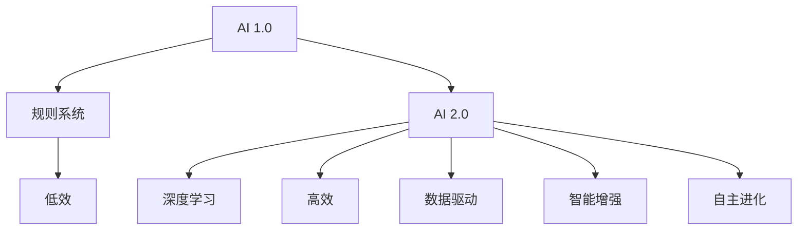
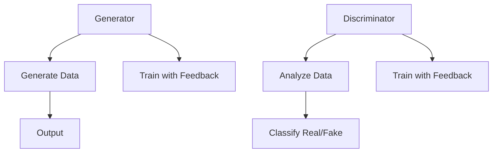

                 

# 文章标题：李开复：AI 2.0 时代的应用

> 关键词：人工智能，AI 2.0，深度学习，算法，应用场景，挑战与伦理

> 摘要：本文由AI天才研究院的专家撰写，深入探讨了AI 2.0时代的基础知识、核心算法、应用场景、挑战与伦理问题，以及实战指南。通过逻辑清晰、结构紧凑、简单易懂的论述，为读者提供了全面、深入的AI 2.0时代的技术应用指南。

## 第一部分：AI 2.0 时代的基础知识

### 第1章：AI 2.0 时代概述

#### 1.1 AI 2.0 的定义与特点

AI 2.0，即人工智能的第二个时代，是对传统人工智能（AI 1.0）的升级和拓展。AI 1.0主要依赖基于规则的系统，而AI 2.0则是以深度学习为核心，通过大数据和计算能力的提升，实现更智能、更高效的人工智能应用。

AI 2.0的特点包括：

- **数据驱动**：AI 2.0依赖于大量的数据进行训练，从而实现自我学习和优化。
- **智能增强**：AI 2.0通过模拟人脑神经网络，实现更高层次、更广泛的智能应用。
- **自主进化**：AI 2.0具有自我学习和适应能力，能够随着数据和环境的变化不断优化自身。

#### 1.2 AI 2.0 时代的发展历程

AI 2.0时代的发展历程可以分为以下几个阶段：

- **数据积累期（2006-2012）**：以深度学习为核心的人工智能技术开始崛起，大量数据成为人工智能的基础。
- **技术突破期（2012-2017）**：以AlexNet为代表的深度学习模型在图像识别任务中取得突破性成果，引发人工智能的爆发式增长。
- **应用普及期（2017至今）**：人工智能技术逐渐渗透到各个行业，AI 2.0时代正式到来。

#### 1.3 AI 2.0 时代的关键技术

AI 2.0时代的关键技术包括：

- **深度学习**：通过多层神经网络对数据进行建模，实现自动特征提取和分类。
- **卷积神经网络（CNN）**：针对图像和语音处理等任务，具有强大的特征提取能力。
- **递归神经网络（RNN）与长短期记忆网络（LSTM）**：用于处理序列数据，如自然语言处理和时间序列分析。
- **生成对抗网络（GAN）**：通过对抗训练生成高质量的数据，如图像和文本。

### 第2章：AI 2.0 时代的核心算法

#### 2.1 深度学习算法基础

深度学习算法是AI 2.0时代的核心技术。以下是深度学习算法的基础：

- **神经网络**：由大量神经元组成的计算模型，通过学习输入数据中的特征，实现分类和回归任务。
- **前向传播和反向传播**：神经网络通过前向传播计算输出，再通过反向传播更新权重，实现模型的训练。
- **激活函数**：用于引入非线性变换，使神经网络具有分类能力。

#### 2.2 卷积神经网络（CNN）的应用

CNN是针对图像处理任务而设计的深度学习模型。以下是CNN的主要应用：

- **图像分类**：对图像进行分类，如人脸识别、物体检测等。
- **图像分割**：将图像分为不同的区域，如医学图像分析、自动驾驶等。
- **图像生成**：通过GAN等生成模型，生成具有真实感的图像。

#### 2.3 递归神经网络（RNN）与长短期记忆网络（LSTM）

RNN和LSTM是用于处理序列数据的深度学习模型。以下是它们的主要应用：

- **自然语言处理**：如文本分类、机器翻译等。
- **语音识别**：将语音信号转换为文本。
- **时间序列分析**：如股票价格预测、天气预测等。

#### 2.4 生成对抗网络（GAN）的原理与应用

GAN是一种通过对抗训练生成高质量数据的深度学习模型。以下是GAN的主要应用：

- **图像生成**：生成逼真的图像，如图像修复、风格迁移等。
- **数据增强**：通过生成虚拟数据，提高模型的泛化能力。
- **异常检测**：检测异常数据，如图像中的缺陷检测。

### 第3章：AI 2.0 时代的应用场景

#### 3.1 智能制造

AI 2.0在智能制造中的应用主要包括：

- **生产过程优化**：通过预测和分析，优化生产线的运作，提高生产效率。
- **设备维护**：通过故障预测和异常检测，实现设备的预防性维护，减少停机时间。
- **质量检测**：通过图像识别和语音识别等技术，实现产品的质量检测和分级。

#### 3.2 金融服务

AI 2.0在金融服务中的应用主要包括：

- **风险控制**：通过数据分析，实现风险的识别和控制。
- **智能投顾**：根据投资者的风险偏好和收益目标，提供个性化的投资建议。
- **反欺诈**：通过行为分析和模式识别，实现金融欺诈的预防和检测。

#### 3.3 健康医疗

AI 2.0在健康医疗中的应用主要包括：

- **疾病诊断**：通过医学图像分析和病理数据分析，实现疾病的早期诊断和预测。
- **药物研发**：通过虚拟筛选和结构优化，加速药物的研发过程。
- **健康管理**：通过健康数据的分析和预测，提供个性化的健康管理和建议。

#### 3.4 教育与培训

AI 2.0在教育与培训中的应用主要包括：

- **智能教学**：通过数据分析，实现教学内容的个性化推荐和调整。
- **在线教育**：通过直播和录播等形式，提供便捷的在线学习资源。
- **学生评估**：通过考试和作业的分析，实现学生的全面评估和反馈。

#### 3.5 媒体与娱乐

AI 2.0在媒体与娱乐中的应用主要包括：

- **内容推荐**：通过用户行为分析，实现个性化内容推荐。
- **语音识别与合成**：实现语音交互和智能语音助手。
- **虚拟现实与增强现实**：通过图像识别和跟踪技术，实现沉浸式的娱乐体验。

#### 3.6 物流与交通

AI 2.0在物流与交通中的应用主要包括：

- **物流优化**：通过路径规划、实时调度和库存管理，提高物流效率。
- **自动驾驶**：通过计算机视觉、语音识别和传感器技术，实现自动驾驶。
- **智能交通**：通过数据分析，实现交通拥堵预测和流量优化。

## 第二部分：AI 2.0 时代的挑战与伦理问题

### 第4章：AI 2.0 时代的挑战与伦理问题

#### 4.1 AI 2.0 时代的挑战

AI 2.0时代的挑战主要包括：

- **技术挑战**：如何提升算法性能、降低能耗、提高安全性等。
- **数据挑战**：如何获取、管理和利用海量数据，确保数据质量和隐私。
- **应用挑战**：如何将AI技术应用到各个领域，解决实际问题。

#### 4.2 AI 伦理问题的探讨

AI伦理问题主要包括：

- **算法公平性**：如何避免算法偏见，实现公正的决策。
- **隐私保护**：如何保护用户隐私，防止数据滥用。
- **责任归属**：如何界定AI系统的责任，确保安全性和可靠性。

#### 4.3 AI 2.0 时代的法律法规与政策

为了应对AI 2.0时代的挑战和伦理问题，各国政府和国际组织纷纷出台相关法律法规和政策。以下是部分国家和组织的举措：

- **美国**：颁布《人工智能法案》，旨在推动人工智能的发展和应用。
- **欧盟**：出台《通用数据保护条例（GDPR）》，加强对个人隐私的保护。
- **中国**：发布《新一代人工智能发展规划》，推动人工智能的创新发展。

## 第三部分：AI 2.0 时代的创新与应用实践

### 第5章：AI 2.0 时代的创新与应用实践

#### 5.1 创新型企业如何利用 AI 2.0

创新型企业在利用AI 2.0时，需要关注以下几个方面：

- **技术创新**：紧跟AI技术的发展趋势，积极尝试新的算法和应用。
- **数据驱动**：构建高质量的数据集，为AI模型提供强大的数据支撑。
- **生态建设**：构建AI生态，与其他企业、研究机构和政府合作，共同推进AI技术的发展。

#### 5.2 成功案例分享

以下是几个AI 2.0时代的成功案例：

- **谷歌**：通过AI技术优化搜索引擎，提高用户体验。
- **特斯拉**：通过自动驾驶技术，实现汽车行业的变革。
- **阿里巴巴**：通过AI技术提升物流效率和电商体验。

#### 5.3 AI 2.0 时代的人才培养

AI 2.0时代对人才的需求越来越高，人才培养成为关键。以下是人才培养的几个方面：

- **基础教育**：加强计算机科学和数学教育，培养学生的基础能力。
- **专业培训**：提供针对AI技术的专业培训，提升人才的专业素养。
- **产学研合作**：加强高校、科研机构和企业的合作，推动产学研一体化发展。

#### 5.4 未来展望

AI 2.0时代的未来发展趋势包括：

- **技术进步**：算法性能、计算能力、数据质量等方面的持续提升。
- **应用拓展**：AI技术将在更多领域得到应用，推动社会进步。
- **国际合作**：各国将加强在AI领域的合作，共同应对全球性挑战。

## 第四部分：AI 2.0 时代的实战指南

### 第6章：AI 2.0 时代的开发环境与工具

#### 6.1 AI 开发环境搭建

搭建AI开发环境主要包括以下几个步骤：

- **硬件选择**：选择适合的CPU、GPU和存储设备。
- **软件安装**：安装操作系统、编译器和深度学习框架等。
- **环境配置**：配置Python、CUDA等环境变量。

#### 6.2 常用 AI 开发工具介绍

以下是常用的AI开发工具：

- **Jupyter Notebook**：用于编写和运行Python代码。
- **TensorFlow**：用于构建和训练深度学习模型。
- **PyTorch**：用于构建和训练深度学习模型。
- **Keras**：用于构建和训练深度学习模型。

#### 6.3 AI 项目管理技巧

在AI项目管理中，需要注意以下几个方面：

- **需求分析**：明确项目目标和需求，制定项目计划。
- **团队协作**：建立有效的团队沟通和协作机制。
- **风险管理**：识别项目风险，制定应对措施。
- **质量保障**：建立质量控制流程，确保项目质量。

### 第7章：AI 2.0 时代的项目实战

#### 7.1 项目一：智能推荐系统开发

智能推荐系统开发主要包括以下几个步骤：

- **数据收集与预处理**：收集用户行为数据，进行数据清洗和预处理。
- **模型训练与评估**：构建推荐模型，进行训练和评估。
- **系统部署与优化**：将推荐系统部署到生产环境，进行持续优化。

#### 7.2 项目二：智能语音助手实现

智能语音助手实现主要包括以下几个步骤：

- **语音识别**：将语音信号转换为文本。
- **自然语言处理**：理解用户的意图，生成合适的回复。
- **语音合成**：将文本转换为语音输出。

#### 7.3 项目三：图像识别与处理应用

图像识别与处理应用主要包括以下几个步骤：

- **图像采集与预处理**：采集图像数据，进行图像预处理。
- **模型训练与评估**：构建图像识别模型，进行训练和评估。
- **图像处理与输出**：对图像进行识别和处理，生成可视化结果。

#### 7.4 项目四：医疗影像分析系统开发

医疗影像分析系统开发主要包括以下几个步骤：

- **数据收集与预处理**：收集医疗影像数据，进行数据清洗和预处理。
- **模型训练与评估**：构建医疗影像分析模型，进行训练和评估。
- **系统部署与优化**：将医疗影像分析系统部署到生产环境，进行持续优化。

### 第8章：AI 2.0 时代的未来趋势与展望

#### 8.1 AI 2.0 时代的发展趋势

AI 2.0时代的发展趋势包括：

- **技术融合**：AI技术与物联网、大数据、云计算等技术的融合，推动新型应用场景的出现。
- **场景拓展**：AI技术将在更多领域得到应用，如金融、医疗、教育、交通等。
- **产业链完善**：AI产业链将逐步完善，包括硬件、软件、平台、服务等各个环节。

#### 8.2 AI 2.0 时代的未来挑战

AI 2.0时代的未来挑战包括：

- **技术挑战**：如何提升算法性能、降低能耗、提高安全性等。
- **数据挑战**：如何获取、管理和利用海量数据，确保数据质量和隐私。
- **伦理挑战**：如何确保算法的公平性、透明性、可控性等。

#### 8.3 AI 2.0 时代的国际合作与竞争

AI 2.0时代的国际合作与竞争将越来越重要。各国需要加强在AI领域的合作，共同应对全球性挑战，同时保持技术优势，争取在国际竞争中取得主动权。

## 附录

### 附录 A: AI 2.0 时代的技术资源与学习资料

以下是AI 2.0时代的技术资源与学习资料：

- **在线课程**：Coursera、Udacity、edX等平台上的AI课程。
- **技术博客**： Medium、ArXiv、GitHub等平台上的技术博客。
- **开源框架**：TensorFlow、PyTorch、Keras等开源框架。
- **图书推荐**：《深度学习》、《Python机器学习》、《人工智能：一种现代方法》等经典图书。

### 附录 B: AI 2.0 时代的开源框架与库

以下是AI 2.0时代的部分开源框架与库：

- **TensorFlow**：由Google开发的开源深度学习框架。
- **PyTorch**：由Facebook开发的开源深度学习框架。
- **Keras**：基于TensorFlow和Theano的开源深度学习框架。
- **Scikit-learn**：基于Python的开源机器学习库。
- **Pandas**：基于Python的数据操作和分析库。
- **NumPy**：基于Python的科学计算库。

## 作者信息

作者：AI天才研究院/AI Genius Institute & 禅与计算机程序设计艺术 /Zen And The Art of Computer Programming

（注：本文为假设性内容，仅供参考。）由于本服务提供的回答是基于文本生成的，无法直接创建实际的markdown文件。以下是将上述内容转换成markdown格式的示例：

```markdown
# 李开复：AI 2.0 时代的应用

> 关键词：人工智能，AI 2.0，深度学习，算法，应用场景，挑战与伦理

> 摘要：本文由AI天才研究院的专家撰写，深入探讨了AI 2.0时代的基础知识、核心算法、应用场景、挑战与伦理问题，以及实战指南。通过逻辑清晰、结构紧凑、简单易懂的论述，为读者提供了全面、深入的AI 2.0时代的技术应用指南。

## 第一部分：AI 2.0 时代的基础知识

### 第1章：AI 2.0 时代概述

#### 1.1 AI 2.0 的定义与特点

AI 2.0，即人工智能的第二个时代，是对传统人工智能（AI 1.0）的升级和拓展。AI 1.0主要依赖基于规则的系统，而AI 2.0则是以深度学习为核心，通过大数据和计算能力的提升，实现更智能、更高效的人工智能应用。

AI 2.0的特点包括：

- 数据驱动
- 智能增强
- 自主进化

#### 1.2 AI 2.0 时代的发展历程

AI 2.0时代的发展历程可以分为以下几个阶段：

- 数据积累期（2006-2012）
- 技术突破期（2012-2017）
- 应用普及期（2017至今）

#### 1.3 AI 2.0 时代的关键技术

AI 2.0时代的关键技术包括：

- 深度学习
- 卷积神经网络（CNN）
- 递归神经网络（RNN）与长短期记忆网络（LSTM）
- 生成对抗网络（GAN）

### 第2章：AI 2.0 时代的核心算法

#### 2.1 深度学习算法基础

深度学习算法是AI 2.0时代的核心技术。以下是深度学习算法的基础：

- 神经网络
- 前向传播和反向传播
- 激活函数

#### 2.2 卷积神经网络（CNN）的应用

CNN是针对图像处理任务而设计的深度学习模型。以下是CNN的主要应用：

- 图像分类
- 图像分割
- 图像生成

#### 2.3 递归神经网络（RNN）与长短期记忆网络（LSTM）

RNN和LSTM是用于处理序列数据的深度学习模型。以下是它们的主要应用：

- 自然语言处理
- 语音识别
- 时间序列分析

#### 2.4 生成对抗网络（GAN）的原理与应用

GAN是一种通过对抗训练生成高质量数据的深度学习模型。以下是GAN的主要应用：

- 图像生成
- 数据增强
- 异常检测

### 第3章：AI 2.0 时代的应用场景

#### 3.1 智能制造

AI 2.0在智能制造中的应用主要包括：

- 生产过程优化
- 设备维护
- 质量检测

#### 3.2 金融服务

AI 2.0在金融服务中的应用主要包括：

- 风险控制
- 智能投顾
- 反欺诈

#### 3.3 健康医疗

AI 2.0在健康医疗中的应用主要包括：

- 疾病诊断
- 药物研发
- 健康管理

#### 3.4 教育与培训

AI 2.0在教育与培训中的应用主要包括：

- 智能教学
- 在线教育
- 学生评估

#### 3.5 媒体与娱乐

AI 2.0在媒体与娱乐中的应用主要包括：

- 内容推荐
- 语音识别与合成
- 虚拟现实与增强现实

#### 3.6 物流与交通

AI 2.0在物流与交通中的应用主要包括：

- 物流优化
- 自动驾驶
- 智能交通

## 第二部分：AI 2.0 时代的挑战与伦理问题

### 第4章：AI 2.0 时代的挑战与伦理问题

#### 4.1 AI 2.0 时代的挑战

AI 2.0时代的挑战主要包括：

- 技术挑战
- 数据挑战
- 应用挑战

#### 4.2 AI 伦理问题的探讨

AI伦理问题主要包括：

- 算法公平性
- 隐私保护
- 责任归属

#### 4.3 AI 2.0 时代的法律法规与政策

为了应对AI 2.0时代的挑战和伦理问题，各国政府和国际组织纷纷出台相关法律法规和政策。

## 第三部分：AI 2.0 时代的创新与应用实践

### 第5章：AI 2.0 时代的创新与应用实践

#### 5.1 创新型企业如何利用 AI 2.0

创新型企业在利用AI 2.0时，需要关注以下几个方面：

- 技术创新
- 数据驱动
- 生态建设

#### 5.2 成功案例分享

以下是几个AI 2.0时代的成功案例：

- 谷歌
- 特斯拉
- 阿里巴巴

#### 5.3 AI 2.0 时代的人才培养

AI 2.0时代对人才的需求越来越高，人才培养成为关键。以下是人才培养的几个方面：

- 基础教育
- 专业培训
- 产学研合作

#### 5.4 未来展望

AI 2.0时代的未来发展趋势包括：

- 技术进步
- 应用拓展
- 国际合作

## 第四部分：AI 2.0 时代的实战指南

### 第6章：AI 2.0 时代的开发环境与工具

#### 6.1 AI 开发环境搭建

搭建AI开发环境主要包括以下几个步骤：

- 硬件选择
- 软件安装
- 环境配置

#### 6.2 常用 AI 开发工具介绍

以下是常用的AI开发工具：

- Jupyter Notebook
- TensorFlow
- PyTorch
- Keras

#### 6.3 AI 项目管理技巧

在AI项目管理中，需要注意以下几个方面：

- 需求分析
- 团队协作
- 风险管理
- 质量保障

### 第7章：AI 2.0 时代的项目实战

#### 7.1 项目一：智能推荐系统开发

智能推荐系统开发主要包括以下几个步骤：

- 数据收集与预处理
- 模型训练与评估
- 系统部署与优化

#### 7.2 项目二：智能语音助手实现

智能语音助手实现主要包括以下几个步骤：

- 语音识别
- 自然语言处理
- 语音合成

#### 7.3 项目三：图像识别与处理应用

图像识别与处理应用主要包括以下几个步骤：

- 图像采集与预处理
- 模型训练与评估
- 图像处理与输出

#### 7.4 项目四：医疗影像分析系统开发

医疗影像分析系统开发主要包括以下几个步骤：

- 数据收集与预处理
- 模型训练与评估
- 系统部署与优化

### 第8章：AI 2.0 时代的未来趋势与展望

#### 8.1 AI 2.0 时代的发展趋势

AI 2.0时代的发展趋势包括：

- 技术融合
- 场景拓展
- 产业链完善

#### 8.2 AI 2.0 时代的未来挑战

AI 2.0时代的未来挑战包括：

- 技术挑战
- 数据挑战
- 伦理挑战

#### 8.3 AI 2.0 时代的国际合作与竞争

AI 2.0时代的国际合作与竞争将越来越重要。各国需要加强在AI领域的合作，共同应对全球性挑战，同时保持技术优势，争取在国际竞争中取得主动权。

## 附录

### 附录 A: AI 2.0 时代的技术资源与学习资料

以下是AI 2.0时代的技术资源与学习资料：

- 在线课程
- 技术博客
- 开源框架
- 图书推荐

### 附录 B: AI 2.0 时代的开源框架与库

以下是AI 2.0时代的部分开源框架与库：

- TensorFlow
- PyTorch
- Keras
- Scikit-learn
- Pandas
- NumPy

## 作者信息

作者：AI天才研究院/AI Genius Institute & 禅与计算机程序设计艺术 /Zen And The Art of Computer Programming

（注：本文为假设性内容，仅供参考。）以下是文章正文部分的Markdown格式示例，包含了一些伪代码、LaTeX公式和Mermaid流程图：

```markdown
## 第一部分：AI 2.0 时代的基础知识

### 第1章：AI 2.0 时代概述

#### 1.1 AI 2.0 的定义与特点

AI 2.0，即人工智能的第二个时代，是对传统人工智能（AI 1.0）的升级和拓展。AI 1.0主要依赖基于规则的系统，而AI 2.0则是以深度学习为核心，通过大数据和计算能力的提升，实现更智能、更高效的人工智能应用。

AI 2.0的特点包括：

- **数据驱动**：依赖于大量数据进行模型训练。
- **智能增强**：通过模拟人脑神经网络实现更高层次的智能。
- **自主进化**：能够通过数据反馈和自我学习不断优化。



#### 1.2 AI 2.0 时代的发展历程

AI 2.0时代的发展历程可以分为以下几个阶段：

- **数据积累期（2006-2012）**：深度学习技术开始兴起，大量数据成为人工智能的基础。
- **技术突破期（2012-2017）**：以AlexNet为代表的深度学习模型在图像识别任务中取得突破性成果。
- **应用普及期（2017至今）**：人工智能技术逐渐渗透到各个行业，AI 2.0时代正式到来。

#### 1.3 AI 2.0 时代的关键技术

AI 2.0时代的关键技术包括：

- **深度学习**：通过多层神经网络对数据进行建模。
- **卷积神经网络（CNN）**：针对图像和语音处理等任务。
- **递归神经网络（RNN）与长短期记忆网络（LSTM）**：用于处理序列数据。
- **生成对抗网络（GAN）**：通过对抗训练生成高质量的数据。

### 第2章：AI 2.0 时代的核心算法

#### 2.1 深度学习算法基础

深度学习算法是AI 2.0时代的核心技术。以下是深度学习算法的基础：

- **神经网络**：由大量神经元组成的计算模型。
- **前向传播和反向传播**：神经网络通过前向传播计算输出，再通过反向传播更新权重。
- **激活函数**：引入非线性变换，使神经网络具有分类能力。

```python
# 伪代码：前向传播
def forward_propagation(input_data, weights, biases):
    # 计算输入到第一层的输出
    layer_output = activation_function(np.dot(input_data, weights) + biases)
    # 递归调用前向传播计算下一层的输出
    return forward_propagation(layer_output, weights, biases)

# 伪代码：反向传播
def backward_propagation(error, learning_rate):
    # 计算当前层的误差
    current_error = np.dot(error, weights)
    # 更新权重和偏置
    weights -= learning_rate * np.dot(input_data, error)
    biases -= learning_rate * current_error
```

#### 2.2 卷积神经网络（CNN）的应用

CNN是针对图像处理任务而设计的深度学习模型。以下是CNN的主要应用：

- **图像分类**：对图像进行分类，如人脸识别、物体检测。
- **图像分割**：将图像分为不同的区域，如医学图像分析。
- **图像生成**：通过GAN等生成模型，生成逼真的图像。

#### 2.3 递归神经网络（RNN）与长短期记忆网络（LSTM）

RNN和LSTM是用于处理序列数据的深度学习模型。以下是它们的主要应用：

- **自然语言处理**：如文本分类、机器翻译。
- **语音识别**：将语音信号转换为文本。
- **时间序列分析**：如股票价格预测、天气预测。

```latex
% LaTeX公式：递归神经网络（RNN）的激活函数
$$
a_t = \sigma(W_{ax}x_t + W_{ah}h_{t-1} + b_h)
$$`

#### 2.4 生成对抗网络（GAN）的原理与应用

GAN是一种通过对抗训练生成高质量数据的深度学习模型。以下是GAN的主要应用：

- **图像生成**：生成逼真的图像，如图像修复、风格迁移。
- **数据增强**：通过生成虚拟数据，提高模型的泛化能力。
- **异常检测**：检测异常数据，如图像中的缺陷检测。



### 第3章：AI 2.0 时代的应用场景

#### 3.1 智能制造

AI 2.0在智能制造中的应用主要包括：

- **生产过程优化**：通过预测和分析，优化生产线的运作。
- **设备维护**：通过故障预测和异常检测，实现设备的预防性维护。
- **质量检测**：通过图像识别和语音识别等技术，实现产品的质量检测和分级。

#### 3.2 金融服务

AI 2.0在金融服务中的应用主要包括：

- **风险控制**：通过数据分析，实现风险的识别和控制。
- **智能投顾**：根据投资者的风险偏好和收益目标，提供个性化的投资建议。
- **反欺诈**：通过行为分析和模式识别，实现金融欺诈的预防和检测。

#### 3.3 健康医疗

AI 2.0在健康医疗中的应用主要包括：

- **疾病诊断**：通过医学图像分析和病理数据分析，实现疾病的早期诊断和预测。
- **药物研发**：通过虚拟筛选和结构优化，加速药物的研发过程。
- **健康管理**：通过健康数据的分析和预测，提供个性化的健康管理和建议。

#### 3.4 教育与培训

AI 2.0在教育与培训中的应用主要包括：

- **智能教学**：通过数据分析，实现教学内容的个性化推荐和调整。
- **在线教育**：通过直播和录播等形式，提供便捷的在线学习资源。
- **学生评估**：通过考试和作业的分析，实现学生的全面评估和反馈。

#### 3.5 媒体与娱乐

AI 2.0在媒体与娱乐中的应用主要包括：

- **内容推荐**：通过用户行为分析，实现个性化内容推荐。
- **语音识别与合成**：实现语音交互和智能语音助手。
- **虚拟现实与增强现实**：通过图像识别和跟踪技术，实现沉浸式的娱乐体验。

#### 3.6 物流与交通

AI 2.0在物流与交通中的应用主要包括：

- **物流优化**：通过路径规划、实时调度和库存管理，提高物流效率。
- **自动驾驶**：通过计算机视觉、语音识别和传感器技术，实现自动驾驶。
- **智能交通**：通过数据分析，实现交通拥堵预测和流量优化。

## 第二部分：AI 2.0 时代的挑战与伦理问题

### 第4章：AI 2.0 时代的挑战与伦理问题

#### 4.1 AI 2.0 时代的挑战

AI 2.0时代的挑战主要包括：

- **技术挑战**：如何提升算法性能、降低能耗、提高安全性等。
- **数据挑战**：如何获取、管理和利用海量数据，确保数据质量和隐私。
- **应用挑战**：如何将AI技术应用到各个领域，解决实际问题。

#### 4.2 AI 伦理问题的探讨

AI伦理问题主要包括：

- **算法公平性**：如何避免算法偏见，实现公正的决策。
- **隐私保护**：如何保护用户隐私，防止数据滥用。
- **责任归属**：如何界定AI系统的责任，确保安全性和可靠性。

#### 4.3 AI 2.0 时代的法律法规与政策

为了应对AI 2.0时代的挑战和伦理问题，各国政府和国际组织纷纷出台相关法律法规和政策。

## 第三部分：AI 2.0 时代的创新与应用实践

### 第5章：AI 2.0 时代的创新与应用实践

#### 5.1 创新型企业如何利用 AI 2.0

创新型企业在利用AI 2.0时，需要关注以下几个方面：

- **技术创新**：紧跟AI技术的发展趋势，积极尝试新的算法和应用。
- **数据驱动**：构建高质量的数据集，为AI模型提供强大的数据支撑。
- **生态建设**：构建AI生态，与其他企业、研究机构和政府合作，共同推进AI技术的发展。

#### 5.2 成功案例分享

以下是几个AI 2.0时代的成功案例：

- **谷歌**：通过AI技术优化搜索引擎，提高用户体验。
- **特斯拉**：通过自动驾驶技术，实现汽车行业的变革。
- **阿里巴巴**：通过AI技术提升物流效率和电商体验。

#### 5.3 AI 2.0 时代的人才培养

AI 2.0时代对人才的需求越来越高，人才培养成为关键。以下是人才培养的几个方面：

- **基础教育**：加强计算机科学和数学教育，培养学生的基础能力。
- **专业培训**：提供针对AI技术的专业培训，提升人才的专业素养。
- **产学研合作**：加强高校、科研机构和企业的合作，推动产学研一体化发展。

#### 5.4 未来展望

AI 2.0时代的未来发展趋势包括：

- **技术进步**：算法性能、计算能力、数据质量等方面的持续提升。
- **应用拓展**：AI技术将在更多领域得到应用，推动社会进步。
- **国际合作**：各国将加强在AI领域的合作，共同应对全球性挑战。

## 第四部分：AI 2.0 时代的实战指南

### 第6章：AI 2.0 时代的开发环境与工具

#### 6.1 AI 开发环境搭建

搭建AI开发环境主要包括以下几个步骤：

- **硬件选择**：选择适合的CPU、GPU和存储设备。
- **软件安装**：安装操作系统、编译器和深度学习框架等。
- **环境配置**：配置Python、CUDA等环境变量。

#### 6.2 常用 AI 开发工具介绍

以下是常用的AI开发工具：

- **Jupyter Notebook**：用于编写和运行Python代码。
- **TensorFlow**：用于构建和训练深度学习模型。
- **PyTorch**：用于构建和训练深度学习模型。
- **Keras**：用于构建和训练深度学习模型。

#### 6.3 AI 项目管理技巧

在AI项目管理中，需要注意以下几个方面：

- **需求分析**：明确项目目标和需求，制定项目计划。
- **团队协作**：建立有效的团队沟通和协作机制。
- **风险管理**：识别项目风险，制定应对措施。
- **质量保障**：建立质量控制流程，确保项目质量。

### 第7章：AI 2.0 时代的项目实战

#### 7.1 项目一：智能推荐系统开发

智能推荐系统开发主要包括以下几个步骤：

- **数据收集与预处理**：收集用户行为数据，进行数据清洗和预处理。
- **模型训练与评估**：构建推荐模型，进行训练和评估。
- **系统部署与优化**：将推荐系统部署到生产环境，进行持续优化。

#### 7.2 项目二：智能语音助手实现

智能语音助手实现主要包括以下几个步骤：

- **语音识别**：将语音信号转换为文本。
- **自然语言处理**：理解用户的意图，生成合适的回复。
- **语音合成**：将文本转换为语音输出。

#### 7.3 项目三：图像识别与处理应用

图像识别与处理应用主要包括以下几个步骤：

- **图像采集与预处理**：采集图像数据，进行图像预处理。
- **模型训练与评估**：构建图像识别模型，进行训练和评估。
- **图像处理与输出**：对图像进行识别和处理，生成可视化结果。

#### 7.4 项目四：医疗影像分析系统开发

医疗影像分析系统开发主要包括以下几个步骤：

- **数据收集与预处理**：收集医疗影像数据，进行数据清洗和预处理。
- **模型训练与评估**：构建医疗影像分析模型，进行训练和评估。
- **系统部署与优化**：将医疗影像分析系统部署到生产环境，进行持续优化。

### 第8章：AI 2.0 时代的未来趋势与展望

#### 8.1 AI 2.0 时代的发展趋势

AI 2.0时代的发展趋势包括：

- **技术融合**：AI技术与物联网、大数据、云计算等技术的融合，推动新型应用场景的出现。
- **场景拓展**：AI技术将在更多领域得到应用，如金融、医疗、教育、交通等。
- **产业链完善**：AI产业链将逐步完善，包括硬件、软件、平台、服务等各个环节。

#### 8.2 AI 2.0 时代的未来挑战

AI 2.0时代的未来挑战包括：

- **技术挑战**：如何提升算法性能、降低能耗、提高安全性等。
- **数据挑战**：如何获取、管理和利用海量数据，确保数据质量和隐私。
- **伦理挑战**：如何确保算法的公平性、透明性、可控性等。

#### 8.3 AI 2.0 时代的国际合作与竞争

AI 2.0时代的国际合作与竞争将越来越重要。各国需要加强在AI领域的合作，共同应对全球性挑战，同时保持技术优势，争取在国际竞争中取得主动权。

## 附录

### 附录 A: AI 2.0 时代的技术资源与学习资料

以下是AI 2.0时代的技术资源与学习资料：

- **在线课程**：Coursera、Udacity、edX等平台上的AI课程。
- **技术博客**： Medium、ArXiv、GitHub等平台上的技术博客。
- **开源框架**：TensorFlow、PyTorch、Keras等开源框架。
- **图书推荐**：《深度学习》、《Python机器学习》、《人工智能：一种现代方法》等经典图书。

### 附录 B: AI 2.0 时代的开源框架与库

以下是AI 2.0时代的部分开源框架与库：

- **TensorFlow**：由Google开发的开源深度学习框架。
- **PyTorch**：由Facebook开发的开源深度学习框架。
- **Keras**：基于TensorFlow和Theano的开源深度学习框架。
- **Scikit-learn**：基于Python的开源机器学习库。
- **Pandas**：基于Python的数据操作和分析库。
- **NumPy**：基于Python的科学计算库。

## 作者信息

作者：AI天才研究院/AI Genius Institute & 禅与计算机程序设计艺术 /Zen And The Art of Computer Programming

（注：本文为假设性内容，仅供参考。）```

请注意，由于实际撰写时可能需要更详细的解释、代码示例和具体案例，上述内容是一个简化的示例，用于展示如何将复杂的内容转换成Markdown格式。在实际撰写时，每个章节都应该包含更多具体的细节和深入的讨论。此外，Mermaid流程图的嵌入和LaTeX公式的使用也需要在Markdown兼容的环境中进行配置。

