                 

# 文章标题：李开复：AI 2.0 时代的思考者

## 关键词：
- AI 2.0
- 李开复
- 人工智能
- 自主学习
- 强化学习
- 深度学习
- 自然语言处理
- 社会与伦理问题
- 教育与人才培养
- 未来展望

## 摘要：
本文旨在探讨AI 2.0时代的重要概念、技术发展趋势以及其对社会、伦理、教育和未来展望的影响。通过分析李开复先生在这一领域的见解，我们试图揭示AI 2.0时代背后的深层次问题，为读者提供全面而深入的洞察。文章首先概述了AI 2.0时代的背景与概念，然后深入探讨其理论基础、应用实践、社会与伦理问题，以及政策与法规。最后，文章展望了AI 2.0时代的未来发展趋势和机遇与挑战，并提出了相应的教育和人才培养策略。

---

### 《李开复：AI 2.0 时代的思考者》目录大纲

#### 第一部分：AI 2.0 时代概述

##### 第1章：AI 2.0 时代的背景与概念
- 1.1 AI 2.0 时代的来临
  - AI 2.0 与 AI 1.0 的比较
  - AI 2.0 时代的主要特征
- 1.2 AI 2.0 时代的核心技术
  - 人工智能大模型
  - 自主学习与强化学习
- 1.3 AI 2.0 时代的应用领域
  - 产业变革
  - 社会影响
- 1.4 AI 2.0 时代的挑战与机遇
  - 技术挑战
  - 社会挑战

##### 第2章：AI 2.0 时代的理论基础
- 2.1 机器学习的基本原理
  - 监督学习
  - 无监督学习
  - 强化学习
- 2.2 深度学习与神经网络
  - 深度学习的基本概念
  - 神经网络的结构与算法
- 2.3 自然语言处理
  - 词嵌入技术
  - 序列模型
  - 注意力机制

##### 第3章：AI 2.0 时代的应用实践
- 3.1 AI 2.0 在医疗领域的应用
  - 医疗诊断
  - 疾病预测
- 3.2 AI 2.0 在金融领域的应用
  - 金融市场分析
  - 风险管理
- 3.3 AI 2.0 在教育领域的应用
  - 智能教学
  - 学习分析
- 3.4 AI 2.0 在制造业的应用
  - 智能制造
  - 生产优化

#### 第二部分：AI 2.0 时代的社会与伦理问题

##### 第4章：AI 2.0 时代的社会影响
- 4.1 AI 2.0 对就业的影响
  - 自动化取代传统工作
  - 新就业机会的创造
- 4.2 AI 2.0 对隐私的影响
  - 数据隐私的保护
  - 隐私泄露的风险
- 4.3 AI 2.0 对伦理的挑战
  - AI 决策的公正性
  - AI 决策的责任归属

##### 第5章：AI 2.0 时代的政策与法规
- 5.1 全球 AI 政策的概述
  - 国际合作
  - 国家政策
- 5.2 AI 法规的制定与实施
  - AI 伦理法规
  - AI 监管框架
- 5.3 企业在 AI 领域的责任
  - 数据安全
  - AI 的社会责任

##### 第6章：AI 2.0 时代的教育与人才培养
- 6.1 AI 时代的教育变革
  - 新型教育模式
  - 终身学习的重要性
- 6.2 AI 人才培养的策略
  - 人工智能专业教育
  - 跨学科人才培养
- 6.3 企业与教育机构的合作
  - 实践项目合作
  - 人才引进与培训

##### 第7章：AI 2.0 时代的未来展望
- 7.1 AI 2.0 时代的技术发展趋势
  - 大模型的发展
  - 自主智能的发展
- 7.2 AI 2.0 时代的社会变革
  - 社会结构的改变
  - 人际关系的改变
- 7.3 AI 2.0 时代的机遇与挑战
  - 技术进步带来的机遇
  - 社会变革带来的挑战

#### 第三部分：附录

##### 附录A：AI 2.0 时代的参考资源
- 7.1 参考书籍与论文
- 7.2 主流 AI 开发工具与平台
- 7.3 AI 2.0 时代的经典案例与实践

---

接下来，我们将逐步深入探讨AI 2.0时代的各个方面，结合李开复先生的见解，分析其背后的原理和实际应用，探讨社会与伦理问题，并展望未来的发展趋势和挑战。

---

### 第一部分：AI 2.0 时代概述

#### 第1章：AI 2.0 时代的背景与概念

##### 1.1 AI 2.0 时代的来临

人工智能（AI）已经从概念走进了现实，成为现代社会的重要驱动力。然而，随着技术的不断进步，AI的发展正经历着从AI 1.0向AI 2.0的转型。AI 1.0时代主要依赖于规则和手动的编程，而AI 2.0时代则更加强调数据的自我学习和自主决策。

**AI 2.0 与 AI 1.0 的比较**

- **规则导向 vs 数据驱动**：在AI 1.0时代，算法的运行依赖于人类工程师编写的规则。而AI 2.0则更依赖于大量的数据，通过数据驱动的方式进行自我学习和优化。
- **预定义 vs 自适应**：AI 1.0的算法往往是预先定义好的，而AI 2.0的算法则更加灵活，能够根据环境和数据的变化进行自适应调整。
- **有限应用 vs 广泛应用**：AI 1.0的应用场景较为有限，主要集中在一些简单的任务中。而AI 2.0则具有更广泛的应用前景，能够应用于各种复杂任务和场景。

**AI 2.0 时代的主要特征**

- **大规模数据处理**：AI 2.0依赖于大数据，通过处理和分析大量数据，实现更准确的预测和决策。
- **自主学习**：AI 2.0能够通过自主学习不断提高自身的性能，不需要人为干预即可进行自我优化。
- **深度学习**：深度学习作为AI 2.0的核心技术，能够通过多层神经网络模拟人脑的学习过程，实现复杂任务的处理。
- **跨学科融合**：AI 2.0的发展需要多个学科（如计算机科学、生物学、心理学等）的交叉融合，共同推动技术的进步。

##### 1.2 AI 2.0 时代的核心技术

- **人工智能大模型**：人工智能大模型是AI 2.0时代的关键技术之一，如GPT-3、BERT等。这些模型具有数十亿个参数，能够处理大规模的数据，实现高精度的预测和决策。
- **自主学习与强化学习**：自主学习（如无监督学习和半监督学习）使AI系统能够在没有人工干预的情况下自我改进。强化学习则使AI系统能够通过与环境交互学习最优策略。
- **深度学习与神经网络**：深度学习通过多层神经网络模拟人脑的学习过程，实现了从简单的感知任务到复杂决策任务的跨越。

**AI 2.0 时代的核心技术图示：**
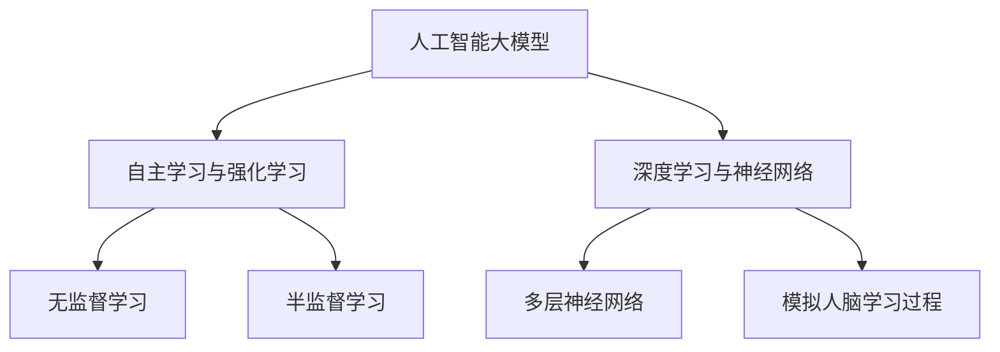

##### 1.3 AI 2.0 时代的应用领域

**产业变革**：AI 2.0将在制造业、医疗、金融等领域引发深刻变革，提高生产效率、优化服务流程，推动产业升级。

**社会影响**：AI 2.0将深刻影响社会生活的各个方面，如医疗、教育、交通等，提高生活质量，但也带来隐私、伦理等方面的新挑战。

**应用领域图示：**
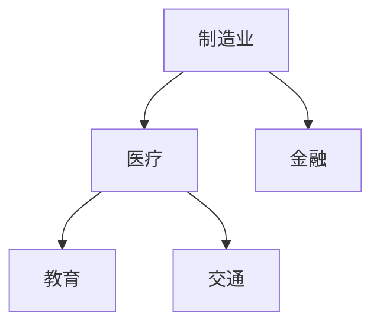

##### 1.4 AI 2.0 时代的挑战与机遇

**技术挑战**：随着AI技术的快速发展，数据隐私、安全、伦理等问题逐渐凸显，需要新的技术解决方案。

**社会挑战**：AI 2.0的发展将带来就业结构的变化、社会不平等等问题，需要政府、企业、教育机构等共同努力解决。

**挑战与机遇图示：**
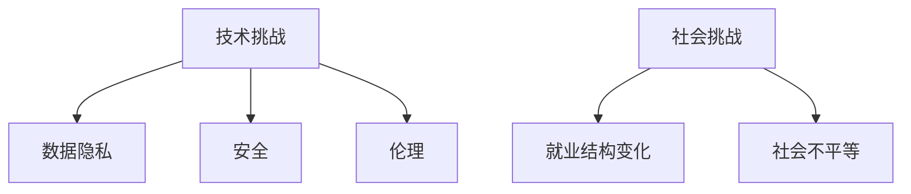

#### 第2章：AI 2.0 时代的理论基础

##### 2.1 机器学习的基本原理

机器学习是AI 2.0时代的重要理论基础，通过训练模型来实现对数据的自动分析和决策。机器学习主要分为以下三种类型：

- **监督学习**：通过标记好的数据集训练模型，使得模型能够在未知数据上进行预测。例如，分类问题（如垃圾邮件过滤）和回归问题（如房价预测）。
- **无监督学习**：不依赖于标记数据，通过数据自身的特征发现数据中的规律和结构。例如，聚类问题和降维问题。
- **强化学习**：通过与环境的交互，不断学习最优策略。通常用于策略优化问题，如机器人控制。

**监督学习图示：**
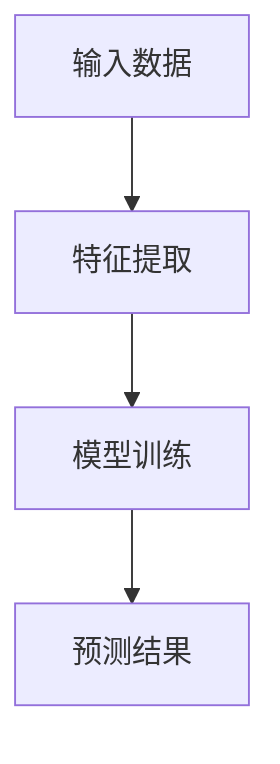

**无监督学习图示：**
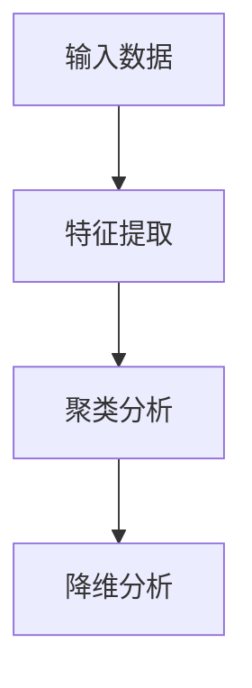

**强化学习图示：**
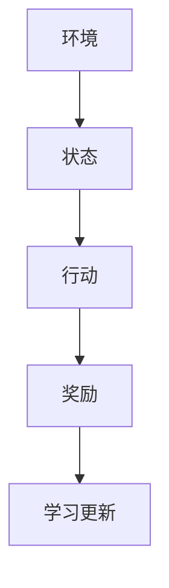

##### 2.2 深度学习与神经网络

深度学习是机器学习的一个重要分支，其核心是多层神经网络（Deep Neural Network, DNN）。深度学习通过多层神经网络结构模拟人脑的学习过程，能够处理复杂数据和任务。

- **卷积神经网络（CNN）**：适用于图像处理和计算机视觉任务，通过卷积操作提取图像特征。
- **循环神经网络（RNN）**：适用于序列数据处理，如自然语言处理和时间序列预测。
- **生成对抗网络（GAN）**：通过生成器和判别器的对抗训练，生成高质量的图像和文本。

**深度学习图示：**
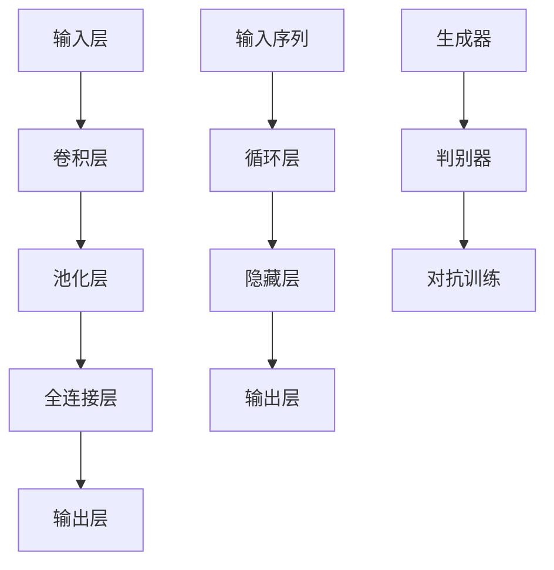

##### 2.3 自然语言处理

自然语言处理（Natural Language Processing, NLP）是AI 2.0时代的重要应用领域，通过计算机程序实现人类语言的理解和生成。

- **词嵌入（Word Embedding）**：将词汇映射到高维向量空间，使得相似词汇在空间中距离更近。
- **序列模型（Sequence Model）**：通过处理序列数据，实现自然语言的理解和生成，如循环神经网络（RNN）和长短期记忆网络（LSTM）。
- **注意力机制（Attention Mechanism）**：在处理序列数据时，通过注意力机制动态关注序列中的关键信息，提高模型的性能。

**自然语言处理图示：**
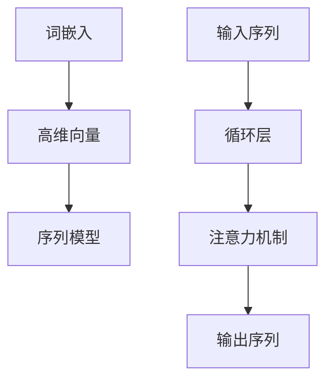

#### 第3章：AI 2.0 时代的应用实践

##### 3.1 AI 2.0 在医疗领域的应用

AI 2.0在医疗领域的应用具有巨大的潜力，能够提高诊断的准确性、优化治疗方案和提升医疗资源的利用效率。

- **医疗诊断**：通过深度学习和图像处理技术，AI系统能够对医学图像进行自动分析和诊断，如癌症筛查、糖尿病视网膜病变检测等。
- **疾病预测**：通过分析患者的历史数据和实时数据，AI系统能够预测疾病的发生和发展趋势，为医生提供有针对性的治疗方案。

**医疗诊断案例：**
- **癌症筛查**：使用卷积神经网络（CNN）对医学图像进行自动分析，提高癌症筛查的准确性。
- **糖尿病视网膜病变检测**：使用深度学习模型对眼底图像进行分析，检测糖尿病视网膜病变，提高早期诊断的准确率。

**疾病预测案例：**
- **心脏病预测**：通过分析患者的年龄、血压、血糖等数据，使用机器学习模型预测心脏病的发生风险，为医生提供诊断依据。
- **癌症复发预测**：通过分析患者的病理数据和基因信息，使用机器学习模型预测癌症的复发风险，为医生提供治疗方案的建议。

##### 3.2 AI 2.0 在金融领域的应用

AI 2.0在金融领域的应用能够提高金融市场的预测准确性、优化投资策略和降低风险管理成本。

- **金融市场分析**：通过分析大量历史数据和实时数据，AI系统能够预测金融市场的趋势和波动，为投资者提供投资建议。
- **风险管理**：通过分析风险因素和历史数据，AI系统能够预测和评估投资组合的风险，为投资者提供风险管理策略。

**金融市场分析案例：**
- **股票市场预测**：使用机器学习模型分析股票市场的历史数据和实时数据，预测股票市场的走势，为投资者提供投资建议。
- **外汇市场预测**：使用深度学习模型分析外汇市场的数据，预测汇率的变化趋势，为投资者提供交易策略。

**风险管理案例：**
- **信用风险评估**：通过分析借款人的历史数据和信用记录，使用机器学习模型评估借款人的信用风险，为金融机构提供信用评估依据。
- **风险控制策略**：通过分析金融市场的风险因素和投资组合的收益，使用机器学习模型制定风险控制策略，降低投资组合的风险。

##### 3.3 AI 2.0 在教育领域的应用

AI 2.0在教育领域的应用能够提高教育质量、个性化学习和教学效果。

- **智能教学**：通过分析学生的学习数据和知识结构，AI系统能够为学生提供个性化的学习资源和教学方案。
- **学习分析**：通过分析学生的学习行为和成果数据，AI系统能够评估学生的学习效果，为教师提供教学改进的依据。

**智能教学案例：**
- **个性化学习**：使用机器学习模型分析学生的学习数据和知识水平，为学生提供个性化的学习路径和资源，提高学习效果。
- **智能辅导**：使用自然语言处理技术分析学生的学习问题和需求，为学生提供智能化的辅导和解答。

**学习分析案例：**
- **学习行为分析**：使用机器学习模型分析学生的学习行为数据，如学习时间、学习频率等，评估学生的学习效果和积极性。
- **学习成果评估**：使用机器学习模型分析学生的学习成果数据，如考试成绩、作业完成情况等，为教师提供教学效果的评价依据。

##### 3.4 AI 2.0 在制造业的应用

AI 2.0在制造业的应用能够提高生产效率、优化生产流程和降低成本。

- **智能制造**：通过人工智能技术实现生产过程的自动化和智能化，提高生产效率和质量。
- **生产优化**：通过分析生产数据和实时数据，AI系统能够优化生产流程和资源配置，降低生产成本。

**智能制造案例：**
- **自动化生产线**：使用机器人技术和人工智能技术实现生产线的自动化，提高生产效率和灵活性。
- **设备故障预测**：使用机器学习模型分析设备的数据，预测设备的故障风险，提前进行维护，避免生产中断。

**生产优化案例：**
- **生产计划优化**：使用机器学习模型分析生产数据和需求预测，优化生产计划和资源配置，提高生产效率。
- **供应链优化**：使用人工智能技术分析供应链数据，优化供应链管理和库存控制，降低成本和提高响应速度。

#### 第二部分：AI 2.0 时代的社会与伦理问题

##### 第4章：AI 2.0 时代的社会影响

AI 2.0 时代的发展将对社会产生深远的影响，这些影响体现在就业、隐私和伦理等多个方面。

##### 4.1 AI 2.0 对就业的影响

AI 2.0 技术的快速发展可能导致一些传统职业的自动化和消失，但同时也会创造新的就业机会。以下是对这些影响的具体分析：

**自动化取代传统工作**

- **制造业**：自动化生产线和智能机器人的广泛应用使得许多制造业的工作岗位被自动化取代，如装配线工人、质量检查员等。
- **服务业**：人工智能在客户服务、餐饮服务等领域的应用，使得一些重复性、标准化的工作（如客服代表、餐厅服务员等）面临被自动化取代的风险。

**新就业机会的创造**

- **AI 开发与应用**：随着AI技术的普及，对AI研发、维护和优化的人才需求增加，从而创造了新的就业机会，如数据科学家、机器学习工程师、AI产品经理等。
- **AI 相关服务**：AI技术在医疗、金融、教育等领域的应用，催生了大量的AI相关服务岗位，如医疗诊断辅助系统开发人员、金融风险分析师、教育智能系统设计师等。

**案例分析与数据支持**

- **制造业就业变化**：据麦肯锡全球研究所的报告，到2030年，全球约14%的就业岗位可能会被自动化技术取代，但同时也会有约8亿个新岗位被创造出来。
- **AI 人才需求增长**：根据IBM的报告，到2022年，AI相关的岗位需求将增长28%，远超其他技术领域。

**政策建议**

- **教育和培训**：政府和企业应加大对AI相关教育和培训的投入，提高劳动者的技能和适应性，以便他们能够在新的就业市场中找到机会。
- **就业转型支持**：为那些因AI自动化而失业的工人提供转型支持和再就业服务，帮助他们适应新的就业环境。

##### 4.2 AI 2.0 对隐私的影响

AI 2.0 技术的广泛应用也带来了隐私保护和数据泄露的风险。以下是对这些问题的具体分析：

**数据隐私的保护**

- **数据加密与安全**：企业应采用高级数据加密技术，确保存储和传输的数据不被未经授权的第三方访问。
- **隐私保护法规**：各国应加强隐私保护立法，确保个人数据在收集、存储和使用过程中的合法性和安全性。

**隐私泄露的风险**

- **数据滥用**：AI模型在训练和预测过程中可能泄露敏感信息，如个人健康数据、财务状况等。
- **恶意攻击**：黑客可能通过攻击AI系统获取个人隐私数据，用于非法活动。

**案例分析**

- **Facebook 数据泄露**：2018年，Facebook的数据被泄露，涉及8700万用户的信息。这起事件揭示了AI技术在数据隐私保护方面的脆弱性。
- **剑桥分析公司事件**：2018年，剑桥分析公司被曝通过不当手段获取8700万用户的数据，用于政治广告投放。这一事件引发了全球对AI隐私保护的广泛关注。

**政策建议**

- **加强监管**：政府应加强对AI系统的监管，确保其遵守隐私保护法规，防止数据滥用。
- **提高公众意识**：企业和社会应提高对数据隐私重要性的认识，加强对用户隐私保护的宣传教育。

##### 4.3 AI 2.0 对伦理的挑战

AI 2.0 时代的到来，不仅带来了技术上的变革，也对伦理和社会公正提出了新的挑战。以下是对这些问题的具体分析：

**AI 决策的公正性**

- **算法偏见**：AI系统在决策过程中可能受到算法偏见的影响，导致对某些群体不公平的待遇，如性别、种族、年龄等。
- **透明性**：AI决策过程的透明度较低，使得公众难以理解和监督其决策过程，增加了不公正的可能性。

**AI 决策的责任归属**

- **责任分配**：在AI系统出现错误或造成损害时，如何界定责任归属是一个复杂的问题，涉及到企业、开发者和使用者的责任划分。
- **法律和道德责任**：AI系统是否应承担法律责任，如何界定其道德责任，这些都是亟待解决的问题。

**案例分析**

- **算法偏见案例**：亚马逊的招聘AI系统被发现对女性申请者有偏见，导致其在招聘过程中歧视女性。这一事件引发了关于算法偏见的广泛讨论。
- **自动驾驶车祸案例**：2018年，一辆自动驾驶汽车在美国撞死行人，引发了关于自动驾驶汽车责任归属的争议。

**政策建议**

- **加强伦理规范**：制定AI伦理规范，确保AI系统在开发和应用过程中遵循公平、公正的原则。
- **责任分配机制**：建立清晰的AI责任归属机制，明确各方的责任和义务，确保在发生问题时能够及时、公正地处理。

#### 第5章：AI 2.0 时代的政策与法规

##### 5.1 全球 AI 政策的概述

AI 2.0 时代的发展需要全球范围内的合作与协调，各国纷纷制定相应的政策和法规，以推动AI技术的健康发展。以下是对全球AI政策的主要概述：

**国际合作**

- **AI研究合作**：各国政府和研究机构之间加强AI领域的合作研究，分享研究成果和技术经验，推动AI技术的全球进步。
- **AI伦理准则**：国际社会制定统一的AI伦理准则，确保AI技术的公平、透明和可解释性。

**国家政策**

- **美国**：美国政府制定了一系列AI政策和计划，包括《美国国家AI战略》、《AI计划法案》等，旨在推动AI技术的发展和应用。
- **欧盟**：欧盟发布了《人工智能伦理准则》，强调AI技术应遵循伦理原则，并制定了《AI法案》，以规范AI的应用。
- **中国**：中国政府发布了《新一代人工智能发展规划》，明确提出要推动AI技术的研发和应用，加强AI领域的国际合作。

**政策内容**

- **研发支持**：各国政府加大对AI技术研发的支持，提供资金、技术和人才等资源，促进AI技术的创新和应用。
- **法规规范**：制定AI相关法规和标准，确保AI技术的安全、可靠和合规。
- **人才培养**：加大对AI人才的培养力度，提高AI领域的教育水平和人才储备。

##### 5.2 AI 法规的制定与实施

为了确保AI技术的健康发展，各国在制定AI法规时需要综合考虑技术、伦理、法律等多方面的因素。以下是对AI法规制定与实施的具体分析：

**AI 伦理法规**

- **伦理原则**：AI法规应明确AI技术的伦理原则，如公正性、透明性、可解释性和安全性等，确保AI技术的应用不损害社会公共利益。
- **伦理审查**：建立AI技术的伦理审查机制，对AI系统的设计、开发和应用过程进行伦理评估，防止潜在的伦理风险。

**AI 监管框架**

- **监管主体**：明确AI监管的主体，包括政府、行业组织和第三方评估机构等，确保监管的有效性和权威性。
- **监管流程**：建立完善的AI监管流程，包括AI系统的注册、审核、评估和监督等环节，确保AI技术的合规性和安全性。
- **责任追究**：明确AI系统的责任归属，建立责任追究机制，确保在AI系统出现问题时能够及时、公正地处理。

**法规实施**

- **立法**：各国政府应加快AI相关立法进程，制定具有操作性的法规和标准，确保AI技术的合规应用。
- **执法**：加强AI法规的执法力度，确保法规的实施和执行。
- **国际合作**：推动国际间的AI法规协调和合作，建立统一的AI法规体系，促进全球AI技术的健康发展。

##### 5.3 企业在 AI 领域的责任

在AI 2.0 时代，企业在推动AI技术发展的同时，也需要承担相应的社会责任，确保AI技术的安全、公正和合规应用。以下是对企业在AI领域责任的详细分析：

**数据安全**

- **数据保护**：企业应采取严格的数据保护措施，确保用户数据的隐私和安全，防止数据泄露和滥用。
- **数据合规**：企业应遵守相关数据保护法规，确保数据收集、存储和处理的过程合法合规。

**AI 的社会责任**

- **公平性**：企业应确保AI系统的公平性和公正性，避免算法偏见和歧视现象。
- **透明性**：企业应提高AI系统的透明度，公开AI系统的算法、数据来源和决策过程，接受社会监督。
- **可解释性**：企业应加强AI系统的可解释性，使得用户能够理解和信任AI系统的决策。

**案例分析**

- **谷歌面部识别技术**：谷歌曾因面部识别技术的歧视问题受到批评，后在公众压力下进行了调整，增加了透明性和可解释性。
- **微软AI助手**：微软的AI助手曾因性别歧视问题被禁止在内部使用，微软随后加强了AI系统的伦理审查和责任追究机制。

**企业责任建议**

- **建立伦理委员会**：企业应建立独立的伦理委员会，负责对AI系统的设计、开发和应用过程进行伦理评估和监督。
- **员工培训**：加强对员工的数据安全、伦理和合规培训，提高员工的伦理意识和管理能力。
- **公开透明**：企业应公开AI系统的决策过程和算法，接受社会监督，确保AI技术的公平、公正和合规应用。

#### 第6章：AI 2.0 时代的教育与人才培养

##### 6.1 AI 时代的教育变革

随着AI 2.0 时代的到来，教育领域也迎来了深刻的变革。传统的教育模式正逐步向智能化、个性化和终身学习方向转变。以下是对这些变革的详细分析：

**新型教育模式**

- **在线教育**：互联网的普及使得在线教育成为可能，学生可以通过网络课程随时随地学习，打破地域和时间的限制。
- **个性化教育**：通过大数据分析和AI技术，教育系统能够根据学生的学习习惯、兴趣和能力，提供个性化的学习路径和资源，提高学习效果。
- **混合式教育**：将传统面授课程与在线学习相结合，实现教学模式的多样化，满足不同学生的学习需求。

**终身学习的重要性**

- **知识更新快**：AI 2.0 时代知识更新速度加快，传统的学历教育难以满足实际工作需求，终身学习成为个人发展的必要手段。
- **技能提升**：随着AI技术的发展，对人才技能的要求也在不断提高，终身学习有助于提升个人技能和竞争力。

**案例分析**

- **Coursera**：Coursera等在线教育平台提供了丰富的在线课程，满足了全球学生的学习需求，推动了教育模式的变革。
- **自适应学习系统**：例如Knewton和DreamBox等自适应学习系统，通过分析学生的学习行为和成果，提供个性化的学习支持和资源。

##### 6.2 AI 人才培养的策略

AI 2.0 时代对人才的需求提出了新的挑战，以下是对人才培养策略的详细分析：

**人工智能专业教育**

- **课程设置**：高校应开设人工智能相关课程，包括机器学习、深度学习、自然语言处理等，培养学生扎实的理论基础和实际操作能力。
- **实践教学**：通过实验室、项目实践等方式，让学生在实际应用中掌握AI技术，提高解决实际问题的能力。
- **跨学科教育**：人工智能涉及多个学科领域，如计算机科学、数学、统计学等，跨学科教育有助于培养学生全面的技能。

**跨学科人才培养**

- **综合素质培养**：除了技术能力，人工智能人才还需要具备良好的逻辑思维、创新能力、沟通能力和团队协作能力。
- **持续学习**：鼓励学生持续学习，关注最新的技术发展和应用趋势，保持知识的更新和技能的提升。

**企业合作**

- **实习和实践**：企业与高校合作，提供实习和实践机会，让学生在实际工作中应用所学知识，提高职业能力。
- **人才引进**：企业应加大对AI人才的引进力度，吸引优秀人才加入，为企业的创新和发展提供支持。

**案例分析**

- **MIT**：麻省理工学院在人工智能领域具有世界领先地位，其课程设置和实践教学相结合的模式培养了大量的AI人才。
- **Google**：Google等科技巨头通过开设AI训练营、提供实习和培训机会，积极培养和引进AI人才。

##### 6.3 企业与教育机构的合作

企业与教育机构的合作在AI 2.0 时代具有重要的意义，以下是对这些合作的详细分析：

**实践项目合作**

- **联合实验室**：企业可以与高校建立联合实验室，共同开展AI技术的研究和应用，促进科技成果转化。
- **科研项目**：企业可以资助高校的科研项目，提供实际应用场景和数据支持，推动AI技术的创新和发展。

**人才引进与培训**

- **人才储备**：企业可以通过校企合作，提前培养和储备人才，为企业的未来发展提供人力支持。
- **员工培训**：企业可以与高校合作，开展员工培训项目，提高员工的AI技术水平和业务能力。

**案例分析**

- **微软与北京大学**：微软与北京大学联合成立了“微软 - 北京大学人工智能联合实验室”，共同开展人工智能研究，推动科技成果转化。
- **IBM与加州大学伯克利分校**：IBM与加州大学伯克利分校合作，开设了“IBM AI研究院”，推动AI技术的创新和应用。

#### 第三部分：AI 2.0 时代的未来展望

##### 第7章：AI 2.0 时代的未来展望

随着AI 2.0 时代的到来，技术发展趋势、社会变革以及面临的机遇与挑战都在不断演变。以下是对这些未来展望的详细分析：

##### 7.1 AI 2.0 时代的技术发展趋势

**大模型的发展**

- **预训练大模型**：预训练大模型（如GPT-3、BERT等）已经成为AI技术的重要方向，通过在大规模数据集上进行预训练，模型能够实现更高的性能和更强的泛化能力。
- **多模态大模型**：未来的AI技术将能够处理多种类型的数据，如图像、文本、音频等，实现跨模态的融合和处理。

**自主智能的发展**

- **自适应系统**：未来的AI系统将具备更强的自适应能力，能够根据环境变化和需求动态调整自己的行为和决策。
- **自主决策**：随着强化学习技术的进步，AI系统将能够实现更复杂的自主决策，应用于自动驾驶、智能机器人等领域。

**多智能体系统**

- **协同智能**：未来的AI系统将能够实现多个智能体之间的协同工作，提高系统的整体智能水平。
- **分布式智能**：通过分布式计算和通信技术，AI系统能够在更广泛的范围内实现智能化的协作和决策。

**图计算与图神经网络**

- **知识图谱**：未来的AI技术将能够更好地处理复杂的关系数据，构建知识图谱，实现知识推理和智能决策。
- **图神经网络**：通过图神经网络，AI系统能够在图结构数据上进行高效学习和推理，提高智能处理的性能。

**量子计算**

- **量子机器学习**：量子计算技术有望在AI领域实现重大突破，通过量子叠加和量子纠缠，实现更高效的机器学习算法和模型训练。

**区块链与AI融合**

- **智能合约**：未来的AI技术将能够与区块链技术相结合，实现智能合约的自动化执行和智能治理。
- **数据隐私保护**：通过区块链技术，AI系统能够实现更高效的数据隐私保护，确保用户数据的合法和安全。

**AI伦理与法规**

- **AI伦理框架**：未来的AI技术将更加重视伦理问题，建立完善的AI伦理框架，确保AI技术的公平、公正和透明。
- **AI法规体系**：各国将进一步完善AI相关法规，建立统一的AI法规体系，规范AI技术的应用和发展。

**AI治理**

- **AI监管机构**：未来的AI治理将需要专门的监管机构，负责监督AI技术的研发和应用，确保AI技术的健康发展。
- **AI责任归属**：建立清晰的AI责任归属机制，明确开发者、用户和监管机构的职责，确保在AI系统出现问题时能够及时、公正地处理。

**AI与人类协作**

- **人机协同**：未来的AI技术将更加注重与人类的协作，通过人机交互技术，实现人与AI的协同工作。
- **智能助手**：智能助手将成为人们日常生活和工作中的重要伙伴，提供个性化的服务和帮助。

**全球合作**

- **AI国际合作**：全球各国将加强在AI领域的合作，共同推动AI技术的发展和应用，应对全球性挑战。
- **AI伦理准则**：国际社会将制定统一的AI伦理准则，确保AI技术的公平、公正和透明，促进全球AI技术的健康发展。

**技术发展趋势图示：**
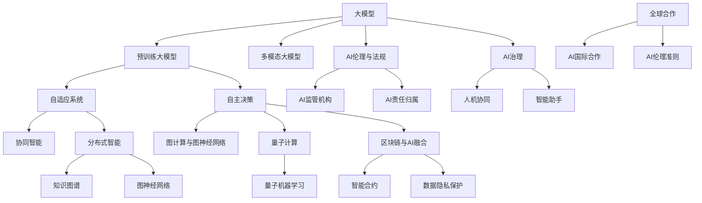

##### 7.2 AI 2.0 时代的社会变革

**社会结构的改变**

- **劳动力市场变革**：AI 2.0 时代将改变劳动力市场的结构，自动化技术将取代一些传统工作，同时也会创造新的就业机会。
- **城乡差距**：随着AI技术的普及，城市与农村之间的差距可能会进一步扩大，农村地区需要更多的支持和投入以适应技术变革。

**人际关系的改变**

- **社交互动**：随着AI技术的发展，人们之间的社交互动方式可能会发生改变，虚拟社交和智能助手将成为重要的人际交往方式。
- **家庭关系**：AI技术的发展可能会改变家庭结构和家庭关系，家庭成员之间的依赖和互动方式可能会发生变化。

**案例分析**

- **自动化工厂**：随着自动化技术的普及，许多工厂实现了无人化生产，改变了传统的劳动力市场结构。
- **智能助手**：智能助手如Siri、Alexa等已经成为许多家庭的日常伙伴，改变了人们的社交互动和家庭关系。

**社会变革图示：**
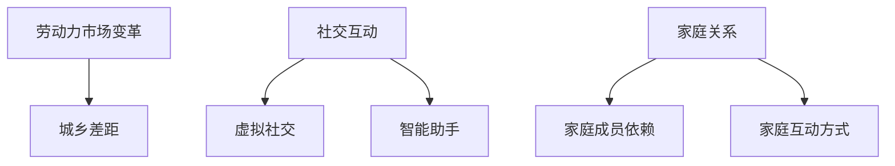

##### 7.3 AI 2.0 时代的机遇与挑战

**技术进步带来的机遇**

- **创新与发展**：AI 2.0 时代将推动技术进步，带来更多的创新和发展机遇，如新型商业模式、产品和服务。
- **经济增长**：AI技术的应用将促进各行业的效率提升和成本降低，推动全球经济的增长。

**社会变革带来的挑战**

- **就业不平等**：自动化技术可能导致某些职业的失业率上升，加剧就业不平等问题。
- **隐私与安全**：随着AI技术的普及，个人隐私和数据安全面临更大的风险。

**案例分析**

- **自动化取代劳动力**：一些传统制造业国家面临劳动力失业问题，需要政府和企业采取措施应对就业不平等。
- **数据泄露与隐私保护**：近年来，大量数据泄露事件暴露了AI技术在数据隐私保护方面的脆弱性，需要加强相关法规和安全措施。

**机遇与挑战图示：**
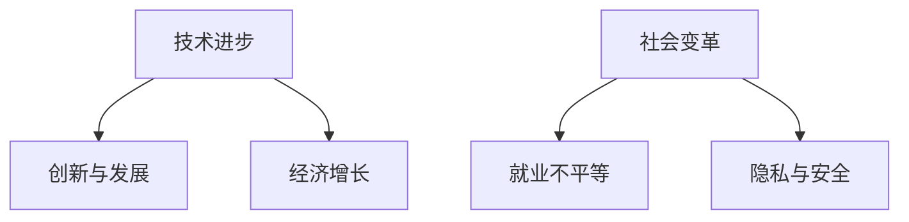

**总结**

AI 2.0 时代的发展带来了巨大的机遇和挑战，技术进步、社会变革和人才培养是关键。通过加强国际合作、制定伦理规范和法律法规，我们能够更好地应对AI技术的挑战，推动社会的可持续发展。

#### 附录A：AI 2.0 时代的参考资源

##### 7.1 参考书籍与论文

**书籍推荐**

1. **《AI超简单》** - 李开复
   - 内容：本书详细介绍了AI的基础知识，包括机器学习、深度学习、自然语言处理等，适合初学者。
2. **《深度学习》** - Goodfellow, Bengio, Courville
   - 内容：本书是深度学习领域的经典教材，涵盖了深度学习的理论基础、算法实现和应用场景。
3. **《智能时代》** - 吴军
   - 内容：本书从科技、经济、社会等多方面探讨了AI对人类未来生活的影响，对AI的发展趋势有深刻的洞察。

**论文推荐**

1. **"A Theoretical Framework for Backpropagation"** - David E. Rumelhart, Geoffrey E. Hinton, Ronald J. Williams
   - 内容：本文是深度学习领域的经典论文，提出了反向传播算法，为深度学习的发展奠定了基础。
2. **"Deep Learning"** - Andrew Ng, Chuan Liu
   - 内容：本文详细介绍了深度学习的基本概念、算法和实现，是深度学习领域的权威文献。
3. **"The Annotated Pointer Network"** - Oriol Vinyals, Meire Fortunato, Niru Mahadevan
   - 内容：本文提出了指针网络模型，用于解决序列到序列的任务，如机器翻译和文本生成。

##### 7.2 主流 AI 开发工具与平台

**开发工具**

1. **TensorFlow**：由谷歌开发，是目前最流行的深度学习框架之一，支持多种编程语言和平台。
2. **PyTorch**：由Facebook开发，具有灵活的动态计算图和强大的社区支持，适合快速原型设计和实验。
3. **Keras**：是一个高层次的深度学习API，基于TensorFlow和Theano，提供了简单易用的接口，适合快速搭建深度学习模型。

**平台**

1. **Google Colab**：谷歌提供的免费协作计算平台，支持GPU和TPU，适用于深度学习和数据科学项目。
2. **AWS AI**：亚马逊提供的云服务，包括深度学习框架、机器学习服务和AI工具包，适用于大规模AI应用。
3. **Azure Machine Learning**：微软提供的云服务，支持深度学习、机器学习和数据分析，提供高效的AI开发环境。

##### 7.3 AI 2.0 时代的经典案例与实践

**医疗领域**

1. **AI-powered diagnostic systems**：使用深度学习技术进行医学图像分析，如肺癌筛查、乳腺癌检测等，提高了诊断的准确性和效率。
2. **Drug discovery using AI**：通过机器学习算法预测药物的有效性和安全性，加速新药的研发过程。

**金融领域**

1. **Algorithmic trading**：使用机器学习模型进行金融市场分析，实现自动化交易，提高了交易效率和收益。
2. **Credit scoring using AI**：利用机器学习模型分析借款人的信用记录和历史数据，进行信用评估和风险管理。

**制造业**

1. **Predictive maintenance**：通过传感器和机器学习技术预测设备的故障风险，提前进行维护，降低了生产中断的风险。
2. **Customized production**：使用AI技术实现定制化生产，提高了生产效率和市场响应速度。

**教育领域**

1. **Personalized learning platforms**：使用AI技术为学生提供个性化的学习资源和教学方案，提高了学习效果和满意度。
2. **Automated assessment systems**：通过自然语言处理技术进行自动化考试评分，提高了评估效率和准确性。

这些经典案例和实践展示了AI 2.0 时代在不同领域的重要应用，为读者提供了丰富的参考和灵感。通过学习和借鉴这些案例，读者可以更好地理解和应用AI技术，为未来的发展做好准备。

