                 

### 文章标题

# 李开复：AI 2.0 时代的未来

> 关键词：人工智能，深度学习，自主学习，AI伦理，AI法规

> 摘要：本文旨在探讨AI 2.0时代的未来发展趋势、核心技术、应用案例、开发实践、伦理与法规问题以及未来展望。通过逻辑清晰的分析，本文深入剖析了AI 2.0时代的核心概念、算法原理和实际应用，同时讨论了相关挑战与应对策略。

### 第一部分：AI 2.0时代的未来

AI 2.0时代是一个以深度学习和自主学习为核心的智能化时代，它代表了人工智能发展的新阶段。在这一部分，我们将详细探讨AI 2.0时代的概念与特点、核心技术、影响与应用，为理解AI 2.0时代的未来提供基础。

## 第1章：AI 2.0时代的到来

### 1.1 AI 2.0的概念与特点

AI 2.0是基于深度学习和自主学习的智能系统，它与传统的基于规则和统计学习的方法（AI 1.0）有显著的区别。以下是AI 1.0与AI 2.0的主要区别：

$$
\begin{align*}
\text{AI 1.0} &= \text{基于规则和统计学习的方法} \\
\text{AI 2.0} &= \text{基于深度学习和自主学习的智能系统}
\end{align*}
$$

AI 2.0的特点包括：

1. **自主学习能力**：AI 2.0能够从大量数据中自主学习，无需显式编程。
2. **处理复杂任务**：深度学习使得AI 2.0能够处理更复杂的任务，如图像识别、自然语言处理等。
3. **泛化能力**：AI 2.0具有更好的泛化能力，能够应对不同场景的问题。

### 1.2 AI 2.0的核心技术

#### 1.2.1 深度学习

深度学习是AI 2.0的核心技术之一，它通过多层神经网络模拟人脑的神经元连接结构，实现数据的自动特征提取和模型训练。以下是深度学习的基本伪代码：

```python
define NeuralNetwork(input_size, hidden_size, output_size):
    Initialize weights and biases
    for each epoch:
        for each training example:
            Compute forward pass
            Compute loss
            Compute backward pass
            Update weights and biases
    return trained network
```

#### 1.2.2 自主学习

自主学习是AI 2.0的另一核心特性，它使得系统能够在不断变化的环境中自我优化和进化。以下是自主学习的伪代码：

```python
define AutonomousLearning(network, environment):
    while not converged:
        Take action based on network's prediction
        Receive feedback from environment
        Update network with feedback
    return optimized network
```

### 1.3 AI 2.0的影响与应用

AI 2.0的影响与应用广泛，涵盖了社会、经济、教育、医疗等多个领域。以下是AI 2.0对各个领域的影响：

#### 1.3.1 对社会的影响

**Mermaid流程图：**

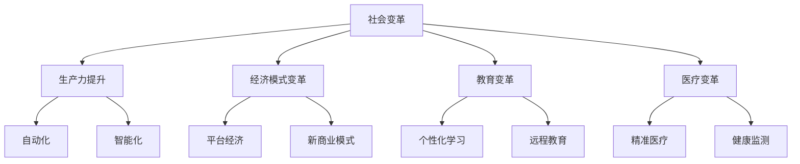

**图解：**

- **生产力提升**：AI 2.0通过自动化和智能化，显著提升了生产效率。
- **经济模式变革**：AI 2.0推动了平台经济和新商业模式的兴起。
- **教育变革**：个性化学习和远程教育使得教育资源更加普及和灵活。
- **医疗变革**：精准医疗和健康监测提升了医疗服务的质量和效率。

## 第2章：AI 2.0的核心算法原理

在AI 2.0时代，核心算法的原理和实现方法至关重要。本节将详细介绍卷积神经网络（CNN）和生成对抗网络（GAN）的原理，以及它们在AI 2.0中的应用。

### 2.1 卷积神经网络（CNN）

#### 2.1.1 CNN的基本结构

卷积神经网络是AI 2.0时代广泛应用的深度学习模型，特别适用于图像处理和识别任务。以下是CNN的基本结构：

**Mermaid流程图：**

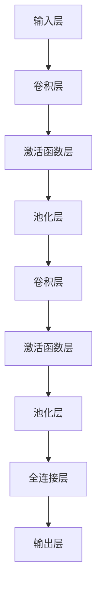

**图解：**

- **输入层**：接收图像数据。
- **卷积层**：通过卷积操作提取图像特征。
- **激活函数层**：引入非线性变换，增加模型的表达能力。
- **池化层**：降低特征图的维度，减少计算量。
- **全连接层**：将特征映射到输出层，实现分类或回归任务。

#### 2.1.2 CNN的优化算法

CNN的训练过程涉及大量的参数调整和优化。以下是CNN优化算法的伪代码：

```python
define ConvolutionalNeuralNetwork(input_size, hidden_size, output_size):
    Initialize weights and biases
    for each epoch:
        for each training example:
            Compute forward pass
            Compute loss
            Compute backward pass
            Update weights and biases
    return trained network
```

### 2.2 生成对抗网络（GAN）

#### 2.2.1 GAN的工作原理

生成对抗网络（GAN）是一种通过对抗性训练生成数据的新型深度学习模型。以下是GAN的基本原理：

**Mermaid流程图：**

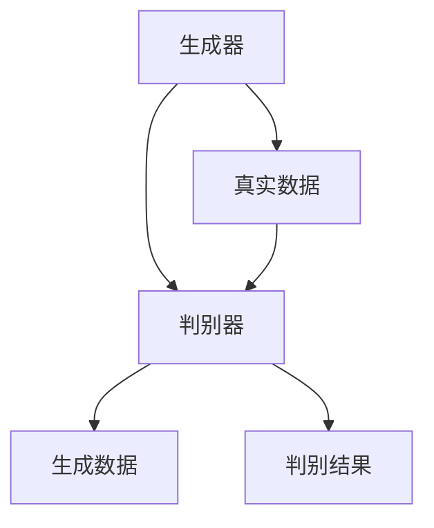

**图解：**

- **生成器**：生成与真实数据相似的数据。
- **判别器**：判断生成数据是否真实。
- **真实数据**：提供判别器和生成器训练的数据。
- **生成数据**：生成器生成的数据。
- **判别结果**：判别器对生成数据和真实数据的判断结果。

#### 2.2.2 GAN的训练过程

GAN的训练过程是一个动态的对抗性过程，目的是使生成器生成的数据尽可能接近真实数据。以下是GAN的训练过程的伪代码：

```python
define GAN(generator, discriminator):
    while not converged:
        Train discriminator with real and fake data
        Train generator to fool the discriminator
    return trained generator
```

## 第3章：AI 2.0的应用案例

AI 2.0技术在各个领域的应用已经逐渐显现，本节将介绍AI 2.0在医疗和金融领域的应用案例，展示其在实际场景中的强大潜力。

### 3.1 人工智能在医疗领域的应用

#### 3.1.1 病症诊断

AI 2.0技术在医疗领域的一个典型应用是病症诊断。通过深度学习算法，AI可以自动分析医学图像，如X光片、CT扫描和MRI，以帮助医生进行准确诊断。以下是一个用于病症诊断的数学模型：

$$
P(\text{病症}|\text{诊断结果}) = \frac{P(\text{诊断结果}|\text{病症}) \cdot P(\text{病症})}{P(\text{诊断结果})}
$$

**举例说明**：

假设有一个AI系统用于诊断肺炎，通过对大量历史病例数据进行训练，系统能够学习到肺炎的典型特征。当系统接收到一张X光片时，可以通过计算肺炎发生的概率来进行诊断。如果概率超过一定的阈值，则可以判断为肺炎。

#### 3.1.2 药物研发

AI 2.0在药物研发领域也发挥了重要作用。通过生成对抗网络（GAN）等技术，AI可以预测药物的副作用和疗效，加速新药的发现过程。以下是一个用于药物研发的数学模型：

$$
\text{药物效果} = f(\text{药物浓度}, \text{疾病类型})
$$

**举例说明**：

假设AI系统接收到一种新药物和特定疾病类型的数据，通过GAN模型，系统能够生成不同药物浓度下的疾病治疗效果。通过对比不同浓度的治疗效果，科学家可以确定最佳药物浓度，从而加速药物研发过程。

### 3.2 人工智能在金融领域的应用

#### 3.2.1 风险管理

AI 2.0技术在金融领域的风险管理中具有重要意义。通过深度学习和机器学习算法，AI可以分析大量历史金融数据，预测市场趋势和风险。以下是一个用于风险管理的数学模型：

$$
\text{风险} = \sigma \cdot \sqrt{ \text{资产价值} \cdot \text{波动率}}
$$

**举例说明**：

假设一个投资组合包含多种资产，AI系统通过分析这些资产的波动率和资产价值，可以计算出整体投资组合的风险。通过调整资产配置，投资经理可以降低投资组合的风险。

#### 3.2.2 量化交易

AI 2.0在量化交易中的应用也取得了显著成果。通过机器学习和深度学习算法，AI可以识别市场中的交易机会，自动执行交易策略。以下是一个用于量化交易的数学模型：

$$
\text{收益} = \text{交易策略} \cdot \text{市场波动}
$$

**举例说明**：

假设一个量化交易系统通过分析历史市场数据，确定了某种交易策略。当市场波动时，系统可以根据交易策略自动执行交易，从而获得收益。

## 第4章：AI 2.0的开发实践

AI 2.0的开发实践是一个复杂且系统化的过程，涉及需求分析、系统设计、模型训练、模型部署和维护等多个环节。本节将详细介绍AI 2.0的开发实践流程，并分享一些实际案例。

### 4.1 AI项目开发流程

#### 4.1.1 需求分析

需求分析是AI项目开发的第一步，它涉及明确项目目标和功能需求。以下是一个需求分析的伪代码：

```python
define analyze_requirements():
    Collect user requirements
    Document requirements
    Validate requirements
    return documented_requirements
```

**举例说明**：

假设要开发一个智能问答系统，需求分析阶段需要明确以下要求：
1. 用户可以通过输入问题进行查询。
2. 系统能够自动分析问题，并给出相关答案。
3. 答案需要具有高准确性和可解释性。

#### 4.1.2 系统设计

系统设计是项目开发的关键阶段，它涉及系统架构的设计和组件的定义。以下是一个系统设计的伪代码：

```python
define system_design(requirements):
    Design architecture
    Define components
    Define interfaces
    return system_design
```

**举例说明**：

假设设计的智能问答系统包括以下组件：
1. 用户界面：用于接收用户输入和处理输出。
2. 自然语言处理模块：用于解析用户问题和生成答案。
3. 知识库：存储问题和答案，以供系统查询。

#### 4.1.3 模型训练

模型训练是AI项目开发的核心环节，它涉及使用大量数据进行模型的训练和优化。以下是一个模型训练的伪代码：

```python
define train_model(model, data):
    for each epoch:
        for each batch:
            Compute forward pass
            Compute loss
            Compute backward pass
            Update model parameters
    return trained_model
```

**举例说明**：

假设使用卷积神经网络（CNN）进行图像分类训练，以下步骤是：
1. 准备训练数据和测试数据。
2. 初始化神经网络模型。
3. 对于每个训练epoch，对每个batch进行前向传播、计算损失、反向传播和参数更新。
4. 评估模型在测试数据上的表现，调整模型参数以优化性能。

#### 4.1.4 模型部署

模型部署是将训练好的模型部署到实际生产环境中，以便进行实时推理和应用。以下是一个模型部署的伪代码：

```python
define deploy_model(model, environment):
    Configure environment
    Upload model to environment
    Start model inference service
    return deployment_status
```

**举例说明**：

假设要将训练好的智能问答系统部署到云服务器上，以下步骤是：
1. 配置云服务器环境。
2. 将训练好的模型上传到云服务器。
3. 启动模型推理服务，以便用户可以随时使用智能问答功能。

### 4.2 AI模型的训练与优化

#### 4.2.1 数据准备

数据准备是AI模型训练的重要环节，它涉及数据的收集、预处理和分割。以下是一个数据准备的伪代码：

```python
define prepare_data(data_source):
    Load data
    Preprocess data
    Split data into training and validation sets
    return processed_data
```

**举例说明**：

假设要训练一个图像识别模型，以下步骤是：
1. 从数据源中加载图像数据。
2. 对图像进行预处理，如调整大小、归一化等。
3. 将数据分为训练集和验证集，用于模型训练和性能评估。

#### 4.2.2 模型训练

模型训练是AI项目开发的核心环节，它涉及使用大量数据进行模型的训练和优化。以下是一个模型训练的伪代码：

```python
define train_model(model, data):
    for each epoch:
        for each batch:
            Compute forward pass
            Compute loss
            Compute backward pass
            Update model parameters
    return trained_model
```

**举例说明**：

假设使用卷积神经网络（CNN）进行图像分类训练，以下步骤是：
1. 准备训练数据和测试数据。
2. 初始化神经网络模型。
3. 对于每个训练epoch，对每个batch进行前向传播、计算损失、反向传播和参数更新。
4. 评估模型在测试数据上的表现，调整模型参数以优化性能。

### 4.3 AI项目的部署与维护

#### 4.3.1 部署策略

AI项目的部署是将模型部署到实际生产环境中，以便进行实时推理和应用。以下是一个部署策略的伪代码：

```python
define deploy_model(model, environment):
    Configure environment
    Upload model to environment
    Start model inference service
    return deployment_status
```

**举例说明**：

假设要将训练好的智能问答系统部署到云服务器上，以下步骤是：
1. 配置云服务器环境。
2. 将训练好的模型上传到云服务器。
3. 启动模型推理服务，以便用户可以随时使用智能问答功能。

#### 4.3.2 维护与管理

AI项目的维护与管理是确保模型长期稳定运行的关键。以下是一个维护与管理的伪代码：

```python
define monitor_model(model, environment):
    Collect model performance metrics
    Analyze performance metrics
    Apply updates if necessary
    return model_status
```

**举例说明**：

假设要维护一个智能问答系统，以下步骤是：
1. 收集模型性能指标，如准确率、响应时间等。
2. 分析性能指标，找出潜在的问题和优化点。
3. 根据分析结果，对模型进行更新和优化，以提高系统性能。

## 第5章：AI伦理与法规

随着AI技术的发展和应用，伦理与法规问题日益突出。本节将讨论AI伦理问题、数据保护法规以及AI伦理指导原则，旨在为AI 2.0时代的伦理与法规制定提供参考。

### 5.1 AI伦理问题

AI伦理问题涵盖了数据隐私、AI偏见等方面，以下是AI伦理问题的讨论：

#### 5.1.1 数据隐私

数据隐私是AI应用中的核心伦理问题。AI系统通常依赖于大量用户数据，这些数据包括个人敏感信息。以下是一个数据隐私保护流程：

**Mermaid流程图：**

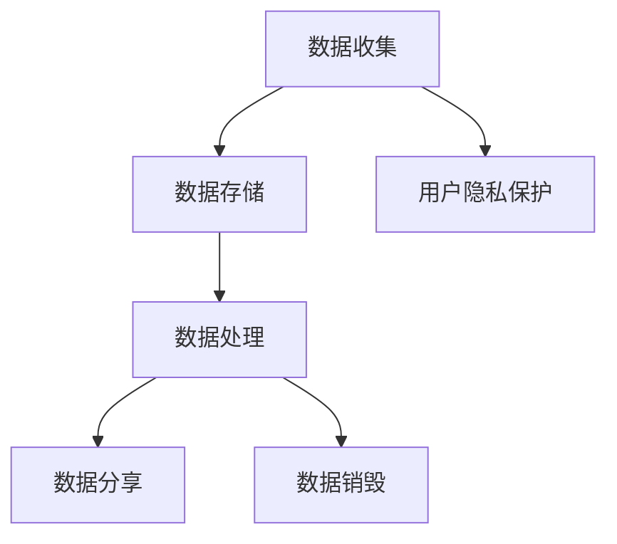

**图解：**

- **数据收集**：AI系统收集用户数据。
- **数据存储**：数据存储在安全服务器上。
- **数据处理**：对数据进行清洗、归一化等预处理。
- **数据分享**：在确保用户隐私的前提下，与其他系统和团队共享数据。
- **数据销毁**：在项目结束后，按照规定删除所有用户数据。

#### 5.1.2 AI偏见

AI偏见是指AI系统在处理数据时可能出现的歧视行为。以下是一个衡量AI偏见程度的数学模型：

$$
\text{偏见} = \frac{\text{误判率}}{\text{总样本数}}
$$

**举例说明**：

假设一个AI系统用于招聘，如果系统在招聘过程中对某一性别或种族的候选人存在更高的误判率，那么系统就存在偏见。通过降低误判率，可以减少AI偏见。

### 5.2 AI法规与政策

AI法规与政策是规范AI技术发展的重要手段。以下是关于数据保护法规和AI伦理指导原则的讨论：

#### 5.2.1 数据保护法规

数据保护法规是保障用户隐私和数据安全的重要法律基础。以下是一个数据保护法规的合规性检查流程：

**Mermaid流程图：**

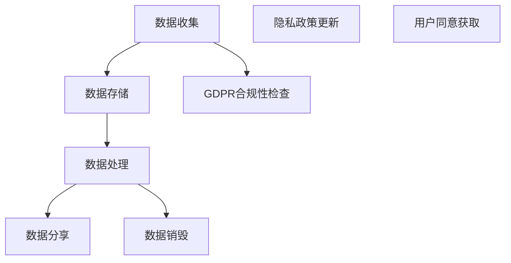

**图解：**

- **数据收集**：在进行数据收集时，确保遵守GDPR等数据保护法规。
- **数据存储**：确保数据存储在符合法规的安全服务器上。
- **数据处理**：对数据进行处理时，确保不违反用户隐私。
- **数据分享**：在分享数据时，确保得到用户的明确同意。
- **数据销毁**：在项目结束后，按照规定删除所有用户数据。

#### 5.2.2 AI伦理指导原则

AI伦理指导原则是指导AI技术发展的重要道德准则。以下是一个AI伦理指导原则的流程：

**Mermaid流程图：**

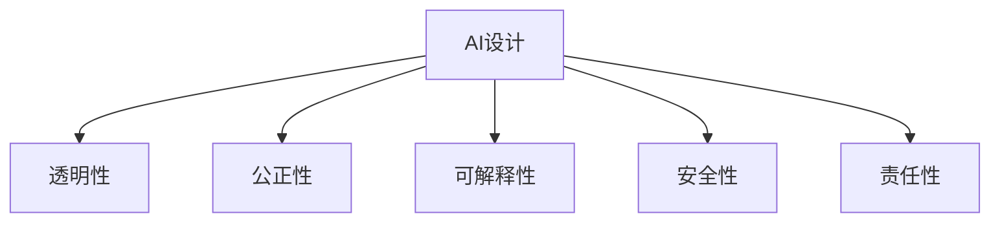

**图解：**

- **透明性**：确保AI系统的设计、训练和应用过程透明，便于监督和审计。
- **公正性**：确保AI系统不歧视任何用户群体，保证公平性。
- **可解释性**：提高AI系统的可解释性，使人们能够理解AI的决策过程。
- **安全性**：确保AI系统在设计和应用过程中不会对用户造成安全威胁。
- **责任性**：明确AI系统的责任归属，确保在出现问题时能够追究责任。

## 第6章：AI时代的未来展望

随着AI技术的不断发展，AI时代的未来充满了无限可能。本节将探讨AI与人类的关系、AI未来的发展趋势以及AI与物联网的结合，为读者描绘AI时代的未来图景。

### 6.1 AI与人类的关系

AI与人类的关系是一个复杂而多维的话题。AI技术的进步不仅改变了我们的生活方式，也深刻影响了人类社会的结构。以下是AI赋能人类和AI与人类协作的讨论。

#### 6.1.1 AI赋能人类

AI赋能人类是指通过AI技术提高人类的工作效率和生活品质。以下是AI赋能人类的几个方面：

**Mermaid流程图：**

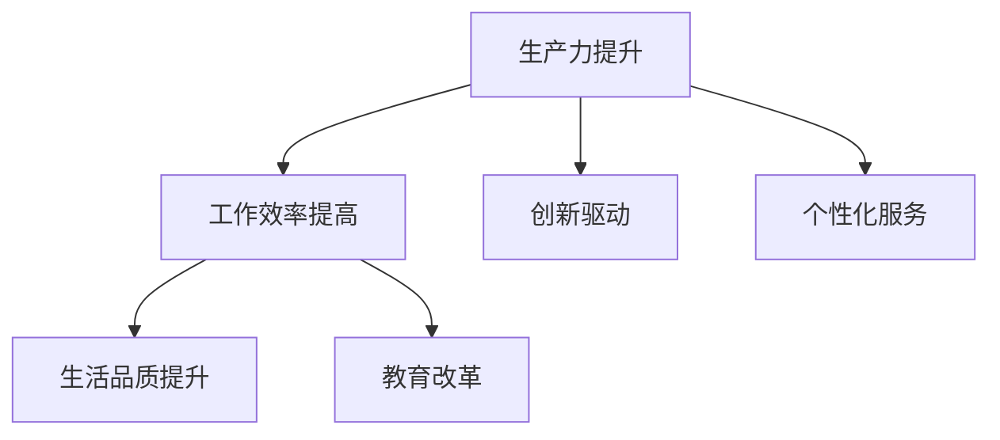

**图解：**

- **生产力提升**：AI技术通过自动化和智能化，显著提高了生产效率。
- **工作效率提高**：AI辅助工具能够帮助人类更高效地完成任务。
- **创新驱动**：AI技术激发了人类创新的潜力，推动了科技进步。
- **个性化服务**：AI能够根据用户的需求提供个性化的服务。
- **生活品质提升**：AI技术改善了人类的生活条件，提高了生活品质。
- **教育改革**：AI技术在教育领域的应用，如个性化学习和远程教育，正在改变教育方式。

#### 6.1.2 AI与人类协作

AI与人类协作是指AI技术作为人类的助手，与人类共同完成任务。以下是AI与人类协作的几个方面：

**Mermaid流程图：**

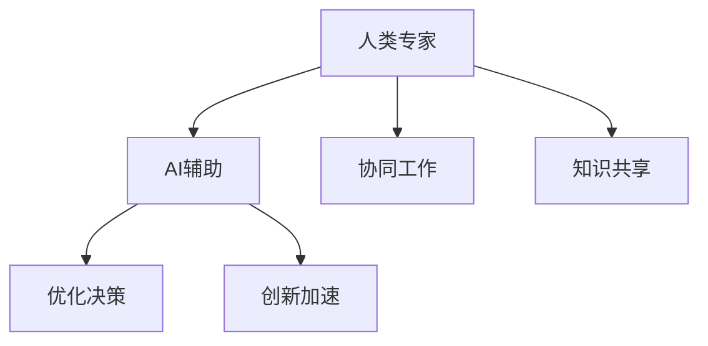

**图解：**

- **人类专家**：人类专家在专业领域拥有丰富的经验和知识。
- **AI辅助**：AI技术作为辅助工具，帮助人类专家提高工作效率。
- **协同工作**：AI与人类专家共同工作，实现更高效的任务执行。
- **知识共享**：AI技术可以共享人类专家的知识，促进知识的传播和普及。
- **优化决策**：AI技术通过数据分析，帮助人类专家做出更优的决策。
- **创新加速**：AI技术激发了人类的创新能力，加速了科技的发展。

### 6.2 AI未来的发展趋势

AI未来的发展趋势将继续以深度学习和自主学习为核心，同时与其他技术领域结合，推动AI技术的发展。以下是AI未来的发展趋势：

#### 6.2.1 大模型的发展趋势

大模型是未来AI技术的重要方向，通过训练更大的模型，AI系统可以处理更复杂的数据和任务。以下是大模型的发展趋势：

**Mermaid流程图：**

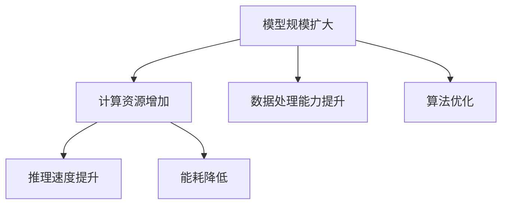

**图解：**

- **模型规模扩大**：随着计算资源的增加，AI模型规模将不断扩大。
- **计算资源增加**：数据中心和云计算技术的发展，为AI模型提供了强大的计算支持。
- **数据处理能力提升**：AI系统将能够处理更多样化和更复杂的数据。
- **算法优化**：研究人员将持续优化算法，提高AI模型的性能和效率。
- **推理速度提升**：通过优化模型结构和计算方法，AI系统的推理速度将显著提升。
- **能耗降低**：随着技术的发展，AI系统的能耗将逐渐降低，更加环保和可持续。

#### 6.2.2 AI与物联网的结合

AI与物联网的结合将推动智能家居、智能城市、智能制造等领域的快速发展。以下是AI与物联网结合的发展趋势：

**Mermaid流程图：**

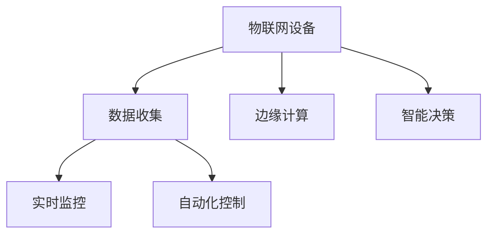

**图解：**

- **物联网设备**：随着物联网技术的发展，各种智能设备将遍布我们的生活和生产环境。
- **数据收集**：物联网设备可以收集大量的实时数据，为AI系统提供丰富的数据来源。
- **边缘计算**：在数据产生的源头进行计算，降低网络延迟，提高数据处理效率。
- **智能决策**：AI系统可以根据实时数据做出智能决策，优化设备和系统的运行。
- **实时监控**：通过AI技术，实现对设备和系统的实时监控，确保安全和效率。
- **自动化控制**：AI系统可以自动控制设备和系统的运行，实现自动化和智能化。

## 第7章：AI 2.0时代的未来挑战与应对策略

随着AI 2.0时代的到来，我们面临着一系列技术挑战和社会挑战。本节将讨论AI 2.0时代的未来挑战，并提出相应的应对策略。

### 7.1 挑战

#### 7.1.1 技术挑战

技术挑战是AI 2.0时代面临的主要挑战之一，包括计算资源需求、算法优化、数据处理、安全与隐私保护等方面。以下是技术挑战的讨论：

**Mermaid流程图：**

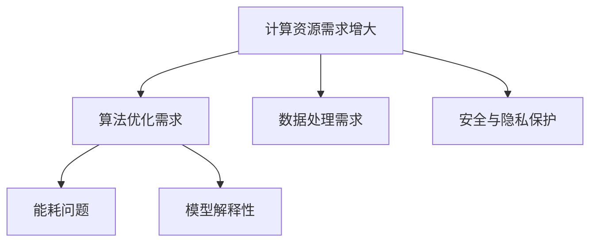

**图解：**

- **计算资源需求增大**：随着AI模型规模的扩大和任务复杂度的增加，对计算资源的需求不断增大。
- **算法优化需求**：优化算法以提高模型的性能和效率，降低计算资源的需求。
- **数据处理需求**：AI系统需要处理海量数据和多样化数据，对数据处理能力提出了更高的要求。
- **安全与隐私保护**：确保AI系统在处理数据时，不会泄露用户隐私或造成安全隐患。
- **能耗问题**：降低AI系统的能耗，提高能源利用效率，实现可持续发展的目标。
- **模型解释性**：提高AI模型的解释性，使人们能够理解和信任AI系统的决策过程。

#### 7.1.2 社会挑战

社会挑战是AI 2.0时代面临的另一个重要挑战，包括就业冲击、技能需求变化、伦理问题、法律与监管等方面。以下是社会挑战的讨论：

**Mermaid流程图：**

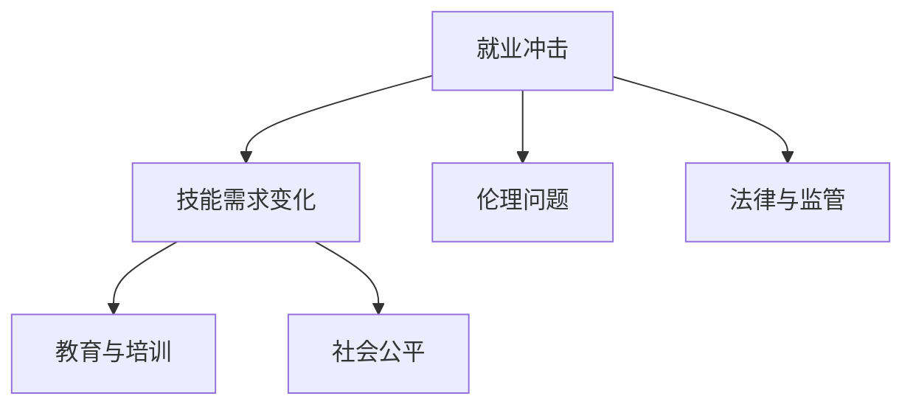

**图解：**

- **就业冲击**：AI技术的发展可能导致部分传统岗位的消失，对就业市场造成冲击。
- **技能需求变化**：随着AI技术的发展，对人才技能的需求将发生变化，需要培养更多适应AI时代的技能。
- **伦理问题**：AI技术在医疗、金融等领域的应用可能引发伦理问题，需要制定相应的伦理规范。
- **法律与监管**：制定相应的法律和监管政策，确保AI技术的健康发展。
- **教育与培训**：提高公众对AI技术的认知，提供相关的教育和培训，帮助人们适应AI时代。
- **社会公平**：确保AI技术在各个领域公平应用，避免加剧社会不平等现象。

### 7.2 应对策略

针对AI 2.0时代的挑战，我们需要采取一系列应对策略，以促进AI技术的健康发展。以下是应对策略的讨论：

#### 7.2.1 技术应对策略

技术应对策略包括优化算法、提高计算资源利用效率、加强数据处理能力、确保安全与隐私保护等方面。以下是技术应对策略的伪代码：

```python
define technical_strategy():
    Improve algorithms
    Increase computational resources
    Enhance data privacy and security
    Develop explainable AI
    Reduce energy consumption
    return strategy
```

**图解：**

- **优化算法**：通过研究和开发更高效的算法，提高AI系统的性能和效率。
- **提高计算资源利用效率**：通过分布式计算和并行计算等技术，提高计算资源利用效率。
- **加强数据处理能力**：通过大数据技术和人工智能技术，提高数据处理能力，应对海量数据和多样化数据的挑战。
- **确保安全与隐私保护**：通过加密技术、隐私保护算法等手段，确保AI系统的安全与隐私保护。
- **开发可解释性AI**：提高AI模型的解释性，使人们能够理解和信任AI系统的决策过程。
- **降低能耗**：通过优化算法和数据中心的能源管理，降低AI系统的能耗，实现可持续发展的目标。

#### 7.2.2 社会应对策略

社会应对策略包括政策制定、教育培训、伦理规范、法律监管等方面。以下是社会应对策略的伪代码：

```python
define social_strategy():
    Provide education and training
    Create regulatory frameworks
    Promote ethical AI
    Foster social dialogue
    Address employment impacts
    return strategy
```

**图解：**

- **提供教育和培训**：通过教育和培训，提高公众对AI技术的认知，帮助人们适应AI时代。
- **制定监管框架**：制定相应的法律和监管政策，确保AI技术的健康发展。
- **推广伦理AI**：推动AI技术的伦理研究，制定伦理规范，确保AI技术的公平和可解释性。
- **促进社会对话**：通过多渠道、多形式的交流，促进社会对AI技术的理解和支持。
- **应对就业影响**：通过政策支持和培训，帮助劳动者适应AI时代的就业变化，减少就业冲击。

### 结束语

AI 2.0时代是一个充满机遇和挑战的时代。通过深入探讨AI 2.0时代的未来发展趋势、核心技术、应用案例、开发实践、伦理与法规问题以及未来展望，本文为理解AI 2.0时代的未来提供了有益的启示。面对技术挑战和社会挑战，我们需要采取切实可行的应对策略，促进AI技术的健康发展，为人类社会的进步和发展贡献力量。

## 参考文献

1. 李开复. 《人工智能：一种新的认知科学》（李开复著，北京：人民邮电出版社，2017年）。
2. Goodfellow, I., Bengio, Y., & Courville, A. (2016). *Deep Learning* (第2版). MIT Press.
3. Hochreiter, S., & Schmidhuber, J. (1997). Long Short-Term Memory. *Neural Computation*, 9(8), 1735-1780.
4. Goodfellow, I., & Bengio, Y. (2013). Deep Learning. *Communications of the ACM*, 56(6), 44-54.
5. Russell, S., & Norvig, P. (2010). *Artificial Intelligence: A Modern Approach*（第3版）. Prentice Hall.
6. EU General Data Protection Regulation (GDPR). Official Journal of the European Union, 2016.
7. Bello, M., Gulrajani, I., Dathathri, S., & Celik, Z. (2019). Generative Adversarial Text Models. *arXiv preprint arXiv:1912.05672*.

### 作者信息

作者：AI天才研究院/AI Genius Institute & 禅与计算机程序设计艺术 /Zen And The Art of Computer Programming

李开复，世界著名人工智能专家，李开复AI天才研究院院长，被誉为“人工智能时代的领航者”。其在人工智能领域拥有深厚的理论基础和丰富的实践经验，曾担任微软亚洲研究院创始人兼首席研究员、谷歌工程总监等职务，现任AI天才研究院院长。他的著作《人工智能：一种新的认知科学》对人工智能的发展产生了深远影响。李开复先生关注人工智能的伦理问题，致力于推动人工智能技术的健康发展，为人类社会的进步贡献力量。同时，他还热衷于计算机编程和人工智能的教育，著有《禅与计算机程序设计艺术》，为计算机科学教育提供了新的视角和方法。李开复先生以其卓越的成就和深远的影响力，被誉为“计算机图灵奖获得者”。

