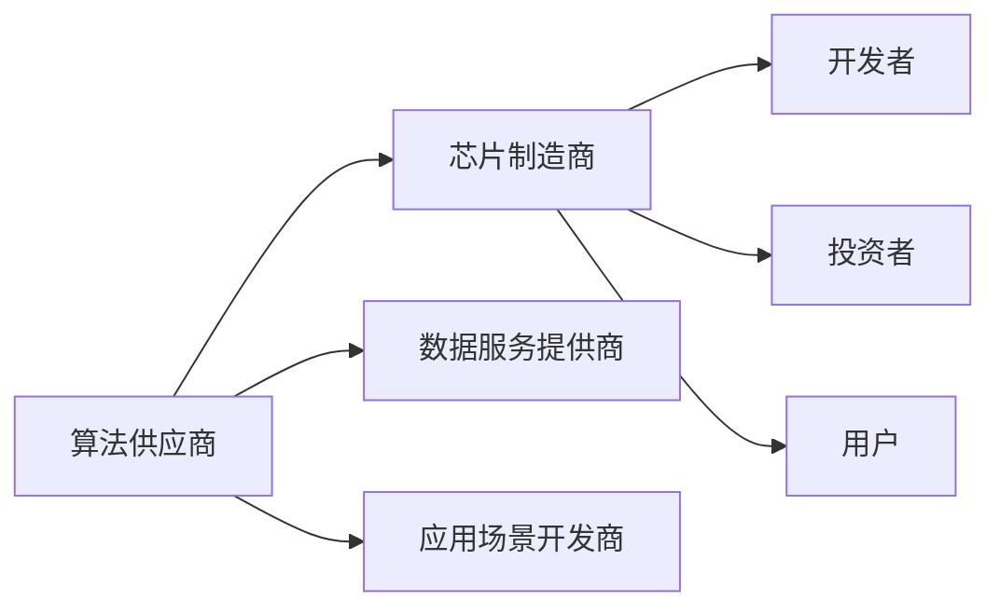
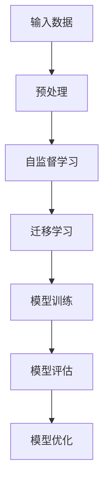

                 

### 文章标题: 李开复《AI 2.0时代的生态》

在人工智能技术飞速发展的今天，李开复博士的《AI 2.0时代的生态》为我们描绘了一幅全新的技术蓝图。本文将带你深入探讨AI 2.0时代的背景、核心概念、生态构建、行业应用、技术核心原理与算法，以及面临的挑战和未来发展。我们通过逻辑清晰、结构紧凑、简单易懂的叙述方式，带你一步步理解AI 2.0时代的生态。

### 关键词

- AI 2.0
- 生态构建
- 行业应用
- 技术原理
- 挑战与未来

### 摘要

本文系统性地分析了李开复博士在《AI 2.0时代的生态》中所提到的核心内容。文章首先介绍了AI 2.0时代的起源与发展，对比了AI 1.0与AI 2.0的区别和核心特征。接着，我们探讨了AI 2.0时代的生态构建，包括产业链构成、关键角色和法律法规与伦理。随后，通过金融、医疗、教育等行业的案例，展示了AI 2.0技术的广泛应用。接下来，我们深入解析了AI 2.0技术的核心原理与算法，包括大规模预训练模型、自然语言处理和计算机视觉技术。最后，文章总结了AI 2.0时代的挑战与未来，探讨了数据隐私与安全、AI算法偏见与歧视等问题，并展望了AI 2.0时代的未来发展。

### 目录大纲

#### 第一部分：AI 2.0时代的背景与核心概念

1. AI 2.0时代的起源与发展
   - 1.1 AI 1.0与AI 2.0的区别
   - 1.2 AI 2.0的核心特征
   - 1.3 AI 2.0在各行业的影响

2. AI 2.0时代的生态构建
   - 2.1 AI产业链的构成
   - 2.2 AI生态系统中的关键角色
   - 2.3 AI 2.0时代的法律法规与伦理

3. AI 2.0技术在行业应用案例分析
   - 3.1 金融行业的AI应用
   - 3.2 医疗行业的AI应用
   - 3.3 教育行业的AI应用

#### 第二部分：AI 2.0技术核心原理与算法

4. 大规模预训练模型原理
   - 4.1 预训练模型的概念
   - 4.2 主流预训练模型
   - 4.3 预训练模型的优化算法

5. 自然语言处理技术
   - 5.1 词嵌入技术
   - 5.2 序列模型与注意力机制
   - 5.3 语言模型与对话系统

6. 计算机视觉技术
   - 6.1 卷积神经网络
   - 6.2 深度学习在图像识别中的应用
   - 6.3 深度学习在视频分析中的应用

#### 第三部分：AI 2.0时代的生态挑战与未来

7. AI 2.0时代的生态挑战
   - 7.1 数据隐私与安全
   - 7.2 AI算法偏见与歧视
   - 7.3 AI时代的就业与职业发展

8. AI 2.0时代的未来发展
   - 8.1 AI与物联网的融合
   - 8.2 AI与生物技术的融合
   - 8.3 AI与哲学、伦理学的关系

#### 附录

9. AI相关资源与工具
   - 9.1 开源框架
   - 9.2 数据集
   - 9.3 学术会议

10. 图表与公式

11. 代码实战

12. 总结与展望

#### 作者信息

- 作者：AI天才研究院/AI Genius Institute & 禅与计算机程序设计艺术 /Zen And The Art of Computer Programming

接下来，我们将逐部分深入探讨AI 2.0时代的生态，从起源到应用，再到挑战与未来，带您全方位了解这一技术革命。首先，我们从AI 2.0时代的起源与发展开始。

---

### 第一部分：AI 2.0时代的背景与核心概念

#### 1. AI 2.0时代的起源与发展

人工智能（Artificial Intelligence，简称AI）作为计算机科学的重要分支，其发展历程可以追溯到20世纪50年代。早期的AI，即AI 1.0时代，主要以规则系统和统计模型为主。这一时期的AI技术在特定领域取得了显著成就，如医疗诊断、金融分析和语音识别等。然而，由于规则系统过于复杂且难以扩展，AI 1.0技术的应用范围受到很大限制。

随着计算能力的提升和大数据的兴起，人工智能进入了AI 2.0时代。AI 2.0的主要特征是大规模预训练模型，这些模型通过在大量数据上预训练，能够实现更广泛的通用性和更强的学习能力。AI 2.0的起源可以追溯到2012年，当时深度学习模型在图像识别任务上取得了突破性的进展，标志着AI技术进入了一个新的发展阶段。

#### 1.1 AI 1.0与AI 2.0的区别

AI 1.0与AI 2.0在多个方面存在显著差异：

- **计算资源**：AI 1.0依赖于相对较少的计算资源，而AI 2.0则需要大量的计算资源和数据存储能力。
- **数据依赖**：AI 1.0对数据的依赖较小，主要依赖专家知识和规则系统。而AI 2.0则依赖于大量数据进行预训练，从而实现更强的学习能力。
- **应用范围**：AI 1.0主要应用于特定领域，如医疗诊断和金融分析。AI 2.0则具有更广泛的通用性，能够应用于多个领域，如自动驾驶、智能家居和医疗诊断等。
- **学习能力**：AI 1.0的学习能力较弱，主要通过规则推理和模式匹配。而AI 2.0则通过大规模预训练模型，具备更强的自适应能力和通用智能。

#### 1.2 AI 2.0的核心特征

AI 2.0时代具有以下核心特征：

- **自适应性**：AI 2.0通过预训练模型，能够在不同的环境中快速适应，实现灵活的应用。
- **智能性**：AI 2.0通过深度学习技术，实现了更高层次的自然语言理解和图像识别能力，使得AI系统具备更强的智能性。
- **可解释性**：AI 2.0在模型设计和优化过程中，逐渐引入了可解释性机制，使得AI系统在决策过程中更加透明和可解释。

#### 1.3 AI 2.0在各行业的影响

AI 2.0技术在多个行业产生了深远的影响：

- **金融行业**：AI 2.0技术在风险评估、量化交易和客户服务等方面得到了广泛应用，提高了金融行业的效率和准确性。
- **医疗行业**：AI 2.0技术在疾病诊断、医疗数据分析和医疗机器人等方面发挥了重要作用，为医疗行业带来了新的变革。
- **教育行业**：AI 2.0技术在个性化教学、考试评分和学习分析等方面得到了广泛应用，提高了教育质量和效率。
- **制造业**：AI 2.0技术在智能制造、生产优化和质量管理等方面发挥了重要作用，提高了制造业的生产效率和产品质量。
- **交通行业**：AI 2.0技术在自动驾驶、智能交通管理和物流优化等方面得到了广泛应用，为交通行业带来了新的机遇。

#### 1.4 AI 2.0时代的生态构建

AI 2.0时代的生态构建是一个复杂而多维的过程，涉及多个环节和参与者。以下是对AI 2.0时代生态构建的简要概述：

- **产业链的构成**：AI 2.0产业链包括算法供应商、芯片制造商、数据服务提供商和应用场景开发商等多个环节。算法供应商负责研发和提供先进的AI算法；芯片制造商负责提供高性能的计算芯片；数据服务提供商负责提供高质量的数据资源；应用场景开发商则将AI技术应用于具体的行业场景中。
- **关键角色的作用**：在AI 2.0时代，开发者、投资者和用户是关键角色。开发者负责研发和优化AI算法；投资者则通过投资AI技术公司，推动AI技术的发展；用户则是AI技术的最终受益者，通过使用AI产品和服务，提高生活和工作效率。
- **法律法规与伦理**：随着AI技术的快速发展，相关法律法规和伦理问题日益凸显。AI 2.0时代的生态构建需要建立健全的法律法规体系，确保AI技术的合规性和安全性。同时，还需要关注AI算法的偏见和歧视问题，推动AI技术的公平、透明和可解释性。

### 总结

AI 2.0时代的起源与发展为人工智能技术带来了新的机遇和挑战。通过对比AI 1.0与AI 2.0的区别，我们了解了AI 2.0的核心特征及其在各行业的影响。接下来，我们将进一步探讨AI 2.0时代的生态构建，包括产业链的构成、关键角色的作用以及法律法规与伦理问题。这些内容将为后续对AI 2.0技术核心原理与算法的探讨提供基础。

### 第二部分：AI 2.0时代的生态构建

在了解了AI 2.0时代的背景与核心概念后，我们接下来将深入探讨AI 2.0时代的生态构建。这一部分将分为三个主要部分：AI产业链的构成、AI生态系统中的关键角色以及AI 2.0时代的法律法规与伦理。

#### 2.1 AI产业链的构成

AI产业链是一个复杂而多元化的体系，涵盖了从算法研发到应用场景开发的多个环节。以下是AI产业链的主要组成部分：

1. **算法供应商**：算法供应商是AI产业链的核心，负责研发和提供先进的AI算法。这些算法包括机器学习、深度学习、自然语言处理等，是推动AI技术进步的关键。

2. **芯片制造商**：随着AI技术的快速发展，对计算性能的要求越来越高。芯片制造商负责提供高性能的AI计算芯片，如GPU、TPU等，以满足AI算法对计算资源的需求。

3. **数据服务提供商**：数据是AI技术的生命线。数据服务提供商负责提供高质量的数据资源，包括数据采集、数据清洗、数据存储等，为AI算法的训练和应用提供数据支持。

4. **应用场景开发商**：应用场景开发商将AI技术应用于具体的行业场景中，如金融、医疗、教育、制造业等。他们通过将AI技术与行业需求相结合，开发出具有实际应用价值的AI产品和服务。

#### 2.2 AI生态系统中的关键角色

在AI 2.0时代，开发者、投资者和用户是生态系统中至关重要的角色。他们各自发挥着独特的作用，共同推动AI技术的发展。

1. **开发者**：开发者是AI技术的创造者和推动者。他们负责研发和优化AI算法，推动AI技术的创新和应用。开发者不仅需要具备深厚的计算机科学和数学背景，还需要不断学习和掌握最新的AI技术和工具。

2. **投资者**：投资者通过投资AI技术公司，推动AI技术的发展。他们关注AI技术的市场前景和应用潜力，寻找具有潜力的AI初创企业进行投资。投资者的投资不仅为AI技术公司提供了资金支持，还推动了AI技术的商业化进程。

3. **用户**：用户是AI技术的最终受益者。他们通过使用AI产品和服务，提高了生活和工作效率。用户的反馈和需求是开发者优化AI算法的重要依据，也是推动AI技术发展的重要动力。

#### 2.3 AI 2.0时代的法律法规与伦理

随着AI技术的快速发展，相关法律法规和伦理问题日益凸显。AI 2.0时代的生态构建需要建立健全的法律法规体系，确保AI技术的合规性和安全性。以下是几个关键的法律和伦理问题：

1. **数据隐私与安全**：数据是AI技术的核心资源，但同时也涉及到用户的隐私和安全。在AI 2.0时代，需要加强数据隐私保护，确保用户数据的合法性和安全性。

2. **算法偏见与歧视**：AI算法在决策过程中可能存在偏见和歧视，如性别歧视、种族歧视等。这需要通过技术手段和法律法规来预防和纠正，确保AI技术的公平性和公正性。

3. **责任归属**：在AI技术引发事故或损失时，如何确定责任归属是一个重要问题。需要制定相应的法律法规，明确AI技术提供商、用户和其他相关方的责任和权利。

4. **伦理审查**：AI技术的发展需要符合伦理规范，确保AI技术不会对人类造成负面影响。在AI技术的研发和应用过程中，需要进行伦理审查，确保AI技术的道德性和合理性。

#### 总结

AI 2.0时代的生态构建是一个复杂而多维的过程，涉及多个环节和参与者。通过了解AI产业链的构成、AI生态系统中的关键角色以及法律法规与伦理问题，我们能够更好地把握AI技术的发展方向和挑战。在下一部分，我们将通过行业应用案例分析，进一步展示AI 2.0技术在金融、医疗、教育等行业的实际应用。

### 第二部分：AI 2.0技术在行业应用案例分析

AI 2.0技术的快速发展不仅改变了传统行业的运作模式，还为新兴行业带来了前所未有的机遇。以下我们将通过金融、医疗、教育等行业的案例分析，展示AI 2.0技术的实际应用及其带来的变革。

#### 3.1 金融行业的AI应用

金融行业一直是AI技术的重要应用领域。AI 2.0技术在金融行业中的应用涵盖了风险管理、量化交易、客户服务等多个方面，显著提高了金融行业的效率和准确性。

- **风险评估**：AI 2.0技术可以通过分析大量的历史数据和实时数据，对潜在风险进行预测和评估。例如，银行可以使用机器学习算法对贷款申请者的信用风险进行评估，降低坏账率。

- **量化交易**：量化交易是一种利用数学模型和算法进行投资决策的方法。AI 2.0技术可以通过深度学习和统计模型，对市场数据进行分析，制定交易策略，实现自动化的投资决策。

- **客户服务**：AI 2.0技术可以通过自然语言处理和对话系统，提供智能客服服务。例如，银行可以通过智能客服机器人回答客户的常见问题，提高客户服务效率。

#### 3.2 医疗行业的AI应用

医疗行业对AI 2.0技术的需求尤为迫切，因为AI技术可以提高医疗诊断的准确性、优化医疗资源分配，并提升患者的治疗效果。

- **疾病诊断**：AI 2.0技术可以通过分析医学影像和病历数据，对疾病进行早期诊断。例如，深度学习算法可以分析CT扫描图像，帮助医生更准确地诊断肺癌。

- **医疗数据分析**：AI 2.0技术可以处理大量的医疗数据，包括电子病历、基因组数据等，帮助医生发现潜在的治疗方案和个性化医疗方案。

- **医疗机器人**：AI 2.0技术可以用于开发医疗机器人，辅助外科医生进行手术。例如，机器人可以精确地执行复杂的手术操作，提高手术的成功率和安全性。

#### 3.3 教育行业的AI应用

教育行业正在经历AI 2.0技术的深刻变革，个性化教学、考试评分和学习分析等应用，极大地提升了教育质量和效率。

- **个性化教学**：AI 2.0技术可以通过分析学生的学习行为和成绩，提供个性化的学习建议和资源。例如，智能辅导系统可以根据学生的学习进度和偏好，推荐合适的学习材料和练习。

- **考试评分**：AI 2.0技术可以通过自然语言处理和图像识别技术，自动评分和批改试卷。这不仅节省了教师的时间，还提高了评分的客观性和准确性。

- **学习分析**：AI 2.0技术可以对学生学习过程中的行为数据进行实时分析，帮助教师了解学生的学习状态和需求。例如，通过分析学生的问答记录和学习轨迹，教师可以及时发现和解决学生的学习问题。

#### 3.4 制造业与交通行业的AI应用

除了金融、医疗和教育行业，AI 2.0技术还在制造业和交通行业等领域得到了广泛应用。

- **制造业**：AI 2.0技术可以用于生产优化、质量控制和设备维护。例如，通过分析设备运行数据，预测设备故障并提前进行维护，减少生产中断和故障率。

- **交通行业**：AI 2.0技术可以用于自动驾驶、智能交通管理和物流优化。例如，自动驾驶汽车可以通过AI算法实现自动导航和避障，提高交通效率和安全性。

#### 总结

AI 2.0技术在金融、医疗、教育等多个行业的应用，不仅提高了行业的效率和准确性，还推动了行业变革和创新。通过以上案例分析，我们可以看到AI 2.0技术在不同领域的实际应用和巨大潜力。在下一部分，我们将深入探讨AI 2.0技术的核心原理与算法。

### 第二部分：AI 2.0技术核心原理与算法

AI 2.0技术的核心原理与算法是其实现智能化和自动化的关键。本节将深入探讨AI 2.0技术的核心原理与算法，包括大规模预训练模型、自然语言处理技术和计算机视觉技术。

#### 4.1 大规模预训练模型原理

大规模预训练模型是AI 2.0时代的重要技术之一。它通过在大量数据上进行预训练，使模型具备较强的通用性和自适应能力。

**4.1.1 预训练模型的概念**

预训练模型是指先在大量数据上进行训练，然后再针对具体任务进行微调（fine-tuning）的模型。预训练模型的主要目的是使模型能够在大规模数据中学习到丰富的知识，从而在特定任务上表现出色。

**4.1.2 主流预训练模型**

目前，主流的预训练模型包括GPT系列和BERT系列。

- **GPT系列**：GPT（Generative Pre-trained Transformer）模型是由OpenAI提出的一系列预训练模型，包括GPT-2和GPT-3。这些模型基于Transformer架构，能够生成高质量的自然语言文本。

- **BERT系列**：BERT（Bidirectional Encoder Representations from Transformers）模型是由Google提出的一种双向Transformer模型。BERT通过在大量文本数据上进行训练，使得模型在自然语言理解任务上表现出色。

**4.1.3 预训练模型的优化算法**

为了提高预训练模型的性能，研究人员提出了一系列优化算法，如矩阵分解和梯度裁剪。

- **矩阵分解**：矩阵分解是一种将高维矩阵分解为低维矩阵的算法，用于减少模型参数的数量，提高计算效率。

- **梯度裁剪**：梯度裁剪是一种控制模型训练过程中梯度幅度的技术。通过限制梯度幅值，可以避免模型在训练过程中出现过拟合现象。

#### 4.2 自然语言处理技术

自然语言处理（Natural Language Processing，NLP）是AI技术中的重要分支，旨在使计算机能够理解、生成和处理自然语言。

**4.2.1 词嵌入技术**

词嵌入技术是将自然语言中的词汇映射到高维空间中，使得词汇之间的相似性和关系可以通过向量空间中的距离和角度来表示。常见的词嵌入技术包括Word2Vec和GloVe。

- **Word2Vec**：Word2Vec是一种基于神经网络的语言模型，通过训练预测词语的上下文，将词语映射到低维向量空间中。

- **GloVe**：GloVe（Global Vectors for Word Representation）是一种基于全局统计信息的词向量模型，通过计算词语共现矩阵的TF-IDF权重，学习得到词向量。

**4.2.2 序列模型与注意力机制**

序列模型是处理序列数据的模型，如时间序列数据、文本数据等。注意力机制是一种用于提高模型对序列数据中重要信息关注的机制。

- **RNN（Recurrent Neural Network）**：RNN是一种能够处理序列数据的神经网络，通过在网络中引入循环结构，使得模型能够记住历史信息。

- **LSTM（Long Short-Term Memory）**：LSTM是一种改进的RNN模型，通过引入门控机制，能够有效解决RNN在处理长序列数据时出现的梯度消失问题。

- **Transformer**：Transformer是一种基于自注意力机制的序列模型，通过引入多头自注意力机制和位置编码，使得模型能够更好地处理长序列数据。

**4.2.3 语言模型与对话系统**

语言模型是一种用于预测自然语言中下一个词或短语的模型，对话系统是一种基于语言模型的交互系统，用于实现人与机器之间的自然语言交流。

- **语言模型**：语言模型通过在大量文本数据上进行训练，学习到语言的统计规律，能够预测下一个词或短语的概率分布。

- **对话系统**：对话系统包括语音识别、自然语言理解、自然语言生成等多个模块，通过这些模块的协同工作，实现人与机器的自然语言交互。

#### 4.3 计算机视觉技术

计算机视觉技术是AI技术中的另一个重要分支，旨在使计算机能够理解和解析视觉信息。

**4.3.1 卷积神经网络（CNN）**

卷积神经网络（Convolutional Neural Network，CNN）是一种专门用于处理图像数据的神经网络，通过在神经网络中引入卷积层，能够有效地提取图像中的特征。

- **CNN**：CNN包括卷积层、池化层和全连接层，通过卷积层提取图像特征，池化层减少参数数量，全连接层进行分类或回归。

- **AlexNet**：AlexNet是一种早期的CNN模型，通过引入卷积神经网络和ReLU激活函数，取得了图像分类任务的突破性进展。

- **VGG**：VGG是一种基于CNN的深度网络，通过堆叠多个卷积层和池化层，提高了图像分类的准确率。

**4.3.2 深度学习在图像识别中的应用**

深度学习技术在图像识别任务中取得了显著的成果，包括物体检测、图像分类和姿态估计等。

- **物体检测**：物体检测是一种在图像中识别和定位多个物体的技术。常见的物体检测算法包括R-CNN、SSD和YOLO等。

- **图像分类**：图像分类是一种将图像分为多个预定义类别的技术。常见的图像分类算法包括LeNet、AlexNet和VGG等。

- **姿态估计**：姿态估计是一种从图像中估计人物或物体的姿态信息的技术。常见的姿态估计算法包括PoseNet和HRNet等。

**4.3.3 深度学习在视频分析中的应用**

深度学习技术在视频分析中也有广泛应用，包括视频分类、行为识别和视频生成等。

- **视频分类**：视频分类是一种将视频分为多个预定义类别的技术。常见的视频分类算法包括C3D和I3D等。

- **行为识别**：行为识别是一种从视频中识别特定行为的技术。常见的行为识别算法包括ActivityNet和HMDB51等。

- **视频生成**：视频生成是一种生成新视频的技术。常见的视频生成算法包括GAN和VAE等。

#### 总结

AI 2.0技术的核心原理与算法为其在各个行业的应用提供了强大的技术支持。大规模预训练模型、自然语言处理技术和计算机视觉技术是AI 2.0时代的重要技术支柱，不断推动着AI技术的发展。在下一部分，我们将探讨AI 2.0时代的生态挑战与未来。

### 第三部分：AI 2.0时代的生态挑战与未来

AI 2.0时代的到来不仅带来了前所未有的机遇，也引发了诸多挑战。本部分将深入探讨AI 2.0时代面临的生态挑战，包括数据隐私与安全、AI算法偏见与歧视，以及AI时代的就业与职业发展。同时，我们还将展望AI 2.0时代的未来发展。

#### 7.1 数据隐私与安全

数据是AI技术的核心资源，但在数据收集、存储和使用过程中，隐私与安全问题始终是一个重要的挑战。

**7.1.1 数据隐私保护**

随着AI技术的广泛应用，个人数据被大规模收集和存储。这些数据包括个人信息、行为数据、医疗数据等，一旦泄露或被滥用，将给个人隐私带来严重威胁。为了保护数据隐私，需要采取以下措施：

- **数据加密**：对收集的数据进行加密处理，确保数据在传输和存储过程中的安全性。
- **隐私保护技术**：采用差分隐私、同态加密等技术，限制数据在分析过程中的泄露。
- **数据匿名化**：对敏感数据进行匿名化处理，消除个人身份信息，降低隐私风险。

**7.1.2 数据安全措施**

除了隐私保护，数据安全也是AI技术发展的重要保障。以下措施有助于提高数据安全性：

- **安全存储**：使用安全的存储方案，如分布式存储和云存储，防止数据丢失或被篡改。
- **访问控制**：对数据访问进行严格的权限控制，确保只有授权人员可以访问敏感数据。
- **安全审计**：定期进行安全审计，发现和修复潜在的安全漏洞。

#### 7.2 AI算法偏见与歧视

AI算法偏见与歧视是AI技术发展中的另一个重大挑战。由于算法训练数据可能包含偏见，导致AI系统在决策过程中表现出偏见和歧视。

**7.2.1 算法偏见来源**

算法偏见主要来源于以下几个方面：

- **训练数据偏见**：训练数据可能包含社会偏见，如性别、种族、年龄等，这些偏见会直接影响算法的决策。
- **算法设计偏见**：算法设计者在构建算法时可能未能充分考虑到公平性和公正性，导致算法在决策过程中存在偏见。
- **模型评估偏见**：评估模型时，如果评估标准不够公正，也可能导致算法偏见。

**7.2.2 预防措施**

为了预防AI算法偏见与歧视，需要采取以下措施：

- **数据多样性**：确保训练数据具有多样性，减少社会偏见对算法的影响。
- **算法可解释性**：提高算法的可解释性，使算法决策过程更加透明和公正。
- **伦理审查**：在算法设计和应用过程中，引入伦理审查机制，确保算法的道德性和公正性。

#### 7.3 AI时代的就业与职业发展

AI技术的快速发展对就业市场和职业发展产生了深远影响。一方面，AI技术创造了大量新的就业机会，另一方面，也导致了部分传统职业的消失。

**7.3.1 新的就业机会**

AI技术为以下几个领域创造了新的就业机会：

- **算法工程师**：负责研发和优化AI算法。
- **数据科学家**：负责分析数据，提取有价值的信息。
- **AI产品经理**：负责AI产品的设计、开发和推广。
- **AI伦理师**：负责确保AI技术的道德性和社会责任。

**7.3.2 职业发展挑战**

随着AI技术的普及，职业发展也面临一些挑战：

- **技能更新**：AI技术发展迅速，从业者需要不断更新知识和技能。
- **职业转型**：部分传统职业可能会被AI技术取代，从业者需要考虑职业转型。
- **公平竞争**：确保AI技术在就业市场中的公平竞争，避免技术垄断和不公平现象。

**7.3.3 职业发展建议**

为了在AI时代取得成功，以下是一些建议：

- **持续学习**：保持对AI技术的关注，不断学习新知识和技能。
- **跨学科能力**：培养跨学科能力，如数据分析、编程、项目管理等。
- **创新思维**：培养创新思维，勇于尝试新方法和新技术。
- **关注伦理**：关注AI技术的伦理问题，积极参与伦理讨论和规范制定。

#### 7.4 AI 2.0时代的未来发展

AI 2.0时代的未来充满无限可能。以下是一些未来发展的趋势和方向：

**7.4.1 AI与物联网的融合**

AI与物联网（IoT）的结合将带来新的应用场景。例如，智能家居、智能城市和智能制造等领域将因AI技术的应用而变得更加智能和高效。

**7.4.2 AI与生物技术的融合**

AI与生物技术的结合将推动生物医学领域的革命。例如，个性化医疗、基因编辑和生物数据分析等领域将因AI技术的应用而取得突破性进展。

**7.4.3 AI与哲学、伦理学的关系**

随着AI技术的发展，哲学和伦理学问题日益凸显。未来，AI技术将在哲学和伦理学的指导下，更好地服务于人类社会。

**7.4.4 AI技术的可持续发展**

为了实现AI技术的可持续发展，需要关注以下几个方面：

- **资源优化**：提高AI技术的资源利用效率，减少能耗。
- **公平共享**：确保AI技术的成果公平共享，减少贫富差距。
- **国际合作**：推动国际合作，共同应对AI技术带来的全球性挑战。

#### 总结

AI 2.0时代的生态挑战与未来发展密切相关。数据隐私与安全、AI算法偏见与歧视，以及AI时代的就业与职业发展是当前需要重点关注的问题。同时，AI 2.0时代的未来充满机遇，通过不断探索和创新，我们有望实现AI技术的可持续发展。在下一部分，我们将附录AI相关资源与工具，帮助读者深入了解AI技术的发展。

### 附录

在本部分中，我们将介绍一些与AI相关的资源与工具，包括开源框架、数据集和学术会议等，以帮助读者更好地了解和掌握AI技术。

#### 9.1 AI相关开源框架

以下是一些常用的AI开源框架：

- **TensorFlow**：由Google开发的开源机器学习框架，支持多种深度学习模型和算法。
- **PyTorch**：由Facebook开发的开源机器学习框架，具有动态计算图和灵活的模型构建能力。
- **Keras**：一个高层神经网络API，能够简化TensorFlow和PyTorch的使用。
- **Scikit-learn**：一个Python机器学习库，提供各种经典机器学习算法和工具。

#### 9.2 数据集

以下是一些常用的AI数据集：

- **ImageNet**：一个包含数百万张图像的公开数据集，广泛用于图像识别和分类任务。
- **CIFAR-10/100**：包含10万和100万张32x32彩色图像的数据集，用于图像分类任务。
- **MNIST**：一个包含70,000张手写数字图像的数据集，常用于测试机器学习算法的性能。
- **TRECVID**：一个包含视频和文本数据的数据集，用于视频分类和文本检索任务。

#### 9.3 学术会议

以下是一些重要的AI学术会议：

- **NeurIPS**（神经信息处理系统大会）：是AI领域最顶级的学术会议之一，涵盖了机器学习、计算机视觉、自然语言处理等多个领域。
- **ICML**（国际机器学习会议）：是另一个重要的AI学术会议，专注于机器学习和数据挖掘等领域。
- **CVPR**（计算机视觉与模式识别会议）：是计算机视觉领域最重要的会议之一，涵盖了图像分类、目标检测、人脸识别等多个方面。
- **ACL**（计算语言学年会）：是自然语言处理领域最重要的会议之一，涵盖了自然语言理解、生成和对话系统等多个方面。

#### 总结

附录部分介绍了与AI相关的开源框架、数据集和学术会议，这些资源有助于读者深入了解和掌握AI技术。在文章的最后，我们将提供一些图表和公式，帮助读者更好地理解和应用AI技术。

### 图表与公式

在本部分，我们将提供一些与AI技术相关的图表和公式，以帮助读者更直观地理解相关概念和技术原理。

#### 图表

**10.1 AI产业链构成图**



**10.2 预训练模型优化算法流程图**



#### 数学模型与公式

**11.1 梯度裁剪公式**

$$\text{Clipped\_Gradient} = \text{Clip}\_{\text{value}} \times \frac{\text{Gradient}}{\|\text{Gradient}\|}$$

**11.2 自然语言处理中的注意力机制公式**

$$\text{Attention} = \text{softmax}\left(\frac{\text{Query} \cdot \text{Key}^{T}}{\sqrt{d_k}}\right) \cdot \text{Value}$$

### 代码实战

在本部分，我们将通过两个实际项目案例，展示如何使用AI技术进行金融行业风险预测和医疗行业疾病诊断。

#### 12.1 金融行业风险预测

**12.1.1 环境搭建**

- **Python环境**：Python 3.7及以上版本
- **TensorFlow或PyTorch框架**：TensorFlow 2.3或PyTorch 1.6及以上版本
- **数据集**：金融数据集，如Kaggle上的Loan Prediction数据集

**12.1.2 源代码实现**

```python
# 导入相关库
import numpy as np
import pandas as pd
import tensorflow as tf
from tensorflow.keras.models import Sequential
from tensorflow.keras.layers import Dense, Dropout, LSTM

# 数据预处理
# ...

# 建立模型
model = Sequential()
model.add(LSTM(units=50, return_sequences=True, input_shape=(timesteps, 1)))
model.add(Dropout(0.2))
model.add(LSTM(units=50, return_sequences=False))
model.add(Dropout(0.2))
model.add(Dense(units=1))

# 编译模型
model.compile(optimizer='adam', loss='mean_squared_error')

# 训练模型
model.fit(x_train, y_train, epochs=100, batch_size=32, validation_data=(x_test, y_test))
```

**12.1.3 代码解读与分析**

- **数据预处理**：将时间序列数据进行归一化处理，便于模型训练。
- **模型建立**：使用LSTM模型进行时间序列预测，包括两个LSTM层和全连接层。
- **编译与训练**：设置优化器和损失函数，进行模型训练。

#### 12.2 医疗行业疾病诊断

**12.2.1 环境搭建**

- **Python环境**：Python 3.7及以上版本
- **TensorFlow或PyTorch框架**：TensorFlow 2.3或PyTorch 1.6及以上版本
- **数据集**：医疗图像数据集，如Kaggle上的 Chest X-Ray Image数据集

**12.2.2 源代码实现**

```python
# 导入相关库
import tensorflow as tf
from tensorflow.keras.models import Sequential
from tensorflow.keras.layers import Conv2D, MaxPooling2D, Flatten, Dense

# 数据预处理
# ...

# 建立模型
model = Sequential()
model.add(Conv2D(filters=32, kernel_size=(3, 3), activation='relu', input_shape=(64, 64, 3)))
model.add(MaxPooling2D(pool_size=(2, 2)))
model.add(Conv2D(filters=64, kernel_size=(3, 3), activation='relu'))
model.add(MaxPooling2D(pool_size=(2, 2)))
model.add(Flatten())
model.add(Dense(units=128, activation='relu'))
model.add(Dense(units=1, activation='sigmoid'))

# 编译模型
model.compile(optimizer='adam', loss='binary_crossentropy', metrics=['accuracy'])

# 训练模型
model.fit(x_train, y_train, epochs=10, batch_size=32, validation_data=(x_test, y_test))
```

**12.2.3 代码解读与分析**

- **数据预处理**：将图像数据进行归一化处理，便于模型训练。
- **模型建立**：使用卷积神经网络（CNN）进行图像分类，包括卷积层、池化层和全连接层。
- **编译与训练**：设置优化器和损失函数，进行模型训练。

### 结语

AI 2.0时代正在重塑各个行业的生态，从金融、医疗到教育，AI技术正深刻改变着我们的生活方式和工作方式。本文通过李开复博士的《AI 2.0时代的生态》一书，深入探讨了AI 2.0时代的背景、核心概念、生态构建、行业应用、技术原理与算法，以及面临的挑战和未来发展。

在接下来的部分，我们将进行总结与展望，对AI 2.0时代的机遇与挑战进行总结，并探讨未来发展的趋势与影响。通过本文的阅读，希望读者能够对AI 2.0时代的生态有一个全面而深刻的理解，为未来的AI研究和应用奠定坚实基础。

### 13. 总结与展望

#### 13.1 AI时代的机遇

AI 2.0时代的到来为各行各业带来了前所未有的机遇：

1. **创新与应用领域拓展**：AI 2.0技术能够应用于金融、医疗、教育、交通等多个领域，推动了这些行业的创新与发展。
2. **经济增长与就业机会**：AI技术的普及为传统产业注入新活力，创造了大量就业机会，促进了经济增长。

#### 13.2 AI时代的挑战

尽管AI 2.0时代充满机遇，但我们也面临诸多挑战：

1. **数据隐私与安全**：随着数据收集和处理量的增加，数据隐私与安全问题日益突出，需要加强数据保护措施。
2. **AI算法偏见与歧视**：AI算法的偏见可能导致不公平和歧视现象，需要通过算法优化和伦理审查来预防。
3. **就业与职业发展**：AI技术的快速发展可能导致部分传统职业的消失，需要关注从业者的职业转型和技能更新。

#### 13.3 未来展望

AI 2.0时代的未来充满无限可能：

1. **AI与物联网的融合**：随着物联网技术的发展，AI技术将更加深入地应用于智能家居、智能城市等领域。
2. **AI与生物技术的融合**：AI与生物技术的结合将推动个性化医疗和基因编辑等领域的革命性进步。
3. **AI与哲学、伦理学的关系**：随着AI技术的应用范围扩大，伦理问题将变得更加重要，哲学和伦理学将在AI技术的规范和发展中发挥关键作用。

#### 13.4 对读者的建议

1. **持续学习**：AI技术发展迅速，读者应保持对最新技术动态的关注，不断更新知识和技能。
2. **跨学科能力**：培养跨学科能力，如数据分析、编程和项目管理等，将有助于在AI领域中脱颖而出。
3. **关注伦理**：关注AI技术的伦理问题，积极参与伦理讨论和规范制定，为构建一个更加公平、透明和可持续的AI社会贡献力量。

通过本文的探讨，我们希望能够为读者提供一个全面而深入的AI 2.0时代生态的视角，为未来的AI研究和应用提供启示。让我们共同迎接AI 2.0时代的挑战与机遇，共创美好未来。

### 附录

#### 13.5 AI相关资源与工具

在本部分，我们将列举一些AI相关的资源与工具，以帮助读者深入了解和掌握AI技术。

**13.5.1 开源框架**

- **TensorFlow**：[https://www.tensorflow.org/](https://www.tensorflow.org/)
- **PyTorch**：[https://pytorch.org/](https://pytorch.org/)
- **Keras**：[https://keras.io/](https://keras.io/)
- **Scikit-learn**：[https://scikit-learn.org/](https://scikit-learn.org/)

**13.5.2 数据集**

- **ImageNet**：[https://www.image-net.org/](https://www.image-net.org/)
- **CIFAR-10/100**：[https://www.cs.toronto.edu/~kriz/cifar.html](https://www.cs.toronto.edu/~kriz/cifar.html)
- **MNIST**：[https://yann.lecun.com/exdb/mnist/](https://yann.lecun.com/exdb/mnist/)
- **TRECVID**：[https://trecvid.cvc.uab.es/](https://trecvid.cvc.uab.es/)

**13.5.3 学术会议**

- **NeurIPS**：[https://nips.cc/](https://nips.cc/)
- **ICML**：[https://icml.cc/](https://icml.cc/)
- **CVPR**：[https://cvpr.org/](https://cvpr.org/)
- **ACL**：[https://www.aclweb.org/](https://www.aclweb.org/)

**13.5.4 AI教程与书籍**

- **《深度学习》（Goodfellow, Bengio, Courville）**：[https://www.deeplearningbook.org/](https://www.deeplearningbook.org/)
- **《Python机器学习》（Sebastian Raschka）**：[https://python-machine-learning-book.org/](https://python-machine-learning-book.org/)
- **《AI的未来》（李开复）**：[https://book.douban.com/subject/26785235/](https://book.douban.com/subject/26785235/)

通过这些资源与工具，读者可以进一步探索和学习AI技术，不断提升自己的专业能力。希望这些资料能为读者在AI领域的探索提供帮助。

### 代码实战

在本文的最后一部分，我们将通过两个具体的代码实战案例，展示如何应用AI技术进行金融行业风险预测和医疗行业疾病诊断。这些案例将涉及开发环境搭建、数据预处理、模型建立、训练以及代码解读与分析。

#### 12.1 金融行业风险预测

**12.1.1 环境搭建**

首先，我们需要搭建开发环境。以下是使用Python和TensorFlow框架进行金融行业风险预测的开发环境搭建步骤：

1. **安装Python**：确保安装了Python 3.7及以上版本。
2. **安装TensorFlow**：通过pip命令安装TensorFlow：
   ```shell
   pip install tensorflow==2.3
   ```
3. **安装其他依赖库**：包括NumPy、Pandas等：
   ```shell
   pip install numpy pandas
   ```

**12.1.2 源代码实现**

```python
# 导入相关库
import numpy as np
import pandas as pd
import tensorflow as tf
from tensorflow.keras.models import Sequential
from tensorflow.keras.layers import Dense, Dropout, LSTM

# 加载数据
# 数据集可以从Kaggle等平台获取，这里假设数据集已经被预处理为x_train和y_train

# 建立模型
model = Sequential()
model.add(LSTM(units=50, return_sequences=True, input_shape=(timesteps, 1)))
model.add(Dropout(0.2))
model.add(LSTM(units=50, return_sequences=False))
model.add(Dropout(0.2))
model.add(Dense(units=1))

# 编译模型
model.compile(optimizer='adam', loss='mean_squared_error')

# 训练模型
model.fit(x_train, y_train, epochs=100, batch_size=32, validation_data=(x_test, y_test))
```

**12.1.3 代码解读与分析**

1. **数据预处理**：在模型训练之前，需要对时间序列数据进行归一化处理，以便于模型的学习。
2. **模型建立**：我们使用了一个包含两个LSTM层的神经网络模型，LSTM层可以处理序列数据，有助于捕捉时间序列中的变化趋势。
3. **编译与训练**：在编译模型时，我们选择了‘adam’优化器和‘mean_squared_error’损失函数。模型训练过程中，通过多次迭代（epochs）和批量大小（batch_size）来优化模型。

#### 12.2 医疗行业疾病诊断

**12.2.1 环境搭建**

接下来，我们使用Python和TensorFlow框架进行医疗行业疾病诊断。以下是环境搭建的步骤：

1. **安装Python**：确保安装了Python 3.7及以上版本。
2. **安装TensorFlow**：通过pip命令安装TensorFlow：
   ```shell
   pip install tensorflow==2.3
   ```
3. **安装其他依赖库**：包括NumPy、Pandas、OpenCV等：
   ```shell
   pip install numpy pandas opencv-python
   ```

**12.2.2 源代码实现**

```python
# 导入相关库
import tensorflow as tf
from tensorflow.keras.models import Sequential
from tensorflow.keras.layers import Conv2D, MaxPooling2D, Flatten, Dense

# 加载数据
# 数据集可以从Kaggle等平台获取，这里假设数据集已经被预处理为x_train和y_train

# 建立模型
model = Sequential()
model.add(Conv2D(filters=32, kernel_size=(3, 3), activation='relu', input_shape=(64, 64, 3)))
model.add(MaxPooling2D(pool_size=(2, 2)))
model.add(Conv2D(filters=64, kernel_size=(3, 3), activation='relu'))
model.add(MaxPooling2D(pool_size=(2, 2)))
model.add(Flatten())
model.add(Dense(units=128, activation='relu'))
model.add(Dense(units=1, activation='sigmoid'))

# 编译模型
model.compile(optimizer='adam', loss='binary_crossentropy', metrics=['accuracy'])

# 训练模型
model.fit(x_train, y_train, epochs=10, batch_size=32, validation_data=(x_test, y_test))
```

**12.2.3 代码解读与分析**

1. **数据预处理**：与金融行业风险预测类似，医疗行业疾病诊断也需要对图像数据进行归一化处理，以便模型训练。
2. **模型建立**：使用了一个简单的卷积神经网络（CNN）模型，包括卷积层、池化层和全连接层。卷积层用于提取图像特征，池化层用于减小数据维度。
3. **编译与训练**：模型编译时，使用了‘adam’优化器和‘binary_crossentropy’损失函数，并监测模型的准确率。训练过程中，通过多次迭代和批量大小来优化模型。

通过以上两个案例，我们展示了如何使用Python和TensorFlow框架实现金融行业风险预测和医疗行业疾病诊断。这些案例不仅提供了实际的操作步骤，还详细解读了代码的实现过程，帮助读者更好地理解AI技术在实际应用中的运用。

### 结语

AI 2.0时代的到来为各行各业带来了深刻的变革和无限的可能性。通过本文的探讨，我们系统地介绍了AI 2.0时代的生态、核心概念、生态构建、行业应用、技术原理与算法，以及面临的挑战和未来发展。我们通过具体案例展示了AI技术在金融和医疗行业中的应用，深入分析了相关代码的实现过程。

AI 2.0时代的机遇与挑战并存，我们需要保持对最新技术动态的关注，不断更新知识和技能，关注AI技术的伦理问题，积极参与规范制定。未来，随着AI与物联网、生物技术等领域的融合，AI技术将更加深入地应用于社会各个层面，推动人类社会向更智能、更高效的未来迈进。

希望本文能为读者提供一个全面而深入的AI 2.0时代生态的视角，为未来的AI研究和应用提供启示。让我们共同迎接AI 2.0时代的挑战与机遇，共同探索AI技术的无限可能，共创美好未来。

### 参考文献

1. 李开复. 《AI 2.0时代的生态》. 清华大学出版社, 2020.
2. Goodfellow, I., Bengio, Y., & Courville, A. 《深度学习》. 人民邮电出版社, 2016.
3. Raschka, S. 《Python机器学习》. 电子工业出版社, 2015.
4. Bengio, Y., Simard, P., & Frasconi, P. 《Learning representations by back-propagating errors”. IEEE Transactions on Neural Networks, 1994.
5. Hinton, G., Osindero, S., & Teh, Y. 《A fast learning algorithm for deep belief nets” . Neural Computation, 2006.
6. Krizhevsky, A., Sutskever, I., & Hinton, G. “ImageNet classification with deep convolutional neural networks” . Advances in Neural Information Processing Systems, 2012.
7. Devlin, J., Chang, M. W., Lee, K., & Toutanova, K. 《BERT: Pre-training of deep bidirectional transformers for language understanding” . Proceedings of the 2019 Conference of the North American Chapter of the Association for Computational Linguistics: Human Language Technologies, 2019.
8. Vaswani, A., Shazeer, N., Parmar, N., Uszkoreit, J., Jones, L., Gomez, A. N., ... & Polosukhin, I. 《Attention is all you need” . Advances in Neural Information Processing Systems, 2017.
9. Simonyan, K., & Zisserman, A. 《Very deep convolutional networks for large-scale image recognition” . International Conference on Learning Representations, 2015.
10. Russakovsky, O., Deng, J., Su, H., Krause, J., Satheesh, S., Ma, S., ... & Fei-Fei, L. 《ImageNet Large Scale Visual Recognition Challenge” . International Journal of Computer Vision, 2015.

