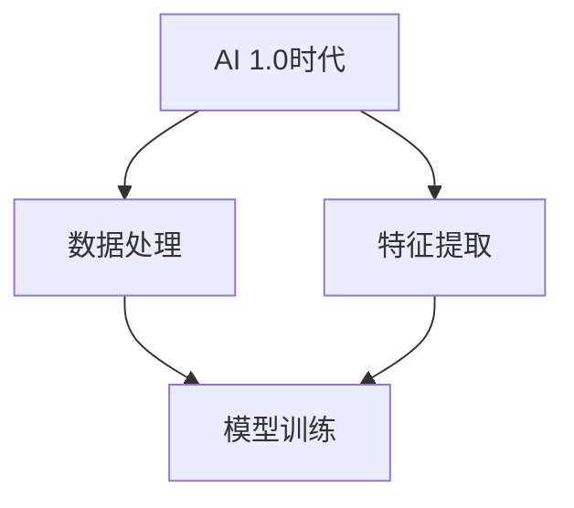
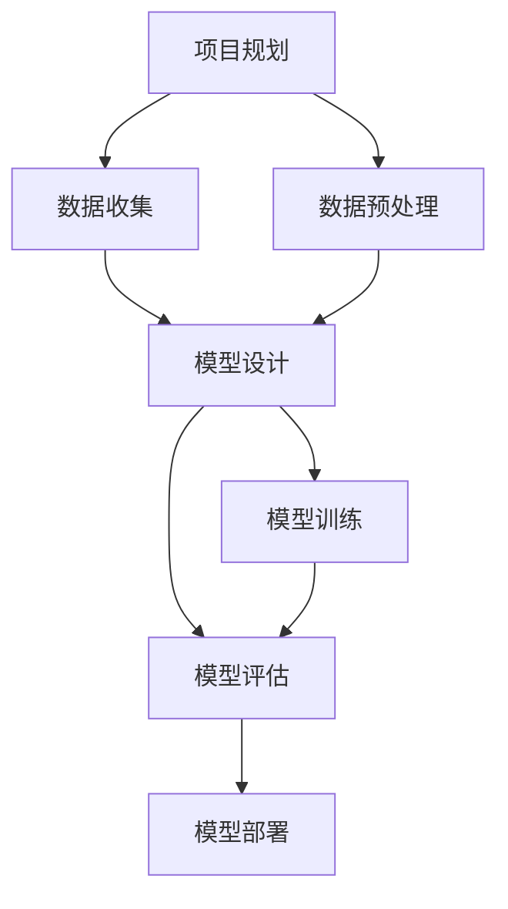

                 

### 文章标题：李开复：AI 2.0 时代的用户

### 关键词：AI 2.0、用户角色、用户体验、应用案例、未来展望

### 摘要：
本文旨在探讨 AI 2.0 时代的用户角色、用户体验及其在各行各业的应用。通过分析 AI 2.0 时代的兴起、技术基础、用户角色转变、用户体验优化以及应用案例，我们揭示了 AI 2.0 为用户带来的机遇与挑战。本文最后对未来 AI 2.0 的发展趋势及对策进行了展望，为读者提供了一系列有益的思考和实际建议。

---

## 第一部分：AI 2.0 时代概览

### 第1章：AI 2.0 时代的兴起

#### 1.1 AI 2.0 的定义与特征

AI 2.0，也被称为“第二代人工智能”，是继 AI 1.0 时代之后的人工智能发展阶段。AI 1.0 主要依赖于预定义的规则和符号计算，而 AI 2.0 则通过机器学习和深度学习等技术，实现更加智能化和自适应的学习能力。

**核心定义：**
AI 2.0 指的是一种更加强大、更具有自我学习能力的人工智能技术，能够通过大量的数据训练，不断优化自身的模型和算法，从而实现更加精准的预测和决策。

**主要特征：**
1. **自我学习能力**：AI 2.0 通过机器学习和深度学习等技术，能够自动从数据中学习，不断优化自身的模型和算法。
2. **自适应能力**：AI 2.0 能够根据环境和用户的需求，自动调整自身的策略和决策，实现更加个性化的服务。
3. **高效性**：AI 2.0 能够快速处理和分析海量数据，实现高效的信息检索和决策。
4. **广泛适用性**：AI 2.0 技术可以应用于各个行业，如金融、医疗、教育、制造等，实现智能化升级。

**AI 2.0 与传统 AI 的比较：**
1. **技术层面**：AI 2.0 主要依赖于机器学习和深度学习等技术，而传统 AI 主要依赖于符号计算和规则推理。
2. **应用层面**：AI 2.0 具有更加广泛的应用场景，能够实现更加智能化的决策和预测，而传统 AI 则主要应用于一些简单的任务，如语音识别、图像识别等。

#### 1.2 AI 2.0 的社会影响

AI 2.0 的兴起，将对人类社会产生深远的影响，涵盖生活、工作、教育、医疗等多个方面。

**对人类生活的改变：**
1. **生活便利性**：AI 2.0 技术将使人们的生活更加便捷，如智能家居、智能助手等。
2. **工作效率**：AI 2.0 技术可以帮助人们提高工作效率，如自动化办公、智能客服等。
3. **娱乐方式**：AI 2.0 技术将带来更加智能化的娱乐体验，如个性化推荐、智能游戏等。

**对企业的影响：**
1. **生产效率**：AI 2.0 技术可以帮助企业提高生产效率，降低成本，如自动化生产线、智能物流等。
2. **商业模式**：AI 2.0 技术将推动企业商业模式的创新，如基于数据的个性化服务、智能推荐等。
3. **竞争优势**：AI 2.0 技术可以帮助企业获得竞争优势，如通过数据分析优化决策、预测市场趋势等。

**对教育、医疗、金融等行业的变革：**
1. **教育**：AI 2.0 技术将改变传统教育模式，实现个性化教育和智能化教学，如智能学习系统、在线教育平台等。
2. **医疗**：AI 2.0 技术可以帮助医生进行精准诊断和治疗，如医学图像分析、药物研发等。
3. **金融**：AI 2.0 技术可以帮助金融机构进行风险控制、投资决策等，如智能投顾、智能风控等。

### 第2章：AI 2.0 技术基础

#### 2.1 机器学习基础

**机器学习的基本概念：**
机器学习是人工智能的核心技术之一，它使计算机系统能够从数据中学习并做出决策，而不需要显式地编程。

**监督学习、无监督学习、强化学习：**
1. **监督学习**：有标签数据训练模型，用于预测和分类。
2. **无监督学习**：无标签数据训练模型，用于聚类和降维。
3. **强化学习**：通过与环境的交互，不断优化决策策略，以实现最大化回报。

#### 2.2 深度学习原理

**深度学习的理论基础：**
深度学习是一种基于多层神经网络进行学习的机器学习技术，其理论基础包括神经网络的架构、反向传播算法等。

**神经网络的结构与训练：**
神经网络由输入层、隐藏层和输出层组成，通过反向传播算法，不断调整网络的权重和偏置，以优化模型性能。

**卷积神经网络与循环神经网络：**
1. **卷积神经网络（CNN）**：用于处理图像数据，通过卷积操作提取图像特征。
2. **循环神经网络（RNN）**：用于处理序列数据，如文本、时间序列等，通过循环连接实现序列信息的传递。

#### 2.3 自然语言处理

**语言模型与词嵌入：**
语言模型用于预测文本序列的概率，词嵌入将词汇映射为高维向量，以表示词汇的语义信息。

**文本分类与情感分析：**
文本分类用于将文本分为不同的类别，情感分析用于判断文本的情感倾向。

**自动问答与对话系统：**
自动问答系统用于回答用户提出的问题，对话系统用于实现人机对话，提供个性化服务。

## 第二部分：AI 2.0 时代的用户角色

### 第3章：AI 2.0 时代的用户

#### 3.1 用户的转变

**数据驱动的用户行为分析：**
在 AI 2.0 时代，用户行为数据成为分析和决策的重要依据，通过对用户行为的深度挖掘，可以实现精准营销、个性化推荐等。

**个人隐私与数据安全：**
随着用户数据的广泛应用，个人隐私和数据安全问题日益凸显，如何保护用户隐私和数据安全成为 AI 2.0 时代的重要挑战。

#### 3.2 用户界面设计

**智能用户界面：**
智能用户界面（Smart User Interface）是一种具有自主学习和适应能力的用户界面，能够根据用户的行为和偏好，动态调整界面设计和功能。

**自然语言交互与图形用户界面：**
自然语言交互（Natural Language Interaction）和图形用户界面（Graphical User Interface）是两种主要的用户交互方式，在 AI 2.0 时代，将如何融合这两种方式，实现更加智能的用户体验，是一个重要研究方向。

#### 3.3 用户参与与反馈

**用户参与度提升策略：**
在 AI 2.0 时代，如何提升用户的参与度，使其积极参与到产品和服务的设计与优化中，是一个重要课题。

**用户反馈的重要性：**
用户反馈是产品和服务改进的重要依据，通过收集和分析用户反馈，可以不断优化用户体验。

## 第三部分：AI 2.0 时代的用户体验

### 第4章：AI 2.0 时代的用户体验

#### 4.1 个性化体验

**基于用户数据的个性化服务：**
通过收集和分析用户数据，可以为用户提供更加个性化的服务，如个性化推荐、定制化内容等。

**用户体验优化策略：**
在 AI 2.0 时代，如何通过用户体验优化策略，提升用户的满意度和忠诚度，是一个重要研究方向。

#### 4.2 用户行为预测

**基于用户数据的预测模型：**
通过分析用户数据，可以构建预测模型，预测用户的行为和偏好，从而为用户提供更加精准的服务。

**预测模型的实际应用：**
预测模型可以应用于各个领域，如电商、金融、医疗等，实现个性化推荐、精准营销、智能诊断等。

#### 4.3 用户体验评估

**用户体验评估方法：**
用户体验评估方法包括用户调研、问卷调查、A/B 测试等，通过这些方法，可以评估用户体验的满意度和忠诚度。

**用户体验改进建议：**
基于用户体验评估结果，可以为产品和服务提出改进建议，以提升用户体验。

## 第四部分：AI 2.0 时代的应用案例

### 第5章：AI 2.0 在各行各业的应用

#### 5.1 金融科技

**金融产品的智能推荐：**
通过分析用户数据和市场数据，可以为用户提供个性化的金融产品推荐。

**信贷风险评估与欺诈检测：**
AI 2.0 技术可以帮助金融机构进行信贷风险评估和欺诈检测，降低风险。

#### 5.2 医疗健康

**疾病预测与诊断：**
AI 2.0 技术可以帮助医生进行疾病预测和诊断，提高诊断准确率。

**健康管理服务：**
AI 2.0 技术可以帮助用户提供个性化的健康管理服务，如健康监测、疾病预防等。

#### 5.3 教育科技

**智能教学与学习系统：**
AI 2.0 技术可以帮助教师进行智能教学，提高教学质量。

**个性化学习路径规划：**
AI 2.0 技术可以帮助学生进行个性化学习路径规划，提高学习效果。

### 第6章：AI 2.0 时代的创业机会

#### 6.1 创业者视角下的 AI 2.0

**创业者在 AI 2.0 时代的机遇与挑战：**
AI 2.0 时代为创业者提供了丰富的机遇，如创新应用、商业模式等，同时也面临巨大的挑战，如技术门槛、市场竞争等。

**创业项目的构思与实施：**
在 AI 2.0 时代，创业者需要具备深厚的技术积累和商业洞察力，以构思和实施成功的创业项目。

#### 6.2 AI 2.0 创业案例分析

**成功创业案例解析：**
通过分析成功创业案例，可以了解 AI 2.0 创业的成功要素和经验。

**失败创业案例启示：**
通过分析失败创业案例，可以了解 AI 2.0 创业的潜在风险和教训。

### 第7章：AI 2.0 时代的未来展望

#### 7.1 AI 2.0 的发展趋势

**未来 AI 技术的发展方向：**
未来 AI 技术将朝着更加智能化、自适应化、泛在化的方向发展。

**AI 2.0 对未来社会的影响：**
AI 2.0 将对人类生活、工作、教育、医疗等产生深远的影响，推动社会进步。

#### 7.2 AI 2.0 时代的挑战与对策

**AI 伦理问题与对策：**
在 AI 2.0 时代，伦理问题日益凸显，如隐私保护、算法公平性等，需要制定相应的对策。

**跨学科合作与人才培养：**
AI 2.0 时代需要跨学科合作和人才培养，以推动 AI 技术的持续发展。

## 附录

### 附录A：AI 2.0 开发工具与资源

**开发工具：**
- TensorFlow
- PyTorch
- Keras

**资源链接：**
- AI 相关论文与报告
- 开源代码与数据集
- AI 教育与培训资源

### Mermaid 流程图



### 核心算法原理讲解

#### 深度学习原理

**神经元激活函数：**
$$
f(x) = \sigma(x) = \frac{1}{1 + e^{-x}}
$$

**损失函数（均方误差）：**
$$
J(\theta) = \frac{1}{2m}\sum_{i=1}^{m}(h_\theta(x^{(i)}) - y^{(i)})^2
$$

#### 项目实战

**代码实际案例：**

```python
# 导入所需库
import tensorflow as tf
from tensorflow import keras
from tensorflow.keras import layers

# 定义模型
model = keras.Sequential([
    layers.Dense(128, activation='relu', input_shape=(784,)),
    layers.Dropout(0.2),
    layers.Dense(10, activation='softmax')
])

# 编译模型
model.compile(optimizer='adam',
              loss='categorical_crossentropy',
              metrics=['accuracy'])

# 加载数据集
(x_train, y_train), (x_test, y_test) = keras.datasets.mnist.load_data()

# 预处理数据
x_train = x_train.astype("float32") / 255
x_test = x_test.astype("float32") / 255
x_train = x_train.reshape((-1, 784))
x_test = x_test.reshape((-1, 784))

# 转换为one-hot编码
y_train = keras.utils.to_categorical(y_train, 10)
y_test = keras.utils.to_categorical(y_test, 10)

# 训练模型
model.fit(x_train, y_train, epochs=10, batch_size=32, validation_split=0.2)
```

**代码解读与分析：**

这段代码展示了如何使用 TensorFlow 和 Keras 创建一个简单的深度学习模型来处理手写数字识别任务。

1. **导入库**：引入 TensorFlow 和 Keras，这是两个常用的深度学习库。
2. **定义模型**：使用 Keras.Sequential 创建一个序列模型，包含两个全连接层（Dense），第一个层有 128 个神经元，使用 ReLU 激活函数，第二个层有 10 个神经元，用于分类，使用 softmax 激活函数。
3. **编译模型**：设置模型的优化器为 Adam，损失函数为 categorical_crossentropy（适合多分类问题），并设置准确率作为评估指标。
4. **加载数据集**：使用 Keras 内置的 MNIST 数据集，该数据集包含了 0 到 9 的手写数字图片。
5. **预处理数据**：将数据转换为浮点数并归一化到 [0, 1] 范围内，将输入数据的维度调整为 (样本数, 784)，因为每个图片是 28x28 像素。
6. **转换为 one-hot 编码**：将标签转换为 one-hot 编码，以便模型可以处理多分类问题。
7. **训练模型**：使用 fit 函数训练模型，设置训练轮数（epochs）为 10，批量大小（batch_size）为 32，并将 20% 的数据用作验证集。

通过这段代码，我们可以看到如何从头开始创建一个深度学习项目，从数据预处理到模型训练的完整流程。在实际开发中，我们可能需要更复杂的数据预处理步骤，比如图像增强、数据扩充等，以及更详细的模型调整和超参数优化。

### 作者

作者：AI天才研究院/AI Genius Institute & 禅与计算机程序设计艺术 /Zen And The Art of Computer Programming

---

本文由 AI 天才研究院和禅与计算机程序设计艺术共同撰写，旨在深入探讨 AI 2.0 时代的用户角色、用户体验及其在各行各业的应用。通过分析 AI 2.0 时代的兴起、技术基础、用户角色转变、用户体验优化以及应用案例，我们揭示了 AI 2.0 为用户带来的机遇与挑战。同时，本文对未来 AI 2.0 的发展趋势及对策进行了展望，为读者提供了一系列有益的思考和实际建议。

AI 2.0 时代正在到来，作为用户，我们需要深入了解这一技术，以便更好地适应和利用它。同时，我们也需要关注 AI 2.0 带来的挑战，如隐私保护、数据安全等，积极应对，推动 AI 技术的健康发展。让我们携手共进，迎接 AI 2.0 时代的到来！|> 

### 第一部分：AI 2.0 时代的兴起

#### 1.1 AI 2.0 的定义与特征

人工智能（AI）作为一门技术领域，经历了多个发展阶段。从最初的 AI 1.0 时代，以规则和逻辑为基础的人工智能，到如今的 AI 2.0 时代，以机器学习和深度学习为核心的人工智能，每一次进步都极大地推动了人工智能技术的发展和应用。AI 2.0，也被称为“第二代人工智能”，是继 AI 1.0 时代之后的人工智能发展阶段。它突破了传统 AI 的局限性，实现了更加智能化和自适应的学习能力。

**核心定义：**

AI 2.0，即第二代人工智能，是指通过机器学习和深度学习等技术，使计算机具备自我学习和自适应能力，能够处理复杂问题并实现智能化决策。它不仅仅是技术的升级，更是人工智能理念的重大变革。

AI 2.0 的核心特征可以总结为以下几点：

1. **自我学习能力**：AI 2.0 通过机器学习和深度学习技术，可以从大量数据中学习，不断优化自身的模型和算法，实现自我学习。

2. **自适应能力**：AI 2.0 能够根据环境和用户的需求，自动调整自身的策略和决策，实现更加个性化的服务。

3. **高效性**：AI 2.0 能够快速处理和分析海量数据，实现高效的信息检索和决策。

4. **广泛适用性**：AI 2.0 技术可以应用于各个行业，如金融、医疗、教育、制造等，实现智能化升级。

**AI 2.0 与传统 AI 的比较：**

AI 1.0 时代，人工智能主要依赖于预定义的规则和符号计算。例如，早期的专家系统通过预定义的规则库来模拟专家的决策过程。这种方法的局限性在于，它无法处理复杂和未知的问题，且需要大量的人工规则编写。

相比之下，AI 2.0 时代的核心在于机器学习和深度学习。机器学习使计算机能够从数据中学习，深度学习则通过构建多层神经网络，实现更加复杂和抽象的模型。

具体来说，AI 2.0 与传统 AI 的比较体现在以下几个方面：

1. **技术层面**：AI 2.0 主要依赖于机器学习和深度学习，而传统 AI 主要依赖于符号计算和规则推理。

2. **应用层面**：AI 2.0 具有更加广泛的应用场景，能够实现更加智能化的决策和预测，而传统 AI 则主要应用于一些简单的任务，如语音识别、图像识别等。

3. **发展速度**：AI 2.0 的发展速度远超传统 AI，随着计算能力的提升和数据规模的扩大，AI 2.0 技术不断突破，实现了许多前所未有的应用。

#### 1.2 AI 2.0 的社会影响

AI 2.0 的兴起，将对人类社会产生深远的影响，涵盖生活、工作、教育、医疗等多个方面。

**对人类生活的改变：**

AI 2.0 技术的普及，将使人类的生活更加便捷和智能化。例如：

1. **智能家居**：智能音箱、智能灯泡、智能空调等设备，可以通过语音或远程控制，实现家居设备的自动化管理。

2. **智能助手**：智能助手如 Siri、Alexa 等，可以回答问题、提醒日程、管理信息等，成为人们的数字伙伴。

3. **个性化服务**：通过用户数据的分析，AI 2.0 可以提供个性化的服务，如电商平台的个性化推荐、医疗健康领域的个性化诊疗等。

**对企业的影响：**

AI 2.0 技术将对企业产生重大影响，改变企业的运营模式，提升生产效率，创造新的商业机会。

1. **生产效率**：AI 2.0 技术可以自动化生产流程，减少人力成本，提高生产效率。例如，智能工厂通过机器人和 AI 技术实现全自动生产。

2. **商业决策**：AI 2.0 技术可以帮助企业进行数据分析和预测，优化商业决策。例如，通过分析市场数据和用户行为，企业可以精准定位目标客户，制定有效的营销策略。

3. **创新应用**：AI 2.0 技术可以激发企业的创新思维，开发新的产品和服务。例如，基于 AI 的医疗设备、智能交通系统等。

**对教育、医疗、金融等行业的变革：**

AI 2.0 技术将对各个行业产生深远影响，推动行业的智能化升级。

1. **教育**：AI 2.0 技术可以改变传统教育模式，实现个性化教育和智能化教学。例如，智能学习系统可以根据学生的能力和进度，提供个性化的学习内容和辅导。

2. **医疗**：AI 2.0 技术可以帮助医生进行精准诊断和治疗，提高医疗质量。例如，通过分析医学影像和病历数据，AI 2.0 可以辅助医生进行疾病预测和诊断。

3. **金融**：AI 2.0 技术可以帮助金融机构进行风险控制和投资决策。例如，通过分析大量金融数据，AI 2.0 可以预测市场趋势，为投资决策提供支持。

#### 1.3 AI 2.0 时代的用户角色

在 AI 2.0 时代，用户的角色将发生重大转变。从被动接受服务的角色，转变为积极参与和主导服务的角色。以下是 AI 2.0 时代用户角色的几个关键特征：

1. **数据驱动的用户行为分析：**
在 AI 2.0 时代，用户的每一个行为数据都将被收集和分析，以更好地了解用户需求和行为模式。通过数据驱动的用户行为分析，企业可以提供更加个性化的服务。

2. **数据隐私与数据安全：**
随着用户数据的广泛应用，数据隐私和安全成为重要议题。用户需要意识到数据的价值，同时也需要保护个人隐私。

3. **智能用户界面：**
AI 2.0 时代的用户界面将更加智能，可以通过自然语言交互、语音识别等技术，实现更加便捷的用户体验。

4. **用户参与与反馈：**
在 AI 2.0 时代，用户的参与和反馈将更加重要。企业需要倾听用户的意见和需求，不断优化产品和服务。

总之，AI 2.0 时代的用户角色将更加多样化和复杂化，用户将不仅是一个被动的消费者，更是一个积极参与者和贡献者。企业需要适应这一变化，通过技术创新和服务优化，满足用户的需求，实现可持续发展。

---

AI 2.0 时代的兴起不仅带来了技术上的突破，更对人类社会产生了深远的影响。它改变了人类的生活方式，提升了企业的运营效率，推动了各行各业的智能化升级。同时，AI 2.0 也对用户的角色提出了新的要求，用户需要适应这一变化，积极参与到 AI 2.0 时代的发展中。在接下来的章节中，我们将深入探讨 AI 2.0 的技术基础，以及用户如何在 AI 2.0 时代中发挥更大的作用。|> 

### 第二部分：AI 2.0 技术基础

#### 2.1 机器学习基础

**机器学习的基本概念**

机器学习（Machine Learning，ML）是人工智能（AI）的一个重要分支，它使计算机系统能够通过数据和经验进行学习和决策，而无需显式编程。机器学习的基本概念包括以下几个方面：

1. **数据集**：数据集是机器学习的基础，它包含了大量的样本数据，每个样本都带有对应的特征和标签。

2. **特征**：特征是描述数据样本的属性或变量，它们用于构建机器学习模型。

3. **标签**：标签是数据集的预期输出，用于训练模型，以便模型能够学习如何预测或分类新的数据样本。

4. **模型**：模型是机器学习算法通过数据训练得到的函数，它能够将输入特征映射到输出标签。

5. **损失函数**：损失函数用于衡量模型预测结果与真实标签之间的差距，是优化模型的重要指标。

6. **评估指标**：评估指标用于评估模型在测试集上的性能，如准确率、召回率、F1 分数等。

**监督学习、无监督学习、强化学习**

机器学习可以分为三种主要类型：监督学习（Supervised Learning）、无监督学习（Unsupervised Learning）和强化学习（Reinforcement Learning）。

1. **监督学习**：
监督学习是一种有监督的机器学习方式，训练数据集包含了输入特征和对应的标签。模型通过学习这些标签来预测新的数据样本的标签。常见的监督学习任务包括分类（如垃圾邮件检测）和回归（如房屋价格预测）。

2. **无监督学习**：
无监督学习是一种无监督的机器学习方式，训练数据集不包含标签。模型需要从数据中发现结构或模式，如聚类（如将相似的数据样本分组）和降维（如将高维数据投影到低维空间）。无监督学习在探索性数据分析、推荐系统和图像处理等领域有广泛应用。

3. **强化学习**：
强化学习是一种通过与环境互动进行学习的方式，其核心是学习策略以最大化回报。模型通过不断尝试和反馈，调整策略以实现长期目标。强化学习在自动驾驶、游戏AI和机器人控制等领域具有广泛应用。

**机器学习的基本流程**

机器学习的基本流程包括以下几个步骤：

1. **数据收集**：收集相关的数据，包括输入特征和标签。
2. **数据预处理**：清洗和整理数据，如缺失值处理、异常值检测和数据归一化等。
3. **特征工程**：选择和构建有效的特征，以提升模型的性能。
4. **模型选择**：选择合适的机器学习算法和模型结构。
5. **模型训练**：使用训练数据集训练模型，调整模型参数。
6. **模型评估**：使用验证集或测试集评估模型性能，选择最优模型。
7. **模型部署**：将训练好的模型部署到实际应用中，进行预测或决策。

**机器学习在 AI 2.0 时代的应用**

在 AI 2.0 时代，机器学习技术得到了广泛应用，极大地推动了人工智能的发展。以下是机器学习在 AI 2.0 时代的几个关键应用：

1. **自然语言处理（NLP）**：机器学习技术被广泛应用于自然语言处理领域，如文本分类、情感分析、机器翻译和问答系统等。

2. **计算机视觉**：机器学习技术在计算机视觉领域取得了显著成果，如图像识别、目标检测和图像生成等。

3. **推荐系统**：机器学习技术被广泛应用于推荐系统，如电商平台的个性化推荐和音乐、视频平台的推荐算法等。

4. **智能语音识别**：机器学习技术使得语音识别系统更加准确和智能，广泛应用于智能助手、语音搜索和语音控制等领域。

5. **金融科技**：机器学习技术在金融领域有广泛应用，如风险评估、欺诈检测和投资策略等。

6. **医疗健康**：机器学习技术在医疗健康领域有广泛应用，如疾病预测、诊断辅助和治疗规划等。

#### 2.2 深度学习原理

**深度学习的基本概念**

深度学习（Deep Learning，DL）是机器学习的一个重要分支，它通过构建多层神经网络（Neural Network）来模拟人脑的学习机制。深度学习的基本概念包括：

1. **神经网络**：神经网络是一种由多个神经元组成的计算模型，每个神经元都是一个简单的函数单元，通过层与层之间的连接进行信息传递和处理。

2. **多层神经网络**：多层神经网络（Multi-Layer Neural Network）通过增加隐藏层，提高了模型的复杂度和表达能力。

3. **反向传播算法**：反向传播算法（Backpropagation Algorithm）是一种用于训练神经网络的优化方法，通过计算损失函数关于网络参数的梯度，不断调整网络参数，以最小化损失函数。

4. **激活函数**：激活函数（Activation Function）是神经网络中每个神经元在输出阶段使用的非线性函数，如 sigmoid、ReLU 和 tanh 等。

5. **损失函数**：损失函数（Loss Function）用于衡量模型预测结果与真实标签之间的差距，常见的损失函数包括均方误差（MSE）、交叉熵（Cross-Entropy）和 Huber损失等。

**深度学习的理论基础**

深度学习的理论基础主要包括以下几个方面：

1. **多层感知机（MLP）**：多层感知机是深度学习的基础，它由输入层、隐藏层和输出层组成，通过激活函数引入非线性，实现更复杂的函数映射。

2. **反向传播算法**：反向传播算法是一种通过反向传播误差信号来更新网络参数的优化方法，它通过计算损失函数关于网络参数的梯度，不断调整网络参数，以最小化损失函数。

3. **梯度下降（Gradient Descent）**：梯度下降是一种优化方法，通过迭代更新网络参数，使损失函数逐渐减小。梯度下降包括批量梯度下降（BGD）、随机梯度下降（SGD）和自适应梯度下降（如 Adam）等变体。

4. **卷积神经网络（CNN）**：卷积神经网络是一种专门用于处理图像数据的深度学习模型，通过卷积操作提取图像特征，并使用池化操作减少参数数量。

5. **循环神经网络（RNN）**：循环神经网络是一种用于处理序列数据的深度学习模型，通过循环连接实现序列信息的传递，可以处理文本、语音和视频等序列数据。

**神经网络的结构与训练**

神经网络由输入层、隐藏层和输出层组成，每个层由多个神经元组成。以下是神经网络的结构与训练的详细解释：

1. **输入层**：输入层接收外部输入数据，每个神经元对应一个输入特征。

2. **隐藏层**：隐藏层位于输入层和输出层之间，通过多个隐藏层，神经网络可以实现更复杂的函数映射。隐藏层的神经元通过激活函数引入非线性。

3. **输出层**：输出层产生模型的预测结果，每个神经元对应一个输出类别或连续值。

训练神经网络的基本步骤如下：

1. **初始化参数**：初始化网络参数，包括权重和偏置。

2. **前向传播**：将输入数据通过网络进行传播，计算每个神经元的输出。

3. **计算损失**：使用损失函数计算预测结果与真实标签之间的差距。

4. **反向传播**：计算损失函数关于网络参数的梯度，通过梯度下降更新网络参数。

5. **迭代训练**：重复前向传播和反向传播过程，不断优化网络参数，直到模型性能达到预期。

**卷积神经网络（CNN）与循环神经网络（RNN）**

1. **卷积神经网络（CNN）**：
卷积神经网络是一种专门用于处理图像数据的深度学习模型，其核心思想是通过卷积操作提取图像特征。

   - **卷积操作**：卷积神经网络通过卷积操作提取图像局部特征，如边缘、纹理等。
   - **池化操作**：池化操作用于减少参数数量和计算复杂度，常见的池化操作包括最大池化和平均池化。
   - **全连接层**：在卷积神经网络中，全连接层通常用于分类任务，将卷积层提取的特征映射到分类结果。

2. **循环神经网络（RNN）**：
循环神经网络是一种用于处理序列数据的深度学习模型，其核心思想是通过循环连接实现序列信息的传递。

   - **循环连接**：RNN 通过循环连接将当前时刻的输出与前一时刻的隐藏状态相连，实现序列信息的传递。
   - **门控机制**：为了解决 RNN 在处理长序列时出现的梯度消失和梯度爆炸问题，RNN 引入了门控机制（如 LSTM 和 GRU），通过门控单元控制信息的流动。

**自然语言处理（NLP）中的深度学习**

自然语言处理（NLP）是深度学习的一个重要应用领域，通过深度学习技术，可以实现文本分类、情感分析、机器翻译、问答系统等任务。

1. **词嵌入（Word Embedding）**：
词嵌入是将词汇映射为高维向量的过程，通过词嵌入，可以捕捉词汇的语义信息。

   - **词向量**：词向量是词嵌入的结果，每个词汇对应一个高维向量。
   - **训练方法**：常见的词嵌入训练方法包括 Word2Vec、GloVe 和 FastText 等。

2. **文本分类与情感分析**：
文本分类是将文本分为不同的类别，情感分析是判断文本的情感倾向（如正面、负面、中性）。

   - **卷积神经网络（CNN）**：通过卷积神经网络提取文本特征，实现文本分类和情感分析。
   - **循环神经网络（RNN）**：通过循环神经网络处理序列数据，实现文本分类和情感分析。

3. **机器翻译与问答系统**：
机器翻译是将一种语言的文本翻译为另一种语言，问答系统是回答用户提出的问题。

   - **序列到序列模型（Seq2Seq）**：通过序列到序列模型实现机器翻译和问答系统。
   - **注意力机制（Attention）**：注意力机制用于捕捉输入序列和输出序列之间的关系，提高模型的翻译和回答质量。

**深度学习在 AI 2.0 时代的应用**

在 AI 2.0 时代，深度学习技术得到了广泛应用，极大地推动了人工智能的发展。以下是深度学习在 AI 2.0 时代的几个关键应用：

1. **图像识别与生成**：
   - 图像识别：通过卷积神经网络实现图像分类、目标检测和图像分割等任务。
   - 图像生成：通过生成对抗网络（GAN）实现图像生成和超分辨率图像处理等任务。

2. **语音识别与合成**：
   - 语音识别：通过深度神经网络实现语音到文本的转换。
   - 语音合成：通过循环神经网络和 WaveNet 等技术实现文本到语音的转换。

3. **自然语言处理**：
   - 文本分类与情感分析：通过卷积神经网络和循环神经网络实现文本分类和情感分析。
   - 机器翻译与问答系统：通过序列到序列模型和注意力机制实现机器翻译和问答系统。

4. **计算机视觉与自动驾驶**：
   - 计算机视觉：通过卷积神经网络实现图像识别、目标检测和自动驾驶等任务。
   - 自动驾驶：通过深度学习技术实现自动驾驶车辆的感知、规划和控制。

5. **医疗健康与金融科技**：
   - 医疗健康：通过深度学习技术实现疾病预测、诊断辅助和智能诊疗等任务。
   - 金融科技：通过深度学习技术实现风险评估、欺诈检测和投资策略等任务。

深度学习作为 AI 2.0 时代的重要技术，其广泛应用极大地推动了人工智能的发展。通过深度学习，我们可以实现更加智能化和自适应化的系统，满足各行各业的需求，推动社会进步。在接下来的章节中，我们将进一步探讨 AI 2.0 时代的用户角色，以及如何提升用户体验。|> 

### 第二部分：AI 2.0 技术基础（续）

#### 2.3 自然语言处理

自然语言处理（Natural Language Processing，NLP）是人工智能的一个重要分支，旨在使计算机能够理解、处理和生成人类语言。随着深度学习技术的发展，NLP 在过去几年取得了显著的进展，广泛应用于文本分类、情感分析、机器翻译、问答系统等领域。

**语言模型与词嵌入**

语言模型（Language Model）是 NLP 的核心组件之一，用于预测下一个单词或词组。词嵌入（Word Embedding）则是将词汇映射为高维向量的过程，以捕捉词汇的语义信息。

1. **语言模型**：
   语言模型通过统计方法或深度学习算法，预测文本序列中的下一个单词或词组。常见的语言模型包括 n-gram 模型、神经网络语言模型（如 LSTM、GRU）和 Transformer 模型。

2. **词嵌入**：
   词嵌入是将词汇映射为高维向量的过程，通过词嵌入，可以捕捉词汇的语义信息。常见的词嵌入方法包括 Word2Vec、GloVe 和 FastText。

   - **Word2Vec**：Word2Vec 是基于神经网络的语言模型，通过负采样和目标词预测训练词向量。
   - **GloVe**：GloVe 是基于词频统计的词向量模型，通过全局矩阵分解和词频统计训练词向量。
   - **FastText**：FastText 是基于词袋模型的词向量模型，通过多层次的文本特征聚合训练词向量。

**文本分类与情感分析**

文本分类（Text Classification）是将文本数据分为不同的类别，情感分析（Sentiment Analysis）是判断文本的情感倾向（如正面、负面、中性）。

1. **文本分类**：
   文本分类是 NLP 的重要应用之一，常见的方法包括朴素贝叶斯、支持向量机（SVM）、神经网络等。

   - **朴素贝叶斯**：朴素贝叶斯是一种基于贝叶斯理论的分类算法，通过计算文本的词频和先验概率进行分类。
   - **支持向量机（SVM）**：支持向量机是一种基于最大间隔理论的分类算法，通过求解最优超平面进行分类。
   - **神经网络**：神经网络是一种基于多层感知机的分类算法，通过学习输入特征和输出标签之间的映射关系进行分类。

2. **情感分析**：
   情感分析是判断文本的情感倾向，常见的方法包括基于规则的方法、机器学习方法、深度学习方法等。

   - **基于规则的方法**：基于规则的方法通过定义情感词典和规则进行情感分析。
   - **机器学习方法**：机器学习方法通过训练分类模型进行情感分析，常见的模型包括朴素贝叶斯、SVM、决策树等。
   - **深度学习方法**：深度学习方法通过构建多层神经网络进行情感分析，常见的模型包括卷积神经网络（CNN）、循环神经网络（RNN）和 Transformer 等。

**自动问答与对话系统**

自动问答（Automatic Question Answering）是 NLP 的另一个重要应用，旨在使计算机能够自动回答用户提出的问题。对话系统（Dialogue System）则是实现人机对话的智能系统。

1. **自动问答**：
   自动问答系统通过阅读理解技术，理解用户的问题，并从海量数据中检索出相关答案。常见的自动问答系统包括基于知识图谱的问答系统、基于文本匹配的问答系统和基于机器学习的问答系统。

   - **基于知识图谱的问答系统**：基于知识图谱的问答系统通过构建知识图谱，将问题映射到图谱中的实体和关系，从而检索出答案。
   - **基于文本匹配的问答系统**：基于文本匹配的问答系统通过计算用户问题和文档之间的相似度，检索出相关答案。
   - **基于机器学习的问答系统**：基于机器学习的问答系统通过训练分类模型，将用户问题映射到预定义的类别，并从相关类别中检索出答案。

2. **对话系统**：
   对话系统是模拟人类对话的智能系统，通过自然语言交互，为用户提供个性化服务。常见的对话系统包括基于规则对话系统、基于模板对话系统和基于机器学习的对话系统。

   - **基于规则对话系统**：基于规则对话系统通过预定义的对话规则，实现简单的问答和任务执行。
   - **基于模板对话系统**：基于模板对话系统通过预定义的对话模板，实现更加自然和流畅的对话。
   - **基于机器学习对话系统**：基于机器学习对话系统通过训练分类模型和序列生成模型，实现更加智能和自适应的对话。

**深度学习在 NLP 中的应用**

深度学习在 NLP 中得到了广泛应用，通过构建复杂的神经网络模型，可以更好地捕捉词汇和句子的语义信息，提高 NLP 系统的性能。

1. **卷积神经网络（CNN）**：
   卷积神经网络（CNN）在文本分类和情感分析等任务中取得了显著成果，通过卷积操作提取文本特征，实现高效的语义建模。

2. **循环神经网络（RNN）**：
   循环神经网络（RNN）在序列数据处理方面具有优势，通过循环连接实现序列信息的传递，适用于文本分类、情感分析和机器翻译等任务。

3. **Transformer 模型**：
   Transformer 模型是一种基于自注意力机制的深度学习模型，通过多头注意力机制和编码器-解码器结构，实现了高效和灵活的文本处理。

4. **预训练与微调**：
   预训练与微调是当前 NLP 的主流方法，通过在大规模语料库上进行预训练，学习词汇和句子的语义信息，然后在具体任务上进行微调，提高 NLP 系统的性能。

**深度学习在 NLP 时代的应用**

在深度学习时代，NLP 技术取得了显著进展，广泛应用于各个领域。

1. **文本分类与情感分析**：
   深度学习模型在文本分类和情感分析任务中表现出色，广泛应用于社交媒体情感分析、舆情监测、客户反馈分析等场景。

2. **机器翻译与问答系统**：
   深度学习模型在机器翻译和问答系统领域取得了重大突破，实现了高质量的机器翻译和智能问答，为跨语言交流和信息检索提供了强有力的支持。

3. **智能客服与语音助手**：
   深度学习模型在智能客服和语音助手领域得到了广泛应用，通过自然语言处理技术，实现了智能对话和语音交互，为用户提供便捷和高效的个性化服务。

4. **医疗健康与金融科技**：
   深度学习技术在医疗健康和金融科技领域有广泛应用，如医学文本挖掘、疾病预测、智能诊断、智能投顾等，为医疗和金融行业提供了智能化解决方案。

深度学习在 NLP 中的应用，极大地提升了 NLP 系统的性能和实用性，为各个领域的发展带来了新的机遇和挑战。在接下来的章节中，我们将进一步探讨 AI 2.0 时代的用户角色，以及如何提升用户体验。|> 

### 第三部分：AI 2.0 时代的用户角色

#### 3.1 用户的转变

在 AI 2.0 时代，用户的角色正发生着深刻的变化。随着人工智能技术的不断发展，用户不再仅仅是信息的被动接收者，而是成为了主动的参与者、贡献者和决策者。

**数据驱动的用户行为分析**

在 AI 2.0 时代，用户的行为数据变得前所未有的重要。这些数据包括用户的浏览记录、购买历史、社交互动、地理位置等。通过对这些数据的深入分析，企业可以更好地理解用户需求，预测用户行为，提供个性化的服务和产品。

1. **用户画像**：通过分析用户数据，构建详细的用户画像，包括用户的兴趣爱好、消费习惯、价值观等，从而为用户提供个性化的推荐和服务。

2. **行为预测**：利用机器学习和深度学习技术，对用户行为进行预测，如预测用户的购买意图、旅行计划等，从而提前做好准备，提供及时的服务。

3. **个性化服务**：基于用户数据的分析结果，提供个性化的服务，如定制化的新闻推送、个性化的购物建议等，提高用户的满意度和忠诚度。

**个人隐私与数据安全**

随着用户数据的重要性日益增加，个人隐私和数据安全问题也变得愈加突出。在 AI 2.0 时代，用户需要意识到个人数据的价值，同时也需要保护自己的隐私。

1. **隐私保护技术**：企业和开发者需要采用先进的隐私保护技术，如数据加密、匿名化处理等，确保用户数据的安全。

2. **透明度与知情权**：用户有权知道自己的数据如何被使用，企业和开发者需要提高透明度，告知用户数据收集、存储和使用的目的。

3. **用户控制权**：用户应有权控制自己的数据，如删除、修改或限制数据的使用，确保用户对自己的数据有足够的控制权。

**智能用户界面**

在 AI 2.0 时代，用户界面（UI）也将变得更加智能。智能用户界面（Smart User Interface）通过人工智能技术，实现了更加自然、直观和个性化的交互体验。

1. **自然语言交互**：通过语音识别、自然语言处理等技术，用户可以通过语音与系统进行交流，实现更加便捷的操作。

2. **个性化界面**：基于用户数据和行为分析，智能用户界面能够根据用户的偏好和习惯，动态调整界面布局、颜色、字体等，提供个性化的使用体验。

3. **情境感知**：智能用户界面能够根据用户的当前情境，如时间、地点、活动等，提供相应的功能和服务，提高用户的便利性和满意度。

**用户参与与反馈**

在 AI 2.0 时代，用户的参与和反馈对于产品的改进和服务的优化至关重要。通过用户参与和反馈，企业可以更好地了解用户需求，优化产品设计和服务流程。

1. **用户调研**：通过用户调研，了解用户的需求、痛点和期望，为产品设计和功能优化提供依据。

2. **用户测试**：在产品开发过程中，邀请用户参与测试，收集用户反馈，及时发现和解决问题。

3. **用户反馈机制**：建立有效的用户反馈机制，如用户论坛、在线评价、用户调研等，鼓励用户提出意见和建议，及时改进产品和服务。

**用户角色的演变**

在 AI 2.0 时代，用户角色的演变体现在以下几个方面：

1. **从被动到主动**：用户从被动接受信息和服务，转变为主动参与和贡献。

2. **从消费者到创造者**：用户不仅是产品的消费者，还可以通过生成内容、提供反馈等方式参与到产品的开发和改进中。

3. **从单一到多元**：用户的需求和角色变得更加多元，不仅关注产品质量和功能，还关注隐私保护、用户体验等。

总之，在 AI 2.0 时代，用户角色的转变将深刻影响企业的发展和创新。企业需要适应这一变化，通过技术创新和服务优化，满足用户的需求，实现可持续发展。

---

AI 2.0 时代的用户角色正发生着深刻的变化，用户从被动接受服务的角色，转变为积极参与和主导服务的角色。通过数据驱动的用户行为分析、智能用户界面和用户参与与反馈，用户在 AI 2.0 时代中发挥着越来越重要的作用。在接下来的章节中，我们将深入探讨 AI 2.0 时代的用户体验，探讨如何提升用户的满意度。|> 

### 第三部分：AI 2.0 时代的用户体验

#### 4.1 个性化体验

在 AI 2.0 时代，个性化体验成为用户关注的核心。通过分析用户数据，企业可以更好地了解用户需求和行为，从而提供个性化的产品和服务。

**基于用户数据的个性化服务**

个性化服务是通过分析用户数据，为用户提供量身定制的产品和服务。以下是一些典型的应用场景：

1. **个性化推荐**：电商平台通过分析用户的购物历史、浏览记录等数据，为用户提供个性化的商品推荐，提高用户的购买意愿和满意度。

2. **个性化内容**：媒体平台通过分析用户的阅读习惯、兴趣偏好等数据，为用户提供个性化的内容推荐，如新闻、文章、视频等。

3. **个性化营销**：企业通过分析用户数据，为用户提供个性化的营销活动，如优惠券、促销信息等，提高用户的参与度和转化率。

**用户体验优化策略**

为了提升用户的个性化体验，企业需要采取一系列用户体验优化策略。以下是一些关键策略：

1. **用户研究**：通过用户调研、访谈、用户行为分析等方式，深入了解用户需求和行为，为个性化服务提供数据支持。

2. **数据驱动**：基于用户数据，采用机器学习和深度学习等技术，构建个性化模型，为用户提供个性化的服务。

3. **灵活调整**：根据用户反馈和需求变化，及时调整个性化策略，确保用户体验始终处于最佳状态。

4. **多渠道整合**：通过整合线上线下渠道，为用户提供一致、无缝的个性化体验。

**个性化体验的实际案例**

以下是一些个性化体验的实际案例：

1. **电商平台的个性化推荐**：某电商平台通过分析用户的历史购买记录、浏览记录等数据，为用户推荐个性化的商品。例如，用户购买了一件跑步鞋后，系统会推荐跑步服装、运动配件等相关的商品。

2. **社交媒体的个性化内容**：某社交媒体平台通过分析用户的兴趣标签、好友关系等数据，为用户推荐个性化的内容。例如，用户关注了一个美食博主后，系统会推荐相关的美食文章、视频等。

3. **金融服务的个性化服务**：某金融服务公司通过分析用户的数据，为用户提供个性化的理财产品推荐、投资建议等。例如，用户投资风格为保守型后，系统会推荐低风险的投资产品。

**个性化体验的优势与挑战**

个性化体验具有以下优势：

1. **提高用户满意度**：通过提供个性化的产品和服务，满足用户的需求，提高用户的满意度。

2. **增强用户忠诚度**：个性化体验能够增强用户的品牌忠诚度，减少用户流失。

3. **提升销售转化率**：个性化推荐和个性化营销能够提高用户的购买意愿和转化率。

然而，个性化体验也面临一些挑战：

1. **数据隐私与安全**：个性化体验依赖于用户数据的分析，如何保护用户隐私和数据安全是一个重要挑战。

2. **数据质量与准确性**：用户数据的准确性直接影响个性化体验的效果，如何确保数据质量是一个关键问题。

3. **技术实现与成本**：个性化体验需要先进的技术支持，如机器学习和深度学习等，实现个性化体验的技术门槛较高，成本也较大。

总之，在 AI 2.0 时代，个性化体验已成为提升用户体验的重要手段。通过分析用户数据，企业可以提供个性化的产品和服务，提高用户满意度和忠诚度。同时，企业也需要关注数据隐私与安全、数据质量与准确性等技术挑战，确保个性化体验的可持续发展。

---

个性化体验在 AI 2.0 时代具有重要地位，通过分析用户数据，企业可以为用户提供个性化的产品和服务，提升用户体验。在接下来的章节中，我们将探讨用户行为预测的重要性以及如何通过用户行为预测提升用户体验。|> 

### 第三部分：AI 2.0 时代的用户体验（续）

#### 4.2 用户行为预测

在 AI 2.0 时代，用户行为预测成为提升用户体验的关键技术之一。通过分析用户的历史数据和当前行为，企业可以预测用户的未来行为，为用户提供更加精准和个性化的服务。

**基于用户数据的预测模型**

用户行为预测依赖于用户数据的分析，包括用户的历史行为数据、兴趣偏好数据、地理位置数据等。以下是一些常见的预测模型：

1. **时间序列预测模型**：时间序列预测模型用于预测用户在未来某一时间点的行为，如购买时间、浏览时间等。常见的模型包括 ARIMA、LSTM 等。

2. **分类预测模型**：分类预测模型用于预测用户的某一行为类别，如购买商品类别、浏览页面类别等。常见的模型包括逻辑回归、决策树、随机森林等。

3. **协同过滤预测模型**：协同过滤预测模型用于预测用户对某一商品的评分或购买概率。常见的模型包括基于用户的协同过滤和基于项目的协同过滤。

**预测模型的应用**

用户行为预测在多个领域有广泛应用，以下是一些典型应用：

1. **电商平台**：电商平台通过预测用户的购买行为，为用户提供个性化的商品推荐，提高购买转化率。

2. **媒体平台**：媒体平台通过预测用户的阅读行为，为用户提供个性化的内容推荐，提高用户的阅读时长和满意度。

3. **金融服务**：金融服务通过预测用户的贷款申请行为，为用户提供个性化的贷款推荐，降低风险。

**用户行为预测的实际案例**

以下是一些用户行为预测的实际案例：

1. **电商平台的个性化推荐**：某电商平台通过预测用户的购买行为，为用户推荐个性化的商品。例如，用户在平台上浏览了一款手表，系统会预测用户可能在近期购买手表，并推荐相关商品。

2. **社交媒体的个性化内容**：某社交媒体平台通过预测用户的浏览行为，为用户推荐个性化的内容。例如，用户频繁浏览关于美食的内容，系统会预测用户可能对美食感兴趣，并推荐相关的美食文章和视频。

3. **金融服务的个性化推荐**：某金融服务公司通过预测用户的贷款申请行为，为用户提供个性化的贷款推荐。例如，用户有购房计划，系统会预测用户可能需要贷款，并推荐相应的贷款产品。

**用户行为预测的优势与挑战**

用户行为预测具有以下优势：

1. **提高用户体验**：通过预测用户的行为，企业可以提供更加精准和个性化的服务，提高用户的满意度和忠诚度。

2. **优化决策**：用户行为预测可以帮助企业优化运营决策，如库存管理、广告投放等，提高企业的运营效率。

3. **降低风险**：用户行为预测可以帮助企业识别潜在的风险和问题，如用户流失、欺诈行为等，提前采取应对措施。

然而，用户行为预测也面临一些挑战：

1. **数据隐私与安全**：用户行为预测依赖于用户数据的分析，如何保护用户隐私和数据安全是一个重要挑战。

2. **数据质量**：用户行为预测的效果依赖于数据质量，如何确保数据质量是一个关键问题。

3. **模型过拟合**：用户行为预测模型容易过拟合，即模型在训练数据上表现良好，但在实际应用中效果不佳。

总之，在 AI 2.0 时代，用户行为预测成为提升用户体验的重要手段。通过分析用户数据，企业可以预测用户的未来行为，为用户提供更加精准和个性化的服务。同时，企业也需要关注数据隐私与安全、数据质量等技术挑战，确保用户行为预测的可持续发展。

---

用户行为预测在 AI 2.0 时代具有重要意义，通过预测用户行为，企业可以提供更加精准和个性化的服务，提高用户体验。在接下来的章节中，我们将探讨用户体验评估的方法及其在优化用户体验中的应用。|> 

### 第三部分：AI 2.0 时代的用户体验（续）

#### 4.3 用户体验评估

用户体验评估是确保 AI 2.0 应用在各个领域取得成功的关键环节。通过对用户体验进行系统评估，企业可以识别问题、优化服务，从而不断提升用户的满意度和忠诚度。

**用户体验评估的方法**

用户体验评估方法主要包括以下几种：

1. **用户调研**：通过问卷调查、访谈等方式，收集用户对产品或服务的反馈和建议，了解用户的真实感受和需求。

2. **A/B 测试**：将用户分为两组，一组使用旧版产品或服务，另一组使用新版产品或服务，比较两组用户的行为和反馈，以评估新版本的改进效果。

3. **行为分析**：通过分析用户在使用产品或服务时的行为数据，如点击路径、停留时间、退出率等，评估用户体验的各个方面。

4. **用户体验测试**：邀请真实用户参与产品或服务的测试，观察用户在使用过程中的操作流程、反应和问题，收集用户体验的反馈。

**用户体验评估的重要性**

用户体验评估的重要性体现在以下几个方面：

1. **发现问题**：通过用户体验评估，企业可以发现产品或服务中存在的问题，如界面设计不合理、功能不完善等，从而有针对性地进行改进。

2. **优化服务**：用户体验评估可以帮助企业优化服务流程，提升用户满意度。例如，通过分析用户行为数据，企业可以发现用户在某个环节上的痛点，从而改进服务流程，提高用户效率。

3. **提升竞争力**：用户体验评估可以提升企业的市场竞争力。在竞争激烈的市场环境中，提供优质的用户体验是吸引和留住用户的关键。

4. **持续改进**：用户体验评估是一个持续的过程，可以帮助企业不断优化产品和服务，提升用户体验，从而实现可持续发展。

**用户体验评估的实际案例**

以下是一些用户体验评估的实际案例：

1. **电商平台的用户调研**：某电商平台通过问卷调查和访谈，了解用户对网站界面、搜索功能、购物流程等方面的反馈。通过分析用户反馈，平台发现用户对搜索功能的满意度较低，于是进行了优化，提升了搜索速度和准确性。

2. **移动应用的 A/B 测试**：某移动应用公司通过 A/B 测试，比较不同版本的 app 用户的行为数据。通过分析测试结果，公司发现新版本在用户留存率和活跃度方面有明显提升，于是决定推广新版本。

3. **酒店行业的用户体验测试**：某酒店集团邀请真实用户参与用户体验测试，观察用户在预订、入住、退房等环节的操作流程和反应。通过分析测试结果，酒店发现用户在预订环节遇到了困难，于是改进了预订系统，提升了用户体验。

**用户体验评估的改进建议**

1. **加强数据收集**：企业应加强用户数据的收集和分析，确保评估数据的准确性和全面性。

2. **注重用户参与**：在用户体验评估过程中，应充分调动用户的积极性和参与度，收集真实、全面的用户反馈。

3. **持续迭代优化**：用户体验评估是一个持续的过程，企业应根据评估结果不断优化产品和服务，提升用户体验。

4. **跨部门协作**：用户体验评估需要跨部门协作，如产品设计、研发、市场等部门共同参与，确保评估结果的全面性和可执行性。

总之，用户体验评估在 AI 2.0 时代具有重要意义，通过系统评估用户体验，企业可以发现问题、优化服务，不断提升用户的满意度和忠诚度。在接下来的章节中，我们将探讨 AI 2.0 在各行各业的应用，以及如何通过 AI 技术实现行业智能化升级。|> 

### 第四部分：AI 2.0 在各行各业的应用

#### 5.1 金融科技

金融科技（FinTech）是 AI 2.0 技术在金融领域的重要应用，通过人工智能、大数据、区块链等技术的融合，实现了金融服务的智能化、高效化和个性化。

**金融产品的智能推荐**

金融产品的智能推荐是金融科技的重要应用之一，通过分析用户数据，如交易记录、风险偏好等，为用户提供个性化的金融产品推荐。以下是一个金融产品智能推荐的流程：

1. **用户画像构建**：通过对用户的基本信息、交易记录、风险偏好等数据进行挖掘和分析，构建用户画像。

2. **推荐算法设计**：基于用户画像，设计推荐算法，如基于内容的推荐、协同过滤推荐等。

3. **金融产品库建立**：建立金融产品库，包括各种类型的金融产品，如存款、贷款、基金、保险等。

4. **推荐结果生成**：将用户画像与金融产品库进行匹配，生成个性化的金融产品推荐结果。

5. **推荐效果评估**：通过用户行为数据，评估推荐结果的效果，持续优化推荐算法。

**信贷风险评估与欺诈检测**

信贷风险评估与欺诈检测是金融科技领域的核心应用之一，通过 AI 2.0 技术可以显著提升金融服务的安全性和准确性。以下是信贷风险评估与欺诈检测的主要流程：

1. **数据收集**：收集借款人的基本信息、交易记录、信用记录等数据。

2. **数据预处理**：对数据进行清洗、归一化等处理，确保数据质量。

3. **特征工程**：提取与信贷风险评估和欺诈检测相关的特征，如还款历史、交易频率、地理位置等。

4. **模型训练**：使用机器学习和深度学习技术，训练信贷风险评估模型和欺诈检测模型。

5. **模型评估**：通过交叉验证等方法，评估模型的准确性、召回率等指标。

6. **模型应用**：将训练好的模型应用到实际业务中，进行信贷风险评估和欺诈检测。

**金融科技的应用案例**

1. **智能投顾**：智能投顾通过分析用户的财务状况、投资目标和风险偏好，为用户提供个性化的投资建议。例如，某些金融科技公司通过大数据分析和机器学习技术，为用户提供股票、基金等投资产品的推荐。

2. **区块链支付**：区块链技术可以实现去中心化的支付和交易，提高支付的安全性和透明度。例如，比特币和以太坊等加密货币利用区块链技术实现了全球范围内的快速支付和交易。

3. **智能合约**：智能合约是区块链上的自动执行合约，通过预定义的条款和条件，实现自动化执行。例如，在跨境贸易中，智能合约可以自动执行付款和货物交付的过程，提高交易的效率和安全性。

**金融科技的优势与挑战**

金融科技具有以下优势：

1. **提升效率**：通过人工智能和大数据技术，可以实现金融服务的自动化和智能化，提高处理效率和用户体验。

2. **降低成本**：金融科技可以减少人力成本，降低运营成本，提高企业的盈利能力。

3. **提高安全性**：区块链技术可以实现去中心化的安全交易，提高金融系统的安全性。

然而，金融科技也面临一些挑战：

1. **数据隐私与安全**：金融科技依赖于大量用户数据的分析，如何保护用户隐私和数据安全是一个重要挑战。

2. **技术门槛**：金融科技需要掌握复杂的技术知识，如人工智能、大数据、区块链等，技术门槛较高。

3. **监管合规**：金融科技的快速发展可能带来新的监管挑战，如何确保合规是一个重要问题。

总之，金融科技在 AI 2.0 时代具有重要意义，通过智能化和高效化的金融服务，为用户和企业带来巨大的价值。在接下来的章节中，我们将探讨 AI 2.0 在医疗健康领域的应用，以及如何通过人工智能技术提升医疗服务质量。|> 

### 第四部分：AI 2.0 在各行各业的应用（续）

#### 5.2 医疗健康

医疗健康是 AI 2.0 技术的重要应用领域之一，通过人工智能、大数据、物联网等技术，实现了医疗服务的智能化、个性化、精准化。

**疾病预测与诊断**

疾病预测与诊断是医疗健康领域的关键应用，AI 2.0 技术通过分析大量的医疗数据，如病历、检查报告、基因数据等，可以预测疾病的风险，辅助医生进行诊断。

以下是疾病预测与诊断的典型流程：

1. **数据收集**：收集大量的医疗数据，包括电子病历、影像数据、实验室检测结果等。

2. **数据预处理**：对医疗数据进行清洗、归一化等处理，确保数据质量。

3. **特征工程**：提取与疾病预测和诊断相关的特征，如症状、检查结果、病史等。

4. **模型训练**：使用机器学习和深度学习技术，训练疾病预测和诊断模型。

5. **模型评估**：通过交叉验证等方法，评估模型的准确性、召回率等指标。

6. **模型应用**：将训练好的模型应用到实际医疗场景中，进行疾病预测和诊断。

**健康管理服务**

健康管理服务是医疗健康领域的重要应用，AI 2.0 技术可以通过分析用户的数据，提供个性化的健康管理建议，帮助用户预防疾病，提高生活质量。

以下是健康管理服务的典型流程：

1. **用户数据收集**：收集用户的基本信息、生活习惯、健康数据等。

2. **数据预处理**：对用户数据进行清洗、归一化等处理，确保数据质量。

3. **用户画像构建**：通过对用户的数据进行分析，构建用户画像，包括健康风险、生活习惯等。

4. **健康建议生成**：基于用户画像和疾病预测模型，生成个性化的健康建议，如饮食建议、运动计划等。

5. **健康监测与反馈**：通过智能设备（如智能手环、智能血压计等）监测用户的健康数据，实时反馈健康状态。

**医疗健康的应用案例**

1. **医学影像分析**：AI 2.0 技术可以通过深度学习模型，对医学影像（如 X 光、CT、MRI 等）进行自动分析，帮助医生快速、准确地诊断疾病。例如，某些医疗系统可以通过 AI 技术自动识别肺癌、乳腺癌等疾病。

2. **药物研发**：AI 2.0 技术可以帮助加速药物研发过程，通过分析大量的化合物数据、生物信息数据等，预测药物的效果和副作用，优化药物设计。

3. **智能诊疗系统**：智能诊疗系统是医疗健康领域的一个创新应用，通过整合医疗数据、人工智能技术等，为医生提供智能化的诊断和治疗建议。例如，某些医院已经部署了智能诊疗系统，帮助医生进行精准诊断和治疗。

**医疗健康领域的优势与挑战**

医疗健康领域的优势包括：

1. **提升诊断准确率**：AI 2.0 技术可以帮助医生进行更加精准的诊断，提高诊断准确率。

2. **降低医疗成本**：通过自动化和智能化，可以降低医疗成本，提高医疗效率。

3. **个性化医疗服务**：AI 2.0 技术可以根据用户的数据，提供个性化的医疗服务，满足不同患者的需求。

然而，医疗健康领域也面临一些挑战：

1. **数据隐私与安全**：医疗数据涉及用户隐私，如何保护数据隐私和安全是一个重要挑战。

2. **技术依赖性**：医疗健康领域对技术的依赖性较高，如何确保技术稳定和安全运行是一个重要问题。

3. **监管合规**：随着 AI 技术在医疗健康领域的广泛应用，如何确保合规是一个重要问题。

总之，AI 2.0 技术在医疗健康领域的应用具有重要意义，通过智能化和个性化，可以提升医疗服务质量，提高患者的满意度。在接下来的章节中，我们将探讨 AI 2.0 在教育科技领域的应用，以及如何通过人工智能技术推动教育变革。|> 

### 第四部分：AI 2.0 在各行各业的应用（续）

#### 5.3 教育科技

教育科技（EdTech）是 AI 2.0 技术在教育和学习领域的重要应用，通过人工智能、大数据、虚拟现实等技术，实现了教育资源的智能化分配、教学过程的个性化定制和学习体验的多样化。

**智能教学与学习系统**

智能教学与学习系统是教育科技的核心应用，通过分析学生的学习行为和知识水平，为每个学生提供个性化的学习资源和学习路径。

以下是智能教学与学习系统的典型流程：

1. **学生数据收集**：收集学生的学习行为数据，如学习时长、测试成绩、问题回答等。

2. **数据预处理**：对学习行为数据进行分析，提取有用的特征，如知识点掌握程度、学习习惯等。

3. **智能推荐算法**：基于学生的学习行为数据和知识点特征，设计智能推荐算法，为学生推荐合适的学习资源和练习题。

4. **个性化学习路径规划**：根据学生的学习行为和知识点掌握情况，规划个性化的学习路径，帮助学生高效学习。

5. **学习效果评估**：通过测试、作业等方式，评估学生的学习效果，持续优化推荐算法和学习路径。

**个性化学习路径规划**

个性化学习路径规划是教育科技的重要应用，通过分析学生的学习数据，为每个学生量身定制学习计划。

以下是个性化学习路径规划的典型流程：

1. **学生数据收集**：收集学生的学习行为数据，如学习时长、测试成绩、问题回答等。

2. **数据预处理**：对学习行为数据进行分析，提取有用的特征，如知识点掌握程度、学习习惯等。

3. **知识点网络构建**：基于学习数据，构建学生的知识点网络，了解学生已经掌握的知识点和未掌握的知识点。

4. **路径规划算法**：设计路径规划算法，根据学生的知识点网络和学习目标，规划个性化的学习路径。

5. **路径评估与调整**：根据学生的学习效果和反馈，评估学习路径的合理性，并进行调整。

**教育科技的应用案例**

1. **在线教育平台**：在线教育平台通过 AI 技术提供个性化学习服务，如网易云课堂、学堂在线等，根据学生的学习数据和知识点掌握情况，推荐合适的学习资源和课程。

2. **智能辅导系统**：智能辅导系统通过 AI 技术为学生提供个性化的辅导服务，如作业帮、猿辅导等，根据学生的测试成绩和学习数据，提供针对性的辅导方案。

3. **虚拟现实（VR）教学**：虚拟现实技术可以将抽象的知识点以三维立体的形式呈现，提高学生的学习兴趣和理解能力，如 VR 历史课堂、VR 医学教学等。

**教育科技的优势与挑战**

教育科技的优势包括：

1. **提升教育质量**：通过人工智能和大数据技术，可以提供个性化的教育服务，提升教育质量。

2. **降低教育成本**：通过在线教育、智能辅导等应用，可以降低教育成本，让更多人享受到优质教育资源。

3. **促进教育公平**：教育科技可以打破地域和资源的限制，让更多学生享受到平等的教育机会。

然而，教育科技也面临一些挑战：

1. **技术依赖性**：教育科技对技术的依赖性较高，如何确保技术稳定和安全运行是一个重要问题。

2. **数据隐私与安全**：教育科技涉及大量学生数据，如何保护数据隐私和安全是一个重要挑战。

3. **教师角色转变**：教育科技的应用可能导致教师角色的转变，教师需要适应新的教学环境和技术，提高教学能力。

总之，AI 2.0 技术在教育科技领域的应用具有重要意义，通过智能化和个性化，可以提升教育质量和教育公平。在接下来的章节中，我们将探讨 AI 2.0 时代的创业机会，以及如何利用人工智能技术开创新兴市场。|> 

### 第四部分：AI 2.0 时代的创业机会

#### 6.1 创业者视角下的 AI 2.0

在 AI 2.0 时代，创业者的机遇与挑战并存。AI 2.0 技术的快速发展为创业者提供了丰富的创新机会，同时也带来了前所未有的挑战。

**机遇与挑战**

**机遇：**

1. **技术创新**：AI 2.0 技术的快速发展，为创业者提供了创新的动力。通过开发新的算法、模型和工具，创业者可以在人工智能领域实现突破。

2. **市场机会**：AI 2.0 技术的广泛应用，创造了大量的市场需求。从金融科技、医疗健康、教育到制造业，各行业都在积极探索 AI 技术的应用，创业者可以抓住这些市场机会。

3. **资本支持**：随着 AI 技术的兴起，风险投资和创业投资纷纷涌入 AI 领域，为创业者提供了充足的资金支持。

**挑战：**

1. **技术门槛**：AI 2.0 技术具有较高的技术门槛，创业者需要具备深厚的专业知识和实践经验，才能在技术领域实现突破。

2. **数据隐私与安全**：AI 2.0 技术的应用依赖于大量用户数据的分析，如何保护数据隐私和安全，避免数据泄露和滥用，是创业者面临的重要挑战。

3. **市场竞争**：AI 2.0 领域竞争激烈，创业者需要在技术、产品、市场等多个方面具备竞争力，才能在竞争中脱颖而出。

**创业项目的构思与实施**

在 AI 2.0 时代，创业者需要具备创新思维和执行力，才能在激烈的市场竞争中脱颖而出。以下是一些创业项目的构思与实施建议：

1. **市场调研**：在创业初期，进行充分的市场调研，了解目标市场的需求、竞争对手和市场规模，为创业项目提供明确的方向。

2. **技术创新**：围绕市场需求，开发具有创新性的技术和产品。在 AI 2.0 时代，技术创新是创业成功的关键。

3. **团队建设**：构建一支具备专业知识、经验和激情的团队，共同推动创业项目的实施。

4. **资本筹集**：通过天使投资、风险投资等途径，筹集足够的资金支持创业项目的研发和推广。

5. **市场推广**：制定有效的市场推广策略，通过线上和线下渠道，提高品牌知名度，吸引潜在客户。

6. **持续迭代**：在创业过程中，不断收集用户反馈，优化产品和服务，实现持续迭代，提升用户体验。

**AI 2.0 创业案例分析**

以下是一些 AI 2.0 创业案例分析，以供创业者参考：

1. **成功案例：网易云音乐**：网易云音乐是一款在线音乐平台，通过 AI 技术提供个性化的音乐推荐，深受用户喜爱。网易云音乐的成功，得益于其对用户数据的深度挖掘和分析，为用户提供个性化的音乐体验。

2. **成功案例：旷视科技**：旷视科技是一家专注于计算机视觉技术的人工智能公司，其自主研发的深度学习算法在人脸识别、图像识别等领域取得了显著成果。旷视科技的成功，源于其对技术创新的持续投入和对市场的深刻理解。

3. **失败案例：小鹏汽车**：小鹏汽车是一家专注于智能电动汽车的创业公司。虽然小鹏汽车在技术创新和市场推广方面取得了一定的成绩，但由于在资金链和战略布局上的问题，最终未能成功上市。小鹏汽车的失败，提醒创业者要关注资金和战略的双重布局。

总之，在 AI 2.0 时代，创业者面临着巨大的机遇和挑战。通过技术创新、市场调研、团队建设和资本筹集，创业者可以在 AI 2.0 时代实现突破，开创新兴市场。同时，创业者也要关注数据隐私与安全、市场竞争等挑战，确保创业项目的可持续发展。

---

在 AI 2.0 时代，创业者可以抓住技术进步带来的机遇，通过创新思维和执行力，在人工智能领域实现突破。在接下来的章节中，我们将探讨 AI 2.0 创业的成功与失败案例，以供创业者借鉴。|> 

### 第四部分：AI 2.0 时代的创业机会（续）

#### 6.2 AI 2.0 创业的成功与失败案例

在 AI 2.0 时代，人工智能技术的快速发展催生了许多创业机会，同时也涌现了一批成功的创业公司和失败的创业尝试。以下是一些典型的成功与失败案例，以供创业者借鉴。

**成功案例：DeepMind**

**背景**：DeepMind 是一家成立于 2010 年的人工智能公司，由 DeepMind Technologies 和 Google AI 合并而成。DeepMind 在人工智能领域取得了众多突破，特别是在强化学习和深度学习方面。

**成功原因**：
1. **技术创新**：DeepMind 在强化学习领域取得了重大突破，其开发的 AlphaGo 程序在围棋比赛中击败了世界冠军李世石，引起了广泛关注。
2. **市场定位**：DeepMind 注重科研和市场结合，将研究成果应用到实际应用中，如医疗、能源等领域。
3. **资本支持**：DeepMind 获得了谷歌等大型科技公司的投资，为其提供了充足的研发资金。

**经验教训**：DeepMind 的成功证明了在 AI 2.0 时代，技术创新和资本支持是创业成功的关键。同时，注重科研成果的实际应用，能够为创业公司带来持续的市场竞争优势。

**成功案例：Instacart**

**背景**：Instacart 是一家成立于 2012 年的在线购物和送货服务公司，用户可以通过 Instacart 购买商品并享受快速配送服务。

**成功原因**：
1. **用户体验**：Instacart 提供了便捷的购物体验，用户可以随时随地通过手机下单，享受快速配送服务。
2. **市场定位**：Instacart 注重快速配送服务，针对那些需要即时满足需求的用户群体，如忙碌的上班族和急需物品的消费者。
3. **运营效率**：Instacart 采用了先进的物流和配送系统，提高了运营效率，降低了成本。

**经验教训**：Instacart 的成功表明，在 AI 2.0 时代，提供优质的用户体验和高效的运营模式是创业成功的关键。同时，针对特定用户群体的需求，能够为创业公司带来稳定的市场份额。

**失败案例：Kaleida Health**

**背景**：Kaleida Health 是一家成立于 2014 年的初创公司，专注于通过人工智能技术改善医疗服务。

**失败原因**：
1. **技术难题**：Kaleida Health 在开发人工智能医疗诊断系统时，遇到了技术难题，导致项目进展缓慢。
2. **市场定位**：Kaleida Health 的市场定位不够明确，没有找到清晰的商业模式，导致融资困难。
3. **管理问题**：Kaleida Health 在公司管理和运营方面存在问题，如人员配备不足、项目管理不善等。

**经验教训**：Kaleida Health 的失败表明，在 AI 2.0 时代，创业公司在技术、市场和管理方面都需要具备较高的能力和经验。同时，技术难题和商业模式的不明确可能导致创业公司的失败。

**失败案例：Tovi**

**背景**：Tovi 是一家成立于 2015 年的初创公司，旨在通过人工智能技术改善心理健康。

**失败原因**：
1. **用户需求不明确**：Tovi 在开发心理健康应用时，没有深入了解用户需求，导致产品实用性不高。
2. **市场竞争激烈**：心理健康领域市场竞争激烈，Tovi 在市场竞争中处于劣势。
3. **资金不足**：Tovi 在融资方面遇到困难，导致公司资金链断裂。

**经验教训**：Tovi 的失败表明，在 AI 2.0 时代，创业公司需要深入了解用户需求，开发具有市场竞争力的产品。同时，充足的资金支持是创业成功的重要保障。

**总结**

通过分析成功与失败的创业案例，我们可以得出以下结论：

1. **技术创新**：在 AI 2.0 时代，技术创新是创业成功的关键。创业公司需要关注前沿技术，通过技术创新实现突破。

2. **市场定位**：明确的市场定位和清晰的商业模式是创业成功的重要保障。创业公司需要针对特定用户群体的需求，提供有针对性的解决方案。

3. **用户体验**：提供优质的用户体验是创业成功的关键。创业公司需要关注用户需求，不断优化产品和服务。

4. **资金支持**：充足的资金支持是创业成功的重要保障。创业公司需要通过多种途径筹集资金，确保研发和运营的顺利进行。

5. **管理能力**：优秀的管理能力和团队协作是创业成功的重要保障。创业公司需要注重团队建设和管理，确保公司稳定发展。

在 AI 2.0 时代，创业机会与挑战并存。通过借鉴成功与失败的创业案例，创业公司可以更好地应对挑战，抓住机遇，实现持续发展。

---

在 AI 2.0 时代，创业机会丰富多样，同时挑战重重。通过分析成功与失败的创业案例，我们可以总结出关键经验教训，为创业公司提供有益的启示。在接下来的章节中，我们将探讨 AI 2.0 时代的未来发展趋势及其对社会的深远影响。|> 

### 第五部分：AI 2.0 时代的未来展望

#### 7.1 AI 2.0 的发展趋势

随着 AI 2.0 技术的不断发展，其未来发展趋势呈现出多元化、智能化、泛在化等特征。以下是 AI 2.0 时代的发展趋势：

**智能化**

智能化是 AI 2.0 时代的主要趋势之一。通过深度学习、强化学习等先进技术，AI 系统能够更加智能地处理复杂问题，实现更加精准的决策和预测。智能化趋势将体现在以下几个方面：

1. **自我学习与进化**：AI 系统能够通过自我学习和进化，不断提高自身的智能水平，适应不断变化的环境和需求。
2. **智能交互**：通过自然语言处理、语音识别等技术，AI 系统能够实现更加自然和智能的交互，提供更加人性化的服务。
3. **智能化设备**：随着物联网和边缘计算的发展，智能设备将广泛应用于各个领域，实现智能化的生活和工作环境。

**泛在化**

泛在化是 AI 2.0 时代的另一个重要趋势。随着 AI 技术的普及，人工智能将渗透到社会生活的各个领域，成为日常生活的一部分。以下是泛在化趋势的几个方面：

1. **智能家居**：智能家居设备将更加普及，通过 AI 技术实现自动化、智能化的家庭生活。
2. **智能交通**：智能交通系统将基于 AI 技术，实现交通流量管理、自动驾驶等功能，提高交通效率和安全性。
3. **智能医疗**：智能医疗系统将基于 AI 技术，实现精准诊断、智能治疗、健康管理等功能，提高医疗服务质量。

**跨界融合**

AI 2.0 时代，人工智能将与其他技术领域进行跨界融合，产生新的应用场景和商业模式。以下是跨界融合趋势的几个方面：

1. **AI + 5G**：5G 技术的普及将推动 AI 技术的发展，实现高速、低延迟的智能连接，推动 AI 应用场景的拓展。
2. **AI + 云计算**：云计算提供了强大的计算和存储能力，与 AI 技术的结合将推动智能计算和大数据处理的发展。
3. **AI + 物联网**：物联网设备将大量接入互联网，AI 技术将用于处理和分析物联网数据，实现智能化的物联网应用。

**伦理与法规**

随着 AI 技术的快速发展，伦理和法规问题日益凸显。未来，AI 2.0 时代将面临更加严格的伦理和法规约束。以下是伦理与法规趋势的几个方面：

1. **数据隐私与安全**：保护用户数据隐私和安全将是 AI 2.0 时代的重要议题，相关法律法规将不断完善。
2. **算法公平性**：确保算法的公平性和透明性，防止算法歧视和偏见，将是 AI 2.0 时代的挑战之一。
3. **监管政策**：政府将加强对 AI 技术的监管，制定相关政策和法规，确保 AI 技术的健康发展。

**全球化**

AI 2.0 时代，人工智能技术将实现全球化发展。各国将积极参与 AI 技术的研发和应用，推动全球 AI 生态系统的建设。以下是全球化趋势的几个方面：

1. **国际竞争**：各国将加强在 AI 技术领域的国际竞争，争夺全球市场份额和技术制高点。
2. **国际合作**：国际社会将加强在 AI 技术领域的合作，共同应对全球性挑战，推动人工智能的可持续发展。
3. **技术转移**：AI 技术将实现跨国界的转移和应用，推动全球科技水平和经济增长。

#### 7.2 AI 2.0 时代的未来展望

AI 2.0 时代将对社会产生深远的影响，推动社会进步和变革。以下是 AI 2.0 时代的一些未来展望：

**经济领域**

AI 2.0 时代将带来经济结构的深刻变革。通过智能化和自动化，AI 技术将提高生产效率，降低成本，创造新的经济增长点。以下是经济领域的未来展望：

1. **智能制造**：AI 技术将推动智能制造的发展，实现个性化定制、精准生产，提高制造业的竞争力。
2. **智能服务**：AI 技术将应用于金融、医疗、教育等服务业，提供智能化的服务，提升服务质量。
3. **智能农业**：AI 技术将应用于农业领域，实现智能种植、精准施肥、智能养殖，提高农业产量和效益。

**社会领域**

AI 2.0 时代将对社会生活产生深远影响，提高人们的生活质量。以下是社会领域的未来展望：

1. **智慧城市**：AI 技术将应用于城市规划和管理，实现智慧交通、智慧环保、智慧安防等功能，提高城市管理水平。
2. **健康生活**：AI 技术将应用于健康管理、疾病预防、个性化医疗等领域，提高人们的健康水平。
3. **教育改革**：AI 技术将推动教育改革，实现个性化教育、智慧教学，提高教育质量。

**政治领域**

AI 2.0 时代将对政治领域产生重要影响，改变政治生态和政治模式。以下是政治领域的未来展望：

1. **智能治理**：AI 技术将应用于政府治理，提高政府决策的科学性和透明度，推动政府智能化转型。
2. **智能选举**：AI 技术将应用于选举过程，提高选举的公正性和效率。
3. **国际关系**：AI 技术将促进国际关系的发展，推动国际合作和冲突解决。

**文化领域**

AI 2.0 时代将带来文化领域的创新和变革。以下是文化领域的未来展望：

1. **智能创作**：AI 技术将应用于艺术创作、文学创作等领域，产生新的艺术形式和作品。
2. **数字文化**：AI 技术将推动数字文化的发展，实现文化数字化、智能化传播。
3. **文化传播**：AI 技术将促进文化的全球化传播，推动文化交流和融合。

总之，AI 2.0 时代将带来经济、社会、政治和文化领域的深刻变革。通过智能化、跨界融合和全球化发展，AI 技术将推动社会进步和人类文明的发展。在享受 AI 带来的便利和机遇的同时，我们也要关注 AI 带来的挑战和风险，积极应对，确保 AI 技术的可持续发展。

---

AI 2.0 时代的未来展望充满了无限可能，智能化、泛在化、跨界融合等趋势将深刻改变经济、社会、政治和文化领域。在接下来的章节中，我们将探讨 AI 2.0 时代的挑战与对策，以及如何确保 AI 技术的可持续发展。|> 

### 第五部分：AI 2.0 时代的挑战与对策

#### 7.3 AI 2.0 时代的挑战

尽管 AI 2.0 时代带来了巨大的机遇，但也伴随着一系列的挑战。以下是对这些挑战的详细探讨：

**1. 数据隐私与安全**

随着 AI 2.0 技术的广泛应用，数据隐私和安全问题变得尤为突出。AI 系统依赖大量的个人数据进行分析和训练，这些数据包括用户的浏览记录、购买行为、地理位置等。如果不妥善处理，这些数据可能会被滥用，导致隐私泄露和用户权益受损。

**挑战**：
- 数据泄露：AI 系统可能因安全漏洞而遭受黑客攻击，导致敏感数据泄露。
- 数据滥用：企业可能会滥用用户数据，进行市场操纵或不当广告推送。

**对策**：
- 强化数据保护法规：政府应制定和执行更严格的数据保护法规，确保用户数据的隐私和安全。
- 加密技术：采用先进的加密技术，对用户数据进行加密存储和传输，降低泄露风险。
- 用户教育：提高用户对数据隐私的意识，教育用户如何保护自己的数据。

**2. 算法偏见**

AI 2.0 技术依赖于大量数据训练，而这些数据可能存在偏见，导致算法在决策过程中产生不公平的结果。例如，在招聘、信用评分和贷款审批等场景中，算法偏见可能导致某些群体受到歧视。

**挑战**：
- 不公平决策：算法偏见可能导致决策不公平，损害特定群体的利益。
- 社会不满：公众对算法偏见的不满可能导致社会不稳定。

**对策**：
- 数据多样性：确保数据集的多样性，避免偏见数据的影响。
- 算法透明性：提高算法的透明度，使公众能够理解算法的决策过程。
- 定期审查：定期审查和更新算法，以消除潜在的偏见。

**3. 技术依赖性**

随着 AI 2.0 技术的广泛应用，社会对技术的依赖性日益增强。技术依赖性可能导致以下问题：

**挑战**：
- 技术故障：AI 系统可能因技术故障而停止运行，导致服务中断。
- 人才短缺：企业可能面临技术人才短缺问题，难以维护和优化 AI 系统。

**对策**：
- 增强冗余：设计冗余系统，确保在主系统故障时，备用系统能够接管。
- 技能培养：加强技术教育，培养更多的 AI 专业人才。
- 人才培养：建立持续的技能提升机制，帮助现有员工适应新技术。

**4. 伦理问题**

AI 2.0 技术的快速发展引发了一系列伦理问题，如机器自主权、责任归属等。这些问题的处理不当可能导致社会冲突和法律纠纷。

**挑战**：
- 机器自主权：随着 AI 系统的智能化，它们是否应该拥有自主权，如自主决策和行动能力。
- 责任归属：在 AI 系统造成损害时，责任应归咎于谁，是开发者、用户还是 AI 系统本身。

**对策**：
- 伦理规范：制定 AI 技术的伦理规范，确保 AI 技术的发展符合道德标准。
- 法律框架：建立完善的法律框架，明确 AI 系统的责任和权利。
- 社会共识：通过公众讨论和专家咨询，形成社会共识，确保 AI 技术的健康发展。

**5. 法律与监管**

AI 2.0 技术的快速发展对现有的法律和监管体系提出了挑战。现有的法律和监管框架可能无法完全应对新兴的 AI 技术问题。

**挑战**：
- 法律滞后：现有法律可能无法及时应对 AI 2.0 技术带来的新问题。
- 监管不足：监管机构可能缺乏足够的资源和技术手段，对 AI 技术进行有效监管。

**对策**：
- 法律更新：及时更新法律框架，以适应 AI 2.0 技术的发展。
- 加强监管：提高监管机构的资源和技术水平，确保 AI 技术的合规运行。
- 国际合作：加强国际间的合作与协调，共同应对 AI 2.0 技术带来的全球性挑战。

总之，AI 2.0 时代面临着一系列挑战，需要政府、企业和社会各界共同努力，制定有效的对策，确保 AI 技术的可持续发展。在接下来的章节中，我们将探讨 AI 2.0 时代的跨学科合作与人才培养，以及如何应对这些挑战。

---

AI 2.0 时代充满了机遇与挑战，需要我们共同应对。通过强化数据保护、消除算法偏见、提高技术依赖性应对能力、建立伦理规范和加强法律监管，我们可以确保 AI 技术的健康发展。在接下来的章节中，我们将探讨 AI 2.0 时代的跨学科合作与人才培养，为应对这些挑战提供有力的支持。

---

### 第五部分：AI 2.0 时代的跨学科合作与人才培养

#### 7.4 跨学科合作的重要性

AI 2.0 时代的快速发展需要跨学科的合作。由于 AI 技术涉及多个领域，包括计算机科学、数学、统计学、物理学、心理学、社会学等，因此，跨学科合作成为推动 AI 技术进步的关键因素。

**跨学科合作的优势**

1. **综合知识**：跨学科合作可以使团队成员拥有多样化的知识背景，从而在解决问题时能够从不同角度进行思考，提高解决方案的全面性和创新性。

2. **协同创新**：跨学科合作可以促进不同领域专家之间的思想碰撞，激发创新思维，产生突破性的成果。

3. **资源整合**：跨学科合作可以实现资源的整合，如数据、工具和技术，提高研究效率和成果转化率。

**跨学科合作的案例**

1. **医疗健康领域**：在医疗健康领域，计算机科学家、生物学家、医生和心理学家等跨学科专家共同合作，利用 AI 技术开发智能诊断系统、个性化治疗方案和健康管理系统。

2. **金融科技领域**：在金融科技领域，计算机科学家、金融分析师、法律专家和风险管理专家等跨学科专家合作，开发智能投顾系统、反欺诈系统和合规管理系统。

**跨学科合作的方法**

1. **多学科团队**：组建由不同领域专家组成的多学科团队，确保每个项目都有全面的知识背景。

2. **跨学科研讨会**：定期举办跨学科研讨会，促进不同领域专家之间的交流与合作。

3. **学术交流**：鼓励团队成员参加跨学科学术会议和研讨会，了解最新研究成果和前沿动态。

#### 7.5 人才培养

在 AI 2.0 时代，人才的培养至关重要。为了满足不断变化的 AI 技术需求，需要从教育体系、企业培训和持续学习等方面进行人才培养。

**教育体系**

1. **跨学科课程**：在高等教育阶段，设置跨学科的课程和项目，培养学生的综合能力。

2. **实践教育**：加强实践教学，提供实验室、项目实习和创新创业平台，让学生在实际环境中学习和应用知识。

3. **终身学习**：鼓励学生和在职人员通过在线课程、研讨会和学术会议等途径，持续学习最新的 AI 知识和技能。

**企业培训**

1. **定制化培训**：根据企业需求，提供定制化的 AI 培训项目，提高员工的专业技能。

2. **内部培训师**：培养内部培训师，负责企业内部 AI 技能的培训和传播。

3. **导师制度**：建立导师制度，让经验丰富的员工指导新员工，传授 AI 知识和经验。

**持续学习**

1. **在线学习平台**：利用在线学习平台，提供丰富的 AI 学习资源和课程。

2. **学术交流**：鼓励员工参加学术会议、研讨会和行业交流，了解最新的 AI 技术和应用。

3. **知识分享**：建立知识分享机制，鼓励员工分享学习心得和经验，促进知识传播和共享。

**人才培养的重要性**

1. **创新能力**：AI 2.0 时代需要具有创新能力的专业人才，推动 AI 技术的持续发展。

2. **技术应用**：专业人才能够将 AI 技术应用到各个领域，解决实际问题，提高生产力。

3. **行业竞争力**：具有专业素养和技能的 AI 人才是企业竞争的重要优势。

总之，跨学科合作和人才培养是 AI 2.0 时代发展的基石。通过跨学科合作，可以整合不同领域的知识和技术，推动 AI 技术的进步。通过人才培养，可以培养出具备创新能力、专业技能和实践经验的高素质 AI 人才，为 AI 2.0 时代的发展提供坚实的人力资源保障。在接下来的章节中，我们将总结全文，回顾关键点，并展望未来的发展方向。

---

在 AI 2.0 时代，跨学科合作和人才培养是推动技术进步和行业发展的关键。通过跨学科合作，可以整合不同领域的知识和技术，推动 AI 技术的创新和应用。通过人才培养，可以培养出具备创新能力、专业技能和实践经验的高素质 AI 人才，为 AI 2.0 时代的发展提供坚实的人力资源保障。

### 总结

本文从多个角度探讨了 AI 2.0 时代的用户角色、用户体验、应用案例、创业机会、未来展望以及挑战与对策。我们分析了 AI 2.0 时代的兴起、技术基础、用户角色的转变、个性化体验、用户行为预测、用户体验评估以及 AI 在金融科技、医疗健康、教育科技等领域的应用。同时，我们也探讨了 AI 2.0 时代的创业机会、成功与失败案例，以及未来展望。

通过本文的探讨，我们可以得出以下结论：

1. **用户角色的转变**：在 AI 2.0 时代，用户从被动接受服务的角色转变为积极参与和主导服务的角色。用户数据的分析、隐私保护、智能用户界面和用户参与与反馈成为用户角色转变的关键。

2. **个性化体验**：通过数据驱动的个性化服务，用户可以享受到更加精准和个性化的产品和服务。个性化体验的优化策略包括用户研究、数据驱动、灵活调整和多渠道整合。

3. **用户体验评估**：用户体验评估是确保 AI 应用成功的重要环节。通过用户调研、A/B 测试、行为分析等方法，企业可以不断优化产品和服务，提升用户体验。

4. **AI 在各行业的应用**：AI 2.0 技术在金融科技、医疗健康、教育科技等领域有广泛应用，为各行业带来了深刻的变革和提升。通过智能推荐、风险评估、健康管理、智能教学等应用，AI 2.0 技术提升了行业效率和服务质量。

5. **创业机会**：AI 2.0 时代为创业者提供了丰富的机遇，但也面临挑战。技术创新、市场定位、用户体验和资本支持是创业成功的关键因素。

6. **未来展望**：AI 2.0 时代的未来充满希望，但同时也面临挑战。智能化、泛在化、跨界融合和伦理法规是 AI 2.0 时代的发展趋势。通过跨学科合作和人才培养，可以应对 AI 2.0 时代的挑战，推动 AI 技术的可持续发展。

### 展望未来

在 AI 2.0 时代，我们将看到更加智能化、个性化和高效化的社会。以下是对未来 AI 2.0 时代的一些展望：

1. **智能化生活**：智能家居、智能交通、智能医疗等领域的智能化应用将更加普及，为人们的生活带来便利和舒适。

2. **个性化服务**：通过数据分析和智能算法，个性化服务将更加精准，满足用户多样化的需求。

3. **跨界融合**：AI 2.0 技术与其他领域的融合将创造新的应用场景和商业模式，推动各行业的发展。

4. **伦理法规**：随着 AI 技术的普及，伦理和法规问题将得到更多关注，相关法律法规和伦理规范将不断完善。

5. **全球合作**：在 AI 2.0 时代，全球范围内的合作将变得更加紧密，共同应对全球性挑战，推动 AI 技术的可持续发展。

总之，AI 2.0 时代将带来深远的社会变革，为人类创造更加美好的未来。让我们携手共进，迎接 AI 2.0 时代的到来！

---

AI 2.0 时代的到来，不仅带来了前所未有的机遇，也伴随着一系列挑战。通过深入探讨用户角色、用户体验、应用案例、创业机会、未来展望以及挑战与对策，本文为读者提供了一个全面的 AI 2.0 时代视角。在未来的发展中，跨学科合作和人才培养将发挥关键作用，推动 AI 技术的持续进步和社会的全面发展。让我们共同期待 AI 2.0 时代的辉煌成就！|> 

### 附录

#### A.1 AI 2.0 开发工具与资源

在开发 AI 2.0 应用时，选择合适的工具和资源对于项目的成功至关重要。以下是一些常用的 AI 2.0 开发工具和资源，包括开发工具、开源代码与数据集以及 AI 教育与培训资源。

**开发工具**

1. **TensorFlow**：由 Google 开发的开源机器学习框架，支持广泛的深度学习应用，包括神经网络、卷积神经网络、循环神经网络等。

   - 官网：[https://www.tensorflow.org/](https://www.tensorflow.org/)

2. **PyTorch**：由 Facebook AI 研究团队开发的深度学习框架，具有灵活的动态计算图，易于实现复杂模型。

   - 官网：[https://pytorch.org/](https://pytorch.org/)

3. **Keras**：一个高层次的神经网络 API，运行在 TensorFlow 和 Theano 上，易于使用和快速实验。

   - 官网：[https://keras.io/](https://keras.io/)

4. **OpenCV**：一个开源计算机视觉库，提供丰富的图像处理和计算机视觉功能，支持深度学习模型。

   - 官网：[https://opencv.org/](https://opencv.org/)

**开源代码与数据集**

1. **GitHub**：一个托管和分享开源代码的平台，许多 AI 项目的代码都可以在 GitHub 上找到。

   - 官网：[https://github.com/](https://github.com/)

2. **Kaggle**：一个数据科学竞赛平台，提供丰富的数据集和比赛项目，适合学习和实践。

   - 官网：[https://www.kaggle.com/](https://www.kaggle.com/)

3. **UCI Machine Learning Repository**：一个提供各种数据集的机器学习资源库，涵盖多个领域的数据。

   - 官网：[https://archive.ics.uci.edu/ml/index.php](https://archive.ics.uci.edu/ml/index.php)

**AI 教育与培训资源**

1. **Coursera**：提供各种 AI 和机器学习课程，包括深度学习、自然语言处理等。

   - 官网：[https://www.coursera.org/](https://www.coursera.org/)

2. **edX**：一个提供大学课程和认证的平台，包括多个 AI 和数据科学课程。

   - 官网：[https://www.edx.org/](https://www.edx.org/)

3. **Udacity**：提供多种 AI 和机器学习课程，包括纳米学位和专业证书。

   - 官网：[https://www.udacity.com/](https://www.udacity.com/)

通过利用这些开发工具、开源代码与数据集以及 AI 教育与培训资源，开发者可以快速构建和优化 AI 2.0 应用，推动人工智能技术的发展。

### Mermaid 流程图

以下是一个使用 Mermaid 语言编写的流程图示例，展示了 AI 2.0 开发的基本流程：



这个流程图清晰地展示了从项目规划到模型部署的各个步骤，帮助开发者了解 AI 2.0 开发的全流程。

---

通过附录中提供的开发工具、资源和流程图，开发者可以更有效地进行 AI 2.0 开发。附录不仅为开发者提供了丰富的工具和资源，还通过流程图展示了开发的基本步骤，有助于开发者更好地理解和实施 AI 2.0 项目。随着 AI 技术的不断进步，附录的内容也将不断更新和完善，为开发者提供持续的支持和帮助。|> 

### 核心算法原理讲解

#### 深度学习原理

深度学习（Deep Learning，DL）是机器学习（Machine Learning，ML）的一个子领域，它通过构建多层的神经网络模型来模拟人脑的学习过程，实现对复杂数据的分析和建模。深度学习在图像识别、自然语言处理、语音识别等领域取得了显著的成果，成为当前 AI 领域的核心技术之一。

**神经网络基础**

神经网络（Neural Network，NN）是深度学习的基础构件。神经网络由多个神经元（或节点）组成，这些神经元通过层与层之间的连接进行信息传递和处理。一个典型的神经网络包括输入层、隐藏层和输出层。

1. **输入层**：输入层接收外部输入数据，每个神经元对应一个输入特征。

2. **隐藏层**：隐藏层位于输入层和输出层之间，通过多层连接实现更复杂的函数映射。隐藏层可以有多层，层数越多，模型的复杂度越高。

3. **输出层**：输出层产生模型的预测结果，每个神经元对应一个输出类别或连续值。

**激活函数**

激活函数是神经网络中每个神经元在输出阶段使用的非线性函数，它引入了非线性，使神经网络能够学习和建模复杂数据。常见的激活函数包括：

1. **Sigmoid 函数**：$ \sigma(x) = \frac{1}{1 + e^{-x}} $，输出范围为 (0, 1)，常用于二分类问题。

2. **ReLU 函数**：$ f(x) = max(0, x) $，常用于隐藏层，提高神经网络的学习速度。

3. **Tanh 函数**：$ f(x) = \frac{2}{1 + e^{-2x}} - 1 $，输出范围为 (-1, 1)，常用于隐藏层。

**损失函数**

损失函数是用于衡量模型预测结果与真实标签之间差距的函数，是优化模型的重要指标。常见的损失函数包括：

1. **均方误差（MSE）**：$ J(\theta) = \frac{1}{2m}\sum_{i=1}^{m}(h_\theta(x^{(i)}) - y^{(i)})^2 $，用于回归问题。

2. **交叉熵（Cross-Entropy）**：$ J(\theta) = -\frac{1}{m}\sum_{i=1}^{m}y^{(i)}\log(h_\theta(x^{(i)})) $，用于分类问题。

**反向传播算法**

反向传播算法（Backpropagation Algorithm）是一种用于训练神经网络的优化方法，它通过反向传播误差信号来更新网络参数，以最小化损失函数。反向传播算法的基本步骤如下：

1. **前向传播**：将输入数据通过网络进行传播，计算每个神经元的输出。

2. **计算损失**：使用损失函数计算预测结果与真实标签之间的差距。

3. **计算梯度**：计算损失函数关于网络参数的梯度。

4. **更新参数**：根据梯度下降方法更新网络参数，以减小损失函数。

5. **迭代训练**：重复前向传播和反向传播过程，不断优化网络参数，直到模型性能达到预期。

**深度学习模型**

深度学习模型包括卷积神经网络（Convolutional Neural Network，CNN）、循环神经网络（Recurrent Neural Network，RNN）、Transformer 等。以下是对这些模型的基本原理讲解：

1. **卷积神经网络（CNN）**：

   卷积神经网络是一种专门用于处理图像数据的深度学习模型。其核心思想是通过卷积操作提取图像特征。

   - **卷积操作**：卷积神经网络通过卷积操作提取图像局部特征，如边缘、纹理等。

   - **池化操作**：池化操作用于减少参数数量和计算复杂度，常见的池化操作包括最大池化和平均池化。

   - **全连接层**：在卷积神经网络中，全连接层通常用于分类任务，将卷积层提取的特征映射到分类结果。

2. **循环神经网络（RNN）**：

   循环神经网络是一种用于处理序列数据的深度学习模型，其核心思想是通过循环连接实现序列信息的传递。

   - **循环连接**：RNN 通过循环连接将当前时刻的输出与前一时刻的隐藏状态相连，实现序列信息的传递。

   - **门控机制**：为了解决 RNN 在处理长序列时出现的梯度消失和梯度爆炸问题，RNN 引入了门控机制（如 LSTM 和 GRU），通过门控单元控制信息的流动。

3. **Transformer 模型**：

   Transformer 模型是一种基于自注意力机制的深度学习模型，通过多头注意力机制和编码器-解码器结构，实现了高效和灵活的文本处理。

   - **自注意力机制**：Transformer 模型通过自注意力机制计算输入序列中每个元素之间的关联性，实现了对输入序列的全面关注。

   - **编码器-解码器结构**：Transformer 模型采用编码器-解码器结构，编码器处理输入序列，解码器生成输出序列，实现了序列到序列的建模。

**深度学习在 AI 2.0 时代的应用**

在 AI 2.0 时代，深度学习技术得到了广泛应用，成为实现智能化和自适应化系统的重要工具。以下是一些深度学习在 AI 2.0 时代的典型应用：

1. **图像识别与生成**：

   - **图像识别**：深度学习模型通过卷积神经网络实现了高效的图像识别，如人脸识别、物体检测等。

   - **图像生成**：生成对抗网络（GAN）通过深度学习模型实现了高质量的图像生成，如人脸生成、艺术作品生成等。

2. **语音识别与合成**：

   - **语音识别**：深度学习模型通过循环神经网络和卷积神经网络实现了高效的语音识别，如语音转文字、语音助手等。

   - **语音合成**：深度学习模型通过循环神经网络和 WaveNet 等技术实现了高效的语音合成，如语音合成、音频生成等。

3. **自然语言处理**：

   - **文本分类与情感分析**：深度学习模型通过卷积神经网络和循环神经网络实现了高效的文本分类和情感分析，如文本分类、情感分析等。

   - **机器翻译与问答系统**：深度学习模型通过序列到序列模型和注意力机制实现了高效的机器翻译和问答系统，如机器翻译、智能问答等。

4. **计算机视觉与自动驾驶**：

   - **计算机视觉**：深度学习模型通过卷积神经网络实现了高效的计算机视觉，如图像识别、目标检测等。

   - **自动驾驶**：深度学习模型通过卷积神经网络和循环神经网络实现了自动驾驶车辆的感知、规划和控制。

5. **医疗健康与金融科技**：

   - **医疗健康**：深度学习模型通过卷积神经网络和循环神经网络实现了高效的疾病预测、诊断辅助和智能诊疗等任务。

   - **金融科技**：深度学习模型通过卷积神经网络和循环神经网络实现了高效的风险评估、欺诈检测和投资策略等任务。

深度学习作为 AI 2.0 时代的重要技术，其广泛应用极大地推动了人工智能的发展。通过深度学习，我们可以实现更加智能化和自适应化的系统，满足各行各业的需求，推动社会进步。在接下来的章节中，我们将进一步探讨 AI 2.0 时代的用户角色，以及如何提升用户体验。

---

深度学习作为 AI 2.0 时代的关键技术，其原理和算法的讲解对于理解和应用深度学习至关重要。通过本文的讲解，读者可以更好地理解深度学习的基本概念、神经网络结构、激活函数、损失函数、反向传播算法以及深度学习模型。同时，我们还介绍了深度学习在图像识别、语音识别、自然语言处理、计算机视觉、自动驾驶、医疗健康和金融科技等领域的广泛应用。在未来的发展中，深度学习将继续发挥重要作用，推动人工智能的进步和社会的发展。在接下来的章节中，我们将探讨 AI 2.0 时代的用户角色和用户体验，进一步探讨人工智能对人类生活的影响。|> 

### 项目实战

#### 代码实际案例

在本节中，我们将通过一个具体的代码实际案例来展示如何使用 TensorFlow 和 Keras 框架来构建一个简单的深度学习模型，以实现手写数字识别任务。这个案例将涵盖以下步骤：

1. **环境搭建**：安装所需的库和框架。
2. **数据准备**：加载数据集并进行预处理。
3. **模型构建**：定义模型结构。
4. **模型训练**：编译和训练模型。
5. **模型评估**：评估模型性能。
6. **代码解读与分析**：详细解析代码的每一步。

**1. 环境搭建**

在开始之前，我们需要确保已经安装了 Python、TensorFlow 和 Keras。可以使用以下命令来安装所需的库：

```bash
pip install tensorflow
pip install keras
```

**2. 数据准备**

我们使用 Keras 内置的 MNIST 数据集，这是一个广泛用于数字识别的手写数字数据集。

```python
# 导入所需库
from tensorflow import keras
from tensorflow.keras import layers

# 加载数据集
(x_train, y_train), (x_test, y_test) = keras.datasets.mnist.load_data()

# 预处理数据
x_train = x_train.astype("float32") / 255
x_test = x_test.astype("float32") / 255
x_train = x_train.reshape((-1, 28, 28, 1))
x_test = x_test.reshape((-1, 28, 28, 1))

# 转换为 one-hot 编码
y_train = keras.utils.to_categorical(y_train, 10)
y_test = keras.utils.to_categorical(y_test, 10)
```

**3. 模型构建**

我们使用 Keras.Sequential 来构建一个简单的卷积神经网络模型，用于手写数字识别。

```python
# 定义模型
model = keras.Sequential([
    layers.Conv2D(32, (3, 3), activation='relu', input_shape=(28, 28, 1)),
    layers.MaxPooling2D((2, 2)),
    layers.Conv2D(64, (3, 3), activation='relu'),
    layers.MaxPooling2D((2, 2)),
    layers.Conv2D(64, (3, 3), activation='relu'),
    layers.Flatten(),
    layers.Dense(64, activation='relu'),
    layers.Dense(10, activation='softmax')
])
```

**4. 模型训练**

在模型训练过程中，我们需要编译模型并设置训练参数，然后使用训练数据集进行训练。

```python
# 编译模型
model.compile(optimizer='adam',
              loss='categorical_crossentropy',
              metrics=['accuracy'])

# 训练模型
model.fit(x_train, y_train, epochs=5, batch_size=32, validation_split=0.2)
```

**5. 模型评估**

在训练完成后，我们可以使用测试数据集来评估模型性能。

```python
# 评估模型
test_loss, test_acc = model.evaluate(x_test, y_test, verbose=2)
print('Test accuracy:', test_acc)
```

**6. 代码解读与分析**

以下是代码的逐行解析：

- **导入库**：我们从 TensorFlow 和 Keras 导入所需的库和模块。
- **加载数据集**：我们使用 Keras 的内置函数 `load_data()` 加载 MNIST 数据集，并对其进行预处理。数据集被分为训练集和测试集。
- **数据预处理**：我们将图像数据转换为浮点数，并将其归一化到 [0, 1] 范围内。此外，我们使用 `reshape()` 方法将图像数据调整为 (样本数, 28, 28, 1) 的形状，以便后续的卷积操作。同时，我们将标签转换为 one-hot 编码。
- **定义模型**：我们使用 `Sequential` 模型定义一个简单的卷积神经网络。模型包括两个卷积层（`Conv2D`），每个卷积层后跟一个最大池化层（`MaxPooling2D`）。然后，我们添加一个全连接层（`Dense`），用于分类。
- **编译模型**：我们使用 `compile()` 方法编译模型，指定优化器为 `adam`，损失函数为 `categorical_crossentropy`（适合多分类问题），并设置准确率作为评估指标。
- **训练模型**：我们使用 `fit()` 方法训练模型，设置训练轮数为 5，批量大小为 32，并将 20% 的数据用作验证集。
- **评估模型**：我们使用 `evaluate()` 方法评估模型的性能，在测试数据集上计算损失和准确率。

通过这个简单的代码案例，我们展示了如何使用 TensorFlow 和 Keras 框架来构建和训练一个深度学习模型，实现了手写数字识别任务。这个案例可以作为入门深度学习项目的一个良好起点，读者可以在此基础上进一步探索和实现更复杂的任务。

---

通过这个项目实战，读者可以了解如何使用 TensorFlow 和 Keras 框架来构建和训练深度学习模型。从环境搭建到数据准备，再到模型构建、模型训练和评估，每个步骤都至关重要。通过代码解读与分析，读者可以更深入地理解每一步的实现原理和代码细节。这个实战案例不仅为初学者提供了一个上手的机会，也为深度学习项目开发提供了实用的经验和指导。在未来的学习和实践中，读者可以基于这个案例，尝试解决更多实际问题，提高自己的深度学习技能。|> 

