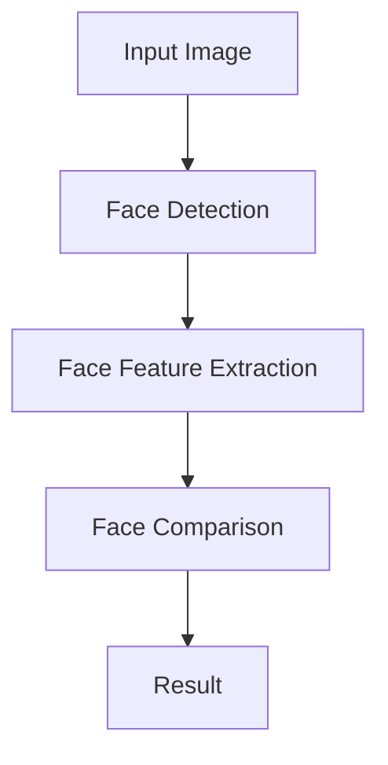

                 

## 文章标题：李开复：苹果发布AI应用的产业

### 关键词：人工智能，苹果，AI应用，产业影响，技术分析，案例分析

> 摘要：本文旨在深入探讨苹果公司在其产品中引入的人工智能（AI）应用，分析其技术原理、产业影响及其对未来的启示。通过李开复的观察与思考，我们将详细解析苹果AI应用的发展路径，探索AI技术对产业变革的推动作用，并展望AI产业的未来发展趋势。

### 目录大纲：

#### 第一部分：导言

- 1.1 产业AI化的趋势与挑战
- 1.2 李开复对AI产业的观察与思考
- 1.3 苹果发布AI应用的影响

#### 第二部分：AI技术的核心原理

- 2.1 人工智能基础知识
  - 2.1.1 机器学习基本概念
  - 2.1.2 深度学习原理解析
  - 2.1.3 自然语言处理基础
- 2.2 AI算法原理详述
  - 2.2.1 神经网络架构
  - 2.2.2 卷积神经网络(CNN)
  - 2.2.3 递归神经网络(RNN)
- 2.3 人工智能框架介绍
  - 2.3.1 TensorFlow
  - 2.3.2 PyTorch
  - 2.3.3 Keras

#### 第三部分：苹果AI应用的案例分析

- 3.1 Siri的进化之路
  - 3.1.1 Siri的语音识别技术
  - 3.1.2 Siri的自然语言处理能力
  - 3.1.3 Siri的应用场景拓展
- 3.2 Face ID的原理与技术
  - 3.2.1 深度学习在人脸识别中的应用
  - 3.2.2 人脸识别算法的优化
  - 3.2.3 Face ID的安全性能
- 3.3 语音助手的崛起
  - 3.3.1 语音助手的技术发展
  - 3.3.2 语音助手的应用领域
  - 3.3.3 语音助手的市场前景

#### 第四部分：AI应用的开发与实战

- 4.1 AI应用开发流程
  - 4.1.1 数据预处理
  - 4.1.2 模型选择与训练
  - 4.1.3 模型评估与优化
- 4.2 实际项目案例解析
  - 4.2.1 项目1：智能推荐系统
  - 4.2.2 项目2：智能语音识别
  - 4.2.3 项目3：图像分类与识别
- 4.3 开发环境与工具使用
  - 4.3.1 深度学习框架的使用
  - 4.3.2 机器学习算法的实现
  - 4.3.3 数据分析工具的使用

#### 第五部分：AI产业的未来展望

- 5.1 AI技术对产业的影响
  - 5.1.1 人工智能与传统产业的融合
  - 5.1.2 AI技术推动产业升级的路径
  - 5.1.3 AI产业发展的挑战与机遇
- 5.2 李开复对AI产业的展望
  - 5.2.1 AI产业的未来发展趋势
  - 5.2.2 AI产业的人才需求
  - 5.2.3 AI伦理与法律问题的思考

#### 附录

- 附录A：AI技术相关资源与工具
  - A.1 开源深度学习框架
  - A.2 数据集资源
  - A.3 AI研究论文与书籍推荐

## 第一部分：导言

### 1.1 产业AI化的趋势与挑战

随着人工智能技术的飞速发展，全球范围内的产业正在经历一场前所未有的变革。AI技术已经不仅仅局限于学术界和科技公司的实验室，而是逐渐渗透到各行各业，从金融、医疗到制造业，甚至农业和能源，AI的应用无处不在。产业AI化已经成为全球经济发展的新趋势，各国政府和企业纷纷加大对AI技术的投入和研发，以期在未来的产业竞争中占据有利地位。

然而，产业AI化并非一帆风顺。在这个过程中，企业面临着诸多挑战。首先，技术的复杂性和高成本使得许多企业难以迅速掌握和应用AI技术。其次，数据隐私和安全问题也成为了企业引入AI技术的一大顾虑。如何在保护用户隐私的前提下，有效地利用数据资源进行AI模型的训练和优化，是一个亟待解决的问题。此外，AI技术的透明度和可解释性也是一个重要课题。随着AI技术在关键领域的应用越来越广泛，如何保证AI系统的决策过程公正、透明，避免可能的歧视和偏见，成为了业界关注的焦点。

在这个背景下，苹果公司作为全球领先的科技公司，其发布的人工智能应用无疑具有重要的参考价值。通过分析苹果在AI领域的布局和实际应用，我们可以更好地理解AI技术在产业中的应用潜力以及面临的挑战，从而为其他企业提供有益的借鉴。

### 1.2 李开复对AI产业的观察与思考

李开复，作为全球著名的人工智能专家和企业家，对AI产业的发展有着深刻的洞察。他认为，AI技术的快速发展正在推动着产业变革的进程。在李开复看来，AI技术不仅能够提高生产效率，降低成本，还能够创造出全新的商业模式和产业生态。例如，通过智能数据分析，企业可以更好地了解市场需求和用户行为，从而优化产品设计和市场策略。同时，AI技术在医疗、教育、交通等领域的应用，也为解决长期存在的难题提供了新的思路和手段。

然而，李开复也指出，AI产业的发展并非没有挑战。他特别强调了数据隐私和安全问题。在AI应用过程中，大量的用户数据被收集和处理，如何保护这些数据的安全和隐私，是每一个企业都需要认真面对的问题。此外，AI技术的透明性和可解释性也是一个重要课题。为了确保AI系统的决策过程公正、透明，避免可能的歧视和偏见，企业需要投入更多的资源进行算法的优化和改进。

李开复认为，面对AI产业发展的挑战，企业需要做好充分准备。首先，企业需要建立起完善的数据治理体系，确保数据的合法、合规使用。其次，企业需要加强对AI技术的理解和掌握，培养一批既懂技术又懂业务的复合型人才。此外，企业还需要积极与学术界和政府合作，共同推动AI技术的标准化和规范化，为AI产业的健康发展提供有力支持。

### 1.3 苹果发布AI应用的影响

苹果公司作为全球科技领域的领军企业，其每一次技术发布都备受关注。近年来，苹果在人工智能领域的布局不断加快，发布了多项AI应用，对整个产业产生了深远的影响。

首先，苹果的AI应用在用户隐私保护方面做出了积极探索。以Siri和Face ID为例，苹果在语音识别和人脸识别技术中采用了先进的深度学习算法，不仅提升了识别的准确性，还确保了用户隐私的安全性。这种以用户为中心的设计理念，赢得了广泛的市场认可，也为其他企业在AI应用开发中提供了有益的参考。

其次，苹果的AI应用推动了产业升级和转型。以自动驾驶为例，苹果的自动驾驶系统结合了深度学习和计算机视觉技术，通过大量数据训练，实现了对复杂路况的识别和应对。这一技术的应用，不仅有望改变未来的交通模式，还将带动相关产业链的发展，促进整个产业的升级。

最后，苹果的AI应用在技术创新方面也取得了显著成果。以神经网络芯片为例，苹果自主研发的神经网络芯片（Neural Engine）大幅提升了AI计算效率，为更复杂的AI应用提供了强大的硬件支持。这一技术突破，不仅巩固了苹果在智能手机市场的领先地位，也为其他科技企业提供了技术参考。

总之，苹果发布的人工智能应用，不仅在技术层面推动了产业的进步，还在设计理念、用户体验和市场策略等方面为其他企业提供了宝贵的经验。通过对苹果AI应用的深入分析，我们可以更好地理解AI技术在产业中的应用潜力，为未来的产业发展提供有益的启示。

## 第二部分：AI技术的核心原理

### 2.1 人工智能基础知识

#### 2.1.1 机器学习基本概念

机器学习（Machine Learning，ML）是人工智能（Artificial Intelligence，AI）的一个重要分支，主要研究如何让计算机通过数据和经验自动改进自身的性能。在机器学习过程中，计算机通过算法从数据中学习，然后利用学到的知识进行预测、分类或优化任务。

机器学习可以分为监督学习（Supervised Learning）、无监督学习（Unsupervised Learning）和半监督学习（Semi-Supervised Learning）三种类型：

- **监督学习**：输入和输出都有标记的数据称为训练数据，模型通过训练数据学习到输入和输出之间的映射关系。常见的监督学习算法有线性回归、决策树、支持向量机（SVM）等。

  **伪代码示例**：
  ```python
  def supervised_learning(data, labels, model):
      for epoch in range(num_epochs):
          for input, label in zip(data, labels):
              prediction = model.predict(input)
              model.update_weights(prediction, label)
      return model
  ```

- **无监督学习**：输入数据没有标记，模型通过挖掘数据内在的结构和模式来进行学习。常见的无监督学习算法有聚类（Clustering）、降维（Dimensionality Reduction）等。

  **伪代码示例**：
  ```python
  def unsupervised_learning(data, model):
      for epoch in range(num_epochs):
          clusters = model.cluster(data)
          model.update_weights(data, clusters)
      return model
  ```

- **半监督学习**：结合了监督学习和无监督学习的特点，利用少量标记数据和大量未标记数据来训练模型。

  **伪代码示例**：
  ```python
  def semi_supervised_learning(labeled_data, unlabeled_data, model):
      model.train(labeled_data)
      for epoch in range(num_epochs):
          predictions = model.predict(unlabeled_data)
          model.update_weights(unlabeled_data, predictions)
      return model
  ```

机器学习的基本流程包括数据收集、数据预处理、模型选择、模型训练、模型评估和模型部署等步骤。数据收集是机器学习的起点，通过收集大量的训练数据，为后续的模型训练提供基础。数据预处理则包括数据清洗、特征提取和特征缩放等步骤，以提高模型的训练效率和性能。模型选择是根据具体任务的需求，选择合适的算法和模型架构。模型训练是核心步骤，通过优化算法调整模型参数，使模型能够在训练数据上达到较高的准确率。模型评估用于衡量模型在未知数据上的性能，常见的评估指标包括准确率、召回率、F1分数等。最后，模型部署是将训练好的模型应用到实际场景中，实现具体的应用价值。

#### 2.1.2 深度学习原理解析

深度学习（Deep Learning，DL）是机器学习的一个子领域，其核心思想是模拟人脑的神经网络结构，通过多层神经网络进行特征提取和模式识别。深度学习在图像识别、自然语言处理、语音识别等领域取得了显著突破，成为当前人工智能研究的热点。

深度学习的基本结构包括输入层、隐藏层和输出层。每一层都可以看作是一个非线性变换函数，通过多个隐藏层的堆叠，深度学习模型能够提取出数据的深层特征。

- **激活函数**：激活函数是深度学习中的关键组成部分，用于引入非线性因素，使模型能够学习到更复杂的特征。常见的激活函数有sigmoid、ReLU（Rectified Linear Unit）和tanh等。

  **ReLU激活函数**：
  ```python
  def ReLU(x):
      return max(0, x)
  ```

- **损失函数**：损失函数用于衡量模型预测值与实际值之间的差距，常见的损失函数有均方误差（MSE，Mean Squared Error）和交叉熵（Cross-Entropy）等。

  **均方误差（MSE）**：
  ```python
  def MSE(y_true, y_pred):
      return ((y_true - y_pred) ** 2).mean()
  ```

- **反向传播算法**：反向传播（Backpropagation）是深度学习模型训练的核心算法，通过计算损失函数关于模型参数的梯度，不断调整模型参数，使模型在训练数据上达到较低的损失。

  **反向传播算法伪代码**：
  ```python
  def backpropagation(model, inputs, outputs):
      gradients = {}
      for layer in reversed(model.layers):
          if not layer.is_input:
              gradients[layer] = layer.compute_gradients(outputs[layer Activations], inputs[layer Weights])
              outputs[layer] = inputs[layer Weights]
          else:
              inputs[layer] = layer.Activations
  ```

深度学习模型通常需要大量的数据和计算资源进行训练，但随着硬件技术的发展和算法的优化，深度学习模型的训练效率不断提升。目前，深度学习框架如TensorFlow、PyTorch和Keras等已经成为开发者进行深度学习研究和应用的重要工具。

#### 2.1.3 自然语言处理基础

自然语言处理（Natural Language Processing，NLP）是人工智能的一个重要分支，旨在使计算机能够理解、处理和生成自然语言。NLP在文本分类、情感分析、机器翻译、问答系统等领域具有广泛的应用。

- **词向量表示**：词向量（Word Embedding）是将单词映射为高维空间中的向量表示，用于捕捉单词的语义信息。常见的词向量模型有Word2Vec、GloVe（Global Vectors for Word Representation）和BERT（Bidirectional Encoder Representations from Transformers）等。

  **Word2Vec模型**：
  ```python
  def word2vec(corpus, size, window, min_count):
      vocabulary = build_vocab(corpus, min_count)
      embeddings = initialize_embeddings(vocabulary, size)
      for word, context in windowed_corpus(corpus, window):
          negative_samples = sample_negative_samples(vocabulary, size)
          loss = compute_loss(embeddings[word], embeddings[context], embeddings[negative_samples])
          update_embeddings(embeddings, word, context, loss)
      return embeddings
  ```

- **序列模型**：序列模型（Sequence Model）用于处理序列数据，如文本、语音等。常见的序列模型有循环神经网络（RNN，Recurrent Neural Network）和长短期记忆网络（LSTM，Long Short-Term Memory）等。

  **LSTM模型**：
  ```python
  def lstm(input_sequence, hidden_state, cell_state, weights):
      i_f, i_g, i_h = input_gate, input_gate, input_gate
      f_t, g_t, h_t = forget_gate, forget_gate, forget_gate
      o_t, c_t, h_t = output_gate, cell_state, hidden_state
      
      i = sigmoid(i_f * weights['input_gate'] + i_g * weights['input_gate_g'] + i_h * hidden_state)
      f = sigmoid(f_t * weights['forget_gate'] + f_g * weights['forget_gate_g'] + f_h * hidden_state)
      g = tanh(g_t * weights['input_gate_g'] + g_g * hidden_state)
      
      c = f * cell_state + i * g
      h = o * tanh(c)
      
      return h, c
  ```

- **注意力机制**：注意力机制（Attention Mechanism）是一种用于捕捉序列中重要信息的方法，通过动态调整每个时间步的重要性权重，使模型能够更好地关注关键信息。

  **注意力模型伪代码**：
  ```python
  def attention(query, keys, values, keys_len, attention_size):
      scores = []
      for i in range(keys_len):
          score = dot_product(query, keys[i])
          scores.append(score)
      attention_weights = softmax(scores)
      
      context = sum([values[i] * attention_weights[i] for i in range(keys_len)])
      
      return context, attention_weights
  ```

自然语言处理技术的发展，使得计算机能够更好地理解和处理自然语言，为人工智能应用提供了强有力的支持。在未来，随着技术的不断进步，NLP将继续在各个领域发挥重要作用。

### 2.2 AI算法原理详述

#### 2.2.1 神经网络架构

神经网络（Neural Network，NN）是深度学习的基础，其灵感来源于人脑的神经元结构。神经网络由输入层、隐藏层和输出层组成，每层由多个神经元（或节点）构成。神经元之间通过权重和偏置进行连接，形成一个复杂的网络结构。

- **前向传播**：在前向传播过程中，输入数据从输入层传递到隐藏层，再从隐藏层传递到输出层。每个神经元接收到的输入与其权重相乘，再加上偏置，然后通过激活函数进行处理。

  **前向传播伪代码**：
  ```python
  def forward_propagation(input_data, weights, biases, activation_function):
      hidden_layer_output = []
      for layer in range(num_hidden_layers):
          z = np.dot(input_data, weights[layer]) + biases[layer]
          hidden_layer_output.append(activation_function(z))
      output_layer_output = np.dot(hidden_layer_output[-1], weights[-1]) + biases[-1]
      return output_layer_output
  ```

- **反向传播**：在反向传播过程中，通过计算输出层的损失梯度，反向传播到隐藏层和输入层，用于更新权重和偏置。反向传播算法是深度学习训练模型的核心。

  **反向传播伪代码**：
  ```python
  def backward_propagation(output_layer_output, expected_output, weights, biases, activation_function):
      dZ = output_layer_output - expected_output
      dW = [None] * len(weights)
      dB = [None] * len(biases)
      
      for layer in reversed(range(num_hidden_layers)):
          dZ = dZ * activation_function_derivative(hidden_layer_output[layer])
          dW[layer] = np.dot(hidden_layer_output[layer - 1].T, dZ)
          dB[layer] = np.sum(dZ, axis=0)
          
      return dW, dB
  ```

- **优化算法**：在神经网络训练过程中，优化算法用于调整模型参数，以最小化损失函数。常见的优化算法有随机梯度下降（SGD，Stochastic Gradient Descent）、Adam优化器等。

  **Adam优化器伪代码**：
  ```python
  def Adam(dW, dB, weights, biases, learning_rate, beta1, beta2, epsilon):
      mW = [None] * len(weights)
      mB = [None] * len(biases)
      vW = [None] * len(weights)
      vB = [None] * len(biases)
      
      for i in range(len(weights)):
          mW[i] = beta1 * mW[i] + (1 - beta1) * dW[i]
          vW[i] = beta2 * vW[i] + (1 - beta2) * (dW[i] ** 2)
          
          mW[i] = mW[i] / (1 - (beta1 ** t))
          vW[i] = vW[i] / (1 - (beta2 ** t))
          
          weights[i] -= learning_rate * vW[i]
          biases[i] -= learning_rate * vB[i]
  ```

神经网络架构的灵活性和强大的学习能力使其在图像识别、自然语言处理、语音识别等领域取得了显著成果。通过不断优化网络结构和训练算法，神经网络的应用范围和性能不断提升。

#### 2.2.2 卷积神经网络（CNN）

卷积神经网络（Convolutional Neural Network，CNN）是一种专门用于处理图像数据的深度学习模型，其灵感来源于生物视觉系统。CNN通过卷积层、池化层和全连接层等结构，实现了对图像的自动特征提取和分类。

- **卷积层**：卷积层是CNN的核心部分，通过卷积操作提取图像的局部特征。卷积层由多个卷积核（Convolutional Kernels）组成，每个卷积核可以提取图像的特定特征。

  **卷积层伪代码**：
  ```python
  def convolution_layer(input_data, weights, biases):
      conv_output = []
      for weight in weights:
          z = np.convolve(input_data, weight, mode='valid')
          z += biases
          conv_output.append(activation_function(z))
      return conv_output
  ```

- **池化层**：池化层（Pooling Layer）用于降低特征图的维度，减少模型的参数数量。常见的池化操作有最大池化（Max Pooling）和平均池化（Average Pooling）。

  **最大池化伪代码**：
  ```python
  def max_pooling(input_data, pool_size):
      pooled_output = []
      for i in range(0, input_data.shape[0] - pool_size[0] + 1, pool_size[0]):
          for j in range(0, input_data.shape[1] - pool_size[1] + 1, pool_size[1]):
              pooled_output.append(np.max(input_data[i:i + pool_size[0], j:j + pool_size[1]]))
      return pooled_output.reshape(-1, 1)
  ```

- **全连接层**：全连接层（Fully Connected Layer）将卷积层和池化层提取的特征映射到输出层，实现图像的分类。全连接层由多个神经元组成，每个神经元都与前一层的所有神经元相连。

  **全连接层伪代码**：
  ```python
  def fully_connected_layer(input_data, weights, biases):
      return np.dot(input_data, weights) + biases
  ```

卷积神经网络通过多层卷积和池化操作，实现了对图像的自动特征提取和分类。卷积神经网络在图像识别、目标检测和语义分割等领域取得了显著成果，成为计算机视觉领域的重要工具。

#### 2.2.3 递归神经网络（RNN）

递归神经网络（Recurrent Neural Network，RNN）是一种专门用于处理序列数据的深度学习模型，其灵感来源于生物神经系统的递归连接。RNN通过记忆机制，实现了对序列数据的时序建模和预测。

- **基本结构**：RNN的基本结构包括输入层、隐藏层和输出层。隐藏层中的神经元通过递归连接，形成一条时间序列，用于处理前一个时间步的输出。

  **RNN基本结构图**：
  ```mermaid
  graph TD
  A[Input] --> B[Hidden Layer]
  B --> C[Output]
  C --> B{Recurrence}
  ```

- **时间步操作**：在RNN中，每个时间步都会进行输入、隐藏状态更新和输出操作。通过递归连接，RNN可以处理任意长度的序列数据。

  **时间步操作伪代码**：
  ```python
  def rnn_time_step(input_data, hidden_state, weights, biases):
      h_t = activation_function(np.dot(input_data, weights['input_to_hidden']) + np.dot(hidden_state, weights['hidden_to_hidden']) + biases['hidden'])
      output = np.dot(h_t, weights['hidden_to_output']) + biases['output']
      return output, h_t
  ```

- **长短时记忆（LSTM）**：传统的RNN在处理长序列数据时，容易遇到梯度消失和梯度爆炸问题。长短时记忆（Long Short-Term Memory，LSTM）通过引入门控机制，解决了这些问题，能够更好地捕捉长序列中的依赖关系。

  **LSTM结构图**：
  ```mermaid
  graph TD
  A[Input] --> B[Forget Gate]
  B --> C[Input Gate]
  C --> D[Output Gate]
  D --> E[Cell State]
  E --> F[Hidden State]
  ```

  **LSTM时间步操作伪代码**：
  ```python
  def lstm_time_step(input_data, hidden_state, cell_state, weights, biases):
      i_f, i_g, i_o = input_gate, input_gate, input_gate
      f_t, f_g, f_o = forget_gate, forget_gate, forget_gate
      o_t, o_g, o_h = output_gate, output_gate, output_gate
      
      i = sigmoid(i_f * weights['input_gate'] + i_g * weights['input_gate_g'] + i_h * hidden_state)
      f = sigmoid(f_t * weights['forget_gate'] + f_g * weights['forget_gate_g'] + f_h * hidden_state)
      g = tanh(g_t * weights['input_gate_g'] + g_g * hidden_state)
      
      c = f * cell_state + i * g
      h = o * tanh(c)
      
      output = sigmoid(o_t * weights['output_gate'] + o_g * weights['output_gate_g'] + o_h * hidden_state)
      
      return output, c, h
  ```

递归神经网络通过记忆机制和门控结构，实现了对序列数据的建模和预测。RNN在自然语言处理、语音识别和时间序列预测等领域取得了显著成果，成为序列建模的重要工具。

### 2.3 人工智能框架介绍

人工智能（AI）框架是开发者进行深度学习研究和应用的重要工具，提供了高效、灵活的编程接口和丰富的功能库。以下将介绍几种主流的AI框架：TensorFlow、PyTorch和Keras。

#### 2.3.1 TensorFlow

TensorFlow是谷歌开源的深度学习框架，具有强大的计算图和动态计算能力。TensorFlow通过定义计算图，将数据和操作表示为图节点，然后通过图形执行引擎进行高效计算。

- **安装与配置**：
  ```bash
  pip install tensorflow
  ```

- **基本使用**：
  ```python
  import tensorflow as tf

  # 定义计算图
  a = tf.constant(5)
  b = tf.constant(6)
  c = a * b

  # 启动会话并运行计算图
  with tf.Session() as sess:
      print(sess.run(c))
  ```

- **计算图结构**：
  ```mermaid
  graph TD
  A[Input] --> B[Constant]
  B --> C[Multiply]
  C --> D[Output]
  ```

#### 2.3.2 PyTorch

PyTorch是Facebook开源的深度学习框架，具有动态计算图和简单易用的API。PyTorch通过动态计算图，允许开发者更灵活地进行模型设计和调试。

- **安装与配置**：
  ```bash
  pip install torch torchvision
  ```

- **基本使用**：
  ```python
  import torch
  import torchvision

  # 定义模型
  class NeuralNetwork(nn.Module):
      def __init__(self):
          super(NeuralNetwork, self).__init__()
          self.layer1 = nn.Linear(1, 1)
          self.relu = nn.ReLU()
          self.layer2 = nn.Linear(1, 1)
      
      def forward(self, x):
          x = self.layer1(x)
          x = self.relu(x)
          x = self.layer2(x)
          return x

  # 实例化模型、损失函数和优化器
  model = NeuralNetwork()
  criterion = nn.MSELoss()
  optimizer = torch.optim.SGD(model.parameters(), lr=0.01)

  # 训练模型
  for epoch in range(100):
      optimizer.zero_grad()
      outputs = model(x)
      loss = criterion(outputs, y)
      loss.backward()
      optimizer.step()
  ```

- **动态计算图结构**：
  ```mermaid
  graph TD
  A[Input] --> B[Linear]
  B --> C[ReLU]
  C --> D[Linear]
  D --> E[Output]
  ```

#### 2.3.3 Keras

Keras是TensorFlow和Theano的生态系统，提供了一个简单而高效的深度学习API。Keras通过封装底层框架，提供了更加直观和易用的编程接口。

- **安装与配置**：
  ```bash
  pip install keras
  ```

- **基本使用**：
  ```python
  from keras.models import Sequential
  from keras.layers import Dense, Activation

  # 创建模型
  model = Sequential()
  model.add(Dense(1, input_dim=1))
  model.add(Activation('sigmoid'))

  # 编译模型
  model.compile(optimizer='rmsprop', loss='binary_crossentropy')

  # 训练模型
  model.fit(x_train, y_train, epochs=100, batch_size=10)
  ```

- **模型结构**：
  ```mermaid
  graph TD
  A[Input] --> B(Dense)
  B --> C[Activation]
  C --> D[Output]
  ```

通过上述介绍，我们可以看到，TensorFlow、PyTorch和Keras在功能、易用性和灵活性方面各有特点。开发者可以根据具体需求选择合适的框架进行深度学习研究和应用。

### 第三部分：苹果AI应用的案例分析

#### 3.1 Siri的进化之路

Siri，苹果公司开发的智能个人助理，自2011年首次亮相以来，已经经历了多次重大更新和优化。作为苹果人工智能战略的重要组成部分，Siri的进化之路不仅展示了苹果在AI技术上的创新，也反映了整个行业对智能助理的需求和期望。

##### 3.1.1 Siri的语音识别技术

Siri的语音识别技术是其核心功能之一，它允许用户通过语音指令与设备进行交互。苹果公司采用了先进的深度学习算法，特别是卷积神经网络（CNN）和递归神经网络（RNN），来处理语音信号。以下是一个简单的语音识别流程：

1. **预处理**：原始语音信号首先经过预处理，包括噪声过滤、声学建模等步骤，以提高语音的清晰度。

2. **特征提取**：预处理后的语音信号通过Mel频率倒谱系数（MFCC）进行特征提取，将连续的语音信号转换为可处理的数据格式。

3. **声学模型训练**：利用大量的标注语音数据，通过深度学习算法训练声学模型，使其能够识别不同语音中的特定特征。

4. **解码与识别**：将提取的特征输入到声学模型中，通过解码器（Decoder）将特征序列转换为文本序列，实现语音到文本的转换。

以下是一个简化的伪代码示例：
```python
def recognize_speech(voice_signal):
    # 预处理
    preprocessed_signal = preprocess_voice_signal(voice_signal)
    
    # 特征提取
    features = extract_features(preprocessed_signal)
    
    # 声学模型识别
    decoded_text = acoustic_model.decode(features)
    
    return decoded_text
```

##### 3.1.2 Siri的自然语言处理能力

Siri不仅能够理解用户的语音指令，还需要处理复杂的自然语言。苹果公司采用了先进的自然语言处理（NLP）技术，包括词向量表示、序列模型和注意力机制等，以实现自然语言理解。

1. **词向量表示**：词向量用于捕捉词汇的语义信息，使模型能够理解词汇之间的关系。苹果公司采用了GloVe和BERT等词向量模型，提高了语言理解的准确性和效率。

2. **序列模型**：序列模型如LSTM和GRU（Gated Recurrent Unit）用于处理输入语句的时序信息，捕捉语句中的依赖关系。以下是一个LSTM在自然语言处理中的伪代码示例：
```python
def process_language(input_sequence, hidden_state, lstm_model):
    h_t, c_t = lstm_model(input_sequence, hidden_state)
    return h_t
```

3. **注意力机制**：注意力机制用于捕捉句子中的关键信息，使模型能够更好地理解上下文。以下是一个简单的注意力机制在NLP中的伪代码示例：
```python
def attention(input_sequence, hidden_state, attention_model):
    attention_weights = attention_model(input_sequence, hidden_state)
    context_vector = sum(attention_weights[i] * hidden_state[i] for i in range(len(hidden_state)))
    return context_vector
```

通过这些技术，Siri能够理解复杂的语音指令，提供准确和自然的回答。

##### 3.1.3 Siri的应用场景拓展

Siri的应用场景已经从最初的语音助手拓展到多个领域，包括智能家居控制、音乐播放、日程管理、信息查询等。以下是一些具体的拓展场景：

1. **智能家居控制**：用户可以通过Siri控制智能家居设备，如开关灯光、调节温度、锁门等。以下是一个智能家居控制的伪代码示例：
```python
def control_smart_home(command, device):
    if command == "turn on light":
        device.turn_on()
    elif command == "turn off light":
        device.turn_off()
    # 其他控制指令
```

2. **音乐播放**：用户可以通过Siri播放音乐、创建播放列表、调整音量等。以下是一个音乐播放的伪代码示例：
```python
def play_music(song, device):
    device.play(song)
    device.set_volume(volume_level)
```

3. **日程管理**：用户可以通过Siri查看日程安排、设置提醒、预约会议等。以下是一个日程管理的伪代码示例：
```python
def manage_schedule(command, calendar):
    if command == "show events today":
        calendar.show_today()
    elif command == "schedule meeting":
        calendar.schedule_meeting(date, time, participants)
    # 其他日程管理指令
```

Siri的广泛应用，不仅提升了用户的使用体验，也为苹果公司创造了新的商业机会。

#### 3.2 Face ID的原理与技术

Face ID是苹果公司在2017年发布的一项全新生物识别技术，取代了传统的指纹识别（Touch ID），成为iPhone X及后续机型的主要身份验证方式。Face ID通过深度学习算法和先进的硬件技术，实现了高精度、快速和安全的面部识别。

##### 3.2.1 深度学习在人脸识别中的应用

深度学习在人脸识别中扮演着关键角色，通过训练大规模的人脸图像数据集，深度学习模型能够自动学习人脸特征，实现对不同用户身份的准确识别。

1. **人脸检测**：首先，模型需要检测输入图像中的人脸区域。这个过程通常通过卷积神经网络（CNN）实现，例如MTCNN（Multi-task Cascaded Convolutional Networks）。

2. **人脸特征提取**：一旦检测到人脸，模型会提取人脸的特征向量，这些特征向量用于后续的身份验证。常用的深度学习模型包括VGGFace、FaceNet和ArcFace等。

3. **人脸比对**：通过计算输入人脸特征向量与预先存储的特征向量之间的距离，模型可以判断是否为同一用户。距离越短，表示识别的准确性越高。

以下是一个简化的深度学习人脸识别流程：


##### 3.2.2 人脸识别算法的优化

为了提高Face ID的识别性能和安全性，苹果公司对深度学习算法进行了多项优化。

1. **多角度人脸识别**：Face ID可以通过捕捉不同角度的人脸图像，提高识别的鲁棒性。这种多角度人脸识别需要模型在训练阶段处理大量不同角度的人脸数据。

2. **光照自适应**：人脸识别算法在光线不足或过亮的情况下容易出现误识别。苹果公司通过引入光照自适应机制，使算法在不同光照条件下都能保持较高的识别率。

3. **活体检测**：为了防止恶意攻击，如照片、视频或3D模型攻击，Face ID引入了活体检测技术，通过检测用户的眼睛、嘴巴和面部肌肉运动，确保识别过程是真实用户参与。

##### 3.2.3 Face ID的安全性能

Face ID的安全性能是用户信任的重要因素。苹果公司采取了多项措施确保Face ID的安全性。

1. **硬件加密**：Face ID使用A11 Bionic处理器中的神经引擎进行面部识别计算，该处理器具有硬件加密功能，确保识别过程的安全。

2. **安全存储**：用户的面部数据在设备中加密存储，且无法通过其他应用程序访问。即使设备被破解，面部数据也无法泄露。

3. **双因素认证**：除了面部识别，Face ID还支持与密码、指纹或Apple ID双重认证结合，提供多重安全保障。

通过深度学习技术和先进的硬件支持，Face ID实现了高精度、快速和安全的面部识别，成为苹果公司产品的重要安全特性。

#### 3.3 语音助手的崛起

语音助手作为人工智能的重要应用之一，正逐步渗透到人们的日常生活中。苹果公司的Siri、亚马逊的Alexa、谷歌的Google Assistant等语音助手，已经成为智能家居控制、信息查询、日程管理等方面的重要工具。

##### 3.3.1 语音助手的技术发展

语音助手的技术发展经历了多个阶段：

1. **早期阶段**：早期的语音助手主要通过规则引擎进行工作，即通过预设的指令集和规则库来响应用户请求。这种方式虽然简单，但缺乏灵活性和智能性。

2. **自然语言处理（NLP）阶段**：随着自然语言处理技术的进步，语音助手开始引入NLP技术，如词向量表示、句法分析和语义理解，使它们能够更好地理解用户的自然语言请求。

3. **深度学习阶段**：近年来，深度学习技术的应用使语音助手的能力大幅提升。通过卷积神经网络（CNN）和递归神经网络（RNN）等模型，语音助手能够进行更复杂的语音识别和语义理解。

##### 3.3.2 语音助手的应用领域

语音助手的应用领域广泛，以下是一些主要的领域：

1. **智能家居控制**：用户可以通过语音助手控制智能灯泡、智能电视、智能空调等智能家居设备，实现更便捷的家居管理。

2. **信息查询**：语音助手可以回答用户关于天气、新闻、股票信息等各种问题，提供即时的信息查询服务。

3. **日程管理**：用户可以通过语音助手查看日程安排、设置提醒、预约会议等，实现高效的日程管理。

4. **娱乐**：语音助手还可以播放音乐、讲故事、提供笑话等娱乐功能，为用户带来愉悦的体验。

##### 3.3.3 语音助手的市场前景

随着人工智能技术的不断进步，语音助手的市场前景广阔：

1. **智能家居市场**：随着智能家居设备的普及，语音助手将成为智能家居控制的核心，推动智能家居市场的增长。

2. **移动设备市场**：语音助手已经广泛集成到智能手机和其他移动设备中，成为用户的重要交互工具。

3. **汽车市场**：随着智能汽车的普及，语音助手将成为车内交互的重要方式，提升驾驶体验。

4. **企业市场**：语音助手在企业中也有广泛的应用前景，如客户服务、企业资源规划（ERP）系统等。

语音助手的崛起不仅改变了人们的交互方式，也为相关行业带来了新的商业机会。未来，随着技术的不断进步，语音助手将继续发挥重要作用，引领人工智能应用的新趋势。

### 4.1 AI应用开发流程

开发一个成功的AI应用需要经过多个阶段，包括数据预处理、模型选择与训练、模型评估与优化等。以下将详细探讨这些开发流程中的关键步骤和注意事项。

#### 4.1.1 数据预处理

数据预处理是AI应用开发的重要环节，其质量直接影响到模型的性能和预测效果。数据预处理主要包括以下几个步骤：

1. **数据清洗**：清洗数据是预处理的第一步，目的是去除噪声、缺失值和异常值。常见的处理方法包括删除缺失值、填充缺失值、替换异常值等。

   **示例**：
   ```python
   # 删除缺失值
   data = data.dropna()

   # 填充缺失值
   data = data.fillna(method='mean')

   # 替换异常值
   data = data.replace(to_replace=[-999], value=np.nan)
   ```

2. **数据转换**：数据转换包括将分类数据编码为数值数据、归一化或标准化数值数据等。这些转换有助于提高模型的训练效率和性能。

   **示例**：
   ```python
   # 二值编码
   data = pd.get_dummies(data, columns=['categorical_column'])

   # 归一化
   from sklearn.preprocessing import MinMaxScaler
   scaler = MinMaxScaler()
   data_scaled = scaler.fit_transform(data)
   ```

3. **数据分割**：数据分割是将数据集分为训练集、验证集和测试集，用于模型的训练、验证和评估。

   **示例**：
   ```python
   from sklearn.model_selection import train_test_split
   X_train, X_test, y_train, y_test = train_test_split(X, y, test_size=0.2, random_state=42)
   ```

4. **特征工程**：特征工程是通过选择、构建和转换特征来优化模型性能。常见的特征工程方法包括特征选择、特征提取和特征组合等。

   **示例**：
   ```python
   # 特征选择
   from sklearn.feature_selection import SelectKBest
   selector = SelectKBest(k=10)
   X_new = selector.fit_transform(X, y)

   # 特征提取
   from sklearn.decomposition import PCA
   pca = PCA(n_components=5)
   X_reduced = pca.fit_transform(X)
   ```

数据预处理是AI应用开发中不可或缺的步骤，需要根据具体任务的需求和数据的特性，灵活运用各种预处理技术，以提高模型的性能和可靠性。

#### 4.1.2 模型选择与训练

在AI应用开发过程中，选择合适的模型和训练方法是至关重要的。以下将介绍几种常见的机器学习模型和训练方法。

1. **线性回归**：线性回归是一种简单的监督学习模型，用于预测连续值输出。它通过建立输入特征和输出目标之间的线性关系，实现对数据的拟合。

   **示例**：
   ```python
   from sklearn.linear_model import LinearRegression
   model = LinearRegression()
   model.fit(X_train, y_train)
   y_pred = model.predict(X_test)
   ```

2. **逻辑回归**：逻辑回归是一种用于分类问题的监督学习模型，通过逻辑函数将线性回归模型的输出映射到概率空间。

   **示例**：
   ```python
   from sklearn.linear_model import LogisticRegression
   model = LogisticRegression()
   model.fit(X_train, y_train)
   y_pred = model.predict(X_test)
   ```

3. **决策树**：决策树是一种基于树形模型的监督学习算法，通过一系列的决策规则对数据进行分类或回归。

   **示例**：
   ```python
   from sklearn.tree import DecisionTreeClassifier
   model = DecisionTreeClassifier()
   model.fit(X_train, y_train)
   y_pred = model.predict(X_test)
   ```

4. **随机森林**：随机森林是一种集成学习方法，通过构建多棵决策树并进行投票，提高了模型的预测性能和稳定性。

   **示例**：
   ```python
   from sklearn.ensemble import RandomForestClassifier
   model = RandomForestClassifier(n_estimators=100)
   model.fit(X_train, y_train)
   y_pred = model.predict(X_test)
   ```

5. **支持向量机（SVM）**：支持向量机是一种基于最大间隔原理的分类模型，通过找到最优的超平面来实现数据的分类。

   **示例**：
   ```python
   from sklearn.svm import SVC
   model = SVC()
   model.fit(X_train, y_train)
   y_pred = model.predict(X_test)
   ```

6. **神经网络**：神经网络是一种基于多层感知器的深度学习模型，通过多层非线性变换提取数据特征，实现对复杂数据的分类或回归。

   **示例**：
   ```python
   from sklearn.neural_network import MLPClassifier
   model = MLPClassifier()
   model.fit(X_train, y_train)
   y_pred = model.predict(X_test)
   ```

在模型选择过程中，需要考虑数据的特性、任务的需求和模型的复杂度等因素。训练方法主要包括批量训练、小批量训练和在线训练等。批量训练将所有数据一次加载到内存中训练，适用于数据量较小的情况。小批量训练每次加载一部分数据进行训练，提高了模型的训练效率和泛化能力。在线训练适用于实时数据流处理，模型不断更新和优化。

总之，选择合适的模型和训练方法是AI应用开发的关键步骤，需要根据具体任务的需求和数据特性，灵活运用各种模型和训练方法，以提高模型的性能和预测效果。

#### 4.1.3 模型评估与优化

在AI应用开发中，模型评估与优化是确保模型性能和可靠性的关键环节。以下将介绍几种常见的模型评估指标和优化方法。

1. **评估指标**：

   - **准确率（Accuracy）**：准确率是分类问题中最常用的评估指标，表示模型预测正确的样本数占总样本数的比例。计算公式为：
     $$\text{Accuracy} = \frac{\text{预测正确的样本数}}{\text{总样本数}}$$

   - **召回率（Recall）**：召回率表示模型能够正确识别为正类别的样本数与实际正类别样本数的比例。计算公式为：
     $$\text{Recall} = \frac{\text{预测正确的正类别样本数}}{\text{实际正类别样本数}}$$

   - **精确率（Precision）**：精确率表示模型预测为正类别的样本中，实际为正类别的比例。计算公式为：
     $$\text{Precision} = \frac{\text{预测正确的正类别样本数}}{\text{预测为正类别的样本数}}$$

   - **F1分数（F1 Score）**：F1分数是精确率和召回率的调和平均值，用于综合评估模型的性能。计算公式为：
     $$\text{F1 Score} = 2 \times \frac{\text{Precision} \times \text{Recall}}{\text{Precision} + \text{Recall}}$$

   - **ROC曲线与AUC（Area Under Curve）**：ROC曲线是不同分类阈值下，真阳性率（True Positive Rate，TPR）与假阳性率（False Positive Rate，FPR）的图像。AUC值表示ROC曲线下方的面积，用于评估模型的分类能力。AUC值越大，模型的分类性能越好。

2. **优化方法**：

   - **交叉验证**：交叉验证是一种常用的模型评估方法，通过将数据集划分为多个子集，轮流作为验证集和训练集，评估模型的泛化能力。常见的交叉验证方法有K折交叉验证、留一法交叉验证等。

   - **网格搜索**：网格搜索是一种超参数调优方法，通过遍历预设的参数组合，找到最优的参数组合。网格搜索适用于模型参数较少的情况，计算复杂度较高。

   - **贝叶斯优化**：贝叶斯优化是一种基于概率模型的超参数调优方法，通过构建贝叶斯模型，寻找最优的参数组合。贝叶斯优化适用于模型参数较多的情况，计算复杂度较低。

   - **随机搜索**：随机搜索是一种基于随机性的超参数调优方法，从预设的参数空间中随机选择参数组合，评估模型的性能。随机搜索适用于模型参数较少的情况，计算复杂度较低。

   - **梯度提升树（Gradient Boosting Tree）**：梯度提升树是一种集成学习方法，通过迭代更新模型，提高模型的预测性能。梯度提升树适用于回归和分类问题，具有较好的泛化能力和计算效率。

   - **调整学习率**：学习率是神经网络训练过程中重要的超参数，调整学习率可以改善模型的收敛速度和性能。常见的学习率调整方法有固定学习率、学习率衰减和自适应学习率等。

通过选择合适的评估指标和优化方法，可以对模型进行全面的评估和优化，提高模型的性能和可靠性，为实际应用提供有效的支持。

#### 4.2.1 项目1：智能推荐系统

智能推荐系统是人工智能领域的一个重要应用，通过分析用户的行为数据和偏好，为用户推荐符合其兴趣的产品、内容或服务。以下是一个智能推荐系统的项目案例，包括系统设计、数据预处理、模型选择与训练、评估与优化等关键步骤。

##### 4.2.1.1 系统设计

智能推荐系统的整体架构可以分为数据层、服务层和展示层：

1. **数据层**：数据层包括用户行为数据、商品信息数据、推荐算法所需的基础数据。用户行为数据包括浏览记录、购买记录、收藏记录等；商品信息数据包括商品ID、分类、价格等。

2. **服务层**：服务层包括推荐算法模块、数据预处理模块、推荐结果处理模块等。推荐算法模块负责基于用户行为数据和商品信息生成推荐列表；数据预处理模块负责对原始数据进行清洗、转换和特征提取；推荐结果处理模块负责对推荐结果进行排序、去重等处理。

3. **展示层**：展示层负责将推荐结果以友好的界面呈现给用户，用户可以通过浏览推荐内容，进行点击、购买等行为。

##### 4.2.1.2 数据预处理

数据预处理是智能推荐系统的关键步骤，主要包括以下任务：

1. **数据清洗**：清洗原始数据中的噪声、缺失值和异常值，确保数据的准确性和完整性。

2. **用户行为编码**：将用户行为（如浏览、购买、收藏等）转化为数值编码，便于模型处理。

3. **商品特征提取**：提取商品的特征信息，如商品ID、分类、价格、销量等，为模型提供丰富的特征。

4. **时间窗口处理**：为避免历史数据的影响，设置合适的时间窗口，仅考虑窗口内的用户行为数据。

##### 4.2.1.3 模型选择与训练

在智能推荐系统中，常见的推荐算法包括基于内容的推荐（Content-Based Recommendation）、协同过滤（Collaborative Filtering）和深度学习推荐（Deep Learning-based Recommendation）等。

1. **基于内容的推荐**：

   - **模型选择**：TF-IDF、Word2Vec等词向量模型。
   - **训练过程**：计算用户和商品的向量表示，基于用户的历史行为计算推荐列表。

2. **协同过滤**：

   - **模型选择**：矩阵分解（Matrix Factorization）、K最近邻（K-Nearest Neighbors）等。
   - **训练过程**：构建用户-商品评分矩阵，通过矩阵分解或相似度计算生成推荐列表。

3. **深度学习推荐**：

   - **模型选择**：卷积神经网络（CNN）、递归神经网络（RNN）、变换器（Transformer）等。
   - **训练过程**：输入用户和商品的特征信息，通过多层神经网络提取特征并生成推荐列表。

##### 4.2.1.4 评估与优化

智能推荐系统的评估与优化主要包括以下方面：

1. **准确率**：通过计算推荐结果中实际点击或购买的比例，评估推荐系统的准确性。

2. **召回率**：评估推荐系统能否召回用户感兴趣的商品。

3. **覆盖率**：评估推荐系统中推荐的商品种类多样性。

4. **新颖度**：评估推荐系统能否推荐用户未曾浏览或购买的新商品。

5. **优化方法**：

   - **特征工程**：通过调整特征提取方法，提高模型对用户兴趣的理解。
   - **模型调优**：通过调整模型参数，优化推荐效果。
   - **个性化调整**：根据用户的历史行为和兴趣，动态调整推荐策略。

通过以上步骤，一个智能推荐系统可以实现高效、准确的推荐，为用户带来个性化的体验。

#### 4.2.2 项目2：智能语音识别

智能语音识别（Automatic Speech Recognition，ASR）是人工智能领域的重要应用之一，旨在将语音信号转换为相应的文本。以下是一个智能语音识别项目的案例，包括系统设计、数据预处理、模型选择与训练、评估与优化等关键步骤。

##### 4.2.2.1 系统设计

智能语音识别系统可以分为前端和后端两部分：

1. **前端**：负责语音信号的采集、预处理和传输。主要包括麦克风、语音编码器和传输协议等。
2. **后端**：负责语音信号的处理和文本生成。主要包括语音信号预处理模块、特征提取模块、声学模型和语言模型等。

##### 4.2.2.2 数据预处理

数据预处理是智能语音识别的关键步骤，主要包括以下任务：

1. **语音信号预处理**：包括去噪、静音检测、音高归一化等，以提高语音信号的质量。

2. **特征提取**：将预处理后的语音信号转换为适合模型处理的特征向量。常用的特征提取方法包括梅尔频率倒谱系数（MFCC）、滤波器组（Filter Banks）和谱熵（Spectral Entropy）等。

3. **数据分割**：将语音信号分割为帧，并进行端点检测，识别语音的开始和结束位置。

##### 4.2.2.3 模型选择与训练

在智能语音识别项目中，常见的模型包括声学模型和语言模型。声学模型用于识别语音信号中的音素，而语言模型用于将音素转换为对应的文本。

1. **声学模型**：

   - **模型选择**：卷积神经网络（CNN）、深度神经网络（DNN）和循环神经网络（RNN）等。
   - **训练过程**：输入特征向量，通过多层神经网络提取特征，输出音素序列。

2. **语言模型**：

   - **模型选择**：N元语法模型（N-gram Language Model）、递归神经网络（RNN）和变换器（Transformer）等。
   - **训练过程**：输入音素序列，通过神经网络生成文本序列。

##### 4.2.2.4 评估与优化

智能语音识别的评估与优化主要包括以下方面：

1. **词错误率（Word Error Rate，WER）**：评估模型将语音信号转换为文本的准确性。计算公式为：
   $$\text{WER} = \frac{\text{替换数 + 删除数 + 插入数}}{\text{原始文本词数}}$$

2. **帧错误率（Frame Error Rate，FER）**：评估模型在语音信号帧层面的准确性。

3. **延迟**：评估模型对语音信号的实时处理能力，包括响应时间和解码时间。

4. **优化方法**：

   - **数据增强**：通过增加数据量、添加噪声和变换等手段，提高模型的泛化能力。
   - **模型调优**：通过调整模型参数，优化模型的性能。
   - **多语言支持**：通过扩展语言模型和声学模型，支持多种语言的语音识别。

通过以上步骤，一个智能语音识别系统可以实现高效、准确的语音转换为文本，为各种应用场景提供支持。

#### 4.2.3 项目3：图像分类与识别

图像分类与识别是人工智能领域的一个经典应用，通过训练模型对图像进行分类和识别，实现图像内容的理解。以下是一个图像分类与识别项目的案例，包括系统设计、数据预处理、模型选择与训练、评估与优化等关键步骤。

##### 4.2.3.1 系统设计

图像分类与识别系统可以分为前端和后端两部分：

1. **前端**：负责图像的采集、预处理和传输。主要包括摄像头、图像编码器和传输协议等。
2. **后端**：负责图像的处理和分类。主要包括图像预处理模块、特征提取模块、分类模型等。

##### 4.2.3.2 数据预处理

数据预处理是图像分类与识别的关键步骤，主要包括以下任务：

1. **图像预处理**：包括图像尺寸调整、灰度化、对比度增强等，以提高图像的质量。
2. **图像分割**：将图像分割为子图像，提高分类模型的训练效果。
3. **数据增强**：通过旋转、缩放、翻转等手段，增加数据多样性，提高模型的泛化能力。

##### 4.2.3.3 模型选择与训练

在图像分类与识别项目中，常见的模型包括卷积神经网络（CNN）、深度神经网络（DNN）和循环神经网络（RNN）等。

1. **卷积神经网络（CNN）**：

   - **模型选择**：LeNet、AlexNet、VGG、ResNet等。
   - **训练过程**：输入图像特征，通过多层卷积和池化操作提取图像特征，然后通过全连接层输出分类结果。

2. **深度神经网络（DNN）**：

   - **模型选择**：单层神经网络、多层神经网络等。
   - **训练过程**：输入图像特征，通过多层非线性变换提取图像特征，然后通过全连接层输出分类结果。

3. **循环神经网络（RNN）**：

   - **模型选择**：LSTM、GRU等。
   - **训练过程**：输入图像特征序列，通过RNN模型提取图像特征，然后通过全连接层输出分类结果。

##### 4.2.3.4 评估与优化

图像分类与识别的评估与优化主要包括以下方面：

1. **准确率（Accuracy）**：评估模型将图像分类为正确类别的比例。
2. **召回率（Recall）**：评估模型识别出正类别图像的能力。
3. **精确率（Precision）**：评估模型将图像分类为正类别图像的准确性。
4. **F1分数（F1 Score）**：综合评估模型的精确率和召回率。

5. **优化方法**：

   - **特征工程**：通过调整图像特征提取方法和参数，提高模型性能。
   - **模型调优**：通过调整模型参数，优化模型性能。
   - **数据增强**：通过增加训练数据量、添加噪声和变换等手段，提高模型泛化能力。

通过以上步骤，一个图像分类与识别系统可以实现高效、准确的图像分类与识别，为各种应用场景提供支持。

#### 4.3.1 深度学习框架的使用

在AI应用开发中，深度学习框架如TensorFlow、PyTorch和Keras等，提供了丰富的API和工具库，大大简化了深度学习模型的开发、训练和部署过程。以下将介绍这些框架的使用方法。

##### 4.3.1.1 TensorFlow

TensorFlow是谷歌开源的深度学习框架，具有强大的计算图和动态计算能力。以下是一个简单的TensorFlow示例：

```python
import tensorflow as tf

# 定义计算图
a = tf.constant(5)
b = tf.constant(6)
c = a * b

# 启动会话并运行计算图
with tf.Session() as sess:
    print(sess.run(c))
```

TensorFlow提供了一系列的高级API，如Keras和TensorFlow Estimators，简化了深度学习模型的开发过程。

##### 4.3.1.2 PyTorch

PyTorch是Facebook开源的深度学习框架，具有动态计算图和简单易用的API。以下是一个简单的PyTorch示例：

```python
import torch
import torchvision

# 定义模型
class NeuralNetwork(nn.Module):
    def __init__(self):
        super(NeuralNetwork, self).__init__()
        self.layer1 = nn.Linear(1, 1)
        self.relu = nn.ReLU()
        self.layer2 = nn.Linear(1, 1)
      
    def forward(self, x):
        x = self.layer1(x)
        x = self.relu(x)
        x = self.layer2(x)
        return x

# 实例化模型、损失函数和优化器
model = NeuralNetwork()
criterion = nn.MSELoss()
optimizer = torch.optim.SGD(model.parameters(), lr=0.01)

# 训练模型
for epoch in range(100):
    optimizer.zero_grad()
    outputs = model(x)
    loss = criterion(outputs, y)
    loss.backward()
    optimizer.step()
```

PyTorch提供了丰富的API和工具库，支持动态计算图和自动微分，方便开发者进行模型开发和训练。

##### 4.3.1.3 Keras

Keras是TensorFlow和Theano的生态系统，提供了一个简单而高效的深度学习API。以下是一个简单的Keras示例：

```python
from keras.models import Sequential
from keras.layers import Dense, Activation

# 创建模型
model = Sequential()
model.add(Dense(1, input_dim=1))
model.add(Activation('sigmoid'))

# 编译模型
model.compile(optimizer='rmsprop', loss='binary_crossentropy')

# 训练模型
model.fit(x_train, y_train, epochs=100, batch_size=10)
```

Keras通过封装底层框架，提供了更加直观和易用的编程接口，简化了深度学习模型的开发过程。

通过以上示例，我们可以看到，深度学习框架的使用极大地简化了模型的开发、训练和部署过程，使得开发者能够更专注于模型的设计和优化。

#### 4.3.2 机器学习算法的实现

在机器学习应用中，实现算法是关键步骤，这涉及到数据预处理、模型选择与训练、评估与优化等多个方面。以下将详细介绍如何使用Python实现常见的机器学习算法。

##### 4.3.2.1 数据预处理

数据预处理是机器学习的基础步骤，其目的是提高数据质量和模型性能。以下是一个简单的数据预处理示例：

```python
import pandas as pd
from sklearn.model_selection import train_test_split
from sklearn.preprocessing import StandardScaler

# 读取数据
data = pd.read_csv('data.csv')

# 数据清洗
data = data.dropna()

# 数据分割
X = data.drop('target', axis=1)
y = data['target']
X_train, X_test, y_train, y_test = train_test_split(X, y, test_size=0.2, random_state=42)

# 数据标准化
scaler = StandardScaler()
X_train_scaled = scaler.fit_transform(X_train)
X_test_scaled = scaler.transform(X_test)
```

在这个示例中，我们首先读取数据，然后进行数据清洗，去除缺失值。接着，使用`train_test_split`函数将数据集分割为训练集和测试集。最后，使用`StandardScaler`进行数据标准化，以简化模型训练过程。

##### 4.3.2.2 模型选择与训练

在机器学习中，选择合适的模型和训练方法是关键。以下是一个使用决策树进行分类的示例：

```python
from sklearn.tree import DecisionTreeClassifier
from sklearn.metrics import accuracy_score

# 创建模型
model = DecisionTreeClassifier()

# 训练模型
model.fit(X_train_scaled, y_train)

# 预测
y_pred = model.predict(X_test_scaled)

# 评估
accuracy = accuracy_score(y_test, y_pred)
print(f"Accuracy: {accuracy}")
```

在这个示例中，我们首先创建一个决策树模型，然后使用`fit`方法进行模型训练。训练完成后，使用`predict`方法对测试集进行预测，并通过`accuracy_score`函数计算准确率。

##### 4.3.2.3 评估与优化

评估模型性能是机器学习中的重要步骤，以下是一个使用交叉验证进行模型评估的示例：

```python
from sklearn.model_selection import cross_val_score

# 使用交叉验证评估模型
scores = cross_val_score(model, X_train_scaled, y_train, cv=5)
print(f"Cross-Validation Scores: {scores}")
print(f"Average Score: {scores.mean()}")
```

在这个示例中，我们使用`cross_val_score`函数进行交叉验证，计算模型在训练集上的平均准确率。

此外，还可以通过调整模型参数进行优化。以下是一个使用网格搜索进行参数调优的示例：

```python
from sklearn.model_selection import GridSearchCV

# 定义参数网格
param_grid = {'max_depth': [3, 5, 10], 'min_samples_split': [2, 5, 10]}

# 创建网格搜索
grid_search = GridSearchCV(model, param_grid, cv=5)

# 训练模型
grid_search.fit(X_train_scaled, y_train)

# 获取最佳参数
best_params = grid_search.best_params_
print(f"Best Parameters: {best_params}")

# 使用最佳参数训练模型
best_model = grid_search.best_estimator_
y_pred_best = best_model.predict(X_test_scaled)
accuracy_best = accuracy_score(y_test, y_pred_best)
print(f"Best Model Accuracy: {accuracy_best}")
```

在这个示例中，我们定义了一个参数网格，并使用`GridSearchCV`进行参数调优。训练完成后，获取最佳参数，并使用最佳参数训练模型，计算准确率。

通过以上示例，我们可以看到，Python为机器学习算法的实现提供了丰富的库和工具，使得模型开发和优化变得更加简便和高效。

#### 4.3.3 数据分析工具的使用

在AI应用开发过程中，数据分析工具起到了至关重要的作用，这些工具不仅能够帮助我们高效地处理和分析大量数据，还能提供直观的可视化结果，从而更好地理解和解释数据。以下将介绍几种常用的数据分析工具和它们的基本使用方法。

##### 4.3.3.1 Pandas

Pandas是Python中用于数据分析和处理的强大库，它提供了数据结构DataFrame，可以方便地对表格数据（如CSV文件、Excel文件等）进行操作。以下是一个简单的Pandas使用示例：

```python
import pandas as pd

# 读取数据
data = pd.read_csv('data.csv')

# 数据查看
print(data.head())

# 数据清洗
data = data.dropna()

# 数据转换
data['new_column'] = data['old_column'].map({'value1': 1, 'value2': 2})

# 数据分组和聚合
grouped_data = data.groupby('column1')['column2'].mean()

# 数据可视化
import matplotlib.pyplot as plt

data['column2'].hist()
plt.show()
```

在这个示例中，我们首先使用`read_csv`函数读取CSV文件，然后通过`dropna`函数去除缺失值。接着，我们通过`map`函数将某个列的值进行转换。通过`groupby`和`mean`函数，我们可以对数据进行分组和聚合。最后，我们使用`hist`函数绘制数据分布的直方图。

##### 4.3.3.2 NumPy

NumPy是Python中的基础科学计算库，提供了多维数组对象和丰富的数学函数，是进行数值计算和分析的基础工具。以下是一个简单的NumPy使用示例：

```python
import numpy as np

# 创建数组
array = np.array([1, 2, 3, 4, 5])

# 数组操作
sum = array.sum()
mean = array.mean()
std = array.std()

# 数组可视化
plt.plot(array)
plt.show()
```

在这个示例中，我们首先创建了一个一维数组，然后通过`sum`、`mean`和`std`函数计算数组的和、均值和标准差。最后，我们使用`plot`函数绘制数组的分布图。

##### 4.3.3.3 Matplotlib

Matplotlib是Python中用于数据可视化的常用库，可以生成各种类型的图表，如折线图、柱状图、散点图等。以下是一个简单的Matplotlib使用示例：

```python
import matplotlib.pyplot as plt

# 数据
x = [1, 2, 3, 4, 5]
y = [1, 4, 9, 16, 25]

# 绘制折线图
plt.plot(x, y)
plt.title('Line Plot')
plt.xlabel('X-axis')
plt.ylabel('Y-axis')
plt.show()

# 绘制柱状图
plt.bar(x, y)
plt.title('Bar Plot')
plt.xlabel('X-axis')
plt.ylabel('Y-axis')
plt.show()

# 绘制散点图
plt.scatter(x, y)
plt.title('Scatter Plot')
plt.xlabel('X-axis')
plt.ylabel('Y-axis')
plt.show()
```

在这个示例中，我们首先绘制了一个简单的折线图，然后分别绘制了柱状图和散点图。通过设置`title`、`xlabel`和`ylabel`，我们可以为图表添加标题和坐标标签，使其更加清晰易懂。

通过以上示例，我们可以看到，Pandas、NumPy和Matplotlib等数据分析工具在AI应用开发中的重要作用。这些工具不仅帮助我们高效地处理和分析数据，还通过可视化结果为我们提供了更直观的数据理解。

### 5.1 AI技术对产业的影响

人工智能（AI）技术的快速发展已经深刻地改变了各个产业，推动了产业变革和升级。以下将从多个方面分析AI技术对产业的影响。

#### 5.1.1 人工智能与传统产业的融合

AI技术已经开始与传统产业深度融合，推动了传统产业的数字化转型。在制造业中，AI技术被应用于生产过程的自动化和智能化，通过机器人和自动化流水线，提高了生产效率和质量。例如，特斯拉的自动化生产线采用了大量的AI技术，实现了高效的汽车制造。在金融行业，AI技术被用于风险评估、欺诈检测和智能投顾等方面，提高了金融服务的效率和准确性。例如，高盛的量化交易团队利用AI技术进行股票交易，取得了显著的投资回报。

此外，AI技术在医疗、教育、交通等领域的应用也取得了显著成果。在医疗领域，AI技术被用于疾病诊断、药物研发和医疗影像分析等方面，提高了医疗服务的质量和效率。例如，谷歌旗下的DeepMind公司利用AI技术开发了用于诊断疾病的深度学习模型，取得了较高的准确率。在教育领域，AI技术被用于智能辅导、在线课程推荐和个性化学习等方面，提高了教育资源的利用效率和学生的学习效果。例如，Coursera等在线教育平台利用AI技术提供个性化的学习体验。在交通领域，AI技术被用于自动驾驶、智能交通管理和物流优化等方面，提高了交通效率和安全性。例如，特斯拉的自动驾驶汽车通过AI技术实现了部分自动驾驶功能，提升了驾驶体验。

#### 5.1.2 AI技术推动产业升级的路径

AI技术的推动作用不仅体现在与现有产业的融合，还在于推动产业升级和转型。以下是几个典型的路径：

1. **智能化生产**：通过AI技术实现生产过程的智能化，提高生产效率和质量。例如，利用机器学习算法优化生产计划，提高设备利用率，减少生产成本。

2. **数字化转型**：通过AI技术实现企业业务流程的数字化和智能化，提升企业的运营效率和竞争力。例如，利用大数据分析和AI算法优化供应链管理，提高供应链的灵活性和响应速度。

3. **个性化服务**：通过AI技术实现用户需求的精准捕捉和个性化服务，提升用户体验和客户满意度。例如，利用自然语言处理技术提供智能客服，利用推荐系统实现个性化商品推荐。

4. **创新应用**：通过AI技术推动新兴产业的兴起和传统产业的升级，如智能制造、智能医疗、智能教育等。这些新兴产业不仅提供了新的经济增长点，还推动了相关产业的发展。

#### 5.1.3 AI产业发展的挑战与机遇

虽然AI技术为产业发展带来了巨大的机遇，但也面临着一系列挑战。以下是几个主要的挑战和机遇：

1. **技术挑战**：AI技术本身的发展面临着算法复杂度、计算资源和数据质量等方面的挑战。需要不断优化算法，提高计算效率，确保数据质量和完整性。

2. **数据隐私和安全**：AI技术依赖于大量数据的收集和处理，如何在保护用户隐私的前提下，有效地利用数据资源进行模型训练和优化，是一个重要课题。

3. **人才短缺**：AI技术的快速发展需要大量具备跨学科背景的复合型人才，但目前全球范围内的AI人才供给远远不能满足需求。

4. **伦理和法律问题**：AI技术的广泛应用引发了一系列伦理和法律问题，如算法歧视、数据滥用和隐私保护等。需要制定相应的伦理规范和法律框架，确保AI技术的健康发展。

5. **经济和社会影响**：AI技术的普及可能会引发就业结构变化、社会不平等和数字鸿沟等问题，需要采取相应的政策和措施，平衡AI技术带来的经济和社会效益。

总之，AI技术对产业的深远影响不容忽视，其在推动产业升级和转型方面具有巨大的潜力。同时，我们也需要正视和应对其中的挑战，确保AI技术的健康发展，为社会的可持续发展贡献力量。

### 5.2 李开复对AI产业的展望

作为全球著名的人工智能专家，李开复对AI产业的未来有着深入的洞察和积极的展望。他的观点不仅涵盖了AI技术未来的发展趋势，还包括对AI产业人才需求和伦理与法律问题的思考。

#### 5.2.1 AI产业的未来发展趋势

李开复认为，AI产业的未来发展趋势将体现在以下几个方面：

1. **智能化升级**：AI技术将继续推动各行各业的智能化升级，从制造业、医疗到金融、交通，AI将在提升效率、降低成本和优化用户体验方面发挥重要作用。例如，智能制造将通过AI技术实现更加灵活、高效的生产流程，个性化医疗将通过AI技术实现精准的诊断和治疗。

2. **跨界融合**：AI技术与物联网（IoT）、5G通信、云计算等技术的融合将推动新的产业生态的形成。例如，智能家居与AI的结合将改变人们的日常生活，智慧城市的建设将利用AI技术提高城市管理水平和居民生活质量。

3. **深度学习的发展**：深度学习将继续是AI技术发展的核心驱动力。随着计算能力的提升和数据量的增加，深度学习模型将变得更加复杂和高效，能够解决更多复杂的问题。例如，自动驾驶技术将通过更先进的深度学习算法实现更高的安全性和可靠性。

4. **AI伦理和透明度**：随着AI技术的广泛应用，伦理和透明度将成为重要议题。李开复认为，未来的AI系统需要具备更高的透明度和可解释性，确保其决策过程公正、透明，避免算法偏见和歧视。

#### 5.2.2 AI产业的人才需求

李开复指出，AI产业的发展对人才的需求将呈现以下几个特点：

1. **跨学科人才**：AI技术涉及到计算机科学、数学、统计学、生物学等多个领域，因此需要跨学科的人才来推动技术的发展。这些人才不仅需要具备扎实的专业知识，还需要具备跨领域的思维和协作能力。

2. **创新型人才**：AI技术的发展需要不断创新，因此需要大量具备创新精神和实践能力的人才。这些人才将在算法优化、模型设计和应用创新等方面发挥关键作用。

3. **工程师与科学家**：AI产业的发展需要既懂技术又懂业务的应用工程师和具备深厚理论基础的研究科学家。应用工程师将负责将AI技术应用到实际场景中，解决实际问题；研究科学家则致力于基础理论的研究，推动技术的突破。

4. **教育人才**：随着AI技术的普及，对AI教育的需求将越来越大。因此，培养能够传授AI知识和技能的教育人才也是AI产业发展的重要一环。

#### 5.2.3 AI伦理与法律问题的思考

李开复强调，AI技术的快速发展带来了许多伦理和法律问题，需要引起高度重视：

1. **数据隐私**：AI技术的发展依赖于大量数据的收集和处理，如何在保护用户隐私的前提下有效利用数据，是一个亟待解决的问题。需要制定严格的数据保护法律和伦理规范，确保数据的安全和用户的隐私权。

2. **算法透明度和可解释性**：AI系统的决策过程通常复杂且不透明，如何确保算法的透明度和可解释性，避免算法偏见和歧视，是当前的重要课题。需要开发可解释性更强的算法，并建立相应的监管机制。

3. **责任归属**：在AI系统出现错误或导致损失时，如何界定责任归属，是法律和伦理方面的一个难题。需要建立明确的法律法规，明确AI系统开发者和使用者之间的责任划分。

4. **伦理审查**：对于涉及重大伦理问题的AI应用，如医疗诊断、司法判决等，需要建立严格的伦理审查机制，确保技术的应用符合社会伦理标准和道德规范。

总之，李开复对AI产业的未来充满信心，但他也提醒，我们需要在技术发展的同时，关注伦理和法律问题，确保AI技术的健康发展，为社会的可持续发展贡献力量。

### 附录A：AI技术相关资源与工具

#### A.1 开源深度学习框架

以下是一些流行的开源深度学习框架，这些框架为开发者提供了丰富的工具和功能，以支持AI模型的开发、训练和部署：

1. **TensorFlow**：由谷歌开发的开源深度学习框架，具有强大的计算图和动态计算能力，适用于各种规模的深度学习项目。

   - 官网：[TensorFlow官网](https://www.tensorflow.org/)
   - GitHub仓库：[TensorFlow GitHub](https://github.com/tensorflow/tensorflow)

2. **PyTorch**：由Facebook开源的深度学习框架，具有动态计算图和简单易用的API，适合快速原型设计和研究。

   - 官网：[PyTorch官网](https://pytorch.org/)
   - GitHub仓库：[PyTorch GitHub](https://github.com/pytorch/pytorch)

3. **Keras**：一个基于TensorFlow和Theano的高层神经网络API，提供了简单、灵活的深度学习模型开发接口。

   - 官网：[Keras官网](https://keras.io/)
   - GitHub仓库：[Keras GitHub](https://github.com/keras-team/keras)

4. **MXNet**：由Apache Software Foundation维护的开源深度学习框架，支持多种编程语言和平台，适用于大规模分布式训练。

   - 官网：[MXNet官网](https://mxnet.incubator.apache.org/)
   - GitHub仓库：[MXNet GitHub](https://github.com/apache/incubator-mxnet)

#### A.2 数据集资源

以下是一些常用的AI数据集资源，这些数据集为研究人员和开发者提供了丰富的数据用于模型训练和评估：

1. **ImageNet**：一个大规模的图像识别数据集，包含超过1400万个标注图像，广泛应用于图像识别和分类任务。

   - 官网：[ImageNet官网](http://www.image-net.org/)

2. **CIFAR-10/CIFAR-100**：两个小型图像识别数据集，分别包含10个类别和100个类别，常用于验证图像分类算法的性能。

   - 官网：[CIFAR-10官网](https://www.cs.toronto.edu/~kriz/cifar.html)

3. **Kaggle**：一个包含各种领域数据集的竞赛平台，提供了丰富的数据集用于机器学习和数据科学竞赛。

   - 官网：[Kaggle官网](https://www.kaggle.com/)

4. **UCI Machine Learning Repository**：一个包含多种类型数据集的机器学习数据集库，适用于各种机器学习任务。

   - 官网：[UCI Machine Learning Repository](https://archive.ics.uci.edu/ml/index.php)

#### A.3 AI研究论文与书籍推荐

以下是一些经典的AI研究论文和书籍，这些资源为AI领域的学者和从业者提供了深厚的理论基础和前沿的研究成果：

1. **《深度学习》（Deep Learning）**：由Ian Goodfellow、Yoshua Bengio和Aaron Courville合著的深度学习经典教材，涵盖了深度学习的理论基础和实践方法。

   - 官网：[Deep Learning官网](http://www.deeplearningbook.org/)

2. **《机器学习》（Machine Learning）**：由Tom Mitchell撰写的机器学习入门经典，详细介绍了机器学习的基本概念和方法。

   - 官网：[Machine Learning官网](https://www.cs.cmu.edu/~tom/mlbook.html)

3. **《模式识别与机器学习》（Pattern Recognition and Machine Learning）**：由Christopher M. Bishop撰写的模式识别和机器学习经典教材，提供了丰富的理论和算法。

   - 官网：[Pattern Recognition and Machine Learning官网](https://www.cs.ox.ac.uk/people/christopher.bishop/books/pattern_recognition/index.html)

4. **《人工智能：一种现代方法》（Artificial Intelligence: A Modern Approach）**：由Stuart J. Russell和Peter Norvig合著的人工智能教材，全面介绍了人工智能的理论和实践。

   - 官网：[Artificial Intelligence: A Modern Approach官网](http://www.aima.org/)

通过这些资源，读者可以深入了解AI技术的理论基础、前沿研究成果和应用实践，为自身的学习和研究提供有力支持。

