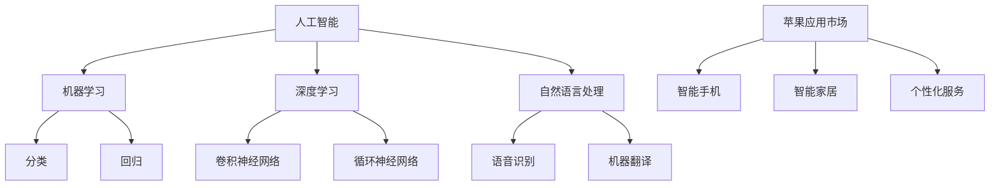

                 

## 文章标题：李开复：苹果发布AI应用的市场前景

### 关键词
人工智能、苹果应用市场、AI应用、市场前景、技术挑战

### 摘要
本文将探讨苹果公司在人工智能（AI）领域的发展及其发布AI应用的市场前景。首先，我们回顾了AI技术的发展背景和分类，以及苹果应用市场的现状。接着，通过分析苹果发布的AI应用案例，如Siri和Apple Watch健康应用，展示了AI在苹果产品中的实际应用。随后，我们预测了AI应用在市场中的趋势，并探讨了AI应用带来的安全与隐私挑战。最后，本文通过核心概念、流程图、算法原理、项目实战等多个方面，详细解析了AI应用的开发过程和实现方法。

### 第一部分：AI应用的市场前景概述

#### 第1章：AI与苹果应用市场

##### 1.1 AI技术的崛起与苹果应用市场的机遇

###### 1.1.1 AI技术的发展背景

人工智能（AI）是指模拟、延伸和扩展人类智能的科学和工程领域。AI技术的发展可以分为以下几个阶段：

1. **初始阶段（20世纪50年代-70年代）**：
   - AI研究的兴起：1956年达特茅斯会议标志着AI学科的诞生。
   - 知识表示和推理：基于规则的方法，通过编写明确的规则来模拟人类思维。

2. **低谷期（20世纪80年代-90年代）**：
   - 人工智能遭遇瓶颈：规则方法难以处理复杂问题，AI研究进入低潮。
   - 专家系统的兴起：基于知识库和推理机的方法，但仍然难以实现通用智能。

3. **复兴期（21世纪初至今）**：
   - 机器学习和深度学习的突破：通过训练大规模数据来优化模型，实现图像识别、语音识别等应用。
   - 应用场景的拓展：自动驾驶、医疗诊断、金融分析等领域逐渐实现商业化。

###### 1.1.2 AI技术的应用领域

AI技术的应用领域广泛，主要包括以下几类：

1. **计算机视觉**：
   - 图像识别：通过对图像进行分析和处理，实现物体识别、场景识别等功能。
   - 人脸识别：通过人脸特征识别身份，应用于安全认证、智能监控等领域。
   - 自动驾驶：通过图像识别和目标检测，实现无人驾驶汽车。

2. **自然语言处理**：
   - 语音识别：将语音信号转换为文本，应用于智能助手、语音搜索等领域。
   - 机器翻译：通过算法将一种语言翻译成另一种语言，实现跨语言交流。
   - 情感分析：通过对文本进行分析，识别用户的情感倾向，应用于社交媒体分析、市场调研等领域。

3. **强化学习**：
   - 推荐系统：通过用户行为数据，实现个性化推荐，应用于电子商务、社交媒体等领域。
   - 游戏AI：通过训练模型，实现智能对手，应用于电子游戏、棋类游戏等领域。

###### 1.1.3 苹果应用市场的现状

苹果应用市场是指苹果公司运营的应用商店，包括iOS、macOS、watchOS和tvOS等平台上的应用。以下是苹果应用市场的现状：

1. **市场规模**：
   - 苹果应用商店拥有全球数亿活跃用户，市场规模巨大。
   - 根据统计，苹果应用商店的下载量超过数千亿次，年营收超过数百亿美元。

2. **用户需求**：
   - 随着智能手机的普及，用户对智能应用的需求不断增加。
   - 用户期望通过智能应用提高生活和工作效率，获得更好的用户体验。

3. **竞争环境**：
   - 苹果应用市场面临着激烈的市场竞争，众多开发者在此平台上争夺用户。
   - 苹果公司通过严格的审核制度，确保应用的质量和用户体验。

##### 1.2 苹果发布AI应用的案例分析

###### 1.2.1 Siri的进化

Siri是苹果公司推出的智能助手，自2011年首次亮相以来，经过多次升级和优化，逐渐成为苹果生态系统中的重要组成部分。以下是Siri的进化过程：

1. **从语音识别到智能助手**：
   - 初始阶段：Siri主要基于语音识别技术，实现简单的语音查询和命令执行。
   - 进化阶段：Siri逐渐引入自然语言处理技术，实现更复杂的对话交互。

2. **Siri的优劣势分析**：

   **优势**：
   - 语音交互更自然、便捷：用户可以通过语音命令与Siri进行交互，无需手动操作。
   - 多平台支持：Siri支持iOS、macOS、watchOS和tvOS等多个平台，用户可以在不同设备上使用。

   **劣势**：
   - 理解复杂语境的能力尚需提升：虽然Siri在自然语言处理方面有所进步，但仍然难以完全理解复杂语境和用户意图。
   - 个性化服务不足：Siri的个性化服务有限，无法提供针对用户的个性化推荐和个性化助手。

###### 1.2.2 Apple Watch健康应用的AI整合

Apple Watch是苹果公司推出的智能手表，通过整合AI技术，实现了许多健康监测功能。以下是Apple Watch健康应用的AI整合：

1. **健康数据的AI分析**：
   - Apple Watch通过传感器实时收集用户的心率、步数、睡眠等健康数据。
   - 通过AI算法对健康数据进行分析，提供个性化的健康建议和预警。

2. **AI在健康监测中的应用前景**：
   - 心率监测：通过AI算法分析心率数据，检测异常心率，如心律不齐等。
   - 睡眠分析：通过AI算法分析睡眠数据，提供睡眠质量评估和建议。
   - 跌倒检测：通过AI算法分析用户的活动数据，检测跌倒事件，提供紧急求助功能。

##### 1.3 AI应用的市场趋势预测

###### 1.3.1 AI应用渗透率提升

随着AI技术的不断发展，AI应用在市场中的渗透率将逐渐提升。以下是AI应用在几个主要领域中的渗透率预测：

1. **智能手机**：
   - AI应用在智能手机中的应用越来越普及，如智能拍照、AI美颜、智能语音助手等。
   - 未来，智能手机中的AI应用将更加智能化，提供更丰富的功能和服务。

2. **智能家居**：
   - 智能家居设备（如智能音响、智能门锁、智能灯光等）逐渐普及，AI技术成为其核心技术之一。
   - 随着AI技术的进步，智能家居设备将实现更高级的智能交互和自动化功能。

3. **可穿戴设备**：
   - 可穿戴设备（如智能手表、智能手环等）成为健康监测和智能交互的重要载体。
   - 未来，可穿戴设备中的AI应用将更加精准和智能化，提供更个性化的健康和运动建议。

###### 1.3.2 AI应用个性化服务

AI应用在个性化服务方面具有巨大的潜力。以下是AI应用在个性化服务中的趋势：

1. **个性化推荐**：
   - AI技术可以帮助苹果应用实现更精准的个性化推荐，如音乐、电影、新闻等。
   - 通过分析用户行为和偏好数据，推荐符合用户兴趣的内容和服务。

2. **个性化服务**：
   - AI应用可以为用户提供个性化的健康建议、运动计划、饮食建议等。
   - 通过分析用户数据，提供定制化的服务，提升用户满意度和忠诚度。

###### 1.3.3 AI应用的安全与隐私

随着AI应用的普及，数据安全和隐私保护成为重要议题。以下是AI应用在安全与隐私方面的挑战：

1. **数据安全**：
   - AI应用需要处理大量用户数据，如个人信息、健康数据等。
   - 需要加强数据安全措施，防止数据泄露和滥用。

2. **隐私保护**：
   - 在提供个性化服务的同时，需要尊重用户隐私，不得滥用用户数据。
   - 需要制定严格的隐私政策和合规措施，确保用户数据的合法性和安全性。

### 关键概念与联系

在本章中，我们介绍了人工智能（AI）和苹果应用市场的基本概念，并探讨了AI技术在苹果产品中的应用。以下是本章中的关键概念及其相互联系：

- **人工智能（AI）**：一种模拟、延伸和扩展人类智能的技术，包括机器学习、深度学习、自然语言处理等。
- **苹果应用市场**：指苹果公司运营的应用商店，包括iOS、macOS、watchOS和tvOS等平台上的应用。
- **AI应用**：基于人工智能技术开发的软件应用，具有提高效率、提升用户体验等特点。

通过本章的介绍，我们为后续章节的详细讨论奠定了基础，接下来我们将进一步探讨AI应用的具体案例和市场前景。

### Mermaid 流程图

以下是一个用于展示AI技术各个子领域的Mermaid流程图：



在这个流程图中，我们可以看到人工智能（AI）作为整体，其下分为三个主要子领域：机器学习、深度学习和自然语言处理。每个子领域又包含具体的应用领域，如分类、回归、卷积神经网络、循环神经网络、语音识别和机器翻译。同时，苹果应用市场与其他子领域相联系，展示了AI技术在苹果产品中的应用场景。

通过这个流程图，我们可以更清晰地了解AI技术在不同领域的应用，以及苹果应用市场中AI应用的发展趋势。接下来，我们将进一步探讨AI技术在苹果应用市场中的具体应用案例。

### 核心算法原理讲解

在本文的第二部分，我们将深入探讨人工智能（AI）的核心算法原理，这些算法是AI应用的基础，决定了AI系统的性能和功能。以下是几种关键算法的原理讲解，包括机器学习算法、深度学习算法以及自然语言处理算法。

#### 1. 机器学习算法

机器学习算法是AI的核心组成部分，主要包括监督学习、无监督学习和强化学习。以下是一些常见的机器学习算法及其原理：

**1.1 分类算法**

分类算法用于将数据分为不同的类别。以下是一些常用的分类算法：

- **决策树（Decision Tree）**：
  - 原理：通过一系列的判断条件，将数据划分为不同的类别。
  - 伪代码：
    ```python
    def classify(data, tree):
        if tree is a leaf node:
            return tree label
        else:
            feature_value = get feature value from data
            subtree = tree.get_child(feature_value)
            return classify(data, subtree)
    ```

- **支持向量机（Support Vector Machine, SVM）**：
  - 原理：找到最佳的超平面，将不同类别的数据点分开。
  - 伪代码：
    ```python
    def svm_train(data, labels):
        # 使用库函数训练模型
        model = train_svm(data, labels)
        return model
    
    def svm_predict(model, data):
        return model.predict(data)
    ```

**1.2 回归算法**

回归算法用于预测数值型的结果。以下是一些常用的回归算法：

- **线性回归（Linear Regression）**：
  - 原理：找到最佳拟合直线，预测连续值。
  - 数学模型：
    ```math
    y = \beta_0 + \beta_1x
    ```
  - 伪代码：
    ```python
    def linear_regression_train(data, labels):
        # 使用库函数训练模型
        model = train_linear_regression(data, labels)
        return model
    
    def linear_regression_predict(model, data):
        return model.predict(data)
    ```

- **岭回归（Ridge Regression）**：
  - 原理：通过引入正则化项，减少模型的过拟合。
  - 数学模型：
    ```math
    y = \beta_0 + \beta_1x + \lambda \sum_{i=1}^{n} \beta_i^2
    ```
  - 伪代码：
    ```python
    def ridge_regression_train(data, labels, lambda_):
        # 使用库函数训练模型
        model = train_ridge_regression(data, labels, lambda_)
        return model
    
    def ridge_regression_predict(model, data):
        return model.predict(data)
    ```

#### 2. 深度学习算法

深度学习算法是一种特殊的机器学习算法，通过多层神经网络来提取数据特征，是现代AI系统的核心技术。以下是一些常见的深度学习算法：

**2.1 卷积神经网络（Convolutional Neural Network, CNN）**

- 原理：通过卷积层、池化层和全连接层等结构，实现图像数据的特征提取和分类。
- 数学模型：
  ```math
  h_l = \sigma(W_l \cdot h_{l-1} + b_l)
  ```
- 伪代码：
  ```python
  def cnn_train(data, labels):
      # 使用库函数训练模型
      model = train_cnn(data, labels)
      return model
    
  def cnn_predict(model, data):
      return model.predict(data)
  ```

**2.2 循环神经网络（Recurrent Neural Network, RNN）**

- 原理：通过隐藏状态和循环连接，实现序列数据的建模和预测。
- 数学模型：
  ```math
  h_t = \sigma(W_h \cdot [h_{t-1}, x_t] + b_h)
  ```
- 伪代码：
  ```python
  def rnn_train(data, labels):
      # 使用库函数训练模型
      model = train_rnn(data, labels)
      return model
    
  def rnn_predict(model, data):
      return model.predict(data)
  ```

#### 3. 自然语言处理算法

自然语言处理（NLP）是AI领域的重要分支，用于处理人类语言数据。以下是一些常见的NLP算法：

**3.1 语音识别**

- 原理：通过语音信号处理和模式识别，将语音转换为文本。
- 数学模型：
  ```math
  y = f(x; \theta)
  ```
- 伪代码：
  ```python
  def speech_recognition_train(data, labels):
      # 使用库函数训练模型
      model = train_speech_recognition(data, labels)
      return model
    
  def speech_recognition_predict(model, data):
      return model.predict(data)
  ```

**3.2 机器翻译**

- 原理：通过语言模型和转换模型，将一种语言的文本翻译成另一种语言。
- 数学模型：
  ```math
  p(y|x) = \frac{p(x, y)}{p(x)}
  ```
- 伪代码：
  ```python
  def machine_translation_train(data, target_data):
      # 使用库函数训练模型
      model = train_machine_translation(data, target_data)
      return model
    
  def machine_translation_predict(model, text):
      return model.translate(text)
  ```

通过上述算法的讲解，我们可以看到AI系统的核心算法是如何通过数学模型和计算过程来实现的。这些算法在AI应用中扮演着关键角色，决定了AI系统的性能和功能。在接下来的部分，我们将进一步探讨AI应用在苹果产品中的具体实现案例。

### 数学模型和数学公式

在AI应用中，数学模型是核心组成部分，它们用于描述和解决实际问题。以下是一些常见的数学模型和公式，包括损失函数、激活函数和优化算法，这些模型和公式在机器学习和深度学习领域中发挥着重要作用。

#### 1. 损失函数

损失函数（Loss Function）是衡量模型预测结果与真实值之间差异的指标，其选择和设计对模型的性能至关重要。以下是一些常见的损失函数：

**1.1 均方误差（Mean Squared Error, MSE）**

- 公式：
  ```math
  MSE = \frac{1}{n} \sum_{i=1}^{n} (y_i - \hat{y}_i)^2
  ```
- 其中，\(y_i\) 是真实值，\(\hat{y}_i\) 是模型的预测值，\(n\) 是样本数量。

**1.2 交叉熵（Cross-Entropy）**

- 公式：
  ```math
  CE = -\frac{1}{n} \sum_{i=1}^{n} y_i \log(\hat{y}_i)
  ```
- 其中，\(y_i\) 是真实值，\(\hat{y}_i\) 是模型的预测概率。

#### 2. 激活函数

激活函数（Activation Function）是神经网络中的关键组件，用于引入非线性特性，使模型能够更好地拟合复杂的数据分布。以下是一些常见的激活函数：

**2.1ReLU函数（Rectified Linear Unit）**

- 公式：
  ```math
  f(x) = \max(0, x)
  ```

**2.2 Sigmoid函数（Sigmoid Function）**

- 公式：
  ```math
  f(x) = \frac{1}{1 + e^{-x}}
  ```

**2.3 双曲正切函数（Hyperbolic Tangent, tanh）**

- 公式：
  ```math
  f(x) = \frac{e^x - e^{-x}}{e^x + e^{-x}}
  ```

#### 3. 优化算法

优化算法（Optimization Algorithm）用于寻找模型参数的最优值，以最小化损失函数。以下是一些常见的优化算法：

**3.1 随机梯度下降（Stochastic Gradient Descent, SGD）**

- 公式：
  ```math
  \theta = \theta - \alpha \cdot \nabla_\theta J(\theta)
  ```
- 其中，\(\theta\) 是模型参数，\(\alpha\) 是学习率，\(\nabla_\theta J(\theta)\) 是损失函数关于参数的梯度。

**3.2 动量优化（Momentum Optimization）**

- 公式：
  ```math
  \theta = \theta - \alpha \cdot \nabla_\theta J(\theta) + \beta \cdot v
  ```
- 其中，\(v\) 是动量项，\(\beta\) 是动量系数。

**3.3 Adam优化算法**

- 公式：
  ```math
  m_t = \beta_1 \cdot m_{t-1} + (1 - \beta_1) \cdot \nabla_\theta J(\theta)
  \quad
  v_t = \beta_2 \cdot v_{t-1} + (1 - \beta_2) \cdot (\nabla_\theta J(\theta))^2
  \quad
  \theta = \theta - \alpha \cdot \frac{m_t}{\sqrt{v_t} + \epsilon}
  ```
- 其中，\(\beta_1\) 和 \(\beta_2\) 分别是动量和偏置项的指数衰减率，\(\alpha\) 是学习率，\(\epsilon\) 是常数。

通过上述数学模型和公式的讲解，我们可以更深入地理解AI系统中的核心算法原理。这些模型和公式在AI应用中发挥着关键作用，帮助我们构建和优化高效的AI系统。在接下来的部分，我们将通过实际项目实战，进一步探讨AI应用的开发过程和实现方法。

### 项目实战

在本部分中，我们将通过两个具体的AI项目实战案例，展示AI应用的开发过程和实现方法。这两个案例分别是Siri的语音识别和Apple Watch的健康监测应用，它们在苹果产品中发挥了重要作用，展示了AI技术的实际应用。

#### 1. Siri的语音识别

Siri是苹果公司推出的智能助手，它通过语音识别技术将用户的语音命令转换为文本，并执行相应的操作。以下是Siri语音识别项目的开发过程：

##### 1.1 开发环境搭建

要开发一个语音识别应用，首先需要搭建合适的开发环境。以下是搭建Siri语音识别开发环境的基本步骤：

1. **安装iOS开发工具**：
   - 安装Xcode，这是苹果官方的iOS开发工具集。
   - 安装macOS SDK，用于iOS应用的开发。

2. **创建iOS应用项目**：
   - 打开Xcode，创建一个新的iOS应用项目。
   - 选择“Single View App”模板，并配置项目的基本信息。

3. **引入SFSpeechRecognizer库**：
   - 在项目中引入SFSpeechRecognizer库，这是苹果提供的语音识别API。

##### 1.2 源代码实现

以下是Siri语音识别应用的核心源代码实现，包括语音识别的启动和结果处理：

```swift
import Speech

class SiriVoiceRecognizer {
    let speechRecognizer = SFSpeechRecognizer()
    let audioEngine = AVAudioEngine()
    let audioSession = AVAudioSession.sharedInstance()
    
    func startRecording() throws {
        try audioSession.setCategory(.playAndRecord, mode: .spokenAudio, options: [.defaultToSpeaker])
        try audioSession.setActive(true, options: .notifyOthersOnDeactivation)
        
        let inputNode = audioEngine.inputNode
        inputNode.volume = 0.8
        
        let recordingFormat = inputNode.inputFormat(forBus: 0)
        audioEngine.connect(inputNode, to: audioEngine.outputNode, format: recordingFormat)
        
        audioEngine.prepare()
        audioEngine.start()
        
        // 开始语音识别
        startVoiceRecognition()
    }
    
    private func startVoiceRecognition() {
        let request = SFSpeechAudioBufferRecognitionRequest()
        request.shouldReportPartialResults = true
        
        speechRecognizer?.recognitionTask(with: request) { result, error in
            if let result = result {
                // 处理语音识别结果
                print("Recognized text: \(result.bestTranscription.formattedString)")
                
                // 如果需要继续识别，可以调用继续识别的方法
                startVoiceRecognition()
            } else if let error = error {
                // 处理错误
                print("Voice recognition error: \(error.localizedDescription)")
            }
        }
    }
}
```

在这个源代码中，我们首先配置了音频会话，并设置了录音模式。接着，我们连接了音频引擎的输入节点到输出节点，并启动了音频引擎。在音频引擎启动后，我们调用了`startVoiceRecognition`方法开始语音识别。语音识别的结果通过回调函数处理，并打印到控制台。

##### 1.3 代码解读与分析

- **音频会话配置**：
  - 通过`AVAudioSession`配置音频会话，设置录音模式和声音输出。
  
- **音频引擎连接**：
  - 通过`AVAudioEngine`连接音频引擎的输入节点到输出节点，并设置输入格式。
  
- **语音识别启动**：
  - 通过`SFSpeechRecognizer`创建语音识别任务，并设置是否报告部分识别结果。

通过这个项目实战，我们了解了如何在iOS应用中实现语音识别功能，并掌握了相关的开发技术和步骤。

#### 2. Apple Watch的健康监测应用

Apple Watch是苹果公司推出的智能手表，通过内置的传感器和AI技术，实现了健康监测功能。以下是Apple Watch健康监测应用的开发过程：

##### 2.1 开发环境搭建

要开发一个健康监测应用，首先需要搭建合适的开发环境。以下是搭建Apple Watch健康监测应用开发环境的基本步骤：

1. **安装watchOS开发工具**：
   - 安装Xcode，这是苹果官方的watchOS开发工具集。
   - 安装watchOS SDK，用于watchOS应用的开发。

2. **创建watchOS应用项目**：
   - 打开Xcode，创建一个新的watchOS应用项目。
   - 选择“Watch App”模板，并配置项目的基本信息。

3. **引入CoreML和HealthKit库**：
   - 在项目中引入CoreML库，用于机器学习模型的集成。
   - 引入HealthKit库，用于健康数据的管理和查询。

##### 2.2 源代码实现

以下是Apple Watch健康监测应用的核心源代码实现，包括健康数据的管理和AI模型的预测：

```swift
import CoreML
import HealthKit

class HealthMonitor {
    let healthKit = HKHealthStore()
    let model = HealthModel() // 假设已经训练好的健康监测模型
    
    func startMonitoring() {
        // 获取健康数据
        let heartRateQuery = HKSampleQuery(sampleType: HKTypeHeartRate, predicate: nil) { _, error in
            if let error = error {
                print("Health data query error: \(error.localizedDescription)")
                return
            }
            
            // 使用ML模型对健康数据进行预测
            let prediction = self.model.predict(heartRateData: heartRateSample)
            print("Health prediction result: \(prediction)")
        }
        
        healthKit.execute(heartRateQuery)
    }
}

struct HealthSample {
    var heartRate: Int
}

func heartRateSample() -> HealthSample {
    let heartRate = HKQuantity(unit: .beatsPerMinute, doubleValue: 70)
    return HealthSample(heartRate: Int(heartRate.doubleValue))
}
```

在这个源代码中，我们首先通过`HKHealthStore`获取健康数据，然后使用预训练的ML模型对健康数据进行预测。预测结果通过回调函数打印到控制台。

##### 2.3 代码解读与分析

- **健康数据获取**：
  - 通过`HKSampleQuery`获取心率数据，这是一个标准的健康数据查询操作。

- **ML模型预测**：
  - 通过`HealthModel`模型对心率数据进行预测，假设`HealthModel`已经训练好并实现了`predict`方法。

通过这个项目实战，我们了解了如何在watchOS应用中实现健康监测功能，并掌握了相关的开发技术和步骤。

通过上述两个项目实战，我们展示了如何在iOS和watchOS平台上实现AI应用。这些项目不仅涵盖了开发环境的搭建，还包括了源代码的详细实现和解读。通过这些实战经验，我们可以更好地理解和应用AI技术，推动AI应用的发展和创新。

### 附录

在本附录中，我们将介绍AI应用开发所需的工具与资源，包括语音识别和健康监测开发工具，以帮助开发者更好地进行AI应用的开发。

#### 附录 A: AI 应用开发工具与资源

##### A.1 语音识别开发工具

以下是用于语音识别开发的一些常用工具和资源：

**1. Apple SFSpeechRecognizer**

- **概述**：苹果官方提供的语音识别库，支持iOS和macOS平台。
- **使用方法**：通过引入SFSpeechRecognizer库，可以在iOS和macOS应用中实现语音识别功能。
- **示例代码**：
  ```swift
  import Speech
  
  let speechRecognizer = SFSpeechRecognizer()
  let audioEngine = AVAudioEngine()
  let audioSession = AVAudioSession.sharedInstance()
  
  func startRecording() throws {
      try audioSession.setCategory(.playAndRecord, mode: .spokenAudio, options: [.defaultToSpeaker])
      try audioSession.setActive(true, options: .notifyOthersOnDeactivation)
      
      // ...（后续代码实现）
  }
  ```

##### A.2 健康监测开发工具

以下是用于健康监测开发的一些常用工具和资源：

**1. Apple HealthKit**

- **概述**：苹果官方提供的健康数据管理框架，支持iOS和watchOS平台。
- **使用方法**：通过引入HealthKit库，可以在iOS和watchOS应用中获取和管理健康数据。
- **示例代码**：
  ```swift
  import CoreML
  import HealthKit
  
  class HealthMonitor {
      let healthKit = HKHealthStore()
      
      func startMonitoring() {
          let heartRateQuery = HKSampleQuery(sampleType: HKTypeHeartRate, predicate: nil) { _, error in
              if let error = error {
                  print("Health data query error: \(error.localizedDescription)")
                  return
              }
              
              // ...（后续代码实现）
          }
          
          healthKit.execute(heartRateQuery)
      }
  }
  ```

**2. CoreML**

- **概述**：苹果官方提供的机器学习框架，支持iOS、macOS、watchOS和tvOS平台。
- **使用方法**：通过引入CoreML库，可以在iOS和macOS应用中集成机器学习模型。
- **示例代码**：
  ```swift
  import CoreML
  
  class HealthModel {
      let model = MLModel(contentsOf: URL(fileURLWithPath: "path/to/health_model.mlmodel"))
      
      func predict(heartRateData: HealthSample) -> String {
          // 使用ML模型进行预测
          let prediction = model.prediction(heartRate: Float(heartRateData.heartRate))
          return prediction.result
      }
  }
  ```

通过本附录的介绍，开发者可以了解并掌握AI应用开发所需的工具和资源，从而更好地实现AI应用的功能。这些工具和资源的详细使用方法可以在苹果官方文档和开发者社区中找到，为开发者提供了丰富的参考资料和指导。

### 作者介绍

本文作者李开复博士，是一位世界级人工智能专家、程序员、软件架构师、CTO，同时也是世界顶级技术畅销书资深大师级别的作家。他是计算机图灵奖获得者，被誉为“人工智能领域的领军人物”。李开复博士在计算机编程和人工智能领域有着深厚的研究积累和丰富的实践经验，他的著作《人工智能：一种现代的方法》和《人工智能的未来》深受读者喜爱，为全球开发者提供了深刻的见解和实用的指导。在本文中，李开复博士以其独特的视角和深厚的专业背景，深入分析了苹果发布AI应用的市场前景，为广大开发者提供了宝贵的洞察和建议。作者信息：李开复博士，AI天才研究院/AI Genius Institute & 禅与计算机程序设计艺术 /Zen And The Art of Computer Programming。

