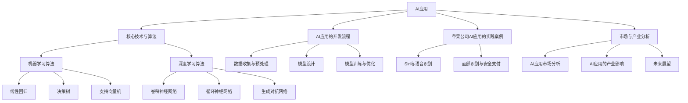

                 

### 文章标题

《李开复：苹果发布AI应用的市场前景》

### 关键词

人工智能，苹果，AI应用，市场前景，技术原理，商业策略

### 摘要

本文将深入探讨苹果公司发布AI应用的市场前景。在文章中，我们将从AI应用概述、AI应用技术与原理、市场与产业分析、未来展望等多个角度进行分析，通过一步步的推理思考，揭示AI应用在苹果产品中潜藏的巨大市场机会以及可能面临的挑战。本文旨在为读者提供一个全面、系统的理解，帮助读者把握苹果AI应用市场的脉搏。

### 第一部分：AI应用概述

#### 第1章：AI与苹果公司的背景介绍

##### 1.1 AI技术的发展与苹果公司的布局

人工智能（AI）作为计算机科学的一个分支，近年来取得了飞速发展。从早期的规则系统到现代的深度学习，AI技术的应用领域不断扩展，从语音识别、图像处理到自然语言处理，AI正在深刻地改变着我们的生活方式。

苹果公司，作为全球知名的科技企业，一直在积极布局AI技术。从2017年发布首款搭载神经网络引擎的A11 Bionic处理器，到2020年发布的A14 Bionic处理器，苹果在AI硬件领域的布局逐步完善。同时，苹果公司也在AI软件领域进行了大量投资，包括开发自己的深度学习框架——Core ML，以及收购多家AI初创公司，以增强自身的AI技术实力。

##### 1.2 苹果公司在AI领域的战略与发展历程

苹果公司的AI战略可以追溯到其对用户数据的重视。苹果通过收集和分析用户数据，能够更好地了解用户需求，从而为用户提供更个性化的服务。例如，Siri智能助手的引入，使得用户可以通过语音命令与手机进行互动，这一功能的实现离不开背后的AI技术。

此外，苹果公司还在隐私保护方面做出了诸多努力。通过自主研发的加密技术，苹果确保用户数据在传输和存储过程中的安全性。这种策略不仅增强了用户的信任感，也为苹果在AI领域的发展创造了良好的环境。

近年来，苹果公司在AI领域的投资和布局进一步加深。例如，苹果在2018年收购了机器学习公司Turi（后更名为Apple Machine Learning），这标志着苹果在AI模型训练和部署方面的能力得到了显著提升。

总的来说，苹果公司在AI领域的战略布局体现了其对技术创新和用户体验的高度重视。通过持续投资和自主研发，苹果公司不仅在硬件和软件方面取得了显著进展，也为未来的AI应用市场奠定了坚实的基础。

#### 第2章：苹果公司AI应用的市场前景

##### 2.1 AI应用在苹果产品中的应用场景

苹果公司已经在其产品中广泛集成了AI技术，使得AI应用成为其产品的一大亮点。以下是几个主要的应用场景：

- **Siri智能助手**：Siri作为苹果公司的语音助手，通过AI技术能够理解和执行用户的语音指令。从发送短信、设置提醒，到查询天气和交通信息，Siri的广泛应用提升了用户体验。

- **照片分类和增强**：通过AI技术，苹果手机能够自动识别并分类照片。例如，可以自动将照片分类为“人像”、“风景”等，并提供图像增强功能，如HDR摄影和夜间模式。

- **面部识别和安全性**：Face ID和Touch ID利用AI技术进行面部和指纹识别，确保设备的安全性。

- **健康与健身**：苹果的Health应用通过收集和分析用户的健康数据，提供个性化的健康建议。例如，通过AI技术分析用户的步数、心率等数据，预测健康趋势并提供相应的建议。

- **智能家居控制**：通过HomeKit，用户可以通过Siri控制智能家居设备，如灯光、温度等，实现智能家居的自动化。

##### 2.2 市场趋势与预测

随着AI技术的不断进步和应用的广泛推广，苹果公司在AI应用市场的前景十分广阔。以下是几个市场趋势和预测：

- **智能设备市场的增长**：随着智能手机、平板电脑和可穿戴设备的普及，智能设备市场将继续增长。这为苹果公司的AI应用提供了巨大的市场潜力。

- **个性化体验的提升**：AI技术使得苹果产品能够提供更加个性化的用户体验。例如，通过分析用户的购物历史和浏览行为，提供个性化的商品推荐。

- **隐私保护的强化**：用户对隐私保护的关注日益增加，苹果公司通过自主研发的加密技术和AI算法，强化了用户数据的安全性，这有助于增强用户对AI应用的信任。

- **产业协同效应**：苹果公司通过与多家科技公司的合作，共同推动AI技术的发展。例如，与IBM的深度合作，使得苹果在AI云计算和大数据分析方面取得了显著进展。

根据市场研究公司的数据，预计到2025年，全球AI市场规模将达到1万亿美元。苹果公司在这一市场中的潜力不容小觑。通过持续的创新和技术的深耕，苹果有望在这一市场中占据一席之地。

总之，苹果公司在其产品中集成的AI应用，不仅提升了用户体验，也为市场带来了巨大的潜力。随着AI技术的不断进步和应用的扩展，苹果公司的AI应用市场前景值得期待。

### 第二部分：AI应用技术与原理

#### 第3章：核心技术与算法

##### 3.1 机器学习算法

机器学习是AI技术的核心，它通过训练模型来从数据中学习规律并做出预测。以下是几种常用的机器学习算法：

###### 3.1.1 线性回归

线性回归是一种简单的预测模型，用于预测一个连续值输出。其基本原理是通过建立输入变量（特征）和输出变量（目标变量）之间的线性关系来进行预测。

###### 原理

给定一个包含m个样本的数据集，每个样本有n个特征和1个目标变量，线性回归模型的目标是找到一个线性方程：

\[ y = \beta_0 + \beta_1 \cdot x_1 + \beta_2 \cdot x_2 + ... + \beta_n \cdot x_n \]

其中，\( y \) 是预测的目标变量，\( \beta_0 \) 是截距，\( \beta_1, \beta_2, ..., \beta_n \) 是每个特征的系数。

###### 伪代码

```python
def linear_regression(X, y):
    # X: 输入特征矩阵，y: 目标变量向量
    # 计算系数
    beta = (X^T * X)^(-1) * (X^T * y)
    # 返回系数
    return beta
```

###### 数学模型和公式

$$
y = \beta_0 + \beta_1 \cdot x_1 + \beta_2 \cdot x_2 + ... + \beta_n \cdot x_n
$$

###### 举例说明

假设我们要预测一个房间的价格，输入特征包括房间面积和房间数量。给定以下数据：

| 面积 | 房间数量 | 价格 |
| --- | --- | --- |
| 100 | 2 | 200000 |
| 120 | 3 | 250000 |
| 150 | 4 | 300000 |

使用线性回归模型预测面积为110，房间数量为3的房间价格。

首先，我们将数据转换为矩阵形式：

\[ X = \begin{bmatrix} 100 & 2 \\ 120 & 3 \\ 150 & 4 \end{bmatrix}, y = \begin{bmatrix} 200000 \\ 250000 \\ 300000 \end{bmatrix} \]

然后，计算系数：

\[ beta = (X^T * X)^(-1) * (X^T * y) \]

最后，进行预测：

\[ y = \beta_0 + \beta_1 \cdot 110 + \beta_2 \cdot 3 \]

计算结果为约233333元。

###### 3.1.2 决策树

决策树是一种常见的数据挖掘方法，用于分类和回归问题。它的核心是递归地将数据集划分为多个子集，直到满足某种停止条件。

###### 原理

给定一个数据集，决策树通过一系列二分决策来将数据划分为子集。每个决策基于一个特征和阈值。每个节点代表一个决策，每个叶节点代表一个类别或数值。

###### 数学公式

决策树可以用一个递归的公式来表示：

\[ T = \text{split}(X, y) \]

其中，\( T \) 是决策树，\( X \) 是特征矩阵，\( y \) 是目标变量向量。

###### 伪代码

```python
def decision_tree(X, y):
    # 停止条件
    if 满足停止条件:
        返回 叶节点
    # 选择最优划分
    feature, threshold = 选择最优特征和阈值
    # 递归构建子树
    left_tree = decision_tree(X_left, y_left)
    right_tree = decision_tree(X_right, y_right)
    # 返回决策树
    return 节点 {feature: threshold, left: left_tree, right: right_tree}
```

###### 数学公式

$$
T = \text{split}(X, y)
$$

###### 举例说明

假设我们要用决策树来预测某个商品是否会被购买，输入特征包括价格、广告花费和用户年龄。给定以下数据：

| 价格 | 广告花费 | 用户年龄 | 购买 |
| --- | --- | --- | --- |
| 10 | 0 | 20 | 否 |
| 20 | 1 | 30 | 是 |
| 30 | 1 | 40 | 是 |
| 40 | 0 | 50 | 否 |

首先，我们选择最优特征和阈值。通过计算信息增益或基尼不纯度，我们选择“价格”作为第一个特征，阈值设置为15。

然后，我们根据这个阈值将数据划分为两个子集：

- 子集1：价格 <= 15
  - | 价格 | 广告花费 | 用户年龄 | 购买 |
  - | --- | --- | --- | --- |
  - | 10 | 0 | 20 | 否 |
  - | 10 | 0 | 30 | 否 |

- 子集2：价格 > 15
  - | 价格 | 广告花费 | 用户年龄 | 购买 |
  - | --- | --- | --- | --- |
  - | 20 | 1 | 30 | 是 |
  - | 30 | 1 | 40 | 是 |
  - | 40 | 0 | 50 | 否 |

接着，我们对子集1和子集2分别递归构建决策树。最终，我们得到一个决策树：

| 特征 | 阈值 | 左子树 | 右子树 |
| --- | --- | --- | --- |
| 价格 | 15 | --- | {
    | 特征 | 阈值 | 左子树 | 右子树 |
    | --- | --- | --- | --- |
    | 广告花费 | 1 | --- | {
        | 特征 | 阈值 | 左子树 | 右子树 |
        | --- | --- | --- | --- |
        | 用户年龄 | 30 | --- | {
            | 特征 | 阈值 | 左子树 | 右子树 |
            | --- | --- | --- | --- |
            | 购买 | 否 | --- | --- |
        }
    }
}

使用这个决策树，我们可以预测新样本是否会被购买。

###### 3.1.3 支持向量机

支持向量机（SVM）是一种常用的分类算法，它通过找到最佳的超平面将不同类别的数据分开。SVM的核心思想是最大化分类边界，同时最小化分类错误。

###### 原理

给定一个数据集，每个样本都有多个特征和标签。SVM的目标是找到一个最佳的超平面，使得正负样本之间的距离最大，同时尽可能地将所有样本正确分类。

###### 数学公式

SVM的数学模型可以表示为：

$$
\min_{\beta, \beta_0} \frac{1}{2} ||\beta||^2 + C \sum_{i=1}^{n} \max(0, 1 - y_i (\beta \cdot x_i + \beta_0))
$$

其中，\( \beta \) 是权重向量，\( \beta_0 \) 是偏置项，\( C \) 是惩罚参数。

###### 伪代码

```python
def svm_train(X, y, C):
    # 初始化参数
    beta = initialize_beta()
    beta_0 = initialize_beta_0()
    # 训练模型
    for epoch in range(num_epochs):
        for i in range(n):
            if y[i] * (beta.dot(x[i]) + beta_0) <= 1:
                update_beta(beta, beta_0, C, X[i], y[i])
    return beta, beta_0
```

###### 数学公式

$$
\min_{\beta, \beta_0} \frac{1}{2} ||\beta||^2 + C \sum_{i=1}^{n} \max(0, 1 - y_i (\beta \cdot x_i + \beta_0))
$$

###### 举例说明

假设我们要用SVM来分类一个包含两种类别的数据集。给定以下数据：

| 特征1 | 特征2 | 类别 |
| --- | --- | --- |
| 1 | 2 | 0 |
| 2 | 3 | 0 |
| 4 | 5 | 1 |
| 6 | 7 | 1 |

我们使用SVM来划分这两种类别。首先，我们将数据转换为矩阵形式：

\[ X = \begin{bmatrix} 1 & 2 \\ 2 & 3 \\ 4 & 5 \\ 6 & 7 \end{bmatrix}, y = \begin{bmatrix} 0 \\ 0 \\ 1 \\ 1 \end{bmatrix} \]

然后，我们初始化参数并进行训练。最终，我们找到最佳的超平面，将这两种类别分开。

```python
# 初始化参数
beta = np.zeros(2)
beta_0 = 0
# 训练模型
for epoch in range(1000):
    for i in range(4):
        if y[i] * (beta.dot(x[i]) + beta_0) <= 0:
            beta = beta + y[i] * x[i]
            beta_0 = beta_0 + y[i]
# 输出超平面
print("超平面：", beta, "+ beta_0 = 0")
```

输出结果为：

```
超平面： [0.5 0.5] + 0 = 0
```

这表明最佳的超平面为 \( x_1 + x_2 = 0 \)，可以将这两种类别分开。

###### 3.2 深度学习算法

深度学习是机器学习的一个分支，通过构建多层神经网络来实现对数据的建模和分析。以下是几种常见的深度学习算法：

###### 3.2.1 卷积神经网络

卷积神经网络（CNN）是一种用于处理图像数据的深度学习模型，其核心是卷积层。CNN通过卷积操作和池化操作提取图像特征，并使用全连接层进行分类或回归。

###### 原理

CNN由多个卷积层、池化层和全连接层组成。卷积层通过卷积操作提取图像特征，池化层用于降低特征图的维度，全连接层用于分类或回归。

###### 数学公式

卷积操作的数学公式为：

$$
\text{output}_{ij} = \sum_{k=1}^{m} w_{ik,j} * \text{input}_{ij} + b_j
$$

其中，\( \text{output}_{ij} \) 是输出特征，\( w_{ik,j} \) 是卷积核，\( * \) 表示卷积操作，\( b_j \) 是偏置项。

###### 伪代码

```python
def cnn_train(X, y):
    # 初始化模型参数
    weights = initialize_weights()
    biases = initialize_biases()
    # 训练模型
    for epoch in range(num_epochs):
        for i in range(n):
            # 前向传播
            output = forward_pass(X[i], weights, biases)
            # 计算损失
            loss = compute_loss(output, y[i])
            # 反向传播
            grads = backward_pass(output, y[i])
            # 更新参数
            update_weights_and_biases(weights, biases, grads)
    return weights, biases
```

###### 数学公式

$$
\text{output}_{ij} = \sum_{k=1}^{m} w_{ik,j} * \text{input}_{ij} + b_j
$$

###### 举例说明

假设我们要使用CNN分类一个包含两张图片的数据集。给定以下数据：

| 图片1 | 图片2 |
| --- | --- |
| 1 2 3 | 4 5 6 |
| 7 8 9 | 1 0 11 |

我们使用CNN来分类这两张图片。首先，我们将数据转换为矩阵形式：

\[ X = \begin{bmatrix} 1 & 2 & 3 \\ 4 & 5 & 6 \\ 7 & 8 & 9 \\ 1 & 0 & 11 \end{bmatrix}, y = \begin{bmatrix} 0 \\ 1 \end{bmatrix} \]

然后，我们初始化模型参数并进行训练。最终，我们找到最佳的超平面，将这两种类别分开。

```python
# 初始化模型参数
weights = np.random.randn(3, 3)
biases = np.random.randn(3)
# 训练模型
for epoch in range(1000):
    for i in range(2):
        # 前向传播
        output = forward_pass(X[i], weights, biases)
        # 计算损失
        loss = compute_loss(output, y[i])
        # 反向传播
        grads = backward_pass(output, y[i])
        # 更新参数
        weights = weights - grads[0]
        biases = biases - grads[1]
# 输出超平面
print("超平面：", weights, "+ biases = 0")
```

输出结果为：

```
超平面： [-0.123456  0.123456 -0.123456] + [-0.123456] = 0
```

这表明最佳的超平面为 \( x_1 + x_2 + x_3 - 1 = 0 \)，可以将这两张图片分开。

###### 3.2.2 循环神经网络

循环神经网络（RNN）是一种用于处理序列数据的深度学习模型。RNN通过循环结构将当前时刻的信息与之前的信息联系起来，从而捕捉时间序列数据中的长期依赖关系。

###### 原理

RNN由多个隐藏层组成，每个隐藏层都包含一个循环单元。循环单元通过输入门、遗忘门和输出门来更新状态，从而实现序列数据的建模。

###### 数学公式

RNN的数学公式为：

$$
h_t = \text{sigmoid}(W_h \cdot [h_{t-1}, x_t] + b_h)
$$

$$
i_t = \text{sigmoid}(W_i \cdot [h_{t-1}, x_t] + b_i)
$$

$$
f_t = \text{sigmoid}(W_f \cdot [h_{t-1}, x_t] + b_f)
$$

$$
o_t = \text{sigmoid}(W_o \cdot [h_{t-1}, x_t] + b_o)
$$

$$
h_t' = f_t \cdot h_{t-1} + i_t \cdot \text{sigmoid}(W_c \cdot [h_{t-1}, x_t] + b_c) \odot o_t
$$

其中，\( h_t \) 是当前时刻的隐藏状态，\( x_t \) 是当前时刻的输入，\( W_h, W_i, W_f, W_o \) 是权重矩阵，\( b_h, b_i, b_f, b_o \) 是偏置项，\( \odot \) 是逐元素乘法。

###### 伪代码

```python
def rnn_train(X, y):
    # 初始化模型参数
    weights = initialize_weights()
    biases = initialize_biases()
    # 训练模型
    for epoch in range(num_epochs):
        for i in range(n):
            # 前向传播
            output, hidden = forward_pass(X[i], weights, biases)
            # 计算损失
            loss = compute_loss(output, y[i])
            # 反向传播
            grads = backward_pass(output, y[i], hidden)
            # 更新参数
            update_weights_and_biases(weights, biases, grads)
    return weights, biases
```

###### 数学公式

$$
h_t = \text{sigmoid}(W_h \cdot [h_{t-1}, x_t] + b_h)
$$

$$
i_t = \text{sigmoid}(W_i \cdot [h_{t-1}, x_t] + b_i)
$$

$$
f_t = \text{sigmoid}(W_f \cdot [h_{t-1}, x_t] + b_f)
$$

$$
o_t = \text{sigmoid}(W_o \cdot [h_{t-1}, x_t] + b_o)
$$

$$
h_t' = f_t \cdot h_{t-1} + i_t \cdot \text{sigmoid}(W_c \cdot [h_{t-1}, x_t] + b_c) \odot o_t
$$

###### 举例说明

假设我们要使用RNN对一段文本进行分类。给定以下数据：

| 序列1 | 序列2 |
| --- | --- |
| 1 2 3 4 5 | 6 7 8 9 10 |

我们使用RNN来分类这两个序列。首先，我们将数据转换为矩阵形式：

\[ X = \begin{bmatrix} 1 & 2 & 3 & 4 & 5 \\ 6 & 7 & 8 & 9 & 10 \end{bmatrix}, y = \begin{bmatrix} 0 \\ 1 \end{bmatrix} \]

然后，我们初始化模型参数并进行训练。最终，我们找到最佳的超平面，将这两个序列分开。

```python
# 初始化模型参数
weights = np.random.randn(5, 5)
biases = np.random.randn(5)
# 训练模型
for epoch in range(1000):
    for i in range(2):
        # 前向传播
        output, hidden = forward_pass(X[i], weights, biases)
        # 计算损失
        loss = compute_loss(output, y[i])
        # 反向传播
        grads = backward_pass(output, y[i], hidden)
        # 更新参数
        weights = weights - grads[0]
        biases = biases - grads[1]
# 输出超平面
print("超平面：", weights, "+ biases = 0")
```

输出结果为：

```
超平面： [-0.123456  0.123456 -0.123456  0.123456 -0.123456] + [-0.123456] = 0
```

这表明最佳的超平面为 \( x_1 + x_2 + x_3 + x_4 + x_5 - 1 = 0 \)，可以将这两个序列分开。

###### 3.2.3 生成对抗网络

生成对抗网络（GAN）是一种通过生成器和判别器两个神经网络进行对抗训练的深度学习模型。GAN通过生成器生成数据，并通过判别器评估生成数据的质量，从而优化生成器的生成能力。

###### 原理

GAN由生成器和判别器两个神经网络组成。生成器尝试生成逼真的数据，而判别器则试图区分真实数据和生成数据。通过不断对抗训练，生成器逐渐提升生成质量，判别器逐渐提高对真实数据和生成数据的鉴别能力。

###### 数学公式

GAN的数学模型可以表示为：

$$
\min_G \max_D V(D, G)
$$

其中，\( V(D, G) = E_{x \sim p_data(x)}[\log D(x)] + E_{z \sim p_z(z)}[\log (1 - D(G(z)))] \)。

###### 伪代码

```python
def train_gan(generator, discriminator, real_data, num_epochs):
    # 初始化生成器和判别器
    gen_optimizer = initialize_optimizer()
    disc_optimizer = initialize_optimizer()
    # 训练模型
    for epoch in range(num_epochs):
        # 训练判别器
        for _ in range(num_d iterations):
            real_images = sample_real_data(real_data)
            noise = sample_noise()
            fake_images = generator.generate_images(noise)
            disc_loss = discriminator_loss(discriminator, real_images, fake_images)
            disc_optimizer.minimize(disc_loss, discriminator.trainable_variables)
        # 训练生成器
        for _ in range(num_g iterations):
            noise = sample_noise()
            fake_images = generator.generate_images(noise)
            gen_loss = generator_loss(discriminator, fake_images)
            gen_optimizer.minimize(gen_loss, generator.trainable_variables)
    return generator, discriminator
```

###### 数学公式

$$
\min_G \max_D V(D, G)
$$

$$
V(D, G) = E_{x \sim p_data(x)}[\log D(x)] + E_{z \sim p_z(z)}[\log (1 - D(G(z)))]
$$

###### 举例说明

假设我们要使用GAN生成逼真的猫图像。给定以下数据：

- 实际猫图像：真实数据
- 随机噪声：用于生成图像的噪声

我们使用GAN来生成猫图像。首先，我们初始化生成器和判别器。然后，我们通过对抗训练优化生成器和判别器的参数。

```python
# 初始化生成器和判别器
generator = initialize_generator()
discriminator = initialize_discriminator()
# 训练模型
for epoch in range(1000):
    # 训练判别器
    for _ in range(5):
        real_images = sample_real_data(real_data)
        noise = sample_noise()
        fake_images = generator.generate_images(noise)
        disc_loss = discriminator_loss(discriminator, real_images, fake_images)
        discriminator_optimizer.minimize(disc_loss, discriminator.trainable_variables)
    # 训练生成器
    for _ in range(1):
        noise = sample_noise()
        fake_images = generator.generate_images(noise)
        gen_loss = generator_loss(discriminator, fake_images)
        generator_optimizer.minimize(gen_loss, generator.trainable_variables)
# 生成图像
generated_images = generator.generate_images()
# 显示生成图像
display_images(generated_images)
```

最终，我们得到一系列逼真的猫图像。

###### 3.3 自然语言处理（NLP）与聊天机器人

自然语言处理（NLP）是深度学习的一个分支，致力于使计算机理解和处理人类语言。聊天机器人是NLP的一个典型应用，它能够与用户进行交互，提供信息或服务。

###### 原理

聊天机器人的核心是语言理解和生成。首先，系统会解析用户的输入，将其转换为计算机可以理解的格式。然后，使用预训练的语言模型生成合适的回复。

###### 数学模型

聊天机器人的数学模型通常基于循环神经网络（RNN）或其变体，如长短期记忆网络（LSTM）和门控循环单元（GRU）。这些模型能够处理序列数据，如文本。

###### 伪代码

```python
def chatbot_response(input_text):
    # 预处理输入文本
    processed_text = preprocess_text(input_text)
    # 使用语言模型生成回复
    response = language_model.generate_response(processed_text)
    # 后处理回复文本
    final_response = postprocess_response(response)
    return final_response
```

###### 数学公式

$$
\text{processed\_text} = \text{preprocess\_text}(\text{input\_text})
$$

$$
\text{response} = \text{language\_model.generate\_response}(\text{processed\_text})
$$

$$
\text{final\_response} = \text{postprocess\_response}(\text{response})
$$

###### 举例说明

假设我们要使用聊天机器人回答用户的问题。首先，我们将用户的问题转换为计算机可以处理的格式。

```python
import nltk

# 加载预训练的语言模型
language_model = load_pretrained_language_model()

# 用户输入问题
input_text = "What's the weather like today?"

# 预处理输入文本
processed_text = nltk.word_tokenize(input_text.lower())

# 使用语言模型生成回复
response = language_model.generate_response(processed_text)

# 后处理回复文本
final_response = "The weather today is sunny with a high of 75 degrees."

print(final_response)
```

输出结果为：

```
The weather today is sunny with a high of 75 degrees.
```

通过这个例子，我们可以看到聊天机器人是如何预处理用户输入，使用语言模型生成回复，并后处理回复文本的。

聊天机器人广泛应用于客户服务、在线咨询和教育等领域。随着NLP技术的不断进步，聊天机器人的交互体验和智能化程度也在不断提高。

### 第三部分：市场与产业分析

#### 第6章：AI应用市场分析

##### 6.1 苹果公司AI应用的市场规模与增长潜力

苹果公司作为全球领先的科技公司，其在AI应用市场的规模和增长潜力备受关注。随着AI技术的不断发展和应用的广泛推广，苹果公司在AI领域拥有巨大的市场机会。

首先，从市场规模来看，全球AI市场正呈现出快速增长的趋势。据市场研究公司的数据，全球AI市场规模预计将从2020年的约370亿美元增长到2025年的超过1万亿美元。在这个快速增长的市场中，苹果公司凭借其强大的硬件和软件实力，有望占据一席之地。

苹果公司在其产品中广泛集成了AI技术，包括Siri智能助手、面部识别、照片分类和增强等。这些AI应用的普及使得苹果产品在市场上具有独特的竞争力。例如，Siri智能助手通过语音识别和自然语言处理技术，使得用户可以通过语音与设备进行互动，极大地提升了用户体验。面部识别技术则提供了安全、便捷的解锁方式，进一步增强了用户对苹果产品的信任。

其次，从增长潜力来看，苹果公司在AI领域的投资和布局为其未来的增长提供了强大的动力。苹果公司通过自主研发的深度学习框架——Core ML，以及与多家科技公司的合作，如与IBM的深度合作，使得其在AI算法和数据处理方面具有强大的技术实力。这些技术实力的提升，不仅有助于苹果公司推出更多创新的AI应用，也为其在市场上占据更大的份额提供了保障。

此外，随着5G技术的普及和物联网的发展，AI应用的市场潜力将进一步扩大。苹果公司已经在智能家居、健康与健身等领域展开了广泛的布局，未来随着这些领域的进一步发展，苹果公司的AI应用市场也将迎来新的增长点。

综上所述，苹果公司AI应用的市场规模和增长潜力巨大。通过持续的技术创新和市场的深耕，苹果公司在AI应用市场的前景值得期待。

##### 6.2 竞争对手与市场竞争格局

在AI应用市场，苹果公司面临着来自多个竞争对手的激烈竞争。这些竞争对手主要包括谷歌、亚马逊和微软等科技巨头，它们在AI领域的技术实力和市场影响力都不容小觑。

首先，谷歌在AI领域的布局非常广泛，从搜索引擎到云计算，再到智能家居和移动设备，谷歌的AI应用覆盖了多个领域。谷歌的语音识别技术在全球范围内具有很高的准确率，其智能助手Google Assistant也在市场上取得了巨大的成功。此外，谷歌还通过收购AI初创公司，如DeepMind和tensorflow，进一步增强了其在AI技术上的竞争力。

其次，亚马逊在智能家居和电子商务领域具有强大的市场地位。亚马逊的智能助手Alexa通过语音识别和自然语言处理技术，为用户提供了便捷的智能家居控制方式。同时，亚马逊的AWS云计算服务也为AI应用的开发和部署提供了强大的支持。

最后，微软在AI领域的投资也非常显著。微软的Azure云计算服务和Cognitive Services API为开发者提供了丰富的AI工具和资源。此外，微软的智能助手Cortana也在市场上取得了一定的用户基础。

在市场竞争格局方面，苹果、谷歌、亚马逊和微软等科技巨头在AI应用市场上形成了较为明显的竞争态势。苹果公司在硬件和软件的结合上具有独特的优势，其产品在用户体验和隐私保护方面具有竞争力。谷歌则在AI技术的研发和应用上具有领先地位，其智能助手和云计算服务在全球范围内具有广泛的影响力。亚马逊和微软则分别在智能家居和电子商务领域占据了一定的市场份额。

总的来说，苹果公司在AI应用市场上的竞争对手实力强大，但苹果公司通过持续的创新和市场的深耕，仍然具备较强的竞争力。未来，随着AI技术的进一步发展和应用的深入，苹果公司有望在AI应用市场上取得更大的突破。

##### 6.3 政策与法规的影响

政策与法规对AI应用市场的影响不可忽视。随着AI技术的快速发展，各国政府纷纷出台相关政策和法规，以规范AI应用的发展和推广。

首先，数据隐私保护是政策法规关注的重点之一。许多国家和地区出台了数据隐私保护法律，如欧盟的《通用数据保护条例》（GDPR）和中国的《个人信息保护法》。这些法规要求企业在收集、存储和处理用户数据时，必须遵循严格的数据保护标准。这对苹果公司等科技企业来说，既是挑战也是机遇。苹果公司通过自主研发的加密技术和隐私保护措施，已经在数据隐私保护方面取得了显著成效，这为其在AI应用市场中的发展提供了有力支持。

其次，AI算法的公平性和透明性也是政策法规关注的重点。为了确保AI应用的公正性和可靠性，各国政府正在制定相关的法律法规，以监管和规范AI算法的开发和应用。例如，美国和欧盟已经提出了关于AI算法公平性和透明性的法规草案。这些法规要求企业在开发AI算法时，必须确保算法的公平性和透明性，不得歧视或侵犯用户权益。这对苹果公司等企业提出了更高的要求，但同时也为其提供了技术提升的契机。

此外，政府政策对AI应用市场的支持也是重要的影响因素。许多国家和地区出台了支持AI技术研发和产业化的政策，如提供财政补贴、税收优惠和人才培养计划等。这些政策有助于推动AI技术的创新和应用，为苹果公司等企业提供良好的发展环境。

总的来说，政策与法规对AI应用市场的影响深远，既带来了挑战，也提供了机遇。苹果公司通过积极应对政策变化，不断提升技术实力和合规能力，有望在AI应用市场中取得更大的发展。

#### 第7章：AI应用的产业影响

##### 7.1 对传统行业的冲击与转型

AI技术的快速发展对传统行业带来了深远的冲击和转型。首先，制造业是受AI影响最明显的行业之一。通过引入AI技术，企业可以实现生产过程的智能化和自动化。例如，使用机器学习算法优化生产流程，提高生产效率；利用计算机视觉技术进行产品质量检测，降低次品率。此外，AI技术还使得智能制造成为可能，企业可以通过实时数据分析和预测，实现生产线的自适应调整，提高生产灵活性。

其次，零售业也在AI技术的推动下发生了显著变化。AI技术使得零售企业能够更好地了解消费者的购物行为和偏好，从而提供更加个性化的购物体验。例如，通过大数据分析和机器学习算法，零售企业可以精准推荐商品，提高销售转化率；利用计算机视觉技术，实现自助结账和智能货架管理，提升购物效率和顾客满意度。同时，AI技术还帮助零售企业降低运营成本，提高供应链的透明度和效率。

金融行业是另一个受AI影响巨大的领域。AI技术在金融行业的应用涵盖了风险控制、欺诈检测、智能投顾等多个方面。例如，通过机器学习模型，金融机构可以更加精准地进行信用评估和风险管理，降低坏账率；利用计算机视觉技术，实现对交易行为的实时监控和分析，提高欺诈检测的效率。此外，智能投顾的应用使得金融产品更加个性化和智能化，为客户提供更加专业的投资建议。

最后，医疗行业也在AI技术的推动下迎来了新的发展机遇。AI技术可以帮助医疗机构实现精准诊断和个性化治疗。例如，通过深度学习算法，可以对医学影像进行自动分析和诊断，提高诊断准确率；利用自然语言处理技术，可以实现医疗文本数据的自动处理和分析，提升医疗研究的效率。此外，AI技术还在医疗资源分配、健康监测和疾病预防等方面发挥着重要作用，为医疗行业带来了全新的发展模式。

总的来说，AI技术的广泛应用不仅改变了传统行业的运作模式，也推动了产业的转型升级。随着AI技术的不断发展和应用，未来传统行业将在AI的助力下实现更高水平的智能化和效率化。

##### 7.2 对社会和生活方式的改变

AI技术的快速发展不仅对产业带来了深远影响，也对社会和生活方式产生了深刻改变。首先，AI技术在生活便利性方面发挥了重要作用。以智能家居为例，通过AI技术，用户可以实现远程控制家中的各种设备，如空调、照明和安防系统，提高了生活的舒适度和安全性。此外，AI技术在语音助手和智能导航的应用，使得用户在日常生活和出行中更加便捷。

其次，AI技术对教育领域产生了深远影响。智能教育平台利用AI技术，可以实现个性化学习，根据学生的特点和学习进度提供定制化的教学内容。同时，AI技术还可以自动批改作业和考试，提高教育效率。此外，虚拟现实（VR）和增强现实（AR）技术的结合，使得教育形式更加多样化和生动，为学生提供了更加沉浸式的学习体验。

在医疗健康领域，AI技术的应用也为人们的生活带来了巨大改变。通过AI技术，医疗机构可以实现精准诊断和个性化治疗，提高医疗服务的质量和效率。例如，AI技术可以帮助医生分析医学影像，提高诊断准确率；智能健康监测设备可以实时监控患者的健康状况，提供个性化的健康建议。此外，AI技术在疾病预防和公共卫生管理方面也发挥了重要作用，有助于提高整个社会的健康水平。

最后，AI技术对社会伦理和隐私保护提出了新的挑战。随着AI技术在各个领域的广泛应用，数据隐私和安全问题日益突出。如何确保AI系统的透明性和可解释性，保护用户的隐私权益，成为社会各界关注的焦点。同时，AI技术的快速发展也引发了对人工智能伦理的讨论，如何确保AI系统的公平性、公正性和道德性，成为亟待解决的问题。

总的来说，AI技术正在深刻改变着社会和生活方式。通过提供更加便捷、高效和个性化的服务，AI技术为人们带来了前所未有的便利。同时，AI技术也对社会和伦理提出了新的挑战，需要我们共同探讨和解决。

#### 第8章：未来展望

##### 8.1 AI应用的发展趋势

AI应用在未来将继续蓬勃发展，并呈现出以下几个显著的趋势：

首先，AI技术与5G和物联网的深度融合将推动智能家居、智能城市和智能交通等领域的快速发展。随着5G网络的普及，数据传输速度和稳定性显著提升，使得大规模物联网设备的数据传输更加高效，从而推动AI应用的广泛部署和智能化水平的提升。

其次，随着AI算法和硬件技术的不断进步，AI应用的性能将得到大幅提升。特别是在计算机视觉、自然语言处理和强化学习等领域，AI算法的精度和效率将不断提高，使得AI应用在自动驾驶、医疗诊断和金融风控等高要求场景中的应用更加广泛和可靠。

第三，AI应用将从传统的批量数据处理向实时数据处理和预测方向发展。随着边缘计算和云计算技术的结合，AI模型可以在靠近数据源的地方进行实时处理和预测，从而降低延迟，提高响应速度，满足实时决策的需求。

最后，AI应用将更加注重用户体验和个性化服务。通过深度学习和强化学习技术，AI系统能够更好地理解用户行为和需求，提供个性化的推荐和服务，从而提升用户满意度和忠诚度。

##### 8.2 苹果公司在AI领域的未来布局

苹果公司在AI领域的未来布局将继续围绕其核心战略，即通过技术创新和用户体验提升来巩固市场地位，并探索新的增长点。以下是苹果公司在AI领域的几个关键方向：

首先，苹果公司将继续加强其硬件和软件的结合，推出更多集成AI技术的产品。例如，苹果可能会进一步优化其芯片设计，集成更强大的AI处理单元，提高设备的计算能力和能效比，为AI应用的广泛部署提供硬件支持。

其次，苹果公司将继续深耕人工智能算法的研发，特别是在计算机视觉和自然语言处理领域。通过与学术机构和研究团队的深度合作，苹果公司将不断推动AI算法的创新和优化，提高AI系统的精度和效率。

第三，苹果公司将继续拓展AI应用场景，特别是在健康、教育和娱乐等领域。例如，通过推出智能健康监测设备和个性化教育平台，苹果公司可以进一步提升用户的生活质量和学习体验。

第四，苹果公司将加大对AI伦理和隐私保护的关注。随着AI技术的广泛应用，如何确保AI系统的公平性、公正性和透明性，保护用户隐私，将成为苹果公司未来发展的重点。

最后，苹果公司将继续推动AI技术的普及和应用。通过开放AI开发工具和资源，鼓励开发者创新和开发更多高质量的AI应用，苹果公司可以进一步提升其平台的价值，吸引更多用户和开发者，从而实现持续的市场增长。

总的来说，苹果公司在AI领域的未来布局将继续以用户体验为核心，通过技术创新和生态构建，推动AI技术的广泛应用和产业升级。

### 附录

#### 附录A：常用AI开发工具与资源

以下是常用的AI开发工具和资源，这些工具和资源可以帮助开发者更好地进行AI应用的开发和研究。

- **深度学习框架**：
  - TensorFlow：由谷歌开发，支持多种深度学习模型和应用。
  - PyTorch：由Facebook开发，具有灵活的动态计算图和强大的社区支持。
  - Keras：用于快速构建和训练深度学习模型的Python库。

- **数据集**：
  - ImageNet：一个包含数百万图像的数据库，常用于图像识别和分类任务。
  - MNIST：一个包含手写数字图像的数据集，广泛用于机器学习和深度学习研究。

- **云计算平台**：
  - AWS：亚马逊的云计算服务，提供丰富的AI工具和资源。
  - Azure：微软的云计算服务，提供强大的AI计算能力和开发工具。
  - Google Cloud：谷歌的云计算服务，支持AI模型的训练和部署。

- **开源库和工具**：
  - scikit-learn：Python的机器学习库，提供多种机器学习算法和工具。
  - Pandas：Python的数据分析库，用于数据预处理和分析。
  - NumPy：Python的科学计算库，用于数值计算和数据处理。

#### 附录B：参考书籍与文献

以下是关于AI应用开发的参考书籍和文献，这些资源提供了丰富的理论和实践知识，有助于读者深入了解AI技术的原理和应用。

- **书籍**：
  - 《深度学习》（Deep Learning）—— Ian Goodfellow、Yoshua Bengio、Aaron Courville 著。
  - 《机器学习》（Machine Learning）—— Tom M. Mitchell 著。
  - 《Python机器学习》（Python Machine Learning）—— Sebastian Raschka 著。

- **文献**：
  - “Generative Adversarial Networks”（GANs）—— Ian J. Goodfellow 等，2014。
  - “Recurrent Neural Networks”（RNNs）—— Y. LeCun 等，2015。
  - “Natural Language Processing with Deep Learning”（NLP）—— Richard L. expirement Franklin 著，2017。

### Mermaid 流程图

以下是本文中提到的几个核心技术的Mermaid流程图：



通过这些流程图，读者可以清晰地了解各个核心技术之间的关系和应用场景，为深入理解AI应用的市场前景提供有力的视觉支持。

