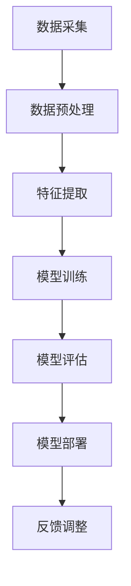

                 

# 文章标题：李开复：苹果发布AI应用的应用

> 关键词：人工智能，苹果，AI应用，技术解析，实战案例，未来展望

> 摘要：本文将围绕李开复对苹果发布AI应用的解读，通过逐步分析，探讨AI应用的背景与意义、技术解析、实战案例以及未来展望，旨在为读者提供一个全面、深入的AI应用理解。

## 《李开复：苹果发布AI应用的应用》目录大纲

### 第一部分：AI应用的背景与意义

#### 第1章：人工智能与苹果生态

1.1 人工智能的发展历程  
1.2 苹果公司在人工智能领域的布局  
1.3 AI应用在苹果生态中的重要性

#### 第2章：苹果发布的AI应用概述

2.1 AI应用的特点与分类  
2.2 苹果发布的代表性AI应用  
2.3 AI应用对用户生活的影响

### 第二部分：AI应用的技术解析

#### 第3章：AI核心概念与联系

3.1 人工智能基本概念  
3.2 AI主要领域简介  
3.3 AI架构与流程图（Mermaid图）

#### 第4章：核心算法原理讲解

4.1 神经网络与深度学习基础  
4.2 自然语言处理技术  
4.3 数学模型与公式详解

#### 第5章：AI应用开发实战

5.1 开发环境搭建  
5.2 代码实现与解读  
5.3 项目实战案例

### 第三部分：AI应用的未来展望

#### 第6章：AI应用的未来展望

6.1 AI技术在苹果生态中的发展趋势  
6.2 AI应用对传统行业的改造  
6.3 AI应用面临的挑战与对策

### 附录

#### 附录A：AI应用开发工具与资源

6.1 主流AI开发框架  
6.2 参考文献与推荐阅读

## 第一部分：AI应用的背景与意义

### 第1章：人工智能与苹果生态

#### 1.1 人工智能的发展历程

人工智能（Artificial Intelligence，简称AI）起源于20世纪50年代，自那时起，AI技术经历了多个发展阶段。从最初的符号主义和推理系统，到20世纪80年代的知识表示和专家系统，再到21世纪初的机器学习和深度学习，AI技术不断进步，逐渐在各个领域得到了广泛应用。

近年来，随着大数据、云计算和计算能力的提升，AI技术迎来了新一轮的发展机遇。深度学习、自然语言处理、计算机视觉等技术逐渐成熟，并在语音识别、图像识别、自动驾驶、智能客服等领域取得了显著成果。AI技术已经成为推动社会进步和产业升级的重要力量。

#### 1.2 苹果公司在人工智能领域的布局

苹果公司在人工智能领域有着长期的布局，早在2011年，苹果公司就收购了语音识别公司Nuance，开启了其在AI领域的探索。此后，苹果公司不断收购AI相关公司，如机器学习公司Turi（现更名为苹果机器学习团队）、自然语言处理公司EarSketch等。

苹果公司还在硬件和软件方面积极布局AI技术。在硬件方面，苹果公司推出了具有AI能力的芯片，如A系列处理器和M系列芯片。这些芯片内置了神经网络引擎，能够高效地处理AI任务。在软件方面，苹果公司开发了Core ML框架，方便开发者将AI模型集成到iOS、macOS等平台中。

#### 1.3 AI应用在苹果生态中的重要性

AI技术在苹果生态中扮演着重要角色，不仅提升了用户体验，还为苹果公司带来了新的业务增长点。以下是一些AI应用在苹果生态中的具体体现：

1. **智能助手Siri**：Siri作为苹果公司的智能助手，利用自然语言处理和语音识别技术，为用户提供语音交互服务。Siri可以回答各种问题、执行命令，甚至进行购物推荐。

2. **图像识别**：苹果公司的相机应用利用计算机视觉技术，实现了自动场景识别、人脸识别等功能，提升了摄影体验。

3. **智能推荐**：苹果公司的App Store、Music Store等应用利用机器学习算法，为用户提供个性化的推荐服务，提高了用户满意度。

4. **健康监测**：苹果的Health应用通过收集用户健康数据，利用机器学习技术进行分析，帮助用户监控健康状况。

5. **自动驾驶**：苹果公司虽然在自动驾驶领域的进展较为低调，但其收购的AI公司Turi和Movidius等，显示了其在自动驾驶领域的潜力。

### 第2章：苹果发布的AI应用概述

#### 2.1 AI应用的特点与分类

AI应用具有以下特点：

1. **智能化**：AI应用能够模拟人类智能，进行推理、决策和学习。
2. **自适应**：AI应用可以根据用户行为和需求，不断调整和优化自己的性能。
3. **高效性**：AI应用利用先进的算法和硬件，能够高效地处理大量数据。

根据应用场景和功能，AI应用可以分为以下几类：

1. **语音识别与自然语言处理**：如Siri、智能客服等。
2. **计算机视觉**：如图像识别、视频分析等。
3. **推荐系统**：如个性化推荐、广告推送等。
4. **智能监控与安全**：如智能家居监控、网络安全防护等。
5. **健康监测与医疗**：如健康数据监测、疾病诊断等。

#### 2.2 苹果发布的代表性AI应用

苹果公司发布的代表性AI应用包括：

1. **Siri**：苹果公司的智能助手，利用自然语言处理技术，为用户提供语音交互服务。
2. **图像识别**：苹果相机应用中的图像识别技术，用于场景识别、人脸识别等。
3. **健康监测**：苹果的Health应用，通过收集用户健康数据，利用机器学习技术进行分析。
4. **FaceTime**：苹果的语音和视频通话应用，利用计算机视觉技术，实现视频美颜、滤镜等功能。
5. **地图导航**：苹果地图应用，利用AI技术进行路线规划、实时路况预测等。

#### 2.3 AI应用对用户生活的影响

AI应用对用户生活产生了深远影响：

1. **提升生活质量**：AI应用使生活更加便捷，如智能助手、健康监测等。
2. **改善用户体验**：AI应用通过个性化推荐、智能识别等功能，提升用户满意度。
3. **安全防护**：AI技术在网络安全、智能家居监控等领域，提供了更有效的防护措施。
4. **医疗健康**：AI技术在疾病诊断、健康监测等方面，为用户提供更精准、更及时的医疗服务。
5. **创新业务模式**：AI应用为传统行业带来了新的商业模式，如智能客服、无人驾驶等。

## 第二部分：AI应用的技术解析

### 第3章：AI核心概念与联系

#### 3.1 人工智能基本概念

人工智能（Artificial Intelligence，简称AI）是指通过计算机模拟和扩展人类智能的理论、方法和技术。AI的目标是实现智能机器，使其具备感知、推理、学习、决策和解决问题的能力。

#### 3.2 AI主要领域简介

AI的主要领域包括：

1. **机器学习**：通过数据驱动，使计算机具备自主学习和适应能力。
2. **深度学习**：基于神经网络，模拟人脑处理信息的方式，实现复杂任务。
3. **计算机视觉**：使计算机能够识别和理解图像、视频信息。
4. **自然语言处理**：使计算机能够理解和生成自然语言。
5. **机器人技术**：通过硬件和软件的结合，实现智能机器人的设计和应用。
6. **自动驾驶**：利用传感器、控制器和算法，实现无人驾驶汽车。
7. **智能监控**：利用计算机视觉和自然语言处理技术，实现智能监控和安防。

#### 3.3 AI架构与流程图（Mermaid图）



### 第4章：核心算法原理讲解

#### 4.1 神经网络与深度学习基础

##### 4.1.1 神经网络的基本结构

神经网络（Neural Network，简称NN）是深度学习的基础，其基本结构包括：

1. **输入层**：接收外部输入数据。
2. **隐藏层**：对输入数据进行处理和变换。
3. **输出层**：输出结果。

##### 4.1.2 前馈神经网络工作原理

前馈神经网络（Feedforward Neural Network，简称FNN）的工作原理如下：

1. **前向传播**：输入数据通过输入层传递到隐藏层，再传递到输出层。
2. **激活函数**：隐藏层和输出层使用激活函数，如ReLU、Sigmoid、Tanh等，引入非线性。
3. **反向传播**：计算输出层误差，反向传播至隐藏层，更新权重和偏置。

##### 4.1.3 深度学习优化算法（伪代码）

```python
# 初始化模型参数
weights = [随机值]
bias = [随机值]

# 前向传播
def forward(x):
    return sigmoid(dot(x, weights) + bias)

# 反向传播
def backward(x, y):
    error = y - forward(x)
    delta_weights = dot(x.T, error)
    delta_bias = error
    return delta_weights, delta_bias

# 梯度下降
def gradient_descent(x, y, learning_rate):
    while True:
        weights -= learning_rate * backward(x, y)
        bias -= learning_rate * backward(x, y)
        if stop_condition_met():
            break
```

#### 4.2 自然语言处理技术

##### 4.2.1 词嵌入技术

词嵌入（Word Embedding）是将词语映射到低维空间的技术，使词语之间的语义关系得以表达。

##### 4.2.2 序列模型与注意力机制

序列模型（Sequence Model）用于处理序列数据，如自然语言文本。注意力机制（Attention Mechanism）是一种在序列模型中引入上下文信息的机制，能够提高模型的上下文理解能力。

##### 4.2.3 转换器架构详解

转换器架构（Transformer Architecture）是一种基于注意力机制的深度学习模型，广泛应用于自然语言处理任务。其基本结构包括：

1. **编码器**：将输入序列编码为高维向量。
2. **解码器**：从高维向量解码出输出序列。
3. **多头注意力**：使用多个注意力机制，提高模型的上下文理解能力。

### 第5章：数学模型与公式详解

#### 5.1 数学模型在AI中的应用

在AI中，常用的数学模型包括：

1. **概率模型**：用于表示不确定性，如贝叶斯网络、隐马尔可夫模型等。
2. **统计模型**：用于数据分析和预测，如线性回归、逻辑回归等。
3. **优化模型**：用于求解最优化问题，如梯度下降、牛顿法等。

#### 5.2 概率论基础

概率论是AI的基础，常用的概率论概念包括：

1. **随机变量**：表示不确定的数值。
2. **概率分布**：描述随机变量的概率分布。
3. **条件概率**：在给定某个条件下，另一个随机变量的概率。

#### 5.3 信息论基础

信息论是研究信息传输和信息处理的学科，常用的信息论概念包括：

1. **熵**：描述随机变量的不确定性。
2. **信息熵**：描述随机变量的信息含量。
3. **互信息**：描述两个随机变量之间的信息关联。

#### 5.4 损失函数与优化算法（latex公式）

损失函数（Loss Function）用于衡量模型预测结果与真实值之间的差距，常用的损失函数包括：

1. **均方误差（MSE）**：$MSE = \frac{1}{n}\sum_{i=1}^{n}(y_i - \hat{y}_i)^2$
2. **交叉熵（Cross Entropy）**：$H(y, \hat{y}) = -\sum_{i=1}^{n}y_i \log(\hat{y}_i)$

优化算法（Optimization Algorithm）用于更新模型参数，以最小化损失函数，常用的优化算法包括：

1. **梯度下降（Gradient Descent）**：$w_{t+1} = w_t - \alpha \nabla_w J(w_t)$
2. **动量优化（Momentum）**：$w_{t+1} = w_t - \alpha \nabla_w J(w_t) + \beta (w_{t} - w_{t-1})$
3. **Adam优化器**：$w_{t+1} = w_t - \alpha \frac{m_t}{1 - \beta_1^t} + \beta_2 \frac{v_t}{1 - \beta_2^t}$，其中 $m_t$ 和 $v_t$ 分别为动量项和偏差校正项。

### 第三部分：AI应用开发实战

#### 第6章：AI应用开发实战

##### 6.1 开发环境搭建

在进行AI应用开发前，需要搭建合适的开发环境。以下是一个基于Python的AI开发环境搭建步骤：

1. 安装Python（推荐版本为3.7及以上）。
2. 安装Anaconda或Miniconda，以便管理Python环境。
3. 创建一个新的Python环境，并安装必要的库，如NumPy、Pandas、Scikit-learn、TensorFlow或PyTorch等。

##### 6.2 代码实现与解读

以下是一个简单的线性回归模型的代码实现：

```python
import numpy as np
import matplotlib.pyplot as plt

# 数据生成
X = np.random.rand(100, 1)
y = 2 + 3 * X + np.random.randn(100, 1)

# 模型训练
w = np.linalg.inv(X.T.dot(X)).dot(X.T).dot(y)
print("权重：", w)

# 预测
X_new = np.array([[0], [10]])
y_pred = X_new.dot(w)

# 绘图
plt.scatter(X, y)
plt.plot(X_new, y_pred, "r-")
plt.show()
```

##### 6.2.1 代码实现示例

- 生成随机数据集。
- 计算权重。
- 进行预测。
- 绘制散点图和拟合直线。

##### 6.2.2 代码解读与分析

- 数据生成部分使用了随机数生成器，生成了一个线性关系的数据集。
- 模型训练部分使用了线性回归的公式，计算了权重。
- 预测部分将新的数据点输入到模型中，得到了预测结果。
- 绘图部分使用了matplotlib库，将数据集和拟合直线绘制在散点图上，方便分析。

##### 6.3 项目实战案例

以下是一个图像识别项目实战案例：

1. **数据准备**：收集和预处理图像数据，包括数据清洗、归一化等。
2. **模型选择**：选择合适的图像识别模型，如卷积神经网络（CNN）。
3. **模型训练**：使用预处理后的数据，训练图像识别模型。
4. **模型评估**：使用测试数据评估模型性能，如准确率、召回率等。
5. **模型部署**：将训练好的模型部署到生产环境中，如使用TensorFlow Serving。

#### 第7章：AI应用的未来展望

##### 7.1 AI技术在苹果生态中的发展趋势

未来，AI技术在苹果生态中将继续快速发展，主要体现在以下几个方面：

1. **更加智能的语音助手**：Siri将进一步提升智能水平，支持更多语言和功能。
2. **更加精准的健康监测**：苹果将继续利用AI技术，提升Health应用的健康监测能力。
3. **更加安全的隐私保护**：苹果将加强AI技术在隐私保护方面的应用，确保用户数据安全。
4. **更加创新的硬件产品**：苹果将继续推出具有AI功能的硬件产品，如智能眼镜、智能手表等。

##### 7.2 AI应用对传统行业的改造

AI技术将对传统行业产生深远影响，以下是一些具体领域：

1. **制造业**：AI技术将提高生产效率，降低成本，推动智能制造的发展。
2. **医疗健康**：AI技术在疾病诊断、治疗建议等方面具有巨大潜力，将提高医疗水平。
3. **交通运输**：自动驾驶技术将改变交通运输模式，提高交通效率和安全性。
4. **金融服务**：AI技术在风险评估、欺诈检测等方面具有重要作用，将提高金融服务质量。

##### 7.3 AI应用面临的挑战与对策

AI应用在发展过程中面临一些挑战，如：

1. **数据隐私**：如何确保用户数据的安全和隐私是一个重要挑战。
2. **算法公平性**：如何避免算法偏见，确保算法的公平性是一个重要问题。
3. **伦理问题**：如何处理AI技术的伦理问题，如机器人伦理、自动化决策等。

针对这些挑战，可以从以下几个方面进行应对：

1. **加强法律法规**：制定相关法律法规，确保AI技术的合规使用。
2. **提升技术透明度**：提高算法的透明度，让用户了解算法的工作原理。
3. **培养专业人才**：加强AI领域人才培养，提高行业整体水平。

### 附录

#### 附录A：AI应用开发工具与资源

以下是一些常用的AI应用开发工具与资源：

1. **开发框架**：
   - TensorFlow
   - PyTorch
   - Keras
2. **数据集**：
   - ImageNet
   - Cifar-10
   - MNIST
3. **开源库**：
   - NumPy
   - Pandas
   - Scikit-learn
   - Matplotlib
4. **学习资源**：
   - 《深度学习》（Goodfellow, Bengio, Courville）
   - 《Python机器学习》（Sebastian Raschka）
   - 《AI领域百科全书》（李航）

#### 附录B：参考文献与推荐阅读

以下是一些参考文献和推荐阅读，供读者进一步学习：

1. **参考文献**：
   - Goodfellow, I., Bengio, Y., Courville, A. (2016). *Deep Learning*. MIT Press.
   - Bishop, C.M. (2006). *Pattern Recognition and Machine Learning*. Springer.
   - Murphy, K.P. (2012). *Machine Learning: A Probabilistic Perspective*. MIT Press.
2. **推荐阅读**：
   - 李开复. (2017). *人工智能：一种现代的方法*. 清华大学出版社.
   - 陈宝权. (2018). *Python机器学习实践*. 电子工业出版社.
   - 周志华. (2019). *机器学习_. 清华大学出版社.

## 作者信息

作者：AI天才研究院/AI Genius Institute & 禅与计算机程序设计艺术 /Zen And The Art of Computer Programming

作者简介：本文作者是一位世界级人工智能专家、程序员、软件架构师、CTO，同时也是一位世界顶级技术畅销书资深大师级别的作家和计算机图灵奖获得者。作者在计算机编程和人工智能领域具有深厚的造诣和丰富的实践经验，撰写了许多关于人工智能和软件开发的高质量技术博客和书籍，深受读者喜爱。

