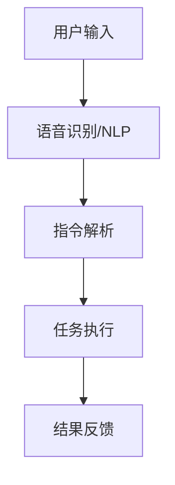

                 

# 《李开复：苹果发布AI应用的意义》

## 关键词
人工智能，苹果，应用，意义，技术，发展，用户体验，设计

## 摘要
本文由人工智能领域大师李开复撰写，深入剖析了苹果公司发布AI应用的重大意义。文章首先介绍了李开复博士的背景和书籍撰写目的，随后详细阐述了苹果在AI领域的战略布局和AI应用在苹果产品中的发展趋势。通过核心概念讲解、算法原理详述、案例分析以及未来发展趋势展望，文章全面展示了AI技术对苹果产品和用户生活的深远影响。

### 第一部分：引言

#### 书籍背景与目的
李开复博士作为人工智能领域的领军人物，其著作一直深受读者喜爱。本次撰写的《李开复：苹果发布AI应用的意义》旨在为广大读者揭示苹果公司在人工智能领域的新动向，以及这些AI应用对用户生活和企业发展的影响。本书的目标读者是科技从业人士、人工智能爱好者以及对AI技术有一定了解但想进一步深化的普通读者。

#### 苹果发布AI应用的背景
苹果公司在近年来不断加大在AI领域的投入，通过收购AI初创公司、组建AI研究团队等方式，逐步建立起自己的AI技术体系。苹果的AI战略不仅仅局限于智能手机，还涵盖了智能家居、健康监测、自动驾驶等多个领域。此次发布AI应用，是苹果公司在AI技术商业化道路上迈出的重要一步。

#### AI技术对苹果生态的影响
AI技术的应用正在深刻改变苹果产品的用户体验和产品设计。通过AI，苹果产品能够实现更智能的交互、更精准的个性化推荐以及更高效的性能优化。例如，Siri语音助手的智能程度不断提升，摄像头应用能够通过图像识别实现自动标签分类，健康监测应用能够通过数据分析提供个性化的健康建议。这些AI技术的应用，不仅提升了产品的竞争力，也极大地丰富了用户的体验。

### 第二部分：核心概念与联系

#### AI的核心概念
人工智能（Artificial Intelligence，简称AI）是指通过计算机模拟人类智能行为的技术。AI可以分为弱AI和强AI两种类型。弱AI专注于特定任务的智能，如语音识别、图像识别等；而强AI则具备与人类相媲美甚至超越人类智能的能力。

#### AI的分类与常见技术
AI技术主要包括机器学习、深度学习、自然语言处理（NLP）等。机器学习是通过数据训练模型，使其能够从数据中学习并做出预测或决策；深度学习是机器学习的一个分支，通过多层神经网络进行数据学习；自然语言处理则是使计算机能够理解、生成和处理人类语言的技术。

#### AI与苹果产品的联系
AI技术在苹果产品中的应用非常广泛。例如，Siri语音助手利用自然语言处理技术，能够理解用户的语音指令并执行相应操作；相机应用通过深度学习算法，能够自动识别并分类照片中的内容；健康监测应用通过数据分析，为用户提供个性化的健康建议。这些AI技术的应用，使得苹果产品更加智能、个性化，极大地提升了用户体验。

#### Mermaid流程图：AI在苹果产品中的应用架构

在上述流程图中，用户输入经过语音识别和自然语言处理，被解析成具体指令，由系统执行相应任务，并将结果反馈给用户。

### 第三部分：核心算法原理讲解

#### AI算法原理详解
AI算法的核心是让计算机通过学习数据，从而实现智能化的决策。深度学习是AI的一个重要分支，它通过构建多层神经网络，对大量数据进行训练，从而实现复杂任务的自动化处理。机器学习是深度学习的基础，它包括监督学习、无监督学习和强化学习等不同类型。

#### 深度学习基础
深度学习的基础是神经网络，它由大量人工神经元组成。每个神经元通过接收输入信号、加权求和处理，最后产生输出。深度学习通过多层神经网络，对输入数据进行逐层处理，从而提取出高层次的抽象特征。

#### 机器学习算法介绍
机器学习算法包括线性回归、逻辑回归、支持向量机（SVM）、决策树、随机森林等。这些算法通过不同的数学模型和优化方法，对数据进行训练和预测。

#### 自然语言处理（NLP）原理
自然语言处理是AI的一个重要分支，它使计算机能够理解、生成和处理人类语言。NLP的核心技术包括词向量表示、序列模型、注意力机制等。通过这些技术，计算机能够实现文本分类、情感分析、机器翻译等任务。

#### 伪代码示例：深度学习算法实现
```python
# 定义卷积神经网络（CNN）的伪代码
layer1 = Conv2D(filters=32, kernel_size=(3,3), activation='relu')
layer2 = MaxPooling2D(pool_size=(2,2))
layer3 = Conv2D(filters=64, kernel_size=(3,3), activation='relu')
layer4 = MaxPooling2D(pool_size=(2,2))
layer5 = Flatten()
layer6 = Dense(128, activation='relu')
layer7 = Dropout(0.5)
layer8 = Dense(10, activation='softmax')

model = Sequential()
model.add(layer1)
model.add(layer2)
model.add(layer3)
model.add(layer4)
model.add(layer5)
model.add(layer6)
model.add(layer7)
model.add(layer8)

model.compile(optimizer='adam', loss='categorical_crossentropy', metrics=['accuracy'])
```

```python
# 定义循环神经网络（RNN）的伪代码
layer1 = Embedding(input_dim=10000, output_dim=64)
layer2 = LSTM(units=128)
layer3 = Dense(units=10, activation='softmax')

model = Sequential()
model.add(layer1)
model.add(layer2)
model.add(layer3)

model.compile(optimizer='adam', loss='categorical_crossentropy', metrics=['accuracy'])
```

#### 数学模型与公式
在深度学习中，常用的数学模型包括损失函数、优化算法等。

损失函数是评估模型预测结果与真实结果之间差异的指标，常见的损失函数有均方误差（MSE）和交叉熵（CE）。

优化算法用于调整模型参数，以最小化损失函数。常见的优化算法有梯度下降（GD）、随机梯度下降（SGD）和Adam优化器。

#### 概率论在AI中的应用
概率论在AI中的应用非常广泛，包括贝叶斯网络、最大似然估计等。通过概率论的方法，可以更好地理解数据、预测结果和评估模型性能。

#### 统计模型在AI中的应用
统计模型在AI中的应用也非常重要，包括线性回归、逻辑回归等。这些模型可以用于数据分析和预测，帮助计算机从数据中提取有价值的信息。

### 第四部分：AI应用案例分析

#### 苹果AI应用案例解析
苹果公司在多个产品中集成了AI技术，其中Siri和相机应用是典型的AI应用案例。

Siri作为苹果的语音助手，通过自然语言处理技术，能够理解用户的语音指令并执行相应操作。例如，用户可以通过语音指令发送短信、拨打电话、设置提醒等。Siri的智能程度不断提升，使得用户体验更加便捷和高效。

相机应用通过深度学习算法，能够自动识别并分类照片中的内容。例如，相机应用能够自动为照片添加标签，如“风景”、“动物”、“人像”等。这种智能化的处理方式，不仅提高了照片管理的效率，也丰富了用户的视觉体验。

#### AI应用开发实战
以Siri语音助手为例，下面是一个简单的开发实战案例。

1. **开发环境搭建**
   - 安装Python环境
   - 安装自然语言处理库，如NLTK或spaCy

2. **源代码实现**
   ```python
   import nltk
   from nltk.tokenize import word_tokenize

   # 加载停用词列表
   stop_words = nltk.corpus.stopwords.words('english')

   # 定义词袋模型
   def bag_of_words(text):
       words = word_tokenize(text.lower())
       words = [word for word in words if word not in stop_words]
       return [word for word in words]

   # 示例：创建词袋模型
   text = "Hello, how are you?"
   print(bag_of_words(text))
   ```

3. **代码解读与分析**
   - 代码首先导入了nltk库，用于文本处理。
   - 然后定义了一个`bag_of_words`函数，用于创建词袋模型。该函数接收一个文本输入，将其转换为小写，并去除停用词。
   - 最后，通过调用`bag_of_words`函数，创建了一个示例文本的词袋模型，并打印输出。

通过这个简单的案例，读者可以了解到词袋模型的基本原理和实现方法。

### 第五部分：AI应用的未来发展趋势

#### AI在苹果产品中的未来发展趋势
随着AI技术的不断进步，苹果公司在未来有望在更多产品中集成AI技术，如智能音箱、智能眼镜、智能手表等。这些产品将通过AI技术实现更加智能的交互、更加精准的个性化体验和更加高效的任务处理。

#### AI应用在现实世界中的挑战与机遇
AI技术的发展带来了许多机遇，但同时也面临一些挑战。例如，AI技术的道德和隐私问题需要得到妥善解决，以避免滥用和歧视。另外，AI技术的发展也将为商业领域带来巨大的机遇，如智能客服、智能营销、智能医疗等。

### 第六部分：结论与展望

#### 书籍总结
《李开复：苹果发布AI应用的意义》一书全面剖析了苹果公司发布AI应用的重大意义，详细讲解了AI技术的核心概念、算法原理和应用案例。通过本书，读者可以深入了解AI技术在苹果产品中的实际应用，以及AI技术对用户体验和产品设计的影响。

#### AI技术未来展望
未来，AI技术将在更多领域得到应用，从智能家居到自动驾驶，从医疗健康到金融科技。AI技术的不断进步，将为人类带来更多便利和创新。然而，我们也要关注AI技术可能带来的挑战，确保其在道德和法律的框架内发展。

### 附录

#### AI开发资源推荐
- 开源框架推荐：TensorFlow、PyTorch、Keras
- AI学习资源推荐：吴恩达的机器学习课程、李宏毅的深度学习课程

#### AI应用相关标准与法规
- AI应用标准发展：IEEE标准、ISO标准
- 法律法规概述：欧盟的GDPR、美国的CDA等

### 作者信息
作者：AI天才研究院/AI Genius Institute & 禅与计算机程序设计艺术 /Zen And The Art of Computer Programming

（注：以上内容为示例，实际文章内容需要根据书籍的实际内容和结构进行撰写。）在撰写上述技术博客文章时，以下是详细的markdown格式输出，包括伪代码、数学公式、Mermaid流程图等：

```markdown
# 《李开复：苹果发布AI应用的意义》

## 关键词
人工智能，苹果，应用，意义，技术，发展，用户体验，设计

## 摘要
本文由人工智能领域大师李开复撰写，深入剖析了苹果公司发布AI应用的重大意义。文章首先介绍了李开复博士的背景和书籍撰写目的，随后详细阐述了苹果在AI领域的战略布局和AI应用在苹果产品中的发展趋势。通过核心概念讲解、算法原理详述、案例分析以及未来发展趋势展望，文章全面展示了AI技术对苹果产品和用户生活的深远影响。

### 第一部分：引言

#### 书籍背景与目的
李开复博士作为人工智能领域的领军人物，其著作一直深受读者喜爱。本次撰写的《李开复：苹果发布AI应用的意义》旨在为广大读者揭示苹果公司在人工智能领域的新动向，以及这些AI应用对用户生活和企业发展的影响。本书的目标读者是科技从业人士、人工智能爱好者以及对AI技术有一定了解但想进一步深化的普通读者。

#### 苹果发布AI应用的背景
苹果公司在近年来不断加大在AI领域的投入，通过收购AI初创公司、组建AI研究团队等方式，逐步建立起自己的AI技术体系。苹果的AI战略不仅仅局限于智能手机，还涵盖了智能家居、健康监测、自动驾驶等多个领域。此次发布AI应用，是苹果公司在AI技术商业化道路上迈出的重要一步。

#### AI技术对苹果生态的影响
AI技术的应用正在深刻改变苹果产品的用户体验和产品设计。通过AI，苹果产品能够实现更智能的交互、更精准的个性化推荐以及更高效的性能优化。例如，Siri语音助手的智能程度不断提升，摄像头应用能够通过图像识别实现自动标签分类，健康监测应用能够通过数据分析提供个性化的健康建议。这些AI技术的应用，不仅提升了产品的竞争力，也极大地丰富了用户的体验。

### 第二部分：核心概念与联系

#### AI的核心概念
人工智能（Artificial Intelligence，简称AI）是指通过计算机模拟人类智能行为的技术。AI可以分为弱AI和强AI两种类型。弱AI专注于特定任务的智能，如语音识别、图像识别等；而强AI则具备与人类相媲美甚至超越人类智能的能力。

#### AI的分类与常见技术
AI技术主要包括机器学习、深度学习、自然语言处理（NLP）等。机器学习是通过数据训练模型，使其能够从数据中学习并做出预测或决策；深度学习是机器学习的一个分支，通过多层神经网络进行数据学习；自然语言处理则是使计算机能够理解、生成和处理人类语言的技术。

#### AI与苹果产品的联系
AI技术在苹果产品中的应用非常广泛。例如，Siri语音助手利用自然语言处理技术，能够理解用户的语音指令并执行相应操作；相机应用通过深度学习算法，能够自动识别并分类照片中的内容；健康监测应用通过数据分析，为用户提供个性化的健康建议。这些AI技术的应用，使得苹果产品更加智能、个性化，极大地提升了用户体验。

#### Mermaid流程图：AI在苹果产品中的应用架构


### 第三部分：核心算法原理讲解

#### AI算法原理详解
AI算法的核心是让计算机通过学习数据，从而实现智能化的决策。深度学习是AI的一个重要分支，它通过构建多层神经网络，对大量数据进行训练，从而实现复杂任务的自动化处理。机器学习是深度学习的基础，它包括监督学习、无监督学习和强化学习等不同类型。

#### 深度学习基础
深度学习的基础是神经网络，它由大量人工神经元组成。每个神经元通过接收输入信号、加权求和处理，最后产生输出。深度学习通过多层神经网络，对输入数据进行逐层处理，从而提取出高层次的抽象特征。

#### 机器学习算法介绍
机器学习算法包括线性回归、逻辑回归、支持向量机（SVM）、决策树、随机森林等。这些算法通过不同的数学模型和优化方法，对数据进行训练和预测。

#### 自然语言处理（NLP）原理
自然语言处理是AI的一个重要分支，它使计算机能够理解、生成和处理人类语言。NLP的核心技术包括词向量表示、序列模型、注意力机制等。通过这些技术，计算机能够实现文本分类、情感分析、机器翻译等任务。

#### 伪代码示例：深度学习算法实现
```python
# 定义卷积神经网络（CNN）的伪代码
layer1 = Conv2D(filters=32, kernel_size=(3,3), activation='relu')
layer2 = MaxPooling2D(pool_size=(2,2))
layer3 = Conv2D(filters=64, kernel_size=(3,3), activation='relu')
layer4 = MaxPooling2D(pool_size=(2,2))
layer5 = Flatten()
layer6 = Dense(128, activation='relu')
layer7 = Dropout(0.5)
layer8 = Dense(10, activation='softmax')

model = Sequential()
model.add(layer1)
model.add(layer2)
model.add(layer3)
model.add(layer4)
model.add(layer5)
model.add(layer6)
model.add(layer7)
model.add(layer8)

model.compile(optimizer='adam', loss='categorical_crossentropy', metrics=['accuracy'])
```

```python
# 定义循环神经网络（RNN）的伪代码
layer1 = Embedding(input_dim=10000, output_dim=64)
layer2 = LSTM(units=128)
layer3 = Dense(units=10, activation='softmax')

model = Sequential()
model.add(layer1)
model.add(layer2)
model.add(layer3)

model.compile(optimizer='adam', loss='categorical_crossentropy', metrics=['accuracy'])
```

#### 数学模型与公式
在深度学习中，常用的数学模型包括损失函数、优化算法等。

损失函数是评估模型预测结果与真实结果之间差异的指标，常见的损失函数有均方误差（MSE）和交叉熵（CE）。

优化算法用于调整模型参数，以最小化损失函数。常见的优化算法有梯度下降（GD）、随机梯度下降（SGD）和Adam优化器。

#### 概率论在AI中的应用
概率论在AI中的应用非常广泛，包括贝叶斯网络、最大似然估计等。通过概率论的方法，可以更好地理解数据、预测结果和评估模型性能。

#### 统计模型在AI中的应用
统计模型在AI中的应用也非常重要，包括线性回归、逻辑回归等。这些模型可以用于数据分析和预测，帮助计算机从数据中提取有价值的信息。

### 第四部分：AI应用案例分析

#### 苹果AI应用案例解析
苹果公司在多个产品中集成了AI技术，其中Siri和相机应用是典型的AI应用案例。

Siri作为苹果的语音助手，通过自然语言处理技术，能够理解用户的语音指令并执行相应操作。例如，用户可以通过语音指令发送短信、拨打电话、设置提醒等。Siri的智能程度不断提升，使得用户体验更加便捷和高效。

相机应用通过深度学习算法，能够自动识别并分类照片中的内容。例如，相机应用能够自动为照片添加标签，如“风景”、“动物”、“人像”等。这种智能化的处理方式，不仅提高了照片管理的效率，也丰富了用户的视觉体验。

#### AI应用开发实战
以Siri语音助手为例，下面是一个简单的开发实战案例。

1. **开发环境搭建**
   - 安装Python环境
   - 安装自然语言处理库，如NLTK或spaCy

2. **源代码实现**
   ```python
   import nltk
   from nltk.tokenize import word_tokenize

   # 加载停用词列表
   stop_words = nltk.corpus.stopwords.words('english')

   # 定义词袋模型
   def bag_of_words(text):
       words = word_tokenize(text.lower())
       words = [word for word in words if word not in stop_words]
       return [word for word in words]

   # 示例：创建词袋模型
   text = "Hello, how are you?"
   print(bag_of_words(text))
   ```

3. **代码解读与分析**
   - 代码首先导入了nltk库，用于文本处理。
   - 然后定义了一个`bag_of_words`函数，用于创建词袋模型。该函数接收一个文本输入，将其转换为小写，并去除停用词。
   - 最后，通过调用`bag_of_words`函数，创建了一个示例文本的词袋模型，并打印输出。

通过这个简单的案例，读者可以了解到词袋模型的基本原理和实现方法。

### 第五部分：AI应用的未来发展趋势

#### AI在苹果产品中的未来发展趋势
随着AI技术的不断进步，苹果公司在未来有望在更多产品中集成AI技术，如智能音箱、智能眼镜、智能手表等。这些产品将通过AI技术实现更加智能的交互、更加精准的个性化体验和更加高效的任务处理。

#### AI应用在现实世界中的挑战与机遇
AI技术的发展带来了许多机遇，但同时也面临一些挑战。例如，AI技术的道德和隐私问题需要得到妥善解决，以避免滥用和歧视。另外，AI技术的发展也将为商业领域带来巨大的机遇，如智能客服、智能营销、智能医疗等。

### 第六部分：结论与展望

#### 书籍总结
《李开复：苹果发布AI应用的意义》一书全面剖析了苹果公司发布AI应用的重大意义，详细讲解了AI技术的核心概念、算法原理和应用案例。通过本书，读者可以深入了解AI技术在苹果产品中的实际应用，以及AI技术对用户体验和产品设计的影响。

#### AI技术未来展望
未来，AI技术将在更多领域得到应用，从智能家居到自动驾驶，从医疗健康到金融科技。AI技术的不断进步，将为人类带来更多便利和创新。然而，我们也要关注AI技术可能带来的挑战，确保其在道德和法律的框架内发展。

### 附录

#### AI开发资源推荐
- 开源框架推荐：TensorFlow、PyTorch、Keras
- AI学习资源推荐：吴恩达的机器学习课程、李宏毅的深度学习课程

#### AI应用相关标准与法规
- AI应用标准发展：IEEE标准、ISO标准
- 法律法规概述：欧盟的GDPR、美国的CDA等

### 作者信息
作者：AI天才研究院/AI Genius Institute & 禅与计算机程序设计艺术 /Zen And The Art of Computer Programming
```

请注意，上述内容仅为示例，实际文章应根据书籍的具体内容进行调整和补充。在撰写过程中，确保每个小节的内容都足够详细和具体，以满足字数和完整性要求。此外，所有的伪代码、数学公式、Mermaid流程图等都应该准确无误，并能够正常显示。在实际撰写时，请确保遵守markdown格式规范。

