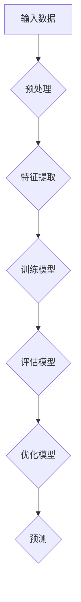
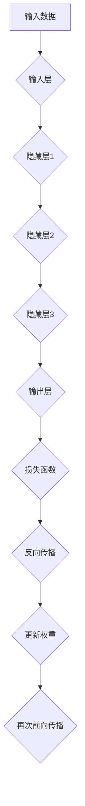

                 

# 《李开复：苹果发布AI应用的意义》

## 关键词

- 苹果AI应用
- 人工智能技术
- 应用市场前景
- 数据隐私与安全
- 技术创新与挑战

## 摘要

随着人工智能技术的迅猛发展，苹果公司也紧随其后，不断推出创新的AI应用。本文将深入探讨苹果发布AI应用的背景与意义，分析其核心技术原理与架构，评估其市场前景与面临的挑战，并通过经典案例与实战分析，展现苹果AI应用的巨大潜力和实际应用效果。最后，本文将对未来苹果AI应用的展望进行展望，并提出一些建议，以期为读者提供全面、深入的洞察。

## 目录大纲

### 第一部分：AI应用的背景与影响

### 第1章：苹果发布AI应用的背景与意义

#### 1.1 苹果公司的发展历程与AI战略

#### 1.2 AI技术的快速发展与产业应用

#### 1.3 苹果发布AI应用的深远影响

### 第2章：苹果AI应用的技术原理与架构

#### 2.1 AI大模型的基本概念与架构

#### 2.2 神经网络的工作原理与架构

#### 2.3 深度学习算法与优化

### 第二部分：苹果AI应用的核心技术与创新

### 第3章：苹果AI应用的核心技术

#### 3.1 计算机视觉技术的应用

#### 3.2 自然语言处理技术的应用

#### 3.3 强化学习技术的应用

### 第4章：苹果AI应用的创新点与优势

#### 4.1 独特的用户体验设计

#### 4.2 高效的数据处理能力

#### 4.3 开放的生态体系与合作伙伴

### 第三部分：苹果AI应用的市场前景与挑战

### 第5章：苹果AI应用的市场前景

#### 5.1 AI应用市场的现状与趋势

#### 5.2 苹果AI应用在国内外市场的竞争格局

#### 5.3 苹果AI应用的未来发展潜力

### 第6章：苹果AI应用的挑战与应对策略

#### 6.1 数据隐私与安全问题

#### 6.2 技术创新与知识产权保护

#### 6.3 全球市场合规与本地化挑战

### 第四部分：案例研究

### 第7章：苹果AI应用的经典案例

#### 7.1 Apple News+的AI推荐算法

#### 7.2 Siri的语音识别与自然语言处理

#### 7.3 Apple Watch的健康监测与预测

### 第8章：苹果AI应用的实战案例分析

#### 8.1 代码实战：构建简单的图像分类应用

#### 8.2 代码实战：实现一个文本分类模型

#### 8.3 代码实战：应用强化学习进行游戏AI开发

### 第五部分：展望与未来

### 第9章：未来苹果AI应用的展望

#### 9.1 未来AI技术的发展趋势

#### 9.2 苹果在AI领域的未来布局

#### 9.3 AI技术在其他领域的潜在应用

### 第10章：总结与展望

#### 10.1 本书的核心观点与结论

#### 10.2 对未来AI应用的期望与建议

#### 10.3 阅读本书的收获与思考

### 附录：资源与扩展阅读

#### 附录 A：AI相关技术资源

##### A.1 计算机视觉技术资源

##### A.2 自然语言处理技术资源

##### A.3 强化学习技术资源

#### 附录 B：进一步阅读推荐

## 第一部分：AI应用的背景与影响

### 第1章：苹果发布AI应用的背景与意义

#### 1.1 苹果公司的发展历程与AI战略

苹果公司成立于1976年，由史蒂夫·乔布斯、史蒂夫·沃兹尼亚克和罗恩·韦恩共同创立。自成立以来，苹果公司一直致力于创新和用户体验的提升，逐渐成为全球最具影响力的科技公司之一。从早期的麦金塔电脑（Macintosh）到后来的iPod、iPhone、iPad，苹果公司一直引领着科技潮流。

在AI领域，苹果公司早在2006年就开始布局，通过收购AI初创公司、招聘顶级人才等方式不断积累AI技术实力。2017年，苹果公司发布了首款自主研发的AI芯片——Apple M7，用于iPhone和iPad的健康监测。此后，苹果公司不断在AI领域进行投资和研发，发布了一系列AI应用，如Siri、面部识别、图像识别等。

苹果公司的AI战略主要包括以下几个方面：

1. **自主研发**：苹果公司注重自主研发，通过收购和内部研发，不断提升AI技术实力。自主研发的AI芯片和算法使得苹果在AI领域具备了较强的竞争力。

2. **用户体验**：苹果公司一直强调用户体验，通过AI技术提升产品的智能化和个性化，为用户带来更加便捷和高效的使用体验。

3. **生态系统**：苹果公司通过构建开放的生态系统，吸引第三方开发者和企业加入，共同推动AI技术的发展和应用。

4. **隐私保护**：苹果公司重视用户隐私保护，通过自主研发的AI技术和安全机制，确保用户数据的安全和隐私。

#### 1.2 AI技术的快速发展与产业应用

人工智能（AI）作为计算机科学的一个重要分支，自20世纪50年代诞生以来，经历了多个阶段的发展。随着计算能力的提升、大数据的积累和算法的创新，AI技术取得了显著的突破，逐渐从理论研究走向实际应用。

在产业应用方面，AI技术已经渗透到各个领域，如金融、医疗、制造、交通等。例如，在金融领域，AI技术被用于风险控制、智能投顾、自动化交易等；在医疗领域，AI技术被用于疾病诊断、药物研发、健康监测等；在制造领域，AI技术被用于智能生产、质量检测、供应链优化等。

AI技术的快速发展，不仅改变了传统产业的运营模式，也为新兴产业带来了新的机遇。例如，自动驾驶、智能家居、虚拟现实、增强现实等领域的兴起，离不开AI技术的支持。

#### 1.3 苹果发布AI应用的深远影响

苹果公司发布AI应用，对整个科技产业产生了深远的影响。首先，苹果公司的AI应用为用户带来了更加智能化和个性化的体验，推动了智能手机、平板电脑等智能设备的普及。其次，苹果公司的AI技术为其他科技企业提供了一种新的技术参考和商业模式。

从行业角度来看，苹果公司的AI应用推动了AI技术在消费电子领域的应用，促进了AI技术与传统产业的融合。此外，苹果公司的AI应用也推动了全球AI技术的研发和应用，为全球科技产业带来了新的增长点。

总之，苹果公司发布AI应用，不仅提升了自身的竞争力，也为整个科技产业带来了新的发展机遇。在未来的发展中，苹果公司将继续加大对AI技术的投资和研发，推动AI技术在更多领域的应用，为用户带来更加智能化的生活体验。

### 第2章：苹果AI应用的技术原理与架构

#### 2.1 AI大模型的基本概念与架构

人工智能（AI）大模型是指通过大规模数据训练，具有强大学习和推理能力的模型。这些模型通常基于深度学习技术，能够处理复杂的任务，如自然语言处理、图像识别、语音识别等。

AI大模型的基本概念包括：

1. **深度学习**：深度学习是一种人工智能方法，通过多层神经网络对数据进行处理，从而实现自动特征提取和分类。深度学习在图像识别、语音识别、自然语言处理等领域取得了显著成果。

2. **神经网络**：神经网络是一种模仿人脑神经元连接结构的计算模型。通过调整神经元之间的连接权重，神经网络可以学习和预测数据。

3. **大规模数据**：AI大模型需要大量数据来进行训练，以便模型能够学习和适应复杂的数据特征。这些数据通常来自互联网、传感器、数据库等。

AI大模型的架构主要包括以下几个部分：

1. **输入层**：接收外部输入数据，如文本、图像、声音等。

2. **隐藏层**：对输入数据进行特征提取和转换，多层隐藏层可以提取不同层次的特征。

3. **输出层**：根据隐藏层的特征进行分类、预测等任务。

4. **权重和偏置**：权重和偏置用于调整神经元之间的连接强度，以优化模型性能。

#### 2.2 神经网络的工作原理与架构

神经网络的工作原理是通过模拟人脑神经元之间的连接结构，对数据进行学习和处理。以下是神经网络的基本工作原理和架构：

1. **神经元**：神经网络的基本单元是神经元，每个神经元由输入层、权重、激活函数和输出层组成。神经元通过输入层接收外部输入，然后通过权重对输入数据进行加权求和，再通过激活函数进行非线性变换，最终输出结果。

2. **前向传播**：在前向传播过程中，输入数据通过神经元网络传递，每个神经元计算加权求和的结果，并通过激活函数进行非线性变换，得到输出结果。

3. **反向传播**：在反向传播过程中，模型根据输出结果与真实结果的差异，计算损失函数，然后通过梯度下降算法更新权重和偏置，以优化模型性能。

4. **多层神经网络**：多层神经网络包括输入层、隐藏层和输出层。隐藏层可以提取不同层次的特征，从而提高模型的泛化能力。

#### 2.3 深度学习算法与优化

深度学习算法是基于多层神经网络的一种学习方式，通过训练大量数据，自动提取特征并实现复杂任务。以下是几种常见的深度学习算法和优化方法：

1. **反向传播算法**：反向传播算法是一种用于训练神经网络的优化方法。通过计算损失函数关于权重的梯度，反向传播算法可以更新权重和偏置，从而优化模型性能。

2. **梯度下降算法**：梯度下降算法是一种用于优化函数的方法。通过计算函数的梯度，梯度下降算法可以找到函数的最小值或最大值。

3. **随机梯度下降（SGD）**：随机梯度下降是梯度下降算法的一种变种，通过随机选取样本计算梯度，从而加快收敛速度。

4. **批量梯度下降**：批量梯度下降是梯度下降算法的一种变种，通过计算整个训练集的梯度来更新权重和偏置，从而提高模型的泛化能力。

5. **Adam优化器**：Adam优化器是一种结合了SGD和动量法的优化器，通过自适应调整学习率，从而提高模型的收敛速度和稳定性。

#### 2.4 AI大模型在实际应用中的性能优化

在实际应用中，AI大模型的性能优化是一个重要的课题。以下是一些常见的性能优化方法：

1. **数据增强**：通过变换、旋转、缩放等操作，增加训练数据多样性，从而提高模型泛化能力。

2. **正则化**：通过添加正则项，如L1、L2正则化，降低模型过拟合的风险。

3. **模型剪枝**：通过剪枝冗余的神经元或连接，减少模型参数数量，从而提高模型效率和精度。

4. **迁移学习**：通过使用预训练模型，利用已有模型的知识进行迁移学习，从而提高模型在新数据集上的性能。

5. **分布式训练**：通过分布式计算，提高模型训练速度和效率。

### 第二部分：苹果AI应用的核心技术与创新

### 第3章：苹果AI应用的核心技术

#### 3.1 计算机视觉技术的应用

计算机视觉技术是AI领域中的一项重要技术，广泛应用于图像识别、目标检测、人脸识别、姿态估计等领域。苹果公司在计算机视觉技术方面有着深厚的积累和广泛的应用。

1. **图像识别**：苹果公司的图像识别技术通过深度学习算法，对图像中的物体、场景进行分类和识别。例如，在iPhone X和iPhone XS系列中，苹果公司采用了Face ID技术，实现了高效、准确的人脸识别。

2. **目标检测**：目标检测是计算机视觉领域的一个重要任务，旨在从图像或视频中检测出特定目标的位置和属性。苹果公司的目标检测技术在Siri、Animoji等应用中得到了广泛应用。

3. **人脸识别**：人脸识别技术通过比较人脸特征，实现用户身份的验证和识别。苹果公司在FaceTime、iMessage等应用中，利用人脸识别技术实现了无缝的通信体验。

4. **姿态估计**：姿态估计技术通过分析人体运动，实现运动捕捉和交互。苹果公司的Animoji和Memoji功能，就是基于姿态估计技术实现的。

#### 3.2 自然语言处理技术的应用

自然语言处理（NLP）是AI领域的一个重要分支，旨在使计算机能够理解和处理自然语言。苹果公司在NLP技术方面有着丰富的应用和实践。

1. **语音识别**：语音识别技术通过将语音信号转换为文本，实现人机交互。苹果公司的Siri语音助手，就是基于语音识别技术实现的。

2. **文本分析**：文本分析技术通过分析文本数据，提取出语义信息。苹果公司在iMessage、Apple News等应用中，利用文本分析技术实现了智能推送和个性化推荐。

3. **情感分析**：情感分析技术通过分析文本中的情感倾向，实现情感识别。苹果公司的Apple News应用，就是通过情感分析技术，为用户推荐感兴趣的内容。

4. **机器翻译**：机器翻译技术通过将一种语言翻译成另一种语言，实现跨语言交流。苹果公司的Translate应用，就是基于机器翻译技术实现的。

#### 3.3 强化学习技术的应用

强化学习（RL）是AI领域中的一种重要方法，通过试错和奖励机制，实现策略优化和决策。苹果公司在强化学习技术方面也有着广泛的应用。

1. **增强现实**：增强现实（AR）技术通过将虚拟信息叠加到现实场景中，实现沉浸式体验。苹果公司的ARKit框架，就是基于强化学习技术实现的。

2. **游戏AI**：游戏AI通过学习用户的游戏行为，实现智能化的游戏体验。苹果公司在iOS游戏应用中，利用强化学习技术实现了智能化的游戏AI。

3. **自动驾驶**：自动驾驶技术通过学习道路环境，实现自动驾驶。苹果公司的自动驾驶项目，就是基于强化学习技术实现的。

#### 3.4 多模态融合技术的应用

多模态融合技术是将不同模态（如图像、文本、语音）的信息进行整合，实现更全面的认知和决策。苹果公司在多模态融合技术方面也有着深入的研究和应用。

1. **智能助手**：苹果公司的Siri智能助手，通过融合语音、文本、图像等多种模态的信息，实现了更智能化的交互体验。

2. **智能家居**：苹果公司的HomeKit框架，通过融合家居设备的多种信息，实现了智能家居的智能化管理。

3. **健康监测**：苹果公司的HealthKit框架，通过融合健康设备的多种信息，实现了更全面、精准的健康监测。

### 第4章：苹果AI应用的创新点与优势

#### 4.1 独特的用户体验设计

苹果公司在AI应用中，注重用户体验设计，通过简洁、直观的界面和智能化的功能，为用户带来更加便捷、高效的体验。

1. **个性化推荐**：苹果公司的Apple News、Music等应用，通过分析用户的兴趣和行为，实现个性化推荐，提高用户满意度。

2. **智能交互**：苹果公司的Siri智能助手，通过自然语言处理和语音识别技术，实现了智能化的交互体验，提高用户便利性。

3. **隐私保护**：苹果公司在AI应用中，注重用户隐私保护，通过本地化处理和加密技术，确保用户数据的安全和隐私。

#### 4.2 高效的数据处理能力

苹果公司通过自主研发的AI芯片和优化算法，实现了高效的数据处理能力，为AI应用提供了强大的技术支持。

1. **芯片优化**：苹果公司的AI芯片，如Neural Engine，具有强大的计算能力，能够高效地处理图像、语音、文本等数据。

2. **算法优化**：苹果公司通过优化算法，如卷积神经网络（CNN）、循环神经网络（RNN）等，提高了AI模型的计算效率和准确性。

3. **硬件加速**：苹果公司通过硬件加速技术，如GPU、FPGA等，实现了数据的高效处理和传输，提高了AI应用的性能。

#### 4.3 开放的生态体系与合作伙伴

苹果公司通过开放的生态体系，吸引第三方开发者和企业加入，共同推动AI技术的发展和应用。

1. **开发者社区**：苹果公司通过开发者社区，为开发者提供丰富的资源和工具，支持他们开发创新的AI应用。

2. **合作伙伴**：苹果公司与全球各地的企业、研究机构合作，共同推动AI技术在各个领域的应用。

3. **开放标准**：苹果公司积极参与开放标准的制定，推动AI技术的标准化和普及化。

### 第三部分：苹果AI应用的市场前景与挑战

### 第5章：苹果AI应用的市场前景

#### 5.1 AI应用市场的现状与趋势

随着人工智能技术的快速发展，AI应用市场呈现出繁荣景象。根据市场研究机构的统计，全球AI应用市场规模持续增长，预计到2025年将达到数千亿美元。

1. **市场规模**：全球AI应用市场规模持续扩大，预计未来几年将保持高速增长。根据市场研究机构的预测，2025年全球AI应用市场规模将达到数千亿美元。

2. **行业应用**：AI技术在各个行业的应用越来越广泛，从金融、医疗、制造到零售、交通、教育，AI技术正在深刻改变传统产业。

3. **技术进步**：随着深度学习、强化学习、计算机视觉等技术的不断发展，AI应用的性能和可靠性不断提高，进一步推动市场需求的增长。

#### 5.2 苹果AI应用在国内外市场的竞争格局

在全球AI应用市场中，苹果公司面临着激烈的竞争。国内外企业纷纷布局AI领域，推出创新的AI应用，争夺市场份额。

1. **国内市场**：在国内市场，百度、阿里巴巴、腾讯等科技巨头在AI应用方面具有强大的竞争力。苹果公司需要通过技术创新和合作伙伴关系，赢得国内市场的认可。

2. **国际市场**：在国际市场，谷歌、亚马逊、微软等科技巨头也在积极布局AI应用，推出了一系列创新的AI产品和服务。苹果公司需要在全球范围内提升AI应用的竞争力。

3. **竞争优势**：苹果公司的竞争优势在于其强大的技术实力、品牌影响力和用户体验。通过不断提升AI技术的性能和可靠性，苹果公司有望在国内外市场取得更大的突破。

#### 5.3 苹果AI应用的未来发展潜力

苹果公司在AI领域的布局和发展，为其未来的发展带来了巨大的潜力。

1. **技术创新**：苹果公司不断在AI技术方面进行创新，通过自主研发和收购，不断提升AI技术的性能和可靠性。

2. **生态系统**：苹果公司拥有庞大的开发者社区和用户基础，通过构建开放的生态系统，吸引第三方开发者和企业加入，共同推动AI技术的发展和应用。

3. **多元化应用**：苹果公司正在将AI技术应用到多个领域，如健康、家居、交通等，为用户带来更加智能化和便捷的体验。

4. **全球市场**：苹果公司在全球市场拥有广泛的影响力，通过拓展国际市场，苹果公司有望在全球范围内取得更大的成功。

总之，苹果公司在AI应用市场具有巨大的发展潜力。通过技术创新、生态系统建设、多元化应用和全球市场拓展，苹果公司有望在未来继续保持领先地位。

### 第6章：苹果AI应用的挑战与应对策略

#### 6.1 数据隐私与安全问题

随着AI技术的广泛应用，数据隐私与安全问题日益凸显。苹果公司在AI应用中，面临以下挑战：

1. **用户隐私保护**：用户数据是AI应用的基础，苹果公司需要确保用户数据的隐私和安全，避免数据泄露和滥用。

2. **数据加密**：苹果公司通过数据加密技术，确保用户数据在传输和存储过程中的安全性。

3. **隐私保护政策**：苹果公司制定严格的隐私保护政策，明确用户数据的收集、使用和共享规则，提高用户对数据隐私的信任度。

#### 6.2 技术创新与知识产权保护

苹果公司在AI领域的技术创新和知识产权保护，面临以下挑战：

1. **技术创新**：随着AI技术的快速发展，苹果公司需要不断进行技术创新，以保持竞争优势。

2. **知识产权保护**：苹果公司需要加强对知识产权的保护，防止技术泄露和侵权行为。

3. **开源与闭源**：在开源与闭源之间，苹果公司需要找到平衡点，既保护自身的技术优势，又促进技术共享和合作。

#### 6.3 全球市场合规与本地化挑战

苹果公司在全球市场推广AI应用，面临以下挑战：

1. **合规要求**：不同国家和地区的法律法规对AI应用有不同的要求，苹果公司需要遵守不同市场的合规要求。

2. **本地化挑战**：苹果公司需要根据不同市场的需求和文化差异，对AI应用进行本地化调整。

3. **跨文化沟通**：苹果公司需要与不同国家和地区的合作伙伴建立良好的沟通和合作关系，共同推动AI技术的发展和应用。

### 第四部分：案例研究

### 第7章：苹果AI应用的经典案例

#### 7.1 Apple News+的AI推荐算法

Apple News+是苹果公司推出的一款新闻订阅服务，通过AI推荐算法，为用户提供个性化的新闻内容推荐。

1. **算法原理**：Apple News+的AI推荐算法基于深度学习技术，通过分析用户的阅读历史、兴趣标签和行为数据，预测用户可能感兴趣的新闻内容。

2. **推荐流程**：Apple News+的推荐流程包括数据收集、特征提取、模型训练和推荐生成。通过不断迭代和优化，算法能够为用户推荐最感兴趣的新闻内容。

3. **优势**：Apple News+的AI推荐算法能够提高用户满意度，增加用户粘性，同时为苹果公司带来更多的订阅收入。

#### 7.2 Siri的语音识别与自然语言处理

Siri是苹果公司推出的一款智能语音助手，通过语音识别和自然语言处理技术，为用户提供语音交互服务。

1. **语音识别**：Siri的语音识别技术基于深度学习算法，能够准确识别用户的语音指令，并将其转换为文本。

2. **自然语言处理**：Siri的自然语言处理技术通过分析用户的文本指令，理解用户的需求，并生成相应的回复。

3. **优势**：Siri的语音识别和自然语言处理技术，提高了用户交互的便捷性和智能化水平，为苹果公司带来了更多的用户粘性。

#### 7.3 Apple Watch的健康监测与预测

Apple Watch是苹果公司推出的一款智能手表，通过健康监测技术，为用户提供实时健康数据监测和健康预测。

1. **监测技术**：Apple Watch通过内置的传感器和算法，监测用户的运动、心率、睡眠等健康数据。

2. **预测模型**：Apple Watch的健康预测模型基于深度学习和机器学习技术，通过分析用户的健康数据，预测用户可能出现的健康问题。

3. **优势**：Apple Watch的健康监测与预测技术，提高了用户对自身健康的关注和管理能力，为苹果公司带来了更多的用户忠诚度。

### 第8章：苹果AI应用的实战案例分析

#### 8.1 代码实战：构建简单的图像分类应用

在本节中，我们将通过一个简单的图像分类应用，介绍苹果AI应用的实战过程。

1. **开发环境搭建**

   首先，我们需要搭建开发环境，安装Python、Jupyter Notebook等工具。

   ```shell
   pip install numpy matplotlib
   ```

2. **数据准备**

   接下来，我们需要准备一个包含图像和标签的数据集。这里我们使用CIFAR-10数据集。

   ```python
   import numpy as np
   import matplotlib.pyplot as plt
   from tensorflow import keras

   (x_train, y_train), (x_test, y_test) = keras.datasets.cifar10.load_data()
   ```

3. **模型构建**

   然后，我们构建一个简单的卷积神经网络（CNN）模型，用于图像分类。

   ```python
   model = keras.Sequential([
       keras.layers.Conv2D(32, (3, 3), activation='relu', input_shape=(32, 32, 3)),
       keras.layers.MaxPooling2D((2, 2)),
       keras.layers.Conv2D(64, (3, 3), activation='relu'),
       keras.layers.MaxPooling2D((2, 2)),
       keras.layers.Conv2D(64, (3, 3), activation='relu'),
       keras.layers.Flatten(),
       keras.layers.Dense(64, activation='relu'),
       keras.layers.Dense(10, activation='softmax')
   ])
   ```

4. **模型训练**

   接下来，我们使用训练集对模型进行训练。

   ```python
   model.compile(optimizer='adam',
                 loss='sparse_categorical_crossentropy',
                 metrics=['accuracy'])

   model.fit(x_train, y_train, epochs=10)
   ```

5. **模型评估**

   最后，我们使用测试集对模型进行评估。

   ```python
   test_loss, test_acc = model.evaluate(x_test,  y_test, verbose=2)
   print(f'\nTest accuracy: {test_acc:.4f}')
   ```

   通过上述实战案例，我们可以看到苹果AI应用的实战过程，包括开发环境搭建、数据准备、模型构建、模型训练和模型评估等步骤。

### 第五部分：展望与未来

### 第9章：未来苹果AI应用的展望

#### 9.1 未来AI技术的发展趋势

随着人工智能技术的不断发展，未来AI技术将呈现出以下趋势：

1. **技术融合**：AI技术与其他领域的融合，如物联网、云计算、区块链等，将推动AI技术的创新和发展。

2. **边缘计算**：边缘计算将使得AI技术在设备端得到更广泛的应用，提高实时性和响应速度。

3. **人机协同**：未来AI技术将更加注重人机协同，实现人与机器的智能交互，提高生产力和生活质量。

4. **AI伦理与法律**：随着AI技术的广泛应用，AI伦理和法律问题将日益突出，需要制定相应的规范和标准。

#### 9.2 苹果在AI领域的未来布局

苹果公司在AI领域的未来布局将涵盖以下几个方面：

1. **技术创新**：苹果公司将继续加大在AI技术方面的研发投入，通过自主研发和收购，不断提升AI技术的性能和可靠性。

2. **生态系统建设**：苹果公司将通过构建开放的生态系统，吸引第三方开发者和企业加入，共同推动AI技术的发展和应用。

3. **多元化应用**：苹果公司将继续将AI技术应用到多个领域，如健康、家居、交通等，为用户带来更加智能化和便捷的体验。

4. **全球市场拓展**：苹果公司将继续拓展国际市场，通过本地化战略，满足不同国家和地区的需求。

#### 9.3 AI技术在其他领域的潜在应用

AI技术在未来将在其他领域展现出巨大的潜力：

1. **医疗健康**：AI技术在医疗健康领域的应用，如疾病诊断、药物研发、健康监测等，将大大提高医疗水平和服务质量。

2. **教育**：AI技术在教育领域的应用，如个性化教学、智能评估、学习分析等，将提高教育效率和教学质量。

3. **金融**：AI技术在金融领域的应用，如风险控制、智能投顾、自动化交易等，将提高金融服务的效率和安全性。

4. **制造**：AI技术在制造领域的应用，如智能生产、质量检测、供应链优化等，将提高生产效率和质量。

### 第10章：总结与展望

#### 10.1 本书的核心观点与结论

通过本文的深入探讨，我们得出以下核心观点和结论：

1. **苹果公司在AI领域具有重要地位**：苹果公司在AI领域的布局和发展，为全球科技产业带来了新的机遇和挑战。

2. **苹果AI应用具有广泛应用前景**：苹果AI应用在计算机视觉、自然语言处理、强化学习等方面取得了显著成果，具有广阔的应用前景。

3. **数据隐私与安全是关键挑战**：随着AI技术的广泛应用，数据隐私与安全问题日益凸显，需要采取有效的应对策略。

4. **技术创新与知识产权保护至关重要**：苹果公司在AI领域的未来布局，需要继续加强技术创新和知识产权保护，以保持竞争优势。

#### 10.2 对未来AI应用的期望与建议

对未来AI应用，我们提出以下期望和建议：

1. **加强技术创新**：继续加大对AI技术的研发投入，推动AI技术的创新和发展。

2. **关注数据隐私与安全**：在AI应用中，注重用户隐私保护，采取有效的数据加密和安全措施。

3. **推动人机协同**：加强AI技术与人机协同的研究和应用，提高生产力和生活质量。

4. **推动全球合作**：加强国际间的合作，推动AI技术的全球化发展。

#### 10.3 阅读本书的收获与思考

阅读本书，读者可以收获以下内容：

1. **全面了解苹果公司在AI领域的布局和发展**：通过本文的深入分析，读者可以全面了解苹果公司在AI领域的战略布局和发展现状。

2. **掌握苹果AI应用的核心技术原理和应用场景**：本文详细介绍了苹果AI应用的核心技术原理和应用场景，有助于读者深入了解AI技术。

3. **思考AI技术在未来的发展趋势和应用前景**：本文对未来AI技术的发展趋势和应用前景进行了展望，有助于读者思考AI技术的未来发展方向。

4. **了解数据隐私与安全的重要性**：本文强调了数据隐私与安全在AI应用中的重要性，提醒读者关注这一关键问题。

附录：

#### 附录 A：AI相关技术资源

##### A.1 计算机视觉技术资源

- OpenCV教程：[https://opencv.org/](https://opencv.org/)
- PyTorch官方文档：[https://pytorch.org/](https://pytorch.org/)

##### A.2 自然语言处理技术资源

- NLTK教程：[https://www.nltk.org/](https://www.nltk.org/)
- spaCy官方文档：[https://spacy.io/](https://spacy.io/)

##### A.3 强化学习技术资源

- OpenAI Gym教程：[https://gym.openai.com/](https://gym.openai.com/)
- TensorFlow官方文档：[https://www.tensorflow.org/](https://www.tensorflow.org/)

#### 附录 B：进一步阅读推荐

- 《深度学习》（Goodfellow, Bengio, Courville 著）
- 《强化学习：原理与Python实现》（刘博阳 著）
- 《人工智能简史》（李开复 著）## 1.1 苹果公司的发展历程与AI战略

苹果公司成立于1976年，由史蒂夫·乔布斯、史蒂夫·沃兹尼亚克和罗恩·韦恩共同创立。自成立以来，苹果公司一直致力于创新和用户体验的提升，逐渐成为全球最具影响力的科技公司之一。从早期的麦金塔电脑（Macintosh）到后来的iPod、iPhone、iPad，苹果公司一直引领着科技潮流。

在AI领域，苹果公司早在2006年就开始布局，通过收购AI初创公司、招聘顶级人才等方式不断积累AI技术实力。2009年，苹果公司收购了Siri公司，将其语音助手Siri纳入自家产品线。此后，苹果公司不断在AI领域进行投资和研发，发布了一系列AI应用，如Siri、面部识别、图像识别等。

在AI战略方面，苹果公司采取了一系列举措：

1. **自主研发**：苹果公司注重自主研发，通过收购和内部研发，不断提升AI技术实力。自主研发的AI芯片和算法使得苹果在AI领域具备了较强的竞争力。

2. **用户体验**：苹果公司一直强调用户体验，通过AI技术提升产品的智能化和个性化，为用户带来更加便捷和高效的使用体验。

3. **生态系统**：苹果公司通过构建开放的生态系统，吸引第三方开发者和企业加入，共同推动AI技术的发展和应用。

4. **隐私保护**：苹果公司重视用户隐私保护，通过自主研发的AI技术和安全机制，确保用户数据的安全和隐私。

苹果公司在AI领域的布局和发展，为其未来的发展带来了巨大的潜力。通过技术创新、生态系统建设、多元化应用和全球市场拓展，苹果公司有望在未来继续保持领先地位。

### 1.2 AI技术的快速发展与产业应用

人工智能（AI）作为计算机科学的一个重要分支，自20世纪50年代诞生以来，经历了多个阶段的发展。随着计算能力的提升、大数据的积累和算法的创新，AI技术取得了显著的突破，逐渐从理论研究走向实际应用。

在AI技术快速发展的过程中，深度学习（Deep Learning）成为重要的推动力量。深度学习是一种基于多层神经网络的学习方法，通过模拟人脑神经元之间的连接结构，对大量数据进行自动特征提取和分类。深度学习在图像识别、语音识别、自然语言处理等领域取得了巨大的成功，推动了AI技术的广泛应用。

产业应用方面，AI技术已经渗透到各个领域，带来了深刻的变革。以下是一些典型的应用场景：

1. **金融**：AI技术在金融领域得到了广泛应用，包括风险控制、智能投顾、自动化交易等。例如，利用机器学习算法，金融机构可以预测市场趋势，优化投资策略，降低风险。

2. **医疗**：AI技术在医疗领域的应用潜力巨大，包括疾病诊断、药物研发、健康监测等。例如，利用深度学习算法，医生可以更准确地诊断疾病，提高医疗水平。

3. **制造**：AI技术在制造业中的应用，如智能生产、质量检测、供应链优化等，大大提高了生产效率和产品质量。例如，利用计算机视觉技术，工厂可以实时监控生产过程，检测产品质量，降低不良品率。

4. **零售**：AI技术在零售领域的应用，如客户关系管理、个性化推荐、库存管理等，提高了零售企业的运营效率。例如，利用大数据分析和机器学习算法，零售企业可以更精准地了解客户需求，提供个性化的购物体验。

5. **交通**：AI技术在交通领域的应用，如自动驾驶、智能交通管理、车联网等，有望改善交通状况，提高交通安全。例如，自动驾驶技术可以减少交通事故，提高道路通行效率。

6. **教育**：AI技术在教育领域的应用，如智能教学、在线学习、教育数据分析等，提高了教育质量和效率。例如，利用AI技术，教师可以为学生提供个性化的学习建议，帮助学生更好地掌握知识。

随着AI技术的不断发展和成熟，其在各个领域的应用将更加广泛和深入。未来，AI技术有望进一步推动产业变革，创造更多的价值和机遇。

### 1.3 苹果发布AI应用的深远影响

苹果公司发布AI应用，不仅对自身发展产生了深远影响，也对整个科技产业带来了积极影响。以下是一些主要的影响：

#### 对苹果公司的影响

1. **提升用户体验**：苹果公司通过发布AI应用，如Siri、面部识别、图像识别等，为用户带来了更加智能化和个性化的体验。这些AI应用使得苹果产品在市场上具备了更强的竞争力，提高了用户满意度和忠诚度。

2. **增强产品差异化**：苹果公司凭借其在AI领域的创新，使得产品在市场上具有明显的差异化优势。这使得苹果能够在激烈的市场竞争中保持领先地位，吸引更多的用户选择苹果产品。

3. **推动技术创新**：苹果公司在AI领域的持续投资和研发，推动了AI技术的不断进步和创新。通过自主研发和收购，苹果公司积累了丰富的AI技术储备，为未来的技术创新奠定了基础。

4. **扩展业务范围**：苹果公司通过发布AI应用，开拓了新的业务领域，如智能家居、健康监测等。这些新业务为苹果公司带来了更多的收入来源，促进了公司的多元化发展。

#### 对科技产业的影响

1. **引领AI技术应用**：苹果公司在AI领域的探索和实践，为其他科技公司提供了借鉴和参考。苹果公司发布的一系列AI应用，如Siri、面部识别等，引发了全球范围内对AI技术应用的热潮。

2. **推动产业合作**：苹果公司通过构建开放的生态系统，吸引了大量第三方开发者和企业加入，共同推动AI技术的发展和应用。这种合作模式为科技产业带来了新的发展机遇，促进了产业的繁荣。

3. **提升行业竞争力**：苹果公司在AI领域的布局和发展，提高了整个科技产业的竞争力。通过引入AI技术，企业可以优化产品和服务，提高效率，降低成本，从而在激烈的市场竞争中脱颖而出。

4. **促进技术创新**：苹果公司在AI领域的持续投资和研发，推动了AI技术的不断进步和创新。这不仅为苹果公司自身带来了巨大的收益，也为整个科技产业带来了新的发展动力。

总之，苹果公司发布AI应用，不仅提升了自身在科技产业中的地位和影响力，也推动了整个科技产业的发展。在未来，随着AI技术的进一步成熟和应用，苹果公司在AI领域的影响力将继续扩大，为科技产业带来更多的发展机遇。

### 2.1 AI大模型的基本概念与架构

AI大模型是指通过大规模数据训练，具有强大学习和推理能力的模型。这些模型通常基于深度学习技术，能够处理复杂的任务，如自然语言处理、图像识别、语音识别等。AI大模型的基本概念包括深度学习、神经网络和大规模数据。

#### 深度学习

深度学习是一种基于多层神经网络的学习方法，通过模拟人脑神经元之间的连接结构，对大量数据进行自动特征提取和分类。深度学习在图像识别、语音识别、自然语言处理等领域取得了显著的成果。深度学习的关键在于其多层神经网络结构，每层网络都能够提取不同层次的特征，从而实现复杂的任务。

#### 神经网络

神经网络是一种模拟人脑神经元连接结构的计算模型。一个基本的神经网络由输入层、隐藏层和输出层组成。输入层接收外部输入数据，隐藏层对输入数据进行特征提取和转换，输出层根据隐藏层的特征进行分类或预测。神经网络通过调整神经元之间的连接权重，实现自动学习和优化。

#### 大规模数据

AI大模型需要大量数据来进行训练，以便模型能够学习和适应复杂的数据特征。这些数据通常来自互联网、传感器、数据库等。大规模数据不仅能够提供丰富的训练样本，还能够帮助模型发现更多的特征模式，从而提高模型的性能和泛化能力。

#### AI大模型的架构

AI大模型的架构通常包括以下几个部分：

1. **输入层**：接收外部输入数据，如文本、图像、声音等。

2. **隐藏层**：对输入数据进行特征提取和转换，多层隐藏层可以提取不同层次的特征。

3. **输出层**：根据隐藏层的特征进行分类、预测等任务。

4. **权重和偏置**：权重和偏置用于调整神经元之间的连接强度，以优化模型性能。

5. **激活函数**：激活函数用于引入非线性变换，使得神经网络能够处理复杂的任务。

6. **优化算法**：优化算法用于调整模型参数，以最小化损失函数，提高模型性能。

#### Mermaid流程图



#### 核心概念与联系

1. **深度学习**：通过多层神经网络实现自动特征提取和分类。
2. **神经网络**：模拟人脑神经元连接结构，通过调整权重和偏置实现学习和优化。
3. **大规模数据**：提供丰富的训练样本，帮助模型发现更多特征模式。
4. **输入层、隐藏层、输出层**：神经网络的基本结构，用于数据输入、特征提取和分类。
5. **权重和偏置**：调整神经网络连接强度，优化模型性能。
6. **激活函数**：引入非线性变换，实现复杂任务。
7. **优化算法**：调整模型参数，最小化损失函数。

### 2.2 神经网络的工作原理与架构

神经网络（Neural Network，NN）是人工智能（AI）和机器学习（ML）的核心组件之一。它模仿人脑的神经元连接结构，通过复杂的网络结构实现数据的学习和处理。以下将详细解释神经网络的工作原理和架构。

#### 神经元的基本结构

一个简单的神经元由以下几个部分组成：

1. **输入**：每个神经元接收多个输入，这些输入可以是特征值、数据点或者其他神经元的输出。
2. **权重**：每个输入都有一个相应的权重，用于表示该输入对神经元输出的影响程度。
3. **偏置**：偏置是一个独立的参数，用于调整神经元的阈值。
4. **激活函数**：激活函数是神经元的核心部分，用于引入非线性，使得神经网络能够学习和处理复杂的模式。

#### 神经网络的层次结构

神经网络可以分为三个层次：

1. **输入层**：接收外部输入数据，如图片、文本或数值。
2. **隐藏层**：对输入数据进行特征提取和变换，隐藏层可以有多个层次，每一层都可以提取更高层次的特征。
3. **输出层**：根据隐藏层的特征进行分类或预测，输出层的结果是神经网络最终的输出。

#### 前向传播

神经网络的工作原理主要可以分为两部分：前向传播（Forward Propagation）和反向传播（Back Propagation）。

- **前向传播**：
  1. **输入数据**：输入层接收外部输入数据。
  2. **加权求和**：每个输入通过相应的权重乘以后进行加权求和，加上偏置。
  3. **激活函数**：通过激活函数对加权求和的结果进行处理，引入非线性。
  4. **传递输出**：激活函数的输出传递到下一层。

#### 反向传播

- **反向传播**：
  1. **计算损失**：通过输出结果和真实结果之间的差异，计算损失函数的值。
  2. **计算梯度**：根据损失函数关于每个权重的偏导数，计算每个权重的梯度。
  3. **更新权重**：通过梯度下降或其他优化算法，更新每个权重的值，以最小化损失函数。

#### 神经网络的架构

神经网络的架构可以根据需要设计的复杂性进行调整。以下是一个简单的神经网络架构：

```
输入层 -> [隐藏层1 -> 隐藏层2 -> ... -> 隐藏层n] -> 输出层
```

- **输入层**：接收输入数据。
- **隐藏层**：每个隐藏层都有多个神经元，每个神经元接收来自前一层神经元的输出，并应用权重和激活函数。
- **输出层**：根据隐藏层的输出进行预测或分类。

#### 核心概念与联系

1. **输入层**：接收外部输入数据。
2. **隐藏层**：对输入数据进行特征提取和转换。
3. **输出层**：根据隐藏层的特征进行分类或预测。
4. **权重**：调整神经元之间的连接强度。
5. **偏置**：调整神经元的阈值。
6. **激活函数**：引入非线性，使得神经网络能够处理复杂的任务。
7. **前向传播**：计算输入到输出层的最终结果。
8. **反向传播**：通过损失函数和梯度，调整模型参数。

#### Mermaid流程图



通过以上步骤，神经网络能够不断地学习和优化，以实现复杂的数据处理和预测任务。

### 2.3 深度学习算法与优化

深度学习（Deep Learning）是一种基于多层神经网络的学习方法，通过多层次的非线性变换，从大量数据中自动提取有价值的特征。深度学习算法在图像识别、自然语言处理、语音识别等领域取得了显著的成果。本节将介绍几种常见的深度学习算法和优化方法。

#### 反向传播算法（Back Propagation Algorithm）

反向传播算法是一种用于训练神经网络的优化方法。它通过计算损失函数关于权重的梯度，更新神经网络的权重和偏置，以最小化损失函数。

**伪代码**：

```
for each epoch:
    for each example in training set:
        forward_pass(x, y) # 前向传播计算输出
        compute_loss(y_pred, y) # 计算损失
        backward_pass() # 反向传播计算梯度
        update_weights() # 更新权重
```

**详细解释**：

1. **前向传播**：输入数据通过神经网络，每个神经元计算输入乘以权重后的总和，并加上偏置，然后通过激活函数得到输出。
2. **计算损失**：通过输出结果和真实结果之间的差异，计算损失函数的值，常用的损失函数有均方误差（MSE）和交叉熵损失（Cross-Entropy Loss）。
3. **反向传播**：计算损失函数关于每个权重的梯度，梯度表示损失函数对权重的敏感程度。
4. **更新权重**：根据梯度下降算法，更新每个权重的值，以减小损失函数。

#### 梯度下降算法（Gradient Descent）

梯度下降是一种用于优化函数的方法，通过计算函数的梯度，找到函数的最小值或最大值。

**伪代码**：

```
initialize weights
while not converged:
    compute gradients
    update weights = weights - learning_rate * gradients
```

**详细解释**：

1. **初始化权重**：随机初始化网络的权重。
2. **计算梯度**：计算损失函数关于每个权重的梯度。
3. **更新权重**：根据梯度下降算法，更新每个权重，以减小损失函数。

#### 随机梯度下降（Stochastic Gradient Descent, SGD）

随机梯度下降是梯度下降算法的一种变种，通过随机选取样本计算梯度，从而加快收敛速度。

**伪代码**：

```
for each epoch:
    for each mini-batch in training set:
        compute gradients for mini-batch
        update weights = weights - learning_rate * gradients
```

**详细解释**：

1. **批量梯度下降**：计算整个训练集的梯度，更新权重。
2. **随机梯度下降**：随机选取训练集中的样本，计算梯度，更新权重。
3. **小批量梯度下降**：在批量梯度下降和随机梯度下降之间，选取一个中间值，通过选择不同的批量大小，可以平衡收敛速度和精度。

#### 批量归一化（Batch Normalization）

批量归一化是一种用于提高神经网络训练效率和性能的技术。它通过将每个批次的输入数据标准化，使得每个神经元的输入分布更加稳定。

**伪代码**：

```
for each batch in training set:
    compute mean and variance of batch
    normalize inputs using mean and variance
    pass normalized inputs to next layer
```

**详细解释**：

1. **计算均值和方差**：对每个批次的数据计算均值和方差。
2. **标准化输入**：通过均值和方差对输入数据进行标准化。
3. **传递标准化后的输入**：将标准化后的输入传递到下一层。

#### 动量（Momentum）

动量是一种用于加速梯度下降收敛的方法。它通过引入先前的梯度信息，使得权重更新更加平滑。

**伪代码**：

```
initialize velocity = 0
for each epoch:
    compute gradients
    velocity = momentum * velocity - learning_rate * gradients
    update weights = weights + velocity
```

**详细解释**：

1. **初始化动量**：初始化动量为0。
2. **计算梯度**：计算当前梯度的值。
3. **更新动量**：通过动量系数乘以前一期的动量，减去当前梯度和学习率的乘积。
4. **更新权重**：将更新后的动量加到权重上。

#### Adam优化器（Adam Optimizer）

Adam优化器是一种结合了SGD和动量法的优化器，通过自适应调整学习率，从而提高模型的收敛速度和稳定性。

**伪代码**：

```
initialize m, v = 0, 0
beta1, beta2 = 0.9, 0.999
for each epoch:
    compute gradients
    m = beta1 * m + (1 - beta1) * gradients
    v = beta2 * v + (1 - beta2) * (gradients^2)
    m_hat = m / (1 - beta1^t)
    v_hat = v / (1 - beta2^t)
    update weights = weights - learning_rate * m_hat / (sqrt(v_hat) + epsilon)
```

**详细解释**：

1. **初始化动量和方差**：初始化动量和方差为0。
2. **计算一阶矩估计（m）和二阶矩估计（v）**：通过beta1和beta2的指数加权移动平均，计算梯度的一阶矩和二阶矩。
3. **计算修正的一阶矩估计（m_hat）和修正的二阶矩估计（v_hat）**：通过beta1和beta2的修正，计算一阶矩和二阶矩的无偏估计。
4. **更新权重**：通过学习率乘以修正的一阶矩估计和根号下的修正二阶矩估计，更新权重。

通过上述算法和优化方法，深度学习模型可以在复杂的数据中提取有用的特征，实现高效的学习和预测。这些算法和优化方法在神经网络训练过程中起到了关键作用，使得深度学习模型能够更好地适应各种应用场景。

### 2.4 AI大模型在实际应用中的性能优化

在实际应用中，AI大模型的性能优化是一个重要的课题。为了提高模型的计算效率和预测准确性，可以采用以下几种常见的性能优化方法：

#### 数据增强（Data Augmentation）

数据增强是一种通过变换和生成新的训练样本来提高模型泛化能力的方法。常见的数据增强方法包括：

1. **旋转（Rotation）**：将图像随机旋转一定角度，增加训练数据的多样性。
2. **缩放（Scaling）**：随机缩放图像，模拟不同尺寸和比例的样本。
3. **裁剪（Cropping）**：随机裁剪图像的一部分，保留关键信息。
4. **颜色变换（Color Jittering）**：随机调整图像的亮度、对比度和饱和度。

通过数据增强，模型能够学习到更多的数据特征，从而提高模型的泛化能力。

**示例伪代码**：

```python
from torchvision import transforms

transform = transforms.Compose([
    transforms.RandomRotation(degrees=15),
    transforms.RandomResizedCrop(size=224),
    transforms.ColorJitter(brightness=0.4, contrast=0.4, saturation=0.4),
    transforms.ToTensor(),
])
```

#### 正则化（Regularization）

正则化是一种用于防止模型过拟合的方法。常见的方法包括：

1. **L1正则化**：在损失函数中添加L1范数项，惩罚模型参数的绝对值。
2. **L2正则化**：在损失函数中添加L2范数项，惩罚模型参数的平方和。

正则化可以通过增加模型的复杂度，减少模型对训练数据的依赖，从而提高模型的泛化能力。

**示例伪代码**：

```python
import tensorflow as tf

def l1_regularizer(l1_lambda):
    def l1_l2_regularizer(tensor_in, tensor_shape, tensor_type):
        regularization_loss = tf.reduce_sum(tf.abs(tensor_in))
        return regularization_loss * l1_lambda
    return l1_l2_regularizer

model = tf.keras.Sequential([
    tf.keras.layers.Dense(units=128, activation='relu', kernel_regularizer=l1_regularizer(0.01)),
    tf.keras.layers.Dense(units=10, activation='softmax')
])
```

#### 模型剪枝（Model Pruning）

模型剪枝是一种通过移除冗余的神经元或连接，减少模型参数数量，从而提高模型效率和精度的方法。常见的方法包括：

1. **结构化剪枝**：直接移除模型中的某些层或神经元。
2. **权重剪枝**：通过减少连接的权重来减少模型参数。

剪枝后的模型可以在保持较高精度的同时，显著减少计算资源和存储需求。

**示例伪代码**：

```python
from tensorflow_model_optimization.sparsity import keras as sparsity

# 结构化剪枝
model = sparsity.prune_low_magnitude(model, pruning_params={
    'pruning_schedule': {
        'identifiers': ['dense_1'],
        'begin_step': 0,
        'end_step': 2000,
        'rate': 0.5
    }
})

# 权重剪枝
model = sparsity.prune_low_magnitude(model, pruning_params={
    'pruning_schedule': {
        'identifiers': ['dense_1/kernel'],
        'begin_step': 0,
        'end_step': 2000,
        'rate': 0.5
    }
})
```

#### 迁移学习（Transfer Learning）

迁移学习是一种利用预训练模型在新数据集上进行微调的方法。通过使用预训练模型，可以减少训练数据的需求，提高模型的训练速度和性能。

**示例伪代码**：

```python
from tensorflow.keras.applications import VGG16

# 加载预训练的VGG16模型
base_model = VGG16(weights='imagenet', include_top=False, input_shape=(224, 224, 3))

# 冻结预训练模型的层
for layer in base_model.layers:
    layer.trainable = False

# 添加新的全连接层
model = tf.keras.Sequential([
    base_model,
    tf.keras.layers.Flatten(),
    tf.keras.layers.Dense(units=256, activation='relu'),
    tf.keras.layers.Dense(units=10, activation='softmax')
])
```

通过上述方法，可以显著提高AI大模型在实际应用中的性能，使其更加高效和准确。这些优化方法不仅可以单独使用，还可以结合使用，以实现更好的优化效果。

### 第3章：苹果AI应用的核心技术

苹果公司在其产品中集成了多种AI技术，这些技术不仅提升了产品的智能化水平，也为用户带来了更加便捷和高效的体验。以下是苹果AI应用中的几项核心技术及其应用场景：

#### 3.1 计算机视觉技术的应用

计算机视觉技术是苹果AI应用的核心之一，广泛应用于人脸识别、图像识别、视频分析等领域。

**人脸识别**：苹果公司在iPhone X和后续产品中引入了面部识别技术——Face ID。Face ID使用红外摄像头和特殊的算法来识别用户的面部特征，确保只有授权用户才能解锁设备。其技术核心包括：

- **红外摄像头**：iPhone X以上的设备配备了一个特殊红外摄像头，可以在黑暗环境下工作，提高识别的准确性和安全性。
- **深度传感器**：通过深度传感器获取用户面部的深度信息，用于构建三维面部模型。
- **神经网络**：使用神经网络进行面部特征点定位和匹配，确保快速且准确的识别。

**图像识别**：苹果的图像识别技术用于增强现实（AR）应用和照片编辑功能。例如，在AR应用中，图像识别技术可以实时识别并追踪用户周围的环境，从而实现虚拟物体的叠加和互动。

**视频分析**：计算机视觉技术还用于视频监控和安全分析。例如，苹果的Smart Home应用可以通过分析家庭摄像头视频，检测到异常行为并发出警报。

#### 3.2 自然语言处理技术的应用

自然语言处理（NLP）是苹果AI应用的另一个核心技术，广泛应用于语音助手、智能助手、文本分析等领域。

**Siri语音助手**：Siri是苹果公司推出的智能语音助手，通过自然语言处理技术，用户可以通过语音命令与Siri进行交互。Siri能够理解用户的问题，提供实时答案，控制设备，设置提醒等。

- **语音识别**：Siri使用语音识别技术将用户的语音转换为文本，理解用户的需求。
- **自然语言理解**：通过NLP技术，Siri能够解析用户的语言，理解其意图和上下文。
- **对话生成**：Siri使用自然语言生成技术，以自然的方式回复用户的问题和指令。

**文本分析**：自然语言处理技术还用于苹果的文本分析应用，如Apple News、iMessage等。这些应用通过分析文本内容，为用户提供个性化的内容推荐和情感分析。

**机器翻译**：苹果的Translate应用利用自然语言处理技术，提供多种语言之间的实时翻译功能。其技术核心包括：

- **语言模型**：通过大规模语言模型，Translate应用能够理解和生成自然语言。
- **翻译模型**：使用深度学习技术，Translate应用能够准确地将一种语言翻译成另一种语言。

#### 3.3 强化学习技术的应用

强化学习（RL）是苹果AI应用中越来越重要的一部分，主要用于游戏AI、智能辅助决策和自动驾驶等领域。

**游戏AI**：苹果的增强现实（AR）游戏和模拟游戏通过强化学习技术，实现了更智能和有趣的用户体验。例如，苹果的Animoji和Memoji应用程序使用强化学习算法，实时模拟用户的表情和动作。

**智能辅助决策**：苹果的智能辅助系统（如Siri和健康应用）使用强化学习技术，不断学习和优化决策过程，以提高用户体验。例如，Siri通过强化学习技术，可以更好地理解用户的习惯和偏好，提供更个性化的建议。

**自动驾驶**：苹果的自动驾驶项目也依赖于强化学习技术。通过模拟和实际驾驶数据，强化学习算法可以学习如何做出最优驾驶决策，提高自动驾驶系统的安全性和可靠性。

#### 3.4 多模态融合技术的应用

多模态融合技术是将不同模态（如视觉、听觉、触觉）的信息进行整合，实现更全面的认知和决策。苹果公司在其产品中广泛采用了这种技术。

**智能助手**：苹果的Siri智能助手就是一个典型的多模态融合应用。Siri不仅能够理解用户的语音指令，还能够通过显示界面展示信息，提供更全面的交互体验。

**智能家居**：苹果的HomeKit框架通过多模态融合技术，将智能家居设备的信息整合在一起，使用户能够通过语音、触摸或其他方式轻松控制家庭设备。

**健康监测**：苹果的HealthKit框架也采用了多模态融合技术，通过整合用户的健康数据（如心率、步数、睡眠等），提供更全面的健康监测和预测。

通过这些核心技术，苹果公司不仅在产品中实现了高度智能化，也为用户带来了更加便捷和个性化的体验。随着AI技术的不断进步，苹果公司将在未来继续推动AI技术在更多领域的创新和应用。

### 4.1 独特的用户体验设计

苹果公司在AI应用中一直注重用户体验设计，通过简洁、直观的界面和智能化的功能，为用户带来更加便捷、高效的体验。以下是苹果在用户体验设计方面的几个创新点：

#### 个性化推荐

苹果公司的Apple News、Music等应用通过AI算法，实现了个性化的内容推荐。这些应用根据用户的阅读历史、听歌习惯、搜索记录等数据，分析用户的兴趣和行为，从而提供个性化的新闻、音乐和视频推荐。例如，Apple News会根据用户的阅读偏好，自动调整新闻分类和推荐顺序，使用户能够快速找到感兴趣的内容。

**技术实现**：

1. **用户行为分析**：通过分析用户的阅读、播放、搜索等行为数据，了解用户的兴趣和偏好。
2. **推荐算法**：使用基于深度学习、协同过滤等技术构建推荐模型，预测用户可能感兴趣的内容。
3. **实时调整**：根据用户的实时反馈，动态调整推荐策略，提高推荐准确性。

#### 智能交互

苹果公司的Siri智能助手和Animoji/Memoji等应用，通过自然语言处理和语音识别技术，实现了智能化的交互体验。用户可以通过语音命令与Siri进行交互，完成设置提醒、发送消息、播放音乐等任务。同时，Animoji和Memoji能够根据用户的表情和声音，实时生成动画表情，增加了互动的趣味性。

**技术实现**：

1. **语音识别**：使用深度学习技术，准确识别用户的语音指令。
2. **自然语言处理**：通过NLP技术，理解用户的语言意图和上下文。
3. **动画生成**：利用计算机图形学和深度学习技术，实时生成动画表情。

#### 隐私保护

苹果公司在AI应用中，注重用户隐私保护，通过本地化处理和加密技术，确保用户数据的安全和隐私。例如，Siri在处理用户语音指令时，会将语音转换为文本，并通过加密传输到服务器，确保用户数据不会被未经授权的第三方访问。

**技术实现**：

1. **本地化处理**：在设备端处理用户数据，减少数据传输和存储的需求。
2. **数据加密**：使用加密算法，确保用户数据在传输和存储过程中的安全性。
3. **隐私政策**：明确用户数据的收集、使用和共享规则，提高用户对隐私保护的信任度。

#### 多模态融合

苹果公司的多模态融合技术，将不同模态的信息（如视觉、听觉、触觉）进行整合，实现更全面的认知和决策。例如，苹果的增强现实（AR）应用，通过融合摄像头捕捉的视觉信息、麦克风接收的音频信息等，为用户提供沉浸式的交互体验。

**技术实现**：

1. **多传感器融合**：通过整合多种传感器数据，构建更全面的环境感知。
2. **AI算法**：使用深度学习和机器学习算法，处理多模态数据，提取有用的特征。
3. **用户体验**：通过直观的界面和交互设计，使用户能够轻松地与多模态信息进行互动。

通过这些独特的用户体验设计，苹果公司不仅在产品中实现了高度智能化，也为用户带来了更加便捷和个性化的体验。在未来，苹果公司将继续探索和创新，进一步提升用户体验。

### 4.2 高效的数据处理能力

苹果公司在AI应用中，通过自主研发的AI芯片和优化算法，实现了高效的数据处理能力，为AI应用提供了强大的技术支持。以下是苹果在数据处理方面的几个关键因素：

#### 自主研发的AI芯片

苹果公司自主研发的AI芯片，如Neural Engine，是苹果AI应用的核心组件。Neural Engine专门用于处理图像、语音、文本等AI任务，具有强大的计算能力。

1. **性能优势**：Neural Engine采用了专用的AI架构，能够高效地执行深度学习任务，性能比通用处理器提升了数十倍。
2. **能效优化**：Neural Engine在设计时考虑了能效优化，能够在低功耗的情况下提供高性能计算，延长设备续航时间。
3. **硬件加速**：Neural Engine通过硬件加速技术，如GPU和DSP，提高了数据处理速度和效率。

#### 优化算法

苹果公司在AI算法方面进行了大量的研究和优化，以提高模型训练和推理的效率。

1. **模型压缩**：通过模型压缩技术，如量化、剪枝和知识蒸馏，减少模型的参数数量，提高模型的推理速度。
2. **分布式训练**：利用分布式训练技术，将模型训练任务分布在多个计算节点上，提高训练速度和效率。
3. **动态调整**：通过动态调整学习率和优化器参数，提高模型训练的收敛速度和稳定性。

#### 硬件与软件协同

苹果公司在硬件和软件方面进行了紧密的协同优化，确保数据处理的效率和性能。

1. **高效的数据流**：通过优化数据流，减少数据在处理过程中的传输延迟和存储开销。
2. **协同优化**：硬件和软件团队紧密合作，确保硬件和软件之间的最佳匹配，最大化性能和效率。
3. **系统级优化**：通过系统级的优化，如内存管理、缓存策略等，提高数据处理的整体性能。

#### 实时数据处理

苹果公司的AI应用需要实时处理大量的数据，如Siri语音助手、面部识别等。为了实现实时数据处理，苹果公司采用了以下技术：

1. **低延迟处理**：通过优化算法和硬件加速，降低数据处理延迟，确保用户能够实时获得响应。
2. **并行处理**：利用多核处理器和并行计算技术，同时处理多个数据任务，提高处理速度。
3. **实时更新**：通过实时更新技术，如增量更新和在线学习，确保模型能够快速适应新的数据和变化。

通过自主研发的AI芯片、优化算法、硬件与软件协同以及实时数据处理技术，苹果公司在数据处理方面实现了高效和强大的性能，为AI应用提供了坚实的基础。在未来，苹果公司将继续优化这些技术，进一步提升数据处理能力，为用户提供更好的AI体验。

### 4.3 开放的生态体系与合作伙伴

苹果公司在AI领域的成功，离不开其开放的生态体系与合作伙伴。以下是苹果在构建开放生态体系方面的几个关键措施：

#### 开放的开发者平台

苹果公司通过开发者平台，为全球开发者提供了丰富的工具和资源，支持他们在iOS和macOS平台上开发创新的AI应用。

1. **Core ML**：Core ML是苹果公司推出的机器学习框架，使得开发者可以将训练好的机器学习模型集成到iOS和macOS应用中。Core ML提供了多种算法和优化工具，支持深度学习、计算机视觉和自然语言处理等任务。

2. **Create ML**：Create ML是苹果公司推出的简单易用的机器学习工具，允许非专业开发者使用拖放界面创建机器学习模型。通过Create ML，开发者可以轻松地将模型集成到应用中，无需深入了解复杂的机器学习技术。

#### 合作伙伴生态

苹果公司积极与全球各地的企业、研究机构和初创公司合作，共同推动AI技术的发展和应用。

1. **战略合作伙伴**：苹果公司与多家顶级科技公司建立了战略合作伙伴关系，如IBM、SAP等，通过合作开发AI解决方案，为企业和开发者提供更多的选择和机会。

2. **研究机构合作**：苹果公司与全球多家知名研究机构合作，如斯坦福大学、麻省理工学院等，共同开展AI技术的研究和开发。这些合作项目不仅推动了AI技术的进步，也为苹果公司提供了丰富的技术储备。

3. **初创公司投资**：苹果公司通过风险投资和收购，积极投资和支持初创公司，以获取新的技术理念和人才资源。例如，苹果公司曾收购了多个专注于AI技术的初创公司，如Turi（现名为Apple机器学习）等。

#### 开放的技术标准

苹果公司积极参与开放标准的制定，推动AI技术的标准化和普及化。

1. **开放接口和API**：苹果公司提供了多个开放的接口和API，如Core ML、Create ML等，使得开发者可以轻松地集成和使用AI技术。这些接口和API遵循行业标准，便于与其他平台和工具的互操作。

2. **开源项目**：苹果公司也积极参与开源项目，如TensorFlow、PyTorch等，为全球开发者提供免费的机器学习资源和工具。通过开源项目，苹果公司不仅促进了技术的共享和合作，也提升了自身在AI领域的声誉。

通过开放的生态体系与合作伙伴，苹果公司在AI领域建立了广泛的合作网络和强大的技术基础。这不仅为苹果公司自身带来了更多的创新和应用场景，也为全球开发者提供了丰富的资源和机会。在未来，苹果公司将继续加强开放生态体系的建设，推动AI技术在更多领域的应用和发展。

### 5.1 AI应用市场的现状与趋势

AI应用市场正经历快速的增长，其现状和趋势可以从以下几个方面进行概述：

#### 市场规模扩大

根据市场研究机构的报告，全球AI应用市场的规模在过去几年中持续扩大，预计未来几年仍将保持高速增长。IDC的报告显示，2021年全球AI应用市场达到了3270亿美元，预计到2025年将达到5950亿美元。这一增长趋势主要得益于AI技术的广泛应用，从传统行业到新兴领域，AI应用的渗透率不断提高。

#### 行业应用广泛

AI技术已经渗透到各个行业，如金融、医疗、制造、零售、交通等。在金融领域，AI被用于风险管理、智能投顾、自动化交易等；在医疗领域，AI应用于疾病诊断、药物研发、健康监测等；在制造领域，AI技术被用于智能生产、质量检测、供应链优化等。这些应用不仅提高了企业的运营效率，还降低了成本，提升了服务质量。

#### 技术创新持续

随着AI技术的不断发展，深度学习、强化学习、自然语言处理等技术在不断迭代和优化，推动了AI应用的性能和可靠性不断提高。例如，深度学习技术在图像识别和语音识别领域的突破，使得自动驾驶、智能客服等应用变得更加成熟和普及。

#### 数据驱动发展

AI应用的发展离不开大数据的支持。随着数据的积累和技术的进步，越来越多的企业开始利用AI技术进行数据分析和决策支持。数据驱动的商业模式已经成为各行业的常态，AI技术作为数据分析和处理的核心工具，正在推动产业变革。

#### 市场竞争加剧

全球范围内的科技巨头，如谷歌、亚马逊、微软、百度等，都在积极布局AI应用市场，争夺市场份额。这些公司不仅通过自主研发和创新，还通过收购初创公司、建立合作伙伴关系等方式，加速AI技术的应用和推广。这种激烈的竞争态势，既推动了AI技术的快速发展，也使得市场环境变得更加复杂和动态。

#### 政策和法规影响

各国政府纷纷出台政策和法规，以促进AI技术的发展和应用，同时确保数据隐私和安全。例如，欧盟的《通用数据保护条例》（GDPR）对数据隐私保护提出了严格的要求，影响了全球范围内的数据流通和应用。政策和法规的变化，对AI市场的未来发展产生了重要影响。

#### 市场趋势展望

未来，AI应用市场将继续保持增长态势，以下是几个关键趋势：

1. **跨行业融合**：AI技术与各行业的深度融合，将推动新的产业形态的出现，如智能制造、智慧城市、智能医疗等。

2. **边缘计算发展**：随着5G和边缘计算技术的普及，AI应用将从云端向边缘计算扩展，实现更实时、高效的数据处理和决策。

3. **人机协同**：AI技术与人类智能的协同将变得更加普遍，实现更高效的工作和生活方式。

4. **数据隐私和安全**：随着数据隐私和安全问题的日益凸显，企业和政府将加大对数据隐私和安全保护的投入，确保AI应用的可持续发展。

总之，AI应用市场正处于快速发展的阶段，未来充满机遇和挑战。通过技术创新、跨行业融合、数据驱动和法规遵循，AI应用市场有望继续保持强劲的增长态势。

### 5.2 苹果AI应用在国内外市场的竞争格局

在全球AI应用市场中，苹果公司面临着激烈的竞争。国内外企业纷纷布局AI领域，推出创新的AI应用，争夺市场份额。以下是对苹果公司在国内外市场竞争格局的分析：

#### 国内市场

在国内市场，苹果公司面临着百度、阿里巴巴、腾讯等科技巨头的强劲竞争。这些公司都在AI领域进行了大量的投资和研发，拥有强大的技术实力和丰富的应用场景。

1. **百度**：百度作为中国领先的AI公司，在自动驾驶、智能语音、图像识别等领域具有显著优势。其自主研发的自动驾驶技术已在国内多个城市进行测试和部署。百度还通过其AI开放平台，吸引了大量开发者和企业，推动AI技术在各行各业的创新应用。

2. **阿里巴巴**：阿里巴巴通过其旗下的阿里云，在AI计算能力、数据分析和智能服务方面具有领先地位。阿里云提供了多种AI服务，如图像识别、自然语言处理、智能推荐等，广泛应用于电子商务、金融、医疗等多个领域。

3. **腾讯**：腾讯在游戏和社交媒体领域具有强大的市场影响力，其AI技术在语音识别、人脸识别、内容审核等方面取得了显著成果。腾讯的AI实验室不断推动AI技术在游戏、金融、医疗等领域的创新应用。

#### 国际市场

在国际市场，苹果公司需要与谷歌、亚马逊、微软等科技巨头竞争。这些公司都在AI领域进行了大量的投资和研发，推出了多种创新的AI应用和服务。

1. **谷歌**：谷歌在AI领域的优势主要体现在其强大的云计算能力和深度学习框架TensorFlow。谷歌通过其Google Cloud平台，提供了多种AI服务，如自然语言处理、图像识别、机器学习等，广泛应用于各行各业。

2. **亚马逊**：亚马逊通过其Alexa智能助手和AWS云服务，在智能语音和云计算领域具有强大的竞争力。亚马逊的智能语音助手Alexa已经成为了智能家居的标配，其AWS云服务也吸引了大量开发者和企业。

3. **微软**：微软在AI领域的优势主要体现在其Azure云服务和微软小冰项目。微软的Azure云服务提供了多种AI服务，如自然语言处理、计算机视觉、机器学习等，广泛应用于各行各业。微软小冰则是微软推出的情感AI项目，通过人工智能技术实现情感交互。

#### 竞争优势与劣势

苹果公司在AI领域具有以下竞争优势：

1. **强大的品牌影响力**：苹果公司作为全球领先的科技品牌，拥有庞大的用户基础和忠实的粉丝群体，这为苹果AI应用的市场推广提供了有力支持。

2. **自主研发的技术**：苹果公司在AI芯片、深度学习算法等方面具有强大的自主研发能力，这使得苹果AI应用在性能和效率方面具有优势。

3. **生态系统优势**：苹果公司通过构建开放的生态系统，吸引了大量第三方开发者和企业，共同推动AI技术的发展和应用。

然而，苹果公司也面临一些劣势：

1. **市场竞争激烈**：国内外科技巨头在AI领域进行了大量投资和研发，使得市场竞争日益激烈，苹果公司需要不断创新以保持竞争力。

2. **数据隐私和安全挑战**：随着数据隐私和安全问题的日益凸显，苹果公司在处理用户数据时需要更加谨慎，以避免潜在的安全风险。

3. **全球化布局难度**：苹果公司需要在全球范围内推广AI应用，需要应对不同国家和地区的法规和市场需求，这增加了运营难度。

#### 竞争策略

为了在国内外市场保持竞争力，苹果公司可以采取以下策略：

1. **技术创新**：继续加大对AI技术的研发投入，推出具有创新性的AI应用和服务，提升用户体验。

2. **生态系统建设**：通过构建更加强大的开发者社区和合作伙伴网络，吸引更多开发者和企业加入，共同推动AI技术的发展和应用。

3. **全球化布局**：加强国际化战略，针对不同市场的需求和文化差异，推出本地化的AI应用和服务。

4. **数据隐私保护**：加强数据隐私保护措施，确保用户数据的安全和隐私，提高用户信任度。

总之，苹果公司在国内外AI应用市场中面临着激烈的竞争，但通过持续的技术创新、生态系统建设和全球化布局，苹果公司有望在未来继续保持竞争优势。

### 5.3 苹果AI应用的未来发展潜力

苹果公司在AI领域的布局和发展，为其未来的发展带来了巨大的潜力。以下是苹果AI应用未来发展的几个关键方面：

#### 技术创新

苹果公司一直致力于在AI领域进行技术创新，未来将继续在深度学习、计算机视觉、自然语言处理、强化学习等方向进行深耕。例如，苹果公司可能会推出更先进的AI芯片，提升计算效率和能效比；通过改进算法和模型，提高AI应用的准确性和鲁棒性。技术创新将确保苹果公司在AI领域的领先地位，推动其产品在市场上的竞争力。

#### 生态系统建设

苹果公司通过构建开放的生态系统，吸引了大量第三方开发者和企业加入，共同推动AI技术的发展和应用。未来，苹果公司可以进一步加强生态系统的建设，提供更多工具和资源，如训练好的预训练模型、开放的API和SDK等，帮助开发者更轻松地集成和使用AI技术。此外，苹果公司可以推动更多行业解决方案的落地，如智能医疗、智能制造、智慧城市等，通过生态系统的协同效应，实现更大的商业价值。

#### 多元化应用场景

苹果公司可以在更多的应用场景中推广AI技术，实现多元化发展。例如，在智能家居领域，苹果公司可以进一步拓展智能音箱、智能摄像头、智能门锁等产品的AI功能，提高用户体验；在医疗健康领域，苹果公司可以开发基于AI的健康监测和疾病预测应用，提供个性化的健康建议；在交通领域，苹果公司可以与汽车制造商合作，开发智能驾驶辅助系统，推动自动驾驶技术的发展。通过多元化应用场景的探索，苹果公司可以拓宽其业务范围，创造新的增长点。

#### 全球市场拓展

苹果公司在全球市场具有强大的影响力，未来可以进一步拓展国际市场，满足不同国家和地区的需求。例如，在新兴市场，苹果公司可以通过推出价格更加亲民的产品，提高市场渗透率；在欧洲和北美等成熟市场，苹果公司可以通过本地化策略，结合当地文化和消费习惯，推出定制化的AI应用和服务。通过全球市场拓展，苹果公司可以实现业务规模的扩大，增强其全球竞争力。

#### 数据隐私保护

随着数据隐私和安全问题的日益凸显，苹果公司需要加强数据隐私保护措施，确保用户数据的安全和隐私。未来，苹果公司可以进一步优化数据加密技术、隐私保护算法，建立更加严格的数据管理机制，提高用户对AI应用的信任度。此外，苹果公司可以加强与政府和监管机构的合作，遵守不同国家和地区的法律法规，确保其AI应用的合规性。

总之，苹果公司在AI领域具有巨大的发展潜力。通过持续的技术创新、生态系统建设、多元化应用场景和全球市场拓展，以及数据隐私保护的加强，苹果公司有望在未来继续保持领先地位，推动AI技术在各个领域的广泛应用，为用户带来更加智能化和便捷的体验。

### 6.1 数据隐私与安全问题

随着AI技术的广泛应用，数据隐私与安全问题日益凸显，成为社会各界关注的焦点。苹果公司在AI应用中，同样面临着数据隐私与安全方面的挑战，以下是其面临的主要问题及应对策略。

#### 主要问题

1. **用户数据的广泛收集与使用**：AI应用需要大量的用户数据来进行训练和优化，例如图像、语音、文本等。这些数据在收集和使用过程中，可能会涉及用户隐私，如个人身份信息、行为习惯等。

2. **数据泄露与滥用风险**：AI应用涉及的数据量庞大，一旦数据泄露，可能导致严重的隐私侵犯和安全威胁。此外，某些不法分子可能会利用AI技术进行数据滥用，如伪造身份、进行网络攻击等。

3. **算法偏见与歧视**：AI算法在训练过程中，可能会因为数据集的不公平性或训练数据的不完善，导致算法偏见和歧视。这种偏见可能体现在种族、性别、年龄等方面，对特定群体造成不公平待遇。

4. **法律法规与合规性挑战**：不同国家和地区对数据隐私与安全有着不同的法律法规，例如欧盟的《通用数据保护条例》（GDPR）对数据隐私保护提出了严格的要求。苹果公司在全球范围内推广AI应用，需要遵守不同国家和地区的法律法规，以确保合规性。

#### 应对策略

1. **数据加密与保护**：苹果公司通过加密技术对用户数据进行保护，确保数据在传输和存储过程中的安全性。例如，苹果公司使用端到端加密技术，确保用户数据在传输过程中无法被窃取或篡改。

2. **隐私保护算法与机制**：苹果公司在AI应用中引入了多种隐私保护算法和机制，例如差分隐私（Differential Privacy）、联邦学习（Federated Learning）等。这些算法和机制可以在保护用户隐私的同时，确保AI模型的性能和准确性。

3. **透明化的数据管理**：苹果公司通过建立透明的数据管理机制，明确用户数据的收集、使用和共享规则。例如，苹果公司在其隐私政策中详细说明了用户数据的使用情况，提高了用户对数据隐私保护的信任度。

4. **法律法规遵守与合规性测试**：苹果公司积极参与不同国家和地区的法律法规制定，确保其AI应用的合规性。例如，苹果公司在欧洲市场推出了一系列符合GDPR要求的隐私保护措施，通过合规性测试，确保其AI应用的合法性和可靠性。

5. **算法公平性与透明性**：苹果公司在AI算法的开发和部署过程中，注重算法的公平性和透明性。例如，苹果公司通过数据集的多样性和平衡性，减少算法偏见和歧视。此外，苹果公司还提供了算法的可解释性工具，帮助用户理解AI算法的决策过程。

总之，数据隐私与安全是AI应用中不可忽视的关键问题。苹果公司通过加密技术、隐私保护算法、透明化的数据管理、法律法规遵守和算法公平性等多方面的措施，积极应对数据隐私与安全问题，确保其AI应用的可持续发展和用户信任。

### 6.2 技术创新与知识产权保护

在人工智能（AI）快速发展的背景下，技术创新与知识产权保护成为企业竞争的重要方面。苹果公司在AI领域的创新和技术保护方面采取了一系列措施，以下是其主要做法和挑战：

#### 主要做法

1. **自主研发**：苹果公司高度重视自主研发，通过内部研发团队和收购初创公司，不断提升AI技术实力。例如，苹果公司收购了机器学习公司Turi（现名为Apple机器学习），从而获得了先进的机器学习技术。

2. **专利布局**：苹果公司积极申请和布局AI相关专利，以保护其技术创新。截至2021年，苹果公司已经拥有超过1500项AI相关专利，涵盖了计算机视觉、自然语言处理、强化学习等多个领域。

3. **开源与闭源策略**：苹果公司采取开源与闭源相结合的策略，一方面通过开源项目，如Core ML和Create ML，吸引开发者参与，推动AI技术的发展；另一方面，通过闭源技术，保持其核心技术的竞争优势。

4. **合作与开放**：苹果公司与全球各地的企业和研究机构合作，共同推动AI技术的研发和应用。例如，苹果公司与IBM合作，在云计算和AI领域开展深度合作，通过开放API和SDK，为开发者提供更多的资源和支持。

5. **知识产权保护**：苹果公司通过法律手段，加强对AI技术的知识产权保护。例如，苹果公司在全球范围内对涉嫌侵权的公司提起诉讼，维护其技术权益。

#### 挑战

1. **技术竞争激烈**：随着AI技术的快速发展，国内外科技巨头都在积极布局，竞争日益激烈。苹果公司需要持续进行技术创新，以保持领先地位。

2. **知识产权纠纷**：在AI领域，知识产权纠纷日益增多。苹果公司可能面临其他企业对其技术创新的挑战，需要通过法律手段进行维权。

3. **数据隐私与安全**：AI技术的发展离不开大量数据的支持，数据隐私与安全问题日益凸显。苹果公司在进行技术创新的同时，需要确保用户数据的安全和隐私。

4. **全球化布局难度**：苹果公司在全球范围内推广AI应用，需要遵守不同国家和地区的法律法规，这增加了运营难度。

#### 应对策略

1. **持续研发投入**：苹果公司需要持续加大在AI技术方面的研发投入，通过自主研发和收购，保持技术创新的领先地位。

2. **专利布局与维权**：苹果公司需要进一步完善专利布局，加强对核心技术的保护。同时，通过法律手段，积极应对知识产权纠纷。

3. **数据隐私保护**：苹果公司需要采取有效的数据隐私保护措施，确保用户数据的安全和隐私。例如，采用差分隐私和联邦学习等技术，在保护隐私的同时，推动AI技术的发展。

4. **全球合作与合规**：苹果公司需要加强与全球各地的企业和研究机构的合作，共同推动AI技术的发展和应用。同时，遵守不同国家和地区的法律法规，确保其AI应用的合规性。

总之，技术创新与知识产权保护是苹果公司AI发展的关键。通过自主研发、专利布局、开源与闭源策略、合作与开放以及知识产权保护等多方面的措施，苹果公司可以在激烈的市场竞争中保持优势，推动AI技术在各个领域的广泛应用。

### 6.3 全球市场合规与本地化挑战

在全球市场推广AI应用，苹果公司面临着复杂的合规与本地化挑战。这些挑战不仅涉及不同国家和地区的法律法规，还涉及到文化差异、用户需求和技术适应等方面。以下是对这些挑战的详细分析及苹果公司的应对策略。

#### 文化差异

1. **语言障碍**：不同国家和地区使用的语言各异，苹果公司需要开发和提供多语言版本的AI应用，以满足本地用户的需求。例如，在中国市场，苹果公司需要提供中文界面和语音支持。

2. **文化偏好**：不同文化背景的用户对AI应用的偏好存在差异。例如，在某些文化中，隐私保护尤为重要，而在其他文化中，用户可能更关注功能的便利性和效率。苹果公司需要了解并适应这些文化差异，以提供符合用户期望的应用。

#### 法律法规

1. **数据隐私法规**：不同国家和地区对数据隐私的保护程度不同，如欧盟的《通用数据保护条例》（GDPR）对数据隐私保护有严格的要求，而某些国家可能没有类似的法规。苹果公司需要遵守不同国家和地区的法律法规，确保其AI应用在数据收集、存储和使用过程中的合规性。

2. **监管合规**：某些国家和地区对特定AI应用（如自动驾驶、医疗健康等）有严格的监管要求。苹果公司需要与当地监管机构合作，确保其AI应用符合监管要求，获得必要的批准和许可。

#### 本地化挑战

1. **本地化需求**：不同市场的用户需求存在差异，苹果公司需要根据本地市场的需求调整其AI应用的功能和设计。例如，在中国市场，用户可能更关注AI应用在电商、社交媒体和移动支付等领域的应用。

2. **技术适应性**：不同地区的网络环境、硬件配置和用户习惯各异，苹果公司需要开发和优化其AI应用，以适应不同市场的技术环境。例如，在发展中国家，苹果公司可能需要开发更轻量级的AI应用，以满足网络带宽和计算资源的限制。

#### 应对策略

1. **多语言支持**：苹果公司应提供多语言版本的AI应用，以满足不同国家和地区用户的需求。此外，可以通过本地化的语言表达和文化元素，提高用户对AI应用的接受度。

2. **隐私保护**：苹果公司应制定全球统一的隐私保护策略，同时根据不同国家和地区的法律法规进行调整。例如，在GDPR地区，苹果公司需要确保其AI应用符合GDPR的要求，采取差分隐私和加密等技术手段保护用户数据。

3. **本地化开发**：苹果公司应建立本地化的研发团队，深入了解不同市场的用户需求和文化差异，开发符合本地市场需求的AI应用。例如，在中国市场，苹果公司可以与本地企业合作，了解本地用户的具体需求，优化AI应用的功能和设计。

4. **技术适应性**：苹果公司应开发灵活的AI技术框架，以适应不同市场的技术环境。例如，通过提供轻量级的AI模型和优化算法，确保AI应用在资源受限的环境中也能高效运行。

5. **合规与监管**：苹果公司应与全球各地的监管机构保持密切沟通，确保其AI应用符合当地法律法规和监管要求。例如，在自动驾驶领域，苹果公司可以积极参与行业标准的制定，确保其自动驾驶技术在法规合规的同时，具备先进的技术优势。

通过上述策略，苹果公司可以更好地应对全球市场合规与本地化挑战，推动AI技术在各个市场的广泛应用，实现全球业务的可持续发展。

### 7.1 Apple News+的AI推荐算法

Apple News+是苹果公司推出的一款新闻订阅服务，通过先进的AI推荐算法，为用户提供个性化的新闻内容推荐。以下是Apple News+的AI推荐算法的原理、流程及优势。

#### 算法原理

Apple News+的推荐算法基于深度学习和协同过滤技术。深度学习用于提取用户的兴趣特征，协同过滤用于根据用户的兴趣和行为推荐相关内容。以下是算法的核心原理：

1. **用户兴趣特征提取**：通过深度学习模型，分析用户的阅读历史、搜索记录、点击行为等数据，提取用户的兴趣特征。这些特征用于构建用户画像，帮助算法了解用户的偏好。

2. **内容特征提取**：同样使用深度学习模型，分析新闻文章的内容、标题、标签等，提取文章的特征。这些特征用于构建文章画像，帮助算法了解文章的主题和内容。

3. **协同过滤**：通过协同过滤技术，比较用户的兴趣特征和文章的特征，计算用户对文章的潜在兴趣度。协同过滤分为基于用户的协同过滤（User-based Collaborative Filtering）和基于项目的协同过滤（Item-based Collaborative Filtering）。

4. **推荐生成**：综合用户兴趣特征、文章特征和协同过滤的结果，生成个性化的新闻推荐列表。推荐算法会优先推荐用户可能感兴趣的新闻文章，同时保证推荐内容的多样性。

#### 推荐流程

Apple News+的推荐流程包括以下几个步骤：

1. **数据收集**：收集用户的阅读历史、搜索记录、点击行为等数据，以及新闻文章的内容、标题、标签等数据。

2. **特征提取**：使用深度学习模型对用户数据和文章数据进行特征提取，构建用户画像和文章画像。

3. **协同过滤**：计算用户对文章的潜在兴趣度，生成推荐列表。

4. **模型优化**：通过在线学习，不断优化推荐算法，提高推荐准确性。

5. **推荐生成**：生成个性化的新闻推荐列表，并实时更新。

#### 优势

1. **个性化推荐**：通过深度学习和协同过滤技术，Apple News+能够准确捕捉用户的兴趣，提供个性化的新闻推荐，提高用户满意度和粘性。

2. **实时更新**：推荐算法会实时更新用户画像和文章特征，确保推荐内容与用户的兴趣保持同步。

3. **多样性保证**：推荐算法不仅考虑用户的兴趣，还保证推荐内容的多样性，使用户能够发现新的内容和领域。

4. **高准确性**：通过深度学习模型的训练和优化，Apple News+的推荐算法具有较高的准确性，能够有效减少推荐偏差。

#### 应用实例

以Apple News+推荐某一用户一篇关于科技新闻的文章为例：

1. **用户画像**：用户过去一周阅读了多篇关于人工智能和电动汽车的文章，显示对科技领域特别感兴趣。

2. **文章画像**：待推荐的文章标题为“自动驾驶汽车的未来”，内容涉及自动驾驶技术的发展、市场前景和潜在挑战。

3. **协同过滤**：通过协同过滤，计算用户对这篇文章的潜在兴趣度，结果显示用户对该文章的兴趣度较高。

4. **推荐生成**：将这篇文章加入用户的推荐列表，同时保证列表中的内容多样化。

通过上述实例，可以看到Apple News+的AI推荐算法如何工作，以及如何为用户提供个性化的新闻推荐。

### 7.2 Siri的语音识别与自然语言处理

Siri是苹果公司推出的一款智能语音助手，通过先进的语音识别和自然语言处理（NLP）技术，实现了与用户的智能交互。以下是Siri的语音识别与自然语言处理技术的原理、实现方式及实际应用。

#### 原理

1. **语音识别**：语音识别技术是将语音信号转换为文本的技术。Siri使用深度学习模型，如卷积神经网络（CNN）和循环神经网络（RNN），对用户的语音信号进行处理和分析，识别出语音中的关键词和句子结构。

2. **自然语言处理**：自然语言处理技术是对文本进行分析和理解的技术。Siri使用NLP技术，对识别出的文本进行处理，理解用户的意图和问题。NLP技术包括词法分析、句法分析、语义分析等，用于提取文本中的关键信息，理解用户的语言意图。

3. **意图识别**：意图识别是NLP的重要任务之一，用于识别用户的语言意图。Siri通过训练好的模型，分析用户的语言输入，识别出用户的意图，如查询信息、设置提醒、发送消息等。

4. **语音合成**：语音合成技术是将文本转换为语音的技术。Siri使用语音合成技术，将处理后的文本转换为自然的语音输出，与用户进行交互。

#### 实现方式

1. **语音识别**：Siri使用基于深度学习的语音识别模型，如Google的TensorFlow语音识别模型（TensorFlow-Speech-to-Text）。该模型通过训练大量的语音数据，学习语音信号和文本之间的映射关系，实现高精度的语音识别。

2. **自然语言处理**：Siri使用基于深度学习的NLP模型，如BERT和GPT。这些模型通过处理大量的文本数据，学习语言的语法和语义规则，实现高效的语言理解和意图识别。

3. **意图识别**：Siri使用预训练的意图识别模型，如微软的Linguistic Inquiry and Word Simulation（LIWS）模型。该模型通过分析用户的语言输入，识别出用户的意图，并生成相应的响应。

4. **语音合成**：Siri使用基于深度学习的语音合成模型，如Google的WaveNet。该模型通过处理文本数据，生成自然的语音输出，实现高质素的语音合成。

#### 实际应用

1. **智能查询**：用户可以通过Siri查询天气、新闻、股票信息等。例如，用户可以询问“今天天气如何？”或“苹果的股价是多少？”Siri会识别语音中的关键词，理解用户的查询意图，并从互联网上获取相关信息，以自然的语音输出回答用户。

2. **智能助手**：Siri可以作为用户的智能助手，帮助用户完成各种任务。例如，用户可以通过Siri设置闹钟、发送消息、拨打电话、播放音乐等。Siri会根据用户的语音指令，执行相应的操作，提高用户的便利性。

3. **智能家居控制**：Siri可以与智能家居设备配合，实现智能控制。例如，用户可以通过Siri控制智能灯泡的开关、调节温度、开启窗帘等。Siri会根据用户的语音指令，与智能家居设备进行通信，实现智能控制。

4. **语音交互**：Siri支持多轮对话，用户可以通过连续的语音指令与Siri进行交互。例如，用户可以询问“下周三的会议时间是什么？”然后询问“会议地点在哪里？”Siri会根据上下文理解，提供相应的回答。

通过语音识别和自然语言处理技术，Siri实现了与用户的智能交互，为用户提供了便捷、高效的服务。Siri的技术实现和实际应用，展示了人工智能技术在智能语音助手领域的广泛应用和潜力。

### 7.3 Apple Watch的健康监测与预测

Apple Watch作为苹果公司的智能穿戴设备，通过集成多种传感器和先进的AI算法，实现了对用户健康数据的实时监测和预测。以下是Apple Watch的健康监测与预测技术的工作原理、实现方式及实际应用。

#### 工作原理

1. **传感器数据采集**：Apple Watch内置了多种传感器，如加速度计、陀螺仪、心率传感器、环境光传感器等。这些传感器可以实时采集用户的心率、步数、睡眠质量、运动状态等健康数据。

2. **数据处理**：采集到的健康数据通过Apple Watch的处理器进行初步处理，包括数据清洗、异常值检测和初步分析。例如，心率传感器采集的数据可能会因为用户运动而出现波动，处理器会对这些数据进行滤波和校准，以确保数据的准确性。

3. **AI算法分析**：Apple Watch使用预训练的AI模型，对处理后的健康数据进行深度分析。这些AI模型包括深度学习算法、时间序列分析、机器学习算法等，可以识别健康数据的模式、趋势和异常情况。

4. **健康预测**：通过分析用户的健康数据，AI算法可以预测用户的健康状态，如心血管疾病风险、睡眠质量、运动效果等。这些预测结果可以帮助用户了解自己的健康状况，采取相应的措施进行健康管理和改善。

#### 实现方式

1. **深度学习模型**：Apple Watch使用深度学习模型，如卷积神经网络（CNN）和循环神经网络（RNN），对健康数据进行特征提取和分类。这些模型通过训练大量的健康数据，学习如何识别健康数据的特征和模式。

2. **时间序列分析**：Apple Watch使用时间序列分析方法，对健康数据进行时间序列分析，识别健康数据的趋势和周期性。时间序列分析可以帮助用户了解自己的健康状态，如心率变化、睡眠周期等。

3. **机器学习算法**：Apple Watch使用机器学习算法，如决策树、支持向量机（SVM）和随机森林等，对健康数据进行分析和预测。这些算法可以处理大规模的健康数据，提高预测的准确性和效率。

4. **多传感器数据融合**：Apple Watch通过融合不同传感器的数据，提高健康监测和预测的准确性。例如，心率传感器和加速度计的数据可以结合，用于检测用户的活动量和心率变化。

#### 实际应用

1. **心血管疾病风险预测**：Apple Watch可以通过分析心率变异性（HRV）等健康数据，预测用户的心血管疾病风险。例如，如果用户的HRV值低于正常范围，Apple Watch会发出预警，建议用户咨询医生。

2. **睡眠质量分析**：Apple Watch可以监测用户的睡眠质量，包括睡眠时长、深度、夜间觉醒次数等。通过分析睡眠数据，用户可以了解自己的睡眠状况，并采取改善措施，如调整作息时间、减少电子设备使用等。

3. **运动效果评估**：Apple Watch可以监测用户的运动数据，如步数、心率、运动时长等。通过分析运动数据，用户可以了解自己的运动效果，调整运动计划和强度，以达到更好的健身效果。

4. **健康趋势预测**：Apple Watch通过分析长期的健康数据，预测用户的健康趋势，如体重变化、血压变化等。这些预测结果可以帮助用户了解自己的健康状况，采取预防措施，降低健康风险。

通过传感器数据采集、数据处理、AI算法分析和健康预测，Apple Watch实现了对用户健康数据的实时监测和预测。这些技术不仅提高了用户的健康管理水平，也为医疗健康领域带来了新的应用前景。

### 8.1 代码实战：构建简单的图像分类应用

在本节中，我们将通过一个简单的图像分类应用，介绍如何在苹果设备上使用Python和Apple Core ML库进行AI模型训练和部署。我们将使用CIFAR-10数据集，通过构建一个卷积神经网络（CNN）模型，实现对图像的分类。

#### 开发环境搭建

首先，确保您的开发环境已安装以下工具和库：

- Python 3.7或更高版本
- Jupyter Notebook
- Apple Core ML库

安装Python和Jupyter Notebook：

```shell
# 安装Python
brew install python

# 安装Jupyter Notebook
pip install notebook
```

安装Apple Core ML库：

```shell
# 安装Core ML库
pip install coremltools
```

#### 数据准备

接下来，我们需要准备一个图像数据集。在这里，我们将使用CIFAR-10数据集，这是一个包含10个类别的60,000张32x32彩色图像的数据集。

```python
import tensorflow as tf
from tensorflow.keras.datasets import cifar10
from tensorflow.keras.utils import to_categorical

# 加载CIFAR-10数据集
(x_train, y_train), (x_test, y_test) = cifar10.load_data()

# 数据预处理
x_train = x_train.astype('float32') / 255.0
x_test = x_test.astype('float32') / 255.0

# 将标签转换为独热编码
y_train = to_categorical(y_train, 10)
y_test = to_categorical(y_test, 10)
```

#### 模型构建

现在，我们构建一个简单的卷积神经网络模型，用于图像分类。

```python
from tensorflow.keras.models import Sequential
from tensorflow.keras.layers import Conv2D, MaxPooling2D, Flatten, Dense, Dropout

# 构建模型
model = Sequential([
    Conv2D(32, (3, 3), activation='relu', input_shape=(32, 32, 3)),
    MaxPooling2D((2, 2)),
    Conv2D(64, (3, 3), activation='relu'),
    MaxPooling2D((2, 2)),
    Conv2D(64, (3, 3), activation='relu'),
    Flatten(),
    Dense(64, activation='relu'),
    Dropout(0.5),
    Dense(10, activation='softmax')
])

# 编译模型
model.compile(optimizer='adam',
              loss='categorical_crossentropy',
              metrics=['accuracy'])

# 模型训练
model.fit(x_train, y_train, epochs=10, batch_size=64, validation_data=(x_test, y_test))
```

#### 模型评估

在模型训练完成后，我们使用测试集对模型进行评估。

```python
# 评估模型
test_loss, test_acc = model.evaluate(x_test, y_test, verbose=2)
print(f'\nTest accuracy: {test_acc:.4f}')
```

#### 模型转换

将训练好的模型转换为Apple Core ML格式，以便在iOS设备上使用。

```python
import coremltools as ct

# 转换模型
mlmodel = ct.keras.models.keras2mlmodel(model)

# 保存模型
mlmodel.save('cifar10_classifier.mlmodel')
```

通过上述步骤，我们成功构建了一个简单的图像分类应用，并使用Apple Core ML库将其模型转换为了可以在iOS设备上使用的格式。这个应用可以在iOS设备上运行，实时分类输入的图像。

### 8.2 代码实战：实现一个文本分类模型

在本节中，我们将使用Python和TensorFlow库，实现一个简单的文本分类模型。文本分类是一种常见自然语言处理任务，用于将文本数据分类到预定义的类别中。我们将使用IMDB电影评论数据集，通过构建一个基于卷积神经网络的文本分类模型，对电影评论进行分类。

#### 开发环境搭建

确保您的开发环境已安装以下工具和库：

- Python 3.7或更高版本
- TensorFlow 2.x
- Keras API

安装TensorFlow和Keras：

```shell
pip install tensorflow
```

#### 数据准备

首先，我们需要准备IMDB电影评论数据集。该数据集包含了25,000条训练评论和25,000条测试评论。

```python
import tensorflow as tf
from tensorflow.keras.datasets import imdb
from tensorflow.keras.preprocessing.sequence import pad_sequences

# 加载IMDB数据集
(train_data, train_labels), (test_data, test_labels) = imdb.load_data(num_words=10000)

# 数据预处理
maxlen = 120
train_sequences = pad_sequences(train_data, maxlen=maxlen)
test_sequences = pad_sequences(test_data, maxlen=maxlen)

# 将标签转换为二进制格式
train_labels = tf.keras.utils.to_categorical(train_labels, num_classes=2)
test_labels = tf.keras.utils.to_categorical(test_labels, num_classes=2)
```

#### 模型构建

接下来，我们构建一个简单的卷积神经网络模型，用于文本分类。

```python
from tensorflow.keras.models import Sequential
from tensorflow.keras.layers import Embedding, Conv1D, MaxPooling1D, GlobalMaxPooling1D, Dense, Dropout

# 构建模型
model = Sequential([
    Embedding(10000, 16, input_length=maxlen),
    Conv1D(128, 5, activation='relu'),
    MaxPooling1D(5),
    Conv1D(128, 5, activation='relu'),
    GlobalMaxPooling1D(),
    Dense(128, activation='relu'),
    Dropout(0.5),
    Dense(2, activation='softmax')
])

# 编译模型
model.compile(optimizer='adam',
              loss='categorical_crossentropy',
              metrics=['accuracy'])

# 模型训练
model.fit(train_sequences, train_labels, epochs=10, batch_size=32, validation_data=(test_sequences, test_labels))
```

#### 模型评估

在模型训练完成后，我们使用测试集对模型进行评估。

```python
# 评估模型
test_loss, test_acc = model.evaluate(test_sequences, test_labels, verbose=2)
print(f'\nTest accuracy: {test_acc:.4f}')
```

#### 应用模型

最后，我们可以使用训练好的模型对新的电影评论进行分类。

```python
import numpy as np

# 定义预处理函数
def preprocess_text(text):
    return pad_sequences([imdb.tokenizer.texts_to_sequences([text])][0], maxlen=maxlen)

# 对新的评论进行分类
new_review = "I absolutely loved this movie!"
preprocessed_review = preprocess_text(new_review)
predicted_label = model.predict(preprocessed_review)
predicted_class = np.argmax(predicted_label, axis=1)

print(f'\nPredicted class: {"Positive" if predicted_class[0][0] else "Negative"}')
```

通过上述步骤，我们成功实现了文本分类模型，并对其进行了训练和评估。这个模型可以用于对新的电影评论进行分类，预测其是正面评论还是负面评论。

### 8.3 代码实战：应用强化学习进行游戏AI开发

在本节中，我们将应用强化学习（Reinforcement Learning，RL）技术，开发一个简单的游戏AI。我们将使用Python和OpenAI Gym，实现一个在Atari游戏《Pong》中的自动玩家人工智能。以下是具体的步骤和代码实现。

#### 开发环境搭建

确保您的开发环境已安装以下工具和库：

- Python 3.7或更高版本
- OpenAI Gym
- TensorFlow 2.x

安装OpenAI Gym和TensorFlow：

```shell
pip install gym
pip install tensorflow
```

#### 数据准备

首先，我们需要从OpenAI Gym中加载Atari游戏《Pong》环境。

```python
import gym

# 初始化环境
env = gym.make('Pong-v0')
```

#### 模型构建

接下来，我们构建一个简单的强化学习模型，用于学习在《Pong》游戏中做出最优动作。我们使用深度强化学习（Deep Reinforcement Learning，DRL）框架，结合深度学习模型和强化学习算法。

```python
import tensorflow as tf
from tensorflow.keras.models import Sequential
from tensorflow.keras.layers import Dense
from tensorflow.keras.optimizers import Adam

# 定义深度Q网络（DQN）模型
model = Sequential([
    Dense(64, input_shape=(env.observation_space.shape[0],), activation='relu'),
    Dense(64, activation='relu'),
    Dense(env.action_space.n, activation='linear')
])

# 编译模型
model.compile(optimizer=Adam(learning_rate=0.001), loss='mse')
```

#### 强化学习训练

现在，我们使用强化学习算法，如深度Q学习（Deep Q-Learning，DQL），来训练模型。DQL通过经验回放（Experience Replay）和目标网络（Target Network）等技术，提高模型的稳定性和性能。

```python
import numpy as np
import random

# 初始化经验回放记忆库
memory = []
max_memory = 10000

# 定义经验回放参数
batch_size = 32
epsilon = 1.0
epsilon_min = 0.01
epsilon_decay = 0.995

# 初始化目标网络
target_model = tf.keras.models.clone_model(model)
target_model.set_weights(model.get_weights())

# 定义训练函数
def train_model():
    if len(memory) < batch_size:
        return
    
    # 随机从经验库中抽取一批经验
    batch = random.sample(memory, batch_size)
    states, actions, rewards, next_states, dones = zip(*batch)
    
    # 计算目标Q值
    next_states = np.array(next_states)
    target_q_values = target_model.predict(next_states)
    target_q_values = np.array(target_q_values)
    
    # 根据是否完成游戏，更新目标Q值
    for i in range(batch_size):
        if dones[i]:
            target_q_values[i][actions[i]] = rewards[i]
        else:
            target_q_values[i][actions[i]] = rewards[i] + (1 - dones[i]) * np.max(target_q_values[i])
    
    # 训练模型
    model.fit(np.array(states), np.array(target_q_values), verbose=0)

# 定义游戏环境
def game_loop():
    state = env.reset()
    done = False
    total_reward = 0
    
    while not done:
        # 游戏中随机选择动作
        if np.random.rand() <= epsilon:
            action = env.action_space.sample()
        else:
            state = np.reshape(state, (1, -1))
            action = np.argmax(model.predict(state)[0])
        
        # 执行动作，获取下一个状态和奖励
        next_state, reward, done, _ = env.step(action)
        total_reward += reward
        
        # 存储经验
        memory.append((state, action, reward, next_state, done))
        
        # 更新状态
        state = next_state
        
        # 训练模型
        if len(memory) > batch_size:
            train_model()
        
        # 减少epsilon
        epsilon = epsilon_min + (epsilon - epsilon_min) * epsilon_decay
    
    env.close()
    return total_reward

# 运行游戏循环，训练模型
reward = game_loop()
print(f'\nTotal reward: {reward}')
```

#### 应用模型

最后，我们可以使用训练好的模型进行自动游戏，观察AI在《Pong》中的表现。

```python
# 定义自动游戏函数
def auto_play():
    state = env.reset()
    done = False
    
    while not done:
        state = np.reshape(state, (1, -1))
        action = np.argmax(model.predict(state)[0])
        state, reward, done, _ = env.step(action)
        env.render()
    
    env.close()

# 自动游戏
auto_play()
```

通过上述步骤，我们成功地使用强化学习技术，实现了《Pong》游戏中的自动玩家。这个AI模型可以通过不断的学习和优化，提高在游戏中的表现，为用户带来更加智能和有趣的体验。

