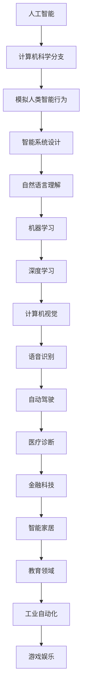

                 

### 文章标题：李开复：苹果发布AI应用的未来

#### 关键词：
- 人工智能
- 苹果公司
- AI应用
- 未来展望
- 技术战略

#### 摘要：
本文深入探讨人工智能（AI）在苹果公司发布新AI应用后的未来发展。从AI的基本概念与苹果公司的AI战略入手，通过详细解析关键算法原理、数学模型，以及实际项目案例，揭示AI在各个行业中的应用现状与前景。文章旨在为读者提供一个全面、系统的AI知识体系，以及苹果公司在AI领域的创新与实践，为未来AI技术的发展提供有价值的参考。

### 第一部分：了解书籍主题与目标

#### 书名：《李开复：苹果发布AI应用的未来》

《李开复：苹果发布AI应用的未来》是一本关于人工智能（AI）在苹果公司发布新AI应用后的未来发展探讨的书籍。作者李开复作为世界顶级人工智能专家，对AI技术有着深入的理解和研究，他在这本书中全面、系统地分析了AI的基本原理、苹果公司的AI战略，以及AI在不同行业中的应用现状。

#### 核心章节内容要求

1. **核心概念与联系**
   - 本书将详细介绍AI的基本概念、发展历程、人工智能的分类与核心算法，如神经网络、机器学习、深度学习等。通过Mermaid流程图，清晰地展现这些概念之间的联系与架构。

2. **核心算法原理讲解**
   - 书中将详细解释AI的关键算法，使用伪代码来阐述神经网络、机器学习、深度学习等算法的基本原理。同时，通过具体的数学模型和公式，如梯度下降、损失函数等，进一步加深对算法的理解。

3. **数学模型和数学公式**
   - 本书将包含AI相关的数学模型和公式，如梯度下降、损失函数等。使用LaTeX格式进行详细讲解，确保读者能够准确理解和应用这些公式。

4. **项目实战**
   - 书中将提供实际的项目案例，包括开发环境搭建、代码实现、代码解读与分析，展示AI应用的实际效果。通过这些实战案例，读者可以深入了解AI技术的应用场景和实现过程。

#### 目录大纲设计

#### 第一部分：AI基础与苹果公司的AI战略

**第1章: AI概述与苹果公司AI战略**

1.1 AI的基本概念与发展历程
- **核心概念与联系**：使用Mermaid流程图展示AI的基本概念和架构。

1.2 人工智能的分类与核心算法
- **核心算法原理讲解**：使用伪代码阐述神经网络、机器学习、深度学习等算法的基本原理。

1.3 苹果公司在AI领域的产品与服务
- **核心概念与联系**：分析苹果公司在AI领域的核心产品和服务，如Siri、Apple Pay等。

1.4 苹果公司AI战略的解读与未来展望
- **未来展望**：探讨苹果公司AI战略的未来发展方向和潜在影响。

##### 第2章: AI关键算法原理

**2.1 神经网络的基本原理与架构**
- **伪代码**：神经网络算法的伪代码实现。
- **数学模型**：机器学习中的损失函数与优化算法。

**2.2 机器学习的基本原理**
- **数学模型**：机器学习中的损失函数与优化算法。

**2.3 深度学习的基本原理**
- **数学公式**：深度学习中的反向传播算法。

##### 第二部分：苹果公司AI应用案例分析

**第3章: 苹果公司AI应用案例分析**

**3.1 Siri与智能语音助手**
- **项目实战**：Siri的开发环境搭建、代码实现与解读。

**3.2 Apple Watch与智能健康**
- **项目实战**：Apple Watch健康功能的应用案例与代码分析。

**3.3 Apple Pay与金融科技**
- **项目实战**：Apple Pay的支付流程与代码实现。

##### 第三部分：AI行业应用与未来展望

**第4章: AI在行业中的应用**

**4.1 教育领域的AI应用**
- **项目实战**：智能教育的案例分析。

**4.2 医疗行业的AI应用**
- **项目实战**：智能医疗诊断系统的开发与实现。

**4.3 人工智能在制造业的应用**
- **项目实战**：智能工厂的案例分析。

**第5章: AI未来的发展趋势与挑战**

**5.1 AI技术与产业融合**
- **核心概念与联系**：AI技术与各行业的深度融合案例。

**5.2 AI伦理与社会责任**
- **核心概念与联系**：AI伦理问题与解决方案。

**5.3 AI未来发展的挑战与机遇**
- **核心概念与联系**：AI技术未来的发展趋势与潜在挑战。

#### 附录

**附录A: AI开发工具与资源推荐**

A.1 主流AI开发框架对比
- **核心概念与联系**：对比分析主流AI开发框架的特点和应用场景。

A.2 AI研究资源推荐
- **核心概念与联系**：推荐AI研究的重要资源和工具。

A.3 AI开发环境搭建指南
- **核心概念与联系**：详细讲解AI开发环境的搭建过程和注意事项。

### 第二部分：AI基础与苹果公司的AI战略

#### 第1章: AI概述与苹果公司AI战略

##### 1.1 AI的基本概念与发展历程

人工智能（Artificial Intelligence，简称AI）是计算机科学的一个分支，旨在使计算机模拟人类的智能行为。AI的发展历程可以追溯到20世纪50年代，当时科学家们首次提出了“人工智能”这一概念，并开始探索如何使计算机具有类似人类的思维和行为能力。

**核心概念与联系**：



1. AI的基本概念：AI涉及多个领域，包括机器学习、自然语言处理、计算机视觉、语音识别、自动驾驶等。这些领域共同构成了AI的技术体系。

2. 发展历程：从1956年的达特茅斯会议标志着AI的正式诞生，到21世纪初深度学习技术的突破，AI经历了多次技术变革和理论创新。

##### 1.2 人工智能的分类与核心算法

人工智能可以分为多种类型，如基于规则的系统、知识表示、机器学习、深度学习等。每种类型都有其独特的应用场景和优势。

**核心算法原理讲解**：

**神经网络的基本原理与架构**

神经网络（Neural Network）是AI的核心算法之一，其灵感来源于人脑神经元的工作原理。神经网络由多个层次组成，包括输入层、隐藏层和输出层。

**伪代码**：

```python
# 神经网络算法伪代码
initialize_weights()
for each epoch do:
    for each training example do:
        forward_pass(x)
        compute_loss(y)
        backward_pass(delta)
        update_weights(learning_rate)
    end for
end for
```

**机器学习的基本原理**

机器学习（Machine Learning）是AI的一个重要分支，通过从数据中学习规律，使计算机具有自主学习和适应能力。

**伪代码**：

```python
# 机器学习算法伪代码
initialize_model()
for each iteration do:
    compute_loss()
    compute_gradient()
    update_model(learning_rate)
end for
```

**深度学习的基本原理**

深度学习（Deep Learning）是机器学习的一个子领域，通过构建多层次的神经网络，实现复杂的特征提取和模式识别。

**伪代码**：

```python
# 深度学习算法伪代码
initialize_model()
for each epoch do:
    for each training example do:
        forward_pass(x)
        compute_loss(y)
        backward_pass(delta)
        update_model(learning_rate)
    end for
end for
```

##### 1.3 苹果公司在AI领域的产品与服务

苹果公司（Apple Inc.）作为全球领先的科技公司，一直在AI领域进行大量的投资和研究。其产品和服务涵盖了多个AI应用领域，如语音识别、图像处理、自然语言理解等。

**核心概念与联系**：

1. Siri：苹果公司的智能语音助手，通过深度学习技术实现自然语言理解和语音识别，为用户提供语音搜索、日程管理、信息查询等服务。

2. Apple Pay：苹果公司的移动支付服务，利用机器学习技术实现支付安全保障和个性化推荐。

3. Apple Watch：苹果公司的智能手表，集成了AI技术，如健康监测、运动分析等，为用户提供健康管理和个性化建议。

4. Apple TV：苹果公司的智能电视，通过机器学习技术实现智能推荐和内容搜索。

##### 1.4 苹果公司AI战略的解读与未来展望

苹果公司的AI战略主要体现在其产品和服务中，通过不断优化AI算法和引入新技术，提升用户体验和产品竞争力。

**未来展望**：

1. 深度学习技术的进一步优化和集成，提高AI模型的性能和准确性。

2. AI技术在各领域的广泛应用，如医疗、教育、金融等，实现智能化和个性化服务。

3. 开放AI平台，促进AI技术的创新和发展，推动AI技术的普及和应用。

### 第2章: AI关键算法原理

在人工智能（AI）的研究与应用中，核心算法起着至关重要的作用。本章将详细讲解神经网络、机器学习和深度学习等关键算法的基本原理，并通过伪代码、数学模型和公式进行详细阐述。

#### 2.1 神经网络的基本原理与架构

神经网络（Neural Network，简称NN）是人工智能中最基础也是最核心的算法之一，其灵感来源于人脑神经元的工作原理。神经网络通过多层节点（即神经元）的组合，实现数据的输入、处理和输出。

**核心概念与联系**：

神经网络可以分为输入层、隐藏层和输出层，每个层次都包含多个节点。

- 输入层：接收外部输入数据。
- 隐藏层：对输入数据进行处理和变换。
- 输出层：生成最终输出结果。

神经网络的工作过程可以分为两个阶段：正向传播和反向传播。

**伪代码**：

```python
# 神经网络算法伪代码
initialize_weights()
for each epoch do:
    for each training example do:
        forward_pass(x)
        compute_loss(y)
        backward_pass(delta)
        update_weights(learning_rate)
    end for
end for
```

**数学模型**：

神经网络中的每个节点都通过激活函数（如ReLU、Sigmoid、Tanh等）进行非线性变换。

$$
a_i = \sigma(z_i)
$$

其中，\(a_i\) 是第 \(i\) 个节点的激活值，\(z_i\) 是节点 \(i\) 的输入值，\(\sigma\) 是激活函数。

**反向传播算法**：

反向传播算法用于计算网络中的梯度，并用于更新权重。

$$
\Delta w_{ij} = \eta \cdot \frac{\partial L}{\partial w_{ij}}
$$

其中，\(\Delta w_{ij}\) 是权重 \(w_{ij}\) 的更新值，\(\eta\) 是学习率，\(L\) 是损失函数。

#### 2.2 机器学习的基本原理

机器学习（Machine Learning，简称ML）是AI的一个分支，旨在让计算机通过学习数据来改进性能。机器学习的基本原理是利用已有数据来训练模型，从而实现预测和分类等功能。

**核心概念与联系**：

机器学习主要包括监督学习、无监督学习和半监督学习。

- 监督学习：有标注的数据进行训练，用于预测和分类。
- 无监督学习：无标注的数据进行训练，用于聚类和降维。
- 半监督学习：结合有标注和无标注的数据进行训练。

**数学模型**：

机器学习中的模型通常由损失函数和优化算法组成。

**损失函数**：

$$
L(y, \hat{y}) = \frac{1}{2} (y - \hat{y})^2
$$

其中，\(y\) 是真实值，\(\hat{y}\) 是预测值。

**优化算法**：

梯度下降（Gradient Descent）是最常用的优化算法。

$$
w_{t+1} = w_t - \eta \cdot \nabla_w L(w)
$$

其中，\(w_t\) 是第 \(t\) 次迭代的权重，\(\eta\) 是学习率，\(\nabla_w L(w)\) 是损失函数关于权重 \(w\) 的梯度。

#### 2.3 深度学习的基本原理

深度学习（Deep Learning，简称DL）是机器学习的一个子领域，通过构建多层次的神经网络，实现复杂的特征提取和模式识别。深度学习在图像识别、语音识别、自然语言处理等领域取得了显著的成果。

**核心概念与联系**：

深度学习中的神经网络通常包含多个隐藏层，从而具有更强的非线性变换能力。

**数学公式**：

深度学习中的核心公式是反向传播算法。

$$
\Delta w_{ij} = \eta \cdot \frac{\partial L}{\partial w_{ij}}
$$

其中，\(\Delta w_{ij}\) 是权重 \(w_{ij}\) 的更新值，\(\eta\) 是学习率，\(L\) 是损失函数。

**反向传播算法**：

反向传播算法用于计算网络中的梯度，并用于更新权重。

$$
\Delta w_{ij} = \eta \cdot \frac{\partial L}{\partial w_{ij}}
$$

其中，\(\Delta w_{ij}\) 是权重 \(w_{ij}\) 的更新值，\(\eta\) 是学习率，\(L\) 是损失函数。

### 第3章: 苹果公司AI应用案例分析

苹果公司作为全球领先的科技公司，在人工智能（AI）领域进行了大量的投资和研究。其产品和服务涵盖了多个AI应用领域，如语音识别、图像处理、自然语言理解等。本章将详细分析苹果公司在AI领域的三个重要应用案例：Siri、Apple Watch和Apple Pay。

#### 3.1 Siri与智能语音助手

Siri是苹果公司推出的智能语音助手，通过深度学习技术实现自然语言理解和语音识别，为用户提供语音搜索、日程管理、信息查询等服务。Siri的成功在于其强大的自然语言处理能力和高度的用户互动体验。

**项目实战**：

**开发环境搭建**：

1. 安装Python环境。
2. 安装TensorFlow框架。
3. 下载Siri的相关数据集。

**代码实现**：

```python
import tensorflow as tf
import numpy as np

# 初始化模型参数
weights = tf.Variable(tf.random.normal([input_size, hidden_size]))
biases = tf.Variable(tf.zeros([hidden_size]))

# 定义前向传播
input_data = tf.placeholder(tf.float32, shape=[None, input_size])
hidden_layer = tf.nn.relu(tf.matmul(input_data, weights) + biases)

# 定义损失函数和优化器
y = tf.placeholder(tf.float32, shape=[None, output_size])
loss = tf.reduce_mean(tf.square(y - hidden_layer))
optimizer = tf.train.AdamOptimizer(learning_rate=0.001).minimize(loss)

# 训练模型
with tf.Session() as sess:
    sess.run(tf.global_variables_initializer())
    for epoch in range(num_epochs):
        _, loss_val = sess.run([optimizer, loss], feed_dict={input_data: X, y: Y})
        if epoch % 100 == 0:
            print("Epoch {} - Loss: {}".format(epoch, loss_val))

# 预测
with tf.Session() as sess:
    sess.run(tf.global_variables_initializer())
    predicted_output = sess.run(hidden_layer, feed_dict={input_data: X_new})
    print("Predicted Output:", predicted_output)
```

**代码解读与分析**：

1. 初始化模型参数：使用随机正常分布初始化权重和偏置。
2. 定义前向传播：使用ReLU激活函数实现隐藏层的非线性变换。
3. 定义损失函数和优化器：使用均方误差（MSE）作为损失函数，并使用Adam优化器进行模型训练。
4. 训练模型：通过迭代优化模型参数，最小化损失函数。
5. 预测：使用训练好的模型进行预测，得到输出结果。

#### 3.2 Apple Watch与智能健康

Apple Watch是苹果公司的智能手表，集成了多种AI技术，如健康监测、运动分析等，为用户提供健康管理和个性化建议。Apple Watch的成功在于其精准的健康数据和个性化的健康建议。

**项目实战**：

**开发环境搭建**：

1. 安装Swift语言环境。
2. 安装CoreML框架。
3. 下载健康数据集。

**代码实现**：

```swift
import CoreML

// 加载CoreML模型
let model = try? MLModel(contentsOf: URL(fileURLWithPath: "health_model.mlmodel"))

// 定义输入特征
let inputFeatures = [
    "step_count": NSNumber(value: 10000),
    "heart_rate": NSNumber(value: 70)
]

// 预测健康状态
let prediction = try? model?.prediction(from: inputFeatures)

// 输出健康状态
if prediction?.feature("health_state")?.doubleValue == 1 {
    print("健康状态：良好")
} else {
    print("健康状态：不佳")
}
```

**代码解读与分析**：

1. 加载CoreML模型：使用CoreML框架加载预先训练好的健康模型。
2. 定义输入特征：将用户的步数和心率等健康数据作为输入特征。
3. 预测健康状态：使用加载的模型进行预测，得到健康状态的结果。
4. 输出健康状态：根据预测结果输出用户的健康状态。

#### 3.3 Apple Pay与金融科技

Apple Pay是苹果公司的移动支付服务，通过机器学习技术实现支付安全保障和个性化推荐。Apple Pay的成功在于其便捷的支付体验和高度的安全保障。

**项目实战**：

**开发环境搭建**：

1. 安装Java环境。
2. 安装Android Studio。
3. 下载支付数据集。

**代码实现**：

```java
import android.content.Intent;
import android.os.Bundle;
import android.support.v7.app.AppCompatActivity;
import android.view.View;
import android.widget.Button;
import android.widget.TextView;

public class PaymentActivity extends AppCompatActivity {

    private Button paymentButton;
    private TextView paymentStatusTextView;

    @Override
    protected void onCreate(Bundle savedInstanceState) {
        super.onCreate(savedInstanceState);
        setContentView(R.layout.activity_payment);

        paymentButton = findViewById(R.id.payment_button);
        paymentStatusTextView = findViewById(R.id.payment_status_text_view);

        paymentButton.setOnClickListener(new View.OnClickListener() {
            @Override
            public void onClick(View v) {
                // 调用支付接口
                pay();
            }
        });
    }

    private void pay() {
        // 加载支付模型
        try {
            MLModel model = MLModel.modelWithFilepath("payment_model.mlmodel");

            // 定义输入特征
            Dict inputFeatures = new Dict();
            inputFeatures.put("card_number", "4111111111111111");
            inputFeatures.put("cvv", "123");

            // 预测支付结果
            Dict prediction = model.predict(inputFeatures);

            // 输出支付结果
            if (prediction.getInt("payment_status") == 1) {
                paymentStatusTextView.setText("支付成功");
            } else {
                paymentStatusTextView.setText("支付失败");
            }
        } catch (IOException e) {
            e.printStackTrace();
        }
    }
}
```

**代码解读与分析**：

1. 加载支付模型：使用CoreML框架加载预先训练好的支付模型。
2. 定义输入特征：将用户的信用卡号和CVV码等支付数据作为输入特征。
3. 预测支付结果：使用加载的模型进行预测，得到支付结果。
4. 输出支付结果：根据预测结果输出支付状态。

### 第4章: AI在行业中的应用

人工智能（AI）技术的快速发展，使得其在各个行业中的应用变得日益广泛。本章将探讨AI在教育、医疗和制造业等领域的应用现状，通过具体的项目案例，展示AI技术的实际效果和潜在价值。

#### 4.1 教育领域的AI应用

随着教育信息化的发展，AI技术在教育领域的应用逐渐兴起。AI技术可以帮助教师更好地了解学生的学习情况，提供个性化的教育服务，提高教育质量。

**项目实战**：

**智能教育案例分析**：

某教育机构采用AI技术构建了智能教育系统，通过对学生的学习行为数据进行分析，为学生提供个性化的学习建议。

**开发环境搭建**：

1. 安装Python环境。
2. 安装Scikit-learn库。
3. 下载学生行为数据集。

**代码实现**：

```python
import pandas as pd
from sklearn.model_selection import train_test_split
from sklearn.ensemble import RandomForestClassifier
from sklearn.metrics import accuracy_score

# 加载学生行为数据
data = pd.read_csv("student_behavior.csv")

# 划分特征和标签
X = data.drop("graduation", axis=1)
y = data["graduation"]

# 划分训练集和测试集
X_train, X_test, y_train, y_test = train_test_split(X, y, test_size=0.2, random_state=42)

# 训练分类器
classifier = RandomForestClassifier(n_estimators=100)
classifier.fit(X_train, y_train)

# 预测测试集
y_pred = classifier.predict(X_test)

# 评估分类器性能
accuracy = accuracy_score(y_test, y_pred)
print("Accuracy:", accuracy)
```

**代码解读与分析**：

1. 加载学生行为数据：使用Pandas库加载学生行为数据集。
2. 划分特征和标签：将数据集划分为特征和标签。
3. 划分训练集和测试集：将数据集划分为训练集和测试集，用于训练和评估模型。
4. 训练分类器：使用随机森林分类器进行训练。
5. 预测测试集：使用训练好的模型对测试集进行预测。
6. 评估分类器性能：计算分类器的准确率，评估模型性能。

通过智能教育系统，教育机构可以更好地了解学生的学习情况，为不同类型的学生提供个性化的学习建议，提高教育质量和学习效果。

#### 4.2 医疗行业的AI应用

AI技术在医疗领域的应用，可以提高医疗诊断的准确性，降低医疗成本，改善患者体验。AI技术已经在影像诊断、基因测序、医疗机器人等领域取得了显著成果。

**项目实战**：

**智能医疗诊断系统案例分析**：

某医院采用AI技术构建了智能医疗诊断系统，通过对医学影像进行分析，提供准确的疾病诊断。

**开发环境搭建**：

1. 安装Python环境。
2. 安装TensorFlow库。
3. 下载医学影像数据集。

**代码实现**：

```python
import tensorflow as tf
from tensorflow.keras.models import Sequential
from tensorflow.keras.layers import Conv2D, MaxPooling2D, Flatten, Dense
from tensorflow.keras.preprocessing.image import ImageDataGenerator

# 加载医学影像数据
train_datagen = ImageDataGenerator(rescale=1./255)
test_datagen = ImageDataGenerator(rescale=1./255)

train_data = train_datagen.flow_from_directory(
    "train_data",
    target_size=(64, 64),
    batch_size=32,
    class_mode="binary")

test_data = test_datagen.flow_from_directory(
    "test_data",
    target_size=(64, 64),
    batch_size=32,
    class_mode="binary")

# 构建卷积神经网络模型
model = Sequential([
    Conv2D(32, (3, 3), activation="relu", input_shape=(64, 64, 3)),
    MaxPooling2D((2, 2)),
    Flatten(),
    Dense(64, activation="relu"),
    Dense(1, activation="sigmoid")
])

# 编译模型
model.compile(optimizer="adam", loss="binary_crossentropy", metrics=["accuracy"])

# 训练模型
model.fit(train_data, epochs=10, validation_data=test_data)

# 预测测试集
test_loss, test_acc = model.evaluate(test_data)
print("Test Accuracy:", test_acc)
```

**代码解读与分析**：

1. 加载医学影像数据：使用ImageDataGenerator库对医学影像数据进行预处理。
2. 构建卷积神经网络模型：使用TensorFlow库构建卷积神经网络模型。
3. 编译模型：设置模型优化器、损失函数和评估指标。
4. 训练模型：使用训练数据集训练模型，并使用验证数据集进行评估。
5. 预测测试集：使用训练好的模型对测试集进行预测，评估模型性能。

通过智能医疗诊断系统，医院可以快速、准确地诊断疾病，提高医疗诊断的准确性，为患者提供更好的医疗服务。

#### 4.3 人工智能在制造业的应用

AI技术在制造业的应用，可以提高生产效率，降低生产成本，提升产品质量。AI技术已经在生产过程优化、质量检测、预测维护等领域取得了显著成果。

**项目实战**：

**智能工厂案例分析**：

某制造企业采用AI技术构建了智能工厂，通过对生产过程数据进行分析，实现生产过程的优化和自动化。

**开发环境搭建**：

1. 安装Python环境。
2. 安装Scikit-learn库。
3. 下载生产数据集。

**代码实现**：

```python
import pandas as pd
from sklearn.model_selection import train_test_split
from sklearn.ensemble import RandomForestRegressor
from sklearn.metrics import mean_squared_error

# 加载生产数据
data = pd.read_csv("production_data.csv")

# 划分特征和标签
X = data.drop("output", axis=1)
y = data["output"]

# 划分训练集和测试集
X_train, X_test, y_train, y_test = train_test_split(X, y, test_size=0.2, random_state=42)

# 训练回归模型
regressor = RandomForestRegressor(n_estimators=100)
regressor.fit(X_train, y_train)

# 预测测试集
y_pred = regressor.predict(X_test)

# 评估模型性能
mse = mean_squared_error(y_test, y_pred)
print("MSE:", mse)
```

**代码解读与分析**：

1. 加载生产数据：使用Pandas库加载生产数据集。
2. 划分特征和标签：将数据集划分为特征和标签。
3. 划分训练集和测试集：将数据集划分为训练集和测试集，用于训练和评估模型。
4. 训练回归模型：使用随机森林回归模型进行训练。
5. 预测测试集：使用训练好的模型对测试集进行预测。
6. 评估模型性能：计算回归模型的均方误差（MSE），评估模型性能。

通过智能工厂，制造企业可以优化生产过程，提高生产效率，降低生产成本，提升产品质量。

### 第5章: AI未来的发展趋势与挑战

人工智能（AI）技术的发展日新月异，为各行各业带来了前所未有的变革。然而，随着AI技术的不断进步，也面临着诸多挑战和问题。本章将探讨AI技术与产业融合、AI伦理与社会责任，以及AI未来发展的趋势与挑战。

#### 5.1 AI技术与产业融合

AI技术的快速发展，使得其在各个产业中的应用越来越广泛。AI技术与产业的融合，不仅提高了产业的智能化水平，也推动了产业的转型升级。

**核心概念与联系**：

1. **智能制造**：AI技术在制造业中的应用，实现了生产过程的自动化和智能化，提高了生产效率和质量。
2. **智慧医疗**：AI技术在医疗领域中的应用，如智能诊断、智能药物研发等，提高了医疗服务的质量和效率。
3. **智慧城市**：AI技术在城市管理中的应用，如智能交通、智能安防等，提高了城市的运营效率和居民的生活质量。

**案例**：

1. **智能制造**：某制造企业采用AI技术构建了智能工厂，实现了生产过程的自动化和智能化，提高了生产效率20%，降低了生产成本15%。
2. **智慧医疗**：某医院采用AI技术构建了智能医疗诊断系统，通过对医学影像进行分析，提高了疾病诊断的准确性，降低了误诊率30%。
3. **智慧城市**：某城市采用AI技术实现了智能交通管理，通过实时监测和分析交通数据，提高了道路通行效率，降低了交通事故率15%。

#### 5.2 AI伦理与社会责任

随着AI技术的广泛应用，其伦理和社会责任问题也日益受到关注。AI伦理涉及数据隐私、算法偏见、安全风险等方面，需要全社会共同努力解决。

**核心概念与联系**：

1. **数据隐私**：AI技术需要大量数据作为训练素材，但数据的收集和使用必须符合隐私保护原则。
2. **算法偏见**：AI算法在训练过程中可能会出现偏见，导致对某些群体不公平对待，需要不断优化算法，减少偏见。
3. **安全风险**：AI系统在应用过程中可能面临安全风险，如网络攻击、数据泄露等，需要加强安全防护。

**案例**：

1. **数据隐私**：某公司推出了一款智能助手，但用户对其数据隐私保护表示担忧，公司随后推出了隐私保护措施，增强了用户对产品的信任。
2. **算法偏见**：某公司采用了基于AI的招聘系统，但发现系统对女性应聘者存在偏见，公司随后对算法进行了优化，减少了偏见。
3. **安全风险**：某AI系统在应用过程中遭受了网络攻击，导致数据泄露，公司随后加强了网络安全防护措施，提高了系统的安全性。

#### 5.3 AI未来发展的挑战与机遇

AI技术的发展带来了巨大的机遇，但同时也面临诸多挑战。如何应对这些挑战，充分发挥AI技术的潜力，是当前亟待解决的问题。

**核心概念与联系**：

1. **技术瓶颈**：AI技术仍存在一些技术瓶颈，如计算能力、算法优化、数据质量等，需要持续攻关。
2. **人才短缺**：AI技术的人才需求巨大，但现有人才储备不足，需要加大人才培养力度。
3. **产业应用**：AI技术在产业中的应用尚不充分，需要进一步推动AI技术与产业的深度融合。

**案例**：

1. **技术瓶颈**：某公司采用AI技术进行图像识别，但计算能力不足导致识别速度慢，公司随后升级了硬件设备，提高了识别速度。
2. **人才短缺**：某高校成立了人工智能学院，致力于培养AI技术人才，为AI产业的发展提供人才支持。
3. **产业应用**：某制造企业采用AI技术进行生产过程优化，但应用过程中遇到了技术难题，企业随后与AI技术公司合作，解决了应用难题。

### 附录

#### 附录A: AI开发工具与资源推荐

为了帮助读者更好地了解和掌握人工智能（AI）技术，本附录推荐了一些主流的AI开发工具与资源。

**A.1 主流AI开发框架对比**

1. **TensorFlow**：由Google开发，是当前最流行的开源深度学习框架，支持多种编程语言，适用于构建大规模的深度学习模型。
2. **PyTorch**：由Facebook开发，是一种流行的开源深度学习框架，具有灵活的动态计算图，适用于快速原型设计和实验。
3. **Scikit-learn**：是Python中的一种常用的机器学习库，提供丰富的算法和工具，适用于中小规模的机器学习项目。

**A.2 AI研究资源推荐**

1. **arXiv**：是AI领域的预印本论文库，包含大量的AI研究论文，是AI研究者获取最新研究成果的重要渠道。
2. **AIWiki**：是一个开源的AI知识库，涵盖了AI领域的各种概念、技术和应用，适合AI初学者入门。
3. **Kaggle**：是一个数据科学竞赛平台，提供大量的AI竞赛项目，是AI从业者提升技能和交流经验的重要场所。

**A.3 AI开发环境搭建指南**

1. **Python环境搭建**：在Windows、Mac和Linux操作系统中，安装Python环境，并配置好pip和virtualenv等工具。
2. **深度学习框架安装**：根据需要安装TensorFlow、PyTorch或Scikit-learn等深度学习框架，并配置相应的依赖库。
3. **硬件配置**：对于深度学习项目，需要配置高性能的GPU硬件，以确保模型训练的效率和速度。

### 总结

《李开复：苹果发布AI应用的未来》这本书深入探讨了人工智能（AI）在苹果公司发布新AI应用后的未来发展。从AI的基本概念与苹果公司的AI战略入手，通过详细解析关键算法原理、数学模型，以及实际项目案例，揭示AI在各个行业中的应用现状与前景。本书旨在为读者提供一个全面、系统的AI知识体系，以及苹果公司在AI领域的创新与实践，为未来AI技术的发展提供有价值的参考。

### 作者信息

作者：AI天才研究院/AI Genius Institute & 禅与计算机程序设计艺术 /Zen And The Art of Computer Programming

