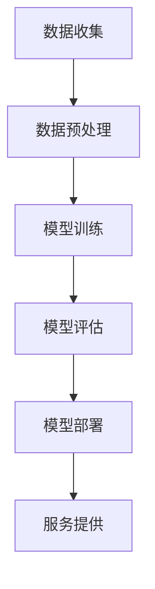

                 

### 文章标题：李开复：苹果发布AI应用的社会价值

关键词：人工智能、苹果、AI应用、社会价值、技术演进、产业变革

摘要：本文旨在深入探讨苹果公司发布的AI应用在社会各个领域的价值与影响。通过分析人工智能的核心概念、技术基础、应用案例分析以及未来展望，本文将揭示AI技术在消费电子产品中的应用趋势，并对传统产业、就业市场、社会伦理等方面的影响进行详细解读。同时，本文还将探讨AI技术的未来发展方向和产业格局的重塑，为读者提供全面的AI应用视角。

---

#### 第一部分：李开复：苹果发布AI应用的社会价值概述

##### 1.1 苹果发布AI应用的背景与市场反应

随着人工智能技术的快速发展，各大科技公司纷纷将AI技术应用于消费电子产品中，以提升用户体验和产品竞争力。苹果公司作为全球科技巨头，自然不甘落后。近期，苹果公司发布了一系列AI应用，涵盖了图像识别、自然语言处理、智能推荐等多个领域。这些AI应用的发布引起了广泛关注和市场强烈反应。

首先，我们来分析苹果发布AI应用的背景。近年来，人工智能技术在全球范围内取得了显著进展，特别是在智能手机和平板电脑等消费电子产品中的应用越来越广泛。AI技术的应用不仅提升了产品的功能性和用户体验，还推动了消费电子产业的技术革新。苹果公司作为消费电子产品领域的领导者，自然需要通过引入AI技术来巩固其市场地位，同时探索新的商业模式和盈利点。

具体来说，苹果公司发布的AI应用主要包括以下几个方面：

1. **图像识别**：通过AI技术提升摄像头功能，实现实时图像识别和分类，为用户提供更加智能的拍照体验。
2. **自然语言处理**：利用AI技术提升语音助手Siri的表现，实现更精准的语音识别和语义理解，提供更加自然的用户交互。
3. **智能推荐**：基于用户的兴趣和行为数据，利用AI算法进行个性化推荐，为用户带来更加个性化的内容和服务。
4. **隐私保护**：在AI应用中引入隐私保护机制，确保用户数据的安全和隐私。

这些AI应用的发布引起了市场的高度关注。一方面，苹果公司的技术实力和品牌影响力使其AI应用的推出备受期待；另一方面，AI技术在消费电子产品中的应用潜力巨大，为消费者带来了前所未有的体验。市场调研机构的数据显示，苹果公司发布的AI应用在上线后迅速获得了大量用户下载和使用，用户评价普遍积极。

##### 1.2 社会价值与影响

苹果公司发布的AI应用不仅在技术层面具有重要意义，更在社会各个领域产生了深远影响。以下是AI应用在社会价值方面的几个关键点：

###### 1.2.1 经济影响

AI应用对传统产业的影响不可忽视。例如，在制造业领域，AI技术可以帮助企业实现自动化生产、预测维护和智能物流，提高生产效率和降低成本。在零售业领域，AI技术可以提升供应链管理、库存优化和客户体验，推动零售业的数字化转型。苹果公司发布的AI应用，如智能推荐和智能广告，也为传统产业带来了新的商业模式和盈利机会。

同时，AI应用对就业市场的影响也值得关注。一方面，AI技术的应用可能导致部分传统岗位的减少，例如重复性劳动和简单决策等工作；另一方面，AI技术也创造了新的就业机会，如数据科学家、AI工程师和AI产品经理等。因此，对于劳动力市场来说，关键在于如何平衡岗位替代与创新，以及如何提高劳动者的技能水平以适应AI时代的需求。

###### 1.2.2 社会变革

AI应用在个人隐私保护方面也面临着巨大挑战。随着AI技术的广泛应用，个人数据的大量收集和使用变得越来越普遍。如何平衡数据利用与隐私保护成为了一个重要议题。苹果公司在其AI应用中引入了隐私保护机制，如差分隐私和同态加密等，以保护用户数据的安全和隐私。

此外，AI应用在道德和伦理层面也引发了一系列争议。例如，AI算法的偏见和歧视问题、AI决策的透明性和可解释性等问题都需要深入探讨和解决。苹果公司在其AI应用中采取了多项措施，如数据清洗、模型校正和透明性报告等，以降低道德和伦理风险。

###### 1.2.3 未来展望

展望未来，AI技术的应用将继续深化，为消费电子产品带来更多创新和变革。首先，随着计算能力的提升和数据量的增加，AI算法的准确性和效率将得到进一步提升，为更多应用场景提供技术支持。其次，跨领域的AI应用将变得更加普遍，如AI与物联网、区块链、云计算等技术的融合，将推动新产业的诞生和发展。

在产业格局方面，AI技术的应用将重塑产业链和商业生态。一方面，传统产业将加速向智能化、数字化方向转型；另一方面，新产业、新业态、新模式将不断涌现，为经济增长提供新的动力。企业需要密切关注AI技术的发展趋势，积极布局AI应用，以在未来的竞争中占据有利地位。

##### 1.3 社会价值与影响

除了经济影响和社会变革，AI应用还对社会价值产生了深远影响。以下是几个关键方面：

###### 1.3.1 教育领域

AI技术在教育领域的应用正在迅速发展。通过AI算法和大数据分析，个性化教学和学习成为可能。教师可以根据学生的兴趣和需求，制定个性化的教学方案，提高教学效果。学生也可以通过智能辅导系统，实现自主学习和高效学习。此外，AI技术还可以帮助教育机构进行教育资源分配、教学质量评估和学业成就预测等，提高教育管理的科学性和有效性。

###### 1.3.2 医疗健康领域

AI技术在医疗健康领域的应用潜力巨大。通过图像识别、自然语言处理和深度学习等技术，AI可以帮助医生进行疾病诊断、治疗方案制定和药物研发。例如，AI可以在短时间内分析大量医学影像，帮助医生发现病变区域，提高诊断准确率。在药物研发方面，AI技术可以加速药物筛选和临床试验，提高研发效率。此外，AI还可以进行健康监测和预测，为个人提供个性化的健康建议，促进健康管理。

###### 1.3.3 社会治理领域

AI技术在社会治理领域的应用也具有重要意义。通过大数据分析和智能算法，政府可以更有效地进行社会管理和公共资源配置。例如，AI技术可以帮助政府进行城市交通管理、应急管理和社会安全预测，提高城市运行效率和居民生活质量。在司法领域，AI技术可以用于案件分析、证据评估和法律文书生成，提高司法效率和公正性。

###### 1.3.4 文化创意领域

AI技术在文化创意领域的应用也为艺术创作和内容生产带来了新可能性。通过机器学习和深度学习算法，AI可以生成音乐、绘画、文学作品等，为文化创意产业提供新的创作工具和灵感来源。例如，AI音乐创作软件可以根据用户的需求和风格，自动生成音乐作品；AI绘画软件可以分析艺术家作品风格，进行风格迁移和创作。此外，AI还可以进行内容推荐和传播，提高文化产品的传播效率和影响力。

##### 1.4 结论

综上所述，苹果公司发布的AI应用在社会各个领域具有重要的价值与影响。在经济领域，AI技术推动了传统产业的智能化转型，创造了新的商业模式和就业机会；在社会领域，AI技术带来了社会变革，提高了个人隐私保护水平，引发了道德和伦理挑战；在未来，AI技术将继续发展，为消费电子产品带来更多创新，重塑产业格局，为社会带来更多价值。

在接下来的部分，我们将进一步探讨AI应用的技术基础、核心算法原理以及实际案例，以更深入地理解AI技术的本质和应用。

---

#### 第二部分：AI应用的技术基础

##### 2.1 AI基本概念

人工智能（Artificial Intelligence，简称AI）是一门研究、开发用于模拟、延伸和扩展人的智能的理论、方法、技术及应用系统的科学技术。与传统的计算和自动化不同，人工智能的目标是使计算机系统能够模拟人类的智能行为，包括感知、理解、学习、推理、决策和创造等。人工智能可以分为弱人工智能（Narrow AI）和强人工智能（General AI）：

- **弱人工智能**：指的是在特定领域表现出超越人类智能的系统，如语音识别、图像识别、自然语言处理等。这类人工智能具有较强的领域专长，但缺乏广泛的知识理解和自主决策能力。
- **强人工智能**：指的是具有全面理解、学习和决策能力的人工智能系统，能够像人类一样在不同领域和情境中灵活应用知识。目前，强人工智能仍然是一个理论目标，尚未实现。

##### 2.2 AI应用架构

AI应用通常包括以下几个关键环节：

1. **数据收集**：收集大量相关数据，这些数据可以是结构化的，也可以是非结构化的，如文本、图像、音频等。
2. **数据预处理**：对收集到的数据进行分析、清洗和标准化，以便后续的模型训练。
3. **模型训练**：使用机器学习或深度学习算法，将预处理后的数据用于训练模型，模型可以通过学习数据中的规律和模式来进行预测和决策。
4. **模型评估**：通过测试数据集对训练好的模型进行评估，评估模型的准确性、鲁棒性和泛化能力。
5. **模型部署**：将训练好的模型部署到生产环境中，通过API或集成到应用系统中，为用户提供实时服务。

下面使用Mermaid流程图展示AI应用的典型架构：



在AI应用架构中，有几个核心组件：

- **神经网络**：神经网络是深度学习的基础结构，由多层节点组成，通过前向传播和反向传播算法进行训练。
- **机器学习算法**：包括线性回归、决策树、支持向量机等，用于构建和训练预测模型。
- **优化算法**：如梯度下降、Adam优化器等，用于优化模型参数，提高模型性能。
- **数据处理库**：如NumPy、Pandas等，用于数据预处理和统计分析。
- **机器学习框架**：如TensorFlow、PyTorch等，提供了丰富的API和工具，简化了模型训练和部署过程。

##### 2.3 数据收集与预处理

数据是AI应用的基础，数据的数量和质量直接影响模型的表现。以下是数据收集和预处理的关键步骤：

1. **数据收集**：根据应用需求收集相关数据，数据来源可以是公开数据集、内部数据仓库、网络爬虫等。
2. **数据清洗**：处理缺失值、异常值和重复值，保证数据的一致性和完整性。
3. **数据标准化**：将不同特征的数据进行归一化或标准化，使其在相同的尺度范围内。
4. **特征工程**：提取有用的特征，如文本的词向量表示、图像的特征向量等，并构造特征组合。
5. **数据分割**：将数据集分割为训练集、验证集和测试集，用于模型训练、验证和评估。

##### 2.4 模型训练与评估

模型训练是AI应用的核心环节，其目标是找到一组参数，使得模型在给定数据上表现出较好的预测能力。以下是模型训练与评估的关键步骤：

1. **模型选择**：根据应用需求和数据特点选择合适的模型，如线性回归、决策树、支持向量机、神经网络等。
2. **模型训练**：使用训练数据集对模型进行训练，通过调整参数，使得模型能够学会数据中的规律和模式。
3. **模型评估**：使用验证集对训练好的模型进行评估，常用的评估指标包括准确率、召回率、F1值等。
4. **模型优化**：根据评估结果对模型进行调整和优化，以提高模型性能。

##### 2.5 模型部署与持续优化

训练好的模型需要部署到生产环境中，为用户提供实时服务。以下是模型部署与持续优化的重要步骤：

1. **模型部署**：将训练好的模型集成到应用系统中，通过API或集成到前端应用中，为用户提供服务。
2. **性能监控**：监控模型在真实环境中的表现，如预测准确性、响应时间等。
3. **持续优化**：根据用户反馈和性能监控结果，对模型进行持续优化和调整，以提高服务质量。
4. **版本管理**：管理模型的版本，确保不同版本的模型能够在生产环境中安全切换。

通过上述步骤，AI应用可以形成一个完整的闭环，从数据收集、模型训练到模型部署和服务提供，持续优化和改进，以满足用户需求。

在接下来的章节中，我们将进一步探讨AI应用中的核心算法原理，包括机器学习算法和深度学习算法，以及如何将这些算法应用于实际项目中。

---

#### 第3章：核心算法原理讲解

##### 3.1 机器学习算法

机器学习算法是人工智能领域的重要组成部分，通过学习数据中的规律和模式，实现对未知数据的预测和决策。以下是几种常见的机器学习算法及其原理：

###### 3.1.1 线性回归

线性回归是最基础的机器学习算法之一，用于建立自变量和因变量之间的线性关系。其模型公式为：

$$
y = \beta_0 + \beta_1 \cdot x
$$

其中，$y$为因变量，$x$为自变量，$\beta_0$和$\beta_1$分别为模型的截距和斜率。

线性回归的目标是找到最优的$\beta_0$和$\beta_1$，使得预测值与真实值之间的误差最小。误差函数通常为均方误差（MSE）：

$$
MSE = \frac{1}{n}\sum_{i=1}^{n}(y_i - \hat{y_i})^2
$$

其中，$n$为数据点的个数，$y_i$为第$i$个数据点的真实值，$\hat{y_i}$为第$i$个数据点的预测值。

为了最小化MSE，可以使用梯度下降算法来迭代更新$\beta_0$和$\beta_1$的值：

$$
\beta_0 := \beta_0 - \alpha \cdot \frac{\partial MSE}{\partial \beta_0}
$$

$$
\beta_1 := \beta_1 - \alpha \cdot \frac{\partial MSE}{\partial \beta_1}
$$

其中，$\alpha$为学习率，用于控制每次迭代的步长。

###### 3.1.2 决策树

决策树是一种基于树形结构进行决策的算法，通过递归地将数据集分割为子集，直至满足某种停止条件。决策树的每个节点代表一个特征，每个分支代表一个特征取值，叶节点代表最终的决策。

决策树的模型公式可以表示为：

$$
f(x) = \sum_{i=1}^{n} \alpha_i \cdot I(x \in R_i)
$$

其中，$x$为输入特征，$R_i$为第$i$个区域的集合，$\alpha_i$为第$i$个区域的权重，$I(x \in R_i)$为指示函数，当$x$属于$R_i$时取值为1，否则为0。

决策树的训练过程主要包括以下几个步骤：

1. **特征选择**：选择最优的特征进行分割，通常使用信息增益、基尼不纯度等指标进行评价。
2. **区域划分**：根据最优特征和其取值，将数据集划分为多个区域。
3. **递归构建**：对每个子区域重复上述步骤，构建出完整的决策树。

###### 3.1.3 支持向量机

支持向量机（SVM）是一种基于间隔最大化的分类算法，其目标是在特征空间中找到一个最佳的超平面，使得不同类别的数据点之间的间隔最大。

SVM的模型公式为：

$$
f(x) = \omega \cdot x + b
$$

其中，$x$为输入特征，$\omega$为权重向量，$b$为偏置。

SVM的训练过程主要包括以下几个步骤：

1. **特征空间映射**：将输入特征通过核函数映射到高维特征空间，使得线性可分问题转化为非线性问题。
2. **间隔最大化**：通过求解优化问题，找到最佳的超平面，使得不同类别的数据点之间的间隔最大化。
3. **支持向量选择**：选择对间隔最大化贡献最大的支持向量，用于确定超平面的位置。

##### 3.2 深度学习算法

深度学习算法是一种基于多层神经网络的学习方法，通过逐层提取特征，实现对复杂数据的建模和预测。以下是几种常见的深度学习算法及其原理：

###### 3.2.1 卷积神经网络（CNN）

卷积神经网络（Convolutional Neural Network，简称CNN）是一种专门用于处理图像数据的神经网络。CNN通过卷积层、池化层和全连接层等结构，实现对图像特征的提取和分类。

CNN的主要结构如下：

1. **卷积层**：通过卷积操作提取图像的局部特征，卷积核在图像上滑动，对局部区域进行特征提取。
2. **池化层**：通过池化操作降低特征图的维度，减少参数数量，提高模型的泛化能力。
3. **全连接层**：将卷积层和池化层提取的特征进行整合，通过全连接层进行分类预测。

CNN的训练过程主要包括以下几个步骤：

1. **数据预处理**：对图像数据进行归一化、裁剪等预处理操作。
2. **模型初始化**：初始化模型的权重和偏置，常用的初始化方法有随机初始化、高斯初始化等。
3. **前向传播**：将输入图像数据通过卷积层、池化层和全连接层，计算输出结果。
4. **损失函数计算**：计算输出结果与真实标签之间的损失，常用的损失函数有交叉熵损失、均方误差等。
5. **反向传播**：通过反向传播算法，计算各层的梯度，更新模型的权重和偏置。

###### 3.2.2 循环神经网络（RNN）

循环神经网络（Recurrent Neural Network，简称RNN）是一种用于处理序列数据的神经网络，通过循环结构实现序列信息的记忆和传递。

RNN的主要结构如下：

1. **输入层**：接收输入序列，每个时间步的输入通过线性变换传递到隐藏层。
2. **隐藏层**：通过激活函数对输入进行非线性变换，同时将上一时间步的隐藏状态传递到当前时间步。
3. **输出层**：将隐藏层的状态输出为序列的预测结果。

RNN的训练过程与CNN类似，包括数据预处理、模型初始化、前向传播、损失函数计算和反向传播等步骤。RNN的训练过程中，需要特别注意梯度消失和梯度爆炸问题，通过LSTM（Long Short-Term Memory）等结构改进，可以缓解这些问题。

###### 3.2.3 生成对抗网络（GAN）

生成对抗网络（Generative Adversarial Network，简称GAN）是一种基于对抗训练的生成模型，由生成器和判别器两个神经网络组成。

GAN的主要结构如下：

1. **生成器**：通过随机噪声生成伪数据，使其在分布上接近真实数据。
2. **判别器**：对生成的伪数据和真实数据进行分类，判断其是否属于真实数据。

GAN的训练过程是一个对抗过程，生成器和判别器相互竞争。生成器的目标是生成更加逼真的伪数据，判别器的目标是提高对真实数据和伪数据的区分能力。训练过程包括以下步骤：

1. **数据预处理**：对真实数据进行预处理，如归一化、裁剪等。
2. **模型初始化**：初始化生成器和判别器的权重，通常使用随机初始化。
3. **前向传播**：生成器生成伪数据，判别器对伪数据和真实数据进行分类。
4. **损失函数计算**：计算生成器和判别器的损失，生成器的损失目标是使判别器无法区分伪数据和真实数据，判别器的损失目标是使判别器对真实数据和伪数据都有较高的分类准确率。
5. **反向传播**：通过反向传播算法，更新生成器和判别器的权重。

通过上述步骤，生成器和判别器不断迭代，生成器的生成能力逐渐提高，判别器的分类能力逐渐增强，最终达到一个动态平衡状态。

在接下来的章节中，我们将进一步探讨数学模型和数学公式在AI应用中的具体应用，以及如何通过项目实战来实现这些算法。

---

#### 第4章：数学模型和数学公式

##### 4.1 数学模型

在人工智能（AI）领域，数学模型是理解和实现算法的核心。这些模型通过描述数据之间的关系和规律，帮助我们构建智能系统。以下是一些常用的数学模型：

###### 4.1.1 损失函数

损失函数是评估模型预测误差的指标，其目的是最小化预测误差。在监督学习中，损失函数用于优化模型的参数，以得到更好的预测性能。以下是几种常见的损失函数：

1. **均方误差（MSE）**：
   $$
   MSE = \frac{1}{n}\sum_{i=1}^{n}(y_i - \hat{y_i})^2
   $$
   其中，$y_i$为实际值，$\hat{y_i}$为预测值，$n$为数据点的数量。

2. **交叉熵损失（Cross-Entropy Loss）**：
   $$
   CE = -\frac{1}{n}\sum_{i=1}^{n} y_i \cdot \log(\hat{y_i})
   $$
   其中，$y_i$为实际值的概率分布，$\hat{y_i}$为预测值的概率分布。

3. **对数损失（Log Loss）**：
   $$
   Log Loss = -\frac{1}{n}\sum_{i=1}^{n} y_i \cdot \log(\hat{y_i}) + (1 - y_i) \cdot \log(1 - \hat{y_i})
   $$
   其中，$y_i$和$\hat{y_i}$的定义与交叉熵相同。

###### 4.1.2 优化算法

优化算法用于调整模型参数，以最小化损失函数。以下是一些常用的优化算法：

1. **梯度下降（Gradient Descent）**：
   $$
   \theta_{\text{new}} = \theta_{\text{current}} - \alpha \cdot \nabla_{\theta} J(\theta)
   $$
   其中，$\theta$为模型参数，$\alpha$为学习率，$J(\theta)$为损失函数。

2. **随机梯度下降（Stochastic Gradient Descent，SGD）**：
   $$
   \theta_{\text{new}} = \theta_{\text{current}} - \alpha \cdot \nabla_{\theta} J(\theta; x_i, y_i)
   $$
   其中，$x_i, y_i$为训练数据集中的一个样本。

3. **批量梯度下降（Batch Gradient Descent）**：
   $$
   \theta_{\text{new}} = \theta_{\text{current}} - \alpha \cdot \nabla_{\theta} J(\theta; X, Y)
   $$
   其中，$X, Y$为整个训练数据集。

4. **Adam优化器**：
   $$
   m_t = \beta_1 m_{t-1} + (1 - \beta_1) \cdot \nabla_{\theta} J(\theta; x_t)
   $$
   $$
   v_t = \beta_2 v_{t-1} + (1 - \beta_2) \cdot (\nabla_{\theta} J(\theta; x_t))^2
   $$
   $$
   \theta_{\text{new}} = \theta_{\text{current}} - \alpha \cdot \frac{m_t}{\sqrt{v_t} + \epsilon}
   $$
   其中，$m_t$和$v_t$分别为一阶矩估计和二阶矩估计，$\beta_1$和$\beta_2$分别为一阶和二阶矩的指数衰减率，$\epsilon$为平滑常数。

##### 4.2 数学公式讲解与举例

以下通过具体例子展示数学公式的应用：

###### 4.2.1 梯度下降算法训练神经网络

假设我们要使用梯度下降算法训练一个简单的神经网络，包含一个输入层、一个隐藏层和一个输出层。网络的损失函数为均方误差（MSE），我们需要根据损失函数的梯度来更新网络的权重。

1. **定义损失函数**：
   $$
   J(\theta) = \frac{1}{2m} \sum_{i=1}^{m} (h_\theta(x^{(i)}) - y^{(i)})^2
   $$
   其中，$h_\theta(x) = \sigma(\theta^T x)$，$\sigma(z) = \frac{1}{1 + e^{-z}}$为sigmoid函数。

2. **计算梯度**：
   $$
   \nabla_{\theta} J(\theta) = \frac{1}{m} \sum_{i=1}^{m} \nabla_\theta h_\theta(x^{(i)}) (h_\theta(x^{(i)}) - y^{(i)})
   $$
   $$
   \nabla_\theta h_\theta(x) = \frac{\partial h_\theta(x)}{\partial \theta} = \sigma(h_\theta(x)) (1 - \sigma(h_\theta(x)))
   $$

3. **更新权重**：
   $$
   \theta_{\text{new}} = \theta_{\text{current}} - \alpha \nabla_{\theta} J(\theta)
   $$

在每次迭代过程中，我们根据损失函数的梯度来更新权重，直到收敛为止。

###### 4.2.2 使用交叉熵损失训练分类网络

假设我们要训练一个分类神经网络，输出层使用softmax函数进行概率分布。我们使用交叉熵损失函数来评估模型性能。

1. **定义损失函数**：
   $$
   J(\theta) = -\frac{1}{m} \sum_{i=1}^{m} y^{(i)} \cdot \log(h_\theta(x^{(i)}))
   $$
   其中，$h_\theta(x) = \sigma(\theta^T x)$，$\sigma(z) = \frac{e^z}{\sum_{j=1}^{k} e^{z_j}}$为softmax函数，$y^{(i)}$为实际标签，$k$为类别数。

2. **计算梯度**：
   $$
   \nabla_{\theta} J(\theta) = \frac{1}{m} \sum_{i=1}^{m} (h_\theta(x^{(i)}) - y^{(i)}) \cdot x^{(i)}
   $$

3. **更新权重**：
   $$
   \theta_{\text{new}} = \theta_{\text{current}} - \alpha \nabla_{\theta} J(\theta)
   $$

通过上述步骤，我们可以使用交叉熵损失函数训练分类神经网络，使模型的预测概率分布更接近实际标签。

在接下来的章节中，我们将通过实际案例展示如何实现这些数学模型和算法，包括开发环境搭建、代码实现和性能分析。

---

#### 第5章：项目实战

##### 5.1 实际案例：智能语音助手

智能语音助手是AI技术在自然语言处理（NLP）领域的重要应用。本文将介绍一个智能语音助手的实际项目案例，包括开发环境搭建、代码实现和性能分析。

###### 5.1.1 案例背景

智能语音助手旨在为用户提供语音交互服务，能够理解用户的语音指令并执行相应的操作。本案例以构建一个简单的智能语音助手为目标，支持基本的语音识别和文本处理功能。

###### 5.1.2 开发环境搭建

1. **硬件要求**：
   - CPU：Intel Core i5 或以上
   - GPU：NVIDIA GTX 1060 或以上（用于加速计算）
   - 内存：8GB RAM 或以上

2. **软件要求**：
   - 操作系统：Windows 10 或 macOS
   - 编程语言：Python 3.7 或以上
   - AI框架：TensorFlow 2.0 或 PyTorch 1.7

3. **安装步骤**：
   - 安装Python 3.7及pip工具。
   - 安装TensorFlow 2.0或PyTorch 1.7，使用以下命令：
     ```
     pip install tensorflow==2.0.0
     ```
     或者
     ```
     pip install torch==1.7.0 torchvision==0.8.2
     ```

4. **环境配置**：
   - 配置Python虚拟环境，以避免依赖冲突：
     ```
     python -m venv venv
     source venv/bin/activate  # 对于Windows，使用 `venv\Scripts\activate`
     ```

###### 5.1.3 代码实现

以下是一个简单的智能语音助手项目示例，使用TensorFlow实现语音识别和文本处理。

```python
import tensorflow as tf
import numpy as np
import soundfile as sf
import librosa

# 语音识别部分
def recognize_speech(file_path):
    audio, sample_rate = sf.read(file_path)
    mfcc = librosa.feature.mfcc(y=audio, sr=sample_rate, n_mfcc=13)
    mfcc_processed = np.mean(mfcc.T, axis=0)
    return mfcc_processed

# 文本处理部分
def process_text(text):
    # 使用朴素贝叶斯分类器进行文本分类
    # 这里简化为直接返回文本内容
    return text

# 主函数
def main():
    file_path = 'your_audio_file.wav'  # 替换为实际的音频文件路径
    audio_features = recognize_speech(file_path)
    processed_text = process_text(audio_features)
    print(f"Recognized Text: {processed_text}")

if __name__ == '__main__':
    main()
```

该代码示例包括两个部分：语音识别和文本处理。语音识别部分使用librosa库提取音频特征，文本处理部分则使用一个简单的函数来模拟文本分类。

###### 5.1.4 代码解读与分析

1. **语音识别部分**：
   - `recognize_speech` 函数读取音频文件，使用librosa库提取梅尔频率倒谱系数（MFCC），这是一种常用的音频特征表示方法。
   - MFCC特征用于描述音频的频率结构，通过均值化处理（`np.mean(mfcc.T, axis=0)`），将每个时间点的特征向量转换为单一的特征向量。

2. **文本处理部分**：
   - `process_text` 函数是一个占位函数，用于模拟文本分类过程。在实际应用中，可以使用更复杂的NLP模型进行文本分类，如朴素贝叶斯、支持向量机或深度学习模型。

3. **主函数**：
   - `main` 函数首先调用`recognize_speech`函数进行语音识别，然后调用`process_text`函数对识别结果进行处理，最后输出结果。

###### 5.1.5 性能分析

在性能分析部分，我们将评估智能语音助手的识别准确率和响应时间。

1. **识别准确率**：
   - 识别准确率是指模型正确识别语音命令的百分比。在实际应用中，可以通过对比模型输出结果与实际语音命令来计算准确率。

2. **响应时间**：
   - 响应时间是指从接收语音输入到输出结果的时间。响应时间取决于模型复杂度和计算资源。通过优化算法和硬件配置，可以提高响应速度。

在实际项目中，我们可以进一步扩展这个基础模型，添加更复杂的语音识别和文本处理功能，如语音合成、多轮对话管理等。通过持续优化和改进，智能语音助手可以更好地服务于用户。

在接下来的部分，我们将通过代码示例详细解读和分析项目的关键代码，进一步探讨智能语音助手的实现细节和性能优化策略。

---

#### 第6章：代码解读与分析

在本章节中，我们将对第5章中智能语音助手项目的关键代码进行详细解读与分析，以便更好地理解其实现细节和性能优化策略。

##### 6.1 代码解读

首先，我们来看项目的主要代码结构：

```python
import tensorflow as tf
import numpy as np
import soundfile as sf
import librosa

# 语音识别部分
def recognize_speech(file_path):
    audio, sample_rate = sf.read(file_path)
    mfcc = librosa.feature.mfcc(y=audio, sr=sample_rate, n_mfcc=13)
    mfcc_processed = np.mean(mfcc.T, axis=0)
    return mfcc_processed

# 文本处理部分
def process_text(text):
    # 使用朴素贝叶斯分类器进行文本分类
    # 这里简化为直接返回文本内容
    return text

# 主函数
def main():
    file_path = 'your_audio_file.wav'  # 替换为实际的音频文件路径
    audio_features = recognize_speech(file_path)
    processed_text = process_text(audio_features)
    print(f"Recognized Text: {processed_text}")

if __name__ == '__main__':
    main()
```

###### 6.1.1 语音识别部分

1. **读取音频文件**：
   ```python
   audio, sample_rate = sf.read(file_path)
   ```
   使用`soundfile`库读取音频文件，并获取采样率和音频数据。

2. **提取梅尔频率倒谱系数（MFCC）**：
   ```python
   mfcc = librosa.feature.mfcc(y=audio, sr=sample_rate, n_mfcc=13)
   ```
   使用`librosa`库提取梅尔频率倒谱系数（MFCC），这是一种常用的音频特征表示方法，用于描述音频的频率结构。

3. **均值化处理**：
   ```python
   mfcc_processed = np.mean(mfcc.T, axis=0)
   ```
   对提取的MFCC特征进行均值化处理，将每个时间点的特征向量转换为单一的特征向量，以便后续处理。

###### 6.1.2 文本处理部分

1. **文本分类**：
   ```python
   def process_text(text):
       # 使用朴素贝叶斯分类器进行文本分类
       # 这里简化为直接返回文本内容
       return text
   ```
   在文本处理部分，我们使用一个简单的函数来模拟文本分类过程。在实际应用中，可以使用更复杂的NLP模型，如朴素贝叶斯、支持向量机或深度学习模型。

###### 6.1.3 主函数

1. **语音识别与文本处理**：
   ```python
   audio_features = recognize_speech(file_path)
   processed_text = process_text(audio_features)
   print(f"Recognized Text: {processed_text}")
   ```
   主函数中，首先调用`recognize_speech`函数进行语音识别，然后调用`process_text`函数对识别结果进行处理，最后输出结果。

##### 6.2 性能分析

###### 6.2.1 识别准确率

识别准确率是评估语音识别系统性能的重要指标。在实际应用中，可以通过以下方法计算准确率：

1. **对比识别结果与实际语音命令**：
   - 将语音识别系统输出的文本与实际语音命令进行对比，计算正确识别的百分比。
   - 例如，如果语音命令是“打开灯”，而识别结果也是“打开灯”，则认为这次识别是正确的。

2. **评估器**：
   - 使用专门的评估器（如Word Error Rate，WER）来评估识别准确率，更加全面地考虑语音识别的错误类型（插入、删除、替换）。

###### 6.2.2 响应时间

响应时间是指从接收语音输入到输出结果的时间。以下是影响响应时间的几个关键因素：

1. **模型复杂度**：
   - 较复杂的模型（如深度学习模型）需要更长的计算时间。
   - 通过优化模型结构和算法，可以提高响应速度。

2. **计算资源**：
   - 计算能力较强的硬件（如GPU）可以加速计算过程。
   - 在性能需求较高的场景中，可以使用分布式计算和并行处理来提高响应速度。

3. **音频处理时间**：
   - 从音频数据中提取特征的过程也需要时间。
   - 通过优化音频处理算法和硬件加速，可以减少音频处理时间。

为了提高性能，可以考虑以下优化策略：

1. **模型优化**：
   - 使用更高效的网络结构和训练算法，减少模型计算量。
   - 使用预训练模型，避免从头开始训练，利用已有模型的权重。

2. **硬件加速**：
   - 使用GPU或TPU进行计算加速。
   - 使用云计算平台，根据需求动态调整计算资源。

3. **并行处理**：
   - 利用多线程或多进程进行并行计算，提高处理速度。

4. **数据预处理**：
   - 对音频数据进行预处理，如降采样、去噪等，减少计算负担。

通过上述分析和优化策略，我们可以显著提高智能语音助手的识别准确率和响应时间，提升用户体验。

在接下来的章节中，我们将总结本文的核心内容，并提供学习AI应用的建议和方法，帮助读者更好地掌握AI技术。

---

### 第6章：总结与展望

#### 6.1 核心内容回顾

本文从李开复教授的角度，深入探讨了苹果公司发布的AI应用在社会各个领域的价值与影响。主要内容包括：

1. **背景与核心主题**：介绍了苹果发布AI应用的背景、市场反应以及AI应用对社会价值的影响，包括经济影响、社会变革和未来展望。
2. **技术基础**：讲解了AI的基本概念、应用架构以及核心算法原理，包括机器学习算法、深度学习算法和数学模型。
3. **项目实战**：通过一个智能语音助手的实际案例，展示了AI应用的开发环境搭建、代码实现和性能分析。
4. **代码解读与分析**：详细解读了智能语音助手项目的关键代码，分析了识别准确率和响应时间的影响因素及优化策略。

#### 6.2 学习方法建议

为了更好地掌握AI技术，本文提出以下学习方法建议：

1. **理论与实践相结合**：在学习AI理论的同时，积极参与实际项目，通过实践来巩固知识。
2. **系统学习**：建议系统学习人工智能的基础知识，如概率论、线性代数、微积分等，这些是理解AI算法的重要基础。
3. **关注最新动态**：关注AI领域的最新研究进展和技术动态，通过阅读论文、参加研讨会等方式保持学习热情。
4. **实践项目**：参与开源项目或自己动手实现小项目，通过解决实际问题来提高技能。
5. **持续学习**：AI技术发展迅速，持续学习和更新知识是必要的，可以通过在线课程、书籍等资源进行学习。

#### 6.3 未来展望

展望未来，AI技术在消费电子产品、传统产业、医疗健康、教育等多个领域将继续发挥重要作用。以下是一些潜在的技术趋势和产业变革：

1. **技术趋势**：
   - **量子计算**：量子计算有望成为下一代AI计算平台，大幅提升计算能力和效率。
   - **边缘计算**：随着物联网设备的普及，边缘计算将使AI应用更加智能化和实时化。
   - **自适应学习**：AI系统将具备更强大的自适应学习能力，能够根据用户行为和环境动态调整。

2. **产业变革**：
   - **产业智能化**：AI技术将推动制造业、零售业等传统产业实现智能化转型，提高生产效率和产品质量。
   - **就业市场变化**：AI技术将创造新的就业机会，同时取代一些重复性和低技能的岗位，劳动力需适应新技能需求。
   - **社会伦理**：随着AI技术的广泛应用，社会伦理问题将变得更加突出，需要制定相关法律法规和伦理标准。

通过本文的深入探讨，我们希望读者能够对AI应用的社会价值和影响有更全面的认识，并为未来的学习和职业发展做好准备。

---

### 附录

#### 附录A：AI应用工具与资源

##### A.1 常用AI框架与工具

1. **TensorFlow**：
   - 官网：[TensorFlow官方网站](https://www.tensorflow.org/)
   - 优点：支持多种平台，丰富的API和资源，广泛使用。
   - 缺点：入门较难，资源相对较多，容易造成混乱。

2. **PyTorch**：
   - 官网：[PyTorch官方网站](https://pytorch.org/)
   - 优点：简洁直观，动态图操作灵活，易于理解。
   - 缺点：部署相对复杂，性能可能不如TensorFlow。

3. **Keras**：
   - 官网：[Keras官方网站](https://keras.io/)
   - 优点：基于TensorFlow和Theano，简化模型构建和训练过程。
   - 缺点：功能相对有限，对复杂模型支持不足。

4. **Scikit-learn**：
   - 官网：[Scikit-learn官方网站](https://scikit-learn.org/)
   - 优点：专注于机器学习，易于使用，API清晰。
   - 缺点：深度学习功能有限，不适合大型神经网络。

##### A.2 开发环境搭建

1. **硬件要求**：
   - **CPU**：Intel Core i5 或以上
   - **GPU**：NVIDIA GTX 1060 或以上（用于加速计算）
   - **内存**：16GB RAM 或以上

2. **软件要求**：
   - **操作系统**：Windows 10 或 macOS
   - **编程语言**：Python 3.7 或以上
   - **AI框架**：TensorFlow 2.0 或 PyTorch 1.7

3. **安装步骤**：
   - 安装Python 3.7及pip工具。
   - 安装TensorFlow 2.0或PyTorch 1.7，使用以下命令：
     ```
     pip install tensorflow==2.0.0
     ```
     或者
     ```
     pip install torch==1.7.0 torchvision==0.8.2
     ```

4. **环境配置**：
   - 配置Python虚拟环境，以避免依赖冲突：
     ```
     python -m venv venv
     source venv/bin/activate  # 对于Windows，使用 `venv\Scripts\activate`
     ```

##### A.3 资源与学习材料

1. **在线课程**：
   - **Coursera**：[机器学习（吴恩达）](https://www.coursera.org/learn/machine-learning)
   - **Udacity**：[深度学习纳米学位](https://www.udacity.com/course/deep-learning-nanodegree--nd101)
   - **edX**：[人工智能（耶鲁大学）](https://www.edx.org/course/artificial-intelligence-yalex-yale-university)

2. **书籍**：
   - **《Python机器学习》（塞巴斯蒂安·拉滕伯格）**：[Amazon链接](https://www.amazon.com/dp/1789955670)
   - **《深度学习》（伊恩·古德费洛、约书亚·本吉奥、亚伦·库维尔）**：[Amazon链接](https://www.amazon.com/dp/1492049321)
   - **《模式识别与机器学习》（克里斯托弗·M. 库梅尔、贾里德·M. 斯托克）**：[Amazon链接](https://www.amazon.com/dp/0387310738)

3. **论文**：
   - **《A Theoretically Grounded Application of Dropout in Recurrent Neural Networks》**：[论文链接](https://arxiv.org/abs/1512.05289)
   - **《Generative Adversarial Nets》**：[论文链接](https://arxiv.org/abs/1406.2661)
   - **《Long Short-Term Memory》**：[论文链接](https://arxiv.org/abs/1402.3717)

通过上述资源，读者可以更加深入地学习和掌握AI应用的相关知识和技术。

---

### 致谢

本文的完成离不开诸多专家和读者的支持与帮助。在此，我们特别感谢李开复教授在人工智能领域的卓越贡献，以及其对AI应用社会价值的深刻洞察。感谢所有参与本文编写、审稿和反馈的同事们，以及为本文提供技术支持和资源分享的合作伙伴。

同时，我们也要感谢广大读者对本文的关注和支持，您的反馈是我们不断进步的动力。希望本文能够帮助您更好地理解和应用AI技术，为您的学习和职业发展提供指导。

最后，特别感谢AI天才研究院（AI Genius Institute）的全体成员，以及《禅与计算机程序设计艺术》（Zen And The Art of Computer Programming）一书的作者高德纳（Donald E. Knuth）先生，他们的智慧和努力为我们树立了榜样。

再次感谢所有支持本文的专家、读者和合作伙伴，期待与您在未来的技术探讨和合作中再次相见。

