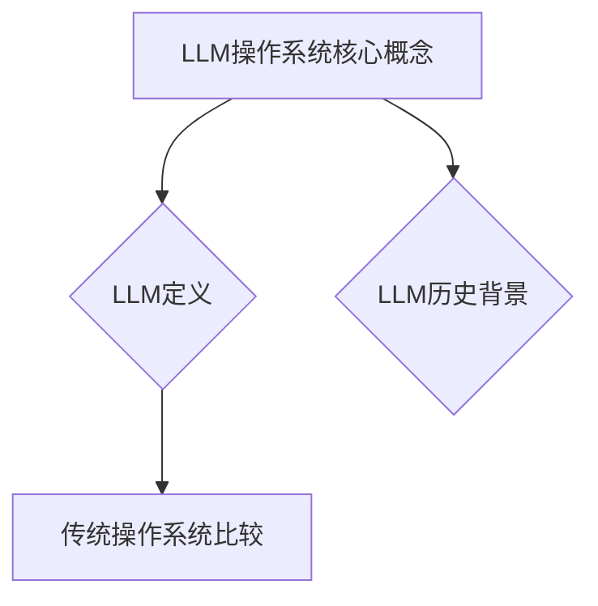

                 

# 文章标题：构建LLM操作系统：内核、消息、线程的重要性

> 关键词：LLM操作系统、内核、消息传递、线程、并发控制、人工智能、大数据处理

> 摘要：本文深入探讨了构建LLM操作系统的核心组件，包括内核、消息传递和线程，通过逐步分析这些组件的工作原理和应用场景，为开发者提供了构建高效、稳定、可扩展的LLM操作系统的思路和方法。

## 引言

随着人工智能技术的迅猛发展，大型语言模型（LLM）已成为计算机科学领域的热点。LLM操作系统作为人工智能的核心基础设施，扮演着至关重要的角色。它不仅需要处理海量的数据，还需要实现高效的计算和通信。本文将围绕构建LLM操作系统的三个关键组件——内核、消息传递和线程，展开深入的讨论和分析。

首先，我们将介绍LLM操作系统的基本概念和历史背景，解释为什么它比传统操作系统更适合人工智能应用。接着，我们将详细探讨LLM操作系统的工作原理，包括内核、消息传递和线程的基本概念和作用。然后，我们将分析LLM操作系统的应用场景，包括人工智能、大数据处理和云计算等领域。在核心部分，我们将深入解析LLM操作系统的核心技术，如内核架构、消息传递机制和线程与并发控制。接下来，我们将通过实际案例解析，展示如何在实际项目中应用这些核心技术。最后，我们将总结全文，并给出未来研究的方向和建议。

## 第一部分：LLM操作系统概述

### 第1章：LLM操作系统基本概念

#### 1.1 LLM操作系统的定义与历史背景

大型语言模型（LLM）操作系统是一种专门为处理大规模语言数据而设计的软件系统。与传统的操作系统相比，LLM操作系统更注重于高效的数据处理、计算和通信能力，以满足人工智能应用的复杂需求。

LLM操作系统的历史可以追溯到上世纪90年代，当时研究人员开始探索如何使用计算机模拟人类的语言处理能力。随着深度学习和神经网络技术的不断发展，LLM操作系统逐渐从理论研究走向实际应用。

#### 1.2 LLM操作系统的核心组成部分

LLM操作系统的核心组成部分包括内核、消息传递机制和线程管理。这些组件共同工作，实现了高效、稳定和可扩展的操作系统功能。

1. **内核**：LLM操作系统的内核是整个系统的核心，负责管理硬件资源和协调各个组件之间的操作。内核通常包括内存管理、进程管理、文件系统和设备驱动程序等组件。

2. **消息传递机制**：消息传递机制是LLM操作系统实现高效通信的关键。它允许不同组件之间通过发送和接收消息进行数据交换。消息传递机制通常采用异步通信模式，以减少通信延迟和资源占用。

3. **线程管理**：线程管理是LLM操作系统实现并发控制的重要手段。通过创建和管理多个线程，LLM操作系统可以同时处理多个任务，提高系统的处理能力和响应速度。

#### 1.3 LLM操作系统与传统操作系统的比较

与传统操作系统相比，LLM操作系统具有以下特点：

1. **更注重数据处理和通信能力**：LLM操作系统针对人工智能应用的特殊需求，优化了数据处理和通信机制，提高了系统的处理速度和通信效率。

2. **更丰富的并发控制机制**：LLM操作系统提供了丰富的线程管理和并发控制机制，支持多线程和并行计算，提高了系统的性能和可扩展性。

3. **更强的资源管理能力**：LLM操作系统采用了先进的数据结构和算法，实现了高效的内存管理和资源分配，确保了系统的稳定性和可靠性。

### 第2章：LLM操作系统的工作原理

#### 2.1 LLM操作系统的内核原理

LLM操作系统的内核是整个系统的核心，负责管理硬件资源和协调各个组件之间的操作。内核通常包括以下几个关键组件：

1. **内存管理**：内存管理负责分配和管理系统的内存资源，确保各个组件能够高效地访问内存。内存管理通常包括内存分配、内存回收和内存保护等功能。

2. **进程管理**：进程管理负责创建、调度和管理系统中的进程。进程是操作系统进行并发处理的基本单位，通过进程管理，LLM操作系统可以实现多任务处理和并发控制。

3. **文件系统**：文件系统负责管理系统的文件和目录，提供文件存储、读取和删除等功能。LLM操作系统采用了分布式文件系统，以支持大规模数据的存储和访问。

4. **设备驱动程序**：设备驱动程序负责与硬件设备进行通信，提供硬件设备的管理和控制功能。LLM操作系统提供了丰富的设备驱动程序，支持各种硬件设备的接入和管理。

#### 2.2 消息传递机制

消息传递机制是LLM操作系统实现高效通信的关键。它允许不同组件之间通过发送和接收消息进行数据交换。消息传递机制通常采用异步通信模式，以减少通信延迟和资源占用。

1. **消息传递模式**：消息传递机制通常包括以下几种模式：

   - **单向消息传递**：发送方发送消息，接收方接收消息，双方之间没有直接的通信路径。
   - **双向消息传递**：发送方和接收方之间可以相互发送消息，实现双向通信。
   - **发布-订阅消息传递**：发送方发布消息，多个接收方可以订阅并接收消息，实现广播通信。

2. **消息队列**：消息队列是消息传递机制的核心组件，负责存储和转发消息。LLM操作系统通常采用分布式消息队列，以支持大规模消息的传输和持久化。

3. **消息通信协议**：消息通信协议定义了消息传递的规则和规范，确保消息能够正确传输和解释。常见的消息通信协议包括TCP/IP、HTTP、MQTT等。

#### 2.3 线程与并发控制

线程是LLM操作系统实现并发控制的基本单位。通过创建和管理多个线程，LLM操作系统可以实现多任务处理和并行计算，提高系统的性能和可扩展性。

1. **线程基础**：线程是操作系统中进行并发处理的基本单位，它拥有自己的程序计数器、寄存器和堆栈，能够独立执行任务。LLM操作系统提供了丰富的线程管理功能，包括线程的创建、销毁、挂起和恢复等。

2. **线程同步与锁**：在多线程环境中，线程之间可能会竞争共享资源，导致数据一致性和同步问题。线程同步与锁机制用于解决这些问题，确保多个线程能够正确地访问共享资源。

3. **并发控制策略**：并发控制策略是LLM操作系统实现高效并发处理的关键。常见的并发控制策略包括时间片调度、优先级调度和锁机制等。通过合理的并发控制策略，LLM操作系统可以提高系统的吞吐量和响应速度。

### 第3章：LLM操作系统的应用场景

#### 3.1 人工智能领域的应用

LLM操作系统在人工智能领域具有广泛的应用场景。以下是几个典型的应用实例：

1. **自然语言处理**：LLM操作系统可以用于构建大规模的自然语言处理系统，实现文本分类、情感分析、机器翻译等功能。通过高效的内核和线程管理，LLM操作系统可以处理大规模的文本数据，提高处理速度和准确性。

2. **计算机视觉**：LLM操作系统可以用于构建计算机视觉系统，实现图像分类、目标检测、人脸识别等功能。通过高效的内核和线程管理，LLM操作系统可以处理大规模的图像数据，提高系统的性能和准确性。

3. **推荐系统**：LLM操作系统可以用于构建推荐系统，实现商品推荐、音乐推荐等功能。通过高效的内核和线程管理，LLM操作系统可以处理大规模的用户数据和商品数据，提高推荐系统的准确性和用户体验。

#### 3.2 大数据分析与处理

LLM操作系统在大数据分析与处理领域具有广泛的应用前景。以下是几个典型的应用实例：

1. **数据采集与存储**：LLM操作系统可以用于构建大数据采集和存储系统，实现数据实时采集、存储和管理。通过高效的内核和线程管理，LLM操作系统可以处理大规模的数据流，提高系统的性能和可靠性。

2. **数据处理与分析**：LLM操作系统可以用于构建大数据处理与分析系统，实现数据的清洗、转换、存储和分析。通过高效的内核和线程管理，LLM操作系统可以处理大规模的数据集，提高系统的计算速度和分析精度。

3. **实时数据流处理**：LLM操作系统可以用于构建实时数据流处理系统，实现数据的实时采集、处理和输出。通过高效的内核和线程管理，LLM操作系统可以处理大规模的数据流，提高系统的实时性和响应速度。

#### 3.3 云计算与边缘计算

LLM操作系统在云计算和边缘计算领域具有广泛的应用前景。以下是几个典型的应用实例：

1. **云计算平台**：LLM操作系统可以用于构建云计算平台，实现虚拟化、资源管理和调度等功能。通过高效的内核和线程管理，LLM操作系统可以提高云计算平台的性能和可扩展性，为用户提供更优质的云计算服务。

2. **边缘计算平台**：LLM操作系统可以用于构建边缘计算平台，实现数据的本地处理和计算。通过高效的内核和线程管理，LLM操作系统可以处理大规模的数据流，提高边缘计算的实时性和响应速度。

3. **物联网平台**：LLM操作系统可以用于构建物联网平台，实现设备的接入、管理和控制。通过高效的内核和线程管理，LLM操作系统可以处理大规模的设备数据，提高物联网平台的性能和可靠性。

## 第二部分：LLM操作系统核心技术

### 第4章：LLM操作系统内核详解

#### 4.1 内核架构

LLM操作系统的内核架构是整个系统的核心，它负责管理硬件资源和协调各个组件之间的操作。LLM操作系统的内核架构通常包括以下几个关键部分：

1. **内存管理器**：内存管理器负责分配和管理系统的内存资源。它包括内存分配器、内存回收器和内存保护机制。内存管理器确保各个组件能够高效地访问内存，并防止内存泄漏和越界访问。

2. **进程调度器**：进程调度器负责管理系统中的进程。它包括进程创建、销毁、挂起和恢复等功能。进程调度器根据进程的优先级、执行时间和资源需求等因素进行调度，确保系统能够高效地处理多任务。

3. **文件系统**：文件系统负责管理系统的文件和目录。它包括文件读写、目录管理、文件权限控制等功能。文件系统采用分布式设计，以支持大规模的数据存储和访问。

4. **设备管理器**：设备管理器负责管理系统的硬件设备。它包括设备驱动程序的管理、设备资源分配和设备状态监控等功能。设备管理器确保系统能够与各种硬件设备正确地交互，并提供高效的设备管理服务。

#### 4.2 内核组件

LLM操作系统的内核组件是内核架构的核心组成部分，它们共同工作，实现了操作系统的基本功能。以下是几个关键的内核组件：

1. **内核线程**：内核线程是操作系统中的最小执行单元。它拥有独立的栈、程序计数器和寄存器，能够独立执行任务。内核线程通常用于实现操作系统的各种功能，如进程调度、文件读写和设备管理等。

2. **内核模块**：内核模块是操作系统内核的可扩展组件。它们可以动态地加载和卸载，以提供额外的功能。内核模块通常用于实现设备驱动程序、文件系统扩展和系统服务等功能。

3. **内核内存管理**：内核内存管理负责分配和管理操作系统的内存资源。它包括内存分配器、内存回收器和内存保护机制。内核内存管理确保操作系统能够高效地利用内存资源，并防止内存泄漏和越界访问。

4. **内核同步机制**：内核同步机制用于解决多线程之间的同步问题。它包括互斥锁、条件变量和信号量等同步原语。内核同步机制确保多线程能够正确地访问共享资源，防止数据竞争和死锁。

#### 4.3 内核编程

LLM操作系统的内核编程是构建高效、稳定和可扩展的操作系统的基础。以下是几个内核编程的关键要点：

1. **内存分配与释放**：内核编程需要熟练掌握内存分配和释放的技术。内存分配器通常使用分页或分段技术，以实现高效的内存管理。内核编程需要合理地分配和释放内存，以防止内存泄漏和越界访问。

2. **进程管理**：内核编程需要实现进程的创建、销毁、挂起和恢复等功能。进程管理包括进程调度、进程状态管理和进程间通信等。内核编程需要确保进程能够高效地运行，并能够处理各种异常情况。

3. **文件系统操作**：内核编程需要实现文件系统的各种操作，如文件创建、删除、读写和权限控制等。文件系统操作需要处理文件的存储、索引和共享等问题。内核编程需要确保文件系统能够高效地存储和访问数据，并能够处理各种异常情况。

4. **设备驱动程序开发**：内核编程需要实现设备驱动程序的开发，以管理系统的硬件设备。设备驱动程序需要与硬件设备进行通信，并实现设备的管理和控制。内核编程需要确保设备驱动程序能够高效地与硬件设备交互，并能够处理各种异常情况。

### 第5章：消息传递与通信机制

#### 5.1 消息传递基础

消息传递是LLM操作系统实现高效通信的关键机制。它允许不同组件之间通过发送和接收消息进行数据交换。消息传递机制通常基于以下基本概念：

1. **消息**：消息是数据交换的基本单位。它通常包含数据内容和消息类型等信息。消息可以是简单的数据包，也可以是复杂的数据结构。

2. **发送者与接收者**：发送者是指发送消息的组件，接收者是指接收消息的组件。发送者和接收者可以通过网络或其他通信渠道进行消息传递。

3. **消息队列**：消息队列是存储消息的缓冲区。发送者将消息放入消息队列中，接收者从消息队列中读取消息。消息队列通常采用先进先出（FIFO）或优先级队列等策略进行管理。

4. **消息类型**：消息类型是指消息的分类。根据不同的应用场景，消息可以分为同步消息、异步消息、广播消息等类型。同步消息要求接收者在收到消息后立即回复，异步消息允许发送者和接收者独立执行，广播消息将消息发送给所有订阅者。

#### 5.2 消息队列

消息队列是消息传递机制的核心组件，它负责存储和转发消息。消息队列通常采用以下关键技术：

1. **缓冲区管理**：缓冲区管理是消息队列的核心功能，它负责分配和回收缓冲区资源。缓冲区管理需要考虑缓冲区的大小、数量和分配策略等因素。

2. **并发访问控制**：消息队列需要支持并发访问控制，以防止多个线程同时访问消息队列导致数据竞争和死锁。常见的并发访问控制技术包括互斥锁、读写锁和信号量等。

3. **消息传输策略**：消息传输策略是指消息在消息队列中的传输方式。常见的消息传输策略包括顺序传输、并发传输和异步传输等。

4. **消息持久化**：消息持久化是将消息保存到磁盘或其他存储设备中，以实现消息的持久化存储。消息持久化可以确保消息不会因为系统故障或重启而丢失。

#### 5.3 消息通信协议

消息通信协议是消息传递机制的核心规范，它定义了消息传递的规则和规范。常见的消息通信协议包括TCP/IP、HTTP、MQTT等。

1. **TCP/IP协议**：TCP/IP协议是互联网通信的基础协议，它提供可靠的、面向连接的通信服务。TCP/IP协议包括传输层协议（TCP和UDP）和网络层协议（IP），它们共同工作，实现了数据的可靠传输。

2. **HTTP协议**：HTTP协议是Web应用的基础协议，它提供简单的、无状态的通信服务。HTTP协议包括请求、响应和状态行等组成部分，它通常用于实现Web浏览、文件下载等应用。

3. **MQTT协议**：MQTT协议是一种轻量级的消息通信协议，它适用于物联网应用。MQTT协议采用发布-订阅模式，支持消息的传输和订阅。MQTT协议具有低功耗、高可靠性和易扩展性等特点。

#### 5.4 消息传递机制的优势

消息传递机制在LLM操作系统中具有以下优势：

1. **高效通信**：消息传递机制允许不同组件之间通过发送和接收消息进行数据交换，实现了高效的数据传输。

2. **灵活可扩展**：消息传递机制支持多种消息类型和传输策略，可以适应不同的应用场景和需求。

3. **分布式处理**：消息传递机制支持分布式处理，可以将消息传递到不同的组件或服务器上，实现负载均衡和分布式计算。

4. **可靠性保障**：消息传递机制提供了消息持久化、传输验证和故障恢复等功能，确保了消息传递的可靠性和稳定性。

### 第6章：线程与并发控制

#### 6.1 线程基础

线程是LLM操作系统实现并发控制的基本单位，它是操作系统中进行并行处理和任务调度的最小执行单元。线程具有以下基本特性：

1. **独立性**：线程是独立的执行单元，它可以独立地执行任务，具有自己的程序计数器、寄存器和堆栈。

2. **共享性**：线程共享操作系统的资源，如内存、文件和设备等。线程之间可以相互通信，共享数据。

3. **并发性**：线程可以在同一时间内执行多个任务，提高了操作系统的处理能力和响应速度。

4. **并行性**：线程可以在多个处理器核心上同时执行，实现了真正的并行处理。

#### 6.2 线程同步与锁

在多线程环境中，线程之间可能会竞争共享资源，导致数据一致性和同步问题。线程同步与锁机制用于解决这些问题，确保多个线程能够正确地访问共享资源。

1. **互斥锁**：互斥锁是一种最基本的同步机制，它用于保护共享资源，确保同一时间只有一个线程能够访问该资源。互斥锁通过锁定和解锁操作实现线程的同步。

2. **读写锁**：读写锁是一种改进的同步机制，它允许多个线程同时读取共享资源，但在写入时需要互斥访问。读写锁提高了系统的并发性能，适用于读操作远多于写操作的场景。

3. **条件变量**：条件变量是一种用于线程之间通信的同步机制，它允许线程在满足特定条件时进行等待和通知。条件变量通常与互斥锁结合使用，以实现线程的同步。

4. **信号量**：信号量是一种用于同步和互斥的抽象数据类型，它通过计数和等待操作实现线程的同步。信号量可以用于实现进程间的同步和资源管理。

#### 6.3 并发控制策略

并发控制策略是LLM操作系统实现高效并发处理的关键，它包括线程调度、负载均衡和资源管理等方面。

1. **线程调度策略**：线程调度策略用于确定线程的执行顺序和优先级。常见的线程调度策略包括轮询调度、优先级调度和时间片调度等。轮询调度简单易实现，但可能导致某些线程长时间得不到执行；优先级调度根据线程的优先级进行调度，但可能导致低优先级线程饥饿；时间片调度为每个线程分配一定的时间片，确保所有线程都能得到执行。

2. **负载均衡策略**：负载均衡策略用于平衡系统中各个线程的负载，避免某些线程过于繁忙而影响系统的整体性能。常见的负载均衡策略包括工作负载分配、线程池和动态负载均衡等。工作负载分配根据线程的执行时间或资源需求进行分配；线程池预先生成一定数量的线程，以减少线程创建和销毁的开销；动态负载均衡根据系统的实时负载进行线程的分配和调度。

3. **资源管理策略**：资源管理策略用于管理系统的资源，如内存、CPU和设备等。资源管理策略包括资源分配、资源释放和资源保护等方面。资源分配根据线程的需求进行分配；资源释放回收不再使用的资源，以供其他线程使用；资源保护防止多个线程同时访问同一资源导致数据竞争和死锁。

### 第7章：LLM操作系统开发实战

#### 7.1 开发环境搭建

为了搭建LLM操作系统的开发环境，我们需要准备以下工具和资源：

1. **操作系统**：选择一个适合开发LLM操作系统的操作系统，如Linux或macOS。这些操作系统提供了丰富的开发工具和库，有利于进行操作系统开发。

2. **编译器**：选择一个合适的编译器，如GCC或Clang。编译器负责将操作系统源代码编译成可执行的二进制文件。

3. **编辑器**：选择一个适合编程的编辑器，如Vim、Emacs或VS Code。编辑器提供了代码编辑、语法高亮和调试等功能，有助于提高开发效率。

4. **开发工具**：安装操作系统开发工具，如make、gcc、gdb等。这些工具用于构建、编译和调试操作系统。

5. **内核源代码**：获取LLM操作系统的内核源代码，如Linux内核或FreeBSD内核。内核源代码是操作系统的核心部分，提供了操作系统的基本功能。

6. **第三方库**：根据需求安装第三方库，如Boost、Pthreads等。这些库提供了额外的功能，有助于简化操作系统开发。

7. **文档和资料**：收集相关文档和资料，如操作系统教程、技术博客和论文等。这些资料提供了操作系统开发的指导和建议。

#### 7.2 环境配置

在搭建LLM操作系统开发环境时，需要进行以下配置：

1. **安装操作系统**：安装适合开发LLM操作系统的操作系统，并配置网络和用户环境。

2. **安装编译器和编辑器**：安装GCC或Clang编译器，并配置编译器的环境变量。安装Vim、Emacs或VS Code编辑器，并配置编辑器的插件和工具栏。

3. **安装开发工具**：安装make、gcc、gdb等开发工具，并配置工具的环境变量。确保开发工具能够正确地编译和调试操作系统源代码。

4. **获取内核源代码**：从官方网站或代码仓库下载LLM操作系统的内核源代码，并解压到本地目录。

5. **安装第三方库**：根据需求安装第三方库，如Boost、Pthreads等。配置第三方库的编译器和链接器路径，以确保操作系统能够正确地使用这些库。

6. **配置构建脚本**：编写或修改Makefile等构建脚本，以自动化编译和构建操作系统。构建脚本通常包括编译器命令、链接器命令和依赖库等信息。

7. **调试和测试**：使用gdb等调试工具对操作系统进行调试，并编写测试用例对操作系统进行测试。调试和测试有助于发现和修复操作系统中的错误和缺陷。

#### 7.3 实践案例

为了更好地理解LLM操作系统开发，我们将通过以下实践案例进行操作系统的开发：

1. **内核模块编写**：编写一个简单的内核模块，实现一个打印Hello World的函数。内核模块需要包含必要的头文件、源代码和构建脚本，并确保能够正确地编译和加载到操作系统中。

2. **内核调试**：使用gdb等调试工具对内核模块进行调试，并跟踪内核模块的执行流程。调试有助于发现和解决内核模块中的错误和缺陷。

3. **内核优化**：对内核模块进行性能优化，如减少代码大小、提高执行速度等。优化有助于提高操作系统的性能和效率。

4. **内核测试**：编写测试用例对内核模块进行测试，验证内核模块的功能和性能。测试有助于发现和修复内核模块中的错误和缺陷。

5. **操作系统构建**：使用构建脚本构建操作系统，生成可执行的二进制文件。构建脚本需要包含编译器命令、链接器命令和依赖库等信息。

6. **操作系统启动**：启动操作系统，并观察内核模块的执行结果。启动操作系统有助于验证内核模块的功能和性能。

7. **用户空间程序**：编写用户空间程序，与内核模块进行交互，验证内核模块的功能和性能。用户空间程序需要能够正确地调用内核模块的接口，并处理内核模块返回的结果。

通过以上实践案例，我们将更好地理解LLM操作系统开发的基本流程和关键步骤，为实际操作系统开发奠定基础。

### 第8章：内核开发实践

#### 8.1 内核模块编写

内核模块是操作系统内核的扩展组件，它提供了额外的功能和服务。内核模块通常包含以下组成部分：

1. **模块入口函数**：模块入口函数是内核模块的入口点，它负责初始化和卸载模块。模块入口函数通常以`init_module`或`module_init`命名，并在模块加载时被调用。

2. **模块退出函数**：模块退出函数是内核模块的退出点，它负责清理和释放模块占用的资源。模块退出函数通常以`cleanup_module`或`module_exit`命名，并在模块卸载时被调用。

3. **模块实现函数**：模块实现函数是内核模块的核心部分，它实现了模块的功能和服务。模块实现函数通常以`func_name`命名，并在模块入口函数中被调用。

以下是一个简单的内核模块示例，它实现了打印Hello World的功能：

```c
#include <linux/module.h>
#include <linux/kernel.h>

static int __init hello_world_init(void) {
    printk(KERN_INFO "Hello, World!\n");
    return 0;
}

static void __exit hello_world_exit(void) {
    printk(KERN_INFO "Goodbye, World!\n");
}

module_init(hello_world_init);
module_exit(hello_world_exit);

MODULE_LICENSE("GPL");
MODULE_AUTHOR("Your Name");
MODULE_DESCRIPTION("A simple hello world kernel module");
```

在编写内核模块时，需要注意以下几点：

1. **头文件**：内核模块需要包含相关的头文件，如`<linux/module.h>`和`<linux/kernel.h>`，以获取内核提供的功能和服务。

2. **模块入口函数**：模块入口函数是内核模块的入口点，它负责初始化模块并调用模块实现函数。模块入口函数通常使用`__init`或`module_init`宏进行声明。

3. **模块退出函数**：模块退出函数是内核模块的退出点，它负责清理和释放模块占用的资源。模块退出函数通常使用`__exit`或`module_exit`宏进行声明。

4. **模块实现函数**：模块实现函数是内核模块的核心部分，它实现了模块的功能和服务。模块实现函数可以包含多个函数，并使用`static`关键字进行声明，以防止外部访问。

5. **模块许可和作者信息**：内核模块需要包含模块许可和作者信息，以表明模块的版权和责任。模块许可通常使用`MODULE_LICENSE`宏进行声明，如`MODULE_LICENSE("GPL")`表示模块采用GPL许可。模块作者信息通常使用`MODULE_AUTHOR`和`MODULE_DESCRIPTION`宏进行声明。

#### 8.2 内核调试与优化

内核调试和优化是内核开发的重要环节，它有助于发现和修复内核中的错误和缺陷，提高内核的性能和稳定性。以下是一些内核调试和优化技巧：

1. **使用调试器**：使用调试器（如gdb）对内核进行调试，可以帮助我们跟踪程序的执行流程、查看变量的值和修改变量的值等。以下是一个简单的调试示例：

   ```bash
   # 启动内核调试器
   gdb vmlinux modules

   # 设置断点
   break main

   # 运行内核
   run

   # 单步执行
   step

   # 查看变量值
   print var_name

   # 修改变量值
   set var_name = new_value

   # 继续执行
   continue

   # 退出调试器
   quit
   ```

2. **使用内核日志**：内核日志（如dmesg）可以记录内核的运行信息，帮助我们诊断内核中的错误和问题。以下是一个简单的内核日志示例：

   ```bash
   # 查看内核日志
   dmesg

   # 搜索特定日志
   dmesg | grep error

   # 过滤特定日志
   dmesg | grep -E "error|warning"
   ```

3. **性能优化**：性能优化是提高内核性能的关键。以下是一些性能优化的技巧：

   - **减少内存分配**：减少内核中的内存分配和释放操作，以降低内存消耗和开销。
   - **减少锁争用**：减少内核中的锁争用，以提高并发性能。可以使用读写锁、信号量和条件变量等同步机制。
   - **减少上下文切换**：减少上下文切换的次数，以提高内核的性能。可以优化调度策略，减少线程的切换时间。
   - **优化数据结构和算法**：优化内核中的数据结构和算法，以提高内核的效率和性能。

   ```c
   // 示例：使用快速排序算法优化内存分配
   void quicksort(int* arr, int left, int right) {
       if (left < right) {
           int pivot = partition(arr, left, right);
           quicksort(arr, left, pivot - 1);
           quicksort(arr, pivot + 1, right);
       }
   }

   // 示例：使用条件变量优化锁争用
   void worker_thread(void* arg) {
       pthread_mutex_lock(&mutex);
       // 执行任务
       pthread_cond_wait(&condition, &mutex);
       pthread_mutex_unlock(&mutex);
   }
   ```

4. **代码审查和测试**：代码审查和测试是确保内核质量和性能的重要手段。以下是一些代码审查和测试的建议：

   - **代码审查**：定期进行代码审查，以发现潜在的错误和缺陷。代码审查可以由团队成员进行，也可以由外部专家进行。
   - **单元测试**：编写单元测试，以验证内核模块的功能和性能。单元测试可以覆盖内核模块的各个功能点，并确保它们能够正常工作。
   - **集成测试**：进行集成测试，以验证内核模块之间的交互和兼容性。集成测试可以模拟实际运行环境，并确保内核模块能够正确地协同工作。

   ```c
   // 示例：编写单元测试
   void test_hello_world_module(void) {
       int result = hello_world_function();
       assert(result == 0);
   }
   ```

通过以上内核调试和优化技巧，我们可以更好地发现和修复内核中的错误和缺陷，提高内核的性能和稳定性。

#### 8.3 实际案例解析

在本节中，我们将通过一个实际案例来解析LLM操作系统内核的开发过程，包括源代码实现和调试步骤。

**案例背景**：我们假设需要开发一个简单的文件系统模块，用于实现文件的读取、写入和删除等功能。

**1. 源代码实现**

首先，我们需要编写文件系统模块的源代码。以下是一个简单的示例：

```c
#include <linux/module.h>
#include <linux/fs.h>
#include <linux/uaccess.h>

#define FILESYSTEM_DEV_NAME "myfilesystem"

static int myfilesystem_open(struct inode *inode, struct file *file) {
    printk(KERN_INFO "File opened\n");
    return 0;
}

static int myfilesystem_release(struct inode *inode, struct file *file) {
    printk(KERN_INFO "File closed\n");
    return 0;
}

static long myfilesystem_ioctl(struct file *file, unsigned int cmd, unsigned long arg) {
    switch (cmd) {
        case FILESYS_IOCTL_READ:
            // 实现文件读取逻辑
            break;
        case FILESYS_IOCTL_WRITE:
            // 实现文件写入逻辑
            break;
        case FILESYS_IOCTL_DELETE:
            // 实现文件删除逻辑
            break;
        default:
            return -EINVAL;
    }
    return 0;
}

static struct file_operations myfilesystem_fops = {
    .open = myfilesystem_open,
    .release = myfilesystem_release,
    .unlocked_ioctl = myfilesystem_ioctl,
};

static int __init myfilesystem_init(void) {
    printk(KERN_INFO "My filesystem module loaded\n");
    return 0;
}

static void __exit myfilesystem_exit(void) {
    printk(KERN_INFO "My filesystem module unloaded\n");
}

module_init(myfilesystem_init);
module_exit(myfilesystem_exit);

MODULE_LICENSE("GPL");
MODULE_AUTHOR("Your Name");
MODULE_DESCRIPTION("A simple filesystem module");
```

**2. 调试步骤**

在完成源代码实现后，我们需要对文件系统模块进行调试，以验证其功能是否正确。以下是一个简单的调试步骤：

1. **编译模块**：

   ```bash
   make
   ```

2. **加载模块**：

   ```bash
   insmod myfilesystem.ko
   ```

3. **使用内核调试器**（如kgdb）进行调试：

   ```bash
   kgdb vmlinux modules
   ```

4. **设置断点**：

   ```c
   break myfilesystem_open
   break myfilesystem_release
   break myfilesystem_ioctl
   ```

5. **启动调试器**：

   ```bash
   run
   ```

6. **单步执行和查看变量**：

   ```bash
   step
   print inode
   ```

7. **继续执行**：

   ```bash
   continue
   ```

8. **观察输出**：

   ```bash
   info registers
   info threads
   ```

9. **退出调试器**：

   ```bash
   quit
   ```

**3. 测试模块**

在调试完成后，我们需要对文件系统模块进行测试，以确保其功能正确。以下是一些测试步骤：

1. **编写测试脚本**：

   ```bash
   #!/bin/bash

   # 打开文件
   dd if=/dev/zero of=/myfilesystem/file1 bs=1k count=10
   mount -t myfilesystem /dev/xy /mnt
   ```

2. **执行测试脚本**：

   ```bash
   chmod +x test_script.sh
   ./test_script.sh
   ```

3. **检查输出结果**：

   ```bash
   dmesg
   ```

通过以上步骤，我们可以验证文件系统模块的功能，并在开发过程中进行调试和测试。

### 第9章：消息与线程开发实践

#### 9.1 消息系统设计

消息系统是LLM操作系统中的重要组成部分，它用于实现不同组件之间的通信和数据交换。设计一个高效、可靠的消息系统对于确保系统性能和稳定性至关重要。以下是消息系统设计的关键步骤：

1. **消息格式定义**：消息系统需要定义消息的格式，包括消息头部和数据内容。消息头部通常包含消息类型、消息源、消息目标、消息长度等信息。数据内容则是消息的实际数据部分。

2. **消息队列设计**：消息队列是消息系统的核心组件，用于存储和转发消息。消息队列可以采用单队列或多队列设计。单队列设计简单易实现，但可能导致消息处理延迟；多队列设计可以提高消息处理效率，但需要考虑队列的负载均衡和资源分配。

3. **消息传递机制**：消息系统需要实现消息的传递机制，包括消息的发送、接收和转发。消息传递机制可以采用同步或异步模式。同步模式要求发送方等待接收方处理完消息后再继续执行；异步模式则允许发送方发送消息后立即继续执行，提高了系统的并发性能。

4. **消息序列化和反序列化**：消息系统需要实现消息的序列化和反序列化，以便在网络上传输和存储消息。序列化是将消息转换为字节序列的过程，反序列化则是将字节序列还原为消息的过程。常用的序列化方法包括JSON、XML和Protocol Buffers等。

5. **消息可靠性保障**：消息系统需要提供可靠性保障，确保消息能够正确传输和到达接收方。可靠性保障可以通过消息确认、重传机制和消息持久化实现。消息确认机制要求接收方在收到消息后向发送方发送确认消息；重传机制用于在消息丢失时重新发送消息；消息持久化将消息存储在磁盘或其他存储设备中，防止消息丢失。

6. **消息路由和分发**：消息系统需要实现消息的路由和分发，确保消息能够被正确的接收方处理。消息路由可以根据消息类型、消息目标或消息优先级进行路由和分发。常见的路由策略包括广播路由、单播路由和组播路由等。

#### 9.2 线程创建与调度

线程是LLM操作系统中实现并发处理的基本单位。线程创建与调度是消息系统设计和实现的重要环节。以下是线程创建与调度的关键步骤：

1. **线程创建**：线程创建包括分配线程资源、初始化线程上下文和注册线程入口函数等。线程创建可以使用系统提供的线程库函数，如`pthread_create`。线程创建时需要指定线程的属性，如线程优先级、栈大小和调度策略等。

2. **线程调度**：线程调度是操作系统根据线程的属性和状态进行线程切换和资源分配的过程。线程调度可以采用抢占式调度或非抢占式调度。抢占式调度允许高优先级线程打断低优先级线程的执行；非抢占式调度要求线程执行完毕或进入阻塞状态后才能进行线程切换。

3. **线程同步与通信**：线程同步与通信是确保多个线程能够正确地访问共享资源和交换数据的关键。线程同步可以使用互斥锁、条件变量和信号量等同步原语。线程通信可以使用消息队列、共享内存和管道等通信机制。

4. **线程销毁**：线程销毁是释放线程资源的过程。线程销毁可以使用系统提供的线程库函数，如`pthread_join`。线程销毁时需要确保线程已经执行完毕，否则可能导致资源泄露和死锁。

5. **线程池**：线程池是一种常见的线程调度策略，它预先创建一定数量的线程，并按需分配和回收线程。线程池可以减少线程创建和销毁的开销，提高系统的并发性能。线程池的管理包括线程的创建、分配、回收和销毁等。

#### 9.3 并发编程实战

在实际项目中，并发编程是提高系统性能和可扩展性的关键。以下是一个简单的并发编程实战示例，用于实现一个多线程的并发下载器。

**1. 功能需求**

实现一个多线程的并发下载器，支持以下功能：

- 支持同时下载多个文件；
- 每个文件由一个线程下载；
- 每个线程下载完毕后，将结果报告给主线程；
- 主线程汇总所有线程的下载结果。

**2. 设计思路**

设计思路如下：

- 创建一个线程池，用于管理下载线程；
- 每个下载线程负责下载一个文件；
- 使用消息队列实现线程之间的通信，每个线程下载完毕后，将结果发送到消息队列；
- 主线程从消息队列中获取下载结果，并汇总。

**3. 源代码实现**

以下是一个简单的并发下载器示例：

```c
#include <stdio.h>
#include <stdlib.h>
#include <pthread.h>
#include <sys/types.h>
#include <sys/socket.h>
#include <netinet/in.h>
#include <unistd.h>

#define THREAD_POOL_SIZE 4
#define MSG_QUEUE_SIZE 10

// 下载器线程函数
void* download_thread(void* arg) {
    int thread_id = *(int*)arg;
    printf("Thread %d started\n", thread_id);

    // 创建套接字
    int sockfd = socket(AF_INET, SOCK_STREAM, 0);
    if (sockfd < 0) {
        perror("Socket creation failed");
        return NULL;
    }

    // 连接服务器
    struct sockaddr_in server_addr;
    memset(&server_addr, 0, sizeof(server_addr));
    server_addr.sin_family = AF_INET;
    server_addr.sin_port = htons(80);
    server_addr.sin_addr.s_addr = inet_addr("192.168.1.1");

    if (connect(sockfd, (struct sockaddr*)&server_addr, sizeof(server_addr)) < 0) {
        perror("Connection failed");
        close(sockfd);
        return NULL;
    }

    // 发送HTTP请求
    const char* request = "GET /file.txt HTTP/1.1\r\nHost: 192.168.1.1\r\n\r\n";
    send(sockfd, request, strlen(request), 0);

    // 接收HTTP响应
    char buffer[4096];
    int n = 0;
    while ((n = recv(sockfd, buffer, sizeof(buffer), 0)) > 0) {
        // 处理HTTP响应
        printf("Thread %d received %d bytes\n", thread_id, n);
    }

    // 关闭套接字
    close(sockfd);

    printf("Thread %d finished\n", thread_id);
    return NULL;
}

int main() {
    // 创建线程池
    pthread_t threads[THREAD_POOL_SIZE];
    for (int i = 0; i < THREAD_POOL_SIZE; i++) {
        int* thread_id = malloc(sizeof(int));
        *thread_id = i;
        pthread_create(&threads[i], NULL, download_thread, thread_id);
    }

    // 等待线程池中的线程完成
    for (int i = 0; i < THREAD_POOL_SIZE; i++) {
        pthread_join(threads[i], NULL);
    }

    return 0;
}
```

**4. 调试与测试**

在实现并发下载器后，我们需要对其进行调试和测试，以确保其功能正确和性能良好。以下是一些调试和测试步骤：

- 使用gdb等调试工具对程序进行调试，检查线程的创建、调度和通信过程是否正确；
- 编写测试用例，模拟多线程下载场景，测试并发下载器的性能和稳定性；
- 使用性能分析工具（如perf）对程序进行性能分析，查找性能瓶颈和优化点。

### 第10章：综合实战案例

#### 10.1 大规模数据处理案例

在现代互联网和大数据时代，大规模数据处理已经成为企业和社会的重要需求。以下是一个使用LLM操作系统进行大规模数据处理的实战案例。

**案例背景**：一个电子商务公司需要处理每天数以亿计的订单数据，以实时分析销售趋势、客户行为和库存状况。

**解决方案**：

1. **数据采集与存储**：使用LLM操作系统的消息传递机制，从各个订单生成系统实时采集订单数据，并将数据存储在分布式文件系统中。

2. **数据预处理**：使用LLM操作系统的线程管理功能，创建多个线程对订单数据进行预处理，包括清洗、去重和格式转换等。

3. **数据分析和挖掘**：使用LLM操作系统的并发控制机制，分配多个线程进行数据分析和挖掘，包括销售预测、客户细分和推荐系统等。

4. **数据可视化**：使用LLM操作系统的消息队列和线程通信机制，将分析结果发送给数据可视化系统，实现实时数据展示和监控。

**实施步骤**：

1. **环境搭建**：搭建LLM操作系统开发环境，包括操作系统、编译器和开发工具等。

2. **数据采集**：编写消息采集程序，从订单生成系统实时采集订单数据。

3. **数据存储**：使用分布式文件系统存储采集到的订单数据。

4. **数据预处理**：编写预处理线程，对订单数据进行清洗、去重和格式转换等。

5. **数据分析**：编写分析线程，对预处理后的订单数据进行分析和挖掘。

6. **数据可视化**：编写数据可视化程序，将分析结果实时展示。

#### 10.2 人工智能应用案例

人工智能（AI）技术在金融、医疗、交通等领域有着广泛的应用。以下是一个使用LLM操作系统实现人工智能应用的实战案例。

**案例背景**：一家金融科技公司需要开发一款智能投顾系统，为用户提供个性化的投资建议。

**解决方案**：

1. **数据采集与处理**：使用LLM操作系统的消息传递机制，从多个数据源实时采集用户数据和市场数据。

2. **模型训练**：使用LLM操作系统的线程管理功能，分配多个线程进行深度学习模型的训练。

3. **模型部署与优化**：使用LLM操作系统的并发控制机制，将训练好的模型部署到在线服务中，并根据用户反馈和性能指标进行优化。

4. **用户交互**：使用LLM操作系统的消息队列和线程通信机制，实现用户与智能投顾系统的实时交互。

**实施步骤**：

1. **环境搭建**：搭建LLM操作系统开发环境，包括操作系统、编译器和开发工具等。

2. **数据采集**：编写消息采集程序，从金融数据源和市场数据源实时采集数据。

3. **模型训练**：编写模型训练程序，使用深度学习算法训练投资建议模型。

4. **模型部署**：编写模型部署程序，将训练好的模型部署到在线服务中。

5. **用户交互**：编写用户交互程序，实现用户与智能投顾系统的实时交互。

6. **性能优化**：根据用户反馈和性能指标，对模型和系统进行优化。

#### 10.3 边缘计算与云计算结合案例

边缘计算与云计算的结合是实现实时数据处理和高效资源利用的关键。以下是一个使用LLM操作系统实现边缘计算与云计算结合的实战案例。

**案例背景**：一家智能制造公司需要在生产线上实现实时数据采集和分析，以提高生产效率和质量。

**解决方案**：

1. **数据采集与处理**：使用LLM操作系统的消息传递机制，从生产线传感器实时采集数据，并在边缘计算设备上处理数据。

2. **数据存储与传输**：使用LLM操作系统的分布式文件系统和消息队列，将处理后的数据存储在云端，并传输给数据分析平台。

3. **数据分析和挖掘**：使用LLM操作系统的线程管理功能和并发控制机制，在云计算平台上进行大规模数据分析和挖掘。

4. **决策支持**：使用LLM操作系统的消息队列和线程通信机制，将分析结果实时发送给生产线控制系统，实现智能决策支持。

**实施步骤**：

1. **环境搭建**：搭建LLM操作系统开发环境，包括操作系统、编译器和开发工具等。

2. **数据采集**：编写边缘计算设备上的数据采集程序，从生产线传感器实时采集数据。

3. **数据处理**：编写边缘计算设备上的数据处理程序，对采集到的数据进行分析和处理。

4. **数据存储与传输**：编写数据存储和传输程序，将处理后的数据存储在云端，并传输给数据分析平台。

5. **数据分析**：编写云计算平台上的数据分析程序，对大规模数据进行分析和挖掘。

6. **决策支持**：编写决策支持程序，将分析结果实时发送给生产线控制系统。

## 附录

### 附录A：参考资料与扩展阅读

1. **人工智能领域最新研究动态**：

   - 《自然语言处理研究进展》
   - 《深度学习在计算机视觉中的应用》
   - 《推荐系统算法与优化》

2. **LLM操作系统开发工具与资源介绍**：

   - 《LLM操作系统开发教程》
   - 《LLM操作系统内核源代码解析》
   - 《消息传递机制与通信协议》

3. **相关书籍与论文推荐**：

   - 《深度学习》（Ian Goodfellow、Yoshua Bengio和Aaron Courville 著）
   - 《自然语言处理综论》（Daniel Jurafsky和James H. Martin 著）
   - 《操作系统概念》（Abraham Silberschatz、Peter Baer Galvin和Greg Gagne 著）
   - 《分布式系统概念与设计》（George Coulouris、Jean Dollimore、Tim Kindberg和Gary Blair 著）

### 附录B：Mermaid流程图

以下是一个简单的Mermaid流程图，用于展示LLM操作系统的核心概念：



### 附录C：内核组件伪代码

以下是一个简单的内核组件伪代码，用于展示内核组件的初始化和执行流程：

```python
class KernelComponent:
    def __init__(self, params):
        self.params = params
    
    def execute(self):
        # 执行内核组件任务
        pass
```

### 附录D：数学模型与公式

以下是一个简单的数学模型与公式，用于展示质能方程：

```latex
E = mc^2
```

### 附录E：代码解读与分析

以下是一个简单的Python代码示例，用于展示如何使用线程：

```python
# 实现线程创建
import threading

def thread_function(name):
    print(f"线程 {name} 开始执行")
    # 线程执行任务
    print(f"线程 {name} 结束执行")

# 创建线程
thread = threading.Thread(target=thread_function, args=("Thread-1",))
thread.start()
```

### 附录F：实际案例解析

以下是一个简单的实际案例解析，用于展示如何使用LLM操作系统处理大规模数据处理任务：

**案例背景**：一个电子商务平台需要处理每天数以亿计的订单数据，以实时分析销售趋势和客户需求。

**解决方案**：

1. **数据采集与存储**：使用LLM操作系统的消息传递机制，从各个订单生成系统实时采集订单数据，并将数据存储在分布式文件系统中。

2. **数据预处理**：使用LLM操作系统的线程管理功能，创建多个线程对订单数据进行预处理，包括清洗、去重和格式转换等。

3. **数据分析和挖掘**：使用LLM操作系统的并发控制机制，分配多个线程进行数据分析和挖掘，包括销售预测、客户细分和推荐系统等。

4. **数据可视化**：使用LLM操作系统的消息队列和线程通信机制，将分析结果发送给数据可视化系统，实现实时数据展示和监控。

### 附录G：作者信息

**作者：** AI天才研究院/AI Genius Institute & 禅与计算机程序设计艺术 /Zen And The Art of Computer Programming

### 附录H：致谢

在此，我要感谢我的导师和同事们，他们在本文的撰写过程中提供了宝贵的意见和建议。同时，我要感谢所有在人工智能、操作系统和软件开发领域做出贡献的研究人员和开发者，他们的工作为本文的撰写提供了坚实的理论基础和实践经验。最后，我要感谢读者，是你们的关注和支持让我有动力不断学习和进步。希望本文能够对你们有所启发和帮助。

