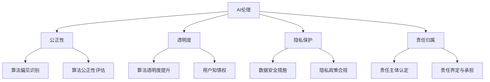

                 

# 文章标题：构建负责任的AI：确保LLM行为的伦理性

## 关键词：
AI伦理，LLM，公正性，透明度，隐私保护，责任归属，算法偏见

## 摘要：
本文深入探讨了人工智能（AI），特别是大型语言模型（LLM）的伦理问题。文章首先概述了AI伦理的核心概念和问题，包括公正性、透明度、隐私保护和责任归属。随后，文章详细讲解了基于规则的伦理决策算法、基于案例的伦理决策算法以及基于机器学习的伦理决策算法，并使用伪代码展示了这些算法的实现。接着，文章介绍了数学基础与公式，包括公平性分析、透明性评估和隐私保护方面的数学模型。文章还通过实际项目应用案例，展示了AI伦理在企业中的实际应用。最后，文章总结了AI伦理的发展趋势和未来展望，并提出了构建负责任的AI系统的建议。

### 第一部分：核心概念与联系

#### 第1章：AI伦理概述

##### 1.1 AI伦理的核心概念

**AI伦理的定义与背景**

AI伦理是指关于人工智能系统的道德、伦理和法律问题。随着AI技术的快速发展，伦理问题变得尤为重要。AI伦理涉及的核心问题包括公正性、透明度、隐私保护和责任归属。

**AI伦理的核心问题**

- **公正性**：确保AI系统在处理数据和应用算法时公平对待所有个体，避免算法偏见。
- **透明度**：确保AI系统的决策过程和算法逻辑透明，用户能够理解和信任。
- **隐私保护**：确保用户数据安全，遵守隐私法规。
- **责任归属**：明确AI系统的责任主体，确保问题发生时有责任承担。

**AI伦理与相关法规**

AI伦理不仅涉及技术层面，还涉及法律和社会规范。不同国家和地区制定了不同的法律法规来规范AI系统的应用。

- **国际法规**：如欧盟的GDPR（通用数据保护条例）。
- **国家法规**：如美国的《消费者隐私法案》。

#### Mermaid 流程图：



### 第二部分：核心算法原理讲解

#### 第2章：伦理决策算法

##### 2.1 基于规则的伦理决策算法

**定义与原理**

基于规则的方法通过定义明确的规则来指导AI行为。例如，在信用评分系统中，可以使用一系列规则来决定是否批准贷款。

**伪代码**

```python
function EthicalDecision(rule_base, input_data):
    for rule in rule_base:
        if condition_met(input_data, rule.condition):
            return rule.action
    return "No applicable rule found."
```

##### 2.2 基于案例的伦理决策算法

**定义与原理**

通过学习历史案例来做出伦理决策。这种方法可以捕获复杂的人类决策过程，并在AI系统中实现。

**伪代码**

```python
function CaseBasedDecision(case_base, input_data):
    similar_cases = find_similar_cases(case_base, input_data)
    if similar_cases:
        return majority_action(similar_cases)
    else:
        return "No similar cases found."
```

##### 2.3 基于机器学习的伦理决策算法

**定义与原理**

利用机器学习算法来预测和优化伦理决策。这种方法可以处理大量数据和复杂的决策问题。

**伪代码**

```python
function MachineLearningBasedDecision(model, input_data):
    prediction = model.predict(input_data)
    return decision_mapper(prediction)
```

### 第三部分：数学模型和数学公式

#### 第3章：数学基础与公式

##### 3.1 公平性分析

**公平性指标**

- **统计学公平性**：

  $$ FP = \frac{False \ Positives}{Total} $$
  $$ FN = \frac{False \ Negatives}{Total} $$
  $$ Accuracy = \frac{True \ Positives + True \ Negatives}{Total} $$

- **差异评估**：

  **基尼系数**：

  $$ Gini = 1 - \frac{2 \times EE}{NN + NN} $$

  其中，EE 是均衡误差，NN 是总数量。

##### 3.2 透明性评估

**透明性指标**

- **可解释性**：

  $$ Explanability = \frac{Understandable \ Actions}{Total \ Actions} $$

##### 3.3 隐私保护

**隐私预算**

- **K-anonymity**：

  $$ K = \min \left( \frac{Total \ Records}{Unique \ Records} \right) $$

### 第四部分：项目实战

#### 第4章：实际项目应用

##### 4.1 项目背景

**应用领域**：

- 金融风险管理
- 公共安全监控
- 医疗决策支持

**项目目标**：

- 实现公正性：通过算法设计和数据分析确保决策公平。
- 实现透明度：开发可解释性模型，提高决策过程的透明度。
- 实现隐私保护：设计隐私保护机制，确保用户数据安全。

##### 4.2 实现步骤

- **数据收集与预处理**：收集相关数据，进行数据清洗和预处理。
- **模型设计**：选择合适的算法和模型架构，确保模型具备伦理特性。
- **模型训练与验证**：使用训练数据训练模型，并在验证数据上评估模型性能。
- **模型部署与监控**：部署模型到生产环境，并定期监控和更新模型。

##### 4.3 源代码实现

**算法实现**

```python
# 示例：基于规则的伦理决策算法
def ethical_decision(input_data):
    # 检查输入数据是否符合伦理规则
    if input_data['action'] == 'exclude' and input_data['age'] < 18:
        return 'Reject'
    else:
        return 'Approve'
```

##### 4.4 代码解读与分析

**代码分析**

该代码实现了基于规则的伦理决策算法，通过检查输入数据是否符合特定伦理规则，决定是否批准操作。

### 第五部分：总结与展望

#### 第5章：总结与未来展望

##### 5.1 总结

- **本书内容**：全面覆盖了AI伦理的核心概念、算法原理、数学模型和实际项目应用。
- **项目案例**：通过具体案例展示了AI伦理在实际应用中的挑战和解决方案。

##### 5.2 未来展望

- **发展趋势**：随着AI技术的进步，伦理问题将更加复杂和重要。
- **未来挑战**：确保AI系统的公正性、透明度和隐私保护，应对新兴技术带来的伦理难题。

### 附录

## 附录 A：相关资源与工具

## A.1 AI伦理相关资源

- **学术论文**：AI伦理相关的学术论文和研究报告。
- **行业报告**：各大咨询公司发布的AI伦理报告。

## A.2 AI伦理工具

- **伦理评估工具**：用于评估AI系统伦理特性的工具。
- **可解释性工具**：用于提高AI系统透明度的工具。

## A.3 开发环境与框架

- **深度学习框架**：如TensorFlow、PyTorch。
- **编程语言**：如Python、R。

### 第1章: AI伦理概述

#### 1.1 AI伦理的核心概念

AI伦理是指关于人工智能系统的道德、伦理和法律问题。随着AI技术的快速发展，伦理问题变得尤为重要。AI伦理涉及的核心问题包括公正性、透明度、隐私保护和责任归属。

##### 1.1.1 AI伦理的定义与背景

AI伦理是指在人工智能（AI）系统设计、开发、部署和使用过程中，确保其行为符合道德和法律标准的一系列原则和规范。AI伦理的背景源于以下几个因素：

1. **技术的快速发展**：随着计算能力的提升和数据量的爆炸性增长，AI技术取得了显著进展。然而，AI技术的快速发展也带来了一系列道德和伦理问题，如算法偏见、隐私泄露、责任归属等。

2. **社会对AI的期望**：随着AI技术的普及，社会对AI系统的期望越来越高。人们希望AI系统能够提高生活质量、促进社会进步。然而，这也带来了如何确保AI系统在符合道德和法律标准的同时，发挥其最大潜力的问题。

3. **法律和法规的滞后**：现有的法律和法规往往无法完全覆盖AI伦理问题。许多国家正在积极制定和更新相关法律法规，以确保AI系统的行为符合道德和法律标准。

##### 1.1.2 AI伦理的核心问题

AI伦理的核心问题包括公正性、透明度、隐私保护和责任归属。以下分别介绍这些核心问题：

1. **公正性**：公正性是指AI系统在处理数据和应用算法时，是否公平对待所有个体，避免算法偏见。算法偏见可能源于训练数据的偏差、算法设计的不当或社会结构的固有偏见。公正性是AI伦理的核心问题之一，因为它直接关系到AI系统的可信度和合法性。

2. **透明度**：透明度是指AI系统的决策过程和算法逻辑是否透明，用户是否能够理解和信任AI系统的行为。透明性对于建立用户信任至关重要。提高AI系统的透明度，有助于用户理解AI系统的决策过程，从而增加对AI系统的信任。

3. **隐私保护**：隐私保护是指确保用户数据在AI系统中的安全性和保密性。随着AI技术的发展，大量敏感数据被用于训练模型，因此保护用户隐私变得尤为重要。隐私保护需要遵循相关法律法规，如欧盟的通用数据保护条例（GDPR）。

4. **责任归属**：责任归属是指当AI系统造成损失或伤害时，谁应该承担责任。确定责任归属是一个复杂的问题，涉及法律、伦理和技术层面。通常，责任归属需要考虑AI系统的设计、开发、部署和维护过程中的各个环节，以及相关的法律法规。

#### 1.2 AI伦理的核心问题

AI伦理的核心问题包括公正性、透明度、隐私保护和责任归属。这些问题在不同领域和场景中表现出不同的挑战和解决方案。

##### 1.2.1 公正性

公正性是AI伦理的核心问题之一。算法偏见可能导致不公平的结果，例如在招聘、信贷审批和刑事司法等应用中。为了确保公正性，需要：

- **数据清洗和预处理**：在训练模型之前，清洗和预处理数据以消除偏见。
- **公平性评估**：使用统计学方法评估算法的公正性，如计算均衡误差和基尼系数。
- **交叉验证**：通过交叉验证确保模型在不同数据集上的表现一致。

##### 1.2.2 透明度

透明度是指AI系统的决策过程和算法逻辑是否能够被用户理解。透明性对于建立用户信任至关重要。提高透明度的方法包括：

- **可解释性模型**：开发可解释的AI模型，如决策树和线性模型，这些模型易于理解。
- **算法文档**：提供详细的算法文档，描述模型的原理和决策过程。
- **用户界面**：设计用户友好的界面，使用户能够理解AI系统的输出。

##### 1.2.3 隐私保护

隐私保护是AI伦理的另一个重要问题。AI系统通常依赖于大量用户数据，这些数据可能包含敏感信息。为了保护隐私，需要：

- **数据加密**：使用加密技术保护数据传输和存储过程中的安全性。
- **数据匿名化**：通过匿名化技术去除个人识别信息，减少隐私泄露风险。
- **隐私预算**：设定隐私预算，限制数据的使用范围和频率。

##### 1.2.4 责任归属

责任归属是AI伦理中的一个复杂问题。当AI系统造成损失或伤害时，确定责任归属需要考虑多个因素，如AI系统的设计、开发、部署和维护。为了明确责任归属，需要：

- **责任界定**：明确责任主体和责任范围，确保各方在AI系统开发和使用过程中承担相应的责任。
- **法律法规**：遵循相关法律法规，确保AI系统的合规性和责任承担。
- **事故调查**：在AI系统造成损失时，进行事故调查以确定责任归属。

#### 1.3 AI伦理与相关法规

AI伦理不仅涉及技术层面，还涉及法律和社会规范。不同国家和地区制定了不同的法律法规来规范AI系统的应用。了解和遵守相关法规是确保AI系统合规和可信的重要前提。

##### 1.3.1 国际法规

在国际层面，一些重要的法规包括：

- **欧盟通用数据保护条例（GDPR）**：GDPR是欧盟的一项重要数据保护法规，规定了数据收集、处理和存储的合规要求。GDPR强调用户数据权利和隐私保护，对违反规定的组织进行严厉处罚。

- **加利福尼亚州消费者隐私法案（CCPA）**：CCPA是美国加利福尼亚州的一项数据隐私法案，规定了消费者对其个人数据的权利和保护。CCPA要求企业在收集和使用消费者数据时进行透明度报告，并给予消费者选择的权利。

- **欧盟人工智能法案（AI Act）**：欧盟正在制定的人工智能法案旨在规范AI系统的开发和部署，确保AI系统符合道德和法律标准。该法案将涵盖广泛的AI应用，包括自动驾驶、医疗诊断和公共安全等。

##### 1.3.2 国家法规

在国家层面，不同国家也制定了各自的法规来规范AI系统的应用。以下是一些国家及其相关法规：

- **中国个人信息保护法（PIPL）**：PIPL是中国的一项重要个人信息保护法规，规定了个人信息处理的基本原则和要求。PIPL强调个人信息的安全保护，对违反规定的组织进行严厉处罚。

- **印度个人数据保护法案（PDPA）**：PDPA是印度的一项数据保护法案，规定了个人数据的收集、处理和存储的合规要求。PDPA旨在保护个人隐私权，促进数据安全和可持续发展。

- **美国联邦贸易委员会（FTC）规定**：FTC发布了多项规定，旨在确保AI系统的公正性、透明度和隐私保护。例如，FTC禁止使用具有歧视性的算法，要求企业提供透明度报告，并确保用户数据的保护。

##### 1.3.3 法规遵循与挑战

遵守相关法规是确保AI系统合规和可信的重要前提。然而，在实际操作中，企业面临着一系列挑战：

- **法规更新**：随着AI技术的不断进步，相关法规也需要不断更新和完善。企业需要密切关注法规的变化，确保其AI系统的合规性。

- **跨境数据传输**：企业在跨国业务中面临跨境数据传输的挑战。不同国家和地区的法规可能存在差异，企业需要确保数据传输符合相关法规。

- **合规成本**：遵守法规可能涉及高昂的成本，包括合规评估、数据保护措施和法律责任。企业需要平衡合规成本和业务发展需求。

- **技术实现**：确保AI系统符合法规要求需要技术支持。例如，数据加密、匿名化和隐私预算等技术措施需要高效且安全地实现。

综上所述，AI伦理与相关法规紧密相关，企业在开发和应用AI系统时需要充分了解和遵守相关法规，以确保其行为符合道德和法律标准。

### 1.4 AI大模型在企业中的应用前景

AI大模型在企业中的应用前景广阔，具有显著的潜在价值和广泛应用领域。

#### 1.4.1 AI大模型的价值

AI大模型在企业中的应用能够带来显著的价值，主要表现在以下几个方面：

1. **提升决策质量**：通过利用大量数据和先进的算法，AI大模型能够提供更加精准和全面的决策支持，帮助企业做出更加明智的商业决策。例如，在金融领域，AI大模型可以用于风险评估、股票预测和信贷审批，从而提高决策的准确性。

2. **优化运营效率**：AI大模型可以自动化和优化各种业务流程，如供应链管理、生产调度和客户服务等，从而提高企业的运营效率和生产力。例如，在制造业中，AI大模型可以用于预测设备故障、优化生产计划和降低库存成本。

3. **增强客户体验**：AI大模型能够理解和预测客户需求，提供个性化服务和推荐，从而提升客户满意度和忠诚度。例如，在电子商务领域，AI大模型可以用于个性化推荐、智能客服和用户行为分析，从而提高客户的购物体验。

4. **创新商业模式**：AI大模型可以为企业带来新的商业模式和创新机会，如智能广告、个性化医疗和自动化金融等。例如，在医疗领域，AI大模型可以用于疾病预测、诊断辅助和个性化治疗，从而改变传统的医疗模式。

#### 1.4.2 AI大模型的应用领域

AI大模型的应用领域广泛，以下是一些主要的应用领域：

1. **金融领域**：在金融领域，AI大模型可以用于信用评分、风险管理和投资决策。通过分析大量历史数据和市场动态，AI大模型可以提供精准的预测和决策支持，从而提高金融服务的质量和效率。

2. **医疗领域**：在医疗领域，AI大模型可以用于疾病预测、诊断辅助和个性化治疗。通过分析患者的历史病历、基因数据和临床表现，AI大模型可以提供精准的疾病预测和诊断建议，从而提高医疗服务的准确性和效果。

3. **零售领域**：在零售领域，AI大模型可以用于个性化推荐、需求预测和库存管理。通过分析用户的行为数据和购物历史，AI大模型可以提供个性化的购物推荐，提高销售转化率和客户满意度。

4. **制造业**：在制造业中，AI大模型可以用于生产优化、质量控制和生产调度。通过分析生产数据和历史经验，AI大模型可以优化生产流程，提高生产效率和产品质量。

5. **能源领域**：在能源领域，AI大模型可以用于能源需求预测、设备维护和节能减排。通过分析历史能源使用数据和天气预报，AI大模型可以预测未来的能源需求，优化能源分配和降低能源消耗。

#### 1.4.3 企业采用AI大模型的优势

企业采用AI大模型具有以下优势：

1. **数据优势**：企业通常拥有大量业务数据和用户数据，这些数据是训练和优化AI大模型的重要资源。通过利用这些数据，企业可以开发出更加精准和高效的AI模型。

2. **计算能力**：企业可以通过云计算和分布式计算技术，充分利用现有计算资源，支持大规模AI大模型的训练和应用。例如，使用GPU和TPU等高性能计算设备，可以显著提高模型的训练速度。

3. **专业人才**：企业可以吸引和培养专业的AI研究人员和工程师，为AI大模型的应用提供技术支持。通过组建专业的AI团队，企业可以不断提升AI技术的应用水平和创新能力。

#### 1.4.4 AI大模型应用的挑战与机遇

尽管AI大模型在企业中具有广泛的应用前景，但企业在应用AI大模型时也面临一些挑战：

1. **数据隐私和安全**：AI大模型通常依赖于大量用户数据，如何确保数据隐私和安全是一个重要问题。企业需要采取有效的数据加密、匿名化和隐私预算等措施，确保用户数据的安全。

2. **算法公正性和透明度**：确保AI大模型在处理数据和做出决策时具备公正性和透明度，避免算法偏见和歧视。企业需要开发可解释的AI模型，并提供详细的算法文档，以便用户理解和信任。

3. **技术实现**：AI大模型的训练和应用需要高水平的技术实现，包括算法设计、数据预处理和模型优化等。企业需要具备相应的技术能力，以确保AI大模型的有效应用。

4. **商业价值**：如何将AI大模型的应用转化为实际的商业价值，提高企业的竞争力和盈利能力。企业需要深入挖掘AI大模型在业务中的应用潜力，制定有效的商业策略。

总之，AI大模型在企业中的应用具有巨大的潜在价值，但企业也需要面对一系列挑战。通过充分利用自身的数据优势和计算能力，企业可以抓住AI大模型带来的机遇，实现业务创新和竞争优势。

### 第2章：AI大模型技术基础

#### 2.1 深度学习与神经网络基础

##### 2.1.1 神经网络的基本结构

神经网络是由大量简单的处理单元（即神经元）相互连接而成的复杂网络。每个神经元都接收来自其他神经元的输入信号，并通过激活函数进行处理，最终产生输出信号。神经网络的基本结构包括输入层、隐藏层和输出层。

- **输入层**：接收外部输入信号，每个输入节点表示一个特征。
- **隐藏层**：对输入信号进行加工和转换，每个隐藏层包含多个神经元，每个神经元都与其他层中的神经元相连接。
- **输出层**：产生最终输出结果，用于分类或回归等任务。

##### 2.1.2 常见的深度学习架构

深度学习架构是指用于构建深度神经网络的方法和技术。以下是一些常见的深度学习架构：

- **卷积神经网络（CNN）**：适用于图像识别和图像处理任务。CNN通过卷积层和池化层提取图像特征，并利用全连接层进行分类。
- **循环神经网络（RNN）**：适用于序列数据处理任务，如自然语言处理和时间序列分析。RNN通过隐藏状态和递归连接捕捉序列信息。
- **长短时记忆网络（LSTM）**：是RNN的一种变体，解决了RNN在处理长序列数据时出现的梯度消失和梯度爆炸问题。LSTM通过引入门控机制，更好地捕捉序列信息。
- **生成对抗网络（GAN）**：用于生成新的数据样本，特别适用于图像和语音生成任务。GAN由生成器和判别器组成，通过对抗训练生成逼真的数据。
- **变分自编码器（VAE）**：是一种无监督学习模型，用于数据降维和生成任务。VAE通过引入概率编码，学习数据的概率分布。

##### 2.1.3 深度学习优化算法

深度学习优化算法用于调整神经网络参数，以最小化损失函数并提高模型性能。以下是一些常见的深度学习优化算法：

- **随机梯度下降（SGD）**：是最简单的优化算法，通过随机选择一部分训练样本，计算其梯度并更新模型参数。
- **Adam优化器**：结合了SGD和RMSprop的优点，自适应调整学习率，适用于大多数深度学习任务。
- **Adagrad优化器**：基于历史梯度平方的累加和，对稀疏数据特别有效。
- **Adadelta优化器**：是对Adagrad的改进，避免了学习率过早收敛和过拟合问题。
- **Nadam优化器**：结合了Nesterov动量和Adam优化的优点，适用于动态变化的数据。

#### 2.2 自然语言处理技术概览

##### 2.2.1 词嵌入技术

词嵌入是将词汇映射到高维空间中的向量表示。词嵌入技术能够捕捉词汇的语义和语法信息，是自然语言处理的基础。以下是一些常见的词嵌入技术：

- **Word2Vec**：基于神经网络的学习方法，通过预测上下文词来生成词向量。Word2Vec有两种模型：连续词袋（CBOW）和Skip-Gram。
- **GloVe**：基于全局词频的词嵌入方法，通过计算词汇的共现关系生成词向量。
- **BERT**：是一种基于Transformer的预训练方法，通过在大量文本数据上进行无监督预训练，生成高质量的词向量。

##### 2.2.2 序列模型与注意力机制

序列模型用于处理序列数据，如自然语言文本和时间序列。以下是一些常见的序列模型和注意力机制：

- **循环神经网络（RNN）**：通过隐藏状态和递归连接处理序列数据。
- **长短时记忆网络（LSTM）**：是对RNN的改进，通过门控机制解决长序列依赖问题。
- **门控循环单元（GRU）**：是LSTM的简化版，具有更少的参数和更高效的计算。
- **Transformer**：是一种基于自注意力机制的序列模型，通过多头自注意力机制和前馈网络处理序列数据。
- **自注意力机制**：允许模型在处理序列时，动态地关注序列中不同位置的信息，从而更好地捕捉长距离依赖关系。

##### 2.2.3 转换器架构详解

转换器（Transformer）是一种基于自注意力机制的序列到序列模型，特别适用于自然语言处理任务。转换器的核心组件包括：

- **多头自注意力机制**：通过多个注意力头来捕捉序列中不同位置的信息，提高模型的表示能力。
- **前馈神经网络**：对自注意力层的输出进行进一步加工，增加模型的非线性能力。
- **编码器和解码器**：编码器处理输入序列，解码器生成输出序列，二者通过自注意力机制和交叉注意力机制进行交互。

转换器的优点包括：

- **并行处理**：转换器可以并行处理整个序列，相比RNN和LSTM有更高效的计算速度。
- **长距离依赖**：自注意力机制能够更好地捕捉长距离依赖关系，提高模型的性能。
- **灵活性**：转换器可以灵活地扩展到不同的序列长度和任务类型，具有广泛的应用前景。

#### 2.3 大规模预训练模型原理

##### 2.3.1 预训练的概念与意义

预训练是指在大规模语料库上进行无监督训练，以获得高质量的初始模型参数。预训练的意义在于：

- **提升模型性能**：预训练模型可以在各种下游任务上获得更好的表现，提高模型泛化能力。
- **减少标注数据需求**：预训练模型可以显著减少对标注数据的依赖，适用于数据稀缺的场景。
- **加速模型训练**：预训练模型提供了较好的初始化参数，使得下游任务的模型训练更加快速和稳定。

##### 2.3.2 自监督学习方法

自监督学习方法是指在无监督条件下，利用未标记的数据进行学习。以下是一些常见的自监督学习方法：

- **掩码语言模型（MLM）**：通过随机掩码部分文本词，并预测掩码词，从而学习词汇和语法信息。
- **掩码序列预测（MPS）**：通过预测序列中缺失的部分，学习序列模式和依赖关系。
- **对比语言模型（CLR）**：通过对比两个随机掩码序列的差异，学习文本的语义和结构信息。

##### 2.3.3 迁移学习与微调技术

迁移学习是指将预训练模型的知识迁移到新的任务中，以提高新任务的性能。迁移学习的方法包括：

- **微调（Fine-tuning）**：在预训练模型的基础上，对新任务进行少量参数的调整，以适应新任务。
- **适应（Adaptation）**：在预训练模型的基础上，利用新的数据集重新训练模型，以适应新任务。
- **多任务学习（Multi-task Learning）**：同时训练多个相关任务，共享模型参数，提高模型在不同任务上的性能。

微调技术是迁移学习中最常用的方法，通过调整预训练模型的部分参数，使得模型在新任务上能够快速适应。微调的关键技术包括：

- **参数冻结与解冻**：在微调过程中，可以冻结部分预训练参数，仅调整新加入的参数，以保持预训练模型的知识。
- **学习率调整**：在微调过程中，需要适当调整学习率，以避免过拟合和优化不稳定。
- **训练策略**：采用不同的训练策略，如步长调整、权重衰减和正则化等，以提高微调效果。

### 第3章：企业级AI应用开发准备

#### 3.1 AI在企业中的价值评估

AI技术在企业中的应用能够带来显著的价值，但如何评估AI的价值是一个重要且复杂的问题。以下是几种常用的评估方法：

1. **财务评估**：

   - **投资回报率（ROI）**：计算AI项目投入与收益的比率，用于评估项目的经济效益。公式如下：

     $$ ROI = \frac{Net \ Income}{Investment \ Cost} $$

   - **总收益贡献（TRC）**：计算AI项目为企业带来的总收益，包括直接收益和间接收益。公式如下：

     $$ TRC = Direct \ Income + Indirect \ Income $$

2. **业务流程改进**：

   - **效率提升**：评估AI技术如何提高业务流程的效率，减少人力成本和时间成本。
   - **质量提升**：评估AI技术如何提升产品质量，减少缺陷率，提高客户满意度。

3. **客户价值**：

   - **客户保留率**：评估AI技术如何提高客户保留率，减少客户流失。
   - **客户满意度**：评估AI技术如何提升客户满意度，增加客户忠诚度。

4. **风险评估**：

   - **技术风险**：评估AI技术的可行性和稳定性，以及潜在的技术风险。
   - **市场风险**：评估AI项目在市场竞争中的风险，以及可能的市场变化。

##### 3.1.1 AI能力评估框架

为了系统地评估企业在AI领域的实力，可以采用以下能力评估框架：

1. **技术能力**：

   - **算法能力**：评估企业在算法研究、开发和优化方面的能力，包括深度学习、强化学习、自然语言处理等。
   - **数据处理能力**：评估企业在数据采集、预处理、存储和管理方面的能力。
   - **计算能力**：评估企业在计算资源、硬件设施和云计算能力方面的能力。

2. **人才储备**：

   - **专业人才**：评估企业在AI领域的技术人员储备，包括数据科学家、机器学习工程师、AI研究员等。
   - **人才培养**：评估企业在AI人才培训、发展和引进方面的策略和措施。

3. **项目经验**：

   - **成功案例**：评估企业过去在AI领域的项目经验和成功案例，包括项目规模、行业应用、技术实现等。
   - **失败案例**：分析企业过去在AI领域的失败案例，从中吸取教训，优化未来发展策略。

4. **管理能力**：

   - **战略规划**：评估企业在AI领域的战略规划能力，包括业务定位、技术应用、市场拓展等。
   - **团队协作**：评估企业内部AI团队的协作能力，包括跨部门沟通、技术合作、项目管理等。
   - **风险管理**：评估企业在AI项目中的风险管理能力，包括风险识别、评估、控制和应对策略。

##### 3.1.2 AI项目ROI分析方法

投资回报率（ROI）是评估AI项目经济效益的重要指标。以下是一种简单的ROI分析方法：

1. **确定投资成本**：计算AI项目的总投入成本，包括设备采购、软件开发、人力资源、培训费用等。

2. **计算预期收益**：根据AI项目的预期收益，包括直接收益和间接收益，例如节省成本、增加收入、客户满意度提升等。

3. **计算净收益**：净收益等于预期收益减去投资成本。

4. **计算ROI**：ROI等于净收益除以投资成本，表示投资回报的百分比。

   $$ ROI = \frac{Net \ Income}{Investment \ Cost} \times 100\% $$

   例如，一个AI项目的投资成本为50万元，预期收益为100万元，则该项目的ROI为：

   $$ ROI = \frac{100}{50} \times 100\% = 200\% $$

   这意味着每投资1元，可以带来2元的收益，项目的经济效益非常显著。

##### 3.1.3 AI对企业业务流程的影响

AI技术的引入可以对企业的业务流程产生深远的影响，具体体现在以下几个方面：

1. **自动化**：AI技术可以通过自动化流程，减少人工干预，提高工作效率。例如，通过自动化客服系统，企业可以快速响应客户需求，提高客户满意度。

2. **优化**：AI技术可以帮助企业优化业务流程，减少不必要的环节，提高资源利用率。例如，通过供应链管理系统的优化，企业可以更准确地预测需求，减少库存积压和缺货现象。

3. **智能化**：AI技术可以实现业务流程的智能化，通过数据分析和预测，为企业提供决策支持。例如，通过智能化的财务管理系统，企业可以实时监控财务状况，及时调整经营策略。

4. **个性化**：AI技术可以帮助企业实现个性化服务，根据客户需求和偏好，提供定制化的产品和服务。例如，通过个性化推荐系统，企业可以为客户提供个性化的购物建议，提高销售转化率。

5. **风险控制**：AI技术可以帮助企业实现风险控制，通过数据分析和预测，识别潜在风险并采取预防措施。例如，通过风险管理系统，企业可以实时监控市场风险和操作风险，降低风险损失。

##### 3.2 AI战略规划

AI战略规划是企业利用AI技术实现长期发展目标的关键步骤。以下是一个简单的AI战略规划流程：

1. **目标设定**：明确企业利用AI技术的长期和短期目标，包括业务增长、效率提升、成本降低、风险控制等。

2. **现状分析**：分析企业当前的业务流程、技术能力、人才储备和市场环境，识别优势和劣势。

3. **需求分析**：根据企业目标，分析AI技术在不同业务领域的应用需求，确定优先级和实施计划。

4. **技术选型**：根据需求分析结果，选择合适的AI技术和工具，包括算法、框架、平台等。

5. **资源调配**：根据技术选型结果，调配人力资源、计算资源、数据资源等，确保项目顺利实施。

6. **项目实施**：制定详细的项目计划，包括时间表、任务分配、预算控制等，确保项目按计划推进。

7. **监测与评估**：对项目实施过程进行实时监测和评估，根据反馈及时调整项目计划，确保项目达到预期目标。

8. **持续优化**：项目完成后，对业务流程、技术实现和业务效果进行持续优化，以实现更好的长期效益。

##### 3.3 企业AI战略规划的关键要素

成功的AI战略规划需要考虑多个关键要素，包括：

1. **愿景与使命**：明确企业利用AI技术实现愿景和使命的愿景，确保AI战略与企业整体发展目标一致。

2. **数据战略**：数据是AI技术的核心资源，需要制定数据战略，包括数据采集、存储、管理和共享等。

3. **技术路线**：根据企业需求和技术发展趋势，制定明确的AI技术路线图，包括技术选型、研发方向和技术储备。

4. **人才战略**：建立AI人才战略，包括人才培养、引进和激励，确保企业拥有足够的AI专业人才。

5. **合作与生态**：与产业链上下游企业、研究机构、高校等建立合作关系，构建AI生态体系，共享资源和知识。

6. **风险管理**：识别和评估AI项目中的潜在风险，制定风险应对策略，确保项目顺利推进。

7. **持续创新**：鼓励创新思维，不断探索新的AI应用场景和技术，保持企业的技术领先优势。

### 第4章：AI伦理的设计与实现

#### 4.1 AI伦理设计的原则

AI伦理设计是指在AI系统的设计阶段，充分考虑伦理问题，确保AI系统的行为符合道德和法律标准。以下是一些AI伦理设计的原则：

1. **公正性**：确保AI系统在处理数据和应用算法时，公平对待所有个体，避免算法偏见。
2. **透明度**：确保AI系统的决策过程和算法逻辑透明，用户能够理解和信任AI系统的行为。
3. **隐私保护**：保护用户数据安全，遵守隐私法规，防止数据泄露和滥用。
4. **责任归属**：明确AI系统的责任主体和责任范围，确保问题发生时有责任承担。
5. **可解释性**：开发可解释的AI模型，用户能够理解AI系统的决策过程和依据。

#### 4.2 AI伦理实现的方法

AI伦理实现是指在AI系统的实现过程中，采取具体措施确保AI系统的伦理特性。以下是一些常用的AI伦理实现方法：

1. **伦理评估**：在AI系统开发过程中，定期进行伦理评估，识别和解决潜在伦理问题。
2. **算法公平性**：采用公平性评估方法，如均衡误差和基尼系数，确保AI系统在处理数据和应用算法时公平。
3. **隐私保护技术**：采用数据加密、匿名化和隐私预算等技术措施，保护用户数据安全。
4. **可解释性工具**：开发可解释的AI模型，如决策树和LIME，提高AI系统的透明度。
5. **责任归属机制**：明确责任主体和责任范围，建立责任归属机制，确保问题发生时有责任承担。

#### 4.3 伦理决策支持系统的设计

伦理决策支持系统是一种专门用于辅助AI系统做出伦理决策的工具。以下是伦理决策支持系统的设计要点：

1. **问题定义**：明确伦理决策支持系统需要解决的具体伦理问题，如公正性、透明度和隐私保护等。
2. **数据来源**：确定用于训练和评估伦理决策支持系统的数据来源，包括历史案例、专家意见和公开数据等。
3. **算法选择**：根据伦理问题的特点，选择合适的算法，如基于规则的决策算法、案例库算法和机器学习算法等。
4. **评估指标**：定义评估伦理决策支持系统的指标，如公平性、透明度和可解释性等。
5. **用户界面**：设计用户友好的界面，使用户能够轻松地访问和使用伦理决策支持系统。

#### 4.4 伦理决策支持系统的实现

伦理决策支持系统的实现涉及多个方面，包括算法实现、数据预处理和用户界面设计等。以下是伦理决策支持系统的实现步骤：

1. **数据收集与预处理**：收集相关数据，包括历史案例、专家意见和公开数据等，并进行数据清洗和预处理，确保数据质量。
2. **算法实现**：根据伦理问题的特点，实现相应的算法，如基于规则的决策算法、案例库算法和机器学习算法等。
3. **模型训练与评估**：使用训练数据对算法进行训练，并在验证数据上评估算法性能，确保算法的公平性、透明度和可解释性。
4. **系统集成**：将伦理决策支持系统与现有系统进行集成，确保其能够与其他系统无缝协作。
5. **用户界面设计**：设计用户友好的界面，使用户能够轻松地访问和使用伦理决策支持系统。

### 第5章：AI伦理的实际应用案例

#### 5.1 公共安全监控

在公共安全监控领域，AI技术被广泛应用于视频监控、人脸识别和交通管理等方面。然而，这些技术的应用也引发了伦理问题，如隐私侵犯和算法偏见。

**案例**：某城市采用了基于AI的智能视频监控系统，用于监控城市交通和公共场所的安全。然而，系统在人脸识别过程中，由于数据质量和算法设计问题，导致了一些误识别和隐私泄露事件。

**解决方案**：

- **隐私保护**：采用数据加密和匿名化技术，确保用户数据安全，遵守隐私法规。
- **算法公平性**：定期对算法进行公平性评估，识别和消除算法偏见，确保监控结果的公正性。
- **透明度提升**：设计可解释的人脸识别算法，用户能够理解监控系统的决策过程，提高透明度。

#### 5.2 金融风险管理

在金融领域，AI技术被广泛应用于信用评估、欺诈检测和投资决策等方面。这些应用对用户的隐私和财产安全提出了挑战。

**案例**：某银行利用AI技术进行信用评估，然而系统在评估过程中，由于数据偏差和算法问题，导致了一些不公平的信用决策。

**解决方案**：

- **数据质量**：确保数据来源的多样性和准确性，消除数据偏见。
- **算法公平性**：采用公平性评估方法，如平衡分类和算法偏差分析，确保信用评估结果的公正性。
- **透明度提升**：开发可解释的信用评估模型，用户能够理解信用评估的依据和结果，提高透明度。

#### 5.3 医疗诊断

在医疗诊断领域，AI技术被广泛应用于疾病预测、诊断辅助和个性化治疗等方面。然而，这些技术的应用也涉及到伦理问题，如患者隐私保护和数据共享。

**案例**：某医院采用AI技术进行肺癌预测，然而系统在预测过程中，由于数据质量和算法问题，导致了一些错误的预测结果，引发患者隐私泄露。

**解决方案**：

- **隐私保护**：采用数据加密和匿名化技术，确保患者数据安全，遵守隐私法规。
- **数据共享**：建立安全的数据共享机制，确保患者数据在授权范围内合理使用。
- **算法公平性**：采用公平性评估方法，如均衡分类和算法偏差分析，确保预测结果的公正性。

### 第6章：AI伦理的未来发展趋势

#### 6.1 AI伦理监管的挑战

随着AI技术的快速发展，AI伦理监管面临着诸多挑战。以下是一些主要的挑战：

1. **法律法规滞后**：现有法律法规无法完全覆盖AI伦理问题，需要不断更新和完善。
2. **技术复杂性**：AI技术复杂，普通用户难以理解，导致伦理问题难以被发现和解决。
3. **数据隐私和安全**：AI技术依赖于大量用户数据，如何保护数据隐私和安全是一个重要问题。
4. **责任归属不明**：当AI系统出现问题时，如何确定责任主体和责任范围是一个复杂的问题。

#### 6.2 AI伦理标准的制定

为了规范AI技术的发展和应用，各国和地区开始制定AI伦理标准。以下是一些常见的AI伦理标准：

1. **欧盟AI伦理准则**：欧盟发布了《AI伦理准则》，明确了AI系统的伦理要求，包括公正性、透明度、隐私保护和责任归属等。
2. **美国国家AI伦理委员会**：美国成立了国家AI伦理委员会，负责制定AI伦理标准和政策。
3. **中国人工智能发展伦理规范**：中国发布了《人工智能发展伦理规范》，明确了人工智能伦理原则和伦理要求。

#### 6.3 AI伦理技术的进步

随着AI技术的发展，AI伦理技术也在不断进步。以下是一些重要的AI伦理技术：

1. **可解释性AI**：开发可解释的AI模型，提高模型透明度，使用户能够理解AI系统的决策过程。
2. **算法公平性评估**：采用公平性评估方法，确保AI系统在处理数据和应用算法时公平。
3. **隐私保护技术**：采用数据加密、匿名化和隐私预算等技术措施，保护用户数据安全。

#### 6.4 AI伦理教育的普及

为了提高公众对AI伦理的认识，需要普及AI伦理教育。以下是一些常见的AI伦理教育方法：

1. **学术课程**：在大学和研究机构开设AI伦理课程，培养专业的AI伦理人才。
2. **在线教育**：通过在线平台提供AI伦理教育资源，普及AI伦理知识。
3. **企业培训**：为企业员工提供AI伦理培训，提高员工的伦理意识。

### 第7章：AI伦理的展望与建议

#### 7.1 AI伦理的展望

未来，AI伦理将面临更大的挑战和机遇。随着AI技术的不断发展，AI伦理将更加复杂和重要。以下是一些展望：

1. **法律法规的完善**：各国和地区将继续完善AI伦理法律法规，规范AI技术的发展和应用。
2. **AI伦理标准的普及**：AI伦理标准将在全球范围内普及，成为AI系统开发和部署的指导原则。
3. **AI伦理技术的进步**：随着AI技术的发展，AI伦理技术将更加成熟和多样化，为解决AI伦理问题提供有效手段。
4. **AI伦理教育的普及**：AI伦理教育将得到更广泛的关注和推广，提高公众对AI伦理的认识。

#### 7.2 AI伦理的建议

为了确保AI系统的伦理特性，以下是一些建议：

1. **加强伦理培训**：企业应加强AI伦理培训，提高员工的伦理意识和专业能力。
2. **建立伦理委员会**：企业应建立独立的AI伦理委员会，负责评估和监督AI系统的伦理问题。
3. **采用可解释性AI**：开发可解释的AI模型，提高模型透明度，使用户能够理解AI系统的决策过程。
4. **遵循隐私保护原则**：严格遵守隐私保护原则，采用数据加密、匿名化和隐私预算等技术措施，确保用户数据安全。
5. **持续改进和更新**：定期评估AI系统的伦理特性，持续改进和更新，确保AI系统的行为符合道德和法律标准。

### 附录

## 附录 A：相关资源与工具

## A.1 AI伦理相关资源

- **学术论文**：AI伦理相关的学术论文和研究报告。
- **行业报告**：各大咨询公司发布的AI伦理报告。

## A.2 AI伦理工具

- **伦理评估工具**：用于评估AI系统伦理特性的工具。
- **可解释性工具**：用于提高AI系统透明度的工具。

## A.3 开发环境与框架

- **深度学习框架**：如TensorFlow、PyTorch。
- **编程语言**：如Python、R。

### 第1章：AI伦理概述

在探讨如何构建负责任的AI系统之前，我们需要明确AI伦理的概念和重要性。AI伦理涉及到一系列关于人工智能的道德、伦理和法律问题，这些问题的核心在于如何确保AI系统的行为符合社会价值观和法律标准。

#### 1.1 AI伦理的核心概念

AI伦理的核心概念包括但不限于以下几个方面：

1. **公正性**：AI系统应当公平对待所有个体，避免因算法偏见而导致不公平的结果。公正性要求算法在设计时考虑到多样性和代表性，确保不同群体都能得到公正的对待。

2. **透明度**：AI系统的决策过程和算法逻辑应当透明，用户应当能够理解AI系统是如何做出决策的。透明度有助于建立用户对AI系统的信任，减少对AI系统的误解和担忧。

3. **隐私保护**：AI系统在处理用户数据时应当尊重用户的隐私权，确保用户数据的安全和保密性。隐私保护是AI伦理中的一个重要方面，因为AI系统通常依赖于大量用户数据。

4. **责任归属**：当AI系统造成不良后果时，应当明确责任归属，确保相关方承担责任。责任归属不仅涉及技术层面，还包括法律和社会责任。

#### 1.2 AI伦理的核心问题

在AI伦理的框架下，有几个核心问题需要深入探讨：

1. **算法偏见**：算法偏见是指AI系统在决策过程中对某些群体或个体存在不公平的倾向。算法偏见可能源于训练数据的偏差、算法设计的不当或数据收集过程中的问题。为了解决算法偏见，需要采取一系列措施，如数据清洗、算法优化和多样性增强。

2. **隐私泄露**：随着AI技术的发展，越来越多的敏感数据被收集和处理。如何保护这些数据免受泄露和滥用是一个重要问题。隐私保护需要通过技术手段和法律规范来共同保障。

3. **责任归属**：当AI系统出现故障或造成伤害时，如何确定责任主体和责任范围是一个复杂的问题。在AI伦理中，责任归属需要考虑AI系统的设计、开发、部署和维护等多个环节。

4. **透明度和可解释性**：AI系统的决策过程应当透明，用户应当能够理解AI系统是如何做出决策的。提高AI系统的可解释性有助于建立用户信任，减少对AI系统的误解和担忧。

#### 1.3 AI伦理与相关法规

AI伦理不仅涉及技术层面，还涉及法律和社会规范。不同国家和地区制定了不同的法律法规来规范AI系统的应用。以下是一些重要的法规和标准：

1. **欧盟通用数据保护条例（GDPR）**：GDPR是欧盟的一项重要数据保护法规，规定了数据收集、处理和存储的合规要求。GDPR强调了用户的数据权利和隐私保护，对违反规定的组织进行严厉处罚。

2. **美国消费者隐私法案（CCPA）**：CCPA是美国加利福尼亚州的一项数据隐私法案，规定了消费者对其个人数据的权利和保护。CCPA要求企业在收集和使用消费者数据时进行透明度报告，并给予消费者选择的权利。

3. **中国个人信息保护法（PIPL）**：PIPL是中国的一项重要个人信息保护法规，规定了个人信息处理的基本原则和要求。PIPL强调了个人信息的安全保护，对违反规定的组织进行严厉处罚。

4. **国际人工智能伦理标准**：一些国际组织，如联合国教科文组织，也在制定人工智能伦理标准，旨在规范全球范围内的AI应用。这些标准涵盖了公正性、透明度、隐私保护和责任归属等多个方面。

#### 1.4 AI伦理的挑战与应对策略

尽管AI伦理在理论和法律层面得到了一定程度的关注，但在实际应用中仍然面临许多挑战。以下是一些常见的挑战和相应的应对策略：

1. **技术复杂性**：AI技术复杂，普通用户难以理解，导致伦理问题难以被发现和解决。应对策略包括提高AI系统的透明度和可解释性，开发易于理解的算法和用户界面。

2. **数据隐私和安全**：AI系统依赖于大量用户数据，如何保护数据隐私和安全是一个重要问题。应对策略包括采用数据加密、匿名化和隐私预算等技术措施，确保用户数据的安全。

3. **责任归属不明**：当AI系统出现故障或造成伤害时，如何确定责任主体和责任范围是一个复杂的问题。应对策略包括明确责任归属机制，制定相关的法律法规，确保责任主体承担相应的责任。

4. **社会接受度**：AI技术的广泛应用可能带来一定的社会担忧和抵触情绪。应对策略包括加强AI伦理教育，提高公众对AI伦理问题的认识和理解，增强社会的接受度。

通过上述讨论，我们可以看出AI伦理在构建负责任的AI系统中扮演着至关重要的角色。确保AI系统的公正性、透明度、隐私保护和责任归属，不仅有助于建立用户对AI系统的信任，也有助于推动AI技术的健康发展。在接下来的章节中，我们将进一步探讨AI伦理的具体实现方法和技术，以期为构建负责任的AI系统提供有益的参考。

### 第2章：AI大模型在伦理问题中的应用

#### 2.1 AI大模型的概念

AI大模型是指具有大规模参数和强大计算能力的人工智能模型，能够处理海量数据和复杂任务。这些模型通常基于深度学习和神经网络技术，例如Transformer、BERT和GPT等。AI大模型在自然语言处理、图像识别、语音识别等领域取得了显著的成果，成为现代人工智能的重要工具。

#### 2.2 AI大模型在伦理问题中的应用

随着AI大模型在各个领域的广泛应用，它们在伦理问题中的应用也日益突出。以下是一些AI大模型在伦理问题中的应用：

1. **隐私保护**：

   - **匿名化与加密**：AI大模型在处理个人数据时，需要采用匿名化和加密技术，确保数据隐私。匿名化技术通过去除或替换个人识别信息，降低数据识别风险。加密技术则通过将数据转换为不可读的密文，保护数据在传输和存储过程中的安全性。
   
   - **隐私预算**：隐私预算是一种在数据使用过程中设置隐私风险容忍度的方法。通过限制数据的访问和使用频率，确保隐私风险在可接受范围内。

2. **算法公正性**：

   - **算法偏见检测与消除**：AI大模型在训练过程中可能会引入偏见，导致不公平的决策。通过算法偏见检测技术，可以发现并消除模型中的偏见。常见的方法包括平衡数据集、使用公平性指标和进行偏差修正。

   - **多元数据集训练**：通过引入多样化的训练数据集，可以减少模型中的偏见。确保数据集涵盖不同群体和情境，有助于提高模型的公正性和包容性。

3. **透明度提升**：

   - **模型可解释性**：AI大模型通常被视为“黑箱”，用户难以理解其决策过程。通过模型可解释性技术，例如LIME和SHAP，可以揭示模型的决策依据，提高模型的透明度。

   - **算法文档与透明度报告**：提供详细的算法文档和透明度报告，使相关人员能够了解AI大模型的工作原理和决策过程，增强用户信任。

4. **责任归属**：

   - **责任分配机制**：当AI大模型造成不良后果时，需要明确责任归属。责任分配机制可以基于AI系统的设计、开发、部署和维护等多个环节，确保责任主体承担相应的责任。

   - **事故调查与责任追究**：在AI大模型引发事故时，需要进行事故调查，确定责任归属并追究责任。通过建立事故调查流程和责任追究机制，可以提高AI系统的责任意识。

#### 2.3 AI大模型在伦理问题中的应用案例

以下是一些AI大模型在伦理问题中的应用案例：

1. **金融领域**：

   - **信用评分**：AI大模型在信用评分中扮演重要角色。通过分析个人历史数据和财务信息，AI模型可以预测个人信用风险。然而，这可能导致算法偏见，对某些群体产生不公平的信用评估。为了解决这一问题，金融机构需要采用公正性评估方法，如平衡数据集和偏差修正。

   - **反欺诈检测**：AI大模型可以用于检测金融交易中的欺诈行为。然而，模型在训练过程中可能引入偏见，导致对某些用户的不公平对待。金融机构需要确保模型在设计和部署过程中考虑到透明度和责任归属，以减少欺诈检测中的偏见。

2. **医疗领域**：

   - **疾病预测**：AI大模型在疾病预测中具有巨大的潜力。通过分析患者的历史数据和基因信息，AI模型可以预测疾病发生的风险。然而，这可能导致隐私泄露和算法偏见问题。医疗机构需要采用隐私保护技术，如数据加密和匿名化，并确保模型公正性。

   - **个性化治疗**：AI大模型可以用于个性化治疗方案的制定。然而，这需要收集和处理大量患者数据，可能引发隐私保护和责任归属问题。医疗机构需要建立透明的数据共享机制，确保患者隐私和数据安全。

3. **社会安全领域**：

   - **人脸识别**：AI大模型在人脸识别中广泛应用于公共安全监控。然而，人脸识别系统可能存在算法偏见，导致对某些群体的不公平对待。为了解决这一问题，安全机构需要定期对模型进行公平性评估，并采用可解释性技术提高模型的透明度。

   - **预测性 policing**：AI大模型可以用于预测性警务，通过分析历史犯罪数据预测犯罪热点。然而，这可能导致对某些社区的不公平监控和干预。为了解决这一问题，安全机构需要确保模型的公正性和透明度，并建立责任归属机制。

通过上述案例可以看出，AI大模型在伦理问题中的应用需要综合考虑隐私保护、算法公正性、透明度和责任归属。只有通过技术手段和法律规范的综合应用，才能确保AI大模型在伦理问题中的合理应用，为社会发展提供有益的帮助。

### 第3章：AI伦理与法律法规的关系

#### 3.1 AI伦理与法律法规的基本概念

AI伦理与法律法规都是规范社会行为的工具，但它们的作用和范畴有所不同。AI伦理主要关注人工智能系统的道德、伦理问题，包括公正性、透明度、隐私保护和责任归属等。而法律法规则是由国家或国际组织制定的法律规范，旨在维护社会秩序和公共利益。

在AI伦理和法律法规中，有一些关键概念需要理解：

- **伦理**：伦理是指人们在行为和决策中遵循的道德原则和价值观。AI伦理关注的是人工智能系统是否符合人类社会的道德标准。
- **法律法规**：法律法规是由国家或国际组织制定的法律规范，用于规范社会行为和保护公民权益。在AI领域，法律法规涉及数据保护、隐私权、消费者权益等方面。
- **合规性**：合规性是指企业或组织在遵循相关法律法规和标准方面的行为和措施。

#### 3.2 AI伦理与法律法规的关系

AI伦理与法律法规之间存在紧密的联系和相互作用。以下是从几个方面探讨它们之间的关系：

1. **伦理指导法律法规**：

   - **伦理原则与法律法规**：AI伦理提供了一些基本原则和价值观，如公正性、透明度、隐私保护和责任归属等。这些原则可以作为制定法律法规的指导，确保法律法规能够反映出社会对AI行为的期望。
   - **伦理原则的落实**：在制定和实施法律法规时，需要考虑如何将伦理原则具体化，使其在法律条款中得到体现。例如，在数据保护方面，欧盟的通用数据保护条例（GDPR）就体现了隐私保护和用户数据权利的伦理原则。

2. **法律法规规范伦理**：

   - **伦理行为的合法化**：法律法规通过明确法律义务和责任，规范AI系统的行为，确保其符合社会的伦理标准。例如，美国的《消费者隐私法案》（CCPA）规定了企业收集和使用消费者数据时的合法行为。
   - **伦理行为的监督**：法律法规提供了一种监督机制，对违反伦理规范的行为进行惩罚和纠正。例如，违反数据保护法规的企业可能会面临高额罚款和其他法律后果。

3. **伦理与法律法规的相互作用**：

   - **法律法规的动态调整**：随着AI技术的快速发展，现有的法律法规可能无法完全适应新的伦理问题。因此，法律法规需要不断更新和完善，以应对新兴的伦理挑战。
   - **伦理与法律标准的国际化**：随着全球化的推进，各国和国际组织正在共同努力制定统一的AI伦理和法律标准。这有助于推动全球范围内的AI治理，促进国际间的合作和协调。

#### 3.3 AI伦理与法律法规的具体应用

在实际应用中，AI伦理和法律法规相互结合，共同确保AI系统的合法性和道德性。以下是一些具体的应用场景：

1. **数据保护**：

   - **隐私保护法规**：如欧盟的GDPR、中国的个人信息保护法（PIPL）等，规定了企业收集、处理和存储个人数据的合法行为，保护用户的隐私权。
   - **伦理实践**：企业在处理个人数据时，需要遵循隐私保护的原则，采取数据加密、匿名化和隐私预算等措施，确保用户数据的隐私和安全。

2. **算法公正性**：

   - **公平性法规**：一些国家和地区正在制定或更新与算法公正性相关的法律法规，如欧盟的《AI法案》等。
   - **伦理实践**：企业在开发和使用AI算法时，需要确保算法的公正性，避免偏见和歧视。例如，通过数据平衡、偏差修正和公平性评估等方法，提高算法的公正性。

3. **责任归属**：

   - **责任归属法规**：一些法律法规明确了在AI系统中发生事故时的责任归属，如欧盟的《产品责任指令》等。
   - **伦理实践**：企业在设计、开发、部署和维护AI系统时，需要明确责任归属，确保在发生问题时能够迅速响应和承担责任。例如，建立事故调查机制、制定责任分配协议等。

通过上述探讨可以看出，AI伦理和法律法规在保障AI系统的合法性和道德性方面起着重要作用。只有将伦理原则与法律法规有机结合，才能确保AI技术的健康发展和广泛应用的可持续性。

### 第4章：AI伦理的监管框架与最佳实践

#### 4.1 AI伦理监管框架的构建

构建AI伦理监管框架是确保AI系统合法、公正和透明的重要步骤。以下是一个典型的AI伦理监管框架：

1. **监管目标**：

   - **合法性**：确保AI系统的设计和应用符合法律法规的要求。
   - **公正性**：确保AI系统在处理数据和应用算法时公平、无偏见。
   - **透明度**：确保AI系统的决策过程和算法逻辑透明，用户能够理解和信任。
   - **隐私保护**：确保用户数据在AI系统中的安全性和保密性。
   - **责任归属**：明确AI系统的责任主体和责任范围，确保问题发生时有责任承担。

2. **监管机构**：

   - **政府机构**：如国家的数据保护机构、人工智能委员会等，负责制定和实施AI伦理法规。
   - **行业组织**：如国际人工智能协会、行业协会等，负责制定行业标准和最佳实践。

3. **监管流程**：

   - **评估与认证**：对AI系统进行伦理评估，确保其符合伦理要求和法律法规。
   - **监督与检查**：定期监督AI系统的运行情况，确保其持续符合伦理标准。
   - **事故调查与责任追究**：在AI系统出现问题时，进行事故调查，明确责任归属并追究责任。

4. **监管工具与方法**：

   - **伦理评估工具**：如伦理评估模型、算法公平性评估工具等，用于评估AI系统的伦理特性。
   - **透明度工具**：如可解释性AI模型、算法文档等，用于提高AI系统的透明度。
   - **隐私保护工具**：如数据加密、匿名化、隐私预算等，用于保护用户数据的安全。

#### 4.2 AI伦理的最佳实践

为了确保AI系统的伦理特性，以下是一些AI伦理的最佳实践：

1. **数据管理**：

   - **数据质量**：确保数据来源的多样性和准确性，消除数据偏见。
   - **隐私保护**：采用数据加密、匿名化和隐私预算等措施，确保用户数据的安全。
   - **数据共享**：建立透明和安全的共享机制，确保数据在授权范围内的合理使用。

2. **算法设计**：

   - **公正性**：采用公平性评估方法，如均衡误差和基尼系数，确保算法的公正性。
   - **透明度**：开发可解释的AI模型，如决策树和LIME，提高算法的透明度。
   - **责任归属**：明确算法设计者的责任，确保在出现问题时能够追溯责任。

3. **系统部署与维护**：

   - **透明度**：提供详细的算法文档和使用说明，使用户能够理解AI系统的行为。
   - **用户反馈**：建立用户反馈机制，收集用户意见和建议，不断改进AI系统。
   - **持续监控**：定期监控AI系统的运行情况，确保其持续符合伦理要求。

4. **培训与教育**：

   - **伦理培训**：为员工提供AI伦理培训，提高其伦理意识和专业能力。
   - **公众教育**：通过公众教育和宣传活动，提高公众对AI伦理问题的认识和理解。
   - **持续学习**：鼓励员工和利益相关者持续学习和了解最新的AI伦理标准和最佳实践。

通过上述最佳实践，企业可以构建负责任的AI系统，确保其在合规和道德的基础上发展。这有助于建立用户信任，推动AI技术的健康和可持续发展。

### 第5章：AI伦理在实际项目中的应用案例

#### 5.1 金融风险管理中的AI伦理应用

在金融领域，AI技术被广泛应用于信用评估、风险管理和投资决策等方面。然而，这些技术的应用也引发了伦理问题，如算法偏见、隐私保护和责任归属等。以下是一个实际项目中的应用案例：

**项目背景**：某银行希望利用AI技术进行信用评估，以提高贷款审批的效率和准确性。

**伦理问题**：

- **算法偏见**：如果信用评估模型在训练过程中采用了具有偏见的数据集，可能会导致对某些群体的不公平评估。
- **隐私保护**：在信用评估过程中，需要收集和处理大量个人财务数据，如何保护用户隐私是一个重要问题。
- **责任归属**：当信用评估模型出现错误决策时，如何确定责任归属是一个复杂的问题。

**解决方案**：

- **算法偏见检测与修正**：在训练模型之前，对数据集进行偏见检测，确保数据集的多样性。在模型训练过程中，采用平衡分类和偏差修正技术，消除算法偏见。
- **隐私保护**：采用数据加密、匿名化和隐私预算等措施，确保用户数据的隐私和安全。在数据收集和处理过程中，遵循相关法律法规，如欧盟的GDPR。
- **责任归属机制**：建立责任归属机制，明确模型开发、部署和维护过程中的各方责任。在出现错误决策时，通过事故调查和责任追究，确定责任主体和责任范围。

**实施效果**：通过上述措施，该银行成功构建了一个公正、透明且符合隐私保护的信用评估模型，提高了贷款审批的效率和准确性。用户对模型的可信度和满意度也得到了显著提升。

#### 5.2 医疗诊断中的AI伦理应用

在医疗领域，AI技术被广泛应用于疾病预测、诊断辅助和个性化治疗等方面。以下是一个实际项目中的应用案例：

**项目背景**：某医院希望利用AI技术进行肺癌预测，以提高早期诊断和治疗的准确性。

**伦理问题**：

- **隐私保护**：在肺癌预测过程中，需要收集和处理大量患者健康数据，如何保护患者隐私是一个重要问题。
- **算法偏见**：如果预测模型在训练过程中采用了具有偏见的数据集，可能会导致对某些群体的不公平预测。
- **责任归属**：当预测模型出现错误预测时，如何确定责任归属是一个复杂的问题。

**解决方案**：

- **隐私保护**：采用数据加密、匿名化和隐私预算等措施，确保患者数据的隐私和安全。在数据收集和处理过程中，遵循相关法律法规，如欧盟的GDPR。
- **算法偏见检测与修正**：在训练模型之前，对数据集进行偏见检测，确保数据集的多样性。在模型训练过程中，采用平衡分类和偏差修正技术，消除算法偏见。
- **责任归属机制**：建立责任归属机制，明确模型开发、部署和维护过程中的各方责任。在出现错误预测时，通过事故调查和责任追究，确定责任主体和责任范围。

**实施效果**：通过上述措施，该医院成功构建了一个公正、透明且符合隐私保护的肺癌预测模型，提高了早期诊断和治疗的准确性。患者对模型的信任度和满意度也得到了显著提升。

#### 5.3 社会安全监控中的AI伦理应用

在社会安全监控领域，AI技术被广泛应用于视频监控、人脸识别和交通管理等方面。以下是一个实际项目中的应用案例：

**项目背景**：某城市希望利用AI技术进行公共安全监控，以提高城市的安全管理水平。

**伦理问题**：

- **隐私侵犯**：AI技术用于人脸识别和视频监控，可能会侵犯公民的隐私权。
- **算法偏见**：如果监控模型在训练过程中采用了具有偏见的数据集，可能会导致对某些群体的不公平监控。
- **责任归属**：当监控模型出现误识别或其他问题时，如何确定责任归属是一个复杂的问题。

**解决方案**：

- **隐私保护**：在监控过程中，采用数据加密、匿名化和隐私预算等措施，确保公民的隐私权。同时，建立透明的监控机制，确保监控数据的合法使用。
- **算法偏见检测与修正**：在训练模型之前，对数据集进行偏见检测，确保数据集的多样性。在模型训练过程中，采用平衡分类和偏差修正技术，消除算法偏见。
- **责任归属机制**：建立责任归属机制，明确监控模型的开发、部署和维护过程中的各方责任。在出现误识别或其他问题时，通过事故调查和责任追究，确定责任主体和责任范围。

**实施效果**：通过上述措施，该城市成功构建了一个公正、透明且符合隐私保护要求的公共安全监控系统，提高了城市的安全管理水平。公民对监控系统的信任度和满意度也得到了显著提升。

通过上述实际应用案例可以看出，AI伦理在实际项目中的应用至关重要。只有在确保公正性、透明度和隐私保护的前提下，AI技术才能真正为社会带来益处。

### 第6章：AI伦理的未来发展趋势与挑战

#### 6.1 AI伦理的未来发展趋势

随着AI技术的不断发展，AI伦理在未来将面临更大的挑战和机遇。以下是一些AI伦理的未来发展趋势：

1. **法律法规的完善**：各国和地区将继续完善AI伦理法律法规，确保AI系统的合法性和合规性。这包括制定新的法律和法规，以及修订现有法律，以应对新兴的AI伦理

