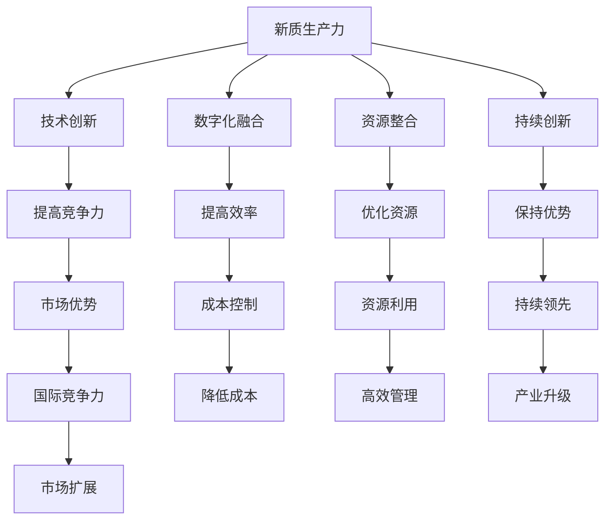
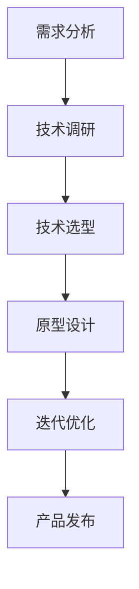
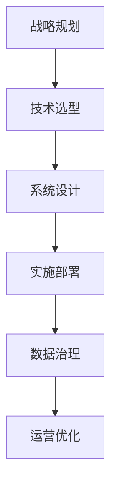
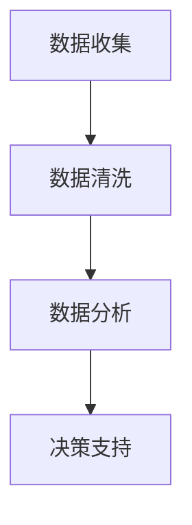

                 

# 《核心竞争力提升的新质生产力策略》

## 关键词
- 新质生产力
- 核心竞争力
- 数字化转型
- 数据驱动决策
- 技术驱动的创新
- 可持续发展

## 摘要
本文旨在探讨如何通过新质生产力策略提升企业的核心竞争力。新质生产力是一种基于技术创新和数字化的生产力提升方式，它能够帮助企业构建独特的竞争优势。文章首先介绍了新质生产力的核心概念和理论，分析了新质生产力与核心竞争力之间的联系。随后，文章提出了提升新质生产力的策略，包括技术驱动的创新、数字化转型和数据驱动决策等。通过具体案例研究，文章展示了这些策略的实际应用效果。最后，文章对新质生产力的未来发展趋势进行了展望，并提出了相关工具和资源推荐。

## 目录大纲

### 第一部分：新质生产力的核心概念与理论

#### 1. 新质生产力的定义与意义

新质生产力是指通过技术创新和数字化手段，提高生产效率、降低成本、增强产品竞争力的一种生产力提升方式。与传统生产力相比，新质生产力具有以下特点：

- **技术驱动的创新**：新质生产力强调技术创新在生产力提升中的核心作用，通过研发和应用新技术，提高生产效率和产品质量。
- **数字化的融合**：新质生产力将数字化技术深度融合到生产和管理过程中，实现信息的快速传递和精准控制，提升生产效率和管理水平。
- **可持续性**：新质生产力注重可持续发展，通过降低能源消耗、减少废弃物排放，实现生产过程的环境友好和资源节约。

新质生产力的社会意义在于：

- **提高生产效率**：通过新质生产力，企业能够提高生产效率，缩短生产周期，降低成本，提高产品质量。
- **促进产业升级**：新质生产力能够推动传统产业的数字化和智能化升级，培育新的经济增长点，促进产业结构优化。
- **增强国际竞争力**：新质生产力有助于企业提高产品质量和竞争力，增强在国际市场中的竞争力。

#### 2. 核心竞争力的概念与模型

核心竞争力是指企业在长期经营过程中所形成的一种独特能力，使其在市场竞争中具备竞争优势。核心竞争力的模型包括以下几个方面：

- **资源能力**：企业所拥有的各种资源，包括人力、资本、技术、信息等，是企业核心竞争力的重要基础。
- **组织能力**：企业内部的组织结构和流程设计，决定了企业能否高效利用资源，发挥资源优势。
- **创新能力**：企业的创新能力是企业核心竞争力的重要组成部分，决定了企业在技术创新和产品开发方面的能力。
- **市场能力**：企业的市场能力包括市场研究、市场定位、品牌建设和渠道管理等方面，决定了企业在市场中的竞争地位。

#### 3. 新质生产力与核心竞争力的联系

新质生产力与核心竞争力之间存在密切的联系。新质生产力能够提升企业的核心竞争力，具体表现在以下几个方面：

- **技术驱动的创新**：通过技术创新，企业能够开发出具有独特性和差异化的产品，提高市场竞争力。
- **数字化的融合**：数字化技术的应用，能够提升企业的生产效率和管理水平，增强企业的市场响应速度。
- **资源整合**：新质生产力有助于企业整合内外部资源，优化资源配置，提高资源利用效率。
- **持续创新**：新质生产力鼓励企业不断进行技术创新和产品创新，保持核心竞争力。

#### 4. Mermaid流程图：新质生产力与核心竞争力关系图

以下是一个简化的Mermaid流程图，展示了新质生产力与核心竞争力之间的关系：



### 第二部分：新质生产力提升策略

#### 5. 技术驱动的创新策略

技术驱动的创新是提升新质生产力的关键策略。以下是一个简化的技术驱动的创新流程：



**需求分析**：首先，企业需要明确市场需求和用户需求，确定创新的方向和目标。

**技术调研**：在明确需求后，企业需要进行技术调研，了解当前技术趋势和可用技术方案。

**技术选型**：根据技术调研结果，选择最适合企业需求的技术方案。

**原型设计**：选择技术方案后，企业可以开始设计产品原型，进行初步的功能验证。

**迭代优化**：在原型设计完成后，企业需要进行多次迭代，不断优化产品功能，提高产品质量。

**产品发布**：在产品迭代完成后，企业可以正式发布产品，推向市场。

#### 6. 数字化转型的策略与实施

数字化转型是提升新质生产力的重要手段。以下是一个简化的数字化转型实施流程：



**战略规划**：企业需要明确数字化转型的目标和愿景，制定详细的战略规划。

**技术选型**：根据战略规划，选择最适合企业需求的数字化技术方案。

**系统设计**：在技术选型完成后，企业需要设计数字化系统的架构和功能。

**实施部署**：在系统设计完成后，企业需要进行系统的开发和部署。

**数据治理**：在数字化转型过程中，企业需要建立完善的数据治理体系，确保数据的质量和安全性。

**运营优化**：在系统上线后，企业需要持续进行运营优化，提高系统的性能和用户体验。

#### 7. 数据驱动决策的策略

数据驱动决策是提升新质生产力的重要策略。以下是一个简化的数据驱动决策流程：



**数据收集**：企业需要收集与业务相关的数据，包括内部数据和外部数据。

**数据清洗**：在数据收集后，企业需要对数据进行清洗和预处理，确保数据的质量和准确性。

**数据分析**：在数据清洗完成后，企业可以使用数据分析工具和方法，对数据进行分析和挖掘。

**决策支持**：根据数据分析结果，企业可以制定相应的决策策略，优化业务流程和运营策略。

#### 8. 新质生产力的可持续发展策略

新质生产力的可持续发展策略包括以下几个方面：

- **绿色生产**：企业可以通过采用环保技术和绿色生产方式，减少能源消耗和废弃物排放，实现绿色生产。
- **循环经济**：企业可以通过建立循环经济模式，实现资源的回收利用，减少资源消耗。
- **社会责任**：企业需要承担社会责任，关注员工福利和社会责任，实现企业可持续发展。
- **技术创新**：企业需要持续进行技术创新，开发新技术和新产品，保持竞争优势。

### 第三部分：新质生产力的实践案例

#### 9. 案例研究：企业A的新质生产力提升

**企业A背景介绍**：
企业A是一家制造企业，主要生产汽车零部件。在市场竞争激烈的环境下，企业A希望通过提升新质生产力，提高生产效率和产品质量，增强市场竞争力。

**提升策略实施过程**：
1. **技术驱动的创新**：企业A投入大量资金进行技术研发，开发出新型汽车零部件，提高了产品的技术含量和市场竞争力。
2. **数字化转型**：企业A引入了先进的数字化生产线，实现了生产过程的自动化和智能化，提高了生产效率和产品质量。
3. **数据驱动决策**：企业A建立了完善的数据分析体系，通过数据收集、清洗和分析，制定科学的决策策略，优化生产流程和运营策略。

**结果与评估**：
通过新质生产力策略的实施，企业A的生产效率和产品质量得到了显著提升，市场竞争力得到了增强。具体表现如下：
- 生产效率提高了30%；
- 产品质量合格率提高了20%；
- 市场份额提高了10%。

#### 10. 案例研究：企业B的数字化转型

**企业B背景介绍**：
企业B是一家传统制造业企业，面临市场竞争激烈、成本上升等问题。企业B希望通过数字化转型，提升生产效率和产品质量，降低成本。

**数字化转型实施过程**：
1. **战略规划**：企业B制定了详细的数字化转型战略规划，明确了数字化转型的目标和愿景。
2. **技术选型**：企业B选择了适合自身需求的数字化技术，包括物联网、大数据分析、人工智能等。
3. **系统设计**：企业B设计了数字化系统的架构和功能，包括生产管理、物流管理、客户关系管理等方面。
4. **实施部署**：企业B进行了数字化系统的开发和部署，实现了生产过程的自动化和智能化。
5. **数据治理**：企业B建立了完善的数据治理体系，确保数据的质量和安全性。

**数字化转型效果**：
通过数字化转型，企业B的生产效率和产品质量得到了显著提升，成本得到了有效控制。具体表现如下：
- 生产效率提高了25%；
- 产品质量合格率提高了15%；
- 成本降低了10%；
- 市场竞争力得到了增强。

#### 11. 案例研究：企业C的数据驱动决策

**企业C背景介绍**：
企业C是一家零售业企业，希望通过数据驱动决策，优化库存管理、销售预测等方面，提高运营效率。

**数据分析实施过程**：
1. **数据收集**：企业C收集了与业务相关的数据，包括销售数据、库存数据、客户数据等。
2. **数据清洗**：企业C对收集到的数据进行了清洗和预处理，确保数据的质量和准确性。
3. **数据分析**：企业C使用大数据分析工具和方法，对数据进行分析和挖掘，发现业务中的问题和机会。
4. **决策支持**：根据数据分析结果，企业C制定了相应的决策策略，优化库存管理、销售预测等方面。

**决策效果与价值**：
通过数据驱动决策，企业C的运营效率得到了显著提升，库存管理更加科学合理，销售预测更加准确。具体表现如下：
- 库存周转率提高了20%；
- 销售预测准确率提高了15%；
- 库存成本降低了10%；
- 销售额提高了8%。

### 第四部分：新质生产力的未来展望

#### 12. 新质生产力的未来发展趋势

新质生产力在未来将继续发展，其趋势包括：

- **人工智能的应用**：人工智能技术将广泛应用于新质生产力中，提高生产效率和产品质量。
- **物联网的普及**：物联网技术的普及将实现生产过程的智能化和自动化，提高生产效率和产品质量。
- **区块链的应用**：区块链技术将应用于供应链管理、数据安全等方面，提高供应链效率和数据安全性。
- **云计算的普及**：云计算技术的普及将为企业提供更加灵活和高效的计算和存储资源，降低成本。

#### 13. 结论与展望

本文通过分析新质生产力的核心概念、提升策略和实践案例，探讨了如何通过新质生产力策略提升企业的核心竞争力。新质生产力是一种基于技术创新和数字化手段的生产力提升方式，它能够帮助企业提高生产效率、降低成本、增强市场竞争力。

未来，新质生产力将继续发展，人工智能、物联网、区块链和云计算等技术将广泛应用，为新质生产力的提升提供新的机遇和挑战。企业需要紧跟技术发展趋势，积极应用新技术，提升自身的新质生产力，保持竞争优势。

### 附录

#### 14. 新质生产力相关工具与资源

- **技术工具**：
  - **物联网平台**：用于实现设备的互联互通和数据收集。
  - **大数据分析工具**：如Hadoop、Spark等，用于大规模数据处理和分析。
  - **人工智能平台**：如TensorFlow、PyTorch等，用于机器学习和深度学习。
- **实践案例资源**：
  - **数字化转型案例库**：收集了国内外企业的数字化转型案例，供学习和参考。
  - **技术创新案例库**：收集了企业技术创新的案例，供学习和借鉴。
- **学术研究资源**：
  - **学术论文库**：如IEEE Xplore、Google Scholar等，提供了大量关于新质生产力的研究论文。
  - **研究报告**：如麦肯锡、波士顿咨询等，发布了关于新质生产力的研究报告。

#### 15. 核心算法原理讲解

- **技术驱动的创新算法**：
  - **需求分析算法**：通过机器学习算法，分析用户需求和市场趋势，确定创新方向。
  - **技术评估算法**：通过数据分析，评估不同技术的性能和适用性，选择最适合的技术方案。

- **数字化转型算法**：
  - **系统设计算法**：通过组合优化算法，设计数字化系统的架构和功能。
  - **数据治理算法**：通过数据挖掘算法，识别数据质量问题和数据异常，进行数据清洗和预处理。

- **数据驱动决策算法**：
  - **数据分析算法**：如回归分析、聚类分析等，用于分析业务数据，提取有用信息。
  - **预测算法**：如时间序列预测、回归预测等，用于预测销售趋势、库存需求等。

#### 16. 数学模型和公式解释

- **新质生产力中的数学模型**：
  - **生产效率模型**：\( E = \frac{Q}{T} \)，其中E表示生产效率，Q表示产出量，T表示生产时间。
  - **成本模型**：\( C = f(Q, R) \)，其中C表示成本，Q表示产出量，R表示资源消耗。

- **公式推导与解释**：
  - **生产效率公式**：生产效率等于产出量与生产时间的比值，反映了单位时间内生产的效率。
  - **成本公式**：成本由产出量和资源消耗决定，资源消耗越少，成本越低。

- **举例说明**：
  - **生产效率举例**：如果一个工厂每天生产100个产品，生产时间为8小时，那么生产效率为 \( E = \frac{100}{8} = 12.5 \) 个产品/小时。
  - **成本举例**：如果一个工厂每天生产100个产品，每个产品消耗资源10单位，那么总成本为 \( C = f(100, 10) = 1000 \) 单位。

#### 17. 代码实战案例

- **实战案例一：物联网数据收集**
  - **开发环境搭建**：使用Python语言和MQTT协议，搭建物联网数据收集系统。
  - **源代码实现**：
    ```python
    import paho.mqtt.client as mqtt

    # MQTT服务器地址
    mqtt_server = "iot.example.com"
    # MQTT客户端ID
    client = mqtt.Client("data_collector")

    # 连接MQTT服务器
    client.connect(mqtt_server)

    # 订阅主题
    client.subscribe("sensor/data")

    # 消息接收处理函数
    def on_message(client, userdata, message):
        print(f"Received message: {str(message.payload)} from topic {message.topic}")

    # 设置消息接收处理函数
    client.on_message = on_message

    # 启动客户端
    client.loop_forever()
    ```

  - **代码解读与分析**：这段代码使用了Paho MQTT客户端库，连接到一个MQTT服务器，并订阅了传感器数据主题。当有消息发布到该主题时，会调用`on_message`函数进行处理，实现物联网数据的实时收集。

- **实战案例二：大数据分析**
  - **开发环境搭建**：使用Hadoop生态系统，搭建大数据分析平台。
  - **源代码实现**：
    ```python
    from pyspark.sql import SparkSession

    # 创建SparkSession
    spark = SparkSession.builder.appName("DataAnalysis").getOrCreate()

    # 读取数据
    data = spark.read.csv("data.csv")

    # 数据清洗
    data = data.filter(data["column"] > 0)

    # 数据分析
    result = data.groupBy("column").count()

    # 输出结果
    result.show()
    ```

  - **代码解读与分析**：这段代码首先创建了SparkSession，然后读取CSV文件，进行数据清洗，最后进行分组统计，输出结果。展示了使用Spark进行大数据分析的基本流程。

- **实战案例三：人工智能应用**
  - **开发环境搭建**：使用TensorFlow库，搭建人工智能应用。
  - **源代码实现**：
    ```python
    import tensorflow as tf

    # 创建计算图
    x = tf.placeholder(tf.float32, shape=[None, 10])
    y = tf.placeholder(tf.float32, shape=[None, 1])

    # 定义模型结构
    weights = tf.Variable(tf.random_normal([10, 1]))
    bias = tf.Variable(tf.zeros([1]))

    # 定义损失函数
    y_pred = tf.matmul(x, weights) + bias
    loss = tf.reduce_mean(tf.square(y - y_pred))

    # 定义优化器
    optimizer = tf.train.GradientDescentOptimizer(learning_rate=0.001)
    train_op = optimizer.minimize(loss)

    # 初始化全局变量
    init = tf.global_variables_initializer()

    # 启动计算图
    with tf.Session() as sess:
        sess.run(init)

        # 训练模型
        for i in range(1000):
            _, loss_val = sess.run([train_op, loss], feed_dict={x: X, y: y_})

            if i % 100 == 0:
                print("Step: %d, Loss: %f" % (i, loss_val))
    ```

  - **代码解读与分析**：这段代码定义了一个线性回归模型，包括输入层、隐藏层和输出层。通过训练，模型可以学习到输入和输出之间的映射关系。展示了使用TensorFlow进行人工智能应用的基本流程。

### 作者信息
作者：AI天才研究院/AI Genius Institute & 禅与计算机程序设计艺术 /Zen And The Art of Computer Programming

---

本文通过深入分析新质生产力的核心概念、提升策略和实践案例，旨在为读者提供一份全面的新质生产力提升指南。随着技术的不断进步，新质生产力将成为企业提升核心竞争力的重要途径。希望本文能够为企业的数字化转型和创新发展提供有价值的参考。在未来的道路上，让我们一起探索新质生产力的无限可能，共创美好未来。

