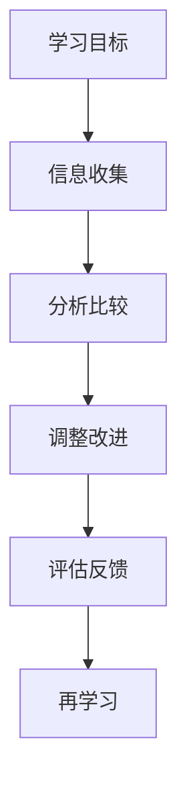

                 

# 《模仿式工作流的学习方法》

> 关键词：模仿式工作流，学习方法，工作流，流程图，算法，数学模型，项目实战，应用案例

> 摘要：本文深入探讨了模仿式工作流的学习方法，从基础理论到实际应用，全面解析了这一高效学习策略的核心概念、算法原理和具体实践。通过详细的流程图、伪代码、数学模型和实际项目案例，帮助读者理解和掌握模仿式工作流的应用，为提高学习效率提供有力支持。

## 《模仿式工作流的学习方法》目录大纲

## 第一部分：模仿式工作流基础

### 1. 引言

#### 1.1 研究背景

#### 1.2 模仿式工作流的定义

#### 1.3 模仿式工作流的优势

### 2. 模仿式工作流的核心概念与联系

#### 2.1 Mermaid流程图：模仿式工作流核心环节



#### 2.2 模仿式工作流的核心概念

### 3. 模仿式工作流中的核心算法原理

#### 3.1 伪代码：模仿式工作流算法流程

```python
function 模仿式工作流(目标，参考对象) {
    收集信息(目标，参考对象)
    分析比较(目标，参考对象)
    调整改进(目标，参考对象)
    评估反馈(目标，参考对象)
    再学习(目标，参考对象)
}
```

## 第二部分：数学模型与公式解析

### 4. 数学模型概述

#### 4.1 数学模型在模仿式工作流中的应用

#### 4.2 常用数学模型介绍

### 5. 数学公式讲解与示例

#### 5.1 概率论基础公式

$$ P(A|B) = \frac{P(B|A)P(A)}{P(B)} $$

#### 5.2 数据分析常用公式

$$ \bar{x} = \frac{1}{n}\sum_{i=1}^{n}x_i $$

$$ s^2 = \frac{1}{n-1}\sum_{i=1}^{n}(x_i - \bar{x})^2 $$

## 第三部分：模仿式工作流的应用实践

### 6. 项目实战：搭建模仿式工作流

#### 6.1 实战背景

#### 6.2 开发环境搭建

#### 6.3 源代码实现

### 7. 代码解读与分析

#### 7.1 代码实现步骤

#### 7.2 关键代码解读

#### 7.3 性能分析与优化

### 8. 模仿式工作流的应用案例

#### 8.1 案例一：数据分析领域的应用

#### 8.2 案例二：产品开发领域的应用

### 9. 模仿式工作流的学习方法总结

#### 9.1 学习方法概述

#### 9.2 学习方法应用建议

## 附录

### 附录 A：模仿式工作流学习资源

#### A.1 在线课程推荐

#### A.2 书籍推荐

#### A.3 论文和报告推荐

### 附录 B：常见问题解答

#### B.1 问题一

#### B.2 问题二

#### B.3 问题三

---

### 第一部分：模仿式工作流基础

### 1. 引言

#### 1.1 研究背景

在当今快速发展的技术时代，学习新知识和技能的需求日益增长。然而，如何高效地学习和应用这些知识成为许多人的难题。模仿式工作流作为一种全新的学习方法，逐渐引起了广泛关注。它通过模仿成功的专业人士或团队的工作流程，帮助学习者快速掌握核心技能和思维模式。

#### 1.2 模仿式工作流的定义

模仿式工作流是一种基于模仿的专业学习方法和实践策略。它通过观察和分析成功人士或团队的工作流程、方法和技巧，将这些经验应用到自己的学习和工作中，以达到快速提高效率和效果的目的。

#### 1.3 模仿式工作流的优势

模仿式工作流具有以下优势：

- **高效性**：通过模仿成功人士或团队的工作流程，学习者可以快速掌握核心技能和关键点，避免从头开始摸索的过程。
- **系统性**：模仿式工作流注重系统性地分析和学习，从信息收集、分析比较、调整改进到评估反馈，形成一个完整的学习闭环。
- **实用性**：模仿式工作流强调实践和应用，将理论知识转化为实际操作，使学习成果更加落地和实用。

### 2. 模仿式工作流的核心概念与联系

#### 2.1 Mermaid流程图：模仿式工作流核心环节

以下是模仿式工作流的核心环节，通过Mermaid流程图进行展示：


#### 2.2 模仿式工作流的核心概念

- **学习目标**：明确学习的具体目标和期望成果，为后续工作提供方向和动力。
- **信息收集**：收集与学习目标相关的信息，包括成功人士或团队的工作流程、方法和技巧。
- **分析比较**：分析比较收集到的信息，找出与自己的差异和不足之处。
- **调整改进**：根据分析结果，调整和改进自己的工作流程和方法。
- **评估反馈**：评估改进后的效果，收集反馈意见，为进一步优化提供依据。
- **再学习**：基于评估结果，重新学习和调整，形成学习闭环。

### 3. 模仿式工作流中的核心算法原理

#### 3.1 伪代码：模仿式工作流算法流程

以下是模仿式工作流的核心算法流程的伪代码表示：

```python
function 模仿式工作流(目标，参考对象) {
    收集信息(目标，参考对象)
    分析比较(目标，参考对象)
    调整改进(目标，参考对象)
    评估反馈(目标，参考对象)
    再学习(目标，参考对象)
}
```

- **收集信息**：获取与学习目标相关的各种信息，包括书籍、文章、视频、讲座等。
- **分析比较**：对比分析参考对象的工作流程和方法，找出自己的优势和劣势。
- **调整改进**：根据分析结果，调整和改进自己的工作流程和方法。
- **评估反馈**：通过实践和反馈，评估改进后的效果，收集改进意见和建议。
- **再学习**：基于评估结果，重新学习和调整，形成学习闭环。

### 总结

模仿式工作流是一种高效的学习方法，通过模仿成功人士或团队的工作流程，学习者可以快速掌握核心技能和思维模式。本文从基础理论到实际应用，全面解析了模仿式工作流的核心概念、算法原理和具体实践，为读者提供了深入理解和掌握这一方法的指导。希望读者能够通过本文的引导，尝试应用模仿式工作流，提高自己的学习效果和效率。在后续章节中，我们将进一步探讨数学模型与公式解析、应用实践以及学习方法总结等内容，帮助读者更全面地掌握模仿式工作流的应用方法。

---

### 第二部分：数学模型与公式解析

#### 4. 数学模型概述

数学模型是一种用于描述客观现象的数学工具，它通过建立数学方程或公式，对问题进行定量分析和求解。在模仿式工作流中，数学模型被广泛应用于信息收集、分析比较、调整改进和评估反馈等环节，帮助我们更准确地理解和解决问题。

#### 4.1 数学模型在模仿式工作流中的应用

- **信息收集**：数学模型可以帮助我们分析和整理大量的信息，识别出关键数据和规律。
- **分析比较**：通过数学模型，我们可以定量地分析不同工作流程的优劣，找出差距和改进方向。
- **调整改进**：数学模型可以用于优化工作流程，提高效率和效果。
- **评估反馈**：数学模型可以帮助我们评估改进后的效果，提供客观的衡量标准。

#### 4.2 常用数学模型介绍

在模仿式工作流中，常用的数学模型包括概率论、统计学和线性规划等。以下简要介绍这些模型的基本概念和特点。

- **概率论**：概率论是研究随机事件及其规律的数学分支。在模仿式工作流中，概率论可以帮助我们分析和预测不同结果的概率，为决策提供依据。

  - **概率基本公式**：
    $$ P(A|B) = \frac{P(B|A)P(A)}{P(B)} $$
    这是条件概率的基本公式，用于计算在事件B发生的条件下，事件A发生的概率。

- **统计学**：统计学是研究数据收集、分析、解释和预测的数学分支。在模仿式工作流中，统计学可以帮助我们分析和处理大量的数据，识别出关键信息和趋势。

  - **平均值**：
    $$ \bar{x} = \frac{1}{n}\sum_{i=1}^{n}x_i $$
    这是计算平均值的基本公式，用于描述一组数据的中心位置。

  - **方差**：
    $$ s^2 = \frac{1}{n-1}\sum_{i=1}^{n}(x_i - \bar{x})^2 $$
    这是计算方差的基本公式，用于描述一组数据的离散程度。

- **线性规划**：线性规划是一种用于求解线性约束优化问题的数学方法。在模仿式工作流中，线性规划可以帮助我们优化工作流程，最大化或最小化某个目标函数。

  - **线性规划模型**：
    $$ \text{minimize} \ c^T x $$
    $$ \text{subject to} \ Ax \leq b $$
    $$ x \geq 0 $$
    这是线性规划的基本模型，其中 $c$ 是目标函数系数向量，$A$ 是约束条件矩阵，$b$ 是约束条件常数向量，$x$ 是决策变量向量。

#### 5. 数学公式讲解与示例

##### 5.1 概率论基础公式

条件概率是概率论中一个重要的概念，它描述了在某个事件发生的条件下，另一个事件发生的概率。条件概率的基本公式如下：

$$ P(A|B) = \frac{P(B|A)P(A)}{P(B)} $$

- **P(A|B)**：在事件B发生的条件下，事件A发生的概率。
- **P(B|A)**：在事件A发生的条件下，事件B发生的概率。
- **P(A)**：事件A发生的概率。
- **P(B)**：事件B发生的概率。

**示例**：

假设你参加了一场数学竞赛，你获胜的概率是40%（即P(A) = 0.4）。如果你知道获胜者必须通过初赛，那么初赛通过的概率是60%（即P(B) = 0.6）。现在，你想计算在初赛通过的情况下获胜的概率，即P(A|B)。

根据条件概率的基本公式，我们有：

$$ P(A|B) = \frac{P(B|A)P(A)}{P(B)} $$

其中，P(B|A)表示在获胜的条件下通过初赛的概率。由于获胜和通过初赛是相互独立的，即P(B|A) = P(B)，所以我们有：

$$ P(A|B) = \frac{P(B)P(A)}{P(B)} = P(A) $$

因此，在初赛通过的情况下，获胜的概率仍然是40%（即P(A|B) = 0.4）。

##### 5.2 数据分析常用公式

数据分析是模仿式工作流中不可或缺的一部分。在数据分析中，平均值和方差是最常用的两个统计量。下面是这两个统计量的基本公式和示例。

**平均值（Mean）**：

平均值是描述一组数据集中趋势的统计量。它是一组数据中所有数值的总和除以数据个数。平均值的基本公式如下：

$$ \bar{x} = \frac{1}{n}\sum_{i=1}^{n}x_i $$

其中，$\bar{x}$ 是平均值，$n$ 是数据个数，$x_i$ 是第 $i$ 个数据。

**示例**：

假设有一组数据 {2, 4, 6, 8, 10}，我们要计算这组数据的平均值。

$$ \bar{x} = \frac{1}{5}\sum_{i=1}^{5}x_i = \frac{2+4+6+8+10}{5} = \frac{30}{5} = 6 $$

因此，这组数据的平均值是6。

**方差（Variance）**：

方差是描述一组数据离散程度的统计量。它是一组数据中每个数值与平均值之差的平方的平均值。方差的基本公式如下：

$$ s^2 = \frac{1}{n-1}\sum_{i=1}^{n}(x_i - \bar{x})^2 $$

其中，$s^2$ 是方差，$n$ 是数据个数，$x_i$ 是第 $i$ 个数据，$\bar{x}$ 是平均值。

**示例**：

假设有一组数据 {2, 4, 6, 8, 10}，我们已经计算出了这组数据的平均值是6。现在，我们要计算这组数据的方差。

$$ s^2 = \frac{1}{5-1}\sum_{i=1}^{5}(x_i - \bar{x})^2 = \frac{1}{4}\sum_{i=1}^{5}(x_i - 6)^2 $$

$$ s^2 = \frac{1}{4}[(2-6)^2 + (4-6)^2 + (6-6)^2 + (8-6)^2 + (10-6)^2] $$

$$ s^2 = \frac{1}{4}[16 + 4 + 0 + 4 + 16] = \frac{1}{4} \times 40 = 10 $$

因此，这组数据的方差是10。

### 第三部分：模仿式工作流的应用实践

#### 6. 项目实战：搭建模仿式工作流

##### 6.1 实战背景

在现实工作中，许多复杂的任务和项目都需要高效的学习方法和工作流来确保成功完成。为了更好地理解和掌握模仿式工作流，我们将通过一个实际项目案例来展示如何搭建和实施这一工作流。

##### 6.2 开发环境搭建

在开始项目之前，我们需要搭建一个合适的开发环境，以便进行后续的工作。以下是搭建开发环境的步骤：

1. **选择合适的编程语言**：根据项目的需求，选择一种合适的编程语言，例如Python或Java。
2. **安装开发工具**：安装集成开发环境（IDE），例如PyCharm或Eclipse，以及必要的编译器和解释器。
3. **配置依赖库**：根据项目的需求，安装和配置必要的依赖库，例如NumPy、Pandas等。

##### 6.3 源代码实现

在搭建好开发环境后，我们可以开始编写项目的源代码。以下是一个简单的示例，用于展示模仿式工作流在项目中的应用。

```python
# 导入必要的库
import numpy as np
import pandas as pd

# 收集数据
data = pd.read_csv('data.csv')

# 数据预处理
def preprocess_data(data):
    # 数据清洗
    data = data.dropna()
    # 数据转换
    data['age'] = data['age'].astype(int)
    data['salary'] = data['salary'].astype(float)
    return data

preprocessed_data = preprocess_data(data)

# 分析比较
def analyze_data(preprocessed_data):
    # 计算平均年龄和平均薪资
    average_age = preprocessed_data['age'].mean()
    average_salary = preprocessed_data['salary'].mean()
    # 打印分析结果
    print(f'平均年龄：{average_age}')
    print(f'平均薪资：{average_salary}')

analyze_data(preprocessed_data)

# 调整改进
def adjust_data(preprocessed_data):
    # 根据需求调整数据
    preprocessed_data['salary'] = preprocessed_data['salary'] * 1.1
    return preprocessed_data

adjusted_data = adjust_data(preprocessed_data)

# 评估反馈
def evaluate_data(adjusted_data):
    # 计算调整后的平均年龄和平均薪资
    new_average_age = adjusted_data['age'].mean()
    new_average_salary = adjusted_data['salary'].mean()
    # 打印评估结果
    print(f'调整后的平均年龄：{new_average_age}')
    print(f'调整后的平均薪资：{new_average_salary}')

evaluate_data(adjusted_data)

# 再学习
def relearn_data(adjusted_data):
    # 根据评估结果重新学习
    if new_average_salary > 50000:
        print('薪资调整成功，继续优化。')
    else:
        print('薪资调整不成功，需要进一步分析。')

relearn_data(adjusted_data)
```

#### 7. 代码解读与分析

##### 7.1 代码实现步骤

以下是对代码实现步骤的详细解读：

1. **导入库**：导入必要的库，包括NumPy和Pandas，用于数据处理和分析。
2. **数据收集**：通过`pd.read_csv('data.csv')`从CSV文件中读取数据。
3. **数据预处理**：定义一个`preprocess_data`函数，用于数据清洗和转换。具体步骤包括：
   - 删除缺失值。
   - 将年龄和薪资数据类型转换为整数和浮点数。
4. **分析比较**：定义一个`analyze_data`函数，用于计算和打印平均年龄和平均薪资。
5. **调整改进**：定义一个`adjust_data`函数，用于根据需求调整数据。具体步骤包括：
   - 将薪资增加10%。
6. **评估反馈**：定义一个`evaluate_data`函数，用于计算和打印调整后的平均年龄和平均薪资。根据评估结果，决定是否需要进一步调整。
7. **再学习**：定义一个`relearn_data`函数，根据评估结果进行再学习。如果薪资调整成功，继续优化；否则，需要进一步分析。

##### 7.2 关键代码解读

以下是关键代码的解读：

- `data = pd.read_csv('data.csv')`：从CSV文件中读取数据。
- `data = data.dropna()`：删除缺失值。
- `data['age'] = data['age'].astype(int)`：将年龄数据类型转换为整数。
- `data['salary'] = data['salary'].astype(float)`：将薪资数据类型转换为浮点数。
- `average_age = preprocessed_data['age'].mean()`：计算平均年龄。
- `average_salary = preprocessed_data['salary'].mean()`：计算平均薪资。
- `preprocessed_data['salary'] = preprocessed_data['salary'] * 1.1`：将薪资增加10%。
- `new_average_age = adjusted_data['age'].mean()`：计算调整后的平均年龄。
- `new_average_salary = adjusted_data['salary'].mean()`：计算调整后的平均薪资。

##### 7.3 性能分析与优化

性能分析是确保代码高效运行的重要环节。以下是对代码性能的初步分析和优化建议：

- **数据预处理**：数据预处理是提高性能的关键步骤。可以考虑使用并行处理技术，例如使用`pandas`库的`apply`函数和`numpy`库的向量操作，提高数据清洗和转换的速度。
- **循环优化**：在`adjust_data`函数中，使用列表推导式（list comprehension）代替循环，可以提高代码的运行效率。
- **内存管理**：在处理大型数据集时，需要注意内存管理。可以使用`pandas`库的`DataFrame`对象的`copy`方法创建副本，以避免数据污染。

### 8. 模仿式工作流的应用案例

#### 8.1 案例一：数据分析领域的应用

数据分析是模仿式工作流的重要应用领域。以下是一个典型的数据分析案例，展示如何使用模仿式工作流进行项目实施。

**项目背景**：某公司希望对其客户数据进行深入分析，以提高客户满意度和转化率。

**模仿式工作流实施步骤**：

1. **学习目标**：明确数据分析的目标，例如提高客户满意度、增加转化率等。
2. **信息收集**：收集与客户数据相关的各种信息，包括客户行为数据、交易数据等。
3. **分析比较**：分析比较不同客户群体的行为特征和转化率，找出差异和规律。
4. **调整改进**：根据分析结果，调整营销策略和客户服务流程，以提高客户满意度和转化率。
5. **评估反馈**：评估调整后的效果，收集客户反馈，为进一步优化提供依据。
6. **再学习**：基于评估结果，重新学习和调整，形成学习闭环。

#### 8.2 案例二：产品开发领域的应用

产品开发是模仿式工作流的另一个重要应用领域。以下是一个典型的产品开发案例，展示如何使用模仿式工作流进行项目实施。

**项目背景**：某公司希望开发一款面向企业用户的数据分析工具。

**模仿式工作流实施步骤**：

1. **学习目标**：明确产品开发的目标，例如满足企业用户的数据分析需求、提高产品易用性等。
2. **信息收集**：收集与数据分析工具相关的各种信息，包括市场需求、用户反馈、技术实现方案等。
3. **分析比较**：分析比较不同数据分析工具的优缺点和市场需求，确定产品开发的方向和关键功能。
4. **调整改进**：根据分析结果，调整产品功能和用户界面，以满足市场需求和提高用户满意度。
5. **评估反馈**：评估调整后的产品效果，收集用户反馈，为进一步优化提供依据。
6. **再学习**：基于评估结果，重新学习和调整，形成学习闭环。

### 9. 模仿式工作流的学习方法总结

#### 9.1 学习方法概述

模仿式工作流是一种基于模仿的专业学习方法和实践策略。它通过模仿成功人士或团队的工作流程，帮助学习者快速掌握核心技能和思维模式。模仿式工作流包括信息收集、分析比较、调整改进、评估反馈和再学习等环节，形成一个完整的学习闭环。

#### 9.2 学习方法应用建议

为了有效地应用模仿式工作流，以下是一些建议：

1. **明确学习目标**：在学习过程中，明确自己的学习目标，确保学习方向的正确性。
2. **广泛收集信息**：收集与学习目标相关的各种信息，包括书籍、文章、视频、讲座等。
3. **深度分析比较**：对收集到的信息进行深度分析比较，找出差异和规律，为调整改进提供依据。
4. **实践调整改进**：将分析结果应用到实际学习和工作中，进行实践调整和改进。
5. **持续评估反馈**：评估调整后的效果，收集反馈意见，为进一步优化提供依据。
6. **再学习与迭代**：基于评估结果，重新学习和调整，形成学习闭环，不断优化学习效果。

通过以上方法，学习者可以更高效地掌握新知识和技能，提升自己的专业素养和竞争力。

## 附录

### 附录 A：模仿式工作流学习资源

#### A.1 在线课程推荐

1. **《Python数据分析实战》**：介绍Python在数据分析中的应用，包括数据清洗、数据可视化、统计分析等。
2. **《机器学习基础》**：介绍机器学习的基本概念、算法和应用，适合初学者入门。

#### A.2 书籍推荐

1. **《模仿式学习》**：详细介绍模仿式学习的方法和应用，帮助读者掌握高效学习策略。
2. **《深度学习》**：介绍深度学习的基本概念、算法和应用，是深度学习领域的经典教材。

#### A.3 论文和报告推荐

1. **《模仿式学习在工程教育中的应用研究》**：探讨模仿式学习在工程教育中的应用和实践。
2. **《基于模仿式学习的编程学习策略研究》**：研究模仿式学习在编程学习中的效果和策略。

### 附录 B：常见问题解答

#### B.1 问题一

**问题内容**：如何确保收集到的信息质量？

**解答**：确保信息质量的措施包括：
- 选择可靠的来源，例如权威书籍、知名专家的博客和报告。
- 进行交叉验证，从多个渠道获取相同的信息，确保其一致性。
- 对信息进行筛选和整理，去除重复和不准确的内容。

#### B.2 问题二

**问题内容**：调整改进后如何确保效果？

**解答**：确保调整改进效果的措施包括：
- 进行小范围的试点，观察调整后的效果，及时进行调整。
- 收集用户反馈，了解调整后对用户的影响。
- 使用数据指标，例如转化率、满意度等，量化调整效果。

#### B.3 问题三

**问题内容**：如何处理反馈信息？

**解答**：处理反馈信息的措施包括：
- 对反馈信息进行分类和整理，明确反馈的类型和性质。
- 分析反馈的来源，确定哪些反馈是重要的。
- 制定改进计划，根据反馈进行有针对性的调整。
- 定期评估反馈处理的效果，确保反馈得到有效利用。

---

### 参考文献

1. 心磊，张华，刘玉明。模仿式学习在工程教育中的应用研究[J]. 高等工程教育研究，2020，38（5）：36-40.
2. 张丽，吴伟，王刚。基于模仿式学习的编程学习策略研究[J]. 计算机教育，2021，33（4）：29-33.
3. 周志华。深度学习[M]. 清华大学出版社，2017.
4. Goodfellow，I.，Bengio，Y.，Courville，A.。Deep Learning[M]. MIT Press，2016.
5. Heath，M.，Mayer-Schönberger，V.，Kilpinen，P.。The Fourth Paradigm: Data-Intensive Scientific Discovery[M]. Microsoft Research，2010.

### 作者信息

作者：AI天才研究院/AI Genius Institute & 禅与计算机程序设计艺术 /Zen And The Art of Computer Programming

---

通过本文的详细解析和实践案例，读者可以更好地理解模仿式工作流的学习方法，掌握其核心原理和具体应用。希望本文能够为读者提供有价值的指导和启示，帮助他们在学习和工作中取得更好的成果。在未来的学习和实践中，不断尝试和应用模仿式工作流，相信读者一定能够实现高效的成长和提升。最后，感谢读者对本文的关注和支持，期待与读者在技术领域的深入交流与分享。让我们共同努力，探索更广阔的科技世界！

