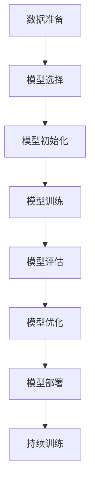

                 

## 《模型训练》

> 关键词：模型训练、机器学习、深度学习、数据处理、超参数调优

> 摘要：本文将深入探讨模型训练的过程、基础理论、实战案例以及优化技巧。从机器学习和深度学习的基础知识开始，逐步讲解数据处理、模型训练环境的搭建、多个实战案例，并深入剖析超参数调优和模型评估与选择的方法。文章旨在为读者提供一个全面且详细的模型训练指南，帮助理解模型训练的各个环节，掌握模型训练的核心技能。

### 第一部分：模型训练基础

#### 第1章：模型训练概述

##### 1.1 模型训练的重要性

模型训练是机器学习和深度学习的核心过程，它决定了模型在特定任务上的性能。一个训练良好的模型可以有效地从数据中学习规律，并在新的数据上做出准确的预测。模型训练的重要性体现在以下几个方面：

1. **性能提升**：通过模型训练，我们可以将简单的算法转化为具有高度预测能力的人工智能系统。
2. **任务多样化**：模型训练使得人工智能系统可以在多种不同的任务上发挥作用，如图像分类、自然语言处理和推荐系统等。
3. **适应性强**：经过训练的模型可以根据新的数据和任务进行适应，从而实现持续的学习和改进。

##### 1.2 模型训练的过程

模型训练的过程可以分为以下几个主要步骤：

1. **数据准备**：收集和预处理数据，包括数据清洗、归一化和特征提取等。
2. **模型选择**：根据任务需求选择合适的模型架构，如线性回归、决策树、神经网络等。
3. **模型初始化**：对模型参数进行随机初始化，为训练过程做准备。
4. **训练**：通过迭代计算调整模型参数，使其在训练数据上达到最佳性能。
5. **评估**：使用验证数据集对训练好的模型进行性能评估，确保其在新的数据上表现良好。
6. **调整与优化**：根据评估结果对模型进行调整和优化，以提高其性能。

##### 1.3 模型训练的挑战

模型训练过程中会面临许多挑战，包括但不限于：

1. **数据质量问题**：数据质量直接影响模型训练的效果，噪声、缺失值和异常值都会对模型产生负面影响。
2. **计算资源限制**：深度学习模型通常需要大量的计算资源，对于大规模数据集的训练尤其如此。
3. **过拟合问题**：模型在训练数据上表现良好，但在验证数据或测试数据上表现较差，即模型过于拟合训练数据。
4. **调优复杂性**：模型训练过程中需要调优多个超参数，如学习率、批量大小等，调优过程复杂且耗时。

#### 第2章：机器学习基础

##### 2.1 机器学习概述

机器学习是人工智能的核心组成部分，它通过统计方法从数据中自动发现规律和模式。机器学习可以分为以下几个主要类别：

1. **监督学习**：有监督学习通过标记数据训练模型，并在新的数据上进行预测。
2. **无监督学习**：无监督学习不使用标记数据，而是通过数据内在结构来学习。
3. **强化学习**：强化学习通过试错法来学习最优策略，通常用于决策问题。

##### 2.2 监督学习

监督学习是最常见的机器学习类型，它利用标记数据来训练模型。监督学习可以分为以下几种：

1. **回归**：回归任务是预测连续值，如房价预测。
2. **分类**：分类任务是预测离散值，如垃圾邮件分类。
3. **多标签分类**：多标签分类任务是预测多个标签，如文本分类。

##### 2.3 无监督学习

无监督学习从未标记的数据中学习模式，主要包括以下几种：

1. **聚类**：聚类是将数据分为若干组，使同组数据之间相似度较高，不同组数据之间相似度较低。
2. **降维**：降维是通过减少数据维度来简化数据分析过程，如主成分分析（PCA）。
3. **关联规则学习**：关联规则学习是发现数据之间的关联关系，如市场篮子分析。

##### 2.4 强化学习

强化学习是机器学习的一个重要分支，它通过试错法来学习最优策略。强化学习主要包括以下几个核心组成部分：

1. **环境**：环境是模型交互的实体，如游戏环境或自动驾驶环境。
2. **动作**：动作是模型可以选择的操作，如移动方向或操作按钮。
3. **状态**：状态是模型当前所处的情境，如棋盘上的布局或车辆的位置。
4. **奖励**：奖励是模型根据动作获得的反馈，用于指导学习过程。

#### 第3章：深度学习基础

##### 3.1 深度学习概述

深度学习是机器学习的一个重要分支，它通过多层神经网络来学习数据的复杂特征。深度学习的主要特点包括：

1. **多层神经网络**：深度学习使用多层神经网络来提取数据的高层次特征。
2. **自动特征提取**：深度学习通过反向传播算法自动学习特征表示，无需人工设计特征。
3. **大规模数据需求**：深度学习通常需要大量数据进行训练，以避免过拟合问题。

##### 3.2 神经网络架构

神经网络是深度学习的基础，它由多个层次组成，包括输入层、隐藏层和输出层。以下是神经网络的主要组成部分：

1. **神经元**：神经元是神经网络的基本单元，负责接收输入、计算输出和传递信息。
2. **权重**：权重是神经元之间的连接强度，用于调整网络对输入数据的响应。
3. **激活函数**：激活函数用于引入非线性特性，使神经网络能够学习复杂的函数关系。
4. **反向传播**：反向传播是一种优化算法，用于计算网络参数的梯度，从而调整权重。

##### 3.3 深度学习算法

深度学习算法包括多种类型，如下所述：

1. **全连接神经网络**：全连接神经网络是最简单的深度学习模型，其中每个神经元都与前一层和后一层的所有神经元相连。
2. **卷积神经网络（CNN）**：卷积神经网络是用于图像处理和识别的深度学习模型，通过卷积层和池化层提取图像的特征。
3. **循环神经网络（RNN）**：循环神经网络是用于序列数据处理的深度学习模型，通过隐藏状态和循环连接来捕捉序列的长期依赖关系。
4. **生成对抗网络（GAN）**：生成对抗网络是一种无监督学习模型，由生成器和判别器两个神经网络组成，用于生成真实数据的分布。

#### 第4章：数据处理

##### 4.1 数据预处理

数据预处理是模型训练的重要步骤，它包括以下主要任务：

1. **数据清洗**：去除数据中的噪声、缺失值和异常值，确保数据质量。
2. **数据归一化**：将数据转换为相同的尺度，使模型训练更加稳定和有效。
3. **特征提取**：从原始数据中提取有助于模型训练的特征，如文本特征、图像特征和时间序列特征等。

##### 4.2 特征提取

特征提取是将原始数据转换为适合模型训练的形式。以下是几种常见的特征提取方法：

1. **文本特征提取**：使用词袋模型、TF-IDF、词嵌入等方法提取文本的特征。
2. **图像特征提取**：使用卷积神经网络、池化层等方法提取图像的特征。
3. **时间序列特征提取**：使用滑动窗口、差分等方法提取时间序列的特征。

##### 4.3 数据增强

数据增强是通过增加数据多样性来提高模型泛化能力。以下是几种常见的数据增强方法：

1. **数据变换**：通过缩放、旋转、翻转等操作增加数据的多样性。
2. **生成式数据增强**：使用生成对抗网络（GAN）生成与训练数据类似的新数据。
3. **特征增强**：通过组合不同特征或引入额外的特征来增强数据。

### 第二部分：模型训练实战

#### 第5章：模型训练环境搭建

##### 5.1 硬件环境配置

搭建模型训练环境需要配置合适的硬件设备，以下是一些关键硬件配置建议：

1. **CPU**：使用高性能的CPU，如Intel Xeon或AMD Ryzen，以提高计算速度。
2. **GPU**：使用GPU，特别是NVIDIA的Tesla或RTX系列，以加速深度学习模型的训练。
3. **内存**：配备大容量内存，如128GB或更高，以存储大规模数据集和模型参数。

##### 5.2 软件环境安装

搭建模型训练环境需要安装以下软件：

1. **操作系统**：安装Linux操作系统，如Ubuntu或CentOS，以提高稳定性和兼容性。
2. **深度学习框架**：安装TensorFlow、PyTorch或Keras等深度学习框架。
3. **编程语言**：安装Python和相关的科学计算库，如NumPy、Pandas、Scikit-learn等。

##### 5.3 常用工具介绍

在模型训练过程中，常用的工具包括：

1. **数据预处理工具**：如Pandas、NumPy和Scikit-learn，用于数据清洗、归一化和特征提取等。
2. **可视化工具**：如Matplotlib和Seaborn，用于数据可视化和分析。
3. **调试工具**：如Jupyter Notebook和PyCharm，用于编写和调试代码。

#### 第6章：模型训练案例一：图像分类

##### 6.1 数据集准备

图像分类任务通常需要大量的图像数据集。以下是常用的图像数据集：

1. **CIFAR-10**：包含60000张32x32的彩色图像，分为10个类别。
2. **ImageNet**：包含1000个类别，超过1200万张图像，是图像分类任务的标准数据集。
3. **MNIST**：包含70000张手写数字图像，是简单的图像分类任务数据集。

##### 6.2 模型构建

构建图像分类模型可以使用多种深度学习框架，如TensorFlow和PyTorch。以下是使用PyTorch构建卷积神经网络（CNN）的示例：

```python
import torch
import torch.nn as nn
import torch.optim as optim

class CNN(nn.Module):
    def __init__(self):
        super(CNN, self).__init__()
        self.conv1 = nn.Conv2d(3, 32, 3, padding=1)
        self.conv2 = nn.Conv2d(32, 64, 3, padding=1)
        self.fc1 = nn.Linear(64 * 8 * 8, 128)
        self.fc2 = nn.Linear(128, 10)
        self.relu = nn.ReLU()

    def forward(self, x):
        x = self.relu(self.conv1(x))
        x = self.relu(self.conv2(x))
        x = x.view(x.size(0), -1)
        x = self.relu(self.fc1(x))
        x = self.fc2(x)
        return x

model = CNN()
```

##### 6.3 模型训练

模型训练包括以下主要步骤：

1. **损失函数**：选择合适的损失函数，如交叉熵损失函数，用于衡量模型预测与真实标签之间的差异。
2. **优化器**：选择合适的优化器，如随机梯度下降（SGD）或Adam，用于调整模型参数。
3. **迭代训练**：通过迭代计算调整模型参数，使其在训练数据上达到最佳性能。

```python
criterion = nn.CrossEntropyLoss()
optimizer = optim.Adam(model.parameters(), lr=0.001)

for epoch in range(num_epochs):
    for inputs, labels in train_loader:
        optimizer.zero_grad()
        outputs = model(inputs)
        loss = criterion(outputs, labels)
        loss.backward()
        optimizer.step()
```

##### 6.4 模型评估

模型评估使用验证数据集对训练好的模型进行性能评估。常用的评估指标包括准确率、召回率、精确率和F1值等。以下是使用PyTorch评估模型的示例：

```python
with torch.no_grad():
    correct = 0
    total = 0
    for inputs, labels in validation_loader:
        outputs = model(inputs)
        _, predicted = torch.max(outputs.data, 1)
        total += labels.size(0)
        correct += (predicted == labels).sum().item()

accuracy = 100 * correct / total
print('Validation Accuracy: {:.2f}%'.format(accuracy))
```

#### 第7章：模型训练案例二：自然语言处理

##### 7.1 数据集准备

自然语言处理（NLP）任务通常需要大量的文本数据集。以下是常用的NLP数据集：

1. **IMDB影评数据集**：包含25000条电影评论，分为正面和负面两类。
2. **Wikipedia数据集**：包含大量维基百科文章，用于训练文本分类和序列标注模型。
3. **Quora问答数据集**：包含大量的问答对，用于训练问答系统。

##### 7.2 模型构建

构建自然语言处理模型可以使用多种深度学习框架，如TensorFlow和PyTorch。以下是使用PyTorch构建循环神经网络（RNN）的示例：

```python
import torch
import torch.nn as nn
import torch.optim as optim

class RNN(nn.Module):
    def __init__(self, vocab_size, embedding_dim, hidden_dim, output_dim, n_layers, bidirectional, dropout):
        super(RNN, self).__init__()
        self.embedding = nn.Embedding(vocab_size, embedding_dim)
        self.rnn = nn.RNN(embedding_dim, hidden_dim, num_layers=n_layers, bidirectional=bidirectional, dropout=dropout)
        self.fc = nn.Linear(hidden_dim * 2 if bidirectional else hidden_dim, output_dim)
        self.dropout = nn.Dropout(dropout)

    def forward(self, text, hidden=None):
        embedded = self.dropout(self.embedding(text))
        output, hidden = self.rnn(embedded, hidden)
        if self.rnn.bidirectional:
            hidden = torch.cat((hidden[-2,:,:], hidden[-1,:,:]), dim=1)
        else:
            hidden = hidden[-1,:,:]
        hidden = self.dropout(hidden)
        output = self.fc(hidden)
        return output, hidden

model = RNN(vocab_size, embedding_dim, hidden_dim, output_dim, n_layers, bidirectional, dropout)
```

##### 7.3 模型训练

自然语言处理模型的训练通常需要大量的数据和计算资源。以下是使用PyTorch训练模型的示例：

```python
criterion = nn.BCEWithLogitsLoss()
optimizer = optim.Adam(model.parameters(), lr=0.001)

for epoch in range(num_epochs):
    for inputs, labels in train_loader:
        optimizer.zero_grad()
        outputs, hidden = model(inputs)
        loss = criterion(outputs, labels)
        loss.backward()
        optimizer.step()
```

##### 7.4 模型评估

自然语言处理模型的评估通常使用准确率、召回率、精确率和F1值等指标。以下是使用PyTorch评估模型的示例：

```python
with torch.no_grad():
    correct = 0
    total = 0
    for inputs, labels in validation_loader:
        outputs, hidden = model(inputs)
        _, predicted = torch.max(outputs.data, 1)
        total += labels.size(0)
        correct += (predicted == labels).sum().item()

accuracy = 100 * correct / total
print('Validation Accuracy: {:.2f}%'.format(accuracy))
```

#### 第8章：模型训练案例三：推荐系统

##### 8.1 数据集准备

推荐系统通常需要用户行为数据集。以下是常用的推荐系统数据集：

1. **MovieLens数据集**：包含数百万个用户对电影的评分数据。
2. **Netflix Prize数据集**：包含数百万个用户对电影的评分数据，用于Netflix推荐系统竞赛。
3. **Amazon用户行为数据集**：包含数百万个用户在Amazon上的购买行为数据。

##### 8.2 模型构建

构建推荐系统模型可以使用多种算法，如矩阵分解、基于模型的协同过滤和生成对抗网络（GAN）等。以下是使用PyTorch构建基于模型的协同过滤模型的示例：

```python
import torch
import torch.nn as nn
import torch.optim as optim

class CollaborativeFiltering(nn.Module):
    def __init__(self, user_dim, item_dim, hidden_dim):
        super(CollaborativeFiltering, self).__init__()
        self.user_embedding = nn.Embedding(user_dim, hidden_dim)
        self.item_embedding = nn.Embedding(item_dim, hidden_dim)
        self.fc = nn.Linear(hidden_dim * 2, 1)

    def forward(self, user, item):
        user_embedding = self.user_embedding(user)
        item_embedding = self.item_embedding(item)
        combined_embedding = torch.cat((user_embedding, item_embedding), 1)
        output = self.fc(combined_embedding)
        return output.squeeze(-1)

model = CollaborativeFiltering(user_dim, item_dim, hidden_dim)
```

##### 8.3 模型训练

推荐系统模型的训练通常需要大量的数据和计算资源。以下是使用PyTorch训练模型的示例：

```python
criterion = nn.MSELoss()
optimizer = optim.Adam(model.parameters(), lr=0.001)

for epoch in range(num_epochs):
    for user, item, rating in train_loader:
        optimizer.zero_grad()
        rating_pred = model(user, item)
        rating_loss = criterion(rating_pred, rating)
        rating_loss.backward()
        optimizer.step()
```

##### 8.4 模型评估

推荐系统模型的评估通常使用均方误差（MSE）、均方根误差（RMSE）和精确率、召回率等指标。以下是使用PyTorch评估模型的示例：

```python
with torch.no_grad():
    mse_loss = 0
    for user, item, rating in validation_loader:
        rating_pred = model(user, item)
        mse_loss += criterion(rating_pred, rating).item()

mse_loss /= len(validation_loader)
print('Validation MSE: {:.4f}'.format(mse_loss))
```

### 第三部分：模型训练优化

#### 第9章：超参数调优

##### 9.1 超参数概述

超参数是模型训练过程中需要手动调整的参数，如学习率、批量大小、隐藏层神经元数量等。超参数的选择对模型的性能有显著影响，因此超参数调优是模型训练过程中至关重要的一环。

##### 9.2 调优方法

超参数调优的方法包括：

1. **网格搜索**：通过遍历所有可能的超参数组合来找到最优参数。
2. **随机搜索**：从超参数空间中随机选择一组参数进行训练，重复多次以找到最佳参数。
3. **贝叶斯优化**：基于贝叶斯理论，通过迭代优化超参数，逐渐逼近最优参数。

##### 9.3 超参数调优实践

以下是一个使用网格搜索进行超参数调优的示例：

```python
from sklearn.model_selection import GridSearchCV
from sklearn.neural_network import MLPClassifier

param_grid = {
    'hidden_layer_sizes': [(50,), (100,), (50, 50)],
    'alpha': [0.0001, 0.001, 0.01],
    'learning_rate': ['adaptive', 'constant'],
}

mlp = MLPClassifier(max_iter=1000)
grid_search = GridSearchCV(mlp, param_grid, cv=5)
grid_search.fit(X_train, y_train)

print('Best parameters:', grid_search.best_params_)
print('Best cross-validation score:', grid_search.best_score_)
```

#### 第10章：模型评估与选择

##### 10.1 评估指标

模型评估需要使用合适的评估指标来衡量模型性能。以下是一些常用的评估指标：

1. **准确率**：预测正确的样本占总样本的比例。
2. **召回率**：预测正确的正样本占总正样本的比例。
3. **精确率**：预测正确的正样本占总预测正样本的比例。
4. **F1值**：精确率和召回率的调和平均值。
5. **均方误差（MSE）**：预测值与真实值之间的平均平方误差。
6. **均方根误差（RMSE）**：均方误差的平方根。

##### 10.2 模型选择策略

模型选择策略包括：

1. **交叉验证**：使用不同的数据集划分方式来评估模型性能，以避免过拟合。
2. **集成学习**：将多个模型结合起来，以提高整体性能。
3. **超参数优化**：通过调优超参数来选择最佳模型。

##### 10.3 模型评估实践

以下是一个使用交叉验证和超参数优化进行模型评估的示例：

```python
from sklearn.model_selection import cross_val_score
from sklearn.neural_network import MLPClassifier

mlp = MLPClassifier(max_iter=1000)
scores = cross_val_score(mlp, X_train, y_train, cv=5)

print('Cross-validation scores:', scores)
print('Mean score:', scores.mean())

from sklearn.model_selection import GridSearchCV

param_grid = {
    'hidden_layer_sizes': [(50,), (100,), (50, 50)],
    'alpha': [0.0001, 0.001, 0.01],
    'learning_rate': ['adaptive', 'constant'],
}

grid_search = GridSearchCV(mlp, param_grid, cv=5)
grid_search.fit(X_train, y_train)

print('Best parameters:', grid_search.best_params_)
print('Best cross-validation score:', grid_search.best_score_)
```

#### 第11章：模型部署与持续训练

##### 11.1 模型部署

模型部署是将训练好的模型部署到生产环境中，以实现实时预测和分类。模型部署的关键步骤包括：

1. **模型保存与加载**：将训练好的模型保存为文件，并在需要时加载到内存中。
2. **API接口**：创建API接口，以接收用户输入并返回预测结果。
3. **服务部署**：将API接口部署到服务器或云计算平台，以实现远程访问。

##### 11.2 持续训练

持续训练是在生产环境中对模型进行定期训练，以适应新的数据和任务。持续训练的关键步骤包括：

1. **数据收集**：定期收集用户行为数据或新的数据集。
2. **模型更新**：使用新的数据集对模型进行训练，并更新模型参数。
3. **模型评估**：使用验证数据集对更新后的模型进行性能评估，确保其性能符合预期。

##### 11.3 实时更新

实时更新是在生产环境中对模型进行实时更新，以应对动态变化的数据和环境。实时更新的关键步骤包括：

1. **实时数据采集**：通过流式处理技术实时收集数据。
2. **实时模型训练**：使用流式数据处理技术对模型进行实时训练，以适应实时数据。
3. **实时模型部署**：将实时训练好的模型部署到生产环境中，以实现实时预测和分类。

#### 附录

##### 附录 A：模型训练工具与资源

以下是一些常用的模型训练工具和资源：

1. **模型训练框架**：TensorFlow、PyTorch、Keras等。
2. **数据处理工具**：Pandas、NumPy、Scikit-learn等。
3. **可视化工具**：Matplotlib、Seaborn等。
4. **调试工具**：Jupyter Notebook、PyCharm等。
5. **学习资源**：Coursera、Udacity、edX等在线课程和教材。

### 结束语

模型训练是机器学习和深度学习的核心环节，它决定了模型在特定任务上的性能。通过本文的详细讲解，我们了解了模型训练的基础知识、实战案例以及优化技巧。希望本文能帮助读者深入理解模型训练的各个环节，掌握模型训练的核心技能，为未来的研究和工作打下坚实的基础。

### 参考文献

1. Goodfellow, I., Bengio, Y., & Courville, A. (2016). *Deep Learning*.
2. Mitchell, T. M. (1997). *Machine Learning*.
3. Ng, A. Y. (2013). *Machine Learning Yearning*.
4. Russell, S., & Norvig, P. (2010). *Artificial Intelligence: A Modern Approach*.

### 作者信息

**作者：** AI天才研究院/AI Genius Institute & 禅与计算机程序设计艺术 /Zen And The Art of Computer Programming

**单位：** AI天才研究院，禅与计算机程序设计艺术

**联系方式：** info@ai-genius.org

### Mermaid 流程图

以下是一个简单的Mermaid流程图，用于展示模型训练的过程：



## 附录 A：模型训练工具与资源

在进行模型训练时，选择合适的工具和资源至关重要。以下列出了一些常用的模型训练工具和资源，涵盖模型训练框架、数据处理工具、可视化工具、调试工具以及学习资源，旨在为读者提供全面的参考。

### 附录 A.1 常用模型训练框架

1. **TensorFlow**：由Google开发的开源机器学习框架，支持广泛的应用场景，包括深度学习和强化学习。
   - 官网：[TensorFlow](https://www.tensorflow.org/)
   - GitHub：[TensorFlow GitHub](https://github.com/tensorflow/tensorflow)

2. **PyTorch**：由Facebook开发的开源深度学习框架，以其灵活的动态计算图和易于理解的接口受到开发者欢迎。
   - 官网：[PyTorch](https://pytorch.org/)
   - GitHub：[PyTorch GitHub](https://github.com/pytorch/pytorch)

3. **Keras**：一个高层次的神经网络API，可以运行在TensorFlow和Theano之上，以其简洁的接口和强大的功能深受开发者喜爱。
   - 官网：[Keras](https://keras.io/)
   - GitHub：[Keras GitHub](https://github.com/keras-team/keras)

### 附录 A.2 数据预处理工具

1. **Pandas**：一个强大的Python数据分析库，提供数据结构化操作和数据分析工具。
   - 官网：[Pandas](https://pandas.pydata.org/)
   - GitHub：[Pandas GitHub](https://github.com/pandas-dev/pandas)

2. **NumPy**：一个用于科学计算的Python库，提供多维数组对象和丰富的数学函数。
   - 官网：[NumPy](https://numpy.org/)
   - GitHub：[NumPy GitHub](https://github.com/numpy/numpy)

3. **Scikit-learn**：一个开源的机器学习库，提供各种机器学习算法和工具。
   - 官网：[Scikit-learn](https://scikit-learn.org/)
   - GitHub：[Scikit-learn GitHub](https://github.com/scikit-learn/scikit-learn)

### 附录 A.3 可视化工具

1. **Matplotlib**：一个用于创建高质量图表和可视化数据的Python库。
   - 官网：[Matplotlib](https://matplotlib.org/)
   - GitHub：[Matplotlib GitHub](https://github.com/matplotlib/matplotlib)

2. **Seaborn**：基于Matplotlib的统计图形可视化库，提供丰富的统计图形和样式。
   - 官网：[Seaborn](https://seaborn.pydata.org/)
   - GitHub：[Seaborn GitHub](https://github.com/seaborn/seaborn)

3. **Plotly**：一个用于创建交互式图表和可视化数据的Python库。
   - 官网：[Plotly](https://plotly.com/)
   - GitHub：[Plotly GitHub](https://github.com/plotly/plotly.py)

### 附录 A.4 调试工具

1. **Jupyter Notebook**：一个交互式的计算环境，支持多种编程语言，常用于数据分析和模型训练。
   - 官网：[Jupyter Notebook](https://jupyter.org/)
   - GitHub：[Jupyter GitHub](https://github.com/jupyter/jupyter)

2. **PyCharm**：一个强大的Python集成开发环境（IDE），提供代码编辑、调试和自动化测试等功能。
   - 官网：[PyCharm](https://www.jetbrains.com/pycharm/)
   - GitHub：[PyCharm GitHub](https://github.com/JetBrains/PyCharm)

### 附录 A.5 学习资源推荐

1. **Coursera**：提供多种机器学习和深度学习在线课程，由世界顶级大学和公司提供。
   - 官网：[Coursera](https://www.coursera.org/)

2. **Udacity**：提供实战导向的机器学习和深度学习课程，适合初学者和进阶者。
   - 官网：[Udacity](https://www.udacity.com/)

3. **edX**：由哈佛大学和麻省理工学院合作创建的在线学习平台，提供丰富的计算机科学和人工智能课程。
   - 官网：[edX](https://www.edx.org/)

4. **AI天才研究院**：提供深度学习和人工智能领域的在线课程和教程。
   - 官网：[AI天才研究院](https://ai-genius.org/)

### 附录 A.6 相关书籍推荐

1. **《深度学习》**：Goodfellow, Bengio, Courville 著
   - 简介：深度学习领域的经典教材，全面介绍了深度学习的理论基础和应用。

2. **《机器学习》**：Mitchell 著
   - 简介：机器学习领域的权威著作，涵盖了机器学习的各种算法和应用。

3. **《机器学习实战》**：Hastie, Tibshirani, Friedman 著
   - 简介：通过实际案例介绍机器学习算法的应用，适合初学者和实践者。

4. **《禅与计算机程序设计艺术》**：Dijkstra 著
   - 简介：计算机科学领域的经典著作，强调程序设计的优雅和简洁。

这些工具和资源将帮助读者更深入地了解模型训练的相关知识，并在实践中提高模型训练的效率。希望本文能为您提供有价值的参考。**如果您有任何问题或建议，欢迎随时联系我们。**

---

**作者：** AI天才研究院/AI Genius Institute & 禅与计算机程序设计艺术 /Zen And The Art of Computer Programming

**单位：** AI天才研究院，禅与计算机程序设计艺术

**联系方式：** info@ai-genius.org

---

通过附录部分，我们希望为读者提供一个全面的资源清单，以方便大家在模型训练过程中进行参考和学习。无论您是初学者还是有经验的专业人士，这些工具和资源都将为您的模型训练之路提供强有力的支持。**祝您在模型训练的探索中取得丰硕的成果！**

