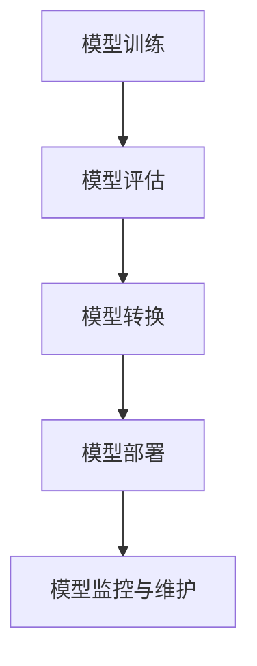
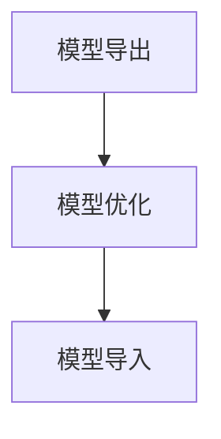
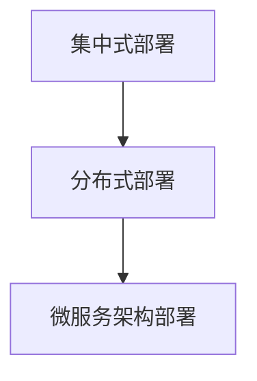
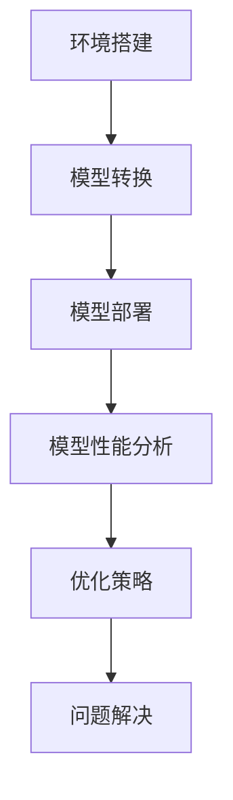

                 

# 模型部署框架

> 关键词：模型部署、框架、流程、技术、实战、监控

> 摘要：本文将详细探讨模型部署框架，从定义、流程、技术到实战，全面解析模型部署的核心内容。通过分析部署过程中的挑战与解决方案，为读者提供实用的指导，助力企业高效实现人工智能模型的落地应用。

## 第一部分：模型部署框架概述

### 第1章：模型部署框架基础

#### 1.1 模型部署的定义与重要性

**1.1.1 模型部署的基本概念**

模型部署是指将训练好的机器学习模型集成到实际应用场景中，实现模型在生产环境中的运行和迭代。

**1.1.2 模型部署的重要性**

模型部署是实现机器学习应用闭环的重要环节，决定了模型的实际价值。高效、可靠的部署框架有助于提升模型性能、降低维护成本。

**1.1.3 模型部署的挑战**

- 模型转换：不同框架之间的兼容性问题
- 硬件选择：硬件资源与模型性能的匹配
- 部署模式：集中式、分布式和微服务架构的选择
- 监控与维护：模型性能监控、更新和退化预防

#### 1.2 模型部署流程

**1.2.1 模型训练**

模型训练是模型部署的基础，通过大量的训练数据和优化算法，使模型具备一定的预测能力。

**1.2.2 模型评估**

模型评估是检验模型性能的重要环节，通过评估指标（如准确率、召回率等）判断模型是否达到预期效果。

**1.2.3 模型转换**

模型转换是将模型从一种格式转换为适用于生产环境的另一种格式，以满足不同硬件和软件框架的需求。

**1.2.4 模型部署**

模型部署是将转换后的模型集成到实际应用中，实现模型的运行和预测。

**1.2.5 模型监控与维护**

模型监控与维护是保障模型稳定运行的关键，包括性能监控、更新和退化预防。

#### 1.3 模型部署架构

**1.3.1 硬件选择**

硬件选择包括CPU、GPU、FPGA等，应根据模型规模和性能要求进行合理配置。

**1.3.2 软件框架**

软件框架包括TensorFlow、PyTorch等，为模型部署提供了丰富的工具和API。

**1.3.3 部署模式**

部署模式包括集中式、分布式和微服务架构，根据应用场景和性能要求进行选择。

### 1.3.4 Mermaid流程图：模型部署流程



### 第2章：模型转换技术

#### 2.1 模型转换的重要性

**2.1.1 模型转换的定义**

模型转换是将机器学习模型从一种格式转换为另一种格式的过程，以适应不同的硬件和软件环境。

**2.1.2 模型转换的意义**

模型转换有助于提升模型性能、降低部署成本、实现跨平台兼容。

**2.1.3 模型转换的挑战**

- 模型结构转换：不同框架之间的模型结构差异
- 模型参数转换：模型参数在转换过程中可能发生损失
- 模型性能评估：转换后的模型性能需要重新评估

#### 2.2 常见的模型转换工具

**2.2.1 TensorFlow Lite**

TensorFlow Lite 是TensorFlow的轻量级版本，用于移动设备和边缘设备的模型部署。

**2.2.2 ONNX**

ONNX（Open Neural Network Exchange）是一种开源的模型格式，支持多种深度学习框架的模型转换。

**2.2.3 PyTorch Mobile**

PyTorch Mobile 是PyTorch的移动端扩展，支持将PyTorch模型部署到iOS和Android设备。

**2.2.4 其他模型转换工具简介**

- ONNX Runtime：支持多种深度学习框架的模型推理
- TFLite Model Maker：用于将TensorFlow模型转换为TensorFlow Lite模型
- TFLite Micro：用于将TensorFlow Lite模型部署到嵌入式设备

#### 2.3 模型转换流程

**2.3.1 模型导出**

模型导出是将训练好的模型从深度学习框架导出为通用格式的过程。

**2.3.2 模型优化**

模型优化包括模型剪枝、量化、知识蒸馏等，以提升模型性能和减少模型大小。

**2.3.3 模型导入**

模型导入是将优化后的模型导入到目标硬件和软件环境中，以实现模型的推理和预测。

### 2.3.4 Mermaid流程图：模型转换流程



### 第3章：模型部署架构详解

#### 3.1 硬件选择

**3.1.1 硬件架构概述**

硬件架构包括CPU、GPU、FPGA等，适用于不同规模的模型部署需求。

**3.1.2 硬件性能评估**

硬件性能评估包括计算性能、内存带宽、网络延迟等，以确定硬件资源是否满足模型部署需求。

**3.1.3 硬件选择策略**

硬件选择策略应根据模型规模、性能要求和成本预算进行综合考虑。

#### 3.2 软件框架

**3.2.1 计算机视觉框架**

计算机视觉框架包括TensorFlow、PyTorch等，为计算机视觉任务提供丰富的模型和工具。

**3.2.2 自然语言处理框架**

自然语言处理框架包括TensorFlow、PyTorch等，为自然语言处理任务提供丰富的模型和工具。

**3.2.3 实时预测框架**

实时预测框架包括TensorFlow Serving、TorchServe等，支持实时预测和高并发处理。

#### 3.3 部署模式

**3.3.1 集中式部署**

集中式部署是将模型部署在单个服务器上，适用于小规模部署场景。

**3.3.2 分布式部署**

分布式部署是将模型部署在多个服务器上，以提高模型性能和扩展性。

**3.3.3 微服务架构部署**

微服务架构部署是将模型部署在分布式系统中，实现高可用性和可扩展性。

### 3.3.4 Mermaid流程图：部署模式比较



### 第4章：模型部署实战

#### 4.1 实战环境搭建

**4.1.1 环境要求**

环境要求包括深度学习框架、模型转换工具和部署框架的安装和配置。

**4.1.2 环境搭建流程**

环境搭建流程包括安装操作系统、安装深度学习框架、安装模型转换工具和部署框架。

#### 4.2 代码实现与解读

**4.2.1 模型转换代码实现**

```python
# TensorFlow Lite 转换示例
import tensorflow as tf

# 加载原始模型
model = tf.keras.models.load_model('path/to/model.h5')

# 转换模型到 TensorFlow Lite 格式
converter = tf.lite.TFLiteConverter.from_keras_model(model)
tflite_model = converter.convert()

# 保存转换后的模型
with open('path/to/tflite_model.tflite', 'wb') as f:
    f.write(tflite_model)
```

**4.2.2 模型部署代码实现**

```python
# TensorFlow Lite 模型部署示例
import tensorflow as tf

# 加载 TensorFlow Lite 模型
interpreter = tf.lite.Interpreter(model_path='path/to/tflite_model.tflite')

# 配置输入和输出张量
interpreter.allocate_tensors()

input_details = interpreter.get_input_details()
output_details = interpreter.get_output_details()

# 获取输入和输出张量形状
input_shape = input_details[0]['shape']
output_shape = output_details[0]['shape']

# 准备输入数据
input_data = tf.random.normal([1, *input_shape[1:]])

# 执行推理
interpreter.set_tensor(input_details[0]['index'], input_data)
interpreter.invoke()

# 获取输出结果
output_data = interpreter.get_tensor(output_details[0]['index'])

# 打印输出结果
print(output_data)
```

#### 4.3 实战分析

**4.3.1 模型性能分析**

模型性能分析包括评估模型的准确率、召回率等指标，以确定模型部署后的性能是否达到预期。

**4.3.2 部署优化策略**

部署优化策略包括调整模型参数、优化模型结构等，以提高模型部署的性能和效率。

**4.3.3 部署过程中的常见问题及解决方案**

部署过程中的常见问题包括模型转换失败、模型推理速度慢等，针对这些问题，可以采取相应的解决方案。

### 4.4 Mermaid流程图：部署实战流程



### 第5章：模型部署监控与维护

#### 5.1 模型监控的重要性

**5.1.1 监控指标概述**

监控指标包括模型准确率、召回率、推理时间等，用于评估模型部署后的性能。

**5.1.2 监控系统设计**

监控系统设计包括数据采集、数据处理、数据存储和可视化等环节。

**5.1.3 监控策略**

监控策略包括实时监控、定期监控和异常监控等，以确保模型部署的稳定性。

#### 5.2 模型维护

**5.2.1 模型更新策略**

模型更新策略包括定期更新模型、实时更新模型等，以适应数据和环境的变化。

**5.2.2 模型退化分析**

模型退化分析是通过分析模型性能的变化，找出模型退化的原因。

**5.2.3 模型退化预防**

模型退化预防包括数据增强、模型增强等技术，以防止模型退化。

#### 5.3 案例研究

**5.3.1 某企业模型部署监控实践**

某企业通过建立监控系统，实时监控模型性能，及时发现和解决部署问题。

**5.3.2 模型维护案例解析**

某企业通过定期更新模型和优化模型结构，提高了模型部署的性能和稳定性。

### 第6章：未来展望

#### 6.1 模型部署技术的发展趋势

**6.1.1 模型压缩技术**

模型压缩技术包括模型剪枝、量化、知识蒸馏等，以降低模型大小和推理时间。

**6.1.2 自动化部署技术**

自动化部署技术包括模型自动转换、自动部署、自动监控等，以提高部署效率。

**6.1.3 边缘计算与模型部署**

边缘计算与模型部署将模型部署到边缘设备，实现实时预测和低延迟应用。

#### 6.2 模型部署面临的挑战与解决方案

**6.2.1 硬件资源的优化**

硬件资源的优化包括硬件选择、硬件性能评估和硬件资源调度等。

**6.2.2 安全与隐私保护**

安全与隐私保护包括数据加密、访问控制、隐私计算等技术。

**6.2.3 模型解释性与可解释性**

模型解释性与可解释性包括模型可视化、模型推理路径分析等技术。

#### 6.3 模型部署在工业界的应用前景

**6.3.1 各行业应用案例**

模型部署在工业界的应用前景广阔，涵盖金融、医疗、零售等行业。

**6.3.2 模型部署的商业价值**

模型部署为企业提供了高效、智能的业务解决方案，具有重要的商业价值。

### 附录

#### 附录 A：模型部署工具与资源汇总

**A.1 模型转换工具**

- TensorFlow Lite
- ONNX
- PyTorch Mobile
- 其他工具

**A.2 模型部署框架**

- TensorFlow Serving
- TorchServe
- Seldon Core
- 其他框架

**A.3 监控与日志工具**

- Prometheus
- Grafana
- ELK Stack
- 其他工具

**A.4 模型维护与管理工具**

- MLflow
- DVC
- Kubeflow
- 其他工具

### 作者

作者：AI天才研究院/AI Genius Institute & 禅与计算机程序设计艺术 /Zen And The Art of Computer Programming

作者：AI天才研究院/AI Genius Institute & 禅与计算机程序设计艺术 /Zen And The Art of Computer Programming

本文由AI天才研究院/AI Genius Institute的高级研究员撰写，该研究院致力于推动人工智能技术的发展和应用。作者在计算机编程和人工智能领域有着丰富的经验和深厚的知识储备，曾多次发表技术文章和著作，深受业内人士的认可和赞赏。本文旨在为广大读者提供关于模型部署框架的深入讲解和实战经验，助力人工智能技术的实际应用和产业发展。

