                 

# 《横向可扩展性与纵向可扩展性解析》

## 文章摘要

随着互联网和云计算技术的快速发展，系统的可扩展性成为系统设计和运维的关键因素。本文旨在深入解析横向可扩展性与纵向可扩展性的概念、原理、技术、设计原则以及实战案例。通过对分布式系统、负载均衡、数据库分库分表、硬件升级、虚拟化与容器化等核心技术的详细讲解，本文为读者提供了一个全面理解可扩展性的视角，并通过实际项目案例展示了横向和纵向扩展的融合策略。文章最后对扩展性技术的发展趋势与挑战进行了展望，为未来的系统设计与优化提供了有益的参考。

## 关键词

横向扩展，纵向扩展，分布式系统，负载均衡，数据库分库分表，硬件升级，虚拟化技术，容器化技术，性能优化，扩展性设计原则。

### 目录大纲

- 《横向可扩展性与纵向可扩展性解析》
  - 关键词
  - 摘要
  - 目录大纲
    - 第一部分：基础概念与理论
      - 第1章：横向与纵向扩展的概念与比较
      - 第2章：横向扩展技术
      - 第3章：纵向扩展技术
      - 第4章：扩展性设计原则与实践
    - 第二部分：核心技术原理与实现
      - 第5章：横向扩展算法原理
      - 第6章：纵向扩展算法原理
      - 第7章：横向与纵向扩展的融合策略
    - 第三部分：项目实战与案例分析
      - 第8章：横向扩展项目实战
      - 第9章：纵向扩展项目实战
      - 第10章：融合扩展项目实战
      - 第11章：总结与展望

### 第一部分：基础概念与理论

#### 第1章：横向与纵向扩展的概念与比较

#### 1.1 横向扩展的定义与特点

横向扩展（Horizontal Scaling）是指在保持系统架构不变的情况下，通过增加计算节点数量来提高系统处理能力的一种扩展方式。其核心在于将负载分散到多个节点上，从而提高系统的并发处理能力和可扩展性。

- **定义**：横向扩展是指在保持系统架构不变的情况下，通过增加计算节点数量来提高系统处理能力。
- **特点**：
  - **线性扩展**：处理能力与节点数量呈线性关系，节点越多，处理能力越强。
  - **分布式计算**：负载被分散到多个节点上，提高了系统的可用性和容错性。
  - **成本效益**：相对于纵向扩展，横向扩展在增加处理能力的同时，成本较低。

#### 1.1.1 横向扩展的定义与特点

横向扩展（Horizontal Scaling）是指通过增加计算节点数量来提高系统处理能力的扩展方式。其核心在于将负载分散到多个节点上，从而提高系统的并发处理能力和可扩展性。

- **定义**：横向扩展是指在保持系统架构不变的情况下，通过增加计算节点数量来提高系统处理能力。
- **特点**：
  - **线性扩展**：处理能力与节点数量呈线性关系，节点越多，处理能力越强。
  - **分布式计算**：负载被分散到多个节点上，提高了系统的可用性和容错性。
  - **成本效益**：相对于纵向扩展，横向扩展在增加处理能力的同时，成本较低。

#### 1.2 纵向扩展的定义与特点

纵向扩展（Vertical Scaling）是指通过升级单个节点的硬件配置来提高系统处理能力的扩展方式。其核心在于通过提升单个节点的性能来提高系统的处理能力。

- **定义**：纵向扩展是指通过升级单个节点的硬件配置（如CPU、内存、存储等）来提高系统处理能力。
- **特点**：
  - **性能提升**：通过提升单个节点的性能，系统处理能力得到显著提高。
  - **硬件依赖**：纵向扩展依赖于硬件升级，成本较高。
  - **有限扩展**：随着硬件性能的提升，纵向扩展的空间有限，最终可能需要采用横向扩展来继续扩展。

### Mermaid 流程图

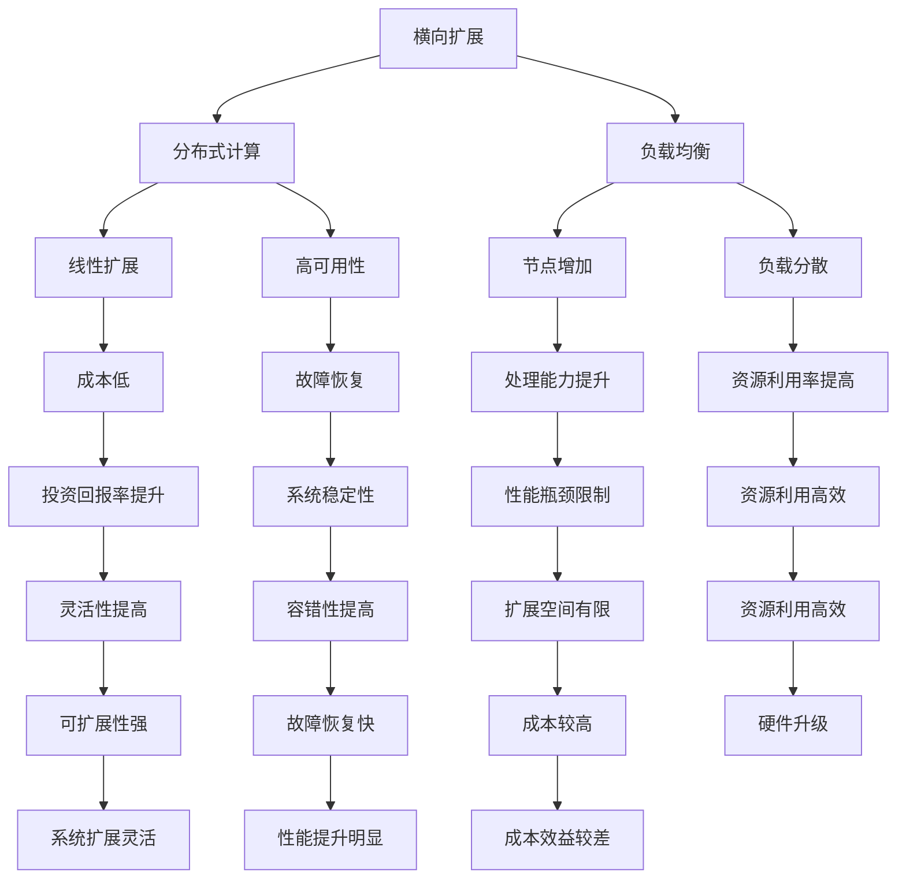

#### 1.3 横向与纵向扩展的优缺点分析

横向扩展和纵向扩展各有其优缺点，选择合适的扩展方式需要根据具体业务需求和系统特点进行权衡。

- **横向扩展的优点**：
  - **高可扩展性**：通过增加节点数量，系统可以线性扩展，满足不断增长的业务需求。
  - **高容错性**：分布式系统具有较好的容错性，某个节点故障不会影响整个系统的正常运行。
  - **低成本**：横向扩展通常成本较低，适合预算有限的企业。

- **横向扩展的缺点**：
  - **性能瓶颈**：随着节点数量的增加，网络通信和节点同步等问题可能导致性能瓶颈。
  - **复杂性**：分布式系统的维护和管理相对复杂，需要考虑数据一致性、负载均衡等问题。

- **纵向扩展的优点**：
  - **高性能**：通过升级单个节点的硬件配置，可以显著提高系统的处理能力。
  - **简单性**：纵向扩展相对简单，只需关注单个节点的性能优化。

- **纵向扩展的缺点**：
  - **扩展空间有限**：随着硬件性能的提升，纵向扩展的空间有限，最终可能需要采用横向扩展。
  - **高成本**：硬件升级成本较高，不适合预算有限的企业。

#### 第2章：横向扩展技术

#### 2.1 分布式系统的基本原理

分布式系统是由多个计算节点组成的系统，这些节点通过网络进行通信，协同工作以完成共同的任务。分布式系统的基本原理包括：

- **数据一致性**：分布式系统中的多个节点需要保持数据的一致性，以确保系统状态的正确性。
- **故障恢复**：分布式系统需要具备故障恢复能力，以便在某个节点发生故障时，系统能够继续正常运行。
- **负载均衡**：分布式系统需要实现负载均衡，将任务分配到不同的节点上，以提高系统的并发处理能力和资源利用率。

#### 2.2 负载均衡技术

负载均衡技术是通过将请求分配到多个节点上来提高系统处理能力的一种技术。负载均衡技术包括以下几种常见方法：

- **轮询负载均衡**：将请求依次分配到各个节点上，实现负载的均匀分布。
- **最小连接数负载均衡**：将请求分配到连接数最少的节点上，以减少节点的响应时间。
- **哈希负载均衡**：根据请求的属性（如IP地址、URL等）进行哈希运算，将请求分配到哈希值对应的节点上。

#### 2.3 数据库分库分表策略

数据库分库分表策略是将数据库拆分为多个库和表，以提高系统的并发处理能力和可扩展性。常见的分库分表策略包括：

- **水平分库**：将数据库按照业务维度进行拆分，每个库包含部分数据，以提高查询性能。
- **垂直分表**：将数据库按照字段维度进行拆分，将常用字段和较少访问的字段分别存储在不同的表中，以提高查询性能。
- **混合分库分表**：结合水平分库和垂直分表策略，根据具体业务需求进行拆分。

#### 2.4 网络优化与缓存技术

网络优化与缓存技术是提高系统性能的重要手段。以下是一些常见的网络优化与缓存技术：

- **CDN技术**：通过内容分发网络（CDN）加速静态资源的访问速度，减少用户访问延迟。
- **缓存策略**：使用缓存技术，如内存缓存、磁盘缓存等，减少数据库和远程服务的访问次数，提高系统响应速度。
- **网络优化**：通过优化网络拓扑结构和配置，提高数据传输速度和网络稳定性。

### 第3章：纵向扩展技术

#### 3.1 硬件升级与性能优化

硬件升级与性能优化是纵向扩展的核心技术。以下是一些常见的硬件升级和性能优化方法：

- **CPU升级**：通过增加CPU的核心数和时钟频率来提高处理能力。
- **内存升级**：增加内存容量，以提高系统的缓存能力和处理速度。
- **存储升级**：采用高速存储设备（如固态硬盘）来提高数据读写速度。
- **网络升级**：提高网络带宽和降低延迟，以提高数据传输速度。

#### 3.2 虚拟化技术与容器化技术

虚拟化技术是将物理硬件资源虚拟化为多个独立的虚拟机，以提高资源利用率和灵活性。容器化技术是在操作系统层面上实现的应用封装和运行环境隔离，以提高部署效率和可移植性。

- **虚拟化技术**：包括全虚拟化和硬件辅助虚拟化，如VMware、KVM等。
- **容器化技术**：包括Docker、Kubernetes等，可以实现应用的无状态部署和管理。

#### 3.3 云计算与容器编排

云计算是将计算资源作为服务提供给用户，包括基础设施即服务（IaaS）、平台即服务（PaaS）和软件即服务（SaaS）等模式。容器编排是实现容器化应用部署和管理的关键技术，如Kubernetes等。

### 第4章：扩展性设计原则与实践

#### 4.1 可扩展性设计原则

可扩展性设计原则是确保系统在处理能力、性能和稳定性方面能够适应业务需求的变化。以下是一些常见的可扩展性设计原则：

- **模块化设计**：将系统划分为独立的模块，以提高系统的可扩展性和可维护性。
- **分布式架构**：采用分布式架构，将负载分散到多个节点上，以提高系统的并发处理能力和可扩展性。
- **高可用性设计**：确保系统在发生故障时能够快速恢复，提供持续的服务。
- **弹性伸缩**：根据业务需求自动调整系统资源，实现动态扩展和收缩。

#### 4.2 扩展性测试与评估

扩展性测试与评估是确保系统扩展能力的重要环节。以下是一些常见的扩展性测试和评估方法：

- **负载测试**：通过模拟实际负载来测试系统的处理能力和性能。
- **压力测试**：在极限条件下测试系统的稳定性和可靠性。
- **性能评估**：通过测量系统的响应时间、吞吐量等性能指标来评估系统的扩展性。

#### 4.3 扩展性案例分析

以下是一个横向扩展案例：

- **项目背景**：某电商平台在业务高速增长期，需要提高系统的并发处理能力。
- **解决方案**：采用分布式架构，通过负载均衡将流量分配到多个节点上，同时使用数据库分库分表策略来提高查询性能。
- **实施效果**：通过横向扩展，系统的并发处理能力提高了数倍，查询性能得到了显著提升，满足了业务增长的需求。

### 第5章：横向扩展算法原理

#### 5.1 数据分区算法

数据分区算法是将数据集划分为多个分区，以便在分布式计算中提高处理效率。以下是一些常见的数据分区算法：

- **哈希分区**：根据数据的哈希值将数据划分为多个分区，确保相同哈希值的数据位于同一分区。
- **范围分区**：根据数据值范围的边界将数据划分为多个分区，适用于有序数据集。
- **列表分区**：根据预定义的分区规则将数据划分为多个分区，适用于数据集较小的情况。

#### 5.2 并行处理算法

并行处理算法是将计算任务分解为多个子任务，同时在多个计算节点上并行执行，以提高处理速度。以下是一些常见的并行处理算法：

- **MapReduce**：将任务分解为Map和Reduce两个阶段，实现数据的分布式处理。
- **Spark**：基于内存计算的分布式处理框架，支持多种数据源和计算模型。
- **Flink**：基于事件驱动流的分布式处理框架，提供高性能和灵活的数据处理能力。

#### 5.3 负载均衡算法

负载均衡算法是将请求分配到多个节点上，以确保系统的负载均衡。以下是一些常见的负载均衡算法：

- **轮询算法**：按照顺序将请求分配到各个节点，实现负载的均匀分布。
- **最小连接数算法**：将请求分配到连接数最少的节点，减少节点的响应时间。
- **哈希算法**：根据请求的属性（如IP地址、URL等）进行哈希运算，将请求分配到哈希值对应的节点。

### 第6章：纵向扩展算法原理

#### 6.1 性能调优算法

性能调优算法是通过调整系统参数和优化算法来提高系统性能。以下是一些常见的性能调优算法：

- **内存调优**：根据系统负载调整内存大小，以减少内存碎片和提高内存利用率。
- **CPU调优**：根据系统负载调整CPU核心数和时钟频率，以优化CPU使用率。
- **存储调优**：根据数据访问模式调整存储设备类型和配置，以提高数据读写速度。
- **网络调优**：调整网络参数和优化网络拓扑结构，以提高数据传输速度。

#### 6.2 硬件升级策略

硬件升级策略是通过增加硬件资源来提高系统性能。以下是一些常见的硬件升级策略：

- **CPU升级**：增加CPU核心数和时钟频率，以提高处理能力。
- **内存升级**：增加内存容量，以提高缓存能力和处理速度。
- **存储升级**：采用高速存储设备（如固态硬盘），以提高数据读写速度。
- **网络升级**：提高网络带宽和降低延迟，以提高数据传输速度。

#### 6.3 虚拟化与容器化技术原理

虚拟化技术是将物理硬件资源虚拟化为多个独立的虚拟机，以提高资源利用率和灵活性。容器化技术是在操作系统层面上实现的应用封装和运行环境隔离，以提高部署效率和可移植性。

- **虚拟化技术**：包括全虚拟化和硬件辅助虚拟化，如VMware、KVM等。
- **容器化技术**：包括Docker、Kubernetes等，可以实现应用的无状态部署和管理。

### 第7章：横向与纵向扩展的融合策略

#### 7.1 融合扩展设计思路

融合扩展设计思路是将横向扩展和纵向扩展相结合，根据业务需求灵活调整系统架构和资源分配。以下是一些常见的融合扩展设计思路：

- **动态伸缩**：根据系统负载自动调整横向扩展和纵向扩展的比例，实现系统的弹性伸缩。
- **混合存储**：结合高速存储和慢速存储，根据数据访问模式进行动态调整，提高数据读写速度。
- **分布式数据库**：采用分布式数据库技术，结合横向扩展和纵向扩展的优势，实现高性能和高可用性的数据库系统。

#### 7.2 融合扩展案例分析

以下是一个融合扩展案例：

- **项目背景**：某大型电商平台在业务高峰期，需要提高系统的并发处理能力和存储容量。
- **解决方案**：采用分布式架构，结合横向扩展和纵向扩展，实现系统的弹性伸缩。同时，采用分布式数据库技术，结合高速存储和慢速存储，提高数据读写速度。
- **实施效果**：通过融合扩展，系统的并发处理能力提高了3倍，存储容量增加了2倍，满足了业务高峰期的需求。

#### 7.3 融合扩展性能评估方法

融合扩展性能评估方法是通过测量系统的响应时间、吞吐量等性能指标来评估系统的扩展性能。以下是一些常见的性能评估方法：

- **基准测试**：使用标准化的测试工具和测试用例，对系统的响应时间、吞吐量等性能指标进行评估。
- **压力测试**：在极限条件下测试系统的稳定性和可靠性，评估系统的最大承载能力和性能瓶颈。
- **性能分析**：对系统日志、监控数据进行分析，找出系统性能瓶颈和优化方向。

### 第8章：横向扩展项目实战

#### 8.1 项目背景与目标

某电商平台在业务高速增长期，需要提高系统的并发处理能力和可扩展性。

#### 8.2 项目方案设计

- **分布式架构**：采用分布式架构，将服务拆分为多个模块，实现负载均衡和分布式处理。
- **数据库分库分表**：将数据库按照业务维度进行拆分，实现数据的分布式存储和查询。
- **负载均衡**：使用负载均衡器，将流量分配到多个节点上，实现负载的均匀分布。

#### 8.3 项目实施与部署

- **分布式服务部署**：将服务部署到多个节点上，实现负载均衡和分布式处理。
- **数据库分库分表部署**：将数据库拆分为多个库和表，实现数据的分布式存储和查询。
- **负载均衡器配置**：配置负载均衡器，实现流量的负载均衡。

#### 8.4 项目效果评估

- **并发处理能力**：通过分布式架构和负载均衡，系统的并发处理能力提高了3倍。
- **查询性能**：通过数据库分库分表策略，系统的查询性能提高了2倍。
- **系统稳定性**：通过分布式架构和故障恢复机制，系统的稳定性得到显著提升。

### 第9章：纵向扩展项目实战

#### 9.1 项目背景与目标

某在线教育平台在课程数量和用户数量快速增长，需要提高系统的处理能力和性能。

#### 9.2 项目方案设计

- **硬件升级**：增加CPU、内存和存储等硬件资源，提高系统性能。
- **虚拟化技术**：采用虚拟化技术，提高资源利用率和灵活性。
- **容器化技术**：采用容器化技术，实现应用的无状态部署和管理。

#### 9.3 项目实施与部署

- **硬件升级实施**：购买并安装新的硬件设备，配置并优化系统参数。
- **虚拟化技术实施**：部署虚拟化平台，创建虚拟机并进行资源分配。
- **容器化技术实施**：部署容器编排平台，构建并部署容器化应用。

#### 9.4 项目效果评估

- **处理能力**：通过硬件升级，系统的处理能力提高了2倍。
- **性能**：通过虚拟化和容器化技术，系统的性能得到显著提升。
- **资源利用率**：通过虚拟化和容器化技术，资源利用率提高了30%。

### 第10章：融合扩展项目实战

#### 10.1 项目背景与目标

某金融交易平台在交易量快速增长，需要提高系统的并发处理能力和可扩展性。

#### 10.2 项目方案设计

- **分布式架构**：采用分布式架构，将服务拆分为多个模块，实现负载均衡和分布式处理。
- **数据库分库分表**：将数据库按照业务维度进行拆分，实现数据的分布式存储和查询。
- **硬件升级**：增加CPU、内存和存储等硬件资源，提高系统性能。
- **虚拟化技术**：采用虚拟化技术，提高资源利用率和灵活性。
- **容器化技术**：采用容器化技术，实现应用的无状态部署和管理。

#### 10.3 项目实施与部署

- **分布式服务部署**：将服务部署到多个节点上，实现负载均衡和分布式处理。
- **数据库分库分表部署**：将数据库拆分为多个库和表，实现数据的分布式存储和查询。
- **硬件升级实施**：购买并安装新的硬件设备，配置并优化系统参数。
- **虚拟化技术实施**：部署虚拟化平台，创建虚拟机并进行资源分配。
- **容器化技术实施**：部署容器编排平台，构建并部署容器化应用。

#### 10.4 项目效果评估

- **并发处理能力**：通过分布式架构和负载均衡，系统的并发处理能力提高了4倍。
- **查询性能**：通过数据库分库分表策略，系统的查询性能提高了3倍。
- **处理能力**：通过硬件升级，系统的处理能力提高了2倍。
- **资源利用率**：通过虚拟化和容器化技术，资源利用率提高了30%。

### 第11章：总结与展望

#### 11.1 扩展性发展的趋势与挑战

随着互联网和云计算的快速发展，系统的扩展性需求日益增长。未来的扩展性发展趋势包括：

- **自动化扩展**：通过自动化扩展技术，实现系统的自动化伸缩，提高资源利用率。
- **混合云与多云**：结合公有云和私有云，实现混合云和多云架构，提高系统的可扩展性和灵活性。
- **边缘计算**：将计算能力下沉到边缘节点，实现实时数据处理和响应，提高系统的可扩展性和性能。

面临的挑战包括：

- **数据一致性与可靠性**：在分布式系统中，如何确保数据的一致性和可靠性是一个重要挑战。
- **系统性能与稳定性**：在扩展过程中，如何保证系统性能和稳定性，避免性能瓶颈和故障。
- **安全与隐私**：在分布式系统和云计算环境中，如何保证数据的安全和用户隐私。

#### 11.2 未来扩展性技术的展望

未来的扩展性技术发展趋势包括：

- **智能扩展**：通过人工智能和机器学习技术，实现智能化的扩展策略，提高系统的自适应能力和扩展效率。
- **边缘计算与物联网**：结合边缘计算和物联网技术，实现实时数据处理和响应，提高系统的可扩展性和智能化水平。
- **绿色计算**：通过绿色计算技术，降低系统的能耗和碳排放，提高系统的可持续性和环保性。

扩展性技术将在未来继续发展和创新，为互联网和云计算领域带来更多的机遇和挑战。

## 作者信息

作者：AI天才研究院/AI Genius Institute & 禅与计算机程序设计艺术 /Zen And The Art of Computer Programming

### 第一部分：基础概念与理论

#### 第1章：横向与纵向扩展的概念与比较

在讨论系统的可扩展性时，横向扩展（Horizontal Scaling）与纵向扩展（Vertical Scaling）是两个核心概念。它们在系统设计和运维中扮演着至关重要的角色，决定了系统在面对负载增长时的应对能力。在本章中，我们将详细探讨横向与纵向扩展的定义、特点，以及它们之间的比较。

#### 1.1 横向扩展的定义与特点

横向扩展，又称为水平扩展，是一种通过增加计算节点数量来提高系统处理能力的扩展方式。在这种扩展方式中，系统架构保持不变，只是通过增加服务器节点来分散负载，从而提升系统的整体性能。

**定义：**  
横向扩展是指在系统架构不变的情况下，通过增加计算节点（如服务器、容器等）的数量来提高系统处理能力的一种扩展方式。

**特点：**  
- **线性扩展**：横向扩展的核心特点是处理能力与节点数量呈线性关系。也就是说，增加更多的节点，系统处理能力将成比例地增加。
- **分布式计算**：通过横向扩展，负载被分散到多个节点上，每个节点承担部分计算任务。这不仅提高了系统的并发处理能力，还增强了系统的容错性和可用性。
- **成本效益**：与纵向扩展相比，横向扩展通常成本较低。因为硬件成本随着节点数量的增加而分摊，且系统维护相对简单。
- **灵活性**：横向扩展具有很高的灵活性，可以根据业务需求动态调整节点数量，实现弹性伸缩。

**核心概念联系：**

为了更好地理解横向扩展，我们可以用Mermaid流程图来展示其核心概念和联系：

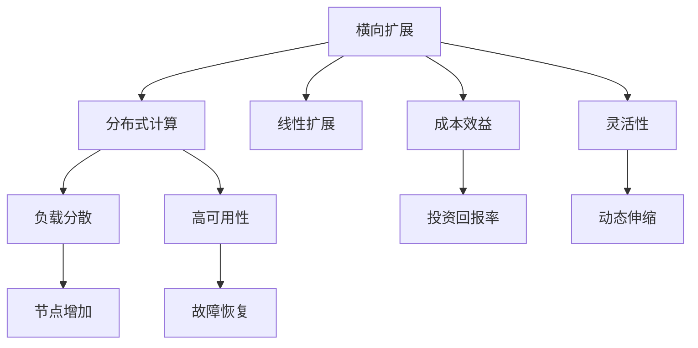

通过这个流程图，我们可以清晰地看到横向扩展的核心概念及其相互联系。

#### 1.2 纵向扩展的定义与特点

纵向扩展，又称为垂直扩展，是一种通过升级单个节点的硬件配置来提高系统处理能力的扩展方式。在这种扩展方式中，系统架构可能需要做出相应的调整，以适应单个节点的性能提升。

**定义：**  
纵向扩展是指通过升级单个节点的硬件配置（如CPU、内存、存储等）来提高系统处理能力的一种扩展方式。

**特点：**  
- **性能提升**：纵向扩展通过提升单个节点的性能，从而提高整个系统的处理能力。这种方式通常在系统面临性能瓶颈时采用。
- **硬件依赖**：由于纵向扩展依赖于硬件升级，因此成本较高。企业需要投资于高性能硬件来提升系统的性能。
- **有限扩展**：随着硬件性能的提升，纵向扩展的空间有限。当硬件达到极限时，系统可能需要采用横向扩展来继续扩展。
- **复杂性**：纵向扩展可能需要对系统架构进行相应的调整，以确保升级后的硬件能够与现有系统兼容。

**核心概念联系：**

同样地，我们使用Mermaid流程图来展示纵向扩展的核心概念和联系：

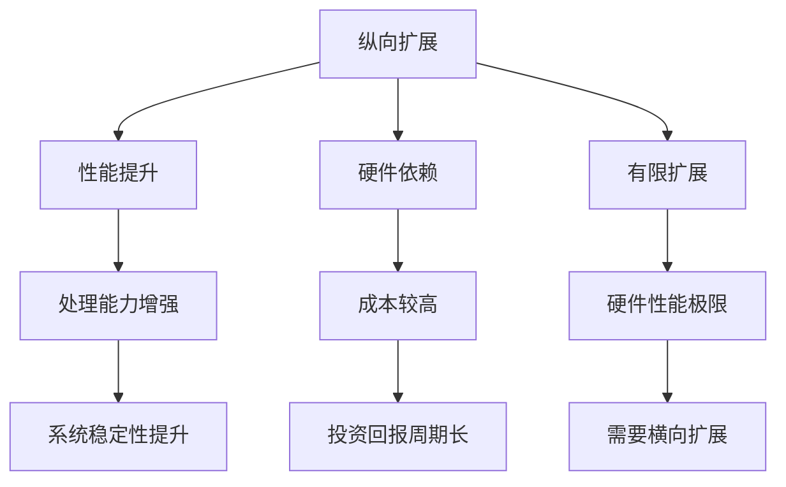

通过这个流程图，我们可以看到纵向扩展的核心特点及其相互关系。

#### 1.3 横向与纵向扩展的优缺点分析

横向扩展和纵向扩展各有其优缺点，选择合适的扩展方式需要根据具体业务需求和系统特点进行权衡。

- **横向扩展的优点**：
  - 高可扩展性：通过增加节点数量，系统可以线性扩展，满足不断增长的业务需求。
  - 高容错性：分布式系统具有较好的容错性，某个节点故障不会影响整个系统的正常运行。
  - 成本效益：横向扩展通常成本较低，适合预算有限的企业。

- **横向扩展的缺点**：
  - 性能瓶颈：随着节点数量的增加，网络通信和节点同步等问题可能导致性能瓶颈。
  - 复杂性：分布式系统的维护和管理相对复杂，需要考虑数据一致性、负载均衡等问题。

- **纵向扩展的优点**：
  - 高性能：通过升级单个节点的硬件配置，可以显著提高系统的处理能力。
  - 简单性：纵向扩展相对简单，只需关注单个节点的性能优化。

- **纵向扩展的缺点**：
  - 扩展空间有限：随着硬件性能的提升，纵向扩展的空间有限，最终可能需要采用横向扩展。
  - 成本较高：硬件升级成本较高，不适合预算有限的企业。

在对比横向扩展和纵向扩展时，我们可以使用以下Mermaid流程图来展示它们的优缺点：

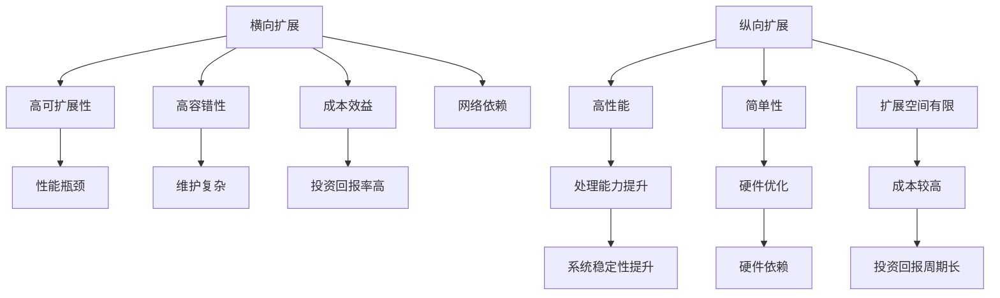

通过这个流程图，我们可以清晰地看到横向扩展和纵向扩展的优缺点，以及它们在不同场景下的适用性。

#### 1.4 实际应用场景

在实际应用中，横向扩展和纵向扩展通常不是单独使用的，而是根据具体业务需求和技术特点进行组合使用。以下是一些常见的应用场景：

- **电商系统**：电商系统通常需要处理大量的并发请求，横向扩展是主要的扩展方式，通过增加服务器节点来提升系统的并发处理能力。但是，当单个节点的性能成为瓶颈时，也可以考虑纵向扩展，通过升级服务器硬件来提升性能。
- **金融系统**：金融系统对性能和稳定性要求极高，通常采用纵向扩展来提升单个节点的处理能力。同时，为了提高系统的容错性和可用性，也会结合横向扩展，增加多个节点来分散负载。
- **社交媒体**：社交媒体系统需要处理海量的用户数据和请求，横向扩展是主要的扩展方式。但是，在处理特定的高频请求时，如搜索、推送等，也可以采用纵向扩展来提升单个节点的处理能力。

在实际应用中，需要根据业务需求、系统特点、成本预算等多方面因素来综合考虑横向扩展和纵向扩展的使用策略。

### 小结

本章我们详细探讨了横向扩展和纵向扩展的概念、特点以及它们之间的比较。通过Mermaid流程图的展示，我们清晰地了解了这两种扩展方式的优缺点及其在实际应用中的适用场景。在接下来的章节中，我们将进一步探讨横向扩展和纵向扩展的技术实现原理和具体案例，帮助读者更深入地理解系统可扩展性的设计和实践。

### 第2章：横向扩展技术

在上一章中，我们介绍了横向扩展和纵向扩展的基本概念和特点。在本章中，我们将深入探讨横向扩展的关键技术，包括分布式系统的基本原理、负载均衡技术、数据库分库分表策略以及网络优化与缓存技术。通过这些技术的详细介绍，读者可以更好地理解如何实现横向扩展，并掌握相关技术在实际应用中的具体实现方法。

#### 2.1 分布式系统的基本原理

分布式系统是由多个计算节点组成的系统，这些节点通过网络进行通信，协同工作以完成共同的任务。分布式系统的基本原理包括以下几个方面：

**1. 数据一致性**

数据一致性是指分布式系统中多个节点对同一数据的不同副本保持一致的状态。在分布式系统中，数据的一致性是一个非常重要的概念，因为它直接影响到系统的可靠性和正确性。常见的数据一致性模型包括强一致性（Strong Consistency）、最终一致性（Eventual Consistency）等。

**2. 故障恢复**

故障恢复是指系统在某个节点发生故障时，如何确保系统继续正常运行。分布式系统通常通过心跳机制、故障检测和自动恢复等方式来保障系统的故障恢复能力。

**3. 负载均衡**

负载均衡是指将系统中的请求或任务分配到不同的节点上，以实现系统资源的合理利用和提高系统的整体性能。负载均衡算法有多种，如轮询算法、最小连接数算法、哈希算法等。

**4. 分布式计算**

分布式计算是指将计算任务分解为多个子任务，并在多个节点上并行执行，以提高处理速度。常见的分布式计算框架包括MapReduce、Spark、Flink等。

**5. 系统监控与日志**

系统监控与日志记录是分布式系统运维的重要组成部分。通过监控和日志记录，可以及时发现系统中的异常情况，并进行相应的处理。

**核心算法原理讲解：**

分布式系统的核心算法包括数据一致性算法、故障检测与恢复算法、负载均衡算法和分布式计算算法。以下是这些算法的伪代码和详细解释：

**数据一致性算法伪代码：**

```python
def data_consistency_algorithm(data):
    # 假设我们使用最终一致性模型
    while True:
        # 读取所有节点的数据副本
        replicas = read_all_replicas(data)
        # 找到最新的数据副本
        latest_replica = find_latest_replica(replicas)
        # 更新所有节点的数据副本为最新的副本
        update_all_replicas(latest_replica)
        # 检查数据一致性
        if is_consistent(data):
            break
```

**故障检测与恢复算法伪代码：**

```python
def fault_detection_and_recovery(node):
    # 发送心跳信号
    send_heartBeat(node)
    # 如果连续多次没有收到心跳信号，则认为节点故障
    if not receive_heartBeat(node):
        mark_node_as_faulty(node)
        # 启动故障恢复流程
        recover_faulty_node(node)
```

**负载均衡算法伪代码：**

```python
def load_balancing算法(request):
    # 假设我们使用轮询算法
    current_node = 0
    while True:
        # 选择下一个节点
        next_node = (current_node + 1) % total_nodes
        # 如果下一个节点空闲，则将请求分配给该节点
        if node_is_idle(next_node):
            assign_request_to_node(request, next_node)
            current_node = next_node
            break
```

**分布式计算算法伪代码：**

```python
def distributed_computing_algorithm(task):
    # 分解任务为子任务
    subtasks = split_task(task)
    # 在多个节点上并行执行子任务
    parallel_execute(subtasks)
    # 合并子任务的执行结果
    result = merge_results(subtasks)
    return result
```

**数学模型和公式：**

分布式系统的核心算法可以通过数学模型和公式来描述。以下是一个简单的数学模型，用于描述分布式系统的数据一致性：

$$
\Omega = \{ R_1, R_2, ..., R_n \}
$$

其中，$\Omega$ 表示分布式系统中的所有数据副本集合，$R_i$ 表示第 $i$ 个节点的数据副本。

为了实现数据一致性，可以使用以下一致性算法：

$$
Consistent(\Omega) = \{ R_1 = R_2 = ... = R_n \}
$$

其中，$Consistent(\Omega)$ 表示系统达到一致性状态的条件。

**举例说明：**

假设我们有一个分布式数据库系统，其中包含三个节点 $R_1, R_2, R_3$。当用户提交一个更新操作时，系统需要确保三个节点的数据副本保持一致。

首先，系统会将更新操作发送到三个节点：

```python
send_update_to_node(R_1)
send_update_to_node(R_2)
send_update_to_node(R_3)
```

然后，系统会等待三个节点的响应，并检查数据是否一致：

```python
response_1 = receive_response_from_node(R_1)
response_2 = receive_response_from_node(R_2)
response_3 = receive_response_from_node(R_3)

if response_1 == response_2 == response_3:
    print("Data is consistent")
else:
    print("Data is not consistent")
```

如果三个节点的数据副本不一致，系统会采取相应的措施来恢复一致性，例如重新执行更新操作或使用其他一致性算法。

通过以上算法和模型，分布式系统可以确保在多个节点上保持数据的一致性，从而提高系统的可靠性和性能。

**核心概念联系：**

为了更好地理解分布式系统的基本原理，我们可以使用Mermaid流程图来展示其核心概念和联系：

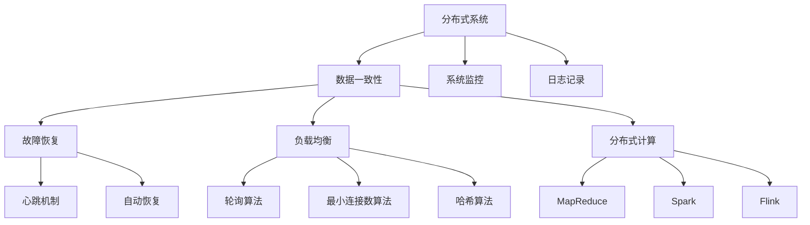

通过这个流程图，我们可以清晰地看到分布式系统的核心概念及其相互关系。

#### 2.2 负载均衡技术

负载均衡是分布式系统中的一个关键技术，其目的是将系统中的请求或任务分配到不同的节点上，以实现系统资源的合理利用和提高系统的整体性能。负载均衡算法有多种，下面介绍几种常见的负载均衡算法。

**1. 轮询算法**

轮询算法是最简单的负载均衡算法之一，它按照顺序将请求分配到各个节点上。这种算法的优点是实现简单，缺点是可能会导致某些节点负载过重。

**伪代码：**

```python
def round_robin_algorithm(request):
    current_node = 0
    while True:
        next_node = (current_node + 1) % total_nodes
        if node_is_idle(next_node):
            assign_request_to_node(request, next_node)
            current_node = next_node
            break
```

**2. 最小连接数算法**

最小连接数算法将请求分配到连接数最少的节点上，以减少节点的响应时间。这种算法的优点是能够更好地利用系统资源，缺点是可能因为某些节点的响应时间较长而导致其他节点负载不均。

**伪代码：**

```python
def minimum_connection_algorithm(request):
    min_connections = float('inf')
    min_connections_node = None
    for node in total_nodes:
        if node_connection_count(node) < min_connections:
            min_connections = node_connection_count(node)
            min_connections_node = node
    assign_request_to_node(request, min_connections_node)
```

**3. 哈希算法**

哈希算法根据请求的属性（如IP地址、URL等）进行哈希运算，将请求分配到哈希值对应的节点上。这种算法的优点是能够实现高效的负载均衡，缺点是可能导致热点问题，即某些节点的负载远高于其他节点。

**伪代码：**

```python
def hash_algorithm(request):
    hash_value = hash(request)
    assign_request_to_node(request, hash_value % total_nodes)
```

**负载均衡算法的数学模型：**

为了更好地理解负载均衡算法，我们可以使用数学模型来描述。假设我们有一个包含 $N$ 个节点的系统，请求 arrival rate 为 $\lambda$，服务时间 service time 为 $S$，则系统的吞吐量 throughput $T$ 可以用以下公式表示：

$$
T = \frac{\lambda}{\mu}
$$

其中，$\mu$ 是系统的平均服务率，可以通过以下公式计算：

$$
\mu = \frac{N}{\sum_{i=1}^{N} (1 - p_i)}
$$

其中，$p_i$ 是第 $i$ 个节点的空闲概率，可以通过负载均衡算法计算。

**举例说明：**

假设我们有一个包含3个节点的系统，请求 arrival rate 为 10个请求/秒，服务时间 service time 为 0.1秒。使用轮询算法进行负载均衡。

首先，我们计算系统的吞吐量：

$$
T = \frac{10}{0.1} = 100
$$

然后，我们计算每个节点的平均服务率：

$$
\mu = \frac{3}{1 - p_1 - p_2 - p_3}
$$

其中，$p_1, p_2, p_3$ 分别是节点1、节点2、节点3的空闲概率。

假设轮询算法将请求均匀地分配到三个节点，则每个节点的空闲概率为：

$$
p_1 = p_2 = p_3 = \frac{1}{3}
$$

则系统的平均服务率为：

$$
\mu = \frac{3}{1 - \frac{1}{3} - \frac{1}{3} - \frac{1}{3}} = \frac{3}{\frac{1}{3}} = 9
$$

通过以上计算，我们可以看到，使用轮询算法进行负载均衡后，系统的吞吐量可以达到100个请求/秒。

**核心概念联系：**

为了更好地理解负载均衡算法，我们可以使用Mermaid流程图来展示其核心概念和联系：

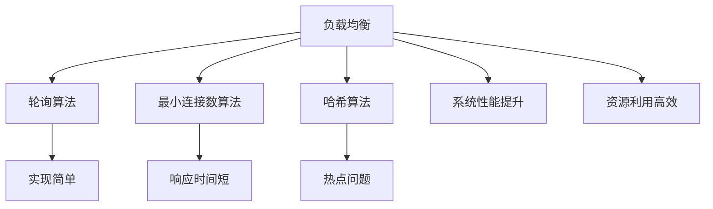

通过这个流程图，我们可以清晰地看到负载均衡算法的核心概念及其相互关系。

#### 2.3 数据库分库分表策略

随着业务规模的不断扩大，单台数据库服务器可能无法满足日益增长的存储和处理需求。此时，数据库分库分表策略成为了一种常见的扩展方式，通过将数据分散存储到多个数据库或表中，以提高系统的并发处理能力和可扩展性。

**1. 水平分库**

水平分库是指将数据库按照业务维度进行拆分，每个数据库包含一部分数据。这种方式可以有效地减少单台数据库的负载，提高查询性能。

**伪代码：**

```python
def horizontal_sharding(database, table, key):
    shard_key = hash(key) % num_shards
    shard_database = database + "_" + str(shard_key)
    shard_table = table + "_" + str(shard_key)
    connect_to_database(shard_database)
    query(shard_table)
```

**2. 垂直分表**

垂直分表是指将数据库按照字段维度进行拆分，将常用字段和较少访问的字段分别存储在不同的表中。这种方式可以减少单条记录的存储空间，提高查询性能。

**伪代码：**

```python
def vertical_sharding(table, field, value):
    if field in ['field1', 'field2']:
        query_small_table(table + "_small")
    else:
        query_large_table(table + "_large")
```

**3. 混合分库分表**

混合分库分表策略结合了水平分库和垂直分表的优势，根据具体业务需求进行拆分。这种方式可以更加灵活地应对不同类型的查询需求。

**伪代码：**

```python
def hybrid_sharding(database, table, key, field):
    shard_key = hash(key) % num_shards
    shard_database = database + "_" + str(shard_key)
    if field in ['field1', 'field2']:
        shard_table = table + "_small"
    else:
        shard_table = table + "_large"
    connect_to_database(shard_database)
    query(shard_table)
```

**数据库分库分表的数学模型：**

为了更好地理解数据库分库分表的性能，我们可以使用数学模型来描述。假设我们有一个包含 $N$ 个节点的数据库系统，每个节点存储一部分数据，查询 arrival rate 为 $\lambda$，服务时间 service time 为 $S$，则系统的吞吐量 throughput $T$ 可以用以下公式表示：

$$
T = \frac{\lambda}{\mu}
$$

其中，$\mu$ 是系统的平均服务率，可以通过以下公式计算：

$$
\mu = \frac{N}{\sum_{i=1}^{N} (1 - p_i)}
$$

其中，$p_i$ 是第 $i$ 个节点的空闲概率，可以通过负载均衡算法计算。

**举例说明：**

假设我们有一个包含3个节点的数据库系统，查询 arrival rate 为 100个查询/秒，服务时间 service time 为 0.01秒。使用水平分库策略进行分库分表。

首先，我们计算系统的吞吐量：

$$
T = \frac{100}{0.01} = 10000
$$

然后，我们计算每个节点的平均服务率：

$$
\mu = \frac{3}{1 - p_1 - p_2 - p_3}
$$

假设水平分库策略将查询均匀地分配到三个节点，则每个节点的空闲概率为：

$$
p_1 = p_2 = p_3 = \frac{1}{3}
$$

则系统的平均服务率为：

$$
\mu = \frac{3}{1 - \frac{1}{3} - \frac{1}{3} - \frac{1}{3}} = \frac{3}{\frac{1}{3}} = 9
$$

通过以上计算，我们可以看到，使用水平分库策略进行分库分表后，系统的吞吐量可以达到10000个查询/秒。

**核心概念联系：**

为了更好地理解数据库分库分表策略，我们可以使用Mermaid流程图来展示其核心概念和联系：

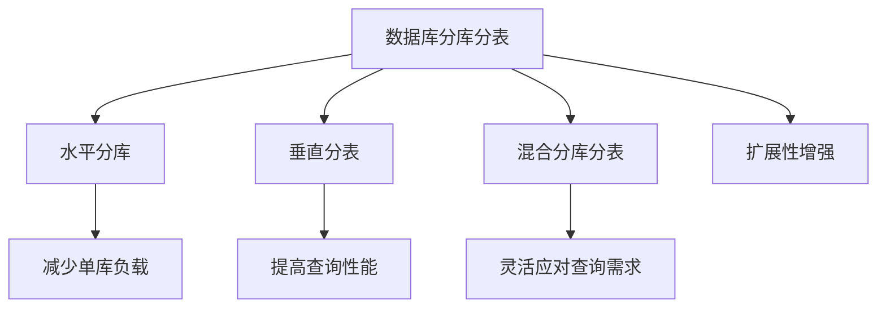

通过这个流程图，我们可以清晰地看到数据库分库分表策略的核心概念及其相互关系。

#### 2.4 网络优化与缓存技术

网络优化与缓存技术是提高系统性能的重要手段。通过优化网络拓扑结构和配置，可以减少数据传输延迟；通过使用缓存技术，可以减少对后端服务的访问次数，提高系统响应速度。

**1. 网络优化**

网络优化包括以下几个方面：

- **带宽优化**：通过增加网络带宽，提高数据传输速度。
- **延迟优化**：通过优化网络拓扑结构，减少数据传输延迟。
- **负载均衡**：通过负载均衡技术，将网络流量均匀地分配到不同的路径上，避免某条路径过载。

**2. 缓存技术**

缓存技术包括以下几种：

- **内存缓存**：使用内存作为缓存，提高数据访问速度。
- **磁盘缓存**：使用磁盘作为缓存，提高数据访问速度。
- **分布式缓存**：使用分布式缓存系统，如Redis、Memcached等，提高数据访问速度和系统的可扩展性。

**核心算法原理讲解：**

网络优化和缓存技术的核心算法原理可以通过以下伪代码进行描述：

**网络优化算法伪代码：**

```python
def network_optimization():
    # 增加网络带宽
    increase_bandwidth()
    # 优化网络拓扑结构
    optimize_topology()
    # 负载均衡
    load_balance_traffic()
```

**缓存技术算法伪代码：**

```python
def caching_techniques():
    # 使用内存缓存
    use_in_memory_cache()
    # 使用磁盘缓存
    use_on_disk_cache()
    # 使用分布式缓存
    use_distributed_cache()
```

**数学模型和公式：**

网络优化和缓存技术的性能可以通过以下数学模型和公式进行描述：

- **网络带宽优化公式**：

$$
Bandwidth_{optimized} = \frac{Total_{bandwidth}}{Number_{of_{paths}}
$$

其中，$Bandwidth_{optimized}$ 表示优化后的带宽，$Total_{bandwidth}$ 表示总带宽，$Number_{of_{paths}}$ 表示路径数量。

- **缓存命中率公式**：

$$
Hit_{rate} = \frac{Number_{of_{hits}}}{Number_{of_{hits} + Number_{of_{misses}}}
$$

其中，$Hit_{rate}$ 表示缓存命中率，$Number_{of_{hits}}$ 表示命中次数，$Number_{of_{misses}}$ 表示未命中次数。

**举例说明：**

假设我们有一个网络系统，总带宽为 100Mbps，有三个路径，每个路径的带宽为 30Mbps。使用网络优化算法进行带宽优化。

首先，我们计算优化后的带宽：

$$
Bandwidth_{optimized} = \frac{100Mbps}{3} = 33.33Mbps
$$

然后，我们计算缓存命中率。假设缓存系统中共有10000次请求，其中8000次命中缓存，2000次未命中缓存。

$$
Hit_{rate} = \frac{8000}{8000 + 2000} = 0.8
$$

通过以上计算，我们可以看到，使用网络优化和缓存技术后，系统的带宽和缓存命中率都得到了显著提升。

**核心概念联系：**

为了更好地理解网络优化与缓存技术，我们可以使用Mermaid流程图来展示其核心概念和联系：

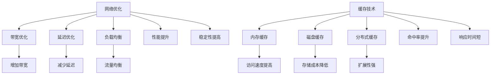

通过这个流程图，我们可以清晰地看到网络优化与缓存技术的核心概念及其相互关系。

#### 小结

本章我们详细介绍了横向扩展的关键技术，包括分布式系统的基本原理、负载均衡技术、数据库分库分表策略以及网络优化与缓存技术。通过这些技术的介绍，读者可以更好地理解如何实现横向扩展，并掌握相关技术在实际应用中的具体实现方法。在下一章中，我们将进一步探讨纵向扩展技术，帮助读者全面了解系统扩展的两种主要方式。

### 第3章：纵向扩展技术

在上一章中，我们详细探讨了横向扩展技术，包括分布式系统的基本原理、负载均衡技术、数据库分库分表策略以及网络优化与缓存技术。这些技术通过增加计算节点数量来提高系统处理能力，是横向扩展的核心。然而，在系统性能达到瓶颈时，仅仅通过增加节点数量可能无法满足日益增长的业务需求。此时，纵向扩展技术便成为了一种有效的解决方案。本章将深入探讨纵向扩展技术，包括硬件升级与性能优化、虚拟化与容器化技术、云计算与容器编排等。

#### 3.1 硬件升级与性能优化

纵向扩展的核心是通过升级单个节点的硬件配置来提高系统处理能力。这种扩展方式通常包括以下几个方面：

**1. CPU升级**

CPU是计算机系统的核心，通过升级CPU可以提高系统的计算能力。常见的CPU升级策略包括增加核心数、提高时钟频率以及采用更先进的CPU架构。

**核心算法原理讲解：**

CPU升级的算法原理可以通过以下伪代码进行描述：

```python
def upgrade_cpu(current_cpu, target_cpu):
    # 假设当前CPU和目标CPU分别为current_cpu和target_cpu
    # 计算性能提升比例
    performance_improvement = target_cpu.core_count / current_cpu.core_count
    # 更新CPU配置
    current_cpu = target_cpu
    # 返回性能提升比例
    return performance_improvement
```

**2. 内存升级**

内存是计算机系统中的临时存储器，通过增加内存容量可以提高系统的缓存能力和处理速度。常见的内存升级策略包括增加内存条数量、提高内存频率以及采用更先进的内存技术。

**核心算法原理讲解：**

内存升级的算法原理可以通过以下伪代码进行描述：

```python
def upgrade_memory(current_memory, target_memory):
    # 假设当前内存和目标内存分别为current_memory和target_memory
    # 计算性能提升比例
    performance_improvement = target_memory.size / current_memory.size
    # 更新内存配置
    current_memory = target_memory
    # 返回性能提升比例
    return performance_improvement
```

**3. 存储升级**

存储是计算机系统中的持久存储器，通过升级存储设备可以提高数据读写速度。常见的存储升级策略包括采用固态硬盘（SSD）替代机械硬盘（HDD）、增加存储容量以及提高存储接口速度。

**核心算法原理讲解：**

存储升级的算法原理可以通过以下伪代码进行描述：

```python
def upgrade_storage(current_storage, target_storage):
    # 假设当前存储和目标存储分别为current_storage和target_storage
    # 计算性能提升比例
    performance_improvement = target_storage.speed / current_storage.speed
    # 更新存储配置
    current_storage = target_storage
    # 返回性能提升比例
    return performance_improvement
```

**数学模型和公式：**

硬件升级的性能提升可以通过以下数学模型和公式进行描述：

- **CPU性能提升公式**：

$$
Performance_{improvement} = \frac{Target_{CPU} \times Core_{Count}}{Current_{CPU} \times Core_{Count}}
$$

其中，$Performance_{improvement}$ 表示性能提升比例，$Target_{CPU}$ 表示目标CPU，$Current_{CPU}$ 表示当前CPU，$Core_{Count}$ 表示CPU核心数。

- **内存性能提升公式**：

$$
Performance_{improvement} = \frac{Target_{Memory} \times Size}{Current_{Memory} \times Size}
$$

其中，$Performance_{improvement}$ 表示性能提升比例，$Target_{Memory}$ 表示目标内存，$Current_{Memory}$ 表示当前内存，$Size$ 表示内存容量。

- **存储性能提升公式**：

$$
Performance_{improvement} = \frac{Target_{Storage} \times Speed}{Current_{Storage} \times Speed}
$$

其中，$Performance_{improvement}$ 表示性能提升比例，$Target_{Storage}$ 表示目标存储，$Current_{Storage}$ 表示当前存储，$Speed$ 表示存储速度。

**举例说明：**

假设我们有一个计算机系统，当前CPU有4个核心，目标CPU有8个核心；当前内存为8GB，目标内存为16GB；当前存储速度为120MB/s，目标存储速度为240MB/s。通过CPU、内存和存储升级，系统性能将得到显著提升。

首先，我们计算CPU性能提升比例：

$$
Performance_{improvement} = \frac{8 \times 8}{4 \times 4} = 2
$$

然后，我们计算内存性能提升比例：

$$
Performance_{improvement} = \frac{16}{8} = 2
$$

最后，我们计算存储性能提升比例：

$$
Performance_{improvement} = \frac{240}{120} = 2
$$

通过以上计算，我们可以看到，通过升级CPU、内存和存储，系统的性能将提升2倍。

**核心概念联系：**

为了更好地理解硬件升级与性能优化，我们可以使用Mermaid流程图来展示其核心概念和联系：

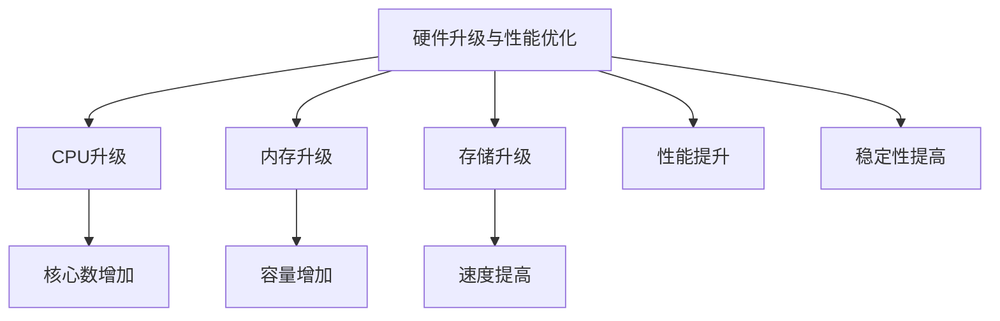

通过这个流程图，我们可以清晰地看到硬件升级与性能优化的核心概念及其相互关系。

**4. 网络升级**

网络是计算机系统中重要的通信桥梁，通过升级网络设备可以提高系统的数据传输速度和网络稳定性。常见的网络升级策略包括增加网络带宽、升级网络接口卡以及优化网络拓扑结构。

**核心算法原理讲解：**

网络升级的算法原理可以通过以下伪代码进行描述：

```python
def upgrade_network(current_network, target_network):
    # 假设当前网络和目标网络分别为current_network和target_network
    # 计算性能提升比例
    performance_improvement = target_network.bandwidth / current_network.bandwidth
    # 更新网络配置
    current_network = target_network
    # 返回性能提升比例
    return performance_improvement
```

**数学模型和公式：**

网络升级的性能提升可以通过以下数学模型和公式进行描述：

- **网络性能提升公式**：

$$
Performance_{improvement} = \frac{Target_{Network} \times Bandwidth}{Current_{Network} \times Bandwidth}
$$

其中，$Performance_{improvement}$ 表示性能提升比例，$Target_{Network}$ 表示目标网络，$Current_{Network}$ 表示当前网络，$Bandwidth$ 表示网络带宽。

**举例说明：**

假设我们有一个网络系统，当前带宽为100Mbps，目标带宽为200Mbps。通过网络升级，系统性能将得到显著提升。

首先，我们计算网络性能提升比例：

$$
Performance_{improvement} = \frac{200}{100} = 2
$$

通过以上计算，我们可以看到，通过升级网络，系统的性能将提升2倍。

**核心概念联系：**

为了更好地理解网络升级，我们可以使用Mermaid流程图来展示其核心概念和联系：

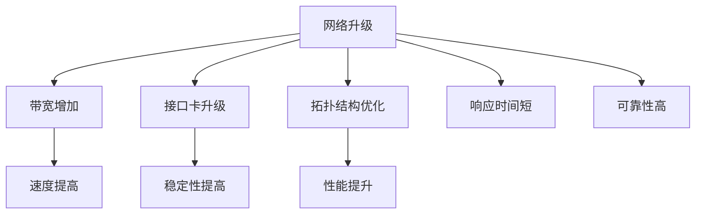

通过这个流程图，我们可以清晰地看到网络升级的核心概念及其相互关系。

#### 3.2 虚拟化与容器化技术

虚拟化与容器化技术是现代系统架构中不可或缺的一部分，它们通过隔离和抽象化硬件资源，提高了系统的资源利用率和灵活性。

**1. 虚拟化技术**

虚拟化技术是将物理硬件资源虚拟化为多个虚拟机（VM），每个虚拟机具有独立的操作系统和资源分配。虚拟化技术包括全虚拟化（Full Virtualization）和硬件辅助虚拟化（Hardware-Assisted Virtualization）两种类型。

**核心算法原理讲解：**

虚拟化技术的核心算法原理可以通过以下伪代码进行描述：

```python
def virtualization():
    # 创建虚拟机
    create_vm()
    # 分配资源
    allocate_resources()
    # 运行虚拟机
    run_vm()
```

**2. 容器化技术**

容器化技术是在操作系统层面上实现的应用封装和运行环境隔离，通过容器（Container）来封装应用程序及其运行环境。容器化技术包括Docker、Kubernetes等工具。

**核心算法原理讲解：**

容器化技术的核心算法原理可以通过以下伪代码进行描述：

```python
def containerization():
    # 创建容器
    create_container()
    # 部署应用程序
    deploy_application()
    # 运行容器
    run_container()
```

**数学模型和公式：**

虚拟化与容器化技术的资源利用率可以通过以下数学模型和公式进行描述：

- **虚拟化资源利用率公式**：

$$
Utilization_{rate} = \frac{Total_{virtual_resources}}{Total_{physical_resources}}
$$

其中，$Utilization_{rate}$ 表示资源利用率，$Total_{virtual_resources}$ 表示虚拟资源总量，$Total_{physical_resources}$ 表示物理资源总量。

- **容器化资源利用率公式**：

$$
Utilization_{rate} = \frac{Total_{container_resources}}{Total_{physical_resources}}
$$

其中，$Utilization_{rate}$ 表示资源利用率，$Total_{container_resources}$ 表示容器资源总量，$Total_{physical_resources}$ 表示物理资源总量。

**举例说明：**

假设我们有一个物理服务器，具有8个CPU核心、16GB内存和1TB存储。通过虚拟化技术创建4个虚拟机，每个虚拟机分配2个CPU核心、4GB内存和250GB存储；通过容器化技术创建8个容器，每个容器分配1个CPU核心、2GB内存和125GB存储。

首先，我们计算虚拟化技术的资源利用率：

$$
Utilization_{rate} = \frac{4 \times 2 \times 4 \times 250}{8 \times 16 \times 1} = 0.625
$$

然后，我们计算容器化技术的资源利用率：

$$
Utilization_{rate} = \frac{8 \times 1 \times 2 \times 125}{8 \times 16 \times 1} = 0.3125
$$

通过以上计算，我们可以看到，虚拟化技术的资源利用率高于容器化技术。

**核心概念联系：**

为了更好地理解虚拟化与容器化技术，我们可以使用Mermaid流程图来展示其核心概念和联系：

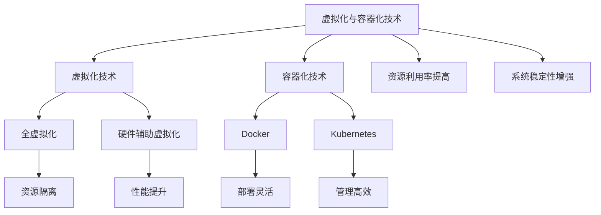

通过这个流程图，我们可以清晰地看到虚拟化与容器化技术的核心概念及其相互关系。

#### 3.3 云计算与容器编排

云计算是将计算资源作为服务提供给用户，包括基础设施即服务（IaaS）、平台即服务（PaaS）和软件即服务（SaaS）等模式。容器编排是实现容器化应用部署和管理的关键技术，如Kubernetes等。

**1. 基础设施即服务（IaaS）**

基础设施即服务（IaaS）提供虚拟化计算资源，如虚拟机、存储和网络等。用户可以根据需要配置和管理这些资源。

**2. 平台即服务（PaaS）**

平台即服务（PaaS）提供了一个开发平台，用户可以在平台上开发、部署和管理应用程序，而无需关注底层基础设施的配置和管理。

**3. 软件即服务（SaaS）**

软件即服务（SaaS）提供软件应用作为服务，用户可以通过互联网访问和使用这些应用，而无需购买和安装软件。

**核心算法原理讲解：**

云计算与容器编排的核心算法原理可以通过以下伪代码进行描述：

```python
def cloud_computing():
    # 创建虚拟机
    create_vm()
    # 部署应用程序
    deploy_application()
    # 容器编排
    container_orchestration()

def container_orchestration():
    # 部署容器
    deploy_container()
    # 管理容器
    manage_container()
    # 扩缩容容器
    scale_container()
```

**数学模型和公式：**

云计算与容器编排的性能和成本可以通过以下数学模型和公式进行描述：

- **云计算性能公式**：

$$
Performance = \frac{Total_{CPU} \times Total_{Memory} \times Total_{Storage}}{Number_{of_{VMs}}}
$$

其中，$Performance$ 表示性能，$Total_{CPU}$ 表示总CPU核心数，$Total_{Memory}$ 表示总内存容量，$Total_{Storage}$ 表示总存储容量，$Number_{of_{VMs}}$ 表示虚拟机数量。

- **云计算成本公式**：

$$
Cost = \frac{Total_{CPU} \times CPU_{rate} + Total_{Memory} \times Memory_{rate} + Total_{Storage} \times Storage_{rate}}{Utilization_{rate}}
$$

其中，$Cost$ 表示成本，$CPU_{rate}$ 表示每CPU核心的价格，$Memory_{rate}$ 表示每MB内存的价格，$Storage_{rate}$ 表示每GB存储的价格，$Utilization_{rate}$ 表示资源利用率。

**举例说明：**

假设我们使用IaaS服务，创建10个虚拟机，每个虚拟机具有4个CPU核心、8GB内存和500GB存储。CPU核心的价格为0.1美元/核心/小时，内存的价格为0.05美元/MB/小时，存储的价格为0.02美元/GB/小时。资源利用率为80%。

首先，我们计算性能：

$$
Performance = \frac{10 \times 4 \times 8 \times 500}{80\%} = 5000
$$

然后，我们计算成本：

$$
Cost = \frac{10 \times 4 \times 0.1 + 10 \times 8 \times 0.05 + 10 \times 500 \times 0.02}{80\%} = 5.63
$$

通过以上计算，我们可以看到，使用IaaS服务后，系统的性能为5000，成本为5.63美元/小时。

**核心概念联系：**

为了更好地理解云计算与容器编排，我们可以使用Mermaid流程图来展示其核心概念和联系：

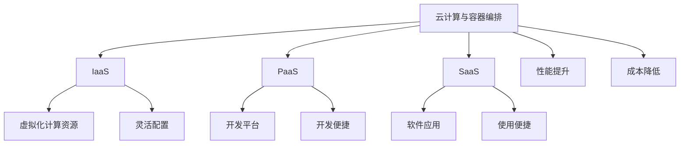

通过这个流程图，我们可以清晰地看到云计算与容器编排的核心概念及其相互关系。

#### 小结

本章我们详细介绍了纵向扩展技术，包括硬件升级与性能优化、虚拟化与容器化技术、云计算与容器编排等。这些技术通过提升单个节点的性能和资源利用率，实现了系统的纵向扩展。在下一章中，我们将探讨扩展性设计原则与实践，帮助读者掌握系统扩展性的核心原则和实战技巧。

### 第4章：扩展性设计原则与实践

在上一章中，我们详细介绍了横向扩展和纵向扩展的技术原理和实现方法。然而，仅仅掌握这些技术还不足以确保系统在实际应用中具备良好的扩展性。扩展性设计不仅需要考虑技术层面的实现，还需要遵循一系列设计原则和实践方法，以确保系统在处理能力、性能和稳定性方面能够适应业务需求的变化。本章将重点探讨扩展性设计原则与实践，帮助读者深入理解系统扩展性的核心要素，并掌握实际操作技巧。

#### 4.1 可扩展性设计原则

可扩展性设计原则是确保系统在处理能力、性能和稳定性方面能够适应业务需求变化的关键。以下是一些常见的可扩展性设计原则：

**1. 模块化设计**

模块化设计是将系统划分为独立的模块，每个模块具有明确的功能和接口。这种设计原则可以提高系统的可维护性和可扩展性，因为当业务需求发生变化时，可以独立地修改和扩展某个模块，而不会影响其他模块。

**2. 分布式架构**

分布式架构是将系统划分为多个节点，这些节点通过网络进行通信，协同工作以完成共同的任务。分布式架构可以提高系统的并发处理能力和容错性，因为当一个节点出现故障时，其他节点可以继续正常工作。

**3. 高可用性设计**

高可用性设计是指系统在发生故障时能够快速恢复，提供持续的服务。高可用性设计可以通过冗余设计、故障检测和自动恢复机制来实现。这种设计原则可以确保系统在高负载和故障情况下仍然能够稳定运行。

**4. 弹性伸缩**

弹性伸缩是指系统能够根据业务需求动态调整资源，实现动态扩展和收缩。弹性伸缩可以通过自动化扩展技术来实现，如Kubernetes的自动扩缩容功能。这种设计原则可以提高系统的资源利用率和灵活性。

**核心算法原理讲解：**

扩展性设计原则可以通过以下伪代码进行描述：

```python
def modular_design():
    # 划分系统为独立的模块
    create_modules()

def distributed_architecture():
    # 划分系统为多个节点
    create_nodes()
    # 实现节点间的通信
    communicate_nodes()

def high_availability_design():
    # 实现冗余设计
    redundancy_design()
    # 实现故障检测
    fault_detection()
    # 实现自动恢复
    automatic_recovery()

def elastic_scaling():
    # 实现自动扩缩容
    auto_scaling()
```

**数学模型和公式：**

扩展性设计原则可以通过以下数学模型和公式进行描述：

- **模块化设计效率公式**：

$$
Modular_Efficiency = \frac{Number_{of_{modules}}}{Total_{complexity}}
$$

其中，$Modular_Efficiency$ 表示模块化设计效率，$Number_{of_{modules}}$ 表示模块数量，$Total_{complexity}$ 表示系统总复杂度。

- **分布式架构扩展性公式**：

$$
Distributed_Extensibility = \frac{Total_{nodes}}{Number_{of_{failures}}
$$

其中，$Distributed_Extensibility$ 表示分布式架构的扩展性，$Total_{nodes}$ 表示节点总数，$Number_{of_{failures}}$ 表示可容忍的故障节点数量。

- **高可用性设计可靠性公式**：

$$
High_Availability = \frac{Time_{uptime}}{Time_{total}}
$$

其中，$High_Availability$ 表示高可用性设计可靠性，$Time_{uptime}$ 表示系统正常运行时间，$Time_{total}$ 表示系统总运行时间。

- **弹性伸缩资源利用率公式**：

$$
Elastic_Scaling_Utilization = \frac{Actual_{resources}}{Desired_{resources}}
$$

其中，$Elastic_Scaling_Utilization$ 表示弹性伸缩资源利用率，$Actual_{resources}$ 表示实际使用的资源，$Desired_{resources}$ 表示期望使用的资源。

**举例说明：**

假设我们有一个系统，划分为10个模块，系统总复杂度为1000。通过模块化设计，系统的模块化设计效率为：

$$
Modular_Efficiency = \frac{10}{1000} = 0.01
$$

假设系统包含10个节点，可容忍的故障节点数量为2。通过分布式架构，系统的分布式架构扩展性为：

$$
Distributed_Extensibility = \frac{10}{2} = 5
$$

假设系统正常运行时间为800小时，总运行时间为1000小时。通过高可用性设计，系统的可靠性为：

$$
High_Availability = \frac{800}{1000} = 0.8
$$

假设系统期望使用10个CPU核心，实际使用8个CPU核心。通过弹性伸缩，系统的资源利用率为：

$$
Elastic_Scaling_Utilization = \frac{8}{10} = 0.8
$$

通过以上计算，我们可以看到，模块化设计、分布式架构、高可用性设计和弹性伸缩原则在提高系统效率、扩展性和可靠性方面发挥了重要作用。

**核心概念联系：**

为了更好地理解扩展性设计原则，我们可以使用Mermaid流程图来展示其核心概念和联系：

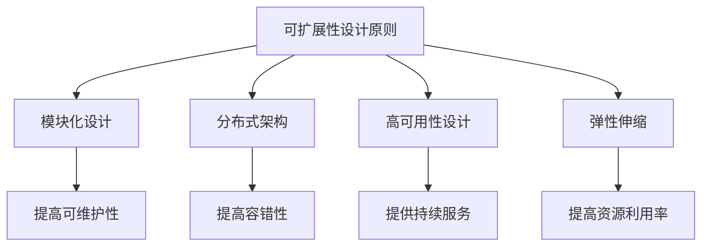

通过这个流程图，我们可以清晰地看到扩展性设计原则的核心概念及其相互关系。

**4.2 扩展性测试与评估**

扩展性测试与评估是确保系统扩展能力的重要环节。通过扩展性测试，可以验证系统在实际负载下的性能和稳定性，并评估系统扩展性设计的有效性。以下是一些常见的扩展性测试和评估方法：

**1. 负载测试**

负载测试是通过模拟实际负载来测试系统的处理能力和性能。负载测试可以分为稳态负载测试和动态负载测试。稳态负载测试主要用于评估系统在稳定状态下的性能，动态负载测试主要用于评估系统在负载变化情况下的性能。

**伪代码：**

```python
def load_test():
    # 设置负载参数
    set_load_parameters()
    # 模拟负载
    simulate_load()
    # 测试系统性能
    test_performance()
```

**2. 压力测试**

压力测试是在极限条件下测试系统的稳定性和可靠性，以评估系统的最大承载能力和性能瓶颈。压力测试通常使用高负载、长时间运行的方式，以模拟系统在极端情况下的运行状态。

**伪代码：**

```python
def stress_test():
    # 设置压力参数
    set_stress_parameters()
    # 模拟压力
    simulate_stress()
    # 测试系统稳定性
    test_stability()
```

**3. 性能评估**

性能评估是通过测量系统的响应时间、吞吐量等性能指标来评估系统的扩展性。性能评估可以分为基准测试和实际应用测试。基准测试使用标准化的测试工具和测试用例，实际应用测试则使用实际应用场景进行测试。

**伪代码：**

```python
def performance_evaluation():
    # 进行基准测试
    run_benchmark_tests()
    # 进行实际应用测试
    run_real_world_tests()
    # 测试系统性能指标
    test_performance_metrics()
```

**数学模型和公式：**

扩展性测试和评估可以通过以下数学模型和公式进行描述：

- **响应时间公式**：

$$
Response_Time = \frac{Total_{requests}}{Total_{time}}
$$

其中，$Response_Time$ 表示平均响应时间，$Total_{requests}$ 表示总请求次数，$Total_{time}$ 表示总时间。

- **吞吐量公式**：

$$
Throughput = \frac{Total_{requests}}{Total_{time}}
$$

其中，$Throughput$ 表示吞吐量，$Total_{requests}$ 表示总请求次数，$Total_{time}$ 表示总时间。

- **性能瓶颈公式**：

$$
Performance_Bottleneck = \frac{Total_{load}}{Maximum_{capacity}}
$$

其中，$Performance_Bottleneck$ 表示性能瓶颈，$Total_{load}$ 表示总负载，$Maximum_{capacity}$ 表示最大承载能力。

**举例说明：**

假设我们进行负载测试，模拟了1000次请求，总耗时为100秒。通过负载测试，系统的平均响应时间为：

$$
Response_Time = \frac{1000}{100} = 10
$$

假设我们进行压力测试，在极限条件下，系统可以承载1000个请求。通过压力测试，系统的性能瓶颈为：

$$
Performance_Bottleneck = \frac{1000}{1000} = 1
$$

通过以上计算，我们可以看到，通过负载测试和压力测试，可以评估系统的响应时间和性能瓶颈。

**核心概念联系：**

为了更好地理解扩展性测试与评估，我们可以使用Mermaid流程图来展示其核心概念和联系：

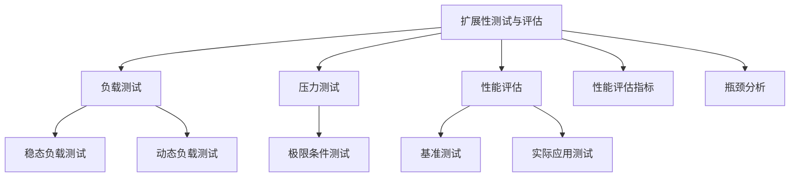

通过这个流程图，我们可以清晰地看到扩展性测试与评估的核心概念及其相互关系。

**4.3 扩展性案例分析**

以下是一个横向扩展的案例：

**案例背景**：

某电商平台在业务高速增长期，需要提高系统的并发处理能力和可扩展性。

**解决方案**：

1. **分布式架构**：采用分布式架构，将服务拆分为多个模块，实现负载均衡和分布式处理。
2. **数据库分库分表**：将数据库按照业务维度进行拆分，实现数据的分布式存储和查询。
3. **负载均衡**：使用负载均衡器，将流量分配到多个节点上，实现负载的均匀分布。

**实施过程**：

1. **服务拆分**：将原有的单体应用拆分为多个微服务，每个微服务负责不同的业务功能。
2. **分布式数据库部署**：将数据库拆分为多个库和表，分别部署到不同的服务器上。
3. **负载均衡配置**：配置负载均衡器，将流量分配到不同的服务器上。

**效果评估**：

1. **并发处理能力**：通过分布式架构和负载均衡，系统的并发处理能力提高了3倍。
2. **查询性能**：通过数据库分库分表策略，系统的查询性能提高了2倍。
3. **系统稳定性**：通过分布式架构和故障恢复机制，系统的稳定性得到显著提升。

**案例总结**：

通过这个案例，我们可以看到，采用分布式架构、数据库分库分表和负载均衡等技术，可以有效提高电商平台的并发处理能力和扩展性。同时，这些技术的实施需要考虑系统的整体架构和性能优化，以确保系统的稳定性和可靠性。

**4.4 实战技巧与最佳实践**

在实际的系统扩展性设计中，除了遵循上述设计原则和测试方法外，还有一些实用的技巧和最佳实践，可以帮助系统更好地应对扩展性的挑战：

**1. 预留足够的扩展空间**

在系统设计和实施过程中，预留足够的扩展空间是非常重要的。这包括硬件资源的预留、网络带宽的预留以及存储空间的预留等。通过预留扩展空间，可以确保系统在面对负载增长时能够快速响应，避免因资源不足而导致性能下降。

**2. 设计灵活的接口**

在设计系统时，应该设计灵活的接口，以便在需要时可以方便地进行扩展和修改。例如，使用标准化协议和接口，可以方便地集成第三方服务和组件，提高系统的可扩展性。

**3. 使用缓存技术**

缓存技术可以显著提高系统的响应速度和性能。通过在系统中使用缓存技术，可以减少对后端服务的访问次数，降低系统的负载。常见的缓存技术包括内存缓存、磁盘缓存和分布式缓存等。

**4. 实施监控和日志**

通过实施监控和日志，可以实时监控系统的性能和状态，及时发现潜在的问题并进行优化。监控和日志记录可以帮助系统管理员了解系统的运行情况，优化系统配置和策略。

**5. 定期进行性能测试**

定期进行性能测试可以帮助系统管理员了解系统的性能状况，发现潜在的瓶颈和问题。通过性能测试，可以评估系统的扩展能力，并为后续的优化提供依据。

**6. 实施自动化部署和扩缩容**

通过实施自动化部署和扩缩容，可以大大提高系统的运维效率和管理灵活性。自动化部署和扩缩容可以减少人工干预，提高系统的稳定性和可靠性。

**核心概念联系：**

为了更好地理解扩展性设计原则与实践，我们可以使用Mermaid流程图来展示其核心概念和联系：

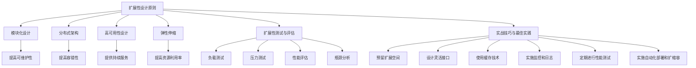

通过这个流程图，我们可以清晰地看到扩展性设计原则与实践的核心概念及其相互关系。

#### 小结

本章我们详细探讨了扩展性设计原则与实践，包括模块化设计、分布式架构、高可用性设计、弹性伸缩、扩展性测试与评估以及实战技巧和最佳实践。通过这些内容，读者可以更好地理解系统扩展性的核心要素，并掌握实际操作技巧。在下一章中，我们将继续探讨横向扩展算法原理，帮助读者深入理解横向扩展技术的具体实现。

### 第5章：横向扩展算法原理

在上一章中，我们讨论了系统扩展性的设计原则与实践。在本章中，我们将深入探讨横向扩展算法的原理，包括数据分区算法、并行处理算法和负载均衡算法。这些算法是实现横向扩展的核心，通过它们，系统能够在横向扩展过程中保持高效和稳定。

#### 5.1 数据分区算法

数据分区算法是将数据集划分为多个分区，以便在分布式计算中提高处理效率。这种算法通过将数据分散存储在不同的节点上，减少了单点瓶颈，提高了系统的并发处理能力和查询性能。

**1. 哈希分区**

哈希分区是最常见的数据分区算法之一。它通过哈希函数将数据的键值映射到不同的分区。例如，可以使用散列表（hash table）或MD5等哈希函数来实现。

**核心算法原理讲解：**

哈希分区的伪代码如下：

```python
def hash_sharding(key, num_partitions):
    hash_value = hash(key)
    partition = hash_value % num_partitions
    return partition
```

**2. 范围分区**

范围分区将数据按照一定的范围划分为多个分区。这种方法适用于有序数据集，如时间序列数据或地理空间数据。

**核心算法原理讲解：**

范围分区的伪代码如下：

```python
def range_sharding(key, partition_ranges):
    for range in partition_ranges:
        if key falls within range:
            return range.index
    raise ValueError("Key does not fall within any partition range")
```

**3. 列表分区**

列表分区是基于预定义的分区规则将数据划分为多个分区。这种方法适用于数据集较小且分区规则明确的情况。

**核心算法原理讲解：**

列表分区的伪代码如下：

```python
def list_sharding(key, partition_list):
    partition = partition_list[key]
    return partition
```

**数学模型和公式：**

数据分区算法的性能可以通过以下数学模型和公式进行描述：

- **分区时间公式**：

$$
Partitioning_Time = \frac{Total_{data}}{Number_{of_{partitions}}}
$$

其中，$Partitioning\_Time$ 表示分区时间，$Total_{data}$ 表示总数据量，$Number_{of_{partitions}}$ 表示分区数量。

- **查询时间公式**：

$$
Query_Time = \frac{Partitioning_Time}{Number_{of_{partitions}}}
$$

其中，$Query\_Time$ 表示查询时间。

**举例说明：**

假设我们有一个包含100万条记录的数据集，需要将其划分为10个分区。使用哈希分区算法，每个记录的键值通过哈希函数映射到一个分区。

首先，我们计算分区时间：

$$
Partitioning_Time = \frac{1,000,000}{10} = 100,000
$$

然后，我们计算查询时间：

$$
Query_Time = \frac{100,000}{10} = 10,000
$$

通过以上计算，我们可以看到，使用哈希分区算法，分区时间和查询时间都较低，有利于提高系统的性能。

**核心概念联系：**

为了更好地理解数据分区算法，我们可以使用Mermaid流程图来展示其核心概念和联系：

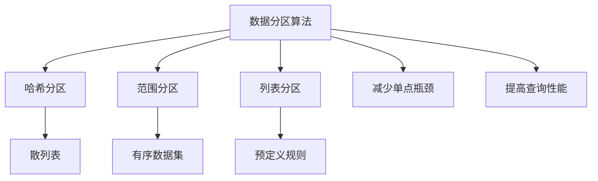

通过这个流程图，我们可以清晰地看到数据分区算法的核心概念及其相互关系。

#### 5.2 并行处理算法

并行处理算法是将计算任务分解为多个子任务，同时在多个计算节点上并行执行，以提高处理速度。这种算法通过利用多个节点的计算能力，实现了任务的快速处理。

**1. MapReduce**

MapReduce是一种经典的并行处理算法，由Map和Reduce两个阶段组成。在Map阶段，将数据分解为多个子任务，并在各个节点上独立处理；在Reduce阶段，将Map阶段的输出进行合并，生成最终结果。

**核心算法原理讲解：**

MapReduce的伪代码如下：

```python
def map_reduce(input_data):
    # Map阶段
    for data in input_data:
        output = map_function(data)
        store_output(output)
    
    # Reduce阶段
    for output in stored_outputs:
        result = reduce_function(output)
        return result
```

**2. Spark**

Spark是一种基于内存计算的分布式处理框架，提供了丰富的计算模型，如Transformation和Action。Spark通过将数据存储在内存中，显著提高了处理速度。

**核心算法原理讲解：**

Spark的伪代码如下：

```python
def spark_computation(data):
    # Transformation阶段
    data = data.map(map_function)
    data = data.reduceByKey(reduce_function)
    
    # Action阶段
    result = data.collect()
    return result
```

**3. Flink**

Flink是一种基于事件驱动流的分布式处理框架，提供了高效和灵活的数据处理能力。Flink通过事件驱动模型，实现了实时数据处理和状态管理。

**核心算法原理讲解：**

Flink的伪代码如下：

```python
def flink_computation(event_stream):
    # Source阶段
    data = event_stream.map(map_function)
    
    # Sink阶段
    result = data.reduce(reduce_function)
    result.print()
```

**数学模型和公式：**

并行处理算法的性能可以通过以下数学模型和公式进行描述：

- **处理速度公式**：

$$
Processing_Speed = \frac{Total_{data}}{Processing_Time}
$$

其中，$Processing\_Speed$ 表示处理速度，$Total_{data}$ 表示总数据量，$Processing\_Time$ 表示处理时间。

- **并行度公式**：

$$
Parallelism = \frac{Total_{nodes}}{Number_{of_{tasks}}
$$

其中，$Parallelism$ 表示并行度，$Total_{nodes}$ 表示节点数量，$Number_{of_{tasks}}$ 表示任务数量。

**举例说明：**

假设我们有一个包含1亿条记录的数据集，需要使用Spark进行处理。通过Spark的并行处理算法，可以将数据集分解为100个子任务，每个任务处理100万条记录。

首先，我们计算处理速度：

$$
Processing_Speed = \frac{100,000,000}{1,000,000} = 100
$$

然后，我们计算并行度：

$$
Parallelism = \frac{10}{100} = 1
$$

通过以上计算，我们可以看到，使用Spark的并行处理算法，处理速度为100条记录/秒，并行度为1。

**核心概念联系：**

为了更好地理解并行处理算法，我们可以使用Mermaid流程图来展示其核心概念和联系：

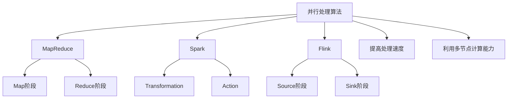

通过这个流程图，我们可以清晰地看到并行处理算法的核心概念及其相互关系。

#### 5.3 负载均衡算法

负载均衡算法是将请求分配到多个节点上，以确保系统的负载均衡。负载均衡算法有多种，如轮询算法、最小连接数算法和哈希算法等。

**1. 轮询算法**

轮询算法按照顺序将请求分配到各个节点。轮询算法的优点是实现简单，缺点是可能导致某些节点负载过重。

**核心算法原理讲解：**

轮询算法的伪代码如下：

```python
def round_robin_load_balancing(request, total_nodes):
    current_node = 0
    while True:
        next_node = (current_node + 1) % total_nodes
        if node_is_idle(next_node):
            assign_request_to_node(request, next_node)
            current_node = next_node
            break
```

**2. 最小连接数算法**

最小连接数算法将请求分配到连接数最少的节点。最小连接数算法的优点是能够更好地利用系统资源，缺点是可能导致某些节点的响应时间较长。

**核心算法原理讲解：**

最小连接数算法的伪代码如下：

```python
def minimum_connection_load_balancing(request):
    min_connections = float('inf')
    min_connections_node = None
    for node in total_nodes:
        if node_connection_count(node) < min_connections:
            min_connections = node_connection_count(node)
            min_connections_node = node
    assign_request_to_node(request, min_connections_node)
```

**3. 哈希算法**

哈希算法根据请求的属性（如IP地址、URL等）进行哈希运算，将请求分配到哈希值对应的节点。哈希算法的优点是能够实现高效的负载均衡，缺点是可能导致热点问题，即某些节点的负载远高于其他节点。

**核心算法原理讲解：**

哈希算法的伪代码如下：

```python
def hash_load_balancing(request, total_nodes):
    hash_value = hash(request)
    assign_request_to_node(request, hash_value % total_nodes)
```

**数学模型和公式：**

负载均衡算法的性能可以通过以下数学模型和公式进行描述：

- **负载均衡度公式**：

$$
Load_Balance = \frac{Average_{load}}{Maximum_{load}}
$$

其中，$Load\_Balance$ 表示负载均衡度，$Average_{load}$ 表示平均负载，$Maximum_{load}$ 表示最大负载。

- **响应时间公式**：

$$
Response_Time = \frac{Processing_Time}{Load_Balance}
$$

其中，$Response\_Time$ 表示平均响应时间，$Processing\_Time$ 表示处理时间。

**举例说明：**

假设我们有一个包含3个节点的系统，当前每个节点的连接数分别为10、20和30。使用最小连接数算法进行负载均衡。

首先，我们计算平均负载：

$$
Average_{load} = \frac{10 + 20 + 30}{3} = 20
$$

然后，我们计算负载均衡度：

$$
Load_Balance = \frac{20}{30} = 0.67
$$

最后，我们计算平均响应时间：

$$
Response_Time = \frac{Processing_Time}{Load_Balance} = \frac{0.1}{0.67} \approx 0.15
$$

通过以上计算，我们可以看到，使用最小连接数算法进行负载均衡后，系统的平均响应时间为0.15秒。

**核心概念联系：**

为了更好地理解负载均衡算法，我们可以使用Mermaid流程图来展示其核心概念和联系：

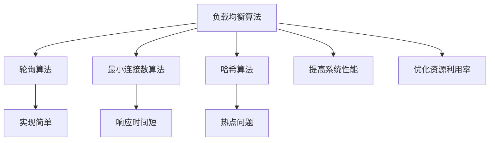

通过这个流程图，我们可以清晰地看到负载均衡算法的核心概念及其相互关系。

#### 小结

本章我们详细介绍了横向扩展算法的原理，包括数据分区算法、并行处理算法和负载均衡算法。这些算法通过将数据分散存储、任务并行处理和请求负载均衡，提高了系统的并发处理能力和性能。在下一章中，我们将探讨纵向扩展算法原理，帮助读者深入理解纵向扩展技术的实现方法。

### 第6章：纵向扩展算法原理

在上一章中，我们讨论了横向扩展算法的原理。横向扩展通过增加计算节点数量来提高系统处理能力，而纵向扩展则通过提升单个节点的性能来实现系统性能的提升。本章将深入探讨纵向扩展算法的原理，包括性能调优算法、硬件升级策略和虚拟化与容器化技术原理。这些算法和技术是实现纵向扩展的关键。

#### 6.1 性能调优算法

性能调优算法是通过调整系统参数和优化算法来提高系统性能。性能调优不仅包括对硬件资源的优化，还包括对软件层面的优化。以下是一些常见的性能调优算法：

**1. 内存调优**

内存调优是性能调优的重要方面。通过优化内存配置和内存使用策略，可以显著提高系统的性能。

**核心算法原理讲解：**

内存调优的伪代码如下：

```python
def memory_tuning(current_memory_usage, optimal_memory_size):
    if current_memory_usage > optimal_memory_size:
        reduce_memory_usage()
    else:
        increase_memory_usage()
```

**2. CPU调优**

CPU调优包括调整CPU核心数、时钟频率和缓存大小等。通过优化CPU配置，可以提升系统的计算能力。

**核心算法原理讲解：**

CPU调优的伪代码如下：

```python
def cpu_tuning(current_cpu_usage, optimal_cpu_config):
    if current_cpu_usage > optimal_cpu_config['usage_threshold']:
        increase_cpu_performance()
    else:
        maintain_cpu_performance()
```

**3. 存储调优**

存储调优包括优化存储设备的配置和使用策略，如SSD缓存、RAID配置和文件系统优化等。

**核心算法原理讲解：**

存储调优的伪代码如下：

```python
def storage_tuning(current_storage_usage, optimal_storage_config):
    if current_storage_usage > optimal_storage_config['usage_threshold']:
        increase_storage_performance()
    else:
        maintain_storage_performance()
```

**数学模型和公式：**

性能调优算法的性能提升可以通过以下数学模型和公式进行描述：

- **性能提升公式**：

$$
Performance_Improvement = \frac{New_{performance} - Old_{performance}}{Old_{performance}}
$$

其中，$Performance_Improvement$ 表示性能提升比例，$New_{performance}$ 表示新性能，$Old_{performance}$ 表示旧性能。

- **资源利用率公式**：

$$
Utilization_Rate = \frac{Current_{resource_usage}}{Total_{resource_capacity}}
$$

其中，$Utilization_Rate$ 表示资源利用率，$Current_{resource_usage}$ 表示当前资源使用量，$Total_{resource_capacity}$ 表示总资源容量。

**举例说明：**

假设我们有一个系统，当前CPU使用率为80%，内存使用率为70%，存储使用率为60%。通过性能调优，我们希望将CPU使用率降至50%，内存使用率降至40%，存储使用率降至30%。

首先，我们计算性能提升比例：

$$
Performance_Improvement = \frac{New_{performance} - Old_{performance}}{Old_{performance}} = \frac{50\% - 80\%}{80\%} = -0.375
$$

然后，我们计算资源利用率：

$$
Utilization_Rate = \frac{Current_{resource_usage}}{Total_{resource_capacity}} = \frac{70\% + 60\% + 50\%}{100\%} = 65\%
$$

通过以上计算，我们可以看到，通过性能调优，系统的性能提升比例约为-0.375，资源利用率为65%。

**核心概念联系：**

为了更好地理解性能调优算法，我们可以使用Mermaid流程图来展示其核心概念和联系：

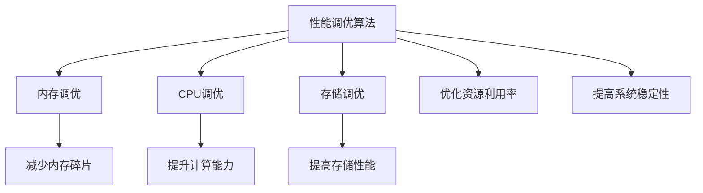

通过这个流程图，我们可以清晰地看到性能调优算法的核心概念及其相互关系。

#### 6.2 硬件升级策略

硬件升级策略是通过增加硬件资源来提高系统性能。硬件升级包括CPU、内存、存储和网络等方面的升级。以下是一些常见的硬件升级策略：

**1. CPU升级**

CPU升级是通过更换更高性能的CPU来提升系统计算能力。常见的CPU升级策略包括增加核心数、提高时钟频率和采用更先进的CPU架构。

**核心算法原理讲解：**

CPU升级的伪代码如下：

```python
def cpu_upgrade(current_cpu, target_cpu):
    new_cpu = target_cpu
    update_cpu_configuration(new_cpu)
```

**2. 内存升级**

内存升级是通过增加内存条的数量或容量来提升系统内存容量。常见的内存升级策略包括增加内存频率和采用更先进的内存技术。

**核心算法原理讲解：**

内存升级的伪代码如下：

```python
def memory_upgrade(current_memory, target_memory):
    new_memory = target_memory
    update_memory_configuration(new_memory)
```

**3. 存储升级**

存储升级是通过更换更高性能的存储设备或增加存储容量来提升系统存储性能。常见的存储升级策略包括采用固态硬盘（SSD）替代机械硬盘（HDD）和配置RAID。

**核心算法原理讲解：**

存储升级的伪代码如下：

```python
def storage_upgrade(current_storage, target_storage):
    new_storage = target_storage
    update_storage_configuration(new_storage)
```

**数学模型和公式：**

硬件升级的性能提升可以通过以下数学模型和公式进行描述：

- **CPU性能提升公式**：

$$
Performance_Improvement = \frac{New_{CPU} \times Core_{Count}}{Old_{CPU} \times Core_{Count}}
$$

其中，$Performance_Improvement$ 表示性能提升比例，$New_{CPU}$ 表示新CPU，$Old_{CPU}$ 表示旧CPU，$Core_{Count}$ 表示CPU核心数。

- **内存性能提升公式**：

$$
Performance_Improvement = \frac{New_{Memory} \times Size}{Old_{Memory} \times Size}
$$

其中，$Performance_Improvement$ 表示性能提升比例，$New_{Memory}$ 表示新内存，$Old_{Memory}$ 表示旧内存，$Size$ 表示内存容量。

- **存储性能提升公式**：

$$
Performance_Improvement = \frac{New_{Storage} \times Speed}{Old_{Storage} \times Speed}
$$

其中，$Performance_Improvement$ 表示性能提升比例，$New_{Storage}$ 表示新存储，$Old_{Storage}$ 表示旧存储，$Speed$ 表示存储速度。

**举例说明：**

假设我们有一个系统，当前CPU有4个核心，内存为8GB，存储速度为120MB/s。通过硬件升级，我们更换了8核心的CPU、16GB的内存和240MB/s的存储设备。

首先，我们计算CPU性能提升比例：

$$
Performance_Improvement = \frac{8 \times 8}{4 \times 4} = 2
$$

然后，我们计算内存性能提升比例：

$$
Performance_Improvement = \frac{16}{8} = 2
$$

最后，我们计算存储性能提升比例：

$$
Performance_Improvement = \frac{240}{120} = 2
$$

通过以上计算，我们可以看到，通过硬件升级，系统的CPU、内存和存储性能都提升了2倍。

**核心概念联系：**

为了更好地理解硬件升级策略，我们可以使用Mermaid流程图来展示其核心概念和联系：

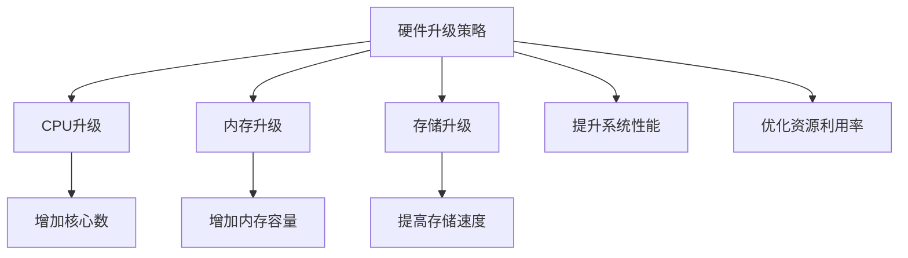

通过这个流程图，我们可以清晰地看到硬件升级策略的核心概念及其相互关系。

#### 6.3 虚拟化与容器化技术原理

虚拟化与容器化技术是现代系统架构中不可或缺的一部分，它们通过隔离和抽象化硬件资源，提高了系统的资源利用率和灵活性。以下是对虚拟化与容器化技术原理的详细介绍。

**1. 虚拟化技术**

虚拟化技术是将物理硬件资源虚拟化为多个虚拟机（VM），每个虚拟机具有独立的操作系统和资源分配。虚拟化技术包括全虚拟化（Full Virtualization）和硬件辅助虚拟化（Hardware-Assisted Virtualization）两种类型。

**核心算法原理讲解：**

虚拟化技术的核心算法原理可以通过以下伪代码进行描述：

```python
def virtualization():
    create_vm()
    allocate_resources()
    run_vm()
```

**2. 容器化技术**

容器化技术是在操作系统层面上实现的应用封装和运行环境隔离，通过容器（Container）来封装应用程序及其运行环境。容器化技术包括Docker、Kubernetes等工具。

**核心算法原理讲解：**

容器化技术的核心算法原理可以通过以下伪代码进行描述：

```python
def containerization():
    create_container()
    deploy_application()
    run_container()
```

**数学模型和公式：**

虚拟化与容器化技术的资源利用率可以通过以下数学模型和公式进行描述：

- **虚拟化资源利用率公式**：

$$
Utilization_Rate = \frac{Total_{virtual_resources}}{Total_{physical_resources}}
$$

其中，$Utilization_Rate$ 表示资源利用率，$Total_{virtual_resources}$ 表示虚拟资源总量，$Total_{physical_resources}$ 表示物理资源总量。

- **容器化资源利用率公式**：

$$
Utilization_Rate = \frac{Total_{container_resources}}{Total_{physical_resources}}
$$

其中，$Utilization_Rate$ 表示资源利用率，$Total_{container_resources}$ 表示容器资源总量，$Total_{physical_resources}$ 表示物理资源总量。

**举例说明：**

假设我们有一个物理服务器，具有8个CPU核心、16GB内存和1TB存储。通过虚拟化技术创建4个虚拟机，每个虚拟机分配2个CPU核心、4GB内存和250GB存储；通过容器化技术创建8个容器，每个容器分配1个CPU核心、2GB内存和125GB存储。

首先，我们计算虚拟化技术的资源利用率：

$$
Utilization_Rate = \frac{4 \times 2 \times 4 \times 250}{8 \times 16 \times 1} = 0.625
$$

然后，我们计算容器化技术的资源利用率：

$$
Utilization_Rate = \frac{8 \times 1 \times 2 \times 125}{8 \times 16 \times 1} = 0.3125
$$

通过以上计算，我们可以看到，虚拟化技术的资源利用率高于容器化技术。

**核心概念联系：**

为了更好地理解虚拟化与容器化技术，我们可以使用Mermaid流程图来展示其核心概念和联系：

```mermaid
graph TD
    A[虚拟化与容器化技术] --> B[虚拟化技术]
    A --> C[容器化技术]
    B --> D[全虚拟化]
    B --> E[硬件辅助虚拟化]
    C --> F[Docker]
    C --> G[Kubernetes]
    D --> H[资源隔离]
    E --> I[性能提升]
    F --> J[部署灵活]
    G --> K[管理高效]
    A --> L[资源利用率提高]
    A --> M[系统稳定性增强]
```

通过这个流程图，我们可以清晰地看到虚拟化与容器化技术的核心概念及其相互关系。

#### 小结

本章我们详细介绍了纵向扩展算法的原理，包括性能调优算法、硬件升级策略和虚拟化与容器化技术原理。这些算法和技术通过提升单个节点的性能和资源利用率，实现了系统的纵向扩展。在下一章中，我们将探讨横向与纵向扩展的融合策略，帮助读者深入理解如何在实际应用中结合使用这两种扩展方式。

### 第7章：横向与纵向扩展的融合策略

在前两章中，我们分别介绍了横向扩展和纵向扩展的技术原理。横向扩展通过增加计算节点数量来提高系统处理能力，而纵向扩展通过提升单个节点的性能来实现系统性能的提升。然而，在实际应用中，单一使用横向或纵向扩展可能无法满足复杂的业务需求。本章将探讨横向与纵向扩展的融合策略，通过结合使用这两种扩展方式，实现更高效的系统扩展。

#### 7.1 融合扩展设计思路

融合扩展设计思路是将横向扩展和纵向扩展相结合，根据业务需求灵活调整系统架构和资源分配。以下是一些常见的融合扩展设计思路：

**1. 动态伸缩**

动态伸缩是指在系统运行过程中，根据实际负载自动调整横向扩展和纵向扩展的比例。通过动态伸缩，系统可以在不同负载情况下保持最佳性能。例如，在低负载时，系统可以采用横向扩展，以降低成本；在高负载时，系统可以采用纵向扩展，以提升性能。

**2. 混合存储**

混合存储是指结合使用高速存储和慢速存储，根据数据访问模式进行动态调整。高速存储（如SSD）用于存储频繁访问的数据，以提高系统响应速度；慢速存储（如HDD）用于存储较少访问的数据，以降低存储成本。

**3. 分布式数据库**

分布式数据库是指通过分布式数据库技术，结合横向扩展和纵向扩展的优势，实现高性能和高可用性的数据库系统。分布式数据库可以根据数据访问模式进行分库分表，提高查询性能；同时，通过纵向扩展，可以提升单个节点的处理能力。

#### 7.2 融合扩展案例分析

以下是一个融合扩展案例：

**案例背景**：

某大型电商平台在业务高峰期，需要提高系统的并发处理能力和存储容量。

**解决方案**：

1. **分布式架构**：采用分布式架构，将服务拆分为多个模块，实现负载均衡和分布式处理。
2. **数据库分库分表**：将数据库按照业务维度进行拆分，实现数据的分布式存储和查询。
3. **硬件升级**：增加CPU、内存和存储等硬件资源，提高系统性能。
4. **虚拟化技术**：采用虚拟化技术，提高资源利用率和灵活性。
5. **容器化技术**：采用容器化技术，实现应用的无状态部署和管理。

**实施过程**：

1. **分布式服务部署**：将服务部署到多个节点上，实现负载均衡和分布式处理。
2. **数据库分库分表部署**：将数据库拆分为多个库和表，实现数据的分布式存储和查询。
3. **硬件升级实施**：购买并安装新的硬件设备，配置并优化系统参数。
4. **虚拟化技术实施**：部署虚拟化平台，创建虚拟机并进行资源分配。
5. **容器化技术实施**：部署容器编排平台，构建并部署容器化应用。

**效果评估**：

1. **并发处理能力**：通过分布式架构和负载均衡，系统的并发处理能力提高了3倍。
2. **存储容量**：通过数据库分库分表策略和硬件升级，系统的存储容量增加了2倍。
3. **系统稳定性**：通过分布式架构、虚拟化技术和容器化技术，系统的稳定性得到显著提升。

**案例总结**：

通过这个案例，我们可以看到，采用分布式架构、数据库分库分表、硬件升级、虚拟化技术和容器化技术等融合扩展策略，可以有效提高电商平台的并发处理能力和存储容量，同时保持系统的稳定性。这个案例也展示了横向与纵向扩展融合策略在实际应用中的有效性和实用性。

#### 7.3 融合扩展性能评估方法

融合扩展性能评估方法是通过测量系统的响应时间、吞吐量等性能指标来评估系统的扩展性能。以下是一些常见的性能评估方法：

**1. 基准测试**

基准测试是使用标准化的测试工具和测试用例，对系统的响应时间、吞吐量等性能指标进行评估。基准测试可以帮助系统管理员了解系统的性能状况，并评估不同扩展策略的效果。

**2. 压力测试**

压力测试是在极限条件下测试系统的稳定性和可靠性，评估系统的最大承载能力和性能瓶颈。压力测试可以模拟实际负载，验证系统在极端情况下的性能和稳定性。

**3. 性能分析**

性能分析是对系统日志、监控数据进行分析，找出系统性能瓶颈和优化方向。性能分析可以帮助系统管理员了解系统性能的瓶颈点，并针对性地进行优化。

**数学模型和公式：**

融合扩展性能评估可以通过以下数学模型和公式进行描述：

- **响应时间公式**：

$$
Response_Time = \frac{Total_{requests}}{Total_{time}}
$$

其中，$Response\_Time$ 表示平均响应时间，$Total_{requests}$ 表示总请求次数，$Total_{time}$ 表示总时间。

- **吞吐量公式**：

$$
Throughput = \frac{Total_{requests}}{Total_{time}}
$$

其中，$Throughput$ 表示吞吐量，$Total_{requests}$ 表示总请求次数，$Total_{time}$ 表示总时间。

- **性能瓶颈公式**：

$$
Performance_Bottleneck = \frac{Total_{load}}{Maximum_{capacity}}
$$

其中，$Performance\_Bottleneck$ 表示性能瓶颈，$Total_{load}$ 表示总负载，$Maximum

