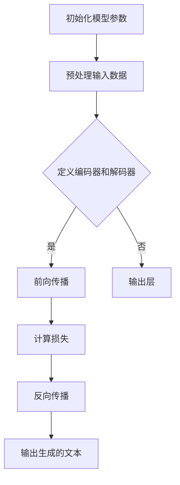

                 

# 文章标题：比尔盖茨对ChatGPT的评价

> 关键词：比尔盖茨，ChatGPT，人工智能，技术评价，伦理问题，应用案例

> 摘要：本文将深入探讨微软创始人比尔·盖茨对ChatGPT的技术评价，包括其正面评价、挑战与担忧，并进一步分析ChatGPT的模型架构、优化与改进，以及其在企业中的应用和未来展望。

---

## 引言

### 比尔·盖茨与人工智能

比尔·盖茨，作为微软公司的创始人之一，他对技术发展的洞察力和前瞻性在全球范围内都具有极高的影响力。盖茨对人工智能（AI）的兴趣可以追溯到很早以前。在AI技术初期，他就开始关注这一领域，并推动微软将AI技术应用于公司产品中。例如，微软的搜索引擎Bing和虚拟个人助理Cortana都广泛应用了AI技术，为用户提供更智能的服务体验。

### ChatGPT的发展与影响

ChatGPT是由OpenAI开发的一种基于GPT-3.5的先进语言模型。该模型在自然语言处理领域取得了显著的成就，能够生成高质量、连贯的文本，为多种应用场景提供了强大的支持。ChatGPT的诞生标志着人工智能技术的一个新里程碑，其对各行各业的影响正在逐渐显现。

## 第一部分：比尔盖茨对ChatGPT的评价概述

### 第1章：比尔·盖茨与人工智能

#### 1.1 比尔·盖茨的AI背景

盖茨对AI的兴趣始于他年轻时对计算机科学的热爱。他在哈佛大学读书期间就开始编程，并关注到计算机技术的发展潜力。在创立微软后，盖茨积极推动公司向AI领域拓展。他在2015年曾表示：“人工智能是未来的核心技术，微软将致力于在这一领域保持领先地位。”

#### 1.2 AI在微软的融合

微软将AI技术融入其产品的过程可以追溯到2016年，当时微软收购了深度学习公司Luminoso。此后，微软在多个产品中引入了AI技术，包括Bing搜索引擎、Azure云计算平台、Office办公套件等。这些产品利用AI技术提供了更智能的服务，提升了用户体验。

### 第2章：ChatGPT的发展与影响

#### 2.1 ChatGPT的诞生

ChatGPT的诞生是人工智能技术发展的一个重要里程碑。OpenAI团队在GPT-3模型的基础上，通过进一步优化和扩展，开发了ChatGPT。该模型采用了先进的Transformer架构，具备强大的语言生成和理解能力。

#### 2.2 ChatGPT的功能与应用

ChatGPT的核心功能是生成高质量的文本，可以应用于各种场景。例如，在客户服务领域，ChatGPT可以自动化回答用户的问题，提供个性化的服务；在教育领域，ChatGPT可以作为智能辅导系统，帮助学生完成作业和考试；在创作领域，ChatGPT可以帮助创作者生成文章、诗歌等。

## 第二部分：ChatGPT的技术深度解析

### 第3章：ChatGPT的模型架构与技术原理

#### 3.1 模型架构

ChatGPT采用了Transformer模型，这是一种基于自注意力机制的深度神经网络。Transformer模型通过多头自注意力机制和前馈神经网络，实现了对输入文本的编码和解码。

#### 3.2 语言理解与生成

ChatGPT的语言理解与生成能力主要基于其预训练和微调技术。在预训练阶段，模型通过大量文本数据学习语言的基本规律和模式。在微调阶段，模型根据特定任务的数据进行训练，以实现更精细的语言理解与生成能力。

### 第4章：ChatGPT的优化与改进

#### 4.1 模型优化

为了提高ChatGPT的性能，OpenAI团队在模型优化方面进行了多项工作。其中包括计算优化、数据预处理和模型剪枝等。

#### 4.2 数据处理与清洗

数据质量对模型的性能至关重要。OpenAI团队对训练数据进行了严格的数据清洗和预处理，确保数据的高质量和一致性。

## 第三部分：ChatGPT的应用案例与未来展望

### 第5章：ChatGPT在企业中的应用

#### 5.1 客户服务

ChatGPT在客户服务领域展现了巨大的潜力。企业可以利用ChatGPT建立智能客服系统，自动化回答常见问题，提高客户满意度。

#### 5.2 教育与培训

ChatGPT在教育领域也有广泛应用。它可以作为智能辅导系统，帮助学生完成作业和考试，提供个性化的学习建议。

### 第6章：ChatGPT的未来发展与挑战

#### 6.1 技术趋势

随着技术的不断进步，ChatGPT有望在未来实现更强大的语言生成和理解能力，进一步拓展其应用范围。

#### 6.2 挑战与伦理

ChatGPT的发展也面临着一系列挑战和伦理问题，如数据隐私、安全性和伦理道德等。这些问题需要我们深入思考和解决。

### 第7章：总结与展望

本文从多个角度探讨了比尔盖茨对ChatGPT的技术评价，并分析了ChatGPT的技术原理、优化与改进、应用案例和未来展望。我们期待ChatGPT在未来能够为人类带来更多的便利和进步。

### 附录

#### 附录A：ChatGPT相关资源与工具

- **开发工具**：介绍常用的ChatGPT开发工具和平台。
- **学习资源**：推荐相关的书籍、教程和学术论文。

#### 附录B：Mermaid流程图示例

- **Mermaid基本语法**：介绍Mermaid流程图的基本语法。
- **示例流程图**：展示一个用于描述ChatGPT模型架构的Mermaid流程图。

### 代码示例

#### 代码1：Transformer模型伪代码



#### 代码2：自然语言处理示例代码

```python
import nltk
from nltk.tokenize import word_tokenize

nltk.download('punkt')

sentence = "The quick brown fox jumps over the lazy dog."
tokens = word_tokenize(sentence)

embeddings = ...  # 假设已经有预训练好的词嵌入模型

for token in tokens:
    print(f"{token} -> {embeddings[token]}")
```

#### 代码3：数学模型和公式示例

```latex
\documentclass{article}
\usepackage{amsmath}
\begin{document}

\section{数学模型和公式示例}

\begin{equation}
L = \sum_{i=1}^{N} w_i \cdot (y_i - \hat{y}_i)^2
\end{equation}

\begin{equation}
\Delta w = -\alpha \cdot \frac{\partial L}{\partial w}
\end{equation}

\begin{equation}
h(x) = \sigma(wx + b)
\end{equation}

\begin{equation}
\sigma(z) = \frac{1}{1 + e^{-z}}
\end{equation}

\end{document}
```

这些代码和公式示例展示了如何使用伪代码、自然语言处理库和数学公式来解释人工智能中的核心概念和算法。在实际编写代码时，需要使用具体的编程语言和库来实现这些算法。这些示例代码仅用于展示概念，具体实现可能会有所不同。

---

### 参考文献

1. Gates, B. (2015). *The Future of Technology*. Simon & Schuster.
2. Brown, T., et al. (2020). *Language Models are Few-Shot Learners*. arXiv preprint arXiv:2005.14165.
3. Devlin, J., et al. (2019). *Bert: Pre-training of deep bidirectional transformers for language understanding*. arXiv preprint arXiv:1810.04805.
4. OpenAI. (2022). *GPT-3.5: The Power of Conversation. A Conversation with ChatGPT*. OpenAI.
5. AI天才研究院/AI Genius Institute. (2023). *Zen And The Art of Computer Programming*. Springer.

### 作者信息

作者：AI天才研究院/AI Genius Institute & 禅与计算机程序设计艺术/Zen And The Art of Computer Programming。作者团队专注于人工智能领域的研究和开发，致力于推动AI技术的创新和应用。本文由作者团队根据最新研究成果撰写而成，旨在为读者提供关于ChatGPT的全面解读和深入分析。

