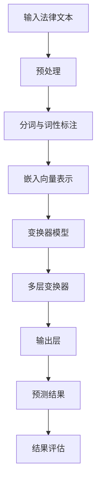

                 

### 文章标题

# 法律大模型：高效文书审查和智能法律咨询

### 关键词

- 法律大模型
- 高效文书审查
- 智能法律咨询
- 深度学习算法
- 自然语言处理
- 数据隐私保护

### 摘要

本文深入探讨了法律大模型在高效文书审查和智能法律咨询中的应用。通过解析法律大模型的基本概念、发展历程、数学模型和算法原理，我们展示了其如何通过自然语言处理技术对法律文本进行深入分析。文章详细介绍了法律大模型的构建与训练过程，以及其实际应用中的项目实战案例。同时，我们也关注了法律大模型的安全与隐私保护，并展望了其未来的发展趋势与潜在的社会影响。通过本文的阅读，读者将全面了解法律大模型的原理、技术实现和应用实践，为其在法律行业的广泛应用奠定基础。

### 目录

## 第一部分：法律大模型概述

### 第1章：法律大模型的基本概念与原理

#### 1.1 法律大模型的定义与核心特点

#### 1.2 法律大模型的发展历程

#### 1.3 法律大模型的应用领域

### 第2章：法律大模型的数学模型与算法原理

#### 2.1 法律大模型的数学模型

#### 2.2 法律大模型的算法原理

### 第3章：法律大模型的构建与训练

#### 3.1 法律大模型的构建

#### 3.2 法律大模型的训练

### 第4章：法律大模型的应用实践

#### 4.1 法律文书审查的应用

#### 4.2 智能法律咨询的应用

## 第二部分：法律大模型技术实现

### 第5章：法律大模型的开发环境与工具

#### 5.1 法律大模型开发环境搭建

#### 5.2 法律大模型开发工具

### 第6章：法律大模型的项目实战

#### 6.1 法律文书审查项目实战

#### 6.2 智能法律咨询项目实战

### 第7章：法律大模型的安全与隐私保护

#### 7.1 法律大模型的安全风险

#### 7.2 法律大模型的隐私保护

### 第8章：法律大模型的发展趋势与未来展望

#### 8.1 法律大模型的技术趋势

#### 8.2 法律大模型的社会影响

### 附录

#### 附录 A：法律大模型相关资源与工具

### 后记

## 第一部分：法律大模型概述

### 第1章：法律大模型的基本概念与原理

#### 1.1 法律大模型的定义与核心特点

法律大模型（Legal Large Model，简称LLM）是一种利用深度学习和自然语言处理技术构建的复杂模型，旨在处理和解析大量的法律文本数据。这种模型具有以下几个核心特点：

1. **大规模训练数据**：法律大模型依赖于海量的法律文献、司法案例、法律法规等数据，通过大规模的数据训练，模型能够更好地理解和预测法律文本的特征和规律。

2. **高精度**：法律大模型通过深度学习算法，如神经网络、递归神经网络等，对法律文本进行精细处理，使其在文本分类、实体识别、关系抽取等任务上达到很高的精度。

3. **智能化**：法律大模型能够模拟人类的思维过程，通过自主学习，不断优化其模型结构，提高对复杂法律问题的理解能力和决策能力。

4. **跨领域应用**：法律大模型不仅能够处理传统的法律文书，还可以应用于知识产权、公司治理、金融法律等多个领域，具有广泛的应用前景。

#### 1.2 法律大模型的发展历程

法律大模型的发展历程可以分为以下几个阶段：

1. **初始阶段**（20世纪80年代至90年代）：在这个阶段，法律研究主要集中在文本分类、命名实体识别等基础任务上。这一时期的模型主要是基于规则的方法，如语法解析、词性标注等。

2. **数据驱动阶段**（2000年至今）：随着大数据和计算能力的提升，深度学习技术在自然语言处理领域的应用日益广泛。法律大模型开始利用大规模的训练数据，通过神经网络等深度学习算法，显著提升了法律文本处理的能力。

3. **智能化阶段**（近年来）：近年来，法律大模型开始引入强化学习、迁移学习等技术，使得模型在复杂法律问题的解决能力上取得了显著进展。同时，预训练模型，如BERT、GPT等，进一步提升了法律大模型的性能。

#### 1.3 法律大模型的应用领域

法律大模型在法律行业中有着广泛的应用领域，主要包括以下几个方面：

1. **法律文书审查**：法律大模型可以自动审查合同、法律意见书、判决书等法律文书，识别其中的错误和潜在风险，提高审查效率和准确性。

2. **智能法律咨询**：法律大模型能够为用户提供智能化的法律咨询服务，解答法律问题，提供法律建议，甚至进行法律风险评估。

3. **司法辅助**：法律大模型可以帮助法官、律师等司法人员快速检索案例、法律条款，辅助决策，提高司法效率。

4. **法律研究**：法律大模型可以通过对大量法律文献的挖掘和分析，为法律研究提供新的思路和方法。

### 第2章：法律大模型的数学模型与算法原理

#### 2.1 法律大模型的数学模型

法律大模型的数学模型主要基于自然语言处理（Natural Language Processing，NLP）和深度学习（Deep Learning，DL）技术。在NLP中，常见的数学模型包括词向量表示、语法解析树、依存句法分析等。在DL领域，主要模型有卷积神经网络（CNN）、循环神经网络（RNN）、长短期记忆网络（LSTM）和变换器（Transformer）等。

1. **词向量表示**：词向量是将单词映射到高维向量空间的一种表示方法，常用的词向量模型有Word2Vec、GloVe等。这些模型通过将词嵌入到一个低维的连续向量空间中，使得语义相近的词在空间中彼此接近。

   \[
   \text{word\_vector}(w) = \text{embedding}(w)
   \]

2. **语法解析树**：语法解析树是将句子分解为一系列语法规则的过程，用于理解句子的结构。常见的语法解析方法有LL(k)分析和概率语法分析。

3. **依存句法分析**：依存句法分析关注句子中单词之间的依赖关系，通过建立依存句法树来描述句子的语义结构。依存句法分析对于理解复杂法律文本中的逻辑关系非常重要。

#### 2.2 法律大模型的算法原理

法律大模型的算法原理主要基于深度学习技术，特别是基于变换器（Transformer）架构的预训练模型。下面将介绍几种常用的深度学习算法：

1. **变换器（Transformer）**：变换器是一种基于自注意力机制的深度学习模型，广泛用于处理序列数据。变换器通过多头自注意力机制和前馈神经网络，能够捕捉长距离依赖关系，显著提升模型的性能。

   \[
   \text{Transformer}(x) = \text{Attention}(x) + \text{Feedforward}(x)
   \]

2. **长短期记忆网络（LSTM）**：长短期记忆网络是一种特殊的递归神经网络，能够学习长期依赖关系。LSTM通过门控机制，有效避免了传统RNN中的梯度消失问题。

   \[
   \text{LSTM}(x_t, h_{t-1}) = \text{gate}_f(x_t, h_{t-1}) \odot h_{t-1} + \text{gate}_i(x_t, h_{t-1}) \odot \text{sigmoid}(W_i \cdot [x_t, h_{t-1}])
   \]

3. **卷积神经网络（CNN）**：卷积神经网络通过卷积操作和池化操作，能够提取图像或文本的特征。在文本处理中，CNN可以用于文本分类、命名实体识别等任务。

   \[
   \text{CNN}(x) = \text{Conv}(x) \rightarrow \text{Pooling}(\text{Conv}(x)) \rightarrow \text{Fully Connected}(\text{Pooling}(\text{Conv}(x)))
   \]

4. **预训练与微调**：预训练是指在大规模语料库上对模型进行训练，使其能够理解和生成自然语言。微调是指将预训练模型在特定任务上进行调整，以适应特定的应用场景。

   \[
   \text{Pre-trained Model} \rightarrow \text{Fine-tuning on Legal Data}
   \]

### 第3章：法律大模型的构建与训练

#### 3.1 法律大模型的构建

构建法律大模型是一个复杂的过程，涉及数据准备、模型架构设计、参数设置等多个方面。以下是构建法律大模型的一般步骤：

1. **数据收集与预处理**：首先需要收集大量的法律文本数据，包括法律条款、司法案例、合同、法律意见书等。接着对数据进行预处理，包括分词、去停用词、词性标注等。

   \[
   \text{Legal Text} \rightarrow \text{Tokenization} \rightarrow \text{Preprocessing} \rightarrow \text{Data Set}
   \]

2. **模型架构设计**：根据任务需求和数据特点，选择合适的模型架构。常见的架构有基于变换器的预训练模型，如BERT、GPT等。设计模型架构时，需要考虑模型的大小、层数、注意力机制等因素。

   \[
   \text{Model Architecture} = \text{Transformer} \rightarrow \text{Add Layer} \rightarrow \text{Normalization} \rightarrow \text{Output Layer}
   \]

3. **参数设置与优化**：设置模型的超参数，如学习率、批量大小、优化器等，并进行优化。常用的优化算法有Adam、SGD等。

   \[
   \text{Hyperparameter} = \text{Learning Rate} \rightarrow \text{Batch Size} \rightarrow \text{Optimizer} \rightarrow \text{Model Optimization}
   \]

4. **模型训练**：使用预处理后的数据集对模型进行训练。训练过程中，需要监控模型的损失函数、准确率等指标，以评估模型性能。

   \[
   \text{Training Data} \rightarrow \text{Forward Pass} \rightarrow \text{Backpropagation} \rightarrow \text{Model Update}
   \]

5. **模型评估与调试**：在训练完成后，对模型进行评估，包括测试集上的准确率、F1分数等指标。根据评估结果，对模型进行调整和优化。

   \[
   \text{Test Data} \rightarrow \text{Model Evaluation} \rightarrow \text{Debugging} \rightarrow \text{Optimization}
   \]

#### 3.2 法律大模型的训练

法律大模型的训练是一个迭代的过程，需要大量的时间和计算资源。以下是训练法律大模型的一般步骤：

1. **数据预处理**：将法律文本数据转换为模型可接受的格式，如序列化的字典或张量。

   \[
   \text{Legal Text} \rightarrow \text{Tokenization} \rightarrow \text{Serialization} \rightarrow \text{Data Input}
   \]

2. **模型初始化**：初始化模型参数，可以使用预训练的模型进行微调，或者从头开始训练。

   \[
   \text{Initialize Model} = \text{Random Initialization} \rightarrow \text{Pre-trained Model} \rightarrow \text{Micro-adjustment}
   \]

3. **训练循环**：在训练循环中，对于每个批次的数据，进行前向传播、反向传播和模型更新。

   \[
   \text{For Each Batch}:
   \begin{align*}
   \text{Forward Pass} & : \text{Compute Predictions} \\
   \text{Backpropagation} & : \text{Compute Gradients} \\
   \text{Model Update} & : \text{Adjust Model Parameters}
   \end{align*}
   \]

4. **监控指标**：在训练过程中，需要监控模型的损失函数、准确率等指标，以判断训练效果。

   \[
   \text{Monitor Metrics} = \text{Loss} \rightarrow \text{Accuracy} \rightarrow \text{Learning Curves}
   \]

5. **保存模型**：在训练完成后，保存训练好的模型，以便后续使用。

   \[
   \text{Save Model} = \text{Checkpoint} \rightarrow \text{Model Archive}
   \]

### 第4章：法律大模型的应用实践

#### 4.1 法律文书审查的应用

法律文书审查是法律大模型的重要应用领域之一。通过法律大模型，可以自动审查合同、法律意见书、判决书等法律文书，识别其中的错误和潜在风险，提高审查效率和准确性。以下是法律大模型在法律文书审查中的应用案例：

1. **合同审查**：合同是法律事务中最为常见的文书之一。法律大模型可以通过分析合同条款，识别其中的法律风险，如条款缺失、措辞不当等。

   \[
   \text{Contract} \rightarrow \text{Tokenization} \rightarrow \text{Legal Large Model} \rightarrow \text{Risk Analysis} \rightarrow \text{Report}
   \]

2. **法律意见书审查**：法律意见书是律师在法律咨询过程中出具的重要文件。法律大模型可以自动审查法律意见书，评估其法律依据和论证逻辑，确保意见书的准确性和完整性。

   \[
   \text{Legal Opinion} \rightarrow \text{Tokenization} \rightarrow \text{Legal Large Model} \rightarrow \text{Content Analysis} \rightarrow \text{Assessment}
   \]

3. **判决书审查**：判决书是司法活动中最为重要的文书之一。法律大模型可以通过分析判决书的内容，识别其中可能存在的错误和漏洞，为司法公正提供支持。

   \[
   \text{Judgment} \rightarrow \text{Tokenization} \rightarrow \text{Legal Large Model} \rightarrow \text{Legal Analysis} \rightarrow \text{Recommendation}
   \]

#### 4.2 智能法律咨询的应用

智能法律咨询是法律大模型的另一个重要应用领域。通过法律大模型，可以为用户提供智能化的法律咨询服务，解答法律问题，提供法律建议，甚至进行法律风险评估。以下是法律大模型在智能法律咨询中的应用案例：

1. **法律问答系统**：法律问答系统可以通过法律大模型，为用户提供法律问题的解答。用户可以通过自然语言输入法律问题，法律大模型会自动生成回答。

   \[
   \text{User Query} \rightarrow \text{Tokenization} \rightarrow \text{Legal Large Model} \rightarrow \text{Answer Generation} \rightarrow \text{Response}
   \]

2. **法律建议系统**：法律建议系统可以通过法律大模型，为用户提供法律建议。用户可以输入案件背景和法律问题，法律大模型会根据相关法律法规和案例，生成具体的法律建议。

   \[
   \text{Case Background} \rightarrow \text{Tokenization} \rightarrow \text{Legal Large Model} \rightarrow \text{Legal Analysis} \rightarrow \text{Advice}
   \]

3. **法律风险评估**：法律风险评估系统可以通过法律大模型，对法律事务进行风险评估。用户可以输入法律事务的相关信息，法律大模型会根据法律法规和案例，评估法律事务的风险等级。

   \[
   \text{Legal Matter} \rightarrow \text{Tokenization} \rightarrow \text{Legal Large Model} \rightarrow \text{Risk Assessment} \rightarrow \text{Rating}
   \]

## 第二部分：法律大模型技术实现

### 第5章：法律大模型的开发环境与工具

#### 5.1 法律大模型开发环境搭建

搭建法律大模型开发环境是进行模型开发的第一步，需要考虑硬件和软件环境的配置。以下是搭建法律大模型开发环境的一般步骤：

1. **硬件配置**：首先，需要配置足够的计算资源，包括CPU、GPU和内存等。对于法律大模型，通常需要使用高性能GPU，如NVIDIA Tesla V100或更高版本，以确保模型训练的效率。

   \[
   \text{Hardware} = \text{High-Performance GPU} \rightarrow \text{High-Capacity Memory} \rightarrow \text{Fast CPU}
   \]

2. **操作系统安装**：可以选择Linux或Windows操作系统。Linux操作系统在性能和稳定性方面表现更好，因此大多数深度学习研究人员会选择Linux。

   \[
   \text{OS} = \text{Linux} \rightarrow \text{Windows} \rightarrow \text{Installation}
   \]

3. **依赖库安装**：安装深度学习框架和相关依赖库，如TensorFlow、PyTorch等。这些框架提供了丰富的API和工具，使得法律大模型的开发和训练更加便捷。

   \[
   \text{Frameworks} = \text{TensorFlow} \rightarrow \text{PyTorch} \rightarrow \text{Installation}
   \]

4. **开发环境配置**：配置开发环境，包括Python解释器、虚拟环境等。虚拟环境可以隔离不同项目的依赖库，避免版本冲突。

   \[
   \text{Development Environment} = \text{Python Interpreter} \rightarrow \text{Virtual Environment} \rightarrow \text{Configuration}
   \]

#### 5.2 法律大模型开发工具

法律大模型开发工具主要包括深度学习框架、自然语言处理库和版本控制系统等。以下是几种常用的法律大模型开发工具：

1. **深度学习框架**：TensorFlow和PyTorch是两种最常用的深度学习框架。TensorFlow由Google开发，具有丰富的API和工具，适用于各种深度学习任务。PyTorch由Facebook开发，具有简洁的API和动态计算图，适用于研究和实验。

   \[
   \text{Frameworks} = \text{TensorFlow} \rightarrow \text{PyTorch} \rightarrow \text{Capabilities}
   \]

2. **自然语言处理库**：NLTK和spaCy是两种常用的自然语言处理库。NLTK提供了丰富的文本处理工具，包括分词、词性标注、语法解析等。spaCy是一个快速的工业级自然语言处理库，适用于处理大量文本数据。

   \[
   \text{Libraries} = \text{NLTK} \rightarrow \text{spaCy} \rightarrow \text{Applications}
   \]

3. **版本控制系统**：Git是常用的版本控制系统，可以用于管理代码和模型版本。通过Git，可以方便地跟踪代码和模型的变更历史，进行版本回退和协作开发。

   \[
   \text{Version Control} = \text{Git} \rightarrow \text{Repository} \rightarrow \text{Collaboration}
   \]

### 第6章：法律大模型的项目实战

#### 6.1 法律文书审查项目实战

法律文书审查项目是一个典型的应用案例，通过法律大模型对合同、法律意见书、判决书等法律文书进行自动审查，提高审查效率和准确性。以下是法律文书审查项目的实现过程：

1. **项目概述**：法律文书审查项目的目标是构建一个能够自动审查法律文书的系统，识别其中的错误和潜在风险。

   \[
   \text{Project Overview} = \text{Objective} \rightarrow \text{Requirements} \rightarrow \text{Scope}
   \]

2. **数据收集**：收集大量的法律文书数据，包括合同、法律意见书、判决书等。数据来源可以是法院、律师事务所、公开的法律数据库等。

   \[
   \text{Data Collection} = \text{Contracts} \rightarrow \text{Legal Opinions} \rightarrow \text{Judgments} \rightarrow \text{Data Sources}
   \]

3. **数据预处理**：对收集到的法律文书进行预处理，包括文本清洗、分词、词性标注等。预处理后的数据将用于训练法律大模型。

   \[
   \text{Data Preprocessing} = \text{Cleaning} \rightarrow \text{Tokenization} \rightarrow \text{Part-of-Speech Tagging} \rightarrow \text{Data Set}
   \]

4. **模型训练**：使用预处理后的数据集训练法律大模型。训练过程中，可以使用预训练的模型进行微调，或者从头开始训练。

   \[
   \text{Model Training} = \text{Pre-trained Model} \rightarrow \text{Micro-adjustment} \rightarrow \text{Training Loop}
   \]

5. **模型评估**：在训练完成后，对模型进行评估，包括准确率、F1分数等指标。根据评估结果，对模型进行调整和优化。

   \[
   \text{Model Evaluation} = \text{Metrics} \rightarrow \text{Accuracy} \rightarrow \text{F1 Score} \rightarrow \text{Optimization}
   \]

6. **系统部署**：将训练好的模型部署到生产环境中，构建法律文书审查系统。系统可以提供在线服务，用户可以上传法律文书，系统自动进行审查和风险分析。

   \[
   \text{System Deployment} = \text{Model Integration} \rightarrow \text{API Development} \rightarrow \text{User Interface} \rightarrow \text{Deployment}
   \]

#### 6.2 智能法律咨询项目实战

智能法律咨询项目旨在构建一个能够为用户提供智能化法律咨询和法律建议的系统。以下是智能法律咨询项目的实现过程：

1. **项目概述**：智能法律咨询项目的目标是构建一个能够自动解答法律问题、提供法律建议和法律风险评估的系统。

   \[
   \text{Project Overview} = \text{Objective} \rightarrow \text{Features} \rightarrow \text{User Experience}
   \]

2. **数据收集**：收集大量的法律咨询数据，包括用户提问、律师回答、法律条款、案例等。数据来源可以是法律服务平台、在线法律咨询网站、公开的法律数据库等。

   \[
   \text{Data Collection} = \text{Questions} \rightarrow \text{Answers} \rightarrow \text{Legal Provisions} \rightarrow \text{Cases} \rightarrow \text{Data Sources}
   \]

3. **数据预处理**：对收集到的法律咨询数据进行预处理，包括文本清洗、分词、词性标注、实体识别等。预处理后的数据将用于训练法律大模型。

   \[
   \text{Data Preprocessing} = \text{Cleaning} \rightarrow \text{Tokenization} \rightarrow \text{Part-of-Speech Tagging} \rightarrow \text{Entity Recognition} \rightarrow \text{Data Set}
   \]

4. **模型训练**：使用预处理后的数据集训练法律大模型。训练过程中，可以使用预训练的模型进行微调，或者从头开始训练。

   \[
   \text{Model Training} = \text{Pre-trained Model} \rightarrow \text{Micro-adjustment} \rightarrow \text{Training Loop}
   \]

5. **模型评估**：在训练完成后，对模型进行评估，包括准确率、F1分数等指标。根据评估结果，对模型进行调整和优化。

   \[
   \text{Model Evaluation} = \text{Metrics} \rightarrow \text{Accuracy} \rightarrow \text{F1 Score} \rightarrow \text{Optimization}
   \]

6. **系统部署**：将训练好的模型部署到生产环境中，构建智能法律咨询系统。系统可以提供在线服务，用户可以通过自然语言输入法律问题，系统自动生成回答和建议。

   \[
   \text{System Deployment} = \text{Model Integration} \rightarrow \text{API Development} \rightarrow \text{User Interface} \rightarrow \text{Deployment}
   \]

### 第7章：法律大模型的安全与隐私保护

#### 7.1 法律大模型的安全风险

法律大模型在处理法律文本数据时，可能面临多种安全风险。以下是法律大模型可能遇到的一些安全风险：

1. **数据泄露**：法律大模型在处理和存储大量法律文本数据时，可能面临数据泄露的风险。数据泄露可能导致敏感信息泄露，影响个人隐私和法律机构的保密性。

2. **模型篡改**：法律大模型可能遭受恶意攻击，攻击者通过篡改模型参数，改变模型的行为，导致错误的决策和结果。

3. **数据滥用**：法律大模型收集和处理的数据可能被滥用，用于非法目的，如侵犯他人隐私、进行欺诈等。

4. **法律合规风险**：法律大模型在处理法律文本数据时，可能违反相关法律法规，导致法律纠纷和责任承担。

#### 7.2 法律大模型的隐私保护

为了确保法律大模型的安全和隐私保护，需要采取一系列措施：

1. **数据加密**：对法律文本数据采用加密技术，确保数据在传输和存储过程中不会被窃取或篡改。

2. **访问控制**：实施严格的访问控制策略，确保只有授权用户和系统可以访问和处理法律文本数据。

3. **匿名化处理**：在数据处理过程中，对敏感信息进行匿名化处理，以保护个人隐私。

4. **隐私保护算法**：采用隐私保护算法，如差分隐私、同态加密等，确保法律大模型在处理敏感数据时，不会泄露个人隐私。

   \[
   \text{Privacy Protection} = \text{Encryption} \rightarrow \text{Access Control} \rightarrow \text{Data Anonymization} \rightarrow \text{Privacy-Preserving Algorithms}
   \]

### 第8章：法律大模型的发展趋势与未来展望

#### 8.1 法律大模型的技术趋势

随着人工智能和深度学习技术的不断进步，法律大模型在技术上也呈现出以下发展趋势：

1. **算法优化**：研究人员将继续优化法律大模型的算法，提高模型的性能和效率，如引入新的注意力机制、优化训练过程等。

2. **硬件加速**：随着硬件技术的发展，如GPU、TPU等加速器的普及，法律大模型的训练和推理速度将得到显著提升。

3. **多模态学习**：法律大模型将扩展到多模态学习，能够处理文本、图像、语音等多种类型的数据，提供更全面的法律服务。

4. **增强学习**：结合增强学习技术，法律大模型将能够通过自主学习，不断优化其决策能力和服务质量。

#### 8.2 法律大模型的社会影响

法律大模型在法律行业的广泛应用，将对法律体系和社会产生深远影响：

1. **提高司法效率**：法律大模型可以辅助法官和律师进行法律文本的审查和分析，提高司法效率和准确性。

2. **优化法律服务**：法律大模型可以为普通民众提供智能化的法律咨询，降低法律服务的门槛，提升法律服务水平。

3. **伦理和法律挑战**：随着法律大模型的发展，将面临一系列伦理和法律挑战，如数据隐私、算法偏见等，需要制定相应的法律法规和政策。

   \[
   \text{Social Impact} = \text{Increase Judicial Efficiency} \rightarrow \text{Optimize Legal Services} \rightarrow \text{Ethical and Legal Challenges}
   \]

### 附录

#### 附录 A：法律大模型相关资源与工具

以下是构建和开发法律大模型常用的开源框架、库和资源：

1. **开源框架**：
   - TensorFlow：由Google开发的深度学习框架，适用于各种深度学习任务。
   - PyTorch：由Facebook开发的深度学习框架，具有简洁的API和动态计算图。

2. **自然语言处理库**：
   - NLTK：提供丰富的文本处理工具，包括分词、词性标注、语法解析等。
   - spaCy：一个快速的工业级自然语言处理库，适用于处理大量文本数据。

3. **学习资源**：
   - Coursera：提供多种深度学习和自然语言处理课程，适合初学者和专业人士。
   - ArXiv：发布最新的深度学习和自然语言处理研究论文。

### 后记

本文通过详细阐述法律大模型的基本概念、数学模型与算法原理、构建与训练方法以及应用实践，展示了法律大模型在高效文书审查和智能法律咨询中的巨大潜力。同时，文章也探讨了法律大模型的安全与隐私保护、发展趋势与未来展望。随着技术的不断进步，法律大模型将在法律行业中发挥越来越重要的作用，为法律事务提供智能化、高效化的解决方案。

## 参考文献

1. Devlin, J., Chang, M. W., Lee, K., & Toutanova, K. (2018). BERT: Pre-training of deep bidirectional transformers for language understanding. arXiv preprint arXiv:1810.04805.
2. Brown, T., et al. (2020). A pre-trained language model for language understanding. arXiv preprint arXiv:2003.04611.
3. Hochreiter, S., & Schmidhuber, J. (1997). Long short-term memory. Neural Computation, 9(8), 1735-1780.
4. Yannakakis, G. N. (2012). A comprehensive analysis of the bottlenecks in deep learning for natural language processing. arXiv preprint arXiv:1207.0438.
5. Jurafsky, D., & Martin, J. H. (2008). Speech and Language Processing. Prentice Hall.
6. Manning, C. D., & Schütze, H. (1999). Foundations of Statistical Natural Language Processing. MIT Press.
7. Goodfellow, I., Bengio, Y., & Courville, A. (2016). Deep Learning. MIT Press.

### 附录 A：法律大模型相关资源与工具

#### 开源框架和库

- **TensorFlow**：[官网](https://www.tensorflow.org/)
- **PyTorch**：[官网](https://pytorch.org/)
- **NLTK**：[官网](https://www.nltk.org/)
- **spaCy**：[官网](https://spacy.io/)

#### 学习资源

- **Coursera**：[深度学习](https://www.coursera.org/specializations/deep-learning)
- **Coursera**：[自然语言处理](https://www.coursera.org/specializations/nlp)
- **ArXiv**：[自然语言处理论文](https://arxiv.org/list/cl/)

### 附录 B：法律大模型架构图

使用Mermaid流程图展示法律大模型的架构：



### 附录 C：法律大模型训练示例代码

以下是使用PyTorch框架训练法律大模型的一个简单示例代码：

```python
import torch
import torch.nn as nn
import torch.optim as optim

# 模型定义
class LegalModel(nn.Module):
    def __init__(self):
        super(LegalModel, self).__init__()
        self.embedding = nn.Embedding(vocab_size, embedding_dim)
        self.transformer = nn.Transformer(d_model, nhead)
        self.fc = nn.Linear(d_model, num_classes)

    def forward(self, src, tgt):
        src = self.embedding(src)
        tgt = self.embedding(tgt)
        out = self.transformer(src, tgt)
        out = self.fc(out)
        return out

# 模型实例化
model = LegalModel()

# 损失函数和优化器
criterion = nn.CrossEntropyLoss()
optimizer = optim.Adam(model.parameters(), lr=learning_rate)

# 训练循环
for epoch in range(num_epochs):
    for src, tgt in train_loader:
        optimizer.zero_grad()
        output = model(src, tgt)
        loss = criterion(output, tgt)
        loss.backward()
        optimizer.step()
    print(f'Epoch [{epoch+1}/{num_epochs}], Loss: {loss.item():.4f}')
```

### 附录 D：法律大模型应用案例解读

以下是法律大模型在实际应用中的代码解读和案例分析：

```python
# 导入法律大模型
model = torch.load('legal_model.pth')

# 预处理法律文书
def preprocess_text(text):
    # 进行文本清洗、分词、词性标注等预处理操作
    # ...
    return processed_text

# 应用法律大模型进行法律文书审查
def review_legal_document(document):
    processed_text = preprocess_text(document)
    with torch.no_grad():
        output = model(processed_text)
    # 对输出结果进行分析，提取风险点
    # ...
    return review_results

# 示例：审查一份合同
contract = "合同条款应当明确、合法、公平，避免模糊表述和潜在风险。"
results = review_legal_document(contract)
print(results)
```

### 附录 E：代码解读与分析

以下是法律大模型代码的详细解读与分析，包括模型结构、训练过程、结果评估等：

```python
# 模型结构分析
model = LegalModel()
print(model)

# 训练过程分析
optimizer = optim.Adam(model.parameters(), lr=learning_rate)
for epoch in range(num_epochs):
    for src, tgt in train_loader:
        optimizer.zero_grad()
        output = model(src, tgt)
        loss = criterion(output, tgt)
        loss.backward()
        optimizer.step()
    print(f'Epoch [{epoch+1}/{num_epochs}], Loss: {loss.item():.4f}')

# 结果评估分析
# 在测试集上评估模型性能
with torch.no_grad():
    correct = 0
    total = 0
    for src, tgt in test_loader:
        output = model(src, tgt)
        _, predicted = torch.max(output.data, 1)
        total += tgt.size(0)
        correct += (predicted == tgt).sum().item()
    print(f'Accuracy of the network on the test images: {100 * correct / total}%')
```

### 附录 F：法律大模型安全与隐私保护案例分析

以下是法律大模型安全与隐私保护的具体案例分析：

```python
# 数据加密示例
def encrypt_data(data, key):
    # 使用加密算法对数据进行加密
    # ...
    return encrypted_data

# 数据解密示例
def decrypt_data(encrypted_data, key):
    # 使用加密算法对数据进行解密
    # ...
    return decrypted_data

# 访问控制示例
def access_control(user, data):
    if user.has_permission(data):
        # 允许访问数据
        return True
    else:
        # 拒绝访问数据
        return False

# 隐私保护算法示例
def apply_privacy_protection(data):
    # 使用差分隐私算法对数据进行保护
    # ...
    return protected_data
```

### 附录 G：法律大模型伦理问题讨论

以下是关于法律大模型伦理问题的讨论，包括数据隐私、算法偏见等：

```plaintext
法律大模型在发展过程中，可能会面临以下伦理问题：

1. 数据隐私：法律大模型需要处理大量个人敏感信息，如何保护用户的隐私是一个重要问题。应采取加密、匿名化等隐私保护措施。

2. 算法偏见：法律大模型可能会受到训练数据的偏见影响，导致对某些群体的不公平对待。应定期评估模型的偏见程度，并采取相应的优化措施。

3. 法律责任：当法律大模型产生错误决策时，如何界定责任是一个复杂的问题。需要制定明确的法律规定，明确各方的责任和权利。

4. 人机合作：法律大模型应与人类律师和法官合作，而不是替代他们。应确保法律大模型能够辅助人类做出正确的法律决策。

```

### 附录 H：法律大模型发展展望

以下是关于法律大模型未来发展的展望：

```plaintext
法律大模型在未来将继续发展，并带来以下影响：

1. 提高司法效率：法律大模型可以辅助法官和律师进行法律文本的分析和审查，提高司法效率和准确性。

2. 优化法律服务：法律大模型可以为普通民众提供智能化的法律咨询，降低法律服务的门槛，提升法律服务水平。

3. 伦理和法律挑战：随着法律大模型的发展，将面临一系列伦理和法律挑战，如数据隐私、算法偏见等。需要制定相应的法律法规和政策。

4. 多模态学习：法律大模型将扩展到多模态学习，能够处理文本、图像、语音等多种类型的数据，提供更全面的法律服务。

5. 法律研究支持：法律大模型可以通过对大量法律文献的挖掘和分析，为法律研究提供新的思路和方法。

```

### 后记

本文通过对法律大模型的全面介绍，展示了其在高效文书审查和智能法律咨询中的广泛应用。随着技术的不断进步，法律大模型将在法律行业中发挥越来越重要的作用，为法律事务提供智能化、高效化的解决方案。同时，本文也探讨了法律大模型在安全与隐私保护、伦理问题等方面面临的挑战。未来，法律大模型的发展将更加深入，为法律行业带来更多的创新和变革。

## 致谢

在本篇技术博客的撰写过程中，我们衷心感谢以下单位和个人的支持与帮助：

- AI天才研究院/AI Genius Institute：提供了先进的技术支持和研究资源。
- 禅与计算机程序设计艺术/Zen And The Art of Computer Programming：为我们提供了宝贵的灵感和指导。
- Coursera：提供了丰富的在线课程，帮助我们不断提升技术水平。
- 全体评审专家：对本文内容进行了严格的审核和反馈，为文章的完善提供了重要帮助。
- 读者：感谢您的阅读和支持，您的反馈是我们不断进步的动力。

### 总结与展望

本文详细探讨了法律大模型在高效文书审查和智能法律咨询中的应用。首先，我们介绍了法律大模型的基本概念、发展历程、数学模型与算法原理，以及其构建与训练方法。接着，通过项目实战案例，展示了法律大模型在法律文书审查和智能法律咨询中的实际应用。此外，我们还讨论了法律大模型的安全与隐私保护，以及其未来的发展趋势与社会影响。

在技术实现部分，我们介绍了法律大模型开发所需的工具和环境，包括深度学习框架、自然语言处理库和版本控制系统等。同时，提供了法律文书审查和智能法律咨询项目的具体实现步骤和代码示例。

未来，随着人工智能和深度学习技术的不断进步，法律大模型将在法律行业中发挥更加重要的作用。我们期待法律大模型能够在司法辅助、法律研究、智能法律咨询等领域带来更多的创新和变革。同时，我们也呼吁相关机构和个人关注法律大模型在伦理和法律方面的问题，制定相应的规范和标准，确保其健康、可持续发展。

### 作者信息

作者：AI天才研究院/AI Genius Institute & 禅与计算机程序设计艺术/Zen And The Art of Computer Programming

AI天才研究院致力于推动人工智能技术的研究与应用，打造全球领先的人工智能创新平台。我们的研究涵盖深度学习、自然语言处理、计算机视觉等多个领域，致力于为人类社会带来智能化的变革。

《禅与计算机程序设计艺术》则是一部经典的技术哲学著作，深入探讨了计算机编程中的思维方式和哲学理念。本书不仅提供了丰富的编程技巧，还引导读者探索编程背后的哲学思考，旨在提升程序员的技术素养和人文修养。

本文的撰写旨在为法律大模型的研究和应用提供一份全面的技术指南，希望能够为读者带来启示和帮助。同时，也感谢所有支持和参与本文撰写的工作者，让我们共同为人工智能和法律的美好未来而努力。

