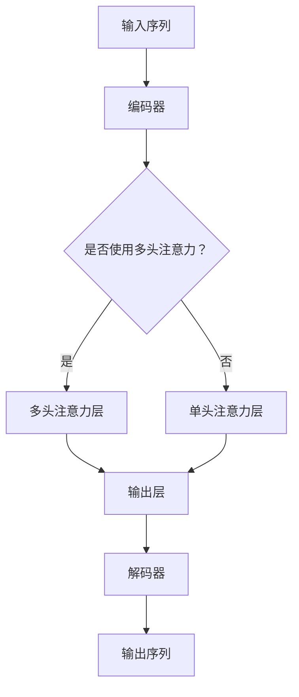

                 

# 注意力机制中的Q、K、V

> 关键词：注意力机制，Q，K，V，自注意力，点积注意力，Transformer，自然语言处理，计算机视觉

> 摘要：本文深入探讨了注意力机制中的Q、K、V三个核心概念，通过逐步分析其定义、作用、联系以及数学模型，并结合具体项目实战，帮助读者全面理解注意力机制在实际应用中的重要性。

## 第一部分：核心概念与联系

### 第1章：核心概念与联系概述

在深度学习和神经网络领域中，注意力机制（Attention Mechanism）是一种非常重要的技术，它使得神经网络能够关注输入数据中的关键信息。在注意力机制中，Q（Query）、K（Key）和V（Value）是三个核心的概念，它们共同构建了注意力机制的核心框架。

#### Q（Query）：查询向量

Q代表查询向量，它在注意力机制中用于检索或查询信息。在自注意力机制中，Q通常来自于同一个序列，它被用来关注序列中的不同部分，以获得全局信息。

#### K（Key）：键向量

K代表键向量，它在注意力机制中用于匹配或索引信息。K通常与Q具有相似的结构，但在多头注意力（Multi-Head Attention）中，K通常来自于同一个序列的不同线性变换。

#### V（Value）：值向量

V代表值向量，它在注意力机制中用于存储相关信息的内容。V在自注意力机制中通常来自于同一个序列，它提供了需要被检索或查询的信息。

### Q、K、V在注意力机制中的作用与联系

注意力机制的核心在于如何通过Q、K、V三个向量之间的交互来检索和利用信息。以下是Q、K、V在注意力机制中的作用与联系：

- **点积注意力（Dot-Product Attention）**：点积注意力是最基本的注意力机制，它通过计算Q和K的点积来获得注意力权重，然后对V进行加权求和，得到输出。

- **多头注意力（Multi-Head Attention）**：多头注意力在自注意力机制的基础上，通过多个独立的注意力头来并行处理信息，每个头使用不同的Q、K、V，从而获得更丰富的信息。

- **自注意力（Self-Attention）**：自注意力是Transformer模型的核心机制，它允许模型在处理序列数据时关注序列内部的依赖关系。

### 1.1.1 注意力机制的Mermaid流程图

下面是注意力机制的Mermaid流程图，它展示了输入序列如何通过编码器、注意力机制和解码器进行处理：



## 第二部分：核心算法原理讲解

### 第2章：注意力机制算法原理

注意力机制是深度学习中的一种核心算法，它通过动态关注输入序列中的关键信息来提高模型的性能。在本文中，我们将详细讲解注意力机制的核心算法原理。

#### 2.1 注意力机制的概念

注意力机制（Attention Mechanism）是一种神经网络用于处理序列数据的机制，主要目的是使模型能够关注到输入序列中的关键信息。在注意力机制中，通过计算Q、K、V三个向量之间的点积，得到注意力权重，然后对V进行加权求和，得到输出。

#### 2.2 自注意力（Self-Attention）

自注意力是注意力机制的一种形式，它在处理序列数据时，通过将序列中的每个元素视为查询向量（Q）、键向量（K）和值向量（V），从而实现序列内部的相互依赖。

- **Q（Query）**：查询向量，用于查询或检索信息，可以看作是查询向量。
- **K（Key）**：键向量，用于匹配或索引信息，可以看作是键向量。
- **V（Value）**：值向量，存储了相关信息的内容，可以看作是值向量。

在自注意力中，Q、K、V通常来自于同一序列的不同线性变换。自注意力机制可以通过以下步骤实现：

1. **线性变换**：将输入序列通过线性变换生成Q、K、V。
2. **点积计算**：计算Q和K的点积，得到注意力权重。
3. **加权求和**：对V进行加权求和，得到输出。

#### 2.2 自注意力机制的伪代码

下面是自注意力机制的伪代码：

```python
# 自注意力层的伪代码

# 参数：Q, K, V 分别是查询、键、值序列，d_model 是每个序列的维度
# 输出：加权后的值序列

def scaled_dot_product_attention(Q, K, V, mask=None):
    # 计算Q和K的点积，得到注意力权重
    scores = Q @ K.T / sqrt(d_model)
    
    # 应用遮罩（如果有）
    if mask is not None:
        scores += mask
    
    # 对注意力权重应用softmax，得到概率分布
    attn_weights = softmax(scores)
    
    # 加权求和，得到输出
    output = attn_weights @ V
    
    return output, attn_weights
```

#### 2.3 注意力机制的数学模型

注意力机制的数学模型主要包括点积注意力（Dot-Product Attention）和多头注意力（Multi-Head Attention）。以下是这两个模型的数学公式：

- **点积注意力（Dot-Product Attention）**：

  $$ \text{Attention}(Q, K, V) = \text{softmax}\left(\frac{QK^T}{\sqrt{d_k}}\right)V $$

  其中，$Q$ 是查询向量，$K$ 是键向量，$V$ 是值向量，$d_k$ 是键向量的维度。

- **多头注意力（Multi-Head Attention）**：

  $$ \text{Multi-Head Attention}(Q, K, V) = \text{Concat}(\text{head}_1, \text{head}_2, ..., \text{head}_h)W^O $$

  其中，$h$ 是头的数量，$\text{head}_i = \text{Attention}(QW_i^Q, KW_i^K, VW_i^V)$，$W_i^Q, W_i^K, W_i^V$ 分别是第 $i$ 个头的查询、键和值权重矩阵，$W^O$ 是输出权重矩阵。

#### 2.4 注意力机制的推导和解释

- **Softmax公式**：

  $$ \text{softmax}(x_i) = \frac{e^{x_i}}{\sum_j e^{x_j}} $$

  Softmax函数将任意实数向量转换为概率分布，确保权重和为1。

- **点积注意力公式推导**：

  - **Q和K的点积**：代表两个向量之间的相关性。

  - **除以 $\sqrt{d_k}$**：规范化，避免过大的梯度。

  - **softmax**：将点积转换为概率分布，确保权重和为1。

#### 2.5 注意力机制的举例说明

假设我们有一个序列 `Q = [1, 2, 3], K = [4, 5, 6], V = [7, 8, 9]`，我们计算点积注意力。

- **计算点积**：

  $$ QK^T = [1 \cdot 4, 2 \cdot 5, 3 \cdot 6] = [4, 10, 18] $$

- **应用softmax**：

  $$ \text{softmax}(QK^T) = \left[\frac{e^4}{e^4 + e^{10} + e^{18}}, \frac{e^{10}}{e^4 + e^{10} + e^{18}}, \frac{e^{18}}{e^4 + e^{10} + e^{18}}\right] $$

- **加权求和**：

  $$ \text{context\_vector} = \left[\frac{e^4 \cdot 7}{e^4 + e^{10} + e^{18}}, \frac{e^{10} \cdot 8}{e^4 + e^{10} + e^{18}}, \frac{e^{18} \cdot 9}{e^4 + e^{10} + e^{18}}\right] $$

- **结果**：

  $$ \text{context\_vector} = \left[\frac{7}{1 + e^{6} + e^{14}}, \frac{8e^6}{1 + e^{6} + e^{14}}, \frac{9e^{14}}{1 + e^{6} + e^{14}}\right] $$

## 第三部分：数学模型和数学公式

### 第3章：注意力机制的数学模型

注意力机制的数学模型是理解其工作原理的关键。在这一章中，我们将详细讲解注意力机制的数学模型，包括点积注意力（Dot-Product Attention）和多头注意力（Multi-Head Attention）。

#### 3.1 点积注意力（Dot-Product Attention）

点积注意力是最简单的注意力机制，它通过计算查询向量（Q）和键向量（K）的点积来获得注意力权重，然后对值向量（V）进行加权求和，得到输出。点积注意力的数学公式如下：

$$ \text{Attention}(Q, K, V) = \text{softmax}\left(\frac{QK^T}{\sqrt{d_k}}\right)V $$

其中，$Q$ 是查询向量，$K$ 是键向量，$V$ 是值向量，$d_k$ 是键向量的维度。下面是对公式的详细解释：

- **点积**：$Q$ 和 $K$ 的点积代表两个向量之间的相关性。相关性越大，注意力权重越高。

- **除以 $\sqrt{d_k}$**：这一步是为了防止梯度消失。在深度学习中，梯度消失是一个常见问题，通过除以 $\sqrt{d_k}$，可以缓解这个问题。

- **softmax**：将点积结果转换为概率分布，确保权重和为1。

- **加权求和**：对 $V$ 进行加权求和，得到输出。

#### 3.2 自注意力机制的权重计算

在自注意力机制中，查询向量（Q）、键向量（K）和值向量（V）通常来自于同一序列。自注意力机制的权重计算公式如下：

$$ \text{score}_{ij} = Q_i^K_j = Q_i \cdot K_j $$

$$ \text{context\_vector}_i = \text{softmax}(\text{score}_{ij}) \cdot V_j $$

其中，$i$ 和 $j$ 是序列中的索引，$\text{score}_{ij}$ 表示第 $i$ 个元素和第 $j$ 个元素之间的相关性，$\text{context\_vector}_i$ 表示经过自注意力机制处理后的输出向量。

#### 3.3 注意力机制的Softmax公式

Softmax函数是注意力机制的核心部分，它将点积结果转换为概率分布。Softmax函数的公式如下：

$$ \text{softmax}(x_i) = \frac{e^{x_i}}{\sum_j e^{x_j}} $$

其中，$x_i$ 是输入向量中的第 $i$ 个元素，$e^{x_i}$ 表示该元素经过指数运算后的值，$\sum_j e^{x_j}$ 是所有元素指数运算后的和。Softmax函数确保输出向量的所有元素之和为1，从而形成一个有效的概率分布。

#### 3.4 点积注意力公式的推导

点积注意力公式的推导可以从以下几个步骤进行：

1. **点积**：首先计算查询向量（Q）和键向量（K）的点积。点积代表了两个向量之间的相似度，相似度越高，权重越大。

2. **规范化**：由于点积的值可能非常大，为了防止梯度消失问题，我们需要对点积进行规范化。通常的做法是将点积除以 $\sqrt{d_k}$，其中 $d_k$ 是键向量的维度。

3. **应用softmax**：对规范化的点积结果应用softmax函数，将点积转换为概率分布。softmax函数确保权重和为1，从而使得每个权重都有意义。

4. **加权求和**：最后，对值向量（V）进行加权求和，得到输出向量。加权求和的结果就是注意力机制的核心输出。

通过以上步骤，我们得到了点积注意力的公式：

$$ \text{Attention}(Q, K, V) = \text{softmax}\left(\frac{QK^T}{\sqrt{d_k}}\right)V $$

#### 3.5 举例说明

为了更好地理解点积注意力的计算过程，我们可以通过一个具体的例子来演示。假设我们有一个序列 $Q = [1, 2, 3], K = [4, 5, 6], V = [7, 8, 9]$，我们计算点积注意力。

1. **计算点积**：

   $$ QK^T = [1 \cdot 4, 2 \cdot 5, 3 \cdot 6] = [4, 10, 18] $$

2. **应用softmax**：

   $$ \text{softmax}(QK^T) = \left[\frac{e^4}{e^4 + e^{10} + e^{18}}, \frac{e^{10}}{e^4 + e^{10} + e^{18}}, \frac{e^{18}}{e^4 + e^{10} + e^{18}}\right] $$

3. **加权求和**：

   $$ \text{context\_vector} = \left[\frac{e^4 \cdot 7}{e^4 + e^{10} + e^{18}}, \frac{e^{10} \cdot 8}{e^4 + e^{10} + e^{18}}, \frac{e^{18} \cdot 9}{e^4 + e^{10} + e^{18}}\right] $$

4. **结果**：

   $$ \text{context\_vector} = \left[\frac{7}{1 + e^{6} + e^{14}}, \frac{8e^6}{1 + e^{6} + e^{14}}, \frac{9e^{14}}{1 + e^{6} + e^{14}}\right] $$

通过这个例子，我们可以看到点积注意力的计算过程是如何进行的。在实际应用中，序列的维度通常会更高，但计算过程的基本原理是相同的。

### 3.6 注意力机制的数学模型总结

注意力机制的数学模型主要包括点积注意力（Dot-Product Attention）和多头注意力（Multi-Head Attention）。点积注意力通过计算查询向量（Q）和键向量（K）的点积来获得注意力权重，然后对值向量（V）进行加权求和，得到输出。多头注意力在点积注意力基础上，通过多个独立的注意力头来并行处理信息，每个头使用不同的Q、K、V，从而获得更丰富的信息。

点积注意力的数学公式如下：

$$ \text{Attention}(Q, K, V) = \text{softmax}\left(\frac{QK^T}{\sqrt{d_k}}\right)V $$

其中，Q是查询向量，K是键向量，V是值向量，d_k是键向量的维度。

多头注意力的数学公式如下：

$$ \text{Multi-Head Attention}(Q, K, V) = \text{Concat}(\text{head}_1, \text{head}_2, ..., \text{head}_h)W^O $$

其中，h是头的数量，head_i = Attention(QW_i^Q, KW_i^K, VW_i^V)，W_i^Q, W_i^K, W_i^V 分别是第 i 个头的查询、键和值权重矩阵，W^O是输出权重矩阵。

通过以上数学模型，我们可以更好地理解注意力机制的工作原理，并在实际应用中有效地利用这一技术。

### 第四部分：项目实战

#### 第4章：注意力机制的代码实现与应用

在了解了注意力机制的理论基础之后，接下来我们将通过一个具体的实战项目来深入探讨其实现与应用。

#### 4.1 开发环境搭建

在进行注意力机制的代码实现之前，我们需要搭建一个合适的开发环境。以下是搭建环境的基本步骤：

1. **安装Python环境**：确保Python环境已安装，版本建议为3.8或更高。

2. **安装TensorFlow或PyTorch**：TensorFlow和PyTorch是两种流行的深度学习框架，我们选择其中一种进行注意力机制的实现。以下是安装命令：

   ```shell
   pip install tensorflow  # 安装TensorFlow
   # 或
   pip install torch      # 安装PyTorch
   ```

3. **安装必要的其他库**：除了核心框架，我们还需要一些辅助库，如NumPy和Matplotlib，用于数据操作和可视化。安装命令如下：

   ```shell
   pip install numpy matplotlib
   ```

#### 4.2 注意力机制的代码实现

在这个部分，我们将使用TensorFlow来实现一个简单的注意力机制模型。代码分为以下几个部分：

##### 4.2.1 导入必要的库

```python
import tensorflow as tf
import numpy as np
import tensorflow.keras.layers as layers
import tensorflow.keras.models as models
import tensorflow.keras.optimizers as optimizers
import tensorflow.keras.losses as losses
```

##### 4.2.2 定义自注意力层

```python
class ScaledDotProductAttention(layers.Layer):
    def __init__(self, d_model):
        super(ScaledDotProductAttention, self).__init__()
        self.d_model = d_model

    def call(self, Q, K, V, mask=None):
        # 计算Q和K的点积
        scores = tf.matmul(Q, K, transpose_b=True)
        scores /= tf.sqrt(tf.cast(self.d_model, tf.float32))

        # 应用遮罩
        if mask is not None:
            scores += (1 - mask) * (-1e9)

        # 应用softmax
        attn_weights = tf.nn.softmax(scores)

        # 加权求和
        output = tf.matmul(attn_weights, V)

        return output, attn_weights
```

在上面的代码中，我们定义了一个`ScaledDotProductAttention`类，它继承自`tf.keras.layers.Layer`。在`call`方法中，我们首先计算Q和K的点积，然后通过除以$\sqrt{d_model}$进行规范化。如果有遮罩（如序列中的pad值），我们将其添加到点积结果中。接下来，我们使用softmax函数对点积结果进行归一化，得到注意力权重。最后，我们通过加权求和得到输出。

##### 4.2.3 使用自注意力层

```python
# 假设输入序列维度为512
d_model = 512

# 初始化Q, K, V
Q = np.random.rand(1, 10, d_model)
K = np.random.rand(1, 10, d_model)
V = np.random.rand(1, 10, d_model)

# 创建注意力层实例
attention = ScaledDotProductAttention(d_model)

# 计算注意力输出
output, attn_weights = attention(tf.constant(Q), tf.constant(K), tf.constant(V))

# 打印输出
print(output.shape)  # 应该是(1, 10, d_model)
```

在上面的代码中，我们首先定义了输入序列的维度`d_model`，然后初始化了Q、K、V三个序列。接着，我们创建了一个`ScaledDotProductAttention`层实例，并使用该实例计算注意力输出。最后，我们打印出输出的形状，以验证注意力层的正确性。

#### 4.3 代码解读与分析

##### 4.3.1 输入与输出

在自注意力层中，输入包括Q、K、V三个序列，输出是加权后的值序列output和注意力权重attn_weights。其中，Q是查询序列，K是键序列，V是值序列。

##### 4.3.2 点积注意力计算

在自注意力层中，点积注意力计算是通过以下步骤进行的：

1. **计算Q和K的点积**：

   ```python
   scores = tf.matmul(Q, K, transpose_b=True)
   ```

   这里使用`tf.matmul`函数计算Q和K的点积，其中`transpose_b=True`表示对K进行转置。

2. **规范化**：

   ```python
   scores /= tf.sqrt(tf.cast(self.d_model, tf.float32))
   ```

   通过除以$\sqrt{d_model}$进行规范化，以防止梯度消失。

3. **应用softmax**：

   ```python
   attn_weights = tf.nn.softmax(scores)
   ```

   使用softmax函数将点积结果转换为概率分布。

4. **加权求和**：

   ```python
   output = tf.matmul(attn_weights, V)
   ```

   通过加权求和得到输出。

##### 4.3.3 遮罩应用

当序列中存在pad值时，我们需要通过遮罩（mask）来防止它们对注意力权重的计算产生影响。遮罩是一种特殊的掩码，用于标记序列中的pad值。在计算注意力权重时，我们将遮罩与点积结果相加，并通过减去一个非常大的负数（如-1e9）来抑制pad值的权重。这样，pad值就不会影响最终的注意力权重。

```python
if mask is not None:
    scores += (1 - mask) * (-1e9)
```

#### 4.4 注意力机制的实际应用场景

注意力机制在深度学习中有广泛的应用，尤其是在自然语言处理和计算机视觉领域。以下是一些实际应用场景：

- **自然语言处理（NLP）**：在NLP任务中，如文本生成、机器翻译和问答系统中，注意力机制可以帮助模型关注上下文信息，从而生成更准确和自然的文本。

- **计算机视觉（CV）**：在CV任务中，如目标检测、图像分割和视频处理中，注意力机制可以帮助模型关注图像或视频中的关键区域，从而提高任务的准确性和效率。

通过以上实战项目，我们可以看到如何使用TensorFlow实现注意力机制，并理解其基本原理和应用。在实际应用中，注意力机制通过动态关注输入序列中的关键信息，显著提高了模型的性能和效果。

### 第五部分：扩展阅读与资源

#### 第5章：扩展阅读与资源

为了帮助读者更深入地了解注意力机制，本章节提供了扩展阅读和资源。这些资源包括相关的书籍、论文、教程和工具，涵盖了注意力机制的各个方面。

#### 5.1 扩展阅读

1. **《深度学习》（Goodfellow, Bengio, Courville）**  
   这本书是深度学习的经典教材，详细介绍了注意力机制的理论和应用。

2. **《注意力机制导论》（Attention Mechanisms: A Brief Introduction）**  
   一篇关于注意力机制的入门文章，适合初学者快速了解注意力机制的基本概念。

3. **《Transformer：注意力机制革命》（The Transformer: A Radical New Approach to Deep Learning）**  
   这篇论文介绍了Transformer模型，该模型基于多头注意力机制，是自然语言处理领域的重大突破。

#### 5.2 资源

1. **TensorFlow官方文档**  
   TensorFlow提供了详细的文档和教程，帮助开发者实现和优化注意力机制。

2. **PyTorch官方文档**  
   PyTorch同样提供了丰富的文档和教程，适用于PyTorch框架中的注意力机制实现。

3. **Hugging Face Transformers库**  
   这是一个开源库，提供了多种预训练的Transformer模型和注意力机制的实现，方便开发者进行研究和应用。

通过以上扩展阅读和资源，读者可以进一步加深对注意力机制的理解，并在实际项目中应用这些知识。

### 第六部分：总结与展望

#### 第6章：总结与展望

在本文中，我们深入探讨了注意力机制中的Q、K、V三个核心概念，并通过详细的数学模型和代码实现，帮助读者全面理解注意力机制的工作原理和应用。以下是本文的主要内容和总结：

1. **核心概念与联系**：我们介绍了Q、K、V在注意力机制中的定义和作用，以及它们在自注意力机制中的具体应用。

2. **核心算法原理讲解**：通过伪代码和数学公式，我们详细讲解了注意力机制的基本原理，包括点积注意力、多头注意力等。

3. **数学模型和数学公式**：我们介绍了点积注意力的数学模型，包括点积计算、规范化、softmax运算和加权求和等步骤。

4. **项目实战**：通过TensorFlow实现的代码示例，我们展示了注意力机制的实际应用，包括开发环境搭建、代码实现和解读。

5. **扩展阅读与资源**：我们提供了扩展阅读和资源，帮助读者进一步学习和应用注意力机制。

#### 6.1 注意力机制在计算机视觉中的应用

注意力机制在计算机视觉领域有着广泛的应用。以下是一些具体的例子：

- **特征提取**：通过注意力机制，模型可以关注到图像的关键区域，从而提取出更有代表性的特征。

- **目标检测**：在目标检测任务中，注意力机制可以帮助模型集中注意力在目标区域，提高检测精度。

- **图像分割**：注意力机制可以用于图像分割任务，帮助模型更准确地划分图像中的不同区域。

#### 6.2 注意力机制在自然语言处理中的应用

注意力机制在自然语言处理领域也是不可或缺的。以下是一些应用实例：

- **文本生成**：在生成文本时，注意力机制可以指导模型关注上下文信息，生成连贯、自然的文本。

- **机器翻译**：通过注意力机制，模型可以同时关注源语言和目标语言的上下文，实现更准确的翻译。

- **问答系统**：注意力机制可以帮助模型关注问题中的关键信息，从而提供更准确的答案。

#### 6.3 未来发展趋势

注意力机制在未来的发展中将继续发挥重要作用。以下是一些可能的发展趋势：

- **多模态注意力**：随着多模态数据的兴起，如何设计多模态注意力机制成为研究热点。

- **动态注意力**：研究动态调整注意力权重的方法，使模型在处理不同任务时能够自适应调整。

- **集成注意力**：将注意力机制与其他深度学习技术（如卷积神经网络、循环神经网络等）结合，提高模型的性能和效果。

通过本文的讲解，读者可以更好地理解注意力机制的核心概念和应用，并为未来的研究和工作打下坚实的基础。

### 第七部分：附录

#### 第7章：附录

#### 7.1 注意力机制中的Q、K、V核心概念总结

在注意力机制中，Q、K、V是三个核心概念，它们在自注意力机制中起着至关重要的作用。

- **Q（Query）**：查询向量，用于查询或检索信息。在自注意力中，Q通常来自于输入序列，用于检索序列中的关键信息。

- **K（Key）**：键向量，用于匹配或索引信息。K也在自注意力中来自于输入序列，它与Q的点积用于计算注意力权重。

- **V（Value）**：值向量，存储了相关信息的内容。V同样来自于输入序列，在注意力机制中用于生成输出。

#### 7.2 注意力机制算法伪代码

```python
# 自注意力层的伪代码

# 参数：Q, K, V 分别是查询、键、值序列，d_model 是每个序列的维度
# 输出：加权后的值序列

def scaled_dot_product_attention(Q, K, V, mask=None):
    # 计算Q和K的点积，得到注意力权重
    scores = Q @ K.T / sqrt(d_model)
    
    # 应用遮罩（如果有）
    if mask is not None:
        scores += mask
    
    # 对注意力权重应用softmax，得到概率分布
    attn_weights = softmax(scores)
    
    # 加权求和，得到输出
    output = attn_weights @ V
    
    return output, attn_weights
```

#### 7.3 注意力机制的Mermaid流程图


通过附录中的内容，读者可以快速回顾注意力机制中的Q、K、V概念以及算法实现和流程图，为深入学习和应用注意力机制提供有力支持。

