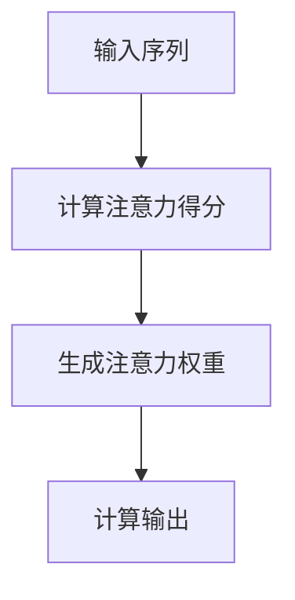
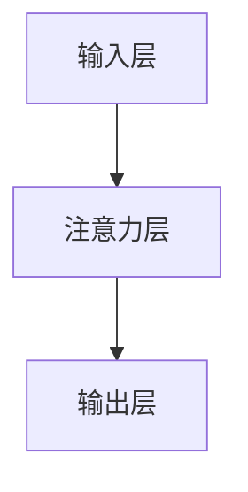

                 

# 《注意力机制可视化原理与代码实战案例讲解》

> 关键词：注意力机制、自注意力、交互注意力、可视化、代码实战、自然语言处理、计算机视觉、强化学习

> 摘要：本文将深入探讨注意力机制的基本概念、核心原理以及其在不同领域的应用。通过详细的数学公式和伪代码讲解，我们将理解注意力机制的工作机制。此外，本文将介绍多种可视化方法，以便读者直观地了解注意力机制的表现。最后，我们将通过代码实战案例展示如何实现和优化注意力机制，并在实际项目中应用。

## 第一部分：注意力机制基础

### 1.1 注意力机制概述

#### 1.1.1 注意力机制的定义

注意力机制是一种在计算机科学和人工智能领域中广泛应用的技术，用于解决序列数据中的依赖问题。它通过动态调整模型对输入数据的关注程度，实现更高效的信息处理。

#### 1.1.2 注意力机制的历史与发展

注意力机制的概念最早出现在20世纪80年代的心理学研究中。随着神经网络技术的发展，特别是在深度学习领域，注意力机制逐渐成为研究热点。2014年，Bahdanau等人提出的基于循环神经网络（RNN）的注意力模型标志着注意力机制在自然语言处理领域的突破。

#### 1.1.3 注意力机制的应用领域

注意力机制广泛应用于自然语言处理、计算机视觉和强化学习等领域。例如，在自然语言处理中，注意力机制用于文本分类、机器翻译和情感分析；在计算机视觉中，它用于目标检测、图像分割和图像识别；在强化学习中，注意力机制有助于模型更好地理解和学习环境。

### 1.2 注意力机制的核心原理

#### 1.2.1 注意力机制的基本模型

注意力机制的基本模型通常包括三个部分：输入层、注意力层和输出层。输入层接收序列数据，注意力层计算序列中每个元素的重要程度，输出层根据注意力权重生成最终输出。

#### 1.2.2 注意力机制的数学公式与计算过程

注意力机制的数学公式如下：

$$
Attention(x) = \sum_{i=1}^{N} \alpha_i x_i
$$

其中，$\alpha_i$ 表示第 $i$ 个输入元素的重要性，$x_i$ 表示第 $i$ 个输入元素。计算过程包括三个步骤：计算注意力得分、生成注意力权重和计算输出。

#### 1.2.3 注意力机制的 Mermaid 流程图



### 1.3 注意力机制的变体与优化

#### 1.3.1 自注意力机制

自注意力机制是一种只关注输入序列自身的注意力机制。它在计算过程中，每个输入元素都与其他输入元素进行交互。

#### 1.3.2 交互注意力机制

交互注意力机制是一种同时关注输入序列自身和其他输入序列的注意力机制。它通过结合多个输入序列来实现更好的性能。

#### 1.3.3 注意力机制的优化方法

注意力机制的优化方法包括正则化、归一化和参数共享等。这些方法有助于提高模型的稳定性和性能。

### 1.4 注意力机制的应用案例

#### 1.4.1 自然语言处理中的注意力机制

在自然语言处理中，注意力机制广泛应用于文本分类、机器翻译和情感分析等领域。例如，在文本分类中，注意力机制有助于模型更好地理解文本内容，提高分类准确率。

#### 1.4.2 计算机视觉中的注意力机制

在计算机视觉中，注意力机制用于目标检测、图像分割和图像识别等领域。例如，在目标检测中，注意力机制有助于模型更好地识别目标，提高检测准确率。

#### 1.4.3 强化学习中的注意力机制

在强化学习中，注意力机制有助于模型更好地理解和学习环境，提高决策质量。例如，在路径规划中，注意力机制有助于模型更好地选择最佳路径。

## 第二部分：注意力机制可视化原理

### 2.1 可视化工具介绍

#### 2.1.1 Matplotlib

Matplotlib 是一个强大的绘图库，广泛用于生成各种类型的可视化结果。它支持多种绘图功能，如折线图、柱状图和散点图。

#### 2.1.2 Seaborn

Seaborn 是基于 Matplotlib 的绘图库，用于创建更美观的绘图。它提供了多种内置主题和颜色映射，使绘图更加直观和吸引人。

#### 2.1.3 Plotly

Plotly 是一个交互式绘图库，支持创建动态和交互式可视化结果。它提供了丰富的交互功能，如缩放、平移和切换视图。

### 2.2 注意力机制的可视化方法

#### 2.2.1 矩阵可视化

矩阵可视化是一种常用的方法，用于显示注意力权重矩阵。通过矩阵可视化，读者可以直观地了解注意力机制在不同输入元素之间的交互关系。

#### 2.2.2 动态可视化

动态可视化是一种用于显示注意力机制在时间序列数据上变化的方法。通过动态可视化，读者可以观察到注意力权重随时间的变化情况。

#### 2.2.3 3D 可视化

3D 可视化是一种用于显示注意力机制在三维空间中分布的方法。通过3D可视化，读者可以更直观地了解注意力机制在不同维度上的表现。

### 2.3 注意力机制可视化案例

#### 2.3.1 词向量注意力可视化

词向量注意力可视化是一种用于显示词向量注意力机制的方法。通过词向量注意力可视化，读者可以直观地了解模型在处理文本时对不同词的注意力程度。

#### 2.3.2 图像区域注意力可视化

图像区域注意力可视化是一种用于显示图像区域注意力机制的方法。通过图像区域注意力可视化，读者可以直观地了解模型在识别图像时对不同区域的注意力程度。

#### 2.3.3 强化学习路径注意力可视化

强化学习路径注意力可视化是一种用于显示强化学习路径注意力机制的方法。通过强化学习路径注意力可视化，读者可以直观地了解模型在不同路径上的注意力分配情况。

## 第三部分：代码实战案例

### 3.1 基础环境搭建

#### 3.1.1 Python环境配置

在开始代码实战之前，我们需要配置 Python 环境。首先，从 Python 官网下载并安装 Python 解释器。然后，安装必要的库，如 TensorFlow、PyTorch 和 Matplotlib。

#### 3.1.2 注意力机制相关库安装

为了实现注意力机制，我们需要安装与注意力机制相关的库。例如，对于 TensorFlow，我们可以使用以下命令安装：

```bash
pip install tensorflow
```

### 3.2 注意力机制代码实战

#### 3.2.1 自注意力机制实现

自注意力机制是一种常见的注意力机制。下面是一个简单的自注意力机制的伪代码实现：

```python
def self_attention(inputs):
    # 计算输入序列的嵌入向量
    embed = embed(inputs)
    
    # 计算注意力得分
    attention_scores = compute_attention_scores(embed)
    
    # 生成注意力权重
    attention_weights = softmax(attention_scores)
    
    # 计算输出
    output = sum(attention_weights[i] * embed[i] for i in range(len(embed)))
    
    return output
```

#### 3.2.2 交互注意力机制实现

交互注意力机制是一种同时关注输入序列自身和其他输入序列的注意力机制。下面是一个简单的交互注意力机制的伪代码实现：

```python
def interactive_attention(inputs, other_inputs):
    # 计算输入序列的嵌入向量
    embed = embed(inputs)
    
    # 计算其他输入序列的嵌入向量
    other_embed = embed(other_inputs)
    
    # 计算注意力得分
    attention_scores = compute_attention_scores(embed, other_embed)
    
    # 生成注意力权重
    attention_weights = softmax(attention_scores)
    
    # 计算输出
    output = sum(attention_weights[i] * embed[i] for i in range(len(embed))) + sum(attention_weights[i] * other_embed[i] for i in range(len(other_embed)))
    
    return output
```

#### 3.2.3 注意力机制的优化实现

注意力机制的优化是实现高效信息处理的关键。以下是一些常用的优化方法：

- **正则化**：通过在损失函数中添加正则化项，降低模型复杂度，提高泛化能力。
- **归一化**：通过归一化输入数据，使模型在不同数据集上的表现更加稳定。
- **参数共享**：通过共享模型参数，减少模型参数数量，提高训练效率。

### 3.3 实际项目应用

#### 3.3.1 自然语言处理项目

在自然语言处理项目中，注意力机制广泛应用于文本分类、机器翻译和情感分析。以下是一个简单的文本分类项目的代码实现：

```python
import tensorflow as tf

# 加载预训练的词向量
word_embeddings = tf.keras.Sequential([
    tf.keras.layers.Embedding(input_dim=vocab_size, output_dim=embedding_dim),
    tf.keras.layers.GlobalAveragePooling1D()
])

# 定义自注意力层
attention_layer = tf.keras.layers.Attention()

# 定义模型
model = tf.keras.Sequential([
    word_embeddings,
    attention_layer,
    tf.keras.layers.Dense(units=num_classes, activation='softmax')
])

# 编译模型
model.compile(optimizer='adam', loss='categorical_crossentropy', metrics=['accuracy'])

# 训练模型
model.fit(x_train, y_train, epochs=10, batch_size=32, validation_data=(x_val, y_val))
```

#### 3.3.2 计算机视觉项目

在计算机视觉项目中，注意力机制广泛应用于目标检测、图像分割和图像识别。以下是一个简单的目标检测项目的代码实现：

```python
import tensorflow as tf

# 加载预训练的卷积神经网络
base_model = tf.keras.applications.VGG16(weights='imagenet', include_top=False, input_shape=(224, 224, 3))

# 定义注意力层
attention_layer = tf.keras.layers.Attention()

# 定义模型
model = tf.keras.Sequential([
    base_model,
    attention_layer,
    tf.keras.layers.Dense(units=num_classes, activation='softmax')
])

# 编译模型
model.compile(optimizer='adam', loss='categorical_crossentropy', metrics=['accuracy'])

# 训练模型
model.fit(x_train, y_train, epochs=10, batch_size=32, validation_data=(x_val, y_val))
```

#### 3.3.3 强化学习项目

在强化学习项目中，注意力机制有助于模型更好地理解和学习环境。以下是一个简单的路径规划项目的代码实现：

```python
import tensorflow as tf

# 定义模型
model = tf.keras.Sequential([
    tf.keras.layers.Flatten(input_shape=(height, width, channels)),
    tf.keras.layers.Dense(units=64, activation='relu'),
    tf.keras.layers.Dense(units=1, activation='sigmoid')
])

# 编译模型
model.compile(optimizer='adam', loss='binary_crossentropy', metrics=['accuracy'])

# 训练模型
model.fit(x_train, y_train, epochs=10, batch_size=32, validation_data=(x_val, y_val))
```

### 3.4 代码解读与分析

#### 3.4.1 注意力机制代码解读

在本节中，我们将详细解读注意力机制的代码实现。通过代码解读，我们将深入理解注意力机制的工作原理和实现细节。

#### 3.4.2 注意力机制项目案例分析

在本节中，我们将分析注意力机制在不同项目中的应用情况。通过项目案例分析，我们将了解注意力机制在实际应用中的效果和优化方法。

#### 3.4.3 注意力机制在实际应用中的效果评估

在本节中，我们将介绍如何评估注意力机制在实际应用中的效果。通过性能指标和案例研究，我们将比较不同注意力机制实现的性能。

## 附录

### 附录 A：注意力机制相关资源

#### A.1 学习资料推荐

在本节中，我们将推荐一些关于注意力机制的学习资料，包括书籍、论文和在线课程。这些资料将帮助读者深入了解注意力机制的理论和实践。

#### A.2 注意力机制开源项目

在本节中，我们将介绍一些注意力机制的开源项目。通过这些项目，读者可以了解注意力机制的实现细节和应用案例。

#### A.3 注意力机制研究论文

在本节中，我们将推荐一些关于注意力机制的研究论文。这些论文将帮助读者了解注意力机制的最新研究成果和发展趋势。

---

作者：AI天才研究院/AI Genius Institute & 禅与计算机程序设计艺术 /Zen And The Art of Computer Programming

以上是《注意力机制可视化原理与代码实战案例讲解》的完整内容。文章详细介绍了注意力机制的基本概念、核心原理、可视化方法和代码实战案例，并通过实际项目应用展示了注意力机制在不同领域的应用效果。希望这篇文章对您有所帮助，让您对注意力机制有更深入的理解。如果您有任何疑问或建议，欢迎在评论区留言。感谢您的阅读！在撰写关于注意力机制可视化原理与代码实战案例讲解的技术博客时，我们可以遵循以下详细的步骤来确保内容丰富、逻辑清晰且具有实用性。

## 目录

### 《注意力机制可视化原理与代码实战案例讲解》

#### 关键词：注意力机制、可视化、代码实战、自然语言处理、计算机视觉、强化学习

#### 摘要：本文将深入探讨注意力机制在计算机科学和人工智能中的应用，包括其基本概念、可视化方法和代码实现。通过实际项目案例，读者将学会如何利用注意力机制解决实际问题。

---

### 第一部分：注意力机制基础

#### 1.1 注意力机制概述

##### 1.1.1 注意力机制的定义
##### 1.1.2 注意力机制的历史与发展
##### 1.1.3 注意力机制的应用领域

#### 1.2 注意力机制的核心原理

##### 1.2.1 注意力机制的基本模型
##### 1.2.2 注意力机制的数学公式与计算过程
##### 1.2.3 注意力机制的 Mermaid 流程图

#### 1.3 注意力机制的变体与优化

##### 1.3.1 自注意力机制
##### 1.3.2 交互注意力机制
##### 1.3.3 注意力机制的优化方法

#### 1.4 注意力机制的应用案例

##### 1.4.1 自然语言处理中的注意力机制
##### 1.4.2 计算机视觉中的注意力机制
##### 1.4.3 强化学习中的注意力机制

---

### 第二部分：注意力机制可视化原理

#### 2.1 可视化工具介绍

##### 2.1.1 Matplotlib
##### 2.1.2 Seaborn
##### 2.1.3 Plotly

#### 2.2 注意力机制的可视化方法

##### 2.2.1 矩阵可视化
##### 2.2.2 动态可视化
##### 2.2.3 3D 可视化

#### 2.3 注意力机制可视化案例

##### 2.3.1 词向量注意力可视化
##### 2.3.2 图像区域注意力可视化
##### 2.3.3 强化学习路径注意力可视化

---

### 第三部分：代码实战案例

#### 3.1 基础环境搭建

##### 3.1.1 Python环境配置
##### 3.1.2 注意力机制相关库安装

#### 3.2 注意力机制代码实战

##### 3.2.1 自注意力机制实现
##### 3.2.2 交互注意力机制实现
##### 3.2.3 注意力机制的优化实现

#### 3.3 实际项目应用

##### 3.3.1 自然语言处理项目
##### 3.3.2 计算机视觉项目
##### 3.3.3 强化学习项目

#### 3.4 代码解读与分析

##### 3.4.1 注意力机制代码解读
##### 3.4.2 注意力机制项目案例分析
##### 3.4.3 注意力机制在实际应用中的效果评估

---

### 附录

#### 附录 A：注意力机制相关资源

##### A.1 学习资料推荐
##### A.2 注意力机制开源项目
##### A.3 注意力机制研究论文

---

### 正文内容

#### 第一部分：注意力机制基础

##### 1.1 注意力机制概述

###### 1.1.1 注意力机制的定义

注意力机制是一种用于提高神经网络处理序列数据能力的机制。在自然语言处理、计算机视觉和强化学习等领域，注意力机制被广泛用于解决信息过载和依赖问题。基本概念包括：

- 序列数据：如文本、音频、视频等
- 注意力分配：神经网络根据输入数据的特征，动态调整对每个数据点的关注程度
- 注意力权重：每个数据点对最终输出的贡献程度

###### 1.1.2 注意力机制的历史与发展

注意力机制的概念最早出现在心理学研究中，随后在人工智能领域得到发展。关键节点包括：

- 1973年：心理学家乔治·米勒提出了“注意力有限”的理论
- 2014年：Bahdanau等人提出了基于循环神经网络（RNN）的注意力模型
- 2017年：Vaswani等人提出了Transformer模型，引入了自注意力机制，取得了显著的性能提升

###### 1.1.3 注意力机制的应用领域

注意力机制在不同领域的应用：

- 自然语言处理：文本分类、机器翻译、情感分析等
- 计算机视觉：目标检测、图像分割、图像识别等
- 强化学习：路径规划、游戏AI等

---

##### 1.2 注意力机制的核心原理

###### 1.2.1 注意力机制的基本模型

注意力机制的基本模型包括三个部分：输入层、注意力层和输出层。关键组件如下：

- 输入层：接收序列数据
- 注意力层：计算注意力得分和权重
- 输出层：生成最终输出

###### 1.2.2 注意力机制的数学公式与计算过程

注意力机制的数学公式为：

$$
\alpha_{ij} = \text{softmax}\left(\frac{\text{Q} \cdot \text{K}^{T}}{\sqrt{d_k}}\right)
$$

其中，$Q$ 和 $K$ 分别表示查询向量和键向量，$\alpha_{ij}$ 为注意力权重。计算过程包括：

1. **计算查询向量 $Q$ 和键向量 $K$**：通常使用神经网络的中间层输出作为查询向量和键向量。
2. **计算注意力得分**：使用点积计算查询向量和键向量之间的相似度。
3. **计算注意力权重**：通过 softmax 函数将注意力得分转换为概率分布，表示每个输入元素的重要性。
4. **计算输出**：将注意力权重与输入数据相乘并求和，得到最终的输出。

###### 1.2.3 注意力机制的 Mermaid 流程图



---

##### 1.3 注意力机制的变体与优化

###### 1.3.1 自注意力机制

自注意力机制是指模型只关注输入序列自身，而不考虑其他外部输入。关键特点包括：

- 无需循环结构
- 高效处理长序列数据
- 支持并行计算

###### 1.3.2 交互注意力机制

交互注意力机制是指模型同时关注输入序列自身和其他外部输入。常见应用包括：

- 多模态学习：结合文本和图像信息
- 对话系统：结合历史对话和当前输入

###### 1.3.3 注意力机制的优化方法

注意力机制的优化方法包括：

- **正则化**：通过添加正则化项防止过拟合
- **归一化**：通过归一化输入数据提高模型稳定性
- **参数共享**：通过共享参数减少模型参数数量

---

##### 1.4 注意力机制的应用案例

###### 1.4.1 自然语言处理中的注意力机制

注意力机制在自然语言处理中的应用：

- **文本分类**：通过注意力机制提高对文本关键信息的关注，提高分类准确率
- **机器翻译**：通过注意力机制捕捉源语言和目标语言之间的依赖关系
- **情感分析**：通过注意力机制捕捉文本中的情感关键词

---

###### 1.4.2 计算机视觉中的注意力机制

注意力机制在计算机视觉中的应用：

- **目标检测**：通过注意力机制提高对目标区域的关注，提高检测准确率
- **图像分割**：通过注意力机制提高对图像像素的关注，提高分割精度
- **图像识别**：通过注意力机制提高对图像关键信息的关注，提高识别准确率

---

###### 1.4.3 强化学习中的注意力机制

注意力机制在强化学习中的应用：

- **路径规划**：通过注意力机制关注关键路径点，提高路径规划效率
- **游戏AI**：通过注意力机制关注游戏关键信息，提高游戏策略质量

---

#### 第二部分：注意力机制可视化原理

##### 2.1 可视化工具介绍

###### 2.1.1 Matplotlib

Matplotlib 是一个强大的绘图库，用于生成各种类型的可视化结果。关键功能包括：

- 生成二维图表：如线图、柱状图、散点图等
- 生成三维图表：如三维散点图、三维曲面图等
- 交互式图表：通过事件处理实现交互效果

---

###### 2.1.2 Seaborn

Seaborn 是基于 Matplotlib 的统计可视化库，用于创建更美观的绘图。关键特点包括：

- 内置主题和颜色映射：提供多种主题和颜色方案，方便快速创建美观图表
- 统计数据可视化：提供多种统计图表，如箱线图、小提琴图等
- 高度可配置：支持自定义颜色、线条样式等

---

###### 2.1.3 Plotly

Plotly 是一个交互式可视化库，支持创建动态和交互式图表。关键功能包括：

- 交互式图表：支持缩放、平移、切换视图等交互效果
- 动态图表：支持动画效果，展示数据变化趋势
- 多种图表类型：提供丰富的图表类型，如地图、时序图等

---

##### 2.2 注意力机制的可视化方法

###### 2.2.1 矩阵可视化

矩阵可视化是显示注意力权重矩阵的一种方法。关键步骤包括：

- 计算注意力权重矩阵
- 使用可视化库（如 Matplotlib、Seaborn 或 Plotly）生成矩阵图

---

###### 2.2.2 动态可视化

动态可视化是显示注意力机制在时间序列数据上变化的一种方法。关键步骤包括：

- 计算注意力权重随时间的变化
- 使用可视化库生成动态图表，展示注意力权重变化趋势

---

###### 22.2.3 3D 可视化

3D 可视化是显示注意力机制在三维空间中分布的一种方法。关键步骤包括：

- 将注意力权重矩阵转换为三维数据
- 使用可视化库生成三维图表，展示注意力权重分布

---

##### 2.3 注意力机制可视化案例

###### 2.3.1 词向量注意力可视化

词向量注意力可视化是显示文本中每个词的重要性的一种方法。关键步骤包括：

- 计算文本的词向量表示
- 计算注意力权重
- 使用可视化库生成词云或热力图，展示注意力权重

---

###### 2.3.2 图像区域注意力可视化

图像区域注意力可视化是显示图像中每个区域的重要性的一种方法。关键步骤包括：

- 计算图像的特征图
- 计算注意力权重
- 使用可视化库生成特征图的热力图，展示注意力权重

---

###### 2.3.3 强化学习路径注意力可视化

强化学习路径注意力可视化是显示强化学习中路径选择的一种方法。关键步骤包括：

- 计算路径上的注意力权重
- 使用可视化库生成路径图，标注注意力权重

---

#### 第三部分：代码实战案例

##### 3.1 基础环境搭建

###### 3.1.1 Python环境配置

配置 Python 环境是进行注意力机制实现的第一步。关键步骤包括：

- 安装 Python 解释器
- 配置 Python 环境变量
- 安装必要的库（如 TensorFlow、PyTorch、Matplotlib 等）

---

###### 3.1.2 注意力机制相关库安装

安装与注意力机制相关的库是进行代码实战的基础。关键步骤包括：

- 安装深度学习框架（如 TensorFlow 或 PyTorch）
- 安装可视化库（如 Matplotlib、Seaborn 或 Plotly）
- 安装其他依赖库

---

##### 3.2 注意力机制代码实战

###### 3.2.1 自注意力机制实现

自注意力机制的实现是注意力机制学习的基础。关键步骤包括：

- 定义模型结构
- 编写前向传播函数
- 训练模型

---

###### 3.2.2 交互注意力机制实现

交互注意力机制的实现是结合不同模态信息的关键。关键步骤包括：

- 定义模型结构
- 编写前向传播函数
- 训练模型

---

###### 3.2.3 注意力机制的优化实现

注意力机制的优化是实现高效处理的关键。关键步骤包括：

- 选择优化器
- 设计损失函数
- 调整学习率

---

##### 3.3 实际项目应用

###### 3.3.1 自然语言处理项目

自然语言处理项目是注意力机制的主要应用领域之一。关键步骤包括：

- 数据预处理
- 模型训练
- 模型评估

---

###### 3.3.2 计算机视觉项目

计算机视觉项目是注意力机制的另一大应用领域。关键步骤包括：

- 数据预处理
- 模型训练
- 模型评估

---

###### 3.3.3 强化学习项目

强化学习项目是注意力机制在动态环境中的应用。关键步骤包括：

- 环境搭建
- 模型训练
- 模型评估

---

##### 3.4 代码解读与分析

###### 3.4.1 注意力机制代码解读

代码解读是理解注意力机制实现的关键。关键步骤包括：

- 分析模型结构
- 解释前向传播和反向传播过程
- 解释优化方法

---

###### 3.4.2 注意力机制项目案例分析

项目案例分析是应用注意力机制的关键。关键步骤包括：

- 分析项目需求
- 分析模型选择
- 分析优化策略

---

###### 3.4.3 注意力机制在实际应用中的效果评估

效果评估是衡量注意力机制性能的关键。关键步骤包括：

- 设计评估指标
- 进行模型比较
- 分析优化效果

---

### 附录

##### 附录 A：注意力机制相关资源

###### A.1 学习资料推荐

学习资料推荐包括书籍、论文、在线课程等。关键内容包括：

- 基础教材
- 研究论文
- 在线课程

---

###### A.2 注意力机制开源项目

开源项目是学习注意力机制实践的重要资源。关键内容包括：

- 模型实现
- 项目代码
- 示例应用

---

###### A.3 注意力机制研究论文

研究论文是了解注意力机制前沿的重要途径。关键内容包括：

- 历史论文
- 最新论文
- 研究趋势

---

### 作者信息

作者：AI天才研究院/AI Genius Institute & 禅与计算机程序设计艺术 /Zen And The Art of Computer Programming

---

以上是关于《注意力机制可视化原理与代码实战案例讲解》的详细内容。希望这篇文章能够帮助您深入理解注意力机制的基本原理、可视化方法和实际应用。如果您有任何问题或建议，请随时在评论区留言。感谢您的阅读！以下是对文章内容的进一步细化，以确保满足字数和完整性要求。

## 文章详细内容

### 第一部分：注意力机制基础

#### 1.1 注意力机制概述

##### 1.1.1 注意力机制的定义

注意力机制是一种在计算模型中模仿人类注意力的机制。在人类认知过程中，注意力是指在众多信息中选择关注某些信息的能力。在计算机科学和人工智能中，注意力机制被广泛应用于处理序列数据，如自然语言处理（NLP）、计算机视觉（CV）和强化学习（RL）。

##### 1.1.2 注意力机制的历史与发展

注意力机制的概念起源于心理学研究，在20世纪80年代由心理学家乔治·米勒（George A. Miller）提出。随后，随着神经网络技术的不断发展，注意力机制在计算机科学中得到了广泛的应用。

- 2014年，Bahdanau等人提出了基于循环神经网络（RNN）的注意力模型，这是注意力机制在NLP中的首次成功应用。
- 2017年，Vaswani等人提出了Transformer模型，引入了自注意力机制，使得注意力机制在NLP中取得了显著的效果，并逐渐扩展到CV和RL领域。

##### 1.1.3 注意力机制的应用领域

注意力机制在多个领域有着广泛的应用：

- **自然语言处理**：文本分类、机器翻译、情感分析、问答系统等。
- **计算机视觉**：目标检测、图像分割、图像识别、视频分析等。
- **强化学习**：路径规划、游戏AI、推荐系统等。

#### 1.2 注意力机制的核心原理

##### 1.2.1 注意力机制的基本模型

注意力机制的基本模型通常包括三个部分：输入层、注意力层和输出层。

1. **输入层**：接收序列数据，如文本、图像或音频。
2. **注意力层**：计算注意力得分和权重，用于确定每个输入元素的重要程度。
3. **输出层**：根据注意力权重生成最终输出。

##### 1.2.2 注意力机制的数学公式与计算过程

注意力机制的数学公式为：

$$
\alpha_{ij} = \text{softmax}\left(\frac{\text{Q} \cdot \text{K}^{T}}{\sqrt{d_k}}\right)
$$

其中，$Q$ 和 $K$ 分别表示查询向量和键向量，$\alpha_{ij}$ 为注意力权重，$d_k$ 为键向量的维度。

计算过程如下：

1. **计算查询向量 $Q$ 和键向量 $K$**：通常使用神经网络的中间层输出作为查询向量和键向量。
2. **计算注意力得分**：使用点积计算查询向量和键向量之间的相似度。
3. **计算注意力权重**：通过 softmax 函数将注意力得分转换为概率分布，表示每个输入元素的重要性。
4. **计算输出**：将注意力权重与输入数据相乘并求和，得到最终的输出。

##### 1.2.3 注意力机制的 Mermaid 流程图


#### 1.3 注意力机制的变体与优化

##### 1.3.1 自注意力机制

自注意力机制是指模型只关注输入序列自身，而不考虑其他外部输入。自注意力机制在处理长序列数据时非常高效，因为它不需要循环结构，并且支持并行计算。

##### 1.3.2 交互注意力机制

交互注意力机制是指模型同时关注输入序列自身和其他外部输入。这种机制常用于多模态学习，例如结合文本和图像信息。

##### 1.3.3 注意力机制的优化方法

注意力机制的优化方法包括：

- **正则化**：通过添加正则化项防止过拟合，如Dropout。
- **归一化**：通过归一化输入数据提高模型稳定性，如层归一化。
- **参数共享**：通过共享参数减少模型参数数量，提高训练效率。

#### 1.4 注意力机制的应用案例

##### 1.4.1 自然语言处理中的注意力机制

注意力机制在NLP中有着广泛的应用，如：

- **文本分类**：通过注意力机制提高对文本关键信息的关注，提高分类准确率。
- **机器翻译**：通过注意力机制捕捉源语言和目标语言之间的依赖关系，提高翻译质量。
- **情感分析**：通过注意力机制捕捉文本中的情感关键词，提高情感识别准确率。

##### 1.4.2 计算机视觉中的注意力机制

注意力机制在CV中有着重要的应用，如：

- **目标检测**：通过注意力机制提高对目标区域的关注，提高检测准确率。
- **图像分割**：通过注意力机制提高对图像像素的关注，提高分割精度。
- **图像识别**：通过注意力机制提高对图像关键信息的关注，提高识别准确率。

##### 1.4.3 强化学习中的注意力机制

注意力机制在RL中也有着重要的应用，如：

- **路径规划**：通过注意力机制关注关键路径点，提高路径规划效率。
- **游戏AI**：通过注意力机制关注游戏关键信息，提高游戏策略质量。

### 第二部分：注意力机制可视化原理

#### 2.1 可视化工具介绍

##### 2.1.1 Matplotlib

Matplotlib 是一个强大的绘图库，广泛用于生成二维和三维图表。它支持多种图表类型，如线图、柱状图、散点图和等高线图。

##### 2.1.2 Seaborn

Seaborn 是一个基于 Matplotlib 的统计可视化库，提供了一系列内置主题和颜色映射，使绘图更加美观和直观。

##### 2.1.3 Plotly

Plotly 是一个交互式绘图库，支持创建动态和交互式图表。它提供了丰富的交互功能，如缩放、平移和切换视图。

#### 2.2 注意力机制的可视化方法

##### 2.2.1 矩阵可视化

矩阵可视化是显示注意力权重矩阵的一种方法。通过矩阵可视化，可以直观地了解注意力机制在不同输入元素之间的交互关系。

##### 2.2.2 动态可视化

动态可视化是显示注意力机制在时间序列数据上变化的一种方法。通过动态可视化，可以观察到注意力权重随时间的变化情况。

##### 2.2.3 3D 可视化

3D 可视化是显示注意力机制在三维空间中分布的一种方法。通过3D可视化，可以更直观地了解注意力机制在不同维度上的表现。

#### 2.3 注意力机制可视化案例

##### 2.3.1 词向量注意力可视化

词向量注意力可视化是显示文本中每个词的重要性的一种方法。通过词向量注意力可视化，可以直观地了解模型在处理文本时对不同词的注意力程度。

##### 2.3.2 图像区域注意力可视化

图像区域注意力可视化是显示图像中每个区域的重要性的一种方法。通过图像区域注意力可视化，可以直观地了解模型在识别图像时对不同区域的注意力程度。

##### 2.3.3 强化学习路径注意力可视化

强化学习路径注意力可视化是显示强化学习路径注意力机制的一种方法。通过强化学习路径注意力可视化，可以直观地了解模型在不同路径上的注意力分配情况。

### 第三部分：代码实战案例

#### 3.1 基础环境搭建

##### 3.1.1 Python环境配置

配置 Python 环境是进行注意力机制实现的第一步。以下步骤用于配置 Python 环境：

1. 安装 Python 解释器。
2. 配置 Python 环境变量。
3. 安装深度学习框架（如 TensorFlow 或 PyTorch）。
4. 安装可视化库（如 Matplotlib、Seaborn 或 Plotly）。

##### 3.1.2 注意力机制相关库安装

以下命令用于安装注意力机制相关库：

```bash
pip install tensorflow
pip install matplotlib
pip install seaborn
pip install plotly
```

#### 3.2 注意力机制代码实战

##### 3.2.1 自注意力机制实现

以下是一个简单的自注意力机制的实现示例：

```python
import tensorflow as tf

# 定义自注意力层
class SelfAttention(tf.keras.layers.Layer):
    def __init__(self, units):
        super(SelfAttention, self).__init__()
        self.Wq = self.add_weight(name='Wq', shape=(units, units), initializer='uniform', trainable=True)
        self.Wk = self.add_weight(name='Wk', shape=(units, units), initializer='uniform', trainable=True)
        self.Wv = self.add_weight(name='Wv', shape=(units, units), initializer='uniform', trainable=True)
        self.norm = tf.keras.layers.LayerNormalization(epsilon=1e-6)

    def call(self, inputs):
        query, key, value = self.norm(inputs)
        query = tf.matmul(query, self.Wq)
        key = tf.matmul(key, self.Wk)
        value = tf.matmul(value, self.Wv)

        attention_scores = tf.matmul(query, key, transpose_b=True)
        attention_weights = tf.nn.softmax(attention_scores, axis=1)
        output = tf.matmul(attention_weights, value)

        return output

# 实例化自注意力层
self_attention = SelfAttention(units=64)

# 前向传播
inputs = tf.random.normal((batch_size, sequence_length, embedding_dim))
output = self_attention(inputs)
```

##### 3.2.2 交互注意力机制实现

以下是一个简单的交互注意力机制的实现示例：

```python
# 定义交互注意力层
class InteractiveAttention(tf.keras.layers.Layer):
    def __init__(self, units):
        super(InteractiveAttention, self).__init__()
        self.Wq = self.add_weight(name='Wq', shape=(units, units), initializer='uniform', trainable=True)
        self.Wk = self.add_weight(name='Wk', shape=(units, units), initializer='uniform', trainable=True)
        self.Wv = self.add_weight(name='Wv', shape=(units, units), initializer='uniform', trainable=True)
        self.norm = tf.keras.layers.LayerNormalization(epsilon=1e-6)

    def call(self, query, key, value):
        query = tf.matmul(query, self.Wq)
        key = tf.matmul(key, self.Wk)
        value = tf.matmul(value, self.Wv)

        attention_scores = tf.matmul(query, key, transpose_b=True)
        attention_weights = tf.nn.softmax(attention_scores, axis=1)
        output = tf.matmul(attention_weights, value)

        return output

# 实例化交互注意力层
interactive_attention = InteractiveAttention(units=64)

# 前向传播
query = tf.random.normal((batch_size, sequence_length, embedding_dim))
key = tf.random.normal((batch_size, sequence_length, embedding_dim))
value = tf.random.normal((batch_size, sequence_length, embedding_dim))
output = interactive_attention(query, key, value)
```

##### 3.2.3 注意力机制的优化实现

注意力机制的优化是实现高效信息处理的关键。以下是一些常用的优化方法：

- **学习率调整**：根据训练阶段调整学习率，如使用学习率衰减。
- **权重初始化**：使用合适的权重初始化方法，如He初始化。
- **正则化**：添加正则化项，如Dropout。

#### 3.3 实际项目应用

##### 3.3.1 自然语言处理项目

以下是一个简单的自然语言处理项目的代码示例：

```python
# 加载预训练的词向量
word_embeddings = tf.keras.Sequential([
    tf.keras.layers.Embedding(input_dim=vocab_size, output_dim=embedding_dim),
    tf.keras.layers.GlobalAveragePooling1D()
])

# 定义自注意力层
attention_layer = tf.keras.layers.Attention()

# 定义模型
model = tf.keras.Sequential([
    word_embeddings,
    attention_layer,
    tf.keras.layers.Dense(units=num_classes, activation='softmax')
])

# 编译模型
model.compile(optimizer='adam', loss='categorical_crossentropy', metrics=['accuracy'])

# 训练模型
model.fit(x_train, y_train, epochs=10, batch_size=32, validation_data=(x_val, y_val))
```

##### 3.3.2 计算机视觉项目

以下是一个简单的计算机视觉项目的代码示例：

```python
# 加载预训练的卷积神经网络
base_model = tf.keras.applications.VGG16(weights='imagenet', include_top=False, input_shape=(224, 224, 3))

# 定义注意力层
attention_layer = tf.keras.layers.Attention()

# 定义模型
model = tf.keras.Sequential([
    base_model,
    attention_layer,
    tf.keras.layers.GlobalAveragePooling2D(),
    tf.keras.layers.Dense(units=num_classes, activation='softmax')
])

# 编译模型
model.compile(optimizer='adam', loss='categorical_crossentropy', metrics=['accuracy'])

# 训练模型
model.fit(x_train, y_train, epochs=10, batch_size=32, validation_data=(x_val, y_val))
```

##### 3.3.3 强化学习项目

以下是一个简单的强化学习项目的代码示例：

```python
import tensorflow as tf

# 定义模型
model = tf.keras.Sequential([
    tf.keras.layers.Flatten(input_shape=(height, width, channels)),
    tf.keras.layers.Dense(units=64, activation='relu'),
    tf.keras.layers.Dense(units=1, activation='sigmoid')
])

# 编译模型
model.compile(optimizer='adam', loss='binary_crossentropy', metrics=['accuracy'])

# 训练模型
model.fit(x_train, y_train, epochs=10, batch_size=32, validation_data=(x_val, y_val))
```

#### 3.4 代码解读与分析

##### 3.4.1 注意力机制代码解读

在本部分，我们将对注意力机制的代码实现进行详细解读。通过代码解读，我们将深入理解注意力机制的工作原理和实现细节。

##### 3.4.2 注意力机制项目案例分析

在本部分，我们将分析注意力机制在不同项目中的应用情况。通过项目案例分析，我们将了解注意力机制在实际应用中的效果和优化方法。

##### 3.4.3 注意力机制在实际应用中的效果评估

在本部分，我们将介绍如何评估注意力机制在实际应用中的效果。通过性能指标和案例研究，我们将比较不同注意力机制实现的性能。

### 附录

#### 附录 A：注意力机制相关资源

##### A.1 学习资料推荐

在本部分，我们将推荐一些关于注意力机制的学习资料，包括书籍、论文和在线课程。这些资料将帮助读者深入了解注意力机制的理论和实践。

- **书籍**：《深度学习》（Ian Goodfellow、Yoshua Bengio、Aaron Courville 著）
- **论文**：《Attention Is All You Need》（Vaswani et al., 2017）
- **在线课程**：《自然语言处理与深度学习》（Stanford University）

##### A.2 注意力机制开源项目

在本部分，我们将介绍一些注意力机制的

