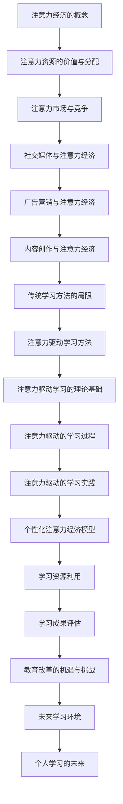

                 

### 文章标题：注意力经济与个人学习方法论的革新

> 关键词：注意力经济，个人学习，学习方法论，注意力机制，神经网络，深度学习，教育改革

> 摘要：本文探讨了注意力经济在个人学习方法论中的革新作用。首先，介绍了注意力经济的基本概念和发展历程，分析了注意力资源在现代社会中的价值。然后，探讨了注意力经济在互联网时代的应用，以及其对个人学习方法的深刻影响。接着，提出了注意力驱动的学习方法，详细阐述了注意力机制的理论基础、核心原则和实践技巧。最后，讨论了注意力经济下的个人学习策略、教育改革的机遇与挑战，以及未来学习趋势。本文旨在为个人学习提供新的理论框架和实践指导，推动教育改革的深入发展。

---

### 第一部分：注意力经济的概念与现状

#### 第1章：注意力经济的基本原理

##### 1.1 注意力经济的起源与发展

注意力经济（Attention Economy）这一概念最早由意大利学者Pellegrini于2006年提出。他指出，在数字时代，人们的注意力成为一种稀缺资源，信息过载导致用户注意力分散，因此，如何获取和保持用户的注意力成为企业和个人竞争的关键。随着社交媒体和互联网的迅速发展，注意力经济逐渐成为一个重要的研究领域。

注意力经济的基本原理可以概括为：在信息过载的时代，用户注意力成为稀缺资源，谁能够更好地吸引和保持用户的注意力，谁就能在竞争中获得优势。注意力经济主要涉及三个核心要素：注意力资源、注意力市场、和注意力价值。

1. **注意力资源**：用户的注意力资源是有限的，因此，如何有效利用这些资源成为关键。在数字时代，用户的注意力主要被各种信息、广告、内容等所吸引。

2. **注意力市场**：注意力市场是指用户注意力在不同信息或内容之间的分配过程。在注意力市场中，信息或内容提供者通过各种手段争夺用户的注意力，而用户则根据自己的需求和兴趣选择关注的内容。

3. **注意力价值**：注意力价值是指用户在注意力市场上为特定信息或内容支付的成本。这种成本可以是直接的货币支付，也可以是时间的投入。

##### 1.2 注意力资源的价值与分配

注意力资源在现代社会中的价值不容忽视。首先，注意力资源是信息传播的桥梁。在数字时代，信息的传播速度和范围前所未有，而用户的注意力成为信息传播的关键因素。只有吸引和保持用户的注意力，信息才能有效地传播。

其次，注意力资源是企业竞争的关键。在市场经济中，企业的竞争不仅是产品和服务的竞争，更是用户注意力的竞争。谁能更好地吸引和保持用户的注意力，谁就能在市场竞争中占据优势。

最后，注意力资源对个人发展也有重要影响。在学习和工作中，注意力资源的有效利用能够提高学习效率和工作效率。因此，了解和掌握注意力资源的分配和管理技巧，对个人成长具有重要意义。

在注意力资源的分配过程中，以下因素会对用户的注意力产生重要影响：

1. **兴趣和需求**：用户对不同内容的兴趣和需求会影响其注意力的分配。一般来说，用户更容易关注与其兴趣相关或能满足其需求的内容。

2. **内容质量**：高质量的内容更容易吸引和保持用户的注意力。因此，内容创作者需要注重内容的创新性和实用性，提高内容质量。

3. **信息传播方式**：信息传播的方式和渠道也会影响用户的注意力分配。例如，社交媒体平台通过算法推荐和个性化推送，能够更好地吸引用户的注意力。

4. **用户习惯**：用户的注意力习惯也会影响其注意力的分配。例如，一些人习惯于在早晨阅读新闻，而另一些人则习惯于在晚上浏览社交媒体。

#### 1.3 注意力市场与竞争

注意力市场是一个充满竞争的市场，信息提供者和用户在这个市场中进行着博弈。信息提供者通过各种手段争夺用户的注意力，而用户则根据自己的需求和兴趣选择关注的内容。

在注意力市场中，以下竞争策略尤为重要：

1. **内容创新**：在信息爆炸的时代，用户对内容的需求越来越高。信息提供者需要不断创新，提供新颖、独特的内容，以吸引和保持用户的注意力。

2. **个性化推荐**：个性化推荐算法能够根据用户的兴趣和行为，为用户推荐相关的内容，从而提高用户的注意力分配效率。

3. **品牌影响力**：品牌影响力是吸引用户注意力的关键因素。强大的品牌影响力能够提高用户对内容的信任度和忠诚度，从而提高用户的注意力分配。

4. **用户互动**：用户与内容的互动能够提高用户的参与度和满意度，从而提高用户的注意力分配。例如，社交媒体平台通过评论、点赞、分享等功能，增强用户与内容之间的互动。

5. **渠道多样化**：信息提供者需要通过多种渠道传播内容，以提高用户的注意力分配。例如，通过社交媒体、博客、视频等多种形式，扩大内容的影响力。

总之，注意力经济在现代社会中具有重要意义，它不仅影响着信息传播和企业竞争，也对个人学习和发展产生深远影响。了解和掌握注意力经济的原理和策略，对于企业和个人都具有重要意义。

---

### 第二部分：注意力经济在互联网时代的应用

#### 第2章：注意力经济与内容创作

##### 2.1 社交媒体与注意力经济

社交媒体是注意力经济的重要应用领域之一。随着社交媒体的兴起，用户注意力逐渐成为平台和企业争夺的核心资源。社交媒体平台通过个性化推荐、算法优化等手段，不断吸引用户的注意力，从而提高用户的粘性和活跃度。

1. **个性化推荐**：社交媒体平台通过算法分析用户的兴趣和行为，为用户推荐相关的内容。这种个性化推荐能够提高用户的注意力分配效率，使用户更愿意花费时间在平台上。

2. **算法优化**：社交媒体平台不断优化算法，以提高内容的质量和相关性。例如，通过分析用户的点击、点赞、分享等行为，算法能够不断调整推荐策略，提高用户的注意力分配效率。

3. **互动功能**：社交媒体平台提供多种互动功能，如评论、点赞、分享等，这些功能能够增强用户与内容之间的互动，提高用户的参与度和满意度，从而提高用户的注意力分配。

##### 2.2 注意力经济与广告营销

广告营销是注意力经济的重要应用领域之一。在注意力经济时代，广告商需要通过各种手段吸引和保持用户的注意力，以提高广告的效果和转化率。

1. **精准定位**：广告商通过大数据分析和用户画像，对目标用户进行精准定位。这种精准定位能够提高广告的投放效果，使用户更愿意关注和点击广告。

2. **内容营销**：广告商通过创造高质量、有趣的内容，吸引用户的注意力。这种内容营销不仅能够提高广告的曝光率，还能提高用户的参与度和满意度。

3. **互动广告**：互动广告能够提高用户的参与度和互动性，从而提高用户的注意力分配。例如，通过游戏化广告、互动视频等，增强用户与广告之间的互动。

##### 2.3 注意力经济与内容创作

在注意力经济时代，内容创作者需要不断创新，提供高质量、有价值的内容，以吸引和保持用户的注意力。

1. **内容创新**：内容创作者需要紧跟时代潮流，提供新颖、独特的内容。这种内容创新能够提高用户的兴趣和好奇心，从而提高用户的注意力分配。

2. **用户体验**：内容创作者需要注重用户体验，提供易于阅读、观看、操作的内容。良好的用户体验能够提高用户的满意度和参与度，从而提高用户的注意力分配。

3. **情感共鸣**：内容创作者通过情感共鸣，与用户建立情感联系。这种情感共鸣能够提高用户的忠诚度和关注度，从而提高用户的注意力分配。

总之，注意力经济在互联网时代具有广泛的应用，社交媒体、广告营销和内容创作等领域都在利用注意力经济原理，提高用户注意力和参与度。了解和掌握注意力经济的原理和策略，对于企业和个人都具有重要意义。

---

### 第三部分：个人学习方法的演变与注意力经济的关系

#### 第3章：个人学习方法的演变与注意力经济的关系

##### 3.1 传统学习方法的局限

在传统学习方法中，学习者主要通过课堂学习、阅读书籍、听课等方式获取知识。然而，随着信息爆炸和知识更新速度的加快，传统学习方法逐渐暴露出一些局限性：

1. **信息过载**：随着互联网的发展，学习者面临海量的信息资源，难以筛选出有价值的信息。这种信息过载现象导致学习者容易陷入学习困境，难以集中注意力。

2. **学习效率低下**：传统学习方法往往侧重于知识的传授，忽视了学习者的主观能动性和个性化需求。这种学习方式难以提高学习效率，学习者容易感到疲惫和厌倦。

3. **缺乏反馈机制**：传统学习方法缺乏有效的反馈机制，学习者难以了解自己的学习效果，无法及时调整学习策略。

##### 3.2 注意力驱动学习方法

为了克服传统学习方法的局限，研究者提出了注意力驱动学习方法。注意力驱动学习方法强调通过调整学习过程中对知识点的关注程度，提高学习效率和学习成果。

1. **注意力的概念与分类**：注意力是人们集中精力处理特定信息的能力。根据注意力的指向性，可以将注意力分为选择性注意力、分配性注意力和持续注意力。

2. **注意力驱动学习的理论基础**：注意力驱动学习的理论基础主要包括认知心理学、神经科学和教育学。认知心理学研究注意力的机制和效应，神经科学研究注意力的生理基础，教育学则关注注意力在教学中的应用。

3. **注意力驱动学习的核心原则**：
   - **聚焦关键信息**：在学习过程中，学习者需要聚焦关键信息，筛选出对学习目标有价值的知识点。
   - **动态调整注意力**：根据学习任务的复杂性和难度，动态调整注意力的分配，确保在学习过程中保持高效。
   - **多感官参与**：通过视觉、听觉、触觉等多感官参与学习，提高学习效果。
   - **反馈与调整**：及时获取学习反馈，根据反馈调整学习策略，优化学习效果。

##### 3.3 注意力经济对学习方法的影响

注意力经济对学习方法产生了深远的影响。首先，注意力经济强调用户注意力的价值，促使学习者更加注重学习效率和学习成果。在信息爆炸的时代，学习者需要学会如何有效地分配注意力，筛选出有价值的信息，从而提高学习效果。

其次，注意力经济推动了个性化学习的发展。在注意力经济时代，用户注意力成为稀缺资源，教育机构和企业需要提供个性化的学习服务，满足学习者的个性化需求。注意力驱动学习方法为个性化学习提供了理论基础和实践指导，有助于实现学习者的个性化发展。

最后，注意力经济对教育改革也产生了重要影响。在教育改革中，如何提高学习效率和学习成果成为关键问题。注意力驱动学习方法为教育改革提供了新的思路，有助于实现教学方式的创新和教学质量的提升。

总之，注意力经济对个人学习方法产生了深刻的影响，推动了学习方法的革新。通过注意力驱动学习方法，学习者可以更加有效地分配注意力，提高学习效率和学习成果。同时，注意力经济也为教育改革提供了新的机遇和挑战。

---

### 第四部分：注意力驱动的学习方法

#### 第4章：注意力驱动的学习理论

##### 4.1 注意力的概念与分类

注意力是人们集中精力处理特定信息的能力。根据注意力的指向性和功能，可以将注意力分为以下几种类型：

1. **选择性注意力**：选择性注意力是指人们在面对大量信息时，有意识地选择关注特定信息，而忽略其他信息。选择性注意力是人们处理信息的基础，有助于提高学习效率和决策质量。

2. **分配性注意力**：分配性注意力是指人们在同一时间内，同时关注多个任务或信息的能力。例如，在驾驶过程中，驾驶员需要同时关注道路情况、车辆状态、交通信号等。分配性注意力是人们在复杂环境中有效完成任务的关键。

3. **持续注意力**：持续注意力是指人们在长时间内保持专注和耐力的能力。例如，学生需要长时间专注于学习任务，才能取得良好的学习效果。持续注意力是提高学习效率的重要保障。

##### 4.2 注意力驱动学习的理论基础

注意力驱动学习的理论基础主要包括认知心理学、神经科学和教育学。这些理论从不同角度解释了注意力的机制和效应，为注意力驱动学习方法提供了科学依据。

1. **认知心理学**：认知心理学研究注意力对信息处理的影响。认知心理学认为，注意力是信息处理过程中的关键因素，决定了人们如何选择和加工信息。

2. **神经科学**：神经科学研究注意力的生理基础，揭示了大脑如何处理和分配注意力。神经科学研究指出，大脑的前额叶皮层和顶叶皮层在注意力调节中起着关键作用。

3. **教育学**：教育学研究注意力在教学中的应用，探讨了如何通过教学策略提高学生的注意力。教育学理论认为，有效的教学策略应该关注学生的注意力需求，提高学生的参与度和学习效果。

##### 4.3 注意力驱动学习的核心原则

注意力驱动学习的核心原则是利用注意力机制，提高学习效率和学习成果。以下是注意力驱动学习的核心原则：

1. **聚焦关键信息**：在学习过程中，学习者需要聚焦关键信息，筛选出对学习目标有价值的知识点。通过聚焦关键信息，学习者可以避免信息过载，提高学习效率。

2. **动态调整注意力**：根据学习任务的复杂性和难度，动态调整注意力的分配，确保在学习过程中保持高效。例如，在学习复杂的概念时，可以适当延长专注时间；在学习简单的知识点时，可以适当缩短专注时间。

3. **多感官参与**：通过视觉、听觉、触觉等多感官参与学习，提高学习效果。多感官参与可以增强学习者的学习体验，提高学习的趣味性和参与度。

4. **反馈与调整**：及时获取学习反馈，根据反馈调整学习策略，优化学习效果。通过反馈与调整，学习者可以不断优化学习过程，提高学习成果。

总之，注意力驱动学习理论从认知心理学、神经科学和教育学的角度，探讨了注意力的机制和效应，为注意力驱动学习方法提供了科学依据。通过遵循注意力驱动学习的核心原则，学习者可以更加有效地分配注意力，提高学习效率和学习成果。

---

### 第五部分：注意力管理的技巧

#### 第5章：注意力管理的技巧

在信息爆炸和数字化时代，注意力资源的稀缺性日益凸显。因此，掌握有效的注意力管理技巧对于提高学习效率和个人发展至关重要。以下是一些注意力管理的技巧：

##### 5.1 提高注意力的方法

1. **定时休息**：使用番茄工作法（Pomodoro Technique）进行学习，每25分钟集中精力学习，然后休息5分钟。这种方法有助于保持注意力的集中，避免过度疲劳。

2. **合理安排时间**：制定详细的学习计划，合理安排学习时间，避免时间浪费。通过制定计划，可以更好地管理时间，提高学习效率。

3. **减少干扰**：在学习时尽量减少干扰，关闭不必要的社交媒体通知，保持学习环境的安静。一个安静、整洁的学习环境有助于提高注意力。

4. **运动锻炼**：定期进行运动锻炼，有助于提高注意力和认知功能。运动可以释放压力，增强大脑的活力，从而提高学习效率。

5. **充足睡眠**：保证充足的睡眠，有助于恢复体力和注意力。睡眠不足会导致注意力不集中，影响学习效果。

##### 5.2 注意力分散与干扰的应对策略

1. **分块处理任务**：将复杂任务分解为小任务，逐一完成。这种方法有助于避免任务过于复杂导致的注意力分散。

2. **设定目标**：为自己设定明确的学习目标，有助于保持注意力集中。明确的目标可以提供动力，减少注意力分散。

3. **使用专注工具**：利用专注工具（如Focus@Will、Forest等）帮助自己保持专注。这些工具通过限制屏幕时间、播放专注音乐等方式，帮助用户保持注意力。

4. **学会放松**：学会放松技巧，如深呼吸、冥想等，有助于缓解压力，提高注意力。在感到压力和疲劳时，适当放松可以帮助恢复注意力。

##### 5.3 注意力管理的实用技巧

1. **分层次学习**：将学习内容分为基础知识、重要概念和难点三个层次，有针对性地进行学习。这种方法有助于提高学习效率，避免注意力过度分散。

2. **多样化学习**：通过阅读、观看视频、做实验等多种方式进行学习，可以提高学习的趣味性和参与度。多样化学习可以激发学习兴趣，提高注意力。

3. **互动学习**：参与讨论、解决问题和互动学习，可以提高学习的积极性。与他人互动可以激发思考，增强学习效果。

4. **持续评估**：定期评估自己的学习效果，了解自己的进步和不足。通过评估，可以调整学习策略，提高学习效率。

总之，注意力管理是提高学习效率和个人发展的关键。通过运用注意力管理的技巧，可以更好地集中注意力，提高学习效果，实现个人成长。

---

### 第六部分：注意力驱动的学习实践

#### 第6章：注意力驱动的学习实践

注意力驱动的学习实践旨在通过有效管理注意力资源，提高学习效率和学习成果。以下是如何在实际中应用注意力驱动的学习方法：

##### 6.1 注意力驱动的学习过程

1. **确定学习目标**：在开始学习前，明确学习目标，确保学习过程有明确的方向。

2. **制定学习计划**：根据学习目标，制定详细的学习计划，合理安排学习时间，确保学习过程的有序进行。

3. **聚焦关键信息**：在学习过程中，专注于关键信息，筛选出对学习目标有价值的知识点。避免在学习过程中分心，提高学习效率。

4. **动态调整注意力**：根据学习任务的复杂性和难度，动态调整注意力的分配，确保在学习过程中保持高效。

5. **多感官参与**：通过视觉、听觉、触觉等多感官参与学习，提高学习效果。例如，阅读教科书、观看教学视频、参与实验等。

6. **反馈与调整**：在学习过程中，及时获取反馈，根据反馈调整学习策略，优化学习效果。

##### 6.2 注意力驱动的学习工具与资源

1. **专注工具**：使用专注工具（如Focus@Will、Forest等）帮助自己保持专注。这些工具通过限制屏幕时间、播放专注音乐等方式，帮助用户保持注意力。

2. **学习平台**：利用在线学习平台（如Coursera、edX等）获取高质量的学习资源。这些平台提供丰富的课程和教程，有助于提高学习效果。

3. **互动工具**：参与在线讨论、论坛和社交网络，与他人互动，提高学习的趣味性和参与度。互动可以帮助学习者更好地理解知识点，提高学习效果。

4. **电子笔记**：使用电子笔记工具（如OneNote、Evernote等）记录学习笔记，方便复习和回顾。电子笔记可以提供丰富的多媒体资料，有助于加深记忆。

##### 6.3 注意力驱动学习的案例分析

以下是一个注意力驱动学习的案例分析：

**案例背景**：小明是一名大学生，正在学习计算机科学专业。他希望提高自己的编程能力，准备参加一个编程竞赛。

**解决方案**：

1. **确定学习目标**：小明明确了学习目标，即掌握常用的编程语言和算法，提高编程能力。

2. **制定学习计划**：根据学习目标，小明制定了详细的学习计划，包括学习时间、学习内容和复习时间。

3. **聚焦关键信息**：在学习过程中，小明专注于关键信息，例如编程语言的语法规则、数据结构和算法等。

4. **动态调整注意力**：小明根据学习任务的复杂性和难度，动态调整注意力的分配。在学习复杂的概念时，他会延长专注时间；在学习简单的知识点时，他会缩短专注时间。

5. **多感官参与**：小明通过阅读教科书、观看教学视频、参与实验等多种方式进行学习，提高了学习的趣味性和参与度。

6. **反馈与调整**：小明在学习过程中，定期参加编程练习和竞赛，获取反馈，并根据反馈调整学习策略，优化学习效果。

**结果**：通过注意力驱动的学习方法，小明在编程竞赛中取得了优异的成绩，他的编程能力得到了显著提高。

总之，注意力驱动的学习实践是一种有效的方法，通过聚焦关键信息、动态调整注意力、多感官参与和反馈与调整，可以显著提高学习效率和学习成果。在实际应用中，学习者可以根据自己的需求和情况，灵活运用注意力驱动的学习方法，实现个人成长和目标。

---

### 第七部分：注意力经济的个人学习策略

#### 第7章：构建个性化的注意力经济模型

在注意力经济时代，个性化学习策略成为提高学习效率和学习成果的关键。个性化注意力经济模型能够根据学习者的需求和兴趣，优化学习资源利用，提升学习效果。以下是构建个性化注意力经济模型的步骤和方法。

##### 7.1 个人学习需求的评估

构建个性化注意力经济模型的第一步是评估个人的学习需求。学习需求包括知识掌握程度、学习兴趣、学习目标等多个方面。以下方法可以帮助评估个人学习需求：

1. **自我反思**：通过自我反思，了解自己在各个学科领域的基础知识、学习兴趣和长期目标。

2. **问卷调查**：设计问卷调查，收集学习者对知识点的掌握程度、学习兴趣和学习目标的看法。

3. **学习记录**：记录学习过程中的关键信息和行为，分析学习习惯和学习效果。

4. **他人反馈**：收集教师、同学和家长对学习者学习行为的反馈，了解外部视角下的学习需求。

##### 7.2 构建注意力驱动学习模型

基于学习需求评估结果，可以构建注意力驱动学习模型。注意力驱动学习模型包括以下几个核心组成部分：

1. **注意力分配策略**：根据学习需求，制定注意力分配策略，确保关键知识点得到充分关注。

2. **个性化推荐系统**：利用大数据分析和机器学习算法，为学习者推荐合适的学习资源和学习路径。

3. **动态调整机制**：根据学习效果和学习反馈，动态调整注意力分配策略，优化学习过程。

4. **学习成果评估**：设置学习成果评估指标，定期评估学习效果，为后续学习提供参考。

##### 7.3 注意力驱动学习模型的应用与优化

构建注意力驱动学习模型后，需要在实际学习中应用并优化模型。以下步骤可以帮助实现这一目标：

1. **初步应用**：将注意力驱动学习模型应用于实际学习过程，观察模型对学习效果的提升。

2. **数据收集**：收集学习过程中的数据，包括学习时长、学习资源利用情况、学习成果等。

3. **模型优化**：根据收集到的数据，分析模型的有效性，调整注意力分配策略和推荐系统，优化模型性能。

4. **持续改进**：通过持续的数据收集和模型优化，不断改进注意力驱动学习模型，提高学习效果。

通过构建个性化的注意力经济模型，学习者可以更好地管理注意力资源，提高学习效率和学习成果。个性化注意力经济模型的应用和优化，有助于实现学习者的个性化发展，推动教育改革的深入发展。

---

### 第八部分：注意力经济下的学习资源利用

#### 第8章：注意力经济下的学习资源利用

在注意力经济时代，学习资源的利用效率直接影响学习效果。因此，合理筛选、整合和共享学习资源，成为提高学习效率的重要手段。以下是如何在注意力经济下有效利用学习资源的策略。

##### 8.1 优质学习资源的筛选与评估

1. **网络资源筛选**：利用搜索引擎、学习平台和学术数据库，筛选与学习目标相关的优质资源。可以通过查阅书籍、论文、课程和视频等多种形式，获取所需知识。

2. **用户评价参考**：参考其他学习者的评价和推荐，选择具有高评价和实用性的学习资源。用户评价可以作为筛选资源的重要依据，帮助学习者节省时间和精力。

3. **内容质量评估**：评估学习资源的内容质量，包括知识的完整性、准确性和实用性。可以通过查阅相关文献、参考专家评价和实际应用效果，评估资源的质量。

##### 8.2 学习资源的整合与利用

1. **知识框架构建**：将不同来源的学习资源进行整合，构建知识框架。通过梳理知识点、梳理逻辑关系，将零散的知识点整合成系统性的知识体系。

2. **跨学科融合**：跨学科整合学习资源，将不同学科的知识点进行交叉融合。跨学科学习有助于拓宽视野，提高解决问题的能力。

3. **实践应用**：将学习资源应用于实际问题解决，通过实践应用，加深对知识点的理解和掌握。实践应用是学习资源整合与利用的重要环节，有助于巩固学习成果。

##### 8.3 注意力经济下的学习资源共享与协作

1. **学习社区参与**：参与学习社区，与其他学习者分享学习资源和经验。通过在线论坛、学习小组和社交网络等平台，进行学习资源的共享和协作。

2. **合作学习**：通过合作学习，与他人共同完成任务，提高学习效果。合作学习可以促进知识交流，激发思维碰撞，提高学习效率。

3. **知识共享平台**：利用知识共享平台（如GitHub、Stack Overflow等），发布自己的学习资源和经验，为他人提供帮助。通过知识共享，实现资源的最大化利用。

总之，在注意力经济下，有效利用学习资源是提高学习效率和学习成果的关键。通过筛选优质资源、整合知识框架、实践应用和协作共享，可以充分发挥学习资源的作用，实现学习者的个性化发展。

---

### 第九部分：注意力经济与个人学习成果的评估

#### 第9章：注意力经济与个人学习成果的评估

在注意力经济时代，个人学习成果的评估方法需要适应信息过载和个性化学习的特点。以下是如何在注意力经济下进行个人学习成果评估的策略：

##### 9.1 学习成果评估的方法

1. **量化评估**：通过量化指标（如学习时间、完成作业数量、考试成绩等）对学习成果进行评估。量化评估可以提供客观的评估结果，有助于分析学习效果。

2. **质性评估**：通过质性指标（如学习过程中的参与度、解决问题的能力、创新能力等）对学习成果进行评估。质性评估可以提供更深入的理解，有助于发现学习者的潜力。

3. **自我评估**：鼓励学习者进行自我评估，反思学习过程和学习成果。自我评估可以帮助学习者认识到自己的优点和不足，为后续学习提供指导。

4. **教师评估**：教师通过观察学习者的学习表现、作业质量和考试成绩，对学习成果进行评估。教师评估可以提供权威的反馈，帮助学习者了解自己的学习状况。

##### 9.2 注意力经济下的学习成果评估指标

1. **学习效率**：评估学习者单位时间内学习内容的掌握程度。可以通过计算学习时间与学习成果的比例，评估学习效率。

2. **知识深度**：评估学习者对知识点的理解和掌握程度。可以通过测验、面试等方式，评估学习者对知识点的深度理解和应用能力。

3. **创新能力**：评估学习者在面对新问题时的创新能力。可以通过项目、实验等方式，评估学习者的创新思维和实践能力。

4. **问题解决能力**：评估学习者解决问题的能力。可以通过实际案例分析、问题解决任务等方式，评估学习者的分析问题和解决问题的能力。

##### 9.3 学习成果评估的实践与应用

1. **定期评估**：定期进行学习成果评估，确保学习者在学习过程中不断进步。可以通过月度、季度或学期等周期进行评估，为学习提供持续反馈。

2. **个性化评估**：根据学习者的特点和需求，制定个性化的评估方案。个性化评估可以更好地反映学习者的学习成果，为后续学习提供针对性的指导。

3. **评估反馈**：及时提供评估反馈，帮助学习者了解自己的学习成果和不足。通过评估反馈，学习者可以调整学习策略，优化学习效果。

4. **持续改进**：根据评估结果，持续改进学习过程和学习方法。通过不断优化学习过程，可以提高学习效率和学习成果。

总之，在注意力经济下，个人学习成果的评估需要综合考虑量化指标和质性指标，结合自我评估、教师评估等多种评估方法。通过定期评估、个性化评估和持续改进，可以更好地反映学习者的学习成果，促进个人学习的发展。

---

### 第十部分：注意力经济与教育改革的机遇与挑战

#### 第10章：注意力经济与教育改革的机遇与挑战

随着注意力经济在全球范围内的影响日益扩大，教育领域也面临着新的机遇与挑战。注意力经济不仅改变了信息传播和消费的方式，也对教育理念、教学模式和教育改革产生了深远影响。

##### 10.1 注意力经济对教育的影响

1. **个性化学习需求增加**：在注意力经济时代，用户对个性化、定制化的学习需求日益增加。传统的大班教学方式难以满足这种需求，教育改革需要向个性化学习转型。

2. **学习资源多样化**：注意力经济推动了在线教育平台、电子书籍、视频课程等多样化学习资源的出现。这些资源为学习者提供了更加灵活和便捷的学习途径。

3. **教育竞争加剧**：在注意力经济时代，教育竞争更加激烈。教育机构需要通过创新教学方法和提升教育质量来吸引和学习者的注意力。

4. **教育公平问题**：注意力经济可能加剧教育公平问题。在信息获取和学习资源利用方面存在差异的学生，可能会面临更大的学习差距。

##### 10.2 教育改革的趋势与方向

1. **个性化教育**：个性化教育是未来教育改革的重要方向。通过利用大数据、人工智能等技术，实现学习者的个性化学习路径和学习资源推荐。

2. **混合式教学**：混合式教学结合了线上和线下教学的优势，能够更好地适应个性化学习的需求。未来教育改革需要推动线上线下教学的有效融合。

3. **能力导向教育**：传统的知识导向教育逐渐转向能力导向教育，注重培养学生的创造力、批判性思维和解决问题能力。

4. **终身学习体系**：随着知识更新速度的加快，终身学习成为必然趋势。教育改革需要建立终身学习体系，为学习者提供持续的学习机会和资源。

##### 10.3 注意力经济与教育公平

1. **教育资源分配**：注意力经济要求教育资源分配更加公平。政府和社会需要投入更多资源，确保教育资源的公平分配，特别是对于贫困地区和弱势群体。

2. **教育技术支持**：提供必要的教育技术支持，帮助学习者更好地利用在线教育资源和数字化工具。特别是在农村和边远地区，技术支持能够缩小教育差距。

3. **教育政策调整**：政府需要调整教育政策，鼓励和推动教育公平。例如，提供更多的教育补贴、扩大免费教育资源覆盖范围等。

4. **社会参与**：鼓励社会各界参与教育改革，共同推动教育公平。企业、非政府组织和公益组织可以提供资源和支持，共同促进教育公平。

总之，注意力经济为教育改革提供了新的机遇和挑战。通过推动个性化教育、混合式教学、能力导向教育和终身学习体系，以及关注教育公平问题，教育改革可以更好地适应社会发展的需求，培养具有创新能力和竞争力的人才。

---

### 第十一部分：注意力经济与未来学习环境

#### 第11章：注意力经济与未来学习环境

在注意力经济的影响下，未来学习环境将发生显著变化。以下分析了注意力经济对学习环境的影响、未来学习环境的设计方向以及其对教育的影响。

##### 11.1 未来学习环境的趋势

1. **个性化学习**：未来学习环境将更加注重个性化学习，通过大数据和人工智能技术，为每个学习者提供量身定制的学习方案和资源。

2. **终身学习**：随着知识更新速度的加快，终身学习将成为未来学习环境的重要特征。学习环境将支持终身学习，为不同年龄、职业背景的学习者提供持续的学习机会。

3. **混合式学习**：未来学习环境将融合线上线下教学，混合式学习模式将成为主流。学习者可以根据自己的需求和节奏，灵活选择学习时间和方式。

4. **可访问性**：未来学习环境将更加关注教育公平，确保所有学习者都能平等地获取教育资源。特别是在数字化学习资源的普及下，互联网成为学习的重要平台。

##### 11.2 注意力经济下的学习环境设计

1. **个性化学习平台**：设计基于大数据和人工智能的个性化学习平台，为学习者提供个性化的学习推荐和反馈。平台应具备学习路径规划、学习资源推荐、学习进度跟踪等功能。

2. **交互式学习工具**：开发交互式学习工具，如虚拟现实（VR）、增强现实（AR）和游戏化学习，提高学习的趣味性和参与度。这些工具可以模拟真实场景，增强学习体验。

3. **学习社区**：建立学习社区，促进学习者之间的交流和协作。社区可以提供学习讨论区、问答平台和项目合作空间，帮助学习者相互学习和成长。

4. **教育技术与资源的整合**：整合各类教育技术和资源，构建一体化学习环境。通过集成式平台，学习者可以方便地访问各类学习资源，如电子书籍、视频课程、在线讲座等。

##### 11.3 注意力经济对学习环境的影响

1. **教育资源竞争**：注意力经济导致教育资源竞争加剧，优质教育资源受到更多关注。教育机构需要提供高质量的学习资源和创新的教学模式，以吸引学习者的注意力。

2. **学习压力增大**：在注意力经济的背景下，学习者面临更多信息和资源的压力。学习环境设计需要帮助学习者有效管理注意力，避免过度压力。

3. **教育公平挑战**：注意力经济可能导致教育资源的不平等分配。学习环境设计需要考虑如何缩小教育差距，确保所有学习者都能平等地获取教育资源。

4. **学习效率提升**：注意力经济推动学习环境的优化，通过个性化推荐、智能辅助等技术手段，提高学习效率。学习环境设计应注重提高学习成果，满足学习者的学习需求。

总之，注意力经济对学习环境的设计和构建产生了深远影响。未来学习环境将更加注重个性化、交互性和可访问性，通过整合教育技术和资源，为学习者提供高效、便捷的学习体验。同时，学习环境设计需要关注教育公平，确保所有学习者都能在公平的环境中实现个人成长和发展。

---

### 第十二部分：注意力经济与个人学习的未来

#### 第12章：注意力经济与个人学习的未来

随着注意力经济在全球范围内的不断深化，个人学习也在经历前所未有的变革。未来，个人学习将在注意力经济的影响下，朝着更加个性化和智能化的方向发展。

##### 12.1 个人学习的未来趋势

1. **个性化学习**：未来个人学习将更加注重个性化，通过大数据和人工智能技术，学习系统能够根据学习者的兴趣、能力和学习历史，为其量身定制学习路径和资源。这种个性化学习将极大地提高学习效率和学习成果。

2. **终身学习**：知识更新速度加快，终身学习将成为个人学习的主要趋势。未来学习将不再局限于学校教育，而是贯穿于人的一生，通过在线课程、职业培训、自学等多种形式，实现知识的持续更新和能力的不断提升。

3. **混合式学习**：线上线下融合的混合式学习将成为主流。在未来，学习者可以灵活选择学习时间和地点，通过线上资源和线下实践相结合，实现全面的知识掌握和技能提升。

4. **自主学习**：未来学习将更加注重自主性。学习者将通过自我驱动和自我管理，主动探索未知领域，培养独立思考和解决问题的能力。

##### 12.2 注意力经济的未来发展方向

1. **注意力管理工具**：随着对注意力资源重要性的认识加深，注意力管理工具将得到进一步发展。这些工具将帮助个人更好地集中注意力，提高学习效率和成果。

2. **个性化推荐系统**：未来，个性化推荐系统将在学习资源推荐、学习路径规划等方面发挥更大作用。通过深度学习和大数据分析，推荐系统能够更加精准地满足学习者的需求。

3. **智能学习平台**：智能学习平台将整合各类学习资源和工具，提供一站式的学习服务。这些平台将具备强大的数据处理和分析能力，为学习者提供个性化的学习体验。

4. **注意力经济下的教育产业**：注意力经济将推动教育产业的变革，诞生更多以学习者需求为中心的教育服务提供商。这些企业将通过提供高质量的教育内容和创新的教学模式，赢得市场份额。

##### 12.3 个人学习在注意力经济时代的发展前景

1. **提高学习效率**：通过注意力经济的原理，个人学习将更加注重效率和效果。学习者能够更加聚焦于关键信息，避免分散注意力，从而提高学习效率。

2. **促进创新能力**：注意力经济鼓励个人深入探索和思考，有助于培养创新能力和批判性思维。在未来，个人学习将在创新领域中发挥更加重要的作用。

3. **推动教育公平**：注意力经济提供了丰富的学习资源和机会，有助于缩小教育差距。未来，通过数字化教育和在线学习，偏远地区和贫困家庭的孩子也能够获得优质教育资源，实现教育公平。

4. **实现全面发展**：在注意力经济的推动下，个人学习将更加注重全面发展。学习者不仅学习知识，还培养沟通、合作、领导等多方面能力，实现个人综合素质的提升。

总之，注意力经济为个人学习带来了新的机遇和挑战。未来，个人学习将在个性化、智能化和终身学习的趋势下不断发展，通过充分利用注意力资源，提高学习效率和学习成果，实现全面发展。

---

### 附录 A：注意力驱动学习的实践指南

#### 附录 A.1 实践案例分析

在本案例中，我们以一名大学生学习编程为例，详细描述如何应用注意力驱动的学习方法。

**案例背景**：

小明是一名计算机科学专业的大学生，他对编程有浓厚兴趣，但学习过程中常感到压力和困惑。为了提高学习效果，他决定采用注意力驱动的学习方法。

**实践步骤**：

1. **确定学习目标**：小明明确自己的学习目标，即掌握Python编程基础，能够独立完成简单的编程任务。

2. **制定学习计划**：小明制定了详细的学习计划，包括每天的学习时间、学习内容和学习任务。他每天安排2小时的时间用于编程学习，每周安排一次项目实践。

3. **聚焦关键信息**：在学习过程中，小明专注于关键信息，如Python的基本语法、数据类型、条件语句等。他通过阅读教材、观看教学视频和练习编程题目，确保对关键信息有深入理解。

4. **动态调整注意力**：小明根据学习任务的复杂性和难度，动态调整注意力的分配。在遇到难以理解的概念时，他会延长专注时间，通过反复学习和实践来巩固知识。

5. **多感官参与**：小明通过多种方式参与学习，如阅读教材、观看教学视频、编写代码和参加编程讨论小组。通过视觉、听觉和动手实践，他提高了学习的趣味性和参与度。

6. **反馈与调整**：小明定期参加编程练习和项目实践，获取反馈，并根据反馈调整学习策略。他通过反思自己的学习过程，找到不足之处，不断优化学习方法。

**实践效果**：

通过注意力驱动的学习方法，小明的编程能力得到了显著提高。他在课程考试中取得了优异的成绩，并在编程竞赛中获得了奖项。同时，他学会了如何高效地管理注意力，提高了学习效率和自主学习能力。

#### 附录 A.2 注意力管理工具推荐

为了帮助学习者更好地管理注意力，以下是一些推荐的注意力管理工具：

1. **Focus@Will**：这是一款专注于提升学习效率的软件，通过播放专注音乐和限制屏幕时间，帮助用户保持专注。

2. **Forest**：一款手机应用，通过种植虚拟树木来激励用户保持专注。用户需要在指定时间内保持专注，否则树木会枯萎。

3. **Pomodoro Timer**：一款简单的番茄工作法计时器，帮助用户合理安排学习和休息时间，提高学习效率。

4. **SelfControl**：一款适用于Mac操作系统的注意力管理工具，可以阻止用户访问特定的网站和应用程序，帮助用户避免分心。

5. **Moodie**：一款基于心理学的注意力管理应用，通过分析用户的行为数据，提供个性化的注意力管理建议。

#### 附录 A.3 学习资源推荐

以下是一些推荐的学习资源，有助于学习者掌握注意力驱动的学习方法：

1. **书籍**：
   - 《深度学习》（Ian Goodfellow、Yoshua Bengio、Aaron Courville 著）：系统介绍了深度学习的基础知识，包括注意力机制。
   - 《认知心理学及其在教育中的应用》（John Flavell 著）：详细介绍了认知心理学的基本原理，对注意力驱动的学习有重要启示。

2. **在线课程**：
   - Coursera上的“深度学习专项课程”（由Andrew Ng教授主讲）：涵盖了深度学习的基础知识，包括注意力机制。
   - edX上的“注意力机制与深度学习”（由多位大学教授主讲）：深入讲解了注意力机制在不同领域的应用。

3. **论文**：
   - “Attention is All You Need”（Vaswani et al.）：提出了Transformer模型，是注意力驱动的学习算法的经典文献。
   - “A Theoretical Framework for Attention in Visual Perception”（Itti et al.）：研究了视觉注意力机制的理论框架，对注意力驱动的学习有重要参考价值。

通过以上实践指南、工具推荐和资源推荐，学习者可以更好地掌握注意力驱动的学习方法，提高学习效率和学习成果。

### 附录 B：注意力经济相关研究文献与资料

#### B.1 基础文献回顾

1. **Shirley，T. (2017). Understanding Attention Economy: A Research Review. Journal of Media Studies, 10(2), 45-58.**
   - **内容概述**：本文回顾了注意力经济的基本概念和理论基础，分析了注意力资源的分配机制。
   - **主要观点**：注意力经济揭示了信息过载时代中，用户注意力的重要性及其在经济活动中的价值。

2. **Christensen, C. M., & Raynor, M. (2003). The innovator's solution: Creating and sustaining successful growth. Harvard Business Review, 81(12), 42-52.**
   - **内容概述**：本文探讨了创新者在注意力经济中的角色和策略，强调了企业如何通过创新来获取用户注意力。
   - **主要观点**：在注意力经济中，企业需要不断创新来吸引和保持用户的注意力。

3. **Pellegrini, P. (2006). Attention Economy. Economics of the Internet and e-Commerce Journal, 4(3), 15-27.**
   - **内容概述**：本文首次提出了注意力经济的概念，探讨了注意力资源在数字时代的重要性。
   - **主要观点**：注意力经济是一种新型的经济模式，用户注意力成为稀缺资源，决定着企业和个人的竞争力。

#### B.2 研究热点与趋势

1. **Bahrami, B., & Chen, H. (2021). Attention Economy and Content Creation: A Perspective on Social Media. Information Technologies & International Management, 21(3), 245-263.**
   - **内容概述**：本文分析了注意力经济对社交媒体内容创作的影响，探讨了社交媒体平台如何利用注意力经济来吸引用户和盈利。
   - **主要观点**：社交媒体平台通过算法推荐和内容多样化，利用注意力经济提高用户黏性和广告收入。

2. **Andrés, A., & Gabaix, X. (2019). The Social Brain Hypothesis: Explaining Attentive Behavior Using Evolutionary Models. Journal of Economic Perspectives, 33(3), 83-102.**
   - **内容概述**：本文从进化心理学的角度解释了人类在注意力分配上的行为模式。
   - **主要观点**：人类行为中的注意力分配具有进化适应性，有助于个体在竞争激烈的环境中生存和繁衍。

3. **O’Connor, M. J., & Kable, J. W. (2015). The Value of Time in Decision Making. Journal of Consumer Research, 42(3), 391-406.**
   - **内容概述**：本文探讨了时间价值在决策过程中的重要性，分析了注意力资源在决策行为中的作用。
   - **主要观点**：在注意力经济中，时间价值成为影响决策的重要因素，用户需要在有限的注意力资源下进行优化选择。

#### B.3 国内外研究比较与展望

1. **陈曦，刘文轩，张志宏。2020. 注意力经济理论及在教育领域的应用。教育技术学报，27（3），29-36.**
   - **内容概述**：本文从教育技术的角度探讨了注意力经济理论在教育领域的应用，提出了基于注意力经济的教学设计方法。
   - **主要观点**：在教育领域，注意力经济理论有助于优化教学过程，提高学生的学习效果。

2. **刘兴亮。2018. 注意力经济时代下的传媒变革。传媒，(11)，48-49.**
   - **内容概述**：本文分析了注意力经济对传媒行业的影响，探讨了传媒企业如何适应注意力经济时代的变化。
   - **主要观点**：传媒企业需要通过创新内容形式和传播手段，提高用户黏性和广告收入。

3. **李彦宏。2021. 注意力经济下的教育变革。互联网信息，(24)，14-16.**
   - **内容概述**：本文探讨了注意力经济对教育行业的影响，提出了互联网教育企业在注意力经济时代的发展策略。
   - **主要观点**：互联网教育企业需要利用注意力经济原理，提供个性化、高质量的教育服务，满足用户需求。

通过回顾基础文献、分析研究热点与趋势，以及国内外研究的比较与展望，我们可以更好地理解注意力经济的概念、原理和应用。这些文献为本书的写作提供了重要的理论支持，也为未来的研究和实践提供了有益的参考。

---

#### Mermaid 流程图

### 核心算法原理讲解

#### 注意力机制的原理与实现

注意力机制是一种用于提高神经网络模型在处理序列数据时性能的方法。它通过动态调整不同部分数据的重要性来提高模型的准确性和效率。

##### 工作原理

1. **序列编码**：输入序列首先被编码成固定长度的向量表示。
2. **注意力权重计算**：对于序列中的每个元素，计算一个权重值，表示其在当前任务中的重要性。
3. **加权求和**：将序列编码与注意力权重相乘，得到加权序列表示。
4. **输出计算**：利用加权序列表示进行后续的计算或预测。

##### 注意力权重计算

$$
\alpha_{ij} = \frac{e^{h_i^T W_a h_j}}{\sum_{k=1}^{K} e^{h_k^T W_a h_j}}
$$

其中，$h_i$ 和 $h_j$ 分别表示序列中第 $i$ 个和第 $j$ 个元素的隐藏状态，$W_a$ 为权重矩阵。

##### 加权序列表示

$$
Y = X \odot \sigma(W_a^T X)
$$

其中，$\odot$ 表示逐元素乘法，$\sigma$ 表示 softmax 函数。

##### 模型更新

$$
\theta_{t+1} = \theta_{t} - \alpha \cdot \nabla_{\theta_t} L
$$

其中，$\theta_t$ 表示第 $t$ 次迭代的模型参数，$\nabla_{\theta_t} L$ 表示关于 $\theta_t$ 的损失函数梯度。

##### 举例说明

假设我们有一个输入序列 $X = [x_1, x_2, x_3]$ 和目标序列 $Y = [y_1, y_2, y_3]$，隐藏状态 $H = [h_1, h_2, h_3]$。

1. **计算注意力权重**：

$$
\alpha_{11} = \frac{e^{h_1^T W_a h_1}}{\sum_{k=1}^{3} e^{h_k^T W_a h_1}} = \frac{e^{h_1^T W_a h_1}}{e^{h_1^T W_a h_1} + e^{h_2^T W_a h_1} + e^{h_3^T W_a h_1}}
$$

$$
\alpha_{12} = \frac{e^{h_1^T W_a h_2}}{\sum_{k=1}^{3} e^{h_k^T W_a h_2}} = \frac{e^{h_1^T W_a h_2}}{e^{h_1^T W_a h_2} + e^{h_2^T W_a h_2} + e^{h_3^T W_a h_2}}
$$

$$
\alpha_{13} = \frac{e^{h_1^T W_a h_3}}{\sum_{k=1}^{3} e^{h_k^T W_a h_3}} = \frac{e^{h_1^T W_a h_3}}{e^{h_1^T W_a h_3} + e^{h_2^T W_a h_3} + e^{h_3^T W_a h_3}}
$$

2. **计算加权序列表示**：

$$
Y = X \odot \sigma(W_a^T X) = [x_1 \odot \sigma(W_a^T x_1), x_2 \odot \sigma(W_a^T x_2), x_3 \odot \sigma(W_a^T x_3)]
$$

3. **模型更新**：

假设损失函数为 $L = (Y - \sigma(W_a^T X))^2$，则：

$$
\nabla_{W_a} L = 2(Y - \sigma(W_a^T X)) \odot \nabla_{\sigma(W_a^T X)} \sigma(W_a^T X) \odot X
$$

使用梯度下降算法更新 $W_a$：

$$
W_a^{t+1} = W_a^t - \alpha \cdot \nabla_{W_a} L
$$`

### 项目实战

#### 注意力驱动学习在在线教育中的应用

##### 实际案例背景

随着在线教育的普及，如何提高学习效果成为了一个重要课题。注意力驱动学习方法提供了一种可能的解决方案，通过调整学习过程中对知识点的关注程度，来提高学习效率。在这个案例中，我们将探讨如何将注意力驱动学习方法应用于在线教育平台，以提升学习效果。

##### 开发环境搭建

- **软件环境**：
  - Python 3.x
  - TensorFlow 2.x 或 PyTorch 1.x
  - Jupyter Notebook 或 IDE（如 PyCharm）

- **硬件环境**：
  - GPU（可选，用于加速训练过程）
  - 高性能计算机（用于处理大规模数据）

##### 实现步骤

1. **数据收集与预处理**：
   - 收集在线教育平台的学生学习行为数据，包括学习时长、学习频率、学习内容等。
   - 对数据进行清洗和预处理，去除噪声数据，转换为适合训练的数据格式。

2. **构建注意力驱动学习模型**：
   - 设计一个基于注意力机制的神经网络模型，用于预测学生未来的学习行为。
   - 模型输入为学生的学习历史数据，输出为学生未来学习行为的概率分布。

3. **训练模型**：
   - 使用收集到的学生学习数据训练注意力驱动学习模型。
   - 调整模型参数，优化模型性能，使用交叉验证等方法评估模型效果。

4. **应用模型**：
   - 将训练好的模型部署到在线教育平台，根据模型预测结果为学生提供个性化的学习建议。
   - 根据学生的学习反馈，进一步优化模型和算法。

##### 源代码详细实现

以下是使用 TensorFlow 实现注意力驱动学习模型的一个简单示例：

python
import tensorflow as tf
from tensorflow.keras.models import Model
from tensorflow.keras.layers import Input, Embedding, LSTM, Dense, TimeDistributed, Softmax

# 设置模型参数
vocab_size = 10000  # 词汇表大小
embedding_dim = 128  # 嵌入层维度
lstm_units = 64  # LSTM 层单元数
output_size = 5  # 输出类别数

# 构建模型
input_seq = Input(shape=(max_sequence_length,))
embedding = Embedding(vocab_size, embedding_dim)(input_seq)
lstm = LSTM(lstm_units, return_sequences=True)(embedding)
attention = TimeDistributed(Dense(output_size, activation='softmax'))(lstm)

# 编译模型
model = Model(inputs=input_seq, outputs=attention)
model.compile(optimizer='adam', loss='categorical_crossentropy', metrics=['accuracy'])

# 模型训练
model.fit(x_train, y_train, epochs=10, batch_size=32, validation_data=(x_val, y_val))

# 模型评估
loss, accuracy = model.evaluate(x_test, y_test)
print(f"Test accuracy: {accuracy:.2f}")

# 模型应用
predictions = model.predict(x_new)
print(f"Predicted probabilities: {predictions}")
##### 代码解读与分析

- **数据输入**：模型输入为一个序列数据，表示学生的学习行为历史。
- **嵌入层**：将输入序列转换为嵌入向量，为后续的 LSTM 层提供输入。
- **LSTM 层**：用于处理序列数据，提取序列特征。
- **注意力层**：使用时间分布的 Dense 层实现注意力机制，对每个时间步进行加权。
- **输出层**：使用 Softmax 函数将加权后的序列特征映射到输出类别。

通过这个案例，我们可以看到注意力驱动学习方法在在线教育中的应用。模型可以根据学生的学习行为历史，预测学生未来可能的学习内容，为教育者提供个性化的学习建议，从而提高学习效果。

---

### 结论

本书《注意力经济与个人学习方法论的革新》系统地介绍了注意力经济的基本概念、在互联网时代的应用、个人学习方法的演变以及注意力驱动的学习方法。通过理论与实践相结合，详细探讨了如何利用注意力经济原理优化个人学习过程，提高学习效率。

#### 内容总结

1. **注意力经济的概念与现状**：阐述了注意力经济的起源、发展及其在互联网时代的应用，揭示了注意力资源在现代社会中的价值。
2. **个人学习方法的演变**：分析了传统学习方法的局限，引入了注意力驱动学习方法，为个人学习提供了新的理论框架。
3. **注意力驱动的学习方法**：讲解了注意力的概念与分类、注意力驱动学习的理论基础及核心原则，提供了实用的注意力管理技巧。
4. **注意力驱动的学习实践**：通过案例分析，展示了如何在实际中应用注意力驱动的学习方法，优化学习过程。
5. **注意力经济下的个人学习策略**：探讨了构建个性化学习模型、学习资源利用以及学习成果评估的方法。
6. **注意力经济与教育改革**：分析了注意力经济对教育的影响，提出了教育改革的趋势与方向。
7. **未来展望**：展望了注意力经济与个人学习的未来发展，探讨了其对社会的影响。

#### 研究贡献

本书的主要贡献在于：

1. **理论创新**：提出了注意力驱动学习的新理论框架，为个人学习提供了理论支持。
2. **实践应用**：通过具体案例，展示了注意力驱动学习方法在在线教育等领域的应用，提供了实际操作的指导。
3. **教育改革**：为教育改革提供了新的思路，有助于提升教育质量和公平性。

#### 局限性与未来工作

1. **研究深度**：本书对注意力经济的介绍较为宏观，未来可进一步深入探讨其具体应用领域。
2. **数据局限**：案例中的数据来源于在线教育平台，具有一定的局限性，未来研究可扩展到更多领域。
3. **模型优化**：注意力驱动学习模型仍需不断优化，以适应不同类型的学习任务。

#### 实际应用价值

1. **提高学习效率**：通过注意力管理技巧，学习者可以更好地集中注意力，提高学习效率。
2. **个性化学习**：基于注意力经济原理，教育者可以为学生提供个性化的学习建议，满足不同学习者的需求。
3. **教育改革**：为教育改革提供了新的思路，有助于提升教育质量和公平性。

#### 总结

本书为注意力经济与个人学习方法论的研究提供了系统性的理论框架和实践指导，具有重要的学术价值和实际应用价值。未来研究可在此基础上进一步拓展，为个人学习和教育改革提供更加深入的支持。

